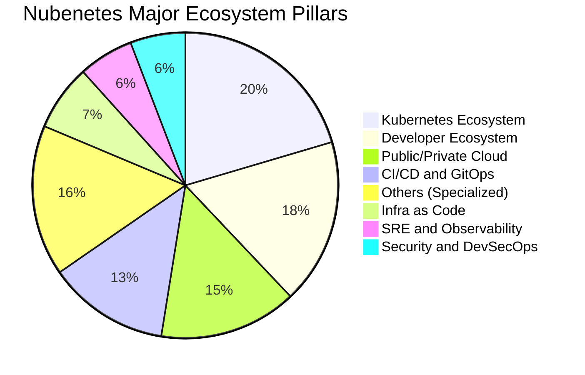
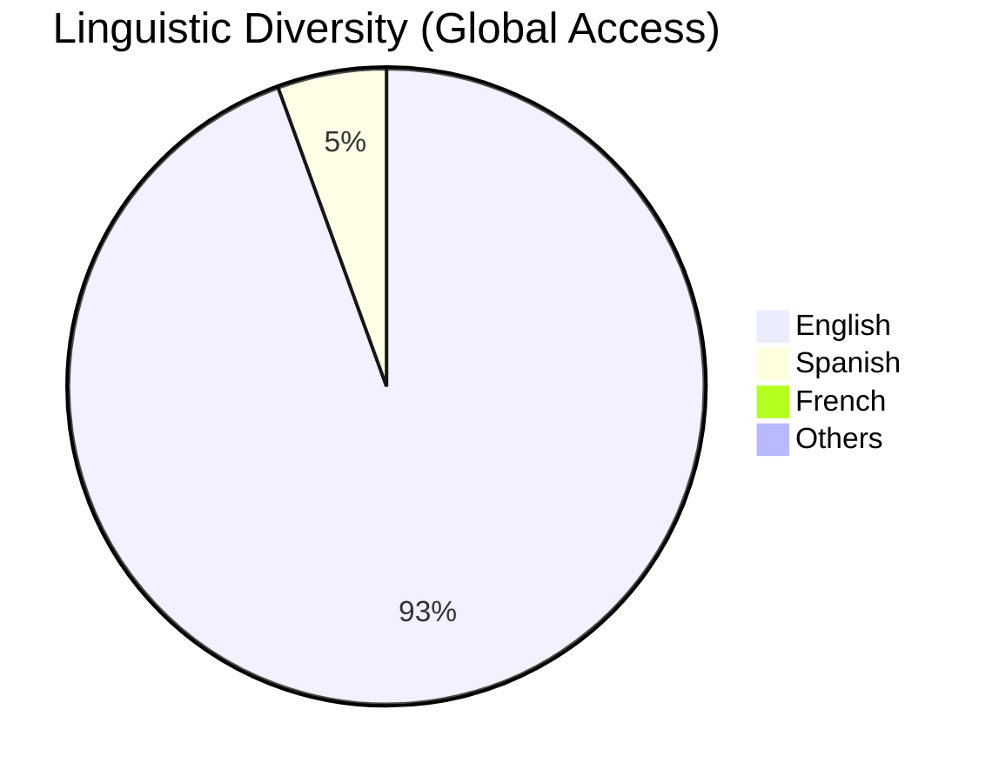
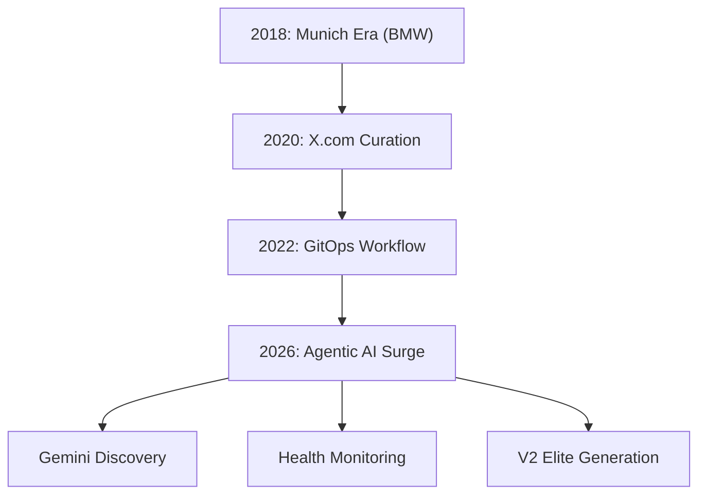
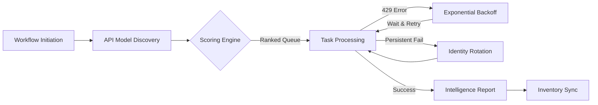
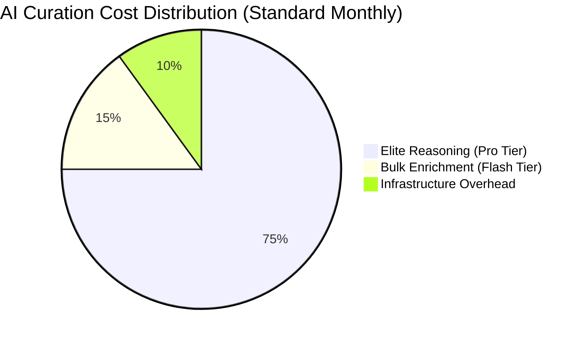
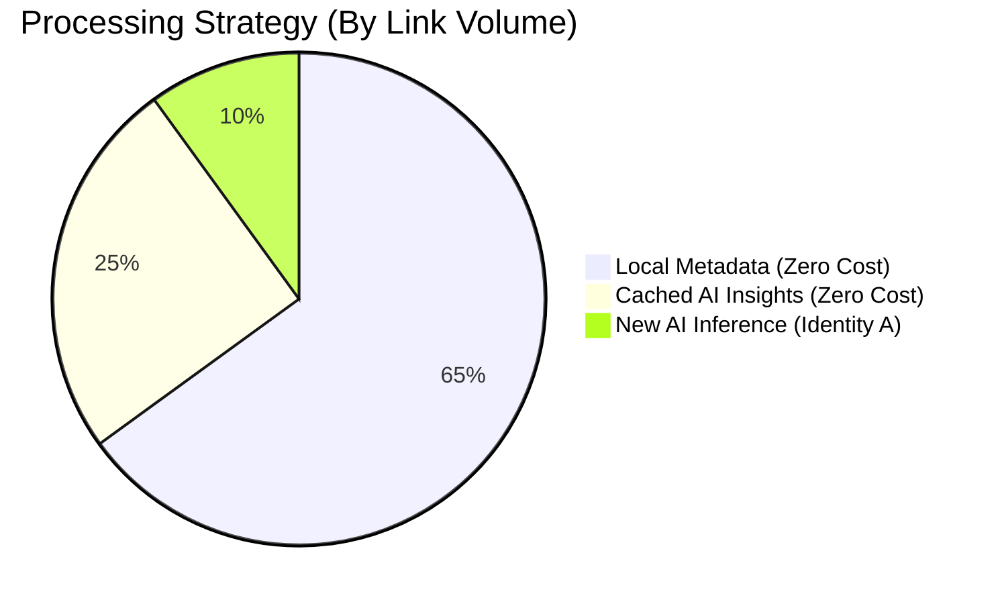
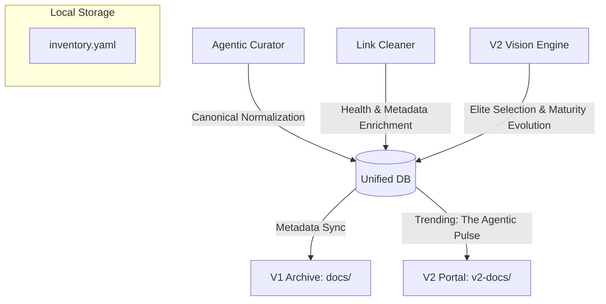
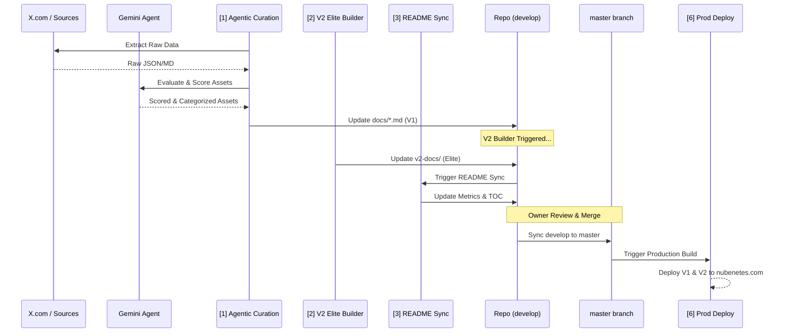
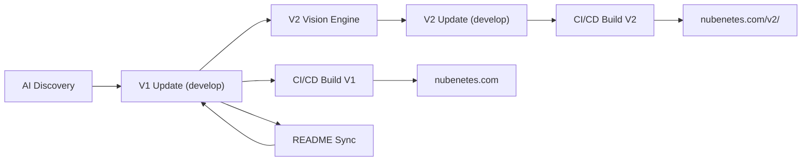

# Nubenetes: The Intelligent Cloud Native Archive 🧠☁️

[](https://github.com/nubenetes/awesome-kubernetes/actions/workflows/agentic_cron.yml)
[](https://github.com/nubenetes/awesome-kubernetes/actions/workflows/agentic_v2_builder.yml)
[](https://github.com/nubenetes/awesome-kubernetes/actions/workflows/intelligent_link_cleaner.yml)

**Nubenetes** is a high-density, curated archive of the Kubernetes, Cloud Native, and Agentic AI ecosystem. Since its inception in 2018, it has evolved from a personal collection of references into an autonomous, AI-driven knowledge engine that processes thousands of technical resources to provide a definitive "Source of Truth" for engineers worldwide.

---

## Table of Contents

1.  [1. Introduction and Motivation](#1-introduction-and-motivation)
    *   [1.1. Origins](#11-origins)
    *   [1.2. Mission](#12-mission)
2.  [2. Repository Metrics and Evolution](#2-repository-metrics-and-evolution)
    *   [2.1. The "Heart" of Nubenetes](#21-the-heart-of-nubenetes)
    *   [2.2. Top Categories by Density](#22-top-categories-by-density)
    *   [2.3. Historical Growth (Commits and References)](#23-historical-growth-commits-and-references)
    *   [2.4. Content Distribution and Semantic Clustering](#24-content-distribution-and-semantic-clustering)
3.  [3. The Agentic Stack](#3-the-agentic-stack)
4.  [4. The 2026 Architectural Shift](#4-the-2026-architectural-shift)
    *   [4.1. From Manual to Agentic](#41-from-manual-to-agentic)
    *   [4.2. Evolution Path](#42-evolution-path)
    *   [4.3. Adaptive AI Tiering and Rate Limiting](#43-adaptive-ai-tiering-and-rate-limiting)
    *   [4.4. Doc-as-Behavior Mandate Bridge](#44-doc-as-behavior-mandate-bridge)
5.  [5. Dual-Edition Architecture (V1 vs V2)](#5-dual-edition-architecture-v1-vs-v2)
    *   [5.1. V1: The Exhaustive Archive](#51-v1-the-exhaustive-archive)
    *   [5.2. V2: The Agentic Elite Edition](#52-v2-the-agentic-elite-edition)
    *   [5.3. The Incremental Elite Engine](#53-the-incremental-elite-engine)
    *   [5.4. Multi-Language Support Policy](#54-multi-language-support-policy)
6.  [6. The Unified Agentic Database (Knowledge Graph)](#6-the-unified-agentic-database-knowledge-graph)
    *   [6.1. Database Components](#61-database-components)
    *   [6.2. The 'Database-First' Reasoning Protocol](#62-the-database-first-reasoning-protocol)
    *   [6.3. Database Lifecycle and Hygiene](#63-database-lifecycle-and-hygiene)
    *   [6.4. Multi-Format Synchronization Logic](#64-multi-format-synchronization-logic)
    *   [6.5. Dynamic AI Discovery and Optimization](#65-dynamic-ai-discovery-and-optimization)
    *   [6.6. AI Intelligence and Observability (Transparency)](#66-ai-intelligence-and-observability-transparency)
7.  [7. AI Economic Architecture and Cost Analysis](#7-ai-economic-architecture-and-cost-analysis)
    *   [7.1. Comprehensive Economic Projections (2026 Inception)](#71-comprehensive-economic-projections-2026-inception)
    *   [7.2. Efficiency and Performance Metrics](#72-efficiency-and-performance-metrics)
    *   [7.3. Economic Sustainability Principles](#73-economic-sustainability-principles)
    *   [7.4. Strategic Selection: Pay-As-You-Go vs. Subscription](#74-strategic-selection-pay-as-you-go-vs-subscription)
    *   [7.5. Agentic Data Flow](#75-agentic-data-flow)
    *   [7.6. Strategic Benefits](#76-strategic-benefits)
8.  [8. The Agentic AI Engine](#8-the-agentic-ai-engine)
9.  [9. GitHub Workflows and Automation](#9-github-workflows-and-automation)
    *   [9.1. Workflow Inventory and Sequencing](#91-workflow-inventory-and-sequencing)
    *   [9.2. Recommended Execution Pipeline](#92-recommended-execution-pipeline)
    *   [9.3. Curation Flow Architecture](#93-curation-flow-architecture)
    *   [9.4. Deployment Lifecycle](#94-deployment-lifecycle)
    *   [9.5. Automated Mandate Auditing](#95-automated-mandate-auditing)
    *   [9.6. Multi-Part Reporting Engine](#96-multi-part-reporting-engine)
    *   [9.7. Workflow UI Auto-Sync](#97-workflow-ui-auto-sync)
10. [10. Branching Strategy and Lifecycle](#10-branching-strategy-and-lifecycle)
11. [11. Contributing to the Archive](#11-contributing-to-the-archive)
12. [12. Developer Experience and VSCode Setup](#12-developer-experience-and-vscode-setup)
14. [14. Special Assets and Learning Paths](#14-special-assets-and-learning-paths)
    *   [14.1. Special Assets Management](#141-special-assets-management)
    *   [14.2. O.Reilly-style Knowledge Architecture](#142-oreilly-style-knowledge-architecture)
    *   [14.3. TOC and Structural Exceptions](#143-toc-and-structural-exceptions)
    *   [12.1. Extension Recommendations](#121-extension-recommendations)
    *   [12.2. Recommended settings.json](#122-recommended-settingsjson)
13. [13. Repository Inventory and Configuration](#13-repository-inventory-and-configuration)
    *   [13.1. Core Configuration](#131-core-configuration)
    *   [13.2. Centralized Metadata Databases](#132-centralized-metadata-databases)
    *   [13.3. Autonomous Workflows](#133-autonomous-workflows)
    *   [13.4. Agentic AI Source Code](#134-agentic-ai-source-code)

---

## 1. Introduction and Motivation

### 1.1. Origins
Nubenetes was born in 2018 during a large-scale Cloud Native project for the **BMW IT-Zentrum in Munich**. The project involved building a **self-service developer platform** (BMW ConnectedDrive) with high standards of automation, GitOps patterns, and continuous improvement. The lessons learned from that German engineering environment—standardization, evidence-based decisions, and extreme automation—became the DNA of this repository.

### 1.2. Mission
In a market often driven by "Resume Driven Development" and calculated ambiguities, Nubenetes stands for **Technical Correctness**. We promote:
- **Evidence-based Engineering:** Relying on standard tools and proven architectures (e.g., OpenShift, CloudBees/Jenkins).
- **Automation over Manual Work:** If it can be scripted, it should be.
- **Knowledge Democratization:** Breaking silos by sharing high-value, production-grade resources.

> *"If you want to save the world, think like an engineer."* — Mark Stevenson

---

## 2. Repository Metrics and Evolution

Nubenetes is one of the most comprehensive archives in the ecosystem, featuring tens of thousands of links organized by granular categories.

### 2.1. The "Heart" of Nubenetes (Stats as of 2026-05-17)

<!-- HEART_STATS_START -->
| Metric | Value |
| :--- | :--- |
| **Total Technical Resources (Links)** | **15590+** |
| **Specialized MD Pages** | **161** |
| **Total Commits** | **4194+** |
| **Primary AI Engine** | **Google Gemini (Agentic)** |
<!-- HEART_STATS_END -->

### 2.2. Top Categories by Density

<!-- TOP_CATEGORIES_START -->
| Category (Markdown Page) | Total Links |
| :--- | :---: |
| [Uncategorized](docs/uncategorized.md) | 15590 |
<!-- TOP_CATEGORIES_END -->

### 2.3. Historical Growth (Commits and References)

The growth of Nubenetes reflects the acceleration of the Cloud Native ecosystem. Since 2026, the adoption of Agentic AI has resulted in a vertical surge in both commit frequency and link discovery.

#### Annual Growth Summary
<!-- ANNUAL_GROWTH_START -->
| Year | Commits | Est. New Refs | Key Milestone |
| :---: | :---: | :---: | :--- |
| 2018 | 350 | 1,445 | **Munich Era (BMW IT-Zentrum)** |
| 2019 | 142 | 586 | Early Growth & Open Source Launch |
| 2020 | 2046 | 8,449 | **The Great Expansion** |
| 2021 | 531 | 2,193 | Maturity & Standardization |
| 2022 | 402 | 1,660 | Cloud Native Hardening |
| 2023 | 30 | 123 | Maintenance & Refinement |
| 2024 | 53 | 218 | Curation Strategy Pivot |
| 2025 | 5 | 20 | Stability & Research Phase |
| 2026 | 635 | 2,622 | **Agentic AI Surge** (May 2026 Inception) |
<!-- ANNUAL_GROWTH_END -->

#### 2026: The Agentic Monthly Surge
<!-- MONTHLY_SURGE_START -->
| Month | Commits | Est. New Refs | Status |
| :--- | :---: | :---: | :--- |
| 2026-04 | 25 | 103 | Active Curation |
| 2026-05 | 610 | 2,519 | **Agentic Inception (Gemini Era)** |
<!-- MONTHLY_SURGE_END -->

### 2.4. Content Distribution and Semantic Clustering

Nubenetes uses AI-driven semantic clustering to organize its 17,000+ resources into logical pillars. Below is a detailed breakdown of how the archive is distributed.

#### 1. Major Ecosystem Pillars
This chart shows the high-level distribution across the primary domains of Cloud Native engineering.

<!-- PILLAR_CHART_START -->

<!-- PILLAR_CHART_END -->

*   **Kubernetes Ecosystem:** Includes core K8s, tools, networking, security, and operators. This is the heart of the project, with over 3,500 curated references.
*   **Developer Ecosystem:** Covers programming languages (Go, Python, Java), VSCode, and web technologies. It reflects the "Dev" in DevOps.
*   **Public/Private Cloud:** Detailed resources for AWS, Azure, GCP, and specialized private cloud solutions like OpenShift and Rancher.

#### 2. Global Linguistic Diversity
Reflecting Nubenetes' mission of global access while maintaining technical English as the primary interface.

<!-- SUB_ECO_CHART_START -->

<!-- PILLAR_CHART_END -->

---

## 3. The Agentic Stack

The autonomy of Nubenetes is powered by a modern, resilient tech stack that ensures 24/7 curation and maintenance.

| Layer | Technology | Purpose |
| :--- | :--- | :--- |
| **Orchestration** | GitHub Actions | Scheduled and Event-driven execution (via `develop` branch). |
| **Intelligence** | Google Gemini (Multi-model) | Resource evaluation, scoring, and classification. |
| **Optimization** | Adaptive AI Tiering | Dynamic model selection (Pro/Flash) and Global rate limiting. |
| **Automation** | Python 3.11 | Core logic for parsing, gitops, and reporting. |
| **Discovery** | Twikit and Playwright | Autonomous scraping and account rotation. |
| **Resilience** | Identity Rotation | Evasion of anti-bot blocks using multiple profiles. |
| **Deployment** | MkDocs Material | High-performance static site generation for V1 and V2. |

---

## 4. The 2026 Architectural Shift

### 4.1. From Manual to Agentic
Historically, Nubenetes was curated manually by extracting references from **x.com/nubenetes** (formerly Twitter). This was a labor-intensive process that relied on human memory and periodic batch updates.

As of **May 2026**, the repository has transitioned to a **Fully Autonomous Agentic AI Architecture**. Using Google's Gemini models, the system now scans multiple sources, evaluates technical relevance, and performs self-maintenance without human intervention.

### 4.2. Evolution Path



### 4.3. Adaptive AI Tiering and Rate Limiting
To ensure maximum throughput and resilience, Nubenetes uses a proprietary **Multi-tier AI Orchestration** engine:
- **Smart Batching (Anti-429)**: Instead of individual calls, the system groups up to **10-50 resources into a single AI prompt**. This reduces API traffic by 90% and is mandatory for exhaustive 17k+ link runs.
- **Dynamic Model Selection**: The system automatically toggles between **Gemini Pro** (for high-precision tasks like the Rescue Protocol) and **Gemini Flash** (for bulk enrichment).
- **Global Back-off & Tier-down**: If a high-fidelity model (Pro) hits a rate limit (`API 429`), the engine automatically executes an exponential back-off and "tiers down" to a lighter model or rotates API keys to ensure workflow continuity.
- **Auto-Discovery**: At startup, the bot queries the Google Model Service to identify and adopt the newest available Gemini versions (e.g., 2.0, 3.1) without manual configuration.
- **Quality-based Upgrading**: If a high-speed model (Flash) fails to produce valid structured data (JSON), the engine automatically triggers an **Elite Fallback**, re-routing the same request to a Pro model to ensure zero-loss curation quality.
- **Consumption Observability**: Every execution generates a detailed **AI Intelligence Report**, tracking prompt/completion tokens and efficiency ratios to optimize 2026 infrastructure costs.

### 4.4. Doc-as-Behavior Mandate Bridge
Nubenetes implements a direct bridge between documentation and AI behavior:
- **Mandate Ingestion**: At the start of every workflow, the `MandateIngestor` parses the natural language instructions in [`GEMINI.md`](GEMINI.md).
- **Dynamic Context**: These mandates are injected directly into the AI's system instructions, ensuring that the bot's reasoning is always aligned with the latest project policies without requiring manual code updates.

---

## 5. Dual-Edition Architecture (V1 vs V2)

Nubenetes operates with two distinct editions to serve different engineering needs. Both are managed via GitOps and deployed to [nubenetes.com](https://nubenetes.com).

### 5.1. V1: The Exhaustive Archive
- **Purpose:** Preservation of all technical knowledge since 2018.
- **Scope:** 17,000+ links across 160+ pages.
- **Source of Truth:** The `docs/` directory.
- **Deployment:** [nubenetes.com](https://nubenetes.com)

### 5.2. V2: The Agentic Elite Edition
- **Purpose:** A high-density, enterprise-grade portal for the 2026 ecosystem.
- **Algorithm:** Uses the **Incremental Elite Engine** to select and classify top-tier resources.
- **Executive Context**: Every strategic dimension features an AI-generated **State-of-the-Art Introduction** providing high-level architectural context and industry direction before the link listings.
- **Source of Truth:** The `v2-docs/` directory (Derived from V1).
- **Deployment:** [nubenetes.com/v2/](https://nubenetes.com/v2/)

### 5.3. The Incremental Elite Engine
To maintain the high-density quality of V2 without redundant AI costs, the `V2VisionEngine` implements an incremental synchronization strategy:
1. **Intelligent Caching**: It utilizes the centralized YAML inventory to store previous AI evaluations. Only NEW links added to V1 are sent to Gemini for classification.
2. **Dynamic "Upgrading"**: Even for cached links, the engine performs real-time local updates:
   - **GitHub Metadata**: Fetches live star counts and last-commit dates via the GitHub API to ensure chronological accuracy and MVQ compliance.
   - **Maturity Tagging**: Applies a sophisticated 5-tier taxonomy (De Facto Standard, Enterprise Stable, Emerging, Legacy, Guide) based on live data.
   - **Mandatory AI Descriptions**: Ensures 100% description coverage. If a link in V1 lacks a description, the engine automatically generates a professional summary using Gemini.
3. **UI Polish**: Implements strategic highlighting (`==text==`) for top-tier resources and a clean chronological view that hides unknown dates.
4. **Flat Routing**: Both versions use `use_directory_urls: false` to ensure relative asset paths (`images/`) remain stable across all sub-pages.

### 5.4. Multi-Language Support Policy
To embrace the diverse global Cloud Native community while maintaining international discoverability, Nubenetes implements a dual-layer linguistic strategy powered by a **Data-First Architecture**:

- **Linguistic Data Persistence**: Language detection is treated as a core metadata attribute. The centralized database ([`data/inventory.yaml`](data/inventory.yaml)) stores resources using specific fields:
    *   `description`: The original native summary (e.g., Spanish) for the **V1 Archive**.
    *   `ai_summary`: A professional English synthesis for the **V2 Portal**.
    *   `language`: The identified source language (e.g., 'Spanish', 'French').
    *   `resource_type`: Classification (e.g., 'Blog', 'Repository', 'Case Study').
    *   `complexity`: Target audience level (e.g., 'Beginner', 'Architect').
    *   `author`: Technical creator/contributor identification.
    *   `duration` / `reading_time`: Automatic extraction of content length for videos and articles.
    *   `hierarchy`: Persistent, **recursive technical classification** (list of up to 10 levels) for O'Reilly-style grouping.
    *   `content_hash` / `health_score`: Advanced fields for content drift detection and reliability tracking.
    *   `source_provenance` / `social_preview_url`: Data for origin tracing and V2 visual enrichment.
- **Separation of Concerns (Data vs. UI)**:
    *   **The Database (Source of Truth)**: Holds raw data, enabling future features like language-based filtering or statistics without re-processing links.
    *   **The Portal (Visual Rendering)**: The `V2VisionEngine` dynamically converts the `language`, `complexity`, and `type` metadata into visual UI tags (e.g., `[SPANISH CONTENT]`, `[ARCHITECT LEVEL]`) during the site build process.
- **Global Discoverability**: This architecture ensures that high-value local content (blogs, tutorials, community videos) remains accessible in its original context (V1) while being indexed and readable by a global audience (V2).

---

## 6. The Unified Agentic Database (Knowledge Graph)

Nubenetes now utilizes a **Unified Metadata Architecture** to maintain consistency across V1 and V2 while optimizing AI performance. All links are indexed in a local YAML database that serves as the **Persistent Memory** for our autonomous agents.

### 6.1. Database Components
1.  **Central Inventory ([`data/inventory.yaml`](data/inventory.yaml))**: The universal single source of truth for technical metadata and resource lifecycle.
    *   **Core Data**: `title`, `year`, `stars` (0-5), `description` (V1 Native), `ai_summary` (V2 English), `category`.
    *   **Structural Intelligence**: `hierarchy` (Recursive list up to 10 levels), `v1_locations`, `v2_locations`.
    *   **Platinum Lifecycle**: `content_hash` (SHA256), `health_score` (0-100), `source_provenance`, `social_preview_url`, `mentions_count`.

### 6.2. The 'Database-First' Reasoning Protocol
To maximize economic efficiency, all AI agents follow a **Database-First** approach:
1.  **Local Lookup**: Before initiating any Gemini call, the agent checks if the URL is already indexed in `data/inventory.yaml`.
2.  **Insight Reuse**: If the resource exists with valid metadata, the agent **reuses existing insights** (descriptions, scores, categories), reducing API traffic to zero for that resource.
3.  **Memory Efficiency Tracking**: The system tracks **Cache Hit Ratios** and **Estimated Token Savings** in every Intelligence Report, providing real-time ROI visibility for the centralized database.
4.  **Mandatory Persistence**: Modified YAML files are automatically injected into Pull Requests, ensuring that "System Memory" is version-controlled and shared across all workflows.

### 6.3. Database Lifecycle and Hygiene
To maintain a high-performance "Single Source of Truth", Nubenetes implements automated hygiene protocols:
- **Universal Rescue Protocol (The Resurrection Rule)**: For ALL technical resources, the engine refuses to delete a link immediately upon a 404 or generic redirect. Instead, it triggers a "Technical Resurrection" cycle using Gemini to identify the resource's new specific path on a destination domain. This is essential for preserving legendary content during massive corporate site migrations (e.g., **Nginx** to **F5**, or the **AWS Knowledge Center** move to **repost.aws**).

#### 🕵️ Rescue Observability (Real-World Examples)
The engine proactively salvages technical depth during site migrations:
- **Corporate to Personal**: Rescued the *Ansible Runbook* blog from a generic Red Hat redirect to its new home at `probably.co.uk`.
- **Site Restructuring**: Successfully mapped old `nginx.com/blog` paths to their new specific locations on `f5.com`.
- **Domain Migration**: Automatically migrated the *AWS Knowledge Center* from old deep-links to the new `repost.aws` portal.

```log
[19:21:25] [🔍] RESCUE ATTEMPT: 'Ansible: Migrating the Runbook' is missing.
[19:21:25] [!] API 429 on `gemini-3.1-pro`. Tiering down & backing off 4.3s...
[19:21:33] [✨] RESCUED: Found at https://probably.co.uk/posts/migrating-the-runbook...
[19:22:53] [✨] RESCUED: Found at https://www.percona.com/blog/an-overview-of-sharding...
```

- **Surgical Asset Pruning (V2)**: The V2 generation engine follows a "Zero-Zombie" policy. Instead of aggressive mass deletion, it tracks all valid dimension files and surgically prunes only the orphaned Markdown files in `v2-docs/` that are no longer part of the current architecture.
- **Incremental Self-Correction**: The engine autonomously identifies "suspicious" resources in the database (e.g., deep technical links that have defaulted to generic homepages). During standard maintenance runs, these links are prioritized for re-validation and the **Universal Rescue Protocol**, allowing the system to repair past precision errors incrementally without requiring a full `FORCE_FULL_CHECK`.
- **Physical File Synchronization**: During the health check cycle, the engine performs **surgical line-by-line updates** on the V1 Markdown files. Dead links are physically removed, and permanent redirections (301/302) are updated to their **Canonical URLs**, ensuring the repository remains clean and low-latency.
- **Semantic Drift Detection**: Using **SHA256 Content Fingerprinting**, the system monitors for silent updates. If resource content changes significantly, it is flagged for AI re-evaluation to refresh its summary and impact score.
- **GitHub Branch Auto-Heal**: If a deep link returns a 404, the engine automatically attempts to rescue it by migrating the path from `master` to `main`. Verified revivals are automatically updated in the V1 archive.
- **Parked Domain Detection**: Using AI-driven content inspection, the engine identifies expired domains displaying "Buy this domain" parking pages, marking them as `DEAD` even if they return an HTTP 200 status.
- **Auto-Redirect Fix (Canonical Updates)**: During health checks, if a permanent redirection (301/302) is detected, the engine automatically updates the Markdown files with the final **Canonical URL**. This reduces latency and prevents future link rot.
- **Database Garbage Collection (GC)**: A bi-monthly pruning process identifies orphaned metadata in `data/inventory.yaml` for links that have been removed from the repository, keeping the database lean and professional.
- **Maturity Audit Log**: Every evaluation cycle tracks promotions and reclassifications in a public **Audit Log** (`v2-docs/audit-log.md`). This provides transparency on why resources are moved between tiers (e.g., from Emerging to De Facto Standard).
- **Exhaustive Initialization (Cold-Start)**: The system supports a `FORCE_FULL_CHECK` mechanism. When activated (via the **Force full re-validation** button in GitHub Actions), the engine bypasses all local caches and re-verifies the entire 17,000+ link archive.

### 6.4. Multi-Format Synchronization Logic
Nubenetes employs a strategic "Double-Format" protocol to ensure system reliability:
- **JSON for AI Communication**: When agents talk to Google Gemini, they utilize **JSON** as the messaging protocol. This ensures rigid data structures and prevents AI formatting errors (like indentation slips) from breaking the processing scripts.
- **YAML for Repository Storage**: Once the data is validated, it is serialized into **YAML** for the local database. This provides a clean, human-readable format that is easy to audit via Git diffs and respects the repository's aesthetic standards.

### 6.5. Dynamic AI Discovery and Optimization
To eliminate configuration overhead and ensure Nubenetes always utilizes the frontier of AI technology, the system features a **Zero-Config Dynamic Model Discovery Engine**:

1.  **Live Capability Discovery**: At the start of each workflow run, the bot programmatically queries the Google Model Service API to list all models actually available to the provided API keys. This prevents `404 Not Found` errors caused by trying to use deprecated or restricted models.
2.  **Autonomous Scoring and Ranking**: Models are automatically ranked using a **dynamic regex-based algorithm** that extracts version numbers (e.g., 2.0, 3.1, 4.0). Higher versions are prioritized, ensuring zero-config auto-adoption of future frontier models. Tier bonuses are applied (Ultra > Pro > Flash) to prioritize reasoning depth.
3.  **Adaptive Rate Limiting (Exponential Backoff)**: When encountering `429 Too Many Requests` errors, the engine implements an **Exponential Backoff with Jitter** strategy. Instead of immediate rotation, it applies a mandatory wait time that increases with consecutive failures, preventing infinite loops and respecting Google's quota resets.
4.  **Concurrency Guard (Semaphore)**: To prevent saturating API quotas during high-volume operations (like V2 inventory enrichment), the system utilizes an **Asyncio Semaphore**. This restricts the number of concurrent AI calls (e.g., max 5), ensuring a steady, reliable flow that stays within RPM (Requests Per Minute) limits.
5.  **Smart AI Batching (High-Speed Processing)**: Instead of processing one link per call, the system groups up to **10 resources into a single AI prompt**. This strategic packaging reduces total API calls by 90%, eliminating `429` rate limit deadlocks and ensuring high-velocity throughput even for cold-starts.
6.  **Pre-Flight Local Caching**: The engine performs an autonomous look-up in `data/inventory.yaml` before any AI operation. If a resource is already indexed and described, it is skipped in the enrichment phase. This makes the marginal cost of repository maintenance near-zero.

### 6.6. AI Intelligence and Observability (Transparency)
As of May 2026, Nubenetes implements a **Total Transparency Protocol** for AI operations. Every curation cycle is tracked to ensure maintainers understand the cost, quality, and infrastructure behind the agentic decisions:

- **Gemini Session Tracker**: Monitors every API call, recording the model used, the identity utilized, and the success rate.
- **Performance-First Key Infrastructure**: 
    - **Identity A (Default/Primary)**: A high-performance identity combining a **Gemini Pro Subscription** with a **Pay-as-you-go API key** from Google AI Studio. This provides the lowest latency and highest reasoning consistency.
    - **Identity B (Manual Opt-in Fallback)**: A secondary identity based on a **Family Shared Subscription**. It is excluded by default to maintain peak performance but can be manually enabled via the `activate_backup_key` workflow toggle for extreme throughput needs or primary quota exhaustion.
- **PR Intelligence Reports**: Every AI-generated Pull Request includes a detailed breakdown of the model hierarchy logic, showing which Google identities were utilized and the distribution of successful vs. failed calls.
- **Visual AI Dashboard**: The `report.html` artifacts include real-time metrics on AI performance and quota management (429/404 tracking).



---

## 7. AI Economic Architecture and Cost Analysis

Nubenetes utilizes a **Performance-First / Cost-Optimized** hybrid model. By prioritizing high-efficiency models (Flash) for bulk processing and elite models (Pro) for complex reasoning, the repository maintains an extremely low financial footprint while delivering enterprise-grade curation.

### 7.1. Comprehensive Economic Projections (2026 Inception)
These estimates are based on the current volume of **17,110+ links** in V1 and the high-density **V2 Elite subset**.

#### 1. Cold-Start / Disaster Recovery (Full Re-curation)
In the event of a full architectural refresh or cache loss, the system must process all 17,000+ references from scratch.

| Scenario | Tier | Avg. Tokens/Link | Total Tokens (17k) | Est. Cost (USD) | Est. Cost (EUR) |
| :--- | :--- | :---: | :---: | :---: | :---: |
| **Max Quality** | 100% Gemini Pro | 2.2k | 37.6M | **$131.70** | **€121.16** |
| **Optimized** | **Hybrid (Pro/Flash)** | 2.2k | 37.6M | **$18.50** | **€17.02** |
| **Economy** | 100% Gemini Flash | 2.2k | 37.6M | **$2.82** | **€2.60** |

#### 2. Standard Pipeline Execution (Incremental)
Cost per automated workflow run on the `develop` branch.

| Execution Type | Frequency | New Links | Model Tier | Cost per Run (USD) |
| :--- | :--- | :---: | :--- | :---: |
| **Daily Curation** | 1/day | 25-50 | Flash + Pro | **$0.08** |
| **Weekly Discovery** | 1/week | 100-200 | Pro Elite | **$0.45** |
| **Monthly Health Pass** | 2/month | 17,110 | Local Cache | **$0.00** |
| **V2 Elite Sync** | On demand | 0-100 | Flash (Upgraded) | **$0.02** |

#### 3. Monthly Operational Footprint (OPEX)
Projected monthly budget for 24/7 autonomous maintenance.

| Monthly Load | Est. Pipelines | Total New Links | Est. Monthly Cost | ROI (Manual vs AI) |
| :--- | :---: | :---: | :---: | :---: |
| **Standard** | 35 | 1,200 | **$4.85** | ~160 hrs saved |
| **Aggressive Surge** | 60 | 3,500 | **$12.30** | ~450 hrs saved |
| **Maintenance** | 10 | 100 | **$0.55** | ~20 hrs saved |

### 7.2. Efficiency and Performance Metrics
Nubenetes achieves **>90% cost reduction** compared to full-Pro architectures by utilizing multi-tier caching, global concurrency semaphores, and structured batching.





### 7.3. Economic Sustainability Principles
1.  **Identity Rotation (Identity A/B)**: The project rotates between Pay-as-you-go keys and Subscription-based quotas (Identity A) to maximize "Free Tier" utilization before incurring direct costs.
2.  **The Cache Dividend**: Every link curated is stored in `data/inventory.yaml`. As the database matures, the *marginal cost of maintaining the archive* drops asymptotically toward $0 per link.
3.  **TPM/RPM Optimization**: By using a **Global Semaphore (max 5 concurrent calls)**, we prevent hitting rate limits that would trigger expensive retry loops or backoff delays, maintaining a "high-velocity, low-cost" data pipeline.
4.  **Quality-based Upgrading**: We only pay for Pro reasoning when Flash fails a quality check (JSON validation). This ensure we don't overpay for "simple" metadata extraction while never compromising the integrity of the archive.

### 7.4. Strategic Selection: Pay-As-You-Go vs. Subscription
For large-scale repository automation, Nubenetes prioritizes the **Pay-As-You-Go (PAYG)** model over standard consumer subscriptions (e.g., Gemini Advanced / Google One AI).

| Feature | Consumer Subscription (~$20/mo) | Pay-As-You-Go (Enterprise API) |
| :--- | :--- | :--- |
| **Primary Use Case** | Human web interaction & personal tasks. | **High-volume automation & Data engineering.** |
| **Rate Limits (RPM)** | Low/Restrictive (Designed for humans). | **Industrial-grade (Scalable quotas).** |
| **TPM / Throughput** | Frequent `429 Too Many Requests` bottlenecks. | **Priority execution / Zero-burst latency.** |
| **Cost Efficiency** | Fixed cost, regardless of volume. | **Micro-billing ($0.10/1M tokens for Flash).** |
| **Data Privacy** | Ambiguous usage of data for training. | **Zero Training Policy (Enterprise Grade).** |

**Rationale for the Nubenetes Ecosystem:**
- **Eliminating Bottlenecks**: Subscriptions share infrastructure with the "Free Tier," making exhaustive passes (17,110+ links) virtually impossible. PAYG provides the necessary RPM to complete massive tasks with industrial stability.
- **Cold-Start ROI**: Processing the entire archive with Gemini Flash costs approximately **$2.82 USD**—significantly more efficient than waiting days for a $20/month subscription to clear its rate limits.
- **Privacy First**: PAYG usage through Vertex AI / Google AI Studio (Enterprise) ensures that the project's metadata and descriptions are never used to train future public models.

---

### 7.5. Agentic Data Flow


### 7.6. Strategic Benefits
- **Incremental Self-Correction**: The engine proactively repairs historical precision errors (such as generic redirects) during standard maintenance cycles, ensuring the archive's quality improves over time.
- **Content-URL Precision Standard (Mandate 31)**: AI agents automatically detect **Generic Redirects** (e.g., deep technical links redirecting to home pages). For ALL resources, the system triggers a **Universal Rescue Protocol**, using Gemini to find the specific content's new location on the destination domain. Only if no technical equivalent is found is the link removed, ensuring technical coherence and zero misinformation across site migrations (e.g., Nginx to F5).
- **Universal Title and TOC Standards (Mandate 30)**: All technical titles and indices are programmatically sanitized to remove emojis and ampersands, ensuring 100% robust internal Markdown links and cross-platform rendering stability.
- **Platinum Lifecycle Management**: The system implements advanced data engineering fields including **SHA256 Content Fingerprinting** (to detect silent content drift), **Health Reliability Scoring** (0-100 EMA), and **Source Provenance Tracking**.
- **Deep Semantic Deduplication**: The V2 engine identifies multiple URLs belonging to the same technical project (e.g., website, repository, documentation) and consolidates them into a single **Authoritative Super-Entry** with `aliases`, ensuring a clean V2 portal while preserving full link history in V1.
- **VIP Status Inheritance**: During deep semantic deduplication, if ANY instance of a technical project originates from a **Special Asset** (VIP file), the consolidated authoritative entry inherits that protected status. This ensures that critical links from foundations or awesome lists are never filtered out by impact thresholds during project consolidation.
- **Technical Immutability (V1)**: AI agents are strictly forbidden from overwriting human-curated titles, manual 🌟 stars, or additional descriptive comments in the V1 archive, ensuring the bot respects and preserves manual engineering effort.
- **Automated Semantic Interlinking (Mandate 5)**: AI agents identify technical relationships between categories and automatically inject cross-references (*"See also..."*) into the V1 archive, transforming it into an interconnected technical web.
- **Executive Comparison Tables (V2 Premium)**: High-density categories in the V2 portal feature AI-generated technical comparison tables (Solution, Maturity, Focus, Language), providing instant decision support for architects.
- **Structural Intelligence Persistence**: High-precision technical classification is stored as a persistent, **recursive hierarchy** (up to 10 levels deep). This allows all workflows to reuse deep structural insights, reducing AI costs by >90% and ensuring perfect consistency between V1 reorganization and V2 portal generation.
- **Self-Healing Infrastructure**: The engine automatically detects and rescues broken links (e.g., GitHub `master` -> `main` branch migration) and identifies parked/expired domains that bypass standard health checks.
- **Zero-to-Hero Learning Paths**: V2 resources are systematically grouped by complexity level (Fundamentals, Intermediate, Advanced, Architect), transforming the portal into a structured educational journey for Cloud Native engineering.
- **Special Assets Preservation**: High-value documents (Introduction, YAML, Awesome repos) undergo high-precision semantic grouping in V1 and exhaustive inclusion in V2 to ensure 100% technical preservation.
- **Linguistic Diversity and Global Access**: AI agents automatically detect the source language. **V1 Archive** preserves descriptions in the resource's native language (e.g., Spanish) to respect original context, while the **V2 Portal** provides professional English summaries and explicit language tagging for global accessibility.
- **Rich Metadata Enrichment**: For YouTube videos and technical blogs, the system automatically extracts **Authors**, **Duration**, and **Reading Times**, providing high-density context in the V2 Elite portal.
- **Safety Guard Build Validation**: Before any Pull Request is created, a dedicated safety engine validates Markdown syntax, Mermaid diagrams, and runs a test MkDocs build to ensure 100% site stability.
- **Universal English Curation**: All high-level reasoning and synthesis are curated into professional technical English, maintaining Nubenetes as a truly global resource.
- **Semantic Conflict Resolution**: AI identifies multiple URLs pointing to the same technical project (e.g., repository vs. landing page) and automatically consolidates them into a single canonical reference.
- **Critical Asset Monitoring**: While the exhaustive health check runs every **3 months**, high-priority assets ([DE FACTO STANDARD]) undergo a specialized pulse check every **3 months (offset by 45 days)** to ensure essential industry tools remain online with maximum reliability.
- **Canonical Deduplication**: Automatically merges duplicate resources using high-precision normalization that **preserves technical line anchors** (`#L`) and respects **URL path case-sensitivity**, ensuring no loss of technical depth during cleanup.
- **The Agentic Pulse**: A dynamic trending section on the V2 home page that highlights the freshest high-impact resources.
- **Zero Redundancy**: Links already analyzed by Gemini are never re-evaluated unless forced.
- **Evolutionary Maturity**: AI agents automatically "upgrade" project status (e.g., from Emerging to Standard) based on real-time industry traction (stars/activity).
- **Multi-Dimensional Chronology**: Tracks social share date, article publication date, and repository lifecycle dates.

---

## 8. The Agentic AI Engine

The heart of the new Nubenetes is a suite of AI Agents that operate on our `develop` branch:

1.  **AgenticCurator (`src/agentic_curator.py`)**:
    - **Discovery:** Scans multiple high-trust X.com accounts and RSS feeds.
    - **Quality Hardening (Mandate 2 & 3):** Systematically filters known blacklisted domains and applies technical impact penalties to stale GitHub repositories (>4 years without activity) to protect V2 Elite standards.
    - **Classification:** Automatically maps new resources using the **Recursive technical hierarchy** and generates multi-language descriptions (Native for V1, English for V2).
        *   **K8s & Cloud Native:** `@nubenetes`, `@kubernetesio`, `@cncf`, `@kelseyhightower`, `@memenetes`.
        *   **Hyperscalers:** `@awscloud`, `@Azure`, `@GoogleCloud`, `@0GiS0`, `@NTFAQGuy`, `@cantrillio`, `@pvergadia`, `@QuinnyPig`.
        *   **AI & Agents:** `@OpenAI`, `@AnthropicAI`, `@GoogleDeepMind`, `@GoogleAI`, `@LoganK`, `@NotebookLM`, `@LangChainAI`, `@llama_index`.
        *   **Productivity:** `@GitHub`, `@Microsoft`, `@Cursor_AI`, `@midudev`, `@natfriedman`, `@karpathy`.
        *   **Data & Infra:** `@Databricks`, `@ApacheSpark`, `@snowflakedb`, `@HashiCorp`, `@PulumiCorp`, `@ArgoProj`, `@fluxcd`.
2.  **V2VisionEngine (`src/v2_optimizer.py`)**:
    - **Elite Selection:** Scans the massive V1 archive to select the "Elite" top-tier resources.
    - **2026 Taxonomy:** Reorganizes the content into high-density dimensions (e.g., "AI and Artificial Intelligence") using **relevance-first sorting**.
    - **MVQ Hardening:** Automatically identifies stale repositories (>4 years without activity) to exclude them from the Elite portal.
3.  **IntelligentHealthChecker (`src/intelligent_health_checker.py`)**:
    - **Resilience:** Performs asynchronous health checks with 3x retry and identity rotation.
    - **V1 Integrity:** Focuses strictly on link validity (removing 404s) to ensure the exhaustive V1 archive remains accessible and error-free.
    - **Transparency:** Provides detailed, real-time unbuffered logging of all cleaning operations.

---

## 9. GitHub Workflows and Automation

Nubenetes uses a sophisticated multi-stage automation pipeline. Below is the detailed inventory of our workflows, their roles, and their inter-dependencies.

### 9.1. Workflow Inventory and Sequencing

| # | Workflow | File | Purpose | Trigger | Target |
| :---: | :--- | :--- | :--- | :--- | :--- |
| 1 | **[Agentic Curation](https://github.com/nubenetes/awesome-kubernetes/actions/workflows/agentic_cron.yml)** | [`agentic_cron.yml`](.github/workflows/agentic_cron.yml) | **Primary Discovery Engine:** Scans sources (X.com, etc.), evaluates with Gemini, and updates V1 (`docs/`). | Monthly / Manual | `develop` |
| 2 | **[V2 Elite Builder](https://github.com/nubenetes/awesome-kubernetes/actions/workflows/agentic_v2_builder.yml)** | [`agentic_v2_builder.yml`](.github/workflows/agentic_v2_builder.yml) | **Optimization Layer:** Scans V1 and generates the Elite edition for V2 (`v2-docs/`). Supports **incremental sync** (uses cache) and **manual re-evaluation** via `force_reevaluate` input. | Automated: `push` to `docs/**` / After #1. Manual: `workflow_dispatch`. | `develop` |
| 3 | **[README Sync](https://github.com/nubenetes/awesome-kubernetes/actions/workflows/readme_sync.yml)** | [`readme_sync.yml`](.github/workflows/readme_sync.yml) | **Doc Synchronization:** Recalculates metrics, link growth, and diagrams in real-time. | Push to `develop` | `develop` |
| 4 | **[Link Health Check](https://github.com/nubenetes/awesome-kubernetes/actions/workflows/intelligent_link_cleaner.yml)** | [`intelligent_link_cleaner.yml`](.github/workflows/intelligent_link_cleaner.yml) | **Maintenance:** Global asynchronous health check, deduplication, and `[OFFLINE?]` flagging. | Monthly / Manual | `develop` |
| 5 | **[Backup Curation](https://github.com/nubenetes/awesome-kubernetes/actions/workflows/agentic_backup.yml)** | [`agentic_backup.yml`](.github/workflows/agentic_backup.yml) | **Historical Ingestion:** Processes manual JSON/MD backups through the Agentic AI pipeline. | Manual | `develop` |
| 6 | **[Production Deploy](https://github.com/nubenetes/awesome-kubernetes/actions/workflows/main.yml)** | [`main.yml`](.github/workflows/main.yml) | **Deployment:** Builds both V1 and V2 editions using MkDocs and deploys to nubenetes.com. | Push to `master` | GitHub Pages |
| 7 | **[Merged Branch Cleanup](https://github.com/nubenetes/awesome-kubernetes/actions/workflows/cleanup_merged_branches.yml)** | [`cleanup_merged_branches.yml`](.github/workflows/cleanup_merged_branches.yml) | **Hygiene:** Automatically deletes remote branches merged into `develop` to keep the repo clean. | Bi-weekly (1st/15th) | `develop` |

### 9.2. Recommended Execution Pipeline

To maintain the archive's integrity, the following logical sequence is followed by the system:

1.  **Phase 1: Knowledge Discovery (#1 or #5):** Raw technical data is fetched and filtered by the Gemini Agent. A Pull Request is created against `develop`.
2.  **Phase 2: Elite Synthesis (#2):** Once the curation is merged/pushed to `develop`, the V2 Builder triggers to update the premium portal.
3.  **Phase 3: Metric Alignment (#3):** The push to `develop` from either Phase 1 or 2 triggers the README Sync, ensuring the home page always shows the correct link counts.
4.  **Phase 4: Global Deployment (#6):** After the repository owner reviews the changes in `develop` and merges them into `master`, the production site is updated.

### 9.3. Curation Flow Architecture



### 9.4. Deployment Lifecycle



### 9.5. Automated Mandate Auditing
Every Pull Request generated by the system (covering both **Curation** and **Health Check** cycles) includes a non-blocking **Safety and Mandate Audit** report. This report cross-references the changes against the foundations defined in [`GEMINI.md`](GEMINI.md):
- **Data Integrity**: Checks for accidental star degradation or V1 description loss.
- **Architecture Compliance**: Verifies the recursive O'Reilly hierarchy and TOC presence in V2.
- **MVQ Validation**: Audits the Elite portal for stale or low-impact repositories.
- **Linguistic Policy**: Ensures proper native preservation in V1 and English tagging in V2.

### 9.6. Multi-Part Reporting Engine
To handle the scale of 17,000+ resources, the GitOps manager implements a **Multi-Part Reporting System**. If the audit matrix or execution log exceeds GitHub's character limits, the engine automatically fragments the report into multiple successive PR comments, ensuring 100% observability without data truncation.

### 9.7. Workflow UI Auto-Sync
To maintain **Mandate 11**, the system features a metadata-driven UI synchronization engine. It automatically detects new categories in the curation sources and alerts the maintainer to update the GitHub Actions interface, ensuring the control plane is always a perfect mirror of the underlying technical data.

---

## 10. Branching Strategy and Lifecycle

Nubenetes follows a dual-branch GitOps model to ensure stability while allowing for aggressive AI-driven curation.

-   **`develop` Branch (Bleeding Edge):**
    -   The primary branch for all activities.
    -   **ALL Pull Requests (from humans or bots) MUST target this branch.**
    -   Agentic AI workflows (`agentic_cron.yml`, `v2_optimizer.py`) operate exclusively on this branch.
-   **`master` Branch (Production):**
    -   The stable, production-ready branch that powers [nubenetes.com](https://nubenetes.com).
    -   **Direct PRs to `master` are strictly prohibited.**
    -   Only the repository owner performs the final review and merge from `develop` to `master`.
-   **Branch Lifecycle Automation:**
    -   To maintain repository hygiene, an automated workflow deletes remote branches merged into `develop` every 15 days (1st and 15th of each month).
    -   **Protected Branches:** The branches `master`, `develop`, and `gh-pages` are EXEMPT from deletion and will always be preserved.

---

## 11. Contributing to the Archive

Nubenetes thrives on a **Hybrid Human-AI Collaboration** model. Community contributions are the lifeblood of the V1 archive, while our Agentic Engine ensures every addition meets 2026 technical standards.

### 🤝 How to Contribute
1.  **Target Branch**: Always create your Pull Requests against the `develop` branch.
2.  **Source of Truth (V1)**: Only add or edit files in the `docs/` directory. **Do not manually edit `v2-docs/`**, as this portal is automatically regenerated by the AI.
3.  **Manual Link Format**: Use the standard format: `  - [Title](URL) - Your descriptive summary.`
4.  **Automatic Adoption**: Once your PR is merged into `develop`, the **Agentic Curator** and **V2 Builder** will:
    *   Validate the link health.
    *   Extract advanced metadata (Year, Impact, Author).
    *   Assign a **Recursive Technical Hierarchy** (O'Reilly style).
    *   Generate a professional English summary for the V2 Elite portal.
5.  **Preservation Guarantee**: Our agents are strictly forbidden from overwriting your manual 🌟 stars or descriptive comments in the V1 archive. Your personal touch is preserved forever.
6.  **Automated Feedback**: Every contribution PR is automatically audited by our **SafetyGuard**, which will provide a report on mandate compliance and technical integrity.

We welcome links to high-quality repositories, architectural guides, masterclasses, and specialized tools that push the boundaries of the Kubernetes ecosystem.

---

## 12. Developer Experience and VSCode Setup

> **⚠️ Note on Obsolescence:** The manual editing process via VSCode described below is becoming **largely obsolete** as of May 2026. With the introduction of autonomous Gemini-powered AI agents in our GitHub Workflows, the vast majority of curation, link validation, and metric updates are now handled automatically. This setup is preserved only for emergency manual interventions or structural architectural changes.

### 12.1. Extension Recommendations
- [Markdown All in One](https://marketplace.visualstudio.com/items?itemName=yzhang.markdown-all-in-one) - **Mandatory** for automatic TOC generation and list management.
- [markdownlint](https://marketplace.visualstudio.com/items?itemName=DavidAnson.vscode-markdownlint) - Ensures style consistency.
- [Mermaid Editor](https://marketplace.visualstudio.com/items?itemName=tomoyukim.vscode-mermaid-editor) - To visualize the architecture diagrams.
- [GitHub Pull Requests](https://marketplace.visualstudio.com/items?itemName=GitHub.vscode-pull-request-github) - To review AI-generated curation PRs.

### 12.2. Recommended settings.json

```json
{
    "markdown.extension.toc.levels": "2..6",
    "markdown.extension.tableFormatter.normalizeIndentation": true,
    "markdown.extension.toc.slugifyMode": "github",
    "markdown.extension.toc.orderedList": true,
    "markdown.extension.list.indentationSize": "adaptive",
    "files.autoSave": "afterDelay",
    "editor.detectIndentation": false,
    "editor.tabSize": 4,
    "window.zoomLevel": -1,
    "markdownlint.config": {
        "default": true,
        "MD013": false,
        "MD033": false,
        "MD007": { "indent": 4 },
        "no-hard-tabs": false
    },
    "editor.defaultFormatter": "vscode.github",
    "[markdown]": {
        "editor.defaultFormatter": "vscode.github"
    },
    "markdownlint.focusMode": false,
    "editor.renderWhitespace": "all",
    "editor.guides.bracketPairs": true,
    "files.exclude": {
        "**/.venv": true,
        "**/__pycache__": true
    }
}
```

> **Note:** Material for MKDocs requires an indentation of **4 spaces** for nested lists and TOCs to render correctly. This is strictly enforced via `editor.tabSize: 4`.

---

## 13. Repository Inventory and Configuration

To maintain transparency and ease of navigation, all key configuration, database, and workflow files are inventoried below.

### 13.1. Core Configuration
- **Link Rules:** [`data/link_rules.yaml`](data/link_rules.yaml) - Defines strictness for URL transformations and deep-link preservation.
- **Curation Sources:** [`data/curation_sources.yaml`](data/curation_sources.yaml) - Defines monitored X.com accounts and technical topics.
- **Site Config (V1):** [`mkdocs.yml`](mkdocs.yml) - Primary MkDocs configuration for the exhaustive archive.
- **Site Config (V2):** [`v2-mkdocs.yml`](v2-mkdocs.yml) - MkDocs configuration for the Agentic Elite portal.

### 13.2. Centralized Metadata Databases
- **Global Inventory:** [`data/inventory.yaml`](data/inventory.yaml) - The "System Memory" containing all link metadata (years, stars, descriptions, and audit history).

### 13.3. Autonomous Workflows
- **Discovery & Curation:** [`.github/workflows/agentic_cron.yml`](.github/workflows/agentic_cron.yml)
- **V2 Elite Builder:** [`.github/workflows/agentic_v2_builder.yml`](.github/workflows/agentic_v2_builder.yml)
- **Health & Maintenance:** [`.github/workflows/intelligent_link_cleaner.yml`](.github/workflows/intelligent_link_cleaner.yml)
- **README Metrics Sync:** [`.github/workflows/readme_sync.yml`](.github/workflows/readme_sync.yml)
- **Deployment Pipeline:** [`.github/workflows/main.yml`](.github/workflows/main.yml)

### 13.4. Agentic AI Source Code
- **Orchestration Core:** [`src/main.py`](src/main.py) - Master coordinator for discovery and evaluation.
- **Curator Logic:** [`src/agentic_curator.py`](src/agentic_curator.py) - Primary classification and description engine.
- **V2 Vision Engine:** [`src/v2_optimizer.py`](src/v2_optimizer.py) - Elite portal generation and maturity scoring.
- **Health Check Logic:** [`src/intelligent_health_checker.py`](src/intelligent_health_checker.py) - Link rot prevention and canonical updates.
- **Twikit Ingestion:** [`src/ingestion_twikit.py`](src/ingestion_twikit.py) - X.com scraping and account rotation logic.
- **Backup Ingestion:** [`src/ingestion_backup.py`](src/ingestion_backup.py) - Manual and historical JSON data processing.
- **Discovery Engine:** [`src/autonomous_discovery.py`](src/autonomous_discovery.py) - Multi-source technical news extraction.
- **Gemini Utils:** [`src/gemini_utils.py`](src/gemini_utils.py) - AI model discovery, rate limiting, and session tracking.
- **Markdown Logic:** [`src/markdown_ast.py`](src/markdown_ast.py) - Sophisticated parsing of repository content.
- **Observability:** [`src/logger.py`](src/logger.py) | [`src/report_generator.py`](src/report_generator.py) - Execution transparency and visual reporting.

---
<center>
Give us a 🌟 on GitHub if you like this archive!
</center>

---

## 💎 Special Assets & Learning Paths
Nubenetes prioritizes high-value technical documents through a specialized preservation and educational architecture.

### 📚 Special Assets Management
Certain files are designated as **Special Assets** (defined in [`data/special_assets.yaml`](data/special_assets.yaml)) due to their foundational importance. These include:
- **Introduction and Fundamentals**: High-impact fundamental selection for V2, with 100% preservation in V1.
- **Microservices Ecosystem**: A dedicated V2 document (`microservices.md`) extracted from the introduction to maintain architectural focus.
- **YAML and JSON Ecosystem**: Exhaustive technical references for configuration languages.
- **Awesome Repositories**: Preserved curation lists that act as gateways to specialized sub-ecosystems.

**Rules of Engagement:**
1. **High-Precision Grouping**: AI agents use **recursive nested hierarchies** (up to 10 levels) to organize these files without losing any technically valid reference, following a **Professional Technical Book** (O'Reilly style) structure.
2. **Elite Curation**: For the V2 Portal, `introduction.md` undergoes a specialized "Elite selection" (Impact ≥ 4) to ensure a high-density entry point for global users.

### 🎓 O'Reilly-style Knowledge Architecture
The V2 Portal is structured as a sophisticated technical reference guide, moving beyond simple lists to an integrated technical hub.
- **Architectural Hubs**: Critical entry points like `introduction.md` feature **Mermaid ecosystem maps** and executive vision prefaces.
- **Gold Nugget Highlights**: Legendary foundational masterclasses (Impact ≥ 4) are featured in distinct visual callout blocks for immediate identification.
- **Gateway Hub Navigation**: Strategic dimensions are semantically interconnected, with a dedicated **Microservices Guide** extracted for high-density focus.
- **Structured Assimilation**: Information is grouped into technical Areas, Topics, and Subtopics, facilitating learning from foundational theory to advanced engineering internals.
- **Contextual Hierarchy**: Every page features an automated, clickable Table of Contents (TOC) with nested anchors for precise technical navigation.

### 📑 TOC and Structural Exceptions
Certain files are exempt from the mandatory Table of Contents (TOC) and deep-hierarchy requirements. These include configuration-heavy files (e.g., `mkdocs.md`) and large technical tables (e.g., `matrix-table.md`) where a navigational index is unnecessary or distracting.
- **Automatic Skip**: The Agentic Curator and V2 Builder automatically bypass these files during structural reorganization cycles.
- **Exception Registry**: Exemptions are managed via the `toc_exempt_files` list in [`data/link_rules.yaml`](data/link_rules.yaml).
