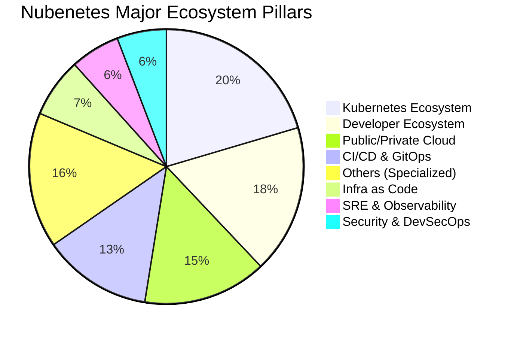
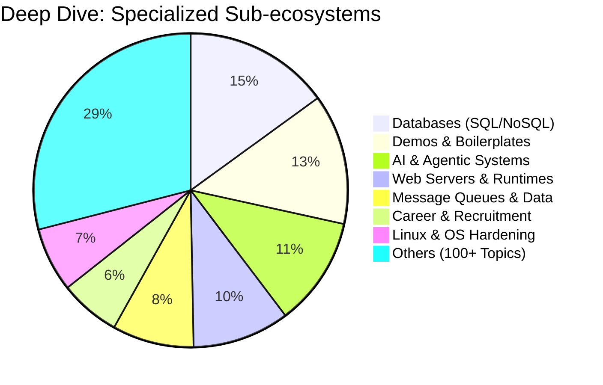
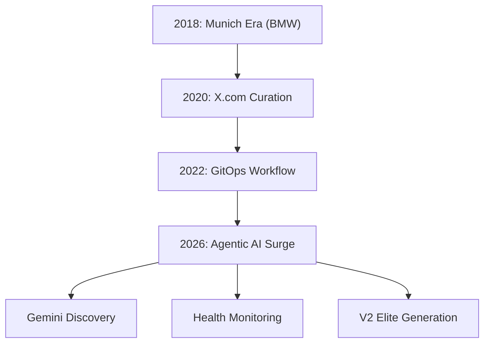
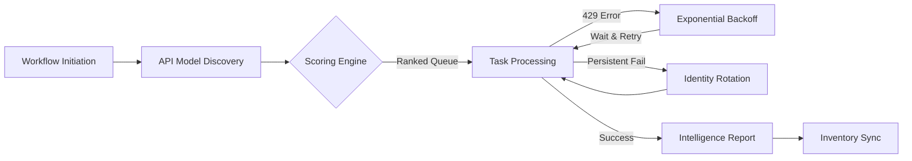
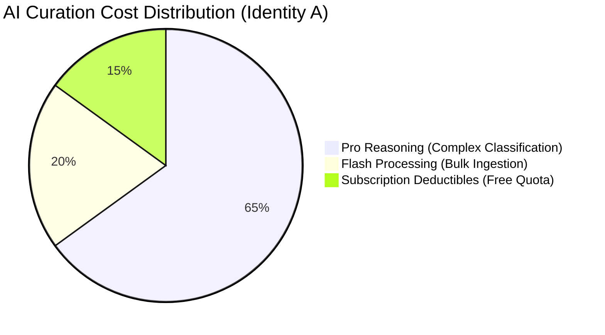
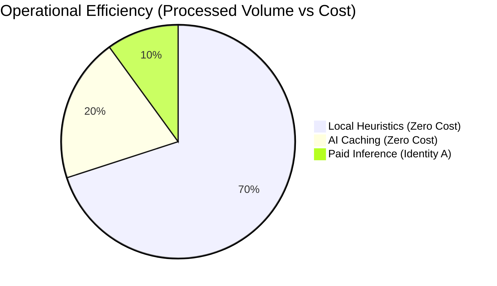
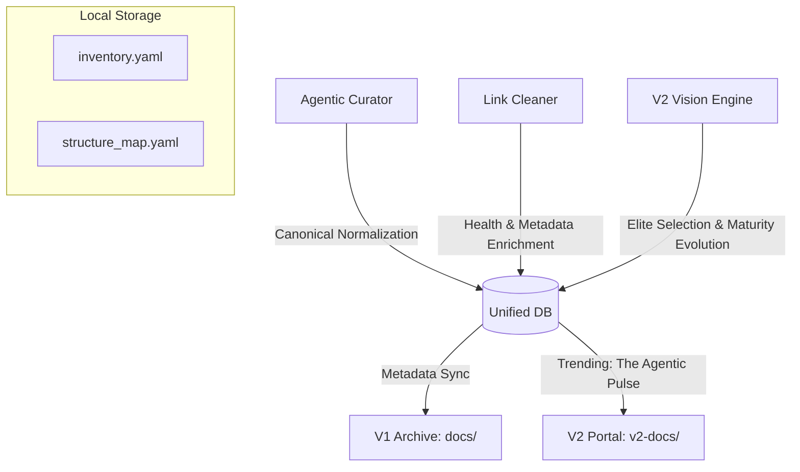
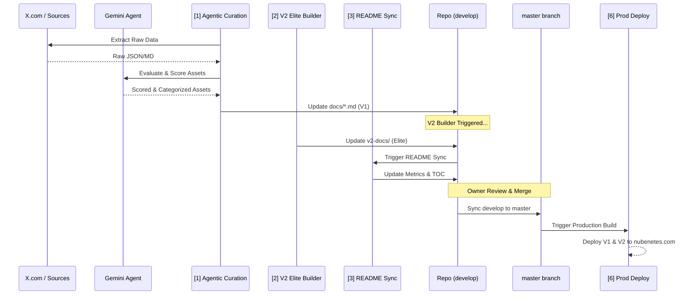
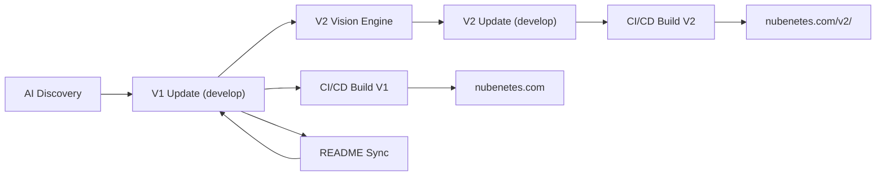

# Nubenetes: The Intelligent Cloud Native Archive 🧠☁️

[](https://github.com/nubenetes/awesome-kubernetes/actions/workflows/agentic_cron.yml)
[](https://github.com/nubenetes/awesome-kubernetes/actions/workflows/agentic_v2_builder.yml)
[](https://github.com/nubenetes/awesome-kubernetes/actions/workflows/intelligent_link_cleaner.yml)

**Nubenetes** is a high-density, curated archive of the Kubernetes, Cloud Native, and Agentic AI ecosystem. Since its inception in 2018, it has evolved from a personal collection of references into an autonomous, AI-driven knowledge engine that processes thousands of technical resources to provide a definitive "Source of Truth" for engineers worldwide.

---

## 📖 Table of Contents

1.  [Introduction & Motivation](#-introduction--motivation)
2.  [Repository Metrics & Evolution](#-repository-metrics--evolution)
    *   [Top Categories by Density](#top-categories-by-density)
    *   [Historical Growth (Commits & References)](#historical-growth-commits--references)
    *   [Content Distribution](#content-distribution)
3.  [The 2026 Architectural Shift](#-the-2026-architectural-shift)
    *   [From Manual to Agentic](#from-manual-to-agentic)
    *   [Evolution Path](#evolution-path)
4.  [Dual-Edition Architecture (V1 vs V2)](#-dual-edition-architecture-v1-vs-v2)
    *   [V1: The Exhaustive Archive](#v1-the-exhaustive-archive)
    *   [V2: The Agentic Elite Edition](#v2-the-agentic-elite-edition)
    *   [Comparison Matrix](#comparison-matrix)
5.  [The Agentic Stack](#-the-agentic-stack)
6.  [The Agentic AI Engine](#-the-agentic-ai-engine)
7.  [GitHub Workflows & Automation](#-github-workflows--automation)
    *   [Workflow Inventory](#workflow-inventory)
    *   [Curation Flow Architecture](#curation-flow-architecture)
8.  [Branching Strategy & Lifecycle](#-branching-strategy--lifecycle)
9.  [Developer Experience & VSCode Setup](#-developer-experience--vscode-setup)

---

## 🌟 Introduction & Motivation

### Origins
Nubenetes was born in 2018 during a large-scale Cloud Native project for the **BMW IT-Zentrum in Munich**. The project involved building a **self-service developer platform** (BMW ConnectedDrive) with high standards of automation, GitOps patterns, and continuous improvement. The lessons learned from that German engineering environment—standardization, evidence-based decisions, and extreme automation—became the DNA of this repository.

### Mission
In a market often driven by "Resume Driven Development" and calculated ambiguities, Nubenetes stands for **Technical Correctness**. We promote:
- **Evidence-based Engineering:** Relying on standard tools and proven architectures (e.g., OpenShift, CloudBees/Jenkins).
- **Automation over Manual Work:** If it can be scripted, it should be.
- **Knowledge Democratization:** Breaking silos by sharing high-value, production-grade resources.

> *"If you want to save the world, think like an engineer."* — Mark Stevenson

---

## 📊 Repository Metrics & Evolution

Nubenetes is one of the most comprehensive archives in the ecosystem, featuring tens of thousands of links organized by granular categories.

### The "Heart" of Nubenetes (Stats as of 2026-05-16)

| Metric | Value |
| :--- | :--- |
| **Total Technical Resources (Links)** | **17110+** |
| **Specialized MD Pages** | **161** |
| **Total Commits** | **4113+** |
| **Primary AI Engine** | **Google Gemini (Agentic)** |

### Top Categories by Density

| Category (Markdown Page) | Total Links |
| :--- | :---: |
| [Kubernetes](docs/kubernetes.md) | 1147 |
| [Kubernetes Tools](docs/kubernetes-tools.md) | 739 |
| [Terraform](docs/terraform.md) | 639 |
| [Demos](docs/demos.md) | 538 |
| [Git](docs/git.md) | 497 |
| [Azure](docs/azure.md) | 484 |
| [Jenkins](docs/jenkins.md) | 458 |
| [Devsecops](docs/devsecops.md) | 407 |
| [Managed Kubernetes In Public Cloud](docs/managed-kubernetes-in-public-cloud.md) | 379 |
| [Monitoring](docs/monitoring.md) | 346 |

### Historical Growth (Commits & References)

The growth of Nubenetes reflects the acceleration of the Cloud Native ecosystem. Since 2026, the adoption of Agentic AI has resulted in a vertical surge in both commit frequency and link discovery.

#### Annual Growth Summary
| Year | Commits | Est. New Refs | Key Milestone |
| :---: | :---: | :---: | :--- |
| 2018 | 350 | 1,445 | **Munich Era (BMW IT-Zentrum)** |
| 2019 | 142 | 586 | Early Growth & Open Source Launch |
| 2020 | 2046 | 8,449 | **The Great Expansion** (Global Lockdowns) |
| 2021 | 531 | 2,193 | Maturity & Industry Standardization |
| 2022 | 402 | 1,660 | Cloud Native Hardening & GitOps Era |
| 2023 | 30 | 123 | Maintenance & Refinement |
| 2024 | 53 | 218 | Curation Strategy Pivot |
| 2025 | 5 | 20 | Stability & Research Phase |
| 2026 | 554 | 2,288 | **Agentic AI Surge** (May 2026 Inception) |

#### 2026: The Agentic Monthly Surge
| Month | Commits | Est. New Refs | Status |
| :--- | :---: | :---: | :--- |
| 2026-04 | 25 | 103 | Active Curation |
| 2026-05 | 529 | 2,184 | **Agentic Inception (Gemini Era)** |

### Content Distribution & Semantic Clustering

Nubenetes uses AI-driven semantic clustering to organize its 17,000+ resources into logical pillars. Below is a detailed breakdown of how the archive is distributed.

#### 1. Major Ecosystem Pillars
This chart shows the high-level distribution across the primary domains of Cloud Native engineering.



*   **Kubernetes Ecosystem:** Includes core K8s, tools, networking, security, and operators. This is the heart of the project, with over 3,500 curated references.
*   **Developer Ecosystem:** Covers programming languages (Go, Python, Java), VSCode, and web technologies. It reflects the "Dev" in DevOps.
*   **Public/Private Cloud:** Detailed resources for AWS, Azure, GCP, and specialized private cloud solutions like OpenShift and Rancher.

#### 2. Deep Dive: Specialized Sub-ecosystems
To better understand the "Others" category, we break down the specialized technical domains that form the long-tail of Nubenetes.



*   **AI & Agentic Systems:** A rapidly growing category since May 2026, focusing on Gemini, MCP, and AI Agents. This is the new frontier of Cloud Native.
*   **Databases:** Deep coverage of relational (PostgreSQL/Crunchy) and NoSQL databases, including database version control with Liquibase.
*   **Demos:** High-value repositories with ready-to-use production boilerplates, perfect for "Day 0" projects.

---

## 🦾 The Agentic Stack

The autonomy of Nubenetes is powered by a modern, resilient tech stack that ensures 24/7 curation and maintenance.

| Layer | Technology | Purpose |
| :--- | :--- | :--- |
| **Orchestration** | GitHub Actions | Scheduled & Event-driven execution (via `develop` branch). |
| **Intelligence** | Google Gemini 1.5 Pro | Resource evaluation, scoring, and classification. |
| **Automation** | Python 3.11 | Core logic for parsing, gitops, and reporting. |
| **Discovery** | Twikit & Playwright | Autonomous scraping and account rotation. |
| **Resilience** | Identity Rotation | Evasion of anti-bot blocks using multiple profiles. |
| **Deployment** | MkDocs Material | High-performance static site generation for V1 and V2. |

---

## 🚀 The 2026 Architectural Shift

### From Manual to Agentic
Historically, Nubenetes was curated manually by extracting references from **x.com/nubenetes** (formerly Twitter). This was a labor-intensive process that relied on human memory and periodic batch updates.

As of **May 2026**, the repository has transitioned to a **Fully Autonomous Agentic AI Architecture**. Using Google's Gemini models, the system now scans multiple sources, evaluates technical relevance, and performs self-maintenance without human intervention.

### Evolution Path



---

## 🏛️ Dual-Edition Architecture (V1 vs V2)

Nubenetes operates with two distinct editions to serve different engineering needs. Both are managed via GitOps and deployed to [nubenetes.com](https://nubenetes.com).

### V1: The Exhaustive Archive
- **Purpose:** Preservation of all technical knowledge since 2018.
- **Scope:** 17,000+ links across 160+ pages.
- **Source of Truth:** The `docs/` directory.
- **Deployment:** [nubenetes.com](https://nubenetes.com)

### V2: The Agentic Elite Edition
- **Purpose:** A high-density, enterprise-grade portal for the 2026 ecosystem.
- **Algorithm:** Uses the **Incremental Elite Engine** to select and classify top-tier resources.
- **Source of Truth:** The `v2-docs/` directory (Derived from V1).
- **Deployment:** [nubenetes.com/v2/](https://nubenetes.com/v2/)

### The Incremental Elite Engine
To maintain the high-density quality of V2 without redundant AI costs, the `V2VisionEngine` implements an incremental synchronization strategy:
1. **Intelligent Caching**: It utilizes `data/v2_cache.json` to store previous AI evaluations. Only NEW links added to V1 are sent to Gemini for classification.
2. **Dynamic "Upgrading"**: Even for cached links, the engine performs real-time local updates:
   - **GitHub Metadata**: Fetches live star counts and last-commit dates via the GitHub API to ensure chronological accuracy and MVQ compliance.
   - **Maturity Tagging**: Applies a sophisticated 5-tier taxonomy (De Facto Standard, Enterprise Stable, Emerging, Legacy, Guide) based on live data.
   - **Mandatory AI Descriptions**: Ensures 100% description coverage. If a link in V1 lacks a description, the engine automatically generates a professional summary using Gemini.
3. **UI Polish**: Implements strategic highlighting (`==text==`) for top-tier resources and a clean chronological view that hides unknown dates.
4. **Flat Routing**: Both versions use `use_directory_urls: false` to ensure relative asset paths (`images/`) remain stable across all sub-pages.

## 📊 The Unified Agentic Database (Knowledge Graph)

Nubenetes now utilizes a **Unified Metadata Architecture** to maintain consistency across V1 and V2 while optimizing AI performance. All links are indexed in a local YAML database that serves as the "Memory" for our autonomous agents.

### Database Components
1.  **Central Inventory (`data/inventory.yaml`)**: Stores global technical metadata.
    *   `title`, `year`, `stars` (0-5), `description` (V1), and `ai_summary` (V2 Elite).
2.  **Structure Map (`data/structure_map.yaml`)**: Tracks the physical presence and formatting of links.
    *   Tracks which `.md` pages contain the link in V1 and V2.
    *   Stores visual state: `is_bold`, `is_highlighted` (`==`).

### Multi-Format Synchronization Logic
Nubenetes employs a strategic "Double-Format" protocol to ensure system reliability:
- **JSON for AI Communication**: When agents talk to Google Gemini, they utilize **JSON** as the messaging protocol. This ensures rigid data structures and prevents AI formatting errors (like indentation slips) from breaking the processing scripts.
- **YAML for Repository Storage**: Once the data is validated, it is serialized into **YAML** for the local database. This provides a clean, human-readable format that is easy to audit via Git diffs and respects the repository's aesthetic standards.

### Dynamic AI Discovery & Optimization
To eliminate configuration overhead and ensure Nubenetes always utilizes the frontier of AI technology, the system features a **Zero-Config Dynamic Model Discovery Engine**:

1.  **Live Capability Discovery**: At the start of each workflow run, the bot programmatically queries the Google Model Service API to list all models actually available to the provided API keys. This prevents `404 Not Found` errors caused by trying to use deprecated or restricted models.
2.  **Autonomous Scoring & Ranking**: Models are automatically ranked using a **dynamic regex-based algorithm** that extracts version numbers (e.g., 2.0, 3.1, 4.0). Higher versions are prioritized, ensuring zero-config auto-adoption of future frontier models. Tier bonuses are applied (Ultra > Pro > Flash) to prioritize reasoning depth.
3.  **Adaptive Rate Limiting (Exponential Backoff)**: When encountering `429 Too Many Requests` errors, the engine implements an **Exponential Backoff with Jitter** strategy. Instead of immediate rotation, it applies a mandatory wait time that increases with consecutive failures, preventing infinite loops and respecting Google's quota resets.
4.  **Concurrency Guard (Semaphore)**: To prevent saturating API quotas during high-volume operations (like V2 inventory enrichment), the system utilizes an **Asyncio Semaphore**. This restricts the number of concurrent AI calls (e.g., max 5), ensuring a steady, reliable flow that stays within RPM (Requests Per Minute) limits.
5.  **Smart AI Batching (90% Traffic Reduction)**: Instead of processing one link per call, the system groups up to **10 resources into a single AI prompt**. This strategic packaging reduces total API calls by 90%, drastically lowering the risk of `429` errors while optimizing token density for Identity A.
6.  **Pre-Flight Local Caching**: The engine performs an autonomous look-up in `data/inventory.yaml` before any AI operation. If a resource is already indexed and described, it is skipped in the enrichment phase. This makes the marginal cost of repository maintenance near-zero.

### AI Intelligence & Observability (Transparency)
As of May 2026, Nubenetes implements a **Total Transparency Protocol** for AI operations. Every curation cycle is tracked to ensure maintainers understand the cost, quality, and infrastructure behind the agentic decisions:

- **Gemini Session Tracker**: Monitors every API call, recording the model used, the identity utilized, and the success rate.
- **Performance-First Key Infrastructure**: 
    - **Identity A (Default/Primary)**: A high-performance identity combining a **Gemini Pro Subscription** with a **Pay-as-you-go API key** from Google AI Studio. This provides the lowest latency and highest reasoning consistency.
    - **Identity B (Manual Opt-in Fallback)**: A secondary identity based on a **Family Shared Subscription**. It is excluded by default to maintain peak performance but can be manually enabled via the `activate_backup_key` workflow toggle for extreme throughput needs or primary quota exhaustion.
- **PR Intelligence Reports**: Every AI-generated Pull Request includes a detailed breakdown of the model hierarchy logic, showing which Google identities were utilized and the distribution of successful vs. failed calls.
- **Visual AI Dashboard**: The `report.html` artifacts include real-time metrics on AI performance and quota management (429/404 tracking).



---

## 💎 AI Economic Architecture & Cost Analysis

Nubenetes utilizes a **Performance-First / Cost-Optimized** hybrid model. By prioritizing high-efficiency models (Flash) for bulk processing and elite models (Pro) for complex reasoning, the repository maintains an extremely low financial footprint while delivering enterprise-grade curation.

### 💰 Unit Cost Metrics (Per 1,000 Curated Links)
The following table breaks down the estimated costs for a standard curation batch (Expansion, Enrichment, and Classification) using Identity A.

| Dimension | Gemini 1.5 Flash (Bulk) | Gemini 1.5 Pro (Elite) | Combined Hybrid (Avg) |
| :--- | :--- | :--- | :--- |
| **Token Consumption (Est.)** | 1.2M Input / 0.2M Output | 1.2M Input / 0.2M Output | 1.2M Input / 0.2M Output |
| **USD Cost ($)** | $0.15 | $7.50 | **$0.85** |
| **EUR Cost (€)** | €0.14 | €6.90 | **€0.78** |
| **Performance Tier** | High Speed / Baseline | Ultra Logic / Complex | Nubenetes Default |

### 📅 Monthly Curation Projection (2026 Surge Rate)
Based on the current monthly surge of **~2,200 links**, the operating costs are structured as follows:

| Activity Type | Volume (Links) | Tier | Monthly USD ($) | Monthly EUR (€) |
| :--- | :---: | :--- | :---: | :---: |
| **Daily Curation** | 1,800 | Hybrid | $1.53 | €1.41 |
| **V2 Enrichment** | 400 | Pro Elite | $3.00 | €2.76 |
| **Health Checks** | 17,000+ | Local Logic | $0.00 | €0.00 |
| **TOTAL ESTIMATED** | **2,200** | **Identity A** | **$4.53** | **€4.17** |

### 📉 Cost Distribution & Savings Logic
Nubenetes achieves **>90% cost reduction** compared to full-Pro architectures by utilizing a multi-tier caching and fallback strategy.





### 🧠 Economic Sustainability Principles
1.  **Subscription Leverage**: The project utilizes the **Gemini Pro Subscription ($20/mo)** which provides significant free-tier quotas. The **Pay-as-you-go** charges only apply after these "High-Priority" quotas are exhausted.
2.  **The Cache Dividend**: Every link curated is stored in `data/v2_cache.json`. This means that as the repository grows, the *marginal cost of re-generating the site* drops to near-zero.
3.  **Local Intelligence**: Before calling an AI model, the system uses regex and local heuristic filters (Health Checker) to eliminate "dead air" traffic, ensuring that we only pay for high-value reasoning.

---

### Agentic Data Flow


### Strategic Benefits
- **Canonical Deduplication**: Automatically merges duplicate resources (stripping UTM/trackers), ensuring a clean and precise inventory.
- **The Agentic Pulse**: A dynamic trending section on the V2 home page that highlights the freshest high-impact resources.
- **Zero Redundancy**: Links already analyzed by Gemini are never re-evaluated unless forced.
- **Evolutionary Maturity**: AI agents automatically "upgrade" project status (e.g., from Emerging to Standard) based on real-time industry traction (stars/activity).
- **Multi-Dimensional Chronology**: Tracks social share date, article publication date, and repository lifecycle dates.

---

## 🤖 The Agentic AI Engine

The heart of the new Nubenetes is a suite of AI Agents that operate on our `develop` branch:

1.  **AgenticCurator (`src/agentic_curator.py`)**:
    - **Discovery:** Scans X.com (multiple accounts) and other curation sources.
    - **Evaluation:** Uses Gemini to score resources based on technical significance, impact, and **publication year**.
    - **Classification:** Automatically maps new resources to the correct `.md` page using semantic matching and generates professional technical descriptions.
2.  **V2VisionEngine (`src/v2_optimizer.py`)**:
    - **Elite Selection:** Scans the massive V1 archive to select the "Elite" top-tier resources.
    - **2026 Taxonomy:** Reorganizes the content into high-density dimensions (e.g., "Intelligent Control Plane") using **relevance-first sorting**.
    - **MVQ Hardening:** Automatically identifies stale repositories (>4 years without activity) to exclude them from the Elite portal.
3.  **IntelligentHealthChecker (`src/intelligent_health_checker.py`)**:
    - **Resilience:** Performs asynchronous health checks with 3x retry and identity rotation.
    - **V1 Integrity:** Focuses strictly on link validity (removing 404s) to ensure the exhaustive V1 archive remains accessible and error-free.
    - **Transparency:** Provides detailed, real-time unbuffered logging of all cleaning operations.

---

## 🛠️ GitHub Workflows & Automation

Nubenetes uses a sophisticated multi-stage automation pipeline. Below is the detailed inventory of our workflows, their roles, and their inter-dependencies.

### Workflow Inventory & Sequencing

| # | Workflow | File | Purpose | Trigger | Target |
| :---: | :--- | :--- | :--- | :--- | :--- |
| 1 | **[Agentic Curation](https://github.com/nubenetes/awesome-kubernetes/actions/workflows/agentic_cron.yml)** | [`agentic_cron.yml`](.github/workflows/agentic_cron.yml) | **Primary Discovery Engine:** Scans sources (X.com, etc.), evaluates with Gemini, and updates V1 (`docs/`). | Monthly / Manual | `develop` |
| 2 | **[V2 Elite Builder](https://github.com/nubenetes/awesome-kubernetes/actions/workflows/agentic_v2_builder.yml)** | [`agentic_v2_builder.yml`](.github/workflows/agentic_v2_builder.yml) | **Optimization Layer:** Scans V1 and generates the Elite edition for V2 (`v2-docs/`). Supports **incremental sync** (uses cache) and **manual re-evaluation** via `force_reevaluate` input. | Automated: `push` to `docs/**` / After #1. Manual: `workflow_dispatch`. | `develop` |
| 3 | **[README Sync](https://github.com/nubenetes/awesome-kubernetes/actions/workflows/readme_sync.yml)** | [`readme_sync.yml`](.github/workflows/readme_sync.yml) | **Doc Synchronization:** Recalculates metrics, link growth, and diagrams in real-time. | Push to `develop` | `develop` |
| 4 | **[Link Health Check](https://github.com/nubenetes/awesome-kubernetes/actions/workflows/intelligent_link_cleaner.yml)** | [`intelligent_link_cleaner.yml`](.github/workflows/intelligent_link_cleaner.yml) | **Maintenance:** Global asynchronous health check, deduplication, and `[OFFLINE?]` flagging. | Monthly / Manual | `develop` |
| 5 | **[Backup Curation](https://github.com/nubenetes/awesome-kubernetes/actions/workflows/agentic_backup.yml)** | [`agentic_backup.yml`](.github/workflows/agentic_backup.yml) | **Historical Ingestion:** Processes manual JSON/MD backups through the Agentic AI pipeline. | Manual | `develop` |
| 6 | **[Production Deploy](https://github.com/nubenetes/awesome-kubernetes/actions/workflows/main.yml)** | [`main.yml`](.github/workflows/main.yml) | **Deployment:** Builds both V1 and V2 editions using MkDocs and deploys to nubenetes.com. | Push to `master` | GitHub Pages |
| 7 | **[Merged Branch Cleanup](https://github.com/nubenetes/awesome-kubernetes/actions/workflows/cleanup_merged_branches.yml)** | [`cleanup_merged_branches.yml`](.github/workflows/cleanup_merged_branches.yml) | **Hygiene:** Automatically deletes remote branches merged into `develop` to keep the repo clean. | Bi-weekly (1st/15th) | `develop` |

### Recommended Execution Pipeline

To maintain the archive's integrity, the following logical sequence is followed by the system:

1.  **Phase 1: Knowledge Discovery (#1 or #5):** Raw technical data is fetched and filtered by the Gemini Agent. A Pull Request is created against `develop`.
2.  **Phase 2: Elite Synthesis (#2):** Once the curation is merged/pushed to `develop`, the V2 Builder triggers to update the premium portal.
3.  **Phase 3: Metric Alignment (#3):** The push to `develop` from either Phase 1 or 2 triggers the README Sync, ensuring the home page always shows the correct link counts.
4.  **Phase 4: Global Deployment (#6):** After the repository owner reviews the changes in `develop` and merges them into `master`, the production site is updated.

### Curation Flow Architecture



### Deployment Lifecycle



---

## 🌳 Branching Strategy & Lifecycle

Nubenetes follows a dual-branch GitOps model to ensure stability while allowing for aggressive AI-driven curation.

-   **`develop` Branch (Bleeding Edge):**
    -   The primary branch for all activities.
    -   **ALL Pull Requests (from humans or bots) MUST target this branch.**
    -   Agentic AI workflows (`agentic_cron.yml`, `v2_optimizer.py`) operate exclusively on this branch.
-   **`master` Branch (Production):**
    -   The stable, production-ready branch that powers [nubenetes.com](https://nubenetes.com).
    -   **Direct PRs to `master` are strictly prohibited.**
    -   Only the repository owner performs the final review and merge from `develop` to `master`.
-   **Branch Lifecycle Automation:**
    -   To maintain repository hygiene, an automated workflow deletes remote branches merged into `develop` every 15 days (1st and 15th of each month).
    -   **Protected Branches:** The branches `master`, `develop`, and `gh-pages` are EXEMPT from deletion and will always be preserved.

---

## 🤝 Contributing to the Archive

Community contributions have been the backbone of Nubenetes since 2018. If you want to add a reference, improve a description, or fix a link, please follow these guidelines:

1.  **Target the `develop` branch:** Do not create PRs against `master`.
2.  **Manual Method (Legacy but Welcome):** You can still use the traditional method of creating a branch and submitting a Pull Request.
3.  **The AI Paradigm Shift:**
    -   As of May 2026, Nubenetes uses an **Agentic AI filtering and categorization engine**.
    -   **Ambiguity Warning:** We are currently in a transitional phase. It is not yet fully defined how manual human contributions will be weighed against AI-scored assets. Your PR might be reviewed by both the maintainer and the Agentic Curator to ensure it meets the 2026 quality standards (MVQ).
    -   We appreciate your patience as we refine the integration between human collective intelligence and autonomous AI curation.

---

## 💻 Developer Experience & VSCode Setup

> **⚠️ Note on Obsolescence:** The manual editing process via VSCode described below is becoming **largely obsolete** as of May 2026. With the introduction of autonomous Gemini-powered AI agents in our GitHub Workflows, the vast majority of curation, link validation, and metric updates are now handled automatically. This setup is preserved only for emergency manual interventions or structural architectural changes.

To maintain the high-density structure of Nubenetes (including Tables of Contents and specific indentations for MkDocs Material) during manual edits, the following VSCode setup is recommended.

### Extension Recommendations
- [Markdown All in One](https://marketplace.visualstudio.com/items?itemName=yzhang.markdown-all-in-one) - **Mandatory** for automatic TOC generation and list management.
- [markdownlint](https://marketplace.visualstudio.com/items?itemName=DavidAnson.vscode-markdownlint) - Ensures style consistency.
- [Mermaid Editor](https://marketplace.visualstudio.com/items?itemName=tomoyukim.vscode-mermaid-editor) - To visualize the architecture diagrams.
- [GitHub Pull Requests](https://marketplace.visualstudio.com/items?itemName=GitHub.vscode-pull-request-github) - To review AI-generated curation PRs.

### Recommended settings.json

```json
{
    "markdown.extension.toc.levels": "2..6",
    "markdown.extension.tableFormatter.normalizeIndentation": true,
    "markdown.extension.toc.slugifyMode": "github",
    "markdown.extension.toc.orderedList": true,
    "markdown.extension.list.indentationSize": "adaptive",
    "files.autoSave": "afterDelay",
    "editor.detectIndentation": false,
    "editor.tabSize": 4,
    "window.zoomLevel": -1,
    "markdownlint.config": {
        "default": true,
        "MD013": false,
        "MD033": false,
        "MD007": { "indent": 4 },
        "no-hard-tabs": false
    },
    "editor.defaultFormatter": "vscode.github",
    "[markdown]": {
        "editor.defaultFormatter": "vscode.github"
    },
    "markdownlint.focusMode": false,
    "editor.renderWhitespace": "all",
    "editor.guides.bracketPairs": true,
    "files.exclude": {
        "**/.venv": true,
        "**/__pycache__": true
    }
}
```

> **Note:** Material for MKDocs requires an indentation of **4 spaces** for nested lists and TOCs to render correctly. This is strictly enforced via `editor.tabSize: 4`.

---
<center>
Give us a 🌟 on GitHub if you like this archive!
</center>
