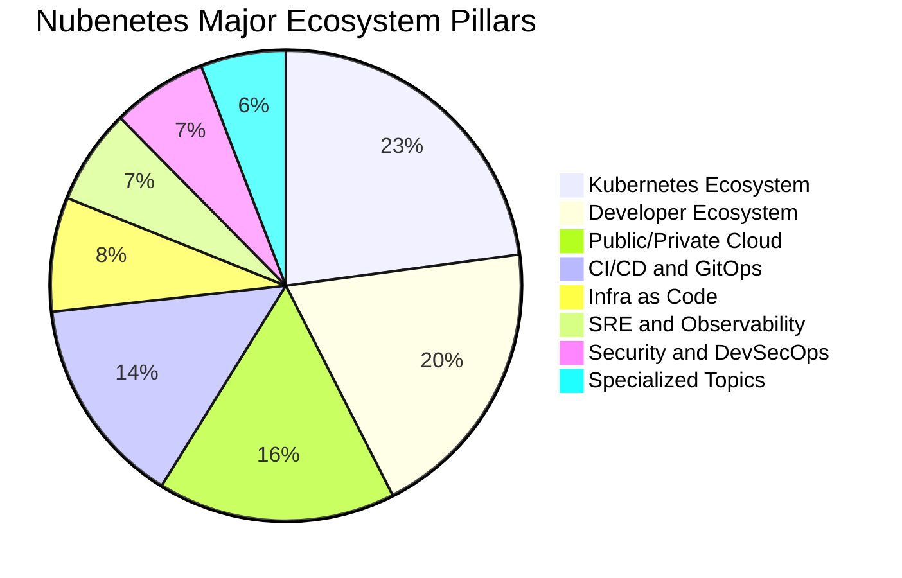
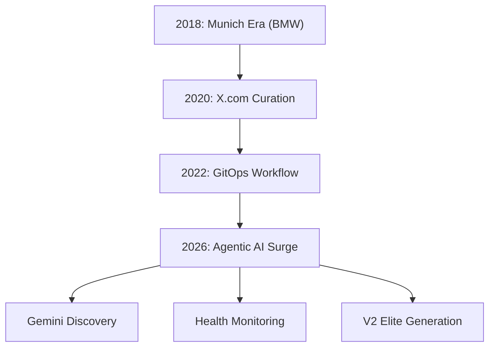
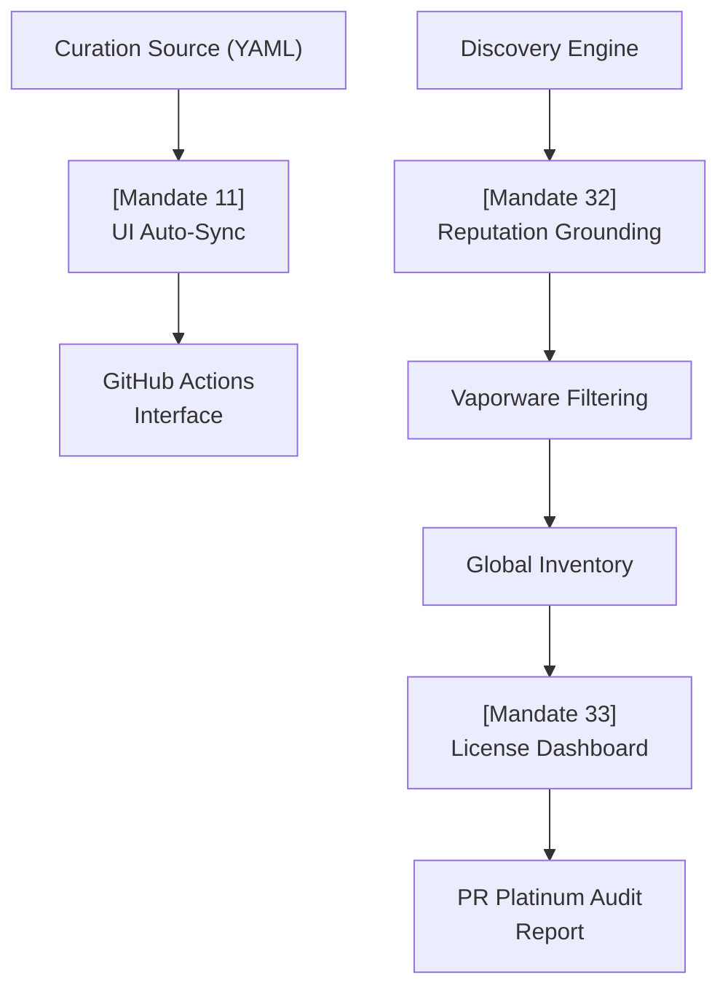
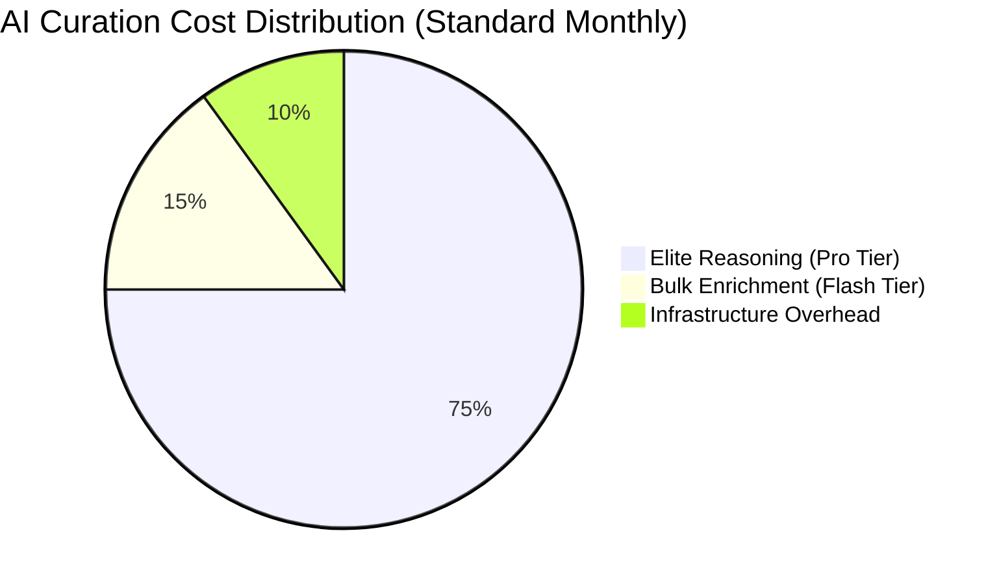
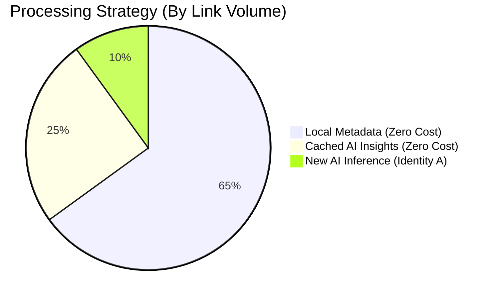
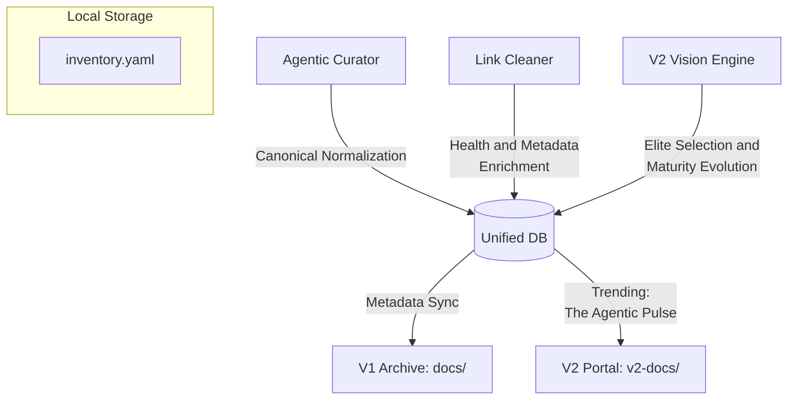
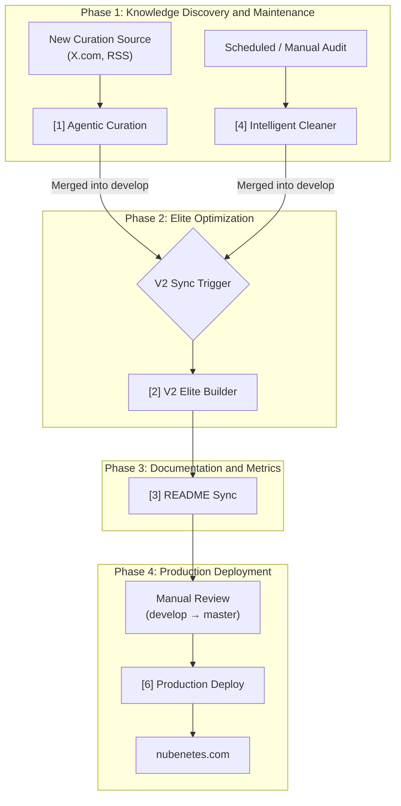
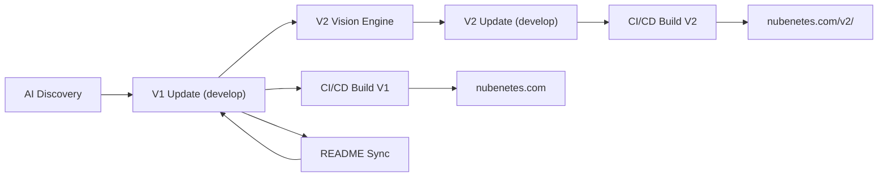

# Nubenetes: The Intelligent Cloud Native Archive 🧠☁️

[](https://github.com/nubenetes/awesome-kubernetes/actions/workflows/agentic_cron.yml)
[](https://github.com/nubenetes/awesome-kubernetes/actions/workflows/agentic_v2_builder.yml)
[](https://github.com/nubenetes/awesome-kubernetes/actions/workflows/intelligent_link_cleaner.yml)

**Nubenetes** is a high-density, curated archive of the Kubernetes, Cloud Native, and Agentic AI ecosystem. Since its inception in 2018, it has evolved from a personal collection of references into an autonomous, AI-driven knowledge engine that processes thousands of technical resources to provide a definitive "Source of Truth" for engineers worldwide.

---

## Table of Contents

1.  [1. Introduction and Motivation](#1-introduction-and-motivation)
    *   [1.1. Origins](#11-origins)
    *   [1.2. The Munich Era: Industrial-Grade Engineering (Case Study)](#12-the-munich-era-industrial-grade-engineering-case-study)
    *   [1.3. Mission](#13-mission)
    *   [1.4. 2026 Agentic High-Fidelity Standards](#14-2026-agentic-high-fidelity-standards)
2.  [2. Repository Metrics and Evolution](#2-repository-metrics-and-evolution)
    *   [2.1. The "Heart" of Nubenetes](#21-the-heart-of-nubenetes)
    *   [2.2. Top Categories by Density](#22-top-categories-by-density)
    *   [2.3. Historical Growth (Commits and References)](#23-historical-growth-commits-and-references)
    *   [2.4. Content Distribution and Semantic Clustering](#24-content-distribution-and-semantic-clustering)
        *   [2.4.1. Major Ecosystem Pillars](#241-major-ecosystem-pillars)
        *   [2.4.2. Global Linguistic Diversity](#242-global-linguistic-diversity)
3.  [3. The Agentic Stack](#3-the-agentic-stack)
4.  [4. The 2026 Architectural Shift](#4-the-2026-architectural-shift)
    *   [4.1. From Manual to Agentic](#41-from-manual-to-agentic)
    *   [4.2. Evolution Path](#42-evolution-path)
    *   [4.3. Adaptive AI Tiering and Real-time Grounding](#43-adaptive-ai-tiering-and-real-time-grounding)
    *   [4.4. Doc-as-Behavior Mandate Bridge](#44-doc-as-behavior-mandate-bridge)
5.  [5. Dual-Edition Architecture (V1 vs V2)](#5-dual-edition-architecture-v1-vs-v2)
    *   [5.1. V1: The Exhaustive Archive](#51-v1-the-exhaustive-archive)
    *   [5.2. V2: The Agentic Elite Edition](#52-v2-the-agentic-elite-edition)
    *   [5.3. The Incremental Elite Engine](#53-the-incremental-elite-engine)
    *   [5.4. Multi-Language Support Policy](#54-multi-language-support-policy)
6.  [6. The Unified Agentic Database (Knowledge Graph)](#6-the-unified-agentic-database-knowledge-graph)
    *   [6.1. Database Components](#61-database-components)
    *   [6.2. The 'Database-First' Reasoning Protocol](#62-the-database-first-reasoning-protocol)
    *   [6.3. Database Lifecycle and Hygiene](#63-database-lifecycle-and-hygiene)
    *   [6.4. Multi-Format Synchronization Logic](#64-multi-format-synchronization-logic)
    *   [6.5. Dynamic AI Discovery and Optimization](#65-dynamic-ai-discovery-and-optimization)
    *   [6.6. AI Intelligence and Observability (Transparency)](#66-ai-intelligence-and-observability-transparency)
7.  [7. AI Economic Architecture and Cost Analysis](#7-ai-economic-architecture-and-cost-analysis)
    *   [7.1. Comprehensive Economic Projections (2026 Inception)](#71-comprehensive-economic-projections-2026-inception)
    *   [7.2. Efficiency and Performance Metrics](#72-efficiency-and-performance-metrics)
    *   [7.3. Economic Sustainability Principles](#73-economic-sustainability-principles)
    *   [7.4. Strategic Selection: Pay-As-You-Go vs. Subscription](#74-strategic-selection-pay-as-you-go-vs-subscription)
    *   [7.5. Agentic Data Flow](#75-agentic-data-flow)
    *   [7.6. Strategic Benefits](#76-strategic-benefits)
8.  [8. The Agentic AI Engine](#8-the-agentic-ai-engine)
9.  [9. GitHub Workflows and Automation](#9-github-workflows-and-automation)
    *   [9.1. Workflow Inventory and Sequencing](#91-workflow-inventory-and-sequencing)
    *   [9.2. Recommended Execution Pipeline](#92-recommended-execution-pipeline)
    *   [9.3. Workflow Trigger and Synchronization Logic](#93-workflow-trigger-and-synchronization-logic)
    *   [9.4. Curation Flow Architecture](#94-curation-flow-architecture)
    *   [9.5. Deployment Lifecycle](#95-deployment-lifecycle)
    *   [9.6. Automated Mandate Auditing](#96-automated-mandate-auditing)
    *   [9.7. Multi-Part Reporting Engine](#97-multi-part-reporting-engine)
    *   [9.8. Workflow UI Auto-Sync](#98-workflow-ui-auto-sync)
10. [10. Branching Strategy and Lifecycle](#10-branching-strategy-and-lifecycle)
11. [11. Contributing to the Archive](#11-contributing-to-the-archive)
12. [12. Developer Experience and VSCode Setup](#12-developer-experience-and-vscode-setup)
    *   [12.1. Optimized "Power User" Environment](#121-optimized-power-user-environment)
    *   [12.2. Extension Recommendations (Legacy/General)](#122-extension-recommendations-legacygeneral)
    *   [12.3. Automated VS Code Tasks](#123-automated-vs-code-tasks)
    *   [12.4. Recommended settings.json](#124-recommended-settingsjson)
13. [13. Repository Inventory and Configuration](#13-repository-inventory-and-configuration)
    *   [13.1. Core Configuration](#131-core-configuration)
    *   [13.2. Centralized Metadata Databases](#132-centralized-metadata-databases)
    *   [13.3. Autonomous Workflows](#133-autonomous-workflows)
    *   [13.4. Agentic AI Source Code](#134-agentic-ai-source-code)
14. [14. Special Assets and Learning Paths](#14-special-assets-and-learning-paths)
    *   [14.1. Special Assets Management](#141-special-assets-management)
    *   [14.2. O.Reilly-style Knowledge Architecture](#142-oreilly-style-knowledge-architecture)
    *   [14.3. TOC and Structural Exceptions](#143-toc-and-structural-exceptions)
15. [15. Licensing and Legal Disclaimer](#15-licensing-and-legal-disclaimer)
    *   [15.1. Repository License](#151-repository-license)
    *   [15.2. Content Ownership](#152-content-ownership)
    *   [15.3. Legal Disclaimer](#153-legal-disclaimer)

---

## 1. Introduction and Motivation

### 1.1. Origins
Nubenetes was born in 2018 during a large-scale Cloud Native project for the **BMW IT-Zentrum in Munich**. The project involved building a **self-service developer platform** (BMW ConnectedDrive) with high standards of automation, GitOps patterns, and continuous improvement.

### 1.2. The Munich Era: Industrial-Grade Engineering (Case Study)
The lessons learned from that German engineering environment—standardization, evidence-based decisions, and extreme automation—became the DNA of this repository.

**Project Scale (2016-2019):**
- **Architecture:** Migration from monolithic legacy systems to **300+ Microservices**.
- **Infrastructure:** Scaled from 4 to **19 OpenShift Clusters** worldwide.
- **Throughput:** Managed **1 Billion requests per week** with 12,000+ active containers.
- **Transformation:** 2-year full-time cultural and technical migration to a self-service IoT digital platform.

**Technological Stack (The Original DNA):**
- **Container Orchestration:** Red Hat OpenShift (3.10+), OpenStack, and AWS.
- **CI/CD Architecture:** CloudBees/OSS Jenkins, Maven, Seed Jobs, Multibranch Pipelines, and **OpenShift Source-to-Image (S2I)** patterns.
- **Automation & IaC:** Terraform, Packer, Ansible, Fabric8 Java Client, and **JobDSL/Groovy** Shared Libraries.

### 1.3. Mission
To provide a **definitive technical archive** for the Cloud Native ecosystem, ensuring that high-quality technical knowledge remains accessible, verified, and organized for professional engineers.

### 1.4. 2026 Agentic High-Fidelity Standards
In 2026, Nubenetes moved beyond manual curation to an **Agentic AI Architecture**. This ensures:
- **Exhaustiveness:** Thousands of links processed autonomously.
- **Precision:** AI-driven scoring and technical classification.
- **Sustainability:** Automated health checks and self-healing infrastructure.

### 1.4. 2026 Agentic High-Fidelity Standards
As of May 2026, Nubenetes has reached the **Platinum Operational Tier**, featuring:
- **Real-time Web Grounding (MCP)**: The AI engine cross-references all technical decisions with live web data to ensure near-human accuracy in link rescue and maturity verification.
- **License & Compliance Guard**: Automated monitoring of repository licenses. Transitions from Open Source to restrictive models (e.g., BSL) trigger automatic penalties and review flags to protect architectural ethics.
- **Social Proof & Reputation Filter**: Every new ingestion undergoes a "Vaporware Check" on community platforms (Reddit, Hacker News) to ensure only stable, reputable tools enter the archive.
- **Autonomous Source Discovery**: The engine autonomously scans the technical web for emerging blogs and "Awesome" repos, expanding its own curation horizons without manual input.
- **Universal Rescue Protocol**: A strict "No Knowledge Left Behind" policy that salvages technical assets during corporate acquisitions and site migrations (e.g., Ansible, Nginx, AWS).
- **Foundational Preservation**: Automatic protection of high-value resources (marked with 🌟 or bold formatting), ensuring they are never deleted without manual human review.
- **README Integrity Guardrail**: An automated "Hard Safety Gate" that validates the presence and correct hierarchy of all 15 technical sections before any documentation update is committed, preventing accidental information loss.

---

## 2. Repository Metrics and Evolution

### 2.1. The "Heart" of Nubenetes
(Stats as of 2026-05-18)

<!-- HEART_STATS_START -->
| Metric | Value |
| :--- | :--- |
| **Total Technical Resources (Links)** | **15295+** |
| **Specialized MD Pages** | **161** |
| **Total Commits** | **4677+** |
| **Primary AI Engine** | **Google Gemini (Agentic)** |
<!-- HEART_STATS_END -->

### 2.2. Top Categories by Density
Top 10 categories by link volume in the exhaustive V1 archive.

<!-- TOP_CATEGORIES_START -->
| Category (Markdown Page) | Total Links |
| :--- | :---: |
| [Kubernetes](docs/kubernetes.md) | 1108 |
| [Kubernetes Tools](docs/kubernetes-tools.md) | 729 |
| [Terraform](docs/terraform.md) | 620 |
| [Demos](docs/demos.md) | 519 |
| [Git](docs/git.md) | 487 |
| [Azure](docs/azure.md) | 470 |
| [Jenkins](docs/jenkins.md) | 410 |
| [Devsecops](docs/devsecops.md) | 401 |
| [Managed Kubernetes In Public Cloud](docs/managed-kubernetes-in-public-cloud.md) | 368 |
| [Introduction](docs/introduction.md) | 325 |
<!-- TOP_CATEGORIES_END -->

### 2.3. Historical Growth (Commits and References)

The growth of Nubenetes reflects the acceleration of the Cloud Native ecosystem. Since 2026, the adoption of Agentic AI has resulted in a vertical surge in both commit frequency and link discovery.

#### Annual Growth Summary
<!-- ANNUAL_GROWTH_START -->
| # | Year | Commits | Est. New Refs | Key Milestone |
| :---: | :---: | :---: | :---: | :--- |
| 1 | 2018 | 350 | 1,445 | **Munich Era (BMW IT-Zentrum)** |
| 2 | 2019 | 142 | 586 | Early Growth and Open Source Launch |
| 3 | 2020 | 2046 | 8,449 | **The Great Expansion** (Global Pandemic/Remote Era) |
| 4 | 2021 | 531 | 2,193 | Maturity and Standardization |
| 5 | 2022 | 402 | 1,660 | Cloud Native Hardening |
| 6 | 2023 | 30 | 123 | Maintenance & Refinement |
| 7 | 2024 | 53 | 218 | Curation Strategy Pivot |
| 8 | 2025 | 5 | 20 | Stability & Research Phase |
| 9 | 2026 | 1118 | 4,617 | **Agentic AI Surge** (May 2026 Inception) |

```mermaid
---
config:
  themeVariables:
    xyChart:
      plotColorPalette: '#3b82f6, #fb923c'
  theme: mc
---
xychart-beta
    title "Nubenetes Annual Growth Metrics (2018–2026)"
    x-axis ["2018", "2019", "2020", "2021", "2022", "2023", "2024", "2025", "2026"]
    y-axis "Volume (Commits / Estimated New Refs)" 0 --> 9000
    bar [1445, 586, 8449, 2193, 1660, 123, 218, 20, 4617]
    bar [350, 142, 2046, 531, 402, 30, 53, 5, 1118]
```

<!-- ANNUAL_GROWTH_END -->

<!-- ANNUAL_CHART_START -->

<!-- ANNUAL_CHART_END -->

#### 2026: The Agentic Monthly Surge
<!-- MONTHLY_SURGE_START -->
| Month | Commits | Est. New Refs | Status |
| :--- | :---: | :---: | :--- |
| 2026-04 | 25 | 103 | Active Curation |
| 2026-05 | 1093 | 4,514 | **Agentic Inception (Gemini Era)** |
<!-- MONTHLY_SURGE_END -->

### 2.4. Content Distribution and Semantic Clustering

Nubenetes uses AI-driven semantic clustering to organize its 17,000+ resources into logical pillars. Below is a detailed breakdown of how the archive is distributed.

#### 2.4.1. Major Ecosystem Pillars
This chart shows the high-level distribution across the primary domains of Cloud Native engineering.

<!-- PILLAR_CHART_START -->

<!-- PILLAR_CHART_END -->

*   **Kubernetes Ecosystem:** Includes core K8s, tools, networking, security, and operators. This is the heart of the project, with over 3,500 curated references.
*   **Developer Ecosystem:** Covers programming languages (Go, Python, Java), VSCode, and web technologies. It reflects the "Dev" in DevOps.
*   **Public/Private Cloud:** Detailed resources for AWS, Azure, GCP, and specialized private cloud solutions like OpenShift and Rancher.

#### 2.4.2. Global Linguistic Diversity
Reflecting Nubenetes' mission of global access while maintaining technical English as the primary interface.

<!-- SUB_ECO_CHART_START -->

<!-- SUB_ECO_CHART_END -->

---

## 3. The Agentic Stack

The autonomy of Nubenetes is powered by a modern, resilient tech stack that ensures 24/7 curation and maintenance.

| Layer | Technology | Purpose |
| :--- | :--- | :--- |
| **Orchestration** | GitHub Actions | Scheduled and Event-driven execution (via `develop` branch). |
| **Intelligence** | Google Gemini (Multi-model) | Resource evaluation, scoring, and classification. |
| **Optimization** | Adaptive AI Tiering | Dynamic model selection (Pro/Flash) and Global rate limiting. |
| **Automation** | Python 3.11 | Core logic for parsing, gitops, and reporting. |
| **Discovery** | Twikit and Playwright | Autonomous scraping and account rotation. |
| **Resilience** | Identity Rotation | Evasion of anti-bot blocks using multiple profiles. |
| **Deployment** | MkDocs Material | High-performance static site generation for V1 and V2. |

---

## 4. The 2026 Architectural Shift

### 4.1. From Manual to Agentic
Historically, Nubenetes was curated manually by extracting references from **x.com/nubenetes** (formerly Twitter). This was a labor-intensive process that relied on human memory and periodic batch updates.

As of **May 2026**, the repository has transitioned to a **Fully Autonomous Agentic AI Architecture**. Using Google's Gemini models, the system now scans multiple sources, evaluates technical relevance, and performs self-maintenance without human intervention.

### 4.2. Evolution Path



### 4.3. Adaptive AI Tiering and Real-time Grounding
To ensure maximum throughput and industrial-grade precision, Nubenetes uses a proprietary **Multi-tier AI Orchestration** engine:
- **Smart Batching (Anti-429)**: Instead of individual calls, the system groups up to **10-50 resources into a single AI prompt**. This reduces API traffic by 90% and is mandatory for exhaustive 17k+ link runs.
- **Real-time Web Grounding (MCP-Style)**: For high-fidelity tasks, the engine activates **Google Search Grounding**. This allows the AI to verify technical maturity, site migrations, and official documentation in real-time, providing a live data filter for all decisions.
- **Dynamic Model Selection**: The system automatically toggles between **Gemini Pro** (for tasks requiring web research or deep reasoning) and **Gemini Flash** (for bulk enrichment).
- **Global Back-off & Tier-down**: If a high-fidelity model (Pro) hits a rate limit (`API 429`), the engine automatically executes an exponential back-off and "tiers down" to a lighter model or rotates API keys to ensure workflow continuity.

### 4.4. Doc-as-Behavior Mandate Bridge
Nubenetes implements a direct bridge between documentation and AI behavior:
- **Mandate Ingestion**: At the start of every workflow, the `MandateIngestor` parses the natural language instructions in [`GEMINI.md`](GEMINI.md).
- **Dynamic Context**: These mandates are injected directly into the AI's system instructions, ensuring that the bot's reasoning is always aligned with the latest project policies without requiring manual code updates.

---

## 5. Dual-Edition Architecture (V1 vs V2)

Nubenetes operates with two distinct editions to serve different engineering needs. Both are managed via GitOps and deployed to [nubenetes.com](https://nubenetes.com).

### 5.1. V1: The Exhaustive Archive
- **Purpose:** Preservation of all technical knowledge since 2018.
- **Scope:** 17,000+ links across 160+ pages.
- **Source of Truth:** The `docs/` directory.
- **Deployment:** [nubenetes.com](https://nubenetes.com)

### 5.2. V2: The Agentic Elite Edition
- **Purpose:** A high-density, enterprise-grade portal for the 2026 ecosystem.
- **Algorithm:** Uses the **Incremental Elite Engine** to select and classify top-tier resources.
- **Executive Context**: Every strategic dimension features an AI-generated **State-of-the-Art Introduction** providing high-level architectural context and industry direction before the link listings.
- **Source of Truth:** The `v2-docs/` directory (Derived from V1).
- **Deployment:** [nubenetes.com/v2/](https://nubenetes.com/v2/)

### 5.3. Architecture Comparison Matrix: V1 vs. V2
To better understand the dual-nature of the project, the following matrix details the technical and philosophical differences between the two editions:

| # | Feature / Aspect | V1: Exhaustive Archive (`docs/`) | V2: Agentic Elite Portal (`v2-docs/`) |
| :--- | :--- | :--- | :--- |
| **1** | **Primary Goal** | **Historical Preservation**: Exhaustive list of all technically valid resources since 2018. | **High-Density Synthesis**: Elite selection of top-tier tools for the 2026 Architect. |
| **2** | **Structural Logic** | **Manual Stability**: Flat or semi-structured categories based on manual curation. | **Recursive Hierarchy**: Deep nesting (up to 10 levels) based on Area > Topic > Subtopics. |
| **3** | **AI Intervention** | **Minimal Disruption**: AI only injects new links into existing sections. No rebuilding. | **Total Reconstruction**: AI rebuilds pages from scratch using O'Reilly-style learning flows. |
| **4** | **Inclusion Filter** | **Low Barrier**: Any ALIVE and technically relevant link is included. | **High Maturity (MVQ)**: Minimum stars (>30) and recent activity (commits < 4 years). |
| **5** | **TOC Policy** | **Manual/Static**: Table of Contents is manually maintained or triggered on request. | **Dynamic/Automated**: Clickable TOC is automatically generated and updated in every run. |
| **6** | **Metadata Density** | **Standard**: Title, URL, and descriptive summary. | **Platinum**: Author, Reading Time, Maturity Tag, and AI-generated Professional Summary. |
| **7** | **Organization Style** | **Thematic Folders**: Organized by file name and topic sections (##). | **Strategic Dimensions**: Grouped by high-level engineering domains (e.g., Platform Engineering). |
| **8** | **Content Format** | **Original Language**: Preserves V1 native descriptions (Spanish, French, etc.). | **Global English**: All summaries and UI are in Professional English for global access. |
| **9** | **Maintenance Type** | **Surgical Repair**: Dead links are removed or updated line-by-line. | **Full Refresh**: Orphaned files are pruned and content is re-indexed from the inventory. |
| **10** | **Target Audience** | **Researchers & Historians**: Looking for specific deep technical context. | **Architects & Decision Makers**: Looking for vetted, stable, and mature solutions. |

### 5.4. The Incremental Elite Engine
To maintain the high-density quality of V2 without redundant AI costs, the `V2VisionEngine` implements an incremental synchronization strategy:
1. **Intelligent Caching**: It utilizes the centralized YAML inventory to store previous AI evaluations. Only NEW links added to V1 are sent to Gemini for classification.
2. **Dynamic "Upgrading"**: Even for cached links, the engine performs real-time local updates:
   - **GitHub Metadata**: Fetches live star counts and last-commit dates via the GitHub API to ensure chronological accuracy and MVQ compliance.
   - **Maturity Tagging**: Applies a sophisticated 5-tier taxonomy (De Facto Standard, Enterprise Stable, Emerging, Legacy, Guide) based on live data.
   - **Mandatory AI Descriptions**: Ensures 100% description coverage. If a link in V1 lacks a description, the engine automatically generates a professional summary using Gemini.
3. **UI Polish**: Implements strategic highlighting (`==text==`) for top-tier resources and a clean chronological view that hides unknown dates.
4. **Flat Routing**: Both versions use `use_directory_urls: false` to ensure relative asset paths (`images/`) remain stable across all sub-pages.

### 5.4. Multi-Language Support Policy
To embrace the diverse global Cloud Native community while maintaining international discoverability, Nubenetes implements a dual-layer linguistic strategy powered by a **Data-First Architecture**:

- **Linguistic Data Persistence**: Language detection is treated as a core metadata attribute. The centralized database ([`data/inventory.yaml`](data/inventory.yaml)) stores resources using specific fields:
    *   `description`: The original native summary (e.g., Spanish) for the **V1 Archive**.
    *   `ai_summary`: A professional English synthesis for the **V2 Portal**.
    *   `language`: The identified source language (e.g., 'Spanish', 'French').
    *   `resource_type`: Classification (e.g., 'Blog', 'Repository', 'Case Study').
    *   `complexity`: Target audience level (e.g., 'Beginner', 'Architect').
    *   `author`: Technical creator/contributor identification.
    *   `duration` / `reading_time`: Automatic extraction of content length for videos and articles.
    *   `hierarchy`: Persistent, **recursive technical classification** (list of up to 10 levels) for O'Reilly-style grouping.
    *   `content_hash` / `health_score`: Advanced fields for content drift detection and reliability tracking.
    *   `source_provenance` / `social_preview_url`: Data for origin tracing and V2 visual enrichment.
- **Separation of Concerns (Data vs. UI)**:
    *   **The Database (Source of Truth)**: Holds raw data, enabling future features like language-based filtering or statistics without re-processing links.
    *   **The Portal (Visual Rendering)**: The `V2VisionEngine` dynamically converts the metadata into visual UI tags (e.g., `[SPANISH CONTENT]`, `[ARCHITECT LEVEL]`).
- **Global Discoverability**: Ensures high-value local content remains accessible in its original context (V1) while being indexed and readable by a global audience (V2).

---

## 6. The Unified Agentic Database (Knowledge Graph)

Nubenetes now utilizes a **Unified Metadata Architecture** to maintain consistency across V1 and V2 while optimizing AI performance. All links are indexed in a local YAML database that serves as the **Persistent Memory** for our autonomous agents.

### 6.1. Database Components
1.  **Central Inventory ([`data/inventory.yaml`](data/inventory.yaml))**: The universal single source of truth for technical metadata and resource lifecycle.
    *   **Core Data**: `title`, `year`, `stars` (0-5), `description` (V1 Native), `ai_summary` (V2 English), `category`.
    *   **Structural Intelligence**: `hierarchy` (Recursive list up to 10 levels), `v1_locations`, `v2_locations`.
    *   **Platinum Lifecycle**: `content_hash` (SHA256), `health_score` (0-100), `source_provenance`, `social_preview_url`, `mentions_count`.

### 6.2. The 'Database-First' Reasoning Protocol
To maximize economic efficiency, all AI agents follow a **Database-First** approach:
1.  **Local Lookup**: Before initiating any Gemini call, the agent checks if the URL is already indexed in [`data/inventory.yaml`](data/inventory.yaml).
2.  **Insight Reuse**: If the resource exists with valid metadata, the agent **reuses existing insights**, reducing API traffic to zero.
3.  **Memory Efficiency Tracking**: The system tracks **Cache Hit Ratios** and **Estimated Token Savings** in every Intelligence Report.
4.  **Mandatory Persistence**: Modified YAML files are automatically injected into Pull Requests, ensuring that "System Memory" is version-controlled and shared across all workflows.

### 6.3. Database Lifecycle and Hygiene
To maintain a high-performance "Single Source of Truth", Nubenetes implements automated hygiene protocols:
- **Universal Rescue Protocol (The Resurrection Rule)**: For ALL technical resources, the engine refuses to delete a link immediately upon a 404 or generic redirect. Instead, it triggers a "Technical Resurrection" cycle using **Real-time Web Grounding** to identify specific paths on destination domains. This is essential for preserving legendary content during massive corporate site migrations (e.g., **Nginx** to **F5**, or the **Ansible Blog** move to personal domains).
- **High-Value Preservation (The 'Review Required' Rule)**: Resources identified as **High-Value** (marked with 🌟 or bold formatting) are exempt from automatic deletion. If rescue fails, they are marked as `status: review_required` for manual verification, ensuring no significant technical assets are lost during autonomous cleaning.

#### 🕵️ Intelligent Cleaning Observability
```log
# 1. PROGRESS TRACKING & PARALLEL EXECUTION
[14:01:20] [*] Queue: 17110 links prioritized for validation.
[14:01:25] [>] Progress: [45/17110] links validated...
[14:01:29] [>] Progress: [90/17110] links validated...

# 2. SEMANTIC DRIFT (Optimized & Deduplicated): Detecting silent content updates via SHA256
[14:01:32] [!] DRIFT DETECTED: https://lzone.de
[14:01:33] [!] DRIFT DETECTED: https://hackerone.com/reports/1249583
# Meaning: Content changed significantly. Flagged for AI re-evaluation (only logged once per unique URL).

# 3. UNIVERSAL RESCUE: Finding new homes for technical assets
[14:02:15] [✨] RESCUED: https://probably.co.uk/posts/migrating-the-runbook -> https://new-domain.com/migrating-the-runbook

# 4. HIGH-VALUE PROTECTION: Shielding 'Joyas de la Corona'
[14:03:50] [⚠️] REVIEW STORED: https://www.toptechskills.com/ansible-tutorials...
# Meaning: VIP link failed. Protected from auto-deletion. Review metadata stored in BBDD.
```

- **Surgical Asset Pruning (V2)**: The V2 generation engine tracks valid dimension files and surgically prunes only orphaned files in [`v2-docs/`](v2-docs/) that are no longer part of the current architecture.
- **Incremental Self-Correction**: Autonomously identifies "suspicious" resources in [`data/inventory.yaml`](data/inventory.yaml) for re-validation and resurrection.
- **Physical File Synchronization**: Performs **surgical line-by-line updates** on the V1 Markdown files to update dead links or Canonical URLs.
- **Semantic Drift Detection**: Using **SHA256 Content Fingerprinting** to monitor silent updates and refresh AI evaluations.
- **GitHub Branch Auto-Heal**: If a deep link returns a 404, the engine automatically attempts to rescue it by migrating the path from `master` to `main`.
- **Parked Domain Detection**: AI-driven content inspection identifies expired domains marked as `DEAD` even if they return an HTTP 200.
- **Auto-Redirect Fix (Canonical Updates)**: Updates Markdown files with the final **Canonical URL** detected during health checks.
- **Database Garbage Collection (GC)**: A bi-monthly pruning process identifies orphaned metadata in [`data/inventory.yaml`](data/inventory.yaml).
- **Maturity Audit Log**: Every evaluation cycle tracks promotions in a public **Audit Log** ([`v2-docs/audit-log.md`](v2-docs/audit-log.md)).
- **Exhaustive Initialization (Cold-Start)**: Supports a `FORCE_FULL_CHECK` mechanism to bypass all local caches.

### 6.4. Multi-Format Synchronization Logic
Nubenetes employs a strategic "Double-Format" protocol to ensure system reliability:
- **JSON for AI Communication**: Agents utilize **JSON** as the messaging protocol to ensure rigid data structures.
- **YAML for Repository Storage**: Data is serialized into **YAML** for the local database, providing a clean, human-readable format for Git diffs.

### 6.5. Dynamic AI Discovery and Optimization
To eliminate configuration overhead and ensure Nubenetes always utilizes the frontier of AI technology, the system features a **Zero-Config Dynamic Model Discovery Engine**:

1.  **Live Capability Discovery**: At the start of each workflow run, the bot queries the Google Model Service API to list all models actually available to the Provided API keys.
2.  **Autonomous Scoring and Ranking**: Models are automatically ranked using a **dynamic regex-based algorithm**. Higher versions are prioritized (e.g., 3.1 > 2.0).
3.  **Adaptive Rate Limiting (Exponential Backoff)**: Implements an **Exponential Backoff with Jitter** strategy when encountering `429 Too Many Requests`.
4.  **Concurrency Guard (Semaphore)**: Utilizes an **Asyncio Semaphore** to restrict the number of concurrent AI calls (max 5).
5.  **Smart AI Batching (High-Speed Processing)**: Groups up to **10 resources into a single AI prompt** to reduce total calls by 90%.
6.  **Pre-Flight Local Caching**: Performs an autonomous look-up in [`data/inventory.yaml`](data/inventory.yaml) before any AI operation.

### 6.6. AI Intelligence and Observability (Transparency)
As of May 2026, Nubenetes implements a **Total Transparency Protocol** for AI operations:

- **Gemini Session Tracker**: Monitors every API call, recording the model, identity, and success rate.
- **Performance-First Key Infrastructure**: 
    - **Identity A (Default/Primary)**: Gemini Pro Subscription + PAYG API key.
    - **Identity B (Manual Opt-in Fallback)**: Family Shared Subscription.
- **PR Intelligence Reports**: Detailed breakdown of model hierarchy and identity usage.
- **Visual AI Dashboard**: Real-time metrics in `report.html` on AI performance and quota management.

### 6.7. Platinum Operational Tier (2026 Standards)
The "Platinum" tier represents the highest level of autonomous maintenance, focusing on industrial-grade safety, legal compliance, and real-time infrastructure synchronization.

#### Legal and Compliance Guard
- **License Integrity Monitoring**: The [Safety Guard](src/safety_guard.py) scans all repository links for license changes.
- **Restrictive License Alerting**: Immediate detection of transitions to non-free licenses (e.g., BSL, SSPL).
- **Compliance Dashboard**: Every PR includes a statistical summary of the ecosystem's license distribution to protect Open Source integrity (Mandate 33).

#### Advanced Safety and Standard Hardening
- **Structural Integrity Audit**: [Safety Guard](src/safety_guard.py) enforces [Mandate 30](GEMINI.md) by blocking ampersands (`&`) and emojis in section titles to ensure cross-platform rendering.
- **Anchor & TOC Validation**: Verifies that Table of Contents links point to valid, strictly lowercase anchors.
- **Rendering Risk Detection**: Ensures HTML blocks like `<center>` include the mandatory `markdown="1"` attribute ([Mandate 19](GEMINI.md)).

#### Infrastructure Auto-Sync
- **Workflow UI Synchronization**: The [UI Sync Engine](src/sync_workflow_ui.py) automatically updates the [GitHub Actions Interface](.github/workflows/agentic_cron.yml) whenever [Curation Sources](data/curation_sources.yaml) are added or modified ([Mandate 11](GEMINI.md)).

#### Reputation Pulse (Vaporware Filter)
- **Community-Based Vetting**: The [Curation Engine](src/agentic_curator.py) utilizes **Google Search Grounding** to cross-reference new tools with platforms like Reddit and Hacker News.
- **Suspicious Tool Labeling**: Autonomously penalizes and labels projects reported as abandoned or unstable as `[SUSPICIOUS]` in the [Global Inventory](data/inventory.yaml) ([Mandate 32](GEMINI.md)).

### 6.8. Platinum Capability Matrix
The following matrix details the operational jump from standard automation to the Platinum Agentic Tier:

| # | Capability | Standard Automation | Platinum Agentic Tier (2026) |
| :--- | :--- | :--- | :--- |
| **1** | **Safety Guard** | Manual Review | **Strict Mandatory Blocking**: No `&`, No Emojis in titles. |
| **2** | **Legal Compliance** | None | **Auto-License Pulse**: Real-time BSL/SSPL alerting. |
| **3** | **Reputation** | Star-based | **Community Grounding**: Real-time Reddit/HN vetting. |
| **4** | **Workflow UI** | Manual Update | **Auto-Sync**: YAML-driven GitHub UI generation. |
| **5** | **Data Integrity** | Link Health | **Content Drift**: SHA256 detection of silent site updates. |
| **6** | **Redundancy** | Single API Key | **Subscription Rotation**: Identity A/B failover logic. |
| **7** | **Observability** | Console Logs | **Platinum Audit**: Multi-part PR metrics & License Dashboard. |
| **8** | **HTML Quality** | Implicit | **Rendering Guard**: Mandatory `markdown="1"` validation. |



---

## 7. AI Economic Architecture and Cost Analysis

Nubenetes utilizes a **Performance-First / Cost-Optimized** hybrid model.

### 7.1. Comprehensive Economic Projections (2026 Inception)
| Scenario | Tier | Avg. Tokens/Link | Total Tokens (17k) | Est. Cost (EUR) | Est. Cost (USD) |
| :--- | :--- | :---: | :---: | :---: | :---: |
| **Max Quality** | 100% Gemini Pro | 2.2k | 37.6M | **€121.16** | **$131.70** |
| **Optimized** | **Hybrid (Pro/Flash)** | 2.2k | 37.6M | **€17.02** | **$18.50** |
| **Economy** | 100% Gemini Flash | 2.2k | 37.6M | **€2.60** | **$2.82** |

#### 2. Standard Pipeline Execution (Incremental)
Cost per automated workflow run on the `develop` branch.

| Execution Type | Frequency | New Links | Model Tier | Cost per Run (EUR) |
| :--- | :--- | :---: | :--- | :---: |
| **Daily Curation** | 1/day | 25-50 | Flash + Pro | **€0.07** |
| **Weekly Discovery** | 1/week | 100-200 | Pro Elite | **€0.41** |
| **Monthly Health Pass** | 2/month | 17,110 | Local Cache | **€0.00** |
| **V2 Elite Sync** | On demand | 0-100 | Flash (Upgraded) | **€0.02** |

#### 3. Monthly Operational Footprint (OPEX)
Projected monthly budget for 24/7 autonomous maintenance.

| Monthly Load | Est. Pipelines | Total New Links | Est. Monthly Cost (EUR) | ROI (Manual vs AI) |
| :--- | :---: | :---: | :---: | :---: |
| **Standard** | 35 | 1,200 | **€4.46** | ~160 hrs saved |
| **Aggressive Surge** | 60 | 3,500 | **€11.32** | ~450 hrs saved |
| **Maintenance** | 10 | 100 | **€0.51** | ~20 hrs saved |

### 7.2. Efficiency and Performance Metrics
Achieves **>90% cost reduction** compared to full-Pro architectures by utilizing multi-tier caching, global concurrency semaphores, and structured batching.





### 7.3. Economic Sustainability Principles
1.  **Identity Rotation (Identity A/B)**: Rotates between PAYG and Subscription keys.
2.  **The Cache Dividend**: Marginal cost drops over time as the database matures.
3.  **Quality-based Upgrading**: Only uses Pro reasoning when Flash fails a quality check.

### 7.4. Strategic Selection: Pay-As-You-Go vs. Subscription
For large-scale repository automation, Nubenetes prioritizes the **Pay-As-You-Go (PAYG)** model over consumer subscriptions, ensuring industrial-grade RPM and data privacy.

---

### 7.5. Agentic Data Flow


### 7.6. Strategic Benefits
- **Incremental Self-Correction**: Reparation of historical precision errors.
- **Content-URL Precision Standard (Mandate 31)**: AI detects generic redirects and triggers the Rescue Protocol.
- **Universal Title and TOC Standards (Mandate 30)**: programmatically sanitized section titles and indices.
- **Platinum Lifecycle Management**: Advanced data engineering including **SHA256 Content Fingerprinting**, **Health Reliability Scoring**, and **Source Provenance Tracking**.
- **Deep Semantic Deduplication**: Consolidates technical projects into **Authoritative Super-Entries** with `aliases`.
- **VIP Status Inheritance**: Critical project links inherit protected status during consolidation.
- **Technical Immutability (V1)**: Agents MUST NOT overwrite human-curated titles, manual stars, or descriptive comments.
- **Automated Semantic Interlinking (Mandate 5)**: Agents identify technical relationships and automatically inject cross-references (*"See also..."*).
- **Executive Comparison Tables (V2 Premium)**: High-density categories in the V2 portal feature AI-generated technical comparison tables.
- **Structural Intelligence Persistence**: High-precision technical classification stored as a persistent, **recursive hierarchy** (up to 10 levels deep).
- **Self-Healing Infrastructure**: detects and rescues broken links (e.g., GitHub branch migration) and identifies parked domains.
- **Zero-to-Hero Learning Paths**: V2 resources systematically grouped by complexity level.
- **Special Assets Preservation**: High-value documents undergo high-precision semantic grouping in V1 and exhaustive inclusion in V2.
- **Linguistic Diversity and Global Access**: V1 preserves native language descriptions, while the V2 Portal provides professional English summaries and language tagging.
- **License & Compliance Guard**: Automated monitoring of repository licenses (Mandate 33). Transitions to restrictive models trigger penalties and review flags.
- **Social Proof & Reputation Filter**: Real-time community vetting (Reddit, Hacker News) to eliminate unstable tools or "vaporware".

---

## 8. The Agentic AI Engine

The heart of the new Nubenetes is a suite of AI Agents that operate on our `develop` branch:

1.  **AgenticCurator ([`src/agentic_curator.py`](src/agentic_curator.py))**:
    - **Discovery:** Scans multiple high-trust X.com accounts and RSS feeds.
    - **Quality Hardening (Mandate 2 & 3):** Systematically filters blacklisted domains and applies impact penalties to stale GitHub repositories.
    - **Classification:** Automatically maps new resources using the **Recursive technical hierarchy** and generates multi-language descriptions.
        *   **K8s & Cloud Native:** `@nubenetes`, `@kubernetesio`, `@cncf`, `@kelseyhightower`, `@memenetes`.
        *   **Hyperscalers:** `@awscloud`, `@Azure`, `@GoogleCloud`, `@0GiS0`, `@NTFAQGuy`, `@cantrillio`, `@pvergadia`, `@QuinnyPig`.
        *   **AI & Agents:** `@OpenAI`, `@AnthropicAI`, `@GoogleDeepMind`, `@GoogleAI`, `@LoganK`, `@NotebookLM`, `@LangChainAI`, `@llama_index`.
        *   **Productivity:** `@GitHub`, `@Microsoft`, `@Cursor_AI`, `@midudev`, `@natfriedman`, `@karpathy`.
        *   **Data & Infra:** `@Databricks`, `@ApacheSpark`, `@snowflakedb`, `@HashiCorp`, `@PulumiCorp`, `@ArgoProj`, `@fluxcd`.
2.  **V2VisionEngine ([`src/v2_optimizer.py`](src/v2_optimizer.py))**:
    - **Elite Selection:** Scans the massive V1 archive to select the "Elite" top-tier resources.
    - **2026 Taxonomy:** Reorganizes content into high-density dimensions using **relevance-first sorting**.
    - **MVQ Hardening:** Automatically identifies stale repositories to exclude them from the Elite portal.
3.  **IntelligentHealthChecker ([`src/intelligent_health_checker.py`](src/intelligent_health_checker.py))**:
    - **Resilience:** asynchronous health checks with 3x retry and identity rotation.
    - **V1 Integrity:** Focuses on link validity (removing 404s) to ensure the exhaustive V1 archive remains accessible.
    - **Transparency:** Provides detailed, real-time unbuffered logging of all cleaning operations.

---

## 9. GitHub Workflows and Automation

Nubenetes uses a sophisticated multi-stage automation pipeline.

### 9.1. Workflow Inventory and Manual Control Matrix
Nubenetes features a comprehensive suite of workflows that can be controlled manually via the GitHub Actions UI.

| # | Workflow / UI Interface | Source Code | Manual Control & Form Inputs | Default Behavior |
| :---: | :--- | :--- | :--- | :--- |
| **1** | **[Agentic Curation](https://github.com/nubenetes/awesome-kubernetes/actions/workflows/agentic_cron.yml)** | [`.github/workflows/agentic_cron.yml`](.github/workflows/agentic_cron.yml) | • **`start_date`**: YYYY-MM-DD.<br/>• **`days_back`**: Relative range.<br/>• **`include_...`**: Domain toggles (K8s, AI, Cloud, etc).<br/>• **`extraction_strategy`**: Search vs Scroll.<br/>• **`historical_mode`**: Bypass limits. | Monthly Discovery |
| **2** | **[V2 Elite Builder](https://github.com/nubenetes/awesome-kubernetes/actions/workflows/agentic_v2_builder.yml)** | [`.github/workflows/agentic_v2_builder.yml`](.github/workflows/agentic_v2_builder.yml) | • **`force_reevaluate`**: Ignore AI cache.<br/>• **`activate_backup_key`**: Identity rotation. | Auto-Sync (Push) |
| **3** | **[Link Health Check](https://github.com/nubenetes/awesome-kubernetes/actions/workflows/intelligent_link_cleaner.yml)** | [`.github/workflows/intelligent_link_cleaner.yml`](.github/workflows/intelligent_link_cleaner.yml) | • **`force_full_check`**: Bypasses 21-day cache for exhaustive audit. | Monthly Cleanup |
| **4** | **[Backup Curation](https://github.com/nubenetes/awesome-kubernetes/actions/workflows/agentic_backup.yml)** | [`.github/workflows/agentic_backup.yml`](.github/workflows/agentic_backup.yml) | • **`backup_file`**: Path to JSON/MD.<br/>• **`historical_mode`**: Force evaluation. | On-Demand |
| **5** | **[README Sync](https://github.com/nubenetes/awesome-kubernetes/actions/workflows/readme_sync.yml)** | [`.github/workflows/readme_sync.yml`](.github/workflows/readme_sync.yml) | *(No manual inputs)* | Push to `develop` |
| **6** | **[Critical Monitor](https://github.com/nubenetes/awesome-kubernetes/actions/workflows/critical_asset_monitor.yml)** | [`.github/workflows/critical_asset_monitor.yml`](.github/workflows/critical_asset_monitor.yml) | *(No manual inputs)* | 3-Month Pulse |
| **7** | **[Merged Cleanup](https://github.com/nubenetes/awesome-kubernetes/actions/workflows/cleanup_merged_branches.yml)** | [`.github/workflows/cleanup_merged_branches.yml`](.github/workflows/cleanup_merged_branches.yml) | *(No manual inputs)* | Bi-weekly (1st/15th) |
| **8** | **[Production Deploy](https://github.com/nubenetes/awesome-kubernetes/actions/workflows/main.yml)** | [`.github/workflows/main.yml`](.github/workflows/main.yml) | *(No manual inputs)* | Push to `master` |

### 9.2. Recommended Execution Pipeline
To maintain the archive's integrity, the following logical sequence is followed:
1.  **Phase 1: Knowledge Discovery or Maintenance (#1, #4, or #5):** Raw technical data is fetched/filtered (Curation) or the existing archive is audited for health (Cleaning).
2.  **Phase 2: Elite Synthesis (#2):** Once curation or cleaning changes are merged into `develop`, the V2 Builder triggers automatically to synchronize the premium portal with the latest data and health status.
3.  **Phase 3: Metric Alignment (#3):** The push to `develop` triggers the README Sync.
4.  **Phase 4: Global Deployment (#6):** Review and merge into `master` to update production.

### 9.3. Workflow Trigger and Synchronization Logic
The following flowchart illustrates how autonomous discovery and maintenance tasks orchestrate the update of the V2 Elite portal.



### 9.4. Curation Flow Architecture


### 9.5. Deployment Lifecycle


### 9.6. Automated Mandate Auditing
Every Pull Request includes a non-blocking **Safety and Mandate Audit** report cross-referencing changes against [`GEMINI.md`](GEMINI.md).
- **README Integrity**: A dedicated "Hard Safety Gate" ([`src/safety_readme.py`](src/safety_readme.py)) ensures that all 15 mandatory technical sections are preserved.

### 9.7. Multi-Part Reporting Engine
To handle the scale of 17k+ resources, the engine automatically fragments reports into multiple successive PR comments, ensuring 100% observability.

### 9.8. Workflow UI Auto-Sync
Maintains **Mandate 11** by detecting new categories and alerting maintainers to update the GitHub Actions interface.

---

## 10. Branching Strategy and Lifecycle
- **`develop` Branch (Bleeding Edge):** Primary branch for all activities. **ALL Pull Requests MUST target this branch.**
- **`master` Branch (Production):** Stable branch powerling [nubenetes.com](https://nubenetes.com). Direct PRs are prohibited.
- **Branch Lifecycle Automation:** Automated cleanup of merged branches every 15 days (1st/15th). Protected: `master`, `develop`, `gh-pages`.

---

## 11. Contributing to the Archive

Nubenetes thrives on a **Hybrid Human-AI Collaboration** model. Community contributions are the lifeblood of the V1 archive.

### 🤝 How to Contribute
1.  **Target Branch**: Always create your Pull Requests against the `develop` branch.
2.  **Source of Truth (V1)**: Only add or edit files in the `docs/` directory. **Do not manually edit [`v2-docs/`](v2-docs/)**.
3.  **Manual Link Format**: Use the standard format: `  - [Title](URL) - Your descriptive summary.`
4.  **Automatic Adoption**: Once merged, the **Agentic Curator** and **V2 Builder** will validate health, extract metadata, assign a recursive hierarchy, and generate an English summary.
5.  **Preservation Guarantee**: Agents MUST NOT overwrite your manual 🌟 stars or descriptive comments.
6.  **Automated Feedback**: Every PR is automatically audited by our **SafetyGuard**, providing a report on mandate compliance.

---

## 12. Developer Experience and VSCode Setup

### 12.1. Optimized "Power User" Environment
Specifically optimized for core maintainers (e.g., **Chromebook Plus**):
*   **Extensions**: GitLens, Markdown All in One, markdownlint, Code Spell Checker, Prettier, Kubernetes & YAML (RedHat).
*   **Local Automation with `act`**: Run GitHub Actions locally using [**`act`**](https://github.com/nektos/act) and Docker.
*   **GitHub CLI Aliases**: `gh prs` (List my PRs) and `gh rv` (List PRs for review).
*   **Chromebook Plus Optimization**: Automated port forwarding for port `8000` (MkDocs) to the ChromeOS browser.

### 12.2. Extension Recommendations (Legacy/General)
- [Markdown All in One](https://marketplace.visualstudio.com/items?itemName=yzhang.markdown-all-in-one)
- [markdownlint](https://marketplace.visualstudio.com/items?itemName=DavidAnson.vscode-markdownlint)
- [Mermaid Editor](https://marketplace.visualstudio.com/items?itemName=tomoyukim.vscode-mermaid-editor)
- [GitHub Pull Requests](https://marketplace.visualstudio.com/items?itemName=GitHub.vscode-pull-request-github)

### 12.3. Automated VS Code Tasks
- **MkDocs: Serve (Local)**: Launches server on `localhost:8000`.
- **Agentic: Run Curation**: Executes [`src/main.py`](src/main.py) for local testing.

### 12.4. Recommended settings.json
These are the recommended editor settings for [`.vscode/settings.json`](.vscode/settings.json).

```json
{
    "markdown.extension.toc.levels": "2..6",
    "markdown.extension.toc.slugifyMode": "github",
    "markdown.extension.toc.orderedList": true,
    "markdown.extension.list.indentationSize": "adaptive",
    "files.autoSave": "afterDelay",
    "editor.tabSize": 4,
    "editor.defaultFormatter": "esbenp.prettier-vscode",
    "[markdown]": { "editor.defaultFormatter": "yzhang.markdown-all-in-one" },
    "markdownlint.focusMode": false,
    "editor.renderWhitespace": "all",
    "editor.guides.bracketPairs": true,
    "files.exclude": { "**/.venv": true, "**/__pycache__": true },
    "git.enableSmartCommit": true,
    "git.confirmSync": false,
    "github.pullRequests.focusedMode": true,
    "editor.formatOnSave": true,
    "git.terminalAuthentication": true,
    "remote.portsAttributes": { "8000": { "label": "MkDocs Server", "onAutoForward": "openBrowserOnce" } }
}
```

---

## 13. Repository Inventory and Configuration

To maintain transparency and ease of navigation, all key configuration, database, and workflow files are inventoried below.

### 13.1. Core Configuration
- **Link Rules:** [`data/link_rules.yaml`](data/link_rules.yaml) - Defines strictness for URL transformations and deep-link preservation.
- **Curation Sources:** [`data/curation_sources.yaml`](data/curation_sources.yaml) - Defines monitored X.com accounts and technical topics.
- **Special Assets:** [`data/special_assets.yaml`](data/special_assets.yaml) - VIP logic orchestration.
- **Site Config:** [V1 (mkdocs.yml)](mkdocs.yml), [V2 (v2-mkdocs.yml)](v2-mkdocs.yml).

### 13.2. Centralized Metadata Databases
- **Global Inventory:** [`data/inventory.yaml`](data/inventory.yaml) - The "System Memory" containing all link metadata (years, stars, descriptions, and audit history).

### 13.3. Autonomous Workflows
- **Discovery & Curation:** [`.github/workflows/agentic_cron.yml`](.github/workflows/agentic_cron.yml)
- **V2 Elite Builder:** [`.github/workflows/agentic_v2_builder.yml`](.github/workflows/agentic_v2_builder.yml)
- **Health & Maintenance:** [`.github/workflows/intelligent_link_cleaner.yml`](.github/workflows/intelligent_link_cleaner.yml)
- **README Metrics Sync:** [`.github/workflows/readme_sync.yml`](.github/workflows/readme_sync.yml)
- **Deployment Pipeline:** [`.github/workflows/main.yml`](.github/workflows/main.yml)

### 13.4. Agentic AI Source Code
- **Orchestration Core:** [`src/main.py`](src/main.py) - Master coordinator for discovery and evaluation.
- **Curator Logic:** [`src/agentic_curator.py`](src/agentic_curator.py) - Primary classification and description engine.
- **V2 Vision Engine:** [`src/v2_optimizer.py`](src/v2_optimizer.py) - Elite portal generation and maturity scoring.
- **Health Check Logic:** [`src/intelligent_health_checker.py`](src/intelligent_health_checker.py) - Link rot prevention and canonical updates.
- **Twikit Ingestion:** [`src/ingestion_twikit.py`](src/ingestion_twikit.py) - X.com scraping and account rotation logic.
- **Backup Ingestion:** [`src/ingestion_backup.py`](src/ingestion_backup.py) - Manual and historical JSON data processing.
- **Discovery Engine:** [`src/autonomous_discovery.py`](src/autonomous_discovery.py) - Multi-source technical news extraction.
- **Gemini Utils:** [`src/gemini_utils.py`](src/gemini_utils.py) - AI model discovery, rate limiting, and session tracking.
- **Markdown Logic:** [`src/markdown_ast.py`](src/markdown_ast.py) - Sophisticated parsing of repository content.
- **Observability:** [`src/logger.py`](src/logger.py) | [`src/report_generator.py`](src/report_generator.py) - Execution transparency and visual reporting.

---

## 14. Special Assets and Learning Paths

Nubenetes prioritizes high-value technical documents through a specialized preservation and educational architecture.

### 14.1. Special Assets Management
Certain files (Introduction, YAML, Awesome repos) are designated as **Special Assets** ([`data/special_assets.yaml`](data/special_assets.yaml)) due to their foundational importance. These include:
- **Introduction and Fundamentals**: High-impact fundamental selection for V2, with 100% preservation in V1.
- **Microservices Ecosystem**: A dedicated V2 document ([`microservices.md`](v2-docs/microservices.md)) extracted from the [`introduction.md`](docs/introduction.md) to maintain architectural focus.
- **YAML and JSON Ecosystem**: Exhaustive technical references for configuration languages.
- **Awesome Repositories**: Preserved curation lists that act as gateways to specialized sub-ecosystems.

**Rules of Engagement:**
1. **High-Precision Grouping**: AI agents use **recursive nested hierarchies** (up to 10 levels) to organize these files without losing technical depth, following an O'Reilly style structure.
2. **Elite Curation**: For the V2 Portal, [`introduction.md`](docs/introduction.md) undergoes a specialized "Elite selection" (Impact ≥ 4) to ensure a high-density entry point.

### 14.2. O'Reilly-style Knowledge Architecture
The V2 Portal is structured as a sophisticated technical reference guide, moving beyond simple lists to an integrated technical hub.
- **Architectural Hubs**: Critical entry points like [`introduction.md`](docs/introduction.md) feature **Mermaid ecosystem maps** and executive vision prefaces.
- **Gold Nugget Highlights**: Legendary foundational masterclasses (Impact ≥ 4) featured in distinct visual callout blocks.
- **Gateway Hub Navigation**: Strategic dimensions are semantically interconnected, with a dedicated **Microservices Guide** extracted for high-density focus.
- **Structured Assimilation**: Information is grouped into technical Areas, Topics, and Subtopics, facilitating learning from foundational theory to advanced engineering internals.
- **Contextual Hierarchy**: Every page features an automated, clickable Table of Contents (TOC) with nested anchors.

### 14.3. TOC and Structural Exceptions
Certain files are exempt from the mandatory Table of Contents (TOC) and deep-hierarchy requirements. These include configuration-heavy files (e.g., [`mkdocs.md`](docs/mkdocs.md)) or large technical tables (e.g., [`matrix-table.md`](docs/matrix-table.md)).
- **Automatic Skip**: The Agentic Curator and V2 Builder automatically bypass these files during structural reorganization cycles.
- **Exception Registry**: Exemptions are managed via the `toc_exempt_files` list in [`data/link_rules.yaml`](data/link_rules.yaml).

---

## 15. Licensing and Legal Disclaimer

### 15.1. Repository License
The core logic, autonomous agents, and documentation of Nubenetes are licensed under the **MIT License**. You are free to use, modify, and distribute the code as long as the original copyright notice is preserved.

### 15.2. Content Ownership
The technical resources (links, articles, videos) curated in this archive are the intellectual property of their respective authors and organizations. Nubenetes acts solely as a technical directory and does not host or claim ownership over the external content.

### 15.3. Legal Disclaimer
The information provided in this repository is for educational and professional reference purposes only. While our Agentic AI ensures high-fidelity curation, users should verify production configurations against official vendor documentation (AWS, Red Hat, CNCF) before deployment.
