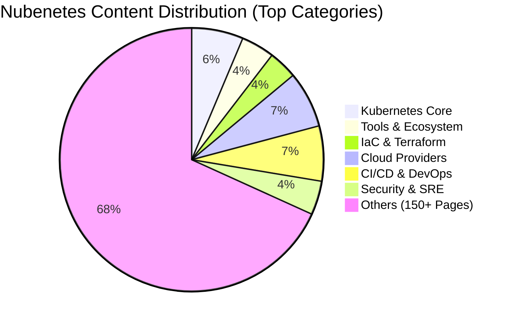
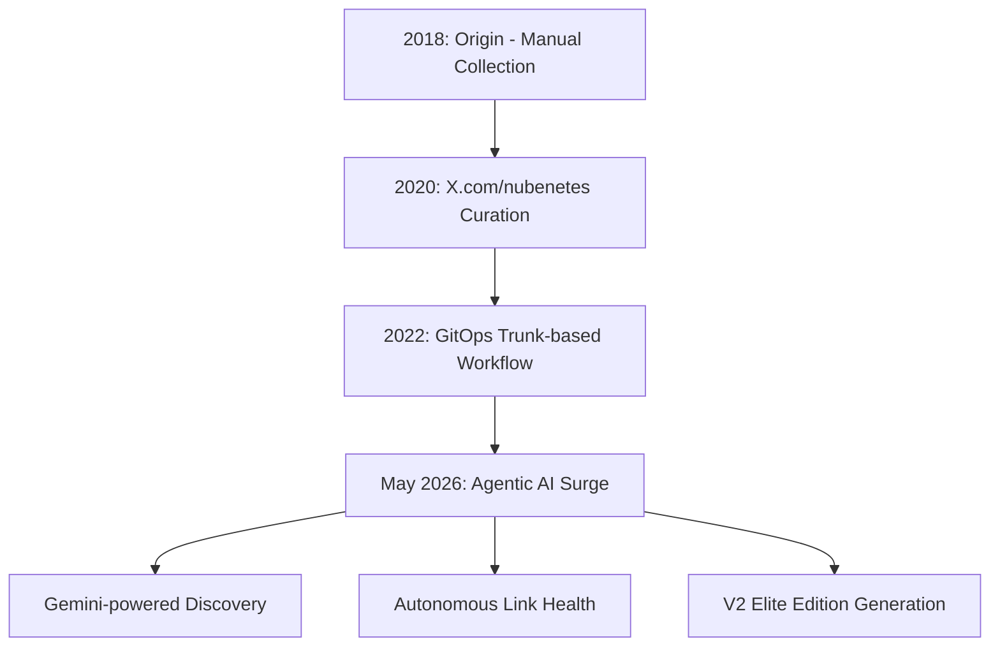
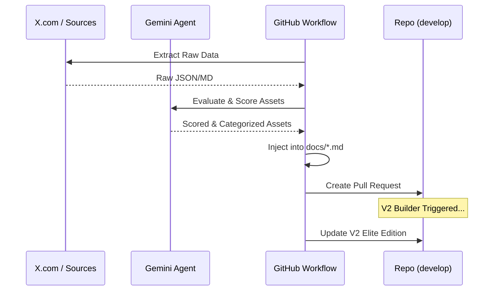

# Nubenetes: The Intelligent Cloud Native Archive 🧠☁️

[](https://github.com/nubenetes/awesome-kubernetes/actions/workflows/agentic_cron.yml)
[](https://github.com/nubenetes/awesome-kubernetes/actions/workflows/agentic_v2_builder.yml)
[](https://github.com/nubenetes/awesome-kubernetes/actions/workflows/intelligent_link_cleaner.yml)

**Nubenetes** is a high-density, curated archive of the Kubernetes, Cloud Native, and Agentic AI ecosystem. Since its inception in 2018, it has evolved from a personal collection of references into an autonomous, AI-driven knowledge engine that processes thousands of technical resources to provide a definitive "Source of Truth" for engineers worldwide.

---

## 📖 Table of Contents

1.  [Introduction & Motivation](#-introduction--motivation)
2.  [Repository Metrics & Evolution](#-repository-metrics--evolution)
    *   [Top Categories by Density](#top-categories-by-density)
    *   [Historical Growth](#historical-growth)
    *   [Content Distribution](#content-distribution)
3.  [The 2026 Architectural Shift](#-the-2026-architectural-shift)
    *   [From Manual to Agentic](#from-manual-to-agentic)
    *   [Evolution Path](#evolution-path)
4.  [The Agentic AI Engine](#-the-agentic-ai-engine)
5.  [GitHub Workflows & Automation](#-github-workflows--automation)
    *   [Workflow Inventory](#workflow-inventory)
    *   [Curation Flow Architecture](#curation-flow-architecture)
6.  [Branching Strategy & Lifecycle](#-branching-strategy--lifecycle)
7.  [Developer Experience & VSCode Setup](#-developer-experience--vscode-setup)

---

## 🌟 Introduction & Motivation

### Origins
Nubenetes was born in 2018 during a large-scale Cloud Native project for a major multinational car manufacturer in Munich. The project involved building a **self-service developer platform** with high standards of automation, GitOps patterns, and continuous improvement. The lessons learned from that German engineering environment—standardization, evidence-based decisions, and extreme automation—became the DNA of this repository.

### Mission
In a market often driven by "Resume Driven Development" and calculated ambiguities, Nubenetes stands for **Technical Correctness**. We promote:
- **Evidence-based Engineering:** Relying on standard tools and proven architectures.
- **Automation over Manual Work:** If it can be scripted, it should be.
- **Knowledge Democratization:** Breaking silos by sharing high-value, production-grade resources.

> *"If you want to save the world, think like an engineer."* — Mark Stevenson

---

## 📊 Repository Metrics & Evolution

Nubenetes is one of the most comprehensive archives in the ecosystem, featuring tens of thousands of links organized by granular categories.

### The "Heart" of Nubenetes (Stats as of May 2026)

| Metric | Value |
| :--- | :--- |
| **Total Technical Resources (Links)** | **17,133+** |
| **Specialized MD Pages** | **161** |
| **Total Commits** | **4,142+** |
| **Primary AI Engine** | **Google Gemini (Agentic)** |

### Top Categories by Density

| Category (Markdown Page) | Total Links |
| :--- | :---: |
| [Kubernetes Deep Dive](docs/kubernetes.md) | 1,149 |
| [Kubernetes Tools & Ecosystem](docs/kubernetes-tools.md) | 740 |
| [Infrastructure as Code (Terraform)](docs/terraform.md) | 640 |
| [Demos & Practical Guides](docs/demos.md) | 538 |
| [Git & GitOps Strategy](docs/git.md) | 497 |
| [Microsoft Azure Cloud](docs/azure.md) | 487 |
| [Jenkins & CI/CD Pipelines](docs/jenkins.md) | 458 |
| [DevSecOps & Security](docs/devsecops.md) | 407 |
| [Managed Kubernetes (EKS/AKS/GKE)](docs/managed-kubernetes-in-public-cloud.md) | 379 |
| [Observability & Monitoring](docs/monitoring.md) | 347 |

### Historical Growth

#### Commits by Year
| Year | Commits | Milestone |
| :---: | :---: | :--- |
| 2018 | 350 | Project Inception |
| 2019 | 142 | Early Growth |
| 2020 | 2,046 | **The Great Expansion** |
| 2021 | 531 | Maturity & Standardization |
| 2022 | 402 | Cloud Native Hardening |
| 2023 | 30 | Maintenance |
| 2024 | 53 | Curation Refinement |
| 2025 | 5 | Stability |
| 2026 | 402+ | **Agentic AI Automation Era** |

### Content Distribution



---

## 🚀 The 2026 Architectural Shift

### From Manual to Agentic
Historically, Nubenetes was curated manually by extracting references from **x.com/nubenetes** (formerly Twitter). This was a labor-intensive process that relied on human memory and periodic batch updates.

As of **May 2026**, the repository has transitioned to a **Fully Autonomous Agentic AI Architecture**. Using Google's Gemini models, the system now scans multiple sources, evaluates technical relevance, and performs self-maintenance without human intervention.

### Evolution Path



---

## 🤖 The Agentic AI Engine

The heart of the new Nubenetes is a suite of AI Agents that operate on our `develop` branch:

1.  **AgenticCurator (`src/agentic_curator.py`)**:
    - **Discovery:** Scans X.com (multiple accounts) and other curation sources.
    - **Evaluation:** Uses Gemini to score resources based on technical significance, impact, and date.
    - **Classification:** Automatically maps new resources to the correct `.md` page using semantic matching.
2.  **V2VisionEngine (`src/v2_optimizer.py`)**:
    - **Elite Selection:** Scans the massive V1 archive (17k+ links) to select the "Elite" top-tier resources.
    - **2026 Taxonomy:** Reorganizes the content into high-density dimensions (e.g., "Intelligent Control Plane", "Hardened Infrastructure").
    - **Deprioritization:** Automatically identifies stale repositories (>4 years without activity) and reduces their visibility.
3.  **IntelligentHealthChecker (`src/intelligent_health_checker.py`)**:
    - **Resilience:** Performs asynchronous health checks with 3x retry and identity rotation.
    - **Persistence:** Instead of aggressive deletion, it flags `[OFFLINE?]` links to preserve historical technical context.

---

## 🛠️ GitHub Workflows & Automation

Nubenetes uses a complex network of GitHub Actions to maintain the archive.

### Workflow Inventory

| Workflow | File | Purpose | Trigger | Dependencies |
| :--- | :--- | :--- | :--- | :--- |
| **Agentic Curation** | [`agentic_cron.yml`](.github/workflows/agentic_cron.yml) | Main engine: Discovery, Evaluation, and PR creation. | Monthly / Manual | None |
| **V2 Elite Builder** | [`agentic_v2_builder.yml`](.github/workflows/agentic_v2_builder.yml) | Generates the high-density Elite edition in `v2-docs/`. | After Curation | Agentic Curation |
| **Link Health** | [`intelligent_link_cleaner.yml`](.github/workflows/intelligent_link_cleaner.yml) | Global link health check & deduplication. | Monthly / Manual | None |
| **Backup Curation** | [`agentic_backup.yml`](.github/workflows/agentic_backup.yml) | Processes historical backups (JSON/MD) into the repo. | Manual | None |

### Curation Flow Architecture



---

## 🌳 Branching Strategy & Lifecycle

-   **Pre-2026 Era (Trunk-based):** For years, Nubenetes followed a "git-trunk" model where all changes were made directly to the `master` branch.
-   **Post-May 2026 (Modern Lifecycle):**
    -   **`develop` Branch:** The primary branch for AI agents. All curation PRs and link updates target `develop`.
    -   **`master` Branch:** The production-ready branch. Used for stable releases and deployments.
    -   **Automated Sync:** Workflows are configured to always checkout `develop` to ensure the AI operates on the latest "bleeding edge" content.

---

## 💻 Developer Experience & VSCode Setup

To maintain the high-density structure of Nubenetes (including Tables of Contents and specific indentations for MkDocs Material), the following VSCode setup is recommended.

### Extension Recommendations
- [Markdown All in One](https://marketplace.visualstudio.com/items?itemName=yzhang.markdown-all-in-one) - **Mandatory** for automatic TOC generation and list management.
- [markdownlint](https://marketplace.visualstudio.com/items?itemName=DavidAnson.vscode-markdownlint) - Ensures style consistency.
- [Mermaid Editor](https://marketplace.visualstudio.com/items?itemName=tomoyukim.vscode-mermaid-editor) - To visualize the architecture diagrams.
- [GitHub Pull Requests](https://marketplace.visualstudio.com/items?itemName=GitHub.vscode-pull-request-github) - To review AI-generated curation PRs.

### Recommended settings.json

```json
{
    "markdown.extension.toc.levels": "2..6",
    "markdown.extension.tableFormatter.normalizeIndentation": true,
    "markdown.extension.toc.slugifyMode": "github",
    "markdown.extension.toc.orderedList": true,
    "markdown.extension.list.indentationSize": "adaptive",
    "files.autoSave": "afterDelay",
    "editor.detectIndentation": false,
    "editor.tabSize": 4,
    "window.zoomLevel": -1,
    "markdownlint.config": {
        "default": true,
        "MD013": false,
        "MD033": false,
        "MD007": { "indent": 4 },
        "no-hard-tabs": false
    },
    "editor.defaultFormatter": "vscode.github",
    "[markdown]": {
        "editor.defaultFormatter": "vscode.github"
    },
    "markdownlint.focusMode": false,
    "editor.renderWhitespace": "all",
    "editor.guides.bracketPairs": true,
    "files.exclude": {
        "**/.venv": true,
        "**/__pycache__": true
    }
}
```

> **Note:** Material for MKDocs requires an indentation of **4 spaces** for nested lists and TOCs to render correctly. This is strictly enforced via `editor.tabSize: 4`.

---
<center>
Give us a 🌟 on GitHub if you like this archive!
</center>
