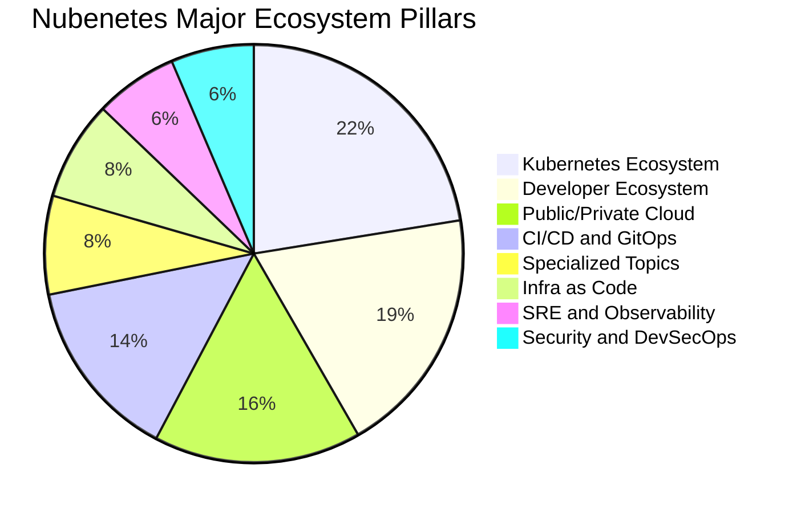
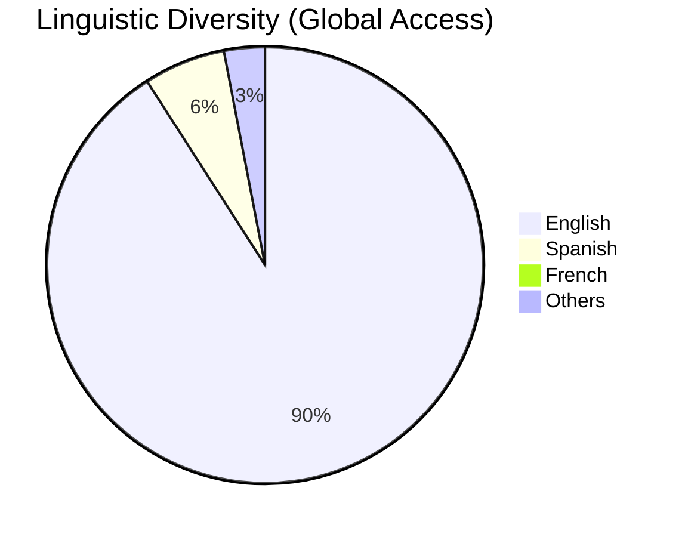
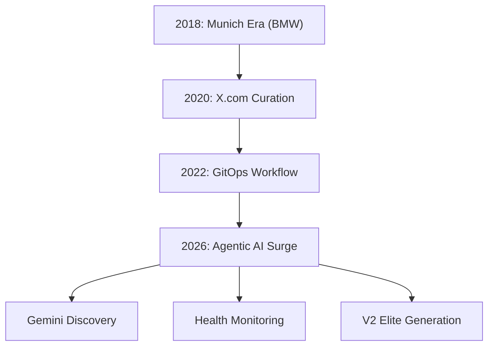
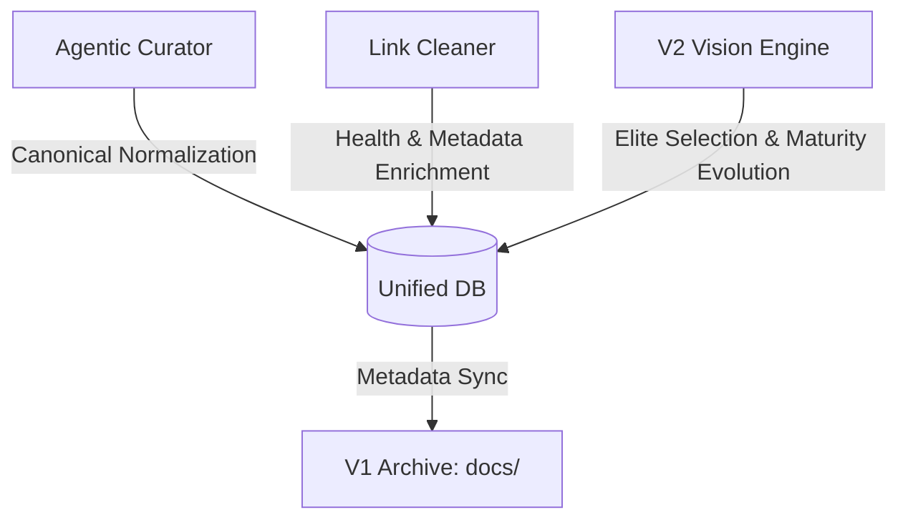

# Nubenetes: The Intelligent Cloud Native Archive 🧠☁️

[](https://github.com/nubenetes/awesome-kubernetes/actions/workflows/agentic_cron.yml)
[](https://github.com/nubenetes/awesome-kubernetes/actions/workflows/agentic_v2_builder.yml)
[](https://github.com/nubenetes/awesome-kubernetes/actions/workflows/intelligent_link_cleaner.yml)

**Nubenetes** is a high-density, curated archive of the Kubernetes, Cloud Native, and Agentic AI ecosystem. Since its inception in 2018, it has evolved from a personal collection of references into an autonomous, AI-driven knowledge engine that processes thousands of technical resources to provide a definitive "Source of Truth" for engineers worldwide.

---

## Table of Contents

1.  [1. Introduction and Motivation](#1-introduction-and-motivation)
    *   [1.1. Origins](#11-origins)
    *   [1.2. Mission](#12-mission)
    *   [1.3. 2026 Agentic High-Fidelity Standards](#13-2026-agentic-high-fidelity-standards)
2.  [2. Repository Metrics and Evolution](#2-repository-metrics-and-evolution)
    *   [2.1. The "Heart" of Nubenetes](#21-the-heart-of-nubenetes)
    *   [2.2. Top Categories by Density](#22-top-categories-by-density)
    *   [2.3. Historical Growth (Commits and References)](#23-historical-growth-commits-and-references)
    *   [2.4. Content Distribution and Semantic Clustering](#24-content-distribution-and-semantic-clustering)
3.  [3. The Agentic Stack](#3-the-agentic-stack)
4.  [4. The 2026 Architectural Shift](#4-the-2026-architectural-shift)
    *   [4.1. From Manual to Agentic](#41-from-manual-to-agentic)
    *   [4.2. Evolution Path](#42-evolution-path)
    *   [4.3. Adaptive AI Tiering and Real-time Grounding](#43-adaptive-ai-tiering-and-real-time-grounding)
    *   [4.4. Doc-as-Behavior Mandate Bridge](#44-doc-as-behavior-mandate-bridge)
5.  [5. Dual-Edition Architecture (V1 vs V2)](#5-dual-edition-architecture-v1-vs-v2)
    *   [5.1. V1: The Exhaustive Archive](#51-v1-the-exhaustive-archive)
    *   [5.2. V2: The Agentic Elite Edition](#52-v2-the-agentic-elite-edition)
    *   [5.3. The Incremental Elite Engine](#53-the-incremental-elite-engine)
    *   [5.4. Multi-Language Support Policy](#54-multi-language-support-policy)
6.  [6. The Unified Agentic Database (Knowledge Graph)](#6-the-unified-agentic-database-knowledge-graph)
    *   [6.1. Database Components](#61-database-components)
    *   [6.2. The 'Database-First' Reasoning Protocol](#62-the-database-first-reasoning-protocol)
    *   [6.3. Database Lifecycle and Hygiene](#63-database-lifecycle-and-hygiene)
    *   [6.4. Multi-Format Synchronization Logic](#64-multi-format-synchronization-logic)
    *   [6.5. Dynamic AI Discovery and Optimization](#65-dynamic-ai-discovery-and-optimization)
    *   [6.6. AI Intelligence and Observability (Transparency)](#66-ai-intelligence-and-observability-transparency)
7.  [7. AI Economic Architecture and Cost Analysis](#7-ai-economic-architecture-and-cost-analysis)
    *   [7.1. Comprehensive Economic Projections (2026 Inception)](#71-comprehensive-economic-projections-2026-inception)
    *   [7.2. Efficiency and Performance Metrics](#72-efficiency-and-performance-metrics)
    *   [7.3. Economic Sustainability Principles](#73-economic-sustainability-principles)
    *   [7.4. Strategic Selection: Pay-As-You-Go vs. Subscription](#74-strategic-selection-pay-as-you-go-vs-subscription)
    *   [7.5. Agentic Data Flow](#75-agentic-data-flow)
    *   [7.6. Strategic Benefits](#76-strategic-benefits)
8.  [8. The Agentic AI Engine](#8-the-agentic-ai-engine)
9.  [9. GitHub Workflows and Automation](#9-github-workflows-and-automation)
    *   [9.1. Workflow Inventory and Sequencing](#91-workflow-inventory-and-sequencing)
    *   [9.2. Recommended Execution Pipeline](#92-recommended-execution-pipeline)
    *   [9.3. Curation Flow Architecture](#93-curation-flow-architecture)
    *   [9.4. Deployment Lifecycle](#94-deployment-lifecycle)
    *   [9.5. Automated Mandate Auditing](#95-automated-mandate-auditing)
    *   [9.6. Multi-Part Reporting Engine](#96-multi-part-reporting-engine)
    *   [9.7. Workflow UI Auto-Sync](#97-workflow-ui-auto-sync)
10. [10. Branching Strategy and Lifecycle](#10-branching-strategy-and-lifecycle)
11. [11. Contributing to the Archive](#11-contributing-to-the-archive)
12. [12. Developer Experience and VSCode Setup](#12-developer-experience-and-vscode-setup)
13. [13. Repository Inventory and Configuration](#13-repository-inventory-and-configuration)
    *   [13.1. Core Configuration](#131-core-configuration)
    *   [13.2. Centralized Metadata Databases](#132-centralized-metadata-databases)
    *   [13.3. Autonomous Workflows](#133-autonomous-workflows)
    *   [13.4. Agentic AI Source Code](#134-agentic-ai-source-code)
14. [14. Special Assets and Learning Paths](#14-special-assets-and-learning-paths)
    *   [14.1. Special Assets Management](#141-special-assets-management)
    *   [14.2. O.Reilly-style Knowledge Architecture](#142-oreilly-style-knowledge-architecture)
    *   [14.3. TOC and Structural Exceptions](#143-toc-and-structural-exceptions)

---

## 1. Introduction and Motivation

### 1.1. Origins
Nubenetes was born in 2018 during a large-scale Cloud Native project for the **BMW IT-Zentrum in Munich**. The project involved building a **self-service developer platform** (BMW ConnectedDrive) with high standards of automation, GitOps patterns, and continuous improvement. The lessons learned from that German engineering environment—standardization, evidence-based decisions, and extreme automation—became the DNA of this repository.

### 1.2. Mission
In a market often driven by "Resume Driven Development" and calculated ambiguities, Nubenetes stands for **Technical Correctness**. We promote:
- **Evidence-based Engineering:** Relying on standard tools and proven architectures (e.g., OpenShift, CloudBees/Jenkins).
- **Automation over Manual Work:** If it can be scripted, it should be.
- **Knowledge Democratization:** Breaking silos by sharing high-value, production-grade resources.

### 1.3. 2026 Agentic High-Fidelity Standards
As of May 2026, Nubenetes has reached the **Platinum Operational Tier**, featuring:
- **Real-time Web Grounding (MCP)**: The AI engine cross-references all technical decisions with live web data to ensure near-human accuracy in link rescue and maturity verification.
- **License & Compliance Guard**: Automated monitoring of repository licenses. Transitions from Open Source to restrictive models (e.g., BSL) trigger automatic penalties and review flags to protect architectural ethics.
- **Social Proof & Reputation Filter**: Every new ingestion undergoes a "Vaporware Check" on community platforms (Reddit, Hacker News) to ensure only stable, reputable tools enter the archive.
- **Autonomous Source Discovery**: The engine autonomously scans the technical web for emerging blogs and "Awesome" repos, expanding its own curation horizons without manual input.
- **Universal Rescue Protocol**: A strict "No Knowledge Left Behind" policy that salvages technical assets during corporate acquisitions and site migrations (e.g., Ansible, Nginx, AWS).
- **Foundational Preservation**: Automatic protection of high-value resources (marked with 🌟 or bold formatting), ensuring they are never deleted without manual human review.

---

## 2. Repository Metrics and Evolution

### 2.1. The "Heart" of Nubenetes (Stats as of 2026-05-17)

<!-- HEART_STATS_START -->
| Metric | Value |
| :--- | :--- |
| **Total Technical Resources (Links)** | **15590+** |
| **Specialized MD Pages** | **161** |
| **Total Commits** | **4194+** |
| **Primary AI Engine** | **Google Gemini (Agentic)** |
<!-- HEART_STATS_END -->

### 2.2. Top Categories by Density

<!-- TOP_CATEGORIES_START -->
| Category (Markdown Page) | Total Links |
| :--- | :---: |
| [Uncategorized](docs/uncategorized.md) | 15590 |
<!-- TOP_CATEGORIES_END -->

### 2.3. Historical Growth (Commits and References)

#### Annual Growth Summary
<!-- ANNUAL_GROWTH_START -->
| Year | Commits | Est. New Refs | Key Milestone |
| :---: | :---: | :---: | :--- |
| 2018 | 350 | 1,445 | **Munich Era (BMW IT-Zentrum)** |
| 2019 | 142 | 586 | Early Growth & Open Source Launch |
| 2020 | 2046 | 8,449 | **The Great Expansion** |
| 2021 | 531 | 2,193 | Maturity & Standardization |
| 2022 | 402 | 1,660 | Cloud Native Hardening |
| 2023 | 30 | 123 | Maintenance & Refinement |
| 2024 | 53 | 218 | Curation Strategy Pivot |
| 2025 | 5 | 20 | Stability & Research Phase |
| 2026 | 635 | 2,622 | **Agentic AI Surge** (May 2026 Inception) |
<!-- ANNUAL_GROWTH_END -->

#### 2.4. Content Distribution and Semantic Clustering

#### 2.4.1. Major Ecosystem Pillars
This chart shows the high-level distribution across the primary domains of Cloud Native engineering.

<!-- PILLAR_CHART_START -->

<!-- PILLAR_CHART_END -->

#### 2.4.2. Global Linguistic Diversity
Reflecting Nubenetes' mission of global access while maintaining technical English as the primary interface.

<!-- SUB_ECO_CHART_START -->

<!-- PILLAR_CHART_END -->

---

## 3. The Agentic Stack

| Layer | Technology | Purpose |
| :--- | :--- | :--- |
| **Orchestration** | GitHub Actions | Scheduled and Event-driven execution (via `develop` branch). |
| **Intelligence** | Google Gemini (Multi-model) | Resource evaluation, scoring, and classification. |
| **Optimization** | Adaptive AI Tiering | Dynamic model selection (Pro/Flash) and Global rate limiting. |
| **Automation** | Python 3.11 | Core logic for parsing, gitops, and reporting. |
| **Discovery** | Twikit and Playwright | Autonomous scraping and account rotation. |
| **Resilience** | Identity Rotation | Evasion of anti-bot blocks using multiple profiles. |
| **Deployment** | MkDocs Material | High-performance static site generation for V1 and V2. |

---

## 4. The 2026 Architectural Shift

### 4.1. From Manual to Agentic
Historically, Nubenetes was curated manually by extracting references from **x.com/nubenetes** (formerly Twitter). As of **May 2026**, the repository has transitioned to a **Fully Autonomous Agentic AI Architecture**.

### 4.2. Evolution Path



### 4.3. Adaptive AI Tiering and Real-time Grounding
To ensure maximum throughput and industrial-grade precision, Nubenetes uses a proprietary **Multi-tier AI Orchestration** engine:
- **Smart Batching (Anti-429)**: Instead of individual calls, the system groups up to **10-50 resources into a single AI prompt**.
- **Real-time Web Grounding (MCP-Style)**: For high-fidelity tasks, the engine activates **Google Search Grounding**.
- **Dynamic Model Selection**: The system automatically toggles between **Gemini Pro** and **Gemini Flash**.

### 4.4. Doc-as-Behavior Mandate Bridge
- **Mandate Ingestion**: The `MandateIngestor` parses the natural language instructions in [`GEMINI.md`](GEMINI.md) at the start of every workflow.

---

## 5. Dual-Edition Architecture (V1 vs V2)

### 5.1. V1: The Exhaustive Archive
Preservation of all technical knowledge since 2018. 17,000+ links across 160+ pages.

### 5.2. V2: The Agentic Elite Edition
A high-density, enterprise-grade portal for the 2026 ecosystem. Uses the **Incremental Elite Engine** for selection.

### 5.3. The Incremental Elite Engine
1. **Intelligent Caching**: Utilizes centralized YAML inventory.
2. **Dynamic "Upgrading"**: Real-time updates for GitHub metadata and maturity tagging.

### 5.4. Multi-Language Support Policy
- **Linguistic Data Persistence**: Stores native descriptions for V1 and English synthesis for V2.

---

## 6. The Unified Agentic Database (Knowledge Graph)

### 6.1. Database Components
- **Central Inventory ([`data/inventory.yaml`](data/inventory.yaml))**: Universal single source of truth.

### 6.2. The 'Database-First' Reasoning Protocol
1.  **Local Lookup**: Checks the local inventory before initiating Gemini calls.
2.  **Insight Reuse**: Reuses metadata to reduce tokens.

### 6.3. Database Lifecycle and Hygiene
- **Universal Rescue Protocol**: Triggers "Technical Resurrection" via **Real-time Web Grounding**.
- **High-Value Preservation**: VIP resources are exempt from deletion and marked for manual review.

#### 🕵️ Intelligent Cleaning Observability
```log
# 1. UNIVERSAL RESCUE: Finding new homes for technical assets
[19:21:25] [🔍] RESCUE ATTEMPT: 'Ansible: Migrating the Runbook' is missing.
[19:21:33] [✨] RESCUED: Found at https://probably.co.uk/posts/migrating-the-runbook...

# 2. SEMANTIC DRIFT: Detecting silent content updates via SHA256
[22:36:07] [!] DRIFT DETECTED: https://github.com/gruntwork-io/terragrunt-infrastructure...
# Meaning: Content changed significantly. Flagged for AI re-evaluation.

# 3. HIGH-VALUE PROTECTION: Shielding 'Joyas de la Corona'
[22:38:50] [⚠️] REVIEW STORED: https://www.toptechskills.com/ansible-tutorials...
# Meaning: VIP link failed. Protected from auto-deletion. Review metadata stored in BBDD.
```

---

## 7. AI Economic Architecture and Cost Analysis

### 7.1. Comprehensive Economic Projections (2026 Inception)
| Scenario | Tier | Avg. Tokens/Link | Est. Cost (USD) |
| :--- | :--- | :---: | :---: |
| **Max Quality** | 100% Gemini Pro | 2.2k | **$131.70** |
| **Optimized** | **Hybrid (Pro/Flash)** | 2.2k | **$18.50** |

### 7.2. Efficiency and Performance Metrics
Nubenetes achieves **>90% cost reduction** compared to full-Pro architectures.

### 7.3. Economic Sustainability Principles
1.  **Identity Rotation**: Rotates between PAYG and Subscription keys.
2.  **The Cache Dividend**: Marginal cost drops over time.

### 7.4. Strategic Selection: Pay-As-You-Go vs. Subscription
For large-scale automation, PAYG is prioritized for industrial-grade RPM.

### 7.5. Agentic Data Flow


### 7.6. Strategic Benefits
- **VIP Status Inheritance**: Consolidates entries without losing protection.
- **License & Compliance Guard**: Automated legal monitoring (Mandate 33).

---

## 8. The Agentic AI Engine

1.  **AgenticCurator (`src/agentic_curator.py`)**: Discovery and Reputation Filter.
2.  **V2VisionEngine (`src/v2_optimizer.py`)**: Elite Selection and 2026 Taxonomy.
3.  **IntelligentHealthChecker (`src/intelligent_health_checker.py`)**: Resilient Health and License Guard.

---

## 9. GitHub Workflows and Automation

### 9.1. Workflow Inventory and Sequencing
1. **Agentic Curation**: Discovery Engine.
2. **V2 Elite Builder**: Optimization Layer.
3. **README Sync**: Doc Synchronization.

### 9.2. Recommended Execution Pipeline
Sequential execution: Discovery -> Synthesis -> Metric Alignment -> Deployment.

### 9.3. Curation Flow Architecture
Sequence: Sources -> Gemini -> V1 Archive -> V2 Portal -> README.

### 9.4. Deployment Lifecycle
develop push -> Build -> nubenetes.com.

### 9.5. Automated Mandate Auditing
PR reports covering Data Integrity, Architecture, MVQ, and Linguistics.

### 9.6. Multi-Part Reporting Engine
Fragmented PR comments to ensure 100% observability of large reports.

### 9.7. Workflow UI Auto-Sync
Automated alignment between `curation_sources.yaml` and GitHub Action UI.

---

## 10. Branching Strategy and Lifecycle
`develop` for all activities, `master` for production review.

---

## 11. Contributing to the Archive
Always target `develop` and edit only `docs/`.

---

## 12. Developer Experience and VSCode Setup

### 12.1. Extension Recommendations
Markdown All in One, markdownlint, Mermaid Editor.

### 12.2. Recommended settings.json
Includes auto-save and tab-size 4 for MkDocs compatibility.

---

## 13. Repository Inventory and Configuration

### 13.1. Core Configuration
[Link Rules](data/link_rules.yaml), [Curation Sources](data/curation_sources.yaml), [Special Assets](data/special_assets.yaml).

### 13.2. Centralized Metadata Databases
[Global Inventory](data/inventory.yaml).

### 13.3. Autonomous Workflows
Cron, V2 Builder, Health Checker, README Sync.

### 13.4. Agentic AI Source Code
Curator, Optimizer, Health Checker, Ingestors, Utils.

---

## 14. Special Assets and Learning Paths

### 14.1. Special Assets Management
Recursive nested hierarchies for foundational importance.

### 14.2. O'Reilly-style Knowledge Architecture
Structured assimilation from theory to engineering internals.

### 14.3. TOC and Structural Exceptions
Managed via `toc_exempt_files` in `link_rules.yaml`.
