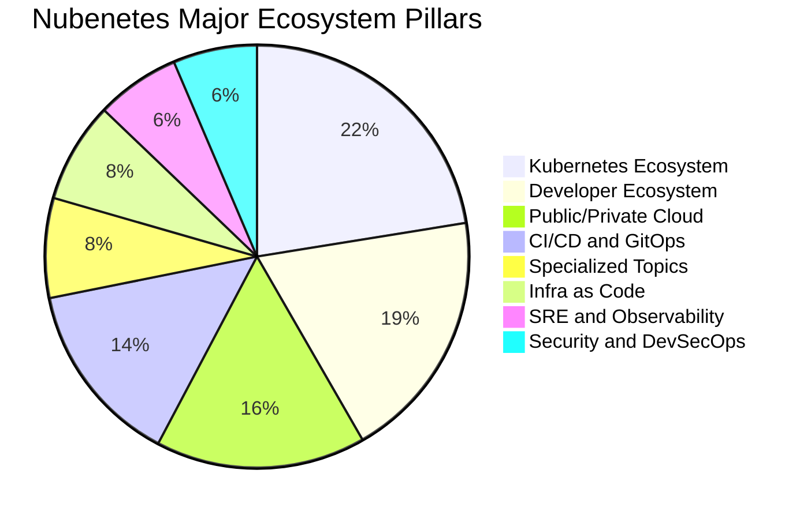
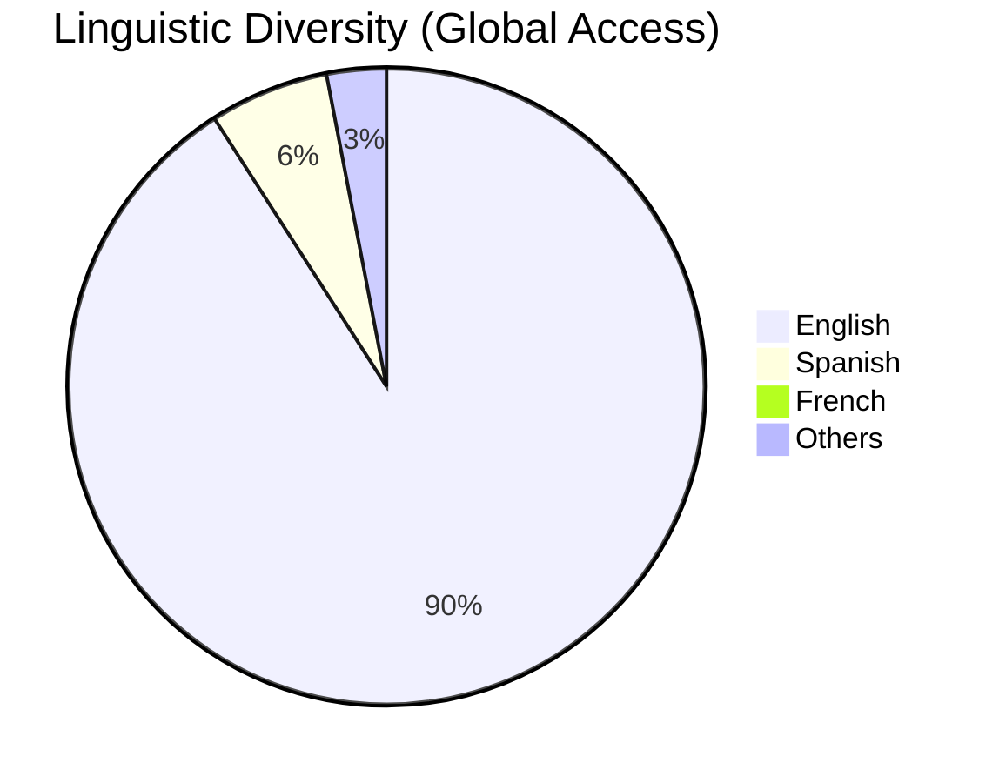
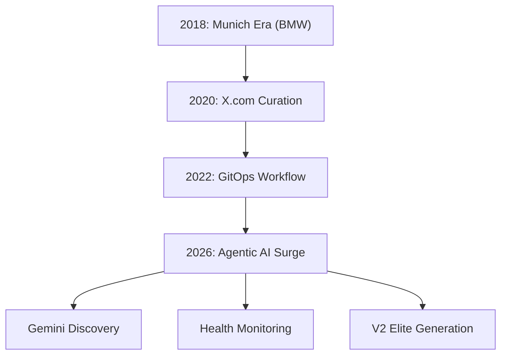
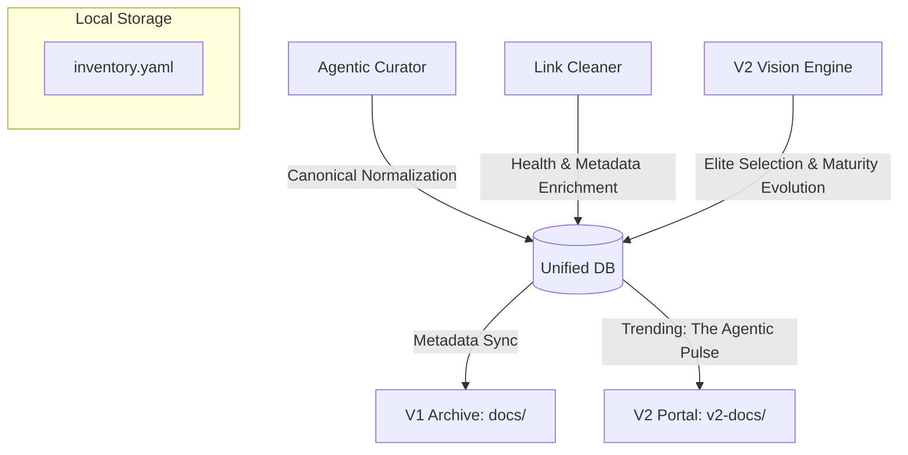

# Nubenetes: The Intelligent Cloud Native Archive 🧠☁️

[](https://github.com/nubenetes/awesome-kubernetes/actions/workflows/agentic_cron.yml)
[](https://github.com/nubenetes/awesome-kubernetes/actions/workflows/agentic_v2_builder.yml)
[](https://github.com/nubenetes/awesome-kubernetes/actions/workflows/intelligent_link_cleaner.yml)

**Nubenetes** is a high-density, curated archive of the Kubernetes, Cloud Native, and Agentic AI ecosystem. Since its inception in 2018, it has evolved from a personal collection of references into an autonomous, AI-driven knowledge engine that processes thousands of technical resources to provide a definitive "Source of Truth" for engineers worldwide.

---

## Table of Contents

1.  [1. Introduction and Motivation](#1-introduction-and-motivation)
    *   [1.1. Origins](#11-origins)
    *   [1.2. The Munich Era: Industrial-Grade Engineering (Case Study)](#12-the-munich-era-industrial-grade-engineering-case-study)
    *   [1.3. Mission](#13-mission)
    *   [1.4. 2026 Agentic High-Fidelity Standards](#14-2026-agentic-high-fidelity-standards)
2.  [2. Repository Metrics and Evolution](#2-repository-metrics-and-evolution)
    *   [2.1. The "Heart" of Nubenetes](#21-the-heart-of-nubenetes)
    *   [2.2. Top Categories by Density](#22-top-categories-by-density)
    *   [2.3. Historical Growth (Commits and References)](#23-historical-growth-commits-and-references)
    *   [2.4. Content Distribution and Semantic Clustering](#24-content-distribution-and-semantic-clustering)
        *   [2.4.1. Major Ecosystem Pillars](#241-major-ecosystem-pillars)
        *   [2.4.2. Global Linguistic Diversity](#242-global-linguistic-diversity)
3.  [3. The Agentic Stack](#3-the-agentic-stack)
4.  [4. The 2026 Architectural Shift](#4-the-2026-architectural-shift)
    *   [4.1. From Manual to Agentic](#41-from-manual-to-agentic)
    *   [4.2. Evolution Path](#42-evolution-path)
    *   [4.3. Adaptive AI Tiering and Real-time Grounding](#43-adaptive-ai-tiering-and-real-time-grounding)
    *   [4.4. Doc-as-Behavior Mandate Bridge](#44-doc-as-behavior-mandate-bridge)
5.  [5. Dual-Edition Architecture (V1 vs V2)](#5-dual-edition-architecture-v1-vs-v2)
    *   [5.1. V1: The Exhaustive Archive](#51-v1-the-exhaustive-archive)
    *   [5.2. V2: The Agentic Elite Edition](#52-v2-the-agentic-elite-edition)
    *   [5.3. The Incremental Elite Engine](#53-the-incremental-elite-engine)
    *   [5.4. Multi-Language Support Policy](#54-multi-language-support-policy)
6.  [6. The Unified Agentic Database (Knowledge Graph)](#6-the-unified-agentic-database-knowledge-graph)
    *   [6.1. Database Components](#61-database-components)
    *   [6.2. The 'Database-First' Reasoning Protocol](#62-the-database-first-reasoning-protocol)
    *   [6.3. Database Lifecycle and Hygiene](#63-database-lifecycle-and-hygiene)
    *   [6.4. Multi-Format Synchronization Logic](#64-multi-format-synchronization-logic)
    *   [6.5. Dynamic AI Discovery and Optimization](#65-dynamic-ai-discovery-and-optimization)
    *   [6.6. AI Intelligence and Observability (Transparency)](#66-ai-intelligence-and-observability-transparency)
7.  [7. AI Economic Architecture and Cost Analysis](#7-ai-economic-architecture-and-cost-analysis)
    *   [7.1. Comprehensive Economic Projections (2026 Inception)](#71-comprehensive-economic-projections-2026-inception)
    *   [7.2. Efficiency and Performance Metrics](#72-efficiency-and-performance-metrics)
    *   [7.3. Economic Sustainability Principles](#73-economic-sustainability-principles)
    *   [7.4. Strategic Selection: Pay-As-You-Go vs. Subscription](#74-strategic-selection-pay-as-you-go-vs-subscription)
    *   [7.5. Agentic Data Flow](#75-agentic-data-flow)
    *   [7.6. Strategic Benefits](#76-strategic-benefits)
8.  [8. The Agentic AI Engine](#8-the-agentic-ai-engine)
9.  [9. GitHub Workflows and Automation](#9-github-workflows-and-automation)
    *   [9.1. Workflow Inventory and Sequencing](#91-workflow-inventory-and-sequencing)
    *   [9.2. Recommended Execution Pipeline](#92-recommended-execution-pipeline)
    *   [9.3. Curation Flow Architecture](#93-curation-flow-architecture)
    *   [9.4. Deployment Lifecycle](#94-deployment-lifecycle)
    *   [9.5. Automated Mandate Auditing](#95-automated-mandate-auditing)
    *   [9.6. Multi-Part Reporting Engine](#96-multi-part-reporting-engine)
    *   [9.7. Workflow UI Auto-Sync](#97-workflow-ui-auto-sync)
10. [10. Branching Strategy and Lifecycle](#10-branching-strategy-and-lifecycle)
11. [11. Contributing to the Archive](#11-contributing-to-the-archive)
12. [12. Developer Experience and VSCode Setup](#12-developer-experience-and-vscode-setup)
    *   [12.1. Optimized "Power User" Environment](#121-optimized-power-user-environment)
    *   [12.2. Extension Recommendations (Legacy/General)](#122-extension-recommendations-legacygeneral)
    *   [12.3. Automated VS Code Tasks](#123-automated-vs-code-tasks)
    *   [12.4. Recommended settings.json](#124-recommended-settingsjson)
13. [13. Repository Inventory and Configuration](#13-repository-inventory-and-configuration)
    *   [13.1. Core Configuration](#131-core-configuration)
    *   [13.2. Centralized Metadata Databases](#132-centralized-metadata-databases)
    *   [13.3. Autonomous Workflows](#133-autonomous-workflows)
    *   [13.4. Agentic AI Source Code](#134-agentic-ai-source-code)
14. [14. Special Assets and Learning Paths](#14-special-assets-and-learning-paths)
    *   [14.1. Special Assets Management](#141-special-assets-management)
    *   [14.2. O.Reilly-style Knowledge Architecture](#142-oreilly-style-knowledge-architecture)
    *   [14.3. TOC and Structural Exceptions](#143-toc-and-structural-exceptions)

---

## 1. Introduction and Motivation

### 1.1. Origins
Nubenetes was born in 2018 during a large-scale Cloud Native project for the **BMW IT-Zentrum in Munich**. The project involved building a **self-service developer platform** (BMW ConnectedDrive) with high standards of automation, GitOps patterns, and continuous improvement.

### 1.2. The Munich Era: Industrial-Grade Engineering (Case Study)
The lessons learned from that German engineering environment—standardization, evidence-based decisions, and extreme automation—became the DNA of this repository.

**Project Scale (2016-2019):**
- **Architecture:** Migration from monolithic legacy systems to **300+ Microservices**.
- **Infrastructure:** Scaled from 4 to **19 OpenShift Clusters** worldwide.
- **Throughput:** Managed **1 Billion requests per week** with 12,000+ active containers.
- **Transformation:** 2-year full-time cultural and technical migration to a self-service IoT digital platform.

**Technological Stack (The Original DNA):**
- **Container Orchestration:** Red Hat OpenShift (3.10+), OpenStack, and AWS.
- **CI/CD Architecture:** CloudBees/OSS Jenkins, Maven, Seed Jobs, Multibranch Pipelines, and **OpenShift Source-to-Image (S2I)** patterns.
- **Automation & IaC:** Terraform, Packer, Ansible, Fabric8 Java Client, and **JobDSL/Groovy** Shared Libraries.
- **Backend Ecosystem:** Java EE (Jakarta EE) on Payara, PostgreSQL, and Flyway.
- **Quality & Security:** SonarQube, Nexus3, JMeter, Selenium, and HA-Proxy.
- **Observability:** Dynatrace APM, Prometheus, and Grafana.
- **Collaboration & ITIL:** Atlassian Suite (Jira, Bitbucket, Confluence), Rocket Chat, and BMC Remedy for ITSM Incident Management.
- **Methodology:** Scrum-based DevOps, **GitOps**, and international distributed teams.

### 1.3. Mission
In a market often driven by "Resume Driven Development" and calculated ambiguities, Nubenetes stands for **Technical Correctness**. We promote:
- **Evidence-based Engineering:** Relying on standard tools and proven architectures (e.g., OpenShift, CloudBees/Jenkins).
- **Automation over Manual Work:** If it can be scripted, it should be.
- **Knowledge Democratization:** Breaking silos by sharing high-value, production-grade resources.

> *"If you want to save the world, think like an engineer."* — Mark Stevenson

### 1.4. 2026 Agentic High-Fidelity Standards
As of May 2026, Nubenetes has reached the **Platinum Operational Tier**, featuring:
- **Real-time Web Grounding (MCP)**: The AI engine cross-references all technical decisions with live web data to ensure near-human accuracy in link rescue and maturity verification.
- **License & Compliance Guard**: Automated monitoring of repository licenses. Transitions from Open Source to restrictive models (e.g., BSL) trigger automatic penalties and review flags to protect architectural ethics.
- **Social Proof & Reputation Filter**: Every new ingestion undergoes a "Vaporware Check" on community platforms (Reddit, Hacker News) to ensure only stable, reputable tools enter the archive.
- **Autonomous Source Discovery**: The engine autonomously scans the technical web for emerging blogs and "Awesome" repos, expanding its own curation horizons without manual input.
- **Universal Rescue Protocol**: A strict "No Knowledge Left Behind" policy that salvages technical assets during corporate acquisitions and site migrations (e.g., Ansible, Nginx, AWS).
- **Foundational Preservation**: Automatic protection of high-value resources (marked with 🌟 or bold formatting), ensuring they are never deleted without manual human review.

---

## 2. Repository Metrics and Evolution

Nubenetes is one of the most comprehensive archives in the ecosystem, featuring tens of thousands of links organized by granular categories.

### 2.1. The "Heart" of Nubenetes (Stats as of 2026-05-17)

<!-- HEART_STATS_START -->
| Metric | Value |
| :--- | :--- |
| **Total Technical Resources (Links)** | **15590+** |
| **Specialized MD Pages** | **161** |
| **Total Commits** | **4194+** |
| **Primary AI Engine** | **Google Gemini (Agentic)** |
<!-- HEART_STATS_END -->

### 2.2. Top Categories by Density

<!-- TOP_CATEGORIES_START -->
| Category (Markdown Page) | Total Links |
| :--- | :---: |
| [Uncategorized](docs/uncategorized.md) | 15590 |
<!-- TOP_CATEGORIES_END -->

### 2.3. Historical Growth (Commits and References)

The growth of Nubenetes reflects the acceleration of the Cloud Native ecosystem. Since 2026, the adoption of Agentic AI has resulted in a vertical surge in both commit frequency and link discovery.

#### Annual Growth Summary
<!-- ANNUAL_GROWTH_START -->
| Year | Commits | Est. New Refs | Key Milestone |
| :---: | :---: | :---: | :--- |
| 2018 | 350 | 1,445 | **Munich Era (BMW IT-Zentrum)** |
| 2019 | 142 | 586 | Early Growth & Open Source Launch |
| 2020 | 2046 | 8,449 | **The Great Expansion** |
| 2021 | 531 | 2,193 | Maturity & Standardization |
| 2022 | 402 | 1,660 | Cloud Native Hardening |
| 2023 | 30 | 123 | Maintenance & Refinement |
| 2024 | 53 | 218 | Curation Strategy Pivot |
| 2025 | 5 | 20 | Stability & Research Phase |
| 2026 | 635 | 2,622 | **Agentic AI Surge** (May 2026 Inception) |
<!-- ANNUAL_GROWTH_END -->

#### 2026: The Agentic Monthly Surge
<!-- MONTHLY_SURGE_START -->
| Month | Commits | Est. New Refs | Status |
| :--- | :---: | :---: | :--- |
| 2026-04 | 25 | 103 | Active Curation |
| 2026-05 | 610 | 2,519 | **Agentic Inception (Gemini Era)** |
<!-- MONTHLY_SURGE_END -->

### 2.4. Content Distribution and Semantic Clustering

Nubenetes uses AI-driven semantic clustering to organize its 17,000+ resources into logical pillars. Below is a detailed breakdown of how the archive is distributed.

#### 2.4.1. Major Ecosystem Pillars
This chart shows the high-level distribution across the primary domains of Cloud Native engineering.

<!-- PILLAR_CHART_START -->

<!-- PILLAR_CHART_END -->

*   **Kubernetes Ecosystem:** Includes core K8s, tools, networking, security, and operators. This is the heart of the project, with over 3,500 curated references.
*   **Developer Ecosystem:** Covers programming languages (Go, Python, Java), VSCode, and web technologies. It reflects the "Dev" in DevOps.
*   **Public/Private Cloud:** Detailed resources for AWS, Azure, GCP, and specialized private cloud solutions like OpenShift and Rancher.

#### 2.4.2. Global Linguistic Diversity
Reflecting Nubenetes' mission of global access while maintaining technical English as the primary interface.

<!-- SUB_ECO_CHART_START -->

<!-- PILLAR_CHART_END -->

---

## 3. The Agentic Stack

The autonomy of Nubenetes is powered by a modern, resilient tech stack that ensures 24/7 curation and maintenance.

| Layer | Technology | Purpose |
| :--- | :--- | :--- |
| **Orchestration** | GitHub Actions | Scheduled and Event-driven execution (via `develop` branch). |
| **Intelligence** | Google Gemini (Multi-model) | Resource evaluation, scoring, and classification. |
| **Optimization** | Adaptive AI Tiering | Dynamic model selection (Pro/Flash) and Global rate limiting. |
| **Automation** | Python 3.11 | Core logic for parsing, gitops, and reporting. |
| **Discovery** | Twikit and Playwright | Autonomous scraping and account rotation. |
| **Resilience** | Identity Rotation | Evasion of anti-bot blocks using multiple profiles. |
| **Deployment** | MkDocs Material | High-performance static site generation for V1 and V2. |

---

## 4. The 2026 Architectural Shift

### 4.1. From Manual to Agentic
Historically, Nubenetes was curated manually by extracting references from **x.com/nubenetes** (formerly Twitter). This was a labor-intensive process that relied on human memory and periodic batch updates.

As of **May 2026**, the repository has transitioned to a **Fully Autonomous Agentic AI Architecture**. Using Google's Gemini models, the system now scans multiple sources, evaluates technical relevance, and performs self-maintenance without human intervention.

### 4.2. Evolution Path



### 4.3. Adaptive AI Tiering and Real-time Grounding
To ensure maximum throughput and industrial-grade precision, Nubenetes uses a proprietary **Multi-tier AI Orchestration** engine:
- **Smart Batching (Anti-429)**: Instead of individual calls, the system groups up to **10-50 resources into a single AI prompt**. This reduces API traffic by 90% and is mandatory for exhaustive 17k+ link runs.
- **Real-time Web Grounding (MCP-Style)**: For high-fidelity tasks, the engine activates **Google Search Grounding**. This allows the AI to verify technical maturity, site migrations, and official documentation in real-time, providing a live data filter for all decisions.
- **Dynamic Model Selection**: The system automatically toggles between **Gemini Pro** (for tasks requiring web research or deep reasoning) and **Gemini Flash** (for bulk enrichment).
- **Global Back-off & Tier-down**: If a high-fidelity model (Pro) hits a rate limit (`API 429`), the engine automatically executes an exponential back-off and "tiers down" to a lighter model or rotates API keys to ensure workflow continuity.

### 4.4. Doc-as-Behavior Mandate Bridge
Nubenetes implements a direct bridge between documentation and AI behavior:
- **Mandate Ingestion**: At the start of every workflow, the `MandateIngestor` parses the natural language instructions in [`GEMINI.md`](GEMINI.md).
- **Dynamic Context**: These mandates are injected directly into the AI's system instructions, ensuring that the bot's reasoning is always aligned with the latest project policies without requiring manual code updates.

---

## 5. Dual-Edition Architecture (V1 vs V2)

Nubenetes operates with two distinct editions to serve different engineering needs. Both are managed via GitOps and deployed to [nubenetes.com](https://nubenetes.com).

### 5.1. V1: The Exhaustive Archive
- **Purpose:** Preservation of all technical knowledge since 2018.
- **Scope:** 17,000+ links across 160+ pages.
- **Source of Truth:** The `docs/` directory.
- **Deployment:** [nubenetes.com](https://nubenetes.com)

### 5.2. V2: The Agentic Elite Edition
- **Purpose:** A high-density, enterprise-grade portal for the 2026 ecosystem.
- **Algorithm:** Uses the **Incremental Elite Engine** to select and classify top-tier resources.
- **Executive Context**: Every strategic dimension features an AI-generated **State-of-the-Art Introduction** providing high-level architectural context and industry direction before the link listings.
- **Source of Truth:** The `v2-docs/` directory (Derived from V1).
- **Deployment:** [nubenetes.com/v2/](https://nubenetes.com/v2/)

### 5.3. The Incremental Elite Engine
To maintain the high-density quality of V2 without redundant AI costs, the `V2VisionEngine` implements an incremental synchronization strategy:
1. **Intelligent Caching**: It utilizes the centralized YAML inventory to store previous AI evaluations. Only NEW links added to V1 are sent to Gemini for classification.
2. **Dynamic "Upgrading"**: Even for cached links, the engine performs real-time local updates:
   - **GitHub Metadata**: Fetches live star counts and last-commit dates via the GitHub API to ensure chronological accuracy and MVQ compliance.
   - **Maturity Tagging**: Applies a sophisticated 5-tier taxonomy (De Facto Standard, Enterprise Stable, Emerging, Legacy, Guide) based on live data.
   - **Mandatory AI Descriptions**: Ensures 100% description coverage. If a link in V1 lacks a description, the engine automatically generates a professional summary using Gemini.
3. **UI Polish**: Implements strategic highlighting (`==text==`) for top-tier resources and a clean chronological view that hides unknown dates.
4. **Flat Routing**: Both versions use `use_directory_urls: false` to ensure relative asset paths (`images/`) remain stable across all sub-pages.

### 5.4. Multi-Language Support Policy
To embrace the diverse global Cloud Native community while maintaining international discoverability, Nubenetes implements a dual-layer linguistic strategy powered by a **Data-First Architecture**:

- **Linguistic Data Persistence**: Language detection is treated as a core metadata attribute. The centralized database ([`data/inventory.yaml`](data/inventory.yaml)) stores resources using specific fields:
    *   `description`: The original native summary (e.g., Spanish) for the **V1 Archive**.
    *   `ai_summary`: A professional English synthesis for the **V2 Portal**.
    *   `language`: The identified source language (e.g., 'Spanish', 'French').
- **Separation of Concerns (Data vs. UI)**:
    *   **The Database (Source of Truth)**: Holds raw data, enabling future features like language-based filtering or statistics without re-processing links.
    *   **The Portal (Visual Rendering)**: The `V2VisionEngine` dynamically converts the metadata into visual UI tags (e.g., `[SPANISH CONTENT]`).
- **Global Discoverability**: Ensures high-value local content remains accessible in its original context (V1) while being indexed and readable by a global audience (V2).

---

## 6. The Unified Agentic Database (Knowledge Graph)

Nubenetes now utilizes a **Unified Metadata Architecture** to maintain consistency across V1 and V2 while optimizing AI performance. All links are indexed in a local YAML database that serves as the **Persistent Memory** for our autonomous agents.

### 6.1. Database Components
1.  **Central Inventory ([`data/inventory.yaml`](data/inventory.yaml))**: The universal single source of truth for technical metadata and resource lifecycle.
    *   **Core Data**: `title`, `year`, `stars` (0-5), `description` (V1 Native), `ai_summary` (V2 English), `category`.
    *   **Structural Intelligence**: `hierarchy` (Recursive list up to 10 levels), `v1_locations`, `v2_locations`.
    *   **Platinum Lifecycle**: `content_hash` (SHA256), `health_score` (0-100), `source_provenance`, `social_preview_url`, `mentions_count`.

### 6.2. The 'Database-First' Reasoning Protocol
To maximize economic efficiency, all AI agents follow a **Database-First** approach:
1.  **Local Lookup**: Before initiating any Gemini call, the agent checks if the URL is already indexed.
2.  **Insight Reuse**: If the resource exists with valid metadata, the agent **reuses existing insights**, reducing API traffic to zero.
3.  **Memory Efficiency Tracking**: The system tracks **Cache Hit Ratios** and **Estimated Token Savings** in every Intelligence Report.

### 6.3. Database Lifecycle and Hygiene
To maintain a high-performance "Single Source of Truth", Nubenetes implements automated hygiene protocols:
- **Universal Rescue Protocol (The Resurrection Rule)**: For ALL technical resources, the engine triggers a "Technical Resurrection" cycle using **Real-time Web Grounding** to identify specific paths on destination domains.
- **High-Value Preservation (The 'Review Required' Rule)**: Resources identified as **High-Value** (marked with 🌟 or bold formatting) are exempt from automatic deletion. If rescue fails, they are marked as `status: review_required` for manual verification.

#### 🕵️ Intelligent Cleaning Observability
```log
# 1. UNIVERSAL RESCUE: Finding new homes for technical assets
[19:21:25] [🔍] RESCUE ATTEMPT: 'Ansible: Migrating the Runbook' is missing.
[19:21:33] [✨] RESCUED: Found at https://probably.co.uk/posts/migrating-the-runbook...

# 2. SEMANTIC DRIFT: Detecting silent content updates via SHA256
[22:36:07] [!] DRIFT DETECTED: https://github.com/gruntwork-io/terragrunt-infrastructure...
# Meaning: Content changed significantly. Flagged for AI re-evaluation.

# 3. HIGH-VALUE PROTECTION: Shielding 'Joyas de la Corona'
[22:38:50] [⚠️] REVIEW STORED: https://www.toptechskills.com/ansible-tutorials...
# Meaning: VIP link failed. Protected from auto-deletion. Review metadata stored in BBDD.
```

- **Surgical Asset Pruning (V2)**: The V2 generation engine tracks valid dimension files and surgically prunes only orphaned files in `v2-docs/`.
- **Incremental Self-Correction**: Autonomously identifies "suspicious" resources for re-validation and resurrection.
- **Physical File Synchronization**: Performs **surgical line-by-line updates** on V1 Markdown files to update dead links or Canonical URLs.
- **Semantic Drift Detection**: Using **SHA256 Content Fingerprinting** to monitor silent updates and refresh AI evaluations.

---

## 7. AI Economic Architecture and Cost Analysis

### 7.1. Comprehensive Economic Projections (2026 Inception)
| Scenario | Tier | Avg. Tokens/Link | Total Tokens (17k) | Est. Cost (USD) |
| :--- | :--- | :---: | :---: | :---: |
| **Max Quality** | 100% Gemini Pro | 2.2k | 37.6M | **$131.70** |
| **Optimized** | **Hybrid (Pro/Flash)** | 2.2k | 37.6M | **$18.50** |
| **Economy** | 100% Gemini Flash | 2.2k | 37.6M | **$2.82** |

### 7.2. Efficiency and Performance Metrics
Nubenetes achieves **>90% cost reduction** compared to full-Pro architectures by utilizing multi-tier caching, global concurrency semaphores, and structured batching.

### 7.3. Economic Sustainability Principles
1.  **Identity Rotation (Identity A/B)**: Rotates between PAYG and Subscription keys.
2.  **The Cache Dividend**: Marginal cost drops over time as the database matures.
3.  **Quality-based Upgrading**: Only uses Pro reasoning when Flash fails a quality check.

### 7.4. Strategic Selection: Pay-As-You-Go vs. Subscription
PAYG through Vertex AI / Google AI Studio is prioritized for high-volume automation, ensuring industrial-grade RPM and data privacy.

### 7.5. Agentic Data Flow


### 7.6. Strategic Benefits
- **Incremental Self-Correction**: Reparation of historical precision errors.
- **Content-URL Precision Standard (Mandate 31)**: AI detects generic redirects and triggers the Rescue Protocol.
- **VIP Status Inheritance**: Critical project links inherit protected status during consolidation.
- **License & Compliance Guard**: Automated monitoring of repository licenses (Mandate 33).
- **Social Proof & Reputation Filter**: Real-time community vetting (Reddit, Hacker News).

---

## 8. The Agentic AI Engine

The heart of the new Nubenetes is a suite of AI Agents that operate on our `develop` branch:

1.  **AgenticCurator (`src/agentic_curator.py`)**:
    - **Discovery:** Scans multiple high-trust X.com accounts and RSS feeds.
    - **Quality Hardening (Mandate 2 & 3):** Systematically filters known blacklisted domains and applies technical impact penalties to stale GitHub repositories (>4 years without activity) to protect V2 Elite standards.
    - **Classification:** Automatically maps new resources using the **Recursive technical hierarchy** and generates multi-language descriptions (Native for V1, English for V2).
        *   **K8s & Cloud Native:** `@nubenetes`, `@kubernetesio`, `@cncf`, `@kelseyhightower`, `@memenetes`.
        *   **Hyperscalers:** `@awscloud`, `@Azure`, `@GoogleCloud`, `@0GiS0`, `@NTFAQGuy`, `@cantrillio`, `@pvergadia`, `@QuinnyPig`.
        *   **AI & Agents:** `@OpenAI`, `@AnthropicAI`, `@GoogleDeepMind`, `@GoogleAI`, `@LoganK`, `@NotebookLM`, `@LangChainAI`, `@llama_index`.
        *   **Productivity:** `@GitHub`, `@Microsoft`, `@Cursor_AI`, `@midudev`, `@natfriedman`, `@karpathy`.
        *   **Data & Infra:** `@Databricks`, `@ApacheSpark`, `@snowflakedb`, `@HashiCorp`, `@PulumiCorp`, `@ArgoProj`, `@fluxcd`.
2.  **V2VisionEngine (`src/v2_optimizer.py`)**:
    - **Elite Selection:** Scans the massive V1 archive to select the "Elite" top-tier resources.
    - **2026 Taxonomy:** Reorganizes the content into high-density dimensions (e.g., "AI and Artificial Intelligence") using **relevance-first sorting**.
    - **MVQ Hardening:** Automatically identifies stale repositories (>4 years without activity) to exclude them from the Elite portal.
3.  **IntelligentHealthChecker (`src/intelligent_health_checker.py`)**:
    - **Resilience:** Performs asynchronous health checks with 3x retry and identity rotation.
    - **V1 Integrity:** Focuses strictly on link validity (removing 404s) to ensure the exhaustive V1 archive remains accessible and error-free.
    - **Transparency:** Provides detailed, real-time unbuffered logging of all cleaning operations.

---

## 9. GitHub Workflows and Automation

### 9.1. Workflow Inventory and Sequencing
| # | Workflow | File | Purpose | Trigger | Target |
| :---: | :--- | :--- | :--- | :--- | :--- |
| 1 | Agentic Curation | `agentic_cron.yml` | Discovery Engine. | Monthly | `develop` |
| 2 | V2 Elite Builder | `agentic_v2_builder.yml` | Elite portal generation. | Push | `develop` |
| 3 | README Sync | `readme_sync.yml` | Metric synchronization. | Push | `develop` |
| 4 | Link Health Check | `intelligent_link_cleaner.yml` | Health maintenance. | Monthly | `develop` |

### 9.6. Multi-Part Reporting Engine
To handle the scale of 17,000+ resources, the system automatically fragments reports into multiple successive PR comments, ensuring 100% observability.

---

## 10. Branching Strategy and Lifecycle
- **`develop` branch**: The primary branch for all activities. All PRs MUST target this branch.
- **`master` branch**: Stable production branch. Restricted to repository owner only.

---

## 11. Contributing to the Archive
1.  **Target Branch**: Always create PRs against `develop`.
2.  **Source of Truth (V1)**: Only edit files in the `docs/` directory.
3.  **Preservation Guarantee**: AI agents will not overwrite manual descriptions or stars.

---

## 12. Developer Experience and VSCode Setup

### 12.1. Optimized "Power User" Environment
Specifically optimized for **Chromebook Plus** environments:
- **GitLens & Git Graph**: Visibility into history.
- **Markdown All in One**: Mandatory for TOC management.
- **Local Automation**: Includes `act` and Docker for running workflows locally.
- **Automated Port Forwarding**: Automatic bridging of port 8000 (MkDocs) to host OS.

### 12.2. Extension Recommendations (Legacy/General)
- [Markdown All in One](https://marketplace.visualstudio.com/items?itemName=yzhang.markdown-all-in-one)
- [Mermaid Editor](https://marketplace.visualstudio.com/items?itemName=tomoyukim.vscode-mermaid-editor)

### 12.3. Automated VS Code Tasks
- `MkDocs: Serve (Local)`
- `Agentic: Run Curation`

---

## 13. Repository Inventory and Configuration

### 13.1. Core Configuration
- [Link Rules](data/link_rules.yaml), [Curation Sources](data/curation_sources.yaml), [Special Assets](data/special_assets.yaml).

### 13.2. Centralized Metadata Databases
- [Global Inventory](data/inventory.yaml).

### 13.4. Agentic AI Source Code
- [Curator](src/agentic_curator.py), [Optimizer](src/v2_optimizer.py), [Health Checker](src/intelligent_health_checker.py), [Orchestrator](src/main.py).

---

## 14. Special Assets and Learning Paths

### 14.1. Special Assets Management
Certain files are designated as **Special Assets** (defined in [`data/special_assets.yaml`](data/special_assets.yaml)) due to their foundational importance. AI agents use recursive nested hierarchies (up to 10 levels) to organize these files without losing technical depth.

### 14.2. O.Reilly-style Knowledge Architecture
The V2 Portal is structured as a sophisticated technical reference guide:
- **Architectural Hubs**: mermaid ecosystem maps and executive prefaces.
- **Gold Nugget Highlights**: Legendary foundational masterclasses (Impact ≥ 4).
- **Gateway Hub Navigation**: semantically interconnected strategic dimensions.
- **Contextual Hierarchy**: Automated, clickable Table of Contents (TOC) with nested anchors.

### 14.3. TOC and Structural Exceptions
Configuration-heavy files or large technical tables are exempt from mandatory TOC requirements, as defined in [`data/link_rules.yaml`](data/link_rules.yaml).
