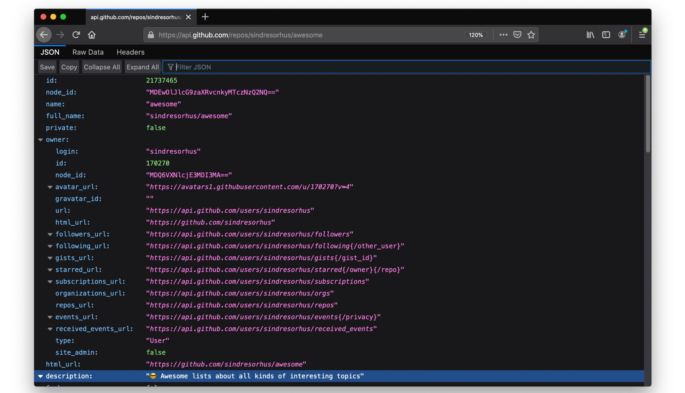

# Chrome & Firefox DevTools. HTTP Protocols & WebSockets
1. [ChromeDevTools](#chromedevtools)
2. [Firefox DevTools](#firefox-devtools)
3. [Other Tools](#other-tools)
4. [Tweets](#tweets)

## ChromeDevTools

- [devtools.chrome.com](https://devtools.chrome.com)
- [Port of Firefox's JSON Viewer](https://chrome.google.com/webstore/detail/json-viewer/efknglbfhoddmmfabeihlemgekhhnabb)
- [twitter.com/ChromeDevTools](https://twitter.com/ChromeDevTools)
- In @ChromeDevTools Network, the Copy menu is powerful for replaying network requests. Copy as Fetch API code, cURL and a Node.js fetch that includes cookie data:
- [digitalocean.com: How To Debug Node.js with the Built-In Debugger and Chrome DevTools](https://www.digitalocean.com/community/tutorials/how-to-debug-node-js-with-the-built-in-debugger-and-chrome-devtools)
- [dev.to: My 12 Favorite Chrome Extensions as a Web Developer](https://dev.to/otomer/my-12-favorite-chrome-extensions-as-a-web-developer-56eg)
- [blog.bitsrc.io: Google Chrome Hidden Features Every Developer Should Know](https://blog.bitsrc.io/google-chrome-experimental-features-for-developers-a9a7cc9d1b30)

 

## Firefox DevTools

- [Firefox DevTools](https://developer.mozilla.org/en-US/docs/Tools/Tools_Toolbox)
- Tip: Firefox has a really nice JSON viewer built in. Transforms JSON files (and API responses) into an easy to browse & search tree.

## Other Tools

- [jsontoolbox.com](https://jsontoolbox.com/)

## Tweets

  
Click to expand!

<iframe width="560" height="315" src="https://www.youtube.com/embed/WkLBrHW4NhQ" frameborder="0" allow="accelerometer; autoplay; encrypted-media; gyroscope; picture-in-picture" allowfullscreen></iframe>

<iframe width="560" height="315" src="https://www.youtube.com/embed/yGTtzcfHcdo" frameborder="0" allow="accelerometer; autoplay; encrypted-media; gyroscope; picture-in-picture" allowfullscreen></iframe>

<blockquote class="twitter-tweet">
❤️ the Performance Monitor in <a href="https://twitter.com/ChromeDevTools?ref_src=twsrc%5Etfw">@ChromeDevTools</a>. Gives you a real-time view of CPU use, JS heap size, JS event listeners, style recalcs &amp; more: <a href="https://t.co/tc6CyTya3O">https://t.co/tc6CyTya3O</a> <a href="https://t.co/BWSi8klGkE">pic.twitter.com/BWSi8klGkE</a>
&mdash; Addy Osmani (@addyosmani) <a href="https://twitter.com/addyosmani/status/1280403679380561920?ref_src=twsrc%5Etfw">July 7, 2020</a></blockquote> 

<blockquote class="twitter-tweet">
8 Google extensions every developer must use  A thread 🧵🧵
&mdash; Meet Jain🦅 (@meetjain74) <a href="https://twitter.com/meetjain74/status/1434406944932982793?ref_src=twsrc%5Etfw">September 5, 2021</a></blockquote> 

<blockquote class="twitter-tweet">
💡 Web Development tip  You can restart Chrome from the address bar by typing: chrome://restart <a href="https://t.co/0jbVoHwS1z">pic.twitter.com/0jbVoHwS1z</a>
&mdash; Csaba Kissi ⚡ (@csaba_kissi) <a href="https://twitter.com/csaba_kissi/status/1457291401197199367?ref_src=twsrc%5Etfw">November 7, 2021</a></blockquote> 

<blockquote class="twitter-tweet">
Copy link to highlight is a new Chrome feature that allows you to create links to the exact part of a web page you want to share. <a href="https://t.co/IS0jijOjvP">https://t.co/IS0jijOjvP</a> <a href="https://t.co/L9q2abGQMd">pic.twitter.com/L9q2abGQMd</a>
&mdash; Kelsey Hightower (@kelseyhightower) <a href="https://twitter.com/kelseyhightower/status/1462147617199063043?ref_src=twsrc%5Etfw">November 20, 2021</a></blockquote> 

