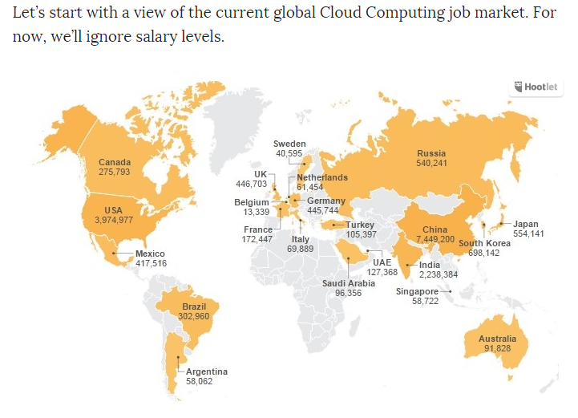

# About Nubenetes

==*"Open Source is most successful when is played as a positive sum game" (Sarah Novotny)*==

This web started in 2018, after finishing my first relevant project on cloud computing with a well known consulting firm. It was an international project coordinated from Munich with remote work from other european countries and regular flights. The client was a major multinational car manufacturer with a big investment in OpenShift and Cloudbees/Jenkins infrastructure. Our role was to help the client with their pretty large CI/CD ecosystem while also implementing a new **self-service developer platform**, involving areas of development and operations and within a DevOps model. **Requirements and way of working included continuous improvement, standardization, boilerplates and automation with a GitOps pattern**, a highly recommended approach specially in demanding projects like this with hundreds of real microservices, a large number of IaC & CI/CD pipelines, hundreds (thousands?) of developers and millions of end users.

Since then I try to apply in my country what I learnt from the germans and other european colleagues.

I'm not a freelancer and most of the time I work as a contractor, which in Spain means to be hired as an employee by an external company.

Suggesting improvements and best practices or applying quality standards and automated solutions that work well and are easy to verify shouldn't penalize a career, but it's terribly common. I am concerned about working with some colleagues or managers who consider it a threat, generating absurd conflicts, blame games and acting in bad faith or stupidly distorting the purpose of the project.

In a service driven IT sector (with calculated ambiguities and many hidden interests) the product is the hours billed by the consultant, being almost irrelevant the **content of the job and the delivered quality**. It is thus too common to find technical solutions under the policy of applying "the most difficult, non-standard, slowest and most obfuscated way possible" as a competitive element ([the hard way](https://www.fairwinds.com/blog/never-should-you-ever-in-kubernetes-1-do-k8s-the-hard-way) and doing weird things). This does not scale. Being ambiguous in JDs (not to say dishonest) without clarifying the real content of the job is easy and very well paid.

**Ambiguities about DevOps term**. Development of new ad-hoc devops tools and ad-hoc monitoring solutions should not be the role of devops specialists. DevOps professionals develop IaC and CI/CD pipelines with standard tools and code, ideally with a [cattle service model](http://cloudscaling.com/blog/cloud-computing/the-history-of-pets-vs-cattle/), GitOps patterns & [kubernetes](https://www.nextplatform.com/2021/08/02/kubernetes-expands-from-containers-to-infrastructure-management/#:~:text=More%20and%20more%20in%20the%20middleware%20layer%2C%20not%20in%20the%20hardware.) among other responsabilities such as application monitoring. The development of devops tools for kubernetes with i.e. client-go should be clearly mentioned in a JD as "software development of devops tools for kubernetes with client-go" (suitable for a software engineer with [client-go skills](https://itnext.io/generically-working-with-kubernetes-resources-in-go-53bce678f887), a developer of devops/kubernetes/monitoring tools). In addition, a DevOps specialist should not be a fullstack developer who occasionally does QA + DevOps + Cloud Design/Ops. Moreover, avoid confusing terms to justify these different backgrounds by creating two roles like DevOps Software Developer and DevOps SysAdmin. Maybe DevOps should be renamed as OpsDev to avoid misunderstandings.

A tech stack is not relevant compared to the way technology is managed. You could have the best tool and run into trouble by taking the risk of applying an unsupported or not recommended[^1] approach.

[^1]:For example: [OpenShift deployment using the UPI method instead of IPI](https://keithtenzer.com/openshift/openshift-4-aws-ipi-installation-getting-started-guide/#:~:text=OpenShift%20offers%20two%20possible%20deployment%20methods%3A%20IPI%20(as%20mentioned)%20and%20UPI%20(User%20Provisioned%20Infrastructure).%20The%20difference%20is%20the%20degree%20of%20automation%20and%20customization.%20IPI%20will%20not%20only%20deploy%20OpenShift%20but%20also%20all%20infrastructure%20components%20and%20configurations.) because of lack of permissions as an excuse.

**DevOps principles: People, processes, technology**

**[GitOps](https://opensource.com/article/21/3/gitops) principles: Correctness, doing DevOps correctly**

| __Principle__ | __Focus__ | __Main Tool__ | __Other Tools__ | __Flexibility__ | __Correctness__ |
| :---: | :---: | :---: | :---: | :---: | :---: |
| __DevOps__ | Automation and frequent deployments | CI/CD pipeline | Supply chain management, Cloud Configuration as Code, etc. | Less strict and more open | Less focus on correctness |
| __GitOps__ | ==Correctness; doing DevOps correctly== | Git | Kubernetes, Controller (e.g., Operator), separate CI/CD pipelines, Infrastructure as a Code, etc. | ==Stricter and less open== | ==Designed with correctness== |

>[The SRE Experience Is Changing with Cloud Native:](https://thenewstack.io/how-the-sre-experience-is-changing-with-cloud-native/)
>
>- From Firefighting to Prevention for SREs.
>- Empower Developers with Self-Service.
>- Facilitate Developer Autonomy.
>- Adopting a New Code-Ship-Run Paradigm.

| **Site Reliability Engineer (SRE) team**| **Developers**| **Operations team** |
|:---|:---|:---|
| Provide and teach effective use of platform tooling to empower developers to be self-sufficient | Treat SREs as application operation partners, not only as first responders to incidents | Provide self-service platform deployment and observability, and enable visibility into ramifications of actions |
|Document clear escalation paths for developers struggling in production | Turn to ops teams for the “paved path” or centralized developer control plane | Provide opinionated “paved path” platform or developer control plane (DCP), but allow developers to swap platform components if they also want to be accountable |

Avoiding standardization, automation and improvements because rivals do not invest in them is shortsighted. It is worrying because there is considerable resistance to change along with employment discrimination to prevent new proposals from succeeding. The term DevOps first appeared in 2009.

In this service driven IT sector, cloud certifications and technical assesment tests have much more weight in the selection processes that have little to do with real work. They are mostly a wall to justify the hiring of less experienced (younger and cheaper) employees. Fundamental in any profession to learn by doing while building a career and skills with decent opportunities and without too many difficulties and barriers.

A consequence of these technical assessment tests is the willingness to learn how to pass them while only implementing and practicing this specific knowledge at work. If assessments are about low level concepts then there's no interest in [abstractions](https://opensource.com/article/21/9/ansible-rest-apis), frameworks and enterprise standards (real work). Similar scenario when evaluating kubernetes knowledge with manual tasks (CLI) instead of gitops pipelines (real work[^2]).

[^2]: Manual operations with CLI are more appropriate for queries and troubleshooting (without modify permissions) when monitoring systems don't provide enough information. GitOps pipelines should be controlled and triggered by an automation server.

Inbreeding is not a good strategy in IT. Hiring people with different background and skills is a better bet. Cronyism, [kiss up kick down](https://en.wikipedia.org/wiki/Kiss_up_kick_down) and blame games hurt employee retention and economic growth. This is terrible common too. If an employee doesn't trust their manager, the company suffers. Sure, ruling through fear works, but the employee will do the bare minimum amount of work needed to keep their job (manually and without automation).

**Culture of mutual trust** is key to beating competition and increasing employee retention. When something isn't right the employee should be able to bring it up without being afraid of being fired.

We are in business to make money, perhaps not only creating value on financial markets with jargon like margin and cost effective, common in financially driven companies.

Everyone sells the same thing: cloud, devops, big data, etc. Speaking is cheap. Throwing an SQL statement doesn't make you an SQL expert. Likewise, you don't need to be an SQL expert on every job. Actually most of the jobs require generalists rather than specialists, above all in countries where most companies are SMEs.

There are very few unicorns and to a certain extent it depends a lot on the environment created.

**CKA is the top Kubernetes certification but [only a few employers require one](https://kube.careers/report-2021-q4#:~:text=How%20essential%20are,quarters%20for%202021.). Same logic applies to other certifications.**

It is surprising the numerous resources and the strategy of psychological exhaustion of recruitment companies that continuously bombard us with interviews. They also force us to transfer our data to third parties without any control of where our CV ends. It is also very common to gather information from detailed CVs and interviews to afterwards publish similar JDs that can be sold as services to potential clients. Again, only the service name is what matters, not how this is implemented and whether the client have the capacity to implement it in a proper manner.

As professionals we are obliged to a high commitment to our clients, sometimes sacrificing our well-being in order to achieve the objectives. Everyone has limits, sometimes being a personal decision to abandon a project without this entailing a penalty in the next job (we have given our CV to third parties without any control). An unfair bad reference (blame games) and calculated ambiguities can ruin our careers. And I'm not talking about an isolated case.

Losing employment and significantly penalizing employability and economic bargaining power for defending the value of automation, continuous improvement and standardization in computer engineering is a high price to pay. The alternatives often seem to be manual work with low salary expectations, lack of opportunities with new cloud jobs (better paid), promotion to a management position or emigration to countries with a different economic model (where technical jobs are better valued). This does not scale either. Freelancing worldwide is not for everyone either.

> *"One of the biggest problems in IT is that we keep reinventing the wheel. We are running the same circles, producing similar technologies to solve the same problems. Reinventing the wheel is a great way to learn how the wheel works, but not an efficient way to build software"* ([@dmokafa](https://twitter.com/dmokafa))

> *"Tech industry thinks throwing more tools to the problem is the solution. More tools = more failure modes"* ([@rakyll](https://twitter.com/rakyll))

Instead of [reinventing the wheel](https://devdriven.by/promotion/) by rewriting from scratch a new installer or ad-hoc devops tool to manage/monitor kubernetes, please pay attention to the links shared here and learn how to add value on the so called [day 2](https://dzone.com/articles/defining-day-2-operations). You will find solutions and knowledge in a practical and efficient way without being totally essential to obtain a certification to successfully complete the task. For example, if there's money for [reinventing the wheel](https://www.reddit.com/r/ExperiencedDevs/comments/pw6vuv/promotion_driven_development/) on day 1, then there's money for investing in these high value added solutions on day 2 where automation can significantly improve our lives and the quality of the delivered service. **Automation is also a key element when evaluating the delivery of a service.**

**Nubenetes shares relevant information that helps spread the new technological and cultural standards, in order to eliminate bottlenecks and [silos](https://alexander-goida.medium.com/thoughts-about-breaking-silos-of-software-engineering-teams-323d1f78ef68) and promote digital transformation.**

Does saying this publicly imply being blacklisted and losing professional opportunities? What kind of society do we live in?

Tips: ask the hiring manager what experience they have with Cloud Automation, Cloud Managed Services and K8s in Production, if they deploy OpenShift via IPI[^1] or UPI, whether they are familiar with [Gitops](https://thenewstack.io/kubernetes-at-scale-without-gitops-is-a-bad-idea/) as the correct way of doing DevOps, if they work with modern, easy-to-use automation tools ([terraform](https://registry.terraform.io/providers/hashicorp/kubernetes/latest/docs), [ansible modules](https://docs.ansible.com/ansible/latest/collections/kubernetes/core/k8s_module.html) with YAML/[Jinja templates](https://github.com/pallets/jinja/), argocd, helm, an automation server[^3] to run pipelines, declarative code in Jenkins[^4] Pipelines or in DevOps Azure Pipelines, [IaC boilerplates](https://nubenetes.com/terraform/) instead of [k8s vanilla](https://www.digitalocean.com/blog/vanilla-kubernetes-vs-managed-kubernetes), etc) or they are not practical and prefer to develop their own ad-hoc tools with millions of lines of code that need maintenance (by who?). If any doubt, ask them to show you their pipelines and custom solutions, how long it takes them to deploy and setup their k8s infra on day 1 & day 2 (pets vs cattle service model), how long it takes them to deploy a single app and if the process is fully automated or not, what monitoring solutions they have, if security and Role-based Access Control (RBAC) are implemented in their k8s clusters, whether changes and PoCs are tested first in ephemeral and isolated K8s/Cloud infra test environments with IaC & CI/CD pipelines, if solutions can be discussed within the team, etc.

[^3]: Jenkins/CloudBees, Ansible Tower/AWX, Foreman, Rundeck, Azure DevOps, GitLab CI, etc.

[^4]: Automation with [Jenkins Configuration as Code](https://www.jenkins.io/projects/jcasc/) replaces what was previously done via [Jenkins CLI](https://www.jenkins.io/doc/book/managing/cli/) and [jenkins remote REST API](https://www.jenkins.io/doc/book/using/remote-access-api/) calls (requiring backend development with tools like [swagger](https://swagger.io/) and API Testing tools like [postman](https://www.postman.com/)). Similar scenario applies to other technologies.

> [*"The absolutely difficult thing is reaching volume production without going bankrupt, that is the actual hard thing"*](https://www.youtube.com/watch?v=cdZZpaB2kDM&t=2025s) Elon Musk

??? The absolutely difficult thing is reaching volume production without going bankrupt "Click to expand!"

	

    <iframe width="560" height="315" src="https://www.youtube.com/embed/cdZZpaB2kDM?clip=UgkxWAPHZbVaNZzk9pi0lMu6k5ABLuMHBtRL&amp;clipt=EK2rfRjW9YAB" title="YouTube video player" frameborder="0" allow="accelerometer; autoplay; clipboard-write; encrypted-media; gyroscope; picture-in-picture" allowfullscreen></iframe>
	

> *"I am a big fan of the scientific method. Engineers do not build bridges from a right or left perspective, the engineer builds bridges from an evidence-based perspective and over time bridge construction has improved. On the other hand, a politician does things from a right or left perspective, and over time politics has gotten worse. When I work with politicians and two of them are in a room together, one always thinks of the other, "will they get in my way? Will they damage my reputation? Is there a conflict of interest?" On the other hand, when two engineers meet, they say, "hello! I have a problem, can you help me?" Engineers rely on evidence. If you want to save the world, think like an engineer."* [ref 1 (Youtube Clip in Spanish)](https://youtube.com/clip/Ugkx5e13a72WjgowgmAtFieyNFuiKarXWXDp), [ref 2 (English)](https://www.rtve.es/play/videos/redes/redes-claves-para-enfrentarse-mundo-hoy-vo/1714674/), [ref 3 (Spanish)](https://www.rtve.es/play/videos/redes/redes-claves-para-enfrentarse-mundo-hoy/1714673/), [ref 4 (Spanish)](https://www.youtube.com/watch?v=7ruXlR08JZ0) - [Mark Stevenson](https://markstevenson.org), writer and businessman.

??? Think like an engineer and not like a politician "Click to expand!"

	

    <iframe width="560" height="315" src="https://www.youtube.com/embed/XzpJvvsNj0E?clip=Ugkx5e13a72WjgowgmAtFieyNFuiKarXWXDp&amp;clipt=EJ-RHRja1iA" title="YouTube video player" frameborder="0" allow="accelerometer; autoplay; clipboard-write; encrypted-media; gyroscope; picture-in-picture; web-share" allowfullscreen></iframe>
    <iframe width="560" height="315" src="https://www.youtube.com/embed/7ruXlR08JZ0" title="YouTube video player" frameborder="0" allow="accelerometer; autoplay; clipboard-write; encrypted-media; gyroscope; picture-in-picture; web-share" allowfullscreen></iframe>
	

Let's improve both the private & public IT sector and the opportunities in large, medium and small companies, and give us a star on GitHub if you like this blog!!

<iframe width="200" height="200" scrolling="no" frameborder="no" allow="autoplay" src="https://w.soundcloud.com/player/?url=https%3A//api.soundcloud.com/tracks/17422127&color=%230a1ef1&auto_play=true&hide_related=false&show_comments=true&show_user=true&show_reposts=false&show_teaser=true&visual=true"></iframe>
 · <a href="https://soundcloud.com/thespaceman78/the-seatbelts-tank-ost-cowboy" title="The Seatbelts - Tank!" target="_blank" style="color: #cccccc; text-decoration: none;">The Seatbelts - Tank!</a>

----

## Cloud Computing job market in 2016

??? note "Click to expand!"

	

	"In the U.S. in 2016, 3.9 million jobs are associated with cloud computing, with 384,478 of them in IT. The median salary for IT professionals with cloud computing experience was $90,950. (Forbes)"

	

	From the above graph (credit: Forbes) we can see that the top three countries for Cloud Computing Jobs are:

	China (7.5 Million).
	USA (4 Million).
	India (2.2 Million).
	

## Stats

  
Stats 1. Click to expand!

<iframe width="560" height="315" src="https://www.youtube.com/embed/a3bnNi2R8Vo" title="YouTube video player" frameborder="0" allow="accelerometer; gyroscope; picture-in-picture" allowfullscreen></iframe>
<iframe width="560" height="315" src="https://www.youtube.com/embed/45Dt1Hdm39U" title="YouTube video player" frameborder="0" allow="accelerometer; gyroscope; picture-in-picture" allowfullscreen></iframe>
<iframe width="560" height="315" src="https://www.youtube.com/embed/YeiFMirdToA" title="YouTube video player" frameborder="0" allow="accelerometer; gyroscope; picture-in-picture" allowfullscreen></iframe>
<iframe width="560" height="315" src="https://www.youtube.com/embed/Mxny6euiars" title="YouTube video player" frameborder="0" allow="accelerometer; gyroscope; picture-in-picture" allowfullscreen></iframe>

  

    
Stats 2. Click to expand!

  

  <iframe width="560" height="315" src="https://www.youtube.com/embed/CxUDjQ0uUhI" title="YouTube video player" frameborder="0" allow="accelerometer; gyroscope; picture-in-picture" allowfullscreen></iframe>
  <iframe width="560" height="315" src="https://www.youtube.com/embed/cRuTgJHYAtI" title="YouTube video player" frameborder="0" allow="accelerometer; gyroscope; picture-in-picture" allowfullscreen></iframe>
  <iframe width="560" height="315" src="https://www.youtube.com/embed/wMsBVN4C9V4" title="YouTube video player" frameborder="0" allow="accelerometer; gyroscope; picture-in-picture" allowfullscreen></iframe>
  <iframe width="560" height="315" src="https://www.youtube.com/embed/hKPVhTolLJM" title="YouTube video player" frameborder="0" allow="accelerometer; gyroscope; picture-in-picture" allowfullscreen></iframe>
  

  

  

    
Stats 3. Inflation and Unemployment. Click to expand!

  

  <iframe width="560" height="315" src="https://www.youtube.com/embed/MrmVCMhE6BE" title="YouTube video player" frameborder="0" allow="accelerometer; gyroscope; picture-in-picture" allowfullscreen></iframe>
  <iframe width="560" height="315" src="https://www.youtube.com/embed/-Q7Ga4D6ty8" title="YouTube video player" frameborder="0" allow="accelerometer; gyroscope; picture-in-picture" allowfullscreen></iframe>
  <iframe width="560" height="315" src="https://www.youtube.com/embed/ORKXR4s2IYI" title="YouTube video player" frameborder="0" allow="accelerometer; gyroscope; picture-in-picture" allowfullscreen></iframe>
  

  

  

    
Stats 4. Government Debt and Income Tax Rate. Click to expand!

  

  <iframe width="560" height="315" src="https://www.youtube.com/embed/AhvMuxcvlt0" title="YouTube video player" frameborder="0" allow="accelerometer; gyroscope; picture-in-picture" allowfullscreen></iframe>
  <iframe width="560" height="315" src="https://www.youtube.com/embed/5kG7LscIyBE" title="YouTube video player" frameborder="0" allow="accelerometer; gyroscope; picture-in-picture" allowfullscreen></iframe>
  <iframe width="560" height="315" src="https://www.youtube.com/embed/kM4W-GY2EFU" title="YouTube video player" frameborder="0" allow="accelerometer; gyroscope; picture-in-picture" allowfullscreen></iframe>
  <iframe width="560" height="315" src="https://www.youtube.com/embed/luSH3PbM3dQ" title="YouTube video player" frameborder="0" allow="accelerometer; gyroscope; picture-in-picture" allowfullscreen></iframe>
  <iframe width="560" height="315" src="https://www.youtube.com/embed/RfOVHYllSOw" title="YouTube video player" frameborder="0" allow="accelerometer; gyroscope; picture-in-picture" allowfullscreen></iframe>
  

  

  

    
Stats 5. Corruption, Favours, Influence Peddling, Unfair Competition, No Meritocracy. Click to expand!

  

  <iframe width="560" height="315" src="https://www.youtube.com/embed/lpz2twlK4JE" title="YouTube video player" frameborder="0" allow="accelerometer; autoplay; clipboard-write; encrypted-media; gyroscope; picture-in-picture" allowfullscreen></iframe>
  <iframe width="560" height="315" src="https://www.youtube.com/embed/v_zxzysqaKk" title="YouTube video player" frameborder="0" allow="accelerometer; autoplay; clipboard-write; encrypted-media; gyroscope; picture-in-picture" allowfullscreen></iframe>
  

  

  

    
Stats 6. IT, Languages and Olympics. Click to expand!

  

  <iframe width="560" height="315" src="https://www.youtube.com/embed/2Uj1A9AguFs" title="YouTube video player" frameborder="0" allow="accelerometer; gyroscope; picture-in-picture" allowfullscreen></iframe>
  <iframe width="560" height="315" src="https://www.youtube.com/embed/Og847HVwRSI" title="YouTube video player" frameborder="0" allow="accelerometer; gyroscope; picture-in-picture" allowfullscreen></iframe>
  <iframe width="560" height="315" src="https://www.youtube.com/embed/wYJev_r5tUI" title="YouTube video player" frameborder="0" allow="accelerometer; gyroscope; picture-in-picture" allowfullscreen></iframe>
  <iframe width="560" height="315" src="https://www.youtube.com/embed/JmYz6mfT0MU" title="YouTube video player" frameborder="0" allow="accelerometer; gyroscope; picture-in-picture" allowfullscreen></iframe>
  

  

---

