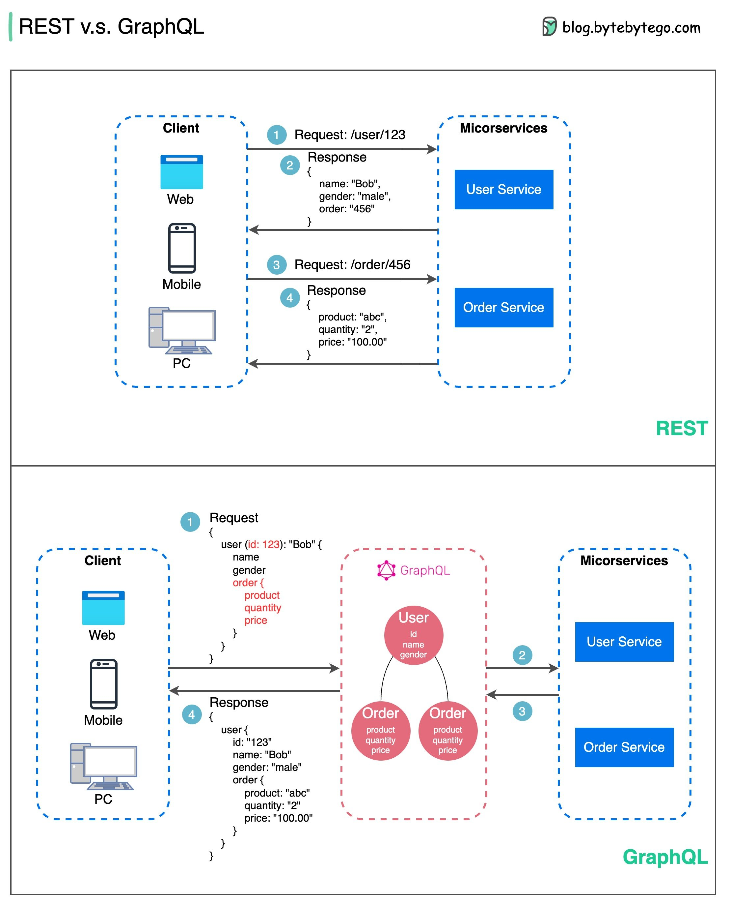

# APIs with SOAP, REST and gRPC

1. [APIs](#apis)
2. [From RESTful to Event-Driven APIs](#from-restful-to-event-driven-apis)
3. [API Gateway vs. Load Balancer: What's The Difference?](#api-gateway-vs-load-balancer-whats-the-difference)
4. [Python FastAPI](#python-fastapi)
5. [Python REST APIs with flask](#python-rest-apis-with-flask)
6. [Motivation](#motivation)
7. [State of the API Report](#state-of-the-api-report)
    1. [Postman State of the API Report](#postman-state-of-the-api-report)
    2. [Smartbear State of the API Report](#smartbear-state-of-the-api-report)
8. [Types of API Protocols. Interprocess Communication in Microservices](#types-of-api-protocols-interprocess-communication-in-microservices)
    1. [SOAP API Protocol (Simple Object Access Protocol)](#soap-api-protocol-simple-object-access-protocol)
    2. [REST API Protocol (Representational State Transfer)](#rest-api-protocol-representational-state-transfer)
        1. [OpenAPI Specification (originally known as the Swagger Specification)](#openapi-specification-originally-known-as-the-swagger-specification)
    3. [RPC API Protocol (Remote Procedure Call)](#rpc-api-protocol-remote-procedure-call)
        1. [gRPC](#grpc)
    4. [Asynchronous APIs](#asynchronous-apis)
        1. [WebSockets](#websockets)
        2. [Socket.io](#socketio)
        3. [AsyncAPI](#asyncapi)
9. [Comparisons](#comparisons)
    1. [SOAP vs REST](#soap-vs-rest)
    2. [REST vs OpenAPI vs gRPC](#rest-vs-openapi-vs-grpc)
    3. [REST vs GraphQL vs gRPC](#rest-vs-graphql-vs-grpc)
10. [Tools](#tools)
     1. [API Testing](#api-testing)
     2. [GraphQL](#graphql)
         1. [Hasura](#hasura)
11. [Browser APIs](#browser-apis)
12. [API Security](#api-security)
13. [Free Web Services (Public APIs)](#free-web-services-public-apis)
14. [Open Banking](#open-banking)
15. [RPA](#rpa)
16. [API Ops](#api-ops)
17. [Related](#related)
18. [Video APIs](#video-apis)
19. [API Business Models](#api-business-models)
20. [Videos](#videos)
21. [Images](#images)
22. [Tweets](#tweets)

## APIs

- [wikipedia: API Application Programming Interface](https://simple.wikipedia.org/wiki/Application_programming_interface)
- [postman.com: What is an API?](https://www.postman.com/what-is-an-api)
- [==github.com/public-apis/public-apis: Try Public APIs for free== 🌟](https://github.com/public-apis/public-apis) **A collective list of free APIs. Explore popular APIs and see them work in Postman.**
- [apifriends.com: What is an API?](https://apifriends.com/api-management/what-is-an-api/)
- [axway.com: What is API Management?](https://www.axway.com/en/products/api-management/what-is-api-management)
- [mulesoft.com: APIs versus web services](https://blogs.mulesoft.com/dev/api-dev/apis-versus-web-services/)
- [Youtube Playlist: Introduction to APIs](https://www.youtube.com/playlist?list=PLM-7VG-sgbtBBnWb2Jc5kufgtWYEmiMAw)
- [==Devdocs.io API Documentation== 🌟](https://devdocs.io/)
- [Dzone: 5 Tips for Better REST API Design](https://dzone.com/articles/my-5-tips-for-better-restapi-design) Good API design is difficult. Maintaining backwards compatibility, effectively testing, handling upgrades, etc. is hard to manage. Check out this guide for help!
- [thenewstack.io: 5 Ways to Succeed with an API Gateway](https://thenewstack.io/5-ways-to-succeed-with-an-api-gateway/)
- [redhat.com: An Architect's guide to APIs: SOAP, REST, GraphQL, and gRPC 🌟](https://www.redhat.com/architect/apis-soap-rest-graphql-grpc) There are many strategies for data exchange. Here's a primer on four essentials.
- [dev.to: Why RESTful API rules are not enough or good for you to design good apis?](https://dev.to/calidion/why-restful-api-rules-are-not-enough-or-good-for-you-to-design-good-apis-3530)
- [dzone: Why Is REST API Architecture Gaining Popularity in the Digital Industry? 🌟](https://dzone.com/articles/why-is-rest-api-architecture-gaining-popularity-in)
- [amazicworld.com: Why APIs can’t be missed when it comes to DevOps](https://amazicworld.com/why-apis-cant-be-missed-when-it-comes-to-devops/)
- [medium: API Gateway Part 1](https://medium.com/easyread/api-gateway-part-1-7901ba703f9) Understanding how API Gateway Works
    - [medium: API Gateway Part 2](https://medium.com/easyread/api-gateway-part-2-7264ee5be187)
- [rapidapi.com: API vs Microservices [What’s the Difference?]](https://rapidapi.com/blog/api-vs-microservices-whats-the-differences/)
- [snipcart.com: API vs. Microservices: A Beginners Guide to Understand Them 🌟](https://snipcart.com/blog/api-vs-microservices-architecture)
- [youtube: Local CRUD API Express App with Docker in 5 min](https://www.youtube.com/watch?v=UxZiDZsQoZI&ab_channel=TinyStacks)
- [freecodecamp.org: REST API Best Practices – REST Endpoint Design Examples 🌟](https://www.freecodecamp.org/news/rest-api-best-practices-rest-endpoint-design-examples/)
- [dzone: API Throttling Strategies When Clients Exceed Their Limit](https://dzone.com/articles/api-throttling-strategies) Here's how to handle clients exceeding API rate limits, as well as a few alternate strategies to explore and implement.
- [abdulrwahab.medium.com: API Architecture — Design Best Practices for REST APIs](https://abdulrwahab.medium.com/api-architecture-best-practices-for-designing-rest-apis-bf907025f5f)
- [blog.bitsrc.io: API vs Microservices — Are you using 2 terms for the same concept?](https://blog.bitsrc.io/api-vs-microservices-are-you-using-2-terms-for-the-same-concept-b51f13f5974e) No, you’re not, but let me explain
- [blog.devgenius.io: Principles & Best practices of REST API Design](https://blog.devgenius.io/best-practice-and-cheat-sheet-for-rest-api-design-6a6e12dfa89f)
- [troyhunt.com: Your API versioning is wrong, which is why I decided to do it 3 different wrong ways](https://www.troyhunt.com/your-api-versioning-is-wrong-which-is/)
- [infoq.com: A Standardized, Specification-Driven API Lifecycle](https://www.infoq.com/articles/Standardized-Specification-Driven-API-Lifecycle/)
- [levelup.gitconnected.com: What’s Wrong With Your CRUD APIs— Besides Everything?](https://levelup.gitconnected.com/whats-wrong-with-your-crudy-interfaces-besides-everything-bde4f4c8cb8a) So… I heard you worship CRUDy REST interfaces.
- [==dzone: Exploring the API-First Design Pattern==](https://dzone.com/articles/exploring-the-api-first-design-pattern) Learn how the API-first design pattern is a carbon copy of the successful writing approach that John Vester has leveraged for several years.
- [genbeta.com: Hace 20 años, este correo de Jeff Bezos en Amazon cambió para siempre la forma en que programamos apps](https://www.genbeta.com/desarrollo/hace-20-anos-este-correo-jeff-bezos-amazon-cambio-para-siempre-forma-que-programamos-apps) Un aspecto fundamental del valor de una API reside en su 'efecto red': siendo un conjunto de 'bloques de construcción digitales', cuanto mayor sea el número de funcionalidades que proporcione más cosas valiosas permitirá crear. El texto completo de la ya conocida como 'API Mandate' ('Orden API') es el siguiente:
    - Todos los equipos expondrán a partir de ahora sus datos y funcionalidad a través de interfaces de servicio.
    - Los equipos deben comunicarse entre sí a través de estas interfaces.
    - No se permitirá ninguna otra forma de comunicación entre procesos: nada de vinculación directa, ni lecturas directas del depósito de datos de otro equipo, ni modelo de memoria compartida, ni ninguna clase de puertas traseras: la única comunicación permitida será mediante llamadas a la interfaz de servicio a través de la red.
    - No importa qué tecnología utilicéis: HTTP, Corba, Pubsub, protocolos personalizados? da igual.
    - Todas las interfaces de servicio, sin excepción, deberán diseñarse desde cero para que sean externalizables. Es decir, el equipo debe planificar y diseñar para poder exponer la interfaz a los desarrolladores en el mundo exterior. Sin excepciones.
    - Cualquiera que no haga esto será despedido.
- [thenewstack.io: How to Achieve API Governance](https://thenewstack.io/how-to-achieve-api-governance/) With APIs popping up everywhere, API strategy demands common design patterns, central discoverability, and putting users first.
- [jkebertz.medium.com: The Art of Writing Amazing REST APIs](https://jkebertz.medium.com/the-art-of-writing-amazing-rest-apis-dc4c4100478d)
- [freecodecamp.org: REST API Design Best Practices Handbook – How to Build a REST API with JavaScript, Node.js, and Express.js](https://www.freecodecamp.org/news/rest-api-design-best-practices-build-a-rest-api/) When you're working with APIs, there are some basic best practices you should follow. And if you really want to learn how they work, build one yourself. In this guide Jean-Marc goes over each best practice as you build a REST API w/ JS, Node, & Express.
- [infoq.com: Modern API Development and Deployment, from API Gateways to Sidecars](https://www.infoq.com/presentations/api-design-implement-document/)
- [betterprogramming.pub: How To Deprecate APIs the Right Way](https://betterprogramming.pub/how-to-deprecate-apis-the-right-way-371c1cbf1723) Deprecate your old APIs with the consciousness of your users
- [dzone.com: REST vs. Messaging for Microservices 🌟](https://dzone.com/articles/rest-vs-messaging-for-microservices) Discover how to choose the right communication style for your microservices in this exploration of two common protocols.
- [medium.com/@ezinneanne: Best API documentation tools you need](https://medium.com/@ezinneanne/best-api-documentation-tools-you-need-cf3ef2c47e89)
- [==freecodecamp.org: Public APIs Developers Can Use in Their Projects==](https://www.freecodecamp.org/news/public-apis-for-developers/)
- [==blog.postman.com: How to choose between REST vs. GraphQL vs. gRPC vs. SOAP==](https://blog.postman.com/how-to-choose-between-rest-vs-graphql-vs-grpc-vs-soap/)
- [postman.com: API versioning](https://www.postman.com/api-platform/api-versioning/) Learn how API versioning enables teams to make changes to their API without creating problems for consumers.

## From RESTful to Event-Driven APIs

- [foojay.io: The Evolution of APIs: From RESTful to Event-Driven](https://foojay.io/today/the-evolution-of-apis-from-restful-to-event-driven/)

## API Gateway vs. Load Balancer: What's The Difference?

- [blog.hubspot.com: API Gateway vs. Load Balancer: What's The Difference?](https://blog.hubspot.com/website/api-gateway-vs-load-balancer#:~:text=An%20API%20gateway%20vs.,network%20traffic%20across%20multiple%20servers) An API gateway vs. load balancer comparison can be boiled down to the fact that they both manage traffic entering your website or application but have different roles. An API gateway handles authentication and security policies, while a load balancer API distributes network traffic across multiple servers.

## Python FastAPI

- [writersbyte.com: Introduction to APIs with Python FastAPI](https://writersbyte.com/introduction-to-apis-with-python-fastapi/)

## Python REST APIs with flask

- [==blog.devgenius.io: REST APIs with Python== 🌟](https://blog.devgenius.io/rest-apis-with-python-f330c7ffc6ab)

## Motivation

- [APIs published, APIs consumed: mainstream enterprises increasingly behave like software vendors](https://www.zdnet.com/article/apis-published-apis-consumed-mainstream-enterprises-increasingly-behave-like-software-vendors/) Mainstream enterprises increasingly reach out to customers with APIs, digital services. Unlike software providers though, many still have mostly on-premises infrastructure.
- [You Bet That APIs Power DevOps Tools](http://seguridad-informacion.blogspot.com/2020/07/you-bet-that-apis-power-devops-tools.html)

## State of the API Report

### Postman State of the API Report

- [postman.com: 2019 Postman State of the API Report 🌟](https://www.postman.com/resources/infographics/api-survey-2019/)
- [blog.postman.com: You Can Now Capture Responses Using the Postman Proxy](https://blog.postman.com/capture-responses-using-the-postman-proxy/)

### Smartbear State of the API Report

- [smartbear.com: The State of API 2019 Report 🌟](https://smartbear.com/resources/ebooks/the-state-of-api-2019-report/)

## Types of API Protocols. Interprocess Communication in Microservices

- [apifriends.com: What are the different types of APIs? 🌟](https://apifriends.com/api-creation/different-types-apis/) Types of API Protocols: SOAP, REST and RPC
- [vishnuch.tech: Interprocess Communication in Microservices 🌟](https://vishnuch.tech/interprocess-communication-in-microservices) Different IPC methods in microservices like REST API, gRPC, Kafka, RabbitMQ, etc... which developers should know.

### SOAP API Protocol (Simple Object Access Protocol)

- [wikipedia: SOAP](https://en.wikipedia.org/wiki/SOAP)
- [geeksforgeeks.org: Basics of SOAP – Simple Object Access Protocol](https://www.geeksforgeeks.org/basics-of-soap-simple-object-access-protocol/)
- For information about the latest work on SOAP and a full list of SOAP specifications refer to the [W3C Technical Reports](https://www.w3.org/TR/)
- [guru99.com: SOAP Web Services Tutorial: Simple Object Access Protocol. What is SOAP?](https://www.guru99.com/soap-simple-object-access-protocol.html)
- [jitendrazaa.com: Create SOAP message using Java](http://www.jitendrazaa.com/blog/java/create-soap-message-using-java/)
- [dzone: Creating a SOAP Web Service With Spring Boot Starter Web Services](https://dzone.com/articles/creating-a-soap-web-service-with-spring-boot-start) In this post, we cover the concepts of SOAP and REST and show you all the code you need to use SOAP web services in a Spring Boot app.

### REST API Protocol (Representational State Transfer)

- [wikipedia: REST](https://en.wikipedia.org/wiki/Representational_state_transfer)
- [geeksforgeeks.org: REST API (Introduction)](https://www.geeksforgeeks.org/rest-api-introduction/)
- [geeksforgeeks.org: REST API Architectural Constraints](https://www.geeksforgeeks.org/rest-api-architectural-constraints/)
- [mulesoft.com: What is a RESTful API?](https://www.mulesoft.com/resources/api/restful-api)
- [Dzone refcard: Foundations of **RESTful Architecture** 🌟](https://dzone.com/refcardz/rest-foundations-restful)
- [Dzone: REST API tutorials](https://dzone.com/articles/rest-api-tutorials)
- [dev.to: Make your own API under 30 lines of code 🌟](https://dev.to/shreyazz/make-your-own-api-under-30-lines-of-code-4doh)
- [dzone: REST API Versioning Strategies](https://dzone.com/articles/rest-api-versioning-strategies-1) Today microservices are a hot trend for developing cloud-native applications. API versioning helps to iterate faster when the needed changes are identified.
- [freecodecamp.org: What is REST? Rest API Definition for Beginners](https://www.freecodecamp.org/news/what-is-rest-rest-api-definition-for-beginners/)
- [blog.devgenius.io: Principles & Best practices of REST API Design](https://blog.devgenius.io/best-practice-and-cheat-sheet-for-rest-api-design-6a6e12dfa89f)
- [==javarevisited.blogspot.com: How to send POST Request with JSON Payload using Curl Command in Linux to Test RESTful Web Services?==](https://javarevisited.blogspot.com/2022/08/how-to-post-json-data-with-curl-command.html)
- [medium.com/@shubhadeepchat: Best Practices for good REST API Design](https://medium.com/@shubhadeepchat/best-practices-for-good-rest-api-design-b5fae9a62c86)
- [blog.bytebytego.com: EP94: REST API Cheatsheet](https://blog.bytebytego.com/p/ep94-rest-api-cheatsheet)
- [==freecodecamp.org: The REST API Handbook – How to Build, Test, Consume, and Document REST APIs==](https://www.freecodecamp.org/news/build-consume-and-document-a-rest-api/)

#### OpenAPI Specification (originally known as the Swagger Specification)

- [OpenAPI](https://www.openapis.org/) evolved from the [Swagger](https://swagger.io/) project. Swagger started out as a specification for documenting RESTful APIs. Later on, tools to generate client and server code and generating of test cases were added. While the original Swagger Specification was donated to the Linux Foundation and renamed the OpenAPI, Swagger remains one of the most widely used open-source toolsets for developing OpenAPIs.
- [OpenAPI](https://www.openapis.org/) (f.k.a Swagger) has introduced a set of standardized specifications for REST APIs that, among many things, allows producers and consumers of APIs to work together in designing an API before even writing a single line of code! This design-first approach has improved the experience of API developers by giving them the opportunity to use tools like [OpenAPI generator](https://openapi-generator.tech/) which takes an OpenAPI definition and generates scaffolding code for backenders, making the development of APIs much faster.
- [Wikipedia: OpenAPI Specification 🌟](https://en.wikipedia.org/wiki/OpenAPI_Specification)
- [OpenAPI FAQ. What is OpenAPI Specification (OAS)? OpenAPI Specification](https://www.openapis.org/faq) The OAS defines a standard, programming language-agnostic interface description for REST APIs, which allows both humans and computers to discover and understand the capabilities of a service without requiring access to source code, additional documentation, or inspection of network traffic.
- [apis.guru/openapi-directory: large archive of sample OpenAPI descriptions](https://apis.guru/openapi-directory/)

### RPC API Protocol (Remote Procedure Call)

- [wikipedia: RPC Remote Procedure Call](https://en.wikipedia.org/wiki/Remote_procedure_call)
- [open-rpc.org lightweight RPC framework 🌟](https://open-rpc.org/) It layers an interface description on top of JSON-RPC 2.0 and ships with a few tools to help you design, document, and test your APIs.

#### gRPC

- [gRPC](https://grpc.io/)
- [wikipedia: gRPC](https://en.wikipedia.org/wiki/GRPC)
- [developers.googleblog.com: Introducing gRPC, a new open source HTTP/2 RPC Framework](https://developers.googleblog.com/2015/02/introducing-grpc-new-open-source-http2.html)
- [nordicapis.com: Using gRPC to Connect a Microservices Ecosystem](https://nordicapis.com/using-grpc-to-connect-a-microservices-ecosystem/)
- [cncf.io: Think gRPC, when you are architecting modern microservices!](https://www.cncf.io/blog/2021/07/19/think-grpc-when-you-are-architecting-modern-microservices/)
- [itnext.io: A minimalist guide to gRPC](https://itnext.io/a-minimalist-guide-to-grpc-e4d556293422) REST API is good but is it really the best option that we have?
- [==gendocu.com: RPC API Developer Portal==](https://gendocu.com/)
- [==medium.com/javarevisited: Microservices communication using gRPC Protocol==](https://medium.com/javarevisited/microservices-communication-using-grpc-protocol-dc3a2f8b648d)
- [blog.getambassador.io: Implementing gRPC-Web with Emissary-ingress](https://blog.getambassador.io/implementing-grpc-web-with-emissary-ingress-22aa0d86aac) In this article, you'll learn how to implement gRPC-Web (a JavaScript implementation of gRPC for browser clients) with Emissary-ingress — an Envoy-based API gateway and Ingress controller

### Asynchronous APIs

#### WebSockets

- [WebSocket](https://en.wikipedia.org/wiki/WebSocket)
- [The State of Real-Time Web in 2016](https://banksco.de/p/state-of-realtime-web-2016.html)
- [SPDY and WebSocket Support at Akamai](https://blogs.akamai.com/2012/07/spdy-and-websocket-support-at-akamai.html)
- [spring.io: YMNNALFT: Websockets](https://spring.io/blog/2021/01/25/ymnnalft-websockets) Welcome to another installment of You May Not Need Another Library For That (YMNNALFT)!
- [blog.bitsrc.io: Deep Dive into WebSockets](https://blog.bitsrc.io/deep-dive-into-websockets-e6c4c7622423) Understand the important attributes of WebSockets that every developer should know
- [==betterprogramming.pub: Lambda vs. Step Functions: The Battle of Cost and Performance==](https://betterprogramming.pub/lambda-vs-step-functions-the-battle-of-cost-and-performance-5f008045e2ab) With the big push to use Step Functions over Lambda, you might be wondering “which is more cost-effective”? The answer might surprise you.
    - There are use cases for both, but the consensus for production development lives with a hybrid approach: performing a base set of actions synchronously, like validations and id creation **and kicking off the rest of the processing asynchronously**. You’d then [use a WebSocket](https://betterprogramming.pub/introduction-to-aws-websockets-8b336a92c379) to inform the user when the workflow is complete.
- [==grafana.com: How to use WebSockets to visualize real-time IoT data in Grafana==](https://grafana.com/blog/2022/04/05/how-to-use-websockets-to-visualize-real-time-iot-data-in-grafana/)

#### Socket.io

- [Socket.io](https://socket.io)
- [itnext.io: Differences between WebSockets and Socket.IO](https://itnext.io/differences-between-websockets-and-socket-io-a9e5fa29d3dc)

#### AsyncAPI

- [AsyncAPI](https://www.asyncapi.com/) Building the future of event-driven architecture. Open source tools to easily build and maintain your event-driven architecture. All powered by the AsyncAPI specification, the industry standard for defining asynchronous APIs.
- [thenewstack.io: AsyncAPI Could Be the Default API Format for Event-Driven Architectures](https://thenewstack.io/asyncapi-could-be-the-default-api-format-for-event-driven-architectures/)
- [microcks.io: Simulating CloudEvents with AsyncAPI and Microcks](https://microcks.io/blog/simulating-cloudevents-with-asyncapi/)
    - The rise of Event Driven Architecture (EDA) is a necessary evolution step towards cloud-native applications. Events are the ultimate weapon to decouple your microservices within your architecture. They are bringing great benefits like space and time decoupling, better resiliency and elasticity.
    - But events come also with challenges! One of the first you are facing when starting up as a development team - aside the technology choice - is how to describe these events structure? Another challenge that comes very quickly after being: How can we efficiently work as a team without having to wait for someone else’s events?
    - We’ll explore those particular two challenges and see how to simulate events using CloudEvents, AsyncAPI and Microcks.
    - AsyncAPI is an industry standard for defining asynchronous APIs. Our long-term goal is to make working with EDAs as easy as it is to work with REST APIs.
    - Microcks is an Open source Kubernetes-native tool for mocking/simulating and testing APIs. One purpose of Microcks is to turn your API contract (OpenAPI, AsyncAPI, Postman Collection) into live mocks in seconds. It means that once it has imported your AsyncAPI contract, Microcks start producing mock events on a message broker at a defined frequency. Using Microcks you can then simulate CloudEvents in seconds, without writing a single line of code. Microcks will allow the team relying on input events to start working without waiting for the team coding the event publication.
- [asyncapi.com: AsyncAPI and CloudEvents](https://www.asyncapi.com/blog/asyncapi-cloud-events) I've been receiving the same question for a long time now: Should I use CloudEvents or AsyncAPI? — And my response has always been the same: it depends!
    - CloudEvents: a specification for describing event data in a common way. CloudEvents seeks to ease event declaration and delivery across services, platforms and beyond!
    - AsyncAPI: Create machine-readable definitions of your event-driven APIs.

## Comparisons

- [blog.bitsrc.io: Not All Microservices Need to Be REST — 3 Alternatives to the Classic](https://blog.bitsrc.io/not-all-microservices-need-to-be-rest-3-alternatives-to-the-classic-41cedbf1a907)
- [levelup.gitconnected.com: Truth About { SOAP vs REST vs GRPC vs GraphQL } Checklist](https://levelup.gitconnected.com/truth-about-soap-vs-rest-vs-grpc-vs-graphql-checklist-f50bcb475adf)
- [medium: REST, RPC, GraphQL… What to choose?](https://medium.com/geekculture/rest-rpc-graphql-what-to-choose-c57c78c0593d) API protocols comparison from the practical straightpoint
- [blog.logrocket.com: GraphQL vs. gRPC vs. REST: Choosing the right API](https://blog.logrocket.com/graphql-vs-grpc-vs-rest-choosing-right-api/)
- [medium.com/dlt-labs-publication: gRPC vs. REST — Performance Test using JMeter](https://medium.com/dlt-labs-publication/grpc-vs-rest-performance-test-using-jmeter-f17e5ba1c23b)

### SOAP vs REST

- [geeksforgeeks.org: Difference between REST API and SOAP API](https://www.geeksforgeeks.org/difference-between-rest-api-and-soap-api/)
- [dzone: A Comprehensive Guide to REST vs. SOAP](https://dzone.com/articles/comprehensive-guide-rest-vs-soap) Learn the primary differences between REST and SOAP APIs, each one's benefits, and when it's appropriate to use the two.
- [dzone: Web Services Architecture – When to Use SOAP vs REST](https://dzone.com/articles/web-services-architecture) Learn why SOAP (Simple Object Access Protocol) and REST (Representation State Transfer) are popular with developers working on system integration projects.
- [dzone: Comparing RESTful APIs and SOAP APIs Using MuleSoft as an Example](https://dzone.com/articles/comparing-restful-apis-and-soap-apis)
- [reply.com: Web Services: SOAP and REST - A Simple Introduction](https://www.reply.com/solidsoft-reply/en/content/webservices-soap-and-rest-a-simple-introduction)
    - SOAP is a communications protocol while REST is a set of architectural principles for data transmission.
    - REST was designed to be a more straightforward and easy to implement alternative to heavyweight SOAP for web service access. SOAP functions well in distributed environments where REST assumes a direct point to point communication. Also, SOAP allows for services to describe themselves to clients and in some languages allows for automation. On the other hand, REST is fast as less processing is required, uses less bandwidth and is closer to technologies used in web design.
    - The choice on which to use is totally dependent on what the requirement. For example, SOAP is a better choice for applications that have complex API so as to describe the services and methods, where formal contracts are agreed for the exchange format, where a guaranteed level of security is required etc. REST will be preferred when limiting bandwidth and resources, when operations are can be stateless and the information can be cached.
- [baeldung.com: REST vs SOAP](https://www.baeldung.com/cs/rest-vs-soap)

### REST vs OpenAPI vs gRPC

- [REST vs. gRPC: Battle of the APIs](https://code.tutsplus.com/tutorials/rest-vs-grpc-battle-of-the-apis--cms-30711)
- [Comparing OpenAPI With gRPC 🌟](https://dzone.com/articles/comparing-openapi-with-grpc) OpenAPI is a great choice due to its interoperability. On the other hand, gRPC offers a better performance. Luckily, you don't have to choose one or the other.
- [imaginarycloud.com: gRPC vs REST: Comparing APIs Architectural Styles](https://www.imaginarycloud.com/blog/grpc-vs-rest/)

### REST vs GraphQL vs gRPC

- [danhacks.com: REST vs. GraphQL vs. gRPC](https://www.danhacks.com/software/grpc-rest-graphql.html)

## Tools

- [OpenAPI Generator 🌟](https://openapi-generator.tech/) Generate clients, servers, and documentation from OpenAPI 2.0/3.x documents
- [dev.to: 7 API Tools for REST Developers and Testers](https://dev.to/javinpaul/7-api-tools-for-rest-developers-and-testers-n67)

### API Testing

- [softwaretestingportal.com: API Testing, Key Terminologies and more...](http://www.softwaretestingportal.com/2020/03/31/api-testing/)
- [dzone.com: 10 API Testing Tips for Beginners (SOAP and REST)](https://dzone.com/articles/10-api-testing-tips-for-beginners-soap-amp-rest) Let's take a look at ten API testing tips for beginners with a focus on REST APIs and SOAP APIs.
- [blog.testproject.io: Top 10 API Testing Tools to Watch in 2020 🌟](https://blog.testproject.io/2020/06/25/top-10-api-testing-tools-to-watch-in-2020/)
- [mockoon 🌟](https://mockoon.com/) Create mock APIs in seconds. Mockoon is the easiest and quickest way to run mock API locally. No remote deployment, no account required, open source.
- [thenewstack.io: 4 Essential Tools for Protecting APIs and Web Applications](https://thenewstack.io/4-essential-tools-for-protecting-apis-and-web-applications/)
- [youtube: API Testing Part 1- API Core Concepts](https://www.youtube.com/watch?v=b0D_bkcT4a4&t=1s&ab_channel=SoftwareDiagnosticsCenter)
- [blog.testproject.io: API Testing 101 🌟](https://blog.testproject.io/2021/06/16/api-testing-101/)
- [microcks.io 🌟](https://microcks.io/) Open source Kubernetes Native tool for API Mocking and Testing. If you are looking for a tool that helps in microservices API testing on Kubernetes it is worth taking a look at microcksio. It supports OpenAPI 3 and e.g. Kafka with [Avro encoding](https://microcks.io/documentation/guides/avro-messaging/)
- [tricentis.com: Getting started with automated continuous performance testing](https://www.tricentis.com/blog/automated-continuous-performance-testing)
- [dev.to: Top 15 Automated API Testing Tools](https://dev.to/katalon/top-15-automated-api-testing-tools-lasted-update-32ip)
- [opensource.com: 3 ways to test your API with Python](https://opensource.com/article/21/9/unit-test-python) Unit testing can be daunting, but these Python modules will make your life much easier.

### GraphQL

- [GraphQL](https://graphql.org/) A query language for your API
- [How is the OpenAPI Specification different from GraphQL?](https://www.openapis.org/faq) How are screws better than nails? Both are useful tools that solve similar problems in slightly different ways. OpenAPI Specification offers a declarative contract that defines the structure of API requests and responses as discrete operations. GraphQL prefers an interface style that is more like querying a database and is best suited to graph databases.
- [Hasura Launches Beta of GraphQL-Based Remote Joins Tool](https://devops.com/hansura-launches-beta-of-graphql-based-remote-joins-tool/)
- [thenewstack.io: Why Backend Developers Should Fall in Love with GraphQL too](https://thenewstack.io/why-backend-developers-should-fall-in-love-with-graphql-too/)
- [blog.dream11engineering.com: Lessons learned from running GraphQL at scale](https://blog.dream11engineering.com/lessons-learned-from-running-graphql-at-scale-2ad60b3cefeb)
- [world.hey.com: Another REST vs GraphQL comparison](https://world.hey.com/sammy.henningsson/another-rest-vs-graphql-comparison-8e8357bb)
- [dzone: A Schema Architecture for Microservices](https://dzone.com/articles/a-schema-architecture-for-microservices)
- [medium.datadriveninvestor.com: Everything You Wanted to Know About GraphQL (But Were Afraid to Ask)](https://medium.datadriveninvestor.com/everything-you-wanted-to-know-about-graphql-but-were-afraid-to-ask-ad66980116cb) API’s are Everywhere now. So, modern developers need an efficient Query Language, GraphQL. Learn everything about this query language used by Twitter, Facebook, Github, Shopify, Pinterest and thousands more.
- [betterprogramming.pub: Building GraphQL Server Using Schema-first Approach in Python](https://betterprogramming.pub/building-graphql-server-using-schema-first-approach-in-python-68aeee38bcc3) Handle CRUD operations with ease

#### Hasura

- [Hasura 🌟](https://hasura.io/) Instant realtime GraphQL APIs for all your data
    - Build modern apps and APIs 10x faster
    - TickInstant GraphQL & REST APIs
    - TickBuilt in authorization for secure data access
    - TickOpen source

## Browser APIs

- [betterprogramming.pub: 4 Awesome Browser APIs You Might Not Be Using Yet](https://betterprogramming.pub/4-awesome-browser-apis-you-might-not-be-using-yet-726d3e3237d2) Keep them handy. They can be super useful!

## API Security

- [devops.com: Web Application Security is not API Security 🌟](https://devops.com/web-application-security-is-not-api-security/)
- [biztechmagazine.com: 6 Steps to Improved API Security](https://biztechmagazine.com/article/2021/07/6-steps-improved-api-security) Application programming interfaces are critical to businesses. Tech leaders must do more to protect them.
- [portswigger.net: Introducing vAPI – an open source lab environment to learn about API security](https://portswigger.net/daily-swig/introducing-vapi-an-open-source-lab-environment-to-learn-about-api-security)
- [thenewstack.io: Developer, Beware: The 3 API Security Risks You Can’t Overlook](https://thenewstack.io/developer-beware-the-3-api-security-risks-you-cant-overlook/)
- [==medium.com/@sajjadfazlani: How to protect your APIs and Microservices?== 🌟](https://medium.com/@sajjadfazlani/how-to-protect-your-apis-and-microservices-f22b99ce2322) **The simplest answer is to enforce 1) Zero Trust and 2) Mitigate the critical security vulnerabilities by considering the OWASP top 10 recommendations.**

## Free Web Services (Public APIs)

- [free-web-services.com](http://free-web-services.com/)
- [SwaggerHub: Free Web Service](https://swagger.io/tools/swaggerhub/)
- [programmableweb.com](https://www.programmableweb.com/)
- [any-api.com](https://any-api.com/)
- [Rapid API](https://rapidapi.com/)

## Open Banking

- [Open Banking](https://en.wikipedia.org/wiki/Open_banking)
- [thenewstack.io: A Digital Transformation Journey in the Banking Sector](https://thenewstack.io/a-digital-transformation-journey-in-the-banking-sector/)

## RPA

- [thenewstack.io: True Success in Process Automation Requires Microservices](https://thenewstack.io/true-success-in-process-automation-requires-microservices/)

## API Ops

- [thenewstack.io: How Platform Ops Teams Should Think About API Strategy](https://thenewstack.io/how-platform-ops-teams-should-think-about-api-strategy/) **Platform Ops Is API Ops**

## Related

- [medium: Do I Need an API Gateway if I Use a Service Mesh? 🌟](https://blog.christianposta.com/microservices/do-i-need-an-api-gateway-if-i-have-a-service-mesh/)
- [Dzone: How to Create a REST API With Spring Boot](https://dzone.com/articles/how-to-create-rest-api-with-spring-boot)
- [Dzone: Step-By-Step Spring Boot RESTful Web Service Complete Example](https://dzone.com/articles/spring-boot-restful-web-service-complete-example)
- [Creando un API REST en Java (parte 1)](https://www.oscarblancarteblog.com/2018/06/25/creando-un-api-rest-en-java-parte-1/)
- [dev.to: Rapid API Creation with AWS Amplify](https://dev.to/fllstck/rapid-api-creation-with-aws-amplify-3c8i)
- [portal.dev](https://portal.dev/) Build beautiful API documentation. Portal lets you create, publish, and maintain your API docs with ease.
- [openapi-comment-parser](https://github.com/bee-travels/openapi-comment-parser) A clean and simple way to document your code for generating OpenAPI (Swagger) specs.
    - [IBM creates an open source tool to simplify API documentation](https://www.techrepublic.com/article/ibm-creates-an-open-source-tool-to-simplify-api-documentation/)

## Video APIs

- [Mux: The API to Video](https://mux.com/)
    - [softwareengineeringdaily.com: Kubernetes vs. Serverless with Matt Ward (podcast) 🌟](https://softwareengineeringdaily.com/2020/12/29/kubernetes-vs-serverless-with-matt-ward-repeat/)

## API Business Models

- [API Business Models. 20 Models in 20 Minutes](https://www.infoq.com/presentations/API-Business-Models/)

## Videos

??? note "Click to expand!"

	

    <iframe width="560" height="315" src="https://www.youtube.com/embed/yWzKJPw_VzM" title="YouTube video player" frameborder="0" allow="accelerometer; autoplay; clipboard-write; encrypted-media; gyroscope; picture-in-picture" allowfullscreen></iframe>
	

## Images

??? note "Click to expand!"

	

	[{: style="width:50%"}](https://blog.testproject.io/2020/06/25/top-10-api-testing-tools-to-watch-in-2020/)

	

	

	

    
	

## Tweets

  
Click to expand!

<blockquote class="twitter-tweet">
People complain about tooling fatigue but web dev in 2021 is 10x simpler than in 2011. You just gotta pick the right tools.  Infra: <a href="https://twitter.com/PulumiCorp?ref_src=twsrc%5Etfw">@PulumiCorp</a>  Data: <a href="https://twitter.com/PostgreSQL?ref_src=twsrc%5Etfw">@PostgreSQL</a>  API: <a href="https://twitter.com/HasuraHQ?ref_src=twsrc%5Etfw">@HasuraHQ</a>  Frontend: <a href="https://twitter.com/vercel?ref_src=twsrc%5Etfw">@vercel</a>&#39;s NextJS  And no proprietary bullshit—100% open source!
&mdash; gunar.uk (@gunar) <a href="https://twitter.com/gunar/status/1395744592071323651?ref_src=twsrc%5Etfw">May 21, 2021</a></blockquote> 

<blockquote class="twitter-tweet">
/1 REST is the most common communication standard between computers over the internet. What is it? Why is it so popular? Let&#39;s take a look at this thread. <a href="https://t.co/GBdBcC56aF">pic.twitter.com/GBdBcC56aF</a>
&mdash; Alex Xu (@alexxubyte) <a href="https://twitter.com/alexxubyte/status/1562840039142281216?ref_src=twsrc%5Etfw">August 25, 2022</a></blockquote> 

<blockquote class="twitter-tweet">
Optimize API performance with these 5 tips.  Thread🧵👇
&mdash; RapidAPI (@Rapid_API) <a href="https://twitter.com/Rapid_API/status/1583599981369303040?ref_src=twsrc%5Etfw">October 21, 2022</a></blockquote> 

<blockquote class="twitter-tweet">
API Testing. What is it?  Thread 🧵👇
&mdash; RapidAPI (@Rapid_API) <a href="https://twitter.com/Rapid_API/status/1584530377686646784?ref_src=twsrc%5Etfw">October 24, 2022</a></blockquote> 

<blockquote class="twitter-tweet">
Authentication vs. Authorization – What&#39;s the difference?  A thread 🧵
&mdash; RapidAPI (@Rapid_API) <a href="https://twitter.com/Rapid_API/status/1585617284562812928?ref_src=twsrc%5Etfw">October 27, 2022</a></blockquote> 

<blockquote class="twitter-tweet">
Let&#39;s discuss how we can handle CORS in Express.  Thread 🧵👇
&mdash; RapidAPI (@Rapid_API) <a href="https://twitter.com/Rapid_API/status/1585680710945439744?ref_src=twsrc%5Etfw">October 27, 2022</a></blockquote> 

<blockquote class="twitter-tweet">
HTTP headers that developers should be aware of.  Thread🧵👇
&mdash; RapidAPI (@Rapid_API) <a href="https://twitter.com/Rapid_API/status/1590690709299929090?ref_src=twsrc%5Etfw">November 10, 2022</a></blockquote> 

<blockquote class="twitter-tweet">
OAuth2, features, and advantages.  Thread 🧵👇
&mdash; RapidAPI (@Rapid_API) <a href="https://twitter.com/Rapid_API/status/1591229825393491968?ref_src=twsrc%5Etfw">November 12, 2022</a></blockquote> 

<blockquote class="twitter-tweet">
How to increase API performance?  Thread 🧵👇
&mdash; RapidAPI (@Rapid_API) <a href="https://twitter.com/Rapid_API/status/1591167663165898754?ref_src=twsrc%5Etfw">November 11, 2022</a></blockquote> 

<blockquote class="twitter-tweet">
Different Architectural Styles of APIs  Thread 🧵👇
&mdash; RapidAPI (@Rapid_API) <a href="https://twitter.com/Rapid_API/status/1595938033559375874?ref_src=twsrc%5Etfw">November 25, 2022</a></blockquote> 

<blockquote class="twitter-tweet">
What is GraphQL? When should we use it?  How is GraphQL the same as REST? How are they different? Let’s dive deeper.  Watch here: <a href="https://t.co/AF9GfbgBWZ">https://t.co/AF9GfbgBWZ</a> <a href="https://t.co/EUgGe82rNu">pic.twitter.com/EUgGe82rNu</a>
&mdash; Bytebytego (@bytebytego) <a href="https://twitter.com/bytebytego/status/1597376508821405696?ref_src=twsrc%5Etfw">November 28, 2022</a></blockquote> 

<blockquote class="twitter-tweet">
Local Storage. What is it?  Thread 🧵👇
&mdash; RapidAPI (@Rapid_API) <a href="https://twitter.com/Rapid_API/status/1597364461681131520?ref_src=twsrc%5Etfw">November 28, 2022</a></blockquote> 

<blockquote class="twitter-tweet">
Best Practices for Securing API Keys  Thread 🧵👇
&mdash; RapidAPI (@Rapid_API) <a href="https://twitter.com/Rapid_API/status/1602364128382914582?ref_src=twsrc%5Etfw">December 12, 2022</a></blockquote> 

<blockquote class="twitter-tweet">
API Authentication methods  Thread 🧵👇
&mdash; RapidAPI (@Rapid_API) <a href="https://twitter.com/Rapid_API/status/1607357310875193350?ref_src=twsrc%5Etfw">December 26, 2022</a></blockquote> 

<blockquote class="twitter-tweet">
Here, we&#39;ll discuss the three most commonly used API authentication techniques:  - HTTP Authentication - API Keys (Bearer token, JSON Web Token) - OAuth
&mdash; RapidAPI (@Rapid_API) <a href="https://twitter.com/Rapid_API/status/1607357314989694977?ref_src=twsrc%5Etfw">December 26, 2022</a></blockquote> 

<blockquote class="twitter-tweet">
HTTP Status codes worth knowing about  Thread 🧵👇
&mdash; RapidAPI (@Rapid_API) <a href="https://twitter.com/Rapid_API/status/1607542503623860224?ref_src=twsrc%5Etfw">December 27, 2022</a></blockquote> 

<blockquote class="twitter-tweet">
What exactly is CORS, and how does it work?  Thread 🧵
&mdash; RapidAPI (@Rapid_API) <a href="https://twitter.com/Rapid_API/status/1607718404038840320?ref_src=twsrc%5Etfw">December 27, 2022</a></blockquote> 

<blockquote class="twitter-tweet">
What is an API? <a href="https://t.co/FBQfcGDsdh">pic.twitter.com/FBQfcGDsdh</a>
&mdash; RapidAPI (@Rapid_API) <a href="https://twitter.com/Rapid_API/status/1607913741215207424?ref_src=twsrc%5Etfw">December 28, 2022</a></blockquote> 

<blockquote class="twitter-tweet">
Difference between API Authentication and API Authorization.  Thread 🧵👇
&mdash; RapidAPI (@Rapid_API) <a href="https://twitter.com/Rapid_API/status/1608077094952607746?ref_src=twsrc%5Etfw">December 28, 2022</a></blockquote> 

<blockquote class="twitter-tweet">
How does JSON web token (JWT) authentication work?  Thread 🧵👇🏻
&mdash; RapidAPI (@Rapid_API) <a href="https://twitter.com/Rapid_API/status/1608267311022211074?ref_src=twsrc%5Etfw">December 29, 2022</a></blockquote> 

<blockquote class="twitter-tweet">
What is the difference between an API and a Microservice?  Thread 🧵👇
&mdash; RapidAPI (@Rapid_API) <a href="https://twitter.com/Rapid_API/status/1608443951840632835?ref_src=twsrc%5Etfw">December 29, 2022</a></blockquote> 

<blockquote class="twitter-tweet">
API security best practices 👇  { 1 / 6 } <a href="https://t.co/0IjjK7zhWv">pic.twitter.com/0IjjK7zhWv</a>
&mdash; RapidAPI (@Rapid_API) <a href="https://twitter.com/Rapid_API/status/1608825046750855169?ref_src=twsrc%5Etfw">December 30, 2022</a></blockquote> 

<blockquote class="twitter-tweet">
What is a REST API?  Thread 🧵👇
&mdash; Rapid (@Rapid_API) <a href="https://twitter.com/Rapid_API/status/1620059239069716484?ref_src=twsrc%5Etfw">January 30, 2023</a></blockquote> 

<blockquote class="twitter-tweet">
10 API related terms that every developer should be aware of  Thread 🧵👇
&mdash; Rapid (@Rapid_API) <a href="https://twitter.com/Rapid_API/status/1622595951369093120?ref_src=twsrc%5Etfw">February 6, 2023</a></blockquote> 

<blockquote class="twitter-tweet">
What are CRUD operations?  Thread 🧵👇
&mdash; Rapid (@Rapid_API) <a href="https://twitter.com/Rapid_API/status/1622708700212350976?ref_src=twsrc%5Etfw">February 6, 2023</a></blockquote> 

<blockquote class="twitter-tweet">
How do Webhooks work?👇 <a href="https://t.co/9CQ76uhY4l">pic.twitter.com/9CQ76uhY4l</a>
&mdash; Rapid (@Rapid_API) <a href="https://twitter.com/Rapid_API/status/1622958145281597441?ref_src=twsrc%5Etfw">February 7, 2023</a></blockquote> 

<blockquote class="twitter-tweet">
How to use Axios to make API requests.  Thread 🧵👇
&mdash; Rapid (@Rapid_API) <a href="https://twitter.com/Rapid_API/status/1622737929436114945?ref_src=twsrc%5Etfw">February 6, 2023</a></blockquote> 

<blockquote class="twitter-tweet">
Five GPT-3 based APIs for your next side project.  Thread 🧵👇
&mdash; Rapid (@Rapid_API) <a href="https://twitter.com/Rapid_API/status/1623027032710955008?ref_src=twsrc%5Etfw">February 7, 2023</a></blockquote> 

<blockquote class="twitter-tweet">
API Design best practices  Thread 🧵👇
&mdash; Rapid (@Rapid_API) <a href="https://twitter.com/Rapid_API/status/1623754827611209730?ref_src=twsrc%5Etfw">February 9, 2023</a></blockquote> 

<blockquote class="twitter-tweet">
HTTP 2xx Status Codes worth knowing about  Thread 🧵👇
&mdash; Rapid (@Rapid_API) <a href="https://twitter.com/Rapid_API/status/1623802395703533568?ref_src=twsrc%5Etfw">February 9, 2023</a></blockquote> 

<blockquote class="twitter-tweet">
What&#39;s the difference between the HTTP methods PUT and PATCH?   A thread 👇  { 1 / 5 } <a href="https://t.co/lTCpIGU9l3">pic.twitter.com/lTCpIGU9l3</a>
&mdash; Rapid (@Rapid_API) <a href="https://twitter.com/Rapid_API/status/1624045287172984832?ref_src=twsrc%5Etfw">February 10, 2023</a></blockquote> 

<blockquote class="twitter-tweet">
What&#39;s the difference between API and microservice?  Thread 🧵👇
&mdash; Rapid (@Rapid_API) <a href="https://twitter.com/Rapid_API/status/1625606823561535496?ref_src=twsrc%5Etfw">February 14, 2023</a></blockquote> 

<blockquote class="twitter-tweet">
Top location APIs that you can use in your next project  Thread 🧵👇
&mdash; Rapid (@Rapid_API) <a href="https://twitter.com/Rapid_API/status/1625986027604045825?ref_src=twsrc%5Etfw">February 15, 2023</a></blockquote> 

<blockquote class="twitter-tweet">
Cloud and APIs. How does it work?  Thread 🧵👇
&mdash; Rapid (@Rapid_API) <a href="https://twitter.com/Rapid_API/status/1626944612550975489?ref_src=twsrc%5Etfw">February 18, 2023</a></blockquote> 

<blockquote class="twitter-tweet">
8 APIs that you can use in your next side project  Thread 🧵👇
&mdash; Rapid (@Rapid_API) <a href="https://twitter.com/Rapid_API/status/1627739094418616320?ref_src=twsrc%5Etfw">February 20, 2023</a></blockquote> 

<blockquote class="twitter-tweet">
How does JSON web token (JWT) authentication work?  Thread 🧵👇
&mdash; Rapid (@Rapid_API) <a href="https://twitter.com/Rapid_API/status/1628393919124852738?ref_src=twsrc%5Etfw">February 22, 2023</a></blockquote> 

<blockquote class="twitter-tweet">
REST API development tips 👇  { 1 / 6 } <a href="https://t.co/9L2QKReuRp">pic.twitter.com/9L2QKReuRp</a>
&mdash; Rapid (@Rapid_API) <a href="https://twitter.com/Rapid_API/status/1629104010916503554?ref_src=twsrc%5Etfw">February 24, 2023</a></blockquote> 

<blockquote class="twitter-tweet">
Benefits of API caching 👇🧵
&mdash; Rapid (@Rapid_API) <a href="https://twitter.com/Rapid_API/status/1629269919610044416?ref_src=twsrc%5Etfw">February 24, 2023</a></blockquote> 

<blockquote class="twitter-tweet">
Difference between API and Webhook  Thread 🧵👇
&mdash; Rapid (@Rapid_API) <a href="https://twitter.com/Rapid_API/status/1630273097994575873?ref_src=twsrc%5Etfw">February 27, 2023</a></blockquote> 

<blockquote class="twitter-tweet">
/1 What are the API architectural styles?  The diagram below shows the common API architectural styles in one picture:  1. REST 2. GraphQL 3. Web socket 4. Webhook 5. gRPC 6. SOAP <a href="https://t.co/ojmpp12A09">pic.twitter.com/ojmpp12A09</a>
&mdash; Alex Xu (@alexxubyte) <a href="https://twitter.com/alexxubyte/status/1630247687114330120?ref_src=twsrc%5Etfw">February 27, 2023</a></blockquote> 

<blockquote class="twitter-tweet">
Introduction to GraphQL queries.  A thread 🧵👇
&mdash; Rapid (@Rapid_API) <a href="https://twitter.com/Rapid_API/status/1633900716703006738?ref_src=twsrc%5Etfw">March 9, 2023</a></blockquote> 

<blockquote class="twitter-tweet">
Let’s talk about different API testing methods.  Thread 🧵👇
&mdash; Rapid (@Rapid_API) <a href="https://twitter.com/Rapid_API/status/1635264412574535682?ref_src=twsrc%5Etfw">March 13, 2023</a></blockquote> 

<blockquote class="twitter-tweet">
API Integration. What is it?  Thread 🧵👇
&mdash; Rapid (@Rapid_API) <a href="https://twitter.com/Rapid_API/status/1635688708098732055?ref_src=twsrc%5Etfw">March 14, 2023</a></blockquote> 

<blockquote class="twitter-tweet">
How to avoid API rate limits?  A thread 🧵👇
&mdash; Rapid (@Rapid_API) <a href="https://twitter.com/Rapid_API/status/1635989229879676930?ref_src=twsrc%5Etfw">March 15, 2023</a></blockquote> 

<blockquote class="twitter-tweet">
Difference between JSON and XML  - Structure - Performance - Compatibility - Usage - Supported types - Readability - Flexibility  Thread 🧵👇
&mdash; Rapid (@Rapid_API) <a href="https://twitter.com/Rapid_API/status/1636854650748928000?ref_src=twsrc%5Etfw">March 17, 2023</a></blockquote> 

<blockquote class="twitter-tweet">
Let&#39;s talk about APIs  - What is an API - Usage of APIs - Types of APIs - Benefits of APIs  Thread 🧵👇
&mdash; Rapid (@Rapid_API) <a href="https://twitter.com/Rapid_API/status/1638604947162841090?ref_src=twsrc%5Etfw">March 22, 2023</a></blockquote> 

<blockquote class="twitter-tweet">
Let’s learn about OAuth  Thread 🧵👇
&mdash; Rapid (@Rapid_API) <a href="https://twitter.com/Rapid_API/status/1640700244454170625?ref_src=twsrc%5Etfw">March 28, 2023</a></blockquote> 

<blockquote class="twitter-tweet">
Different API Authentication Methods  1️⃣ Basic Auth 2️⃣ API Keys 3️⃣ OAuth 2.0 4️⃣ JSON Web Tokens 5️⃣ Header API Authentication  Thread 🧵👇
&mdash; Rapid (@Rapid_API) <a href="https://twitter.com/Rapid_API/status/1644036496863936513?ref_src=twsrc%5Etfw">April 6, 2023</a></blockquote> 

<blockquote class="twitter-tweet">
API Design Principles and Best Practices.  ❯ Focus on User Experience ❯ Embrace RESTful Principles ❯ Use Consistent Naming Conventions ❯ Versioning &amp; Backward Compatibility ❯ Error Handling and Messaging ❯ Pagination and Filtering ❯ Security and Authentication  Thread🧵👇
&mdash; Rapid (@Rapid_API) <a href="https://twitter.com/Rapid_API/status/1646215102360858624?ref_src=twsrc%5Etfw">April 12, 2023</a></blockquote> 

<blockquote class="twitter-tweet">
API documentation.  Tools, Techniques, and Importance:  Thread🧵👇
&mdash; Rapid (@Rapid_API) <a href="https://twitter.com/Rapid_API/status/1646279275304345600?ref_src=twsrc%5Etfw">April 12, 2023</a></blockquote> 

<blockquote class="twitter-tweet">
GraphQL APIs: concepts, advantages, and use cases  Thread 🧵👇
&mdash; Rapid (@Rapid_API) <a href="https://twitter.com/Rapid_API/status/1646498485452300289?ref_src=twsrc%5Etfw">April 13, 2023</a></blockquote> 

<blockquote class="twitter-tweet">
HTTP HEAD method. When is it used?  Thread 🧵👇
&mdash; Rapid (@Rapid_API) <a href="https://twitter.com/Rapid_API/status/1645899271315808257?ref_src=twsrc%5Etfw">April 11, 2023</a></blockquote> 

