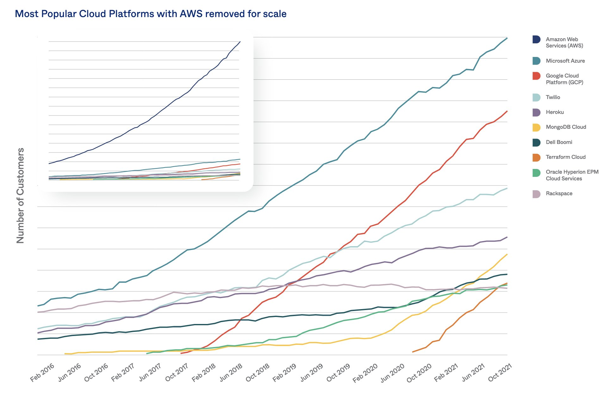

# Public Cloud Provider. Amazon Web Services

 

  

 

1. [Introduction](#introduction)
2. [AWS Reference Archigtecture](#aws-reference-archigtecture)
3. [AWS Application Services](#aws-application-services)
4. [Blogs](#blogs)
5. [AWS Free Resources](#aws-free-resources)
6. [Containers on AWS](#containers-on-aws)
7. [AWS Startup Collection. For startups building on AWS](#aws-startup-collection-for-startups-building-on-aws)
8. [AWS on Twitter](#aws-on-twitter)
9. [AWS Youtube channel and Podcasts](#aws-youtube-channel-and-podcasts)
10. [AWS Developer Blog](#aws-developer-blog)
11. [AWS Patterns](#aws-patterns)
12. [AWS configuration files](#aws-configuration-files)
13. [AWS Config Rules](#aws-config-rules)
14. [AWS Management Console](#aws-management-console)
15. [Resource Hierarchies](#resource-hierarchies)
16. [AWS Tags](#aws-tags)
17. [AWS Systems Manager Explorer](#aws-systems-manager-explorer)
     1. [AWS Systems Manager Incident Manager](#aws-systems-manager-incident-manager)
18. [AWS Cloud Adoption Framework (AWS CAF)](#aws-cloud-adoption-framework-aws-caf)
19. [AWS re:Post](#aws-repost)
20. [Bunch of Images](#bunch-of-images)
21. [Videos](#videos)
22. [Tweets](#tweets)

## Introduction

- [AWS Cloud Products](https://aws.amazon.com/products/)
- [AWS Local Zones locations](https://aws.amazon.com/about-aws/global-infrastructure/localzones/locations/)
- [status.aws.amazon.com: Service Health Dashboard](https://status.aws.amazon.com)
- [aws.amazon.com/new: What's New with AWS?](https://aws.amazon.com/new)
- [aws.amazon.com/releasenotes](https://aws.amazon.com/releasenotes)
- [AWS Forums](https://forums.aws.amazon.com)
- [AWS Knowledge Center](https://aws.amazon.com/en/premiumsupport/knowledge-center/)
- [AWS Glossary](http://docs.aws.amazon.com/general/latest/gr/glos-chap.html)
- [Awesome AWS 🌟](https://github.com/donnemartin/awesome-aws)
- [AWS Marketplace](https://aws.amazon.com/marketplace)
- [AWS Support](https://aws.amazon.com/en/premiumsupport/)
- [github.com/awslabs](https://github.com/awslabs)
- [slideshare.net/AmazonWebServices](http://www.slideshare.net/AmazonWebServices)
- [AWS 10-Minute Tutorials](https://aws.amazon.com/getting-started/tutorials/)
- [How do I create and activate a new Amazon Web Services account?](https://aws.amazon.com/premiumsupport/knowledge-center/create-and-activate-aws-account/)
- [onlineitguru.com: AWS Services](https://onlineitguru.com/tutorial/aws-services)
- [The Open Guide to Amazon Web Services](https://github.com/open-guides/og-aws)
- [AWS Ramp-Up Guides](https://aws.amazon.com/es/training/ramp-up-guides/) Your guides to learning the AWS Cloud. Build Your AWS Cloud Knowledge with Ramp-Up Guides.
- [serverlessland.com](https://serverlessland.com/) This site brings together all the latest blogs, videos, and training for AWS Serverless. Learn to use and build apps that scale automatically on low-cost, fully-managed serverless architecture.
    - [serverlessland.com/patterns: Serverless Patterns Collection](https://serverlessland.com/patterns) Use serverless patterns to quickly build integrations using AWS SAM and CDK templates. Filter by pattern and copy the template directly into your application.
    - [AWS SAM Pipelines](https://serverlessland.com/explore/sam-pipelines) Video tutorials: Learn how to generate CI/CD pipelines and deployment templates for serverless applications with AWS’ best practices for CloudBees, JenkinsCI, GitLab, GitHub using AWS SAM Pipelines.
- [AWS Activate](https://aws.amazon.com/activate) AWS Activate offers startups free tools, resources, and more to quickly get started on AWS. Build and scale with up to $100,000 in AWS Activate credits
- [aws/containers-roadmap: AWS Containers Roadmap](https://github.com/aws/containers-roadmap) This is the public roadmap for AWS container services (ECS, ECR, Fargate, and EKS).
- [dashbird.io: Get started and keep using AWS for free](https://dashbird.io/blog/use-aws-free/)
- [dzone: AWS Basics](https://dzone.com/articles/aws-basics)
- [dzone: AWS Elastic Compute Cloud (EC2) Basics](https://dzone.com/articles/aws-elastic-compute-cloud-ec2-basics) We will learn about IP Addresses and also connect to public EC2 instances externally using SSH. Let's have a look at public and private IP behavior first.
- [dzone: AWS Basics: Bastion Hosts and NAT](https://dzone.com/articles/aws-basics-bastian-hosts-and-nat) In this post, we will set up Bastion Host and NAT instances in our VPC. We will learn why we need those and some of the options available to us.
- [acloudguru.com: The Cloud Dictionary of Pain: Five Of AWS’s Toughest Cloud Topics](https://acloudguru.com/blog/engineering/the-cloud-dictionary-of-pain-five-of-awss-toughest-cloud-topics)
- [dannys.cloud: 10 Best Free AWS Learning Resources for Beginners](https://dannys.cloud/10-best-free-aws-learning-resources-for-beginners) This blogpost provides free resources for beginners to get started with AWS through videos, whitepapers, labs, and certification guides.
- [linkedin pulse: Listado de todos los Servicios de AWS (actualizado 1 de Enero 2021)](https://www.linkedin.com/pulse/listado-de-todos-los-servicios-amazon-web-services-daniel-pe%25C3%25B1a-silva)
- [towardsaws.com: A Gentle Introduction to Amazon Web Services (AWS)](https://towardsaws.com/a-gentle-introduction-to-amazon-web-services-aws-50f18c7c57dc)
- [docs.aws.amazon.com: The AWS Security Reference Architecture](https://docs.aws.amazon.com/prescriptive-guidance/latest/security-reference-architecture/architecture.html)
- [thenewstack.io: The AWS Shared Responsibility Model for Kubernetes](https://thenewstack.io/understand-the-aws-shared-responsibility-model-for-kubernetes/)
- [dzone: Migrating to AWS](https://dzone.com/articles/migrating-to-aws) AWS Cloud is the way to go, but migrating to the cloud is not simple. Read this article for a step-by-step migration strategy.
- [medium: AWS Services Every Developer Should Be Aware Of](https://medium.com/@ashish_fagna/aws-services-every-developer-should-be-aware-of-f7c48aaa854f)
- [blog.cloudyali.io: The Absolute minimum every developer must know about AWS security!](https://blog.cloudyali.io/absolute-minimum-every-developer-must-know-about-aws-security)
- [acloudguru.com: 12 AWS Config rules that every account should have](https://acloudguru.com/blog/engineering/12-aws-config-rules-that-every-account-should-have)
- [cloudonaut.io: EC2 Checklist: 7 things to do after launching an instance](https://cloudonaut.io/ec2-checklist-seven-things-to-do-after-launching-an-instance/)
- [medium: 6 Lessons Learned - Migrating Application on Production](https://medium.com/swlh/6-lessons-learned-from-migrating-web-application-on-production-ce9add8e63f3)
- [lastweekinaws.com: 17 More Ways to Run Containers on AWS](https://www.lastweekinaws.com/blog/17-more-ways-to-run-containers-on-aws/)
- [What is Streaming Data?](https://aws.amazon.com/streaming-data/)
- [dzone: Five Different Ways to Build AWS Infrastructure](https://dzone.com/articles/five-different-ways-to-build-aws-infrastructure) Before deciding on how to create your production platform, learn about the benefits and drawbacks of different ways to build your AWS infrastructure.
- [AWS Architecture Blog: What to Consider when Selecting a Region for your Workloads](https://aws.amazon.com/blogs/architecture/what-to-consider-when-selecting-a-region-for-your-workloads/)
- [ben11kehoe.medium.com: Never put AWS temporary credentials in the credentials file (or env vars) — there’s a better way](https://ben11kehoe.medium.com/never-put-aws-temporary-credentials-in-env-vars-or-credentials-files-theres-a-better-way-25ec45b4d73e) **Stop putting AWS temporary credentials in ~/.aws/credentials or environment variables!**
- [Implementing Microservices on AWS 🌟](https://docs.aws.amazon.com/whitepapers/latest/microservices-on-aws/microservices-on-aws.html)
- [intellipaat.com: What is AWS?](https://intellipaat.com/blog/what-is-amazon-web-services-aws/)
- [tech.twenix.com: Securiza tu infraestructura cloud sin arruinarte](https://tech.twenix.com/securiza-tu-infraestructura-cloud-sin-arruinarte-d9d2e2d5302c)
- [==amazon.qwiklabs.com/catalog==](https://amazon.qwiklabs.com/catalog) **One of the best ways to learn AWS services is to use them. If you want to grow your skills this year check out these AWS quicklabs. Free and paid quests to get you started and gaining experience.**
- [==freecodecamp.org/news/tag/aws==](https://www.freecodecamp.org/news/tag/aws/) Are you looking to get into cloud? Check out all the amazing free content available on freecodecamp under the AWS tag.
- [==paigeshin1991.medium.com: Drop Nuclear Bomb on your AWS account. How to clear your entire AWS services in 3 seconds==](https://paigeshin1991.medium.com/drop-nuclear-bomb-on-your-aws-services-how-to-clear-your-entire-aws-account-in-3-seconds-53f28928e09c)
- [medium.com/gargee-bhatnagar: How to Create a Custom AMI with Image Pipeline and Automate its Creation Using EC2 Image Builder](https://medium.com/gargee-bhatnagar/how-to-create-a-custom-ami-with-image-pipeline-and-automate-its-creation-using-ec2-image-builder-7e194e39c8e9)
- [==docs.aws.amazon.com: Actions, resources, and condition keys for AWS services== 🌟🌟🌟](https://docs.aws.amazon.com/service-authorization/latest/reference/reference_policies_actions-resources-contextkeys.html) There's a Reference for all 𝗜𝗔𝗠 𝗔𝗰𝘁𝗶𝗼𝗻𝘀, 𝗿𝗲𝘀𝗼𝘂𝗿𝗰𝗲𝘀, 𝗮𝗻𝗱 𝗰𝗼𝗻𝗱𝗶𝘁𝗶𝗼𝗻 𝗸𝗲𝘆𝘀 𝗳𝗼𝗿 𝗮𝗹𝗹 𝗔𝗪𝗦 𝘀𝗲𝗿𝘃𝗶𝗰𝗲𝘀 🔐 Bookmark it! 🔖
- [medium.com/@imaze.enabulele: Autoscaling EC2 Instances for High Availability and Stress Testing 🌟](https://medium.com/@imaze.enabulele/autoscaling-ec2-instances-for-high-availability-and-stress-testing-946b41f229e2)
- [awstip.com: How to list all resources in your AWS account](https://awstip.com/how-to-list-all-resources-in-your-aws-account-c3f18061f71b)
- [Building highly resilient applications with on-premises interdependencies using AWS Local Zones](https://aws.amazon.com/blogs/compute/building-highly-resilient-applications-with-on-premises-interdependencies-using-aws-local-zones/) AWS Local Zones are a type of infrastructure deployment that places compute, storage, database, and other select AWS services close to large population and industry centers.
- [dev.to: Disaster Recovery Cheat-sheet/Write-up 🌟](https://dev.to/aws-builders/disaster-recovery-cheat-sheetwrite-up-o62)
- [terminalsandcoffee.com: Setting Up the AWS CLI & IAM User API Keys 🌟](https://terminalsandcoffee.com/setting-up-the-aws-cli-iam-user-api-keys-b83554e314e4)
- [dev.to: Best Practices When Designing AWS Architecture 🌟🌟](https://dev.to/aws-builders/best-practices-when-designing-aws-architecture-4c8d) AWSArchitecture is the way you design & implement your cloud apps using AWS services & resources. A well-designed architecture help to achieve business goals 👉 scalability, reliability, etc.
- [infoworld.com: Amazon’s quiet open source revolution](https://www.infoworld.com/article/3694090/amazon-s-quiet-open-source-revolution.html) After years of getting a free ride from open source projects, the company is developing its own obsession with contributing.
- [==mrdevops.hashnode.dev: How to Create EC2 Instance in AWS: Step by Step Tutorial==](https://mrdevops.hashnode.dev/how-to-create-ec2-instance-in-aws-step-by-step-tutorial)

## AWS Reference Archigtecture

- [infoq.com: AWS Publishes Reference Architecture and Implementations for Deployment Pipelines](https://www.infoq.com/news/2023/02/aws-deployment-pipelines/) - [New - Deployment Pipelines Reference Architecture and Reference Implementations](https://aws.amazon.com/blogs/aws/new_deployment_pipelines_reference_architecture_and_-reference_implementations/)

## AWS Application Services

- [k21academy.com: AWS Application Services: Lambda, SES, SNS, SQS, SWF](https://k21academy.com/amazon-web-services/aws-solutions-architect/aws-application-services/)

## Blogs

- [Jayendra's Blog 🌟🌟](https://jayendrapatil.com/)
- [aws.plainenglish.io](https://aws.plainenglish.io/)
- [AWStip.com](https://awstip.com) Community of passionate AWS builders.

## AWS Free Resources

- https://aws.amazon.com/architecture
- https://aws.amazon.com/whitepapers
- https://docs.aws.amazon.com
- https://www.aws.training
- https://aws.amazon.com/solutions/case-studies
- https://www.youtube.com/user/amazonWebServices
- https://forums.aws.amazon.com
- https://aws.amazon.com/blogs
- https://www.slideshare.net/AmazonWebServices
- https://www.twitch.tv/aws
- [Everything AWS | Search and discover 6K+ quality AWS repositories](https://app.polymersearch.com/discover/aws)
- [workshops.aws: AWS Workshops](https://workshops.aws/) This website lists workshops created by the teams at Amazon Web Services (AWS). Workshops are hands-on events designed to teach or introduce practical skills, techniques, or concepts which you can use to solve business problems.
You can filter by topic using the toolbar above.
- [AWS Courses created by AWS experts](https://www.amazon.com/b/?node=14297978011)
- [dev.to: Many free and useful AWS official Dev and User guides!](https://dev.to/aws-builders/many-free-and-useful-aws-official-dev-and-user-guides-54ci)
- [medium.com/towards-cloud-computing: 7 Free AWS Practice Labs and AWS Workshops resources](https://medium.com/towards-cloud-computing/7-free-aws-practice-labs-and-aws-workshops-resources-d0a861f05d3)

## Containers on AWS

- [==vladionescu.me: Scaling containers on AWS in 2022 (comparison)==](https://www.vladionescu.me/posts/scaling-containers-on-aws-in-2022/)

## AWS Startup Collection. For startups building on AWS

- [bitmovin: Improving Video Quality on the Web](https://medium.com/aws-activate-startup-blog/bitmovin-improving-video-quality-on-the-web-8670039c4334)
- [What Startups Should Know about Amazon VPC — Part 1](https://medium.com/aws-activate-startup-blog/what-startups-should-know-about-amazon-vpc-part-1-bebe94b7f228)
- [Scaling on AWS (Part 3): >500K Users](https://medium.com/aws-activate-startup-blog/scaling-on-aws-part-3-500k-users-3750b227b761)
- [medium.com: Building a Serverless Dynamic DNS System with AWS](https://medium.com/aws-activate-startup-blog/building-a-serverless-dynamic-dns-system-with-aws-a32256f0a1d8#.qq54pucbd)
- [medium.com: The Top 10 AWS Startup Blog Posts of 2015](https://medium.com/aws-activate-startup-blog/the-top-10-aws-startup-blog-posts-of-2015-d2975e3778bb)

## AWS on Twitter

- [twitter.com/awscloud](https://twitter.com/awscloud)
- [twitter.com/AWSreInvent](https://twitter.com/AWSreInvent)
- [twitter.com/jeffbarr](https://twitter.com/jeffbarr)
- [twitter.com/AWSstartups](https://twitter.com/AWSstartups)
- [twitter.com/AWS_Partners](https://twitter.com/AWS_Partners)

## AWS Youtube channel and Podcasts

- [Amazon Web Services Youtube](https://www.youtube.com/user/AmazonWebServices)
- [AWS Tutorial Series](https://www.youtube.com/user/awstutorialseries)
- [AWS Webinar Channel](https://www.youtube.com/user/AWSwebinars)
- [AWS Podcasts](https://aws.amazon.com/podcasts/aws-podcast/)
- [AWS Techchat](https://aws.amazon.com/podcasts/aws-techchat)
- [Stitcher AWS Podcasts](http://www.stitcher.com/podcast/amazon-web-services/aws-podcast)

## AWS Developer Blog

- [The AWS Developer Blog now includes Python & GoLang](https://aws.amazon.com/blogs/developer/)
- [Create an API Using the Swagger Specification and the API Gateway Extensions](http://docs.aws.amazon.com/apigateway/latest/developerguide/create-api-using-import-export-api.html)

## AWS Patterns

- [medium: Top 4 AWS Patterns of Highly Available API](https://medium.com/greenm/top-4-aws-patterns-of-highly-available-api-d34599bfbb96) We want to tell you about a few common patterns that can be used to build highly available APIs on top of AWS infrastructure. We will highlight each of them and briefly describe the pros and cons.

## AWS configuration files

- [medium: AWS configuration files, explained](https://medium.com/@ben11kehoe/aws-configuration-files-explained-9a7ea7a5b42e)

## AWS Config Rules

- [AWS Config Rules now available in 4 new regions: US West (Oregon), EU (Ireland), EU (Frankfurt) and Asia Pacific (Tokyo)](https://aws.amazon.com/about-aws/whats-new/2016/04/aws-config-rules-now-available-in-4-new-regions-us-west-oregon-eu-ireland-eu-frankfurt-and-asia-pacific-tokyo/)
- [medium.com/swlh: AWS Config — Compliance as Code](https://medium.com/swlh/aws-config-compliance-as-code-9621eb3b7ac7)

## AWS Management Console

- [Working with the AWS Management Console](http://docs.aws.amazon.com/awsconsolehelpdocs/latest/gsg/getting-started.html)

## Resource Hierarchies

- [AWS, Azure, GCP: Resource Hierarchies](https://levelup.gitconnected.com/aws-azure-gcp-resource-hierarchies-25b829127511)

## AWS Tags

- [bridgecrew.io: Best practices for AWS tagging with Yor](https://bridgecrew.io/blog/best-practices-for-aws-tagging-with-yor/)

## AWS Systems Manager Explorer

- [Multi-account AWS Trusted Advisor summaries now available in AWS Systems Manager Explorer](https://aws.amazon.com/blogs/mt/multi-account-aws-trusted-advisor-summaries-now-available-aws-systems-manager-explorer/)

### AWS Systems Manager Incident Manager

- [How to automate incident response to security events with AWS Systems Manager Incident Manager](https://aws.amazon.com/blogs/security/how-to-automate-incident-response-to-security-events-with-aws-systems-manager-incident-manager/)

## AWS Cloud Adoption Framework (AWS CAF)

- [==AWS Cloud Adoption Framework (AWS CAF)==](https://aws.amazon.com/professional-services/CAF/) The AWS Cloud Adoption Framework (AWS CAF) leverages AWS experience and best practices to help you digitally transform and accelerate your business outcomes through innovative use of AWS. AWS CAF identifies specific organizational capabilities that underpin successful cloud transformations. These capabilities provide best practice guidance that helps you improve your cloud readiness. AWS CAF groups its capabilities in six perspectives: Business, People, Governance, Platform, Security, and Operations. Each perspective comprises a set of capabilities that functionally related stakeholders own or manage in the cloud transformation journey. Use the AWS CAF to identify and prioritize transformation opportunities, evaluate and improve your cloud readiness, and iteratively evolve your transformation roadmap.
- [AWS Cloud Adoption Framework (CAF) 3.0 is Now Available](https://aws.amazon.com/blogs/aws/aws-cloud-adoption-framework-caf-3-0-is-now-available/)

## AWS re:Post

- [==repost.aws== 🌟](https://repost.aws)
- [AWS re:Post – A Reimagined Q&A Experience for the AWS Community](https://aws.amazon.com/blogs/aws/aws-repost-a-reimagined-qa-experience-for-the-aws-community/)
- [infoq.com: Amazon Introduces re:Post, a "Stack Overflow" for AWS](https://www.infoq.com/news/2021/12/amazon-repost-questions-answers/)

## Bunch of Images

??? note "Click to expand!"

	

	

	

	

	
	

## Videos

  
Click to expand!

<iframe width="560" height="315" src="https://www.youtube.com/embed/AYAh6YDXuho" title="YouTube video player" frameborder="0" allow="accelerometer; autoplay; clipboard-write; encrypted-media; gyroscope; picture-in-picture" allowfullscreen></iframe>

## Tweets

  
Click to expand!

<blockquote class="twitter-tweet">
You don&#39;t know how to get started with AWS?  I can relate! When I started, AWS already offered so much that I literally couldn&#39;t find an entry point.  If you still feel this way, let me give you a little guide.  🧵⏬
&mdash; Oliver Jumpertz (@oliverjumpertz) <a href="https://twitter.com/oliverjumpertz/status/1379096498592432128?ref_src=twsrc%5Etfw">April 5, 2021</a></blockquote> 

<blockquote class="twitter-tweet">
This is BIG! You can now assign IPv4 and IPv6 prefixes to your ENIs. The net result is that EC2 instances will now support vastly larger number of IP addresses, and managing those addresses will become easier. 1/n<a href="https://t.co/3ilNrFtuAp">https://t.co/3ilNrFtuAp</a>
&mdash; Joe Magerramov (@_joemag_) <a href="https://twitter.com/_joemag_/status/1418345704964063232?ref_src=twsrc%5Etfw">July 22, 2021</a></blockquote> 

<blockquote class="twitter-tweet">
When we first launched the managed Prometheus service, one of the feedback was about cost of ingestion. We announced a pricing discount up to 84% recently in case you haven&#39;t seen it. <a href="https://t.co/wqioBvSXme">https://t.co/wqioBvSXme</a> <a href="https://t.co/64ezXUg753">pic.twitter.com/64ezXUg753</a>
&mdash; Jaana Dogan ヤナ ドガン (@rakyll) <a href="https://twitter.com/rakyll/status/1435717610704834566?ref_src=twsrc%5Etfw">September 8, 2021</a></blockquote> 

<blockquote class="twitter-tweet">
💫 AWS VPC 101  Virtual Private Cloud is a fundamental concept of AWS ☁️  Let&#39;s explore it together in this thread 🧵👇
&mdash; Simon ☁️ (@simonholdorf) <a href="https://twitter.com/simonholdorf/status/1441452612331704321?ref_src=twsrc%5Etfw">September 24, 2021</a></blockquote> 

<blockquote class="twitter-tweet">
📚 AWS 1x1  ɪᴅᴇɴᴛɪᴛʏ- &amp; ᴀᴄᴄᴇꜱꜱ ᴍᴀɴᴀɢᴇᴍᴇɴᴛ (ɪᴀᴍ) 🔑  The concepts are crucial &amp; being confident in them is a necessity.  From basics to advanced concepts 🧵↓
&mdash; Tobias Schmidt (@tpschmidt_) <a href="https://twitter.com/tpschmidt_/status/1442880455179657219?ref_src=twsrc%5Etfw">September 28, 2021</a></blockquote> 

<blockquote class="twitter-tweet">
AWS Amplify refers to different products.  You are confused what Amplify exactly is?   We know that AWS isn&#39;t the best with naming its products so let&#39;s see what Amplify products are exactly out there.  1/6 <a href="https://t.co/9dUtwpdjPU">pic.twitter.com/9dUtwpdjPU</a>
&mdash; Sandro Volpic (@sandro_vol) <a href="https://twitter.com/sandro_vol/status/1442762063416283139?ref_src=twsrc%5Etfw">September 28, 2021</a></blockquote> 

<blockquote class="twitter-tweet">
Yes, creating your first AWS account with your own credit card feels scary  • those are your first steps 🚶 • you haven&#39;t got much or any hands-on yet 🏗 • you&#39;ve read about those expenses horror stories 💥  but there are a lot of easy ways to get 𝗳𝗿𝗲𝗲 𝗰𝗿𝗲𝗱𝗶𝘁𝘀 ↓
&mdash; Tobias Schmidt (@tpschmidt_) <a href="https://twitter.com/tpschmidt_/status/1443606717200314370?ref_src=twsrc%5Etfw">September 30, 2021</a></blockquote> 

<blockquote class="twitter-tweet">
☁️ Knowledge - Virtual Private Cloud (VPC)<a href="https://twitter.com/hashtag/AWS?src=hash&amp;ref_src=twsrc%5Etfw">#AWS</a> VPCs are region-scoped. If you want to route traffic between regional resources, you need to set up VPC peering, for example. ✅<a href="https://twitter.com/hashtag/GCP?src=hash&amp;ref_src=twsrc%5Etfw">#GCP</a> VPCs are global-scoped. Traffic between resources is automatically routed across regions. ☑️
&mdash; Simon ☁️ (@simonholdorf) <a href="https://twitter.com/simonholdorf/status/1443855193813233664?ref_src=twsrc%5Etfw">October 1, 2021</a></blockquote> 

<blockquote class="twitter-tweet">
A new checkbox appears in the create subnet dialog of the Amazon VPC console... <a href="https://t.co/RroXl07Fe0">pic.twitter.com/RroXl07Fe0</a>
&mdash; Matthew S. Wilson (msw) (@_msw_) <a href="https://twitter.com/_msw_/status/1463215340536614912?ref_src=twsrc%5Etfw">November 23, 2021</a></blockquote> 

<blockquote class="twitter-tweet">
Me: using AWS since 2014, using k8s since 2016, AWS Container Hero, and other fancy-sounding stats.  Also me: takes 2 hours to get AWS CloudWatch Container Insights (expensive logs and metrics) running on an EKS cluster  Tech is hard for everybody! Be confident! Full-steam ahead!
&mdash; Vlad Ionescu (he/him) (@iamvlaaaaaaad) <a href="https://twitter.com/iamvlaaaaaaad/status/1472212200009961474?ref_src=twsrc%5Etfw">December 18, 2021</a></blockquote> 

<blockquote class="twitter-tweet">
📚 AWS 1x1 - 𝗖𝗹𝗼𝘂𝗱𝗪𝗮𝘁𝗰𝗵  Your fully-managed monitoring &amp; observability solution for your AWS services, resources &amp; applications.  Almost all you need to know ↓
&mdash; Tobias Schmidt (@tpschmidt_) <a href="https://twitter.com/tpschmidt_/status/1481991504348557313?ref_src=twsrc%5Etfw">January 14, 2022</a></blockquote> 

<blockquote class="twitter-tweet">
𝗔𝗪𝗦 𝗔𝗣𝗜 𝗚𝗮𝘁𝗲𝘄𝗮𝘆 is one of AWS&#39; fully-managed flagship services ⚡   All of the important facts &amp; key capabilities that you need to know in a single infographic 🌠 ↓ <a href="https://t.co/uzdqdPMmCs">pic.twitter.com/uzdqdPMmCs</a>
&mdash; Dashbird.io (@thedashbird) <a href="https://twitter.com/thedashbird/status/1483033704205369344?ref_src=twsrc%5Etfw">January 17, 2022</a></blockquote> 

<blockquote class="twitter-tweet">
&quot;Why do you only focus on <a href="https://twitter.com/awscloud?ref_src=twsrc%5Etfw">@awscloud</a> instead of other cloud providers? Doesn&#39;t that cut your market to a tiny fraction of the industry?&quot;  The latest <a href="https://twitter.com/okta?ref_src=twsrc%5Etfw">@okta</a> report has a chart within that tells the story succinctly. <a href="https://t.co/AkNt1jwUMU">pic.twitter.com/AkNt1jwUMU</a>
&mdash; Corey Quinn (@QuinnyPig) <a href="https://twitter.com/QuinnyPig/status/1488233622934933504?ref_src=twsrc%5Etfw">January 31, 2022</a></blockquote> 

<blockquote class="twitter-tweet">
In my opinion, IAM is the 𝗺𝗼𝘀𝘁 𝗰𝗼𝗺𝗽𝗹𝗲𝘁𝗲 &amp; 𝗰𝗼𝗺𝗽𝗿𝗲𝗵𝗲𝗻𝘀𝗶𝘃𝗲 service by AWS 🔐  What&#39;s a 𝗳𝗮𝗰𝘁: the concepts are crucial &amp; being confident in them is a necessity! <a href="https://t.co/MtvOyLjRzS">pic.twitter.com/MtvOyLjRzS</a>
&mdash; Tobias Schmidt (@tpschmidt_) <a href="https://twitter.com/tpschmidt_/status/1488871669024399364?ref_src=twsrc%5Etfw">February 2, 2022</a></blockquote> 

<blockquote class="twitter-tweet">
I don&#39;t know who did this...but It made my day 😂 AWS moving workloads out of Exadata <a href="https://twitter.com/hashtag/HappyWednesday?src=hash&amp;ref_src=twsrc%5Etfw">#HappyWednesday</a> <a href="https://twitter.com/hashtag/CloudHumor?src=hash&amp;ref_src=twsrc%5Etfw">#CloudHumor</a> <a href="https://t.co/vq1CSCyr8b">pic.twitter.com/vq1CSCyr8b</a>
&mdash; Guillermo Ruiz (@IaaSgeek) <a href="https://twitter.com/IaaSgeek/status/1488799161038389252?ref_src=twsrc%5Etfw">February 2, 2022</a></blockquote> 

<blockquote class="twitter-tweet">
My personal holy grail of database solutions: 𝗗𝘆𝗻𝗮𝗺𝗼𝗗𝗕 ⚡️   Sadly, I couldn&#39;t fit all the features &amp; must-knows into a single infographic. There are just too many 💛 <a href="https://t.co/UkLcvH19Cp">pic.twitter.com/UkLcvH19Cp</a>
&mdash; Tobias Schmidt (@tpschmidt_) <a href="https://twitter.com/tpschmidt_/status/1493958661391233026?ref_src=twsrc%5Etfw">February 16, 2022</a></blockquote> 

<blockquote class="twitter-tweet">
Today we announced the completion of 16 <a href="https://twitter.com/hashtag/AWS?src=hash&amp;ref_src=twsrc%5Etfw">#AWS</a> Local Zones in the US and plans for 32 more to be built globally. Local Zones offer ultra-low latency at the edge of the cloud—awesome for gaming, streaming, ML, more!<a href="https://t.co/CFHmBI8zrK">https://t.co/CFHmBI8zrK</a>
&mdash; Adam Selipsky (@aselipsky) <a href="https://twitter.com/aselipsky/status/1494144808083886082?ref_src=twsrc%5Etfw">February 17, 2022</a></blockquote> 

<blockquote class="twitter-tweet">
What&#39;s the fastest way to scale containers on AWS in 2022?   Is EKS faster than ECS? What&#39;s faster: serverless workers (Fargate) or to serverful workers (EC2)? What about App Runner and Lambda?  Now we know: <a href="https://t.co/R82caY9nmn">https://t.co/R82caY9nmn</a>
&mdash; Vlad Ionescu (he/him) (@iamvlaaaaaaad) <a href="https://twitter.com/iamvlaaaaaaad/status/1514234438527643656?ref_src=twsrc%5Etfw">April 13, 2022</a></blockquote> 

<blockquote class="twitter-tweet">
AWS DevOps Tools: (Thread)  - <a href="https://twitter.com/hashtag/AWS?src=hash&amp;ref_src=twsrc%5Etfw">#AWS</a> provides plenty of managed tools to meet the needs of <a href="https://twitter.com/hashtag/DevOps?src=hash&amp;ref_src=twsrc%5Etfw">#DevOps</a> tools. <a href="https://t.co/MxSIw9N6tZ">pic.twitter.com/MxSIw9N6tZ</a>
&mdash; Ankit Mehta 🇮🇳🇹🇭 (@ankyitm) <a href="https://twitter.com/ankyitm/status/1538339815355166722?ref_src=twsrc%5Etfw">June 19, 2022</a></blockquote> 

<blockquote class="twitter-tweet">
Just stumbled upon my first cheat sheet for the Solutions Architect Associate 📚  It&#39;s more of a key-facts collection with a design that would need improvement 🌟  𝗗𝗶𝘀𝗰𝗹𝗮𝗶𝗺𝗲𝗿: was made for the 𝗦𝗔𝗔-𝗖𝟬𝟮 &amp; I think there&#39;s an upcoming exam update next month! <a href="https://t.co/m3dNE57cpZ">pic.twitter.com/m3dNE57cpZ</a>
&mdash; Tobias Schmidt (@tpschmidt_) <a href="https://twitter.com/tpschmidt_/status/1543915274637905920?ref_src=twsrc%5Etfw">July 4, 2022</a></blockquote> 

<blockquote class="twitter-tweet">
A list of small tools with a 𝗯𝗶𝗴 𝗶𝗺𝗽𝗮𝗰𝘁 𝗼𝗻 𝗽𝗿𝗼𝗱𝘂𝗰𝘁𝗶𝘃𝗶𝘁𝘆 when working with AWS 🛠 📈 ↓
&mdash; Tobias Schmidt (@tpschmidt_) <a href="https://twitter.com/tpschmidt_/status/1543982797320327169?ref_src=twsrc%5Etfw">July 4, 2022</a></blockquote> 

