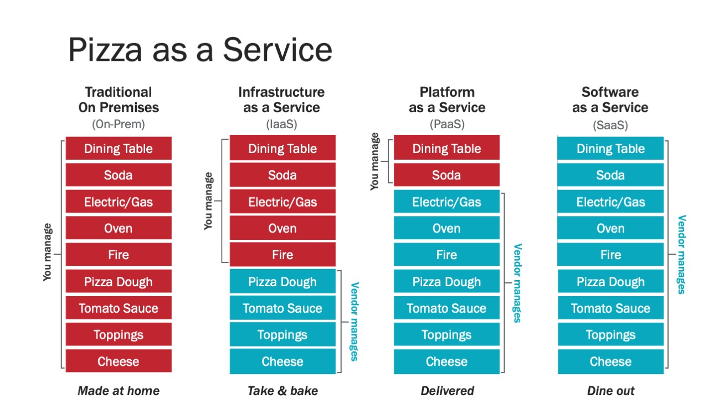

# Microsoft Azure
- [Azure](#azure)
- [New Features](#new-features)
- [Blogs](#blogs)
- [Azure Training](#azure-training)
- [Understand Azure Load Balancing](#understand-azure-load-balancing)
- [Microsoft Linux Distribution CBL Mariner](#microsoft-linux-distribution-cbl-mariner)
- [Azure Patterns](#azure-patterns)
- [ARM Templates](#arm-templates)
- [Azure DevOps](#azure-devops)
    - [YAML Schema in DevOps Azure Pipelines](#yaml-schema-in-devops-azure-pipelines)
    - [Azure Pipeline Tasks](#azure-pipeline-tasks)
- [Azure AD and RBAC. Service Principal SPN](#azure-ad-and-rbac-service-principal-spn)
    - [Register applications in Azure AD. Authenticate apps and services](#register-applications-in-azure-ad-authenticate-apps-and-services)
- [Azure Arc. Azure’s Hybrid And Multi-Cloud Platform. GitOps with Azure Arc](#azure-arc-azures-hybrid-and-multi-cloud-platform-gitops-with-azure-arc)
- [Secure DevOps Kit for Azure](#secure-devops-kit-for-azure)
- [Mobile Apps](#mobile-apps)
- [Powershell](#powershell)
    - [Microsoft Graph PowerShell SDK](#microsoft-graph-powershell-sdk)
    - [Powershell repos](#powershell-repos)
    - [Crescendo powershell module](#crescendo-powershell-module)
    - [Secrets Management with Powershell](#secrets-management-with-powershell)
- [Azure CLI. AZ CLI](#azure-cli-az-cli)
- [Azure Run Command](#azure-run-command)
- [IaC with PowerShell DSC Desired State Configuration](#iac-with-powershell-dsc-desired-state-configuration)
- [Azure Bicep](#azure-bicep)
- [Azure Traffic Manager](#azure-traffic-manager)
- [Azure OpenVPN](#azure-openvpn)
- [Azure Security](#azure-security)
- [WinGet Windows Package Manager CLI](#winget-windows-package-manager-cli)
- [Windows 11](#windows-11)
- [Azure API Management](#azure-api-management)
- [Azure Container Apps](#azure-container-apps)
- [Azure Container Instances](#azure-container-instances)
- [Windows Server Container Host](#windows-server-container-host)
- [Disaster Recovery](#disaster-recovery)
- [Azure Samples (Boilerplates)](#azure-samples-boilerplates)
- [Office 365](#office-365)
- [Images](#images)
- [Videos](#videos)
- [Tweets](#tweets)

## Azure
- [Microsoft Azure](https://azure.microsoft.com/)
- [Microsoft Docs](https://docs.microsoft.com/)
- [Azure Docs](https://docs.microsoft.com/azure)
- [Introducing the third of three Microsoft Clouds: Azure](https://www.catapultsystems.com/blogs/introducing-the-third-of-three-microsoft-clouds-azure/). 4 major sections of the Cloud Models are: 
    - On-Premises: As you start on the left in the traditional on-prem configuration you are responsible for all layers of IT from the networking stack all the way up to the applications which are being provided. You may also be responsible for the data center, power, Internet service, and other underlying aspects.
    - Infrastructure as a Service: In IaaS (Take & Bake) the cloud vendor is responsible for the stack from networking through virtualization and your IT team is responsible for the Operating System (OS) through the applications. Common uses of IaaS are testing environments, development environments or hosting of a website.
    - Platform as a Service: In PaaS (Pizza Delivered) the cloud vendor is responsible for the networking layers through the runtime layer and your IT team is responsible for the data and the applications. PaaS is commonly used to test, build and deploy applications for an organization.
    - Software as a Service: In SaaS (Dining Out) the cloud vendor is responsible for all layers from the networking through to the application layer. A common example of SaaS is a web-based email service such as Outlook, Hotmail or Gmail.
- [medium: Scaling Applications in the Cloud](https://medium.com/faun/scaling-applications-in-the-cloud-52bb6dfbac4e)
- [thenewstack.io: Azure Kubernetes Service Replaces Docker with containerd](https://thenewstack.io/azure-kubernetes-service-replaces-docker-with-containerd/)
- [blog.sixeyed.com: You can't always have Kubernetes: running containers in Azure VM Scale Sets](https://blog.sixeyed.com/you-cant-always-have-kubernetes-running-containers-in-azure-vm-scale-sets/)
- [devblogs.microsoft.com: Deploy Spring Boot applications by leveraging enterprise best practices – Azure Spring Cloud Reference Architecture](https://devblogs.microsoft.com/java/deploy-spring-boot-applications-by-leveraging-enterprise-best-practices/)
- [techcommunity.microsoft.com: Non-interactive logins: minimizing the blind spot](https://techcommunity.microsoft.com/t5/azure-sentinel/non-interactive-logins-minimizing-the-blind-spot/ba-p/2287932) In this blog post, we will review the new Azure Sentinel data streams for Azure Active Directory non-interactive, service principal, and managed identity logins. We will also share the new security content we built and updated in the product, which includes analytics rules for the detection part and workbooks to assist our customers to deal with this blind spot.
- [returngis.net: Replicación de blobs entre dos cuentas de Azure Storage en dos tenants diferentes](https://www.returngis.net/2021/06/replicacion-de-blobs-entre-dos-cuentas-de-azure-storage-en-dos-tenants-diferentes/)
- [c-sharpcorner.com: Comparing AWS SQL Server With Azure SQL Database](https://www.c-sharpcorner.com/article/comparing-aws-sql-server-with-azure-sql-database/)
- [techcommunity.microsoft.com: How to create a VPN between Azure and AWS using only managed solutions](https://techcommunity.microsoft.com/t5/fasttrack-for-azure/how-to-create-a-vpn-between-azure-and-aws-using-only-managed/ba-p/2281900)
- [teacdmin.net: How To Enable Multiple RDP Sessions on Windows Server](https://tecadmin.net/how-to-enable-multiple-rdp-sessions-on-windows-server/)
- [k21academy.com: Azure Data Lake Overview For Beginners](https://k21academy.com/microsoft-azure/data-engineer/azure-data-lake/)
- [returngis.net: Acceder a un App Service con Private Endpoint desde otra Vnet](https://www.returngis.net/2021/08/acceder-a-un-app-service-con-private-endpoint-desde-otra-vnet/)
- [theregister.com: Microsoft Azure deprecations: API changes will break applications and PowerShell scripts](https://www.theregister.com/2021/09/03/microsoft_azure_deprecations_api_changes/)
- [k21academy.com: Azure RBAC Vs Azure Policies Vs Azure Blueprints](https://k21academy.com/microsoft-azure/azure-rbac-vs-azure-policies-vs-azure-blueprints/)
- [==blog.identitydigest.com: Azure AD workload identity federation with Kubernetes==](https://blog.identitydigest.com/azuread-federate-k8s/) Any k8s cluster, running on any platform, can now securely access Azure resources without keys or secrets through Azure AD Workload Identity Federation. 
- [thomasmaurer.ch: How to check the available VM Sizes (SKUs) by Azure Region](https://www.thomasmaurer.ch/2021/02/how-to-check-the-available-vm-sizes-skus-by-azure-region/)
- [docs.microsoft.com: Multi-tenant user management scenarios](https://docs.microsoft.com/en-us/azure/active-directory/fundamentals/multi-tenant-user-management-scenarios)
- [docs.microsoft.com: Overview: Cross-tenant access with Azure AD External Identities (Preview)](https://docs.microsoft.com/en-us/azure/active-directory/external-identities/cross-tenant-access-overview) Azure AD organizations can use External Identities cross-tenant access settings to manage how they collaborate with other Azure AD organizations through B2B collaboration. Cross-tenant access settings give you granular control over how external Azure AD organizations collaborate with you (inbound access) and how your users collaborate with external Azure AD organizations (outbound access). 
- [==nubesgen.com==](https://nubesgen.com) - [microsoft/NubesGen](https://github.com/microsoft/NubesGen) Going to production on Azure is only one `git push` away. **Kickstart your project on Azure in minutes! Easily generate Terraform and Bicep templates for your project. Automate your infrastructure using GitOps best practices with GitHub Actions. NubesGen is an Open Source project and we are always looking for feedbacks and contributions.**
    - [infoq.com: NubesGen Brings Git Push to Azure Infrastructure](https://www.infoq.com/news/2022/03/nubesgen-azure-infrastructure/)
- [charbelnemnom.com: Move Files Between Azure File Share Tiers and optimize storage costs](https://charbelnemnom.com/move-files-between-azure-file-share-tiers/) 

## New Features
- [==azure.microsoft.com: General availability: Azure Bastion native client support==](https://azure.microsoft.com/en-gb/updates/general-availability-azure-bastion-native-client-support/)

## Blogs
- [techcommunity.microsoft.com](https://techcommunity.microsoft.com)
- [thomasthornton.cloud: Thomas Thornton](https://thomasthornton.cloud)
- [thomasmaurer.ch](https://www.thomasmaurer.ch)
- [networkadm.in: Network Admin](https://www.networkadm.in) PowerShell, Active Directory, GPO & Azure Automation. Tips and Tricks for Sysadmins!
- [dotnetcurry.com](https://www.dotnetcurry.com/)
- [azurebrains.com: Azurebrains](https://www.azurebrains.com) Blog sobre Tecnologias Cloud, Azure, Inteligencia Artificial, etc.

## Azure Training
- [johnthebrit/CertificationMaterials](https://github.com/johnthebrit/CertificationMaterials) A collection of materials related to my certification videos
- [==azurecharts.com/learning: Azure Learning Explorer==](https://azurecharts.com/learning) Discover published Azure learning modules, paths, videos, certifications, exams for services of your interest. 
- [thomasmaurer.ch: How To Learn Microsoft Azure in 2022](https://www.thomasmaurer.ch/2022/01/how-to-learn-microsoft-azure-in-2022/)

## Understand Azure Load Balancing
- [docs.microsoft.com: Understand Azure Load Balancing. Decision tree for load balancing in Azure](https://docs.microsoft.com/en-us/azure/architecture/guide/technology-choices/load-balancing-overview)
- [mvark.blogspot.com: Comparison of Azure Front Door, Traffic Manager, Application Gateway & Load Balancer](http://mvark.blogspot.com/2019/12/comparison-of-azure-front-door-traffic.html) 

## Microsoft Linux Distribution CBL Mariner
- [thenewstack.io: Deploying Microsoft’s New Linux Distribution as a VM is Not Easy](https://thenewstack.io/deploying-microsofts-new-linux-distribution-as-a-vm-is-not-easy/)
- [github.com/microsoft/CBL-Mariner](https://github.com/microsoft/CBL-Mariner) Linux OS for Azure 1P services and edge appliances

## Azure Patterns
- [==mattfeltonma/azure-networking-patterns==](https://github.com/mattfeltonma/azure-networking-patterns)
- [docs.microsoft.com: Cloud Design Patterns](https://docs.microsoft.com/en-us/azure/architecture/patterns/)

## ARM Templates
- [==azure.microsoft.com: Azure Quickstart Templates==](https://azure.microsoft.com/en-us/resources/templates/) Deploy Azure resources through the Azure Resource Manager with community contributed templates to get more done. Deploy, learn, fork and contribute back.
- [thomasmaurer.ch: Learn how to deploy and manage Azure resources with ARM templates](https://www.thomasmaurer.ch/2020/12/learn-how-to-deploy-and-manage-azure-resources-with-arm-templates/)
- [techcommunity.microsoft.com: ARM Template Specs now GA!](https://techcommunity.microsoft.com/t5/azure-governance-and-management/arm-template-specs-now-ga/ba-p/2402618)
- [docs.microsoft.com: Azure Resource Manager template specs](https://docs.microsoft.com/en-us/azure/azure-resource-manager/templates/template-specs)

## Azure DevOps
- [Azure DevOps 🌟](https://azure.microsoft.com/services/devops/)
- [Azure DevOps Labs 🌟](https://www.azuredevopslabs.com/)
- [==docs.microsoft.com: Build applications with Azure DevOps (Learning Path)==](https://docs.microsoft.com/en-gb/learn/paths/build-applications-with-azure-devops/)
- [==docs.microsoft.com: Azure Pipelines documentation==](https://docs.microsoft.com/en-gb/azure/devops/pipelines/) Implement continuous integration and continuous delivery (CI/CD) for the app and platform of your choice.
- [microsoft/azure-pipelines-tasks](https://github.com/microsoft/azure-pipelines-tasks)
- [info.acloud.guru: Deploying your first kubernetes app with Azure DevOps](https://info.acloud.guru/resources/deploy-kubernetes-app-with-azure-devops)
- [info.acloud.guru: Azure DevOps VS GitHub: Comparing Microsoft's DevOps Twins](https://info.acloud.guru/resources/azure-devops-vs-github-comparing-microsofts-devops-twins)
- [techcommunity.microsoft.com: Building a path to success for microservices and .NET Core - Project Tye + GitHub Actions](https://techcommunity.microsoft.com/t5/apps-on-azure/building-a-path-to-success-for-microservices-and-net-core/ba-p/1502270)
- [medium: Azure DevOps HandBook !](https://medium.com/@arunksingh16/azure-devops-handbook-d6dcd82da1b7)
- [Azure DevOps Tips: “Each” Loops](https://medium.com/@therealjordanlee/azure-devops-tips-each-loops-c082c692d025)
- [cloudskills.io: Getting Started with Git and Azure DevOps: The Ultimate Guide 🌟](https://cloudskills.io/blog/git-azure-devops)
- [zartis.com: Simplify Your SDLC with Azure DevOps](https://www.zartis.com/simplify-your-sdlc-with-azure-devops/)
- [azurebrains.com: Despliega tu Azure Function App con Terraform y Azure DevOps 🌟](https://www.azurebrains.com/2021/03/25/despliega-azure-function-terraform-azuredevops/)
- [devblogs.microsoft.com: Controlling Release Pipelines with Gates and Azure Policy Compliance 🌟](https://devblogs.microsoft.com/devops/controlling-release-pipelines-with-gates-and-azure-policy-compliance/)
- [youtube: Azure DevOps Pipeline and Image Builder](https://www.youtube.com/watch?v=zL0eLEl2BxI&ab_channel=TravisRoberts)
- [dev.to: Setting up a CI-CD Pipeline Using Azure DevOps 🌟](https://dev.to/gbengelebs/setting-up-a-ci-cd-pipeline-using-azure-devops-4gb)
- [zartis.com: Simplify Your SDLC with Azure DevOps 🌟](https://www.zartis.com/simplify-your-sdlc-with-azure-devops/)
- [thomasthornton.cloud: Scout Suite reports using Azure DevOps Pipeline](https://thomasthornton.cloud/2021/04/29/scout-suite-reports-using-azure-devops-pipeline/) Interesting article on how to fecth az DevOps pipelines reports as a static website
- [Azure DevOps Dashboard](https://github.com/cschotte/Azure-DevOps-Dashboard) 
- [cloud.google.com: Crea una canalización de CI/CD con Azure Pipelines y Compute Engine](https://cloud.google.com/architecture/creating-cicd-pipeline-vsts-compute-engine)
- [letsdevops.net: Introduction to Azure DevOps for Beginners - Create CI/CD Pipelines, Setup Repository 🌟](https://www.letsdevops.net/post/letsdevops-introduction-to-azure-devops-for-beginners)
- [kevinrchant.com: Increase in demand for Data Platform automation](https://www.kevinrchant.com/2021/09/16/increase-in-demand-for-data-platform-automation/)
    - [kevinrchant.com: Introducing my Azure DevOps templates for Data Platform deployments](https://www.kevinrchant.com/2021/09/14/t-sql-tuesday-142-introducing-my-azure-devops-templates-for-data-platform-deployments/)
- [dotnetcurry.com: Customization of Work Items in Azure DevOps and Azure DevOps Server 2020](https://www.dotnetcurry.com/devops/workitem-customize-azure-devops-server-2020)
- [thomast1906/DevOps-The-Hard-Way-Azure 🌟](https://github.com/thomast1906/DevOps-The-Hard-Way-Azure) This repository contains free labs for setting up an entire workflow and DevOps environment from a real-world perspective in Azure
- [==thinksys.com: Azure DevOps Pipeline Complete Guide 2022==](https://www.thinksys.com/azure/azure-devops-pipeline-complete-guide/)
- [techcommunity.microsoft.com: CICD in Synapse SQL: How to deliver your database objects across multiple environments](https://techcommunity.microsoft.com/t5/azure-synapse-analytics-blog/cicd-in-synapse-sql-how-to-deliver-your-database-objects-across/ba-p/3267507)

### YAML Schema in DevOps Azure Pipelines
- [==DevOps Azure Pipelines: YAML Schema==](https://docs.microsoft.com/en-us/azure/devops/pipelines/yaml-schema/pipeline)

### Azure Pipeline Tasks
- [==Microsoft/azure-pipelines-tasks==](https://github.com/Microsoft/azure-pipelines-tasks) This repo contains the tasks that are provided out-of-the-box with Azure Pipelines and Team Foundation Server. This provides open examples on how we write tasks which will help you write other tasks which can be uploaded to your account or server.

## Azure AD and RBAC. Service Principal SPN
- [itnext.io: Secure Azure Cosmos DB access by using Azure Managed Identities](https://itnext.io/secure-azure-cosmos-db-access-by-using-azure-managed-identities-55f9fdf48fda) Getting rid of passwords (or connection strings) while accessing Azure services and instead making use of Managed Identities is a way to increase the security of your workloads. Learn how to use Managed Identities in this article.
- [youtube.com: Azure Service Principal - SPN | Houssem Dellai](https://www.youtube.com/watch?v=-F9yzj4Kjeo&ab_channel=HoussemDellai)
- [youtube.com: How to create Service Principals in Azure Portal | Raaviblog](https://www.youtube.com/watch?v=Hg-YsUITnck&ab_channel=Raaviblog)

### Register applications in Azure AD. Authenticate apps and services
- [==agrenpoint.com: Azure AD & Microsoft Graph permission scopes, with Azure CLI==](https://www.agrenpoint.com/azcli-adscope/) In this small post, we will look at a scenario where we want to register an Azure AD Application using specific scopes. When adding scopes for service principals using the Azure CLI we need to use the internal Ids. And one way would be to manually create one registration, get that app and then print out the scopes and then copy and paste.
- [==medium.com/medialesson: Create Azure Active Directory App Registration with Azure CLI==](https://medium.com/medialesson/create-azure-active-directory-app-registration-with-azure-cli-3241aa3824c5)
- [inkoop.io: How to get Azure API Credentials](https://www.inkoop.io/blog/how-to-get-azure-api-credentials/) How to create an application in Azure active directory and get subscription id, tenant id, client id, client secret and generate management certificates. You will need these keys to access Azure API.
- [docs.microsoft.com: Use the portal to create an Azure AD application and service principal that can access resource](https://docs.microsoft.com/en-us/azure/active-directory/develop/howto-create-service-principal-portal)
- [medium.com/medialesson: Assigning Azure built-in roles vs Azure AD built-in roles with Azure CLI](https://medium.com/medialesson/assigning-azure-built-in-roles-vs-azure-ad-built-in-roles-with-azure-cli-d1cbf56fcdbe) Depending on what action you are trying to perform in Azure you might require either to be member of a certain Azure role or a certain Azure AD role. For example **if we want an identity to create an app registration in Azure AD we need the role Application Administrator which is part of the Azure AD roles.** When we want to create a resource in a certain resource group we need the Contributor role which is part of the Azure AD and typically scoped to a either a subscription, a resource group or a distinct resource. 
- [microsoftgraph/msgraph-sdk-powershell/samples: 9-Applications.ps1](https://github.com/microsoftgraph/msgraph-sdk-powershell/blob/dev/samples/9-Applications.ps1)
- [vcloud-lab.com: Get started and configure certificate-based authentication in Azure](http://vcloud-lab.com/entries/microsoft-azure/get-started-and-configure-with-certificate-based-authentication-in-azure)
- [vcloud-lab.com: Create an Azure App registrations in Azure Active Directory using PowerShell & AzureCLI](http://vcloud-lab.com/entries/microsoft-azure/create-an-azure-app-registrations-in-azure-active-directory-using-powershell-azurecli)

## Azure Arc. Azure’s Hybrid And Multi-Cloud Platform. GitOps with Azure Arc 
- [Azure Arc overview](https://docs.microsoft.com/en-us/azure/azure-arc/overview) Alternative to Google Anthos or RHACM
- [azurearcjumpstart.io](https://azurearcjumpstart.io/) - [microsoft/azure_arc](https://github.com/microsoft/azure_arc)
    - [architecture diagrams and slides](https://github.com/microsoft/azure_arc/tree/main/docs/ppt)
- [techcommunity.microsoft.com: Standardize DevOps practices across hybrid and multicloud environments](https://techcommunity.microsoft.com/t5/itops-talk-blog/standardize-devops-practices-across-hybrid-and-multicloud/ba-p/2795010) With Azure Arc-enabled Kubernetes, you can attach and configure Kubernetes clusters located either inside or outside Azure.
- [youtube: How to run an App Service Web App on Azure Arc-enabled Kubernetes - Part 2 | Azure Tips and Tricks](https://www.youtube.com/watch?v=53-Y_aI0KpE&ab_channel=MicrosoftAzure)
- [docs.microsoft.com: CI/CD workflow using GitOps (Flux v2) - Azure Arc enabled Kubernetes](https://docs.microsoft.com/en-us/azure/azure-arc/kubernetes/conceptual-gitops-flux2-ci-cd)
- [thomasmaurer.ch: Run cloud-native apps on Azure PaaS anywhere](https://www.thomasmaurer.ch/2021/06/run-cloud-native-apps-on-azure-paas-anywhere/)

## Secure DevOps Kit for Azure
- [Secure DevOps Kit for Azure](https://github.com/azsk/DevOpsKit)
- [DevOpsKit-docs](https://github.com/azsk/DevOpsKit-docs)
- [ismiletechnologies.com: Secure DevOps Kit For Azure(AzSK)](https://www.ismiletechnologies.com/devsecops/secure-devops-kit-azureazsk/)

## Mobile Apps
- [Visual Studio App Center VS Azure Pipelines](https://docs.microsoft.com/en-us/appcenter/build/choose-between-services)
- [itnext.io: How to setup CI CD pipelines for Android with Azure DevOps](https://itnext.io/how-to-setup-ci-cd-pipelines-for-android-with-azure-devops-2a4ded0de0e7) At Royale Cheese initially we had setup CI/CD for Android via Microsoft’s Visual Studio App Center (an upgrade of Hockey App), but last year they declared the retirement of MBaas which got us worried about the overall future of VS App Center. That was one of the reasons we wanted to switch away from it. Secondly, the free tier provided around 400 minutes of build time per month per account which would had been sufficient for other technologies, but Android takes around 15 minutes to create a single build and deploy. We all know what gradle is capable of 😉. So having multiple apps (both iOS and Android) in the same account didn’t fare well.
- [arjavdave.com: Continuous Integration: CI/CD for iOS (Part 1)](https://arjavdave.com/2021/03/11/continuous-integration-for-ios-on-azure-devops-part-1/)
- [sahansera.dev: Multi-stage builds for Ionic Apps with Azure Pipeline Templates](https://sahansera.dev/multi-stage-builds-with-azure-pipelines-ionic/)
- [sahansera.dev: Publishing Android Apps to Microsoft App Center from Azure DevOps](https://sahansera.dev/publishing-android-apps-to-microsoft-appcenter/)
- [yoshevski.medium.com: Cost-effective Azure Devops and AppCenter integration](https://yoshevski.medium.com/cost-effective-azuredevops-and-appcenter-integration-fe606725d5d5)
- [youtube: Signing & Versioning iOS & Android Apps | DevOps for Mobile](https://www.youtube.com/watch?v=s1grtSSIRVA&ab_channel=dotNET)

## Powershell
- [PowerShell](https://docs.microsoft.com/powershell/)
- [PowerShell Gallery 🌟](https://www.powershellgallery.com/) The central repository for sharing and acquiring PowerShell code including PowerShell modules, scripts, and DSC resources.
- [PowerShell Community](https://devblogs.microsoft.com/powershell-community/)
- [reddit.com: PowerShell Core yaml support?](https://www.reddit.com/r/PowerShell/comments/flzsx5/powershell_core_yaml_support/)
- [powershellmagazine.com](https://powershellmagazine.com/)
- [dbatools.io](https://dbatools.io/) SQL Server instance migrations and best practice implementation.
- [thomasmaurer.ch: PowerShell: Download script or file from GitHub](https://www.thomasmaurer.ch/2021/07/powershell-download-script-or-file-from-github/)
- [deepinstinct.com: What makes powershell a challenge for cybersecurity solutions? 🌟](https://www.deepinstinct.com/2021/07/01/what-makes-powershell-a-challenge-for-cybersecurity-solutions/)
- [fedoramagazine.org: PowerShell on Linux? A primer on Object-Shells](https://fedoramagazine.org/powershell-on-linux-a-primer-on-object-shells/)
- [sqlservercentral.com: Powershell Day by Day: Adding Help to Scripts](https://www.sqlservercentral.com/articles/powershell-day-by-day-adding-help-to-scripts)
- [dahlbyk/posh-git](https://github.com/dahlbyk/posh-git) A PowerShell environment for Git
- [blog.guybarrette.com: Powershell prompt: How to display your current Kubernetes context using Oh-My-Posh 3 🌟](https://blog.guybarrette.com/powershell-prompt-how-to-display-your-current-kubernetes-context-using-oh-my-posh-3)
- [jinwookim928.medium.com: Automation Script for Git Flow on PowerShell](https://jinwookim928.medium.com/automation-script-for-git-flow-on-powershell-70d0596f6da8)
- [youtube: Azure PowerShell account management with Azure contexts | A Cloud Guru 🌟](https://www.youtube.com/watch?v=PjiJsllKZrI&ab_channel=ACloudGuru) If you've been using Azure PowerShell, you might've noticed that when you launch a script, you'll need to authenticate. When you have multiple Azure subscriptions with their own resources, this makes account management difficult. Mark Mikula demonstrates how you can manage multiple Azure subscriptions through Azure Contexts in PowerShell
- [hackingarticles.in: PowerShell for Pentester: Windows Reverse Shell](https://www.hackingarticles.in/powershell-for-pentester-windows-reverse-shell/) We’ll explore how to acquire a reverse shell using Powershell scripts on the Windows platform.
- [hashicorp.com: Managing Terraform Cloud With PowerShell](https://www.hashicorp.com/resources/managing-terraform-cloud-with-powershell)
- [==acloudguru.com: The Beginner’s Guide to Azure PowerShell: One Shell to Rule Them All==](https://acloudguru.com/blog/engineering/one-shell-to-rule-them-all-5-reasons-to-use-powershell-for-cloud-management)
- [dev.to: PowerShell Snippet System](https://dev.to/sharpninja/powershell-snippet-system-4bk3)
- [techcommunity.microsoft.com: An example why PowerShell is so important!](https://techcommunity.microsoft.com/t5/windows-powershell/an-example-why-powershell-is-so-important/m-p/3041748)
- [jdhitsolutions.com: Profile PowerShell Functions](https://jdhitsolutions.com/blog/powershell-7/8793/profile-powershell-functions/)
- [devblogs.microsoft.com: When PowerShellGet v1 fails to install the NuGet Provider](https://devblogs.microsoft.com/powershell/when-powershellget-v1-fails-to-install-the-nuget-provider/)
- [techcommunity.microsoft.com: An example why PowerShell is so important!](https://techcommunity.microsoft.com/t5/windows-powershell/an-example-why-powershell-is-so-important/m-p/3041748) Create 500 training (test) accounts
- [networkadm.in: Use Powershell to find windows services configured to run as another user](https://www.networkadm.in/use-powershell-to-find-windows-svcs-configured-to-run-as-another-user/)
- [techcommunity.microsoft.com: Use PowerShell to retrieve all assigned Intune policies and applications per Azure AD group!](https://techcommunity.microsoft.com/t5/microsoft-intune/use-powershell-to-retrieve-all-assigned-intune-policies-and/m-p/3217498)
- [softzone.es: Por qué me interesa más usar PowerShell en lugar de CMD](https://www.softzone.es/noticias/windows/por-que-interesa-usar-powershell-lugar-cmd/)
- [==mssqltips.com: PowerShell for the DBA - If Else and Switch statements==](https://www.mssqltips.com/sqlservertip/7188/powershell-if-if-else-switch-examples/)
- [4sysops.com: Use PsExec and PowerShell together](https://4sysops.com/archives/use-psexec-and-powershell-together/) **How to run PowerShell commands remotely with PsExec**

### Microsoft Graph PowerShell SDK 
- [==microsoftgraph/msgraph-sdk-powershell==](https://github.com/microsoftgraph/msgraph-sdk-powershell) The Microsoft Graph PowerShell SDK is a collection of PowerShell modules that contain commands for calling Microsoft Graph service.
- [==docs.microsoft.com: Get started witth the Microsoft Graph Powershell SDK==](https://docs.microsoft.com/en-us/graph/powershell/get-started) Microsoft Graph Powershell replaces old powershell modules. It is also cross platform.
- [==microsoftgraph/msgraph-sdk-powershell: samples==](https://github.com/microsoftgraph/msgraph-sdk-powershell/tree/dev/samples)
    - [Samples: how to create a corresponding service principal from an application](https://github.com/microsoftgraph/msgraph-sdk-powershell/blob/dev/samples/9-Applications.ps1)
- [docs.microsoft.com: Microsoft Graph migration](https://docs.microsoft.com/en-us/cli/azure/microsoft-graph-migration?tabs=powershell) Due to the deprecation of Azure Active Directory (Azure AD) Graph, the underlying Active Directory Graph API will be replaced by Microsoft Graph API in Azure CLI 2.37.0.
- [==techtarget.com: Get up to speed with PowerShell and the Microsoft Graph API==](https://www.techtarget.com/searchwindowsserver/tutorial/Get-up-to-speed-with-PowerShell-and-the-Microsoft-Graph-API) **Microsoft plans to retire technologies that admins depend on to handle Office 365 and other cloud services via PowerShell. Learn how to start with this newer management method.**
- [rakhesh.com: Graph cmdlets and Azure AD App Registrations](https://rakhesh.com/azure/graph-cmdlets-and-azure-ad-app-registrations/)
- [blog.yannickreekmans.be: Secretless applications: add permissions to a Managed Identity](https://blog.yannickreekmans.be/secretless-applications-add-permissions-to-a-managed-identity/) Your Managed Identity needs permissions to access other Azure resources or even other Azure AD protected applications and APIs. This is how you do that!
    - [YannickRe/msgraph-utility-scripts](https://github.com/YannickRe/msgraph-utility-scripts)
- [practical365.com: The Ups and Downs of Connecting to the Microsoft Graph Using the PowerShell SDK](https://practical365.com/connect-microsoft-graph-powershell-sdk/)
- [practical365.com: Using Certificate-based Authentication with the Microsoft Graph PowerShell SDK](https://practical365.com/use-certificate-authentication-microsoft-graph-sdk/)

### Powershell repos
- [Abhisheksinhacoder/collection-of-useful-scripts](https://github.com/Abhisheksinhacoder/collection-of-useful-scripts)
- [jrussellfreelance/powershell-scripts](https://github.com/jrussellfreelance/powershell-scripts)
- [github.com/search?l=powershell](https://github.com/search?l=powershell&q=stars%3A%3E1&s=stars&type=Repositories)
- [systemcenterdudes.com: Create Operational SCCM Collection Using Powershell Script](https://systemcenterdudes.com/create-operational-sccm-collection-using-powershell-script/)
    - [prae1809/PowerShell-Scripts: OperationalCollections](https://github.com/prae1809/PowerShell-Scripts/tree/master/OperationalCollections) This script will create a set of 134 SCCM collections for your various needs. These collections can be used for operational tasks afterward.
    - [docs.microsoft.com: Introduction to Collections in Configuration Manager](https://docs.microsoft.com/en-us/previous-versions/system-center/system-center-2012-r2/gg682177(v=technet.10))

### Crescendo powershell module
- [Crescendo](https://devblogs.microsoft.com/powershell/announcing-powershell-crescendo-preview-1/) is an experimental module developed by Jim Truher, one of the main developers of PowerShell. Crescendo provides a framework to rapidly develop PowerShell cmdlets that wrap native commands, regardless of platform. The goal of a Crescendo-based module is to create PowerShell cmdlets that use a native command-line tool, but unlike the tool, return PowerShell objects instead of plain text.
- [devblogs.microsoft.com: My Crescendo journey](https://devblogs.microsoft.com/powershell-community/my-crescendo-journey/)
- [powershellgallery.com: Microsoft.PowerShell.Crescendo](https://www.powershellgallery.com/packages/Microsoft.PowerShell.Crescendo) Module that improves user experience with native commands
- [visualstudiomagazine.com: PowerShell Crescendo Now Generally Available](https://visualstudiomagazine.com/articles/2022/03/10/powershell-crescendo-ga.aspx?m=1)

### Secrets Management with Powershell
- https://www.powershellgallery.com/packages/Microsoft.PowerShell.SecretManagement
- https://www.powershellgallery.com/packages/Microsoft.PowerShell.SecretStore
- [networkadm.in: Video Intro to Secret Management with Powershell](https://www.networkadm.in/video-intro-to-secret-management-with-powershell/)

## Azure CLI. AZ CLI
- [argonsys.com: How to query Azure resources using the Azure CLI](https://argonsys.com/microsoft-cloud/library/how-to-query-azure-resources-using-the-azure-cli/)

## Azure Run Command
- [mandiant.com: Azure Run Command for Dummies](https://www.mandiant.com/resources/azure-run-command-dummies)
- [docs.microsoft.com: Run scripts in your Linux VM by using action Run Commands](https://docs.microsoft.com/en-us/azure/virtual-machines/linux/run-command)
- [docs.microsoft.com: Run scripts in your Windows VM by using action Run Commands](https://docs.microsoft.com/en-us/azure/virtual-machines/windows/run-command)

## IaC with PowerShell DSC Desired State Configuration
- [docs.microsoft.com: Desired State Configuration overview for decision makers 🌟](https://docs.microsoft.com/en-us/powershell/scripting/dsc/)
- [docs.microsoft.com: Using configuration data in DSC](https://docs.microsoft.com/en-us/powershell/scripting/dsc/configurations/configData)
- [octopus.com: Getting started with PowerShell Desired State Configuration (DSC)](https://octopus.com/blog/getting-started-with-powershell-dsc) PowerShell DSC is an Infrastructure as Code (IaC) technology that uses PowerShell to create Managed Object Format (MOF) files, which Windows Management Instrumentation (WMI) can use to configure a machine. In other words, PowerShell DSC uses PowerShell to programmatically configure your Windows-based computers. Additionally, DSC can monitor the state of the configured resources to make sure your machines stay consistent. Along with monitoring, DSC can also automatically correct the configuration of your system, so it’s always in the desired state. **PowerShell != PowerShell DSC**

## Azure Bicep
- [Bicep](https://github.com/Azure/bicep) Bicep is a Domain Specific Language (DSL) for deploying Azure resources declaratively. 

## Azure Traffic Manager
- [Azure Traffic Manager](https://docs.microsoft.com/azure/traffic-manager/)

## Azure OpenVPN
- [Create an Azure Active Directory tenant for P2S OpenVPN protocol connections](https://docs.microsoft.com/azure/vpn-gateway/openvpn-azure-ad-tenant)

## Azure Security
- [techcommunity.microsoft.com: Security Control: Implement security best practices](https://techcommunity.microsoft.com/t5/azure-security-center/security-control-implement-security-best-practices/ba-p/2269914)
- [==github.com/Cloud-Architekt: Azure AD - Attack and Defense Playbook==](https://github.com/Cloud-Architekt/AzureAD-Attack-Defense) **This publication is a collection of various common attack scenarios on Azure Active Directory and how they can be mitigated or detected.**

## WinGet Windows Package Manager CLI
- [WinGet: Welcome to the Windows Package Manager Client (aka winget.exe) repository](https://github.com/microsoft/winget-cli/) Windows Package Manager CLI (aka winget)
- [muycomputer.com: WinGet 1.0, ya está aquí el administrador de paquetes para Windows](https://www.muycomputer.com/2021/06/03/winget-1-0-paquetes-windows-10/)
- [thomasmaurer.ch: Getting started with Windows Package Manager WinGet](https://www.thomasmaurer.ch/2021/07/getting-started-with-windows-package-manager-winget/)

## Windows 11
- [thenewstack.io: This Week in Programming: Windows Opens Up to Android Developers](https://thenewstack.io/this-week-in-programming-windows-opens-up-to-android-developers/)

## Azure API Management
- [azure.microsoft.com: Azure API Management](https://azure.microsoft.com/en-us/services/api-management)
- [jmfloreszazo.com: Monetizar un API, con Azure API Management](https://jmfloreszazo.com/monetizar-un-api-con-azure-api-management/)

## Azure Container Apps
- [Azure Container Apps](https://azure.microsoft.com/services/container-apps/) Build and deploy modern apps and microservices using serverless containers
- [techcommunity.microsoft.com: Introducing Azure Container Apps: a serverless container service for running modern apps at scale](https://techcommunity.microsoft.com/t5/apps-on-azure/introducing-azure-container-apps-a-serverless-container-service/ba-p/2867265)

## Azure Container Instances
- [azure.microsoft.com: Azure Container Instances](https://azure.microsoft.com/en-us/services/container-instances/) Launch containers with hypervisor isolation
- [unit42.paloaltonetworks.com: Finding Azurescape – Cross-Account Container Takeover in Azure Container Instances](https://unit42.paloaltonetworks.com/azure-container-instances/)

## Windows Server Container Host
- [thomasmaurer.ch: How to Install a Windows Server Container Host](https://www.thomasmaurer.ch/2020/06/how-to-install-a-windows-server-container-host/)

## Disaster Recovery
- [docs.microsoft.com: Using Policy with Azure Site Recovery](https://docs.microsoft.com/en-us/azure/site-recovery/azure-to-azure-how-to-enable-policy) Disaster Recovery with Azure Policy. Learn how to enable Policy Support to protect your VMs using Azure Site Recovery. 

## Azure Samples (Boilerplates)
- [github.com/Azure-Samples 🌟](https://github.com/Azure-Samples) Microsoft Azure code samples and examples in .NET, Java, Python, Node.js, PHP and Ruby
    - [Azure-Samples/azure-pipelines-variable-templates](https://github.com/Azure-Samples/azure-pipelines-variable-templates) This sample Python Web app demonstrates the use of variable template files in Azure Pipelines.
    - [Azure-Samples/jmeter-aci-terraform](https://github.com/Azure-Samples/jmeter-aci-terraform) Scalable cloud load/stress testing pipeline solution with Apache JMeter and Terraform to dynamically provision and destroy the required infrastructure on Azure.
    - [Azure-Samples/azure-pipelines-remote-tasks](https://github.com/Azure-Samples/azure-pipelines-remote-tasks)
    - [Azure-Samples/jenkins-terraform-azure-example](https://github.com/Azure-Samples/jenkins-terraform-azure-example)
    - etc
- [github.com/azure-devops](https://github.com/azure-devops)
- [Azure Quickstart Templates 🌟](https://azure.microsoft.com/en-us/resources/templates/) Deploy Azure resources through the Azure Resource Manager with community contributed templates to get more done. Deploy, learn, fork and contribute back.
    - https://github.com/Azure/azure-quickstart-templates
- [microsoft/azure-pipelines-yaml: Azure Pipelines YAML 🌟](https://github.com/microsoft/azure-pipelines-yaml/) YAML templates, samples, and community interaction for designing Azure Pipelines.
    - [microsoft/azure-pipelines-yaml: maven.yml](https://github.com/microsoft/azure-pipelines-yaml/blob/master/templates/maven.yml)

## Office 365
- [o365reports.com: Office 365 Reports](https://o365reports.com)

## Images
??? note "Click to expand!"

    

    
    

## Videos
??? note "Click to expand!"

    

    <iframe width="560" height="315" src="https://www.youtube.com/embed/53-Y_aI0KpE" title="YouTube video player" frameborder="0" allow="accelerometer; autoplay; clipboard-write; encrypted-media; gyroscope; picture-in-picture" allowfullscreen></iframe>
    <iframe width="560" height="315" src="https://www.youtube.com/embed/rC1TV0_sIrM" title="YouTube video player" frameborder="0" allow="accelerometer; autoplay; clipboard-write; encrypted-media; gyroscope; picture-in-picture" allowfullscreen></iframe>
    

## Tweets
??? note "Click to expand!"

    

    <blockquote class="twitter-tweet">
Cloud Networking concepts you need to know before getting into being a good architect  ⏬Here are the useful link 🧰  Thread🧵👇
&mdash; Satyen Kumar (@SatyenKumar) <a href="https://twitter.com/SatyenKumar/status/1502358421865177088?ref_src=twsrc%5Etfw">March 11, 2022</a></blockquote> 
    

