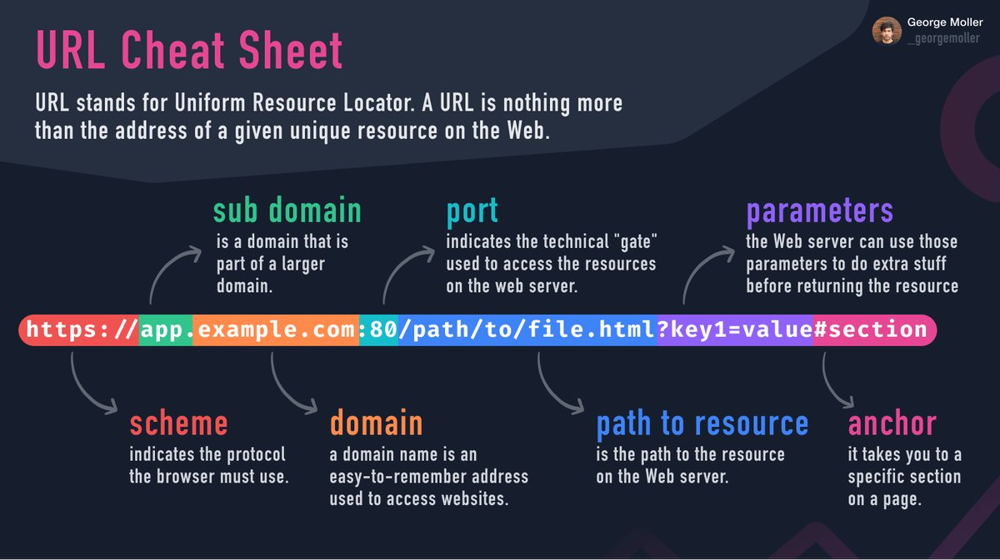
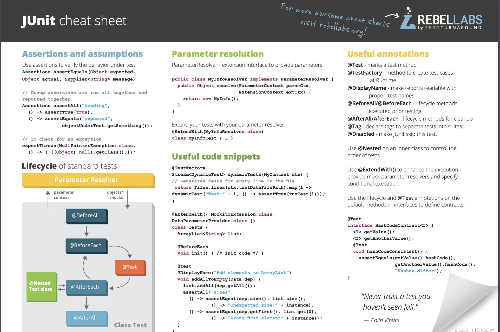

# Cheat Sheets

1. [Miscellaneous](#miscellaneous)
2. [Networking](#networking)
3. [Google Search](#google-search)
4. [Bash Shell](#bash-shell)
5. [AWS Cheat Sheets](#aws-cheat-sheets)
6. [Google Cloud Cheat Sheets](#google-cloud-cheat-sheets)
7. [Azure Cheat Sheets](#azure-cheat-sheets)
8. [API Cheatsheets](#api-cheatsheets)
9. [REST API](#rest-api)
10. [eBooks](#ebooks)
11. [Documentation Browser for Software Developers](#documentation-browser-for-software-developers)
     1. [Dash for MacOS (paid)](#dash-for-macos-paid)
     2. [Velocity (Windows, paid)](#velocity-windows-paid)
     3. [Zeal (Windows, Linux, Free)](#zeal-windows-linux-free)
12. [Kubernetes Knowledge Hubs and Glossary](#kubernetes-knowledge-hubs-and-glossary)
13. [Kubernetes and Kubectl Cheat Sheets](#kubernetes-and-kubectl-cheat-sheets)
14. [Kubernetes Kustomize Cheat Sheet](#kubernetes-kustomize-cheat-sheet)
15. [Docker Cheat Sheets](#docker-cheat-sheets)
     1. [Docker Swarm Cheat Sheets](#docker-swarm-cheat-sheets)
16. [Security Cheat Sheets](#security-cheat-sheets)
17. [Git and GitHub Cheat Sheets](#git-and-github-cheat-sheets)
     1. [Git Flow Cheat Sheets](#git-flow-cheat-sheets)
     2. [Sourcetree Cheat Sheet](#sourcetree-cheat-sheet)
     3. [GitKraken Git Cheat](#gitkraken-git-cheat)
18. [Ansible Cheat Sheets](#ansible-cheat-sheets)
19. [Packer and Terraform Cheat Sheets](#packer-and-terraform-cheat-sheets)
20. [Linux Command Cheat Sheets](#linux-command-cheat-sheets)
     1. [SSH Cheat Sheets](#ssh-cheat-sheets)
     2. [Nmap Cheat Sheet](#nmap-cheat-sheet)
21. [OpenShift Cheat Sheets](#openshift-cheat-sheets)
     1. [Debezium Cheat Sheets](#debezium-cheat-sheets)
22. [Kubernetes Operator Cheat Sheets](#kubernetes-operator-cheat-sheets)
23. [Kubernetes POD Cheat Sheets](#kubernetes-pod-cheat-sheets)
24. [Buildah Cheat Sheets](#buildah-cheat-sheets)
25. [Prometheus Cheat Sheets](#prometheus-cheat-sheets)
26. [Helm Cheat Sheets](#helm-cheat-sheets)
27. [Maven Cheat Sheets](#maven-cheat-sheets)
28. [Gradle Cheat Sheets](#gradle-cheat-sheets)
29. [Eclipse MicroProfile](#eclipse-microprofile)
30. [Jenkins Cheat Sheets](#jenkins-cheat-sheets)
31. [Bitbucket Pipelines](#bitbucket-pipelines)
32. [JMeter Cheat Sheets](#jmeter-cheat-sheets)
33. [Quarkus Cheat Sheets](#quarkus-cheat-sheets)
34. [Markdown Cheat Sheets](#markdown-cheat-sheets)
35. [Kafka](#kafka)
36. [Machine Learning](#machine-learning)
37. [Javascript](#javascript)
38. [TypeScript](#typescript)
39. [Jupyter](#jupyter)
40. [SQL](#sql)
41. [Postgres](#postgres)
42. [MariaDB and mySQL](#mariadb-and-mysql)
43. [MongoDB](#mongodb)
44. [Python](#python)
45. [Go](#go)
46. [NodeJS](#nodejs)
47. [C++](#c)
48. [Selenium](#selenium)
49. [RPA](#rpa)
50. [Data Science](#data-science)
51. [Scrum Cheat Sheet](#scrum-cheat-sheet)
52. [Images](#images)
53. [Tweets](#tweets)

## Miscellaneous

- [wizardzines.com 🌟](https://wizardzines.com/) programming zines by Julia Evans
- [lzone.de/cheat-sheet](https://lzone.de/cheat-sheet/)
- [cheatography.com](https://cheatography.com/)
- [LeCoupa/awesome-cheatsheets](https://github.com/LeCoupa/awesome-cheatsheets)
- [detailyang/awesome-cheatsheet](https://github.com/detailyang/awesome-cheatsheet)
- [Red Hat Developer cheat sheets 🌟](https://developers.redhat.com/cheatsheets) Browse through our collection of cheat sheets to help you develop with Red Hat products, which you can download for free as a Red Hat Developer member. You’ll find handy guides on a range of the latest developer tools and technologies, including Kubernetes, microservices, containers, and more.
- [blog.jromanmartin.io: ActiveMQ, Kafka, Strimzi and CodeReady Containers](https://blog.jromanmartin.io/cheat-sheets/)
- [cheat-sheets.org 🌟](http://www.cheat-sheets.org/)
- [jimmysong.io/cheatsheets 🌟](https://jimmysong.io/cheatsheets/)
- [simplecheatsheet.com](https://simplecheatsheet.com/)
- [medium: The DevOps Cheat Sheet](https://medium.com/dataseries/the-devops-cheat-sheet-3177d6cf361c) This comprehensive guide covers everything DevOps
- [ABZ-Aaron/CheatSheets](https://github.com/ABZ-Aaron/CheatSheets)
- [developers.redhat.com: Intermediate Linux Cheat Sheet](https://developers.redhat.com/cheat-sheets/intermediate-linux-cheat-sheet)
- [developers.redhat.com: MicroProfile Rest Client Cheat Sheet](https://developers.redhat.com/cheat-sheets/microprofile-rest-client)
- [cheat.sh 🌟](https://cheat.sh/)
    - [betterprogramming.pub: Cheat.sh — The Ultimate Multi-Language Cheat Sheet](https://betterprogramming.pub/cheat-sh-the-ultimate-multi-language-cheat-sheet-8e97c16407aa) Introducing cheat.sh, a powerful syntax and code-snippet search engine.
- [bash.cyberciti.biz: Man command](https://bash.cyberciti.biz/guide/Man_command)
- [opensource.com: Linux logrotate cheat sheet](https://opensource.com/downloads/logrotate-cheat-sheet)
- [manz.dev/cheatsheets](https://manz.dev/cheatsheets)
- [crontab.guru 🌟](https://crontab.guru) The quick and simple editor for cron schedule

## Networking

- [Networking Cheat Sheet](networking.md)

## Google Search

- [wikipedia: Google Search](https://en.wikipedia.org/wiki/Google_Search)
- [seranking.com: The cheat sheet of 30+ Google Search operators](https://seranking.com/blog/practical-tips-google-search-operators/)
- [supple.com.au: Google advanced search operators tips and tricks](https://supple.com.au/tools/google-advanced-search-operators/)
- [blog.linkody.com: The Ultimate Google Search Operators Cheatsheet 🌟](https://blog.linkody.com/guides/google-search-operators-cheatsheet)

## Bash Shell

- [Bash Pitfalls 🌟](http://mywiki.wooledge.org/BashPitfalls) This page is a compilation of common mistakes made by bash users. Each example is flawed in some way.
- [developers.redhat.com: Bash Shell Scripting Cheat Sheet](https://developers.redhat.com/cheat-sheets/bash-shell-cheat-sheet)
- [developers.redhat.com: Advanced Linux commands cheat sheet for developers](https://developers.redhat.com/cheat-sheets/advanced-linux-commands)
- [opensource.com: Watch command cheat sheet](https://opensource.com/downloads/watch-cheat-sheet)

## AWS Cheat Sheets

- [intellipaat.com: AWS Cheat Sheet 🌟](https://intellipaat.com/blog/tutorial/amazon-web-services-aws-tutorial/aws-cheat-sheet/)
- [tutorialsdojo.com: AWS Cheat Sheets 🌟](https://tutorialsdojo.com/links-to-all-aws-cheat-sheets/)
- [igoroseledko.com: AWS CLI Cheat Sheet](https://www.igoroseledko.com/aws-cli-cheat-sheet/)
- [==docs.aws.amazon.com: Actions, resources, and condition keys for AWS services== 🌟🌟🌟](https://docs.aws.amazon.com/service-authorization/latest/reference/reference_policies_actions-resources-contextkeys.html) There's a Reference for all 𝗜𝗔𝗠 𝗔𝗰𝘁𝗶𝗼𝗻𝘀, 𝗿𝗲𝘀𝗼𝘂𝗿𝗰𝗲𝘀, 𝗮𝗻𝗱 𝗰𝗼𝗻𝗱𝗶𝘁𝗶𝗼𝗻 𝗸𝗲𝘆𝘀 𝗳𝗼𝗿 𝗮𝗹𝗹 𝗔𝗪𝗦 𝘀𝗲𝗿𝘃𝗶𝗰𝗲𝘀 🔐 Bookmark it! 🔖
- [==awsgeek.com/Amazon-S3==](https://www.awsgeek.com/Amazon-S3/)

## Google Cloud Cheat Sheets

- [The Google Cloud Developer's Cheat Sheet 🌟](https://github.com/priyankavergadia/google-cloud-4-words)
- [==googlecloudcheatsheet.withgoogle.com: Google Cloud Developer cheat sheet==](https://googlecloudcheatsheet.withgoogle.com)

## Azure Cheat Sheets

- [cloud-architect.fr: AZ-CheatSheet: Become an expert in Azure Landing Zones](https://www.cloud-architect.fr/2022/01/19/az-cheatsheet-become-an-expert-in-azure-landing-zones/) Azure landing zones are the output of a multisubscription Azure environment that accounts for scale, security governance, networking, and identity. Azure landing...

## API Cheatsheets

- [freecodecamp.org: API Cheatsheet – What is an API, How it Works, and How to Choose the Right API Testing Tools 🌟](https://www.freecodecamp.org/news/what-is-an-api-and-how-to-test-it/)

## REST API

- [karneliuk.com: REST API 1. Basics cheat sheet (Ansible, Bash, Postman, and Python) for GET using NetBox and Docker as examples](https://karneliuk.com/2019/07/rest-api-1-basics-cheat-sheet-ansible-bash-postman-and-python-for-get-using-netbox-and-docker-as-examples/)
- [karneliuk.com: REST API 2. Basics cheat sheet (Ansible, Bash, Postman, and Python) for POST/DELETE using NetBox and Docker as examples](https://karneliuk.com/2019/08/rest-api-2-basics-cheat-sheet-ansible-bash-postman-and-python-for-post-delete-using-netbox-and-docker-as-examples/)

## eBooks

- [Red Hat Developer eBooks 🌟](https://developers.redhat.com/ebooks) Browse through our collection of eBooks to help you develop with Red Hat products, which you can download for free as a Red Hat Developer member. You’ll find handy books on a range of the latest developer tools and technologies, including Kubernetes, microservices, containers, and more.
- [Transformation takes practice](https://www.redhat.com/en/engage/open-practice-library-ebook) Our experts understand this: When it comes to your unique business challenges, one size does not fit all. We can guide you through exercises and tools, like the ones within the Open Practice Library, that are right for where you are, right now.

## Documentation Browser for Software Developers

### Dash for MacOS (paid)

- [Dash for MacOS](https://kapeli.com/dash) Dash gives your Mac instant offline access to 200+ API documentation sets.
- [Dash Cheat Sheets](https://kapeli.com/cheatsheets)

### Velocity (Windows, paid)

- [Velocity](https://velocity.silverlakesoftware.com/) Velocity gives your Windows desktop offline access to over 150 API documentation sets

### Zeal (Windows, Linux, Free)

- [Zeal](https://zealdocs.org/) Zeal is an offline documentation browser for software developers.

## Kubernetes Knowledge Hubs and Glossary

- [k8sref.io](https://www.k8sref.io/) Kubernetes Reference - [dev-k8sref-io.web.app 🌟](https://dev-k8sref-io.web.app/) Imports paths are not always easy to find for a resource. Get some help from this doc.
- [Kubernetes Research. Research documents on node instance types, managed services, ingress controllers, CNIs, etc. 🌟](https://learnk8s.io/research) A research hub to collect all knowledge around Kubernetes. Those are in-depth reports and comparisons designed to drive your decisions. Should you use GKE, AKS, EKS? How many nodes? What instance type?
- [Kubernetes Glossary 🌟](https://www.bluematador.com/learn/kubernetes-glossary)
- [mirantis.com: Kubernetes Cheat Sheet](https://www.mirantis.com/blog/kubernetes-cheat-sheet)
- [==manifests.io== 🌟](https://manifests.io)
    - [manifests.io/kubernetes/1.28](https://www.manifests.io/kubernetes/1.28)

## Kubernetes and Kubectl Cheat Sheets

- [developers.redhat.com: Kubernetes Cheat Sheet](https://developers.redhat.com/cheat-sheets/kubernetes/)
- [kubernetes.io 🌟](https://kubernetes.io/docs/reference/kubectl/cheatsheet/)
- [linuxacademy](https://linuxacademy.com/blog/containers/kubernetes-cheat-sheet/)
- [fabric8 - kubectl](https://github.com/fabric8io/kansible/blob/master/vendor/k8s.io/kubernetes/docs/user-guide/kubectl-cheatsheet.md)
- [==intellipaat.com== 🌟](https://intellipaat.com/blog/tutorial/devops-tutorial/kubernetes-cheat-sheet/)
- [dzone: kubectl commands cheat sheet](https://dzone.com/articles/kubectl-commands-cheat-sheet)
- [jimmysong.io: kubectl cheat sheet 🌟](https://jimmysong.io/kubernetes-handbook/guide/using-kubectl.html)
- [cheatsheet.dennyzhang.com: kubectl kubernetes free cheat sheet 🌟](https://cheatsheet.dennyzhang.com/cheatsheet-kubernetes-a4)
- [opensource.com: 9 kubectl commands sysadmins need to know 🌟](https://opensource.com/article/20/5/kubectl-cheat-sheet) Keep these 9 critical kubectl commands handy to help you with troubleshooting and managing your Kubernetes cluster administration.
- [bluematador.com: kubectl cheatsheet](https://www.bluematador.com/learn/kubectl-cheatsheet)
- [dockerlabs.collabnix.com: Cheatsheet - Kubectl 🌟](https://dockerlabs.collabnix.com/kubernetes/cheatsheets/kubectl.html)
- [medium: Awesome Kubernetes Command-Line Hacks](https://medium.com/better-programming/awesome-kubernetes-command-line-hacks-8bd3604e394f) Tips for you to kubectl like a pro
- [akhilsharma.work: kubectl Get Resource - Short Names](https://akhilsharma.work/kubectl-get-resource-short-names/)
- [blog.mimacom.com: Kubernetes Cheat Sheet](https://blog.mimacom.com/kubernetes-cheat-sheet/)
- [github: K8s in 30 mins 🌟](https://github.com/r0hi7/k8s-In-30Mins) This is not a comprehensive guide to learn Kubernetes from scratch, rather this is just a small guide/cheat sheet to quickly setup and run applications with Kubernetes and deploy a very simple application on single workload VM. This repo can be served as quick learning manual to understand Kubernetes.
- [kunchalavikram1427: kubernetes Public](https://github.com/kunchalavikram1427/Kubernetes_public)
    - [kunchalavikram1427: kubernetes Commands](https://github.com/kunchalavikram1427/Kubernetes_public/blob/master/Kubernetes_Commands.txt)
- [betterprogramming.pub: Awesome Kubernetes Command-Line Hacks](https://betterprogramming.pub/awesome-kubernetes-command-line-hacks-8bd3604e394f) Tips for you to kubectl like a pro
- [thechief.io: The Definitive Kubectl Cheat Sheet](https://thechief.io/c/editorial/definitive-kubectl-cheat-sheet/)
- [ithands-on.com: Kubernetes 101 : kubectl - communication with pods and containers / running commands inside pods and containers](https://www.ithands-on.com/2021/05/kubernetes-101-kubectl-communication.html)
- [opensource.com: Learn essential Kubernetes commands with a new cheat sheet](https://opensource.com/article/21/5/kubernetes-cheat-sheet) Start exploring kubectl, containers, pods, and more, then download our free cheat sheet so you always have the key commands at your fingertips.
- [computingforgeeks.com: Kubectl Cheat Sheet for Kubernetes Admins & CKA Exam Prep](https://computingforgeeks.com/kubectl-cheat-sheet-for-kubernetes-cka-exam-prep/)
- [mirantis.com: Kubernetes Cheat Sheet](https://www.mirantis.com/blog/kubernetes-cheat-sheet)
- [myfuturehub.com: Must Keep these Kubernetes Commands handy](https://myfuturehub.com/must-keep-these-kubernetes-commands-handy/)
- `--tail=-1` lets you output all logs when you use a label selector:
    - `kubectl logs -n etcd -l app=etcd -c etcd --tail=-1`
    - `kubectl logs -l app=my.app --tail=-1`
- [cmcrowell.com/cheat-sheet 🌟](https://cmcrowell.com/cheat-sheet/)
- [mirantis.com: Kubernetes Cheat Sheet 🌟](https://www.mirantis.com/blog/kubernetes-cheat-sheet/)
- [==komodor.com: The Ultimate Kubectl Cheat Sheet== 🌟](https://komodor.com/learn/the-ultimate-kubectl-cheat-sheet/)
- [==atomiccommits.io: Everything Useful I Know About kubectl==](https://www.atomiccommits.io/everything-useful-i-know-about-kubectl)
- Top kubernetes troubleshooting Commands:
    - `kubectl get pods -o wide`
    - `kubectl logs <pod>`
    - `kubectl logs <pod> --previous` 🌟🌟🌟 (debugging a **CrashLoopBackOff pod**)
    - `kubectl describe pod`
    - `kubectl describe ingress/service`
    - `kubectl delete`
    - `kubectl --help`
- [betterprogramming.pub: Kubectl Commands All Beginners Must Know](https://betterprogramming.pub/kubectl-commands-all-beginners-must-know-e504349fcec9) Control Kubernetes Cluster like a Pro
- [medium.com/@devopsfolks8546: Kubectl Commands Cheat Sheet. List Of Kubernetes Most Useful Commands](https://medium.com/@devopsfolks8546/1-pods-c3d1a9349ba0)
- [faun.pub: Kubernetes Commands for Deployment and Management](https://faun.pub/kubernetes-commands-for-deployment-and-management-e10a74c95015)
- [learncloudnative.com: Kubernetes CLI (kubectl) tips you didn't know about](https://learncloudnative.com/blog/2022-05-10-kubectl-tips)
- [cloudtechtwitter.com: kubernetes common commands](https://www.cloudtechtwitter.com/2022/05/kubernetes-common-commands.html)
- [==thenewstack.io: K8s Resource Management: An Autoscaling Cheat Sheet== 🌟](https://thenewstack.io/k8s-resource-management-an-autoscaling-cheat-sheet/) A concise but comprehensive guide to using and managing horizontal and vertical autoscaling in the Kubernetes environment.
- [abhirajdevops.hashnode.dev: A Cheat Sheet of Essential Commands for Managing and Debugging Your Kubernetes Cluster's Networking](https://abhirajdevops.hashnode.dev/a-cheat-sheet-of-essential-commands-for-managing-and-debugging-your-kubernetes-clusters-networking)
- [github.com/devoriales/kubectl-cheatsheet](https://github.com/devoriales/kubectl-cheatsheet) This repository contains a kubectl cheatsheet to use as a quick reference guide. It contains the most common commands used when working with Kubernetes.
- [dev.to/msfaizi: Kubernetes Cheatsheet: Essential Commands and Concepts for Efficient Container Orchestration](https://dev.to/msfaizi/kubernetes-cheatsheet-essential-commands-and-concepts-for-efficient-container-orchestration-201n)

## Kubernetes Kustomize Cheat Sheet

- [itnext.io: Kubernetes Kustomize Cheat Sheet](https://itnext.io/kubernetes-kustomize-cheat-sheet-8e2d31b74d8f)

## Docker Cheat Sheets

- [docker.com: Docker Cheat Sheet](https://www.docker.com/wp-content/uploads/2022/03/docker-cheat-sheet.pdf)
- [dockerlux.github.io: Docker Cheat Sheet 🌟](https://dockerlux.github.io/pdf/cheat-sheet-v2.pdf)
- [==cheatsheetseries.owasp.org: Docker Security Cheat Sheet== 🌟🌟](https://cheatsheetseries.owasp.org/cheatsheets/Docker_Security_Cheat_Sheet.html)
- [==dockerlabs.collabnix.com: The Ultimate Docker Cheat Sheet== 🌟](https://dockerlabs.collabnix.com/docker/cheatsheet/)
- [Dzone: Docker Command Cheatsheet](https://dzone.com/articles/docker-command-cheatsheet) If you're new to Docker or just want to have a list of handy commands, this cheatsheet will help you install, monitor, maintain, and clean up your images and processes.
- [developers.redhat.com: Containers Cheat Sheet](https://developers.redhat.com/cheat-sheets/containers/)
- [github.com: Docker cheat Sheet](https://github.com/wsargent/docker-cheat-sheet)
- [caylent.com: Docker Commands Cheat Sheet](https://caylent.com/blog/docker/docker-commands-cheat-sheet)
- [intellipaat.com: Docker Cheat Sheet 🌟](https://intellipaat.com/blog/tutorial/devops-tutorial/docker-cheat-sheet) - [2019, pdf](https://intellipaat.com/mediaFiles/2019/03/docker-cheat-sheet.pdf)
- [developers.redhat.com: Containers Cheat Sheet](https://developers.redhat.com/promotions/docker-cheatsheet)
- [blog.gitguardian.com: Docker Security Best Practices & Cheat Sheet 🌟](https://blog.gitguardian.com/how-to-improve-your-docker-containers-security-cheat-sheet/) Containers are no security devices. That's why we've curated a set of easily actionable recommendations to improve your Docker containers security. Check out the one-page cheat sheet.
- [myfuturehub.com: Useful commands of Docker](https://myfuturehub.com/useful-commands-of-docker/)
- [dev.to: Docker Cheatsheet](https://dev.to/ibmdeveloper/docker-command-cheatsheet-1pe8)
- `docker system prune --all`
- `docker image prune -a -f --filter "until=720h"`
- `docker container prune -f --filter "until=48h"`
- `sudo docker image prune --all --filter until=1h`
- Standard crontab on all machines I run docker builds on:
    - `50 * * * * docker container prune -f --filter "until=4h"`
    - `55 * * * * docker image prune --all -f --filter "until=4h"`
    - `59 * * * * docker volume prune -f`
- [linuxhandbook.com: Docker Commands for Managing Container Lifecycle (Definitive Guide)](https://linuxhandbook.com/container-lifecycle-docker-commands/)
- [betterprogramming.pub: A Beginners’ Cheat Sheet for Docker | Arjav Dave](https://betterprogramming.pub/a-beginners-cheat-sheet-for-docker-f5024fd6c17f) Get to know what is docker and how to use it
- [dev.to: Docker Commands Cheat Sheet | Pragyan Tripathi](https://dev.to/pragyanatvade/docker-commands-cheat-sheet-47n4) The 15 Commands You Need To Know

### Docker Swarm Cheat Sheets

- [github: sematext - Docker Swarm Cheatsheet](https://github.com/sematext/cheatsheets/blob/master/docker-swarm-cheatsheet.md)
    - [docker-swarm-cheatsheet-sematext.pdf](https://cdn2.hubspot.net/hubfs/5111483/docker-swarm-cheatsheet-sematext.pdf)
- [lzone.de: Docker Swarm Cheat Sheet](https://lzone.de/cheat-sheet/Docker%20Swarm)
- [kerneltalks.com: Docker swarm cheat sheet](https://kerneltalks.com/virtualization/docker-swarm-cheat-sheet/)
- [codingfriend.medium.com: Docker Swarm Cheatsheet (2017)](https://codingfriend.medium.com/docker-swarm-cheatsheet-22665e3278b1)
- [blog.programster.org: Docker Swarm Cheatsheet](https://blog.programster.org/docker-swarm-cheatsheet)

## Security Cheat Sheets

- [cheatsheetseries.owasp.org: OWASP Cheat Sheet Series 🌟🌟](https://cheatsheetseries.owasp.org/index.html) The OWASP Cheat Sheet Series was created to provide a concise collection of high value information on specific application security topics. These cheat sheets were created by various application security professionals who have expertise in specific topics.

## Git and GitHub Cheat Sheets

- [guides.github.com 🌟](https://guides.github.com/)
- [dev.to: Git & Github Cheatsheet 🌟](https://dev.to/zinox9/git-github-cheatsheet-22ok)
- [git-scm.com: Git reference](https://git-scm.com/docs)
- [zeroturnaround.com: Git cheat sheet 🌟](https://www.jrebel.com/blog/git-cheat-sheet)
- [ndpsoftware.com: Interactive git cheat sheet 🌟](https://ndpsoftware.com/git-cheatsheet.html)
- [The awesome git cheat sheet](https://the-awesome-git-cheat-sheet.com/)
- [developers.redhat.com: Git cheat sheet](https://developers.redhat.com/cheat-sheetsgit/)
- [atlassian.com: Git cheat sheet](https://www.atlassian.com/git/tutorials/atlassian-git-cheatsheet)
- [github.github.com/training-kit: Git cheat sheet](https://github.github.com/training-kit/downloads/github-git-cheat-sheet.pdf)
- [education.github.com: Git cheat sheet 🌟](https://education.github.com/git-cheat-sheet-education.pdf)
- [dzone.com: refcard - getting started with git](https://dzone.com/refcardz/getting-started-git)
- [git-tower.com: Git cheat sheet](https://www.git-tower.com/blog/git-cheat-sheet/)
- [rogerdudler.github.io: git - the simple guide 🌟](https://rogerdudler.github.io/git-guide) Just a simple guide for getting started with git. no deep shit ;)
    - [rogerdudler.github.io: git cheat sheet pdf](https://rogerdudler.github.io/git-guide/files/git_cheat_sheet.pdf)
- [towardsdatascience.com: 18 Git Commands I Learned During My First Year as a Software Developer](https://towardsdatascience.com/git-commands-cheat-sheet-software-developer-54f6aedc1c46)
- [dzone: Top 35 Git Commands With Examples 🌟](https://dzone.com/articles/top-35-git-commands-with-examples-and-bonus) Git commands are essential, and they help to manage your source code effectively. In this guide, you will learn Git commands from Beginners to Advanced level.
- [==gitexplorer.com: Git Command Explorer== 🌟🌟](https://gitexplorer.com/) Find the right commands you need without digging through the web.
- [justingarrison.com: GitHub URL Hacks 🌟](https://www.justingarrison.com/blog/2021-07-11-github-url-hacks/) GitHub’s UI has improved a lot over the years but sometimes you just need quick access without clicking. Here are a few GitHub URL tips to get you data you want faster. One cool thing is all of these tips give raw text output so they work great with curl and other CLI tools.
- [dev.to: Git it Right🔥🔥🚀(Git CheatSheet) 🌟](https://dev.to/star_trooper/git-it-right-git-cheatsheet-4o0h)
- [jan-krueger.net: Git cheat sheet, extended edition](https://jan-krueger.net/git-cheat-sheet-extended-edition)
- [dev.to: A Git Cheat Sheet](https://dev.to/baransel/a-git-cheat-sheet-4mab)
- [==geeksforgeeks.org: Essential Git Commands== 🌟](https://www.geeksforgeeks.org/essential-git-commands/)
- [dev.to: Git Cheat Sheet- 20 commands I Use Everyday | Tabassum Khanum](https://dev.to/codewithtee/git-cheat-sheet-20-commands-i-use-everyday-47h9)
- Find the first commit you ever made: ```git log --reverse```
- [==joshnh/Git-Commands== 🌟](https://github.com/joshnh/Git-Commands/blob/master/README.md) A list of commonly used Git commands
- [dev.to: Git Commands Cheatsheet: Advanced (20+ Git Commands Advanced )](https://dev.to/aashiya123/git-commands-cheatsheet-advanced-20-git-commands-advanced--35i3)
- [dev.to: Git Cheat Sheet 📄 (50 commands + Free PDF and poster)](https://dev.to/doabledanny/git-cheat-sheet-50-commands-free-pdf-and-poster-4gcn)
- [enlear.academy: 20 Git Commands Every Developer Should Know](https://enlear.academy/26-git-command-i-use-all-the-time-cheatsheet-6c5682ded2af) 20 Git Command I Use All The Time — Git CheatSheet
- [freecodecamp.org: Git Cheat Sheet – 50 Git Commands You Should Know](https://www.freecodecamp.org/news/git-cheat-sheet/)
- [==opensource.com: 10 Git tips we can't live without==](https://opensource.com/article/22/4/git-tips) Opensource.com community members share their favorite Git tips for saving time or preventing mistakes.
- Terminal tip: Always use `less -R` to display colored terminal output properly: `git diff --color=always | less -R`
- [betterprogramming.pub: 8 Advanced Git Commands Universities Won’t Teach You](https://betterprogramming.pub/8-advanced-git-commands-university-wont-teach-you-fe63b483d34b) Advanced tips and tricks that will save you time and headaches.
- [==intellipaat.com: GIT Cheat Sheet== 🌟](https://intellipaat.com/blog/tutorial/devops-tutorial/git-cheat-sheet/)
- [dev.to: 20 Git Commands That Will Make You a Version Control Pro](https://dev.to/devland/20-git-commands-that-will-make-you-a-version-control-pro-149p)

### Git Flow Cheat Sheets

- [Git-flow cheatsheet](https://danielkummer.github.io/git-flow-cheatsheet/index.html)
- [arslanbilal/git-cheat-sheet 🌟🌟🌟](https://github.com/arslanbilal/git-cheat-sheet) Git and Git Flow Cheat Sheet

### Sourcetree Cheat Sheet

- [Sourcetree Cheat Sheet](https://kapeli.com/cheat_sheets/Sourcetree.docset/Contents/Resources/Documents/index)

### GitKraken Git Cheat

- [GitKraken Git Cheat](https://www.gitkraken.com/resources/gitkraken-cheat-sheet)

## Ansible Cheat Sheets

- [Ansible Roles Explained | Cheat Sheet](https://linuxacademy.com/blog/red-hat/ansible-roles-explained/)
- [edureka.co: Ansible Cheat Sheet – A DevOps Quick Start Guide](https://www.edureka.co/blog/cheatsheets/ansible-cheat-sheet-guide/)
- [intellipaat.com: Ansible Basic Cheat Sheet](https://intellipaat.com/blog/tutorial/devops-tutorial/ansible-basic-cheat-sheet/)
- [mrxpalmeiras: Ansible Cheat Sheet](https://sites.google.com/site/mrxpalmeiras/ansible/ansible-cheat-sheet)
- [google.com/site/mrxpalmeiras: Ansible Cheat Sheet 🌟](https://sites.google.com/site/mrxpalmeiras/ansible/ansible-cheat-sheet)
- [Ansible k8s cheat sheet 🌟](https://opensource.com/downloads/ansible-k8s-cheat-sheet) The Ansible k8s module enables you to manage Kubernetes objects with Ansible playbooks.
- [fosstechnix.com: Ansible ad hoc commands with Examples](https://www.fosstechnix.com/ansible-ad-hoc-commands-with-examples/)

## Packer and Terraform Cheat Sheets

- [Packer Cheatsheet](https://adamrushuk.github.io/cheatsheets/packer/)
- [dzone: Terraform Cheat Sheet](https://dzone.com/articles/terraform-cli-cheat-sheet)
- [terraform.io: Terraform Commands](https://www.terraform.io/docs/commands/index.html)
- [github.com/scraly: Terraform Cheat sheet](https://github.com/scraly/terraform-cheat-sheet/blob/master/terraform-cheat-sheet.pdf)
- [lzone.de: Terraform Cheat Sheet](https://lzone.de/cheat-sheet/Terraform)
- [thedevopsblog.co.uk: Terraform Cheat Sheet](https://thedevopsblog.co.uk/terraform-cli-cheat-sheet)
- [terraform-infraestructura.readthedocs.io: comandos](https://terraform-infraestructura.readthedocs.io/es/latest/comandos/)
- [acloudguru.com: The Ultimate Terraform Cheatsheet](https://acloudguru.com/blog/engineering/the-ultimate-terraform-cheatsheet)
- [hashicorp.com: Using Template Files with HashiCorp Packer](https://www.hashicorp.com/blog/using-template-files-with-hashicorp-packer)
- [searchitoperations.techtarget.com: Terraform cheat sheet: Notable commands, HCL and more](https://searchitoperations.techtarget.com/tip/Terraform-cheat-sheet-Notable-commands-HCL-and-more) Terraform has a lot going on. This cheat sheet rounds up the essentials, from configuration settings to the key commands for managing the Terraform directory.
- [techbeatly.com: Terraform Cheat Sheet](https://www.techbeatly.com/terraform-cheat-sheet/)
- [praveendandu24.medium.com: Mastering Terraform: Top 20 Essential Commands with Examples for Beginners](https://praveendandu24.medium.com/mastering-terraform-top-20-essential-commands-with-examples-for-beginners-1029852b419)

## Linux Command Cheat Sheets

- [linoxide.com: Linux Commands Cheat Sheet](https://linoxide.com/linux-command/linux-commands-cheat-sheet/)
- [commandlinefu.com](https://www.commandlinefu.com/)
- [opensource.com: 10 cheat sheets for Linux sysadmins](https://opensource.com/article/20/7/sysadmin-cheat-sheets)
- [curl cheat sheet for Linux and Unix users](https://daniel.haxx.se/blog/wp-content/uploads/2020/01/sticker-cheat-sheet.png)
- [NetworkManager CLI cheatsheet](https://github.com/neilhwatson/nustuff/blob/master/networking/nmcli.md)
- [pixelbeat.org/cmdline](http://www.pixelbeat.org/cmdline.html)
- [opensource.com: Linux Parted cheat sheet](https://opensource.com/downloads/parted-cheat-sheet)
- [opensource.com: GNU Screen cheat sheet](https://opensource.com/downloads/gnu-screen-cheat-sheet)
- [catonmat.net: GNU Coreutils Cheat Sheet](https://catonmat.net/gnu-coreutils-cheat-sheet)
- [cyberciti.biz: Linux ip Command Examples](https://www.cyberciti.biz/faq/linux-ip-command-examples-usage-syntax/) Deprecated Linux command and their replacement cheat sheet.
- [linuxhandbook.com: Yum Command Cheat Sheet](https://linuxhandbook.com/yum-cheatsheet/)
- [stationx.net: Hacking Tools Cheat Sheet](https://www.stationx.net/hacking-tools-cheat-sheet)

### SSH Cheat Sheets

- [ssh cheat sheet](https://cheatsheet.dennyzhang.com/cheatsheet-ssh-a4)
- [lzone.de: ssh cheat sheet](https://lzone.de/cheat-sheet/SSH)
- [pentestmonkey.net: ssh cheat sheet](http://pentestmonkey.net/cheat-sheet/ssh-cheat-sheet)
- [The SSH Commands Cheat Sheet for Linux SysAdmins / Users](https://computingforgeeks.com/ssh-cheatsheet-for-sysadmins/)
- [opensource.com: Learn advanced SSH commands with this cheat sheet](https://opensource.com/article/18/4/learn-advanced-ssh-commands-new-cheat-sheet)

### Nmap Cheat Sheet

- [comparitech.com: Nmap Cheat Sheet](https://www.comparitech.com/net-admin/nmap-nessus-cheat-sheet/) Nmap Cheat Sheet plus Nmap + Nessus Cheat Sheet. We include all the commands in an easy to download and reference format. Downloadable JPEG or PDF files.

## OpenShift Cheat Sheets

- [mastertheboss.com: OpenShift Cheat Sheet](http://www.mastertheboss.com/soa-cloud/openshift/openshift-cheatsheet)
- [developers.redhat.com: Red Hat OpenShift Container Platform Cheat Sheet](https://developers.redhat.com/cheat-sheets/red-hat-openshift-container-platform/)
- [github.com: Openshift cheat sheet 1](https://github.com/nekop/openshift-sandbox/blob/master/docs/command-cheatsheet.md)
- [gist.github.com: Openshift cheat sheet 2](https://gist.github.com/rafaeltuelho/111850b0db31106a4d12a186e1fbc53e)
- [github.com: openshift cheat sheet 3](https://github.com/mhausenblas/openshift-cheat-sheet)
- [monodot.co.uk: openshift cheat sheet 4](https://monodot.co.uk/openshift-cheatsheet/)
- [openshift.tips](https://openshift.tips/)
- [dzone refcard: Getting Started With OpenShift 🌟](https://dzone.com/refcardz/getting-started-with-openshift)
- [cookbook.openshift.org 🌟](https://cookbook.openshift.org/)
- [cookbook.openshift.org: How do I import an image from an external image registry? 🌟](https://cookbook.openshift.org/image-registry-and-image-streams/how-do-i-import-an-image-from-an-external-image.html)

### Debezium Cheat Sheets

- [developers.redhat.com: Debezium on OpenShift Cheat Sheet](https://developers.redhat.com/cheat-sheets/debezium-openshift-cheat-sheet) Debezium is a distributed open-source platform for change data capture. Start it up, point it at your databases, and your apps can start responding to all of the inserts, updates, and deletes that other apps commit to your databases. Debezium is durable and fast, so your apps can respond quickly and never miss an event, even when things go wrong. This cheat sheet covers how to deploy/create/run/update a Debezium Connector on OpenShift.

## Kubernetes Operator Cheat Sheets

- [developers.redhat.com: Writing a Kubernetes Operator in Java using Quarkus - **Cheat Sheet** 🌟](https://developers.redhat.com/cheat-sheets/writing-kubernetes-operator-java/)

## Kubernetes POD Cheat Sheets

- [jimmysong.io/kubernetes-handbook/concepts/pod.html 🌟](https://jimmysong.io/kubernetes-handbook/concepts/pod.html)
- [https://dev.to/aurelievache: Understanding Kubernetes: part 1 – Pods](https://dev.to/aurelievache/kubernetes-sketchnotes-pods-4ib0)
- [garba.org: Kubernetes Pod Life Cycle Cheat Sheet](https://garba.org/posts/2018/k8s_pod_lc/)

<center>
[](https://jimmysong.io/kubernetes-handbook/concepts/pod.html)
</center>

## Buildah Cheat Sheets

- [developers.redhat.com: Buildah Cheat Sheet](https://developers.redhat.com/cheat-sheets/buildah-cheat-sheet)

## Prometheus Cheat Sheets

- [iximiuz.com: Prometheus Cheat Sheet - How to Join Multiple Metrics (Vector Matching) 🌟](https://iximiuz.com/en/posts/prometheus-vector-matching/)
- [iximiuz.com: Prometheus Cheat Sheet - Moving Average, Max, Min, etc (Aggregation Over Time)](https://iximiuz.com/en/posts/prometheus-functions-agg-over-time/) Building anomaly detection with Prometheus requires the use of *_over_time function. But what do these functions do concretely?

## Helm Cheat Sheets

- [Helm Cheat Sheet](https://gist.github.com/tuannvm/4e1bcc993f683ee275ed36e67c30ac49)
- [faun.pub: Helm Command Cheat Sheet | By M. Sharma](https://faun.pub/helm-command-cheat-sheet-by-m-sharma-488706ecf131) This cheat sheet covers all important Helm operations and provides examples to help you understand its syntax and features

## Maven Cheat Sheets

- [maven.apache.org: Maven Quick Reference Card](http://maven.apache.org/guides/MavenQuickReferenceCard.pdf)
- [jrebel.com/blog/maven-cheat-sheet](https://www.jrebel.com/blog/maven-cheat-sheet)
- [medium 1](https://medium.com/@TimvanBaarsen/maven-cheat-sheet-45942d8c0b86)
- [journaldev.com](https://www.journaldev.com/33645/maven-commands-options-cheat-sheet)
- [cheatography.com](https://www.cheatography.com/mikesac/cheat-sheets/maven/)
- [javaguides.net](https://www.javaguides.net/2018/06/maven-cheat-sheet.html)
- [bogotobogo.com](https://www.bogotobogo.com/Java/tutorials/Spring-Boot/Maven-mvn-command-cheat-sheet.php)
- [lzone.de/cheat-sheet/Maven](https://lzone.de/cheat-sheet/Maven)
- [gist.github.com/michaellihs (jenkins pipeline)](https://gist.github.com/michaellihs/b08c89581ec597fa198cf74e2239f4a6)
- [confluence.sakaiproject.org](https://confluence.sakaiproject.org/display/REL/Maven+release+plugin+cheat+sheet)

## Gradle Cheat Sheets

- [polyglotdeveloper.com: Gradle Cheat Sheet](https://www.polyglotdeveloper.com/cheatsheet/2015-01-08-Gradle-cheatsheet/)
- [eta-lang.org: Gradle Cheat Sheet](https://eta-lang.org/docs/cheatsheets/gradle-cheatsheet)
- [mingliang.me: Gradle Cheat Sheet](https://mingliang.me/blog/gradle-cheatsheet/)
- [rratliff.com: Gradle Cheat Sheet](https://www.rratliff.com/gradle-cheat-sheet/)
- [github.com/jahe: Gradle Cheat Sheet](https://gist.github.com/jahe/59557d507f43574b0d96)
- [github.com/jiffle: Gradle Cheat Sheet](https://gist.github.com/jiffle/499caa5f53ab8f90dc19a3040ee40f48)

## Eclipse MicroProfile

- [developers.redhat.com: MicroProfile JWT (JSON Web Tokens)](https://developers.redhat.com/cheat-sheets/microprofile-jwt)

## Jenkins Cheat Sheets

- [edureka.co: Jenkins Cheat Sheet 🌟](https://www.edureka.co/blog/cheatsheets/jenkins-cheat-sheet/)
    - [Jenkins Cheat Sheet](https://miro.medium.com/max/1400/1*5tZVl-tqZwSoxH97v4u45w.png)
- [medium: Jenkins Cheat Sheet](https://medium.com/edureka/jenkins-cheat-sheet-e0f7e25558a3)
- [cheatography.com: Jenkins Cheat Sheet](https://cheatography.com/funthomas424242/cheat-sheets/jenkins/)
- [intellipaat.com: Jenkins Cheat Sheet 🌟](https://intellipaat.com/blog/tutorial/devops-tutorial/jenkins-cheat-sheet/)

## Bitbucket Pipelines

- [balajisblog.com: Cheatsheet for Bitbucket Pipelines](https://balajisblog.com/cheatsheet-for-bitbucket-pipelines/)

## JMeter Cheat Sheets

- [Dzone Refcard: Getting Started with Apache JMeter](https://dzone.com/refcardz/getting-started-with-apache-jmeter?chapter=1)
- [Groovy Templates Cheat Sheet for JMeter](https://dzone.com/articles/the-groovy-templates-cheat-sheet-for-jmeter) Need help with your Groovy templates? Check out this cheat sheet to help you get started with scripting in Apache JMeter.
- [JMeter Web Application Testing Cheatsheet](http://blog.extremehacking.org/blog/2015/11/09/jmeter-web-application-testing-cheatsheet/)
- [CheatSheet for JMeter __time Function Calls](https://hellotestworld.com/2016/02/02/cheatsheet-for-jmeter-__time-function-calls/)
- [martkos-it.co.uk: JMeter Cheat Sheet](https://martkos-it.co.uk/our-work/jmeter-testing-cheat-sheet-ng5zm-97y43-af8tj) This jmeter cheat sheet provides gentle reminders of the usage of jmeter gui/non-gui. It includes installation/execution, plugins, shortcut keys and functions and variables.
    - [jmeter-testing-cheat-sheet-v10.pdf](https://martkos-it.co.uk/s/jmeter-testing-cheat-sheet-v10.pdf)
- [Cheat Sheet for Regular Expression in Jmeter](http://performanceoptimize.blogspot.com/2017/04/RegularExpressionCheatSheet.html)

## Quarkus Cheat Sheets

- [Quarkus Cheat-Sheet](https://lordofthejars.github.io/quarkus-cheat-sheet/)

## Markdown Cheat Sheets

- [markdownguide.org](https://www.markdownguide.org/)
    - [Markdown Cheat Sheet 1](https://www.markdownguide.org/cheat-sheet/)
- [guides.github.com: Markdown Cheat Sheet 2](https://guides.github.com/pdfs/markdown-cheatsheet-online.pdf)
- [Markdown Cheat Sheet 3](https://3os.org/markdownCheatSheet/welcome/)
- [Markdown Cheat Sheet 4](https://github.com/adam-p/markdown-here/wiki/Markdown-Cheatsheet)
- [freecodecamp.org: Markdown Cheat Sheet – How to Write in Markdown with Examples](https://www.freecodecamp.org/news/markdown-cheat-sheet/)

## Kafka

- [codingharbour.com: kafkacat cheatsheet](https://codingharbour.com/kafkacat-cheatsheet/) Kafkacat is a versatile tool for producing and consuming messages, as well as exploring the cluster and topic metadata. Download the 1-page cheatsheet to get the most out of this awesome CLI tool.
- [betterprogramming.pub: 15 Kafka CLI Commands For Everyday Programming](https://betterprogramming.pub/kafka-cli-commands-1a135a4ae1bd) Demonstrating the use of the most commonly used Kafka Command Line Interface Commands

## Machine Learning

- [Machine Learning Glossary](https://developers.google.com/machine-learning/glossary)

## Javascript

- [opensource.com: JavaScript cheat sheet](https://opensource.com/downloads/javascript-cheat-sheet)

## TypeScript

- [React+TypeScript Cheatsheets](https://github.com/typescript-cheatsheets/react)
- [docs.microsoft.com: Build JavaScript applications using TypeScript](https://docs.microsoft.com/en-us/learn/paths/build-javascript-applications-typescript/)
- [levelup.gitconnected.com: NestJS: Microservices with gRPC, API Gateway, and Authentication — Part 1/2](https://levelup.gitconnected.com/nestjs-microservices-with-grpc-api-gateway-and-authentication-part-1-2-650009c03686) Step-by-Step Guide: NestJS Applications with TypeScript, gRPC, API Gateway, Authentication, and Validation.
- [freecodecamp.org: How TypeScript Interfaces Work – Explained with Examples](https://www.freecodecamp.org/news/how-typescript-interfaces-work/)

## Jupyter

- [opensource.com: JupyterLab cheat sheet](https://opensource.com/downloads/jupyterlab-cheat-sheet)

## SQL

- [intellipaat.com: SQL Commands Cheat Sheet](https://intellipaat.com/blog/tutorial/sql-tutorial/sql-commands-cheat-sheet/)
- [sqltutorial.org: SQL Cheat Sheet](https://www.sqltutorial.org/sql-cheat-sheet/)
- Kanak Infosystems LLP. [SQL Cheat Sheet](https://kanakinfosystems.com/blog/sql-cheat-sheet)
- [github.com/ABZ-Aaron: SQL Cheat Sheet 🌟](https://github.com/ABZ-Aaron/CheatSheets/blob/main/SQL.pdf)
- [github.com/enochtangg/quick-SQL-cheatsheet: Quick SQL Cheatsheet 🌟](https://github.com/enochtangg/quick-SQL-cheatsheet) A quick reminder of all SQL queries and examples on how to use them.
- [hackr.io: SQL Commands Tutorial: DDL, DML, TCL and DQL Commands](https://hackr.io/blog/sql-commands)
- [==github.com/swapnakpanda: SQL_CheatSheet.png==](https://github.com/swapnakpanda/Infographics/blob/main/Cheat%20Sheet/Database/SQL_CheatSheet.png)
- [TSQL and SQL Queries Cheat Sheet](https://helpercodes.com/sql-query-cheatsheet-tutorial/)
- [dev.to: Optimizing SQL Queries by 23x!!!](https://dev.to/navneet7716/optimizing-sql-queries-h9j)

## Postgres

- [postgrescheatsheet.com](https://postgrescheatsheet.com/)
- [datadoghq.com: PostgreSQL Cheatsheet](https://www.datadoghq.com/resources/datadog-postgresql-cheatsheet/) Keep track of important resource and activity metrics from your PostgreSQL databases.

## MariaDB and mySQL

- [opensource.com: MariaDB and mySQL cheat sheet](https://opensource.com/downloads/mariadb-mysql-cheat-sheet)

## MongoDB

- [developer.mongodb.com: MongoDB Cheat Sheet](https://developer.mongodb.com/quickstart/cheat-sheet)

## Python

- [intellipaat.com: Python Cheat Sheet Basics](https://intellipaat.com/blog/tutorial/python-tutorial/python-cheat-sheet-basics) This part of the Python tutorial offers you a cheat sheet on Python basics wherein you will learn about Python data types, operators, flow control method, functions, file operations, class, objects and more.
- [websitesetup.org: Python Cheat Sheet](https://websitesetup.org/python-cheat-sheet/)
- https://blog.finxter.com/python-cheat-sheets
- https://www.pythoncheatsheet.org
- [python.plainenglish.io: The Ultimate Python Cheat Sheet | Muhammad Umair](https://python.plainenglish.io/ultimate-python-cheat-sheet-f2930e08669c)
- [github.com/ekramasif: Basic Machine Learning - Python Cheatsheet](https://github.com/ekramasif/Basic-Machine-Learning/blob/main/Extraa/PythonCheatSheet.ipynb)

## Go

- [devhints.io/go: Go cheatsheet](https://devhints.io/go)
- [github.com: golang-cheat-sheet](https://github.com/a8m/golang-cheat-sheet)
- [jimmysong.io/cheatsheets/go](https://jimmysong.io/cheatsheets/go)
- [simplecheatsheet.com/tag/golang-cheat-sheet](https://simplecheatsheet.com/tag/golang-cheat-sheet/)

## NodeJS

- [developers.redhat.com: Node.js Cheat Sheet](https://developers.redhat.com/cheat-sheets/nodejs-cheat-sheet)

## C++

- [hackingcpp.com: C++ Cheat Sheets](https://hackingcpp.com/cpp/cheat_sheets.html)

## Selenium

- [dev.to: Selenium Cheat Sheet](https://dev.to/razgandeanu/selenium-cheat-sheet-9lc)
- [lambdatest.com: The Ultimate Selenium Python Cheat Sheet for Test Automation](https://www.lambdatest.com/blog/selenium-python-cheat-sheet/)
- [intellipaat.com: Selenium Cheat Sheet](https://intellipaat.com/blog/tutorial/selenium-tutorial/selenium-cheat-sheet/)

## RPA

- [intellipaat.com: RPA Cheat Sheet](https://intellipaat.com/blog/tutorial/rpa-tutorial/rpa-cheat-sheet/)

## Data Science

- [kdnuggets.com: The Complete Collection of Data Science Cheat Sheets – Part 1](https://www.kdnuggets.com/2022/02/complete-collection-data-science-cheat-sheets-part-1.html) A collection of cheat sheets that will help you prepare for a technical interview, assessment tests, class presentation, and help you revise core data science concepts.
- [kdnuggets.com: The Complete Collection of Data Science Cheat Sheets – Part 2](https://www.kdnuggets.com/2022/02/complete-collection-data-science-cheat-sheets-part-2.html) A collection of cheat sheets that will help you prepare for a technical interview on Data Structures & Algorithms, Machine learning, Deep Learning, Natural Language Processing, Data Engineering, Web Frameworks.

## Scrum Cheat Sheet

- [dzone: Scrum refcard](https://dzone.com/refcardz/scrum)
- [teamhood.com: scrum cheat sheet](https://teamhood.com/agile/scrum-cheat-sheet/)

## Images

??? note "Click to expand!"

	<center>
	

	[](https://twitter.com/_georgemoller)

    
	</center>

## Tweets

??? note "Click to expand!"

	<blockquote class="twitter-tweet"><p lang="en" dir="ltr">Best of HTTP Cheat Sheet<a href="https://twitter.com/hashtag/infosec?src=hash&amp;ref_src=twsrc%5Etfw">#infosec</a> <a href="https://twitter.com/hashtag/cybersecurity?src=hash&amp;ref_src=twsrc%5Etfw">#cybersecurity</a> <a href="https://twitter.com/hashtag/pentesting?src=hash&amp;ref_src=twsrc%5Etfw">#pentesting</a> <a href="https://twitter.com/hashtag/oscp?src=hash&amp;ref_src=twsrc%5Etfw">#oscp</a> <a href="https://twitter.com/hashtag/informationsecurity?src=hash&amp;ref_src=twsrc%5Etfw">#informationsecurity</a> <a href="https://twitter.com/hashtag/hacking?src=hash&amp;ref_src=twsrc%5Etfw">#hacking</a> <a href="https://twitter.com/hashtag/cissp?src=hash&amp;ref_src=twsrc%5Etfw">#cissp</a> <a href="https://twitter.com/hashtag/redteam?src=hash&amp;ref_src=twsrc%5Etfw">#redteam</a> <a href="https://twitter.com/hashtag/technology?src=hash&amp;ref_src=twsrc%5Etfw">#technology</a> <a href="https://twitter.com/hashtag/DataSecurity?src=hash&amp;ref_src=twsrc%5Etfw">#DataSecurity</a> <a href="https://twitter.com/hashtag/CyberSec?src=hash&amp;ref_src=twsrc%5Etfw">#CyberSec</a> <a href="https://twitter.com/hashtag/Hackers?src=hash&amp;ref_src=twsrc%5Etfw">#Hackers</a> <a href="https://twitter.com/hashtag/tools?src=hash&amp;ref_src=twsrc%5Etfw">#tools</a> <a href="https://twitter.com/hashtag/bugbountytips?src=hash&amp;ref_src=twsrc%5Etfw">#bugbountytips</a> <a href="https://twitter.com/hashtag/Linux?src=hash&amp;ref_src=twsrc%5Etfw">#Linux</a> <a href="https://twitter.com/hashtag/websecurity?src=hash&amp;ref_src=twsrc%5Etfw">#websecurity</a> <a href="https://twitter.com/hashtag/Network?src=hash&amp;ref_src=twsrc%5Etfw">#Network</a> <a href="https://twitter.com/hashtag/NetworkSecurity?src=hash&amp;ref_src=twsrc%5Etfw">#NetworkSecurity</a> <a href="https://twitter.com/hashtag/cybersecurityawareness?src=hash&amp;ref_src=twsrc%5Etfw">#cybersecurityawareness</a> <a href="https://t.co/KoxbnH06JB">pic.twitter.com/KoxbnH06JB</a></p>&mdash; Shubham Sharma (@Shubham_pen) <a href="https://twitter.com/Shubham_pen/status/1538140722771251203?ref_src=twsrc%5Etfw">June 18, 2022</a></blockquote> <script async src="https://platform.twitter.com/widgets.js" charset="utf-8"></script>

	<blockquote class="twitter-tweet"><p lang="en" dir="ltr">PowerShell cheatsheet<a href="https://twitter.com/hashtag/devops?src=hash&amp;ref_src=twsrc%5Etfw">#devops</a> <a href="https://twitter.com/hashtag/devsecops?src=hash&amp;ref_src=twsrc%5Etfw">#devsecops</a> <a href="https://twitter.com/hashtag/kubernetes?src=hash&amp;ref_src=twsrc%5Etfw">#kubernetes</a> <a href="https://twitter.com/hashtag/cicd?src=hash&amp;ref_src=twsrc%5Etfw">#cicd</a> <a href="https://twitter.com/hashtag/k8s?src=hash&amp;ref_src=twsrc%5Etfw">#k8s</a> <a href="https://twitter.com/hashtag/linux?src=hash&amp;ref_src=twsrc%5Etfw">#linux</a> <a href="https://twitter.com/hashtag/docker?src=hash&amp;ref_src=twsrc%5Etfw">#docker</a> <a href="https://twitter.com/hashtag/sysadmin?src=hash&amp;ref_src=twsrc%5Etfw">#sysadmin</a> <a href="https://twitter.com/hashtag/automation?src=hash&amp;ref_src=twsrc%5Etfw">#automation</a> <a href="https://twitter.com/hashtag/technology?src=hash&amp;ref_src=twsrc%5Etfw">#technology</a> <a href="https://twitter.com/hashtag/cloudcomputing?src=hash&amp;ref_src=twsrc%5Etfw">#cloudcomputing</a> <a href="https://twitter.com/hashtag/serverless?src=hash&amp;ref_src=twsrc%5Etfw">#serverless</a> <a href="https://twitter.com/hashtag/windows?src=hash&amp;ref_src=twsrc%5Etfw">#windows</a> <a href="https://twitter.com/hashtag/powershell?src=hash&amp;ref_src=twsrc%5Etfw">#powershell</a> <a href="https://t.co/zljv4ikFp3">pic.twitter.com/zljv4ikFp3</a></p>&mdash; Valdemar (@heyValdemar) <a href="https://twitter.com/heyValdemar/status/1541461515802480641?ref_src=twsrc%5Etfw">June 27, 2022</a></blockquote> <script async src="https://platform.twitter.com/widgets.js" charset="utf-8"></script>

	<blockquote class="twitter-tweet"><p lang="en" dir="ltr">Cron cheatsheet<a href="https://twitter.com/hashtag/devops?src=hash&amp;ref_src=twsrc%5Etfw">#devops</a> <a href="https://twitter.com/hashtag/devsecops?src=hash&amp;ref_src=twsrc%5Etfw">#devsecops</a> <a href="https://twitter.com/hashtag/kubernetes?src=hash&amp;ref_src=twsrc%5Etfw">#kubernetes</a> <a href="https://twitter.com/hashtag/cicd?src=hash&amp;ref_src=twsrc%5Etfw">#cicd</a> <a href="https://twitter.com/hashtag/k8s?src=hash&amp;ref_src=twsrc%5Etfw">#k8s</a> <a href="https://twitter.com/hashtag/linux?src=hash&amp;ref_src=twsrc%5Etfw">#linux</a> <a href="https://twitter.com/hashtag/docker?src=hash&amp;ref_src=twsrc%5Etfw">#docker</a> <a href="https://twitter.com/hashtag/sysadmin?src=hash&amp;ref_src=twsrc%5Etfw">#sysadmin</a> <a href="https://twitter.com/hashtag/automation?src=hash&amp;ref_src=twsrc%5Etfw">#automation</a> <a href="https://twitter.com/hashtag/technology?src=hash&amp;ref_src=twsrc%5Etfw">#technology</a> <a href="https://twitter.com/hashtag/cloudcomputing?src=hash&amp;ref_src=twsrc%5Etfw">#cloudcomputing</a> <a href="https://twitter.com/hashtag/serverless?src=hash&amp;ref_src=twsrc%5Etfw">#serverless</a> <a href="https://twitter.com/hashtag/cron?src=hash&amp;ref_src=twsrc%5Etfw">#cron</a> <a href="https://twitter.com/hashtag/crontab?src=hash&amp;ref_src=twsrc%5Etfw">#crontab</a> <a href="https://t.co/ECiUvYU938">pic.twitter.com/ECiUvYU938</a></p>&mdash; Valdemar (@heyValdemar) <a href="https://twitter.com/heyValdemar/status/1545837433022971906?ref_src=twsrc%5Etfw">July 9, 2022</a></blockquote> <script async src="https://platform.twitter.com/widgets.js" charset="utf-8"></script>

	<blockquote class="twitter-tweet"><p lang="en" dir="ltr"><a href="https://twitter.com/hashtag/Python?src=hash&amp;ref_src=twsrc%5Etfw">#Python</a> Cheat Sheet <a href="https://twitter.com/hashtag/MachineLearning?src=hash&amp;ref_src=twsrc%5Etfw">#MachineLearning</a> <a href="https://twitter.com/hashtag/DataScience?src=hash&amp;ref_src=twsrc%5Etfw">#DataScience</a> <a href="https://twitter.com/hashtag/SQL?src=hash&amp;ref_src=twsrc%5Etfw">#SQL</a> <a href="https://twitter.com/hashtag/Cybersecurity?src=hash&amp;ref_src=twsrc%5Etfw">#Cybersecurity</a> <a href="https://twitter.com/hashtag/BigData?src=hash&amp;ref_src=twsrc%5Etfw">#BigData</a> <a href="https://twitter.com/hashtag/Analytics?src=hash&amp;ref_src=twsrc%5Etfw">#Analytics</a> <a href="https://twitter.com/hashtag/AI?src=hash&amp;ref_src=twsrc%5Etfw">#AI</a> <a href="https://twitter.com/hashtag/IIoT?src=hash&amp;ref_src=twsrc%5Etfw">#IIoT</a> <a href="https://twitter.com/hashtag/RStats?src=hash&amp;ref_src=twsrc%5Etfw">#RStats</a> <a href="https://twitter.com/hashtag/TensorFlow?src=hash&amp;ref_src=twsrc%5Etfw">#TensorFlow</a> <a href="https://twitter.com/hashtag/JavaScript?src=hash&amp;ref_src=twsrc%5Etfw">#JavaScript</a> <a href="https://twitter.com/hashtag/ReactJS?src=hash&amp;ref_src=twsrc%5Etfw">#ReactJS</a> <a href="https://twitter.com/hashtag/CloudComputing?src=hash&amp;ref_src=twsrc%5Etfw">#CloudComputing</a> <a href="https://twitter.com/hashtag/Serverless?src=hash&amp;ref_src=twsrc%5Etfw">#Serverless</a> <a href="https://twitter.com/hashtag/DataScientist?src=hash&amp;ref_src=twsrc%5Etfw">#DataScientist</a> <a href="https://twitter.com/hashtag/Linux?src=hash&amp;ref_src=twsrc%5Etfw">#Linux</a> <a href="https://twitter.com/hashtag/Programming?src=hash&amp;ref_src=twsrc%5Etfw">#Programming</a> <a href="https://twitter.com/hashtag/Coding?src=hash&amp;ref_src=twsrc%5Etfw">#Coding</a> <a href="https://twitter.com/hashtag/100DaysofCode?src=hash&amp;ref_src=twsrc%5Etfw">#100DaysofCode</a> <a href="https://twitter.com/hashtag/NodeJS?src=hash&amp;ref_src=twsrc%5Etfw">#NodeJS</a> <a href="https://twitter.com/hashtag/golang?src=hash&amp;ref_src=twsrc%5Etfw">#golang</a> <a href="https://twitter.com/hashtag/NLP?src=hash&amp;ref_src=twsrc%5Etfw">#NLP</a> <a href="https://twitter.com/hashtag/GitHub?src=hash&amp;ref_src=twsrc%5Etfw">#GitHub</a> <a href="https://twitter.com/hashtag/IoT?src=hash&amp;ref_src=twsrc%5Etfw">#IoT</a> <a href="https://twitter.com/hashtag/MLOps?src=hash&amp;ref_src=twsrc%5Etfw">#MLOps</a> <a href="https://twitter.com/hashtag/blockchain?src=hash&amp;ref_src=twsrc%5Etfw">#blockchain</a> <a href="https://t.co/XKjrAnWL2Y">pic.twitter.com/XKjrAnWL2Y</a></p>&mdash; Sushant Singh (@Nostalgicbrain0) <a href="https://twitter.com/Nostalgicbrain0/status/1548176171577524225?ref_src=twsrc%5Etfw">July 16, 2022</a></blockquote> <script async src="https://platform.twitter.com/widgets.js" charset="utf-8"></script>
