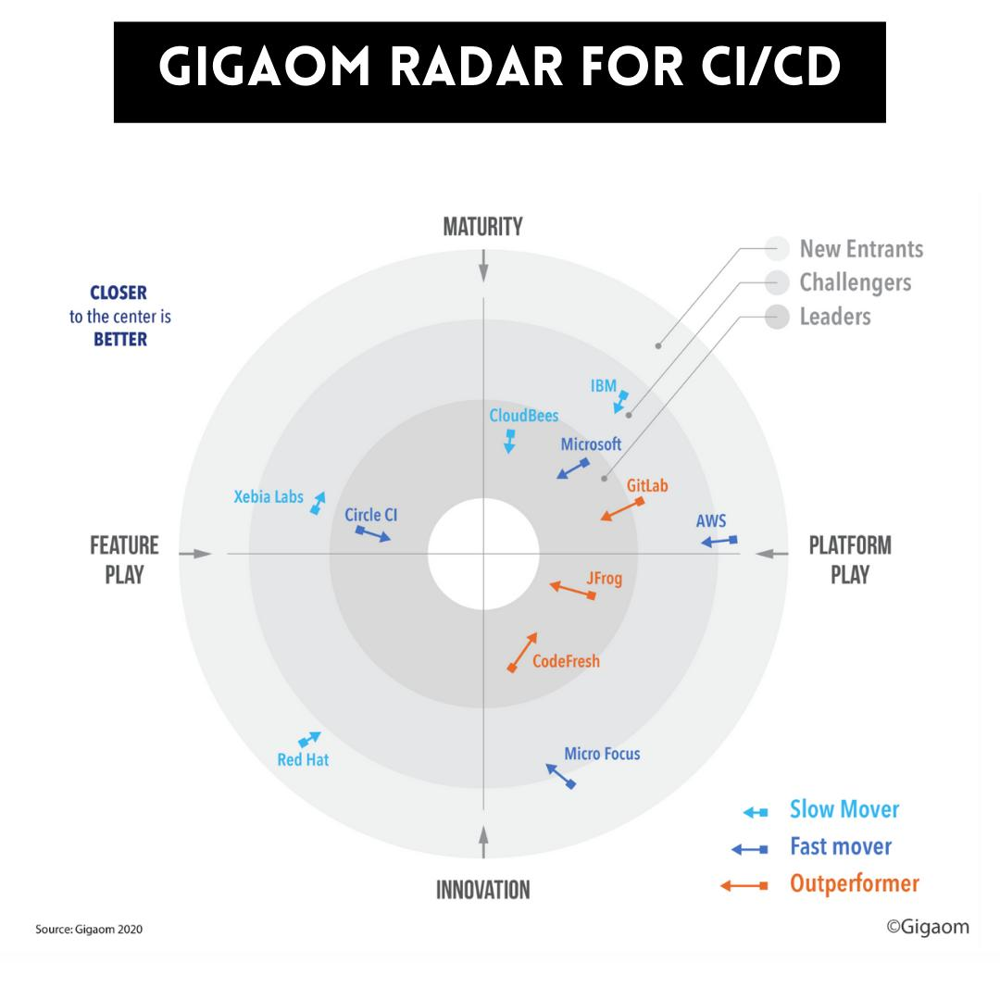

# CI/CD
- [Introduction](#introduction)
- [CI/CD Continuous Integration and Continuous Delivery](#cicd-continuous-integration-and-continuous-delivery)
- [CI/CD with Kubernetes](#cicd-with-kubernetes)
- [Reports on the Enterprise CI/CD Market](#reports-on-the-enterprise-cicd-market)
- [Awesome Lists](#awesome-lists)

## Introduction
* [opensource.com: What is CI/CD?](https://opensource.com/article/18/8/what-cicd)
* [Wikipedia.org: DevOps](https://en.wikipedia.org/wiki/DevOps)
* [Wikipedia.org: Continuous Integration](https://en.wikipedia.org/wiki/Continuous_integration)
* [Wikipedia.org: Continuous Delivery](https://en.wikipedia.org/wiki/Continuous_delivery)

## CI/CD Continuous Integration and Continuous Delivery
* [DZone: Continuous Integration: Servers and Tools](https://dzone.com/refcardz/continuous-integration-servers) Learning to Utilize DevOps with Servers and Tools
* [sdtimes.com: CI/CD pipelines are expanding 🌟](https://sdtimes.com/devops/ci-cd-pipelines-are-expanding/) The “basic” CI/CD pipeline includes five processes, which are: merge, build, test, package and deploy. All of these are individually defined so readers have a common reference point. The basic pipeline includes sub-pipelines associated with each step, such as moving artifacts from a build into a repository.
* [devopsonline.co.uk: ChatOps, DevOps, ScrumOps and 5 Other Ops religions](https://www.devopsonline.co.uk/chatops-devops-scrumops-and-5-other-ops-religions/)
* [opensource.com: A beginner's guide to building DevOps pipelines with open source tools](https://opensource.com/article/19/4/devops-pipeline) If you're new to DevOps, check out this five-step process for building your first pipeline.
* [acloud.guru: How youtr org predicts your CI/CD pipeline](https://info.acloud.guru/resources/brazeal-how-your-org-predicts-your-ci/cd-pipeline)
* [dev.to: CI/CD Continuous Integration & Delivery Explained 🌟🌟](https://dev.to/semaphore/ci-cd-continuous-integration-delivery-explained-75l)
* [mindtheproduct.com: The Product Managers’ Guide to Continuous Delivery and DevOps 🌟🌟](https://www.mindtheproduct.com/what-the-hell-are-ci-cd-and-devops-a-cheatsheet-for-the-rest-of-us/)
* [tech.buzzfeed.com: Continuous Deployments at BuzzFeed](https://tech.buzzfeed.com/continuous-deployments-at-buzzfeed-d171f76c1ac4)
* [Dzone refcard: Continuous Delivery - Patterns and Anti-Patterns in the Software Lifecycle 🌟](https://dzone.com/refcardz/continuous-delivery-patterns)
* [infoworld.com: What is CI/CD? Continuous integration and continuous delivery explained](https://www.infoworld.com/article/3271126/what-is-cicd-continuous-integration-and-continuous-delivery-explained.html) The CI/CD pipeline is one of the best practices for devops teams to implement, for delivering code changes more frequently and reliably
* [devops.com: How to Implement an Effective CI/CD Pipeline](https://devops.com/how-to-implement-an-effective-ci-cd-pipeline/)
* [ammeon.com: 5 Tips For Building A CI/CD Pipeline](https://www.ammeon.com/5-tips-for-building-ci-cd-pipeline/)

## CI/CD with Kubernetes
* [blog.sonatype.com: Achieving CI and CD With Kubernetes 🌟](https://blog.sonatype.com/achieving-ci/cd-with-kubernetes)
* [thenewstack.io: 7 features that make kubernetes ideal for CI/CD](https://thenewstack.io/7-features-that-make-kubernetes-ideal-for-ci-cd/)
* [thenewstack.io: CI/CD with kubernetes 🌟](https://thenewstack.io/ebooks/kubernetes/ci-cd-with-kubernetes/)

## Reports on the Enterprise CI/CD Market
* [GigaOm's Radar for Enterprise CI/CD 🌟](https://jfrog.com/whitepaper/gigaom-radar-for-enterprise-ci-cd/) is a must-see report for any DevOps enthusiast. The goal of an end-to-end Continuous Integration/Continuous Delivery (CI/CD) pipeline is to deliver software-based innovation and business value at both speed and scale. CI/CD plays a very important role in the company's DevOps journey. Keeping several factors in mind, Gigaom has come up with it'sown research and presented who leads and who lags in the CI/CD market.

## Awesome Lists
* [Awesome CI/CD 🌟](https://github.com/cicdops/awesome-ciandcd)

<iframe src="https://www.youtube.com/embed/N8R3-eNVoEc" frameborder="0" allow="autoplay; encrypted-media" allowfullscreen></iframe>

<iframe src="https://www.youtube.com/embed/65BnTLcDAJI" frameborder="0" allow="autoplay; encrypted-media" allowfullscreen></iframe>

