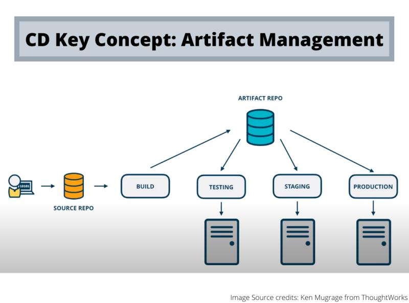
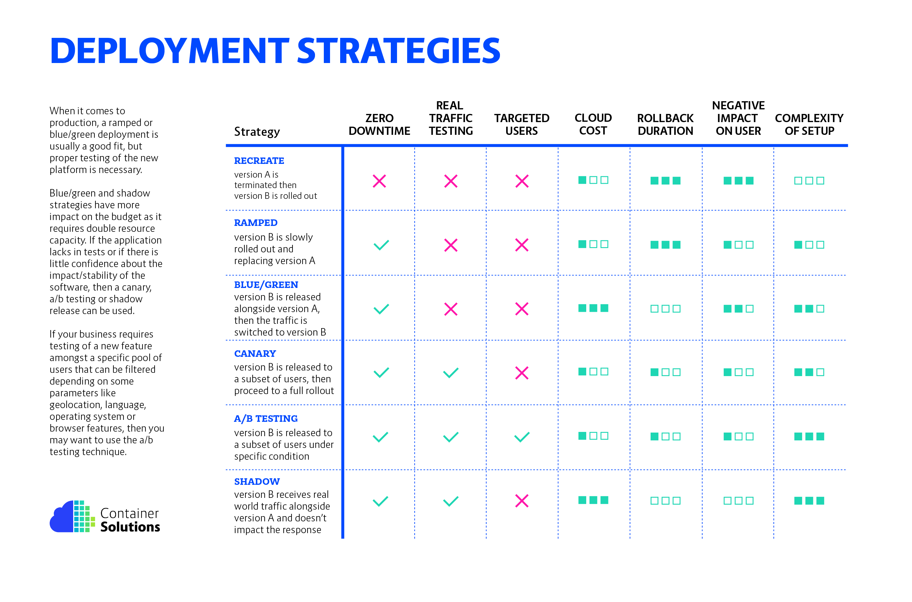
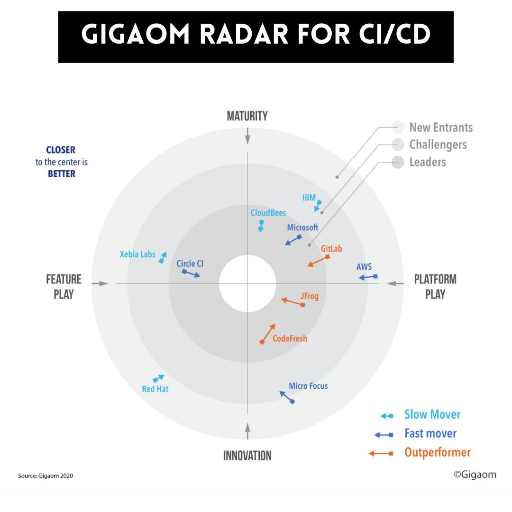
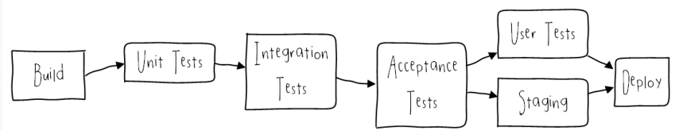

# Software Delivery Pipeline. CI/CD

1. [Introduction](#introduction)
2. [CI/CD Continuous Integration and Continuous Delivery](#cicd-continuous-integration-and-continuous-delivery)
3. [CI/CD Pipelines With Kubernetes](#cicd-pipelines-with-kubernetes)
4. [Observability](#observability)
5. [Code Review](#code-review)
6. [Security in CI/CD](#security-in-cicd)
7. [Progressive Delivery](#progressive-delivery)
8. [Deployment Strategies](#deployment-strategies)
9. [Pipeline Patterns](#pipeline-patterns)
10. [CI/CD with Kubernetes](#cicd-with-kubernetes)
11. [CI/CD with OpenShift](#cicd-with-openshift)
12. [CI/CD with AWS](#cicd-with-aws)
13. [Reports on the Enterprise CI/CD Market](#reports-on-the-enterprise-cicd-market)
14. [Tools](#tools)
15. [Awesome Lists](#awesome-lists)
16. [Images](#images)
17. [Videos](#videos)
18. [Tweets](#tweets)

## Introduction

- [opensource.com: What is CI/CD?](https://opensource.com/article/18/8/what-cicd)
- [martinfowler.com: Continuous Integration (original version)](https://martinfowler.com/articles/originalContinuousIntegration.html)

## CI/CD Continuous Integration and Continuous Delivery

- [sdtimes.com: CI/CD pipelines are expanding 🌟](https://sdtimes.com/devops/ci-cd-pipelines-are-expanding/) The “basic” CI/CD pipeline includes five processes, which are: merge, build, test, package and deploy. All of these are individually defined so readers have a common reference point. The basic pipeline includes sub-pipelines associated with each step, such as moving artifacts from a build into a repository.
- [opensource.com: A beginner's guide to building DevOps pipelines with open source tools](https://opensource.com/article/19/4/devops-pipeline) If you're new to DevOps, check out this five-step process for building your first pipeline.
- [dev.to: CI/CD Continuous Integration & Delivery Explained 🌟🌟](https://dev.to/semaphore/ci-cd-continuous-integration-delivery-explained-75l)
- [mindtheproduct.com: The Product Managers’ Guide to Continuous Delivery and DevOps 🌟🌟](https://www.mindtheproduct.com/what-the-hell-are-ci-cd-and-devops-a-cheatsheet-for-the-rest-of-us/)
- [infoworld.com: What is CI/CD? Continuous integration and continuous delivery explained](https://www.infoworld.com/article/3271126/what-is-cicd-continuous-integration-and-continuous-delivery-explained.html) The CI/CD pipeline is one of the best practices for devops teams to implement, for delivering code changes more frequently and reliably
- [aws.amazon.com: Automating safe, hands-off deployments 🌟🌟](https://aws.amazon.com/es/builders-library/automating-safe-hands-off-deployments/)
- [techuz.com: What is CI/CD? An Introduction to Continuous Integration, Continuous Deployment and CI/CD Pipeline](https://www.techuz.com/blog/what-is-ci-cd-an-introduction-to-continuous-integration-continuous-deployment-and-ci-cd-pipeline/)
- [kodekloud.com: What is CI/CD Pipeline in DevOps](https://kodekloud.com/what-is-ci-cd-pipeline-in-devops) CI/CD plays an important role in your DevOps implementation path. Here are some important things to consider while building a CI/CD pipeline:
    - Peer code review
    - Build in a containerized environment
    - Shorten the feedback loop
    - Do CI first
    - Compare efficiency
    - Insert security checkpoints in the pipeline
    - Implement an easy way to rollback
    - Proactively monitor your CD pipeline
- [harness.io: What is a CI/CD Platform and why should I care? 🌟](https://harness.io/2020/10/what-is-cicd-platform-why-should-i-care/)
- [harness.io: 3 Ways to Use Automation in CI/CD Pipelines](https://thenewstack.io/3-ways-to-use-automation-in-ci-cd-pipelines/)
- [cloudbees.com: 7 Tips for Creating A Successful CI/CD Pipeline 🌟](https://www.cloudbees.com/blog/tips-creating-successful-cicd-pipeline)
- [thinkinglabs.io: Feature Branching considered evil 🌟](https://thinkinglabs.io/talks/feature-branching-considered-evil.html)
- [harness.io: CI/CD Pipeline: Everything You Need to Know 🌟](https://harness.io/blog/continuous-delivery/ci-cd-pipeline/)
- [stackoverflow.blog: Fulfilling the promise of CI/CD 🌟](https://stackoverflow.blog/2021/01/19/fulfilling-the-promise-of-ci-cd/) When people say “CI/CD,” they are only talking about continuous integration. Nobody is talking about (or practicing) continuous deployment. AT ALL. It’s like we have all forgotten it exists. It's time to change that.
- [Top 5 CI/CD best practices for 2021 🌟](https://circleci.com/blog/top-5-ci-cd-best-practices/)
- [harness.io: What is Continuous Integration? 🌟](https://harness.io/blog/continuous-integration/what-is-continuous-integration/)
- [opsmx.com: What is a CI/CD Pipeline ?](https://www.opsmx.com/blog/what-is-a-ci-cd-pipeline)
- [continuousdelivery.com: Patterns 🌟](https://continuousdelivery.com/implementing/patterns/)
- [testguild.com: Pipeline as Code with Mohamed Labouardy](https://testguild.com/podcast/automation/a345-mohamed/)
- [harness.io: Understanding the Phases of the Software Development Life Cycle](https://harness.io/blog/devops/software-development-life-cycle/)
- [cloudbees.com: Key Components of a CI/CD Pipeline](https://www.cloudbees.com/blog/ci-cd-pipeline)
- [jfrog.com: Cloud Native CI/CD: The Ultimate Checklist](https://jfrog.com/blog/cloud-native-ci-cd-the-ultimate-checklist/)
- [jfrog.com: How to Accelerate Software Delivery with Hybrid Cloud CI/CD (e-commerce) 🌟](https://jfrog.com/blog/how-to-accelerate-software-delivery-with-hybrid-cloud-ci-cd/)
- [harness.io: Streamlining CI/CD and Optimizing AWS Cloud Spend](https://harness.io/blog/continuous-integration/streamlining-ci-cd/)
- [sdtimes.com: The State of CI/CD](https://sdtimes.com/cicd/the-state-of-ci-cd/) “A few years ago, CI/CD started off as a method to help continuous deployment, but that definition of CI/CD is long defunct. CI/CD now has QA and security elements to it. We may have seen people refer to the current trend as DevSecOps. In my mind, DevSecOps is changing to be Dev-Infra-Sec-Ops (infrastructure-as-a-service) and will soon be called “Dev-Infra-Sec-Analytics-Ops (including analytics-as-a-service). One day the trend of CI/CD will eventually lead to touchless software development and maintenance. We are on the brink of major efficiency shift in the industry now and AI/ML and LCNC [low code/no code] technologies are enabling this shift.”
- [thenewstack.io: Improve Dev Experience to Maximize the Business Value of CD](https://thenewstack.io/improve-dev-experience-to-maximize-the-business-value-of-cd/)
- [community.dataminer.services: CI/CD and the Agile Principles](https://community.dataminer.services/ci-cd-and-the-agile-principles/)
- [==stackoverflow.blog: Fulfilling the promise of CI/CD==](https://stackoverflow.blog/2021/12/20/fulfilling-the-promise-of-ci-cd/) When people say “CI/CD,” they are only talking about continuous integration. Nobody is talking about (or practicing) continuous deployment. AT ALL. It’s like we have all forgotten it exists. It's time to change that.
- [==speakerdeck.com: Deployment Scripting != Continuous Delivery==](https://speakerdeck.com/devopslx/cd-and-optimized-cloud-spend?slide=12)
- [lambdatest.com: Top 10 CI/CD Pipeline Implementation Challenges And Solutions](https://www.lambdatest.com/blog/cicd-pipeline-challenges/)
- [devopsdigest.com: CI/CD Deployments: How to Expedite Across a Kubernetes Environment With DevOps Orchestration](https://www.devopsdigest.com/cicd-deployments-how-to-expedite-across-a-kubernetes-environment-with-devops-orchestration)
- [thenewstack.io: 4 Best Practices to Drive Successful Adoption of CI/CD](https://thenewstack.io/four-best-practices-to-drive-successful-adoption-of-ci-cd/)
- [about.gitlab.com: How to keep up with CI/CD best practices](https://about.gitlab.com/blog/2022/02/03/how-to-keep-up-with-ci-cd-best-practices/)
- [harness.io: Modern Software Delivery Best Practices & Software Delivery Management](https://harness.io/blog/software-delivery-best-practices/)
- [linkedin pulse: Enabling CI/CD to Boost DevOps | Pavan Belagatti](https://www.linkedin.com/pulse/enabling-cicd-boost-devops-pavan-belagatti/)
- [about.gitlab.com: How to learn CI/CD fast](https://about.gitlab.com/blog/2022/04/13/how-to-learn-ci-cd-fast/)
- [thenewstack.io: Are Monolith CI/CD Pipelines Killing Quality in Your Software?](https://thenewstack.io/are-monolith-ci-cd-pipelines-killing-quality-in-your-software/) This creates complex challenges for developers trying to push commits with confidence and DevOps teams responsible for fine-tuning their pipelines.
- [clickittech.com: CI/CD Best Practices: Top 10 Practices for Financial Services](https://www.clickittech.com/devops/ci-cd-best-practices/)
- [==guru99.com: CI/CD Pipeline: Learn with Example== 🌟🌟🌟](https://www.guru99.com/ci-cd-pipeline.html) CICD automates the process of app delivery. It builds code, runs tests, helps to safely deploy new version of the app. It reduces manual errors, provides feedback, and allows fast product iterations.
- [groundcover.com: Cloud-native CI/CD? Yeah, that’s a thing 🌟](https://www.groundcover.com/blog/ci-cd-kubernetes) Discover how leveraging CI/CD pipelines based on Kubernetes gives organizations improved control and more efficient management, allowing for faster recovery and replication of runtime environments.
- [==spacelift.io: Kubernetes CI/CD Pipelines – 7 Best Practices and Tools | James Walker== 🌟](https://spacelift.io/blog/kubernetes-ci-cd) CICD pipelines enhance app delivery process by automating key stages like testing, security scanning, and deployment. Adopting pipeline-based workflow helps to ship more quickly.
- [thenewstack.io: Embracing Database Deployments in CI/CD Practices with Git](https://thenewstack.io/embracing-database-deployments-in-ci-cd-practices-with-git/) Databases have not been well integrated into the CI/CD tooling landscape, but applying git-like concepts can help.

## CI/CD Pipelines With Kubernetes

- [==thenewstack.io: Kubernetes CI/CD Pipelines Explained==](https://thenewstack.io/kubernetes-ci-cd-pipelines-explained/) Building an effective CI/CD pipeline requires diligent technical analysis, a generous amount of planning and choosing the right set of tools.

## Observability

## Code Review

## Security in CI/CD

- [CI Checks Are Not Enough: Combat Configuration Drift in Kubernetes Resources](https://thenewstack.io/ci-checks-are-not-enough-combat-configuration-drift-in-kubernetes-resources/)

## Progressive Delivery

- [split.io: Progressive Delivery](https://www.split.io/glossary/progressive-delivery/)
- [harness.io: Progressive Delivery: Everything You Need to Know](https://harness.io/blog/feature-flags/progressive-delivery/)
- [weave.works: Progressively Delivering Applications Across Cloud and On-Premise. Using Kuma & GitOps to implement canary releasing](https://www.weave.works/blog/progressively-delivering-applications-across-cloud-and-on-premise)

## Deployment Strategies

- [blog.container-solutions.com: Deployment Strategies 🌟](https://blog.container-solutions.com/deployment-strategies)
    - It really depends on the needs and budget. When releasing to development/staging environments, a recreate or ramped deployment is usually a good choice. When it comes to production, a ramped or blue/green deployment is usually a good fit, but proper testing of the new platform is necessary.
    - Blue/green and shadow strategies have more impact on the budget as it requires double resource capacity. If the application lacks in tests or if there is little confidence about the impact/stability of the software, then a canary, a/b testing or shadow release can be used. If your business requires testing of a new feature amongst a specific pool of users that can be filtered depending on some parameters like geolocation, language, operating system or browser features, then you may want to use the a/b testing technique.
    - Last but not least, a shadow release is complex and requires extra work to mock egress traffic which is mandatory when calling external dependencies with mutable actions (email, bank, etc.). However, this technique can be useful when migrating to a new database technology and use shadow traffic to monitor system performance under load.
- [harness.io: Intro to Deployment Strategies: Blue-Green, Canary, and More 🌟](https://harness.io/blog/continuous-verification/blue-green-canary-deployment-strategies/)
- [semaphoreci.com: Continuous Blue-Green Deployments With Kubernetes 🌟](https://semaphoreci.com/blog/continuous-blue-green-deployments-with-kubernetes)
- [opsmx.com: What is Blue Green Deployment ?](https://www.opsmx.com/blog/blue-green-deployment/)
- [youtube: Kubernetes Deployment Strategies | DevOps FAQ | DevOps DevOps Interview Q&A ](https://www.youtube.com/watch?v=aU-EtdEOdlM)

## Pipeline Patterns

- [harness.io: Pipeline Patterns for CI/CD Pipelines 🌟](https://harness.io/blog/devops/deployment-pipeline-patterns/) **Button Push Pattern, Test Automation Pattern, Full Approval Pattern.**

## CI/CD with Kubernetes

- [blog.sonatype.com: Achieving CI and CD With Kubernetes 🌟](https://blog.sonatype.com/achieving-ci/cd-with-kubernetes)
- [Devtron Labs: Devtron provides a 'seamless,’ 'implementation agnostic uniform interface' across Kubernetes Life Cycle integrated with most Opensource and commercial tools](https://devtron.ai/)
- [thenewstack.io: 7 features that make kubernetes ideal for CI/CD](https://thenewstack.io/7-features-that-make-kubernetes-ideal-for-ci-cd/)
- [thenewstack.io: CI/CD with kubernetes 🌟](https://thenewstack.io/ebooks/kubernetes/ci-cd-with-kubernetes/)
- [harness.io: Kubernetes CI/CD Best Practices](https://harness.io/blog/kubernetes-ci-cd-best-practices/) With all of the benefits that Kubernetes has, having good CI/CD practices is key. Kubernetes did not magically erase the discipline that your CI/CD journey has taken you on before Kubernetes. Leverage Kubernetes’s strengths to further your CI/CD journey.

## CI/CD with OpenShift

## CI/CD with AWS

- [trek10.com: Enterprise CI/CD on AWS: a pragmatic approach](https://www.trek10.com/blog/pragmatic-enterprise-cicd) How can we work within the constraints of a large organization to develop CI/CD flows that help us deploy applications quickly, safely, and accountably on AWS?

## Reports on the Enterprise CI/CD Market

- [GigaOm's Radar for Enterprise CI/CD 🌟](https://jfrog.com/whitepaper/gigaom-radar-for-enterprise-ci-cd/) is a must-see report for any DevOps enthusiast. The goal of an end-to-end Continuous Integration/Continuous Delivery (CI/CD) pipeline is to deliver software-based innovation and business value at both speed and scale. CI/CD plays a very important role in the company's DevOps journey. Keeping several factors in mind, Gigaom has come up with it'sown research and presented who leads and who lags in the CI/CD market.

## Tools

- [cloudbees.com: Continuous Delivery Tools: The 5 You Absolutely Need to Know in 2021](https://www.cloudbees.com/blog/cicd-tools-to-know-2021)

## Awesome Lists

- [Awesome CI/CD 🌟](https://github.com/cicdops/awesome-ciandcd)

## Images

??? note "Click to expand!"

    

    

    

    
    

## Videos

  
Click to expand!

<iframe width="560" height="315" src="https://www.youtube.com/embed/N8R3-eNVoEc" frameborder="0" allow="autoplay; encrypted-media" allowfullscreen></iframe>

<iframe width="560" height="315" src="https://www.youtube.com/embed/65BnTLcDAJI" frameborder="0" allow="autoplay; encrypted-media" allowfullscreen></iframe>

<iframe width="560" height="315" src="https://www.youtube.com/embed/8g4qLzkpjeE?si=xcfl3ugsMGZ8Kthg" title="YouTube video player" frameborder="0" allow="accelerometer; autoplay; clipboard-write; encrypted-media; gyroscope; picture-in-picture; web-share" allowfullscreen></iframe>

## Tweets

  
Click to expand!

<blockquote class="twitter-tweet">
CI/CD is a must-know in DevOps.   Here&#39;s a dead simple guide to understanding it:
&mdash; Nikki Siapno (@NikkiSiapno) <a href="https://twitter.com/NikkiSiapno/status/1619966395965493248?ref_src=twsrc%5Etfw">January 30, 2023</a></blockquote> 

