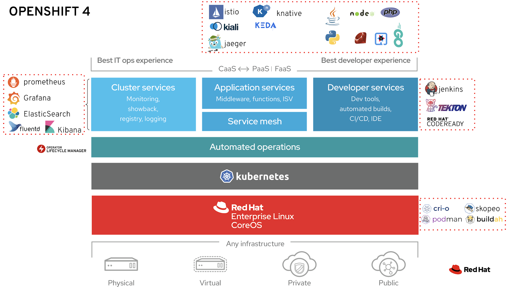

# Container Runtimes/Managers, Base Images and Container Tools. Podman, Buildah & Skopeo
- [Introduction](#introduction)
- [OCI Project](#oci-project)
    - [OCI Runtimes](#oci-runtimes)
        - [runc](#runc)
        - [crun](#crun)
    - [OCI Monitors](#oci-monitors)
- [Container Managers / Container Runtimes (CRI runtimes)](#container-managers--container-runtimes-cri-runtimes)
    - [CRI-O](#cri-o)
    - [Podman. Pod Manager tool](#podman-pod-manager-tool)
        - [Containers In High Security Environments with Podman](#containers-in-high-security-environments-with-podman)
- [Container Images](#container-images)
    - [Red Hat Universal Base Image](#red-hat-universal-base-image)
- [Container Tools](#container-tools)
    - [Buildah](#buildah)
    - [Skopeo](#skopeo)

## Introduction
- [A Practical Introduction to Container Terminology](https://developers.redhat.com/blog/2018/02/22/container-terminology-practical-introduction/)

## OCI Project
- [OCI: Open Container Initiative](https://www.opencontainers.org/)
### OCI Runtimes
#### runc
- [runc](https://github.com/opencontainers/runc) CLI tool for spawning and running containers according to the OCI specification 
#### crun
- [crun](https://github.com/giuseppe/crun) A fast and lightweight fully featured OCI runtime and C library for running containers

### OCI Monitors
- [Conmon](https://github.com/containers/conmon) An OCI container runtime monitor.

## Container Managers / Container Runtimes (CRI runtimes)
- [Kubernetes.io: Container runtimes](https://kubernetes.io/docs/setup/production-environment/container-runtimes/)
- [Docker](https://www.docker.com/products/container-runtime)
- [containerd.io](https://containerd.io/)
- [Frakti](https://github.com/kubernetes/frakti)

### CRI-O
- [cri-o.io](https://cri-o.io/) Lightweight Container Runtime for Kubernetes
- [Why Red Hat is investing in CRI-O and Podman](redhat.com/en/blog/why-red-hat-investing-cri-o-and-podman)

### Podman. Pod Manager tool
- [Podman.io](https://podman.io/)
- [Libpod: Library and tool for running OCI-based containers in Pods](https://github.com/containers/libpod) 
    - Libpod is a library used to create container pods. Home of Podman.
    - Libpod provides a library for applications looking to use the Container Pod concept, popularized by Kubernetes. Libpod also contains the Pod Manager tool (Podman). Podman manages pods, containers, container images, and container volumes.
- [Intro to Podman](https://developers.redhat.com/blog/2018/08/29/intro-to-podman/)
- [developer.ibm.com: How templating works with Podman, Kubernetes, and Red Hat OpenShift](https://developer.ibm.com/technologies/containers/articles/templating-and-podman-openshift/)
- [redhat.com: Be careful when pulling images by short name](https://www.redhat.com/en/blog/be-careful-when-pulling-images-short-name)
- [developers.redhat.com: Podman and Buildah for Docker users 🌟](https://developers.redhat.com/blog/2019/02/21/podman-and-buildah-for-docker-users/)

#### Containers In High Security Environments with Podman
- [Build trusted pipelines/Guards with Podman containers](https://www.redhat.com/en/blog/using-container-technology-make-trusted-pipeline) Container technology makes develoment easier/cheaper & much more secure. SELinux,SECCOMP,Namespaces,Dropped Capabilities.

## Container Images
### Red Hat Universal Base Image
- [Introducing the Red Hat Universal Base Image 🌟](https://www.redhat.com/en/blog/introducing-red-hat-universal-base-image)
- [What is Red Hat Universal Base Image?](https://developers.redhat.com/blog/2019/10/09/what-is-red-hat-universal-base-image/)
- [RH Universal Base Image FAQ](https://developers.redhat.com/articles/ubi-faq/#resources)
- [Red Hat Ecosystem Catalog](https://catalog.redhat.com/software/containers/explore)

## Container Tools
### Buildah
- [Buildah.io](https://buildah.io/) A tool that facilitates building [Open Container Initiative (OCI)](https://www.opencontainers.org/) container images
    - [github.com/containers/buildah](https://github.com/containers/buildah)

### Skopeo
- [Skopeo](https://github.com/containers/skopeo) is a command line utility that performs various operations on container images and image repositories.
- [Promoting container images between registries with skopeo](https://www.openshift.com/blog/promoting-container-images-between-registries-with-skopeo)

