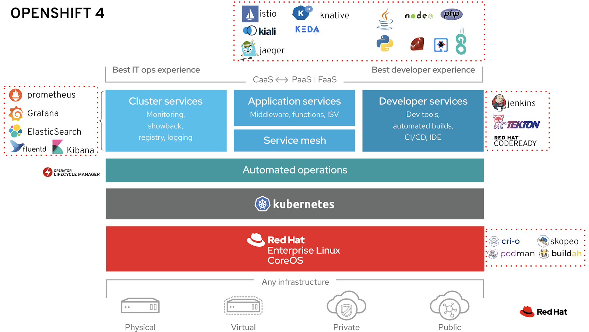

# Container Runtimes/Managers, Base Images and Container Tools. Podman, Buildah & Skopeo

1. [Introduction](#introduction)
2. [OCI Project. Open Container Initiative](#oci-project-open-container-initiative)
    1. [OCI Runtimes](#oci-runtimes)
        1. [runc](#runc)
        2. [crun](#crun)
    2. [OCI Monitors](#oci-monitors)
3. [Container Managers / Container Runtimes (CRI runtimes)](#container-managers--container-runtimes-cri-runtimes)
    1. [CRI-O](#cri-o)
    2. [Podman. Pod Manager tool](#podman-pod-manager-tool)
        1. [Podman Desktop](#podman-desktop)
        2. [Containers In High Security Environments with Podman](#containers-in-high-security-environments-with-podman)
4. [Container Images](#container-images)
    1. [Red Hat Universal Base Image](#red-hat-universal-base-image)
5. [Container Tools](#container-tools)
    1. [Buildah](#buildah)
    2. [Skopeo](#skopeo)
6. [Images](#images)
7. [Tweets](#tweets)

## Introduction

- [inovex.de: Welcome To The Container Jungle: Docker vs. containerd vs. Nabla vs. Kata vs. Firecracker and more! 🌟](https://www.inovex.de/blog/containers-docker-containerd-nabla-kata-firecracker/)
- [blog.alexellis.io: Building containers without Docker 🌟](https://blog.alexellis.io/building-containers-without-docker/)
- [thenewstack.io: Container Best Practices: What They Are and Why You Should Care](https://thenewstack.io/container-best-practices-what-they-are-and-why-you-should-care/)

## OCI Project. Open Container Initiative

- [OCI: Open Container Initiative](https://www.opencontainers.org/)
- [scrivano.org: the journey to speed up running OCI containers](https://www.scrivano.org/posts/2022-10-21-the-journey-to-speed-up-oci-containers/)

### OCI Runtimes

#### runc

- [runc](https://github.com/opencontainers/runc) CLI tool for spawning and running containers according to the OCI specification

#### crun

- [crun](https://github.com/containers/crun) A fast and lightweight fully featured OCI runtime and C library for running containers

### OCI Monitors

- [Conmon](https://github.com/containers/conmon) An OCI container runtime monitor.

## Container Managers / Container Runtimes (CRI runtimes)

- [Kubernetes.io: Container runtimes](https://kubernetes.io/docs/setup/production-environment/container-runtimes/)
- [containerd.io](https://containerd.io/)
- [Frakti](https://github.com/kubernetes/frakti)

### CRI-O

- [cri-o.io](https://cri-o.io/) Lightweight Container Runtime for Kubernetes
- [Why Red Hat is investing in CRI-O and Podman](https://redhat.com/en/blog/why-red-hat-investing-cri-o-and-podman)

### Podman. Pod Manager tool

- [Podman.io](https://podman.io/)
- [Libpod: Library and tool for running OCI-based containers in Pods](https://github.com/containers/libpod)
    - Libpod is a library used to create container pods. Home of Podman.
    - Libpod provides a library for applications looking to use the Container Pod concept, popularized by Kubernetes. Libpod also contains the Pod Manager tool (Podman). Podman manages pods, containers, container images, and container volumes.
- [redhat.com: Be careful when pulling images by short name](https://www.redhat.com/en/blog/be-careful-when-pulling-images-short-name)
- [podmain.io: Announcing Podman v2](https://podman.io/blogs/2020/06/29/podman-v2-announce.html) Featuring a new REST API, Remote Clients, Auto-update, Systemd Integration Improvements and more!
- [youtube: Getting started with Podman](https://www.youtube.com/watch?v=Za36qHbrf3g)
- [Podman remote clients for macOS and Windows](https://www.redhat.com/sysadmin/podman-clients-macos-windows) Podman manages your containers on a Linux host. Manage your containers from macOS or Windows by using the Podman remote client.
- [tecmint.com: How to Manage Containers Using Podman and Skopeo in RHEL 8](https://www.tecmint.com/manage-containers-using-podman-in-rhel/)
- [thenewstack.io: Tutorial: Host a Local Podman Image Registry 🌟](https://thenewstack.io/tutorial-host-a-local-podman-image-registry/)
- [redhat.com: Using Podman and Docker Compose](https://www.redhat.com/sysadmin/podman-docker-compose) Podman 3.0 now supports Docker Compose to orchestrate containers.
- [redhat.com: From Docker Compose to Kubernetes with Podman](https://www.redhat.com/sysadmin/compose-kubernetes-podman) Use Podman 3.0 to convert Docker Compose YAML to a format Podman recognizes.
- [fedoramagazine.org: Manage containers with Podman Compose](https://fedoramagazine.org/manage-containers-with-podman-compose/)
- [youtube: Podman in Podman (Running a container within a container)](https://www.youtube.com/watch?app=desktop&v=OcHRWaC5tvY&feature=youtu.be&ab_channel=RedHat)
- [wbhegedus.me: Configuring Podman for WSL2 🌟](https://wbhegedus.me/running-podman-on-wsl2)
- [redhat.com: How to replace Docker with Podman on a Mac](https://www.redhat.com/sysadmin/replace-docker-podman-macos) Want to use Podman to work with containers? Here's what you need to know about Podman on a Mac.
- [redhat.com: Exploring the new Podman secret command 🌟](https://www.redhat.com/sysadmin/new-podman-secrets-command) Use the new podman secret command to secure sensitive data when working with containers.
- [redhat.com: How to automate Podman installation and deployment using Ansible 🌟](https://www.redhat.com/sysadmin/automate-podman-ansible) Learn how to easily install and deploy Podman using Ansible in your environment.
- [tutorialworks.com: How to Start Containers Automatically, with Podman and Systemd](https://www.tutorialworks.com/podman-systemd/)
- [youtube: Podman 3 and Docker Compose - How Does the Dockerless Compose Work? 🌟](https://www.youtube.com/watch?v=15PFfjuxtvM&ab_channel=mkdev)
- [fedoramagazine.org: Use Docker Compose with Podman to Orchestrate Containers on Fedora Linux](https://fedoramagazine.org/use-docker-compose-with-podman-to-orchestrate-containers-on-fedora/)
- [opensource.com: Run a Linux virtual machine in Podman](https://opensource.com/article/21/7/linux-podman) Use Podman Machine to create a basic Fedora CoreOS VM to use with containers and containerized workloads.
- [pythonspeed.com: Using Podman with BuildKit, the better Docker image builder 🌟](https://pythonspeed.com/articles/podman-buildkit/)
- [devopscube.com: Podman Tutorial For Beginners: Step by Step Guides 🌟](https://devopscube.com/podman-tutorial-beginners/)
- [kubernetespodcast.com: Podman, with Daniel Walsh and Brent Baude](https://kubernetespodcast.com/episode/164-podman/)
- [redhat.com: How to use auto-updates and rollbacks in Podman](https://www.redhat.com/sysadmin/podman-auto-updates-rollbacks)
    - New auto-update capabilities enable you to use Podman in edge use cases, update workloads once they are connected to the network, and roll back failures to a known-good state.
    - Podman: the best tool for running containers on the edge servers. On the edge you want no human intervention. Podman+systemd support auto-update of container image & rollback, when update fails.
- [opensource.com: Get podman up and running on Windows using Linux](https://opensource.com/article/21/10/podman-windows-wsl) Enable WSL 2 guests to run the podman, skopeo, or buildah commands from within Windows using the Linux distribution of your choice.
- [crunchtools.com: Should I Use Docker Compose Or Podman Compose With Podman?](http://crunchtools.com/should-i-use-docker-compose-or-podman-compose-with-podman/)
- [darumatic.com: Podman - Introduction 🌟](https://darumatic.com/blog/podman_introduction)
- [redhat.com: Build Kubernetes pods with Podman play kube](https://www.redhat.com/sysadmin/podman-play-kube-updates) Enhancements include building images and tearing down pods with play kube and support for Kubernetes-style init containers.
- [==iongion.github.io: Podman Desktop Companion== 🌟](https://iongion.github.io/podman-desktop-companion/) Cross-platform desktop integrated application with consistent UI
- [redhat.com: How to replace Docker with Podman on a Mac, revisited](https://www.redhat.com/sysadmin/replace-docker-podman-mac-revisited) Want to use Podman on macOS? There's a new way with podman machine. Here's what you need to know.
- [imaginarycloud.com: Podman vs Docker: What are the differences?](https://www.imaginarycloud.com/blog/podman-vs-docker/)
- [opensource.com: Run containers on Linux without sudo in Podman](https://opensource.com/article/22/1/run-containers-without-sudo-podman) Configure your system for rootless containers.
- [redhat.com: Create fast, easy, and repeatable containers with Podman and shell scripts](https://www.redhat.com/sysadmin/create-containers-podman-quickly)
- [redhat.com: How to use Podman to get information about your containers](https://www.redhat.com/sysadmin/container-information-podman) Use the podman ps command to get size, resource consumption, and other information about your containers.
- [redhat.com: 5 Podman features to try now](https://www.redhat.com/sysadmin/podman-features-1) Improve how you use containers with these new Podman features: --latest, --replace, --all, --ignore, and --tz.
- Here's how I stop all containers before: 🐳 `docker stop $(docker ps -aq)`
    - Here's how I stop/remove all containers with podman: `podman stop -a; podman rm  -a`
- [==dev.to: Containers without Docker (podman, buildah, and skopeo)==](https://dev.to/cedricclyburn/containers-without-docker-podman-buildah-and-skopeo-1eal) In this article, you will learn how you can use Podman, Buildah, and Skopeo as replacements for the traditional Docker workflow, without the use of a daemon or root privileges
- [redhat.com/sysadmin/quadlet-podman](https://www.redhat.com/sysadmin/quadlet-podman) Make systemd better for Podman with Quadlet. Quadlet, a tool merged into Podman 4.4, hides the complexity of running containers under systemd to make it easier to maintain unit files written from scratch.

#### Podman Desktop

- [==Podman Desktop==](https://podman-desktop.io/)

#### Containers In High Security Environments with Podman

- [Build trusted pipelines/Guards with Podman containers](https://www.redhat.com/en/blog/using-container-technology-make-trusted-pipeline) Container technology makes develoment easier/cheaper & much more secure. SELinux,SECCOMP,Namespaces,Dropped Capabilities.

## Container Images

- [sherifabdlnaby/kubephp](https://github.com/sherifabdlnaby/kubephp) 🐳 Production Grade, Rootless, and Optimized PHP Container Image Template for Cloud-Native Deployments and Kubernetes.
- [iximiuz.com: In Pursuit of Better Container Images: Alpine, Distroless, Apko, Chisel, DockerSlim, oh my!](https://iximiuz.com/en/posts/containers-making-images-better/)

### Red Hat Universal Base Image

- [Introducing the Red Hat Universal Base Image 🌟](https://www.redhat.com/en/blog/introducing-red-hat-universal-base-image)
- [Red Hat Ecosystem Catalog](https://catalog.redhat.com/software/containers/explore)
- [ubi-micro: RHEL tiny images to build containers 🌟](https://github.com/fatherlinux/ubi-micro)

## Container Tools

- [Say “Hello” to Buildah, Podman, and Skopeo. New Generation of Container Management Tools](https://servicesblog.redhat.com/2019/10/09/say-hello-to-buildah-podman-and-skopeo/)
- [How to use the --privileged flag with container engines](https://www.redhat.com/sysadmin/privileged-flag-container-engines) Let's take a deep dive into what the --privileged flag does for container engines such as Podman, Docker, and Buildah.

### Buildah

- [Buildah.io](https://buildah.io/) A tool that facilitates building [Open Container Initiative (OCI)](https://www.opencontainers.org/) container images
    - [github.com/containers/buildah](https://github.com/containers/buildah)
- [youtube: How to live without Docker for developers - Part 1 | Migration from Docker to Buildah and Podman](https://www.youtube.com/watch?app=desktop&v=Fl0iLoAMdzc&ab_channel=AndrewMalkov)

### Skopeo

- [Skopeo](https://github.com/containers/skopeo) is a command line utility that performs various operations on container images and image repositories.
- [Promoting container images between registries with skopeo](https://www.openshift.com/blog/promoting-container-images-between-registries-with-skopeo)

## Images

??? note "Click to expand!"

	

	
	

## Tweets

  
Click to expand!

<blockquote class="twitter-tweet">
Running openvscode-server from <a href="https://twitter.com/hashtag/podman?src=hash&amp;ref_src=twsrc%5Etfw">#podman</a> with:  podman pull <a href="https://t.co/eXpnV9qXTt">https://t.co/eXpnV9qXTt</a> podman run -it --init -p 3000:3000 -v &quot;$(pwd):/home/workspace:cached&quot; gitpod/openvscode-server  Note; you might get a permission denied, is not aware of rootless use. Resolve with `chmod o+w -R` :-/
&mdash; Forever Young (@gbraad) (@gbraad) <a href="https://twitter.com/gbraad/status/1453259956120084486?ref_src=twsrc%5Etfw">October 27, 2021</a></blockquote> 

<blockquote class="twitter-tweet">
The RHEL/UBI 9 container images were released today! I&#39;m quite happy with the size reduction! We have UBI Micro down to 7MB compressed! <a href="https://t.co/PBU3cAApsp">pic.twitter.com/PBU3cAApsp</a>
&mdash; Scott McCarty (@fatherlinux) <a href="https://twitter.com/fatherlinux/status/1455872808660217862?ref_src=twsrc%5Etfw">November 3, 2021</a></blockquote> 

<blockquote class="twitter-tweet">
Some of the things I like about <a href="https://twitter.com/Podman_io?ref_src=twsrc%5Etfw">@Podman_io</a> is this ability to generate K8s pod YAMLs from podman pods.  (1): deploy a pod named webserver with an Nginx container. (2): generate the K8s YAML for the podman pod (3): You can direct the generated YAML to a file with redirection <a href="https://t.co/PTykINAS4A">pic.twitter.com/PTykINAS4A</a>
&mdash; SAIM SAFDAR (@cloudnativeboy) <a href="https://twitter.com/cloudnativeboy/status/1488228418986536962?ref_src=twsrc%5Etfw">January 31, 2022</a></blockquote> 

