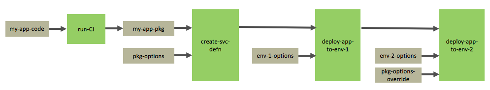
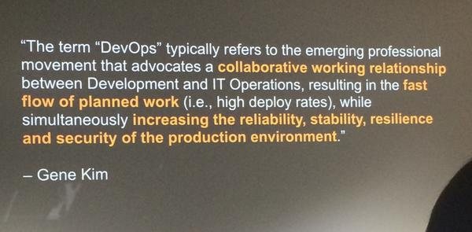
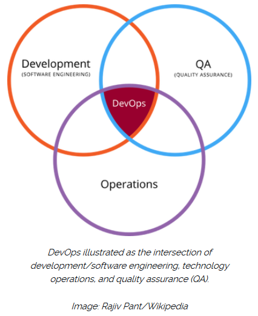
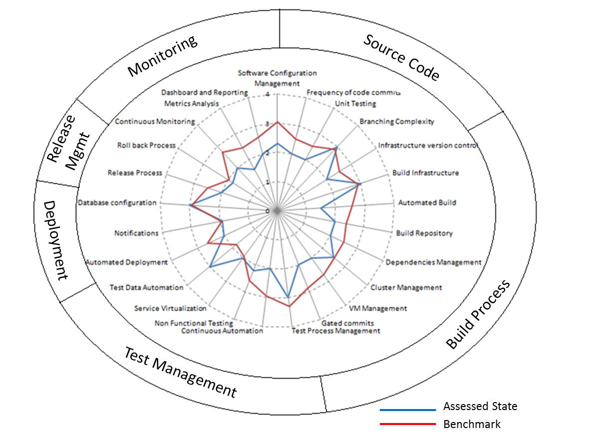

# DevOps 
- [Introduction to Digital Business Transformation](#introduction-to-digital-business-transformation)
- [DevOps](#devops)
- [Blogs](#blogs)
- [Xebia Labs and DevOps](#xebia-labs-and-devops)
- [Netflix and DevOps](#netflix-and-devops)
- [Public Cloud DevOps](#public-cloud-devops)
    - [AWS DevOps](#aws-devops)
    - [Azure DevOps](#azure-devops)
    - [Google Cloud Platform](#google-cloud-platform)

## Introduction to Digital Business Transformation
* [What Is AIOps, BizDevOps, CloudOps, DevOps, ITOps, NoOps? A Gentle Introduction to Digital Business Transformation 🌟](https://stxnext.com/blog/2019/04/25/aiops-bizdevops-cloudops-devops-itops-noops-introduction-digital-business-transformation/)

## DevOps
* [Wikipedia: DevOps](https://en.wikipedia.org/wiki/DevOps)
* [DevOps Toolbox: Jenkins, Ansible, Chef, Puppet, Vagrant, & SaltStack](https://hostadvice.com/blog/devops-toolbox-jenkins-ansible-chef-puppet-vagrant-saltstack/)
* [thenewstack.io: Kubernetes is the Accepted Platform for Cloud Native Computing](https://thenewstack.io/category/kubernetes/)
* [opensource.com: The case for making the transition from sysadmin to DevOps engineer 🌟](https://opensource.com/article/19/7/devops-vs-sysadmin) There's a learning curve, but there's no time like the present to get started.
* [opensource.com: The case for making the transition from sysadmin to DevOps engineer](https://opensource.com/article/19/7/devops-vs-sysadmin) There's a learning curve, but there's no time like the present to get started.
* [opensource.com: How to transition into a career as a DevOps engineer](https://opensource.com/article/19/7/how-transition-career-devops-engineer) Whether you're a recent college graduate or a seasoned IT pro looking to advance your career, these tips can help you get hired as a DevOps engineer.
* [opensource.com: A beginner's guide to everything DevOps 🌟](https://opensource.com/article/20/2/devops-beginners) Take a fresh look at why DevOps is important, what it means for IT professionals, and its methods, frameworks, and tools.
* [How to get from DevOps to NoOps: 5 steps](https://enterprisersproject.com/article/2020/3/how-get-devops-noops-5-steps)
* [Corporate culture complicates Kubernetes and container collaboration 🌟](https://www.zdnet.com/article/corporate-culture-complicates-kubernetes-and-container-collaboration/) 'As the DevOps crew likes to say: containers won't fix your broken culture'
* [mindtheproduct.com: The Product Managers’ Guide to Continuous Delivery and DevOps 🌟](https://www.mindtheproduct.com/what-the-hell-are-ci-cd-and-devops-a-cheatsheet-for-the-rest-of-us/)
* [devopscube.com: Become A DevOps Engineer in 2020: A Comprehensive Guide 🌟](https://devopscube.com/become-devops-engineer/)
* [How to be a great DevOps Engineer 🌟](https://blog.shippable.com/how-to-be-a-great-devops-engineer)
* [smartsheet.com: The Way of DevOps: A Primer on DevOps Principles and Practices](https://www.smartsheet.com/devops)
* [dzone: Are You Stuck in the New DevOps Matrix From Hell? 🌟](https://dzone.com/articles/are-you-stuck-in-the-new-devops-matrix-from-hell) See how Docker solved the matrix-from-hell problem, and how DevOps techniques can help avoid the config sprawl that comes with microservices.
* [kenmugrage.com 🌟](https://kenmugrage.com/2017/05/05/my-new-definition-of-devops/#more-4) DevOps: A culture where people, regardless of title or background, work together to imagine, develop, deploy and operate a system. 

## Blogs
- [devops.com](https://devops.com/)
- [devopscube.com](https://devopscube.com/)
- [devopszone.info](https://www.devopszone.info/)

## Xebia Labs and DevOps
- [DevOps Glosary of Terms 🌟](https://xebialabs.com/glossary/)
- [The Ultimate DevOps Tool Chest 🌟](https://xebialabs.com/the-ultimate-devops-tool-chest/)
- [Periodic Table of DevOps 🌟](https://xebialabs.com/periodic-table-of-devops-tools/)

## Netflix and DevOps
* [Full Cycle Developers at Netflix — Operate What You Build](https://netflixtechblog.com/full-cycle-developers-at-netflix-a08c31f83249) 
* [Applying Netflix DevOps Patterns to Windows](https://netflixtechblog.com/applying-netflix-devops-patterns-to-windows-2a57f2dbbf79)

## Public Cloud DevOps
### AWS DevOps
* [AWS DevOps 🌟](https://aws.amazon.com/devops/)

### Azure DevOps
* [Azure DevOps 🌟](https://azure.microsoft.com/services/devops/)

###  Google Cloud Platform
* [cloud.google.com: DevOps](https://cloud.google.com/devops)
* [Cloud Developer Tools](https://cloud.google.com/products/tools)
* [Google Cloud Code](https://cloud.google.com/code)
    * [github: Google Cloud Code samples](https://github.com/GoogleCloudPlatform/cloud-code-samples)
* [Google Cloud Build](https://cloud.google.com/cloud-build)
* [medium.com/google-cloud/tagged/devops](https://medium.com/google-cloud/tagged/devops)

      

      

    

         

<iframe src="//www.slideshare.net/slideshow/embed_code/key/ch64DsNKnrQRC1" width="668" height="714" frameborder="0" marginwidth="0" marginheight="0" scrolling="no" style="border:1px solid #CCC; border-width:1px; margin-bottom:5px; max-width: 100%;" allowfullscreen class="video"> </iframe> 
 <strong> <a href="//www.slideshare.net/IQGroup/how-will-devops-benefit-enterprise" title="How will DevOps benefit enterprise? " target="_blank">How will DevOps benefit enterprise? </a> </strong> from <strong><a href="//www.slideshare.net/IQGroup" target="_blank">InterQuest Group</a></strong> 

 