# DevOps

1. [Introduction to Digital Business Transformation](#introduction-to-digital-business-transformation)
2. [Automation Glossary](#automation-glossary)
3. [Blogs](#blogs)
4. [DevOps Books](#devops-books)
5. [Podcasts](#podcasts)
6. [Training](#training)
    1. [Spanish](#spanish)
7. [Automation anxiety](#automation-anxiety)
8. [State of DevOps. Google's DevOps Research and Assessment (DORA)](#state-of-devops-googles-devops-research-and-assessment-dora)
9. [Configuration Drift](#configuration-drift)
    1. [Drift Detection Tools](#drift-detection-tools)
10. [DevOps Docs](#devops-docs)
11. [DORA metrics](#dora-metrics)
12. [DevOps Roadmap](#devops-roadmap)
13. [APIOps](#apiops)
14. [Multicloud](#multicloud)
15. [Serverless DevOps](#serverless-devops)
16. [DevOps as a Service (DaaS)](#devops-as-a-service-daas)
17. [IaC Infrastructure as Code](#iac-infrastructure-as-code)
18. [Xebia Labs and DevOps](#xebia-labs-and-devops)
19. [DevOps Tools](#devops-tools)
20. [Netflix and DevOps](#netflix-and-devops)
21. [Public Cloud DevOps](#public-cloud-devops)
     1. [AWS DevOps](#aws-devops)
     2. [Azure DevOps](#azure-devops)
     3. [Google Cloud Platform](#google-cloud-platform)
22. [NoOps](#noops)
23. [NetOps](#netops)
24. [PlatformOps](#platformops)
25. [GPT 3 Tools](#gpt-3-tools)
26. [Data as Code](#data-as-code)
27. [DevOps for SAP](#devops-for-sap)
28. [Youtube Playlists](#youtube-playlists)
29. [Platform Engineering and Internal Developer Platform](#platform-engineering-and-internal-developer-platform)
     1. [IDP Tools](#idp-tools)
30. [Bunch of Images](#bunch-of-images)
31. [Slides](#slides)
32. [Videos](#videos)
33. [Tweets](#tweets)

<iframe width="100%" height="166" scrolling="no" frameborder="no" allow="autoplay" src="https://w.soundcloud.com/player/?url=https%3A//api.soundcloud.com/tracks/294589005&color=%23ff5500&auto_play=false&hide_related=false&show_comments=true&show_user=true&show_reposts=false&show_teaser=true"></iframe>
<a href="https://soundcloud.com/jimmy-sax" title="Jimmy Sax" target="_blank" style="color: #cccccc; text-decoration: none;">Jimmy Sax</a> · <a href="https://soundcloud.com/jimmy-sax/una-matina-jimmy-sax" title="Una Matina Jimmy Sax" target="_blank" style="color: #cccccc; text-decoration: none;">Una Matina Jimmy Sax</a>

## Introduction to Digital Business Transformation

- [enterprisersproject.com: DevOps: 5 things teams need from CIOs](https://enterprisersproject.com/article/2020/7/devops-5-things-teams-need) Consider these lessons learned as you strive to give DevOps teams what they need to succeed - from flexible technogy models to transparency.
- [redhat.com: Understanding DevOps](https://www.redhat.com/en/topics/devops) DevOps is an approach to culture, automation, and platform design intended to deliver increased business value and responsiveness through rapid, high-quality service delivery. This is all made possible through fast-paced, iterative IT service delivery. DevOps means linking legacy apps with newer cloud-native apps and infrastructure.
- [redhat.com: El concepto de DevOps](https://www.redhat.com/es/topics/devops) DevOps es un modo de abordar la cultura, la automatización y el diseño de las plataformas para generar mayor valor empresarial y capacidad de respuesta, mediante la prestación ágil de servicios de alta calidad. Todo ello es posible gracias a la prestación rápida y constante de servicios de TI. Para DevOps, se necesita vincular las aplicaciones heredadas con las aplicaciones creadas en la nube y las infraestructuras más nuevas.
- [redhat.com: Why IT automation training is a smart way to boost your career](https://www.redhat.com/sysadmin/it-automation-training) Make the path to automation more efficient with training that translates into immediate business impacts.
- [about.gitlab.com: Soft skills are the key to your DevOps career advancement](https://about.gitlab.com/blog/2021/11/30/soft-skills-are-the-key-to-your-devops-career-advancement)
- [salesforceben.com: 5 DevOps Concepts You Need to Know](https://www.salesforceben.com/5-devops-concepts-you-need-to-know/)
- [enterprisersproject.com: DevOps: 3 skills needed to support its future in the enterprise](https://enterprisersproject.com/article/2021/10/devops-future-operating-model-it) If you're aiming for continuous improvement with your DevOps effort, prioritize these skills. They're critical to helping teams conquer cultural and technology challenges
- [devblogs.microsoft.com: DevOps Dojo – Culture and Mindset](https://devblogs.microsoft.com/devops/devops-dojo-culture-and-mindset/)
- [thenewstack.io: Automation Is No Silver Bullet: 3 Keys for Scaling Success](https://thenewstack.io/automation-is-no-silver-bullet-3-keys-for-scaling-success/)
- [umbrellainfocare.com: Cloud and DevOps are Made for Each Other](https://www.umbrellainfocare.com/blogs/cloud-and-devops-are-made-for-each-other)
- [guru99.com: DevOps Lifecycle: Different Phases Explained with Examples 🌟](https://www.guru99.com/devops-lifecycle.html)
- [linkedin.com/pulse: Is DevOps just system administration repackaged?](https://www.linkedin.com/pulse/devops-just-system-administration-repackaged-gianluca-mascolo/)
- [dev.to: DevOps Trends for Developers in 2023 | Pavan Belagatti](https://dev.to/pavanbelagatti/devops-trends-for-developers-in-2023-345b)
- [==abc.es: Ingenieros DevOps, la pieza clave del engranaje digital de las empresas== 🌟](https://www.abc.es/economia/ingenieros-devops-pieza-clave-engranaje-digital-empresas-20230212000148-nt.html) **Estos profesionales, que activan una sinergia eficaz entre las áreas tecnológicas y de producción, son un cotizado factor de competitividad**
- [microsoft.com: DevOps threat matrix](https://www.microsoft.com/en-us/security/blog/2023/04/06/devops-threat-matrix/)
- [dev.to/aws-builders: How to get started with DevOps? What skills should we start with?](https://dev.to/aws-builders/how-to-get-started-with-devops-what-skills-should-we-start-with-5efp)
- [==infoq.com: Dark Side of DevOps - the Price of Shifting Left and Ways to Make it Affordable==](https://www.infoq.com/articles/devops-shifting-left/)

## Automation Glossary

- [Red Hat automation glossary 🌟](https://www.redhat.com/en/blog/red-hat-automation-glossary)

## Blogs

- [devops.com](https://devops.com/)
- [devopscube.com](https://devopscube.com/)
- [devopszone.info](https://www.devopszone.info/)
- [devopsdigest.com](https://www.devopsdigest.com/)
- [Top 15 DevOps blogs to read and follow](https://searchitoperations.techtarget.com/feature/Top-15-DevOps-blogs-to-read-and-follow)
- [devopstips.net](https://devopstips.net/)
    - [www.arresteddevops.com](https://www.arresteddevops.com)
    - [devopsdays.org: Devopsdays Amsterdam](https://devopsdays.org/events/2022-amsterdam/welcome/)
- [mrcloudbook.com: Mr Cloud Book](https://mrcloudbook.com/)

## DevOps Books

- [==github.com/DevOps-Projects-Ideas/DevOps-Books== 🌟🌟](https://github.com/DevOps-Projects-Ideas/DevOps-Books)

## Podcasts

- [deloitte.com: Culture change, not tech, is the secret to DevOps success (podcast) 🌟](https://www2.deloitte.com/us/en/pages/consulting/articles/secret-to-devops-isnt-about-tools-its-about-culture-value-and-outcomes-architecting-the-cloud-podcast-sre-site-reliability-engineering-resiliency-cloud-adoption-cloud-value-outcomes-culture-change.html) Doing DevOps right involves more than technology. It requires changing the organizational culture to build a joint-responsibility model based on outcomes and value. How companies implement that culture change will be critical in determining DevOps success.
- [bikeshed.fm: The Bike Shed](https://www.bikeshed.fm)

## Training

- [==Techworld with Nana: Learn DevOps topics easily==](https://www.techworld-with-nana.com)
    - [==techworld-with-nana.com/devops-bootcamp==](https://www.techworld-with-nana.com/devops-bootcamp)
- [github.com/paragpallavsingh/90DaysOfDevOps: 90DaysOfDevOps Challenge](https://github.com/paragpallavsingh/90DaysOfDevOps) This repository is a Challenge for the DevOps Community to get stronger in DevOps. This challenge starts on the 1st January 2023 and in the next 90 Days we promise ourselves to become better at DevOps. The reason for making this Public is so that others can learn from the community and help each other grow.
    - [github.com/paragpallavsingh/90DaysOfDevOps: Day 21 Task: Docker Essential Concepts](https://github.com/paragpallavsingh/90DaysOfDevOps/blob/master/submission/day21/README.md)

### Spanish

## Automation anxiety

{==

- Sysadmins and engineers may have personal fears about adopting automation, as much of their typical day revolves around the manual tasks and processes that automation promises to eliminate. Automation anxiety is the fear that if these tasks can be handled by automated tools, there will no longer be any reason to keep a person in that role. Nobody likes being automated out of a job.
- Automation anxiety is largely unfounded, however, as automating manual tasks frees up people’s time that can instead be used to work on more innovative, more strategic and higher value projects.

==}

## State of DevOps. Google's DevOps Research and Assessment (DORA)

- [cloud.google.com: State of DevOps 2021 🌟](https://cloud.google.com/blog/products/devops-sre/announcing-dora-2021-accelerate-state-of-devops-report) 2021 Accelerate State of DevOps report addresses burnout, team performance
- [itprotoday.com: Google DORA Report Details Best Practices to Speed DevOps](https://www.itprotoday.com/devops/google-dora-report-details-best-practices-speed-devops) The 2021 Accelerate State of DevOps report from Google Cloud’s DORA group provides insight into the best practices of elite development teams. [devops.com: summary 1](https://devops.com/google-dora-report-shows-modest-devops-gains/) - [dzone: summary 2](https://dzone.com/articles/googles-state-of-devops-2021-report-what-sres-need)

## Configuration Drift

- [thenewstack.io: Cloud Drift Detection: How to Resolve Out-of-State Changes](https://thenewstack.io/cloud-drift-detection-how-to-resolve-out-of-state-changes/)
- [fairwinds.com: Configuration Drift in Kubernetes - What Is It and Why it Matters 🌟](https://www.fairwinds.com/blog/configuration-drift-kubernetes)

### Drift Detection Tools

- [env0.com: Automated Drift Detection 🌟](https://www.env0.com/blog/automated-drift-detection-with-env0) env0 is enabling the ability to automatically detect drift and make sure your real-world resources in the cloud provider are aligned with your Infrastructure as Code files. env0 will alert you once a drift has been detected and gives you the ability to view and fix the drift, which can help mitigate one of the main challenges when using Infrastructure as Code!
- [thenewstack.io: How Drift Detection and IaC Help Maintain a Secure Infrastructure](https://thenewstack.io/how-drift-detection-and-iac-help-maintain-a-secure-infrastructure)

## DevOps Docs

{==

==}

- [thenewstack.io: Kubernetes is the Accepted Platform for Cloud Native Computing](https://thenewstack.io/category/kubernetes/)
- [opensource.com: The case for making the transition from sysadmin to DevOps engineer 🌟](https://opensource.com/article/19/7/devops-vs-sysadmin) There's a learning curve, but there's no time like the present to get started.
- [opensource.com: How to transition into a career as a DevOps engineer](https://opensource.com/article/19/7/how-transition-career-devops-engineer) Whether you're a recent college graduate or a seasoned IT pro looking to advance your career, these tips can help you get hired as a DevOps engineer.
- [opensource.com: A beginner's guide to everything DevOps 🌟](https://opensource.com/article/20/2/devops-beginners) Take a fresh look at why DevOps is important, what it means for IT professionals, and its methods, frameworks, and tools.
- [How to get from DevOps to NoOps: 5 steps](https://enterprisersproject.com/article/2020/3/how-get-devops-noops-5-steps)
- [Corporate culture complicates Kubernetes and container collaboration 🌟](https://www.zdnet.com/article/corporate-culture-complicates-kubernetes-and-container-collaboration/) 'As the DevOps crew likes to say: containers won't fix your broken culture'
- [mindtheproduct.com: The Product Managers’ Guide to Continuous Delivery and DevOps 🌟](https://www.mindtheproduct.com/what-the-hell-are-ci-cd-and-devops-a-cheatsheet-for-the-rest-of-us/)
- [smartsheet.com: The Way of DevOps: A Primer on DevOps Principles and Practices](https://www.smartsheet.com/devops)
- [opensource.com: 10 tips for maintaining a DevOps mindset for distributed teams](https://opensource.com/article/20/6/devops-mindset) You can do DevOps while working from home; it's all about the right approach.
- [stackoverflow.blog: The rise of the DevOps mindset 🌟](https://stackoverflow.blog/2020/06/10/the-rise-of-the-devops-mindset/)
- [DevOps engineers: Common misconceptions about the role](https://enterprisersproject.com/article/2020/6/devops-engineer-role-common-misconceptions) What qualities and skills define a future-ready DevOps engineer? Hint: It's about people, not code deployment.
- [DevOps for beginners: Where to start learning and focusing](https://enterprisersproject.com/article/2020/6/devops-beginners-where-start) Where to start with DevOps? Let's explore how to get going with this cross-functional way of working that breaks down walls, improves speed of delivery, and increases experimentation.
- [contino.io: How to Make Enterprise Container Strategies That Last (Part One) 🌟](https://www.contino.io/insights/how-to-make-enterprise-container-strategies-that-last-part-one)
- [containerjournal.com: How the Rise of Containers Will Drive DevOps](https://containerjournal.com/topics/container-ecosystems/how-the-rise-of-containers-will-drive-devops/)
- [itprotoday.com: Is the DevOps Model Killing the Developer? In a Word, No](https://www.itprotoday.com/devops-and-software-development/devops-model-killing-developer-word-no) The rise of the DevOps model means that app environments are moving faster and running on a larger scale than they did a decade ago.
- [blog.vmware.com: DevOps: Culture – Collaboration, Empowerment, Autonomy 🌟](https://blogs.vmware.com/management/2020/06/devops-culture.html)
- [enterprisersproject.com: 3 DevOps skills IT leaders need for the next normal](https://enterprisersproject.com/article/2020/7/3-devops-skills-it-leaders-need-next-normal)
- [red-gate.com: Automated Production Deployments are Not the Key to DevOps Performance](https://www.red-gate.com/blog/automated-production-deployments-are-not-the-key-to-devops-performance) There’s a myth about DevOps which is hard to shake free of: that “success” means fully automating your deployments from code check-in to production.
- [BBVA - DevOps: qué es y cómo mejorar los procesos gracias a esta estrategia](https://www.bbva.com/es/devops-que-es-y-como-mejorar-los-procesos-gracias-a-esta-estrategia/amp/)
- [learnsteps.com: DevOps Interview Question: How will you set up a CI/CD pipeline? 🌟](https://www.learnsteps.com/devops-interview-question-how-will-you-set-up-a-ci-cd-pipeline/)
- [computing.co.uk: CloudBees gets busy with security, visibility and control as DevOps evolves](https://www.computing.co.uk/news/4020521/cloudbees-busy-security-visibility-control-devops-evolves) CEO Sacha Labourey: 'DevOps is a pretty good proxy for what needs to happen in any organisation'
- [acloudguru.com: 5 Reasons to NOT Move to DevOps 🌟](https://acloudguru.com/blog/engineering/5-reasons-to-not-move-to-devops)
- [forbes: Why No One Understands Agile, SCRUM & DevOps & Why Perfect Technology Abstractions Are Sure To Fail](https://www.forbes.com/sites/steveandriole/2020/10/01/why-no-one-understands-agile-scrum--devops--why-perfect-technology-abstractions-are-sure-to-fail/)
- [github.blog: What is DevOps? A guide to common methods and misconceptions 🌟](https://github.blog/2020-10-07-devops-definition/)
- [thenewstack.io: From DevOps to DevApps 🌟](https://thenewstack.io/from-devops-to-devapps/)
- [thenewstack.io: The Future of Ops Careers 🌟🌟](https://thenewstack.io/the-future-of-ops-careers/)
- [cloudtweaks.com: DevOps - Secure & scalable CI/CD pipeline with AWS 🌟](https://cloudtweaks.com/2019/05/devops-secure-and-scalable-ci-cd-pipeline-with-aws/) Devops is a union of software development and operations. It is a culture that the company imbibes in the agile development process.
- [thenewstack.io: DevOps World: DevOps Moves to Resilient Collaboration](https://thenewstack.io/post-pandemic-devops-moves-to-resilient-collaboration/)
- [cloudacademy.com: Blog / DevOpsDevOps: Why Is It Important to Decouple Deployment From Release?](https://cloudacademy.com/blog/devops-why-is-it-important-to-decouple-deployment-from-release/)
- [infoq.com: Puppet Releases Its 2020 State of DevOps Report 🌟](https://www.infoq.com/news/2020/11/2020-devops-report/)
- [informationweek.com: What's Holding DevOps Back?](https://www.informationweek.com/devops/whats-holding-devops-back/a/d-id/1339540) DevOps teams are at different stages of maturity. However, there are some common challenges they face along the way.
- [opensource.com: Create a DevOps culture with open source principles](https://opensource.com/article/20/12/remote-devops) Now that more workforces are remote, DevOps teams can maximize their collaboration and productivity by following open source principles.
- [github.blog: How to make DevOps your competitive advantage](https://github.blog/2020-12-18-how-to-make-devops-your-competitive-advantage/)
- [opensource.com: 3 critical DevOps concepts we explored in 2020 🌟](https://opensource.com/article/20/12/devops) In 2020, Opensource.com's top DevOps articles focused on testing, software methodologies, and the most important part: the people.
- [learnsteps.com: DevOps Interview Questions: How will you design your cloud VPC and subnets?](https://www.learnsteps.com/devops-interview-questions-how-will-you-design-your-cloud-vpc-and-subnets/)
- [thenewstack.io: DevOps, DevApps and the Death of Infrastructure](https://thenewstack.io/devops-devapps-and-the-death-of-infrastructure/)
- [devopscube.com: Become A DevOps Engineer in 2021: A Comprehensive Guide](https://devopscube.com/become-devops-engineer/)
- [containerjournal.com: 9 Pillars of Engineering DevOps With Kubernetes](https://containerjournal.com/uncategorized/9-pillars-of-engineering-devops-with-kubernetes/)
- [content.techgig.com: 5 Best DevOps practices for beginners](https://content.techgig.com/5-best-devops-practices-for-beginners/articleshow/81368965.cms)
- [cst-bg.net: 13 clues you are doing DevOps right 🌟](https://www.cst-bg.net/post/13-clues-to-good-devops)
- [softwebsolutions.com: DevOps and Microservices – Creating change together](https://www.softwebsolutions.com/resources/devops-and-microservices.html)
- [thenewstack.io: 5 Cloud Automation Tips for Developers and DevOps](https://thenewstack.io/5-cloud-automation-tips-for-developers-and-devops/)
- [containerjournal.com: Kubernetes Enables DevOps-as-a-Service (DaaS) 🌟](https://containerjournal.com/features/kubernetes-enables-devops-as-a-service-daas/)
- [thenewstack.io: Maximizing the Value of Containerization for DevOps](https://thenewstack.io/maximizing-the-value-of-containerization-for-devops/)
- [opensource.com: A DevOps guide to documentation](https://opensource.com/article/21/3/devops-documentation) Bring your documentation writing into the DevOps lifecycle.
- [infoq.com: DevOps is Not Enough for Scaling and Evolving Tech-Driven Organizations: a Q&A with Eduardo da Silva](https://www.infoq.com/articles/devops-not-enough-scaling-tech-driven-organizations/)
- [infoworld.com: 5 devops practices to improve application reliability](https://www.infoworld.com/article/3613155/5-devops-practices-to-improve-application-reliability.html)
- [youtube: The best DevOps tools, frameworks, and platforms in 2021 🌟](https://www.youtube.com/watch?v=js-rq7SvPpE&ab_channel=DevOpsToolkit)
- [weblineindia.com: DevOps Automation – Everything You Need to Know](https://www.weblineindia.com/blog/all-about-devops-automation/)
- [getxray.app: Get started with DevOps: principles, best practices and tips](https://www.getxray.app/blog/get-started-with-devops-principles-best-practices-and-tips)
- [stackoverflow.blog: How developers can be their own operations department](https://stackoverflow.blog/2021/05/24/how-developers-can-be-their-own-operations-department/) Many companies run parallel development and operations organizations. But what if you just ran one team that did both?
- [linkedin.com/pulse: Top 10 skills a DevOps engineer should possess](https://www.linkedin.com/pulse/top-10-skills-devops-engineer-should-possess-saurabh-badhwar/)
- [dev.to: 5 GitHub Projects to make you a better DevOps Engineer 🌟](https://dev.to/ankit01oss/5-github-projects-to-make-you-a-better-devops-engineer-2fkl)
- [cloudbees.com: How to Nail DevOps Governance and Compliance in a Highly Regulated Industry 🌟](https://www.cloudbees.com/blog/how-to-nail-devops-governance-and-compliance-in-a-highly-regulated-industry)
- [redhat.com: Tales from the field: A system administrator's guide to IT automation](https://www.redhat.com/sysadmin/it-automation-book) Download this collection of short stories about the excitement, frustrations, and challenges associated with learning IT automation.
- [forbes.com: DevOps: What You Need To Know 🌟](https://www.forbes.com/sites/tomtaulli/2021/07/16/devops-what-you-need-to-know)  The future of DevOps according to CloudBees' CEO: **"no company should re-write code that you can repeat through automation.”**
- [zdnet.com: Stop calling DevOps teams 'DevOps teams' 🌟🌟](https://www.zdnet.com/article/stop-calling-devops-teams-devops-teams/) Latest Puppet survey finds DevOps teams actually have a variety of roles that are more in line with business goals.
- [infoq.com: How External IT Providers Can Adopt DevOps Practices 🌟](https://www.infoq.com/news/2021/08/external-IT-providers-devops/)
- [chaossearch.io: 9 Essential DevOps Tools for 2021](https://www.chaossearch.io/blog/essential-devops-tools)
- [sqlshack.com: 6 Reasons why you can’t have DevOps without Test Automation 🌟](https://www.sqlshack.com/6-reasons-why-you-cant-have-devops-without-test-automation/)
- [dev.to: DevOps Is Not Automation](https://dev.to/run-x/devops-is-not-automation-2amo)
- [intellipaat.com: What Does a DevOps Engineer Do? 🌟](https://intellipaat.com/blog/what-does-a-devops-engineer-do/) DevOps assimilates development and operations teams to improve the collaboration process. **A DevOps Engineer will work with IT developers to facilitate better coordination among operations, development, and testing functions by automating and streamlining the integration and deployment processes.**
- [siliconangle.com: ‘DevOps for Dummies’ author Emily Freeman introduces revolutionary model for modern software development](https://siliconangle.com/2021/09/29/devops-dummies-author-emily-freeman-introduces-revolutionary-model-modern-software-development-awsq3/)
- [thenewstack.io: Microservices Transformed DevOps — Why Security Is Next](https://thenewstack.io/microservices-transformed-devops-why-security-is-next/)
- [thenewstack.io: DevOps at the Crossroads: The Future of Software Delivery](https://thenewstack.io/devops-at-the-crossroads-the-future-of-software-delivery/)
- [thenewstack.io: 3 Habits of Highly Successful DevOps Teams](https://thenewstack.io/3-habits-of-highly-successful-devops-teams/)
- [dev.to: DEV-OPS](https://dev.to/attaullahshafiq10/dev-ops-59dm)
    - Its a culture, concept, process and approach that merges software requirement gathering, software development, testing, quality assurance, system configurations, product deployment and operations. Organizations building or improving software products are moving towards a DevOps approach where development, testing, security, quality assurance and operations are getting merged within a large team and those technical resources work side by side to achieve higher return on investment
    - DevOps is one of the most broad topics within software dev because it lacks boundaries and limitations. Many technologies, tools, concepts, processes and ideas converge to give a good DevOps pipeline and DevOps process resulting in agile planning, continuous integration, continuous delivery, and high level monitoring of your enterprise level software systems. Hence, devops is not a single role or even a team's work that deals with all the technologies and processes. It a mixture of culture, traditions and process.
- [==github.blog: 5 DevOps tips to speed up your developer workflow== 🌟](https://github.blog/2021-11-30-5-devops-tips-to-speed-up-your-developer-workflow/) From learning YAML to scripting with Bash, here are a few simple tips for developers who want to speed up their workflows.
- [valuecoders.com: Why Should You Adopt DevOps To Deliver Business Value Rapidly?](https://www.valuecoders.com/blog/technology-and-apps/why-should-you-adopt-devops-to-deliver-business-value-rapidly)
    - Providing leadership and guidance for reducing the time it takes to deploy a software change.
    - Managing CI (continuous integration) systems and pipelines.
    - Creating automated software builds and testing.
    - Designing and implementing infrastructure.
    - Automating infrastructure buildout and maintenance.
    - Managing and enhancing logging and monitoring systems.
    - Providing developers with self-service tools for provisioning systems, deploying code, and running tests.
- [==freecodecamp.org: DevOps Engineering Course for Beginners==](https://www.freecodecamp.org/news/devops-engineering-course-for-beginners/)
- [bmc.com: DevOps Metrics for Optimizing CI/CD Pipelines](https://www.bmc.com/blogs/devops-ci-cd-metrics/)
- [==simform.com: How to Implement DevOps for Enterprise?==](https://www.simform.com/blog/devops-for-enterprise/) This blog focuses on how to implement DevOps for enterprise-level organizations.
- [calcalistech.com: “DevOps is a culture, it's not a job description”](https://www.calcalistech.com/ctechnews/article/s1mlpunf9)
- [reviewnprep.com: DevOps Basics](https://reviewnprep.com/blog/devops-basics/)
- [==dev.to: How I learn new technologies as a DevOps Engineer (without being overwhelmed 👏) | TechWorld with Nana==](https://dev.to/techworld_with_nana/how-i-learn-new-technologies-as-a-devops-engineer-without-being-overwhelmed--495e)
- [information-age.com: DevOps vs Agile: distinguishing and combining the two](https://www.information-age.com/devops-vs-agile-distinguishing-and-combining-the-two-20117/)
- [enterprisersproject.com: DevOps: Why shift left goes wrong](https://enterprisersproject.com/article/2020/5/devops-shift-left-why-goes-wrong) The shift-left approach helps development teams make software better and faster. So why hasn't it caught on - and how can you beat the barriers to success?
- [net.connect4techs.com: What are the top DevOps trends in 2024](https://net.connect4techs.com/what-are-the-top-devops-trends-in-2024/)

[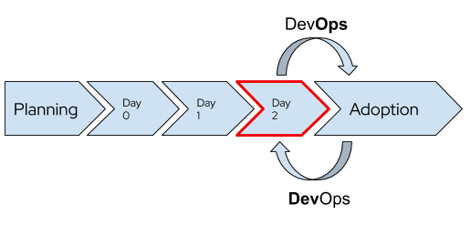](https://www.openshift.com/blog/openshift-end-to-end-cluster-customization)

[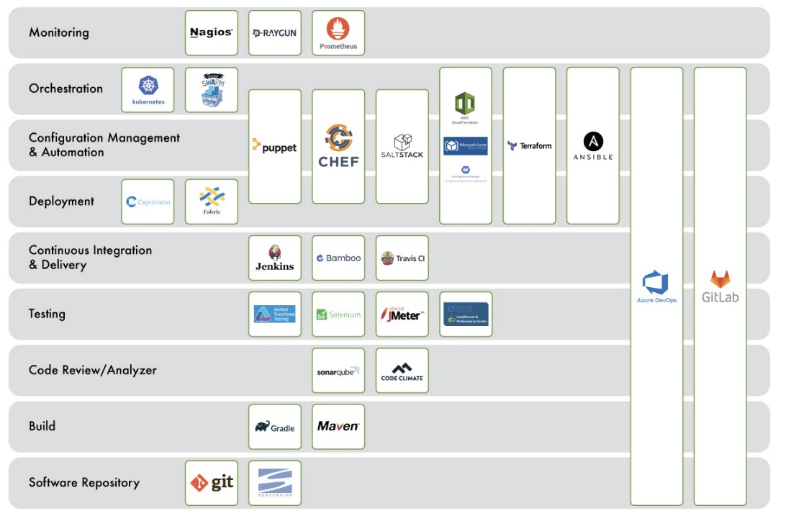](https://dzone.com/articles/the-10-minute-read-to-understanding-devops-tools)

## DORA metrics

- [dynatrace.com: 9 key DevOps metrics for success - What are the four main DevOps metrics? DORA’s Four Keys](https://www.dynatrace.com/news/blog/devops-metrics-for-success/)
    1. Deployment frequency
    2. Lead time for changes
    3. Change failure rate
    4. Mean time to restore service

## DevOps Roadmap

- [dev.to: Your Roadmap to Become a DevOps Engineer in 2021](https://dev.to/kodekloud/your-roadmap-to-become-a-devops-engineer-in-2020-i1n)
- [techworld-with-nana.com: DevOps Roadmap 🌟](https://www.techworld-with-nana.com/devops-roadmap) A step by step guide outlining the most efficient path to become a DevOps engineer

## APIOps

## Multicloud

- [infoworld.com: How multicloud changes devops](https://www.infoworld.com/article/3686695/how-multicloud-changes-devops.html) More clouds, more complexity, more challenges. Now’s the time to prepare for the impact multicloud will have on your devops teams.

## Serverless DevOps

- [searchitoperations.techtarget.com: Tips and tools to achieve a serverless DevOps workflow](https://searchitoperations.techtarget.com/tip/Tips-and-tools-to-achieve-a-serverless-DevOps-workflow) Serverless functions bring the benefits of event-driven computing to a CI/CD pipeline -- but to get there, DevOps teams might need to lean heavily on services and tools from the major cloud computing providers.

## DevOps as a Service (DaaS)

- [containerjournal.com: Best of 2021 – Kubernetes Enables DevOps-as-a-Service (DaaS)](https://containerjournal.com/editorial-calendar/best-of-2021/kubernetes-enables-devops-as-a-service-daas/)

## IaC Infrastructure as Code

- [IaC Infrastructure as Code](iac.md)

## Xebia Labs and DevOps

- [DevOps Glosary of Terms 🌟](https://xebialabs.com/glossary/)
- [The Ultimate DevOps Tool Chest 🌟](https://xebialabs.com/the-ultimate-devops-tool-chest/)
    - [The Ultimate List of Open Source DevOps Tools](https://xebialabs.com/the-ultimate-devops-tool-chest/open-source/)
- [Periodic Table of DevOps 🌟](https://xebialabs.com/periodic-table-of-devops-tools/)

## DevOps Tools

- [DevOps Tools](devops-tools.md)

## Netflix and DevOps

## Public Cloud DevOps

### AWS DevOps

- [AWS DevOps 🌟](https://aws.amazon.com/devops/)

### Azure DevOps

- [Azure DevOps 🌟](https://azure.microsoft.com/services/devops/)

### Google Cloud Platform

- [cloud.google.com: DevOps](https://cloud.google.com/devops)
- [Cloud Developer Tools](https://cloud.google.com/products/tools)
- [Google Cloud Code](https://cloud.google.com/code)
    - [github: Google Cloud Code samples](https://github.com/GoogleCloudPlatform/cloud-code-samples)
- [Google Cloud Build](https://cloud.google.com/cloud-build)

## NoOps

- [NoOps](noops.md)

## NetOps

## PlatformOps

## GPT 3 Tools

Resolve your software incidents 10x faster
    - [Debuild](https://debuild.co/) Debuild is a tool that lets you generate functional web apps from a simple English description.
    - [seekwell](https://www.seekwell.io/) SeekWell helps write SQL requests and synchronizes the results to the apps your team operates in.

## Data as Code

- [thenewstack.io: The Coming Era of Data as Code 🌟](https://thenewstack.io/the-coming-era-of-data-as-code/)
- [arrikto.com: What is Data as Code 🌟](https://www.arrikto.com/blog/what-is-data-as-code/)

## DevOps for SAP

- [blogs.sap.com: A Practical Guide to DevOps for SAP ERP](https://blogs.sap.com/2021/12/13/a-practical-guide-to-devops-for-sap-erp/)

## Youtube Playlists

- [youtube playlist: DevOps - SonarQube, Artifactory, JFrog, Jenkins, Maven, etc 🌟](https://www.youtube.com/playlist?list=PLVx1qovxj-akoYTAboxT1AbHlPmrvRYYZ)
- [youtube playlist: Docker 🌟](https://www.youtube.com/playlist?list=PLVx1qovxj-amqyqHceAhkcsopzi4PFcKc)
- [youtube playlist: Ansible 🌟](https://www.youtube.com/playlist?list=PLVx1qovxj-al0Knm1A0eEXfGyd5kCi16p)
- [youtube playlist: Kubernetes 🌟](https://www.youtube.com/playlist?list=PLVx1qovxj-akr_3XqQQgpqRyQw4GYuS4h)

## Platform Engineering and Internal Developer Platform

- [platformengineering.org](https://platformengineering.org) The global home for Platform Engineers
- [thenewstack.io/platform-engineering](https://thenewstack.io/platform-engineering) Platform engineering is the discipline of building workflows, toolchains, platforms & docs to support app teams in their delivery of business value. Benefits Include:
    - Increased velocity
    - Enable developer satisfaction
    - Speed up onboarding
- [==honeycomb.io: The Future of Ops Is Platform Engineering== 🌟](https://www.honeycomb.io/blog/future-ops-platform-engineering) Platform engineers vs. DevOps engineers
- [thenewstack.io: DevOps Burnout? Try Platform Engineering](https://thenewstack.io/devops-burnout-try-platform-engineering/) Internal developer platforms might be part of the solution by reducing repetitive and manual work and cognitive load.
- [softwareengineeringdaily.com: The Rise of Platform Engineering 🌟](https://softwareengineeringdaily.com/2020/02/13/setting-the-stage-for-platform-engineering/)
- [thenewstack.io: How Is Platform Engineering Different from DevOps and SRE?](https://thenewstack.io/how-is-platform-engineering-different-from-devops-and-sre/) Platform engineering is the next stage of evolution. Like DevOps, it enables developer self-service. Like SRE, it reduces errors and increases reliability.
- [salaboy.com: The Challenges of Platform Building on Top of Kubernetes 4/4](https://salaboy.com/2022/11/28/the-challenges-of-platform-building-on-top-of-kubernetes-4-4/) TLTR: We have reached a point where the adoption and understanding of Kubernetes and Kubernetes tools are mature enough to start hiding them away from the teams consuming them. This blog post explores some of the approaches different development tools take to provide a better and simplified experience for developers while allowing platform teams to curate the resources these tools use and how they behave.
- [thenewstack.io: Platform Engineering in 2023: Dev First, Collaboration and APIs](https://thenewstack.io/platform-engineering-in-2023-dev-first-collaboration-and-apis/) Developer platforms won't eliminate DevOps but will prioritize developer experience.
- [thenewstack.io: Architecture and Design Considerations for Platform Engineering Teams](https://thenewstack.io/platform-engineering/architecture-and-design-considerations-for-platform-engineering-teams/) What exactly is a platform? Is it an internal developer platform, a developer self-service portal or simply a developer onboarding tool?
- [dev.to/thenjdevopsguy: Platform Engineering On Kubernetes Part 4: Internal Developer Platforms](https://dev.to/thenjdevopsguy/platform-engineering-on-kubernetes-part-4-internal-developer-platforms-1kmh)
- [dev.to/thenjdevopsguy: Create and Understand Your Platform Engineering Environment](https://dev.to/thenjdevopsguy/creating-your-platform-engineering-environment-4hpa)
- [siliconangle.com: The rise of platform engineering in the Kubernetes era](https://siliconangle.com/2023/04/20/rise-platform-engineering-kubernetes-era-kubecon/)
- [loft.sh: Platform Engineering: The Definitive Guide](https://loft.sh/blog/platform-engineering-the-definitive-guide/) Platform engineering is the practice of designing, building, operating, and maintaining tools and infrastructure to help software developers build and ship software quickly
- [infoworld.com: Why platform engineering?](https://www.infoworld.com/article/3694869/why-platform-engineering.html) The shift from devops to platform engineering could be transformational. Here's why and what's involved in making the leap.
- [dev.to: Platform Engineering and Internal Developer Platform (IDP)](https://dev.to/aws-builders/platform-engineering-and-internal-developer-platform-3deb)
- [==dev.to/thenjdevopsguy: What Is Platform Engineering (And What Is It Not?)==](https://dev.to/thenjdevopsguy/what-is-platform-engineering-and-what-is-it-not-2jb8)
- [thenewstack.io: The 6 Pillars of Platform Engineering: Part 1 — Security](https://thenewstack.io/the-6-pillars-of-platform-engineering-part-1-security/) Platform team workflows and checklists for building security, pipelines, provisioning, connectivity, orchestration, and observability into their platform.
- [humanitec.com: How to design your repository structures to nail platform engineering](https://humanitec.com/blog/how-to-design-your-repository-structures-to-nail-platform-engineering) Unlock the full power of platform engineering with repo structures designed to nail high-impact IDPs. Optimize operations, security, and agility for enterprise-ready solutions.
- [muycomputerpro.com: Ingeniería de plataformas de DevOps: la nueva generación de DevOps](https://www.muycomputerpro.com/2024/01/12/ingenieria-de-plataformas-de-devops-la-nueva-generacion-de-devops)
- [humanitec.com: Escape VMware lock-in with a modular Internal Developer Platform](https://humanitec.com/blog/escape-vmware-lock-in-with-a-modular-internal-developer-platform)
- [infoq.com: InfoQ platform engineering homepage](https://www.infoq.com/platformengineering/)
- [infoq.com: Platform as a Runtime - the Next Step in Platform Engineering](https://www.infoq.com/articles/platform-runtime-engineering/)
- [infoq.com: Platform Engineering – Making Other Teams 10x Better](https://www.infoq.com/podcasts/platform-engineering-teams-10x-better/)
- [syntasso.io: Platform Engineering: Orchestrating Applications, Platforms, and Infrastructure](https://www.syntasso.io/post/platform-engineering-orchestrating-applications-platforms-and-infrastructure)
- [thenewstack.io: 5 Lessons For Building a Platform as a Product](https://thenewstack.io/5-lessons-for-building-a-platform-as-a-product/)
- [==seal.io: Open Source Platform Engineering for Dev & Ops==](https://www.seal.io/)
- [humanitec.com: Why every Internal Developer Platform needs a backend](https://humanitec.com/blog/why-every-internal-developer-platform-needs-a-backend) It’s not enough to just have an Internal Developer Platform. To get results, it needs to be done right, and that means building an effective platform backend, a Platform Orchestrator.
- [piotrminkowski.com: IDP on OpenShift with Red Hat Developer Hub](https://piotrminkowski.com/2024/07/04/idp-on-openshift-with-red-hat-developer-hub/)

### IDP Tools

- [github.com/Qovery/Torii](https://github.com/Qovery/Torii) Torii ⛩️ is a simple, powerful and extensible open-source Internal Developer Portal
- [github.com/backstage/backstage](https://github.com/backstage/backstage) Backstage is an open platform for building developer portals
- [Port](https://www.getport.io/)
- [Cortex](https://www.cortex.io/)
- [Atlassian Compass](https://www.atlassian.com/software/compass)
- [github.com/KusionStack/kusion](https://github.com/KusionStack/kusion) Intent-Driven Platform Orchestrator. Declarative Intent Driven Platform Orchestrator for Internal Developer Platform (IDP). Kusion is a modern application delivery and management toolchain that enables developers to specify desired intent in a declarative way and then use consistent workflow to drive continuous deployment through the application lifecycle

## Bunch of Images

??? note "Click to expand!"

	

	[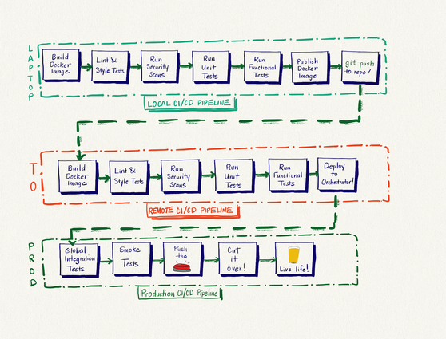](https://www.contino.io/insights/how-to-make-enterprise-container-strategies-that-last-part-one)

	[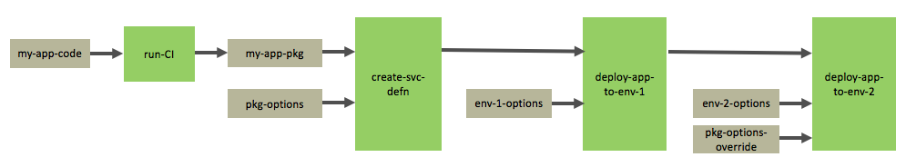](https://dzone.com/articles/are-you-stuck-in-the-new-devops-matrix-from-hell)

	[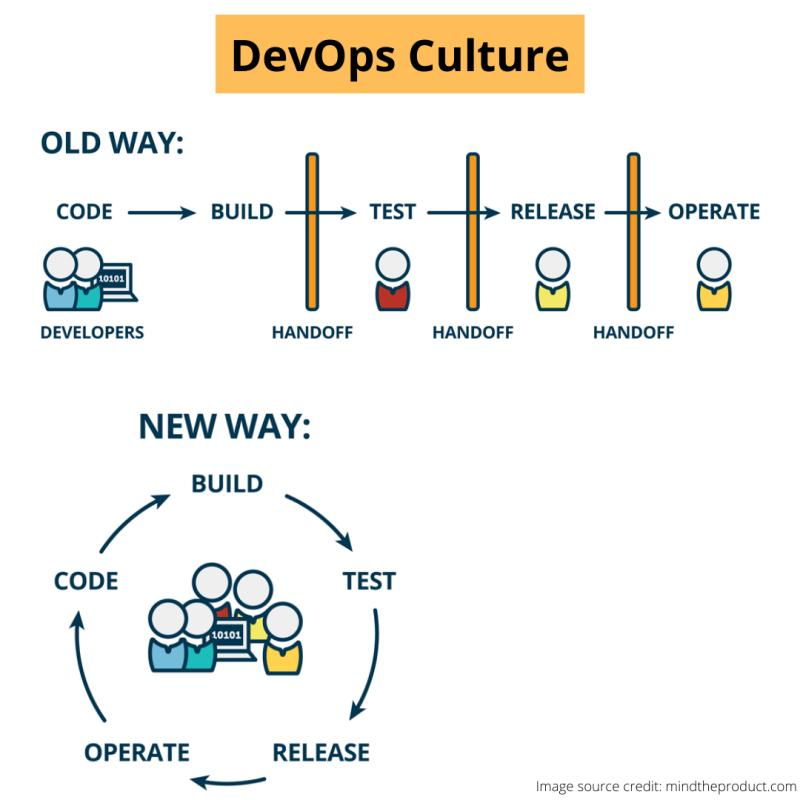](https://www.mindtheproduct.com/what-the-hell-are-ci-cd-and-devops-a-cheatsheet-for-the-rest-of-us/)

	[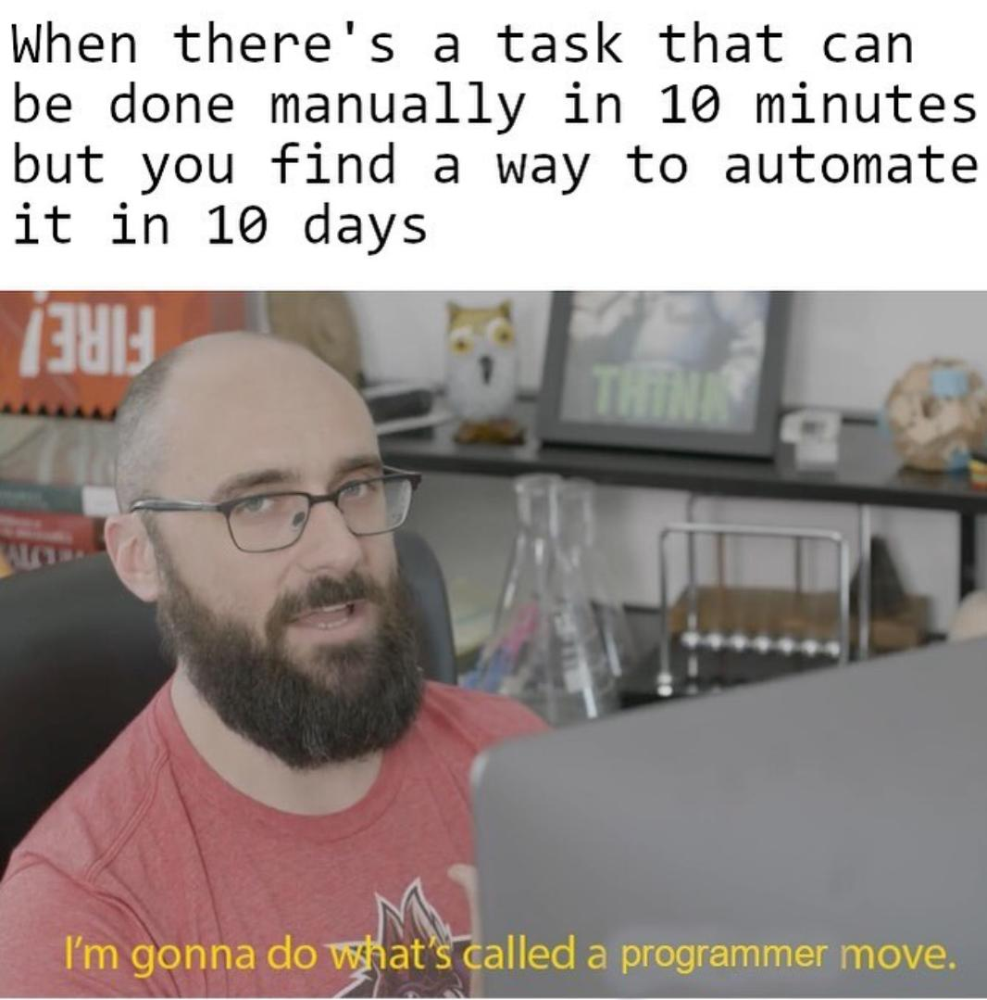](https://www.tecmint.com/)

	[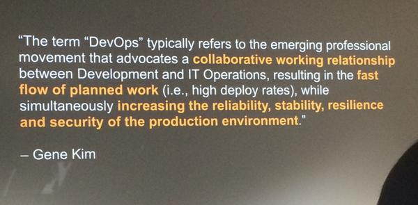](https://itrevolution.com/faculty/gene-kim/)

	[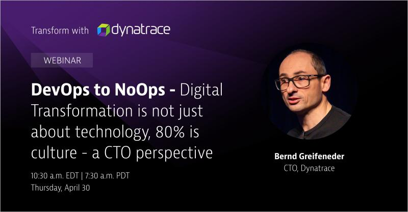](https://www.dynatrace.com/)

	[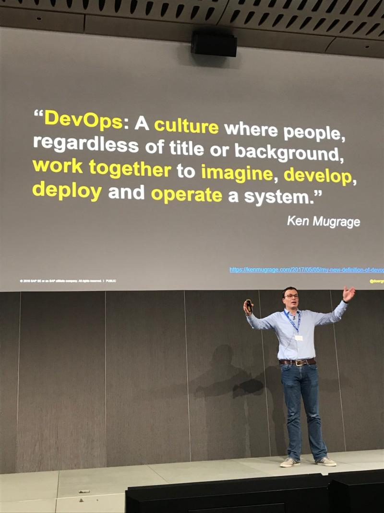](https://kenmugrage.com/2017/05/05/my-new-definition-of-devops/#more-4)

	[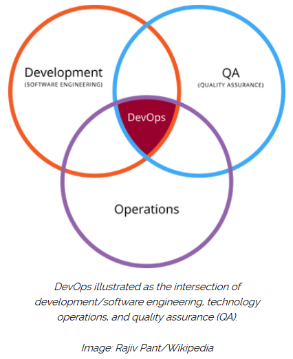](https://en.wikipedia.org/wiki/DevOps)

	[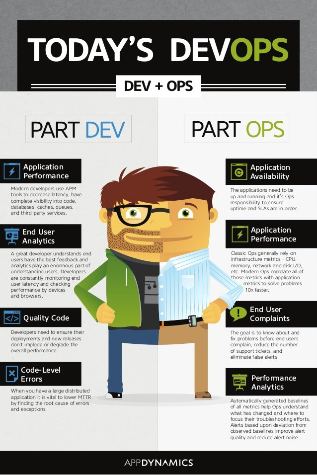](https://www.appdynamics.com/)

	[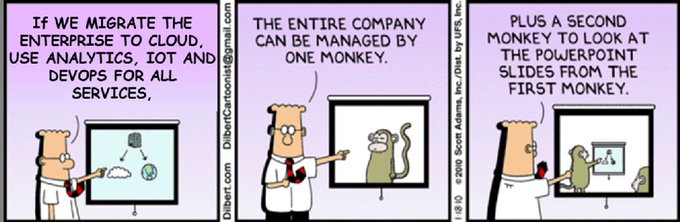](https://dilbert.com/)

	[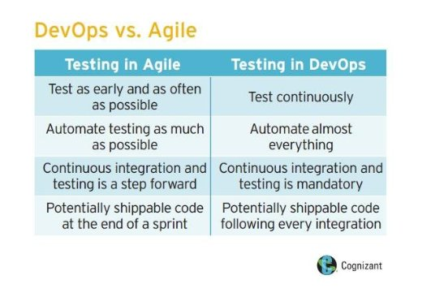](https://www.cognizant.com/InsightsWhitepapers/Jumpstarting-DevOps-with-Continuous-Testing-codex1719.pdf)

	[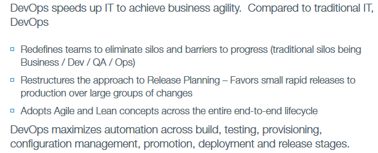](https://www.capgemini.com/2016/05/assessing-state-of-your-devops-adoption-use-of-a-quality-blueprint-qbp/)

	[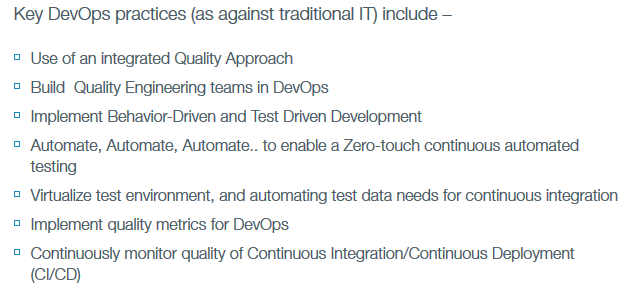](https://www.capgemini.com/2016/05/assessing-state-of-your-devops-adoption-use-of-a-quality-blueprint-qbp/)

	[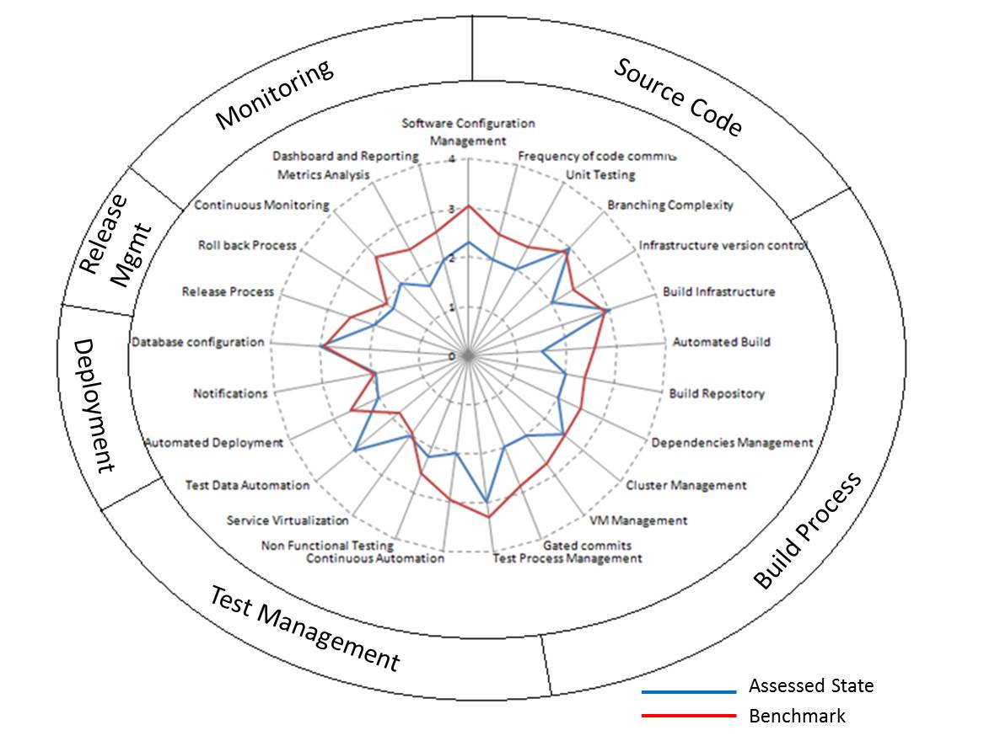](https://www.capgemini.com/2016/05/assessing-state-of-your-devops-adoption-use-of-a-quality-blueprint-qbp/)

	[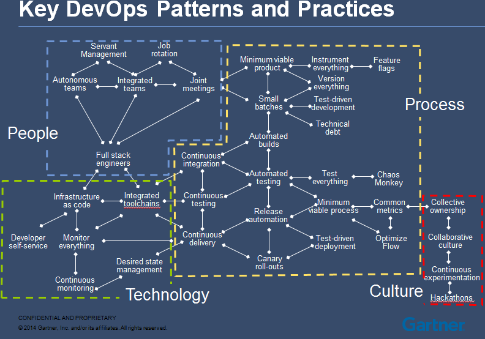](https://blogs.gartner.com/cameron_haight/2014/10/13/getting-your-arms-around-devops-devops-patterns-and-practices/)

	[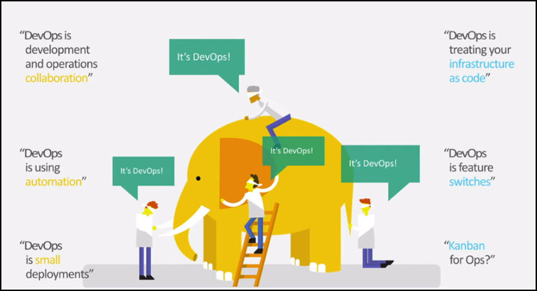](https://dzone.com/articles/what-is-devops-2)

	

	[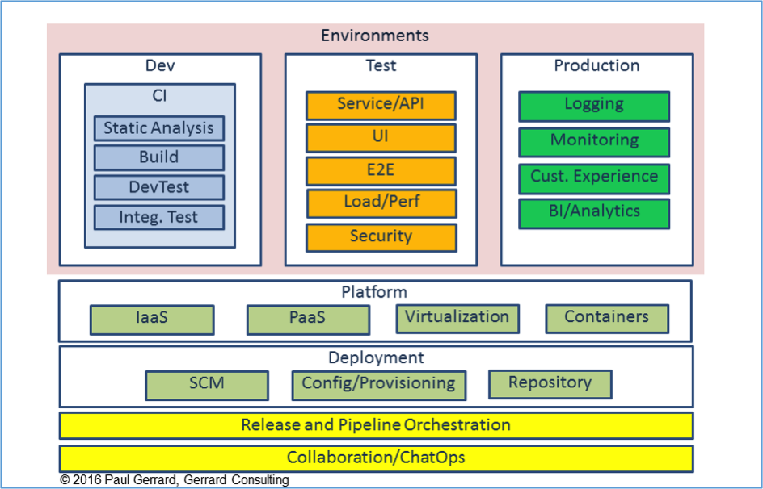](http://www.softwaretestingnews.co.uk/a-software-testing-and-devops-tools-directory-for-digital-programmes/)

	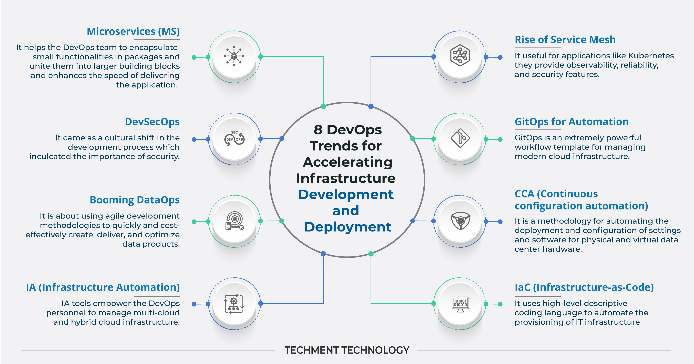

	

	
	

## Slides

??? note "Click to expand!"

	

	

	<iframe src="//www.slideshare.net/slideshow/embed_code/key/ch64DsNKnrQRC1" width="668" height="714" frameborder="0" marginwidth="0" marginheight="0" scrolling="no" style="border:1px solid #CCC; border-width:1px; margin-bottom:5px; max-width: 100%;" allowfullscreen class="video"> </iframe> 
 <strong> <a href="//www.slideshare.net/IQGroup/how-will-devops-benefit-enterprise" title="How will DevOps benefit enterprise? " target="_blank">How will DevOps benefit enterprise? </a> </strong> from <strong><a href="//www.slideshare.net/IQGroup" target="_blank">InterQuest Group</a></strong> 

	

	

## Videos

  
Click to expand!

<iframe width="560" height="315" src="https://www.youtube.com/embed/0yWAtQ6wYNM" title="YouTube video player" frameborder="0" allow="accelerometer; autoplay; clipboard-write; encrypted-media; gyroscope; picture-in-picture" allowfullscreen></iframe>
<iframe width="560" height="315" src="https://www.youtube.com/embed/9pZ2xmsSDdo" title="YouTube video player" frameborder="0" allow="accelerometer; autoplay; clipboard-write; encrypted-media; gyroscope; picture-in-picture" allowfullscreen></iframe>
<iframe width="560" height="315" src="https://www.youtube.com/embed/js-rq7SvPpE" title="YouTube video player" frameborder="0" allow="accelerometer; autoplay; clipboard-write; encrypted-media; gyroscope; picture-in-picture" allowfullscreen></iframe>
<iframe width="560" height="315" src="https://www.youtube.com/embed/vAbl3X3VrJo" title="YouTube video player" frameborder="0" allow="accelerometer; autoplay; clipboard-write; encrypted-media; gyroscope; picture-in-picture" allowfullscreen></iframe>
<iframe width="560" height="315" src="https://www.youtube.com/embed/CyvqXqGyq_U" title="YouTube video player" frameborder="0" allow="accelerometer; autoplay; clipboard-write; encrypted-media; gyroscope; picture-in-picture" allowfullscreen></iframe>
<iframe width="560" height="315" src="https://www.youtube.com/embed/uTEL8Ff1Zvk" title="YouTube video player" frameborder="0" allow="accelerometer; autoplay; clipboard-write; encrypted-media; gyroscope; picture-in-picture" allowfullscreen></iframe>
<iframe width="560" height="315" src="https://www.youtube.com/embed/R74bm8IGu2M" title="YouTube video player" frameborder="0" allow="accelerometer; autoplay; clipboard-write; encrypted-media; gyroscope; picture-in-picture" allowfullscreen></iframe>
<iframe width="560" height="315" src="https://www.youtube.com/embed/Cthla7KqU04" title="YouTube video player" frameborder="0" allow="accelerometer; autoplay; clipboard-write; encrypted-media; gyroscope; picture-in-picture" allowfullscreen></iframe>
<iframe width="560" height="315" src="https://www.youtube.com/embed/lTZJUVgQeO0" title="YouTube video player" frameborder="0" allow="accelerometer; autoplay; clipboard-write; encrypted-media; gyroscope; picture-in-picture; web-share" allowfullscreen></iframe>
<iframe width="560" height="315" src="https://www.youtube.com/embed/ghzsBm8vOms" title="YouTube video player" frameborder="0" allow="accelerometer; autoplay; clipboard-write; encrypted-media; gyroscope; picture-in-picture; web-share" allowfullscreen></iframe>

## Tweets

  
Click to expand!

<blockquote class="twitter-tweet">
It drives me nuts when people say &quot;DevOps&quot; when they really mean &quot;Ops.&quot; Ops didn&#39;t just disappear, folks.
&mdash; emily freeman (@editingemily) <a href="https://twitter.com/editingemily/status/1404840667558207489?ref_src=twsrc%5Etfw">June 15, 2021</a></blockquote> 

<blockquote class="twitter-tweet">
<a href="https://twitter.com/HelmPack?ref_src=twsrc%5Etfw">@HelmPack</a> can hide some deep K8s knowledge.<a href="https://twitter.com/crossplane_io?ref_src=twsrc%5Etfw">@crossplane_io</a> does the same for infrastructure, best practices Postgres can be as simple as provide the version and the size. A game-changer for platforms
&mdash; Omer Kahani (@OmerKahani) <a href="https://twitter.com/OmerKahani/status/1427711077350006786?ref_src=twsrc%5Etfw">August 17, 2021</a></blockquote> 

<blockquote class="twitter-tweet">
Working on infrastructure is to keep things boring.
&mdash; Jaana Dogan ヤナ ドガン (@rakyll) <a href="https://twitter.com/rakyll/status/1438931035077505024?ref_src=twsrc%5Etfw">September 17, 2021</a></blockquote> 

<blockquote class="twitter-tweet">
Progress! <a href="https://t.co/FB7v3OOdsf">pic.twitter.com/FB7v3OOdsf</a>
&mdash; Richard Campbell (@richcampbell) <a href="https://twitter.com/richcampbell/status/1454100747453349892?ref_src=twsrc%5Etfw">October 29, 2021</a></blockquote> 

<blockquote class="twitter-tweet">
Automation tools don&#39;t reduce cloud complexity, they embrace it.
&mdash; Kelsey Hightower (@kelseyhightower) <a href="https://twitter.com/kelseyhightower/status/1460622599747039232?ref_src=twsrc%5Etfw">November 16, 2021</a></blockquote> 

<blockquote class="twitter-tweet">
Artem Kobrin from <a href="https://twitter.com/NTTDATAServices?ref_src=twsrc%5Etfw">@NTTDATAServices</a> presents their multi-stage blue-green deployments with <a href="https://twitter.com/keptnProject?ref_src=twsrc%5Etfw">@keptnProject</a> and <a href="https://twitter.com/argoproj?ref_src=twsrc%5Etfw">@argoproj</a> in <a href="https://twitter.com/hashtag/Kubernetes?src=hash&amp;ref_src=twsrc%5Etfw">#Kubernetes</a>. Nice pipelines😍 <a href="https://twitter.com/hashtag/keptnUserGroup?src=hash&amp;ref_src=twsrc%5Etfw">#keptnUserGroup</a> <a href="https://t.co/E1eDMoxcDz">pic.twitter.com/E1eDMoxcDz</a>
&mdash; Oleg Nenashev (@oleg_nenashev) <a href="https://twitter.com/oleg_nenashev/status/1460644013120315397?ref_src=twsrc%5Etfw">November 16, 2021</a></blockquote> 

<blockquote class="twitter-tweet">
I like to architect cloud. What do you love - DevOps or architect?
&mdash; Satyen Kumar (@SatyenKumar) <a href="https://twitter.com/SatyenKumar/status/1489260596512002050?ref_src=twsrc%5Etfw">February 3, 2022</a></blockquote> 

<blockquote class="twitter-tweet">
Few things you must absolutely know about DevOps 1⃣ DevOps is a software development lifecycle (SDLC) approach which involves 🧩Continuous integration 🧪Continuous testing 🚚Continuous Delivery 🛫Continuous deployment 🔎Continuous monitoring  throughout its development phase.  🧵 <a href="https://t.co/I38Ntqryeq">pic.twitter.com/I38Ntqryeq</a>
&mdash; Satyen Kumar (@SatyenKumar) <a href="https://twitter.com/SatyenKumar/status/1496433970183090182?ref_src=twsrc%5Etfw">February 23, 2022</a></blockquote> 

<blockquote class="twitter-tweet">
Interview on Austrian TV 😊 Talked about how we started our YouTube channel, as a temporary side project, which turned into this amazing and fulfilling job of educating people in DevOps engineering 💙 . Full interview on <a href="https://twitter.com/4Gamechanger?ref_src=twsrc%5Etfw">@4Gamechanger</a>: <a href="https://t.co/3jViGROFTP">https://t.co/3jViGROFTP</a>😊<a href="https://twitter.com/hashtag/devops?src=hash&amp;ref_src=twsrc%5Etfw">#devops</a> <a href="https://twitter.com/hashtag/youtube?src=hash&amp;ref_src=twsrc%5Etfw">#youtube</a> <a href="https://t.co/FIb8DubPup">pic.twitter.com/FIb8DubPup</a>
&mdash; TechWorld with Nana | DevOps 🚀 (@Njuchi_) <a href="https://twitter.com/Njuchi_/status/1505151354607656961?ref_src=twsrc%5Etfw">March 19, 2022</a></blockquote> 

<blockquote class="twitter-tweet">
If you want to master DevOps, watch these YouTube videos:
&mdash; Simon (@simonholdorf) <a href="https://twitter.com/simonholdorf/status/1590615976558485508?ref_src=twsrc%5Etfw">November 10, 2022</a></blockquote> 

<blockquote class="twitter-tweet">
Drone flight through the<a href="https://twitter.com/hashtag/GigaBerlinBrandenburg?src=hash&amp;ref_src=twsrc%5Etfw">#GigaBerlinBrandenburg</a> <a href="https://twitter.com/Tesla?ref_src=twsrc%5Etfw">@Tesla</a> <a href="https://t.co/7yCehZl5G3">pic.twitter.com/7yCehZl5G3</a>
&mdash; Gigafactory Berlin-Brandenburg 🕊🇺🇦 (@Gf4Tesla) <a href="https://twitter.com/Gf4Tesla/status/1507447173436297217?ref_src=twsrc%5Etfw">March 25, 2022</a></blockquote> 

