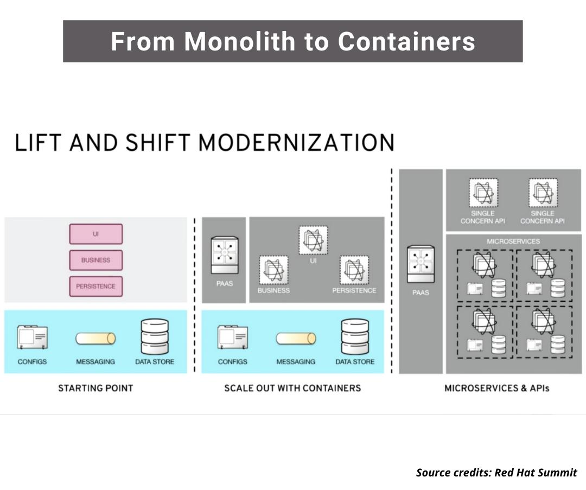

# Microservices FAQ

1. [FAQ](#faq)
2. [History of Microservices](#history-of-microservices)
3. [Kubernetes Native](#kubernetes-native)
4. [Adoption of Cloud-Native Architecture](#adoption-of-cloud-native-architecture)
5. [Migration Styles. Lift and Shift Cloud Migration Strategy](#migration-styles-lift-and-shift-cloud-migration-strategy)
6. [Architectural Patterns for Caching Microservices](#architectural-patterns-for-caching-microservices)
7. [Bunch of Images](#bunch-of-images)

## FAQ

- [Should I Use A Microservices Architecture? What about the UI? 🌟](https://www.jamesmichaelhickey.com/microservices-architecture/)
- [medium.com: STOP!! You don’t need Microservices](https://medium.com/@ebin/stop-you-dont-need-microservices-dc732d70b3e0)
- [contino.io: How to Make Enterprise Container Strategies That Last (Part One)](https://www.contino.io/insights/how-to-make-enterprise-container-strategies-that-last-part-one)
- [medium.com: Your team might not need Kubernetes](https://medium.com/faun/your-team-might-not-need-kubernetes-57240e8d554a)
- [cybercoders.com: What Hiring Managers look for in a Full Stack Developer](https://www.cybercoders.com/insights/what-hiring-managers-look-for-in-a-full-stack-developer/)
- [nginx.com: Introduction to Microservices 🌟🌟🌟](https://www.nginx.com/blog/introduction-to-microservices/)
- [Dzone: Programming Styles Compared: Spring Framework vis-a-vis Eclipse MicroProfile 🌟🌟](https://dzone.com/articles/programming-styles-spring-boot-vis-a-vis-with-ecli)
- [Dzone: Containerization in 2020](https://dzone.com/articles/containerization-in-2020) Let's look at how containerization has changed enterprise development in the past few years and what developers should know when considering a container strategy.
- [shekhargulati.com: Service Discovery for Modern Distributed Applications](https://shekhargulati.com/2018/08/01/week-1-service-discovery-for-modern-distributed-applications/)
- [infoq.com: Pitfalls and Patterns in Microservice Dependency Management](https://www.infoq.com/articles/pitfalls-patterns-microservice-dependency-management/)
- [dev.to: Microservice Roadmap](https://dev.to/majidqafouri/microservice-roadmap-4mci)
- [clickittech.com: Microservices vs Monolith 🌟](https://www.clickittech.com/devops/microservices-vs-monolith/)
- [betterprogramming.pub: Domain Partitions: How To Find a Healthy Balance Between Microservices and Monoliths](https://betterprogramming.pub/domain-partitions-how-to-find-a-healthy-balance-between-microservices-and-monoliths-2cd74206559) An in-depth look at an architectural pattern that will suit the majority of small- to medium-sized companies
- [thenewstack.io: Microservices: Align the Pain with the Solution](https://thenewstack.io/microservices-align-the-pain-with-the-solution/)
- [k21academy.com: Monolithic vs Microservices – Difference, Advantages & Disadvantages](https://k21academy.com/docker-kubernetes/monolithic-vs-microservices/)
- [medium: It’s time to stop making “Microservices” the goal of modernization](https://medium.com/ibm-garage/its-time-to-stop-making-microservices-the-goal-of-modernization-71758b400287)
- [thenewstack.io: Choosing Between Container-Native and Container-Ready Storage 🌟](https://thenewstack.io/choosing-between-container-native-and-container-ready-storage/) Into this discussion about the new container data-services layer come two main approaches: container-native and container-ready.
- [blog.risingstack.com: Designing a Microservices Architecture for Failure](https://blog.risingstack.com/designing-microservices-architecture-for-failure/)
- [faun.pub: Complete Guide to Monolithic vs. Microservices Architecture](https://faun.pub/complete-guide-to-monolithic-vs-microservices-architecture-fe1858c2cfef?gi=e90ac9ae47ab)
- [dev.to: When are microservices appropriate?](https://dev.to/tngeene/when-are-microservices-appropriate-g2n)
- [==devopsdigest.com: CI/CD Deployments: How to Expedite Across a Kubernetes Environment With DevOps Orchestration==](https://www.devopsdigest.com/cicd-deployments-how-to-expedite-across-a-kubernetes-environment-with-devops-orchestration) **From Old to New Migrating VM Workloads to Containers. DevOps Meets SecOps: Building Security & Quality Gate Automations. Accelerate the Migration to Kubernetes**
- [==medium.com: When to Use and When NOT to Use Microservices: No Silver Bullet== 🌟](https://medium.com/design-microservices-architecture-with-patterns/when-to-use-and-when-not-to-use-microservices-no-silver-bullet-3ae293faf6d)

## History of Microservices

- [History of Microservices](https://bit.ly/kubeappserver)

## Kubernetes Native

- [developers.redhat.com: Why Kubernetes native instead of cloud native? 🌟](https://developers.redhat.com/blog/2020/04/08/why-kubernetes-native-instead-of-cloud-native/)

## Adoption of Cloud-Native Architecture

- [Adoption of Cloud-Native Architecture, Part 1: Architecture Evolution and Maturity](https://www.infoq.com/articles/cloud-native-architecture-adoption-part1/)

## Migration Styles. Lift and Shift Cloud Migration Strategy

- [From monolith to containers: How Verizon containerized legacy applications on OpenShift 🌟](https://www.youtube.com/watch?v=Q6i0LK4vHsU):
    - Lift and shift is a cloud migration strategy that refers to removing workloads and tasks from one storage location and placing them in another, usually cloud-based, location.
    - Moving applications to the cloud can be challenging if you are unprepared. In fact, many businesses experience some level of migration failure because of poor planning.
    - The lift and shift migration style is one of the approaches that can help you transition to the cloud without the need to redesign applications or disrupt workflow operations.
    - It all starts with containerizing the applications using platforms like Docker and then moving entirely to a microservices architecture.
- [dzone: Cloud Migration(Lift-and-Shift): My Notes From the Ground 🌟](https://dzone.com/articles/lift-and-shift-my-experience-on-the-ground)
- [dzone: The Best Cloud Migration Approach: Lift-And-Shift, Replatform, Or Refactor?](https://dzone.com/articles/the-best-cloud-migration-approach-lift-and-shift-r) There are a number of ways to get your applications to the cloud, but the question of which method to use is a little up in the air.
- [dzone: 10 Commandments of Microservice Decomposition 🌟](https://dzone.com/articles/10-commandments-on-microservice-decomposition) In this article, I will try to cover the purposes of terms used while decomposing microservices and try to fit them under one umbrella concept.
- [acloudguru.com: What is lift and shift cloud migration?](https://acloudguru.com/blog/business/what-is-lift-and-shift-cloud-migration)

## Architectural Patterns for Caching Microservices

- [==hazelcast.com: Where Is My Cache? Architectural Patterns for Caching Microservices== 🌟](https://hazelcast.com/blog/architectural-patterns-for-caching-microservices/)

## Bunch of Images

??? note "Click to expand!"

	

	

	

	

	
	

