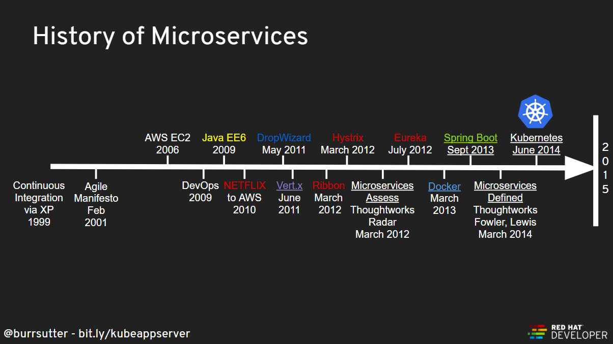
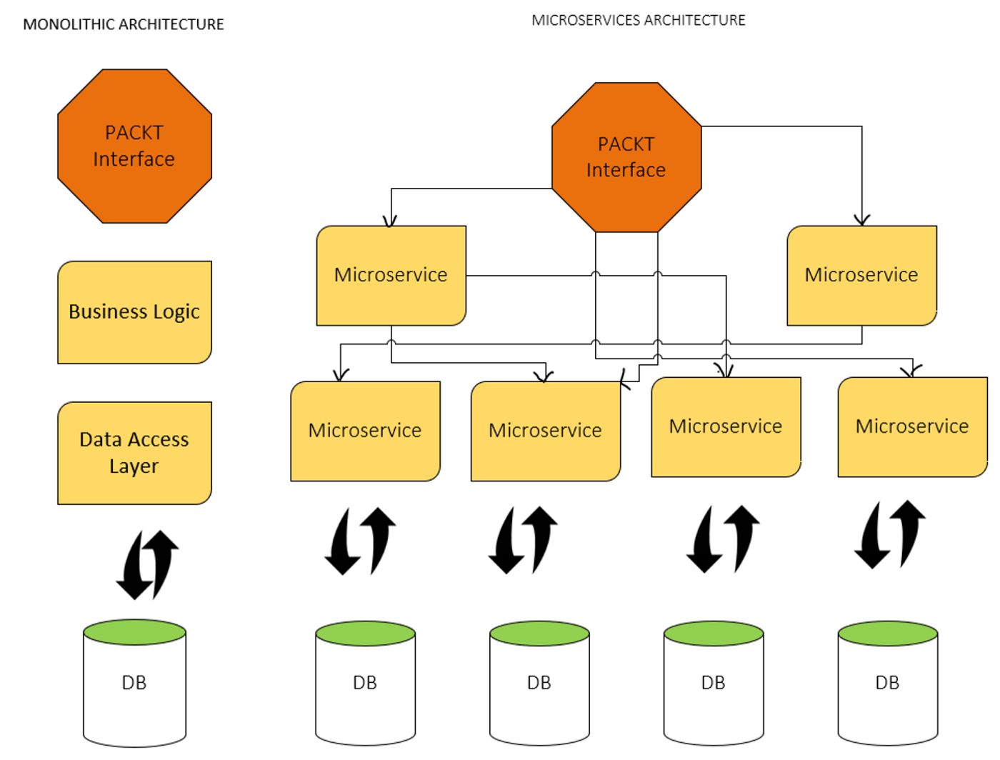
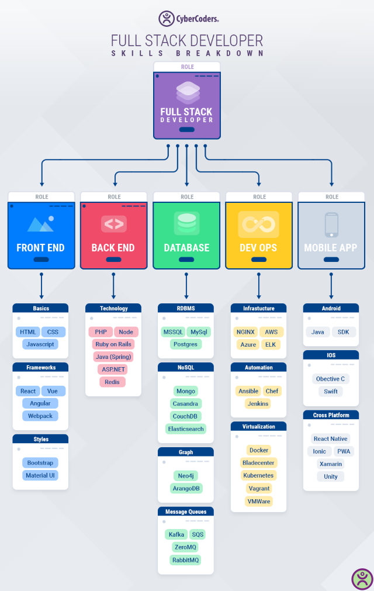
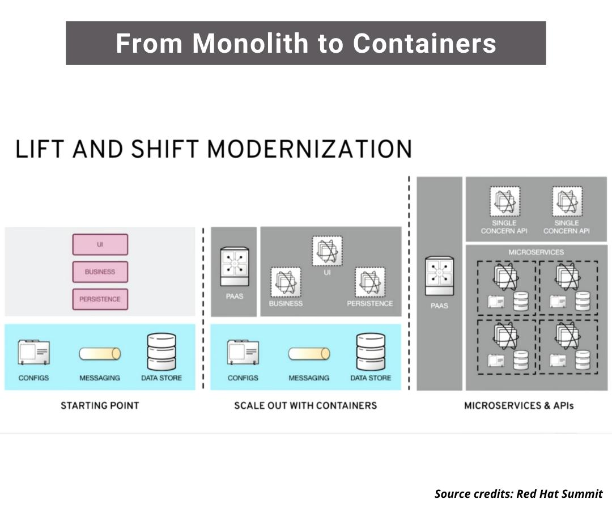

# Microservices FAQ

1. [FAQ](#faq)
2. [History of Microservices](#history-of-microservices)
3. [Kubernetes Native](#kubernetes-native)
4. [Adoption of Cloud-Native Architecture](#adoption-of-cloud-native-architecture)
5. [Migration Styles. Lift and Shift Cloud Migration Strategy](#migration-styles-lift-and-shift-cloud-migration-strategy)
6. [Architectural Patterns for Caching Microservices](#architectural-patterns-for-caching-microservices)
7. [Bunch of Images](#bunch-of-images)

## FAQ

- [Should I Use A Microservices Architecture? What about the UI? 🌟](https://www.jamesmichaelhickey.com/microservices-architecture/)
- [contino.io: How to Make Enterprise Container Strategies That Last (Part One)](https://www.contino.io/insights/how-to-make-enterprise-container-strategies-that-last-part-one)
- [cybercoders.com: What Hiring Managers look for in a Full Stack Developer](https://www.cybercoders.com/insights/what-hiring-managers-look-for-in-a-full-stack-developer/)
- [nginx.com: Introduction to Microservices 🌟🌟🌟](https://www.nginx.com/blog/introduction-to-microservices/)
- [shekhargulati.com: Service Discovery for Modern Distributed Applications](https://shekhargulati.com/2018/08/01/week-1-service-discovery-for-modern-distributed-applications/)
- [infoq.com: Pitfalls and Patterns in Microservice Dependency Management](https://www.infoq.com/articles/pitfalls-patterns-microservice-dependency-management/)
- [dev.to: Microservice Roadmap](https://dev.to/majidqafouri/microservice-roadmap-4mci)
- [clickittech.com: Microservices vs Monolith 🌟](https://www.clickittech.com/devops/microservices-vs-monolith/)
- [thenewstack.io: Microservices: Align the Pain with the Solution](https://thenewstack.io/microservices-align-the-pain-with-the-solution/)
- [k21academy.com: Monolithic vs Microservices – Difference, Advantages & Disadvantages](https://k21academy.com/docker-kubernetes/monolithic-vs-microservices/)
- [thenewstack.io: Choosing Between Container-Native and Container-Ready Storage 🌟](https://thenewstack.io/choosing-between-container-native-and-container-ready-storage/) Into this discussion about the new container data-services layer come two main approaches: container-native and container-ready.
- [dev.to: When are microservices appropriate?](https://dev.to/tngeene/when-are-microservices-appropriate-g2n)
- [==devopsdigest.com: CI/CD Deployments: How to Expedite Across a Kubernetes Environment With DevOps Orchestration==](https://www.devopsdigest.com/cicd-deployments-how-to-expedite-across-a-kubernetes-environment-with-devops-orchestration) **From Old to New Migrating VM Workloads to Containers. DevOps Meets SecOps: Building Security & Quality Gate Automations. Accelerate the Migration to Kubernetes**

## History of Microservices

- [History of Microservices](https://bit.ly/kubeappserver)

## Kubernetes Native

## Adoption of Cloud-Native Architecture

- [Adoption of Cloud-Native Architecture, Part 1: Architecture Evolution and Maturity](https://www.infoq.com/articles/cloud-native-architecture-adoption-part1/)

## Migration Styles. Lift and Shift Cloud Migration Strategy

- [From monolith to containers: How Verizon containerized legacy applications on OpenShift 🌟](https://www.youtube.com/watch?v=Q6i0LK4vHsU):
    - Lift and shift is a cloud migration strategy that refers to removing workloads and tasks from one storage location and placing them in another, usually cloud-based, location.
    - Moving applications to the cloud can be challenging if you are unprepared. In fact, many businesses experience some level of migration failure because of poor planning.
    - The lift and shift migration style is one of the approaches that can help you transition to the cloud without the need to redesign applications or disrupt workflow operations.
    - It all starts with containerizing the applications using platforms like Docker and then moving entirely to a microservices architecture.
- [acloudguru.com: What is lift and shift cloud migration?](https://acloudguru.com/blog/business/what-is-lift-and-shift-cloud-migration)

## Architectural Patterns for Caching Microservices

## Bunch of Images

??? note "Click to expand!"

	

	

	

	

	
	
