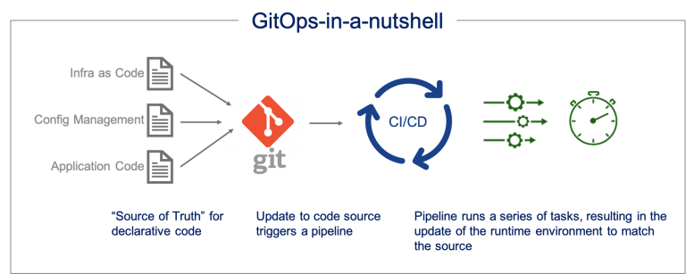
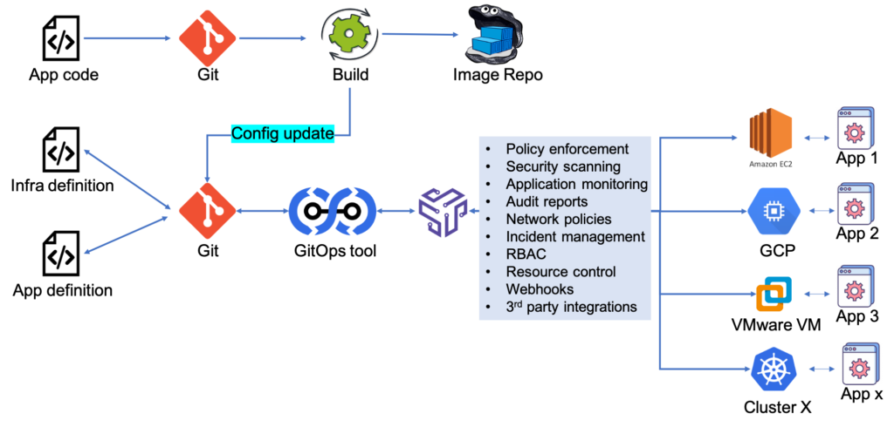

# GitOps

1. [Introduction](#introduction)
2. [GitOps Working Group](#gitops-working-group)
3. [OpenGitOps Project](#opengitops-project)
4. [GitOps Patterns](#gitops-patterns)
5. [Git Repositories Structures](#git-repositories-structures)
6. [GitOps Tools](#gitops-tools)
    1. [Flux. The GitOps Operator for Kubernetes](#flux-the-gitops-operator-for-kubernetes)
    2. [Kustomize. Kubernetes native configuration management](#kustomize-kubernetes-native-configuration-management)
    3. [Helm](#helm)
    4. [GlassKube Package Manager for Kubernetes](#glasskube-package-manager-for-kubernetes)
    5. [Flagger](#flagger)
    6. [WKSctl. Weave Kubernetes System Control](#wksctl-weave-kubernetes-system-control)
    7. [Jenkins](#jenkins)
    8. [Terraform](#terraform)
    9. [Config Sync and Anthos Config Management](#config-sync-and-anthos-config-management)
    10. [Portworx AutoPilot](#portworx-autopilot)
    11. [OpenShift Applier](#openshift-applier)
    12. [HashiCorp Waypoint](#hashicorp-waypoint)
    13. [Weave GitOps](#weave-gitops)
    14. [Octopilot](#octopilot)
7. [GitOps Frameworks](#gitops-frameworks)
8. [Kubernetes Platforms and GitOps](#kubernetes-platforms-and-gitops)
    1. [OpenShift GitOps](#openshift-gitops)
    2. [AWS Kubernetes](#aws-kubernetes)
    3. [Weave Kubernetes Platform](#weave-kubernetes-platform)
    4. [Ubuntu Charmed Kubernetes](#ubuntu-charmed-kubernetes)
9. [APIOps](#apiops)
10. [Images](#images)
11. [Tweets](#tweets)
12. [Videos](#videos)

<iframe width="100%" height="166" scrolling="no" frameborder="no" allow="autoplay" src="https://w.soundcloud.com/player/?url=https%3A//api.soundcloud.com/tracks/636487902&color=%23ff5500&auto_play=false&hide_related=false&show_comments=true&show_user=true&show_reposts=false&show_teaser=true"></iframe>
<a href="https://soundcloud.com/alessandro-donofrio-5" title="Alemix Donofrio" target="_blank" style="color: #cccccc; text-decoration: none;">Alemix Donofrio</a> · <a href="https://soundcloud.com/alessandro-donofrio-5/jimmy-sax-time" title="Jimmy Sax -  Time" target="_blank" style="color: #cccccc; text-decoration: none;">Jimmy Sax -  Time</a>

## Introduction

- [==gitops.tech== 🌟](https://www.gitops.tech/)
- [==OpenGitOps.dev== 🌟](https://opengitops.dev) OpenGitOps is a set of open-source standards, best practices, and community-focused education to help organizations adopt a structured, standardized approach to implementing GitOps.
- [==github.com/topics/gitops== 🌟](https://github.com/topics/gitops)
- [weave.works: Guide to GitOps](https://www.weave.works/technologies/gitops/)
- [weave.works: What Is GitOps?](https://www.weave.works/blog/what-is-gitops-really)
- [atlassian.com: Is GitOps the next big thing in DevOps?](https://www.atlassian.com/git/tutorials/gitops)
- [cloudbees.com: What is GitOps?](https://www.cloudbees.com/gitops/what-is-gitops)
- [dzone: What Is GitOps, Really?](https://dzone.com/articles/what-is-gitops-really) This article will help you understand what GitOps really is as a strategy for development, and its benefits over other CI/CD approaches
- [Continuous GitOps, the way to do DevOps in Kubernetes](https://medium.com/@imarunrk/continuous-gitops-the-way-to-do-devops-in-kubernetes-896b0ea1d0fb) Continuous GitOps, the new age DevOps practice to increase the delivery velocity by achieving an end to end “Git source of truth” with Zero manual changes into the Kubernetes cluster.
- [thenewstack.io: What Is GitOps and Why It Might Be The Next Big Thing for DevOps](https://thenewstack.io/what-is-gitops-and-why-it-might-be-the-next-big-thing-for-devops/)
- [opensource.substack.com: All You Need To Know About GitOps](https://opensource.substack.com/p/all-you-need-to-know-about-gitops) A complete guide about GitOps, what why and how
- [itnext.io: Continuous GitOps, the way to do DevOps in Kubernetes](https://itnext.io/continuous-gitops-the-way-to-do-devops-in-kubernetes-896b0ea1d0fb) Continuous GitOps, the new age DevOps practice to increase the delivery velocity by achieving an end to end “Git source of truth” with Zero manual changes into the Kubernetes cluster
- [container-solutions.com: GitOps: The Bad and the Ugly](https://blog.container-solutions.com/gitops-the-bad-and-the-ugly)
- [itnext.io: Principles, Patterns, and Practices for Effective Infrastructure as Code](https://itnext.io/principles-patterns-and-practices-for-effective-infrastructure-as-code-e5f7bbe13df1) Deliver Infrastructure and Software running on it Rapidly and Reliably at Scale.
- [medium: GitOps: Build infrastructure resilient applications 🌟](https://medium.com/@franoisdagostini/gitops-build-infrastructure-resilient-applications-95bbc939046d)
- [itnext.io: Continuous GitOps, the way to do DevOps in Kubernetes 🌟](https://itnext.io/continuous-gitops-the-way-to-do-devops-in-kubernetes-896b0ea1d0fb) Continuous GitOps, the new age DevOps practice to increase the delivery velocity by achieving an end to end “Git source of truth” with Zero manual changes into the Kubernetes cluster.
- [itnext.io: Managing Kubernetes Secrets Securely with GitOps 🌟](https://itnext.io/managing-kubernetes-secrets-securely-with-gitops-b8174b4f4d30)
- [sufle.io: Adopting GitOps for Enhanced Operations](https://www.sufle.io/blog/adopting-gitops-for-enhanced-operations)
- [medium: GitOps : The Next Big Thing for DevOps and Automation!](https://medium.com/searce/gitops-the-next-big-thing-for-devops-and-automation-2a9597e51559) If you have similar questions like: “What’s GitOps?”, “Why we are moving towards this?”, “How and when one can implement this strategy in now running environment?”, “What are the tools it included?” then you have landed on the right page.
- [thenewstack.io: Understanding GitOps: The Latest Tools and Philosophies](https://thenewstack.io/understanding-gitops-the-latest-tools-and-philosophies/)
- [samiyaakhtar.medium.com: GitOps Observability — Visualizing the journey of a container](https://samiyaakhtar.medium.com/gitops-observability-visualizing-the-journey-of-a-container-5f6ef1f3c9d2)
- [==clickittech.com: What is GitOps?== 🌟](https://www.clickittech.com/devops/what-is-gitops)
- [blog.container-solutions.com: 11 Reasons for Adopting GitOps](https://blog.container-solutions.com/why-adopt-gitops)
- [==opensource.com: GitOps vs. DevOps: What's the difference?== 🌟](https://opensource.com/article/21/3/gitops) Get to know GitOps, an evolved form of DevOps.

	| __Principle__ | __Focus__ | __Main Tool__ | __Other Tools__ | __Flexibility__ | __Correctness__ |
	| :---: | :---: | :---: | :---: | :---: | :---: |
	| __DevOps__ | Automation and frequent deployments | CI/CD pipeline | Supply chain management, Cloud Configuration as Code, etc. | Less strict and more open | Less focus on correctness |
	| __GitOps__ | Correctness; doing DevOps correctly | Git | Kubernetes, Controller (e.g., Operator), separate CI/CD pipelines, Infrastructure as a Code, etc. | Stricter and less open | Designed with correctness |

- [geekflare.com: An Introduction to GitOps](https://geekflare.com/gitops-introduction/)
- [thenewstack.io: GitOps Use Cases You May Not Have Considered](https://thenewstack.io/gitops-use-cases-you-may-not-have-considered/)
- [kumomind.medium.com: Should I consider the GitOps methodology?](https://kumomind.medium.com/should-i-consider-the-gitops-methodology-f49e042b8c22)
- [==dzone: GitOps: How to Ops Your Git the Right Way== 🌟](https://dzone.com/articles/gitops-how-to-ops-your-git-the-right-way) In this article we’ll look into the specifics of creating Git repositories structures  —  the very core of the GitOps approach.
- [braindose.blog: 4 Key Characteristics for a Successful GitOps Implementation](https://braindose.blog/2020/03/18/4-key-characteristics-of-gitops/)
- [blog.container-solutions.com: GitOps: The Bad and the Ugly](https://blog.container-solutions.com/gitops-limitations)
- [cloudogu.com: GitOps in Software Development 🌟](https://cloudogu.com/en/glossary/gitops/)
- [gitops.tech: What is GitOps? 🌟](https://www.gitops.tech/#tools)
- [dzone: GitOps – DevOps for Infrastructure Automation 🌟](https://dzone.com/articles/gitops-devops-for-infrastructure-automation) GitOps offers a way to automate and manage infrastructure by using proven DevOps best practices such as version control, code review, and CI/CD pipelines.
- [unifiedguru.com: GitOps and the Cloud Operating Model – VMware Cloud Community 🌟](https://www.unifiedguru.com/gitops-and-the-cloud-operating-model-vmware-cloud-community/)
- [thenewstack.io: Misconfiguration Worries Grow](https://thenewstack.io/misconfiguration-worries-grow/)
- [codefresh.io: The pains of GitOps 1.0 🌟](https://codefresh.io/devops/pains-gitops-1-0/) GitOps as a practice for releasing software has several advantages, but like all other solutions before it, has also several shortcomings.
- [weave.works: Managing Kubernetes with GitOps in a multi-cluster, multi-cloud world](https://www.weave.works/blog/managing-kubernetes-with-gitops-in-a-multi-cluster-multi-cloud-world)
- [viewnext.com: ¿Qué es GitOps?](https://www.viewnext.com/que-es-gitops/)
- [thenewstack.io: Have Containers Will Travel: Why GitOps Is Essential for Multicloud 🌟](https://thenewstack.io/have-containers-will-travel-why-gitops-is-essential-for-multicloud/)
- [weave.works: Put Your Security Worries to Rest with GitOps Operational Control 🌟](https://www.weave.works/use-cases/security-with-gitops/) GitOps workflows in the Weave Kubernetes Platform give teams a head start since they rely on Git’s strong correctness and security. Every pull request has a built-in and fully auditable trail. Many companies need to look beyond just compliance and seek a full GRC solution that’s integral to their workflows.
- [thenewstack.io: Push vs. Pull in GitOps: Is There Really a Difference?](https://thenewstack.io/push-vs-pull-in-gitops-is-there-really-a-difference/)
- [about.gitlab.com: 3 Ways to approach GitOps 🌟](https://about.gitlab.com/blog/2021/04/27/gitops-done-3-ways/)
- [developers.redhat.com: Why should developers care about GitOps?](https://developers.redhat.com/blog/2021/05/13/why-should-developers-care-about-gitops)
- [openshift.com: Our Favorite Things from GitOps Con at KubeCon EU 🌟](https://www.openshift.com/blog/our-favorite-things-from-gitops-con-at-kubecon-eu)
- [devsecops.co.in: GitOps Guide – What, Why and How? 🌟](https://devsecops.co.in/2021/05/13/gitops-guide-what-why-and-how/)
- [en.sokube.ch: GitOps and the Millefeuille dilemma 🌟](https://en.sokube.ch/post/gitops-and-the-millefeuille-dilemma-1)
- [octopus.com: How to structure your Git repository for DevOps automation](https://octopus.com/blog/devops-automation-repo-design)
- [testingclouds.wordpress.com: GitOps Demystified](https://testingclouds.wordpress.com/2021/06/02/gitops-demystified/)
- [weave.works: Ops Automation - GitOps in the Modern Enterprise](https://www.weave.works/blog/gitops-in-the-modern-enterprise)
- [openshift.com: What is GitOps? 🌟](https://www.openshift.com/learn/topics/gitops/) While DevOps provides an agile team structure, GitOps is a framework to start executing on the vision.
- [thenewstack.io: Security Will Be Instrumental for the Success of GitOps](https://thenewstack.io/security-will-be-instrumental-for-the-success-of-gitops/)
- [weave.works: There’s More to GitOps Than Meets the Eye](https://www.weave.works/blog/theres-more-to-gitops-than-meets-the-eye)
- [solo.io: GlooOps: Progressive delivery, the GitOps way](https://www.solo.io/blog/glooops-progressive-delivery-the-gitops-way)
- [go.weave.works: The GitOps Maturity Model - 4 evolutionary steps to continuous delivery (pdf)](https://go.weave.works/2021_GitOps_Maturity_Model.html)
- [thenewstack.io: A Look at GitOps for the Modern Enterprise 🌟](https://thenewstack.io/a-look-at-gitops-for-the-modern-enterprise/)
- [shipa.io: GitOps in the enterprise 🌟](https://www.shipa.io/innovation/gitops-in-the-enterprise/)
- [itnext.io: GitOps with Kubernetes 🌟](https://itnext.io/gitops-with-kubernetes-740f37ea015b)
- [shipa.io: GitOps meets AppOps](https://www.shipa.io/innovation/gitops-meets-appops/)
- [weave.works: Automating Kubernetes with GitOps (whitepaper) 🌟](https://go.weave.works/automating-kubernetes-with-gitops-wp.html)
- [devopslearners.com: What is GitOps?](https://devopslearners.com/what-is-gitops-168aac9a2ee) A small explanation for GitOps
- [go.weave.works: The Practical Guide to GitOps (eBook)](https://go.weave.works/gitops-ebook.html)
- [enterprisersproject.com: How to explain GitOps in plain English](https://enterprisersproject.com/article/2021/6/gitops-explained-plain-english) What is GitOps and why is it important? How can IT leaders explain GitOps to others, especially if they don’t speak DevOps or cloud-native? Experts break it down
- [redhat.com: An illustrated guide to GitOps](https://www.redhat.com/architect/illustrated-guide-gitops) Understanding the basic principles driving GitOps offers Enterprise Architects a new way of working in the modern enterprise.
- [bunnyshell.com: GitOps vs. DevOps: What’s the Difference? 🌟](https://www.bunnyshell.com/blog/gitops-vs-devops)
- [jimangel.io: Self-Updating GitOps](https://jimangel.io/post/auto-gitops-isitstillrunning.com/) Self-hosted, Self-healing, Self-updating, Self-patching Kubernetes madness
- [stevesmith.tech: GitOps is a placebo](https://www.stevesmith.tech/blog/gitops-is-a-placebo/)
- [weave.works: The History of GitOps 🌟](https://www.weave.works/blog/the-history-of-gitops)
- [opensource.com: How to get the most out of GitOps right now](https://opensource.com/article/21/8/gitops) GitOps is a great starting point to understand what is running in production, but it may need a little more augmentation to get it working just right for your engineering team.
- [redhat.com: 3 rules for applying principles of GitOps to enterprise architecture](https://www.redhat.com/architect/3-gitops-rules-architecture) Check out these three rules for using GitOps to get your enterprise architecture up and running effectively.
- [weave.works: Hardening Git for GitOps (white paper)](https://go.weave.works/hardening-git-for-gitops.html)
- [magalix.com: GitOps 101: What’s It All About?](https://www.magalix.com/blog/what-is-gitops)
- [containerjournal.com: The 4 Levels of GitOps Maturity](https://containerjournal.com/features/the-4-levels-of-gitops-maturity/)
- [thenewstack.io: How to Get the Most out of GitOps](https://thenewstack.io/how-to-get-the-most-out-of-gitops) __Just as Kubernetes was accepted as the best way to do cloud native applications, GitOps is gaining recognition as the best way to do Kubernetes.__
- [weave.works: Case Study: National Australia Bank Decreases Operational Overhead with GitOps](https://www.weave.works/blog/case-study-national-australia-bank-decreases-operational-overhead-with-gitops) New case study on how GitOps helped NAB, Australia's largest business bank decrease operational overhead for their move to EKS: "We turned to Weaveworks because of their extensive EKS and Kubernetes experience, including their close partnership with AWS".
- [betterprogramming.pub: How GitOps Can Help Prevent Security Misconfigurations](https://betterprogramming.pub/how-gitops-can-help-prevent-security-misconfigurations-8b506dcd89e1) Cloud-native development comes with its own set of security risks. Know how to tackle them
- [blogs.sap.com: Decentralized GitOps over multiple environments](https://blogs.sap.com/2021/05/06/decentralized-gitops-over-environments/)
- [thenewstack.io: Application Deployment Is Faster with GitOps](https://thenewstack.io/application-deployment-is-faster-with-gitops/)
- [As an ops engineer not too familiar with Git, you just need to know 6 commands](https://twitter.com/janakiramm) - git init, git add, git commit, git status, git log, git revert - to harness the power of GitOps.
- [thenewstack.io: Wait, Do We Need to Hold Up on GitOps?](https://thenewstack.io/wait-do-we-need-to-hold-up-on-gitops/)
- [redhat.com: How to use GitOps in your enterprise architecture strategy 🌟](https://www.redhat.com/architect/understanding-gitops) Understanding the four guiding principles is like runway lighting for implementing GitOps in your enterprise.
- [codefresh.io: The pains of GitOps 1.0](https://codefresh.io/about-gitops/pains-gitops-1-0/) GitOps as a practice for releasing software has several advantages, but like all other solutions before it, has also several shortcomings. It seems that the honeymoon period is now over, and we can finally talk about the issues of GitOps (and the current generation of GitOps tools)
- [==thenewstack.io: CNCF Working Group Sets Some Standards for ‘GitOps’==](https://thenewstack.io/cncf-working-group-sets-some-standards-for-gitops/) GitOps must meet these four requirements:
	1. __Declarative:__ A system managed by GitOps must have its desired state expressed declaratively. “You’re no longer giving instructions, you’re describing state,” Murillo described.
	2. __Versioned and Immutable:__ Desired state is stored in a way that enforces immutability, versioning and retains a complete version history. “The only way for you to introduce change in your system is by creating a new version of your desired state,’ Murillo added.
	3. __Pulled Automatically:__ Software agents automatically pull the desired state declarations from the source. Agents within the system pull the desired state from the repository.
	4. __Continuously Reconciled:__ Software agents continuously observe the actual system state and attempt to apply the desired state. “The desired state [of the system or software] is continually reconciled, Murillo said.
- [thenewstack.io: GitOps and the Cheap Cloud Myth](https://thenewstack.io/repatriation-or-cloud-what-we-need-is-control/)
- [==redhat.com: Comparing GitOps implementation patterns: Pros and cons==](https://www.redhat.com/architect/gitops-implementation-patterns) The CI/CD Controller pattern and the SCM Controller pattern take different approaches to automating application deployment from source code management.
- [==developer.ibm.com: GitOps: Best practices for the real world==](https://developer.ibm.com/blogs/gitops-best-practices-for-the-real-world)
- [chrisshort.net: GitOps: An implementation of DevOps (abstracts)](https://chrisshort.net/abstracts/gitops-implementation-devops/)
    - [==chrisshort.net: GitOps: An implementation of DevOps==](https://chrisshort.net/gitops-an-implementation-of-devops/) GitOps is a prescriptive way of implementing DevOps. You will not succeed in using GitOps if you haven't embraced some DevOps philosophies along the way.
- [thenewstack.io: Trusted Delivery: Policy-Based Compliance the GitOps Way](https://thenewstack.io/trusted-delivery-policy-based-compliance-the-gitops-way/)
- [thenewstack.io: Getting Started with GitOps](https://thenewstack.io/getting-started-with-gitops/)
- [==medium: Stop Using Branches for Deploying to Different GitOps Environments | ostis Kapelonis==](https://medium.com/containers-101/stop-using-branches-for-deploying-to-different-gitops-environments-7111d0632402)
    - [codefresh.io: Stop Using Branches for Deploying to Different GitOps Environments](https://codefresh.io/about-gitops/branches-gitops-environments)
    - __The question of "How do I promote a release to the next environment?" is becoming increasingly popular among organizations that want to adopt GitOps. You should NOT use Git branches for modelling different environments.__
- [codefresh.io: The pains of GitOps 1.0](https://codefresh.io/about-gitops/pains-gitops-1-0/)
- [==thenewstack.io: Can You GitOps Your APIs?==](https://thenewstack.io/can-you-gitops-your-apis/)
- [weave.works: GitOps takes DevOps teams to higher levels of maturity](https://www.weave.works/blog/gitops-takes-devops-teams-to-higher-levels-of-maturity)
- [==linkedin.com pulse: WTH is GitOps? | Pavan Belagatti==](https://www.linkedin.com/pulse/wth-gitops-pavan-belagatti/)
- [medium.com/@buraktahtacioglu: GitOps Fundamentals — CNCF Roadmap](https://medium.com/@buraktahtacioglu/gitops-fundamentals-cncf-roadmap-fa686dbced9d) GitOps deployments:
    - A GitOps agent is deployed on the cluster.
    - The GitOps agent is monitoring one or more Git repositories that define applications and contain Kubernetes manifests (or Helm charts or Kustomize files).
- [toolbox.com: Why Are Organizations Adopting GitOps for Continuous Deployment in 2022?](https://www.toolbox.com/tech/devops/articles/more-organizations-adopting-gitops) GitOps extracts best practices of DevOps and utilizes software development methods like version control, code review, and CI/CD pipelines. But is it a sustainable approach? Here’s a look at its pros and cons.
- [weave.works: The world’s largest telcos are now embracing GitOps. Deutsche Telekom explains why](https://www.weave.works/blog/deutsche-telekom-explain-why-they-chose-gitops-for-5g) GitOps and 5G - a deep dive into Deutsche Telekom’s experience
- [==thenewstack.io: Kubernetes at Scale without GitOps Is a Bad Idea==](https://thenewstack.io/kubernetes-at-scale-without-gitops-is-a-bad-idea/)
- [harness.io: GitOps: The New Kid On The DevOps Block!](https://harness.io/blog/devops/gitops-new-kid-devops-block) GitOps: the single source of truth, the evangelizer of as-code, and the bringer of CI/CD automation. Get an intro view into GitOps here!
- [==Dzone: 3 Steps to Developing a Successful GitOps Model==](https://dzone.com/articles/3-steps-to-developing-a-successful-gitops-model) __In this post, explore how GitOps best serves organizations that develop cloud-native solutions based on containerization and microservices.__
- [linkedin pulse: GitOps vs. DevOps! | Pavan Belagatti](https://www.linkedin.com/pulse/gitops-vs-devops-pavan-belagatti/)
- [==containerjournal.com: GitOps Workflows and Principles for Kubernetes==](https://containerjournal.com/features/gitops-workflows-and-principles-for-kubernetes/)
- [harness.io: 6 Actionable GitOps Best Practices To Help You Get Started](https://harness.io/blog/devops/6-gitops-best-practices/)
- [==codefresh.io: How to Model Your Gitops Environments and Promote Releases between Them== 🌟](https://codefresh.io/blog/how-to-model-your-gitops-environments-and-promote-releases-between-them/) In this article, you'll learn how to use different folders on the same Git branch. Two questions after adopting GitOps are:
    - How should I represent different environments on Git?
    - How should I handle promoting releases between them?
- [==piotrminkowski.com: Continuous Development on Kubernetes with GitOps Approach== 🌟](https://piotrminkowski.com/2022/06/06/continuous-development-on-kubernetes-with-gitops-approach/)
- [==harness.io: Managing the 'Git' in 'GitOps': 4 Ways to Structure Code in Your GitOps Repos== 🌟](https://harness.io/blog/gitops-repo-structure) Declarative, immutable, and continuously reconciled infrastructure brings many benefits when managed through GitOps best practices. Here are four approaches to managing code used in those pipelines.
    - Application and Infrastructure Code in One Repository
    - Separate Infrastructure Repository, Multiple Branches
    - Separate Infrastructure Repository, Directory-Based
    - Multiple Infrastructure Repositories, One per Environment

- [medium.com/codex: Points to Consider for Structuring Infrastructure as Code Repositories](https://medium.com/codex/points-to-consider-for-structuring-infrastructure-as-code-repositories-886ff58404b8)
- [medium.com/jumia-tech: Immutable Infrastructure & GitOps 🌟](https://medium.com/jumia-tech/immutable-infrastructure-gitops-18d644f9c7cb)
- [medium.com/@alamdar.hussain0007: GitOps with Kubernetes](https://medium.com/@alamdar.hussain0007/gitops-with-kubernetes-f0912b644925)
- [thenewstack.io: KubeCon: 14,000 More Engineers Have Their GitOps Basics Down](https://thenewstack.io/kubecon-14000-more-engineers-have-their-gitops-basics-down/) As GitOps grows in its ability to leverage DevOps practices via Infrastructure as Code, thousands get up to speed with GitOps Fundamentals.
- [containerjournal.com: GitOps Workflows Expanding Beyond Kubernetes Clusters](https://containerjournal.com/features/gitops-workflows-expanding-beyond-kubernetes-clusters/) GitOps is an opinionated instance of a DevOps workflow that unifies both software deployment and the provisioning of infrastructure using code to create reusable templates.
- [==developers.redhat.com: GitOps Cookbook: Kubernetes automation in practice==](https://developers.redhat.com/articles/2022/12/20/gitops-cookbook-kubernetes-automation-practice)
- [containerjournal.com: Best of 2022: GitOps: The Missing Link for CI/CD for Kubernetes](https://containerjournal.com/features/gitops-the-missing-link-for-ci-cd-for-kubernetes/)
- [==devops.com: Declarative Compliance With Policy-as-Code and GitOps== 🌟](https://devops.com/declarative-compliance-with-policy-as-code-and-gitops/) Declarative Compliance provides several benefits:
    - Increased efficiency
    - Better managed compliance
    - Minimized risk of human errors
    - Enhanced security
    - Faster deployment
    - Better collaboration
- [==dzone: The Essentials of GitOps== 🌟](https://dzone.com/refcardz/the-essentials-of-gitops)
- [blog.devops.dev: GitOps — Fundamentals Part 0](https://blog.devops.dev/gitops-fundamentals-part-0-a8e63f8f9ce8)
- [==thenewstack.io: The Next Kubernetes Management Frontier: Automation. Automation Is No Longer a “Nice to Have”== 🌟🌟](https://thenewstack.io/the-next-kubernetes-management-frontier-automation/) **Investing in a GitOps-ready, central control plane will point organizations in the right direction of the next Kubernetes management frontier.**
- [loft.sh: GitOps + Kubernetes Explained](https://loft.sh/blog/gitops-kubernetes-explained/)
- [msrishty.medium.com: Traditional CI-CD vs gitops 🌟](https://msrishty.medium.com/traditional-ci-cd-vs-gitops-e835728642fb)
- [blog.developersteve.com: GitOps for Kubernetes Canary Deployments](https://blog.developersteve.com/gitops-for-kubernetes-canary-deployments-4aeab4043727)
- [blog.brainboard.co: Streamlining Cloud Deployments with Git: Best Practices and Strategies](https://blog.brainboard.co/streamlining-cloud-deployments-with-git-best-practices-and-strategies-3ddf5cad3861)
- [thenewstack.io: GitOps as an Evolution of Kubernetes](https://thenewstack.io/gitops-as-an-evolution-of-kubernetes/)
- [github.blog: Applying GitOps principles to your operations](https://github.blog/2023-06-02-applying-gitops-principles-to-your-operations/) Could we use our Git repository as the source of truth for operational tasks, and somehow reconcile changes with our real-world view?
- [hackernoon.com: What Is GitOps And Why Is It (Almost) Useless? Part 1](https://hackernoon.com/what-is-gitops-and-why-it-is-almost-useless-part-1)
    - [hackernoon.com: What Is GitOps And Why Is It (Almost) Useless? Part 2](https://hackernoon.com/what-is-gitops-and-why-is-it-almost-useless-part-2) In this controversial article, the author argues that GitOps is a (mostly) unnecessary abstraction that introduces more complexity than it's worth. The article tackles several GitOps principles and gives practical code counterexamples.
- [==devoriales.com: Exploring GitOps: Software and Infrastructure Management Intro Video==](https://devoriales.com/video/897990746/intro-to-gitops)
- [medium.com/containers-101: Using GitOps for Databases](https://medium.com/containers-101/using-gitops-for-databases-f09a027184bb)
- [opensourceforu.com: Embracing Progressive Delivery In Kubernetes With GitOps](https://www.opensourceforu.com/2023/10/embracing-progressive-delivery-in-kubernetes-with-gitops/)
- [medium.com/@ahmed.fathy.elayaat: What is GitOps?](https://medium.com/@ahmed.fathy.elayaat/gitops-fc27ef5a7836)
- [itnext.io: Necessary Culture Change with GitOps](https://itnext.io/necessary-culture-change-with-gitops-2c63f4fe9604) Don’t underestimate the Role of Culture in Successful GitOps Implementation. This article argues that GitOps requires a mindset shift. **Challenges like security enforcement and platform upgrades demand cross-team collaboration, and overcoming GitOps cultural barriers requires fostering teamwork and delineating responsibilities.**

## GitOps Working Group

- [GitOps Working Group 🌟](https://github.com/gitops-working-group/gitops-working-group)
- The Five GitOps Principles (as defined by the GitOps Working Group) to the lifecycle of an infrastructure resource, like a virtual machine or load balancer:
    - Declarative Configuration (define the resource as code)
    - Version controlled (use source control to manage the resource definition)
    - Automated delivery (provision and manage the resource from the definition using automation)
    - Software Agents (implement automated configuration management for the resource)
    - Closed loop (build the delivery pipeline for integration testing for resource changes)

## OpenGitOps Project

- [github.com/open-gitops/project 🌟](https://github.com/open-gitops/project) OpenGitOps is a CNCF Sandbox project to define a vendor-neutral, principle-led meaning of GitOps. This will establish a foundation for interoperability between tools, conformance, and certification through lasting programs, documents, and code.

## GitOps Patterns

- [==github.com/cloudogu/gitops-patterns==](https://github.com/cloudogu/gitops-patterns) Collection of patterns, examples and resources for GitOps process design, GitOps repository structures, etc.
- [github.com/cloudogu/gitops-playground#example-applications](https://github.com/cloudogu/gitops-playground#example-applications) Creates a complete GitOps-based operational stack on your Kubernetes clusters

## Git Repositories Structures

- [==dzone: GitOps: How to Ops Your Git the Right Way== 🌟](https://dzone.com/articles/gitops-how-to-ops-your-git-the-right-way) In this article we’ll look into the specifics of creating Git repositories structures  —  the very core of the GitOps approach.
- [==codefresh.io: Stop Using Branches for Deploying to Different GitOps Environments==](https://codefresh.io/about-gitops/branches-gitops-environments/) How do I promote a release to the next environment? __You should NOT use Git branches for modeling different environments. If the Git repository holding your configuration (manifests/templates in the case of Kubernetes) has branches named “staging”, “QA”, “Production” and so on, then you have fallen into a trap.__ Using branches for different environments should only be applied to legacy applications.
- [==developers.redhat.com: Git best practices: Workflows for GitOps deployments | Christian Hernandez== 🌟](https://developers.redhat.com/articles/2022/07/20/git-workflows-best-practices-gitops-deployments)
    - Separate your repositories
    - Separate development in directories, not branches
    - Trunk-based development
    - Pay attention to policies and security
- [==developers.redhat.com: How to set up your GitOps directory structure | Christian Hernandez== 🌟](https://developers.redhat.com/articles/2022/09/07/how-set-your-gitops-directory-structure)
- [devopsera.com: How to Structure Directories in a GitOps Repository for the Best User-Friendliness and Flexibility](https://devopsera.com/2023/06/how-to-structure-directories-in-a-gitops-repository-for-the-best-user-friendliness-and-flexibility/)

## GitOps Tools

- [FluxCD, ArgoCD or Jenkins X: Which Is the Right GitOps Tool for You?](https://blog.container-solutions.com/fluxcd-argocd-or-jenkins-x-which-is-the-right-gitops-tool-for-you)
- [slideshare: GitOps, Jenkins X & Future of CI/CD](https://slideshare.net/rakutentech/gitops-jenkins-x-future-of-cicd)
- [kubesandclouds.com: Werf: Fully customizable GitOps](https://kubesandclouds.com/index.php/2020/09/01/werf-gitops/)
- [searchitoperations.techtarget.com: GitOps pros grapple with Kubernetes configuration management. GitOps users seek ideal Kubernetes config tool 🌟](https://searchitoperations.techtarget.com/news/252492459/GitOps-pros-grapple-with-Kubernetes-configuration-management) Configuration management challenges GitOps early adopters, especially at large enterprises with millions of lines of Kubernetes YAML to manage. Ultimately, the industry hasn't found an ideal approach to Kubernetes configuration management, especially for GitOps.
    - [Tanka](https://tanka.dev/tutorial/jsonnet) a utility that blends Helm charts with Jsonnet, which combines the deployment speed and ubiquity of Helm charts with the more granular customizability supported by Jsonnet.
- [openshift.com: Announcing OpenShift GitOps](https://www.openshift.com/blog/announcing-openshift-gitops)
- [ibm.com: Enable GitOps](https://www.ibm.com/garage/method/practices/run/gitops/) GitOps focuses on the Ops side of DevOps and shows how operations configurations, infrastructures, and actions are like software. Everything is code and code is managed with Git.
- [openshift.com: OpenShift Pipelines and OpenShift GitOps are now Generally Available 🌟](https://www.openshift.com/blog/openshift-pipelines-and-openshift-gitops-are-now-generally-available)
- [weave.works: Weave Kubernetes Platform (WKP) Unlocks Cross Team Collaboration with Workspaces](https://www.weave.works/blog/wkp-team-workspaces-rbac)
- [blog.container-solutions.com: FluxCD, ArgoCD or Jenkins X: Which Is the Right GitOps Tool for You? 🌟](https://blog.container-solutions.com/fluxcd-argocd-jenkins-x-gitops-tools)
- [cloudogu.com: Automation Assistants: GitOps tools in comparison 🌟](https://cloudogu.com/en/blog/gitops-tools)
- [shipa.io: From Terraform to GitOps to Pulumi 🌟](https://shipa.io/2021/10/from-terraform-to-gitops-to-pulumi/)
- [==vimeo.com: Weaveworks - Hybrid and Multi-Cloud Strategies for Kubernetes with GitOps==](https://vimeo.com/516520492) One of the biggest advantages Kubernetes has to offer is that it is agnostic to infrastructure and capable of managing diverse workloads running on different compute resources. This allows organizations to manage multiple developer platforms, who can operate across many environments such as on premise, hybrid and multiple clouds.
    - Streamlined processes and automation is pivotal for operations when managing clusters at scale and maintaining security and policy checks. Paul Curtis, Principal Solutions Architect will demonstrate GitOps and Weave Kubernetes Platform in a hybrid and multi-cloud setup.
    - Learn how to:
        - Use model-driven automation to increases reliability and stability across environments
        - Simplify multi-cluster management with GitOps
        - Enable developers to push code to production daily (self-service)
        - Improve utilization and capacity management through Kubernetes platforms on cloud and on-premise infrastructure

### Flux. The GitOps Operator for Kubernetes

- [Flux. The GitOps operator for Kubernetes](flux.md)

### Kustomize. Kubernetes native configuration management

- [Kustomize - Template-Free Kubernetes Configuration Customization](kustomize.md)

### Helm

- [Helm](helm.md)

### GlassKube Package Manager for Kubernetes

- [==glasskube.dev== 🌟](https://glasskube.dev/)
- [github.com/glasskube/glasskube](https://github.com/glasskube/glasskube) **The next generation Package Manager for Kubernetes. Featuring a GUI and a CLI. Glasskube packages are dependency aware, GitOps ready and can get automatic updates via a central public package repository.**

### Flagger

- [Flagger](https://flagger.app/) Progressive Delivery Operator for Kubernetes. Release new versions of your application/services to Kubernetes like a pro with Weaveworks's Flagger.
- [partlycloudy.blog: Release to Kubernetes like a Pro with Flagger](https://partlycloudy.blog/2020/07/08/release-to-k8s-like-a-pro-with-flagger/)

### WKSctl. Weave Kubernetes System Control

- [Weave Kubernetes System Control - wksctl](https://github.com/weaveworks/wksctl) Open Source Weaveworks Kubernetes System
- [WKSctl - A New OSS Kubernetes Manager using GitOps](https://www.weave.works/blog/wksctl-a-new-oss-kubernetes-manager-using-gitops)
- [WKSctl: a Tool for Kubernetes Cluster Management Using GitOps](https://www.infoq.com/news/2020/02/wksctl-kubernetes-gitops/)

### Jenkins

- There are many tools in the market that have been technically built for GitOps, like [ArgoCD](https://argoproj.github.io/argo-cd/), [Flux](https://github.com/fluxcd/flux), and [Jenkins X](https://jenkins-x.io/). All these tools have in-built proficiency to implement GitOps process for you. But we are going to use our old beloved Jenkins.
- [GitOps for Kubernetes with Jenkins](https://medium.com/stakater/gitops-for-kubernetes-with-jenkins-7db6304216e0)
    - [github.com/stakater/Xposer](https://github.com/stakater/Xposer) (with fabric8 java client library for kubernetes)
- [GitOps with Jenkins and Kubernetes](https://medium.com/@abhishekbhardwaj510/gitops-with-jenkins-and-kubernetes-c20425244c73)
    - [github.com: Opstree-Go-WebApp](https://github.com/opstree/Opstree-Go-WebApp) A loaded GoLang app to do various DevOps POC's
    - [opstree.github.io](https://opstree.github.io/)

### Terraform

- [How to Create a GitOps Workflow with Terraform and Jenkins](https://www.hashicorp.com/resources/how-create-gitops-workflow-terraform-jenkins/)

### Config Sync and Anthos Config Management

- [Config Sync](https://cloud.google.com/kubernetes-engine/docs/add-on/config-sync/overview)
- [Anthos Config Management](https://cloud.google.com/anthos/config-management)
- Google built a tool called [Config Sync](https://cloud.google.com/kubernetes-engine/docs/add-on/config-sync/overview) which acts as the bridge between an external source code repository and the Kubernetes API server. [Anthos Config Management](https://cloud.google.com/anthos/config-management) is based on Config Sync to extend it to multicluster scenarios.

### Portworx AutoPilot

- [Portworx AutoPilot](https://docs.portworx.com/portworx-install-with-kubernetes/autopilot/)
- [portworx.com: Automating Kubernetes Data Management with GitOps & AutoPilot](https://portworx.com/automating-kubernetes-data-management-with-gitops-autopilot)

### OpenShift Applier

- [openshift-applier](https://github.com/redhat-cop/openshift-applier)
- [dzone: GitOps With OpenShift Applier 🌟](https://dzone.com/articles/gitops-with-openshift-applier) GitOps in short is a set of practices to use Git pull requests to manage infrastructure and application configurations.

### HashiCorp Waypoint

- [waypointproject.io](https://www.waypointproject.io/) Waypoint provides a modern workflow to build, deploy, and release across platforms. Waypoint uses a single configuration file and common workflow to manage and observe deployments across platforms such as Kubernetes, Nomad, EC2, Google Cloud Run, and more.
- [hashicorp.com: Using Waypoint Runners To Enable GitOps Workflows](https://www.hashicorp.com/blog/using-waypoint-runners-to-enable-gitops-workflows) Waypoint runners perform builds, deployments, poll for Git repository changes, and allow deployments for any platform.

### Weave GitOps

- [Weave GitOps Enterprise](https://www.weave.works/product/gitops-enterprise/)
    - Weave GitOps Enterprise is a continuous operations product that makes it easy to deploy and manage Kubernetes clusters and applications in any environment. With a single management console that lets you operate clusters running anywhere, in the public cloud, on the edge or in any hybrid scenario. Strong multi-tenancy can accelerate app delivery by providing developers with self-serve isolated workload namespaces across environments.
    - With Weave GitOps Enterprise, every change is recorded in Git – whether it's a change to application code or platform config and whoever was responsible. So you have a self-generating audit trail available at all times, and far fewer...
- [thenewstack.io: Weave GitOps Core Integrates Git with Kubernetes](https://thenewstack.io/weave-gitops-core-integrates-git-with-kubernetes/)
- [thenewstack.io: Weave GitOps Trusted Delivery: A Road to Kubernetes Sanity?](https://thenewstack.io/weave-gitops-trusted-delivery-a-road-to-kubernetes-sanity/)

### Octopilot

- [dailymotion-oss.github.io/octopilot: Octopilot](https://dailymotion-oss.github.io/octopilot/) Automate your Gitops workflow, by automatically creating/merging GitHub PRs.

## GitOps Frameworks

- [dzone: Why Now Is the Time for the Spring Boot of Infrastructure Automation 🌟](https://dzone.com/articles/why-now-is-the-time-for-the-spring-boot-of-infrast) Application teams move fast using frameworks built to boost developer productivity. Learn how a productivity framework can help your DevOps initiative succeed.
- [Kubestack 🌟](https://www.kubestack.com/): [Doc:](https://www.kubestack.com/framework/documentation) Kubestack is an open-source GitOps framework for infrastructure automation built on Terraform and Kustomize. It’s designed for teams that want to automate Kubernetes based infrastructure and not reinvent automation. Think of it this way, Kubestack is to Terraform and infrastructure automation, what Spring Boot is to Java and cloud native applications. The framework supports all three major cloud providers and has been used as the foundation for a number of real world customer projects as part of my colleagues’ and my consulting work. It is fully documented, has a step-by-step tutorial to help users get started and even includes a local [GitOps development lab](https://www.kubestack.com/framework/documentation/tutorial-build-local-lab). So you can test-drive Kubestack and learn more about GitOps for infrastructure automation in the comfort of your own localhost.
    - [thenewstack.io: KubeStack: Towards Full-Stack GitOps](https://thenewstack.io/kubestack-towards-full-stack-gitops/)

## Kubernetes Platforms and GitOps

- [==medium.com/bumble-tech: GitOps for multi-cluster K8s environments== 🌟](https://medium.com/bumble-tech/gitops-for-multi-cluster-k8s-environments-d305431ba6d6) A single repository approach for scalability and transparency

### OpenShift GitOps

- [blog.openshift.com: Introduction to GitOps with OpenShift](https://blog.openshift.comintroduction-to-gitops-with-openshift/)
- [learn.openshift.com: GitOps introduction](https://learn.openshift.com/introduction/gitops-introduction/)
- [blog.openshift.com: is it too late to integrate GitOps?](https://blog.openshift.comis-it-too-late-to-integrate-gitops/)
- [blog.openshift.com: OpenShift Authentication Integration with ArgoCD](https://blogopenshift.com/openshift-authentication-integration-with-argocd/)
- [openshift.com: From Code to Production with GitOps, Tekton and ArgoCD](https://www.openshift.com/blog/from-code-to-production-with-gitops)
- [medium: GitOps with Istio, Tekton and Argo CD — on OpenShift 4](https://medium.com/@joelkaplan1/gitops-with-istio-tekton-and-argo-cd-on-openshift-4-5e42d22994e3)
- [thenewstack.io: Red Hat Delivers Full GitOps CI/CD Built on Tekton and Argo](https://thenewstack.io/red-hat-delivers-full-gitops-ci-cd-built-on-tekton-and-argo/)
- [redhat.com: Red Hat Makes DevOps a Reality with OpenShift GitOps and OpenShift Pipelines 🌟](https://www.redhat.com/en/about/press-releases/red-hat-makes-devops-reality-openshift-gitops-and-openshift-pipelines) New Red Hat OpenShift features provide fully-integrated CI/CD pipeline for organizations to deliver applications more consistently and with greater predictability across the open hybrid cloud.
- [==piotrminkowski.com: GitOps with Advanced Cluster Management for Kubernetes== 🌟](https://piotrminkowski.com/2022/10/24/gitops-with-advanced-cluster-management-for-kubernetes/) In this article, you will learn how to manage multiple clusters with Argo CD and Advanced Cluster Management for Kubernetes. Advanced Cluster Management (ACM) for Kubernetes is a tool provided by Red Hat based on a community-driven project [Open Cluster Management](https://open-cluster-management.io/). I’ll show you how to use it with OpenShift to implement gitops approach for running apps across multiple clusters. However, you can as well deploy a community-driven version on Kubernetes.

### AWS Kubernetes

- [info.acloud.guru: Adopting GitOps for Kubernetes on AWS](https://info.acloud.guru/resources/deploying-kubernetes-with-gitops)

### Weave Kubernetes Platform

- [weave.works: Weave Kubernetes Platform](https://www.weave.works/) Automate Enterprise Kubernetes the GitOps way
- [github: Weave Net - Weaving Containers into Applications](https://github.com/weaveworks/weave)

### Ubuntu Charmed Kubernetes

- [Charmed Kubernetes](https://ubuntu.com/kubernetes/features)
- [Kubernetes GitOps with Azure Arc and Charmed Kubernetes](https://ubuntu.com/blog/gitops-with-azure-arc-and-charmed-kubernetes)

## APIOps

- [betterprogramming.pub: Applying DevOps to API Development for APIOps](https://betterprogramming.pub/applying-devops-to-api-development-for-apiops-21e2e605333e) **DevOps + GitOps = APIOps**

## Images

??? note "Click to expand!"

	

	

	
	

## Tweets

  
Click to expand!

<blockquote class="twitter-tweet">
THREAD: What is GitOps?  Is this something that you should learn?  Let&#39;s dive into it. <a href="https://t.co/hsMUesvP23">pic.twitter.com/hsMUesvP23</a>
&mdash; Daniele Polencic (@danielepolencic) <a href="https://twitter.com/danielepolencic/status/1288469479693803525?ref_src=twsrc%5Etfw">July 29, 2020</a></blockquote> 

<blockquote class="twitter-tweet">
If you do a canary release on <a href="https://twitter.com/hashtag/Kubernetes?src=hash&amp;ref_src=twsrc%5Etfw">#Kubernetes</a> with <a href="https://twitter.com/hashtag/Istio?src=hash&amp;ref_src=twsrc%5Etfw">#Istio</a> use Flagger (<a href="https://t.co/4s6NFwvaXz">https://t.co/4s6NFwvaXz</a>). It allows e.g.: 🔹 run acceptance and load tests 🔹 do an automatic rollback 🔹 make a progressive traffic shifting
&mdash; Piotr Mińkowski (@piotr_minkowski) <a href="https://twitter.com/piotr_minkowski/status/1438802863015215108?ref_src=twsrc%5Etfw">September 17, 2021</a></blockquote> 

<blockquote class="twitter-tweet">
If it takes me 5 minutes to rename a method and 1 hour to get a review and PR approval, that means wait to processing time ratio is 60/5=12, and flow efficiency is only 7.7%.  Do you really think that a system this inefficient is incentivizing refactoring and small steps?  1/4
&mdash; Dragan Stepanović (@d_stepanovic) <a href="https://twitter.com/d_stepanovic/status/1474493154984353793?ref_src=twsrc%5Etfw">December 24, 2021</a></blockquote> 

<blockquote class="twitter-tweet">
Unpopular opinion: GitOps should use Control Loops, not outdated CI/CD pipelines.  Control Loops is a much more powerful pattern than CI/CD.  CI/CD is just a way to push a change forward. But what about a feedback loop? Who restores the drifted prod state back to the desired one?
&mdash; Ivan Velichko (@iximiuz) <a href="https://twitter.com/iximiuz/status/1488985921789829128?ref_src=twsrc%5Etfw">February 2, 2022</a></blockquote> 

## Videos

- [youtube.com: GitOps Guide to the Galaxy 🌟🌟🌟](https://www.youtube.com/playlist?list=PLbMP1JcGBmSGKO8UreWpOBOhCqilejhtd) Want to implement GitOps across your organization? Every other Thursday at 3pm ET hosts Hilliary Lipsig & Jonathan Rickard dive into everything in the GitOps universe, from solutions to common problems in end-to-end CICD pipelines, to creating Git workflows. Learn how GitOps enhances modern application delivery and join us to discuss the latest news around best practices and Cloud Native architecture. Keep calm and GitOps on!

  
Click to expand!

<iframe width="560" height="315" src="https://www.youtube.com/embed/f5EpcWp0THw" title="YouTube video player" frameborder="0" allow="accelerometer; autoplay; clipboard-write; encrypted-media; gyroscope; picture-in-picture" allowfullscreen></iframe>
<iframe width="560" height="315" src="https://www.youtube.com/embed/IpvFd41R9Vg" title="YouTube video player" frameborder="0" allow="accelerometer; autoplay; clipboard-write; encrypted-media; gyroscope; picture-in-picture" allowfullscreen></iframe>
<iframe src="https://player.vimeo.com/video/516520492?h=44510fb350" width="640" height="320" frameborder="0" allow="autoplay; fullscreen; picture-in-picture" allowfullscreen></iframe>

<a href="https://vimeo.com/516520492">Hybrid and Multi-Cloud Strategies for Kubernetes with GitOps</a> from <a href="https://vimeo.com/user58523808">Weaveworks</a> on <a href="https://vimeo.com">Vimeo</a>.

<iframe width="560" height="315" src="https://www.youtube.com/embed/videoseries?si=zdATyq_E2wXN7AC6&amp;list=PLbMP1JcGBmSGKO8UreWpOBOhCqilejhtd" title="YouTube video player" frameborder="0" allow="accelerometer; autoplay; clipboard-write; encrypted-media; gyroscope; picture-in-picture; web-share" referrerpolicy="strict-origin-when-cross-origin" allowfullscreen></iframe>

<!-- Global site tag (gtag.js) - Google Analytics -->

