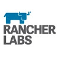
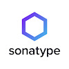
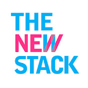
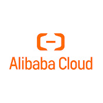

# Nubenetes: Awesome Kubernetes & Cloud 
A curated list of awesome references collected since 2018. Microservices architectures rely on DevOps practices, automation, CI/CD (Continuous Integration & Delivery), and API-focused designs.

[Nubenetes](https://nubenetes.com) is also available at [this other site](https://awesome-kubernetes.readthedocs.io/).

"I do not believe you can do today's job with yesterday's methods and be in business tomorrow" ([Horatio Nelson Jackson](https://en.wikipedia.org/wiki/Horatio_Nelson_Jackson))

  

---

## Motivation
- [microservices.io](https://microservices.io/)
- [cncf.io](https://www.cncf.io/)
    - [landscape.cncf.io](https://landscape.cncf.io/)
    - [Certified Kubernetes offerings](https://www.cncf.io/certification/software-conformance/)
    - [CNCF Reports](https://www.cncf.io/reports/)
        - [CNCF Survey Report 2019](https://www.cncf.io/wp-content/uploads/2020/03/CNCF_Survey_Report.pdf)
        - [CNCF Survey Report 2020](https://www.cncf.io/wp-content/uploads/2020/11/CNCF_Survey_Report_2020.pdf)
        - [CNCF Survey Report 2021](https://www.cncf.io/wp-content/uploads/2021/12/Q1-2021-State-of-Cloud-Native-development-FINAL.pdf) - [CNCF Publishes State of Cloud Native Development Report](https://www.infoq.com/news/2022/01/ -cncf-state-of-cloud-native) - [CNCF Sees Record Kubernetes and Container Adoption](https://www.cncf.io/announcements/2022/02/10/cncf-sees-record-kubernetes-and-container-adoption-in-2021-cloud-native-survey/)
- [State of DevOps Reports](https://puppet.com/resources/?refinementList%5Btype%5D%5B0%5D=Report&page=1&configure%5BhitsPerPage%5D=18)
    - [2020 State of DevOps Report](https://puppet.com/resources/report/2020-state-of-devops-report)
    - [2020 DevOps Salary Report](https://puppet.com/resources/report/2020-devops-salary-report)
    - [2021 State of DevOps Report: A decade of DevOps](https://puppet.com/resources/report/2021-state-of-devops-report)
    - [2021 Gartner Report Top Trends Infra & Operations](https://puppet.com/resources/report/gartner-report-top-trends-impacting-infrastructure-and-operations-for-2021)
- [CRI-O Lightweight Container Runtime for Kubernetes](https://cri-o.io/)
- [Open Container Initiative](https://www.opencontainers.org/)
- [agilemethodology.org](http://agilemethodology.org/)
- [agilemanifesto.org](http://agilemanifesto.org/)
- [12factor.net](https://12factor.net/) - [Are You 12-Factor Application Ready?](https://dzone.com/articles/are-you-12-factor-application-ready) - [12-factor app infographic](https://dzone.com/whitepapers/the-12-factor-app-infographic) - [An illustrated guide to 12 Factor Apps 🌟](https://www.redhat.com/architect/12-factor-app)
- [openpracticelibrary.com](https://openpracticelibrary.com/) - [Top 10 most visited pages](https://www.redhat.com/en/blog/top-10-most-used-open-practice-library-concepts)
- [roadmap.sh](https://roadmap.sh/) - [DevOps Roadmap](https://roadmap.sh/devops) - [Kubernetes Roadmap](https://roadmap.sh/kubernetes)
    - [roadmap.sh/ai: Generate roadmaps with AI](https://roadmap.sh/ai)
    - [roadmap.sh/terraform](https://roadmap.sh/terraform)
- [API Landscape](https://apilandscape.apiscene.io/)
- [Stack Overflow Annual Developer Survey](https://insights.stackoverflow.com/survey)
    - [2021](https://insights.stackoverflow.com/survey/2021#technology-most-loved-dreaded-and-wanted)
    - [2022 🌟](https://survey.stackoverflow.co/2022/) - [betterprogramming.pub](https://betterprogramming.pub/stack-overflow-2022-developer-survey-where-is-the-industry-heading-3cd4a0cd41f3)
- [Stack Overflow Collectives](https://stackoverflow.com/collectives) Communities for your favorite technologies
    - [Go Collective](https://stackoverflow.com/collectives/go)
    - [GitLab Collective](https://stackoverflow.com/collectives/gitlab)
    - [Google Cloud Collective](https://stackoverflow.com/collectives/google-cloud)
    - [AWS Collective](https://stackoverflow.com/collectives/aws)
    - [Azure Collective](https://stackoverflow.com/collectives/azure)
    - [CI/CD Collective](https://stackoverflow.com/collectives/ci-cd)
    - [WSO2 Collective](https://stackoverflow.com/collectives/wso2)
    - etc
- [Open Source Guides](https://opensource.guide/)
- [The Open Group: Making Standards Work](https://www.opengroup.org/) - [publications.opengroup.org](http://publications.opengroup.org/) - [The TOGAF® Standard, a standard of The Open Group](https://www.opengroup.org/togaf)
- [How Your Application Architecture Has Evolved 🌟](https://dzone.com/articles/how-your-application-architecture-evolved)
- [==Kubernetes magic is in enterprise standardization, not app portability==](https://www.techrepublic.com/article/kubernetes-magic-is-in-enterprise-standardization-not-app-portability/)
- [A new role to emerge: Kubernetes Manager (KubeMaster) 🌟](https://containerjournal.com/features/the-rise-of-the-kubemaster/)
- [An emerging Job: Kubernetes engineer 🌟](https://www.cncf.io/blog/2022/03/03/an-emerging-job-kubernetes-engineer/)
- [Google DORA Report: State of DevOps 2021 🌟](https://cloud.google.com/blog/products/devops-sre/announcing-dora-2021-accelerate-state-of-devops-report) How to accelerate DevOps - [summary 1](https://devops.com/google-dora-report-shows-modest-devops-gains/) - [summary 2](https://dzone.com/articles/googles-state-of-devops-2021-report-what-sres-need)
- [Top GitHub Users By Country](https://github.com/gayanvoice/top-github-users)
- [Red Hat automation glossary 🌟](https://www.redhat.com/en/blog/red-hat-automation-glossary)
- [The rise of the automation architect](https://www.redhat.com/sysadmin/automation-architects)
- [Automation is the future of cloud cost optimization](https://www.cncf.io/blog/2021/09/29/automation-is-the-future-of-cloud-cost-optimization/)
- [The Rise of Modern Day Kubernetes Operations](https://vmblog.com/archive/2021/10/07/the-rise-of-modern-day-kubernetes-operations.aspx)
- [The Evolution of Distributed Systems on Kubernetes](https://www.infoq.com/articles/distributed-systems-kubernetes/)
- [10 Cloud Deficiencies You Should Know](https://thenewstack.io/10-cloud-deficiencies-you-should-know/)
- [==How to Explain Kubernetes to a Business Team==](https://dzone.com/articles/how-to-explain-kubernetes-to-a-business-team)
- [==Pets vs. Cattle: The Future of Kubernetes in 2022==](https://traefik.io/blog/pets-vs-cattle-the-future-of-kubernetes-in-2022)
- [dok.community: DoKC Data on Kubernetes](https://dok.community)
- [A Kubernetes Documentary Shares Google’s Open Source Story](https://thenewstack.io/a-kubernetes-documentary-shares-googles-open-source-story/)
- [==Infrastructure as Code in DevOps==](https://alpacked.io/blog/infrastructure-as-code-for-devops/)
- [Kubernetes at Scale without GitOps Is a Bad Idea](https://thenewstack.io/kubernetes-at-scale-without-gitops-is-a-bad-idea/)
- [dzone.com/trendreports](https://dzone.com/trendreports)
- [kube.events](https://kube.events) A curated list of Kubernetes-related events such as meetups, conferences, training & webinars that you will find interesting to attend
- [The future of Kubernetes – and why developers should look beyond Kubernetes in 2022](https://www.eficode.com/blog/the-future-of-kubernetes-and-why-developers-should-look-beyond-kubernetes-in-2022)
- [cloudtechtwitter.com: Introduction to Kubernetes 🌟](https://www.cloudtechtwitter.com/2022/05/dont-miss-next-article-be-first-to-be.html)
- [GitHub Guides](https://github.com/readme/guides/)
- [learnk8s.io/news](https://learnk8s.io/news) How do you keep up with Kubernetes? If you are looking for curated Kubernetes news, we have you covered on:
    - Core Kubernetes
    - Security
    - Architecture & development
    - Job opportunities
    - K3s
    - Events
- [thenewstack.io: What We Learned from Enabling Developer Self-Service 🌟](https://thenewstack.io/what-we-learned-from-enabling-developer-self-service/)
- [dzone: Kubernetes in the Enterprise - Trend Report](https://dzone.com/trendreports/kubernetes-in-the-enterprise-1)
- [Struggling with IT Staff Leaving? Try Infrastructure as Code 🌟](https://thenewstack.io/struggling-with-it-staff-leaving-try-infrastructure-as-code/)
- [learnk8s.io/learn-kubernetes-weekly 🌟](https://learnk8s.io/learn-kubernetes-weekly)
- [infoworld.com: Cloud architects are afraid of automation](https://www.infoworld.com/article/3679250/cloud-architects-are-afraid-of-automation.html) Automation is one of the greatest gifts to cloud architecture, operations, security, and finops. Yet, many architects still are reluctant to use it. What's so scary?
- [infoworld.com: The biggest obstacle to cloud is people](https://www.infoworld.com/article/3653371/the-biggest-obstacle-to-cloud-is-people.html) People and culture prevent many businesses from capturing the true value of cloud computing. Transforming organizational culture and revamping KPIs can help.
- [Droogans/How To Write Unmaintainable Code](https://github.com/Droogans/unmaintainable-code) Ensure a job for life ;-)
- [dzone.com: DevOps vs. SRE vs. Platform Engineer vs. Cloud Engineer](https://dzone.com/articles/devops-vs-sre-vs-platform-engineer-vs-cloud-engine)
- [github.com/metaleapca: metaleap-devops-in-k8s.pdf](https://github.com/metaleapca/metaleap-devops-in-k8s/blob/main/metaleap-devops-in-k8s.pdf)
- [github.com/metaleapca: metaleap-k8s-troubleshooting.pdf](https://github.com/metaleapca/metaleap-k8s-troubleshooting/blob/main/metaleap-k8s-troubleshooting.pdf)
- [devops.com: Declarative Compliance With Policy-as-Code and GitOps 🌟](https://devops.com/declarative-compliance-with-policy-as-code-and-gitops/)
- [serverlessland.com: EDA VISUALS](https://serverlessland.com/event-driven-architecture/visuals) Small bite sized visuals about event-driven architectures
- [dzone: The Essentials of GitOps 🌟](https://dzone.com/refcardz/the-essentials-of-gitops)
- [dzone.com: REST vs. Messaging for Microservices](https://dzone.com/articles/rest-vs-messaging-for-microservices)
- [The Next Kubernetes Management Frontier: Automation](https://thenewstack.io/the-next-kubernetes-management-frontier-automation/) Automation Is No Longer a “Nice to Have”
- [redis.com: Microservice Architecture Key Concepts](https://redis.com/blog/microservice-architecture-key-concepts/)
- [thenewstack.io: Kubernetes Evolution: From Microservices to Batch Processing Powerhouse 🌟](https://thenewstack.io/kubernetes-evolution-from-microservices-to-batch-processing-powerhouse/)
- [Software Deployment Best Practices in 2023](https://dzone.com/articles/software-deployment-best-practices) Explore the best software development practices that are the proven catalysts for innovation and growth.
- [==DevOps-Books== 🌟](https://github.com/DevOps-Projects-Ideas/DevOps-Books)
- [community.aws/kubernetes](https://community.aws/kubernetes) Kubernetes at AWS! Welcome to the hub for all things Kubernetes at AWS.
- [AWS Skill Builder](https://explore.skillbuilder.aws/learn)
- [cloudcatalog.dev](https://www.cloudcatalog.dev) Documentation tool for AWS Architectures. CloudCatalog is an Open Source project that helps you document your AWS resources, services and assign owners.
- [platformengineering.org](https://platformengineering.org) The global home for Platform Engineers
- [Azure DevOps vs GitHub Actions: Which is the best CI/CD tool?](https://datascientest.com/en/azure-devops-vs-github-actions-which-is-the-best-ci-cd-tool)
- [Redefining Virtualization in the VMware Acquisition Era](https://chaoslever.com/cl-20240118/)
- [Do Kubernetes Certs Prepare You For Real-World Production?](https://packetpushers.net/podcasts/kubernetes-unpacked/ku046-do-kubernetes-certs-prepare-you-for-real-world-production/)
- [Why I Don’t Consider Your Certifications During An Interview](https://madokai.medium.com/why-i-dont-consider-your-certifications-during-an-interview-fe4b62cf6f8c)
- [dagger.io](https://dagger.io) CI/CD as Code that Runs Anywhere.
- [Bus factor](https://en.wikipedia.org/wiki/Bus_factor) The bus factor is a measurement of the risk resulting from information and capabilities not being shared among team members, derived from the phrase "in case they get hit by a bus".
- [seal.io: Open Source Platform Engineering for Dev & Ops](https://www.seal.io/)
- [==k8sgpt.ai==](https://k8sgpt.ai/) K8sGPT is a tool for scanning your kubernetes clusters, diagnosing and triaging issues in simple english. It has SRE experience codified into its analyzers and helps to pull out the most relevant information to enrich it with AI.
- [github.com/topics/gitops](https://github.com/topics/gitops)
- [Dolt: Git for Data](https://github.com/dolthub/dolt)
- [serverlesshorrors.com](https://serverlesshorrors.com/)
- [glasskube.dev package manager for k8s 🌟](https://glasskube.dev/)
- [github.com/infrahouse/infrahouse-toolkit](https://github.com/infrahouse/infrahouse-toolkit) A collection of tools for building infrastructure
- [github.com/taubyte/tau](https://github.com/taubyte/tau) Open Source Git-Native CDN PaaS
- [==mattias.engineer/courses== 🌟](https://mattias.engineer/courses/) HashiCorp Terraform, HashiCorp Vault, Kubernetes CKAD
- [The hater’s guide to Kubernetes](https://paulbutler.org/2024/the-haters-guide-to-kubernetes/)
- [github.com/cyclops-ui/cyclops](https://github.com/cyclops-ui/cyclops) Developer Friendly Kubernetes
- [k8z.dev](https://k8z.dev/) A lightweight, modern mobile and desktop application for manage kubernetes
- [Kube-score](https://github.com/zegl/kube-score)
- [testkube.io 🌟](https://testkube.io)
- [wcurl](https://github.com/curl/wcurl) A simple wrapper around curl to easily download files
- [NetBox IPAM 🌟](https://github.com/netbox-community/netbox)
    - [NetBox Labs](https://netboxlabs.com/) is the commercial steward of NetBox. We are on a mission to make it easier to build and manage complex networks.
    - [Netbox Ansible Modules](https://docs.ansible.com/ansible/latest/collections/netbox/netbox/index.html)
- [youtube: GitOps Guide to the Galaxy](https://www.youtube.com/playlist?list=PLbMP1JcGBmSGKO8UreWpOBOhCqilejhtd)
- [devopswithkubernetes.com](https://devopswithkubernetes.com/) Introductory course to Kubernetes with K3s and GKE
- [Gardener](https://github.com/gardener/gardener) Deliver fully-managed clusters at scale everywhere with your own Kubernetes-as-a-Service
- [collabnix.github.io/kubetools 🌟](https://collabnix.github.io/kubetools/) A Curated List of Kubernetes Tools
- [OpenShift AI Examples](https://github.com/CastawayEGR/openshift-ai-examples)
- [Jenkins Tutorials by CloudBeesTV 🌟](https://youtube.com/playlist?list=PLvBBnHmZuNQJeznYL2F-MpZYBUeLIXYEe&si=GBJtqv36O8bslj9z)
- [kui.tools](https://kui.tools) Kui: CLI-driven Graphics for Kubernetes

## Introduction
- [Microservice Architecture. From Java EE To Cloud Native. Openshift VS Kubernetes](introduction.md)
- [Microservices FAQ & Kubernetes Native](faq.md)
## SRE Site Reliability Engineering
- [Site Reliability Engineering (SRE)](sre.md)
- [Networking](networking.md)
- [FinOps - Cloud Financial Management](finops.md)
- [Chaos Engineering](chaos-engineering.md)
## DevOps
- [==DevOps==](devops.md)
- [==GitOps==](gitops.md)
- [MLOps](mlops.md)
- [Cheat Sheets 🌟](cheatsheets.md)
## DevSecOps and Security
- [DevSecOps and Security. Container Security](devsecops.md)
- [Security Policy as Code](securityascode.md)
- [OAuth2](oauth.md)
## NoOps aka Serverless
- [NoOps](noops.md)
- [Serverless Architectures & Frameworks. OpenFaaS, Knative & Kubeless](serverless.md)
## Docker
- [Docker](docker.md)
## Kubernetes
- [==Kubernetes==](kubernetes.md)
    - [==Kubernetes Tutorials==](kubernetes-tutorials.md)
    - [Kubernetes Plugins, Tools, Extensions and Projects 🌟](kubernetes-tools.md)
    - [kubectl Commands](kubectl-commands.md)
    - [Kubernetes Networking](kubernetes-networking.md)
    - [Kubernetes Monitoring and Logging](kubernetes-monitoring.md)
    - [Kubernetes Security](kubernetes-security.md)
    - [Kubernetes Storage](kubernetes-storage.md)
    - [Kubernetes Backup and Migrations](kubernetes-backup-migrations.md)
    - [Kubernetes Autoscaling](kubernetes-autoscaling.md)
    - [Kubernetes Operators and Controllers](kubernetes-operators-controllers.md)
    - [Kubernetes Based Development](kubernetes-based-devel.md)
    - [Kubernetes On Premise](kubernetes-on-premise.md)
    - [==Managed kubernetes in public clouds==](managed-kubernetes-in-public-cloud.md)
    - [Kubernetes Troubleshooting](kubernetes-troubleshooting.md)
    - [Kubernetes Releases](kubernetes-releases.md)
    - [Kubernetes Newsletters](kubernetes-newsletters.md)
- [Kubernetes Distributions & Installers](matrix-table.md)
- [Kubernetes Big Data](kubernetes-bigdata.md)
- [Kubernetes Alternatives](kubernetes-alternatives.md)
## Red Hat OpenShift
- [OpenShift](openshift.md)
- [OCP 3](ocp3.md)
- [OCP 4](ocp4.md)
## SUSE Rancher
- [Rancher - Enterprise management for Kubernetes](rancher.md)
## Software Delivery Pipeline
- [CI/CD - Continuous Integration & Continuous Delivery](cicd.md)
- [Git & Git Patterns. Trunk Devel, Git Flow & Feature Flags. Merge BOTs 🌟](git.md)
### Jenkins & CloudBees
- [Jenkins & CloudBees 😀](jenkins.md)
- [Performance testing with Jenkins, JMeter, Gatling, Azure Load Testing, etc](performance-testing-with-jenkins-and-jmeter.md)
### OpenShift Pipelines
- [OpenShift Pipelines with Jenkins, Tekton and more...](openshift-pipelines.md)
### DevOps Tools aka Toolchain. Jenkins Alternatives. Cloud Native CI/CD Tools
- [DevOps Tools](devops-tools.md)
- [Jenkins Alternatives for Continuous Integration & Deployment 🌟](jenkins-alternatives.md)
- [Argo - Declarative GitOps for Kubernetes 🌟](argo.md)
- [Flux CD - The GitOps Operator for Kubernetes 🌟](flux.md)
- [Tekton - Cloud Native CI/CD](tekton.md)
- [Keptn](keptn.md)
- [Container Runtimes/Managers & Base Images. Podman, Buildah & Skopeo](container-managers.md)
- [Maven, Gradle & SDKMAN](maven-gradle.md)
- [SonarQube](sonarqube.md)
- [Docker Registries. Quay, Nexus, JFrog Artifactory, Harbor and more](registries.md)
- [Linux & SSH](linux.md)
- [MkDocs & GitHub Pages](mkdocs.md)
### Web Servers, Reverse Proxies, Java Runtimes & Caching Solutions
- [Web Servers & Reverse Proxies: Apache, Nginx, HAProxy, Traefik and more](web-servers.md)
- [Java EE/Jakarta EE and MicroProfile Runtimes: Payara, JBoss EAP, WebSphere Liberty, WildFly and more](java_app_servers.md)
- [Embedded Servlet Containers in SpringBoot: Jetty, Tomcat, Undertow and more](embedded-servlet-containers.md)
- [Caching Solutions](caching.md)
## Monitoring and Performance. Prometheus, Grafana, APMs and more
- [Monitoring and Performance](monitoring.md)
- [Prometheus 🌟](prometheus.md)
- [Grafana](grafana.md)
## Infrastructure Provisioning. Infra Management Tools
- [IaC Infrastructure as Code](iac.md)
- [==Terraform & Packer.Kubernetes Boilerplates==](terraform.md)
- [Pulumi](pulumi.md)
- [Crossplane](crossplane.md) A Kubernetes Control Plane to Roll Your Own PaaS
- [Cloud Architecture Diagram Tools](cloud-arch-diagrams.md)
- [Cloud Asset Inventory](cloud-asset-inventory.md)

## Configuration Management
- [==Ansible==](ansible.md)
- [Helm Kubernetes Tool 🌟](helm.md)
- [Kustomize - Template-Free Kubernetes Configuration Customization](kustomize.md)
- [StackStorm](stackstorm.md)
- [Chef](chef.md)
- [CI/CD Kubernetes Plugins](cicd-kubernetes-plugins.md)
- [Client Libraries for Kubernetes: Go client, Python, Fabric8, JKube & Java Operator SDK](kubernetes-client-libraries.md)
- [Database Version Control. Liquibase, Flyway and PlanetScale](liquibase.md)
- [redhat-cop: Openshift Applier](https://dzone.com/articles/gitops-with-openshift-applier)
- [YAML and JSON 🌟](yaml.md)
## Databases on Kubernetes
- [Relational Databases and Database DevOps 🌟](databases.md)
- [Crunchy Data PostgreSQL Operator](crunchydata.md)
- [NoSQL Databases](nosql.md)
## Cloud Based Integration & Messaging. Data Processing & Streaming (aka Data Pipeline)
- [Data Pipeline 🌟](message-queue.md)
## Service Mesh
- [Service Mesh](servicemesh.md)
- [Istio](istio.md)
## Demos and Boilerplates
- [==Demos, Boilerplates & Screencasts==](demos.md) OpenShift, Kubernetes, Jenkins Pipelines with JCasC and more
## Cloud
- [Public Cloud Solutions](public-cloud-solutions.md)
- [Private Cloud Solutions](private-cloud-solutions.md)
- [Edge Computing](edge-computing.md)
- [==AWS==](aws.md)
    - [==repost.aws==](https://repost.aws)
    - [AWS Miscellaneous](aws-miscellaneous.md)
    - [==AWS Architecture and Best Practices==](aws-architecture.md)
    - [AWS Networking](aws-networking.md)
    - [AWS Databases](aws-databases.md)
    - [AWS Storage](aws-storage.md)
    - [AWS Security](aws-security.md)
    - [AWS Monitoring](aws-monitoring.md)
    - [AWS IaC](aws-iac.md)
    - [AWS Tools Scripts](aws-tools-scripts.md)
    - [AWS Messaging](aws-messaging.md)
    - [AWS Data](aws-data.md)
    - [AWS DevOps](aws-devops.md)
    - [AWS Serverless](aws-serverless.md)
    - [AWS Pricing](aws-pricing.md)
    - [AWS Containers](aws-containers.md)
    - [AWS Backup and Migrations](aws-backup.md)
    - [AWS Training and Certification](aws-training.md)
    - [AWS New Features](aws-newfeatures.md)
    - [AWS Spain](aws-spain.md)
- [==Microsoft Azure==](azure.md)
- [==Google Cloud Platform==](GoogleCloudPlatform.md)
- [IBM & IBM Cloud](ibm_cloud.md)
- [Oracle Cloud](oraclecloud.md)
- [Digital Ocean](digitalocean.md)
- [Cloudflare](cloudflare.md)
- [Scaleway](scaleway.md)
- [Linode](https://www.linode.com/)
- [Alibaba](https://www.alibabacloud.com/)
- [Symbiosis](https://symbiosis.host/)
- [Gaia-X.eu](https://www.gaia-x.eu)
## APIs with SOAP, REST and gRPC
- [APIs with SOAP, REST and gRPC 🌟](api.md)
- [Swagger code generator for REST APIs](swagger-code-generator-for-rest-apis.md)
- [API Test Automation with Postman and REST Assured](postman.md)
- [API Marketplaces. API Management with API Gateways & Developer Portals 🌟](developerportals.md)
## Development & Frameworks
- [Websites for web developers](devel-sites.md)
- [Angular](angular.md)
- [Document Object Model (DOM)](dom.md)
- [Golang](golang.md)
- [JavaScript - node.js & npm](javascript.md)
- [Python - Django & Flask](python.md)
- [React](react.md)
- [Low Code and No Code](lowcode-nocode.md)
- [Web3](web3.md)
### Microsoft
- [Microsoft .NET](dotnet.md)
- [Microsoft Xamarin](xamarin.md)
### Java
- [Java & Open Source Microservices Frameworks. SpringBoot, MicroProfile, Quarkus and more](java_frameworks.md)
- [Java Memory Management & Java Performance Optimization](java-and-java-performance-optimization.md)
- [Java Parameters Matrix Table](jvm-parameters-matrix-table.md)
### Dev Environment
- [Visual Studio Code 🌟](visual-studio.md)
- [WSL: Linux Dev Environment on Windows](linux-dev-env.md)
- [Scaffolding Tools](scaffolding.md)
- [Chrome & Firefox DevTools. HTTP Protocols & WebSockets](ChromeDevTools.md)
## QA/TestOps - Continuous Testing
- [QA](qa.md)
- [TestOps and Continuous Testing](testops.md)
- [Test Automation Frameworks and Behavior Driven Development. Selenium, Cypress, Cucumber, Appium and more](test-automation-frameworks.md)
## AI
- [AI](ai.md)
- [MLOps](mlops.md)
- [ChatGPT](chatgpt.md)
## Project Management Methodology
- [Project Management Methodology](project-management-methodology.md)
- [Project Management Tools](project-management-tools.md)
- [Appointment Scheduling](appointment-scheduling.md)
- [Work From Home](workfromhome.md)
## More References
- [Other Awesome Lists 🌟](other-awesome-lists.md)
- [Interview Questions](interview-questions.md)
- [Forums and Communities](newsfeeds.md)
- [E-Learning](elearning.md)
- [Digital Money](digital-money.md)
## Hiring and Freelancing
- [Recruitment](recruitment.md)
- [Human Resources](hr.md)
- [Freelancing](freelancing.md)
- [Remote Tech Jobs](remote-tech-jobs.md)
## Customer Success Stories
- [Customer Success Stories](customer.md)

---

[{: style="width:7%"}](https://www.youtube.com/c/DockerIo) [{: style="width:7%"}](https://www.youtube.com/c/cloudnativefdn) [{: style="width:7%"}](https://www.youtube.com/kubernetescommunity) [{: style="width:7%"}](https://www.youtube.com/c/redhat) [{: style="width:7%"}](https://www.youtube.com/c/OpenShift) [{: style="width:7%"}](https://www.youtube.com/c/Rancher) [{: style="width:7%"}](https://www.youtube.com/c/CloudBeesTV) [{: style="width:7%"}](https://www.youtube.com/c/jenkinscicd) [{: style="width:7%"}](https://www.youtube.com/channel/UCN2kblPjXKMcjjVYmwvquvg) [{: style="width:7%"}](https://www.youtube.com/channel/UCcxQbw8kT1-FRhFhO2QCetg) [{: style="width:7%"}](https://www.youtube.com/c/VMwareTanzu) 
[{: style="width:7%"}](https://www.youtube.com/c/IBMTechnology) [{: style="width:7%"}](https://www.youtube.com/c/amazonwebservices) [{: style="width:7%"}](https://www.youtube.com/user/googlecloudplatform/) [{: style="width:7%"}](https://www.youtube.com/c/MicrosoftAzure) [{: style="width:7%"}](https://www.youtube.com/c/OracleCloudInfrastructure) [{: style="width:7%"}](https://www.youtube.com/c/Digitalocean) [{: style="width:7%"}](https://www.youtube.com/cloudflare) [{: style="width:7%"}](https://www.youtube.com/c/Scaleway-Cloud) [{: style="width:7%"}](https://www.youtube.com/c/OpenStackFoundation) [{: style="width:7%"}](https://www.youtube.com/c/HashiCorp) [{: style="width:7%"}](https://www.youtube.com/c/PulumiTV)  
[{: style="width:7%"}](https://www.youtube.com/c/dzone/) [{: style="width:7%"}](https://www.youtube.com/c/PrometheusIo) [{: style="width:7%"}](https://www.youtube.com/c/Grafana) [{: style="width:7%"}](https://www.youtube.com/c/Istio) [{: style="width:7%"}](https://www.youtube.com/c/Elastic) [{: style="width:7%"}](https://www.youtube.com/c/dynatrace) [{: style="width:7%"}](https://www.youtube.com/c/appdynamics) [{: style="width:7%"}](https://www.youtube.com/c/NewRelicInc) [{: style="width:7%"}](https://www.youtube.com/channel/UC8uN3yhpeBeerGNwDiQbcgw) [{: style="width:7%"}](https://www.youtube.com/c/WeaveWorksInc) [{: style="width:7%"}](https://www.youtube.com/c/LambdaTest) 
[{: style="width:7%"}](https://www.youtube.com/c/Atlassian) [{: style="width:7%"}](https://www.youtube.com/c/Code) [{: style="width:7%"}](https://www.youtube.com/c/GitHub) [{: style="width:7%"}](https://www.youtube.com/c/Gitlab) [{: style="width:7%"}](https://www.youtube.com/c/Gitkraken) [{: style="width:7%"}](https://www.youtube.com/c/RocketChatApp) [{: style="width:7%"}](https://www.youtube.com/c/Slackhq) [{: style="width:7%"}](https://www.youtube.com/c/MattermostHQ) [{: style="width:7%"}](https://www.youtube.com/c/microsoft365) [{: style="width:7%"}](https://www.youtube.com/c/OpenProjectCommunity) [{: style="width:7%"}](https://www.youtube.com/c/Tetrate) 
[{: style="width:7%"}](https://www.youtube.com/c/RedHatDevelopers) [{: style="width:7%"}](https://www.youtube.com/user/SpringSourceDev) [{: style="width:7%"}](https://www.youtube.com/c/Quarkusio) [{: style="width:7%"}](https://www.youtube.com/c/Lightbend-TV) [{: style="width:7%"}](https://www.youtube.com/c/postman) [{: style="width:7%"}](https://www.youtube.com/c/Smartbear) [{: style="width:7%"}](https://www.youtube.com/c/JFrogInc) [{: style="width:7%"}](https://www.youtube.com/c/Sonatypeinc) [{: style="width:7%"}](https://www.youtube.com/channel/UCS5-gTYteN9rnFd98YxYtrA) [{: style="width:7%"}](https://www.youtube.com/c/GoogleChromeDevelopers) [{: style="width:7%"}](https://www.youtube.com/c/MozillaDeveloper) 
[{: style="width:7%"}](https://www.youtube.com/c/CrunchyDataPostgres) [{: style="width:7%"}](https://www.youtube.com/channel/UC5qMsRjObu685rTBq0PJX8w) [{: style="width:7%"}](https://www.youtube.com/c/cockroachdb) [{: style="width:7%"}](https://www.youtube.com/c/MongoDBofficial) [{: style="width:7%"}](https://www.youtube.com/c/Redisinc) [{: style="width:7%"}](https://www.youtube.com/c/Confluent) [{: style="width:7%"}](https://www.youtube.com/channel/UCud7fErZAyMC6lHT_cWZNfA) [{: style="width:7%"}](https://www.youtube.com/channel/UC3ywadaAUQ1FI4YsHZ8wa0g) [{: style="width:7%"}](https://www.youtube.com/channel/UCm63IQg81KP9vXRWSHQpu1w) [{: style="width:7%"}](https://www.youtube.com/channel/UCt7N400Z8gB_3yKq1qrjP2w) [{: style="width:7%"}](https://www.youtube.com/c/Portworx) 
[{: style="width:7%"}](https://www.youtube.com/c/Cloudacademy) [{: style="width:7%"}](https://www.youtube.com/c/AcloudGuru) [{: style="width:7%"}](https://www.youtube.com/c/Devopsdotcom) [{: style="width:7%"}](https://www.youtube.com/c/XebiaLabs) [{: style="width:7%"}](https://www.youtube.com/c/Devopslibrary) [{: style="width:7%"}](https://www.youtube.com/c/codecademy) [{: style="width:7%"}](https://www.youtube.com/user/coursera) [{: style="width:7%"}](https://www.youtube.com/c/Academind) [{: style="width:7%"}](https://www.youtube.com/c/guru99comm) [{: style="width:7%"}](https://www.youtube.com/c/Intellipaat) [{: style="width:7%"}](https://www.youtube.com/channel/UCv9MUffHWyo2GgLIDLVu0KQ) 
[{: style="width:7%"}](https://www.youtube.com/c/Thetips4you) [{: style="width:7%"}](https://www.youtube.com/channel/UC57acx8sCmE7uFHfVMvIlNg) [{: style="width:7%"}](https://www.youtube.com/c/NTFAQGuy) [{: style="width:7%"}](https://www.youtube.com/channel/UCorFV-WGnajyfNu4zPI0AAA) [{: style="width:7%"}](https://www.youtube.com/c/AppsCodeInc) [{: style="width:7%"}](https://www.youtube.com/c/DevOpsToolkit) [{: style="width:7%"}](https://www.youtube.com/c/AnsiblePilot) [{: style="width:7%"}](https://www.youtube.com/CodelyTV) [{: style="width:7%"}](https://www.youtube.com/c/PeladoNerd) [{: style="width:7%"}](https://www.youtube.com/c/HolaMundoDev) [{: style="width:7%"}](https://www.youtube.com/c/JavierGarz%C3%A1s/) 
[{: style="width:7%"}](https://www.youtube.com/c/LondonIAC) [{: style="width:7%"}](https://www.youtube.com/c/TechWorldwithNana) [{: style="width:7%"}](https://www.youtube.com/c/Honeypotio) [{: style="width:7%"}](https://www.youtube.com/c/AliSpittelDev) [{: style="width:7%"}](https://www.youtube.com/c/ThomasMaurerCloud) [{: style="width:7%"}](https://www.youtube.com/c/Freecodecamp) [{: style="width:7%"}](https://www.youtube.com/c/TheNewStack) [{: style="width:7%"}](https://www.youtube.com/channel/UCOvYmppcbOPm1viN6ust3lA) [{: style="width:7%"}](https://www.youtube.com/channel/UCoZxt-YMhGHb20ZkvcCc5KA) [{: style="width:7%"}](https://www.youtube.com/c/ContainerDays) [{: style="width:7%"}](https://www.youtube.com/c/priyankavergadia) 
[{: style="width:7%"}](https://www.youtube.com/c/ContinuousDeliveryFoundation) [{: style="width:7%"}](https://www.youtube.com/c/TinaHuang1) [{: style="width:7%"}](https://www.youtube.com/c/AzureDevOps) [{: style="width:7%"}](https://www.youtube.com/channel/UC2Pk9GcHhlVV0R9CQIU6gLw) [{: style="width:7%"}](https://www.youtube.com/c/AlibabaCloud) [{: style="width:7%"}](https://www.youtube.com/c/linode) [{: style="width:7%"}](https://www.youtube.com/channel/UCB5WMc2FfrxKzfd7XIODoMw) [{: style="width:7%"}](https://www.youtube.com/c/MadeByGPS) [{: style="width:7%"}](https://www.youtube.com/c/keptn) [{: style="width:7%"}](https://www.youtube.com/c/AnaisUrlichs) [{: style="width:7%"}](https://www.youtube.com/c/TheDigitalLifeTech) 
[{: style="width:7%"}](https://www.youtube.com/@azure-terraformer) [{: style="width:7%"}](https://www.youtube.com/@NedintheCloud) [{: style="width:7%"}](https://www.youtube.com/@NetBoxLabs) [{: style="width:7%"}](https://www.youtube.com/@techwithhelen) [{: style="width:7%"}](https://www.youtube.com/@ByteByteGo) [{: style="width:7%"}](https://www.youtube.com/@DotCSV) [{: style="width:7%"}](https://www.youtube.com/@midulive)

??? note "Top Videos & Clips - Click to expand!"

    

    <iframe width="560" height="315" src="https://www.youtube.com/embed/BE77h7dmoQU" title="YouTube video player" frameborder="0" allow="accelerometer; autoplay; clipboard-write; encrypted-media; gyroscope; picture-in-picture" allowfullscreen></iframe>
    <iframe width="560" height="315" src="https://www.youtube.com/embed/318elIq37PE" title="YouTube video player" frameborder="0" allow="accelerometer; autoplay; clipboard-write; encrypted-media; gyroscope; picture-in-picture" allowfullscreen></iframe>
    <iframe width="560" height="315" src="https://www.youtube.com/embed/HlAXp0-M6SY?clip=UgkxWpu3QFPEDZBuMgy_Xq4mBR--uLA-3CSZ&amp;clipt=EMSoKxiG3C4" title="YouTube video player" frameborder="0" allow="accelerometer; autoplay; clipboard-write; encrypted-media; gyroscope; picture-in-picture" allowfullscreen></iframe>
    <iframe width="560" height="315" src="https://www.youtube.com/embed/rT4fJNbfe14" title="YouTube video player" frameborder="0" allow="accelerometer; autoplay; clipboard-write; encrypted-media; gyroscope; picture-in-picture; web-share" allowfullscreen></iframe>
    <iframe width="560" height="315" src="https://www.youtube.com/embed/FUu4kMc0PL8?clip=UgkxFMdlFKBQze7NVVd7q2nIwBYWkeaKeoX8&amp;clipt=EIzBzwIY1fnSAg" title="YouTube video player" frameborder="0" allow="accelerometer; autoplay; clipboard-write; encrypted-media; gyroscope; picture-in-picture" allowfullscreen></iframe>
    <iframe width="560" height="315" src="https://www.youtube.com/embed/FUu4kMc0PL8?clip=UgkxLbUzIJtyeKPi66qAvxxRlGbofYp_Gr8B&amp;clipt=EIDy0gIY4MbWAg" title="YouTube video player" frameborder="0" allow="accelerometer; autoplay; clipboard-write; encrypted-media; gyroscope; picture-in-picture" allowfullscreen></iframe>
    <iframe width="560" height="315" src="https://www.youtube.com/embed/UmbjwSK9b3I?clip=UgkxRGuBMDAVDqKckQ1lhk-9U2jLBhBIBI5l&amp;clipt=EP2dHhjd8iE" title="YouTube video player" frameborder="0" allow="accelerometer; autoplay; clipboard-write; encrypted-media; gyroscope; picture-in-picture" allowfullscreen></iframe>
    <iframe width="560" height="315" src="https://www.youtube.com/embed/ghzsBm8vOms" title="YouTube video player" frameborder="0" allow="accelerometer; autoplay; clipboard-write; encrypted-media; gyroscope; picture-in-picture; web-share" allowfullscreen></iframe>
    <iframe width="560" height="315" src="https://www.youtube.com/embed/rkXGSLf-rVQ?si=Ho8Zzxbrecn7Yncb" title="YouTube video player" frameborder="0" allow="accelerometer; autoplay; clipboard-write; encrypted-media; gyroscope; picture-in-picture; web-share" allowfullscreen></iframe>
    <iframe width="560" height="315" src="https://www.youtube.com/embed/IFUPG9KCJ4E?si=KMEXeVlcKTp87-Ja" title="YouTube video player" frameborder="0" allow="accelerometer; autoplay; clipboard-write; encrypted-media; gyroscope; picture-in-picture; web-share" allowfullscreen></iframe>
    <iframe width="560" height="315" src="https://www.youtube.com/embed/PxyyY7TsCqs?si=kzCRojDteESqork1" title="YouTube video player" frameborder="0" allow="accelerometer; autoplay; clipboard-write; encrypted-media; gyroscope; picture-in-picture; web-share" allowfullscreen></iframe>
    <iframe width="560" height="315" src="https://www.youtube.com/embed/I8Qh-TafMvQ?si=1A2-kmq6mV-S-03c" title="YouTube video player" frameborder="0" allow="accelerometer; autoplay; clipboard-write; encrypted-media; gyroscope; picture-in-picture; web-share" allowfullscreen></iframe>
    <iframe width="560" height="315" src="https://www.youtube.com/embed/V7PSnH8YnTk?si=6Mq4wjpipTLwUvYe" title="YouTube video player" frameborder="0" allow="accelerometer; autoplay; clipboard-write;
    encrypted-media; gyroscope; picture-in-picture; web-share" allowfullscreen></iframe>
    <iframe width="560" height="315" src="https://www.youtube.com/embed/1Fl25dR01pw?si=bJlQozIfT3J4rhN3" title="YouTube video player" frameborder="0" allow="accelerometer; autoplay; clipboard-write; encrypted-media; gyroscope; picture-in-picture; web-share" allowfullscreen></iframe>
    <iframe width="560" height="315" src="https://www.youtube.com/embed/L8eJh1sfc1U?si=y546MyZpRe-thoad" title="YouTube video player" frameborder="0" allow="accelerometer; autoplay; clipboard-write; encrypted-media; gyroscope; picture-in-picture; web-share" allowfullscreen></iframe>
    <iframe width="560" height="315" src="https://www.youtube.com/embed/U_IFGpJDbeU?si=XzHSGU9dTH-1_0EW" title="YouTube video player" frameborder="0" allow="accelerometer; autoplay; clipboard-write; encrypted-media; gyroscope; picture-in-picture; web-share" allowfullscreen></iframe>
    <iframe width="560" height="315" src="https://www.youtube.com/embed/8g4qLzkpjeE?si=xcfl3ugsMGZ8Kthg" title="YouTube video player" frameborder="0" allow="accelerometer; autoplay; clipboard-write; encrypted-media; gyroscope; picture-in-picture; web-share" allowfullscreen></iframe>
    <iframe width="560" height="315" src="https://www.youtube.com/embed/nrhxNNH5lt0?si=U5h1mbkbF6ZEOvlj" title="YouTube video player" frameborder="0" allow="accelerometer; autoplay; clipboard-write; encrypted-media; gyroscope; picture-in-picture; web-share" allowfullscreen></iframe>
    <iframe width="560" height="315" src="https://www.youtube.com/embed/cdZZpaB2kDM?clip=UgkxWAPHZbVaNZzk9pi0lMu6k5ABLuMHBtRL&amp;clipt=EK2rfRjW9YAB" title="YouTube video player" frameborder="0" allow="accelerometer; autoplay; clipboard-write; encrypted-media; gyroscope; picture-in-picture" allowfullscreen></iframe>
    <iframe width="560" height="315" src="https://www.youtube.com/embed/aZ5EsdnpLMI?si=ESsNnVwE8IdWSiWZ" title="YouTube video player" frameborder="0" allow="accelerometer; autoplay; clipboard-write; encrypted-media; gyroscope; picture-in-picture; web-share" allowfullscreen></iframe>
    <iframe width="560" height="315" src="https://www.youtube.com/embed/uQz0TpyJbE8?si=Ys-bXCWcoG-nDU1h" title="YouTube video player" frameborder="0" allow="accelerometer; autoplay; clipboard-write; encrypted-media; gyroscope; picture-in-picture; web-share" allowfullscreen></iframe>
    <iframe width="560" height="315" src="https://www.youtube.com/embed/hAwtrJlBVJY?si=bnyptzNFx4jzOiEj" title="YouTube video player" frameborder="0" allow="accelerometer; autoplay; clipboard-write; encrypted-media; gyroscope; picture-in-picture; web-share" allowfullscreen></iframe>
    <iframe width="560" height="315" src="https://www.youtube.com/embed/Hc8emNr2igU?si=kehLRUpOAvyK_Bku" title="YouTube video player" frameborder="0" allow="accelerometer; autoplay; clipboard-write; encrypted-media; gyroscope; picture-in-picture; web-share" referrerpolicy="strict-origin-when-cross-origin" allowfullscreen></iframe>
    <iframe width="560" height="315" src="https://www.youtube.com/embed/videoseries?si=zdATyq_E2wXN7AC6&amp;list=PLbMP1JcGBmSGKO8UreWpOBOhCqilejhtd" title="YouTube video player" frameborder="0" allow="accelerometer; autoplay; clipboard-write; encrypted-media; gyroscope; picture-in-picture; web-share" referrerpolicy="strict-origin-when-cross-origin" allowfullscreen></iframe>
    <iframe width="560" height="315" src="https://www.youtube.com/embed/videoseries?si=GBJtqv36O8bslj9z&amp;list=PLvBBnHmZuNQJeznYL2F-MpZYBUeLIXYEe" title="YouTube video player" frameborder="0" allow="accelerometer; autoplay; clipboard-write; encrypted-media; gyroscope; picture-in-picture; web-share" referrerpolicy="strict-origin-when-cross-origin" allowfullscreen></iframe>
    <iframe width="560" height="315" src="https://www.youtube.com/embed/MRIv2IwFTPg?si=F07g869i6yIfqRdg" title="YouTube video player" frameborder="0" allow="accelerometer; autoplay; clipboard-write; encrypted-media; gyroscope; picture-in-picture; web-share" referrerpolicy="strict-origin-when-cross-origin" allowfullscreen></iframe>
    <iframe width="560" height="315" src="https://www.youtube.com/embed/videoseries?si=fJvBV63-mjQ6S-Ht&amp;list=PL7sEPiUbBLo_iTds-NV-9Tu05Gg2Aj8N7" title="YouTube video player" frameborder="0" allow="accelerometer; autoplay; clipboard-write; encrypted-media; gyroscope; picture-in-picture; web-share" referrerpolicy="strict-origin-when-cross-origin" allowfullscreen></iframe>
    

<!--
[{: style="width:7%"}](https://www.youtube.com)
-->