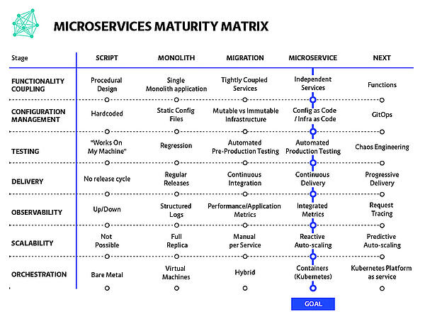

# Introduction. Microservice Architecture. From Java EE To Cloud Native. Openshift VS Kubernetes

1. [Introduction](#introduction)
2. [Platform Reference Architecture](#platform-reference-architecture)
3. [Solution Architect. IT Architecture Frameworks](#solution-architect-it-architecture-frameworks)
4. [Pets vs Cattle Analogy](#pets-vs-cattle-analogy)
5. [Service-Oriented Arhitecture vs Event-Driven Architecture](#service-oriented-arhitecture-vs-event-driven-architecture)
6. [Cloud Native](#cloud-native)
7. [Technical Debt](#technical-debt)
8. [Twelve-Factor Apps in Kubernetes](#twelve-factor-apps-in-kubernetes)
9. [Event Driven Architecture EDA](#event-driven-architecture-eda)
10. [Understanding the Differences Between Event-Driven, Message-Driven, and Microservices Architectures](#understanding-the-differences-between-event-driven-message-driven-and-microservices-architectures)
11. [Multi-Tenancy Architecture](#multi-tenancy-architecture)
12. [Architecture Decision Records](#architecture-decision-records)
13. [Self service developer platform](#self-service-developer-platform)
14. [Shift-Left](#shift-left)
15. [Disaster Recovery](#disaster-recovery)
16. [SaaS](#saas)
17. [Multi Cloud](#multi-cloud)
18. [Cloud Automation](#cloud-automation)
     1. [Automation Glossary](#automation-glossary)
19. [Microservices Best Practices and Design Patterns](#microservices-best-practices-and-design-patterns)
20. [Microservice Patterns](#microservice-patterns)
     1. [CQRS Pattern](#cqrs-pattern)
21. [Microservices Anti Patterns](#microservices-anti-patterns)
22. [Micro Frontend Architecture. Microservices for the Frontend](#micro-frontend-architecture-microservices-for-the-frontend)
23. [Backends for Frontends](#backends-for-frontends)
24. [Data Engineering](#data-engineering)
25. [Cloud Migration Checklist](#cloud-migration-checklist)
26. [Microservices Failures](#microservices-failures)
27. [Top Microservices Frameworks](#top-microservices-frameworks)
28. [Transform Legacy Java Apps to Microservices with automation tools](#transform-legacy-java-apps-to-microservices-with-automation-tools)
29. [Namespaces for Data Structuring](#namespaces-for-data-structuring)
30. [From SysAdmin to Architect](#from-sysadmin-to-architect)
31. [Raft Consensus Algorithm](#raft-consensus-algorithm)
32. [PaaS](#paas)
33. [Modular Monolith](#modular-monolith)
34. [From Java EE To Cloud Native](#from-java-ee-to-cloud-native)
35. [Monolith to Microservices Using the Strangler Pattern](#monolith-to-microservices-using-the-strangler-pattern)
36. [Microservices to Monolith](#microservices-to-monolith)
37. [Openshift VS Kubernetes](#openshift-vs-kubernetes)
38. [Career Path](#career-path)
39. [Full Stack Developer's Roadmap](#full-stack-developers-roadmap)
40. [Software Development Models](#software-development-models)
41. [Domain Driven Design DDD](#domain-driven-design-ddd)
42. [Software Development Tools](#software-development-tools)
43. [vFunction. A system to transform monolithic Java applications into microservices](#vfunction-a-system-to-transform-monolithic-java-applications-into-microservices)
44. [Software in Automotive Industry](#software-in-automotive-industry)
45. [Data Centers in Spain](#data-centers-in-spain)
46. [Bunch of Images](#bunch-of-images)
47. [Videos](#videos)
48. [Devel Videos](#devel-videos)
49. [Tweets](#tweets)

## Introduction

- [developers.redhat.com: Why Kubernetes is The New Application Server](https://developers.redhat.com/blog/2018/06/28/why-kubernetes-is-the-new-application-server/)
- [Dzone.com: Kubernetes in 10 minutes: A Complete Guide](https://dzone.com/articles/kubernetes-in-10-minutes-a-complete-guide-to-look)
- [redhat.com: Why choose Red Hat for microservices?](https://www.redhat.com/en/topics/microservices/why-choose-red-hat-microservices)
- [==Monoliths are the future | Kelsey Hightower==](https://changelog.com/posts/monoliths-are-the-future)
- [==allthingsdistributed.com: Monoliths are not dinosaurs==](https://www.allthingsdistributed.com/2023/05/monoliths-are-not-dinosaurs.html)
- [weave.works: Going Cloud Native: 6 essential things you need to know](https://www.weave.works/technologies/going-cloud-native-6-essential-things-you-need-to-know/)
- [Operators and Sidecars Are the New Model for Software Delivery](https://thenewstack.io/operators-and-sidecars-are-the-new-model-for-software-delivery/)
- [Dzone: What Is Kubernetes?](https://dzone.com/articles/what-is-kubernetes-in-devops)
- [jaxenter.com: Practical Implications for Adopting a Multi-Cluster, Multi-Cloud Kubernetes Strategy](https://jaxenter.com/kubernetes-practical-implications-171647.html)
- [jaxenter.com: Six Essential Kubernetes Extensions to Add to Your Toolkit 🌟](https://jaxenter.com/kubernetes-extensions-172215.html)
- [thoughtworks.com: Kubernetes](https://www.thoughtworks.com/radar/platforms/kubernetes)
- [addwebsolution.com: How Kubernetes helps businesses manage their IT infrastructure?](https://addwebsolution.com/blog/how-kubernetes-helps-businesses-manage-their-it-infrastructure)
- [Dzone: How to Kill Your Developer Productivity](https://dzone.com/articles/how-to-kill-your-developer-productivity-humanitec)
- [loves.cloud: Kubernetes: An Introduction](https://loves.cloud/kubernetes-an-introduction/)
- [thenewstack.io: Microservices vs. Monoliths: An Operational Comparison](https://thenewstack.io/microservices-vs-monoliths-an-operational-comparison/)
- [weave.works: 6 Business Benefits of Kubernetes](https://www.weave.works/blog/6-business-benefits-of-kubernetes)
- [ituser.es: Las principales habilidades que un arquitecto cloud necesita para triunfar](https://www.ituser.es/opinion/2020/07/las-principales-habilidades-que-un-arquitecto-cloud-necesita-para-triunfar)
- [Introducing Domain-Oriented Microservice Architecture 🌟](https://eng.uber.com/microservice-architecture/)
- [Monolithic versus Microservice architecture](https://www.enterprisetimes.co.uk/2020/07/23/monolithic-versus-microservice-architecture)
- [Modernize legacy applications with containers, microservices](https://searchcloudcomputing.techtarget.com/feature/Modernize-legacy-applications-with-containers-microservices) To break down monolithic apps and modernize them for cloud deployment, enterprise development teams continue to turn to containers and microservices.
- [blog.heroku.com: Deconstructing Monolithic Applications into Services](https://blog.heroku.com/monolithic-applications-into-services)
- [vmware.com: How to Deconstruct a Monolith using Microservices – Getting Ready for Cloud-Native](https://blogs.vmware.com/vov/2018/08/06/how-to-deconstruct-a-monolith-using-microservices-getting-ready-for-cloud-native/)
- [thenewstack.io: 7 Best Practices to Build and Maintain Resilient Applications and Infrastructure](https://thenewstack.io/7-best-practices-to-build-and-maintain-resilient-applications-and-infrastructure/)
- [viewnext.com: Front End vs Back End (spanish)](https://www.viewnext.com/front-end-vs-back-end/)
- [thenewstack.io: What is the modern cloud native stack? 🌟🌟](https://thenewstack.io/what-is-the-modern-cloud-native-stack/)
- [thenewstack.io: Do I Really Need Kubernetes? 🌟](https://thenewstack.io/do-i-really-need-kubernetes/)
- [cncf.io: Top 7 challenges to becoming cloud native](https://www.cncf.io/blog/2020/09/15/top-7-challenges-to-becoming-cloud-native/)
- [dewanahmed.com: When to go K8s-native - A tale of CI/CD servers](https://www.dewanahmed.com/post/tekton-k8snative-cicd-pt1/)
- [lavanguardia.com: Por qué la transformación digital es mentira 🌟](https://www.lavanguardia.com/economia/20201014/484036217179/transformacion-digital-empresas-foncillas-pf-video-seo-lv.html)
- [devops.com: 6 Advantages of Microservices](https://devops.com/6-advantages-of-microservices/)
- [cloudpundit.com: Don’t boil the ocean to create your cloud 🌟](https://cloudpundit.com/2020/09/22/dont-boil-the-ocean-to-create-your-cloud/)
- [hcltech.com: DevOps Tools and Technologies to Manage Microservices 🌟](https://www.hcltech.com/blogs/devops-tools-and-technologies-manage-microservices)
- [redhat.com: A sysadmin's guide to containerizing applications](https://www.redhat.com/sysadmin/containerizing-applications) Curious how to containerize your Linux applications? Learn by example, and understand the challenges of various application types and how to overcome them.
- [opensource.com: 6 container concepts you need to understand](https://opensource.com/article/20/12/containers-101) Containers are everywhere, and they've radically changed the IT landscape. What do you need to know about them?
- [devops.com: Why Boring Tech is Best to Avoid a Microservices Mess](https://devops.com/why-boring-tech-is-best-to-avoid-a-microservices-mess/)
- [blog.upbound.io: Managed Services Don’t Always Lead to Vendor Lock-In 🌟](https://blog.upbound.io/managed-services-dont-always-lead-to-vendor-lock-in/)
- [softwareengineeringdaily.com: Kubernetes vs. Serverless with Matt Ward (podcast) 🌟](https://softwareengineeringdaily.com/2020/12/29/kubernetes-vs-serverless-with-matt-ward-repeat/)
- [softwareengineeringdaily.com: The Rise of Platform Engineering 🌟](https://softwareengineeringdaily.com/2020/02/13/setting-the-stage-for-platform-engineering/)
- [thenewstack.io: 3 Reasons Why You Can’t Afford to Ignore Cloud Native Computing 🌟](https://thenewstack.io/3-reasons-why-you-cant-afford-to-ignore-cloud-native-computing/)
- [thenewstack.io: Defining a Different Kubernetes User Interface for the Next Decade](https://thenewstack.io/defining-a-different-kubernetes-user-interface-for-the-next-decade/)
- [thenewstack.io: React in Real-Time with Event-Driven APIs](https://thenewstack.io/react-in-real-time-with-event-driven-apis/)
- [codeopinion.com: Splitting up a Monolith into Microservices 🌟](https://codeopinion.com/splitting-up-a-monolith-into-microservices/)
- [towardsdatascience.com: Learning From Microservices — as a Data Engineer 🌟](https://towardsdatascience.com/learning-from-microservices-as-a-data-engineer-1334ce13876c) Why Software Engineers moved to microservices and how we could learn from their experience
- [javarevisited.blogspot.com: Why Every Programmer, DevOps Engineer Should learn Docker and Kubernetes in 2020](https://javarevisited.blogspot.com/2020/11/why-devops-engineer-learn-docker-kubernetes.html)
- [techrepublic.com: Kubernetes will deliver the app store experience for enterprise software, says Weaveworks CEO](https://www.techrepublic.com/article/kubernetes-will-deliver-the-app-store-experience-for-enterprise-software-says-weaveworks-ceo/)
- [shahirdaya.medium.com: What does it mean to be Cloud Native? 🌟](https://shahirdaya.medium.com/what-does-it-mean-to-be-cloud-native-12360a324571)
- [enterprisersproject.com: 5 hybrid cloud trends to watch in 2021](https://enterprisersproject.com/article/2021/1/5-hybrid-cloud-trends-2021) As hybrid cloud becomes the go-to model for enterprise IT, watch for these trends. Experts discuss cloud platform changes, workload fit, security, and related issues
- [sysadminxpert.com: Scalability and Costs in the Cloud](https://sysadminxpert.com/scalability-and-costs-in-the-cloud/)
- [cloudify.co: Your Guide to Infrastructure Automation & Hybrid Cloud Orchestration 🌟](https://cloudify.co/everything-you-need-to-know-about-hybrid-cloud/)
- [jaxenter.com: Kubernetes Is Much Bigger Than Containers: Here’s Where It Will Go Next](https://jaxenter.com/kubernetes-bigger-173675.html)
- [skamille.medium.com: Make Boring Plans](https://skamille.medium.com/make-boring-plans-9438ce5cb053)
- [cloud-melon.com: Under the hood of Kubernetes and microservices](https://cloud-melon.com/2019/12/26/under-the-hood-of-kubernetes-and-microservices/)
- [thenewstack.io: Study: Silos Are the Chief Impediment to IT and Business Value](https://thenewstack.io/study-silos-are-chief-impediment-to-it-and-business-value/)
- [dzone: 10 Mandatory Services You Should Consider Adopting in AWS and Azure 🌟](https://dzone.com/articles/10-mandatory-services-you-should-consider-adopting) Thanks to the cloud revolution, the software engineering industry went from struggling to maintain IT infrastructure to selling software for subscription within a decade.
- [thenewstack.io: Prepare to Adopt the Cloud: A 10-Step Cloud Migration Checklist 🌟](https://thenewstack.io/prepare-to-adopt-the-cloud-a-10-step-cloud-migration-checklist/)
- [devprojournal.com: Containers, Kubernetes and Software Development in 2021](https://www.devprojournal.com/technology-trends/kubernetes/containers-kubernetes-and-software-development-in-2021/) Advice, expertise, and tools are available to help you get started developing with containers.
- [infoq.com: Migrating Monoliths to Microservices with Decomposition and Incremental Changes](https://www.infoq.com/articles/migrating-monoliths-to-microservices-with-decomposition/)
- [getcortexapp.com: Why You Need a Microservices Catalog Tool](https://www.getcortexapp.com/post/why-you-need-a-microservices-catalog-tool)
- [ringcentral.co.uk: Software as a Service (SaaS)](https://www.ringcentral.co.uk/gb/en/blog/definitions/software-as-a-service-saas/)
- [shopify.engineering: Keeping Developers Happy with a Fast CI](https://shopify.engineering/faster-shopify-ci)
- [infoq.com: Saga Orchestration for Microservices Using the Outbox Pattern](https://www.infoq.com/articles/saga-orchestration-outbox/)
- [medium: A Design Analysis of Cloud-based Microservices Architecture at Netflix](https://medium.com/swlh/a-design-analysis-of-cloud-based-microservices-architecture-at-netflix-98836b2da45f) A comprehensive system design analysis of microservices architecture at Netflix to power its global video streaming services
- [analyticsinsight.net: Cloud Computing is the inevitable future of Data Analytics](https://www.analyticsinsight.net/cloud-computing-is-the-inevitable-future-of-data-analytics/)
- [zdnet.com: Multicloud deployments surge as Microsoft Azure duels with AWS](https://www.zdnet.com/google-amp/article/multicloud-deployments-surge-as-microsoft-azure-duels-with-aws/) All of the public cloud players are showing solid growth as the multicloud pie expands. Azure is closing the gap on AWS, but Google Cloud is making big inroads too.
- [blog.container-solutions.com: How Mature Is Your Microservices Architecture? 🌟](https://blog.container-solutions.com/how-mature-is-your-microservices-architecture)
- [techerati.com: Microservices in the Cloud-Native Era](https://www.techerati.com/features-hub/opinions/microservices-in-the-cloud-native-era/)
- [thenewstack.io: The Cloud Native Landscape: Platforms Explained](https://thenewstack.io/the-cloud-native-landscape-platforms-explained/)
- [thenewstack.io: Are Private Clouds Proliferating?](https://thenewstack.io/google-and-oracle-cloud-adoption-doubles-among-enterprises-3/)
- [thenewstack.io: Multicloud Challenges and Solutions](https://thenewstack.io/multicloud-challenges-and-solutions)
- [makeuseof.com: hich Container System Should You Use: Kubernetes or Docker?](https://www.makeuseof.com/kubernetes-or-docker/) Choosing a container system for is a straightforward choice between two systems. Should you choose Kubernetes or Docker?
- [infoworld.com: The decline of Heroku PaaS](https://www.infoworld.com/article/3614210/the-decline-of-heroku.html)
- [infoq.com: Principles for Microservice Design: Think IDEALS, Rather than SOLID](https://www.infoq.com/articles/microservices-design-ideals/)
- [thenewstack.io: The Scalability Myth](https://thenewstack.io/the-scalability-myth/)
- [thenewstack.io: The 4 Definitions of Multicloud: Part 1 — Data Portability](https://thenewstack.io/the-4-definitions-of-multicloud-part-1-data-portability/)
- [thenewstack.io: Multicloud Paves the Way for Cloud Native Resiliency Models](https://thenewstack.io/multicloud-paves-the-way-for-cloud-native-resiliency-models/)
- [techerati.com: Microservices in the Cloud-Native Era](https://www.techerati.com/features-hub/opinions/microservices-in-the-cloud-native-era/)
- [infoworld.com: 3 cloud architecture mistakes we all make, but shouldn't](https://www.infoworld.com/article/3616211/3-cloud-architecture-mistakes-we-all-make-but-shouldnt.html)
- [ringcentral.co.uk: Cloud Management 🌟](https://www.ringcentral.co.uk/gb/en/blog/definitions/cloud-management/)
- [rudderstack.com: Reinventing the On-Prem Deployment Model](https://rudderstack.com/blog/reinventing-the-on-prem-deployment-model)
- [medium: Honestly, We Shouldn’t Have Used Microservices](https://medium.com/codex/honestly-we-shouldnt-have-used-microservices-443582def48b)
- [hashicorp.com: Why Microservices? 🌟](https://www.hashicorp.com/resources/why-microservices)
- [thenewstack.io: Private vs. Public Cloud: How Kubernetes Shifts the Balance](https://thenewstack.io/private-vs-public-cloud-how-kubernetes-shifts-the-balance/)
- [medium: Microservices Architecture From A to Z 🌟](https://medium.com/swlh/microservices-architecture-from-a-to-z-7287da1c5d28)
- [skycrafters.io: Do Containers Really Contain? Virtual Machines vs. Containers 🌟](https://skycrafters.io/blog/2021/06/08/do-containers-really-contain/)
- [itprotoday.com: Who's Winning in the Container Software Market 🌟](https://www.itprotoday.com/containers/whos-winning-container-software-market) Thanks to its container customer training, the $1 billion container software market is Red Hat’s to lose. Where do the other players stand?
- [cloud.google.com: What is Kubernetes? 🌟](https://cloud.google.com/learn/what-is-kubernetes)
- [simform.com: What is Multi Cloud? Why you Need a Multi Cloud Strategy?](https://www.simform.com/multi-cloud-strategy/)
- [blog.min.io: Mono Clouds vs Multi-Clouds & Hybrid Clouds](https://blog.min.io/monoclouds-vs-multiclouds-hybridclouds/)
- [xataka.com: La deuda técnica, un lastre para las tecnológicas: un estudio señala que los informáticos pierden casi un día de trabajo a la semana para solventarlas](https://www.xataka.com/pro/deuda-tecnica-lastre-para-tecnologicas-estudio-senala-que-informaticos-pierden-casi-dia-trabajo-a-semana-para-solventarlas)
- [dev.to: When it Pays to Choose Microservices 🌟](https://dev.to/typeable/when-it-pays-to-choose-microservices-12h5)
- [acloudguru.com: Public cloud vs private cloud: What’s the difference? 🌟](https://acloudguru.com/blog/business/public-cloud-vs-private-cloud-whats-the-difference)
- [medium: Container Fundamentals — Part 1](https://medium.com/techbeatly/container-fundamentals-part-i-445881a81b7)
- [thenewstack.io: The Future of Microservices? More Abstractions](https://thenewstack.io/the-future-of-microservices-more-abstractions/)
- [thenewstack.io: Transform and Future-Proof Your Architecture with MACH](https://thenewstack.io/transform-and-future-proof-your-architecture-with-mach/) Why Do So Many Companies Remain in These ‘Bad Marriages’ with Monolithic Vendors? Enter MACH (Microservices, API-first, Cloud native, Headless)
- [==yellow.systems: How to Make a Scalable Web Application: Architecture, Technologies, Cost== 🌟](https://yellow.systems/blog/how-to-build-a-scalable-web-application)
- [opensource.com: What do we call post-modern system administrators?](https://opensource.com/article/21/7/system-administrators) Our community discusses the responsibilities, possible titles, and potential skills of today's sysadmins.
- [thenewstack.io: Cloud Engineers Try Policy-as-Code to Cure Misconfiguration Woes](https://thenewstack.io/cloud-engineers-try-policy-as-code-to-cure-misconfiguration-woes/)
- [acloudguru.com: 7 Common Cloud Adoption Mistakes (ebook)](https://go.acloudguru.com/cloud-adoption-mistakes-ebook)
- [medium: What is microservices and why is it different? 🌟](https://medium.com/microservices-for-net-developers/what-is-microservices-and-why-is-it-different-fac017cb8cf4)
- [dzone: How Your Application Architecture Has Evolved 🌟🌟](https://dzone.com/articles/how-your-application-architecture-evolved) In this post, I will discuss how application architecture, in my opinion, has evolved in the last few years and what has been the driving factor for each evolution.
- [simform.com: 6 Multi-Cloud Architecture Designs for an Effective Cloud Strategy 🌟](https://www.simform.com/blog/multi-cloud-architecture/)
- [dzone: A Study of Hosting and Managing on Hybrid Multi-Cloud 🌟](https://dzone.com/articles/a-study-of-hosting-and-managing-on-hybrid-multi-cl) This is my study of a real customer use case on GitOps, multi-cloud management system and, securing dynamic infrastructure secrets, using Red Hat’s open source technology
- [simform.com: Cloud Migration ebook](https://www.simform.com/cloud-migration-ebook/)
- [blog.snapblocs.com: Architecture as a Service: The Evolution of Cloud Computing “as a Service”](https://www.blog.snapblocs.com/post/architecture-as-a-service-theevolution-of-cloud-computing-asaservice)
- [fylamynt.com: Mastering Cloud Automation in the Cloud-Native Era 🌟](https://www.fylamynt.com/post/mastering-cloud-automation-in-the-cloud-native-era) As cloud computing is increasingly getting adopted all over, automation is taking a prime stage these days in the cloud-native space to streamline and manage various IT-related tasks. In this article, we will discuss cloud automation and various aspects related in brief.
- [dynatrace.com: What are microservices? All you need to know](https://www.dynatrace.com/news/blog/what-are-microservices/)
- [medium: Monoliths vs Microservices](https://medium.com/getdefault-in/monoliths-vs-microservices-59cff20bb106)
- [dzone: Guaranteed Ways of Failing With Microservices](https://dzone.com/articles/guaranteed-ways-of-failing-with-microservices) Microservices cannot be used in every context. It is perfectly fine to not use microservices in applications that are small and can be managed easily as monolithic.
- [dzone: Top 6 Time Wastes as a Software Engineer](https://dzone.com/articles/top-time-wastes-as-a-software-engineer) Increase your productivity and advance in your career by avoiding these 6 time wastes.
- [thenewstack.io: Reasons to Opt for a Multicloud Strategy](https://thenewstack.io/reasons-to-opt-for-a-multicloud-strategy/)
- [developers.redhat.com: devnation/summer-camp 🌟](https://developers.redhat.com/devnation/summer-camp) A great resource to learn cloud-native, kubernetes, event-driven architecture and more.
- [community.hpe.com: Containers vs. VMs: What’s the difference?](https://community.hpe.com/t5/HPE-Ezmeral-Uncut/Containers-vs-VMs-What-s-the-difference/ba-p/7147090)
- [hiralee.medium.com: Software Architecture vs Design](https://hiralee.medium.com/software-design-vs-architecture-1da0a94322a4)
- [blog.deref.io: Containers Don't Solve Everything 🌟](https://blog.deref.io/containers-dont-solve-everything/) Our industry has made incredible strides in the past decade, thanks in part to technologies like Docker, Docker Compose, and Kubernetes. However, we are still figuring out how to do development in the heterogeneous environments in which we live.
- [geeksforgeeks.org: Microservice Architecture – Introduction, Challeneges & Best Practices](https://www.geeksforgeeks.org/microservice-architecture-introduction-challeneges-best-practices/)
- [redhat.com: Use automation to combat your increased workload](https://www.redhat.com/sysadmin/automation-combat-increased-workload)Tired of mundane, tedious, boring tasks? Automation improves your efficiency and frees your time to focus on new and innovative opportunities.
- [zdnet.com: Benefits of cloud computing: The pros and cons](https://www.zdnet.com/google-amp/article/cloud-computing-pros-and-cons/) A list of advantages and disadvantages of cloud computing, including some you may not know existed.
- [thenewstack.io: Intention-as Code: Making Self-Healing Infrastructure Work](https://thenewstack.io/intention-as-code-making-self-healing-infrastructure-work/) __Reliability is Non-Negotiable__
- [dzone: Top 10 August '21 Microservices Articles to Read Now](https://dzone.com/articles/most-viewed-articles-microservices-zone-august) See the 10 most popular articles from the Microservices zone with topics covering API verification checklist, custom rate limiting, feign client, and more!
- [hackernoon.com: 9 Basic (and Crucial) Tips for Microservices Developers 🌟](https://hackernoon.com/9-basic-and-crucial-tips-for-microservices-developers)
- [engineering.monday.com: monday.com’s Multi-Regional Architecture: A Deep Dive](https://engineering.monday.com/monday-coms-multi-regional-architecture-a-deep-dive/) Building a global SaaS platform requires lots of preparation, deep evaluation of your request routes and a truckload of R&D cooperation. Here's how we did it
- [cloud.redhat.com: How to Modernize Virtualized Workloads 🌟](https://cloud.redhat.com/blog/how-to-modernize-virtualized-workloads) how to #Modernize workloads using OpenShift. The example is with DotNet and MSSQL server.
- [itnext.io: Platform-as-Code: how it relates to Infrastructure-as-Code and what it enables](https://itnext.io/platform-as-code-how-it-compares-with-infrastructure-as-code-and-what-it-enables-2684b348be2e)
- [dzone: Transitioning from Monolith to Microservices (with python django example)](https://dzone.com/articles/transitioning-from-monolith-to-microservices)
- [cncf.io: How to justify infrastructure replacement to your manager](https://www.cncf.io/blog/2021/10/29/how-to-justify-infrastructure-replacement-to-your-manager)
- [infoworld.com: Complexity is killing software developers](https://www.infoworld.com/article/3639050/complexity-is-killing-software-developers.html) The growing complexity of modern software systems is slowly killing software developers. How can you regain control, without losing out on the best these technologies have to offer?
- [enter.co: Estos son los 10 lenguajes de programación más populares en 2021](https://www.enter.co/especiales/dev/herramientas-dev/estos-son-los-10-lenguajes-de-programacion-mas-populares-en-2021/)
- [zesty.co: 10 Cloud Deficiencies You Should Know](https://zesty.co/blog/10-cloud-deficiencies/)
- [weave.works: What is a Kubernetes Cluster? 🌟](https://www.weave.works/blog/kubernetes-cluster)
- [==techrepublic.com: Enterprises get closer to the app store experience with Kubernetes and GitOps==](https://www.techrepublic.com/article/enterprises-get-closer-to-the-app-store-experience-with-kubernetes-and-gitops/)
- [==Dzone: 22 Software Development Trends for 2022==](https://dzone.com/articles/22-software-development-trends-for-2022-1) AI, ML, IaC, SRE, DevSecOps, and many others will define how we make software in 2022. Discover what they mean and why they matter in this article.
- [==redhat.com: 97 Things Every Cloud Engineer Should Know==](https://www.redhat.com/en/resources/oreilly-97things-cloud-engineers-should-know-ebook) If you create, manage, operate, or configure systems running in the cloud, you're a cloud engineer—even if you work as a system administrator, software developer, data scientist, or site reliability engineer. All of these topics are covered in this e-book: fundamentals, architecture, migration, security & compliance, operations & reliability, software development, cloud economics and measuring spend, automation, data, networking, organizational culture, and personal and professional development.
- [==theregister.com: How Kubernetes lowers costs and automates IT department work==](https://www.theregister.com/2021/12/21/how_kubernetes_lowers_costs/) 75% of global companies will have started using container applications in their production environments by 2022.
- [==redhat.com: Top 8 resources for microservices architecture of 2021==](https://www.redhat.com/architect/best-microservices-2021) Reining in complexity, doing things consistently, leveraging standards, and modernizing systems are timeless themes in microservices architecture.
- [infoworld.com: Kubernetes adoption up, serverless down, developer survey says](https://www.infoworld.com/article/3645374/kubernetes-up-serverless-down-report.html) ‘State of Cloud Native Development’ report finds the number of developers using Kubernetes increased 67% in 12 months.
- [venturebeat.com: 5 ways the world of IT operations will shift in 2022 (and beyond)](https://venturebeat.com/2021/12/22/5-ways-the-world-of-it-operations-will-shift-in-2022-and-beyond/)
- [thenewstack.io: 5 Cloud Native Trends to Watch out for in 2022](https://thenewstack.io/5-cloud-native-trends-to-watch-out-for-in-2022/)
- [==blog.devgenius.io: Distributed Monolith==](https://blog.devgenius.io/distributed-monolith-1d2d9f86a68f)
- [infoq.com: 9 Ways to Fail at Cloud Native](https://www.infoq.com/presentations/fail-cloud-native-migration/)
- [arnnet.com.au: Kubernetes adoption up and serverless down, according to developer survey](https://www.arnnet.com.au/article/694082/kubernetes-adoption-up-serverless-down-according-developer-survey/) State of Cloud Native Development report finds the number of developers using Kubernetes increased 67 per cent in 12 months.
- [==levelup.gitconnected.com: How to design a system to scale to your first 100 million users==](https://levelup.gitconnected.com/how-to-design-a-system-to-scale-to-your-first-100-million-users-4450a2f9703d)
- [thenewstack.io: App Modernization: 5 Tips When Migrating to Kubernetes](https://thenewstack.io/app-modernization-5-tips-when-migrating-to-kubernetes/)
- [thenewstack.io: Kubernetes and the Next Generation of PaaS](https://thenewstack.io/kubernetes-and-the-next-generation-of-paas/)
- [medium.com/geekculture: A Beginners Guide to Understanding Microservices](https://medium.com/geekculture/a-beginners-guide-to-understanding-microservices-d2a8bae871b7) A high-level overview of the microservices architecture and what it means in plain language understandable by beginners.
- [nathanpeck.com: Why should I use an orchestrator like Kubernetes, Amazon ECS, or Hashicorp Nomad?](https://nathanpeck.com/why-should-use-container-orchestration/)
- [christophermeiklejohn.com: Understanding why Resilience Faults in Microservice Applications Occur](https://christophermeiklejohn.com/filibuster/2022/03/19/understanding-faults.html)
- [websiteplanet.com: What’s Open Source Software + How It Makes Money 2022](https://www.websiteplanet.com/blog/what-is-open-source-software/)
- [==eficode.com: The future of Kubernetes – and why developers should look beyond Kubernetes in 2022==](https://www.eficode.com/blog/the-future-of-kubernetes-and-why-developers-should-look-beyond-kubernetes-in-2022)
- [==medium.com/interviewnoodle: Shift from Monolith to CQRS== 🌟](https://medium.com/interviewnoodle/shift-from-monolith-to-cqrs-a34bab75617e)
    - Software design is an evolving process. Every large system starts from a tiny system. When a problem is encountered in the existing architecture but cannot be solved, the system will begin to evolve. Every evolution is accompanied by some technical selections. What problems should be solved? What price will it pay? As an architect or a senior engineer, there must find a reasonable way to evolve, regardless of the development schedule, technical stack, and team level, it is necessary to be able to meet these criteria before a feasible solution can be made.
    - This article will introduce the spirit of CQRS (Command Query Responsibility Segmentation) and the problems to be solved. We will start from a small monolith and evolve it like the evolution of every software system, and this article will introduce the reasons and approaches behind each evolution.
- [==bytebytego.com: System Design - Scale From Zero To Millions Of Users== 🌟](https://bytebytego.com/courses/system-design-interview/scale-from-zero-to-millions-of-users)
- [==medium.com/@ajin.sunny: System Design Architecture: Stateful vs. Stateless== 🌟](https://medium.com/@ajin.sunny/system-design-architecture-stateful-vs-stateless-62ed0ddb9f2b)
- [medium.com/@ajin.sunny: System Design Concept: Rate limiting 🌟](https://medium.com/@ajin.sunny/system-design-concept-rate-limiting-f4da72371533)
- [medium.com/@ajin.sunny: Rate limiting in Distributed Systems 🌟](https://medium.com/@ajin.sunny/rate-limiting-in-distributed-systems-bbeca0c47b96)
- [==semaphoreci.com: 5 Options for Deploying Microservices== 🌟](https://semaphoreci.com/blog/deploy-microservices)
    - Option 1: Single machine, multiple processes
    - Option 2: Multiple machines and processes
    - Option 3: Deploy microservices with containers
    - Option 4: Orchestrators
    - Option 5: Deploy microservices as serverless functions
- [blog.devgenius.io: Top 10 Architecture Characteristics / Non-Functional Requirements with Cheatsheet 🌟](https://blog.devgenius.io/top-10-architecture-characteristics-non-functional-requirements-with-cheatsheat-7ad14bbb0a9b)
- [==medium.com/dotnet-hub: Software Architecture — Introduction to Cloud Native Application Architecture== 🌟](https://medium.com/dotnet-hub/introduction-to-cloud-native-application-architecture-what-is-cloud-native-architecture-overview-benefits-e9be9aca0dd3) __What is Cloud Native Architecture and Application Development? — Overview of Cloud Native Architectures and Technologies.__
- [bootcamp.uxdesign.cc: Popular Tech Stack for Startups in 2022](https://bootcamp.uxdesign.cc/popular-tech-stack-for-startups-in-2022-f3b53f50c18)
- [howtogeek.com: When Not to Use Docker: Cases Where Containers Don’t Help 🌟](https://www.howtogeek.com/devops/when-not-to-use-docker-cases-where-containers-dont-help/)
- [==itnext.io: You Don’t Need Microservices== 🌟](https://itnext.io/you-dont-need-microservices-2ad8508b9e27)
- [medium.com/@interviewready: Data Replication in Distributed System](https://medium.com/@interviewready/data-replication-in-distributed-system-87f7d265ff28)
- [==semaphoreci.medium.com: 12 Ways to Improve Your Monolith Before Transitioning to Microservices== 🌟](https://semaphoreci.medium.com/12-ways-to-improve-your-monolith-before-transitioning-to-microservices-d1061e96ca1a)
- [==hardiks.medium.com: Top 6 Best practices for Container Orchestration== 🌟](https://hardiks.medium.com/top-6-best-practices-for-container-orchestration-b4b0d3398ebc)
- [medium.com/@nadinCodeHat: HTTP based Microservices is a bad idea 🌟](https://medium.com/@nadinCodeHat/http-based-microservices-is-a-bad-idea-670d3db29ca6)
- [medium.com/qe-unit: Microservices — Do You Need Them? Are You Ready? 🌟](https://medium.com/qe-unit/the-microservices-adoption-roadmap-e37f3f32877)
- [alibabacloud.com: Getting Started with Kubernetes | Deep Dive into Kubernetes Core Concepts](https://www.alibabacloud.com/blog/getting-started-with-kubernetes-%7C-deep-dive-into-kubernetes-core-concepts_595896)
- [micahlerner.com: Automatic Reliability Testing For Cluster Management Controllers](https://www.micahlerner.com/2022/07/24/automatic-reliability-testing-for-cluster-management-controllers.html)
- [cloudnativeislamabad.hashnode.dev: Virtualization vs Containerization](https://cloudnativeislamabad.hashnode.dev/virtualization-vs-containerization) Virtual Machines vs Docker
- [medium.com/javarevisited: Distributed Transaction Management in Microservices — Part 1 🌟](https://medium.com/javarevisited/distributed-transaction-management-in-microservices-part-1-bb7dc1fbee9f)
- [==betterprogramming.pub: How to Transform a Monolith Application Into a Microservices Architecture==](https://betterprogramming.pub/how-to-transform-a-monolith-application-into-a-microservices-architecture-1e00363a03ba) A step-by-step guide to migrating your monolith application to a microservices architecture
- [==medium.com/javarevisited: Microservices communication using gRPC Protocol==](https://medium.com/javarevisited/microservices-communication-using-grpc-protocol-dc3a2f8b648d)
- [medium.com/codex: MicroServices Architecture to Solve Distributed Transaction Management Problem](https://medium.com/codex/solving-distributed-transaction-management-problem-in-microservices-architecture-586ab3087efe)
- [==betterprogramming.pub: How I Split a Monolith Into Microservices Without Refactoring== 🌟🌟🌟](https://betterprogramming.pub/how-i-split-a-monolith-into-microservices-without-refactoring-5d76924c34c2) My journey to becoming more agile with a just-in-time architectural style
- [towardsdatascience.com: 3 High Availability Cloud Concepts You Should Know](https://towardsdatascience.com/3-high-availability-cloud-concepts-you-should-know-93f3bab2cb4a) From scaling to VM placement strategies
- [ust.com: Do we really need Kubernetes and containers?](https://www.ust.com/en/insights/do-we-really-need-kubernetes-and-containers)
- [optisolbusiness.com: 8 Core Components are Microservices Architecture](https://www.optisolbusiness.com/insight/8-core-components-of-microservice-architecture)
    - Service Discovery
    - Load Balancer
    - API Gateway
    - Service Registry
    - Circuit Breaker
    - Service Monitoring
    - Service Orchestration
    - Configuration Server
- [thenewstack.io: What Is Microservices Architecture?](https://thenewstack.io/microservices/what-is-microservices-architecture/) Microservices architecture is game changing, allowing development teams to work independently and at cloud native scale.
- [levelup.gitconnected.com: Do you know Distributed Job Scheduling in Microservices Architecture? 🌟](https://levelup.gitconnected.com/do-you-know-distributed-job-scheduling-in-microservices-architecture-44082adad8ac)
- [==nginx.com: Best Practices for Configuring Microservices Apps== 🌟](https://www.nginx.com/blog/best-practices-for-configuring-microservices-apps/) **The guidelines known as the 12‑factor app were first published more than 10 years ago. Since then become the de facto standard way to write and deploy web apps.**
- [==medium.com/javarevisited: Microservices Communication part 1-every programmer must know== 🌟](https://medium.com/javarevisited/microservices-communication-part-1-every-programmer-must-know-7c6607d2d563) Microservices communication is the heartbeat of any Microservice Architecture and designing them could make or break the system.
    - [medium.com/javarevisited: Microservices Communication — part 2— Sync vs Async vs Hybrid?](https://medium.com/javarevisited/microservices-communication-part-2-sync-vs-async-vs-hybrid-23d057e137d8)
- [deloitte.com/de: EMEA Center of Excellence for Application Modernization and Migration](https://www2.deloitte.com/de/de/pages/technology/articles/center-of-excellence-application-modernization.html) Accelerate the transformation of your legacy systems
- [==redis.com: Microservice Architecture Key Concepts==](https://redis.com/blog/microservice-architecture-key-concepts/) What role do microservices play in creating applications? We offer a foundational understanding of what microservices are, how they differ from monolithic structures, and what to consider when you evaluate microservices for your own adoption.
- [freecodecamp.org: A Beginner-Friendly Introduction to Containers, VMs and Docker](https://www.freecodecamp.org/news/a-beginner-friendly-introduction-to-containers-vms-and-docker-79a9e3e119b/)
- [==designgurus.io: Monolithic vs. Service-Oriented vs. Microservice Architecture: Top Architectural Design Patterns==](https://www.designgurus.io/blog/Monolithic-Service-Oriented-Microservice-Architecture) System Design Interview Preparation: Mastering the Art of System Design.
- [==thenewstack.io: Kubernetes Evolution: From Microservices to Batch Processing Powerhouse== 🌟🌟](https://thenewstack.io/kubernetes-evolution-from-microservices-to-batch-processing-powerhouse/) In its early days, Kubernetes was primarily focused on building features for microservice-based workloads. In recent years, the Kubernetes community has stretched out into batch processing support for High Performance Computing Workloads.
- [elespanol.com: Mainframe: repaso de pasado y futuro a una tecnología de 1944 que se resiste a morir](https://www.elespanol.com/invertia/disruptores-innovadores/innovadores/tecnologicas/20230416/mainframe-repaso-pasado-futuro-tecnologia-resiste-morir/756174490_0.html)
- [medium.com/javarevisited: Why Microservices are not silver bullet? 10 Reasons for NOT using Microservices](https://medium.com/javarevisited/why-microservices-are-not-silver-bullet-10-reasons-for-not-using-microservices-74f7c0fa98c) Don’t blindly use Microservices for every single application you build
- [devops.com: 8 Hot Takes: Will We See a Monolithic Renaissance?](https://devops.com/8-hot-takes-will-we-see-a-monolithic-renaissance/)
- [rahulh123.medium.com: Choosing the Right Architecture: Monolithic vs. Microservices — Analyzing Requirements for Success](https://rahulh123.medium.com/choosing-the-right-architecture-monolithic-vs-microservices-analyzing-requirements-for-success-70d681f6a1d0)
- [waswani.medium.com: Microservices Communication: Data Sharing using Database, an AntiPattern !!!](https://waswani.medium.com/microservices-data-sharing-using-database-an-antipattern-35e0196ee2ad)
- [infoworld.com: Why we need both cloud architects and cloud engineers](https://www.infoworld.com/article/3707989/why-we-need-both-cloud-architects-and-cloud-engineers.html) AI-based design and development is exciting but it doesn't replace sound, solid architecture and engineering in building and deploying cloud-based solutions.
- [enriquedans.com: El desastre del software y la automoción](https://www.enriquedans.com/2023/12/el-desastre-del-software-y-la-automocion.html)
- [freecodecamp.org: How to Write Clean Code – Tips and Best Practices (Full Handbook)](https://www.freecodecamp.org/news/how-to-write-clean-code/)
- [theregister.com: Basecamp details 'obscene' $3.2 million bill that caused it to quit the cloud](https://www.theregister.com/2023/01/16/basecamp_37signals_cloud_bill/)
- [==medium.com/@bill.salvaggio: The AWS Cloud Resume Challenge Project==](https://medium.com/@bill.salvaggio/the-aws-cloud-resume-challenge-project-c5c0c6fe9593) - [==The AWS Cloud Resume Challenge Project, Part II==](https://medium.com/@bill.salvaggio/the-aws-cloud-resume-challenge-project-part-ii-5c36029dbc59) CI/CD Automation — GitHub Actions and a Test environment
- [thestack.technology: VMware is killing off 56 products amid "tectonic" infrastructure shift](https://www.thestack.technology/vmware-is-killing-off-56-products-including-vsphere-hypervisor-and-nsx/) Goodbye vSphere Hypervisor. Goodbye Aria Operations. Goodbye NCX. Goodbye HCX. Goodbye more acronyms than we know what to do with; though Broadcom does.
- [blog.lealdasilva.com: Why You Should Switch from VMware to Proxmox in 2024](https://blog.lealdasilva.com/vmware2proxmox/)
- [==welivesecurity.com: La ofuscación de código: un arte que reina en la ciberseguridad==](https://www.welivesecurity.com/es/recursos-herramientas/ofuscacion-de-codigo-arte-ciberseguridad/) Conoce esta táctica que dificulta la comprensión de código fuente a personas no autorizadas, o malintencionadas, y fortalece la protección de sistemas sensibles.
- [==virtualizationhowto.com: VMware by Broadcom Lesson: Don’t base your career on a product==](https://www.virtualizationhowto.com/2024/02/vmware-by-broadcom-lesson-dont-base-your-career-on-a-product/) Gain insight into the challenges faced by VMware admins. Understand the implications of the acquisition and VMware by Broadcom lesson.
- [cope.es: El ejemplo de 'la moneda' con el que entender cómo funciona un ordenador cuántico: "Será una revolución"](https://www.cope.es/programas/la-linterna/noticias/ejemplo-moneda-con-que-entender-como-funciona-ordenador-cuantico-una-revolucion-20240407_3232557) El divulgador tecnológico Mario Yáñez aclara en La Linterna cómo funcionaría el nuevo modelo de ordenadores que cambiarán tanto el clima como el cáncer
- [==paulbutler.org: The hater’s guide to Kubernetes==](https://paulbutler.org/2024/the-haters-guide-to-kubernetes/)
    - This article provides a practical guide to using Kubernetes effectively, particularly for startups
    - It addresses common criticisms of Kubernetes, such as its overly complicated nature, and provides advice on using it in a way suitable for small teams
- [genbeta.com/a-fondo: Cinco repositorios de GitHub tan buenos que son imprescindibles si estás aprendiendo o te dedicas a programar](https://www.genbeta.com/a-fondo/cinco-repositorios-github-buenos-que-imprescindibles-estas-aprendiendo-te-dedicas-a-programar) ¿Quieres subir de nivel como dev? Esta es la cuidada lista de Brais Moure para mejorar tus habilidades

## Platform Reference Architecture

- [humanitec.com: Platform reference architecture on Azure](https://humanitec.com/reference-architectures/azure) We looked at the Internal Developer Platforms built and run by some of the world’s best platform engineering teams. We condensed our key learnings for Azure setups into this reference architecture whitepaper.
- [humanitec.com: Platform reference architecture on GCP](https://humanitec.com/reference-architectures) We looked at the Internal Developer Platforms built and run by some of the world’s best platform engineering teams. We condensed our key learnings for GCP setups into this reference architecture whitepaper.
- [humanitec.com: Platform reference architecture on AWS](https://humanitec.com/reference-architectures/aws) We looked at the Internal Developer Platforms built and run by some of the world’s best platform engineering teams. We condensed our key learnings for AWS setups into this reference architecture whitepaper.

## Solution Architect. IT Architecture Frameworks

- [==towardsdev.com: Solution architecture 101 — Are you ready for the Solution Architect Path== 🌟](https://towardsdev.com/solution-architecture-101-are-you-ready-for-the-solution-architect-path-5a2d01aebbb) World-known IT architecture frameworks:
    - TOGAF
    - The Zachman Framework
    - Federal Enterprise Framework (FCA)
    - Gartner

## Pets vs Cattle Analogy

- [==cloudscaling.com: The History of Pets vs Cattle and How to Use the Analogy Properly==](http://cloudscaling.com/blog/cloud-computing/the-history-of-pets-vs-cattle/)
    - __In the old way of doing things, we treat our servers like pets, for example Bob the mail server. If Bob goes down, it’s all hands on deck. The CEO can’t get his email and it’s the end of the world. In the new way, servers are numbered, like cattle in a herd. For example, www001 to www100. When one server goes down, it’s taken out back, shot, and replaced on the line.__
    - ==Pets==: __Servers or server pairs that are treated as indispensable or unique systems that can never be down. Typically they are manually built, managed, and “hand fed”. Examples include mainframes, solitary servers, HA loadbalancers/firewalls (active/active or active/passive), database systems designed as master/slave (active/passive), and so on.__
    - ==Cattle==: __Arrays of more than two servers, that are built using automated tools, and are designed for failure, where no one, two, or even three servers are irreplaceable. Typically, during failure events no human intervention is required as the array exhibits attributes of “routing around failures” by restarting failed servers or replicating data through strategies like triple replication or erasure coding. Examples include web server arrays, multi-master datastores such as Cassandra clusters, multiple racks of gear put together in clusters, and just about anything that is load-balanced and multi-master.__
- [==traefik.io: Pets vs. Cattle: The Future of Kubernetes in 2022==](https://traefik.io/blog/pets-vs-cattle-the-future-of-kubernetes-in-2022)

## Service-Oriented Arhitecture vs Event-Driven Architecture

- [==eventstore.com: Service-Oriented Architecture vs Event-Driven Architecture== 🌟](https://www.eventstore.com/blog/service-oriented-architecture-vs-event-driven-architecture) __SOA vs EDA: which should you use? Best article about EventSourcing CQRS related patterns and usages. A close-to-a-must-read for those who wants to clarify and understand better.__

## Cloud Native

- [==mkaschke.medium.com: ud Native Part 1: What Is Cloud Native?== 🌟](https://mkaschke.medium.com/cloud-native-part-1-what-is-cloud-native-40640f128834)

## Technical Debt

- [stackoverflow.blog: Using Kubernetes to rethink your system architecture and ease technical debt 🌟](https://stackoverflow.blog/2021/05/19/rethinking-system-architecture-can-kubernetes-help-to-solve-rewrite-anxiety/)
- [==medium: Technical debt 101==](https://medium.com/@joaomilho/festina-lente-e29070811b84) A primer about technical debt, legacy code, big rewrites and ancient wisdom for non technical managers
- [infoq.com: Managing Technical Debt in a Microservice Architecture](https://www.infoq.com/articles/managing-technical-debt-microservices/)
- [dzone: The Origins of Technical Debt](https://dzone.com/articles/the-origins-of-technical-debt) According to research in the topic, 59% of business leaders in Norway said technical debt was their primary obstacle preventing them from innovating.
- [leaddev.com: How to break the cycle of tech debt](https://leaddev.com/legacy-technical-debt-migrations/how-break-cycle-tech-debt) Legacy, technical debt & migrations
- [devops.com: Measuring Technical Debt](https://devops.com/measuring-technical-debt/)
- [thenewstack.io: Stop Technical Debt Before It Damages Your Company](https://thenewstack.io/stop-technical-debt-before-it-damages-your-company/)
- [n-ix.com: How to reduce your technical debt: An ultimate guide](https://www.n-ix.com/reduce-technical-debt/)
- [medium.com/promyze: Avoid accidental complexity and technical debt](https://medium.com/promyze/avoid-accidental-complexity-and-technical-debt-2dc2cdf4dd4b)
- [infoworld.com: You can’t run away from technical debt](https://www.infoworld.com/article/3704233/you-cant-run-away-from-technical-debt.html) Like student loans and credit card balances, technical debt is holding you back or even killing your business. Unfortunately, the cloud can't always save you.

## Twelve-Factor Apps in Kubernetes

- [acloudguru.com: Twelve-Factor Apps in Kubernetes](https://acloudguru.com/blog/engineering/twelve-factor-apps-in-kubernetes)
- [==opensource.com: An open source developer's guide to 12-Factor App methodology==](https://opensource.com/article/21/11/open-source-12-factor-app-methodology) How 12 basic principles can help teams build highly scalable apps quickly and efficiently.
- [thenewstack.io: Learn 12 Factor Apps Before Kubernetes](https://thenewstack.io/learn-12-factor-apps-before-kubernetes/) These best practices provide a framework for building scalable, portable, maintainable and resilient containerized applications.
- [itnext.io: 12 factor Microservice applications — on Kubernetes](https://itnext.io/12-factor-microservice-applications-on-kubernetes-db913008b018)
- [itnext.io: Isolating and Managing Dependencies in 12-factor Microservice Applications — with Kubernetes](https://itnext.io/isolating-and-managing-dependencies-in-12-factor-microservice-applications-with-kubernetes-988638f8bc6d)
- [itnext.io: Processes — for 12-factor Microservice Applications](https://itnext.io/processes-for-12-factor-microservice-applications-70551a9021b)
- [architecturenotes.co: 12 Factor App Revisited](https://architecturenotes.co/12-factor-app-revisited/) The Twelve-Factor App methodology is a methodology for building software-as-a-service applications by Adam Wiggins. We cover how they have since evolved, and what we can learn from them today and how they changed the status quo of yesteryear.

## Event Driven Architecture EDA

- [martinfowler.com: What do you mean by “Event-Driven”? 🌟](https://martinfowler.com/articles/201701-event-driven.html)
- [equalexperts.com: Event driven architecture: the good, the bad, and the ugly 🌟](https://www.equalexperts.com/blog/tech-focus/event-driven-architecture-the-good-the-bad-and-the-ugly/)
- [maheshwari-bittu.medium.com: Why Event-Driven Architecture (EDA) is needed? 🌟](https://maheshwari-bittu.medium.com/why-event-driven-architecture-eda-is-needed-fac2f00f25a8)
- [medium.com/rocco-scaramuzzi-tech: Event-Driven Microservice Architecture, don’t use only events but use commands too!](https://medium.com/rocco-scaramuzzi-tech/event-driven-microservice-architecture-dont-use-only-events-but-use-commands-too-b8694d370436)
- [deeptimittalblogger.medium.com: Event driven architecture](https://deeptimittalblogger.medium.com/event-driven-architecture-111f504a8cbc)
- [medium.com/mcdonalds-technical-blog: Behind the scenes: McDonald’s event-driven architecture](https://medium.com/mcdonalds-technical-blog/behind-the-scenes-mcdonalds-event-driven-architecture-51a6542c0d86) We explore our journey of developing a unified platform enabling real-time, event-driven architectures.
    - [medium.com/mcdonalds-technical-blog: McDonald’s event-driven architecture: The data journey and how it works](https://medium.com/mcdonalds-technical-blog/mcdonalds-event-driven-architecture-the-data-journey-and-how-it-works-4591d108821f)
- [==nordicapis.com: 5 Protocols For Event-Driven API Architectures== 🌟🌟🌟](https://nordicapis.com/5-protocols-for-event-driven-api-architectures/)
    - What is an Event-Driven Architecture? Event-driven architectures establish an event that can be consumed and reacted to. But what is an event? An event is essentially any significant change from one state to another, such as the change from having no messages in your inbox to have a new message in your inbox. This state can be reacted to internally (such as when the email program in question realizes a new message has been received), externally (when a user sees a notification for a new message), or used to generate another event (for instance, the message tally increases by one). Event-driven architectures are appealing to API developers because they function very well in asynchronous environments. By crafting APIs that trigger certain functions on new event delivery, API systems don’t have to inherently wait for synchronous delivery or real time communication. This is hugely beneficial, as eliminating the need to constantly poll endpoints frees resources from otherwise wasteful purposes, reducing both general hardware requirements and call-specific overhead. For this reason, event-driven architectures are very, very popular, and lead to improved power, bandwidth, and co-processing than other solutions and architectures such as polling and other poll-centric derivatives.
    - 5 Types of Event-Driven Protocols for APIs:
        - WebSockets
        - WebHooks
        - REST Hooks
        - Pub-Sub
        - Server Sent Events
- [dev.to/aws-builders: Un Modelo de EDA: Event Driven Architectures](https://dev.to/aws-builders/un-modelo-de-eda-event-driven-architectures-4d9f)
- [levelup.gitconnected.com: Error Handling in Event-Driven Systems](https://levelup.gitconnected.com/error-handling-in-event-driven-systems-1f0a7ef2cfb7)
- [==aws.amazon.com: Best practices for implementing event-driven architectures in your organization==](https://aws.amazon.com/blogs/architecture/best-practices-for-implementing-event-driven-architectures-in-your-organization/)

## Understanding the Differences Between Event-Driven, Message-Driven, and Microservices Architectures

- [faun.pub: Understanding the Differences Between Event-Driven, Message-Driven, and Microservices Architectures with AWS Services](https://faun.pub/what-is-difference-of-event-driven-architecture-message-driven-architecture-and-microservices-f5623e51f868)

## Multi-Tenancy Architecture

- [levelup.gitconnected.com: 5 Tips To Design For Multi-Tenancy Architecture](https://levelup.gitconnected.com/5-tips-to-design-for-multi-tenancy-architecture-5f7d55657d77)
- [levelup.gitconnected.com: Multi-Tenant Application](https://levelup.gitconnected.com/multi-tenant-application-a29153d31c5a)

## Architecture Decision Records

- [redhat.com: Why you should be using architecture decision records to document your project](https://www.redhat.com/architect/architecture-decision-records) ==Documenting architectural decisions helps a project succeed by helping current and future contributors understand the reasons for doing things a certain way.==

## Self service developer platform

- [weave.works: What is a self-service developer platform and why does it matter?](https://www.weave.works/blog/what-is-a-self-service-developer-platform)
- [==thenewstack.io: What We Learned from Enabling Developer Self-Service==](https://thenewstack.io/what-we-learned-from-enabling-developer-self-service/) Let’s simplify the developer experience and scale DevOps workflows without compromising the security of multi-Kubernetes environments.

## Shift-Left

- [==dzone.com: Shift-Left: A Developer's Pipe(line) Dream?==](https://dzone.com/articles/shift-left-a-developers-pipeline-dream) **The traditional SDLC is broken and long overdue for a "shift" in direction. Find out more details in this post. How Shift Left Is a Game Changer.**

## Disaster Recovery

- [thenewstack.io: Disaster Recovery Is Different for the Cloud](https://thenewstack.io/disaster-recovery-is-different-for-the-cloud/)
- [bunnyshell.com: DR in DevOps: How to Guarantee an Effective Disaster Recovery Plan with DevOps](https://www.bunnyshell.com/blog/disaster-recovery-devops)

## SaaS

- [==blog.scaleway.com: SaaS Solutions - What is the difference between a multi-instance and a multi-tenant architecture==](https://blog.scaleway.com/saas-multi-tenant-vs-multi-instance-architectures/)

## Multi Cloud

- [acloudguru.com: Sharing data in the cloud: 4 patterns you should know](https://acloudguru.com/blog/business/sharing-data-in-the-cloud-four-patterns-everyone-should-know)
- [architectelevator.com: Multi Cloud Architecture: Decisions and Options](https://architectelevator.com/cloud/hybrid-multi-cloud/) Multi cloud means different things to different people. A decision model helps bust the buzzwords and show the options clearly.
- [softwebsolutions.com: Why enterprises need to adopt a multi-cloud strategy](https://www.softwebsolutions.com/resources/multi-cloud-adoption-strategy.html)
- [medium: Multi Cloud Enterprise Deployment Pattern](https://medium.com/solutions-architecture-patterns/multi-cloud-enterprise-deployment-pattern-19571604e64b)
- [redhat.com: 5 essential tools for managing hybrid cloud infrastructure](https://www.redhat.com/architect/hybrid-cloud-management-tools) It's not just a matter of having the right tools; you must also use them correctly.
- [devops.com: Infrastructure Abstraction Will Be Key to Managing Multi-Cloud](https://devops.com/infrastructure-abstraction-will-be-key-to-managing-multi-cloud/)

## Cloud Automation

- [zdnet.com: The year ahead in DevOps and agile: bring on the automation, bring on the business involvement](https://www.zdnet.com/article/the-year-ahead-in-devops-and-agile-more-automation-more-business-involvement-needed/) DevOps has an automation problem, while agile has an identification problem. Both face organizational problems. Both are needed in the digital transformation shaping the months ahead.
- [thenewstack.io: What Is Cloud Automation and How Does It Benefit IT Teams? 🌟](https://thenewstack.io/what-is-cloud-automation-and-how-does-it-benefit-it-teams)
- [cncf.io: Automation is the future of cloud cost optimization 🌟](https://www.cncf.io/blog/2021/09/29/automation-is-the-future-of-cloud-cost-optimization/)

### Automation Glossary

- [redhat.com: Red Hat automation glossary 🌟](https://www.redhat.com/en/blog/red-hat-automation-glossary)

## Microservices Best Practices and Design Patterns

- [dzone: 7 Microservices Best Practices for Developers 🌟](https://dzone.com/articles/7-microservices-best-practices-for-developers) In this article, we’ll look at some microservices best practices and suggest a few ways to help you design, orchestrate, and secure your microservices architecture.
- [zdnet.com: Why microservices need event-driven architecture](https://www.zdnet.com/article/when-microservices-need-event-driven-architecture/) A call for greater microservice stability and alignment in legacy environments
- [learncsdesign.medium.com: Microservices Design Patterns](https://learncsdesign.medium.com/microservices-design-patterns-91fe56a33a47)
- [==simform.com: 10 Microservice Best Practices: The 80/20 Way==](https://www.simform.com/blog/microservice-best-practices/) __Microservice architecture brings higher flexibility and ease of development through decoupled services. However, microservice architecture has specific challenges like efficiency, consistency, security, etc. So, here are some of the microservice best practices, along with real-life usage accounts from leading companies.__
- [thenewstack.io: Monoliths to Microservices: 4 Modernization Best Practices](https://thenewstack.io/monoliths-to-microservices-4-modernization-best-practices-2/) When it comes to refactoring monolithic apps into Microservices, most engineering teams have no idea where to start.
- [==itnext.io: 4 Design Patterns for Containers in Kubernetes | Daniele Polencic== 🌟](https://itnext.io/4-container-design-patterns-for-kubernetes-a8593028b4cd)
- [blog.getambassador.io: Microservice Orchestration Best Practices](https://blog.getambassador.io/microservice-orchestration-best-practices-f32314dd6a12)

## Microservice Patterns

- [capstonec.com: You Will Love These Cloud-native App Architecture Patterns 🌟](https://capstonec.com/2020/10/08/cloud-native-app-architecture-patterns)
- [developers.redhat.com: Application modernization patterns with Apache Kafka, Debezium, and Kubernetes](https://developers.redhat.com/articles/2021/06/14/application-modernization-patterns-apache-kafka-debezium-and-kubernetes)
- [blog.couchbase.com: 4 Patterns for Microservices Architecture in Couchbase](https://blog.couchbase.com/microservices-architecture-in-couchbase/)
- [medium: Pragmatic Microservices 🌟](https://medium.com/microservices-in-practice/microservices-in-practice-7a3e85b6624c)
- [infoq.com: Turning Microservices Inside-Out](https://www.infoq.com/articles/microservices-inside-out/) Your microservices should be more than simple RESTful APIs. They should also be publishing important events, such as a change feed.
- [dotnetcurry.com: Microservices Architecture Pattern 🌟](https://www.dotnetcurry.com/microsoft-azure/microservices-architecture)
- [geeksarray.com: Microservice Architecture Pattern for Architects 🌟](https://geeksarray.com/blog/microservice-architecture-pattern-for-architects)
- [medium: Structure your Microservice the right way!](https://medium.com/@ravi.mudgil/structure-your-microservice-the-right-way-7c1e6ad08028)
- [==developers.redhat.com: 5 design principles for microservices==](https://developers.redhat.com/articles/2022/01/11/5-design-principles-microservices)
- [==elastisys.com: Principles for Designing and Deploying Scalable Applications on Kubernetes==](https://elastisys.com/designing-and-deploying-scalable-applications-on-kubernetes/) In this article, you will find 15 principles for how to design and deploy cloud-native applications on Kubernetes - for scalability, observability, automation & security.
- [medium.com/@learncsdesign: Microservices Design Patterns](https://medium.com/@learncsdesign/microservices-design-patterns-91fe56a33a47)
- [simform.com: Microservices Design Principles: Do We Really Know It Well Enough? 🌟](https://www.simform.com/blog/microservices-design-principles/) We are all well aware of microservices architecture, but do we know about its basic design principles and tenants that determine its implementation success? Read to find out more!
- [javarevisited.blogspot.com: Top 10 Microservices Design Patterns and Principles - Examples](https://javarevisited.blogspot.com/2021/09/microservices-design-patterns-principles.html)
    1. Database per Microservice
    2. Event Sourcing
    3. CQRS
    4. Saga
    5. BFF
    6. API Gateway
    7. Strangler
    8. Circuit Breaker
    9. Externalized Configuration
    10. Consumer-Driven Contract Tracing

- [medium.com/@sandeepsharmaster: Design your Cloud Microservices Apps the DDD way (Hexagonal Architecture)](https://medium.com/@sandeepsharmaster/modernize-your-cloud-microservices-apps-hexagonal-architecture-769696494c0)
- [medium.com/@denhox: Sharing Data Between Microservices](https://medium.com/@denhox/sharing-data-between-microservices-fe7fb9471208)
- [medium.com/@maneesha649nirman: Design Patterns For Microservices](https://medium.com/@maneesha649nirman/design-patterns-for-microservices-30bed0d215f5) Design patterns are very important to any development architecture. In this article, I am going to discuss a few design patterns which are most important for microservices.
- [==medium.com/@vinciabhinav7: Microservices Communication Architecture Patterns== 🌟](https://medium.com/@vinciabhinav7/microservices-communication-architecture-patterns-a8e77e614c2c)
- [==medium.com/javarevisited: Top 10 Microservices Design Principles and Best Practices for Experienced Developers== 🌟](https://medium.com/javarevisited/10-microservices-design-principles-every-developer-should-know-44f2f69e960f) Designing Microservices for your organization? Follow these design principle to create a robust and scalable Microservices

### CQRS Pattern

- [medium.com/@mbarkin.narin: Problem Solving Strategies for Microservice Architecture Part III](https://medium.com/@mbarkin.narin/problem-solving-strategies-for-microservice-architecture-part-iii-c15830151890) Distributed Complex Query in Multiple Services
- [linkedin.com/pulse: Command and Query Responsibility Segregation (CQRS): Optimizing Hybrid Cloud Strategies](https://www.linkedin.com/pulse/command-query-responsibility-segregation-cqrs-hybrid-cloud-mark-ubhfc/)
- [blog.bitsrc.io: Implementing a Microservices Application with CQRS (Command Query Responsibiltiy Segregation)](https://blog.bitsrc.io/implementing-microservices-with-cqrs-2cecb0b09c66) Building scalable microservices using Java and CQRS

## Microservices Anti Patterns

- [developer.com: Overcoming the Common Microservices Anti-Patterns](https://www.developer.com/design/solving-microservices-anti-patterns/)

## Micro Frontend Architecture. Microservices for the Frontend

- [dzone: Micro Frontends With Example 🌟](https://dzone.com/articles/micro-frontends-by-example-8) Monolithic frontends are difficult to maintain, develop, test, and deploy. The solution is micro frontends. It is a type of architecture that can increase effectiveness and efficiency across teams.
- [levelup.gitconnected.com: Micro Frontend Architecture](https://levelup.gitconnected.com/micro-frontend-architecture-794442e9b325)
- [==dzone: Micro-Frontend Architecture==](https://dzone.com/articles/micro-frontend-architecture) The goal of this architecture is to see web applications as a composition of functionalities where each one is worked by independent teams.
- [semaphoreci.com: Microfrontends: Microservices for the Frontend](https://semaphoreci.com/blog/microfrontends)
    - Microservices are a popular way to build small, autonomous teams that can work independently. Unfortunately, by their very nature, microservices only work in the backend. Even with the best microservice architecture, frontend development still requires a high degree of interdependence, and this introduces coupling and communication overhead that can slow down everyone.
    - Can we take microservice architecture patterns and apply them to the frontend? It turns out we can. Companies such as Netflix, Zalando, and Capital One have pushed the pattern to the front, laying the groundwork for microfrontends. This article will explore microfrontends, their benefits and disadvantages, and how they differ from traditional microservices.
- [aws.amazon.com: Server-side rendering micro-frontends – UI composer and service discovery](https://aws.amazon.com/blogs/compute/server-side-rendering-micro-frontends-ui-composer-and-service-discovery/)

## Backends for Frontends

- [developers.soundcloud.com: Service Architecture at SoundCloud — Part 1: Backends for Frontends](https://developers.soundcloud.com/blog/service-architecture-1)

## Data Engineering

- [==medium.com/whispering-data: The State of Data Engineering 2022==](https://medium.com/whispering-data/the-state-of-data-engineering-2022-d6ef0f7cf607) All the latest tools and trends in data engineering.
- [==cookbook.learndataengineering.com: The Data Engineering Cookbook==](https://cookbook.learndataengineering.com/docs/05-CaseStudies/#data-science-at-CERN)
- [joereis.substack.com: Data Engineering in 2024. What I'm Seeing](https://joereis.substack.com/p/data-engineering-in-2024-what-im)

## Cloud Migration Checklist

- [betterprogramming.pub: A Cloud Migration Questionnaire for Solution Architects 🌟🌟](https://betterprogramming.pub/a-cloud-migration-questionnaire-for-solution-architects-dec7ffcf063e) The questions you must ask your customers before migrating their on-premise workload to AWS Cloud:
    - Why do you want to migrate to the cloud?
    - How many code changes can you afford as part of migration?
    - What type of database are you using?
    - What type of load balancers are you using?
    - What application servers and versions are you using?
    - What operating system are you using?
    - Is your application public facing?
    - Is your application stateful or stateless?
    - Is your application containerized?
    - What are the current resource requirements of the servers?
    - How is your workload variation?
    - What are your logging and monitoring requirements?
    - What is your current backup strategy?
- [forbes.com: 3 Approaches To A Better Cloud Migration](https://www.forbes.com/sites/googlecloud/2021/10/27/3-approaches-to-a-better-cloud-migration/)
- [==acloudguru.com: 3 ways to practice migrating workloads to the cloud==](https://acloudguru.com/blog/engineering/3-ways-to-practice-migrating-workloads-to-the-cloud) Rehosting, Replatforming & Refactoring.
- [==blog.pragmaticengineer.com: Migrations Done Well: Typical Migration Approaches==](https://blog.pragmaticengineer.com/typical-migration-approaches/)

## Microservices Failures

- [world.hey.com: Disasters I've seen in a microservices world 🌟🌟](https://world.hey.com/joaoqalves/disasters-i-ve-seen-in-a-microservices-world-a9137a51)
- [==infoq.com: 7 Ways to Fail at Microservices==](https://www.infoq.com/articles/microservices-seven-fail/)
    - [infoq.com: Seven Ways to Fail at Microservices (presentation)](https://www.infoq.com/presentations/7-microservices-anti-patterns/)

## Top Microservices Frameworks

- [==simform.com: The Top Go-To Microservices Frameworks for a Scalable Application==](https://www.simform.com/blog/microservices-framework/) Confused about which microservices framework to use? Dive in to know about the latest frameworks, its features, and know if its the right fit for your business.

## Transform Legacy Java Apps to Microservices with automation tools

- [devops.com: Transform Legacy Java Apps to Microservices with vFunction](https://devops.com/transform-legacy-java-apps-to-microservices/)
- [devops.com: Function Automates Conversion of Java Apps to Microservices](https://devops.com/vfunction-automates-conversion-of-java-apps-to-microservices/)

## Namespaces for Data Structuring

- [blog.appsignal.com: Microservices Monitoring: Using Namespaces for Data Structuring 🌟](https://blog.appsignal.com/2021/01/06/microservices-monitoring-using-namespaces-for-data-structuring.html)

## From SysAdmin to Architect

- [redhat.com: 5 strategies to shift your career from sysadmin to architect](https://www.redhat.com/architect/from-sysadmin-to-architect) Many engineers make the shift from hands-on-keyboard system administration to building architectures as an architect. Here are five ways they make the shift.

## Raft Consensus Algorithm

- [The Raft Consensus Algorithm 🌟](https://raft.github.io/) [etcd](https://github.com/etcd-io/etcd) is a “distributed reliable key-value store for the most critical data of a distributed system”. It uses the Raft consensus algorithm which was designed to be easy to understand, to scale, and to operate. The protocol and the etcd implementation were very quickly adopted by large distributed systems like Kubernetes, large distributed databases or messaging frameworks, where consensus and strong consistency is a must.

## PaaS

- [What is Platform as a Service Software?](https://www.trustradius.com/platform-as-a-service-paas)
- [==ramansharma.substack.com: Containers are not just for Kubernetes==](https://ramansharma.substack.com/p/containers-are-not-just-for-kubernetes-fa330653cbbd) Why cloud based PaaS and Containers make a solid combination for most developers

## Modular Monolith

- [kamilgrzybek.com: Modular Monolith: A Primer 🌟](https://www.kamilgrzybek.com/design/modular-monolith-primer/)

## From Java EE To Cloud Native

- [wikipedia: Java Enterprise Edition (Java EE)](https://en.wikipedia.org/wiki/Java_Platform,_Enterprise_Edition)
- [==lightbend.com: From Java EE To Cloud Native: The End Of The Heavyweight Era== 🌟](https://www.lightbend.com/white-papers-and-reports/java-ee-to-cloud-native-modernization)

## Monolith to Microservices Using the Strangler Pattern

- [dzone: Monolith to Microservices Using the Strangler Pattern 🌟](https://dzone.com/articles/monolith-to-microservices-using-the-strangler-patt) The Strangler Pattern is a popular design pattern to incrementally transform your monolithic application into microservices by replacing a particular functionality with a new service. Once the new functionality is ready, the old component is strangled, the new service is put into use, and the old component is decommissioned altogether.
- [overops.com: Strangler Pattern: How to Deal With Legacy Code During the Container Revolution](https://www.overops.com/blog/strangler-pattern-how-to-keep-sane-with-legacy-monolith-applications/)

## Microservices to Monolith

- [primevideotech.com: Scaling up the Prime Video audio/video monitoring service and reducing costs by 90%](https://www.primevideotech.com/video-streaming/scaling-up-the-prime-video-audio-video-monitoring-service-and-reducing-costs-by-90) The move from a distributed microservices architecture to a monolith application helped achieve higher scale, resilience, and reduce costs.

## Openshift VS Kubernetes

- [cloudowski.com: 10 most important differences between OpenShift and Kubernetes 🌟](https://cloudowski.com/articles/10-differences-between-openshift-and-kubernetes/)
- [Dzone.com: 4 Cluster Management Tools to Compare](https://dzone.com/articles/4-cluster-management-tools-to-compare)
- [Dzone.com: A Comparison of Kubernetes Distributions](https://dzone.com/articles/kubernetes-distributions-how-do-i-choose-one)
- [thestack.com: OpenShift in a world of KaaS 🌟](https://techerati.com/the-stack-archive/cloud/2018/10/18/openshift-in-a-world-of-kaas/)
- [medium.com: The Differences Between Kubernetes and Openshift](https://medium.com/levvel-consulting/the-differences-between-kubernetes-and-openshift-ae778059a90e)
- [blog.netsil.com: Kubernetes vs Openshift vs Tectonic: Comparing Enterprise Options](https://blog.netsil.com/kubernetes-vs-openshift-vs-tectonic-comparing-enterprise-options-e3a34dc60519)
- [kubedex.com: Kubernetes On-Prem, OpenShift vs PKS vs Rancher](https://kubedex.com/redhat-openshift-vs-pivotal-pks-vs-rancher/)
    - [reddit.com: OpenShift vs PKS vs Rancher 🌟](https://www.reddit.com/r/kubernetes/comments/9qxeuw/openshift_vs_pks_vs_rancher/)
- [elastisys.com: OpenShift Features and Their Kubernetes Counterparts 🌟](https://elastisys.com/2018/11/06/openshift-features-kubernetes-counterparts/)
- [medium.com: Kubernetes — What Is It, What Problems Does It Solve and How Does It Compare With Alternatives?](https://medium.com/@srikanth.k/kubernetes-what-is-it-what-problems-does-it-solve-how-does-it-compare-with-its-alternatives-937fe80b754f)
- [spec-india.com: Kubernetes VS Openshift (July 23rd 2019)](https://www.spec-india.com/blog/kubernetes-vs-openshift)
- [phoenixnap.com: Kubernetes vs OpenShift: Key Differences Compared 🌟](https://phoenixnap.com/blog/kubernetes-vs-openshift)
- [crn.com: Red Hat CEO: We Have A ‘Head Start’ Over VMware, Competitors In Kubernetes](https://www.crn.com/slide-shows/cloud/red-hat-ceo-we-have-a-head-start-over-vmware-competitors-in-kubernetes) Red Hat CEO Paul Cormier speaks with CRN about the role IBM has played in Red Hat’s channel strategy, how the company has preserved its independence under Big Blue, and why Red Hat will win in the ultra-competitive Kubernetes market.
- [redhat.com ebook: Red Hat OpenShift and Kubernetes ... what's the difference? 🌟](https://www.redhat.com/en/resources/openshift-and-kubernetes-whats-the-difference-ebook)
- [levelup.gitconnected.com: OpenShift — The Next Level of Kubernetes](https://levelup.gitconnected.com/openshift-the-next-level-of-kubernetes-6d58ad722b26) Things you should need to know about OpenShift
- [ibm.com: OpenShift vs. Kubernetes: What’s the Difference?](https://www.ibm.com/cloud/blog/openshift-vs-kubernetes)
- [awstip.com: OpenShift vs Kubernetes: What’s the Difference?](https://awstip.com/openshift-vs-kubernetes-whats-the-difference-428af9db2c7b)
- [simplilearn.com: Understanding The Difference Between Kubernetes Vs. Openshift](https://www.simplilearn.com/kubernetes-vs-openshift-article)
- [imaginarycloud.com: OPENSHIFT VS KUBERNETES: WHAT ARE THE DIFFERENCES](https://www.imaginarycloud.com/blog/openshift-vs-kubernetes-differences/)
- [thenewstack.io: What’s the Difference Between Kubernetes and OpenShift?](https://thenewstack.io/kubernetes/whats-the-difference-between-kubernetes-and-openshift/) It’s almost a trick question, but Red Hat’s managed Kubernetes platform does things a little differently.

## Career Path

- [Kelsey Hightower Fireside Chat: An Unconventional Path to IT and Some Life Advice](https://www.hashicorp.com/resources/kelsey-hightower-fireside-chat-an-unconventional-path-to-it-and-some-life-advice/?utm_source=linkedin)
- [forbes.com: 13 Signs You’re Selling Yourself Short In Your Career](https://www.forbes.com/sites/adunolaadeshola/2021/04/28/13-signs-youre-selling-yourself-short-in-your-career/)

## Full Stack Developer's Roadmap

- [Full Stack Developer's Roadmap 🌟](https://dev.to/ender_minyard/full-stack-developer-s-roadmap-2k12)

## Software Development Models

- [dzone: 7 Software Development Models You Should Know](https://dzone.com/articles/7-software-development-models-you-should-know) Software Development Models are integral to the success (or failure) of a project. Here are 7 models you should know, from Waterfall to the V-Model to Scrum.

## Domain Driven Design DDD

- [==dzone: The Concept of Domain-Driven Design Explained==](https://dzone.com/articles/the-concept-of-domain-driven-design-explained) In this article, we define the core concepts around domain-driven design, explain them, and highlight the advantages and downsides of the approach.
    - Using microservices means creating applications from loosely coupling services. The application consists of several small services, each representing a separate business goal. They can be developed and easily maintained individually, after what they are joint in a complex application.
    - __Microservices is an architecture design model with a specific bounded context, configuration, and dependencies. These result from the architectural principles of the domain-driven design and DevOps. Domain-driven design is the idea of solving problems of the organization through code.__
    - __The business goal is important to the business users, with a clear interface and functions. This way, the microservice can run independently from other microservices. Moreover, the team can also work on it independently, which is, in fact, the point of the microservice architecture.__
    - Many developers claim microservices have made them more efficient. This is due to the ability to work in small teams. This allows them to develop different small parts that will later be merged as a large app.
    - They spend less time coordinating with other developers and more time on developing the actual code. Eventually, this creates more value for the end-user.
- [medium.com/codex: DDD — Events Are Complex](https://medium.com/codex/ddd-events-are-complex-db4b1fb57817) __Why do Events matter so much in Domain-Driven Design?__

## Software Development Tools

- [ubiqum.com: 20 Software Development Tools that will make you more productive](https://ubiqum.com/blog/20-software-development-tools-that-will-make-you-more-productive/)
- [sloboda-studio.com: Python Tools for Machine Learning](https://sloboda-studio.com/blog/python-tools-for-machine-learning/)

## vFunction. A system to transform monolithic Java applications into microservices

- [vFunction](https://vfunction.com/) vFunction accelerates your journey to cloud native by automating Java app modernization.
- [thenewstack.io: vFunction Transforms Monolithic Java to Microservices](https://thenewstack.io/vfunction-transforms-monolithic-java-to-microservices/)
- [devops.com: Best of 2021 – Transform Legacy Java Apps to Microservices](https://devops.com/transform-legacy-java-apps-to-microservices/)

## Software in Automotive Industry

- [spectrum.ieee.org: How Software Is Eating the Car](https://spectrum.ieee.org/software-eating-car) The trend toward self-driving and electric vehicles will add hundreds of millions of lines of code to cars. Can the auto industry cope?

## Data Centers in Spain

- [cincodias.elpais.com: El sector del 'data center' eleva a 6.837 millones su inversión directa en nuevos centros en España hasta 2026](https://cincodias.elpais.com/cincodias/2022/03/31/companias/1648738965_952353.html)

## Bunch of Images

??? note "Click to expand!"

	

	

	

	

	

	

	

	

    
	

## Videos

  
Click to expand!

<iframe width="560" height="315" src="https://www.youtube.com/embed/Q6i0LK4vHsU" frameborder="0" allow="accelerometer; autoplay; clipboard-write; encrypted-media; gyroscope; picture-in-picture" allowfullscreen></iframe>
<iframe width="560" height="315" src="https://www.youtube.com/embed/zWgq6sd1Ols" title="YouTube video player" frameborder="0" allow="accelerometer; autoplay; clipboard-write; encrypted-media; gyroscope; picture-in-picture" allowfullscreen></iframe>
<iframe width="560" height="315" src="https://www.youtube.com/embed/JZjAZIFopWo" title="YouTube video player" frameborder="0" allow="accelerometer; autoplay; clipboard-write; encrypted-media; gyroscope; picture-in-picture" allowfullscreen></iframe>
<iframe width="560" height="315" src="https://www.youtube.com/embed/MoIdU0J0f0E" title="YouTube video player" frameborder="0" allow="accelerometer; autoplay; clipboard-write; encrypted-media; gyroscope; picture-in-picture" allowfullscreen></iframe>
<iframe width="560" height="315" src="https://www.youtube.com/embed/j6ow-UemzBc" title="YouTube video player" frameborder="0" allow="accelerometer; autoplay; clipboard-write; encrypted-media; gyroscope; picture-in-picture" allowfullscreen></iframe>
<iframe width="560" height="315" src="https://www.youtube.com/embed/lL_j7ilk7rc" title="YouTube video player" frameborder="0" allow="accelerometer; autoplay; clipboard-write; encrypted-media; gyroscope; picture-in-picture" allowfullscreen></iframe>
<iframe width="560" height="315" src="https://www.youtube.com/embed/dV3wAe8HV7Q?si=DIgTu2lCXZDN9JSu" title="YouTube video player" frameborder="0" allow="accelerometer; autoplay; clipboard-write; encrypted-media; gyroscope; picture-in-picture; web-share" allowfullscreen></iframe>

## Devel Videos

??? note "Click to expand!"

	

    <iframe width="560" height="315" src="https://www.youtube.com/embed/8pDqJVdNa44" title="YouTube video player" frameborder="0" allow="accelerometer; autoplay; clipboard-write; encrypted-media; gyroscope; picture-in-picture; web-share" allowfullscreen></iframe>

    <iframe width="560" height="315" src="https://www.youtube.com/embed/HDKUEXBF3B4?si=PZ1gcK9yEyR4_tmE" title="YouTube video player" frameborder="0" allow="accelerometer; autoplay; clipboard-write; encrypted-media; gyroscope; picture-in-picture; web-share" allowfullscreen></iframe>

    <iframe width="560" height="315" src="https://www.youtube.com/embed/dV3wAe8HV7Q?si=DIgTu2lCXZDN9JSu" title="YouTube video player" frameborder="0" allow="accelerometer; autoplay; clipboard-write; encrypted-media; gyroscope; picture-in-picture; web-share" allowfullscreen></iframe>
    

## Tweets

  
Click to expand!

<blockquote class="twitter-tweet">
Questions to quickly spot red flags of a software project:  - how long does the CI pipeline take? - how long is the onboarding process? - how short are the working cycles? - what type of tests are integrated in the QA? - is there any micromanagement?  What else would you add?
&mdash; Daniel Moka⚡ (@dmokafa) <a href="https://twitter.com/dmokafa/status/1358385361588781067?ref_src=twsrc%5Etfw">February 7, 2021</a></blockquote> 

<blockquote class="twitter-tweet">
THREAD  The <a href="https://twitter.com/learnk8s?ref_src=twsrc%5Etfw">@Learnk8s</a> Twitter account is expanding!  Starting today you will be able to follow 4x more news:  - Security focus Kubernetes news - Kubernetes for devs and architects - Job offers - And … a surprise (read on)  Let me explain <a href="https://t.co/pAQJYw8Fn6">pic.twitter.com/pAQJYw8Fn6</a>
&mdash; Daniele Polencic (@danielepolencic) <a href="https://twitter.com/danielepolencic/status/1389187636493918213?ref_src=twsrc%5Etfw">May 3, 2021</a></blockquote> 

<blockquote class="twitter-tweet">
just read the words &quot;large monoliths are unmaintainable&quot;  NO  poorly structured systems are unmaintainable, regardless of the cardinality of their deployment topology
&mdash; Matt Stine (@mstine) <a href="https://twitter.com/mstine/status/1390373898286518274?ref_src=twsrc%5Etfw">May 6, 2021</a></blockquote> 

<blockquote class="twitter-tweet">
Micro Services Architecture Vs Monolith Architecture:   🧵👇🏻 <a href="https://t.co/8W8Nvi9eJk">pic.twitter.com/8W8Nvi9eJk</a>
&mdash; Sunil Kumar (@sunilc_) <a href="https://twitter.com/sunilc_/status/1401064227347976192?ref_src=twsrc%5Etfw">June 5, 2021</a></blockquote> 

<blockquote class="twitter-tweet">
You don&#39;t need access to a credit card or AWS account in order to learn more about DevOps.   Start for free with Docker and GitHub.   Spend time to learn how to set up docker files and combine them with GitHub actions to automate your build process.
&mdash; Danny (@dannysteenman) <a href="https://twitter.com/dannysteenman/status/1417069210425958402?ref_src=twsrc%5Etfw">July 19, 2021</a></blockquote> 

<blockquote class="twitter-tweet">
Everyone sensible in IT has been saying for years that if you buy COTS (commercial off-the-shelf software packages) you shouldn’t customize it - it’s wildly expensive and you end up with something hard to maintain and almost impossible to upgrade.
&mdash; Jez Humble (@jezhumble) <a href="https://twitter.com/jezhumble/status/1422924762750210049?ref_src=twsrc%5Etfw">August 4, 2021</a></blockquote> 

<blockquote class="twitter-tweet">
COTS is for business processes that aren’t strategic to your org. So you should MODIFY YOUR BUSINESS PROCESS TO FIT WHAT THE SOFTWARE DOES OUT OF THE BOX! Sorry for shouting, I’m old.
&mdash; Jez Humble (@jezhumble) <a href="https://twitter.com/jezhumble/status/1422924763647778821?ref_src=twsrc%5Etfw">August 4, 2021</a></blockquote> 

<blockquote class="twitter-tweet">
The top 5 most widely used Cloud platforms according to the Stack Overflow Developer survey 2021:  1. AWS - 59% 2. Azure - 32%  3. GCP - 29% 4. Heroku - 21% 5. DigitalOcean - 18% <a href="https://t.co/56cqg70gZo">pic.twitter.com/56cqg70gZo</a>
&mdash; Danny  (@dannysteenman) <a href="https://twitter.com/dannysteenman/status/1430390741583290375?ref_src=twsrc%5Etfw">August 25, 2021</a></blockquote> 

<blockquote class="twitter-tweet">
💫 Cloud Knowledge 101  ☁️ Public vs. Private vs. Hybrid Cloud ☁️  A quick comparison of these concepts 🧵👇
&mdash; Simon ☁️ (@simonholdorf) <a href="https://twitter.com/simonholdorf/status/1442170013226438660?ref_src=twsrc%5Etfw">September 26, 2021</a></blockquote> 

<blockquote class="twitter-tweet">
What are the differences between Virtualization (VMware) and Containerization (Docker)?  The diagram below illustrates the layered architecture of virtualization and containerization. <a href="https://t.co/3zgsUNnfXe">pic.twitter.com/3zgsUNnfXe</a>
&mdash; Alex Xu (@alexxubyte) <a href="https://twitter.com/alexxubyte/status/1512453102380908546?ref_src=twsrc%5Etfw">April 8, 2022</a></blockquote> 

<blockquote class="twitter-tweet">
How do microservices collaborate and interact with each other?  There are two ways: 𝐨𝐫𝐜𝐡𝐞𝐬𝐭𝐫𝐚𝐭𝐢𝐨𝐧 and 𝐜𝐡𝐨𝐫𝐞𝐨𝐠𝐫𝐚𝐩𝐡𝐲.  The diagram below illustrates the collaboration of microservices. <a href="https://t.co/Qp94Zi5Mrq">pic.twitter.com/Qp94Zi5Mrq</a>
&mdash; Alex Xu (@alexxubyte) <a href="https://twitter.com/alexxubyte/status/1513907291237494788?ref_src=twsrc%5Etfw">April 12, 2022</a></blockquote> 

<blockquote class="twitter-tweet">
&quot;Let&#39;s introduce Microservices, they will make our delivery faster.&quot; A sentence which I hear over and over again and which I consider to be an oversimplification of a complex challenge. A thread 🧵with ten points: 👇
&mdash; Michael Plöd (@bitboss) <a href="https://twitter.com/bitboss/status/1591699329462730753?ref_src=twsrc%5Etfw">November 13, 2022</a></blockquote> 

<blockquote class="twitter-tweet">
Amazon Prime Video Replaces Microservices with a Simplified Monolith in their Live Stream Monitoring Service, Resulting in a 90% Architecture Cost Reduction.  The team accomplished this by:  - Pinpointing Overhead in the Distributed System - Combining Tightly-Coupled… <a href="https://t.co/Vc2EQY2rSf">pic.twitter.com/Vc2EQY2rSf</a>
&mdash; Hussein Nasser (@hnasr) <a href="https://twitter.com/hnasr/status/1654705515736494080?ref_src=twsrc%5Etfw">May 6, 2023</a></blockquote> 

<blockquote class="twitter-tweet">
/1 Why did Amazon Prime Video monitoring move 𝐟𝐫𝐨𝐦 𝐬𝐞𝐫𝐯𝐞𝐫𝐥𝐞𝐬𝐬 𝐭𝐨 𝐦𝐨𝐧𝐨𝐥𝐢𝐭𝐡𝐢𝐜? How can it save 90% cost?  The diagram below shows the architecture comparison before and after the migration. <a href="https://t.co/FVaLwzQWQc">pic.twitter.com/FVaLwzQWQc</a>
&mdash; Alex Xu (@alexxubyte) <a href="https://twitter.com/alexxubyte/status/1655601921322012673?ref_src=twsrc%5Etfw">May 8, 2023</a></blockquote> 

<blockquote class="twitter-tweet">
Top 7 Most-Used Distributed System Patterns  - Ambassador - Circuit Breaker - CQRS - Event Sourcing - Leader Election - Publisher/Subscriber - Sharding  Which additional patterns have we overlooked?  Watch and subscribe here (YouTube video): <a href="https://t.co/8GAt27x5Zj">https://t.co/8GAt27x5Zj</a> <a href="https://t.co/oIDyMtjCfW">pic.twitter.com/oIDyMtjCfW</a>
&mdash; Alex Xu (@alexxubyte) <a href="https://twitter.com/alexxubyte/status/1655958815593095173?ref_src=twsrc%5Etfw">May 9, 2023</a></blockquote> 

