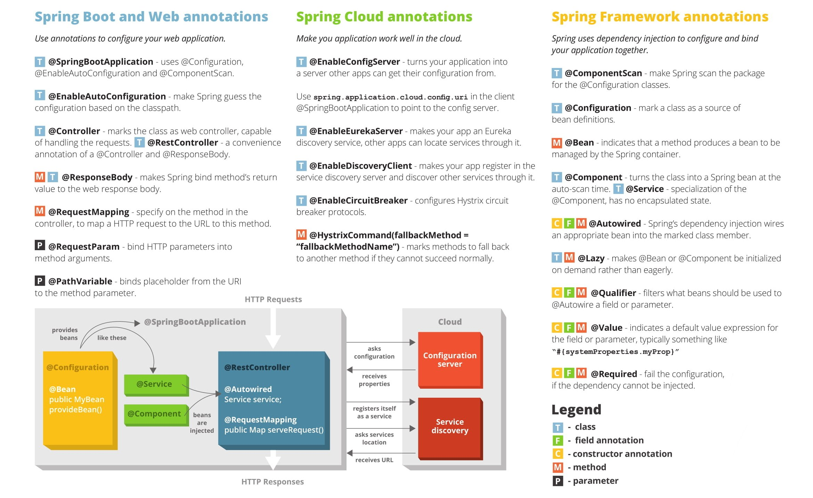

# Java and Java Programming Models. Open Source Microservices Frameworks

1. [Introduction](#introduction)
    1. [How to migrate Java workloads to containers](#how-to-migrate-java-workloads-to-containers)
    2. [Existing Java Implementations](#existing-java-implementations)
        1. [Which Version of JDK Should I Use?](#which-version-of-jdk-should-i-use)
        2. [Amazon Corretto OpenJDK distribution](#amazon-corretto-openjdk-distribution)
    3. [Use Java 11](#use-java-11)
    4. [Java 17](#java-17)
    5. [Java 18](#java-18)
    6. [Java 19](#java-19)
2. [Java Programming Models (Frameworks)](#java-programming-models-frameworks)
3. [Jakarta EE](#jakarta-ee)
4. [Eclipse MicroProfile](#eclipse-microprofile)
    1. [Server Vendors providing MicroProfile runtimes](#server-vendors-providing-microprofile-runtimes)
5. [Hibernate](#hibernate)
6. [Spring](#spring)
    1. [SpringBoot](#springboot)
        1. [SpringBoot with Docker](#springboot-with-docker)
        2. [SpringBoot Tools](#springboot-tools)
        3. [Endpoints for k8s probes exposed by SpringBoot](#endpoints-for-k8s-probes-exposed-by-springboot)
            1. [Demos](#demos)
        4. [Spring Cloud](#spring-cloud)
            1. [Spring Cloud Kubernetes](#spring-cloud-kubernetes)
            2. [Spring Cloud Config and Spring Cloud Config Server](#spring-cloud-config-and-spring-cloud-config-server)
            3. [Secure Secrets with Spring Cloud Vault and alternatives](#secure-secrets-with-spring-cloud-vault-and-alternatives)
7. [Quarkus](#quarkus)
8. [Kogito cloud-native business automation framework](#kogito-cloud-native-business-automation-framework)
9. [Thorntail (aka WildFly Swarm)](#thorntail-aka-wildfly-swarm)
10. [Spring Boot VS MicroProfile](#spring-boot-vs-microprofile)
11. [Quarkus vs Spring Boot](#quarkus-vs-spring-boot)
12. [More Java Frameworks or Libraries](#more-java-frameworks-or-libraries)
13. [Logging in Java](#logging-in-java)
14. [Java Logger Implementations](#java-logger-implementations)
15. [Java Testing Frameworks](#java-testing-frameworks)
16. [Debugging Java Threads](#debugging-java-threads)
17. [Lombok](#lombok)
18. [Project Helidon](#project-helidon)
19. [Videos](#videos)
20. [Images](#images)
21. [Tweets](#tweets)

## Introduction

- [reddit.com/r/java](https://www.reddit.com/r/java)
- [medium.com/@javachampions : Java is still free](https://medium.com/@javachampions/java-is-still-free-2-0-0-6b9aa8d6d244)
- [Oracle Java 11 and OpenJDK](https://blog.joda.org/2018/09/do-not-fall-into-oracles-java-11-trap.html)
- [developers.redhat.com: The future of Java and OpenJDK updates without Oracle support](https://developers.redhat.com/blog/2018/09/24/the-future-of-java-and-openjdk-updates-without-oracle-support/)
- [redhat.com: The history and future of OpenJDK](https://www.redhat.com/en/blog/history-and-future-openjdk)
- [javarevisited.blogspot.com: The 2020 Java Developer RoadMap 🌟](https://javarevisited.blogspot.com/2019/10/the-java-developer-roadmap.html)
- [marcobehler.com: Java Versions and Features 🌟](https://www.marcobehler.com/guides/a-guide-to-java-versions-and-features)
- [advancedweb.hu: A categorized list of all Java and JVM features since JDK 8 to 14](https://advancedweb.hu/a-categorized-list-of-all-java-and-jvm-features-since-jdk-8-to-14/)
- [JDK 15: The new features in Java 15](https://www.infoworld.com/article/3534133/jdk-15-the-new-features-in-java-15.html) Just-arrived update to standard Java features text blocks, hidden classes, the Z Garbage Collector, and previews of pattern matching and records.
- [GitHub Welcomes the OpenJDK Project!](https://github.blog/2020-09-30-github-welcomes-the-openjdk-project/)
- [advancedweb.hu: A categorized list of all Java and JVM features since JDK 8 to 16](https://advancedweb.hu/a-categorized-list-of-all-java-and-jvm-features-since-jdk-8-to-16/)
- [javaconceptoftheday.com: Java 9 Interface Private Methods](https://javaconceptoftheday.com/java-9-interface-private-methods/)
- [javatechonline.com: Making Java easy to learn - Microservices In Java 🌟](https://javatechonline.com/microservices-in-java/) The __top five languages that are using Microservices are Java, Python, C++, Ruby and Golang__. Although this data is based on the number of companies using it. Again __Microservices in Java is leading the table__.
- [java-success.com: 01: Q07 – Q12 Java Micro & Web services Interview Q&As](https://www.java-success.com/01b-%e2%99%a6-40-java-web-services-basics-interview-qas-q07-q12/)
- [javatechonline.com: Making Java easy to learn - OOPs Design Principles](https://javatechonline.com/oops-design-principles/)
- [javatechonline.com: Making Java easy to learn - Spring Boot Annotations With Examples](https://javatechonline.com/spring-boot-annotations-with-examples/)
- [dzone: Java Creator James Gosling Interview](https://dzone.com/articles/java-creator-james-gosling-interview)
- [dzone: How can Java bring you into Kubernetes-Native Future](https://dzone.com/articles/how-can-java-bring-you-into-kubernetes-native-futu)
- [infoq.com: Java 17, the Next Long-Term Support Release, is Now Available](https://www.infoq.com/news/2021/09/java17-released/)
- [developers.redhat.com: Shenandoah in OpenJDK 17: Sub-millisecond GC pauses](https://developers.redhat.com/articles/2021/09/16/shenandoah-openjdk-17-sub-millisecond-gc-pauses)
- [tschatzl.github.io: JDK 17 G1/Parallel GC changes](https://tschatzl.github.io/2021/09/16/jdk17-g1-parallel-gc-changes.html)
- [dzone: Choosing Library To Build Rest API in Java](https://dzone.com/articles/building-rest-api-in-java) Java library for restful API, tech stack choices for building REST API in Java.
- [developers.redhat.com: Modernizing Enterprise Java: A cloud native guide for developers](https://developers.redhat.com/articles/2021/11/30/modernizing-enterprise-java-cloud-native-guide-developers)
- [medium.com/javarevisited: Top 5 Frameworks Java developers can learn for Microservices Development in 2022](https://medium.com/javarevisited/top-5-frameworks-java-developers-can-learn-for-microservices-development-in-2022-848da66d6651)
- [java67.com: How to Create and Start Multiple Threads in Java? - Example Tutorial](https://www.java67.com/2016/05/how-to-use-multiple-threads-in-java.html)
- [foojay.io: Top 10 Java Language Features](https://foojay.io/today/top-10-java-language-features/)
- [==geeksforgeeks.org: 5 Best Java Frameworks For Microservices==](https://www.geeksforgeeks.org/5-best-java-frameworks-for-microservices/)
- [medium.com/@aritra.chatterjee_: Hexagonal architecture in java](https://medium.com/@aritra.chatterjee_/hexagonal-architecture-in-java-7ac8f4bea753) This article will implement the basic concepts of Hexagonal Architecture in Java.
- [betterprogramming.pub: Learn SOLID Design Principles in Java by Coding It](https://betterprogramming.pub/learn-solid-design-principles-in-java-by-coding-it-dcbf64a17b53) An in-depth explanation of all SOLID Design Principles with real-world use cases and code examples
- [analyticsinsight.net: Why is Java the Most Unsuitable Programming Language for Startups?](https://www.analyticsinsight.net/why-is-java-the-most-unsuitable-programming-language-for-startups/)
- [medium.com/javarevisited: Do you know about the different microservices frameworks for Java? 🌟](https://medium.com/javarevisited/do-you-know-about-the-different-microservices-frameworks-for-java-90b61f8cdbd7)

### How to migrate Java workloads to containers

- [enterprisersproject.com: How to migrate Java workloads to containers: 3 considerations](https://enterprisersproject.com/article/2021/6/how-migrate-java-workloads-containers-3-considerations) As IT teams weigh what to containerize and migrate to a cloud environment, they need to evaluate many Java workloads. Experts explain three key factors
- [==piotrminkowski.com: Best Practices for Java Apps on Kubernetes== 🌟](https://piotrminkowski.com/2023/02/13/best-practices-for-java-apps-on-kubernetes/)

### Existing Java Implementations

- [Oracle Java](https://www.oracle.com/technetwork/java/javase/overview/index.html)
    - [blogs.oracle.com: Introducing the Free Java License (Java 17)](https://blogs.oracle.com/cloud-infrastructure/post/introducing-free-java-license)
- [Oracle OpenJDK](https://jdk.java.net/11/)
- [IBM JDK](https://developer.ibm.com/javasdk/) (based on [Eclipse OpenJ9](https://www.eclipse.org/openj9/))
- [Red Hat OpenJDK](https://developers.redhat.com/products/openjdk/download)
- [AdoptOpenJDk](https://adoptopenjdk.net/) (based on [Eclipse OpenJ9](https://www.eclipse.org/openj9/))
- [docs.microsoft.com: Microsoft OpenJDK](https://docs.microsoft.com/en-us/java/openjdk/overview)

#### Which Version of JDK Should I Use?

- http://whichjdk.com 🌟
- [==piotrminkowski.com: Which JDK to Choose on Kubernetes== 🌟](https://piotrminkowski.com/2023/02/17/which-jdk-to-choose-on-kubernetes/)

#### Amazon Corretto OpenJDK distribution

- [Amazon Corretto](https://aws.amazon.com/corretto/) No-cost, multiplatform, production-ready distribution of OpenJDK. Corretto comes with long-term support that will include performance enhancements and security fixes. Amazon runs Corretto internally on thousands of production services and Corretto is certified as compatible with the Java SE standard. With Corretto, you can develop and run Java applications on popular operating systems, including Linux, Windows, and macOS.
- Amazon has been putting a lot of effort into Java.  One of the central themes has been the reduction of latency. - [youtube: Amazon Corretto, A Journey into Latency Reduction](https://www.youtube.com/watch?v=S4IrAZ5wT3c&ab_channel=SeaJUG) Corretto is a multi-platform, production-ready distribution of OpenJDK, supported by Amazon. We will talk about the Corretto project, it’s principals, and walk through examples that drove performance gains, latency reduction, and cost reduction in some of the biggest services in AWS.

### Use Java 11

- [It’s time! Migrating to Java 11 🌟](https://medium.com/criciumadev/its-time-migrating-to-java-11-5eb3868354f9)
- [Oracle's Java 11 trap - Use OpenJDK instead! 🌟](https://blog.joda.org/2018/09/do-not-fall-into-oracles-java-11-trap.html)
- [__AdoptOpenJDK 11__ Is the New Default 🌟](https://blog.adoptopenjdk.net/2020/06/adoptopenjdk-11-new-default/)
- [All You Need To Know For Migrating To Java 11](https://blog.codefx.org/java/java-11-migration-guide/)

### Java 17

- [tecmint.com: How to Install Java 17 on RHEL-based Linux Distributions](https://www.tecmint.com/install-java-on-centos-rhel-fedora/)
- [==kstefanj.github.io: GC progress from JDK 8 to JDK 17==](https://kstefanj.github.io/2021/11/24/gc-progress-8-17.html) JVM with <5ms GC pauses (ZGC). JDK17 is a huge leap forward in benchmark after benchmark. Upgrade as fast as you can. Amazon’s Corretto builds are available for a huge number of platforms and distribution channels. The JRE disappeared with jdk9: use jlink to assemble exactly the JRE you need.

### Java 18

- [openjdk.java.net: JEP 413: Code Snippets in Java API Documentation](https://openjdk.java.net/jeps/413)

### Java 19

- [infoq.com: Virtual Threads: New Foundations for High-Scale Java Applications](https://www.infoq.com/articles/java-virtual-threads/)

## Java Programming Models (Frameworks)

- [Best Java Frameworks Solutions](https://www.itcentralstation.com/categories/java-frameworks) The best Java Frameworks vendors are __Apache Spark__, __Spring Boot__, __Oracle Application Development Framework (Oracle ADF)__, __Jakarta EE__, and __Open Liberty__. Apache is the top solution according to IT Central Station reviews and rankings. One reviewer writes: "Fast performance and has an easy initial setup", and another reviewer writes: "Easy to use and is capable of processing large amounts of data". The 2nd best product is Spring Boot. A user writes: "Very smooth implementation; excellent features for monitoring and tracking network calls ", and another reviewer writes: "Makes it difficult to support a specific functionality in a user-friendly manner, but simplifies application deployment".
- __Open Source Microservices Frameworks__ (frameworks for microservices development):
    - [Spring](https://spring.io/projects/spring-boot)
    - [MicroProfile](https://microprofile.io)

Java Programming Model|Technology|Cloud Native (microservices)|Platform
:----|:---|:---|:---
[Java EE](https://en.wikipedia.org/wiki/Java_Platform,_Enterprise_Edition) [Java EE at a Glance](https://www.oracle.com/java/technologies/java-ee-glance.html)|Frontend + Backend  Java EE Monoliths|No|Java EE Middleware Servers (WAS, WebLogic, JBoss EAP, etc)
[Jakarta EE (Java EE renamed)](https://jakarta.ee/)|Frontend + Backend|Yes|OpenShift, Kubernetes, etc
[MicroProfile](https://microprofile.io/)|Backend (RESTful)|Yes|OpenShift, Kubernetes, etc
[SpringBoot (Spring)](https://spring.io/projects/spring-boot)|Backend (RESTful)|Yes|OpenShift, Kubernetes, etc
[Spring Cloud (Spring)](https://spring.io/projects/spring-cloud)|Backend (RESTful)|Yes|OpenShift, Kubernetes, etc
[Quarkus](https://quarkus.io/)|Backend (RESTful)|Yes|OpenShift, Kubernetes, etc
[Thorntail](https://thorntail.io/)|Backend (RESTful)|Yes|OpenShift, Kubernetes, etc
etc|||

- [dev.to: 5 Best Java Frameworks to Learn in 2022 for Microservices and Cloud Native Development](https://dev.to/javinpaul/5-best-java-frameworks-to-learn-in-2022-for-microservices-and-cloud-native-development-4732)

## Jakarta EE

- [developers.redhat.com: Jakarta EE 8: The new era of Java EE explained](https://developers.redhat.com/blog/2019/09/12/jakarta-ee-8-the-new-era-of-java-ee-explained/)
- [developers.redhat.com: Making Java programs cloud-ready, Part 1: An incremental approach using Jakarta EE and MicroProfile](https://developers.redhat.com/articles/2021/06/25/making-java-programs-cloud-ready-part-1-incremental-approach-using-jakarta-ee#)
- [developers.redhat.com: Making Java programs cloud-ready, Part 2: Upgrade the legacy Java application to Jakarta EE](https://developers.redhat.com/articles/2021/06/28/making-java-programs-cloud-ready-part-2-upgrade-legacy-java-application-jakarta)

## Eclipse MicroProfile

- [Eclipse MicroProfile Project](https://projects.eclipse.org/projects/technology.microprofile) The Eclipse MicroProfile project is aimed at
optimizing Enterprise Java for the microservices architecture.
    - Many innovative "microservice" Enterprise Java environments and frameworks already exist in the Java ecosystem. These projects are creating new features and capabilities to address microservice architectures -- leveraging both Java EE and non-Java EE technologies.
    - The goal of the Eclipse MicroProfile project is to iterate and innovate in short cycles to propose new common APIs and functionality, get community approval, release, and repeat.  Eventually, the outputs of this project could be submitted to the Eclipse Jakarta EE, JCP, OpenJDK or any relevant standards body.
- [MicroProfile.io](https://microprofile.io/) Optimizing Enterprise Java for a Microservices Architecture
- [developers.redhat.com: Eclipse MicroProfile for Spring Boot developers](https://developers.redhat.com/blog/2018/11/21/eclipse-microprofile-for-spring-boot-developers/)
- [Eclipse MicroProfile: 5 Things You Need to Know 🌟](https://medium.com/@alextheedom/eclipse-microprofile-5-things-you-need-to-know-e7a0bc9a3fb6)
- [developers.redhat.com: Develop Eclipse MicroProfile applications on Red Hat JBoss Enterprise Application Platform Expansion Pack 1.0 with Red Hat CodeReady Workspaces](https://developers.redhat.com/blog/2020/07/01/develop-eclipse-microprofile-applications-on-red-hat-jboss-enterprise-application-platform-expansion-pack-1-0-with-red-hat-codeready-workspaces/)
- [infoq.com: Virtual Panel: The MicroProfile Influence on Microservices Frameworks](https://www.infoq.com/articles/microprofile-microservices/)

### Server Vendors providing MicroProfile runtimes

- [WebSphere Liberty from IBM](https://developer.ibm.com/wasdev/websphere-liberty/)
- [TomEE from Tomitribe](http://tomee.apache.org/)
- [Payara](https://www.payara.fish/)
- [RedHat’s WildFly Swarm](http://wildfly-swarm.io/)
- [KumuluzEE](https://ee.kumuluz.com/)

 ## Hibernate

- [==medium: Multi-Tenancy Implementation using Spring Boot + Hibernate== 🌟](https://medium.com/swlh/multi-tenancy-implementation-using-spring-boot-hibernate-6a8e3ecb251a)
- [stackoverflow.com: How to map a MySQL JSON column to a Java entity property using JPA and Hibernate](https://stackoverflow.com/questions/44308167/how-to-map-a-mysql-json-column-to-a-java-entity-property-using-jpa-and-hibernate)
- [vladmihalcea.com: How to encrypt and decrypt data with Hibernate](https://vladmihalcea.com/how-to-encrypt-and-decrypt-data-with-hibernate/)
- [vladmihalcea.com: Optimistic vs. Pessimistic Locking (hibernate)](https://vladmihalcea.com/optimistic-vs-pessimistic-locking/)
- [==stackoverflow.com: What are the differences between the different saving methods in Hibernate?==](https://stackoverflow.com/questions/161224/what-are-the-differences-between-the-different-saving-methods-in-hibernate/54907032?stw=2#54907032)

## Spring

- [Spring](https://spring.io/)
- [Spring Framework Architecture 🌟](https://www.javacodegeeks.com/2019/02/spring-framework-architecture.html)
- [javatutorial.net: Introduction to Spring Web Framework](https://javatutorial.net/introduction-to-spring-web-framework)
- [javarevisited.blogspot.com: 10 JdbcTemplate Examples in Spring Framework](https://javarevisited.blogspot.com/2020/05/10-jdbctemplate-examples-in-spring.html)
- [medium.com: Top 10 Courses to Learn Microservices in Java and Spring Framework](https://medium.com/javarevisited/top-5-courses-to-learn-microservices-in-java-and-spring-framework-e9fed1ba804d)
- [dzone: How to Create Microservices Using Spring 🌟](https://dzone.com/articles/how-to-create-microservices-using-spring) Let’s consider the use case of BookMyHotel Web Application, developed by a company known as MyInternetSolutions.
- [spring.io: A Java 17 and Jakarta EE 9 baseline for Spring Framework 6](https://spring.io/blog/2021/09/02/a-java-17-and-jakarta-ee-9-baseline-for-spring-framework-6)
- [blog.frankel.ch: Annotation-free Spring](https://blog.frankel.ch/annotation-free-spring/)
- [java67.com: 10 Spring Framework Annotations Java Developer should learn - Example Tutorial](https://www.java67.com/2018/11/top-10-spring-framework-annotations-for-java-developers.html)
- [javarevisited.blogspot.com: Role based Access control using Spring Security and MVC, Mapping LDAP Groups to Authorities for Authorization](https://javarevisited.blogspot.com/2013/07/role-based-access-control-using-spring-security-ldap-authorities-mapping-mvc.html)
- [==odedia.org: Production Considerations for Spring on Kubernetes== 🌟🌟🌟](https://odedia.org/production-considerations-for-spring-on-kubernetes)

### SpringBoot

- [SpringBoot](https://spring.io/projects/spring-boot)
- [dzone: All About Spring Boot (Tutorials and Articles)](https://dzone.com/articles/spring-boot-framework-tutorials)
- [jaxenter.com: CI/CD for Spring Boot Microservices: Part 1](https://jaxenter.com/cicd-microservices-docker-162408.html)
- [jaxenter.com: CI/CD for Spring Boot Microservices: Part 2. Extending CI/CD: Kubernetes Continuous Deployment for Microservices](https://jaxenter.com/kubernetes-microservices-162690.html)
- [dzone: Deploying Spring Boot App to JBoss Wildfly](https://dzone.com/articles/deploying-spring-boot-app-to-jboss-wildfly)
- [Spring Boot: ¿war o jar? Ambos](https://www.adictosaltrabajo.com/2018/12/13/spring-boot-war-o-jar-ambos/)
- [javatutorial.net: Spring vs. Java EE](https://javatutorial.net/spring-vs-java-ee)
- [medium.com: Spring Cloud kubernetes for hybrid microservices architecture](https://medium.com/javarevisited/spring-cloud-kubernetes-for-hybrid-microservices-architecture-f487d67328d0)
- [10 Free Spring Boot Courses and Tutorials for Java Developers](https://medium.com/javarevisited/10-free-spring-boot-tutorials-and-courses-for-java-developers-53dfe084587e)
- [__Spring Boot Istio library__: Spring Boot library for integration with Istio](https://piotrminkowski.com/2020/06/10/spring-boot-library-for-integration-with-istio/)
- [Spring Boot native images. The path towards Spring Boot native applications](https://spring.io/blog/2020/06/10/the-path-towards-spring-boot-native-applications)
- [piotrminkowski.com: Best practices for microservices on kubernetes 🌟](https://piotrminkowski.com/2020/03/10/best-practices-for-microservices-on-kubernetes/)
- [piotrminkowski.com: Spring Boot Autoscaling on kubernetes 🌟](https://piotrminkowski.com/2020/11/05/spring-boot-autoscaling-on-kubernetes/)
- [spring.io: What's new in Spring Boot 2.4 🌟](https://spring.io/blog/2021/01/17/what-s-new-in-spring-boot-2-4)
    - [Changes to Application properties/yaml](https://youtu.be/lgyO9C9zdrg?t=1489s)
- [arnoldgalovics.com: Java and Spring Boot multiline log support for Fluentd (EFK stack)](https://arnoldgalovics.com/java-and-spring-boot-multiline-log-support-for-fluentd-efk-stack/)
- [developers.redhat.com: Spring Boot on Quarkus: Magic or madness?](https://developers.redhat.com/blog/2021/02/09/spring-boot-on-quarkus-magic-or-madness/)
- [codecentric's Spring Boot Admin UI 🌟](https://github.com/codecentric/spring-boot-admin) __Admin UI for administration of spring boot applications__
- [piotrminkowski.com: Spring Boot Tips, Tricks and Techniques](https://piotrminkowski.com/2021/01/13/spring-boot-tips-tricks-and-techniques/)
- [==javatechonline.com: How To Work With Apache Kafka In Spring Boot?==](https://javatechonline.com/how-to-work-with-apache-kafka-in-spring-boot/)
- [dzone: How To Run the Spring Boot Application as a Stand-Alone Java Application](https://dzone.com/articles/how-to-run-the-spring-boot-application-as-a-stand) In this Spring Boot video tutorial, take a closer look at how to run the Spring Boot application as a stand-alone Java application and RESTful Web Services.
- [==vladmihalcea.com: The best way to log SQL statements with Spring Boot==](https://vladmihalcea.com/log-sql-spring-boot/)
- [javarevisited.blogspot.com: Spring Boot + Angular Example Tutorial for Java Developers](https://javarevisited.blogspot.com/2022/01/spring-boot-angular-example-tutorial.html#axzz7HV4HFjED)
- [piotrminkowski.com: Distributed Transactions in Microservices with Kafka Streams and Spring Boot](https://piotrminkowski.com/2022/01/24/distributed-transactions-in-microservices-with-kafka-streams-and-spring-boot/)
- [==vladmihalcea.com: Spring Boot Application Properties== 🌟](https://vladmihalcea.com/spring-boot-application-properties/)
- [javarevisited.blogspot.com: How to log SQL statements in Spring Boot? Example Tutorial](https://javarevisited.blogspot.com/2022/02/how-to-log-sql-statements-in-spring.html)
- [geeksforgeeks.org: Best way to master spring boot , a complete roadmap](https://www.geeksforgeeks.org/best-way-to-master-spring-boot-a-complete-roadmap/)
- [medium.com/shoutloudz: Microservice: Developing an Authentication Service using Spring Boot](https://medium.com/shoutloudz/microservice-developing-an-authentication-service-using-spring-boot-d421b8802712)
- [java67.com: How to set the logging level with application.properties in Spring Boot - Example Tutorial](https://www.java67.com/2021/10/how-to-set-logging-level-in-spring-boot-.html)
- [==medium.com/@hubian: 16 Best Practices in Spring Boot Production== 🌟](https://medium.com/@hubian/16-best-practices-in-spring-boot-production-62c065a6145c)
- [==javaguides.net: Event-Driven Microservices using Spring Boot and Kafka==](https://www.javaguides.net/2022/07/event-driven-microservices-using-spring-boot-and-apache-kafka.html?spref=tw)
- [==piotrminkowski.com: Microservices with Spring Boot 3 and Spring Cloud== 🌟](https://piotrminkowski.com/2023/03/13/microservices-with-spring-boot-3-and-spring-cloud/)
- [==javaguides.net: Spring Boot 3 REST API Documentation using SpringDoc OpenAPI==](https://www.javaguides.net/2023/03/spring-boot-3-rest-api-documentation.html)
- [javaguides.net: Spring Boot Microservices - Spring Cloud API Gateway](https://www.javaguides.net/2022/10/spring-boot-microservices-spring-cloud-api-gateway.html)
- [Spring Boot Complete Guide](https://helpercodes.com/spring-boot-complete-tutorial/)

#### SpringBoot with Docker

- [spring.io: spring boot with docker](https://spring.io/guides/gs/spring-boot-docker/)
- [spring.io: Creating Docker images with Spring Boot 2.3.0.M1](https://spring.io/blog/2020/01/27/creating-docker-images-with-spring-boot-2-3-0-m1)
- [learnk8s.io: Developing and deploying Spring Boot microservices on Kubernetes](https://learnk8s.io/spring-boot-kubernetes-guide)
- [youtube: Creating Docker Images With Spring Boot](https://www.youtube.com/watch?v=1w1Jv9qssqg)
- [dev.to: The Simple Guide To Dockerizing Spring Boot](https://dev.to/jarjanazy/the-simple-guide-to-dockerizing-spring-boot-og4)
- [infoq.com: Spring Boot 2.6 Improves Docker Images and Metrics, Version 2.4 Is EOL](https://www.infoq.com/news/2021/12/spring-boot-2-6/)
- [==dev.to/francescoxx: Java CRUD Rest API using Spring Boot, Hibernate, Postgres, Docker and Docker Compose==](https://dev.to/francescoxx/java-crud-rest-api-using-spring-boot-hibernate-postgres-docker-and-docker-compose-5cln)

#### SpringBoot Tools

- High-level abstractions/tools to run SpringBoot application on kubernetes without having to write 10,000 lines YAML. Tools that can automate the generation of Kubernetes manifests, so you concentrate only on building your business logic. Dekorate even supports annotations spring-like `@KubernetesApplication(name="my-app")` in your code, that generates your deployment manifest yml:
- [odo](https://odo.dev) CLI tool
- [Dekorate](https://dekorate.io) Java library, has a Spring Boot support
- [JKube](https://eclipse.org/jkube/) Maven plugin
- [Skaffold --generate-manifests](https://skaffold.dev/docs/pipeline-stages/init/#--generate-manifests-flag)
- [Spring Cloud Kubernetes](https://spring.io/projects/spring-cloud-kubernetes)
- [testcontainers-spring-boot 🌟](https://github.com/Playtika/testcontainers-spring-boot) Container auto-configurations for spring-boot based integration tests. If you use Testcontainers with Spring Boot Hoja balanceándose en el viento you may be interested in the Playtika_Ltd Testcontainers library that provides auto-configurations for springboot based integration tests. It contains modules e.g. for kafka rabbitmq mongodb
- [github.com/piomin/spring-boot-logging](https://github.com/piomin/spring-boot-logging) A library for logging HTTP request/response for Spring Boot application and integration with Elastic Stack

#### Endpoints for k8s probes exposed by SpringBoot

- Spring Boot provides the built-in Actuator feature to generate and expose endpoints for Kubernetes liveness/readiness probes:
    - We need to enable it in config
    - We can select components to analyze
    - We can expose a probe on the app main port even if mgmt port is configured
- [github.com/spring-projects: springboot enables these probes automatically when running in k8s](https://github.com/spring-projects/spring-boot/blob/main/spring-boot-project/spring-boot-actuator-autoconfigure/src/main/java/org/springframework/boot/actuate/autoconfigure/availability/AvailabilityProbesAutoConfiguration.java#L73)

<blockquote class="twitter-tweet">
Spring Boot🍃 provides the built-in Actuator feature to generate and expose endpoints for Kubernetes liveness/readiness probes.  1⃣ We need to enable it in config  2⃣ We can select components to analyze 3⃣ We can expose a probe on the app main port even if mgmt port is configured <a href="https://t.co/h7mA5W0zUH">pic.twitter.com/h7mA5W0zUH</a>
&mdash; Piotr Mińkowski (@piotr_minkowski) <a href="https://twitter.com/piotr_minkowski/status/1629043458768764928?ref_src=twsrc%5Etfw">February 24, 2023</a></blockquote> 

##### Demos

- [Salaboy/From Monolith to K8s](https://github.com/Salaboy/from-monolith-to-k8s) Workshop-style guide for rearchitecting a Java Monolith application to a Cloud Native architecture running in Kubernetes
- [dyser/kubernetes-intro](https://github.com/dsyer/kubernetes-intro)

#### Spring Cloud

- [Spring Cloud](https://spring.io/projects/spring-cloud)

##### Spring Cloud Kubernetes

- [github: Spring Cloud Kubernetes 🌟](https://github.com/spring-cloud/spring-cloud-kubernetes)
- [Spring Cloud Kubernetes for hybrid microservices architecture](https://medium.com/javarevisited/spring-cloud-kubernetes-for-hybrid-microservices-architecture-f487d67328d0)
- [piotrminkowski.com: Microservices with spring cloud kubernetes](https://piotrminkowski.com/2019/12/20/microservices-with-spring-cloud-kubernetes)

##### Spring Cloud Config and Spring Cloud Config Server

- [Spring Cloud Config](https://cloud.spring.io/spring-cloud-config/reference/html/)
- [Spring Cloud Config Server: Git Backend](https://cloud.spring.io/spring-cloud-config/reference/html/#_git_backend)
- [developer.okta.com: Spring Cloud Config for Shared Microservice Configuration](https://developer.okta.com/blog/2020/12/07/spring-cloud-config)
- [redhat.com: Spring Boot Microservices on Red Hat OpenShift Container Platform 3 - Software Stack - Externalized Configuration](https://access.redhat.com/documentation/en-us/reference_architectures/2017/html-single/spring_boot_microservices_on_red_hat_openshift_container_platform_3/index#spring_cloud_config) [Spring Cloud Config](https://cloud.spring.io/spring-cloud-config/spring-cloud-config.html) provides server and client-side support for externalized configuration in a distributed system. With the Config Server you have a central place to manage external properties for applications across all environments.
- [dzone: Spring Cloud Config Server on Kubernetes (Part 1)](https://dzone.com/articles/spring-cloud-config-server-on-kubernetes-part-1)
- [dzone: Spring Cloud Config Server on Kubernetes (Part 2)](https://dzone.com/articles/spring-cloud-config-server-on-kubernetes-part-2) Time to bring your services to Kubernetes.
- [piotrminkowski.com: Spring Microservices Security Best Practices 🌟](https://piotrminkowski.com/2021/05/26/spring-microservices-security-best-practices/)
- [==baeldung.com: Using Spring Cloud Config Without Git==](https://www.baeldung.com/spring-cloud-config-without-git)

##### Secure Secrets with Spring Cloud Vault and alternatives

- [cloud.spring.io: Spring Cloud Vault 🌟](https://cloud.spring.io/spring-cloud-vault/reference/html/)
- [developer.okta.com: Secure Secrets With Spring Cloud Config and Vault 🌟](https://developer.okta.com/blog/2020/05/04/spring-vault) Nowadays it is widely recommended to never store secret values in code. Therefore, this tutorial will demonstrate the following alternatives:
    - Using environment variables for Spring Boot secrets
    - Secrets encryption with Spring Cloud Config
    - Secrets management with HashiCorp’s Vault
    - Using Spring Cloud Vault

## Quarkus

- [quarkus.io](https://quarkus.io/) Quarkus is a Kubernetes-native Java stack that is crafted from best-of-breed Java libraries and standards, and tailored for containers and cloud deployments
- [Quarkus Images](https://github.com/quarkusio/quarkus-images) This repository contains the container images used by Quarkus.
- [quarkus.io: Quarkus for Spring Developers](https://quarkus.io/blog/quarkus-for-spring-developers/)
- [redhat.com: Red Hat drives future of Java with cloud-native, container-first Quarkus](https://www.redhat.com/en/blog/red-hat-drives-future-java-cloud-native-container-first-quarkus)
- [developers.redhat.com: Quarkus: A quick-start guide to the Kubernetes-native Java stack](https://developers.redhat.com/articles/quarkus-quick-start-guide-kubernetes-native-java-stack/)
- [quarkus.io: Quarkus support in IDE's](https://quarkus.io/blog/march-of-ides/)
- [dzone: quarkus refcard](https://dzone.com/refcardz/quarkus-1)
- [dzone: Build a Java REST API With Quarkus](https://dzone.com/articles/build-a-java-rest-api-with-quarkus)
- [developers.redhat.com: Autowire MicroProfile into Spring with Quarkus](https://developers.redhat.com/blog/2019/10/02/autowire-microprofile-into-spring-with-quarkus/)
- [dmcommunity.org: Who will win? Spring Boot or Quarkus](https://dmcommunity.org/2020/01/12/who-will-win-spring-boot-or-quarkus/)
- [developers.redhat.com: How Quarkus brings imperative and reactive programming together](https://developers.redhat.com/blog/2019/11/18/how-quarkus-brings-imperative-and-reactive-programming-together/)
- [developers.redhat.com: Migrating a Spring Boot microservices application to Quarkus](https://developers.redhat.com/blog/2020/04/10/migrating-a-spring-boot-microservices-application-to-quarkus/)
- [Quarkus, a Kubernetes-native Java runtime, now fully supported by Red Hat](https://developers.redhat.com/blog/2020/05/28/quarkus-a-kubernetes-native-java-runtime-now-fully-supported-by-red-hat/)
- [The road to Quarkus GA: Completing the first supported Kubernetes-native Java stack](https://developers.redhat.com/blog/2020/06/04/the-road-to-quarkus-ga-completing-the-first-supported-kubernetes-native-java-stack/)
- [containerjournal.com: Red Hat Adds Java Runtime for Kubernetes to Subscription](https://containerjournal.com/topics/container-ecosystems/red-hat-adds-java-runtime-for-kubernetes-to-subscription/) Quarkus provides access to a library of more than 200 extensions, including tools such as RESTEasy, Hibernate and Eclipse MicroProfile, along with specific extensions fo Red Hat cloud services such as Red Hat AMQ Streams, Red Hat AMQ Broker and Red Hat Fuse.
- [developers.redhat.com: Quarkus and Jakarta EE: Together, or not?](https://developers.redhat.com/blog/2020/09/11/quarkus-and-jakarta-ee-together-or-not)
- [youtube: CyberJUG-HH:Why is everybody talking about Quarkus?](https://www.youtube.com/watch?v=nXXPOS8gjtA) In this (Why is everybody talking about Quarkus?) Java User Group Hamburg (CyberJUG-HH) session I highlighted possible reasons for Quarkus' popularity, explained Quarkus' optimisation tricks, the differences between Jakarta EE / J2EE / Java EE application servers and Quarkus, discussed the role of MicroProfile and Jakarta EE, migrated a Java EE application to Quarkus, performed multiple deployments, decompiled some code, measured memory consumption and finally cross compiled the Java service to native code using GraalVM.
- [developers.redhat.com: Build an API using Quarkus from the ground up 🌟](https://developers.redhat.com/blog/2021/05/11/building-an-api-using-quarkus-from-the-ground-up/)
- [developers.redhat.com: RESTEasy Reactive and more in Quarkus 2.0](https://developers.redhat.com/articles/2021/07/01/resteasy-reactive-and-more-quarkus-20)
- [opensource.com: 3 reasons Quarkus 2.0 improves developer productivity on Linux 🌟](https://opensource.com/article/21/7/developer-productivity-linux) New features in Quarkus 2.0 make it easier to test code in the developer console.
- [redhat.com: Four reasons to try Quarkus (pdf checklist)](https://www.redhat.com/en/engage/four-reasons-quarkus-s-202002130647) Quarkus is an open source, Kubernetes-native Java™ framework tailored for GraalVM and OpenJDK HotSpot. It offers a full-stack framework, using top Java libraries and standards. With Quarkus, Java can be a leading platform in Kubernetes and serverless environments, while offering developers a unified reactive and imperative programming model to address a wider range of distributed application architectures. Download this checklist to learn 4 reasons why developers should use Quarkus as a programming tool.
- [developers.redhat.com: Deploy Quarkus everywhere with Red Hat Enterprise Linux (RHEL)](https://developers.redhat.com/blog/2021/04/07/deploy-quarkus-everywhere-with-red-hat-enterprise-linux-rhel)
- [infoq.com: Quarkus 2.0 Delivers Continuous Testing, CLI and Supports Minimal JDK 11](https://www.infoq.com/news/2021/08/quarkus-2-0-final-release/)
- [Quarkus - Dev UI 🌟](https://quarkus.io/guides/dev-ui)
- [dzone: A Java developer's guide to Quarkus](https://dzone.com/articles/a-java-developers-guide-to-quarkus) A new eBook demonstrates how developers can keep using the Java framework to build new serverless functions.
- [developers.redhat.com: Why should I choose Quarkus over Spring for my microservices?](https://developers.redhat.com/articles/2021/08/31/why-should-i-choose-quarkus-over-spring-my-microservices)
- Quarkus Tip: if you DON'T set a database URL, user, and password, QuarkusIO automatically starts your database using testcontainers if a Docker daemon is running. It is enabled in dev, test mode and applies to e.g. postgresql, mysql and mongodb.
- [developers.redhat.com: Quarkus for Spring developers: Getting started 🌟](https://developers.redhat.com/articles/2021/09/20/quarkus-spring-developers-getting-started)
- [dzone refcard: Getting Started With Quarkus Serverless Functions](https://dzone.com/refcardz/getting-started-with-quarkus-serverless-functions)
- [piotrminkowski.com: Quarkus Tips, Tricks and Techniques 🌟](https://piotrminkowski.com/2021/10/12/quarkus-tips-tricks-and-techniques/)
- [developers.redhat.com: Boost throughput with RESTEasy Reactive in Quarkus 2.2](https://developers.redhat.com/articles/2021/11/04/boost-throughput-resteasy-reactive-quarkus-22)
- [==javaadvent.com: You need more than containers. A short history of the mess we're in==](https://www.javaadvent.com/2021/12/you-need-more-than-containers-a-short-history-of-the-mess-were-in.html)
- [==developers.redhat.com: Quarkus for Spring developers: Kubernetes-native design patterns==](https://developers.redhat.com/articles/2021/10/11/quarkus-spring-developers-kubernetes-native-design-patterns)
- [infoq.com: Kubernetes Native Java with Quarkus](https://www.infoq.com/articles/native-java-quarkus/)
- [auth0.com: Java Microservices with Spring Boot and Spring Cloud](https://auth0.com/blog/java-spring-boot-microservices/) This tutorial shows you how to build a microservices architecture with Spring Boot and Spring Cloud.

## Kogito cloud-native business automation framework

- [redhat.com: Cloud-native business automation with Kogito](https://www.redhat.com/en/blog/cloud-native-business-automation-kogito)
- [kie.org](https://kie.org) Kogito is the next generation of business automation platforms focused on cloud-native development, deployment, and execution. Kogito is composed of the battle-tested projects of the KIE group: Drools, jBPM, and OptaPlanner.
    - [kogito.kie.org](https://kogito.kie.org)
- [dzone: Getting Started With Red Hat Business Automation Version 7.11 (i.e. Retail online web shop)](https://dzone.com/articles/getting-started-with-red-hat-business-automation-v) This last week the new release of the Red Hat Business Automation products went live, spanning Red Hat Process Automation Manager and **Red Hat Decision Manage**...

## Thorntail (aka WildFly Swarm)

- [Red Hat Thorntail](https://thorntail.io/) is a framework based on the popular [WildFly Java application server](https://wildfly.org/) to enable the creation of small, stand-alone microservice-based applications. Thorntail is capable of producing so-called just enough app-server to support each component of your system.

## Spring Boot VS MicroProfile

- [Dzone: Programming Styles Compared: Spring Framework vis-a-vis Eclipse MicroProfile 🌟🌟](https://dzone.com/articles/programming-styles-spring-boot-vis-a-vis-with-ecli)
- [ibm.com: Java Microservices with MicroProfile – RESTful APIs and Dependency Injection. For microservices-based Java apps, knowing how to create REST APIs is an essential skill. Eclipse MicroProfile makes it easier](https://www.ibm.com/cloud/blog/migrate-java-microservices-from-spring-to-microprofile-p2) Spring Boot or MicroProfile for Java microservices apps? Choose the path of least resistance. The Spring Boot and MicroProfile frameworks have many of the same goals (i.e., you can do everything in MicroProfile that you can do in Spring Boot). Both of them are built on top of the same core APIs; even though there are differences in some of the APIs, the work they do is similar.

## Quarkus vs Spring Boot

- [dzone: Microservices: Quarkus vs. Spring Boot](https://dzone.com/articles/microservices-quarkus-vs-spring-boot) In the era of containers (the ''Docker Age'') Java is still on top, but which is better? Spring Boot or Quarkus?

## More Java Frameworks or Libraries

- [JPA streamer 🌟](https://jpastreamer.org/) JPAstreamer is a library for expressing JPA/Hibernate queries as Java streams. It can be also integrated with Spring.
- [logbook](https://github.com/zalando/logbook) An extensible Java library for HTTP request and response logging

## Logging in Java

- [==medium.com/javarevisited: Logging in Java — Log4j vs Logback vs SLF4J== 🌟](https://medium.com/javarevisited/logging-in-java-log4j-vs-logback-vs-slf4j-88c533088d2a)

## Java Logger Implementations

- [GoodforGod/java-logger-benchmark](https://github.com/GoodforGod/java-logger-benchmark) JMH Benchmark for different Java Logger implementations.

## Java Testing Frameworks

- [dzone: The Best Java Testing Frameworks to focus in 2021](https://dzone.com/articles/the-best-java-testing-frameworks-to-focus-in-2021) Java Testing Frameworks provide standardized, extendable ways for programmers and developers to build any software application or web apps.
- [jfrunit](https://github.com/moditect/jfrunit) A JUnit extension for asserting JDK Flight Recorder events
    - [morling.dev: Introducing JfrUnit 1.0.0.Alpha1](https://www.morling.dev/blog/introducing-jfrunit-1-0-0-alpha1/)

## Debugging Java Threads

- [java-success.com: 5 Ways to debug thread-safety issues in Java](https://www.java-success.com/debugging-java-thread-safety-multi-threading-concurrency-issues/)

## Lombok

- https://projectlombok.org
- [adictosaltrabajo.com: Cómo reducir el código repetitivo con Lombok](https://www.adictosaltrabajo.com/2016/02/03/como-reducir-el-codigo-repetitivo-con-lombok/)
- [reflectoring.io: When Should I Use Project Lombok?](https://reflectoring.io/when-to-use-lombok/) Lombok is a loved and hated library in the Java world. It removes the need for boilerplate code but it may also introduce some subtle issues. This article shows some pros and cons so you can decide for yourself whether to use it.

## Project Helidon

- [Helidon.io](https://helidon.io/)
- [developer.okta.com: Build REST APIs and Native Java Apps with Helidon](https://developer.okta.com/blog/2022/01/06/native-java-helidon)

## Videos

  
Click to expand!

<iframe width="560" height="315" src="https://www.youtube.com/embed/1w1Jv9qssqg" frameborder="0" allow="accelerometer; autoplay; encrypted-media; gyroscope; picture-in-picture" allowfullscreen></iframe>

## Images

??? note "Click to expand!"

    

    
    

## Tweets

  
Click to expand!

<blockquote class="twitter-tweet">
Imagine needing to spend less😉 Guess what minimum heap size you need to run a <a href="https://twitter.com/QuarkusIO?ref_src=twsrc%5Etfw">@QuarkusIO</a> 2.0 *on JVM* to run a simple CRUD endpoint? (no toy: including <a href="https://twitter.com/Hibernate?ref_src=twsrc%5Etfw">@Hibernate</a> , <a href="https://twitter.com/resteasy?ref_src=twsrc%5Etfw">@resteasy</a>, Jackson, JTA transactions, DB connection pool, caching, <a href="https://twitter.com/vertx_project?ref_src=twsrc%5Etfw">@vertx_project</a> ,Netty, CDI via ArC, ...)
&mdash; Sanne (@SanneGrinovero) <a href="https://twitter.com/SanneGrinovero/status/1410889304520462336?ref_src=twsrc%5Etfw">July 2, 2021</a></blockquote> 

<blockquote class="twitter-tweet">
I&#39;m observing <a href="https://twitter.com/QuarkusIO?ref_src=twsrc%5Etfw">@QuarkusIO</a> for a long time. I think it&#39;s time to consider migration from Spring Boot into Quarkus especially if you develop on the Kubernetes-native platform. You may expect some tips in the near future - smth similar to <a href="https://twitter.com/hashtag/SpringBootTip?src=hash&amp;ref_src=twsrc%5Etfw">#SpringBootTip</a> series some months ago.
&mdash; Piotr Mińkowski (@piotr_minkowski) <a href="https://twitter.com/piotr_minkowski/status/1433341982009610241?ref_src=twsrc%5Etfw">September 2, 2021</a></blockquote> 

<blockquote class="twitter-tweet">
Quarkus Tip 💡  You can deploy the <a href="https://twitter.com/QuarkusIO?ref_src=twsrc%5Etfw">@QuarkusIO</a> application to <a href="https://twitter.com/hashtag/Kubernetes?src=hash&amp;ref_src=twsrc%5Etfw">#Kubernetes</a> without creating any <a href="https://twitter.com/hashtag/YAMLs?src=hash&amp;ref_src=twsrc%5Etfw">#YAMLs</a> manually. To do that you should include the Quarkus Kubernetes module, use dedicated application properties, and enable deployment during your Maven build. 👇👇👇  🏷️ <a href="https://twitter.com/hashtag/QuarkusTips?src=hash&amp;ref_src=twsrc%5Etfw">#QuarkusTips</a> <a href="https://t.co/pju8vVYBz7">pic.twitter.com/pju8vVYBz7</a>
&mdash; Piotr Mińkowski (@piotr_minkowski) <a href="https://twitter.com/piotr_minkowski/status/1435630584156631042?ref_src=twsrc%5Etfw">September 8, 2021</a></blockquote> 

<blockquote class="twitter-tweet">
Quarkus Tip 💡  You can easily build and run a native Quarkus <a href="https://twitter.com/graalvm?ref_src=twsrc%5Etfw">@graalvm</a> image on OpenShift using a single `oc` command and `ubi-quarkus-native-s2i` image builder. Such a build is performed fully on the cluster side. 👇  🏷️ <a href="https://twitter.com/hashtag/QuarkusTips?src=hash&amp;ref_src=twsrc%5Etfw">#QuarkusTips</a> <a href="https://t.co/98fCXNUWv6">pic.twitter.com/98fCXNUWv6</a>
&mdash; Piotr Mińkowski (@piotr_minkowski) <a href="https://twitter.com/piotr_minkowski/status/1435913459363950594?ref_src=twsrc%5Etfw">September 9, 2021</a></blockquote> 

<blockquote class="twitter-tweet">
Java 8 best practices cheat sheet: <a href="https://t.co/jbyzbxJs28">pic.twitter.com/jbyzbxJs28</a>
&mdash; Java Guides (@GuidesJava) <a href="https://twitter.com/GuidesJava/status/1469912399700365319?ref_src=twsrc%5Etfw">December 12, 2021</a></blockquote> 

<blockquote class="twitter-tweet">
5+ excellent GitHub repositories for every Java developer <a href="https://twitter.com/hashtag/github?src=hash&amp;ref_src=twsrc%5Etfw">#github</a> <a href="https://twitter.com/hashtag/Java?src=hash&amp;ref_src=twsrc%5Etfw">#Java</a>  Thread 👇
&mdash; Java Guides (@GuidesJava) <a href="https://twitter.com/GuidesJava/status/1479447029986201600?ref_src=twsrc%5Etfw">January 7, 2022</a></blockquote> 

<blockquote class="twitter-tweet">
Best Java blog websites for Java developers Thread 👇
&mdash; Java Guides (@GuidesJava) <a href="https://twitter.com/GuidesJava/status/1480035588753420288?ref_src=twsrc%5Etfw">January 9, 2022</a></blockquote> 

<blockquote class="twitter-tweet">
Java programmer roadmap <a href="https://t.co/KKdK0hdBB2">pic.twitter.com/KKdK0hdBB2</a>
&mdash; javinpaul (@javinpaul) <a href="https://twitter.com/javinpaul/status/1542741721020125184?ref_src=twsrc%5Etfw">July 1, 2022</a></blockquote> 

<blockquote class="twitter-tweet">
Spring and spring boot annotations: <a href="https://t.co/CwPxJabliI">pic.twitter.com/CwPxJabliI</a>
&mdash; Java Guides (@GuidesJava) <a href="https://twitter.com/GuidesJava/status/1581318845129584640?ref_src=twsrc%5Etfw">October 15, 2022</a></blockquote> 

<blockquote class="twitter-tweet">
The best ways to waste time in discussions in the Java world:  - Lombok VS. non-Lombok - ORMs VS. JDBC - Spring VS. JakartaEE  PSA: All of them are pointless. Save your time. Go ahead and work on stuff you consider important instead.
&mdash; Oliver Drotbohm 🥁 &amp; 👨‍💻 (@odrotbohm) <a href="https://twitter.com/odrotbohm/status/1595421237483741185?ref_src=twsrc%5Etfw">November 23, 2022</a></blockquote> 

<blockquote class="twitter-tweet">
Java Collections cheat sheet: <a href="https://t.co/X06xq0pCbL">pic.twitter.com/X06xq0pCbL</a>
&mdash; Java Guides (@GuidesJava) <a href="https://twitter.com/GuidesJava/status/1604182950030954496?ref_src=twsrc%5Etfw">December 17, 2022</a></blockquote> 

<blockquote class="twitter-tweet">
Spring Annotations cheat sheet: Reference: linkedin <a href="https://t.co/GoEKSuyVrZ">pic.twitter.com/GoEKSuyVrZ</a>
&mdash; Java Guides (@GuidesJava) <a href="https://twitter.com/GuidesJava/status/1607735247650852865?ref_src=twsrc%5Etfw">December 27, 2022</a></blockquote> 

<blockquote class="twitter-tweet">
Spring Boot Tip🍃💡  Make your app logs more colorful 😉 Config in the `application.yml` file👇  logging:  pattern:  console: &quot;%clr(%d{HH:mm:ss.SSS}){blue} %clr(---){cyan} %clr([%15.15t]){yellow} %clr(:){red} %clr(%m){magenta}%n&quot; <a href="https://t.co/y5wQcDyN4K">pic.twitter.com/y5wQcDyN4K</a>
&mdash; Piotr Mińkowski (@piotr_minkowski) <a href="https://twitter.com/piotr_minkowski/status/1629121171730857984?ref_src=twsrc%5Etfw">February 24, 2023</a></blockquote> 

<blockquote class="twitter-tweet">
Spring Boot🍃 provides the built-in Actuator feature to generate and expose endpoints for Kubernetes liveness/readiness probes.  1⃣ We need to enable it in config  2⃣ We can select components to analyze 3⃣ We can expose a probe on the app main port even if mgmt port is configured <a href="https://t.co/h7mA5W0zUH">pic.twitter.com/h7mA5W0zUH</a>
&mdash; Piotr Mińkowski (@piotr_minkowski) <a href="https://twitter.com/piotr_minkowski/status/1629043458768764928?ref_src=twsrc%5Etfw">February 24, 2023</a></blockquote> 

<blockquote class="twitter-tweet">
2k followers on GitHub :) If you are looking for examples related to Java, Kubernetes, Spring Boot etc. for sure you will find smth for yourself amongst my repos: <a href="https://t.co/8ORKKxSYAW">https://t.co/8ORKKxSYAW</a> <a href="https://t.co/r6VyDorq5g">pic.twitter.com/r6VyDorq5g</a>
&mdash; Piotr Mińkowski (@piotr_minkowski) <a href="https://twitter.com/piotr_minkowski/status/1654487230050627589?ref_src=twsrc%5Etfw">May 5, 2023</a></blockquote> 

