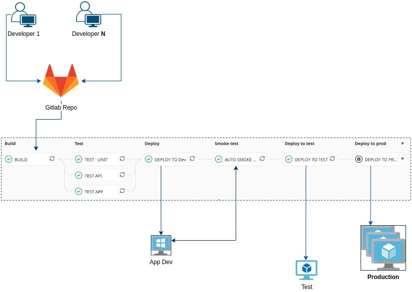

# Jenkins Alternatives for Continuous Integration and Continuous Deployment

1. [Introduction and Comparisons](#introduction-and-comparisons)
2. [Alternatives](#alternatives)
    1. [Circle CI](#circle-ci)
    2. [Travis CI](#travis-ci)
    3. [Concourse](#concourse)
    4. [Atlassian CI/CD](#atlassian-cicd)
    5. [GitHub Actions](#github-actions)
    6. [Ketpn](#ketpn)
    7. [Azure DevOps](#azure-devops)
    8. [ShuttleOps](#shuttleops)
    9. [HashiCorp Waypoint](#hashicorp-waypoint)
    10. [OneDev](#onedev)
    11. [TeamCity](#teamcity)
    12. [Octopus Deploy](#octopus-deploy)
    13. [JFrog](#jfrog)
         1. [JFrog DevOps Platform](#jfrog-devops-platform)
    14. [Semaphore](#semaphore)
    15. [Devtron](#devtron)
3. [Cloud Native CI/CD](#cloud-native-cicd)
    1. [Jenkins X](#jenkins-x)
    2. [Spinnaker](#spinnaker)
    3. [ArgoCD](#argocd)
    4. [Tekton](#tekton)
    5. [Jenkins X and Tekton on OpenShift](#jenkins-x-and-tekton-on-openshift)
    6. [HAT is the acronym for Helm, ArgoCD and Tekton](#hat-is-the-acronym-for-helm-argocd-and-tekton)
    7. [Dagger](#dagger)
4. [Integration with other CI/CD engines](#integration-with-other-cicd-engines)
5. [Images](#images)
6. [Slides](#slides)
7. [Tweets](#tweets)

## Introduction and Comparisons

- [lambdatest.com: 21 Of The Best Jenkins Alternatives For Developers](https://www.lambdatest.com/blog/best-jenkins-alternatives/)
- [inovex.de: Spinnaker vs. Argo CD vs. Tekton vs. Jenkins X: Cloud-Native CI/CD](https://www.inovex.de/blog/spinnaker-vs-argo-cd-vs-tekton-vs-jenkins-x/)
- [lambdatest.com: TeamCity vs. Jenkins: Picking The Right CI/CD Tool](https://www.lambdatest.com/blog/teamcity-vs-jenkins-picking-the-right-ci-cd-tool/)
- [cBamboo vs Jenkins: Showdown Of CI/CD Tools](https://www.lambdatest.com/blog/bamboo-vs-jenkins-showdown-of-ci-cd-tools/)
- [lambdatest.com: CircleCI Vs. GitLab: Choosing The Right CI/CD Tool](https://www.lambdatest.com/blog/circleci-vs-gitlab/)
- [==acloudguru.com: Azure DevOps vs GitHub: Comparing Microsoft’s DevOps Tools== 🌟](https://acloudguru.com/blog/engineering/azure-devops-vs-github-comparing-microsofts-devops-twins)
    - Tekton
    - Argo
    - GitHub Actions
    - Jenkins X
    - OpenShift Pipelines
    - Circle CI
    - GitLab
- [lambdatest.com: Jenkins vs Travis vs Bamboo vs TeamCity: Clash Of The Titans](https://www.lambdatest.com/blog/jenkins-vs-travis-vs-bamboo-vs-teamcity)

## Alternatives

- [Cloudbees Flow](https://www.cloudbees.com/products/flow/overview)
- [Prow](https://github.com/kubernetes/test-infra/tree/master/prow)
- [Agola](https://agola.io/)
- [harness.io](https://harness.io/)
    - [harness.io: AutoStopping Rules For Kubernetes Clusters](https://harness.io/blog/autostopping-rules-kubernetes/) Harness Intelligent Cloud AutoStopping Rules help manage your resources automatically to make sure that they run only when used, never when idle.
    - [harness.io: Migrating CD Jenkins Pipelines To Harness Using Helm](https://harness.io/blog/cd-jenkins-pipelines-harness/)
- [Drone](https://drone.io/)
- [Buildbot](https://buildbot.net/)
- [GoCD](https://www.gocd.org/)
- [Codefresh](https://codefresh.io/)
- [skaffold](https://skaffold.dev/) Local Kubernetes Development. Skaffold handles the workflow for building, pushing and deploying your application, allowing you to focus on what matters most: writing code.
- [AWS DevOps - CICD](https://aws.amazon.com/devops/#cicd)
- [Google Cloud Build](https://cloud.google.com/cloud-build)
- [Kubeflow](https://www.kubeflow.org/) The Machine Learning Toolkit for Kubernetes
- [Screwdriver API](https://github.com/screwdriver-cd/screwdriver) Screwdriver is a self-contained, pluggable service to help you build, test, and continuously deliver software using the latest containerization technologies.

### Circle CI

- [Circle CI](https://circleci.com/)
- [Getting started with Kubernetes: how to set up your first cluster](https://circleci.com/blog/getting-started-with-kubernetes-how-to-set-up-your-first-cluster/)
- [Adding approval jobs to your CI pipeline](https://circleci.com/blog/adding-approval-jobs-to-your-ci-pipeline/)
- [Building CI/CD pipelines using dynamic config](https://circleci.com/blog/building-cicd-pipelines-using-dynamic-config/)
- [Managing reusable pipeline configuration with object parameters](https://circleci.com/blog/parameters-in-pipeline-config/)
- [dev.to: CI/CD: Automating our build and deploy process](https://dev.to/mage_ai/ci-cd-automating-our-build-and-deploy-process-2i91)
- [circleci.com: Performing database tests on SQL databases](https://circleci.com/blog/relational-db-testing)
### Travis CI

- [Travis CI](https://travis-ci.org/)
- [lambdatest.com: How To Build Your First CI/CD Pipeline With Travis CI?](https://www.lambdatest.com/blog/build-your-first-ci-cd-pipeline-with-travis-ci/)

### Concourse

- [Concourse](https://concourse-ci.org/)
- [Building a continious deployment pipeline with Kubernetes and Concourse-CI](https://blog.alterway.fr/en/building-a-continious-deployment-pipeline-with-kubernetes-and-concourse-ci.html)

### Atlassian CI/CD

- [Atlassian CI/CD](https://www.atlassian.com/continuous-delivery)
- [Bamboo](https://www.atlassian.com/software/bamboo)
- [lambdatest.com: How To Setup CI/CD Pipeline With Bamboo For PHP Projects](https://www.lambdatest.com/blog/how-to-setup-cicd-pipeline-with-bamboo-for-php-projects/)

### GitHub Actions

- [GitHub Actions CI/CD](https://github.blog/2019-08-08-github-actions-now-supports-ci-cd/)
- [docs.github.com: Learn GitHub Actions](https://docs.github.com/en/actions/learn-github-actions)
- [redhat-actions](https://github.com/redhat-actions)
- [redhat-actions/openshift-actions-runner](https://github.com/redhat-actions/openshift-actions-runner)
    - [redhat.com: Red Hat and GitHub Collaborate to Expand the Developer Experience on Red Hat OpenShift with GitHub Actions](https://www.redhat.com/en/about/press-releases/red-hat-and-github-collaborate-expand-developer-experience-red-hat-openshift-github-actions) Industry’s leading enterprise Kubernetes platform now integrates with GitHub, bringing DevOps automation tools from the world’s largest developer platform into the OpenShift ecosystem
- [Awesome GitHub Actions](https://github.com/sdras/awesome-actions)
- [yokawasa/action-setup-kube-tools](https://github.com/yokawasa/action-setup-kube-tools) A GitHub Action that setupKubernetes tools (kubectl, kustomize, helm, kubeval, conftest, yq) and cache them on the runner. It is like a typescriptversion of stefanprodan/kube-tools with no command input param, but it's very fast as it installs the tools asynchronously.
- [summerwind/actions-runner-controller](https://github.com/summerwind/actions-runner-controller) This controller operatesself-hosted runners for GitHub Actions on your Kubernetes cluster.
- [towardsdatascience.com: Jenkins for CI Is Dead: Why Do People Hate It and What’s the Alternative? GitHub actions](https:/towardsdatascience.com/jenkins-for-ci-is-dead-why-do-people-hate-it-and-whats-the-alternative-8d8b6b88fdba) How toautomatically build your Docker images; a case study.

### Ketpn

- [Keptn](keptn.md)

### Azure DevOps

- [Azure DevOps](https://azure.microsoft.com/services/devops/)
- [k21academy.com: Azure pipelines VS Jenkins](https://k21academy.com/microsoft-azure/az-400/azure-pipelines-vs-jenkins/)

### ShuttleOps

- [shuttleOps](https://www.shuttleops.io/)
- [thenewstack.io: ShuttleOps: No-Code Docker and Kubernetes](https://thenewstack.io/shuttleops-no-code-docker-and-kubernetes/)

### HashiCorp Waypoint

- [HashiCorp Waypoint](https://www.waypointproject.io/)

### OneDev

- [onedev](https://github.com/theonedev/onedev)

### TeamCity

- [TeamCity](https://www.jetbrains.com/teamcity/)
- [jetbrains.com: Storing Project Settings in Version Control](https://www.jetbrains.com/help/teamcity/storing-project-settings-in-version-control.html)
- [blog.jetbrains.com: Configuration as Code, Part 1: Getting Started with Kotlin DSL](https://blog.jetbrains.com/teamcity/2019/03/configuration-as-code-part-1-getting-started-with-kotlin-dsl/)

### Octopus Deploy

- [Octopus Deploy - deployment tool](https://octopus.com/)
- [octopus.com: Deployment process as code](https://octopus.com/docs/deployments/patterns/deployment-process-as-code) If youwant to do Octopus configuration as code today, we recommend using our .NET SDK which will always be supported. The Terraformprovider will be a simpler, more declarative approach, that we will support in the future.
- [registry.terraform.io: octopusdeploy Provider](https://registry.terraform.io/providers/OctopusDeployLabs/octopusdeploylatest/docs)
- [github.com/OctopusDeploy/go-octopusdeploy](https://github.com/OctopusDeploy/go-octopusdeploy) Go API Client for OctopusDeploy. A Go client for the Octopus Deploy API. This client is used by the [Octopus Deploy Terraform Provider](https://githubcom/OctopusDeploy/terraform-provider-octopusdeploy).

### JFrog

- [JFrog Pipelines](https://jfrog.com/pipelines/)

#### JFrog DevOps Platform

- [jfrog.com: JFrog DevOps Platform](https://jfrog.com/platform/)
- [jfrog.com: Pipelines CI/CD and the JFrog Platform Difference](https://jfrog.com/blog/pipelines-ci-cd-and-the-jfrog-platform-difference/)
- [jfrog.com: How I Leaped Forward My Jenkins Build with JFrog Pipelines](https://jfrog.com/blog/how-i-leaped-forward-my-jenkins-build-with-jfrog-pipelines/)
- [youtube: jfrog - Modern App Deployments: How to use NGINX and JFrog to Automate your Blue/Green deployments](https://www.youtube.com/watch?v=15CGdzfDlpQ&t=1s&ab_channel=JFrog)
- [cloud.redhat.com: Cloud DevOps With OpenShift and JFrog](https://cloud.redhat.com/blog/cloud-devops-with-openshift-and-jfrog)

### Semaphore

- [Semaphore](https://semaphoreci.com/) Hosted CI/CD for teams that don’t like bottlenecks
- [semaphoreci.com: Revving up Continuous Integration with Parallel Testing](https://semaphoreci.com/blog/revving-up-continuous-integration-with-parallel-testing) Is your CI/CD pipeline slow? Do wait times make you feel unproductive? Parallel testing is an indispensable technique for reducing wait times. And mastering it is key to getting the most out of CI/CD.

### Devtron

- https://devtron.ai
- [devtron-labs/devtron](https://github.com/devtron-labs/devtron) is an open source software delivery workflow for kubernetes written in go. Web based CI/CD Platform for Kubernetes.

## Cloud Native CI/CD

- [csweichel/werft](https://github.com/csweichel/werft) Werft is a Kubernetes-native CI system. It knows no pipelines, just jobs and each job is a Kubernetes pod. What you do in that pod is up to you. We do not impose a "declarative pipeline syntax" or some groovy scripting language. Instead, Werft jobs have run Node, Golang or bash scripts in production environments.
### Jenkins X

- [jenkins-x.io](https://jenkins-x.io/)
- [cloudbees.com: what is jenkins-x](https://www.cloudbees.com/jenkins-x/what-is-jenkins-x)
- [devopstoolkitseries.com](https://www.devopstoolkitseries.com/)
    - [youtube: Jenkins X: The Recipe For Continuous Delivery](https://www.youtube.com/watch?v=ihHr-iLfEGo)
- [Book: The DevOps 2.6 Toolkit: Jenkins X](https://leanpub.com/the-devops-2-6-toolkit)
- [Traces for your pipelines: Jenkins X v3 now comes with tracing support for your pipelines out of the box](https://jenkins-x.io/blog/2021/04/08/jx3-pipeline-trace/)

### Spinnaker

- [spinnaker.io deployment tool](https://www.spinnaker.io/)
- [Deploy Spinnaker CD Pipelines in Kubernetes](https://www.opsmx.com/blog/deploy-spinnaker-cd-pipelines-in-kubernetes/)
- [speakerdeck.com: Introduction to Spinnaker Managed Pipeline Templates](https://speakerdeck.com/keisukeyamashita/introduction-to-spinnaker-managed-pipeline-templates)
- [speakerdeck.com: Spinnaker Application management by Terraform Plugins](https://speakerdeck.com/keisukeyamashita/spinnaker-application-management-by-terraform-plugins)
- [opensource.com: Why Spinnaker matters to CI/CD](https://opensource.com/article/19/8/why-spinnaker-matters-cicd) Spinnaker provides unique building blocks to create tailor-made,and highly-collaborative continuous delivery pipelines.
- [harness.io: Best Spinnaker Alternatives to Consider](https://harness.io/blog/continuous-delivery/spinnaker-alternatives/)
- [armory.io: Build a Deployment Pipeline with Spinnaker on Kubernetes](https://www.armory.io/blog/build-a-deployment-pipeline-with-spinnaker-on-kubernetes/)

### ArgoCD

- [ArgoCD](argocd.md) Declarative GitOps CD for Kubernetes

### Tekton

- [Tekton](tekton.md)

### Jenkins X and Tekton on OpenShift

- [Jenkins-X + Tekton on OpenShift](https://github.com/openshift/tektoncd-pipeline-operator)
- [CI/CD OpenShift and Tekton](https://blog.sonatype.com/new-cloud-native-ci/cd-projects-openshift-and-tekton)
- [github.com/openshift/pipelines-tutorial](https://github.com/openshift/pipelines-tutorial)
- [https://github.com/jenkins-x/jenkins-x-openshift-image](https://github.com/jenkins-x/jenkins-x-openshift-image)

### HAT is the acronym for Helm, ArgoCD and Tekton

- [empathy.co: HAT: CI/CD for Deploying Cloud Native Applications](https://www.empathy.co/blog/hat-ci-cd-for-deploying-cloud-native-applications/)

### Dagger

- [==dagger.io==](https://dagger.io) CI/CD as Code that Runs Anywhere
- [==dagger/dagger: Dagger is a portable devkit for CICD==](https://github.com/dagger/dagger) Using Dagger, software teams can develop powerful CICD pipelines with minimal effort, then run them anywhere.

## Integration with other CI/CD engines

## Images

??? note "Click to expand!"

    

    
    

## Slides

  
Click to expand!

## Tweets

  
Click to expand!

<blockquote class="twitter-tweet">
THREAD: Is it possible that Kubeflow pipeline is one of the best CI/CD tools for Kubernetes?  I spent some time playing with Kubernetes &amp; <a href="https://twitter.com/kubeflow?ref_src=twsrc%5Etfw">@kubeflow</a> pipelines, and they have one feature which is just great:  You can define the pipeline with real code! <a href="https://t.co/gNDzvvkCij">pic.twitter.com/gNDzvvkCij</a>
&mdash; Daniele Polencic (@danielepolencic) <a href="https://twitter.com/danielepolencic/status/1285929877493800961?ref_src=twsrc%5Etfw">July 22, 2020</a></blockquote> 

