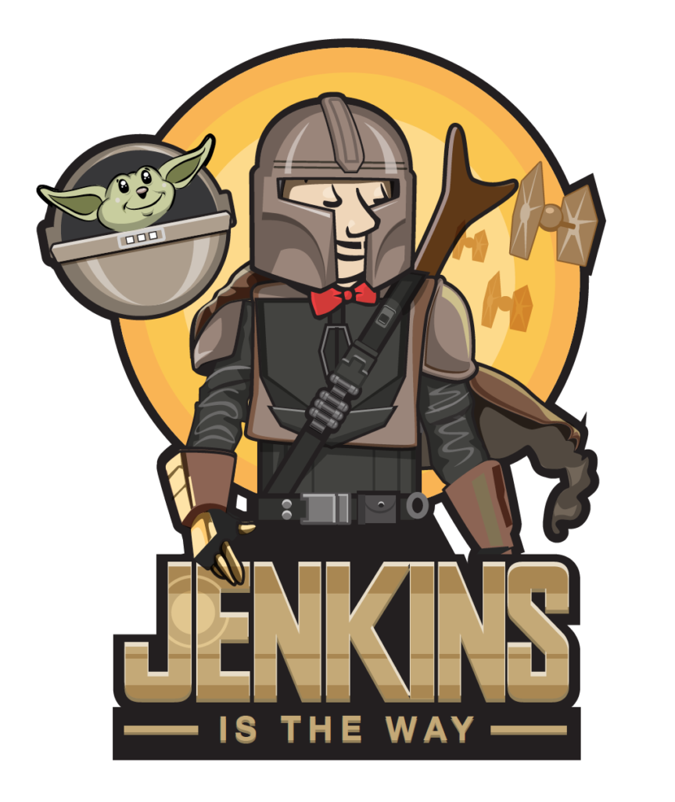
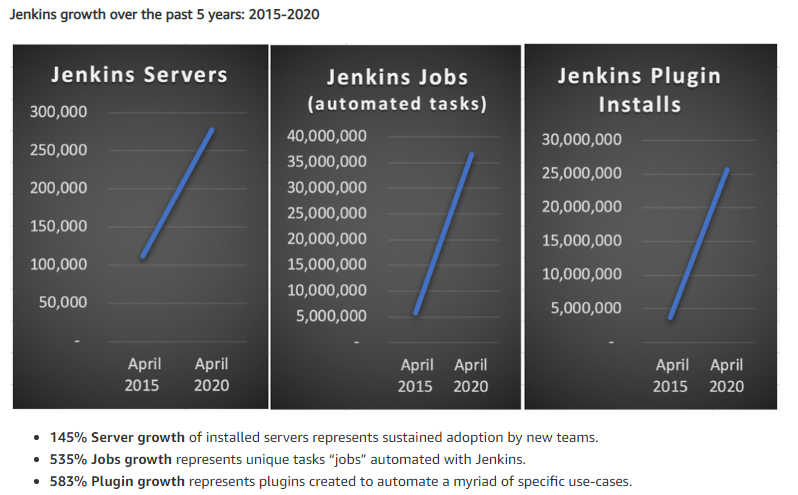
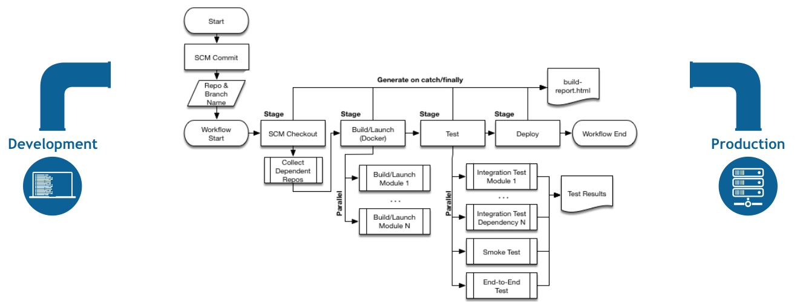
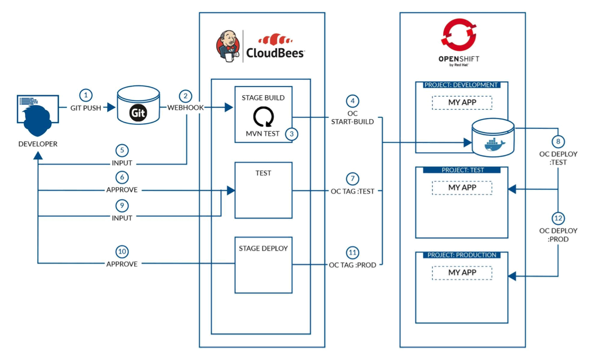
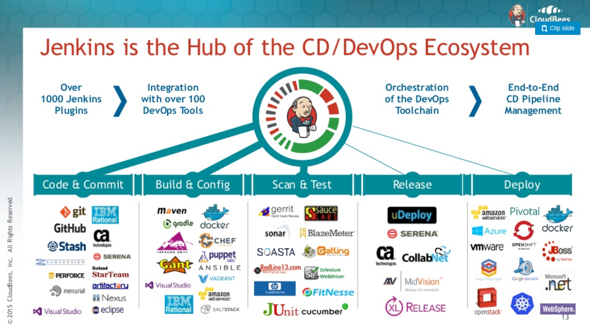

# Jenkins & CloudBees

1. [Jenkins](#jenkins)
2. [Jenkins and Helm Charts](#jenkins-and-helm-charts)
3. [Jenkins and Terraform](#jenkins-and-terraform)
4. [Jenkins Is The Way](#jenkins-is-the-way)
5. [Evolution of open source CI/CD Tools](#evolution-of-open-source-cicd-tools)
6. [eBooks](#ebooks)
7. [Jenkins on Kubernetes](#jenkins-on-kubernetes)
8. [Jenkins on Docker](#jenkins-on-docker)
    1. [Kubernetes Native Jenkins Operator](#kubernetes-native-jenkins-operator)
9. [Groovy](#groovy)
10. [Awesome Jenkins](#awesome-jenkins)
11. [Jenkins Cheat Sheet](#jenkins-cheat-sheet)
12. [Jenkins Special Interest Groups (SIG)](#jenkins-special-interest-groups-sig)
13. [Running Jenkins on Java 11. Use OpenJDK 11](#running-jenkins-on-java-11-use-openjdk-11)
14. [Online Learning](#online-learning)
15. [Jenkins Configuration as Code Solutions. 3 available DSLs](#jenkins-configuration-as-code-solutions-3-available-dsls)
     1. [DSL 1. Job DSL Plugin. From Freestyle jobs to Declarative Pipeline](#dsl-1-job-dsl-plugin-from-freestyle-jobs-to-declarative-pipeline)
     2. [DSL 2. Jenkins Pipeline. Pipeline as Code with Jenkins](#dsl-2-jenkins-pipeline-pipeline-as-code-with-jenkins)
         1. [How to share a Declarative Pipeline. Examples of Declarative Pipelines in Shared Libraries](#how-to-share-a-declarative-pipeline-examples-of-declarative-pipelines-in-shared-libraries)
         2. [Jenkins Pipeline Syntax. Scripted Syntax (Groovy DSL syntax) VS Declarative Syntax](#jenkins-pipeline-syntax-scripted-syntax-groovy-dsl-syntax-vs-declarative-syntax)
         3. [Extending with Shared Libraries](#extending-with-shared-libraries)
         4. [Jenkinsfile Runner. Serverless / function-as-a-service build execution](#jenkinsfile-runner-serverless--function-as-a-service-build-execution)
     3. [DSL 3. Jenkins Configuration as Code (JCasC)](#dsl-3-jenkins-configuration-as-code-jcasc)
         1. [Read-only Jenkins Configuration](#read-only-jenkins-configuration)
     4. [Jenkins Job Builder](#jenkins-job-builder)
16. [Jenkins Template Engine JTE](#jenkins-template-engine-jte)
17. [Jenkins Pipeline Unit Testing Framework](#jenkins-pipeline-unit-testing-framework)
18. [Jenkins Architecture. Performance and Scalability](#jenkins-architecture-performance-and-scalability)
19. [Ansible and Jenkins. Running Ansible Playbooks From Jenkins](#ansible-and-jenkins-running-ansible-playbooks-from-jenkins)
20. [Jenkins Tools](#jenkins-tools)
     1. [Plugin Installation Manager Tool](#plugin-installation-manager-tool)
     2. [Pipeline Development Tools](#pipeline-development-tools)
     3. [Custom WAR Docker Packager](#custom-war-docker-packager)
     4. [jenkins-std-lib Jenkins Standard Shared Library](#jenkins-std-lib-jenkins-standard-shared-library)
21. [Jenkins Multibranch Pipeline](#jenkins-multibranch-pipeline)
     1. [Multibranch Pipelines with Kubernetes](#multibranch-pipelines-with-kubernetes)
22. [Jenkins Plugins](#jenkins-plugins)
     1. [Selection of Jenkins Plugins](#selection-of-jenkins-plugins)
     2. [Plugin Development. Jenkins Plugin Parent POM 4.0](#plugin-development-jenkins-plugin-parent-pom-40)
     3. [Jenkins Blue Ocean](#jenkins-blue-ocean)
     4. [Cloudbees Flow](#cloudbees-flow)
23. [Monitoring jenkins](#monitoring-jenkins)
24. [Externalizing Fingerprint Storage for Jenkins](#externalizing-fingerprint-storage-for-jenkins)
25. [Jenkins and Spring Boot](#jenkins-and-spring-boot)
26. [Docker in Docker. Running Jenkins in Kubernetes](#docker-in-docker-running-jenkins-in-kubernetes)
27. [CloudBees](#cloudbees)
     1. [CloudBees Rollout and Feature Flags](#cloudbees-rollout-and-feature-flags)
         1. [Feature Flags in CloudBees Enterprise On-Premise](#feature-flags-in-cloudbees-enterprise-on-premise)
     2. [CloudBees Accelerator](#cloudbees-accelerator)
28. [Jenkins Scripts](#jenkins-scripts)
29. [Backup for Jenkins on Kubernetes](#backup-for-jenkins-on-kubernetes)
30. [Jervis: Jenkins as a service](#jervis-jenkins-as-a-service)
31. [Jenkins X (Serverless)](#jenkins-x-serverless)
32. [Jenkins and SAP](#jenkins-and-sap)
33. [Jenkins Free Templates for AWS CloudFormation](#jenkins-free-templates-for-aws-cloudformation)
34. [Videos](#videos)
35. [Tweets](#tweets)

## Jenkins

- [CloudBees](https://www.cloudbees.com/)
- [Jenkins.io (new Jenkins 2.0 site) 🌟](https://jenkins.io/)
- [Official Jenkins Docker image](https://github.com/michaelneale/jenkins-ci.org-docker)
- [github.com/jenkinsci 🌟](https://github.com/jenkinsci)
- [opensource.com: running jenkins builds containers 🌟](https://opensource.com/article/18/4/running-jenkins-builds-containers)
- [WebSocket support in now available for Jenkins CLI and agent networking!](https://jenkins.io/blog/2020/02/02/web-socket/)
- [webhookrelay.com: Receive Github webhooks on Jenkins without public IP 🌟](https://webhookrelay.com/blog/2017/11/23/github-jenkins-guide/)
- [jenkins.io 2020-05-06: Slave to Agent renaming. Renaming of the official Docker images for Jenkins agents](https://www.jenkins.io/blog/2020/05/06/docker-agent-image-renaming/) We would like to announce the renaming of the official Docker images for Jenkins agents. The **"slave" term is widely considered inappropriate in open source communities**. It has been **officially deprecated in Jenkins 2.0 in 2016**, but there are remaining usages in some Jenkins components.
- [Windows Docker Agent Images: General Availability 🌟](https://www.jenkins.io/blog/2020/05/11/docker-windows-agents/)
- [Jenkins: Shifting Gears 🌟🌟](https://www.jenkins.io/blog/2018/08/31/shifting-gears/) **Evolutionary line from the current Jenkins 2, but with breaking changes in order to gain higher development speed.** This document lays out the key directions and approaches in a broad stroke, which I discussed with a number of you in the past. Hopefully, this gives you the big picture of how I envision where to move Jenkins forward, not just as the creator of Jenkins but as the CTO of CloudBees, who employs a number of key contributors to the Jenkins project.
- [aws.amazon.com/blogs: Why Jenkins still continuously serves developers 🌟](https://aws.amazon.com/blogs/opensource/why-jenkins-still-continuously-serves-developers/)
- [On Jenkins Terminology Updates](https://www.jenkins.io/blog/2020/06/18/terminology-update/)
- [lambdatest.com: Best Jenkins Pipeline Tutorial For Beginners (Examples) 🌟](https://www.lambdatest.com/blog/jenkins-pipeline-tutorial/)
- [youtube: MSBuild With Jenkins | Jenkins For C# / .NET Applications](https://www.youtube.com/watch?v=uC7vajbnZS4)
- [linkedin: Jenkins Server setup with dynamic worker nodes](https://www.linkedin.com/pulse/jenkins-server-setup-dynamic-worker-nodes-shishir-khandelwal/)
- [jenkins.io: Docker image updates](https://www.jenkins.io/blog/2021/02/08/docker-base-os-upgrade/)
- [lambdatest.com: How To Set Up Continuous Integration With Git and Jenkins?](https://www.lambdatest.com/blog/how-to-setup-continuous-integration-with-git-jenkins/)
- [aws.amazon.com: How to cost optimize Jenkins jobs on Kubernetes with EC2 Spot Instances 🌟](https://aws.amazon.com/getting-started/hands-on/cost-optimize-jenkins/)
- [amazon.com: Building a serverless Jenkins environment on AWS Fargate](https://aws.amazon.com/es/blogs/devops/building-a-serverless-jenkins-environment-on-aws-fargate/)
- [youtube: How to Create a GitLab Multibranch Pipeline in Jenkins](https://www.youtube.com/watch?app=desktop&v=y4XGFluzPHY&ab_channel=CloudBeesTV)
- [lambdatest.com: Jenkins Tutorial 🌟](https://www.lambdatest.com/learning-hub/jenkins)
- [youtube/Bribe By Bytes: Jenkins Pipelines | Pipeline Concept | Types of Pipelines | Part 1](https://www.youtube.com/watch?v=iddMXjmr7mk&t=657s&ab_channel=BribeByBytes)
- [jenkins.io: Easily reuse Tekton and Jenkins X from Jenkins 🌟](https://www.jenkins.io/blog/2021/04/21/tekton-plugin/) Jenkins can now be used to automate Tekton pipelines too which helps teams digitally transform to more cloud native solutions for their CI and CD. In such a case, you can use Tekton pipeline engine while getting all benefits from Jenkins as an orchestrator, user interface and the reporting engine. The Tekton Client plugin for Jenkins lets you easily use Jenkins to automate creating and running Tekton pipelines. It bridges the Kubernetes learning gap and allows invoking Tekton Pipelines and resources through Jenkins. This allows users to not have much of the Kubernetes specific knowledge beforehand and work. Its a single Jenkins plugin to install - so it’s easy to use.
- [harness.io: What is Pipeline as Code, and How Can You Leverage It?](https://harness.io/blog/devops/pipeline-as-code/)
- [lambdatest.com: How To Set Jenkins Pipeline Environment Variables? 🌟](https://www.lambdatest.com/blog/set-jenkins-pipeline-environment-variables-list/)
- [slideshare.net: Jeff Geerling - Jenkins or: How I learned to stop worrying and love automation 🌟](https://www.slideshare.net/geerlingguy/jenkins-or-how-i-learned-to-stop-worrying-and-love-automation) Configuring Jenkins like a pro. Use authorization strategies in jenkinsci unless you want to have Remote Code Execution as a Service! There are many plugins like Matrix Auth, Role Strategy and Folder Auth. Vendors like CloudBees also provide security engines in their products.
- [youtube - CloudBeesTV: How to Run a Shell Script in Jenkins Pipeline 🌟](https://www.youtube.com/watch?v=mbeQWBNaNKQ&ab_channel=CloudBeesTV)
- [opensource.com: Make Jenkins logs pretty](https://opensource.com/article/21/5/jenkins-logs) Jenkins' default logs can be hard to read, but they don't have to be.
- [automationreinvented.blogspot.com: How to schedule a job in Jenkins pipeline? How to run automation suite everyday with auto trigger scheduler?](https://automationreinvented.blogspot.com/2021/05/how-to-schedule-job-in-jenkins-pipeline.html)
- [cloudbees.com: So, Your Jenkins Is Slow. Here’s How to Fix It 🌟](https://www.cloudbees.com/blog/your-jenkins-slow-how-to-fix)
- [youtube: Jenkins World 2017: How to Use Jenkins Less 🌟](https://www.youtube.com/watch?v=Zeqc6--0eQw&ab_channel=CloudBeesTV) In
jenkinsci CloudBees' advice is to use build tool features when possible (Maven/Gradle/make/etc.). When the tools are not enough and you need a distributed orchestrator/reporting layer, this is where Jenkins shines. - [slides & demos](https://github.com/jglick/jk--)
- [youtube: Build Docker Image using Jenkins Pipeline | Push Docker Image to Docker Hub using Jenkins 🌟](https://www.youtube.com/watch?v=ShTC1u7_jew&ab_channel=DevOpsHint)
- [youtube: Online Meetup: From local installation to scalable Jenkins on Kubernetes 🌟](https://www.youtube.com/watch?v=BsYYVkophsk)
- [youtube: Jenkins and Sonarqube Integration with Maven | SonarScanner for Maven and Integrate with Jenkins](https://www.youtube.com/watch?v=yEyVXUExSqs&ab_channel=DevOpsHint)
- [youtube: LambdaTest - Jenkins Tutorial For Beginners | Part 7 | Adding A Jenkins Controller & Jenkins Agent Node On Azure](https://www.youtube.com/watch?v=-NUQhwmhTCw&ab_channel=LambdaTest)
- [youtube: Jenkins On Kubernetes Tutorial | How to setup Jenkins on kubernetes cluster | Thetips4you 🌟](https://www.youtube.com/watch?v=_r-C_FFDLmU&ab_channel=Thetips4you)
- [docs.google.com: Jenkins Artwork Social Media & Open Graph Images](https://docs.google.com/presentation/d/1Q1PgNnRTgzBpVRXPqQo3PudzCa2eoc6_1_NRjFRMLrU/edit#slide=id.g778409cba7_0_46) Google Slides is one of the easiest ways to collaborate on open graphs and other artwork in the community. Main jenkinsci slidedeck is here.
- [automationreinvented.blogspot.com: How to send email notification in Jenkins using Groovy Script?](https://automationreinvented.blogspot.com/2021/06/how-to-send-email-notification-in.html)
- [gist.github.com/twasink: Jenkins Image, using Docker-in-Docker 🌟](https://gist.github.com/twasink/d52ef998b2a5b24cdfaa9e7358c5282f)
- [youtube: Run Jenkins Pipeline With AWS ECS Fargate & AWS EC2 Based ECS Cluster | Learn DevOps Tools Ep4](https://www.youtube.com/watch?v=K2CBHLwPL50&ab_channel=SandipDas)
- [youtube LambdaTest: Jenkins Tutorial For Beginners | Part 9 | Cross Browser Testing With LambdaTest Jenkins Plugin](https://www.youtube.com/watch?v=x5cyrE9ecis&ab_channel=LambdaTest)
- [developer.okta.com: Update App Secrets with Jenkins CI and .NET Core](https://developer.okta.com/blog/2021/07/08/jenkins-ci-dotnet-update-secrets)
- [jenkins.io: Git Username/Password Credentials Binding for sh, bat, and powershell 🌟](https://www.jenkins.io/blog/2021/07/27/git-credentials-binding-phase-1/) Google Summer of Code 2021 is implementing git credentials binding for sh, bat, and powershell. Git credentials binding is one of the most requested features for Jenkins Pipeline (see JENKINS-28335). The project involves extending the Credentials Binding Plugin to create custom bindings for two types of credentials essential to establish a remote connection with a git repository: Username/Password , SSH Private Key.
- [youtube: Creating a CI/CD deployment pipeline for JenkinsCI with AWS SAM Pipelines 🌟](https://www.youtube.com/watch?v=tJOlk-B66R4&ab_channel=ServerlessLand) Learn how to simplify CI/CD pipelines for **serverless** applications with a **pipeline generator and templates** with AWS built-in best practices for CloudBees and JenkinsCI.
- [blogs.sap.com: SAP Cloud Integration automated testing using Jenkins and Pipeline as a Code approach](https://blogs.sap.com/2021/07/29/sap-cloud-integration-automated-testing-using-jenkins-and-pipeline-as-a-code-approach/)
- [dev.to: Send notification to slack from the Jenkins CI Job and Jenkinsfile](https://dev.to/eavnitech/send-notification-to-slack-from-the-jenkins-ci-job-and-jenkinsfile-e-avni-tech-2lm5)
- [dev.to: Setting up a CI/CD with Jenkins](https://dev.to/kennethatria/setting-up-a-ci-cd-with-jenkins-4hln)
- [fabiogomezdiaz.com: How to Run Packer Pipelines on Jenkins: Part 1 - Traditional Jenkins](https://fabiogomezdiaz.com/posts/how-to-run-packer-pipelines-on-jenkins-part1-traditional-jenkins/)
- [jenkins.io: Docker images use Java 11 by default 🌟](https://www.jenkins.io/blog/2021/08/17/docker-images-use-jdk-11-by-default/) The default Java version in the Jenkins Docker images is switching to Java 11.
- [community.jenkins.io: DSTY - jenkins-std-lib (Shared Library) - Interact with files/directories using Groovy!](https://community.jenkins.io/t/dsty-jenkins-std-lib-shared-library-interact-with-files-directories-using-groovy/398) - [Pipeline Utility Steps 🌟](https://plugins.jenkins.io/pipeline-utility-steps/) Small, miscellaneous, cross platform utility steps for Jenkins Pipeline jobs [githu ref](https://github.com/jenkinsci/pipeline-utility-steps-plugin)
- [Connecting and authenticating to Jenkins with Teleport Application Access](https://github.com/gravitational/teleport/discussions/8330) This shows integrating a Jenkins with Teleport Application Access for Access and Authentication.
- [automationreinvented.blogspot.com: How to create parameterized job in Jenkins? What is parameterized build in Jenkins?](https://automationreinvented.blogspot.com/2021/08/how-to-create-parameterized-job-in.html)
- [infoworld.com: Continuous integration with Docker and Jenkins](https://www.infoworld.com/article/3637829/continuous-integration-with-docker-and-jenkins.html) How to pull from Git, build a Docker image, and publish the image to Docker Hub.
- [==lambdatest.com: What Is Jenkins Used For?== 🌟](https://www.lambdatest.com/blog/what-is-jenkins/)
- [automationqahub.com: How To Publish ExtentReport Using Jenkins](https://automationqahub.com/how-to-publish-extentreport-using-jenkins/)
- [youtube: Cloud Learn Hub - How to Integrate Jenkins with Ansible Tower?](https://www.youtube.com/watch?v=E3Xyu29LIwY&ab_channel=CLOUDLEARNHUB)
- [==youtube: Tech World with Nana - Jenkins Tutorial for Beginners==](https://www.youtube.com/playlist?list=PLy7NrYWoggjw_LIiDK1LXdNN82uYuuuiC)
- [==camunda.com: How We Overcame Long-Running Job Limitations in Jenkins Declarative Pipelines==](https://camunda.com/blog/2022/02/how-we-overcame-long-running-job-limitations-in-jenkins-declarative-pipelines/)
- [==aws.amazon.com: Jenkins high availability and disaster recovery on AWS== 🌟](https://aws.amazon.com/blogs/devops/jenkins-high-availability-and-disaster-recovery-on-aws/)
- [fosstechnix.com: How to Validate Jenkinsfile using Visual Studio Code](https://www.fosstechnix.com/validate-jenkinsfile-using-visual-studio-code/)
- [freecodecamp.org: Learn Jenkins by Building a CI/CD Pipeline 🌟](https://www.freecodecamp.org/news/learn-jenkins-by-building-a-ci-cd-pipeline/)

## Jenkins and Helm Charts

- [==github.com/jenkinsci/helm-charts==](https://github.com/jenkinsci/helm-charts)

## Jenkins and Terraform

## Jenkins Is The Way

## Evolution of open source CI/CD Tools

- [Presentation: NADOG - Evolution of open source CI/CD tools - Oleg Nenashev 🌟](https://docs.google.com/presentation/d/17bQ30ycAUB-k4YZ4dC23cxNiNChvRRQO7_6FNGcS0j4/edit?usp=sharing)

## eBooks

- [Pipeline as Code](https://www.manning.com/books/pipeline-as-code) Continuous Delivery with Jenkins, Kubernetes, and Terraform
- [riptutorial.com: Learning Jenkins](https://riptutorial.com/ebook/jenkins)
- [cloudbees.com: Jenkins Pipeline with Plugins](https://www.cloudbees.com/resource/whitepaper/jenkins-pipeline-plugins) Jenkins is one of the preeminent automation tools. Jenkins is extensible by design, via plugins. Plugins are what give Jenkins its great flexibility for automating a wide range of processes on diverse platforms. Jenkins Pipeline builds on that flexibility and rich plugin ecosystem while enabling Jenkins users to write their Jenkins software pipelines as code. This technical guide will show a number of common use cases for plugins with Jenkins Pipeline.

## Jenkins on Kubernetes

- [jenkins.io: Document Jenkins on Kubernetes: Installing Jenkins on Kubernetes Documentation Release 🌟](https://www.jenkins.io/blog/2020/11/05/installing-jenkins-on-kubernetes/)
- [jenkins.io: Installing Jenkins on Kubernetes 🌟](https://www.jenkins.io/doc/book/installing/kubernetes/)
- [ssbostan/jenkins-stack-kubernetes 🌟](https://github.com/ssbostan/jenkins-stack-kubernetes) Scripts and manifests to deploy Jenkins on Kubernetes
    - [ssbostan/jenkins-tutorial 🌟](https://github.com/ssbostan/jenkins-tutorial)

## Jenkins on Docker

- [ssbostan/jenkins-stack-docker](https://github.com/ssbostan/jenkins-stack-docker) Docker-compose version of jenkins-stack-kubernetes

### Kubernetes Native Jenkins Operator

- [github.com/jenkinsci/kubernetes-operator: 🌟](https://github.com/jenkinsci/kubernetes-operator) Kubernetes platform was released ten years after the first version of Hudson project. It means Jenkins couldn’t be designed to run on top of it. Jenkins Operator tries to bridge that gap.
- [jenkins.io: Jenkins Operator becomes an official sub-project!](https://www.jenkins.io/blog/2021/04/15/jenkins-operator-sub-project/)
- [jenkins.io: Security Validator for Jenkins Operator for Kubernetes](https://www.jenkins.io/blog/2021/08/23/jenkins-operator-security-work-report/)

## Groovy

- [opensource.com: Read and write files with Groovy](https://opensource.com/article/21/4/groovy-io)

## Awesome Jenkins

- [sahilsk/awesome-jenkins](https://github.com/sahilsk/awesome-jenkins)
- [Hacking jenkins](https://github.com/orangetw/awesome-jenkins-rce-2019)

## Jenkins Cheat Sheet

- [Jenkins Cheat Sheets](cheatsheets.md)

## Jenkins Special Interest Groups (SIG)

- [Jenkins SIG Platform 🌟](https://www.jenkins.io/sigs/platform/) This special interest group offers a venue for all kinds of platform support discussions: Java, Operating Systems, Architectures, Docker, Packaging, Web Containers, etc. The SIG works on defining platform support policies, coordinating platform support efforts with contributors and external communities, and reviewing proposals in the area.
- [Jenkins SIG Cloud Native 🌟](https://www.jenkins.io/sigs/cloud-native/)

## Running Jenkins on Java 11. Use OpenJDK 11

- [Running Jenkins on Java 11 🌟](https://www.jenkins.io/doc/administration/requirements/jenkins-on-java-11/#:~:text=The%20easiest%20way%20to%20run,images%2C%20use%20the%20jdk11%20tag.)
- [Oracle's Java 11 trap - Use OpenJDK instead! 🌟](https://blog.joda.org/2018/09/do-not-fall-into-oracles-java-11-trap.html)

## Online Learning

- [==blog.techiescamp.com/jenkins-course== 🌟🌟🌟](https://blog.techiescamp.com/jenkins-course/)
    - [Lesson 5.1: Introduction to Jenkins Multibranch Pipeline](https://blog.techiescamp.com/docs/jenkins-multibranch-pipeline/)
- [wardviaene/jenkins-course 🌟](https://github.com/wardviaene/jenkins-course)

## Jenkins Configuration as Code Solutions. 3 available DSLs

- [Job DSL](https://plugins.jenkins.io/job-dsl/) was one of the first popular plugins for Jenkins which allows managing configuration as code and many other plugins dealing with this aspect have been created since then, most notably the [Jenkins Pipeline](https://www.jenkins.io/solutions/pipeline/) and [Configuration as Code](https://www.jenkins.io/projects/jcasc/) plugins. It is important to understand the differences between these plugins and Job DSL for managing Jenkins configuration efficiently.
    - DSL 2: [Jenkins (Declarative) Pipeline](https://www.jenkins.io/solutions/pipeline/)
    - DSL 3: [Jenkins Configuration as Code (JCasC)](https://www.jenkins.io/projects/jcasc/)
- Tip: Don't stay with manually configured freestyle jobs. Use JobDSL wrapper if you can't use Pipeline.

### DSL 1. Job DSL Plugin. From Freestyle jobs to Declarative Pipeline

- Jenkins Job DSL API used in jenkins declarative pipelines.
    - [github.com/jenkinsci/job-dsl-plugin](https://github.com/jenkinsci/job-dsl-plugin/wiki)
    - [Jenkins Job DSL Plugin documentation 🌟](https://github.com/jenkinsci/job-dsl-plugin#documentation) A Groovy DSL for Jenkins Jobs - Sweeeeet!
- [Jenkins Job DSL API 🌟](https://jenkinsci.github.io/job-dsl-plugin/)
    - [Example of a pipeline with parameters](https://github.com/polarpoint-io/groovy-jenkins-pipelines/blob/master/jobs/parameterisedPipelines.groovy)
- [job-dsl **Gradle** Example](https://github.com/sheehan/job-dsl-gradle-example)
- [Jenkins DSL for **Nexus**](https://accenture.github.io/adop-cartridges-cookbook/docs/recipes/archiving-artefact-to-nexus/)
- Jenkins DSL for **Maven**:
    - [ref 2](https://deors.wordpress.com/2019/04/25/jenkins-ci-pipeline-java-spring-boot-maven-docker/)
- [Pipeline Global Library for ci.jenkins.io](https://github.com/jenkins-infra/pipeline-library) Collection of custom steps and variables for our Jenkins instance(s)

### DSL 2. Jenkins Pipeline. Pipeline as Code with Jenkins

    - [**Why Pipeline?**](https://www.jenkins.io/doc/book/pipeline/#why) Jenkins is, fundamentally, an automation engine which supports a number of automation patterns. Pipeline adds a powerful set of automation tools onto Jenkins, supporting use cases that span from simple continuous integration to comprehensive CD pipelines. By modeling a series of related tasks, users can take advantage of the many features of Pipeline:
        - **Code**: Pipelines are implemented in code and typically checked into source control, giving teams the ability to edit, review, and iterate upon their delivery pipeline.
        - **Durable**: Pipelines can survive both planned and unplanned restarts of the Jenkins master.
        - **Pausable**: Pipelines can optionally stop and wait for human input or approval before continuing the Pipeline run.
        - **Versatile**: Pipelines support complex real-world CD requirements, including the ability to fork/join, loop, and perform work in parallel.
- [jenkins.io - doc/book/pipeline 🌟](https://jenkins.io/doc/book/pipeline/)
- [jenkins.io - **Jenkinsfile** 🌟](https://jenkins.io/doc/book/pipeline/jenkinsfile/) With **version 2** of the Jenkins Continuous Integration/Continuous Delivery (CI/CD) server, **a new job definition file has been introduced, called Jenkinsfile**. The initial Jenkinsfile format was based on Groovy. As groovy knowledge is not that widespread, a new and more straight forward was published in spring 2017. **This format is called Declarative Pipeline**. [This visual studio code extension](https://marketplace.visualstudio.com/items?itemName=jmMeessen.jenkins-declarative-support) is aimed at making the manipulation of this file type easier.
- [GitHub Gist - Faheetah/Jenkinsfile.groovy: **Jenkinsfile idiosynchrasies with escaping and quotes**](https://gist.github.com/Faheetah/e11bd0315c34ed32e681616e41279ef4)
- [jenkins.io: Jenkins CD and Pipelines Microsite](https://jenkins.io/solutions/pipeline/)
- [sdtimes.com: CI/CD pipelines are expanding 🌟](https://sdtimes.com/devops/ci-cd-pipelines-are-expanding/) The “basic” CI/CD pipeline includes five processes, which are: merge, build, test, package and deploy. All of these are individually defined so readers have a common reference point. The basic pipeline includes sub-pipelines associated with each step, such as moving artifacts from a build into a repository.
- [opensource.com - building cicd pipelines with jenkins 🌟](https://opensource.com/article/19/9/intro-building-cicd-pipelines-jenkins)
- [devopscube.com: Jenkins Pipeline as Code Tutorial For Beginners 🌟](https://devopscube.com/jenkins-pipeline-as-code/)
- [loves.cloud: CI/CD Pipeline Using Docker and Jenkins](https://loves.cloud/ci-cd-pipeline-using-docker-and-jenkins/)
    - [github.com/LovesCloud/java-groovy-docker](https://github.com/LovesCloud/java-groovy-docker/)
- [opensource.com - Introduction to writing pipelines-as-code and implementing DevOps with Jenkins 2](https://opensource.com/article/18/8/devops-jenkins-2)
- [thoughtworks.com: Modernizing your build pipelines 🌟](https://www.thoughtworks.com/es/insights/blog/modernizing-your-build-pipelines)
- [cloudbees.com: Top 10 Best Practices for Jenkins Pipeline Plugin 🌟🌟](https://www.cloudbees.com/blog/top-10-best-practices-jenkins-pipeline-plugin)
    - **When writing a pipeline definition, use Declarative syntax.** First, a history lesson. Scripted syntax was released around December of 2014. In February 2017, Declarative syntax was introduced. Until Declarative was released, we had no choice but to use Scripted syntax. However, since that time, many new features, such as matrix, have only been made available for Declarative.
    - **Use shared libraries.** Do you remember the days of when you used inline JavaScript in your web pages? When you introduce a "script" tag into a Declarative pipeline, that's a warning sign that you are starting to head down the same path. When you decide that the "script" tag is the only way to go, instead of using the "script" tag, you should instead create a custom step in a shared library and use that step within your Declarative pipeline.
    - **Don't use shared libraries (the wrong way).** Wait, what? You just told me to use shared libraries and now you're telling me not to use shared libraries. What gives? Many people will treat shared libraries like a programming project. Here's the thing to keep in mind. Scripted and Declarative syntax are meant to only do CI tasks and not to be a general purpose programming language. Many Jenkins controller performance issues can be traced back to the misuse of scripted syntax and shared libraries written in a way where all the work is being done within the Jenkins controller itself instead of on the agents.
    - **Only use Scripted syntax when it doesn't make sense to use Declarative plus a shared library.**
- [mishra-praveen.medium.com: Comprehensive Guide To Jenkins Declarative Pipeline [With Examples]](https://mishra-praveen.medium.com/comprehensive-guide-to-jenkins-declarative-pipeline-with-examples-17c0be7a79d)

#### How to share a Declarative Pipeline. Examples of Declarative Pipelines in Shared Libraries

- [mtijhof.wordpress.com: Jenkins: Running a declarative pipeline from your Shared Library 🌟](https://mtijhof.wordpress.com/2019/04/22/jenkins-running-a-declarative-pipeline-from-your-shared-library/)
- [Starting with Declarative 1.2, released in late September, 2017, you can define Declarative Pipelines in your shared libraries as well 🌟](https://www.jenkins.io/doc/book/pipeline/shared-libraries/) Only entire pipelines can be defined in shared libraries as of this time. This can only be done in vars/*.groovy, and only in a call method. Only one Declarative Pipeline can be executed in a single build, and if you attempt to execute a second one, your build will fail as a result.
- [Declarative Pipeline - Jenkins shared library 🌟](https://github.com/gfkse/jenkins-shared-library)
- [jenkins.io: Share a standard Pipeline across multiple projects with Shared Libraries 🌟](https://www.jenkins.io/blog/2017/10/02/pipeline-templates-with-shared-libraries/)
- [jenkins.io: Parallel stages with Declarative Pipeline 1.2 🌟](https://www.jenkins.io/blog/2017/09/25/declarative-1/)

#### Jenkins Pipeline Syntax. Scripted Syntax (Groovy DSL syntax) VS Declarative Syntax

- [Jenkins Pipeline Syntax: Scripted Syntax (Groovy DSL syntax) & Declarative Syntax 🌟](https://www.jenkins.io/doc/book/pipeline/syntax/):
    - **Version 2.5 of the "Pipeline plugin" released in 2016/05/16 introduces support for Declarative Pipeline syntax**.
    - Declarative Pipeline is a relatively recent addition to Jenkins Pipeline which presents a more simplified and opinionated syntax on top of the Pipeline sub-systems.
- [Building Declarative Pipelines with OpenShift DSL Plugin](https://www.openshift.com/blog/building-declarative-pipelines-openshift-dsl-plugin):
    - **Jenkinsfiles have only become an integral part of Jenkins since version 2** but they have quickly become the de-facto standard for building continuous delivery pipelines with Jenkins. **Jenkinsfile allows defining pipelines as code using a Groovy DSL syntax** and checking it into source version control which allows you to track, review, audit, and manage the lifecycle of changes to the continuous delivery pipelines the same way that you manage the source code of your application.
    - Although the **Groovy DSL syntax which is referred to as the scripted syntax** is the more well-known and established syntax for building Jenkins pipelines and **was the default when Jenkins 2 was released**, support for a **newer declarative syntax is also added since Jenkins 2.5** in order to offer a simplified way for controlling all aspects of the pipeline. Although the scripted and declarative syntax provides two ways to define your pipeline, they both translate to the same execution blocks in Jenkins and achieve the same result.
    - The declarative syntax in its simplest form is composed of an agent which defines the Jenkins slave to be used for executing the pipeline and a number of stages and each stage with a number of steps to be performed.

#### Extending with Shared Libraries

- Shared-libraries with **scripted pipeline syntax** are not recommended since more coding involves more maintenance issues. Use **Declarative Pipeline Syntax** as much as possible.
- [A sustainable pattern with shared library 🌟](https://www.jenkins.io/blog/2020/10/21/a-sustainable-pattern-with-shared-library/)
- [tomd.xyz: Jenkins shared library: tutorial with examples 🌟](https://tomd.xyz/jenkins-shared-library/) How to use a shared library in Jenkins, to allow you to share common code and steps across multiple pipelines. Includes a demo Git repo that you can fork.
- [lambdatest.com: How To Use Shared Libraries In A Jenkins Pipeline? 🌟](https://www.lambdatest.com/blog/use-jenkins-shared-libraries-in-a-jenkins-pipeline/)

#### Jenkinsfile Runner. Serverless / function-as-a-service build execution

- [Jenkinsfile Runner](https://github.com/jenkinsci/jenkinsfile-runner) Jenkinsfile Runner is an experiment to package Jenkins pipeline execution as a command line tool. The intend use cases include:
    - Use Jenkins in Function-as-a-Service context
    - Assist editing Jenkinsfile locally
    - Integration test shared libraries

??? note "Jenkinsfile Runner slides. Click to expand!"

    

    
    

### DSL 3. Jenkins Configuration as Code (JCasC)

    - [plugins.jenkins.io/configuration-as-code](https://plugins.jenkins.io/configuration-as-code/)
    - [github.com/jenkinsci/configuration-as-code-plugin](https://github.com/jenkinsci/configuration-as-code-plugin)
- [docs.cloudbees.com: Configuration as Code for CloudBees Core on modern cloud platforms](https://docs.cloudbees.com/docs/cloudbees-core/latest/cloud-admin-guide/core-casc-modern)
- [Visual Studio Code JCasC-Plugin 🌟](https://marketplace.visualstudio.com/items?itemName=jcasc-developers.jcasc-plugin) This extension is used to integrate a live jenkins instance configuration with your editor. It can be used to edit and validate YAML files.
- [Example of Configuration as Code of Jenkins (for Kubernetes) 🌟](https://github.com/figaw/configuration-as-code-jenkins-k8s)
- [JEP-224: System Read permission: Improve experience of Jenkins Configuration-as-Code users](https://www.jenkins.io/events/online-hackfest/2020-uiux/) It improves the modifying Web UI configuration controls to support the read-only mode.
- [cloudbees.com: All Tier 1 Plugins Support Configuration as Code 🌟🌟](https://www.cloudbees.com/blog/configuration-as-code-plugin-support)
- [Example of JCasC](https://github.com/halkeye-docker/docker-jenkins)

#### Read-only Jenkins Configuration

- [Read-only Jenkins Configuration 🌟](https://www.jenkins.io/blog/2020/05/25/read-only-jenkins-announcement/) This feature allows restricting configuration UIs and APIs while providing access to essential Jenkins system configuration, diagnostics, and self-monitoring tools through Web UI. Such mode is critical for instances managed as code, e.g. with Jenkins [Configuration-as-Code plugin](https://plugins.jenkins.io/configuration-as-code). It is delivered as a part of the [JEP-224: Read-only system configuration](https://github.com/jenkinsci/jep/blob/master/jep/224/README.adoc) effort.

### Jenkins Job Builder

- [jenkins-job-builder.readthedocs.io 🌟](https://jenkins-job-builder.readthedocs.io/) Jenkins Job Builder takes simple descriptions of Jenkins jobs in YAML or JSON format and uses them to configure Jenkins. You can keep your job descriptions in human readable text format in a version control system to make changes and auditing easier. It also has a flexible template system, so creating many similarly configured jobs is easy.

## Jenkins Template Engine JTE

- [plugins.jenkins.io/templating-engine: Jenkins Template Engine JTE 🌟](https://plugins.jenkins.io/templating-engine/)
- [cloudbees.com: Managing DevSecOps Pipelines at Scale with Jenkins Templating Engine](https://www.cloudbees.com/videos/jenkins-template-pipeline-devsecops)
    - Are you currently helping build or maintain a Jenkins pipeline for more than one application or team? Are you tired of copying and pasting Jenkinsfiles and tweaking them to fit each team's specific needs? This session will feature a live demonstration of getting up and running with the Jenkins Templating Engine (JTE). Attendees will learn how to stop creating bespoke pipelines on a per-application basis and, instead, create tool-agnostic pipeline templates that multiple teams can inherit - regardless of tech stack.
    - For DevSecOps engineers, this means less copying and pasting and more time spent focusing on the fun parts of the job. For managers or executives worried about compliance and standardization, this approach will ensure security is embedded in every step of the software development lifecycle for every application development team they oversee.
    - Through JTE, businesses can find order in the chaos of managing DevSecOps pipelines at scale. Enable organizational governance, optimize pipeline code reuse and simplify pipeline management for the whole team.

## Jenkins Pipeline Unit Testing Framework

- [github.com/jenkinsci/JenkinsPipelineUnit: Framework for unit testing Jenkins pipelines 🌟](https://github.com/jenkinsci/JenkinsPipelineUnit) Jenkins Pipeline Unit is a testing framework for unit testing Jenkins pipelines, written in [Groovy Pipeline DSL](https://www.jenkins.io/doc/book/pipeline/). If you aren't using jenkinsUnit to test your jenkins pipeline code, then I've got a treat for you. TDD with pipeline is possible and can centralized in a sharedLib can really improve development. (works nicely with Spock too)

## Jenkins Architecture. Performance and Scalability

- [devopscube.com: Jenkins Architecture Explained – Beginners Guide](https://devopscube.com/jenkins-architecture-explained/)
- [jenkins.io - Tuning Jenkins GC For Responsiveness and Stability with Large Instances 🌟](https://jenkins.io/blog/2016/11/21/gc-tuning/)
- [devopscube.com: How to Setup Docker containers as Build Slaves for Jenkins](https://devopscube.com/docker-containers-as-build-slaves-jenkins/)
- [cloudbees.com: Troubleshooting Jenkins Performance: Kubernetes Edition - Part 1 (2020) 🌟](https://www.cloudbees.com/blog/apm-tools-jenkins-performance)
- [cloudbees.com: Troubleshooting Jenkins Performance: Kubernetes Edition - Part 2 (2020) 🌟](https://www.cloudbees.com/blog/application-performance-monitoring-tools)
- [cloudbees.com: The Two Most Common Issues with Jenkins and How to Fix Them 🌟](https://www.cloudbees.com/blog/most-common-issues-scaling-jenkins) Jenkins is a fantastic CI/CD solution but it has a significant weak point: Managing & scaling Jenkins for the enterprise is an uphill battle. Tanya Jacob shares the 2 most common issues we hear from enterprises using Jenkins & how to fix them.
- [cloudbees.com: Enterprise JVM Administration and Jenkins Performance 🌟](https://www.cloudbees.com/blog/enterprise-jvm-administration-and-jenkins-performance)

## Ansible and Jenkins. Running Ansible Playbooks From Jenkins

- [ansible-role-jenkins](https://github.com/geerlingguy/ansible-role-jenkins) Installs Jenkins CI on RHEL/CentOS and Debian/Ubuntu servers.

## Jenkins Tools

- [Jenkins CLI](https://www.jenkins.io/doc/book/managing/cli/)
- [Jenkinsfile Runner Test Framework](https://github.com/jenkinsci/jenkinsfile-runner-test-framework)
- [Jenkins Custom WAR Packager](https://github.com/jenkinsci/custom-war-packager)
- [jenkins-version](https://github.com/jenkins-infra/jenkins-version) The goal of this tool is to provide a small, simple CLI that can be used to determine the latest Jenkins version, whether that be in the stable or weekly release train, from maven metadata.

### Plugin Installation Manager Tool

- [Plugin Installation Manager Tool](https://github.com/jenkinsci/plugin-installation-manager-tool) The plugin manager downloads plugins and their dependencies into a folder so that they can easily be imported into an instance of Jenkins. The goal of this tool is to replace the [Docker install-plugins.sh script](https://github.com/jenkinsci/docker/blob/master/install-plugins.sh) and the many other implementations of plugin management that have been recreated across Jenkins. The tool also allows users to see more information about the plugins they are downloading such as available updates and security warnings. By default, plugins will be downloaded; the user can specify not to download plugins using the --no-download option.
- [Jenkins Plugin Manager CLI v1.1.0](https://github.com/jenkinsci/plugin-installation-manager-tool/releases/tag/plugin-management-parent-pom-1.1.0) is now released: caching of update site data and downloaded plugins, retry on download, and dependency resolution fixes.

### Pipeline Development Tools

- [Pipeline Development Tools (Command-line Pipeline Linter)](https://www.jenkins.io/doc/book/pipeline/development/#linter)

### Custom WAR Docker Packager

### jenkins-std-lib Jenkins Standard Shared Library

- [DontShaveTheYak/jenkins-std-lib:  Jenkins Standard Shared Library 🌟](https://github.com/DontShaveTheYak/jenkins-std-lib) A set of useful tools for every day CI/CD jobs. Bringing the Zen of Python to Jenkins. **Run GitHub actions on Jenkins**. "I still have lots of features I want to add but I'm adding to it when I can. My favorite feature currently is the ability to run GitHub Actions on Jenkins. For teams that use Jenkins but want something simple" (@shady_cruz)
- [marketplace.visualstudio.com: Jenkins Extension Pack: DontShaveTheYak](https://marketplace.visualstudio.com/items?itemName=DontShaveTheYak.jenkins-extension-pack)

## Jenkins Multibranch Pipeline

- The [Multibranch Pipeline 🌟](https://www.jenkins.io/doc/book/pipeline/multibranch/) enable developer to implement different Jenkinsfiles for different branches of the same project. It’s can discover branches and execute pipeline automatically with Jenkinsfiles in version control for better management pipeline.
- [infracloud.io: Migrating Jenkins Freestyle Job to Multibranch Pipeline 🌟](https://www.infracloud.io/blogs/jenkins-freestyle-pipeline-migration/)
- [youtube: How to Create a Bitbucket Cloud Branch Source Multibranch Pipeline in Jenkins](https://www.youtube.com/watch?v=LNfthmZuRDI&ab_channel=CloudBeesTV)

### Multibranch Pipelines with Kubernetes

## Jenkins Plugins

- [dev.to: 8 Jenkins plugins I can't live without (2019)](https://dev.to/jcoelho/8-jenkins-plugins-i-cant-live-without-3bin)
- [devteam.space: 10 Best Jenkins Plugins For DevOps](https://www.devteam.space/blog/10-best-jenkins-plugins-for-devops/)
- [jenkins.io: Deprecating non-Java plugins](https://www.jenkins.io/blog/2021/12/22/deprecated-ruby-runtime/)

### Selection of Jenkins Plugins

- [performance-plugin](https://github.com/jenkinsci/performance-plugin)
- [Matrix 🌟](https://jenkins.io/blog/2019/11/22/welcome-to-the-matrix/)
- [Compress-buildlog](https://plugins.jenkins.io/compress-buildlog)
- [syslog-logger](https://plugins.jenkins.io/syslog-logger)
- [openshift-pipeline](https://plugins.jenkins.io/openshift-pipeline)
- [openshift-sync](https://plugins.jenkins.io/openshift-sync)
- [openshift-client](https://plugins.jenkins.io/openshift-client)
- [openshift-login](https://plugins.jenkins.io/openshift-login)
- [openshift-deployer](https://plugins.jenkins.io/openshift-deployer)
- [kubernetes plugin](https://plugins.jenkins.io/kubernetes)
- [Kubernetes Continuous Deploy 🌟](https://plugins.jenkins.io/kubernetes-cd)
- [Kubernetes CLI 🌟](https://plugins.jenkins.io/kubernetes-cli/)
- [Atlassian's new Bitbucket Server integration for Jenkins 🌟](https://jenkins.io/blog/2020/01/08/atlassians-new-bitbucket-server-integration-for-jenkins/)
- [Blue Ocean 🌟](https://plugins.jenkins.io/blueocean/)
- [Cloudbees Flow 🌟](https://plugins.jenkins.io/electricflow)
- [Cloudbees Credentials 🌟](https://plugins.jenkins.io/cloudbees-credentials)
- [CloudBees Health Advisor 🌟](https://plugins.jenkins.io/cloudbees-jenkins-advisor) Jenkins Health Advisor by CloudBees (formerly known as "CloudBees Jenkins Advisor") proactively notifies you of problems with your Jenkins-based environment. Jenkins Health Advisor by CloudBees identifies numerous issues before they affect your users, including security vulnerabilities, performance problems, and plugin version issues. Best of all, Jenkins Health Advisor by CloudBees is constantly being improved by the CloudBees Support and Engineering teams to cover the most recent identified issues.
- [CloudBees Disk Usage Simple](https://plugins.jenkins.io/cloudbees-disk-usage-simple)
- [CloudBees AWS Credentials 🌟](https://plugins.jenkins.io/aws-credentials)
- [CloudBees Docker Custom Build Environment](https://plugins.jenkins.io/docker-custom-build-environment)
- [Code Average API](https://plugins.jenkins.io/code-coverage-api)
- [Fortify](https://plugins.jenkins.io/fortify)
- [SonarQube Scanner 🌟](https://plugins.jenkins.io/sonar/)
    - [SonarScanner for Jenkins 🌟](https://docs.sonarqube.org/latest/analysis/scan/sonarscanner-for-jenkins/) SonarQube plugin for Jenkins with declarative pipeline
- [Pipeline: SCM Step (workflow-scm-step)](https://www.jenkins.io/doc/pipeline/steps/workflow-scm-step/) The following plugin provides functionality available through Pipeline-compatible steps.
- [Amazon EC2 plugin](https://plugins.jenkins.io/ec2/)
- [Copy Artifact](https://plugins.jenkins.io/copyartifact/)
- [Credentials Binding](https://plugins.jenkins.io/credentials-binding/)
- [CVS plugin](https://plugins.jenkins.io/cvs/)
- [SCM Filter Jervis YAML Plugin](https://plugins.jenkins.io/scm-filter-jervis/) This plugin is intended for Jenkins infrastructure relying on [jervis](https://github.com/samrocketman/jervis/wiki) to deliver software in a self-service manner. This plugin can also be used for Travis CI YAML.
- [Deploy Dashboard by Namecheap](https://plugins.jenkins.io/deploy-dashboard/)
- [Plugin Usage](https://plugins.jenkins.io/plugin-usage-plugin/) This plugin gives you the possibility to analyze the usage of your installed plugins.
- [Pipeline as YAML (Incubated) 🌟](https://plugins.jenkins.io/pipeline-as-yaml/)
    - [ebook: Hands-on Pipeline as YAML with Jenkins: A Beginner's Guide to Implement CI/CD Pipelines for Mobile, Hybrid, and Web Applications Using Jenkins (English Edition)](https://www.amazon.com/gp/product/B0976SB2YG)
- [Least Load](https://plugins.jenkins.io/leastload/) This plugin overrides the default Load Balancer behavior and assigns jobs to nodes with the least load
- [Declarative Pipeline Migration Assistant 🌟](https://plugins.jenkins.io/declarative-pipeline-migration-assistant/)
- [Configuration Slicing](https://plugins.jenkins.io/configurationslicing/)
- [git-plugin 🌟](https://github.com/jenkinsci/git-plugin)
    - [Git Plugin Performance Improvement 🌟](https://www.jenkins.io/blog/2020/07/09/git-performance-improvement-phase1/)
    - [Git Plugin Performance Improvement Phase-2 Progress 🌟](https://www.jenkins.io/blog/2020/07/29/git-performance-improvement-phase2/)
    - [Git Plugin Performance Improvement: Final Phase and Release 🌟](https://www.jenkins.io/blog/2020/08/29/git-performance-improvement-phase3/)
    - [Git plugin 4.8.0 for jenkinsci allows Pipeline and Freestyle users to perform authenticated git operations from sh, bat, and powershell](https://github.com/jenkinsci/git-plugin/releases/tag/git-4.8.0)
- [Parameter Separator](https://plugins.jenkins.io/parameter-separator/)
- [Declarative Pipeline Migration Assistant API 🌟](https://plugins.jenkins.io/declarative-pipeline-migration-assistant-api/) This project includes a plugin that uses details from a Freestyle project to generate a starting Jenkinsfile. The Declarative Pipeline Migration Assistant plugin uses a “best effort” approach during generation, which means supported configurations in Freestyle projects will be automatically converted, and placeholder stages will be created for plugins that are not yet supported.
- [HashiCorp Vault 🌟](https://plugins.jenkins.io/hashicorp-vault-plugin/)
- [Matrix Authorization Strategy 🌟](https://plugins.jenkins.io/matrix-auth/)
- [AWS Secrets Manager Credentials Provider](https://plugins.jenkins.io/aws-secrets-manager-credentials-provider/)
- [QF-Test](https://plugins.jenkins.io/qftest/) is a cross-platform software tool for the GUI test automation specialized on Java and Web applications.
- [Role-based Authorization Strategy 🌟](https://plugins.jenkins.io/role-strategy/)
- [Extensible Choice Parameter](https://plugins.jenkins.io/extensible-choice-parameter/)
- [Allure 🌟](https://plugins.jenkins.io/allure-jenkins-plugin/) This plugin allows to automatically generate [Allure Report](http://allure.qatools.ru/) and attach it to build during Jenkins job run.
- [Amazon Web Services SDK](https://plugins.jenkins.io/aws-java-sdk/)
- [Metrics](https://plugins.jenkins.io/metrics/) This plugin exposes the Metrics API to Jenkins plugins.
- [Git Forensics](https://plugins.jenkins.io/git-forensics/) This Git Forensics Jenkins plugin mines and analyzes data from a Git repository. It implements all extension points of Jenkins' Forensics API Plugin.
- [Robot Framework](https://plugins.jenkins.io/robot/)
- [Jenkins Prometheus Metrics Plugin 🌟](https://github.com/jenkinsci/prometheus-plugin) Jenkins Prometheus Plugin expose an endpoint (default /prometheus) with metrics where a Prometheus Server can scrape.
- [pipeline-maven: Pipeline Maven Integration 🌟](https://plugins.jenkins.io/pipeline-maven/) For modern pipelines, I rather recommend looking at the Pipeline Maven Plugin. As many other older job types, Pipeline Maven Plugin is limited to a single node and does not allow implementing multi-platform builds.
- [Warnings Next Generation 🌟](https://plugins.jenkins.io/warnings-ng/) The Jenkins Next Generation Warnings plugin collects compiler warnings or issues reported by static analysis tools and visualizes the results. It has built-in support for more than hundred report formats. [youtube: How to Use the Warnings Next Generation Plugin in Jenkins](https://www.youtube.com/watch?v=tj3xYFA6Q2o&ab_channel=CloudBeesTV)
- [robot-plugin: Robot Framework Plugin](https://github.com/jenkinsci/robot-plugin) This plugin publishes [Robot Framework](https://robotframework.org/) test reports for Jenkins.
- [Active Choices 🌟](https://plugins.jenkins.io/uno-choice/) The Active Choices plugin is used in parametrized freestyle Jenkins jobs to create scripted, dynamic and interactive job parameters. Active Choices parameters can be dynamically updated and can be rendered as combo-boxes, check-boxes, radio-buttons or rich HTML UI widgets.
- [Text Finder 🌟](https://plugins.jenkins.io/text-finder/) This plugin lets you search for some text using regular expressions in a set of files or the console log. Based on the outcome, you can downgrade the build result to UNSTABLE, FAILURE, NOT_BUILT, or ABORTED.
- [Pull Request Monitoring 🌟](https://github.com/jenkinsci/pull-request-monitoring-plugin) Jenkins plugin to monitor pull requests with customizable dashboard. You can also provide a view for your plugin that other developers can use in their dashboard.
- [pipeline-graph-view 🌟](https://plugins.jenkins.io/pipeline-graph-view) This plugin provides new Action and View to view a WorkflowRun via the "Pipeline Graph" visualization that was popularized in the Blue Ocean plugin.
- [pipeline-graph-view-plugin 🌟](https://github.com/jenkinsci/pipeline-graph-view-plugin) This plugin provides new Action and View to view a WorkflowRun via the "Pipeline Graph" visualization that was popularized in the Blue Ocean plugin.
- [URL Filter Plugin](https://github.com/jenkinsci/url-filter-plugin) This plugin enables filtering servlet/http/url requests in Jenkins and blocking the ones which are matched with the given Regex Pattern.
- [kubernetes-plugin: Kubernetes plugin for Jenkins 🌟](https://github.com/jenkinsci/kubernetes-plugin) Jenkins plugin to run dynamic agents in a Kubernetes/Docker environment
- [OpenTelemetry 🌟](https://plugins.jenkins.io/opentelemetry) Collect Jenkins monitoring data through OpenTelemetry.
- [sysdig-secure: Sysdig Secure Container Image Scanner](https://plugins.jenkins.io/sysdig-secure) Sysdig Secure is a container security platform that brings together Docker image scanning and run-time protection to identify vulnerabilities, block threats, enforce compliance, and audit activity across your microservices. The Sysdig Secure Jenkins plugin can be used in a Pipeline job, or added as a build step to a Freestyle job to automate the process of running an image analysis, evaluating custom policies against images, and performing security scans.
- [qualys-cs: Qualys Container Scanning Connector](https://plugins.jenkins.io/qualys-cs/) The Qualys Container Scanning Connector for Jenkins empowers DevOps to assess container images in their existing CI/CD processes with help of Qualys Container Security(CS) module. Integrating this assessment step will help you catch and eliminate container images related flaws. This plugin supports pipeline as well as free-style projects.
- [REST List Parameter](https://plugins.jenkins.io/rest-list-parameter/) This Plugin provides parameter type that can request a REST endpoint and offer a list of values parsed from the response value at build start time. The REST responses may contain Json or XML, which can be parsed with Json-Path and xPath respectively. If the REST endpoint requires authentication, then either Basic or Bearer authentication can be used.
- [Script Security](https://plugins.jenkins.io/script-security/)
- [Azure Artifact Manager](https://plugins.jenkins.io/azure-artifact-manager/)
- [Custom Checkbox Parameter 🌟](https://plugins.jenkins.io/custom-checkbox-parameter/) This plug-in can dynamically create a set of check boxes for users to check before building. The check box settings are configured through YAML or JSON files, and the file content can be obtained through HTTP, HTTPS, or file paths. After checking the check box, the user can use params['ParameterName'] in the build script to get the selected value. The result of the user's selection is returned in the form of a string separated by "," value1, value2, value3.
- [Git Push](https://plugins.jenkins.io/git-push)
- [ec2-fleet-plugin](https://plugins.jenkins.io/ec2-fleet/) The EC2 Fleet Plugin launches EC2 Spot or On Demand instances as worker nodes for Jenkins CI server, automatically scaling the capacity with the load.
- [vSphere cloud](https://plugins.jenkins.io/vsphere-cloud)
- [Nomad](https://plugins.jenkins.io/nomad)
- [Azure Key Vault](https://plugins.jenkins.io/azure-keyvault)
- [Pipeline Utility Steps 🌟🌟](https://plugins.jenkins.io/pipeline-utility-steps/) Small, miscellaneous, cross platform utility steps for Jenkins Pipeline jobs [githu ref](https://github.com/jenkinsci/pipeline-utility-steps-plugin)
- [InsightVM Container Image Scanner](https://plugins.jenkins.io/rapid7-insightvm-container-assessment/) Scan your Docker containers using InsightVM.
- [Aqua Security Scanner](https://plugins.jenkins.io/aqua-security-scanner) Adds a Build Step for scanning Docker images, local or hosted on registries, for security vulnerabilities, using the API provided by Aqua Security
- [blueocean-rest: REST API for Blue Ocean](https://plugins.jenkins.io/blueocean-rest)
- [Blue Ocean Pipeline Editor](https://plugins.jenkins.io/blueocean-pipeline-editor/)
- [AWS Kinesis Consumer](https://plugins.jenkins.io/aws-kinesis-consumer/)
- [Cucumber reports](https://plugins.jenkins.io/cucumber-reports)
- [NPM and Yarn Wrapper and Steps](https://plugins.jenkins.io/npm-yarn-wrapper-steps)

### Plugin Development. Jenkins Plugin Parent POM 4.0

- [Plugin Development](https://www.jenkins.io/doc/developer/plugin-development/)
- [Plugin Development: Dependency Management](https://www.jenkins.io/doc/developer/plugin-development/dependency-management/)
- [Parent POM for Jenkins Plugins. Plugin POM 4.0](https://github.com/jenkinsci/plugin-pom) This new parent POM is decoupled from the core Jenkins project, both from the Maven and repository perspectives.
- [4.0 changelog](https://github.com/jenkinsci/plugin-pom/releases/tag/plugin-4.0)
- Maven is widely used for Jenkins plugin development, more than 90% of plugins use it. In order to simplify plugin development, the Jenkins project offers a standard Parent POM which defines the recommended build, verification and release flow. Such parent POM helps us to ensure quality of the Jenkins plugins. In April 2020 we released a new major release of the parent POM which includes a number of important and sometimes incompatible changes: Jenkins core Bill of materials, full migration to SpotBugs, etc.
- [In this presentation](https://www.meetup.com/Jenkins-online-meetup/events/270630108/) James Nord will talk about the changes introduced in Plugin POM 4.0. What do plugin developers and users get by upgrading? How to upgrade? What obstacles to expect, and how to resolve them?

### Jenkins Blue Ocean

- [Jenkins BlueOcean 🌟](https://www.jenkins.io/doc/book/blueocean/getting-started/)

??? note "Jenkins Blue Ocean Videos. Click to expand!"

    

    <iframe width="560" height="315" src="https://www.youtube.com/embed/NVicei-Ew4A" frameborder="0" allow="accelerometer; autoplay; encrypted-media; gyroscope; picture-in-picture" allowfullscreen></iframe>
    <iframe width="560" height="315" src="https://www.youtube.com/embed/ZJZW0j2eTQY" frameborder="0" allow="accelerometer; autoplay; encrypted-media; gyroscope; picture-in-picture" allowfullscreen></iframe>
    

### Cloudbees Flow

- [**Cloudbees Flow** 🌟](https://www.cloudbees.com/products/flow/overview)

??? note "Cloudbees Flow Videos. Click to expand!"

    

    <iframe width="560" height="315" src="https://www.youtube.com/embed/tuhGzaQx8gY" frameborder="0" allow="accelerometer; autoplay; encrypted-media; gyroscope; picture-in-picture" allowfullscreen></iframe>
    <iframe width="560" height="315" src="https://www.youtube.com/embed/4RFlwU9klQ8" frameborder="0" allow="accelerometer; autoplay; encrypted-media; gyroscope; picture-in-picture" allowfullscreen></iframe>
    

## Monitoring jenkins

- [Splunk Plugins](https://plugins.jenkins.io/splunk-devops)
    - [Splunk App for Jenkins](https://splunkbase.splunk.com/app/3332/)
- [Logstash](https://plugins.jenkins.io/logstash)
- [Build Monitor Plugin](https://wiki.jenkins.io/display/JENKINS/Build+Monitor+Plugin)
    - [Monitor CI nodes with Jenkins](http://www.ampelofilosofies.gr/software/2017/03/04/monitor-ci-nodes-with-jenkins#sthash.eLP0PanT.dpbs)
    - [youtube: How to create Build Monitor View](https://www.youtube.com/watch?v=WnQK6-puXSM)
    - [youtube: monitoring jenkins job with build monitor view](https://www.youtube.com/watch?v=y6RNLNvnYIw)
    - [tatiyants.com: jenkins build monitor](http://tatiyants.com/jenkins-build-monitor/)
- [Monitor Pro Plugin](https://wiki.jenkins.io/display/JENKINS/Monitor+Pro+Plugin)
- [ALM Performance: Continuously Monitor Performance and Vitality of your Jenkins Deployment](https://www.almtoolbox.com/jenkins-monitoring.php)
- [Monitoring jenkins using instana](https://www.instana.com/blog/monitoring-jenkins-using-instana/)
- [youtube: Monitoring Jenkins with Grafana and Prometheus](https://www.youtube.com/watch?v=EWFJem7GUAc)
- [youtube: Jenkins Prometheus Grafana Dashboard | Prometheus Jenkins Monitoring | Prometheus.yml | Thetips4you](https://www.youtube.com/watch?v=N8P9ZLMA2xY)
- [dynatrace.com: optimizing jenkins to ensure fast build times with dynatrace](https://www.dynatrace.com/news/blog/optimizing-jenkins-to-ensure-fast-build-times-with-dynatrace/)
- [opsview.com: opspack](https://www.opsview.com/product/system-monitoring/application/jenkins-monitoring)
- [Chrome Extension](https://chrome.google.com/webstore/detail/monitor-me-jenkins/jhbokpimjgedmpcmfoghhiokhpihlkgc)
- [Jenkins plugin to provide automatic status for multibranch jobs (Grafana)](https://plugins.jenkins.io/github-autostatus)
    - [github.com/jenkinsci/github-autostatus-plugin](https://github.com/jenkinsci/github-autostatus-plugin)
- [youtube - CloudBeesTV: Jenkins Performance: Avoiding Pitfalls, Diagnosing Issues & Scaling for Growth](https://www.youtube.com/watch?v=yTafQ-e84eY)
- [Jenkins opentelemetry-plugin 🌟](https://github.com/jenkinsci/opentelemetry-plugin) Publish Jenkins performances metrics to an OpenTelemetry endpoint, including distributed traces of job executions and health metrics of the controller. What if you could transform your jenkinsci pipeline into an observable transaction that can be analyzed using OpenTelemetry backends such as Elastic APM? Code analyzed via code?
- [influxdata.com: Monitoring Jenkins CI with InfluxDB](https://www.influxdata.com/influxdb-templates/jenkins-monitoring/)
- [jenkins.io: Jenkins Remoting Monitoring 🌟](https://www.jenkins.io/projects/gsoc/2021/projects/remoting-monitoring/) Goal: Support monitoring of Jenkins remoting networking with open source monitoring tools such as Prometheus, Grafana, etc.
    - [Jenkins Remoting monitoring with OpenTelemetry Plugin 🌟](https://github.com/jenkinsci/remoting-opentelemetry-plugin) Publish Jenkins Remoting monitoring data to an OpenTelemetry endpoint.
    - [Jenkins: Agents Monitoring End User Survey](https://docs.google.com/forms/d/e/1FAIpQLSdiuQN3sm2mQ2E86VTXVXu7bf_9C0hVdzhw2_Kvu3DFqL7EZA/viewform)
    - [github PR: Enable to provide telemetry data to OpenTelemetry Collector](https://github.com/jenkinsci/remoting-opentelemetry-plugin/pull/40) Great step forward for the troubleshooting of JenkinsCI Agents  with the visualization of the "Jenkins Remoting Keep Alive" messages as distributed traces
- [influxdb-plugin](https://github.com/jenkinsci/influxdb-plugin) Jenkins plugin to send build metrics into InfluxDB
- [youtube.com: CloudBeesTV - How to Monitor Jenkins With Grafana and Prometheus 🌟](https://www.youtube.com/watch?v=3H9eNIf9KZs&ab_channel=CloudBeesTV)
- [==jenkins-infra/jenkins-usage-stats== 🌟](https://github.com/jenkins-infra/jenkins-usage-stats) Jenkins usage statistics reports generator. jenkins-usage-stats handles importing daily Jenkins usage reports into a database, and generating monthly reports from that data.
    - [==stats.jenkins.io== 🌟](http://stats.jenkins.io) Jenkins infra-statistics

## Externalizing Fingerprint Storage for Jenkins

- New FingerprintStorage API to build external fingerprint storage plugins.
- [External Fingerprint Storage Phase-1 Updates](https://www.jenkins.io/blog/2020/06/27/external-fingerprint-storage/) Externalizing fingerprint storage for Jenkins is a Google Summer of Code 2020 project. Fingerprinting is a way to track which version of a file is being used by a job/build, making dependency tracking easy. The fingerprint engine of Jenkins can track usages of artifacts, credentials, files, images, etc. within the system. Currently, it does this by maintaining a local XML-based database. Advantages of using external storage drivers:
    - Remove dependence on Jenkins master disk storage
    - Support for configure pay-as-you-use cloud storages
    - Easy Backup Management
    - Better Reliability and Availability
    - Fingerprints can be tracked across Jenkins instances
- [Redis Fingerprint Storage Plugin](https://github.com/jenkinsci/redis-fingerprint-storage-plugin)

## Jenkins and Spring Boot

- [jaxenter.com - CI/CD for Spring Boot Microservices](https://jaxenter.com/cicd-microservices-docker-162408.html)
- [piotrminkowski.wordpress.com: Kotlin microservice with spring boot](https://piotrminkowski.wordpress.com/2019/01/15/kotlin-microservice-with-spring-boot/)

## Docker in Docker. Running Jenkins in Kubernetes

    - [pushbuildtestdeploy.com: jenkins on kubernetes building docker images](https://pushbuildtestdeploy.com/jenkins-on-kubernetes-building-docker-images/)
    - [ref2](https://github.com/samrocketman/docker-jenkins-jervis/blob/master/README.md#working-with-docker-in-docker)
- [code-maze.com: ci jenkins docker](https://code-maze.com/ci-jenkins-docker/)
- Docker in Docker on EKS:
    - [ref1: docker build --network=host](https://github.com/awslabs/amazon-eks-ami/issues/183)

## CloudBees

### CloudBees Rollout and Feature Flags

- [CloudBees Rollout 🌟](https://app.rollout.io/)
- [rollout.io: CloudBees Rollout Tutorial: Feature Flagging in your React Native App in 5 minutes](https://rollout.io/blog/rollout-tutorial-feature-flagging-in-your-react-native-app-in-5-minutes/)
- [How to Disable Code: The Developer's Production Kill Switch 🌟](https://www.cloudbees.com/blog/how-disable-code-developers-production-kill-switch)

#### Feature Flags in CloudBees Enterprise On-Premise

    - Feature flags have emerged as popular tools for deploying new features with the added advantage of enabling risk-free experimentation and fast results. As organizations enhance applications with rich new capabilities, many use feature flags to preview features for select audiences, with the ability to pull them back quickly if the functionality is not successful. [In a recent survey](https://rollout.io/wp-content/uploads/2018/11/Rising.The_.Flag_.Rollout-1.pdf), 97% of respondents say that it is important for their organization to implement new application features quickly, yet 65% say it is difficult for their organization to do so safely. CloudBees Feature Flags enables developers to easily release new features with confidence, reduce risk in doing so and manage large numbers of feature flags at scale.
    - “Very soon, all features will be released behind a feature flag. It’s a natural evolution in continuous delivery. CloudBees has led the way in feature flag technology, making it a core part of our overall offering,” said Sacha Labourey, CEO and co-founder, CloudBees. “With this release, we are providing the same functionality for on-premise environments that previously had only been available as a cloud-based service. We are committed to the ongoing integration, automation and governance of feature flags within the software delivery lifecycle and giving users choice in selecting the best environment for their project – on-premise or cloud.”
    - CloudBees Feature Flags integrates with the company’s deep CI/CD capabilities, giving organizations the most comprehensive feature management capabilities in the software development life cycle (SDLC). The ability to use feature flagging in an on-premise environment also opens up new avenues for usage in industries, such as government, finance, pharmaceuticals, utilities and healthcare, where there can be a mix of on-premise and cloud environments.
    - “We recognize that many companies are realizing the benefits of feature flags,” said Moritz Plassnig, senior vice president and general manager, Software Delivery Management and Software Delivery Automation Cloud at CloudBees. “By flagging features, they no longer have to sacrifice innovation to lower risk. We felt that it was critical to offer this technology to any company working in on-premise or hybrid environments.”

### CloudBees Accelerator

- [CloudBees Accelerator](https://www.cloudbees.com/products/accelerator/overview) Shorten Build and Test Times
- [How to Speed Up Software Development with Build and Test Acceleration Tools](https://www.cloudbees.com/blog/how-speed-software-development-build-test-acceleration-tools)

## Jenkins Scripts

- Two very helpful collections of utility groovy scripts:
    - [jenkinsci/jenkins-scripts 🌟](https://github.com/jenkinsci/jenkins-scripts)
    - [samrocketman/jenkins-script-console-scripts 🌟](https://github.com/samrocketman/jenkins-script-console-scripts) A repository of one-off script console scripts for Jenkins.

## Backup for Jenkins on Kubernetes

## Jervis: Jenkins as a service

- [Jervis](https://github.com/samrocketman/jervis/wiki) is [Sam Gleske](https://github.com/samrocketman)'s vision of a good way to roll out Jenkins as a service in very large organizations.

## Jenkins X (Serverless)

[Jenkins X](https://jenkins-x.io) is a specialized Jenkins for Kubernetes: This is how it works from a bird eye the CI/CD:  a developer creates a branch, then Jenkins X creates a ephemeral namespace with that branch. The developer tests it and once it is ok, a PR is created, then, the branch is deployed in staging.  When I merge it, it goes to QA, and with a manual command "jx promote" it goes to production.  Jenkins X deletes automatically after N hours the branch namespace.

[Why Do We Need Jenkins X To Be Serverless?](https://jenkins-x.io/blog/2019/07/23/serverless-deployments/#:~:text=Initially%2C%20Jenkins%20X%20had%20a,a%20modern%20Kubernetes%2Dbased%20solution.) Initially, Jenkins X had a stripped-down version of Jenkins but, since the release 2, not a single line of the traditional Jenkins is left in Jenkins X. **Now it is fully serverless thanks to Tekton** and a lot of custom code written from scratch to support the need for a modern Kubernetes-based solution.

- Video Tutorials:
    - [Youtube: Jenkins X: Continuous Delivery for Kubernetes with James Strachan](https://www.youtube.com/watch?v=BF3MhFjvBTU)
    - [Youtube: Kubernetes Package Management with Helm and CI/CD with Jenkins X - Webinar by Neependra Khare](https://www.youtube.com/watch?v=oZOZiL6XIfA&feature=emb_title)
- [blog.csanchez.org: Serverless Jenkins Pipelines with Google Cloud Run](https://blog.csanchez.org/2021/06/15/serverless-jenkins-pipelines-with-google-cloud-run/)
    1. Jobs execute in Cloud Run (fast, scalable, pay per use compute)
    2. Ships as a container (extensible)
    3. Posts cat pics (amazing)

## Jenkins and SAP

- [blogs.sap.com: Continuous quality using plugins and Jenkins (ABAP & UI5)](https://blogs.sap.com/2020/10/18/continuous-quality-using-plugins-and-jenkins-abap-ui5/)
- [blogs.sap.com: CI/CD Tools for SAP Cloud Platform ABAP Environment](https://blogs.sap.com/2020/10/22/ci-cd-tools-for-sap-cloud-platform-abap-environment/)
- [sap.github.io/jenkins-library](https://sap.github.io/jenkins-library/) Jenkins shared library for Continuous Delivery pipelines. - [Project Piper Repository](https://github.com/SAP/jenkins-library) The [Project "Piper"](https://www.project-piper.io/) offers default pipelines to easily implement CI/CD processes integrating SAP systems. The corresponding "Shared Library" provides a set of "steps" to build your own scenarios beyond defaults.

## Jenkins Free Templates for AWS CloudFormation

- [templates.cloudonaut.io: Jenkins 2.0: highly available master](https://templates.cloudonaut.io/en/stable/jenkins/#jenkins-20-highly-available-master)

## Videos

??? note "Click to expand!"
    

    <iframe width="560" height="315" src="https://www.youtube.com/embed/videoseries?list=PLy7NrYWoggjw_LIiDK1LXdNN82uYuuuiC" title="YouTube video player" frameborder="0" allow="accelerometer; autoplay; clipboard-write; encrypted-media; gyroscope; picture-in-picture" allowfullscreen></iframe>
    <iframe width="560" height="315" src="https://www.youtube.com/embed/zI7_8M2KtRI" title="YouTube video player" frameborder="0" allow="accelerometer; autoplay; clipboard-write; encrypted-media; gyroscope; picture-in-picture" allowfullscreen></iframe>
    <iframe width="560" height="315" src="https://www.youtube.com/embed/08Wwof68cxU" title="YouTube video player" frameborder="0" allow="accelerometer; autoplay; clipboard-write; encrypted-media; gyroscope; picture-in-picture" allowfullscreen></iframe>
    <iframe width="560" height="315" src="https://www.youtube.com/embed/7KCS70sCoK0" title="YouTube video player" frameborder="0" allow="accelerometer; autoplay; clipboard-write; encrypted-media; gyroscope; picture-in-picture" allowfullscreen></iframe>
    <iframe width="560" height="315" src="https://www.youtube.com/embed/SwQE5hM4trg" title="YouTube video player" frameborder="0" allow="accelerometer; autoplay; clipboard-write; encrypted-media; gyroscope; picture-in-picture" allowfullscreen></iframe>
    <iframe width="560" height="315" src="https://www.youtube.com/embed/videoseries?si=GBJtqv36O8bslj9z&amp;list=PLvBBnHmZuNQJeznYL2F-MpZYBUeLIXYEe" title="YouTube video player" frameborder="0" allow="accelerometer; autoplay; clipboard-write; encrypted-media; gyroscope; picture-in-picture; web-share" referrerpolicy="strict-origin-when-cross-origin" allowfullscreen></iframe>
    

## Tweets

  
Click to expand!

<blockquote class="twitter-tweet">
Linus Torvalds: Shared libraries are not a good thing in general<a href="https://t.co/j94eT3n4qW">https://t.co/j94eT3n4qW</a> <a href="https://t.co/pZp4m50qtx">pic.twitter.com/pZp4m50qtx</a>
&mdash; nixCraft (@nixcraft) <a href="https://twitter.com/nixcraft/status/1388630310225469441?ref_src=twsrc%5Etfw">May 1, 2021</a></blockquote> 

<blockquote class="twitter-tweet">
Please everyone in technology stop using <a href="https://twitter.com/hashtag/jenkins?src=hash&amp;ref_src=twsrc%5Etfw">#jenkins</a> for CI/CD systems. It is one of the worst non immutable systems out there. Also don&#39;t get me started with pipelines. Otherwise <a href="https://twitter.com/hashtag/devops?src=hash&amp;ref_src=twsrc%5Etfw">#devops</a> future is just going to be managing multi decade old jenkins servers :( What a nightmare.
&mdash; The Sheff (@thesheff17) <a href="https://twitter.com/thesheff17/status/1414909241295581184?ref_src=twsrc%5Etfw">July 13, 2021</a></blockquote> 

<blockquote class="twitter-tweet">
Hudson as in 2008 is dead. Jenkins as in 2012 is legacy. Jenkins as in 2021 is different: Pipeline, CasC, K8s, etc. The secret of long term survival is constant evolution. <a href="https://twitter.com/jenkinsci?ref_src=twsrc%5Etfw">@jenkinsci</a> has been changing A LOT, and it should keep doing so.  What do you want to see in Jenkins next? <a href="https://t.co/v5U40obh7M">https://t.co/v5U40obh7M</a> <a href="https://t.co/GHkhEj81x4">pic.twitter.com/GHkhEj81x4</a>
&mdash; Oleg Nenashev (@oleg_nenashev) <a href="https://twitter.com/oleg_nenashev/status/1387774862111002627?ref_src=twsrc%5Etfw">April 29, 2021</a></blockquote> 

<blockquote class="twitter-tweet">
Some <a href="https://twitter.com/jenkinsci?ref_src=twsrc%5Etfw">@jenkinsci</a> tricks you should know✅ A thread🧵👇<a href="https://twitter.com/hashtag/jenkins?src=hash&amp;ref_src=twsrc%5Etfw">#jenkins</a> <a href="https://twitter.com/hashtag/devops?src=hash&amp;ref_src=twsrc%5Etfw">#devops</a>
&mdash; gekocloud (@geko_cloud) <a href="https://twitter.com/geko_cloud/status/1403282847096573955?ref_src=twsrc%5Etfw">June 11, 2021</a></blockquote> 

<blockquote class="twitter-tweet">
<a href="https://twitter.com/kuisathaverat?ref_src=twsrc%5Etfw">@kuisathaverat</a> and I just recorded one of our sessions for the upcoming <a href="https://twitter.com/hashtag/DevOpsWorld?src=hash&amp;ref_src=twsrc%5Etfw">#DevOpsWorld</a> with real examples how distributed traces with <a href="https://twitter.com/hashtag/OpenTelemetry?src=hash&amp;ref_src=twsrc%5Etfw">#OpenTelemetry</a> in <a href="https://twitter.com/hashtag/JenkinsCI?src=hash&amp;ref_src=twsrc%5Etfw">#JenkinsCI</a> can help to troubleshoot and apply performance improvements without the need of debugging logs. 👌 great work mate 🤩
&mdash; Victor Mrtez (@AnInfinite) <a href="https://twitter.com/AnInfinite/status/1418260151996399618?ref_src=twsrc%5Etfw">July 22, 2021</a></blockquote> 

<blockquote class="twitter-tweet">
You can save a lot of time and resources if you configure the clone your <a href="https://twitter.com/jenkinsci?ref_src=twsrc%5Etfw">@jenkinsci</a> jobs to perform a shallow, no tags clone instead of a full clone. The screenshot shows how to configure it in a Jenkinsfile.<a href="https://twitter.com/hashtag/Jenkins?src=hash&amp;ref_src=twsrc%5Etfw">#Jenkins</a> <a href="https://twitter.com/hashtag/cicd?src=hash&amp;ref_src=twsrc%5Etfw">#cicd</a> <a href="https://t.co/yI0EFGTYbQ">pic.twitter.com/yI0EFGTYbQ</a>
&mdash; Igorski (@IgorskiCo) <a href="https://twitter.com/IgorskiCo/status/1437309452416425990?ref_src=twsrc%5Etfw">September 13, 2021</a></blockquote> 

<blockquote class="twitter-tweet">
For everyone participating in the the <a href="https://twitter.com/jenkinsci?ref_src=twsrc%5Etfw">@jenkinsci</a> panel by <a href="https://twitter.com/incredibuild?ref_src=twsrc%5Etfw">@incredibuild</a>, here are my slides about evolution of CI/CD tools. Jenkins and other &quot;classic&quot; tools remain very relevant in 2021 <a href="https://t.co/iFyNe6Mqn9">https://t.co/iFyNe6Mqn9</a>
&mdash; Oleg Nenashev (@oleg_nenashev) <a href="https://twitter.com/oleg_nenashev/status/1440684224793624582?ref_src=twsrc%5Etfw">September 22, 2021</a></blockquote> 

<blockquote class="twitter-tweet">
Why did I not think of this before <a href="https://twitter.com/jenkinsci?ref_src=twsrc%5Etfw">@jenkinsci</a> if you want your build parameters to be sticky:  parameters {  string name: &#39;STICKY&#39;, defaultValue: params.STICKY?:&#39;initial value&#39; } <a href="https://t.co/QCRFYuTfJS">pic.twitter.com/QCRFYuTfJS</a>
&mdash; 😀 Stephen Connolly (@connolly_s) <a href="https://twitter.com/connolly_s/status/1450743524291399682?ref_src=twsrc%5Etfw">October 20, 2021</a></blockquote> 

<!-- Global site tag (gtag.js) - Google Analytics -->

