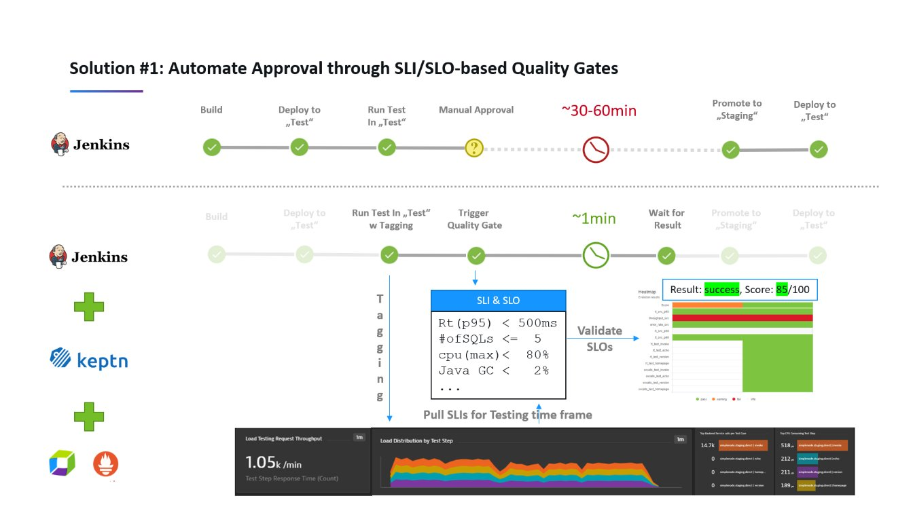

# Keptn. Data Driven DevOps Automation with Ketpn. Automating Service Level Indicators/Service Level Objectives based build validation with Keptn and Jenkins
1. [Introduction](#introduction)
2. [Keptn Videos](#keptn-videos)
3. [Keptn Images](#keptn-images)
4. [Keptn Slides](#keptn-slides)

## Introduction

- [Keptn](https://www.keptn.sh) **Keptn not only orchestrates Continuous Deployment, but it also orchestrates Continuous or Automated Operations.**
- Keptn provides **automated SLI/SLO-based quality gates** Introduction to Data Driven DevOps Automation. Keptn is a CNCF sandbox project and aims to automate delivery and operational processes using a data-driven approach. Keptn’s architecture solves a key problem with traditional automation tools where process and tool integrations are often hard coded or hard to maintain. Keptn uses an event-driven orchestrator with declarative process and tooling definitions that eliminate the need for any custom tool integration and make changing processes or tools a matter of changing a config file entry! At the core Keptn integrates with your observability platforms to automate SRE best practices such as SLO validation as part of your DevOps delivery and operations automation. Start automating your DevOps processes with Keptn to cover SLO-based Quality Gates, Performance & Chaos Test Automation, Event Driven Delivery as well as SRE-driven Auto-Remediation.
- [Quick Start](https://keptn.sh/docs/quickstart/)
- [tutorials.keptn.sh 🌟](https://tutorials.keptn.sh/)
    - [tutorials.keptn.sh: Azure DevOps Pipelines with Keptn Quality Gates](https://tutorials.keptn.sh/tutorials/keptn-azure-devops/index.html)
- [dynatrace.com: What is keptn, how it works and how to get started!](https://www.dynatrace.com/news/blogwhat-is-keptn-how-it-works-and-how-to-get-started/) 
- [medium: Keptn 0.6.0 — My top 5 favorite improvements](https://medium.com/keptn/keptn-0-6-0-my-top-5-favorite-improvements-242d8ac1abfe)
- [altoros.com: Automating Event-Based Continuous Delivery on Kubernetes with keptn](https://www.altoros.com/blogautomating-event-based-continuous-delivery-on-kubernetes-with-keptn/)
- [medium: How we are redesigning our microservices deployment strategy](https://medium.com/dynatrace-engineering/how-we-are-redesigning-our-microservices-deployment-strategy-c567e310a42e) Sharing the story of why we decided to adopt Keptn internally at Dynatrace and how we are making it happen
- [Keptn Jenkins Shared Library](https://github.com/keptn-sandbox/keptn-jenkins-library) **integrates Jenkins and Keptn** with just a couple of function calls.
- [Jenkins Online Meetup](https://www.meetup.com/Jenkins-online-meetup/events/270861119/) Andreas Grabner from Dynatrace will talk about **automating Service Level Indicators/Service Level Objectives based build validation with Keptn and Jenkins.** 
    - In many organizations up to 80% of pipeline execution time is spent in manual build validation steps. How can we reduce that? One option is applying Google's SRE (Site Reliability Engineering) practices by **automating SLI (Service Level Indicators) & SLO (Service Level Objectives) based build validation**. This method has proven to detect problematic issues in production and also allows us to automatically approve or reject builds being pushed through our pipelines.
    - In this session you learn the basics of picking good **SLIs & SLOs** and how to extract them from your monitoring tools. After this session you will be able to start implementing this integration yourself with Jenkins. To give you a jump start you will be introduced to the open source project [Keptn](https://www.keptn.sh) which provides **automated SLI/SLO-based quality gates**. Then we'll talk about [Keptn Jenkins Shared Library](https://github.com/keptn-sandbox/keptn-jenkins-library) which **integrates Jenkins and Keptn** with just a couple of function calls.
- [youtube: Level-Up your Jenkins-based Delivery with Keptn](https://www.youtube.com/watch?v=VYRdirdjOAg&t=5s)
- [thenewstack.io: How Keptn Automatically Configures Prometheus Ecosystems](https://thenewstack.io/how-keptn-automatically-configures-prometheus-ecosystems/)
- [github.com/keptn-sandbox/keptn-on-k3s: Tutorial: Keptn for Dynatrace Users in 5 Minutes 🌟](https://github.com/keptn-sandbox/keptn-on-k3s/blob/master/README-KeptnForDynatrace.md) - [Tutorial on keptnProject with argoproj for canary deployments using Dynatrace for SLO-based rollout control](https://github.com/keptn-sandbox/keptn-on-k3s/blob/master/README-KeptnForDynatrace.md#use-case-5-canary-rollouts-with-argo) 
- [youtube: Tutorial - Keptn in a box](https://www.youtube.com/watch?v=OQAXQrKhIt0&ab_channel=keptn)
- [dynatrace-perfclinics.github.io: Why Devs Love Dynatrace 🌟](https://dynatrace-perfclinics.github.io/codelabs/why-devs-love-dynatrace-2/index.html) Codelab explaining the benefits of automating SLO-based quality gates with keptnProject.

## Keptn Videos

??? note "Click to expand!"

	

	<iframe width="560" height="315" src="https://www.youtube.com/embed/3EEZmSwMXp8" title="YouTube video player" frameborder="0" allow="accelerometer; autoplay; clipboard-write; encrypted-media; gyroscope; picture-in-picture" allowfullscreen></iframe>
	<iframe width="560" height="315" src="https://www.youtube.com/embed/H4tZhpKxVC4" title="YouTube video player" frameborder="0" allow="accelerometer; autoplay; clipboard-write; encrypted-media; gyroscope; picture-in-picture" allowfullscreen></iframe>
	<iframe width="560" height="315" src="https://www.youtube.com/embed/GhEZLvc8B70" frameborder="0" allow="accelerometer; autoplay; encrypted-media; gyroscope; picture-in-picture" allowfullscreen></iframe>
	

## Keptn Images

??? note "Click to expand!"

	

	
	
	
	

## Keptn Slides

??? note "Click to expand!"

	

	
	

