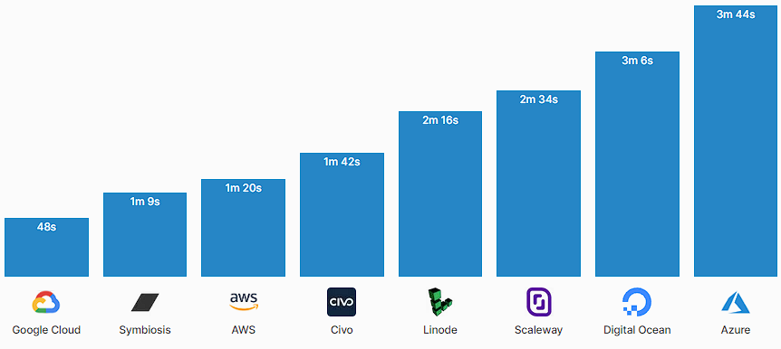

# Autoscaling

1. [Introduction](#introduction)
2. [Cluster Autoscaler Kubernetes Tool](#cluster-autoscaler-kubernetes-tool)
3. [HPA and VPA](#hpa-and-vpa)
    1. [Kubernetes Scale to Zero](#kubernetes-scale-to-zero)
4. [Cluster Autoscaler and Helm](#cluster-autoscaler-and-helm)
5. [KEDA Kubernetes Event Driven Autoscaling](#keda-kubernetes-event-driven-autoscaling)
6. [Cluster Autoscaler and DockerHub](#cluster-autoscaler-and-dockerhub)
7. [Cluster Autoscaler in GKE, EKS, AKS and DOKS](#cluster-autoscaler-in-gke-eks-aks-and-doks)
8. [Cluster Autoscaler in OpenShift](#cluster-autoscaler-in-openshift)
9. [Scaling Kubernetes to multiple clusters and regions](#scaling-kubernetes-to-multiple-clusters-and-regions)
10. [Kubernetes Load Testing and High Load Tuning](#kubernetes-load-testing-and-high-load-tuning)
11. [Tweets](#tweets)
12. [Videos](#videos)

## Introduction

- [levelup.gitconnected.com: Effects of Docker Image Size on AutoScaling w.r.t Single and Multi-Node Kube Cluster](https://levelup.gitconnected.com/effects-of-docker-image-size-on-autoscaling-w-r-t-single-and-multi-node-kube-cluster-29c4f689cd99)
- [infracloud.io: 3 Autoscaling Projects to Optimise Kubernetes Costs](https://www.infracloud.io/blogs/3-autoscaling-projects-optimising-kubernetes-costs/) Three autoscaling use cases:
    - Autoscaling Event-driven workloads
    - Autoscaling real-time workloads
    - Autoscaling Nodes/Infrastructure
- [blog.scaleway.com: Understanding Kubernetes Autoscaling](https://blog.scaleway.com/understanding-kubernetes-autoscaling/)
- [infracloud.io: Kubernetes Autoscaling with Custom Metrics (updated) 🌟](https://www.infracloud.io/blogs/kubernetes-autoscaling-custom-metrics/)
- [sysdig.com: Kubernetes pod autoscaler using custom metrics](https://sysdig.com/blog/kubernetes-autoscaler/)
- [learnk8s.io: Architecting Kubernetes clusters — choosing the best autoscaling strategy 🌟](https://learnk8s.io/kubernetes-autoscaling-strategies) How to configure multiple autoscalers in Kubernetes to minimise scaling time and found out that 4 factors affect scaling:
    1. HPA reaction time.
    2. CA reaction time.
    3. Node provisioning time.
    4. Pod creation time.
- [thenewstack.io: Reduce Kubernetes Costs Using Autoscaling Mechanisms](https://thenewstack.io/reduce-kubernetes-costs-using-autoscaling-mechanisms/)
- [cast.ai: Guide to Kubernetes autoscaling for cloud cost optimization 🌟](https://cast.ai/blog/guide-to-kubernetes-autoscaling-for-cloud-cost-optimization)
- [thenewstack.io: Scaling Microservices on Kubernetes 🌟](https://thenewstack.io/scaling-microservices-on-kubernetes)
    - Horizontally scaling a monolith is much more difficult; and we simply can’t independently scale any of the “parts” of a monolith. This isn’t ideal, because it might only be a small part of the monolith that causes the performance problem. Yet, we would have to vertically scale the entire monolith to fix it. Vertically scaling a large monolith can be an expensive proposition.
    - Instead, with microservices, we have numerous options for scaling. For instance, we can independently fine-tune the performance of small parts of our system to eliminate bottlenecks and achieve the right mix of performance outcomes.
- [cloud.ibm.com: Tutorial - Scalable webapp 🌟](https://cloud.ibm.com/docs/solution-tutorials?topic=solution-tutorials-scalable-webapp-kubernetes)
- [containiq.com: Kubernetes Autoscaling: A Beginners Guide. Getting Started + Examples](https://www.containiq.com/post/kubernetes-autoscaling) In this article, you'll cover an overview of the autoscaling feature provided by Kubernetes. You'll also explore how autoscaling works and how you can configure it.
- [medmouine/Kubernetes-autoscaling-poster: Kubernetes autoscaling poster [PDF] 🌟](https://github.com/medmouine/Kubernetes-autoscaling-poster/blob/main/k8s-auto-scaling-poster.pdf)
- [medium.com/airbnb-engineering: Dynamic Kubernetes Cluster Scaling at Airbnb](https://medium.com/airbnb-engineering/dynamic-kubernetes-cluster-scaling-at-airbnb-d79ae3afa132) In this post, you'll learn about how Airbnb dynamically size their clusters using the Kubernetes Cluster Autoscaler, and highlight the functionality they've contributed to the sig-autoscaling community
- [chaitu-kopparthi.medium.com: Scaling Kubernetes workloads using custom Prometheus metrics](https://chaitu-kopparthi.medium.com/scaling-kubernetes-workloads-using-custom-prometheus-metrics-1eb64b23919e)
- [medium.com/@niklas.uhrberg: Auto scaling in Kubernetes using Kafka and application metrics — part 1](https://medium.com/@niklas.uhrberg/auto-scaling-in-kubernetes-using-kafka-and-application-metrics-part-1-a509256b64ff) In this article, you will find a case study on auto scaling long-running jobs in Kubernetes using external metrics from Kafka and the application itself.
- [openai.com: Scaling Kubernetes to 7,500 Nodes](https://openai.com/blog/scaling-kubernetes-to-7500-nodes/)
- [thinksys.com: Understanding Kubernetes Autoscaling](https://www.thinksys.com/devops/kubernetes-autoscaling/) Types of Kubernetes Autoscaling:
    - Horizontal Pod Autoscaler (HPA)
    - Vertical Pod Autoscaler (VPA)
    - Cluster Autoscaler
- [medium.com/mindboard: What is Autoscaling in Kubernetes?](https://medium.com/mindboard/what-is-autoscaling-in-kubernetes-109c7b5d321) Autoscaling is useful feature in Kubernetes that helps you to automatically adjust the number & resource consumption of pods in your deployment to meet the changing needs of your app.
- [clickittech.com: Kubernetes Autoscaling: How to use the Kubernetes Autoscaler](https://www.clickittech.com/devops/kubernetes-autoscaling/) In this tutorial, you'll install and test three different autoscaler on EKS:
    - Horizontal Pod Autoscaler
    - Vertical Pod Autoscaler
    - Cluster Autoscaler

## Cluster Autoscaler Kubernetes Tool

- [kubernetes.io: Cluster Management - **Resizing a cluster**](https://kubernetes.io/docs/tasks/administer-cluster/cluster-management/#resizing-a-cluster)
- [github.com/kubernetes: **Kubernetes Cluster Autoscaler**](https://github.com/kubernetes/autoscaler/tree/master/cluster-autoscaler)
- [Kubernetes Autoscaling in Production: Best Practices for **Cluster Autoscaler, HPA and VPA**](https://www.replex.io/blog/kubernetes-in-production-best-practices-for-cluster-autoscaler-hpa-and-vpa) In this article we will take a deep dive into Kubernetes autoscaling tools including the cluster autoscaler, the horizontal pod autoscaler and the vertical pod autoscaler. We will also identify best practices that developers, DevOps and Kubernetes administrators should follow when configuring these tools.
- [gitconnected.com: Kubernetes Autoscaling 101: Cluster Autoscaler, Horizontal Pod Autoscaler, and Vertical Pod Autoscaler](https://levelup.gitconnected.com/kubernetes-autoscaling-101-cluster-autoscaler-horizontal-pod-autoscaler-and-vertical-pod-2a441d9ad231)
- [packet.com: Kubernetes Cluster Autoscaler](https://www.packet.com/resources/guides/kubernetes-cluster-autoscaler-on-packet/)
- [itnext.io: Kubernetes Cluster Autoscaler: More than scaling out](https://itnext.io/kubernetes-cluster-autoscaler-more-than-scaling-out-7b2d97f10b27)
- [cloud.ibm.com: Containers Troubleshoot Cluster Autoscaler](https://cloud.ibm.com/docs/containers?topic=containers-troubleshoot_cluster_autoscaler)
- [platform9.com: Kubernetes Autoscaling Options: Horizontal Pod Autoscaler, Vertical Pod Autoscaler and Cluster Autoscaler](https://platform9.com/blog/kubernetes-autoscaling-options-horizontal-pod-autoscaler-vertical-pod-autoscaler-and-cluster-autoscaler/)
- [banzaicloud.com: Autoscaling Kubernetes clusters](https://banzaicloud.com/blog/k8s-cluster-autoscaler/)
- [tech.deliveryhero.com: Dynamically overscaling a Kubernetes cluster with cluster-autoscaler and Pod Priority](https://tech.deliveryhero.com/dynamically-overscaling-a-kubernetes-cluster-with-cluster-autoscaler-and-pod-priority/)
- [medium: Build Kubernetes Autoscaling for Cluster Nodes and Application Pods 🌟](https://medium.com/better-programming/build-kubernetes-autoscaling-for-cluster-nodes-and-application-pods-bb7f2d716b07)
- [Auto-Scaling Your Kubernetes Workloads (K8s) 🌟](https://medium.com/faun/autoscaling-in-kubernetes-cluster-bc55b8393a19)
- [medium: Cluster Autoscaler in Kubernetes](https://medium.com/avmconsulting-blog/cluster-autoscaler-type-in-kubernetes-part2-f2ae432eefbb)
- [itnext.io: Kubernetes Resources and Autoscaling — From Basics to Greatness 🌟](https://itnext.io/kubernetes-resources-and-autoscaling-from-basics-to-greatness-7cae17fbf27b)
- [kubedex.com: autoscaling 🌟](https://kubedex.com/autoscaling)
- [==chrisedrego.medium.com: Kubernetes AutoScaling Series: Cluster AutoScaler== 🌟](https://chrisedrego.medium.com/kubernetes-autoscaling-series-cluster-autoscaler-5d60c10c3dc1)
- [==hashnode.com: Proactive cluster autoscaling in Kubernetes | Daniele Polencic== 🌟🌟](https://hashnode.com/post/proactive-cluster-autoscaling-in-kubernetes-cl88pz1ua01obu5nv24520hv6) **Scaling nodes in a Kubernetes cluster could take several minutes with the default settings. Learn how to size your cluster nodes and proactively create nodes for quicker scaling.**
- [symbiosis.host: Benchmarking Kubernetes node initialization](https://symbiosis.host/blog/comparing-node-launch-times) **In this benchmark, you will compare cluster initialization time across 8 managed Kubernetes providers**
    - Kubernetes nodes are slow to initialize. OS's have to be booted, networks have to be configured, kubelets need to initialize, certificates need to be issued and approved, and so on...
    - The unfortunate side effect is that cluster autoscaling is limited by the time it takes to add more nodes into the pool. If your environment sees a sudden spike in usage there might not be enough time to scale up to handle the additional load.
    - This volatility in usage will impact the amount of additional capacity that is necessary for your cluster to function during high stress. For very bursty settings you will need to configure more headroom to account for the hightened variance.
    - However, the faster nodes initialize the faster your cluster can react to these sudden spikes. So, not only can quick nodes reduce the risk of resource congestion, it also reduces the additional headroom you need to have on hand, leading to lower costs.
    - In this benchmark we compared initialization time across 8 managed Kubernetes providers.
- [the-gigi.github.io: Advanced Kubernetes Scheduling and Autoscaling](https://the-gigi.github.io/gigi-zone/posts/2024/05/advanced-k8s-scheduling-and-autoscaling/)

## HPA and VPA

- [HPA: Horizontal Pod Autoscaler](https://kubernetes.io/docs/tasks/run-application/horizontal-pod-autoscale/)
- [VPA: Vertical Pod Autoscaler](https://github.com/kubernetes/autoscaler/tree/master/vertical-pod-autoscaler)
- [returngis.net: Escalado vertical de tus pods en Kubernetes con VerticalPodAutoscaler](https://www.returngis.net/2020/07/escalado-vertical-de-tus-pods-en-kubernetes/)
- [medium: Build Kubernetes Autoscaling for Cluster Nodes and Application Pods](https://medium.com/better-programming/build-kubernetes-autoscaling-for-cluster-nodes-and-application-pods-bb7f2d716b07) Via the Cluster Autoscaler, Horizontal Pod Autoscaler, and Vertical Pod Autoscaler
- [itnext.io: Horizontal Pod Autoscaling with Custom Metric from Different Namespace](https://itnext.io/horizontal-pod-autoscaling-with-custom-metric-from-different-namespace-f19f8446143b)
- [Kubernetes autoscaling with Istio metrics 🌟](https://medium.com/google-cloud/kubernetes-autoscaling-with-istio-metrics-76442253a45a) Scaling based on traffic is not something new to Kubernetes, an ingress controllers such as NGINX can expose Prometheus metrics for HPA. **The difference in using Istio is that you can autoscale backend services as well, apps that are accessible only from inside the mesh.**
- [medium: 1/3 Autoscaling in Kubernetes: A Primer on Autoscaling](https://medium.com/expedia-group-tech/autoscaling-in-kubernetes-a-primer-on-autoscaling-7b8f0f95a928)
    - [medium: 2/3 Autoscaling in Kubernetes: Options, Features, and Use Cases](https://medium.com/expedia-group-tech/autoscaling-in-kubernetes-options-features-and-use-cases-c8a6ce145957)
    - [medium: 3/3 Autoscaling in Kubernetes: Why doesn’t the Horizontal Pod Autoscaler work for me?](https://medium.com/expedia-group-tech/autoscaling-in-kubernetes-why-doesnt-the-horizontal-pod-autoscaler-work-for-me-5f0094694054)
- [around25.com: Horizontal Pod Autoscaler in Kubernetes 🌟](https://around25.com/blog/horizontal-pod-autoscaler-in-kubernetes/)
- [superawesome.com: Scaling pods with HPA using custom metrics. How we scale our kid-safe technology using Kubernetes 🌟](https://www.superawesome.com/blog/how-we-scale-our-kid-safe-technology-using-auto-scaling-on-kubernetes/)
- [velotio.com: Autoscaling in Kubernetes using HPA and VPA](https://www.velotio.com/engineering-blog/autoscaling-in-kubernetes-using-hpa-vpa)
- [kubectl-vpa](https://github.com/ninlil/kubectl-vpa) Tool to manage VPAs (vertical-pod-autoscaler) resources in a kubernetes-cluster
- [itnext.io: K8s Vertical Pod Autoscaling 🌟](https://itnext.io/k8s-vertical-pod-autoscaling-fd9e602cbf81)
- [czakozoltan08.medium.com: Stupid Simple Scalability](https://czakozoltan08.medium.com/stupid-simple-scalability-dc4a7fbe67d6)
- [sysdig.com: Trigger a Kubernetes HPA with Prometheus metrics](https://sysdig.com/blog/kubernetes-hpa-prometheus/) Using Keda to query #prometheus in order to automatically create a Kubernetes HPA
- [cloudnatively.com: Understanding Horizontal Pod Autoscaling](https://www.cloudnatively.com/kubernetes-hpa-explanation/)
- [blog.px.dev: Horizontal Pod Autoscaling with Custom Metrics in Kubernetes 🌟](https://blog.px.dev/autoscaling-custom-k8s-metric/) In this post, you'll learn how to autoscale your Kubernetes deployment using custom application metrics (i.e. HTTP requests/second)
- [awstip.com: Kubernetes HPA](https://awstip.com/kubernetes-hpa-8b7cf54f115) HPA, the short form Horizontal pod autoscaling, is nothing but a piece of software that dynamically scales the pods based on thresholds like CPU, Memory, HTTP requests (custom metrics).
- [medium.com/@CloudifyOps: Setting up a Horizontal Pod Autoscaler for Kubernetes cluster](https://medium.com/@CloudifyOps/setting-up-a-horizontal-pod-autoscaler-for-kubernetes-cluster-a7d3cf3be7)
- [betterprogramming.pub: Advanced Features of Kubernetes’ Horizontal Pod Autoscaler](https://betterprogramming.pub/advanced-features-of-kubernetes-horizontal-pod-autoscaler-536ebd7893ad) Kubernetes’ Horizontal Pod Autoscaler has features you probably don’t know about. Here’s how to use them to your advantage.
- [code.egym.de: Horizontal Pod Autoscaler in Kubernetes (Part 1) — Simple Autoscaling using Metrics Server](https://code.egym.de/horizontal-pod-autoscaler-in-kubernetes-part-1-simple-autoscaling-using-metrics-server-929e96cc2ab2) Learn how to use Metrics Server to horizontally scale native and JVM services in Kubernetes automatically based on resource metrics.
- [medium.com/@kewynakshlley: Performance evaluation of the autoscaling strategies vertical and horizontal using Kubernetes](https://medium.com/@kewynakshlley/performance-evaluation-of-the-autoscaling-strategies-vertical-and-horizontal-using-kubernetes-42d9a1663e6b) Scalable applications may adopt horizontal or vertical autoscaling to dynamically provision resources in the cloud. To help to choose the best strategy, this work aims to compare the performance of horizontal and vertical autoscaling in Kubernetes. Through measurement experiments using synthetic load to a web application, the horizontal was shown more efficient, reacting faster to the load variation and resulting in a lower impact on the application response time.
- [itnext.io: Stupid Simple Scalability](https://itnext.io/stupid-simple-scalability-dc4a7fbe67d6)
- [faun.pub: Scaling Your Application Using Kubernetes - Harness | Pavan Belagatti](https://faun.pub/scaling-your-application-using-kubernetes-9ad0d6bcf0d6)
- [dnastacio.medium.com: Infinite scaling with containers and Kubernetes](https://dnastacio.medium.com/kubernetes-resources-1a1fa1e72dcf) The article starts with a recap of Kubernetes resource management and its core concepts of requests and limits. Then it discusses those static limits in the realm of pod autoscalers, such as HPA, VPA, and KPA.
- [medium.com/@badawekoo: Scaling in Kubernetes _What, Why and How?](https://medium.com/@badawekoo/scaling-in-kubernetes-what-why-and-how-d120e99be071)
- [pauldally.medium.com: HorizontalPodAutoscaler uses request (not limit) to determine when to scale by percent](https://pauldally.medium.com/horizontalpodautoscaler-uses-request-not-limit-to-determine-when-to-scale-97643d808997) In this article, you will learn how the Horizontal Pod Autoscaler uses requests (and not limits) when computing the target utilization percentage to scale pods
- [dev.to: Scaling Your Application With Kubernetes | Pavan Belagatti](https://dev.to/pavanbelagatti/scaling-your-application-with-kubernetes-5715)
- [github.com/jthomperoo: Predictive Horizontal Pod Autoscaler](https://github.com/jthomperoo/predictive-horizontal-pod-autoscaler) Horizontal Pod Autoscaler built with predictive abilities using statistical models. Predictive Horizontal Pod Autoscalers (PHPAs) are Horizontal Pod Autoscalers (HPAs) with extra predictive capabilities baked in, allowing you to apply statistical models to the results of HPA calculations to make proactive scaling decisions.
- [==thenewstack.io: K8s Resource Management: An Autoscaling Cheat Sheet== 🌟](https://thenewstack.io/k8s-resource-management-an-autoscaling-cheat-sheet/) A concise but comprehensive guide to using and managing horizontal and vertical autoscaling in the Kubernetes environment.
- [waswani.medium.com: Autoscaling Pods in Kubernetes](https://waswani.medium.com/autoscaling-pods-in-kubernetes-37d05000c41) If you are hosting your workload in a cloud environment, and your traffic pattern is fluctuating in nature (think unpredictable), you need a mechanism to automatically scale out (and off-course scale in) your workload to ensure the service is able to perform as per defined Service Level Objective (SLO), without impacting the User Experience. This semantic is referred to as Autoscaling, to be very precise Horizontal Scaling.
- [mckornfield.medium.com: Working with HPAs in Kubernetes](https://mckornfield.medium.com/working-with-hpas-in-kubernetes-ced39263b596) How to make your Kubernetes workloads scale with a few simple steps
- [code.egym.de: Vertical Pod Autoscaler in Kubernetes](https://code.egym.de/vertical-pod-autoscaler-in-kubernetes-b12a5c61393f) Learn how to use Vertical Pod Autoscaler (VPA) to vertically scale services in Kubernetes automatically based on resource metrics.
- [faun.pub: Intelligently estimating your Kubernetes resource needs!](https://faun.pub/intelligently-estimating-your-kubernetes-resource-needs-c12a75ea3138) In this tutorial, you will learn how to use the Vertical Pod Autoscaler and Goldilocks to guess the correct requests and limits for your Pods
- [itnext.io: Kubernetes: vertical Pods scaling with Vertical Pod Autoscaler](https://itnext.io/kubernetes-vertical-pods-scaling-with-vertical-pod-autoscaler-e2e5a3b8e1a9)
- [medium.com/@adityadhopade18: Mastering K8s Event Driven AutoScaling](https://medium.com/@adityadhopade18/mastering-k8s-event-driven-autoscaling-cd1b9df78903)

### Kubernetes Scale to Zero

- [dzone: Scale to Zero With Kubernetes with KEDA and/or Knative](https://dzone.com/articles/scale-to-zero-with-kubernetes) This article reviews how Kubernetes provides the platform capabilities for dynamic deployment, scaling, and management in Cloud-native applications.
- [==dev.to/danielepolencic: Request-based autoscaling in Kubernetes: scaling to zero==](https://dev.to/danielepolencic/request-based-autoscaling-in-kubernetes-scaling-to-zero-2i73) - [linode.com: Scaling Kubernetes to Zero (And Back)](https://www.linode.com/blog/kubernetes/scaling-kubernetes-to-zero-and-back/) **In this article, you will learn how to monitor the HTTP requests to your apps in Kubernetes and define autoscaling rules to increase and decrease replicas for your workloads.**

## Cluster Autoscaler and Helm

- [hub.helm.sh: cluster-autoscaler](https://hub.helm.sh/charts/stable/cluster-autoscaler) The cluster autoscaler scales worker nodes within an AWS autoscaling group (ASG) or Spotinst Elastigroup.

## KEDA Kubernetes Event Driven Autoscaling

- [==keda.sh: Kubernetes Event-driven Autoscaling. Application autoscaling made simple.==](https://keda.sh) **KEDA is a Kubernetes-based Event Driven Autoscaler. With KEDA, you can drive the scaling of any container in Kubernetes based on the number of events needing to be processed.** https://github.com/kedacore/keda
- [medium.com/backstagewitharchitects: How Autoscaling Works in Kubernetes? Why You Need To Start Using KEDA?](https://medium.com/backstagewitharchitects/how-autoscaling-works-in-kubernetes-why-you-need-to-start-using-keda-b601b483d355)
- [partlycloudy.blog: Horizontal Autoscaling in Kubernetes #3 – KEDA](https://partlycloudy.blog/2020/05/29/horizontal-autoscaling-in-kubernetes-3-keda/)
- [thenewstack.io: CNCF KEDA 2.0 Scales up Event-Driven Programming on Kubernetes](https://thenewstack.io/microsoft-keda-2-0-scales-up-event-driven-programming-on-kubernetes/)
- [blog.cloudacode.com: How to Autoscale Kubernetes pods based on ingress request — Prometheus, KEDA, and K6](https://blog.cloudacode.com/how-to-autoscale-kubernetes-pods-based-on-ingress-request-prometheus-keda-and-k6-84ae4250a9f3) In this article, you will learn how autoscale pods with KEDA, Prometheus and the metrics from the ingress-nginx. You will use k6 to generate the load and observe the pod count increase as more requests are handled by the ingress controller.
- [medium.com/@toonvandeuren: Kubernetes Scaling: The Event Driven Approach - KEDA](https://medium.com/@toonvandeuren/kubernetes-scaling-the-event-driven-approach-bdd58ded4e3f) In this article, you'll discuss two different approaches to automatic scaling of your apps within a Kubernetes cluster: the Horizontal Pod Autoscaler and the Kubernetes Event-Driven Autoscaler (KEDA) - [youtube: Application Autoscaling Made Easy With Kubernetes Event-Driven Autoscaling (KEDA)](https://www.youtube.com/watch?v=c5t1y9V8HWc)
- [Dzone: Autoscaling Your Kubernetes Microservice with KEDA](https://dzone.com/articles/autoscaling-your-kubernetes-microservice-with-keda) Introduction to KEDA—event-driven autoscaler for Kubernetes, Apache Camel, and ActiveMQ Artemis—and how to use it to scale a Java microservice on Kubernetes.
- [tomd.xyz: Event-driven integration on Kubernetes with Camel & KEDA 🌟](https://tomd.xyz/kubernetes-event-driven-keda/) Can we develop apps in Kubernetes that autoscale based on events? Perhaps, with this example using KEDA, ActiveMQ and Apache Camel.
- [faun.pub: Scaling an app in Kubernetes with KEDA (no Prometheus is needed)](https://faun.pub/keda-ec9fc7c8dd81)
- [itnext.io: Event Driven Autoscaling](https://itnext.io/event-driven-autoscaling-503b5cefaa49) KEDA expands the capabilities of Kubernetes by managing the integration with external sources allowing you to auto-scale your Kubernetes Deployments based on data from both internal and external metrics.
- [medium.com/@casperrubaek: Why KEDA is a game-changer for scaling in Kubernetes](https://medium.com/@casperrubaek/why-keda-is-a-game-changer-for-scaling-in-kubernetes-4ebf34cb4b61) KEDA makes it possible to easily scale based on any metric imaginable from almost any metric provider and is running at a massive scale in production in the cloud at some of the largest corporations in the world.
- [levelup.gitconnected.com: Scale your Apps using KEDA in Kubernetes](https://levelup.gitconnected.com/scale-your-apps-using-keda-in-kubernetes-a1f2142ecc20)
- [blog.devops.dev: KEDA: Autoscaling Kubernetes apps using Prometheus](https://blog.devops.dev/keda-autoscaling-kubernetes-apps-using-prometheus-da037fe572cf)
- [purushothamkdr453.medium.com: Event driven autoscaling in kubernetes using KEDA](https://purushothamkdr453.medium.com/event-driven-autoscaling-in-kubernetes-using-keda-a0c16a383619)
- [medium.com/@rtaplamaci: Horizontal Scaling on Kubernetes Clusters Based on AWS CloudWatch Metrics with KEDA](https://medium.com/@rtaplamaci/horizontal-scaling-on-kubernetes-clusters-based-on-aws-cloudwatch-metrics-with-keda-7c9e0e3ba5f) In this article, you will learn how to use KEDA to horizontally scale the workloads running in a Kubernetes cluster based on the custom metrics exposed via AWS CloudWatch
- [medium.com/@hirushanonline: Dynamic Scaling with Kubernetes Event-driven Autoscaling (KEDA)](https://medium.com/@hirushanonline/dynamic-scaling-with-kubernetes-event-driven-autoscaling-keda-caaa15096e1c)
- [kedify.io: Prometheus and Kubernetes Horizontal Pod Autoscaler don’t talk, KEDA does](https://www.kedify.io/blog-posts/prometheus-and-kubernetes-horizontal-pod-autoscaler-dont-talk-keda-does)
- [github.com/kedacore/keda/issues/2214](https://github.com/kedacore/keda/issues/2214) Scaler for Amazon managed service for Prometheus
- [opcito.com: A guide to mastering autoscaling in Kubernetes with KEDA](https://opcito.com/blogs/a-guide-to-mastering-autoscaling-in-kubernetes-with-keda)
- [dev.to/vinod827: Scale your apps using KEDA in Kubernetes](https://dev.to/vinod827/scale-your-apps-using-keda-in-kubernetes-4i3h)

## Cluster Autoscaler and DockerHub

- [bitnami/cluster-autoscaler](https://hub.docker.com/r/bitnami/cluster-autoscaler/)

## Cluster Autoscaler in GKE, EKS, AKS and DOKS

- [Amazon Web Services: EKS Cluster Autoscaler](https://docs.aws.amazon.com/eks/latest/userguide/cluster-autoscaler.html)
    - [eksworkshop.com: Configure Cluster Autoscaler (CA)](https://eksworkshop.com/scaling/deploy_ca/)
- [Azure: AKS Cluster Autoscaler](https://docs.microsoft.com/en-us/azure/aks/cluster-autoscaler)
- [Google Cloud Platform: GKE Cluster Autoscaler](https://cloud.google.com/kubernetes-engine/docs/concepts/cluster-autoscaler)
- [DigitalOcean Kubernetes: DOKS Cluster Autoscaler](https://www.digitalocean.com/docs/kubernetes/how-to/autoscale/)

## Cluster Autoscaler in OpenShift

- [OpenShift 3.11: Configuring the cluster auto-scaler in AWS](https://docs.openshift.com/container-platform/3.11/admin_guide/cluster-autoscaler.html)
- [OpenShift 4.4: Applying autoscaling to an OpenShift Container Platform cluster](https://docs.openshift.com/container-platform/4.4/machine_management/applying-autoscaling.html)

## Scaling Kubernetes to multiple clusters and regions

- [==dev.to/danielepolencic: Scaling Kubernetes to multiple clusters and regions== 🌟](https://dev.to/danielepolencic/scaling-kubernetes-to-multiple-clusters-and-regionss-294b)

## Kubernetes Load Testing and High Load Tuning

- [itnext.io: Kubernetes: load-testing and high-load tuning — problems and solutions](https://itnext.io/kubernetes-load-testing-and-high-load-tuning-problems-and-solutions-244d869a9791)
- [engineering.zalando.com: Building an End to End load test automation system on top of Kubernetes](https://engineering.zalando.com/posts/2021/03/building-an-end-to-end-load-test-automation-system-on-top-of-kubernetes.html) Learn how we built an end-to-end load test automation system to make load tests a routine task.
- [thenewstack.io: Sidecars are Changing the Kubernetes Load-Testing Landscape](https://thenewstack.io/sidecars-are-changing-the-kubernetes-load-testing-landscape/) Sidecars don't just capture traffic. They can replay it as well. They can also transform any metadata, like timestamps, before it sends it to your application.
- [medium.com/teamsnap-engineering: Load Testing a Service with ~20,000 Requests per Second with Locust, Helm, and Kustomize](https://medium.com/teamsnap-engineering/load-testing-a-service-with-20-000-requests-per-second-with-locust-helm-and-kustomize-ea9bea02ae28)
- [containiq.com: Kubernetes Load Testing | 8 Tools & Best Practices](https://www.containiq.com/post/kubernetes-load-testing) If you want to understand your Kubernetes application, performance testing is crucial. In this post, you’ll look at the value of performance testing, how to get started, and testing tools.

## Tweets

  
Click to expand!

<blockquote class="twitter-tweet">
☁️ Knowledge - Vertical vs Horizontal scaling 📈  Vertical scaling: Increase the power of machines. E.g. upgrade from 4 vCPU to 8 vCPU --&gt; Scaling Up ✅  Horizontal scaling: Add more machines. E.g. 3 web servers instead of 1 --&gt; Scaling Out ☑️
&mdash; Simon ☁️ (@simonholdorf) <a href="https://twitter.com/simonholdorf/status/1444186670677610500?ref_src=twsrc%5Etfw">October 2, 2021</a></blockquote> 

## Videos

  
Click to expand!

<iframe width="560" height="315" src="https://www.youtube.com/embed/3BnrXapY7zo" title="YouTube video player" frameborder="0" allow="accelerometer; autoplay; clipboard-write; encrypted-media; gyroscope; picture-in-picture" allowfullscreen></iframe>

