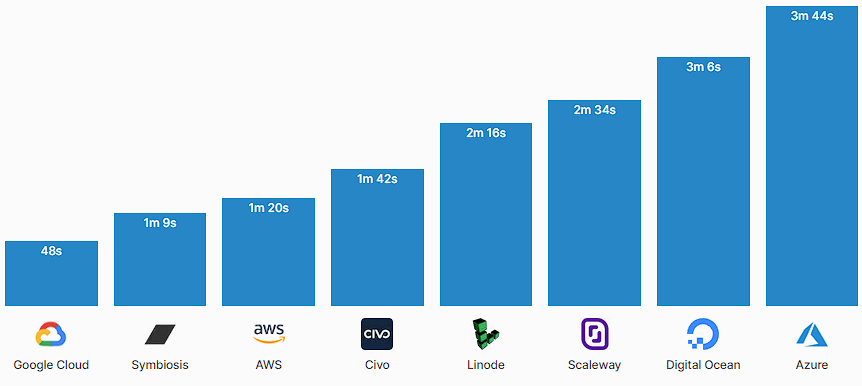

# Autoscaling

1. [Introduction](#introduction)
2. [Cluster Autoscaler Kubernetes Tool](#cluster-autoscaler-kubernetes-tool)
3. [HPA and VPA](#hpa-and-vpa)
    1. [Kubernetes Scale to Zero](#kubernetes-scale-to-zero)
4. [Cluster Autoscaler and Helm](#cluster-autoscaler-and-helm)
5. [KEDA Kubernetes Event Driven Autoscaling](#keda-kubernetes-event-driven-autoscaling)
6. [Cluster Autoscaler and DockerHub](#cluster-autoscaler-and-dockerhub)
7. [Cluster Autoscaler in GKE, EKS, AKS and DOKS](#cluster-autoscaler-in-gke-eks-aks-and-doks)
8. [Cluster Autoscaler in OpenShift](#cluster-autoscaler-in-openshift)
9. [Scaling Kubernetes to multiple clusters and regions](#scaling-kubernetes-to-multiple-clusters-and-regions)
10. [Kubernetes Load Testing and High Load Tuning](#kubernetes-load-testing-and-high-load-tuning)
11. [Tweets](#tweets)
12. [Videos](#videos)

## Introduction

- [infracloud.io: 3 Autoscaling Projects to Optimise Kubernetes Costs](https://www.infracloud.io/blogs/3-autoscaling-projects-optimising-kubernetes-costs/) Three autoscaling use cases:
    - Autoscaling Event-driven workloads
    - Autoscaling real-time workloads
    - Autoscaling Nodes/Infrastructure
- [blog.scaleway.com: Understanding Kubernetes Autoscaling](https://blog.scaleway.com/understanding-kubernetes-autoscaling/)
- [infracloud.io: Kubernetes Autoscaling with Custom Metrics (updated) 🌟](https://www.infracloud.io/blogs/kubernetes-autoscaling-custom-metrics/)
- [sysdig.com: Kubernetes pod autoscaler using custom metrics](https://sysdig.com/blog/kubernetes-autoscaler/)
- [learnk8s.io: Architecting Kubernetes clusters — choosing the best autoscaling strategy 🌟](https://learnk8s.io/kubernetes-autoscaling-strategies) How to configure multiple autoscalers in Kubernetes to minimise scaling time and found out that 4 factors affect scaling:
    1. HPA reaction time.
    2. CA reaction time.
    3. Node provisioning time.
    4. Pod creation time.
- [thenewstack.io: Reduce Kubernetes Costs Using Autoscaling Mechanisms](https://thenewstack.io/reduce-kubernetes-costs-using-autoscaling-mechanisms/)
- [cast.ai: Guide to Kubernetes autoscaling for cloud cost optimization 🌟](https://cast.ai/blog/guide-to-kubernetes-autoscaling-for-cloud-cost-optimization)
- [thenewstack.io: Scaling Microservices on Kubernetes 🌟](https://thenewstack.io/scaling-microservices-on-kubernetes)
    - Horizontally scaling a monolith is much more difficult; and we simply can’t independently scale any of the “parts” of a monolith. This isn’t ideal, because it might only be a small part of the monolith that causes the performance problem. Yet, we would have to vertically scale the entire monolith to fix it. Vertically scaling a large monolith can be an expensive proposition.
    - Instead, with microservices, we have numerous options for scaling. For instance, we can independently fine-tune the performance of small parts of our system to eliminate bottlenecks and achieve the right mix of performance outcomes.
- [cloud.ibm.com: Tutorial - Scalable webapp 🌟](https://cloud.ibm.com/docs/solution-tutorials?topic=solution-tutorials-scalable-webapp-kubernetes)
- [medmouine/Kubernetes-autoscaling-poster: Kubernetes autoscaling poster [PDF] 🌟](https://github.com/medmouine/Kubernetes-autoscaling-poster/blob/main/k8s-auto-scaling-poster.pdf)
- [thinksys.com: Understanding Kubernetes Autoscaling](https://www.thinksys.com/devops/kubernetes-autoscaling/) Types of Kubernetes Autoscaling:
    - Horizontal Pod Autoscaler (HPA)
    - Vertical Pod Autoscaler (VPA)
    - Cluster Autoscaler
- [clickittech.com: Kubernetes Autoscaling: How to use the Kubernetes Autoscaler](https://www.clickittech.com/devops/kubernetes-autoscaling/) In this tutorial, you'll install and test three different autoscaler on EKS:
    - Horizontal Pod Autoscaler
    - Vertical Pod Autoscaler
    - Cluster Autoscaler

## Cluster Autoscaler Kubernetes Tool

- [github.com/kubernetes: **Kubernetes Cluster Autoscaler**](https://github.com/kubernetes/autoscaler/tree/master/cluster-autoscaler)
- [Kubernetes Autoscaling in Production: Best Practices for **Cluster Autoscaler, HPA and VPA**](https://www.replex.io/blog/kubernetes-in-production-best-practices-for-cluster-autoscaler-hpa-and-vpa) In this article we will take a deep dive into Kubernetes autoscaling tools including the cluster autoscaler, the horizontal pod autoscaler and the vertical pod autoscaler. We will also identify best practices that developers, DevOps and Kubernetes administrators should follow when configuring these tools.
- [cloud.ibm.com: Containers Troubleshoot Cluster Autoscaler](https://cloud.ibm.com/docs/containers?topic=containers-troubleshoot_cluster_autoscaler)
- [platform9.com: Kubernetes Autoscaling Options: Horizontal Pod Autoscaler, Vertical Pod Autoscaler and Cluster Autoscaler](https://platform9.com/blog/kubernetes-autoscaling-options-horizontal-pod-autoscaler-vertical-pod-autoscaler-and-cluster-autoscaler/)
- [symbiosis.host: Benchmarking Kubernetes node initialization](https://symbiosis.host/blog/comparing-node-launch-times) **In this benchmark, you will compare cluster initialization time across 8 managed Kubernetes providers**
    - Kubernetes nodes are slow to initialize. OS's have to be booted, networks have to be configured, kubelets need to initialize, certificates need to be issued and approved, and so on...
    - The unfortunate side effect is that cluster autoscaling is limited by the time it takes to add more nodes into the pool. If your environment sees a sudden spike in usage there might not be enough time to scale up to handle the additional load.
    - This volatility in usage will impact the amount of additional capacity that is necessary for your cluster to function during high stress. For very bursty settings you will need to configure more headroom to account for the hightened variance.
    - However, the faster nodes initialize the faster your cluster can react to these sudden spikes. So, not only can quick nodes reduce the risk of resource congestion, it also reduces the additional headroom you need to have on hand, leading to lower costs.
    - In this benchmark we compared initialization time across 8 managed Kubernetes providers.
- [the-gigi.github.io: Advanced Kubernetes Scheduling and Autoscaling](https://the-gigi.github.io/gigi-zone/posts/2024/05/advanced-k8s-scheduling-and-autoscaling/)

## HPA and VPA

- [HPA: Horizontal Pod Autoscaler](https://kubernetes.io/docs/tasks/run-application/horizontal-pod-autoscale/)
- [VPA: Vertical Pod Autoscaler](https://github.com/kubernetes/autoscaler/tree/master/vertical-pod-autoscaler)
- [around25.com: Horizontal Pod Autoscaler in Kubernetes 🌟](https://around25.com/blog/horizontal-pod-autoscaler-in-kubernetes/)
- [velotio.com: Autoscaling in Kubernetes using HPA and VPA](https://www.velotio.com/engineering-blog/autoscaling-in-kubernetes-using-hpa-vpa)
- [kubectl-vpa](https://github.com/ninlil/kubectl-vpa) Tool to manage VPAs (vertical-pod-autoscaler) resources in a kubernetes-cluster
- [sysdig.com: Trigger a Kubernetes HPA with Prometheus metrics](https://sysdig.com/blog/kubernetes-hpa-prometheus/) Using Keda to query #prometheus in order to automatically create a Kubernetes HPA
- [blog.px.dev: Horizontal Pod Autoscaling with Custom Metrics in Kubernetes 🌟](https://blog.px.dev/autoscaling-custom-k8s-metric/) In this post, you'll learn how to autoscale your Kubernetes deployment using custom application metrics (i.e. HTTP requests/second)
- [dev.to: Scaling Your Application With Kubernetes | Pavan Belagatti](https://dev.to/pavanbelagatti/scaling-your-application-with-kubernetes-5715)
- [github.com/jthomperoo: Predictive Horizontal Pod Autoscaler](https://github.com/jthomperoo/predictive-horizontal-pod-autoscaler) Horizontal Pod Autoscaler built with predictive abilities using statistical models. Predictive Horizontal Pod Autoscalers (PHPAs) are Horizontal Pod Autoscalers (HPAs) with extra predictive capabilities baked in, allowing you to apply statistical models to the results of HPA calculations to make proactive scaling decisions.
- [==thenewstack.io: K8s Resource Management: An Autoscaling Cheat Sheet== 🌟](https://thenewstack.io/k8s-resource-management-an-autoscaling-cheat-sheet/) A concise but comprehensive guide to using and managing horizontal and vertical autoscaling in the Kubernetes environment.

### Kubernetes Scale to Zero

- [==dev.to/danielepolencic: Request-based autoscaling in Kubernetes: scaling to zero==](https://dev.to/danielepolencic/request-based-autoscaling-in-kubernetes-scaling-to-zero-2i73) - [linode.com: Scaling Kubernetes to Zero (And Back)](https://www.linode.com/blog/kubernetes/scaling-kubernetes-to-zero-and-back/) **In this article, you will learn how to monitor the HTTP requests to your apps in Kubernetes and define autoscaling rules to increase and decrease replicas for your workloads.**

## Cluster Autoscaler and Helm

- [hub.helm.sh: cluster-autoscaler](https://hub.helm.sh/charts/stable/cluster-autoscaler) The cluster autoscaler scales worker nodes within an AWS autoscaling group (ASG) or Spotinst Elastigroup.

## KEDA Kubernetes Event Driven Autoscaling

- [==keda.sh: Kubernetes Event-driven Autoscaling. Application autoscaling made simple.==](https://keda.sh) **KEDA is a Kubernetes-based Event Driven Autoscaler. With KEDA, you can drive the scaling of any container in Kubernetes based on the number of events needing to be processed.** https://github.com/kedacore/keda
- [partlycloudy.blog: Horizontal Autoscaling in Kubernetes #3 – KEDA](https://partlycloudy.blog/2020/05/29/horizontal-autoscaling-in-kubernetes-3-keda/)
- [thenewstack.io: CNCF KEDA 2.0 Scales up Event-Driven Programming on Kubernetes](https://thenewstack.io/microsoft-keda-2-0-scales-up-event-driven-programming-on-kubernetes/)
- [tomd.xyz: Event-driven integration on Kubernetes with Camel & KEDA 🌟](https://tomd.xyz/kubernetes-event-driven-keda/) Can we develop apps in Kubernetes that autoscale based on events? Perhaps, with this example using KEDA, ActiveMQ and Apache Camel.
- [kedify.io: Prometheus and Kubernetes Horizontal Pod Autoscaler don’t talk, KEDA does](https://www.kedify.io/blog-posts/prometheus-and-kubernetes-horizontal-pod-autoscaler-dont-talk-keda-does)
- [github.com/kedacore/keda/issues/2214](https://github.com/kedacore/keda/issues/2214) Scaler for Amazon managed service for Prometheus
- [opcito.com: A guide to mastering autoscaling in Kubernetes with KEDA](https://opcito.com/blogs/a-guide-to-mastering-autoscaling-in-kubernetes-with-keda)
- [dev.to/vinod827: Scale your apps using KEDA in Kubernetes](https://dev.to/vinod827/scale-your-apps-using-keda-in-kubernetes-4i3h)

## Cluster Autoscaler and DockerHub

- [bitnami/cluster-autoscaler](https://hub.docker.com/r/bitnami/cluster-autoscaler/)

## Cluster Autoscaler in GKE, EKS, AKS and DOKS

- [Amazon Web Services: EKS Cluster Autoscaler](https://docs.aws.amazon.com/eks/latest/userguide/cluster-autoscaler.html)
- [Azure: AKS Cluster Autoscaler](https://docs.microsoft.com/en-us/azure/aks/cluster-autoscaler)
- [Google Cloud Platform: GKE Cluster Autoscaler](https://cloud.google.com/kubernetes-engine/docs/concepts/cluster-autoscaler)
- [DigitalOcean Kubernetes: DOKS Cluster Autoscaler](https://www.digitalocean.com/docs/kubernetes/how-to/autoscale/)

## Cluster Autoscaler in OpenShift

- [OpenShift 3.11: Configuring the cluster auto-scaler in AWS](https://docs.openshift.com/container-platform/3.11/admin_guide/cluster-autoscaler.html)
- [OpenShift 4.4: Applying autoscaling to an OpenShift Container Platform cluster](https://docs.openshift.com/container-platform/4.4/machine_management/applying-autoscaling.html)

## Scaling Kubernetes to multiple clusters and regions

- [==dev.to/danielepolencic: Scaling Kubernetes to multiple clusters and regions== 🌟](https://dev.to/danielepolencic/scaling-kubernetes-to-multiple-clusters-and-regionss-294b)

## Kubernetes Load Testing and High Load Tuning

- [engineering.zalando.com: Building an End to End load test automation system on top of Kubernetes](https://engineering.zalando.com/posts/2021/03/building-an-end-to-end-load-test-automation-system-on-top-of-kubernetes.html) Learn how we built an end-to-end load test automation system to make load tests a routine task.
- [thenewstack.io: Sidecars are Changing the Kubernetes Load-Testing Landscape](https://thenewstack.io/sidecars-are-changing-the-kubernetes-load-testing-landscape/) Sidecars don't just capture traffic. They can replay it as well. They can also transform any metadata, like timestamps, before it sends it to your application.

## Tweets

  
Click to expand!

<blockquote class="twitter-tweet">
☁️ Knowledge - Vertical vs Horizontal scaling 📈  Vertical scaling: Increase the power of machines. E.g. upgrade from 4 vCPU to 8 vCPU --&gt; Scaling Up ✅  Horizontal scaling: Add more machines. E.g. 3 web servers instead of 1 --&gt; Scaling Out ☑️
&mdash; Simon ☁️ (@simonholdorf) <a href="https://twitter.com/simonholdorf/status/1444186670677610500?ref_src=twsrc%5Etfw">October 2, 2021</a></blockquote> 

## Videos

  
Click to expand!

<iframe width="560" height="315" src="https://www.youtube.com/embed/3BnrXapY7zo" title="YouTube video player" frameborder="0" allow="accelerometer; autoplay; clipboard-write; encrypted-media; gyroscope; picture-in-picture" allowfullscreen></iframe>

