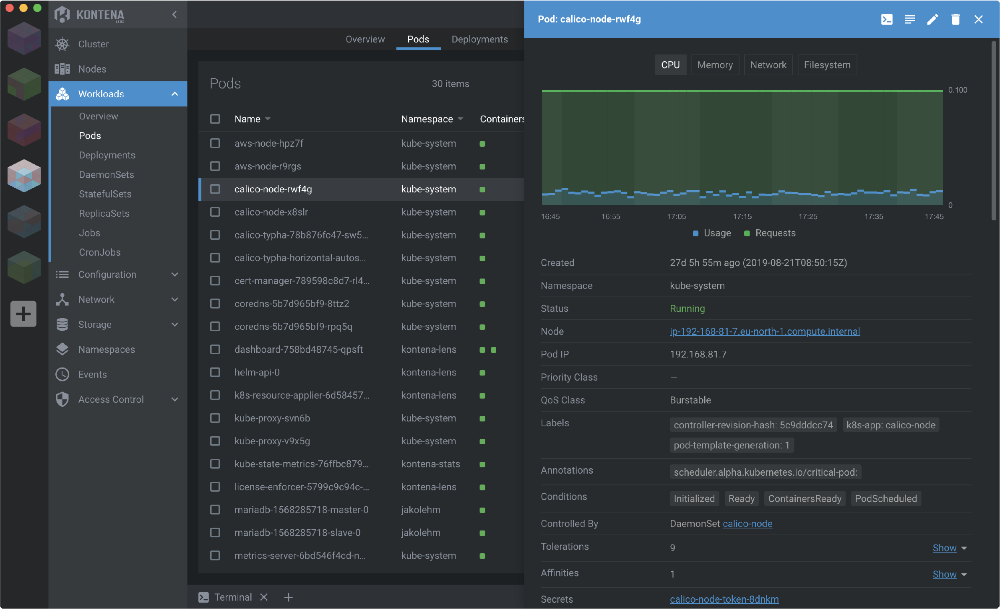

# Kubernetes Based Development. Kubernetes Distributions for local environments. Kubernetes Development Tools and Dashboards

1. [Non-production Kubernetes Local Installers. Kubernetes distributions for local environments. Desktop K8s](#non-production-kubernetes-local-installers-kubernetes-distributions-for-local-environments-desktop-k8s)
2. [Kubernetes Based Development. Kubernetes Development Tools](#kubernetes-based-development-kubernetes-development-tools)
    1. [Skaffold. Local Kubernetes Development](#skaffold-local-kubernetes-development)
    2. [DevSpace](#devspace)
    3. [Telepresence local development for k8s and openshift microservices](#telepresence-local-development-for-k8s-and-openshift-microservices)
    4. [Bridge to Kubernetes](#bridge-to-kubernetes)
    5. [Garden](#garden)
3. [Kubernetes Clients and Dashboards](#kubernetes-clients-and-dashboards)
    1. [Octant](#octant)
    2. [Okteto local kubernetes development](#okteto-local-kubernetes-development)
    3. [Monokle](#monokle)
    4. [Lens and OpenLens Kubernetes IDE](#lens-and-openlens-kubernetes-ide)
    5. [Kubenav](#kubenav)
    6. [Aptakube](#aptakube)
    7. [Cloud Manager](#cloud-manager)
    8. [Yaki](#yaki)
4. [Images](#images)
5. [Tweets](#tweets)
6. [Videos](#videos)

## Non-production Kubernetes Local Installers. Kubernetes distributions for local environments. Desktop K8s

- [Minikube](https://github.com/kubernetes/minikube) A tool that makes it easy to run Kubernetes locally inside a Linux VM. It's aimed on users who want to just test it out or use it for development. It cannot spin up a production cluster, it's a one node machine with no high availability.
    - [murchie85.github.io: Installling minikube](https://murchie85.github.io/Kubernetes.html)
    - [==adamtheautomator.com: Jumpstart Kubernetes Locally with this MiniKube Tutorial==](https://adamtheautomator.com/minikube-tutorial/) You'll usually find Kubernetes where it makes sense — i.e. in cloud environments. But how do you speed up development for Kubernetes? Could you test deployments locally?
    - [devopscube.com: Kubernetes Minikube Tutorial for Beginners](https://devopscube.com/kubernetes-minikube-tutorial/)
- [**kind**](https://github.com/kubernetes-sigs/kind) Kubernetes IN Docker - local clusters for testing Kubernetes. Kind is a tool for running local Kubernetes clusters using Docker container “nodes”. kind was primarily designed for testing Kubernetes itself, but may be used for local development or CI.
    - [kubernetes-development-environment-in-a-box](https://github.com/ManagedKube/kubernetes-development-environment-in-a-box) This project is geared toward running multiple isolated KinD cluster on a single instance. This project produces an AMI image that can run an instance that has Docker and multiple isolated Kubernetes clusters running in it using KinD. The main use case is to setup one node that can run multiple fully isolated Kubernetes cluster on it for development purposes.
    - [medyagh/setup-minikube](https://github.com/medyagh/setup-minikube) setup-minikube is a Github action that creates a temporary minikube cluster for testing
    - [dev.to: How to run Minikube on Apple M1 chip without Docker Desktop using Colima](https://dev.to/everythingdevops/how-to-run-minikube-on-apple-m1-chip-without-docker-desktop-h76)
- [store.docker.com: Docker Community Edition EDGE with kubernetes. Installing Kubernetes using the Docker Client](https://store.docker.com/editions/community/docker-ce-desktop-windows) Currently only available in **Edge** edition.
- [padok.fr: MiniKube, Kubeadm, Kind, K3S, how to get started on Kubernetes?](https://www.padok.fr/en/blog/minikube-kubeadm-kind-k3s)
- [loft.sh: Kubernetes Development Environments – A Comparison](https://loft.sh/blog/kubernetes-development-environments-comparison/)
- [opensource.com: 4 ways to run Kubernetes locally](https://opensource.com/article/20/11/run-kubernetes-locally) Set up a local development environment or just try out the container orchestration platform with these tools.
- [blog.radwell.codes: What’s the best Kubernetes distribution for local environments? 🌟](https://blog.radwell.codes/2021/05/best-kubernetes-distribution-for-local-environments/)
- [Metal Kubes](https://github.com/shank-git/metal-kubes) Create OnPrem Kubernetes Cluster. Install Kubernetes Cluster on Bare Metal Machines
- [blog.flant.com: Small Kubernetes for your local experiments: k0s, MicroK8s, kind, k3s, and Minikube](https://blog.flant.com/small-local-kubernetes-comparison/)
- [dj-wasabi/vagrant-kubernetes](https://github.com/dj-wasabi/vagrant-kubernetes) Playground for setting up small Kubernetes cluster on some **vagrant** boxes and practice with various examples to get familiar with K8s.

## Kubernetes Based Development. Kubernetes Development Tools

- [==kubevious== 🌟🌟](https://github.com/kubevious/kubevious) Kubevious is a read-only dashboard and config validator. Kubevious gives deep insights on app config and structure.
- [==tilt.dev==](https://tilt.dev) You can use Tilt to easily build and run your application on Kubernetes. In comparison with similar tools, it provides [UI for managing the process and cloud platform](https://cloud.tilt.dev) to share data with your team.
        - Minikube: Initially, they found Minikube as the first solution to manipulate K8s and test everything in our local environment. To manually deploy a service in Minikube they had to build the image in docker every time they made a change. If you are only managing one service this would be easy to handle, but if we work with many services in a repository that needs to be running to work as expected, we should have a way to run those builds automatically and restart the pods to take the new image.
        - Skaffold: They researched how to automatize this and found Skaffold, a tool to create a complete dev environment fully integrated with Kubernetes and Minikube. Skaffold takes over to build all the images that you need, restart the pods and listen for more changes. With this, you can achieve a hot-building feature sending everything to minikube, the devs won’t have to take care of this task. It was a win for them to find this tool.
        - Challenge: Something that caused friction for the developers was the way they had to run all the code locally. They had to make changes using docker-compose and then, test using Skaffold. This may generate little delays in the development workflow.
        - Tilt to the rescue: Finally, they found Tilt - An open-source tool that is focused on generating a comfortable and customizable rebuild for Docker and Kubernetes. Tilt makes really easy to manage development in a local environment of many services that need to communicate among them. Also, it’s focused on the Developer Experience. Once they implemented Tilt, they were able to use their services in the dev phase by running: tilt up. With a well-written configuration and settings, you can get reloads in a few milliseconds using the sync feature. Also, it has easy integration with Helm which is the most used package manager for K8s.
- [==garden.io==](https://garden.io/)
- [microcks.io](https://microcks.io) K8s-based API mock/test tool.
    - [microcks.io: Podman Compose support in Microcks](https://microcks.io/blog/podman-compose-support)
- [loft.sh: Checklist for Kubernetes-Based Development 🌟](https://loft.sh/blog/checklist-for-kubernetes-based-development)
- [loft.sh: Skaffold vs Tilt vs DevSpace](https://loft.sh/blog/skaffold-vs-tilt-vs-devspace/)
- [rookout.com: Developer Tools for Kubernetes in 2021: Helm, Kustomize, and Skaffold (Part 1)](https://www.rookout.com/blog/developer-tooling-for-kubernetes-in-2021)
    - [rookout.com: Developer Tools for Kubernetes in 2021 – Skaffold, Tilt, and Garden (Part 2)](https://www.rookout.com/blog/developer-tooling-for-kubernetes-in-2021-part-2) In that previous blog post, I also mentioned another tool – Skaffold. While Skaffold has limited ability to define Kubernetes applications and build and deploy them in CI/CD pipelines, it’s core functionality is creating a development environment for Kubernetes. In this blog post, I’ll discuss the alternative tools of doing just that – spinning up a development environment on Kubernetes. So let’s go into an in-depth comparison of Skaffold, Tilt, and Garden. **I will not be covering Microsoft Draft, as the Github repository appears to be archived and has had no new versions in 2020.**
    - [rookout.com: Developer Tools for Kubernetes in 2021: Lens, VSCode, IntelliJ, & Gitpod (Part 3)](https://www.rookout.com/blog/developer-tooling-for-kubernetes-in-2021-part-3)
    - [rookout.com: Developer Tools for Kubernetes in 2021: Docker, Kaniko, Buildpack & Jib (Part 4)](https://www.rookout.com/blog/developer-tooling-for-kubernetes-in-2021-part-4)
    - [rookout.com: Developer Tools for Kubernetes in 2021: Development Machines (Part 5)](https://www.rookout.com/blog/developer-tooling-for-kubernetes-in-2021-development-machines-part-5)
- [okteto.com: Kubernetes for Developers Blog Series by Okteto](https://okteto.com/blog/kubernetes-for-developers-blog-series-by-okteto/)
    - It’s another tool in your arsenal. This means another set of manifests to maintain and update. If you need to define a new environment variable, you’ll need to add it to both your Compose file and Kubernetes manifests.
    - You’ll have to vet changes against either prod or a staging environment since you’re not running Kubernetes locally.

### Skaffold. Local Kubernetes Development

- [==Skaffold== 🌟](https://skaffold.dev/)
- [infracloud.io: Build and deploy Kubernetes apps with Skaffold](https://www.infracloud.io/blogs/skaffold-usecases/)
- [testingclouds.wordpress.com: Migrating from Docker Compose to Skaffold 🌟](https://testingclouds.wordpress.com/2021/03/09/migrating-from-docker-compose-to-skaffold/)
- [dev.to: How to Simplify Your Local Kubernetes Development With Skaffold](https://dev.to/otomato_io/local-kubernetes-development-with-skaffold-i0k) Skaffold is a tool that does everything with one single command:
    - Builds Docker images
    - Pushes them
    - Deploys your Kubernetes resources with the docker images it just built

### DevSpace

- [==devspace.sh==](https://devspace.sh/)
- [thenewstack.io: DevSpace Designed to Lower the Kubernetes Learning Curve](https://thenewstack.io/devspace-designed-to-lower-the-kubernetes-learning-curve/)

### Telepresence local development for k8s and openshift microservices

- [telepresence.io 🌟](https://www.telepresence.io) Fast, local development for kubernetes and openshift microservices.
- [thenewstack.io: Cloud Native Debugging Challenges: From Local to ‘Remocal’](https://thenewstack.io/cloud-native-debugging-challenges-from-local-to-remocal/) Making remote clusters accessible, as though local, and giving developers tools to work locally in familiar ways are key ways to zap bugs and ship faster.
- [dev.to/dsudia: How to Integrate Docker & JetBrains into Telepresence](https://dev.to/dsudia/how-to-integrate-docker-jetbrains-into-telepresence-31op) Learn to debug Kubernetes containerized apps with Telepresence, set remote IDE breakpoints, manage Docker builds, and access cluster services. This guide covers environment setup, development practices, and IDE support for JVM and Go applications.

### Bridge to Kubernetes

- [Bridge to Kubernetes 🌟🌟](https://docs.microsoft.com/en-us/visualstudio/bridge/)

### Garden

## Kubernetes Clients and Dashboards

    - [PDF](https://static.sched.com/hosted_files/kccncna20/02/A%20Walk%20Through%20the%20Kubernetes%20UI%20Landscape%20%28KubeCon%20Talk%202020%29.pdf)
- [loft.sh: Kubernetes Dashboards: Headlamp](https://loft.sh/blog/kubernetes-dashboards-headlamp/) - [Headlamp Dashboard](https://kinvolk.io/docs/headlamp/latest)
- [blog.tekspace.io: Deploying Kubernetes Dashboard in K3S Cluster](https://blog.tekspace.io/deploying-kubernetes-dashboard-in-k3s-cluster/)
- [hackerxone.com: How To Install Kubernetes Dashboard with NodePort in Linux](https://www.hackerxone.com/2021/07/10/how-install-kubernetes-dashboard-nodeport-linux/)
- [loft.sh: Kubernetes Monitoring Dashboards - 5 Best Open-Source Tools](https://loft.sh/blog/kubernetes-monitoring-dashboards-5-best-open-source-tools/)
- [adamtheautomator.com: How to Install and Set Up Kubernetes Dashboard [Step by Step]](https://adamtheautomator.com/kubernetes-dashboard/)
- [thenewstack.io: Who Needs a Dashboard? Why the Kubernetes Command Line Is Not Enough](https://thenewstack.io/who-needs-a-dashboard-why-the-kubernetes-command-line-is-not-enough/)
- [kui.tools 🌟](https://kui.tools) Kui: CLI-driven Graphics for Kubernetes. Tired of working with Kubernetes in cli mode only? Try kui - a hybrid tool that allows you to interact with any Kubernetes cluster easily with more advanced features available only in GUI.
    - [blog.flant.com: Kui — a “hybrid” CLI/GUI application for working with Kubernetes](https://blog.flant.com/kui-hybrid-cli-gui-for-kubernetes/) Kui is a GUI-enhanced CLI interface for managing Kubernetes clusters
Kui enriches the good old terminal experience with GUI features, giving you a different perspective of your Kubernetes cluster
- [rigorousthemes.com: 10 Best Kubernetes Dashboard Alternatives 2022](https://rigorousthemes.com/blog/best-kubernetes-dashboard-alternatives/)
- [blog.flant.com: kubenav as a tool for managing Kubernetes clusters from your smartphone](https://blog.flant.com/kubenav-managing-kubernetes-from-smartphone/)
- [==kubeapps.dev== 🌟](https://kubeapps.dev) Kubeapps is an in-cluster web-based application that enables users with a one-time installation to deploy, manage, and upgrade applications on a Kubernetes cluster
- [==github.com/openshift/console== 🌟](https://github.com/openshift/console)
- [getseabird.github.io 🌟](https://getseabird.github.io/) - [github.com/getseabird/seabird](https://github.com/getseabird/seabird) Seabird is a native cross-platform Kubernetes desktop client that makes it super easy to explore your cluster's resources. We aim to visualize all common resource types in a simple, bloat-free user interface.
- [==github.com/cyclops-ui/cyclops== 🌟](https://github.com/cyclops-ui/cyclops)
    - Cyclops is a powerful user interface for managing and interacting with Kubernetes clusters
    - It's designed to simplify the management of containerized apps, providing an intuitive experience for developers, system administrators, and DevOps
- [k8z.dev: A lightweight, modern mobile and desktop application for manage kubernetes. Easily for use fast, secure](https://k8z.dev/) - [github.com/k8zdev/k8z](https://github.com/k8zdev/k8z)
- [github.com/unxsist/jet-pilot](https://github.com/unxsist/jet-pilot) JET Pilot is an open-source Kubernetes IDE that focuses on less clutter, speed and good looks. Features:
    - Real-time Logs
    - Kubernetes Object Management
    - Container Shell
    - Command Palette

### Octant

- [==octant.dev==](https://octant.dev) Octant is an open source developer-centric web interface for Kubernetes that lets you inspect a Kubernetes cluster and its applications.

### Okteto local kubernetes development

- [codefresh.io: Tutorial - Local Kubernetes Development with Okteto 🌟](https://codefresh.io/kubernetes-tutorial/okteto/)
- [github.com/marketplace: Automating your Kubernetes dev environments with the open source oktetohq Cloud got easier with GitHub Actions](https://github.com/marketplace?query=publisher%3Aokteto&type=actions)
- [blog.palark.com: Okteto Cloud as another way for local development in Kubernetes](https://blog.palark.com/okteto-cloud-for-local-development-in-kubernetes/) This article explores an approach featuring application development performed right inside the Kubernetes without needing separate build and deploy steps using Okteto

### Monokle

- [k8studio.github.io/k8studio](https://github.com/K8Studio/K8studio) Welcome to Monokle - your friendly desktop UI for managing k8s manifests!

### K8Studio

- [kubeshop.github.io/monokle](https://kubeshop.github.io/monokle/) Welcome to Monokle - your friendly desktop UI for managing k8s manifests!
- [k8studio.io/blogs: K8studio vs. Lens vs. K9s 🌟](https://k8studio.io/blogs/k8studio-vs-lens-kubernetes-ide/) K8studio vs Lens and K9s, probably the best tool to manage kubernetes

### Lens and OpenLens Kubernetes IDE

- [Lens Kubernetes IDE 🌟](https://k8slens.dev/) Lens is the only IDE you’ll ever need to take control of your Kubernetes clusters. It's open source and free. Download it today!
- [Lens Resource Map extension](https://github.com/nevalla/lens-resource-map-extension) Lens - The Kubernetes IDE extension that displays Kubernetes resources and their relations as a force graph.

### Kubenav

- [kubenav](https://github.com/kubenav/kubenav) is the navigator for your Kubernetes clusters right in your pocket. kubenav is a mobile, desktop and web app to manage Kubernetes clusters and to get an overview of the status of your resources.

### Aptakube

- [Aptakube](https://aptakube.com) is a modern, lightweight and multi-cluster desktop client for Kubernetes. Connect to multiple clusters simultaneously to view, edit and manage all your resources.

### Cloud Manager

- [thenewstack.io: Cloud Manager: A New Multicloud PaaS Platform Built on Kubernetes](https://thenewstack.io/cloud-manager-a-new-multicloud-paas-platform-built-on-kubernetes/)

### Yaki

- [nirops/yakiapp](https://github.com/nirops/yakiapp) Yaki stands for "Yet Another Kubernetes IDE". Open Source, Cross platform, Native Kubernetes IDE. Yaki is a desktop application that allows DevOps, Developers, SREs and anyone who wish the manage the applications deployed in their Kubernetes Cluster

## Images

??? note "Click to expand!"

    

    
    

## Tweets

??? note "Click to expand!"

    

    <blockquote class="twitter-tweet">
I made a thing: Web UI for Learning &amp; Exploring Kubernetes 🧙‍♂️  It&#39;s hell-interactive - (multi-)cluster updates shown in real-time.  Tailored for: - Experiments - Education - Postman REST client but for K8s  Demo use case: learn what happens to Pods when Deployment is updated 🔽 <a href="https://t.co/0373JRh3P7">pic.twitter.com/0373JRh3P7</a>
&mdash; Ivan Velichko (@iximiuz) <a href="https://twitter.com/iximiuz/status/1542236802207072256?ref_src=twsrc%5Etfw">June 29, 2022</a></blockquote> 
    

## Videos

  
Click to expand!

<iframe width="560" height="315" src="https://www.youtube.com/embed/FRpUJoDdI1o" title="YouTube video player" frameborder="0" allow="accelerometer; autoplay; clipboard-write; encrypted-media; gyroscope; picture-in-picture" allowfullscreen></iframe>

<iframe width="560" height="315" src="https://www.youtube.com/embed/e1bavPwQmVc" title="YouTube video player" frameborder="0" allow="accelerometer; autoplay; clipboard-write; encrypted-media; gyroscope; picture-in-picture" allowfullscreen></iframe>

<iframe width="560" height="315" src="https://www.youtube.com/embed/RjqDpF6_ZHs" title="YouTube video player" frameborder="0" allow="accelerometer; autoplay; clipboard-write; encrypted-media; gyroscope; picture-in-picture" allowfullscreen></iframe>

