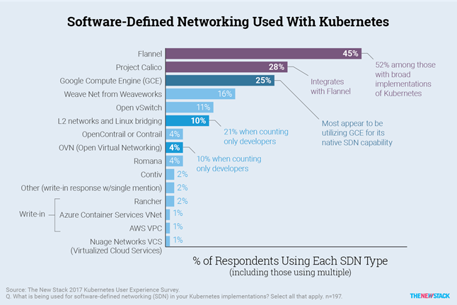
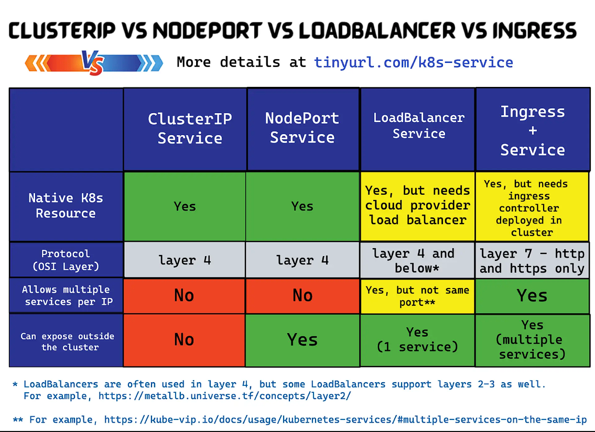

# Kubernetes Networking

1. [Introduction](#introduction)
2. [Kubernetes DNS](#kubernetes-dns)
3. [TCP Keep Alive Requests](#tcp-keep-alive-requests)
4. [Headless Kubernetes Service](#headless-kubernetes-service)
5. [NetworkPolicy](#networkpolicy)
6. [Nginx Ingress Controller](#nginx-ingress-controller)
7. [Contour Ingress Controller](#contour-ingress-controller)
8. [Kubernetes Gateway API](#kubernetes-gateway-api)
9. [Kube-proxy](#kube-proxy)
10. [Multicloud communication for Kubernetes](#multicloud-communication-for-kubernetes)
11. [Multi-Cluster Kubernetes Networking](#multi-cluster-kubernetes-networking)
12. [Kubernetes Network Policy](#kubernetes-network-policy)
     1. [Cilium](#cilium)
     2. [Kubernetes Network Policy Samples](#kubernetes-network-policy-samples)
13. [Kubernetes Ingress Specification](#kubernetes-ingress-specification)
14. [Xposer Kubernetes Controller To Manage Ingresses](#xposer-kubernetes-controller-to-manage-ingresses)
15. [Software-Defined IP Address Management (IPAM)](#software-defined-ip-address-management-ipam)
16. [CNI Container Networking Interface](#cni-container-networking-interface)
     1. [List of existing CNI Plugins (IPAM)](#list-of-existing-cni-plugins-ipam)
     2. [Project Calico](#project-calico)
17. [DNS Service with CoreDNS](#dns-service-with-coredns)
18. [Kubernetes Node Local DNS Cache](#kubernetes-node-local-dns-cache)
19. [k8gb](#k8gb)
20. [VPC Lattice](#vpc-lattice)
21. [Images](#images)
22. [Videos](#videos)
23. [Tweets](#tweets)

## Introduction

- [kubernetes.io: The Kubernetes network model. How to implement the Kubernetes networking model](https://kubernetes.io/docs/concepts/cluster-administration/networking/)
- [ovh.com - getting external traffic into kubernetes: clusterip, nodeport, loadbalancer and ingress](https://www.ovh.com/blog/getting-external-traffic-into-kubernetes-clusterip-nodeport-loadbalancer-and-ingress/)
- [==learnk8s.io: Load balancing and scaling long-lived connections in Kubernetes== 🌟🌟🌟](https://learnk8s.io/kubernetes-long-lived-connections) **Kubernetes doesn't load balance long-lived connections, and some Pods might receive more requests than others. If you're using HTTP/2, gRPC, etc. or any other long-lived connection, you might want to consider client-side load balancing**
- [stackrox.com: Kubernetes Networking Demystified: A Brief Guide](https://www.stackrox.com/post/2020/01/kubernetes-networking-demystified/)
- [medium.com: Fighting Service Latency in Microservices With Kubernetes](https://medium.com/@sindhujacynixit/fighting-service-latency-in-microservices-with-kubernetes-f5a584f5af36)
- [medium.com: Kubernetes NodePort vs LoadBalancer vs Ingress? When should I use what? 🌟](https://medium.com/google-cloud/kubernetes-nodeport-vs-loadbalancer-vs-ingress-when-should-i-use-what-922f010849e0)
- [blog.alexellis.io: Get a LoadBalancer for your private Kubernetes cluster](https://blog.alexellis.io/ingress-for-your-local-kubernetes-cluster/)
- [dustinspecker.com: How Do Kubernetes and Docker Create IP Addresses?!](https://dustinspecker.com/posts/how-do-kubernetes-and-docker-create-ip-addresses/)
- [youtube: Kubernetes Ingress Explained Completely For Beginners](https://www.youtube.com/watch?v=VicH6KojwCI)
- [AWS and Kubernetes Networking Options and Trade-Offs (part 1)](https://www.weave.works/blog/introduction-to-kubernetes-pod-networking--part-1)
- [AWS and Kubernetes Networking Options and Trade-Offs (part 2)](https://www.weave.works/blog/aws-networking-overview---part-2)
- [AWS and Kubernetes Networking Options and Trade-Offs (part 3)](https://dzone.com/articles/aws-and-kubernetes-networking-options-and-trade-of)
- [medium: Service Types in Kubernetes? 🌟](https://medium.com/faun/service-types-in-kubernetes-24a1587677d6) A Service enables network access to a set of Pods in Kubernetes.
- [containo.us: Kubernetes Ingress & Service API Demystified](https://containo.us/blog/kubernetes-ingress-service-api-demystified/)
- [speakerdeck.com: Kubernetes and networks. Why is this so dan hard? 🌟](https://speakerdeck.com/thockin/kubernetes-and-networks-why-is-this-so-dang-hard)
- [eevans.co: Deconstructing Kubernetes Networking](https://eevans.co/blog/deconstructing-kubernetes-networking/)
- [externalTrafficPolicy=local on kubernetes. How to preserve the source IP in kubernetes](https://blog.getambassador.io/externaltrafficpolicy-local-on-kubernetes-e66e498212f9) externalTrafficPolicy=local is an annotation on the Kubernetes service resource that can be set to preserve the client source IP. When it is set, the actual IP address of a client is propagated to the K8s service instead of the IP address of the node.
- [ronaknathani.com: How a Kubernetes Pod Gets an IP Address 🌟](https://ronaknathani.com/blog/2020/08/how-a-kubernetes-pod-gets-an-ip-address/)
- [opensource.com: Why I use Ingress Controllers to expose Kubernetes services](https://opensource.com/article/20/8/ingress-controllers-kubernetes) Kubernetes ingress controllers will make or break your cloud architecture.
- [blog.nody.cc: Verify your Kubernetes Cluster Network Policies: From Faith to Proof](https://blog.nody.cc/posts/2020-06-kubernetes-network-policy-verification/)
- [medium: How to setup Hetzner load balancer on a Kubernetes cluster](https://medium.com/@jmrobles/how-to-setup-hetzner-load-balancer-on-a-kubernetes-cluster-2ce79ca4a27b)
- [zhimin-wen.medium.com: Sticky Sessions in Kubernetes 🌟](https://zhimin-wen.medium.com/sticky-sessions-in-kubernetes-56eb0e8f257d)
- [infoq.com: Kubernetes Ingress Is Now Generally Available](https://www.infoq.com/news/2020/09/kubernetes-ingress-ga/)
- [Learnk8s: Comparison of Kubernetes Ingress Controllers 🌟🌟](https://docs.google.com/spreadsheets/d/191WWNpjJ2za6-nbG4ZoUMXMpUK8KlCIosvQB0f-oq3k/edit#gid=907731238) How do you choose the *right* Kubernetes Ingress controller when: Not all Ingress controllers support UDP, Only Kong has a free LDAP integration, Nginx Ingress and HAProxy are the only two ingress without CRDs.
- [blog.alexellis.io: Get kubectl access to your private cluster from anywhere](https://blog.alexellis.io/get-private-kubectl-access-anywhere/)
- [jmrobles.medium.com: How to setup Hetzner load balancer on a Kubernetes cluster](https://jmrobles.medium.com/how-to-setup-hetzner-load-balancer-on-a-kubernetes-cluster-2ce79ca4a27b)
- [kubernetes.io: Scaling Kubernetes Networking With EndpointSlices](https://kubernetes.io/blog/2020/09/02/scaling-kubernetes-networking-with-endpointslices/) EndpointSlices are a new Kubernetes API that provides a scalable and extensible alternative to the Endpoints API.
- [medium: Create a Custom Annotation for the Kubernetes ingress-nginx Controller](https://medium.com/better-programming/creating-a-custom-annotation-for-the-kubernetes-ingress-nginx-controller-444e9d486192)
- [haproxy.com: Announcing HAProxy Kubernetes Ingress Controller 1.5 🌟](https://www.haproxy.com/blog/announcing-haproxy-kubernetes-ingress-controller-1-5/)
- [devclass.com: HAProxy Ingress Controller 1.5 introduces mTLS support, gives load balancing experts more power](https://devclass.com/2021/01/26/haproxy-ingress-controller-1_5/)
- [thenewstack.io: HAProxy Kubernetes Ingress Controller Moves Outside the Cluster](https://thenewstack.io/haproxy-kubernetes-ingress-controller-moves-outside-the-cluster/)
- [suse.com: NGINX Guest Blog: NGINX Kubernetes Ingress Controller 🌟](https://www.suse.com/c/nginx-guest-blog-kubernetes-ingress-controller)
- [blog.cloudflare.com: Moving k8s communication to gRPC](https://blog.cloudflare.com/moving-k8s-communication-to-grpc/)
- [K8GB - Kubernetes Global Balancer](https://github.com/AbsaOSS/k8gb) - [openshift.com: K8GB - Kubernetes Global Balancer ](https://www.openshift.com/blog/openshift-commons-briefing-k8gb-kubernetes-global-balancer-with-yuri-tsarev-absa-and-paul-morie-red-hat)
- [altoros.com: Kubernetes Networking: How to Write Your Own CNI Plug-in with Bash](https://www.altoros.com/blog/kubernetes-networking-writing-your-own-simple-cni-plug-in-with-bash/)
- [Network Node Manager](https://github.com/kakao/network-node-manager) network-node-manager is a kubernetes controller that controls the network configuration of a node to resolve network issues of kubernetes. By simply deploying and configuring network-node-manager, you can solve kubernetes network issues that cannot be resolved by kubernetes or resolved by the higher kubernetes Version. Below is a list of kubernetes's issues to be resolved by network-node-manager. network-node-manager is based on kubebuilder v2.3.1.
- [getenroute.io: Drive API Security At Kubernetes Ingress Using Helm And Envoy 🌟](https://getenroute.io/docs/ingress-filter-legos-secure-microservices-apis-using-helm-envoy/)
- [ithands-on.com: Kubernetes 101 : External services - ExternalName, DNS and Endpoints](https://www.ithands-on.com/2021/04/kubernetes-101-external-services.html)
- [ibm.com: Multizone Kubernetes and VPC Load Balancer Setup](https://www.ibm.com/cloud/blog/multizone-kubernetes-and-vpc-load-balancer-setup) Securely expose your Kubernetes app by setting up a Load Balancer for VPC in a different zone.
- [opensource.googleblog.com: Kubernetes: Efficient Multi-Zone Networking with Topology Aware Routing](https://opensource.googleblog.com/2020/11/kubernetes-efficient-multi-zone.html)
- [nbailey.ca: Domesticated Kubernetes Networking](https://nbailey.ca/post/k8s-networking/)
- [sookocheff.com: A Guide to the Kubernetes Networking Model 🌟](https://sookocheff.com/post/kubernetes/understanding-kubernetes-networking-model/)
- [build.thebeat.co: A curious case of AWS NLB timeouts in Kubernetes](https://build.thebeat.co/a-curious-case-of-aws-nlb-timeouts-in-kubernetes-522bd88a3399) A debugging adventure that allowed us to solve the tail latencies our Kubernetes applications were experiencing when talking with our AWS NLB.
- [dzone: Multizone Kubernetes and VPC Load Balancer Setup](https://dzone.com/articles/multizone-kubernetes-and-vpc-load-balancer-setup) Securely expose your Kubernetes app by setting up a Load Balancer for VPC in a different zone.
- [ingressbuilder.jetstack.io 🌟🌟](https://ingressbuilder.jetstack.io) Ingress Builder allows users to select any annotation from the list of available controllers, to add to the ingress manifest.
- [itnext.io: Generating Kubernetes Network Policies Automatically By Sniffing Network Traffic 🌟](https://itnext.io/generating-kubernetes-network-policies-by-sniffing-network-traffic-6d5135fe77db) This blog post is about an experiment to automate creation of Kubernetes Network Policies based on actual network traffic captured from applications running on a Kubernetes cluster - [code](https://github.com/mcelep/blog/tree/master/automated-networkpolicy-generation)
- [medium: Using nginx-ingress controller to restrict access by IP (ip whitelisting) for a service deployed to a Kubernetes (AKS) cluster](https://medium.com/@maninder.bindra/using-nginx-ingress-controller-to-restrict-access-by-ip-ip-whitelisting-for-a-service-deployed-to-bd5c86dc66d6)
- [openshift.com: gRPC or HTTP/2 Ingress Connectivity in OpenShift 🌟](https://www.openshift.com/blog/grpc-or-http/2-ingress-connectivity-in-openshift)
- [inlets.dev: Fixing Ingress for short-lived local Kubernetes clusters](https://inlets.dev/blog/2021/07/08/short-lived-clusters.html)
- [nginx.com: How to Simplify Kubernetes Ingress and Egress Traffic Management](https://www.nginx.com/blog/how-to-simplify-kubernetes-ingress-egress-traffic-management/)
- [blog.teamhephy.info: Running Workflow Without Any LoadBalancer](https://blog.teamhephy.info/blog/posts/tutorials/running-workflow-without-any-loadbalancer.html)
- [blog.alexellis.io: Get a public LoadBalancer for your private Kubernetes cluster 🌟](https://blog.alexellis.io/ingress-for-your-local-kubernetes-cluster/)
- [searchitoperations.techtarget.com: Differences between Kubernetes Ingress vs. load balancer](https://searchitoperations.techtarget.com/feature/Differences-between-Kubernetes-Ingress-vs-load-balancer) To manage Kubernetes cluster traffic, admins have a few choices. Compare Kubernetes Ingress vs. load balancers, as well as the NodePort and ClusterIP service types.
- [monzo.com: Controlling outbound traffic from Kubernetes](https://monzo.com/blog/controlling-outbound-traffic-from-kubernetes)
- [medium: Access Application Externally In Kubernetes Cluster using Load Balancer Service](https://medium.com/codex/access-application-externally-in-kubernetes-cluster-using-load-balancer-service-d1b7858d51) Learn how to create a Pod and how to create a Load Balancer service using Kubernetes cluster. And access the application from outside.
- [itnext.io: Why and How of Kubernetes Ingress (and Networking) 🌟](https://itnext.io/why-and-how-of-kubernetes-ingress-and-networking-6cb308ca03d2)
- [techdozo.dev: gRPC load balancing on Kubernetes (using Headless Service)](https://techdozo.dev/grpc-load-balancing-on-kubernetes-using-headless-service/)
- [thenewstack.io: ZeroLB, a New Decentralized Pattern for Load Balancing](https://thenewstack.io/zerolb-a-new-decentralized-pattern-for-load-balancing/)
- [ungleich.ch: Making kubernetes kube-dns publicly reachable](https://ungleich.ch/u/blog/kubernetes-making-dns-publicly-reachable/)
- [ungleich.ch: Building Ingress-less Kubernetes Clusters](https://ungleich.ch/u/blog/kubernetes-without-ingress/) Building Ingress-less Kubernetes Clusters with IPv6
- [thenewstack.io: Ingress Controllers: The More the Merrier](https://thenewstack.io/ingress-controllers-the-more-the-merrier/)
- [levelup.gitconnected.com: Setting up Application Load Balancer (Ingress) for the Pods running in AWS EKS Fargate](https://levelup.gitconnected.com/setting-up-application-load-balancer-ingress-for-the-pods-running-in-aws-eks-fargate-519e20e97497)
- [devopscube.com: Kubernetes Ingress Tutorial For Beginners 🌟](https://devopscube.com/kubernetes-ingress-tutorial/) In this Kubernetes ingress tutorial, you will learn the basic concepts of ingress, the native ingress resource object, and the concepts involved in ingress controllers
- [ystatit.medium.com: How to Change Kubernetes Kube-apiserver IP Address](https://ystatit.medium.com/how-to-change-kubernetes-kube-apiserver-ip-address-402d6ddb8aa2)
- [monzo.com: Controlling outbound traffic from Kubernetes](https://monzo.com/blog/controlling-outbound-traffic-from-kubernetes)
- [tech2fun.net: Using Service Endpoints and Alias for accessing External Service in K8s](https://tech2fun.net/using-k8s-service-resource-for-enabling-clients-discovering-talking-to-pods/)
- [nginx.com: Reducing Kubernetes Costs by 70% in the Cloud with NGINX, Opsani, and Prometheus](https://www.nginx.com/blog/reducing-kubernetes-costs-70-percent-in-cloud-nginx-opsani-prometheus/)
- [ithands-on.com: Kubernetes 101 : Changing a service type](https://www.ithands-on.com/2021/09/kubernetes-101-changing-service-type.html) If we realize that our service, a ClusterIP doesn't suit our needs anymore, we could change its type to a  nodePort service for example.
- [cloud.redhat.com: Global Load Balancer Approaches 🌟](https://cloud.redhat.com/blog/global-load-balancer-approaches)
- [==loft.sh: Kubernetes NGINX Ingress: 10 Useful Configuration Options== 🌟](https://loft.sh/blog/kubernetes-nginx-ingress-10-useful-configuration-options) Kubernetes Ingress is the object that provides routing rules into your cluster. To best serve traffic to your app, you need to correctly configure it. This is an incredible article from loft.sh with 10 useful options for configuring NginX Ingress
- [==technos.medium.com: Kubernetes Services for Absolute Beginners — NodePort== 🌟](https://technos.medium.com/kubernetes-services-for-absolute-beginners-nodeport-139b7060fe3)
- [fransemalila.medium.com: Kubernetes Networking](https://fransemalila.medium.com/kubernetes-networking-cea2e1b7d2b3) To access the application over the network, K8s services must be used to expose the pods to external traffic and load balancing the traffic across multiple pods.
    - Cluster IP
    - Target Ports
    - Node Port
    - External IPs
    - Load Balancer
- [netris.ai: A Cloud-Like On-Prem Load Balancer for Kubernetes? (a practical guide)](https://www.netris.ai/cloud-like-load-balancer/)
- [==thenewstack.io: Ingress Controllers: The Swiss Army Knife of Kubernetes==](https://thenewstack.io/ingress-controllers-the-swiss-army-knife-of-kubernetes/)
- [==nginx.com: Kubernetes Networking 101==](https://www.nginx.com/blog/kubernetes-networking-101)
- [medium.com/the-programmer: Working With ClusterIP Service Type In Kubernetes](https://medium.com/the-programmer/working-with-clusterip-service-type-in-kubernetes-45f2c01a89c8) Working with services in Kubernetes Using ClusterIP
- [olamiko.medium.com: Technical Series: Kubernetes Networking](https://olamiko.medium.com/technical-series-kubernetes-networking-5a5dc3823163)
- [==learnk8s.io: Tracing the path of network traffic in Kubernetes== 🌟](https://learnk8s.io/kubernetes-network-packets)
- [==devopslearners.com: Kubernetes Ingress Tutorial For Beginners==](https://devopslearners.com/kubernetes-ingress-tutorial-for-beginners-26c2f7727bc) - https://devopscube.com/kubernetes-ingress-tutorial
- [devopscube.com: How To Configure Ingress TLS/SSL Certificates in Kubernetes](https://devopscube.com/configure-ingress-tls-kubernetes/)
- [armosec.io: Getting Started with Kubernetes Ingress | Ben Hirschberg](https://www.armosec.io/blog/kubernetes-ingress-beginners-guide/)
- [==itnext.io: Kubernetes Service Type LB for On Prem Deployments==](https://itnext.io/kubernetes-service-type-lb-for-on-prem-deployments-89e9b2a73a0c)
- [==medium.com/techbeatly: Kubernetes Networking Fundamentals==](https://medium.com/techbeatly/kubernetes-networking-fundamentals-d30baf8a28c8)
- [rajivsharma-2205.medium.com: Demystify how traffic reaches directly to pod on using alb.ingress.kubernetes.io/target-type: ip](https://rajivsharma-2205.medium.com/demystify-how-traffic-reaches-directly-to-pod-on-using-alb-ingress-kubernetes-io-target-type-ip-f2d1be346b46)
- [medium.com/linux-shots: Kubernetes ingress as reverse proxy to Application running outside cluster](https://medium.com/linux-shots/kubernetes-ingress-as-reverse-proxy-to-application-running-outside-cluster-206b6003f9cb) This article demonstrates how to serve an application running outside Kubernetes as if it were part of the cluster by configuring the Ingress controller and using the ExternalName Service.
- [medium.com/@zhaoyi0113: Kubernetes — How does service network work in the cluster](https://medium.com/@zhaoyi0113/kubernetes-how-does-service-network-work-in-the-cluster-d235b69ff536)
- [==medium.com/@pavanbelagatti: Kubernetes Service Types Explained== 🌟](https://medium.com/@pavanbelagatti/kubernetes-service-types-explained-2709cde3bc0c)
- [==tkng.io: The Kubernetes Networking Guide== 🌟🌟](https://www.tkng.io/) The purpose of The Kubernetes networking guide is to provide an overview of various Kubernetes networking components with a specific focus on exactly how they implement the required functionality
    - [==tkng.io/arch: THE KUBERNETES NETWORK MODEL== 🌟🌟](https://www.tkng.io/arch/)
- [medium.com/stakater: Efficiently Expose Services on Kubernetes (part 1) 🌟](https://medium.com/stakater/efficiently-expose-services-on-kubernetes-494a80f88aad)
    - [medium.com/stakater: Efficiently Expose Services on Kubernetes (part 2)](https://medium.com/stakater/efficiently-expose-services-on-kubernetes-part-2-c302f135f719)
- [==platform9.com: Ultimate Guide to Kubernetes Ingress Controllers== 🌟](https://platform9.com/blog/ultimate-guide-to-kubernetes-ingress-controllers/)
- [faun.pub: Kubernetes Service Types Tutorial | Pavan Belagatti 🌟](https://faun.pub/kubernetes-service-types-tutorial-39223391316c) Configure ClusterIP, NodePort, LoadBalancer and Ingress
- [medium.com/slalom-build: Managing Ingress Traffic on Kubernetes Platforms 🌟](https://medium.com/slalom-build/managing-ingress-traffic-on-kubernetes-platforms-ebd537cdfb46) **Why you need an Ingress and how to pick the right one**
- [craig-godden-payne.medium.com: How does ingress work in Kubernetes?](https://craig-godden-payne.medium.com/how-does-ingress-work-in-kubernetes-f3b121d0351f) And how to set up ingress in minikube
- [dustinspecker.com: Kubernetes Networking from Scratch: Using BGP and BIRD to Advertise Pod Routes](https://dustinspecker.com/posts/kubernetes-networking-from-scratch-bgp-bird-advertise-pod-routes/) In this article, you will learn how Calico sets up pod routes between Kubernetes nodes. In this post, you won't use containers or pods. You'll learn by creating network namespaces and virtual ethernet devices manually.
- [==home.robusta.dev: The ultimate guide to Kubernetes Services, LoadBalancers, and Ingress== 🌟🌟🌟](https://home.robusta.dev/blog/kubernetes-service-vs-loadbalancer-vs-ingress/)
- [sanjimoh.medium.com: Demystifying Kubernetes Networking — Episode 1](https://sanjimoh.medium.com/demystifying-kubernetes-networking-episode-1-ca5605a97f87) In this series of articles you will learn about Kubernetes networking:
    - Linux namespaces and Networking namespace
    - Intra pod networking & pause container
    - Kubernetes networking model
- [==dev.to: Tune up your Kubernetes Application Performance with a small DNS Configuration==](https://dev.to/imjoseangel/tune-up-your-kubernetes-application-performance-with-a-small-dns-configuration-1o46)
- [medium.com/@mehmetodabashi: Kubernetes networking and service object: Understanding ClusterIp and nodePort with hands on study](https://medium.com/@mehmetodabashi/kubernetes-networking-and-service-object-understanding-clusterip-and-nodeport-with-hands-on-study-90cfeaf66e8c)
- [medium.com/@jasonmfehr: Inspecting Kubernetes Client to API Server Network Traffic](https://medium.com/@jasonmfehr/inspecting-kubernetes-client-to-api-server-network-traffic-cd6d1802bb43)
- [medium.com/geekculture: K8s Network — CNI Introduction](https://medium.com/geekculture/k8s-network-cni-introduction-b035d42ad68f) Introduction to K8s container network interface
- [==medium.com/patilswapnilv: Getting Started with Kubernetes Networking== 🌟](https://medium.com/patilswapnilv/getting-started-with-kubernetes-networking-7e10623fc78f) **In this article, you will examine Kubernetes networking with the help of 10 detailed diagrams**
- [blog.devops.dev: How Ingress is Different from API Gateway in Kubernetes?](https://blog.devops.dev/understanding-ingress-and-api-gateway-in-kubernetes-488b78052076) Route traffic between microservices
- [==faun.pub: Kubernetes Ingress with Nginx==](https://faun.pub/kubernetes-ingress-with-nginx-3c77e703e91a) How to install and secure Nginx Ingress
- [==towardsdatascience.com: Kubernetes Ingress Explained==](https://towardsdatascience.com/kubernetes-ingress-explained-1aeadb30f273) A Practical Introduction Of Ingress With TLS Certificates. In practical terms, an Ingress acts as some form of a controlled traffic routing link between the services deployed in a Kubernetes cluster and external users or clients. In this guide, you'll find a practical introduction to the ingress with TLS
- [medium.com/codex: Access Application Externally In Kubernetes Cluster using Load Balancer Service](https://medium.com/codex/access-application-externally-in-kubernetes-cluster-using-load-balancer-service-d1b7858d51) Learn how to create a Pod and how to create a Load Balancer service using Kubernetes cluster. And access the application from outside.
- [itnext.io: Inspecting and Understanding k8s Service Network 🌟](https://itnext.io/inspecting-and-understanding-service-network-dfd8c16ff2c5)
- [ovidiuborlean.medium.com: Networking latency measurement in Kubernetes with Sockperf plugin](https://ovidiuborlean.medium.com/networking-latency-measurement-in-kubernetes-with-sockperf-plugin-68283a0ed989)
- [itnext.io: Kubernetes networking deep dive: Did you make the right choice?](https://itnext.io/kubernetes-network-deep-dive-7492341e0ab5) Kubernetes networking design can be intimidating, especially when you are the one to make decisions for cluster-level network choices. In this session, we will discuss how these choices will affect cluster routing and load balancing, focusing on KubeProxy modes(iptables vs IPVS) and network solutions.
- [medium.com/@muhidabid.cs: Why does Kubernetes need Ingress?](https://medium.com/@muhidabid.cs/why-does-kubernetes-need-ingress-73d969fb6ffe) - [muhidabid.hashnode.dev: Why does Kubernetes need Ingress?](https://muhidabid.hashnode.dev/why-does-kubernetes-need-ingress)
- [blog.devgenius.io: K8s — ipvs Mode Introduction](https://blog.devgenius.io/k8s-ipvs-mode-introduction-6457a02cd91a)
- [==edureka.co: Kubernetes Networking – A Comprehensive Guide To The Networking Concepts In Kubernetes==](https://www.edureka.co/blog/kubernetes-networking/)
- [whyk8s.substack.com: Why not DNS?](https://whyk8s.substack.com/p/why-not-dns) Why is KubeProxy necessary? Couldn't simple DNS records do the job? You do a DNS lookup on my-service in Kubernetes. You do NOT get back IPs for pods that provide that Service. Have you ever wondered why?
- [medium.com/geekculture: Kubernetes Gateway API: The Intro You Need To Read](https://medium.com/geekculture/kubernetes-gateway-api-the-intro-you-need-to-read-80965f7acd82) In this article, you'll learn how to deploy k3s to a Raspberry Pi cluster with ClusterHat and ClusterCTRL
- [==ksingh7.medium.com: Kubernetes Endpoint Object: Your Bridge to External Services== 🌟🌟](https://ksingh7.medium.com/kubernetes-endpoint-object-your-bridge-to-external-services-3fc48263b776) Chances are that you might want to access services external to the cluster, such as a database. In this article, you will learn how to create an endpoint manually to make an external database available to the Pods in the cluster.
- [medium.com/@ahmet16ck: What Is Load Balancer and How Does It Work In Kubernetes ? 🌟](https://medium.com/@ahmet16ck/what-is-load-balancer-and-how-does-it-work-in-kubernetes-5ab5f0537069)
- [api7.ai: How Does APISIX Ingress Support Thousands of Pod Replicas?](https://api7.ai/blog/apisix-ingress-support-thousands-pod-replicas) In this article, you'll explore the challenges of deploying large numbers of Pods in your Kubernetes cluster. You'll also compare Endpoints and EndpointSlice and discuss how to enable EndpointSlice when installing APISIX Ingress.
- [medium.com/illuminations-mirror: Basic | Networking and Communication Between Pods in Kubernetes](https://medium.com/illuminations-mirror/basic-networking-and-communication-between-pods-in-kubernetes-2e1627b03a87)
- [blog.devops.dev: Networking in Kubernetes](https://blog.devops.dev/networking-in-kubernetes-55dcf794b9cd) In this blog post, we’re going to delve into the world of Kubernetes networking and explore the many components that make it such a powerful and reliable platform for modern containerized applications. lets discover the essential networking components that make Kubernetes the go-to choice for cloud-native deployments!
- [medium.com/@mustafaaltunok: How Ingress, Service, Deployment and Pod Link to each other](https://medium.com/@mustafaaltunok/how-ingress-service-deployment-and-pod-link-to-eachother-d3a6ae2c0e06) In Kubernetes domain, deployment of an app consists of mainly three components. From outer to inner.
- [inlets.dev: How to Get Ingress for Private Kubernetes Clusters](https://inlets.dev/blog/2023/02/24/ingress-for-local-kubernetes-clusters.html) By design, local Kubernetes clusters are inaccessible from the internet. So how can we fix that if we want to use Ingress? What are the options for getting a public IP or LoadBalancer for local Kubernetes clusters? I cover use-cases and compare port-forwarding, Ngrok, Wireguard and inletsdev
- [blog.devops.dev: Demystifying Kubernetes:Understanding Ingress, Configuration, and Best Practices](https://blog.devops.dev/demystifying-kubernetes-understanding-ingress-configuration-and-best-practices-fb34e33e5f5f) A comprehensive overview of Kubernetes, the basics of ingress and how to configure it to expose services within K8s cluster.
- [==dev.to/narasimha1997: Communication between Microservices in a Kubernetes cluster== 🌟](https://dev.to/narasimha1997/communication-between-microservices-in-a-kubernetes-cluster-1n41) **This article discusses the various ways in which microservices in Kubernetes can communicate with each other. It provides an example of two pods, one acting as an HTTP web server and the other as a curl client that makes a request to the web server.**
- [==medium.com/google-cloud: Kubernetes Ingress Vs Gateway API== 🌟](https://medium.com/google-cloud/kubernetes-ingress-vs-gateway-api-647ee233693d) Understanding the Differences between Kubernetes Ingress and Gateway API for Effective Traffic Management
- [medium.com/nerd-for-tech: Kubernetes: Deploying NGINX with a ConfigMap | Chanel Jemmott](https://medium.com/nerd-for-tech/kubernetes-deploying-nginx-with-a-configmap-e8a2fe59bcb1)
- [medium.com/@sangjinn: How to communicate with Kubernetes workloads — Part I. Service | Brandon Kang](https://medium.com/@sangjinn/how-to-communicate-with-kubernetes-workloads-1-service-abe1c5b03fc)
    - [medium.com/@sangjinn: How to communicate with Kubernetes workloads — Part II. Ingress | Brandon Kang](https://medium.com/@sangjinn/how-to-communicate-with-kubernetes-workloads-2-ingress-18f44a712690)
- [==shahneil.medium.com: What Are Kubernetes Endpoints?==](https://shahneil.medium.com/what-are-kubernetes-endpoints-and-how-to-use-them-a5a5da56f4d4)
- [==fr4nk.xyz: Understanding Ingress in Kubernetes: A Comprehensive Guide==](https://fr4nk.xyz/understanding-ingress-in-kubernetes-a-comprehensive-guide-b23b5cf37f8d) **Kubernetes Ingress plays a crucial role in managing external access to services within a cluster.**
- [thenewstack.io: Otterize: Intent-Based Access Control for Kubernetes and Cloud](https://thenewstack.io/otterize-intent-based-access-control-for-kubernetes-and-cloud/) Otterize offers intent-based access control and secure connectivity management within clusters and across the cloud.
- [blog.palark.com: Comparing Ingress controllers for Kubernetes](https://blog.palark.com/comparing-ingress-controllers-for-kubernetes/)
- [==community.ops.io: Kubernetes Ingress Controller. How does it work?===](https://community.ops.io/danielepolencic/learning-how-an-ingress-controller-works-by-building-one-in-bash-3fni) Learning how an ingress controller works by building one in bash.
- [medium.com/@rasikzilte711: Kubernetes Networking — A Guide to Services, Ingress, Network Policies, DNS, and CNI Plugins](https://medium.com/@rasikzilte711/kubernetes-networking-a-guide-to-services-ingress-network-policies-dns-and-cni-plugins-fc1ad7d22ab4)
- [sysdig.com: Kubernetes Services: ClusterIP, Nodeport and LoadBalancer](https://sysdig.com/blog/kubernetes-services-clusterip-nodeport-loadbalancer/) Your Kubernetes Pods have internal IPs, but can since Pods are created and destroyed, can you rely on those? Discover services and their types: ClusterIP, NodePort and LoadBalancer
- [itnext.io: Saying Goodbye to Ingress: Embracing the Future of Kubernetes Traffic Management with Gateway API and Cilium](https://itnext.io/saying-goodbye-to-ingress-embracing-the-future-of-kubernetes-traffic-management-with-gateway-api-6584b7b8f913) Saying Goodbye to Ingress: Embracing the Future of Kubernetes Traffic Management with Gateway API and Cilium
- [medium.com/codex: Capture tcpdump with ksniff and wireshark from Kubernetes](https://medium.com/codex/capture-tcpdump-with-ksniff-and-wireshark-from-kubernetes-c212b93ff9f9) In Kubernetes, there are many ways to deploy and run apps, such as pods, services, and more. Tcpdump can be used to capture network traffic between these components, helping to identify network issues and diagnose problems.
- [cloudtechtwitter.com: Reverse Proxy vs. Forward Proxy: The Differences](https://www.cloudtechtwitter.com/2022/05/reverse-proxy-vs-forward-proxy.html)
- [matthewpalmer.net: Kubernetes Networking Guide for Beginners](https://matthewpalmer.net/kubernetes-app-developer/articles/kubernetes-networking-guide-beginners.html)
- [itnext.io: Deciphering the Kubernetes Networking Maze: Navigating Load-Balance, BGP, IPVS and Beyond](https://itnext.io/deciphering-the-kubernetes-networking-maze-navigating-load-balance-bgp-ipvs-and-beyond-7123ef428572)
- [adil.medium.com: Network Traffic Shaping in Kubernetes: Topology Aware Routing](https://adil.medium.com/network-traffic-shaping-in-kubernetes-topology-aware-routing-e4ea4a03dd20)
    - One challenge in cloud-distributed systems is keeping network traffic within the same availability zone
    - Kubernetes introduced Topology Aware Routing to address this issue
    - This ensures requests between apps remain in the same zone
- [otterize.com: Mastering Kubernetes networking: A journey in cloud-native packet management](https://otterize.com/blog/mastering-kubernetes-networking-otterize-s-journey-in-cloud-native-packet-management) Master Kubernetes networking with a comprehensive packet walk, and learn how Otterize helps build adaptive Network Policies.

## Kubernetes DNS

- [blog.cloudsigma.com: Kubernetes DNS Service: A Beginner’s Guide](https://blog.cloudsigma.com/kubernetes-dns-service-a-beginners-guide/) Kubernetes DNS service allows you to contact services with consistent DNS names instead of IP addresses.
- [medium.com/@seifeddinerajhi: Kubernetes & DNS: A Guide to CoreDNS and ExternalDNS](https://medium.com/@seifeddinerajhi/kubernetes-dns-a-guide-to-coredns-and-externaldns-d8e9347bdddc)

## TCP Keep Alive Requests

- [kuderko.medium.com: Fixing bad CPU usage distribution in Kubernetes 🌟](https://kuderko.medium.com/fixing-bad-cpu-usage-distribution-in-kubernetes-e1e43ed87cd6) In this article, you will learn how TCP keep-alive requests could hurt horizontal scaling for your pods. You will also discuss the workarounds you can apply to your apps or web servers.

## Headless Kubernetes Service

- [medium.com: Headless Kubernetes Service](https://medium.com/@bubu.tripathy/headless-k8s-service-924c689607a7) A headless service in Kubernetes can be a useful tool for creating distributed applications. It allows you to directly access the individual pods in a service. This is useful in scenarios where you need to perform complex load-balancing. A headless service does not have a cluster IP assigned to it. Instead of providing a single virtual IP address for the service, a headless service creates a DNS record for each pod associated with the service. These DNS records can then be used to directly address each pod. Here’s a high-level overview of how a headless service works:
    - A headless service is created in Kubernetes
    - Pods are associated with the service through labels
    - DNS records are created for each pod associated with the service
    - Clients can use the DNS records to directly access each pod
- [goglides.dev: Headless services in Kubernetes Vs Regular Service: What, Why, and How?](https://www.goglides.dev/bkpandey/headless-services-in-kubernetes-what-why-and-how-39fl)

## NetworkPolicy

- [opensource.com: What you need to know about Kubernetes NetworkPolicy](https://opensource.com/article/21/10/kubernetes-networkpolicy) Understanding Kubernetes NetworkPolicy is one of the fundamental requirements to learn before deploying an application to Kubernetes.
- [itnext.io: CKAD Scenarios about Ingress and NetworkPolicy](https://itnext.io/ckad-scenarios-about-ingress-and-networkpolicy-155ce958c9ce) In-Browser CKAD Scenarios about Ingress and NetworkPolicies.
    - [==editor.cilium.io== 🌟🌟🌟](https://editor.cilium.io) **For learning, you can use the amazing NetworkPolicy Editor at cilium.**
- [whyk8s.substack.com: Why NetworkPolicies?](https://whyk8s.substack.com/p/why-networkpolicies) Is Kubernetes networking insecure by default? Why was it built that way?
- [yuminlee2.medium.com: Kubernetes Network Policies](https://yuminlee2.medium.com/kubernetes-network-policies-a93c2f588e31)
- [==bagas-awibowo.medium.com: Helm — Templating Network Policy using Helm==](https://bagas-awibowo.medium.com/helm-templating-network-policy-using-helm-783b2f7e401a)

## Nginx Ingress Controller

- [tech2fun.net: K8s Nginx Ingress Handling TLS Traffic and Using Pod Readiness Probes](https://tech2fun.net/k8s-nginx-ingress-handling-tls-traffic-and-using-pod-readiness-probes/)
- [blog.teamhephy.info: Learn how to use the Nginx Ingress controller to serve traffic over SSH with TCP load balancing](https://blog.teamhephy.info/blog/posts/tutorials/running-workflow-without-any-loadbalancer.html)
- [nginx.com: A Guide to Choosing an Ingress Controller, Part 4: NGINX Ingress Controller Options](https://www.nginx.com/blog/guide-to-choosing-ingress-controller-part-4-nginx-ingress-controller-options/)
- [NGINX Ingress Controller - v1.0.0](https://github.com/kubernetes/ingress-nginx/releases/tag/controller-v1.0.0) NGINX Ingress Controller v1.0.0 released today! The biggest change is the support to stable/v1 ingress object, and dropping support to v1beta1.
- [amy-ma.medium.com: Nginx Ingress Configuration](https://amy-ma.medium.com/ingress-configuration-d9f13c5bcf1a) Configure NGINX basic routing with TLS on HPCC. This tutorial provides steps on how to set up basic routing for ECLWatch with the NGINX Ingress controller and configure certificates using Cert-Manager.
- [devopscube.com: How to Setup Nginx Ingress Controller On Kubernetes – Detailed Guide 🌟](https://devopscube.com/setup-ingress-kubernetes-nginx-controller/)
- [medium.com/@jonathan_37674: How to secure Kubernetes ingress? | By ARMO](https://medium.com/@jonathan_37674/how-to-secure-kubernetes-ingress-by-armo-cb86086ec540)
- [nginx.com: Automating Multi-Cluster DNS with NGINX Ingress Controller](https://www.nginx.com/blog/automating-multi-cluster-dns-with-nginx-ingress-controller)
- [==engineering.backmarket.com: How we improved third-party availability and latency with Nginx in Kubernetes== 🌟](https://engineering.backmarket.com/how-we-improved-third-party-availability-and-latency-with-nginx-in-kubernetes-bb3fc7224ae4) Introducing a gateway to cache your third-party API can significantly improve its performance and stability. In this case study, you will discover how the team at Back Market configured NGINX in Kubernetes to improve third-party API availability and latency.
- [towardsdev.com: Kubernetes: Deploying Nginx Servers with ConfigMaps & Shared Services with Minikube](https://towardsdev.com/kubernetes-deploying-nginx-servers-with-configmaps-shared-services-with-minikube-618aee9a8ff6)
- [faun.pub: How to Monitor and Alert on Ingress-NGINX in Kubernetes](https://faun.pub/how-to-monitor-and-alert-on-nginx-ingress-in-kubernetes-6d7d172f0399)
- [sumanprasad.hashnode.dev: A Beginner's Guide to Ingress and Ingress Controllers in Kubernetes](https://sumanprasad.hashnode.dev/a-beginners-guide-to-ingress-and-ingress-controllers-in-kubernetes)
- [akyriako.medium.com: Configure path-based routing with Nginx Ingress Controller](https://akyriako.medium.com/configure-path-based-routing-with-nginx-ingress-controller-64a63cd4d6bd)
- [==mattias.engineer: Kubernetes-101: Ingress== 🌟](https://mattias.engineer/k8s/ingress/) The article provides an in-depth guide on the Ingress resource. It explains that Ingress offers more functionalities than a Service, enabling multiple routing rules for different Services. It also touches upon HTTPS traffic with TLS certificates.

## Contour Ingress Controller

- [trstringer.com: Kubernetes Ingress with Contour](https://trstringer.com/kubernetes-ingress-with-contour/)

## Kubernetes Gateway API

- [==gateway-api.sigs.k8s.io== 🌟](https://gateway-api.sigs.k8s.io/) Gateway API is an open source project managed by the SIG-NETWORK community. It's is a collection of resources that model service networking in Kubernetes. These resources - GatewayClass,Gateway, HTTPRoute, TCPRoute, Service, etc - aim to evolve Kubernetes service networking through expressive, extensible, and role-oriented interfaces that are implemented by many vendors and have broad industry support.
- [kubernetes.io: Evolving Kubernetes networking with the Gateway API](https://kubernetes.io/blog/2021/04/22/evolving-kubernetes-networking-with-the-gateway-api/)
- [thenewstack.io: Unifying Kubernetes Service Networking (Again) with the Gateway API 🌟](https://thenewstack.io/unifying-kubernetes-service-networking-again-with-the-gateway-api/) The [Gateway API](https://gateway-api.sigs.k8s.io/), formerly known as the Services API and before that Ingress V2, was first discussed in detail — and in-person — at Kubecon 2019 in San Diego. There were already many well-known and [well-documented](https://dave.cheney.net/paste/ingress-is-dead-long-live-ingressroute.pdf) limitations of Ingress and Kubernetes networking APIs. The [Gateway API](https://www.youtube.com/watch?v=GiFQNevrxYA) was intended as a redo of these APIs, built on the lessons from Services, Ingress and the service mesh community.
- [blog.flomesh.io: Kubernetes Gateway API — Evolution of Service Networking](https://blog.flomesh.io/kubernetes-gateway-api-evolution-of-service-networking-aa76ec4efa7e)
- [==armosec.io: The New Kubernetes Gateway API and Its Use Cases==](https://www.armosec.io/blog/kubernetes-gateway-api/)
- [medium.com/google-cloud: Security with Kubernetes Gateway API 🌟](https://medium.com/google-cloud/security-with-kubernetes-gateway-api-dcbb934ed2a4)
- [navendu.me: Comparing Kubernetes Gateway and Ingress APIs](https://navendu.me/posts/gateway-vs-ingress-api/) In this article, you will explore the new Kubernetes Gateway API and compare it with the existing Kubernetes Ingress API for handling external traffic

## Kube-proxy

- [dustinspecker.com: iptables: How Kubernetes Services Direct Traffic to Pods](https://dustinspecker.com/posts/iptables-how-kubernetes-services-direct-traffic-to-pods) In this article you will learn how Kubernetes's kube-proxy uses iptables to direct traffic to pods randomly. You'll focus on the ClusterIP type of Kubernetes services.
- [arthurchiao.art: Cracking kubernetes node proxy (aka kube-proxy)](https://arthurchiao.art/blog/cracking-k8s-node-proxy/) This post analyzes the Kubernetes node proxy model, and provides 5 demo implementations (within couples of lines of code) of the model, each based on different tech-stacks (userspace/iptables/ipvs/tc-ebpf/sock-ebpf).

## Multicloud communication for Kubernetes

- [developers.redhat.com: Use Skupper to connect multiple Kubernetes clusters 🌟](https://developers.redhat.com/blog/2021/04/20/use-skupper-to-connect-multiple-kubernetes-clusters/) - [skupper.io](https://skupper.io/) Multicloud communication for Kubernetes. Skupper is a layer 7 service interconnect. It enables secure communication across Kubernetes clusters with no VPNs or special firewall rules. With Skupper, your application can span multiple cloud providers, data centers, and regions.

## Multi-Cluster Kubernetes Networking

- [itnext.io: Multi-Cluster Kubernetes Networking with Netmaker](https://itnext.io/multi-cluster-kubernetes-networking-with-netmaker-bfa4e22eb2fb)
    - [NetMaker](https://github.com/gravitl/netmaker) Netmaker makes networks with WireGuard. Netmaker automates fast, secure, and distributed virtual networks.

## Kubernetes Network Policy

- [howtoforge.com: Network Policy in Kubernetes 🌟](https://www.howtoforge.com/kubernetes_network_policy/) By default, pods accept traffic from any source. A network policy helps to specify how a group of pods can communicate with each other and other network endpoints.
- [medium: How to Provision Network Policies in Kubernetes | AWS 🌟](https://medium.com/avmconsulting-blog/exploring-network-policies-in-kubernetes-c8a3d8ed00cb)
- [learncloudnative.com: Kubernetes Network Policy](https://www.learncloudnative.com/blog/2020-10-07-network-policies)
- [bionconsulting.com: Kubernetes Network Policies](https://www.bionconsulting.com/blog/kubernetes-network-policies)
    - [bionconsulting.com: Kubernetes Network Policies - Part 2](https://www.bionconsulting.com/blog/kubernetes-network-policies-part-2)
- [thenewstack.io: The Kubernetes Network Security Effect 🌟](https://thenewstack.io/the-kubernetes-network-security-effect/) Kubernetes has a built-in object for managing network security: NetworkPolicy. While it allows the user to define the relationship between pods with ingress and egress policies, it is basic and requires very precise IP mapping of a solution — which changes constantly, so most users I’ve talked to are not using it.
- [faun.pub: Control traffic flow to and from Kubernetes pods with Network Policies](https://faun.pub/control-traffic-flow-to-and-from-kubernetes-pods-with-network-policies-bc384c2d1f8c)
- [openshift.com: Network Policies: Controlling Cross-Project Communication on OpenShift](https://www.openshift.com/blog/network-policies-controlling-cross-project-communication-on-openshift)
- [loft-sh.medium.com: Kubernetes Network Policies: A Practitioner’s Guide 🌟](https://loft-sh.medium.com/kubernetes-network-policies-a-practitioners-guide-c9bb4cdd0dbc)
- [loft.sh: Kubernetes Network Policies: A Practitioner's Guide 🌟](https://loft.sh/blog/kubernetes-network-policies-a-practitioners-guide)
- [medium: Kubernetes Network Policies: Are They Really Useful? 🌟](https://medium.com/codex/kubernetes-network-polices-are-they-really-useful-c3a153c49316)
- [loft.sh: Kubernetes Network Policies for Isolating Namespaces 🌟](https://loft.sh/blog/kubernetes-network-policies-for-isolating-namespaces)
- [arthurchiao.art: Cracking Kubernetes Network Policy](https://arthurchiao.art/blog/cracking-k8s-network-policy/) This post digs into the Kubernetes NetworkPolicy model, then designs a policy enforcer based on the technical requirements and further implements it with less than 100 lines of eBPF code. Hope that after reading through this post, readers will get a deeper understanding on how network policies are enforced in the underlying.
- [engineering.mercari.com: Managing Network Policies for namespaces isolation on a multi-tenant Kubernetes cluster](https://engineering.mercari.com/en/blog/entry/20220214-managing-network-policies/) This post outlines how to implement an abstraction over network policies in a multi-tenant Kubernetes cluster instead of directly exposing raw YAML-based manifests for better usability and verifiability
- [blog.devgenius.io: Simplify Kubernetes Network Policy Generation](https://blog.devgenius.io/kubernetes-namespace-wide-network-policy-1126fafdf221)
- [blog.slycreator.com: Network Policies: Understanding Kubernetes Network Policies](https://blog.slycreator.com/network-policies-understanding-kubernetes-network-policies) This article explores the fundamental concepts, syntax, semantics, and implementation considerations associated with Network Policies. It also delves into best practices and real-world examples to illustrate their practical application and benefits.

### Cilium

- [cilium.io 🌟](https://cilium.io/) eBPF-based Networking, Observability, and Security
- [cilium.io: NetworkPolicy Editor: Create, Visualize, and Share Kubernetes NetworkPolicies 🌟](https://cilium.io/blog/2021/02/10/network-policy-editor)
- [editor.cilium.io 🌟](https://editor.cilium.io/) Learn how to create Network Policies for Kubernetes using an interactive playground
- [buoyant.io: Kubernetes network policies with Cilium and Linkerd](https://buoyant.io/2020/12/23/kubernetes-network-policies-with-cilium-and-linkerd)
- [itnext.io: Installing Cilium on Kubernetes in a fast and efficient way](https://itnext.io/installing-cilium-on-kubernetes-in-a-fast-and-efficient-way-dbcb79ce9699)
- [cilium.io: CNI Benchmark: Understanding Cilium Network Performance](https://cilium.io/blog/2021/05/11/cni-benchmark)
- [cockroachlabs.com: How to use Cluster Mesh for Multi-Region Kubernetes Pod Communication](https://www.cockroachlabs.com/blog/cockroachdb-kubernetes-cilium/)
    - Thanks to services provided by AWS, GCP, and Azure it’s become relatively easy to develop applications that span multiple regions. This is great because slow apps kill businesses. There is one common problem with these applications: they are not supported by multi-region database architecture.
    - CockroachDB is built to solve that problem and we’re doing it in production for many applications today. But that’s not what this blog is about. In this blog, I will provide a solution for the problem of getting Kubernetes pods to talk to each other in multi-region deployments.
- [cilium.io: Cilium 1.10: WireGuard, BGP Support, Egress IP Gateway, New Cilium CLI, XDP Load Balancer, Alibaba Cloud Integration and more](https://cilium.io/blog/2021/05/20/cilium-110) Traditional workloads have a fixed and unique IP that can be recognized by a firewall. Traffic coming from a containerized application will come from many different IPs. How can you fix that?
Cilium allows users to specify an egress NAT policy
- [medium.com/@charled.breteche: Kubernetes Security — Control pod to pod communications with Cilium network policies](https://medium.com/@charled.breteche/kubernetes-security-control-pod-to-pod-communications-with-cilium-network-policies-d7275b2ed378) In this article, you'll explore Cilium network policies and how you can use them to control pod to pod communications on a 3 nodes and 3 masters cluster. You will also use Hubble to visualise the effect of the network policies in your cluster.
- [solo.io: Exploring Cilium Layer 7 Capabilities Compared to Istio](https://www.solo.io/blog/exploring-cilium-layer-7-capabilities-compared-to-istio/)
- [betterprogramming.pub: K8s: Network Policy Made Simple With Cilium Editor 🌟](https://betterprogramming.pub/k8s-network-policy-made-simple-with-cilium-editor-a5b55781291c) An intuitive graphical tool to define complex network policies

### Kubernetes Network Policy Samples

- [==ahmetb/kubernetes-network-policy-recipes== 🌟](https://github.com/ahmetb/kubernetes-network-policy-recipes) Example recipes for Kubernetes Network Policies that you can just copy paste. This repository contains various use cases of Kubernetes Network Policies and sample YAML files to leverage in your setup. If you ever wondered how to drop/restrict traffic to applications running on Kubernetes, this is for you

## Kubernetes Ingress Specification

- [Supporting the Evolving Ingress Specification in Kubernetes 1.18](https://kubernetes.io/blog/2020/06/05/supporting-the-evolving-ingress-specification-in-kubernetes-1.18/)
- [medium: Ingress service types in Kubernetes 🌟](https://medium.com/faun/ingress-service-types-in-kubernetes-3e9b68b78307)
- [==itnext.io: Autoscaling Ingress Controllers in  Kubernetes (Daniele Polencic)==](https://itnext.io/autoscaling-ingress-controllers-in-kubernetes-c64b47088485)

## Xposer Kubernetes Controller To Manage Ingresses

- [Xposer 🌟](https://github.com/stakater/Xposer) A Kubernetes controller to manage (create/update/delete) Kubernetes Ingresses based on the Service
    - Problem: We would like to watch for services running in our cluster; and create Ingresses and generate TLS certificates automatically (optional)
    - Solution: Xposer can watch for all the services running in our cluster; Creates, Updates, Deletes Ingresses and uses certmanager to generate TLS certificates automatically based on some annotations.

## Software-Defined IP Address Management (IPAM)

- [IP Address Management (IPAM)](https://en.wikipedia.org/wiki/IP_address_management)
- [fusionlayer.com: Software-Defined IP Address Management (IPAM)](https://www.fusionlayer.com/products/ip-address-management-software-defined-ipam-infinity)
    - Cloud computing and service automation are changing the way in which applications and data are being delivered and consumed. The existing 30-year-old networking model is failing to keep up with the automated service architectures and the Internet of Things (IoT) based on end-to-end automation.
    - **To facilitate the migration to cloud-era computing, service providers and data centers must add networking into the automated service workflows.** This requires agility and elasticity that traditional networking products are not designed to provide. As IT environments of tomorrow involve a plethora of orchestrators and controllers spinning up services and applications inside shared networks, they all must be managed and provisioned by a unified solution authoritative for all network-related information.

## CNI Container Networking Interface

- [Kubernetes.io: Network Plugins](https://kubernetes.io/docs/concepts/extend-kubernetes/compute-storage-net/network-plugins/)
- [rancher.com: Container Network Interface (CNI) Providers](https://rancher.com/docs/rancher/v2.x/en/faq/networking/cni-providers/)
- [github.com/containernetworking 🌟](https://github.com/containernetworking)
    - [CNI](https://github.com/containernetworking/cni)
- [dzone: How to Understand and Set Up Kubernetes Networking 🌟](https://dzone.com/articles/how-to-understand-and-setup-kubernetes-networking) Take a look at this tutorial that goes through and explains the inner workings of Kubernetes networking, including working with multiple networks.
- [medium: Container Networking Interface aka CNI](https://medium.com/@vikram.fugro/container-networking-interface-aka-cni-bdfe23f865cf)
- [itnext.io: Benchmark results of Kubernetes network plugins (CNI) over 10Gbit/s network (Updated: August 2020)](https://itnext.io/benchmark-results-of-kubernetes-network-plugins-cni-over-10gbit-s-network-updated-august-2020-6e1b757b9e49)

### List of existing CNI Plugins (IPAM)

- [Kubernetes Networking](https://kubernetes.io/docs/concepts/cluster-administration/networking/)
- Overlay Network plugins:
    - [Flannel](https://github.com/coreos/flannel)
    - [Weave-net](https://www.weave.works/docs/net/latest/overview/)
- Routed Network Plugins:
    - [AWS-VPC](https://en.wikipedia.org/wiki/Amazon_Virtual_Private_Cloud)
    - [kube-router](https://www.kube-router.io/)
    - [Calico](https://www.projectcalico.org/)
    - [Canal](https://docs.projectcalico.org/getting-started/kubernetes/flannel/flannel)
    - [VMware-tanzu Antrea](https://github.com/vmware-tanzu/antrea)
- [IPAM](https://en.wikipedia.org/wiki/IP_address_management) modules:
    - dhcp
    - host-local
- Multi CNI plugins:
    - [Damn](https://github.com/nokia/danm)
    - [Multus](https://github.com/openshift/multus-cni)
    - [CNI-Genie](https://github.com/cni-genie/CNI-Genie)

### Project Calico

- [tigera.io](https://www.tigera.io/)
- [Project Calico 🌟](https://www.projectcalico.org/) Secure networking for the cloud native era
- [medium: Calico for Kubernetes networking: the basics & examples](https://medium.com/flant-com/calico-for-kubernetes-networking-792b41e19d69)
- [thenewstack.io: Tigera's Calico Aims to Ease Connectivity Pain with Kubernetes](https://thenewstack.io/tigera-aims-ease-connectivity-pain-kubernetes/)
- [projectcalico.org: Advertising Kubernetes Service IPs with Calico and BGP](https://www.projectcalico.org/advertising-kubernetes-service-ips-with-calico-and-bgp/)
- [mhmxs.blogspot.com: Autoscaling Calico Route Reflector topology in Kubernetes](https://mhmxs.blogspot.com/2020/12/autoscaling-calico-route-reflector.html)
- [tigera.io: Enforcing Network Security Policies with GitOps – Part 1 (Calico + ArgoCD)](https://www.tigera.io/blog/enforcing-network-security-policies-with-gitops-part-1) Network policy is a key element of Kubernetes security. Network policy is expressed as a YAML configuration and works very well with GitOps. By adopting GitOps, security teams benefit in the following ways:
    - Take your policies with you. Kubernetes cluster creation from code is fairly common. It is much easier and less error-prone to push your Git-based policies to a new cluster.
    - You can monitor policy changes using information from pull requests. This will also be easy to integrate with your existing systems, instead of writing integrations from scratch. If something goes wrong, you can simply roll back to an earlier commit.
    - You can lock down who can deploy security policies. If you lock it down to only a single Git user, that will be easy to control. Everybody else can push their policy changes into Git via pull request.
    - Your GitOps tool can ensure that it will override any accidental or malicious change at runtime. This solves a major compliance concern. Git becomes the source of truth for your security policies.
    - It would be much easier to manage if no user could create a security policy from kubectl. Then you can enable de-centralized security by creating specific users for different services, and giving them rights to deploy only specific policies. Developers and DevOps teams are very comfortable with the notion of a Git pipeline.
- [blog.devgenius.io: K8s Networking — Calico (Part1)](https://blog.devgenius.io/k8s-networking-calico-part1-7f74395b6fe2) Introduction to Calico.
- [medium.com/@arbnair97: Introduction to Kubernetes Network Policy and Calico Based Network Policy](https://medium.com/@arbnair97/introduction-to-kubernetes-network-policy-and-calico-based-network-policy-675a7fa6b5dc) Kubernetes Network Policies are designed to control the network's traffic flow in and out of the cluster. This article will teach you how to use Network Policies with the Calico CNI.

## DNS Service with CoreDNS

- [medium: How to Autoscale the DNS Service in a Kubernetes Cluster](https://medium.com/faun/how-to-autoscale-the-dns-service-in-a-kubernetes-cluster-cbb46ae89678)
- [thenewstack.io: Supercharge CoreDNS with Cluster Addons 🌟](https://thenewstack.io/supercharge-coredns-with-cluster-addons/)
- [sysdig.com: How to monitor coreDNS 🌟](https://sysdig.com/blog/how-to-monitor-coredns/) The most common problems and outages in a Kubernetes cluster come from coreDNS, so learning how to monitor coreDNS is crucial.
- [ungleich.ch: Making kubernetes kube-dns/CoreDNS publicly reachable](https://ungleich.ch/u/blog/kubernetes-making-dns-publicly-reachable/)
- [iamitcohen.medium.com: DNS in Kubernetes, how does it work?](https://iamitcohen.medium.com/dns-in-kubernetes-how-does-it-work-7c4690fd813e)
- [nslookup.io: The life of a DNS query in Kubernetes](https://www.nslookup.io/learning/the-life-of-a-dns-query-in-kubernetes/) In Kubernetes, DNS queries follow a specific path to resolve the IP address of a hostname. In this blog post, you will learn the life of a DNS query in Kubernetes step-by-step.
- [levelup.gitconnected.com: Kubernetes with CoreDNS](https://levelup.gitconnected.com/kubernetes-with-coredns-e40772c5e6ee)

## Kubernetes Node Local DNS Cache

- [NodeLocal DNSCache](https://github.com/kubernetes/enhancements/blob/master/keps/sig-network/20190424-NodeLocalDNS-beta-proposal.md)
- [Kubernetes Node Local DNS Cache](https://povilasv.me/kubernetes-node-local-dns-cache/)

## k8gb

- [k8gb.io](https://www.k8gb.io) A cloud native Kubernetes Global Balancer
- [blog.abaganon.com: Why you probably won’t use K8gb.io](https://blog.abaganon.com/going-global-with-kubernetes-490cf51e2bf8) This article covers the 2 kinds of Global Server Load Balancers and goes into some hands-on specifics of K8gb — the first open-source DNS-based Global Server Load balancer for Kubernetes.

## VPC Lattice

- [dev.to/aws-builders: Amazon VPC Lattice — Build Applications, Not Networks](https://dev.to/aws-builders/amazon-vpc-lattice-build-applications-not-networks-59j8) An exciting new service that simplifies the networking layer for developers and cloud administrators.

## Images

??? note "Click to expand!"

    

    
    

## Videos

??? note "Click to expand!"

    

    <iframe width="560" height="315" src="https://www.youtube.com/embed/T4Z7visMM4E" title="YouTube video player" frameborder="0" allow="accelerometer; autoplay; clipboard-write; encrypted-media; gyroscope; picture-in-picture" allowfullscreen></iframe>
    <iframe width="560" height="315" src="https://www.youtube.com/embed/5cNrTU6o3Fw" title="YouTube video player" frameborder="0" allow="accelerometer; autoplay; clipboard-write; encrypted-media; gyroscope; picture-in-picture" allowfullscreen></iframe>
    <iframe width="560" height="315" src="https://www.youtube.com/embed/80Ew_fsV4rM" title="YouTube video player" frameborder="0" allow="accelerometer; autoplay; clipboard-write; encrypted-media; gyroscope; picture-in-picture" allowfullscreen></iframe>
    <iframe width="560" height="315" src="https://www.youtube.com/embed/VSn6DPKIhM8?si=pNaN7q9t3UKWaEhK" title="YouTube video player" frameborder="0" allow="accelerometer; autoplay; clipboard-write; encrypted-media; gyroscope; picture-in-picture; web-share" allowfullscreen></iframe>
    

## Tweets

  
Click to expand!

<blockquote class="twitter-tweet">
Kubernetes is an example of what happens when you have an indefinitely complex network stack and no troubleshooting tools in place.
&mdash; Jaana Dogan ヤナ ドガン (@rakyll) <a href="https://twitter.com/rakyll/status/1458317772941713408?ref_src=twsrc%5Etfw">November 10, 2021</a></blockquote> 

<blockquote class="twitter-tweet">
Let&#39;s see how many folks here haven&#39;t seen this thread on Kubernetes Networking.  Once again, the thread doesn&#39;t try to explain the subject matter in great detail but offers a particular learning order instead.  As usual, based on my personal experience 🔽 <a href="https://t.co/pxCWJUxj5j">pic.twitter.com/pxCWJUxj5j</a>
&mdash; Ivan Velichko (@iximiuz) <a href="https://twitter.com/iximiuz/status/1464922049604997121?ref_src=twsrc%5Etfw">November 28, 2021</a></blockquote> 

<blockquote class="twitter-tweet">
🧵 How does Pod to Pod communication work in Kubernetes?  How does the traffic reach the right Pod?  Let&#39;s see 👇 <a href="https://t.co/gF2eVWYL4Q">pic.twitter.com/gF2eVWYL4Q</a>
&mdash; Daniele Polencic (@danielepolencic) <a href="https://twitter.com/danielepolencic/status/1488119972463218690?ref_src=twsrc%5Etfw">January 31, 2022</a></blockquote> 

<blockquote class="twitter-tweet">
When your apps receive a ton of traffic, how do you scale your Ingress Controller in Kubernetes?  Here is what I do 👇 <a href="https://t.co/T6aYurE7Lj">pic.twitter.com/T6aYurE7Lj</a>
&mdash; Daniele Polencic (@danielepolencic) <a href="https://twitter.com/danielepolencic/status/1498999951661010945?ref_src=twsrc%5Etfw">March 2, 2022</a></blockquote> 

<blockquote class="twitter-tweet">
Should you use a single Kubernetes Ingress controller or multiple?  On Monday 8PT/5CET Andrea will make a convincing case on why multiple controllers are good for  ✅ security ✅ segregating team &amp; resources ✅ isolation  Register here (it&#39;s free) <a href="https://t.co/62oKodt7tQ">https://t.co/62oKodt7tQ</a> <a href="https://t.co/DWNy0iTYq6">pic.twitter.com/DWNy0iTYq6</a>
&mdash; Learnk8s (@learnk8s) <a href="https://twitter.com/learnk8s/status/1502986561901965319?ref_src=twsrc%5Etfw">March 13, 2022</a></blockquote> 

<blockquote class="twitter-tweet">
Networking in Kubernetes is arguably the most important piece.  Why?  Because there’s not much you can do in a Kubernetes cluster without proper networking.  A thread 🧵
&mdash; Michael Levan 👨🏻‍💻☕️ (@TheNJDevOpsGuy) <a href="https://twitter.com/TheNJDevOpsGuy/status/1607747382711664640?ref_src=twsrc%5Etfw">December 27, 2022</a></blockquote> 

<blockquote class="twitter-tweet">
How do you deal with peaks of traffic in Kubernetes?  You can use an autoscaler, but how should you configure and test it?  Let&#39;s dive into it. <a href="https://t.co/AxfEgqyEFW">pic.twitter.com/AxfEgqyEFW</a>
&mdash; Daniele Polencic — @danielepolencic@hachyderm.io (@danielepolencic) <a href="https://twitter.com/danielepolencic/status/1647935320288284673?ref_src=twsrc%5Etfw">April 17, 2023</a></blockquote> 

