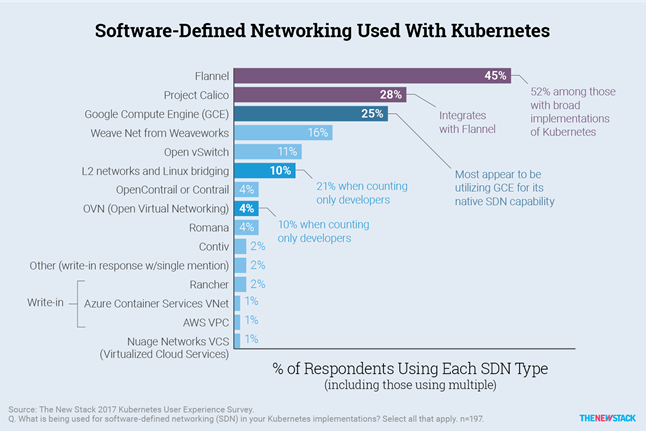
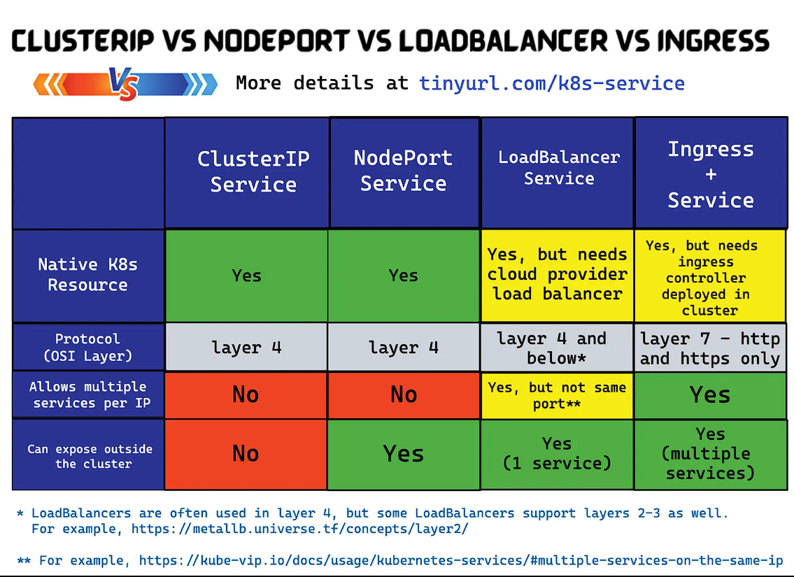

# Kubernetes Networking

1. [Introduction](#introduction)
2. [Kubernetes DNS](#kubernetes-dns)
3. [TCP Keep Alive Requests](#tcp-keep-alive-requests)
4. [Headless Kubernetes Service](#headless-kubernetes-service)
5. [NetworkPolicy](#networkpolicy)
6. [Nginx Ingress Controller](#nginx-ingress-controller)
7. [Contour Ingress Controller](#contour-ingress-controller)
8. [Kubernetes Gateway API](#kubernetes-gateway-api)
9. [Kube-proxy](#kube-proxy)
10. [Multicloud communication for Kubernetes](#multicloud-communication-for-kubernetes)
11. [Multi-Cluster Kubernetes Networking](#multi-cluster-kubernetes-networking)
12. [Kubernetes Network Policy](#kubernetes-network-policy)
     1. [Cilium](#cilium)
     2. [Kubernetes Network Policy Samples](#kubernetes-network-policy-samples)
13. [Kubernetes Ingress Specification](#kubernetes-ingress-specification)
14. [Xposer Kubernetes Controller To Manage Ingresses](#xposer-kubernetes-controller-to-manage-ingresses)
15. [Software-Defined IP Address Management (IPAM)](#software-defined-ip-address-management-ipam)
16. [CNI Container Networking Interface](#cni-container-networking-interface)
     1. [List of existing CNI Plugins (IPAM)](#list-of-existing-cni-plugins-ipam)
     2. [Project Calico](#project-calico)
17. [DNS Service with CoreDNS](#dns-service-with-coredns)
18. [Kubernetes Node Local DNS Cache](#kubernetes-node-local-dns-cache)
19. [k8gb](#k8gb)
20. [VPC Lattice](#vpc-lattice)
21. [Images](#images)
22. [Videos](#videos)
23. [Tweets](#tweets)

## Introduction

- [kubernetes.io: The Kubernetes network model. How to implement the Kubernetes networking model](https://kubernetes.io/docs/concepts/cluster-administration/networking/)
- [ovh.com - getting external traffic into kubernetes: clusterip, nodeport, loadbalancer and ingress](https://www.ovh.com/blog/getting-external-traffic-into-kubernetes-clusterip-nodeport-loadbalancer-and-ingress/)
- [==learnk8s.io: Load balancing and scaling long-lived connections in Kubernetes== 🌟🌟🌟](https://learnk8s.io/kubernetes-long-lived-connections) **Kubernetes doesn't load balance long-lived connections, and some Pods might receive more requests than others. If you're using HTTP/2, gRPC, etc. or any other long-lived connection, you might want to consider client-side load balancing**
- [stackrox.com: Kubernetes Networking Demystified: A Brief Guide](https://www.stackrox.com/post/2020/01/kubernetes-networking-demystified/)
- [blog.alexellis.io: Get a LoadBalancer for your private Kubernetes cluster](https://blog.alexellis.io/ingress-for-your-local-kubernetes-cluster/)
- [dustinspecker.com: How Do Kubernetes and Docker Create IP Addresses?!](https://dustinspecker.com/posts/how-do-kubernetes-and-docker-create-ip-addresses/)
- [youtube: Kubernetes Ingress Explained Completely For Beginners](https://www.youtube.com/watch?v=VicH6KojwCI)
- [AWS and Kubernetes Networking Options and Trade-Offs (part 1)](https://www.weave.works/blog/introduction-to-kubernetes-pod-networking--part-1)
- [AWS and Kubernetes Networking Options and Trade-Offs (part 2)](https://www.weave.works/blog/aws-networking-overview---part-2)
- [containo.us: Kubernetes Ingress & Service API Demystified](https://containo.us/blog/kubernetes-ingress-service-api-demystified/)
- [speakerdeck.com: Kubernetes and networks. Why is this so dan hard? 🌟](https://speakerdeck.com/thockin/kubernetes-and-networks-why-is-this-so-dang-hard)
- [externalTrafficPolicy=local on kubernetes. How to preserve the source IP in kubernetes](https://blog.getambassador.io/externaltrafficpolicy-local-on-kubernetes-e66e498212f9) externalTrafficPolicy=local is an annotation on the Kubernetes service resource that can be set to preserve the client source IP. When it is set, the actual IP address of a client is propagated to the K8s service instead of the IP address of the node.
- [ronaknathani.com: How a Kubernetes Pod Gets an IP Address 🌟](https://ronaknathani.com/blog/2020/08/how-a-kubernetes-pod-gets-an-ip-address/)
- [opensource.com: Why I use Ingress Controllers to expose Kubernetes services](https://opensource.com/article/20/8/ingress-controllers-kubernetes) Kubernetes ingress controllers will make or break your cloud architecture.
- [blog.nody.cc: Verify your Kubernetes Cluster Network Policies: From Faith to Proof](https://blog.nody.cc/posts/2020-06-kubernetes-network-policy-verification/)
- [infoq.com: Kubernetes Ingress Is Now Generally Available](https://www.infoq.com/news/2020/09/kubernetes-ingress-ga/)
- [Learnk8s: Comparison of Kubernetes Ingress Controllers 🌟🌟](https://docs.google.com/spreadsheets/d/191WWNpjJ2za6-nbG4ZoUMXMpUK8KlCIosvQB0f-oq3k/edit#gid=907731238) How do you choose the *right* Kubernetes Ingress controller when: Not all Ingress controllers support UDP, Only Kong has a free LDAP integration, Nginx Ingress and HAProxy are the only two ingress without CRDs.
- [blog.alexellis.io: Get kubectl access to your private cluster from anywhere](https://blog.alexellis.io/get-private-kubectl-access-anywhere/)
- [kubernetes.io: Scaling Kubernetes Networking With EndpointSlices](https://kubernetes.io/blog/2020/09/02/scaling-kubernetes-networking-with-endpointslices/) EndpointSlices are a new Kubernetes API that provides a scalable and extensible alternative to the Endpoints API.
- [haproxy.com: Announcing HAProxy Kubernetes Ingress Controller 1.5 🌟](https://www.haproxy.com/blog/announcing-haproxy-kubernetes-ingress-controller-1-5/)
- [devclass.com: HAProxy Ingress Controller 1.5 introduces mTLS support, gives load balancing experts more power](https://devclass.com/2021/01/26/haproxy-ingress-controller-1_5/)
- [thenewstack.io: HAProxy Kubernetes Ingress Controller Moves Outside the Cluster](https://thenewstack.io/haproxy-kubernetes-ingress-controller-moves-outside-the-cluster/)
- [suse.com: NGINX Guest Blog: NGINX Kubernetes Ingress Controller 🌟](https://www.suse.com/c/nginx-guest-blog-kubernetes-ingress-controller)
- [blog.cloudflare.com: Moving k8s communication to gRPC](https://blog.cloudflare.com/moving-k8s-communication-to-grpc/)
- [K8GB - Kubernetes Global Balancer](https://github.com/AbsaOSS/k8gb) - [openshift.com: K8GB - Kubernetes Global Balancer ](https://www.openshift.com/blog/openshift-commons-briefing-k8gb-kubernetes-global-balancer-with-yuri-tsarev-absa-and-paul-morie-red-hat)
- [altoros.com: Kubernetes Networking: How to Write Your Own CNI Plug-in with Bash](https://www.altoros.com/blog/kubernetes-networking-writing-your-own-simple-cni-plug-in-with-bash/)
- [Network Node Manager](https://github.com/kakao/network-node-manager) network-node-manager is a kubernetes controller that controls the network configuration of a node to resolve network issues of kubernetes. By simply deploying and configuring network-node-manager, you can solve kubernetes network issues that cannot be resolved by kubernetes or resolved by the higher kubernetes Version. Below is a list of kubernetes's issues to be resolved by network-node-manager. network-node-manager is based on kubebuilder v2.3.1.
- [getenroute.io: Drive API Security At Kubernetes Ingress Using Helm And Envoy 🌟](https://getenroute.io/docs/ingress-filter-legos-secure-microservices-apis-using-helm-envoy/)
- [ibm.com: Multizone Kubernetes and VPC Load Balancer Setup](https://www.ibm.com/cloud/blog/multizone-kubernetes-and-vpc-load-balancer-setup) Securely expose your Kubernetes app by setting up a Load Balancer for VPC in a different zone.
- [opensource.googleblog.com: Kubernetes: Efficient Multi-Zone Networking with Topology Aware Routing](https://opensource.googleblog.com/2020/11/kubernetes-efficient-multi-zone.html)
- [nbailey.ca: Domesticated Kubernetes Networking](https://nbailey.ca/post/k8s-networking/)
- [sookocheff.com: A Guide to the Kubernetes Networking Model 🌟](https://sookocheff.com/post/kubernetes/understanding-kubernetes-networking-model/)
- [ingressbuilder.jetstack.io 🌟🌟](https://ingressbuilder.jetstack.io) Ingress Builder allows users to select any annotation from the list of available controllers, to add to the ingress manifest.
- [openshift.com: gRPC or HTTP/2 Ingress Connectivity in OpenShift 🌟](https://www.openshift.com/blog/grpc-or-http/2-ingress-connectivity-in-openshift)
- [inlets.dev: Fixing Ingress for short-lived local Kubernetes clusters](https://inlets.dev/blog/2021/07/08/short-lived-clusters.html)
- [nginx.com: How to Simplify Kubernetes Ingress and Egress Traffic Management](https://www.nginx.com/blog/how-to-simplify-kubernetes-ingress-egress-traffic-management/)
- [searchitoperations.techtarget.com: Differences between Kubernetes Ingress vs. load balancer](https://searchitoperations.techtarget.com/feature/Differences-between-Kubernetes-Ingress-vs-load-balancer) To manage Kubernetes cluster traffic, admins have a few choices. Compare Kubernetes Ingress vs. load balancers, as well as the NodePort and ClusterIP service types.
- [monzo.com: Controlling outbound traffic from Kubernetes](https://monzo.com/blog/controlling-outbound-traffic-from-kubernetes)
- [thenewstack.io: ZeroLB, a New Decentralized Pattern for Load Balancing](https://thenewstack.io/zerolb-a-new-decentralized-pattern-for-load-balancing/)
- [ungleich.ch: Making kubernetes kube-dns publicly reachable](https://ungleich.ch/u/blog/kubernetes-making-dns-publicly-reachable/)
- [ungleich.ch: Building Ingress-less Kubernetes Clusters](https://ungleich.ch/u/blog/kubernetes-without-ingress/) Building Ingress-less Kubernetes Clusters with IPv6
- [thenewstack.io: Ingress Controllers: The More the Merrier](https://thenewstack.io/ingress-controllers-the-more-the-merrier/)
- [devopscube.com: Kubernetes Ingress Tutorial For Beginners 🌟](https://devopscube.com/kubernetes-ingress-tutorial/) In this Kubernetes ingress tutorial, you will learn the basic concepts of ingress, the native ingress resource object, and the concepts involved in ingress controllers
- [nginx.com: Reducing Kubernetes Costs by 70% in the Cloud with NGINX, Opsani, and Prometheus](https://www.nginx.com/blog/reducing-kubernetes-costs-70-percent-in-cloud-nginx-opsani-prometheus/)
- [cloud.redhat.com: Global Load Balancer Approaches 🌟](https://cloud.redhat.com/blog/global-load-balancer-approaches)
- [==loft.sh: Kubernetes NGINX Ingress: 10 Useful Configuration Options== 🌟](https://loft.sh/blog/kubernetes-nginx-ingress-10-useful-configuration-options) Kubernetes Ingress is the object that provides routing rules into your cluster. To best serve traffic to your app, you need to correctly configure it. This is an incredible article from loft.sh with 10 useful options for configuring NginX Ingress
    - Cluster IP
    - Target Ports
    - Node Port
    - External IPs
    - Load Balancer
- [==thenewstack.io: Ingress Controllers: The Swiss Army Knife of Kubernetes==](https://thenewstack.io/ingress-controllers-the-swiss-army-knife-of-kubernetes/)
- [==nginx.com: Kubernetes Networking 101==](https://www.nginx.com/blog/kubernetes-networking-101)
- [==learnk8s.io: Tracing the path of network traffic in Kubernetes== 🌟](https://learnk8s.io/kubernetes-network-packets)
- [devopscube.com: How To Configure Ingress TLS/SSL Certificates in Kubernetes](https://devopscube.com/configure-ingress-tls-kubernetes/)
- [armosec.io: Getting Started with Kubernetes Ingress | Ben Hirschberg](https://www.armosec.io/blog/kubernetes-ingress-beginners-guide/)
- [==tkng.io: The Kubernetes Networking Guide== 🌟🌟](https://www.tkng.io/) The purpose of The Kubernetes networking guide is to provide an overview of various Kubernetes networking components with a specific focus on exactly how they implement the required functionality
    - [==tkng.io/arch: THE KUBERNETES NETWORK MODEL== 🌟🌟](https://www.tkng.io/arch/)
- [==platform9.com: Ultimate Guide to Kubernetes Ingress Controllers== 🌟](https://platform9.com/blog/ultimate-guide-to-kubernetes-ingress-controllers/)
- [dustinspecker.com: Kubernetes Networking from Scratch: Using BGP and BIRD to Advertise Pod Routes](https://dustinspecker.com/posts/kubernetes-networking-from-scratch-bgp-bird-advertise-pod-routes/) In this article, you will learn how Calico sets up pod routes between Kubernetes nodes. In this post, you won't use containers or pods. You'll learn by creating network namespaces and virtual ethernet devices manually.
- [==home.robusta.dev: The ultimate guide to Kubernetes Services, LoadBalancers, and Ingress== 🌟🌟🌟](https://home.robusta.dev/blog/kubernetes-service-vs-loadbalancer-vs-ingress/)
    - Linux namespaces and Networking namespace
    - Intra pod networking & pause container
    - Kubernetes networking model
- [==dev.to: Tune up your Kubernetes Application Performance with a small DNS Configuration==](https://dev.to/imjoseangel/tune-up-your-kubernetes-application-performance-with-a-small-dns-configuration-1o46)
- [==edureka.co: Kubernetes Networking – A Comprehensive Guide To The Networking Concepts In Kubernetes==](https://www.edureka.co/blog/kubernetes-networking/)
- [api7.ai: How Does APISIX Ingress Support Thousands of Pod Replicas?](https://api7.ai/blog/apisix-ingress-support-thousands-pod-replicas) In this article, you'll explore the challenges of deploying large numbers of Pods in your Kubernetes cluster. You'll also compare Endpoints and EndpointSlice and discuss how to enable EndpointSlice when installing APISIX Ingress.
- [inlets.dev: How to Get Ingress for Private Kubernetes Clusters](https://inlets.dev/blog/2023/02/24/ingress-for-local-kubernetes-clusters.html) By design, local Kubernetes clusters are inaccessible from the internet. So how can we fix that if we want to use Ingress? What are the options for getting a public IP or LoadBalancer for local Kubernetes clusters? I cover use-cases and compare port-forwarding, Ngrok, Wireguard and inletsdev
- [==dev.to/narasimha1997: Communication between Microservices in a Kubernetes cluster== 🌟](https://dev.to/narasimha1997/communication-between-microservices-in-a-kubernetes-cluster-1n41) **This article discusses the various ways in which microservices in Kubernetes can communicate with each other. It provides an example of two pods, one acting as an HTTP web server and the other as a curl client that makes a request to the web server.**
- [thenewstack.io: Otterize: Intent-Based Access Control for Kubernetes and Cloud](https://thenewstack.io/otterize-intent-based-access-control-for-kubernetes-and-cloud/) Otterize offers intent-based access control and secure connectivity management within clusters and across the cloud.
- [blog.palark.com: Comparing Ingress controllers for Kubernetes](https://blog.palark.com/comparing-ingress-controllers-for-kubernetes/)
- [==community.ops.io: Kubernetes Ingress Controller. How does it work?===](https://community.ops.io/danielepolencic/learning-how-an-ingress-controller-works-by-building-one-in-bash-3fni) Learning how an ingress controller works by building one in bash.
- [sysdig.com: Kubernetes Services: ClusterIP, Nodeport and LoadBalancer](https://sysdig.com/blog/kubernetes-services-clusterip-nodeport-loadbalancer/) Your Kubernetes Pods have internal IPs, but can since Pods are created and destroyed, can you rely on those? Discover services and their types: ClusterIP, NodePort and LoadBalancer
- [cloudtechtwitter.com: Reverse Proxy vs. Forward Proxy: The Differences](https://www.cloudtechtwitter.com/2022/05/reverse-proxy-vs-forward-proxy.html)
- [matthewpalmer.net: Kubernetes Networking Guide for Beginners](https://matthewpalmer.net/kubernetes-app-developer/articles/kubernetes-networking-guide-beginners.html)
    - One challenge in cloud-distributed systems is keeping network traffic within the same availability zone
    - Kubernetes introduced Topology Aware Routing to address this issue
    - This ensures requests between apps remain in the same zone
- [otterize.com: Mastering Kubernetes networking: A journey in cloud-native packet management](https://otterize.com/blog/mastering-kubernetes-networking-otterize-s-journey-in-cloud-native-packet-management) Master Kubernetes networking with a comprehensive packet walk, and learn how Otterize helps build adaptive Network Policies.

## Kubernetes DNS

## TCP Keep Alive Requests

## Headless Kubernetes Service

    - A headless service is created in Kubernetes
    - Pods are associated with the service through labels
    - DNS records are created for each pod associated with the service
    - Clients can use the DNS records to directly access each pod

## NetworkPolicy

- [opensource.com: What you need to know about Kubernetes NetworkPolicy](https://opensource.com/article/21/10/kubernetes-networkpolicy) Understanding Kubernetes NetworkPolicy is one of the fundamental requirements to learn before deploying an application to Kubernetes.
    - [==editor.cilium.io== 🌟🌟🌟](https://editor.cilium.io) **For learning, you can use the amazing NetworkPolicy Editor at cilium.**

## Nginx Ingress Controller

- [nginx.com: A Guide to Choosing an Ingress Controller, Part 4: NGINX Ingress Controller Options](https://www.nginx.com/blog/guide-to-choosing-ingress-controller-part-4-nginx-ingress-controller-options/)
- [NGINX Ingress Controller - v1.0.0](https://github.com/kubernetes/ingress-nginx/releases/tag/controller-v1.0.0) NGINX Ingress Controller v1.0.0 released today! The biggest change is the support to stable/v1 ingress object, and dropping support to v1beta1.
- [devopscube.com: How to Setup Nginx Ingress Controller On Kubernetes – Detailed Guide 🌟](https://devopscube.com/setup-ingress-kubernetes-nginx-controller/)
- [nginx.com: Automating Multi-Cluster DNS with NGINX Ingress Controller](https://www.nginx.com/blog/automating-multi-cluster-dns-with-nginx-ingress-controller)
- [==mattias.engineer: Kubernetes-101: Ingress== 🌟](https://mattias.engineer/k8s/ingress/) The article provides an in-depth guide on the Ingress resource. It explains that Ingress offers more functionalities than a Service, enabling multiple routing rules for different Services. It also touches upon HTTPS traffic with TLS certificates.

## Contour Ingress Controller

- [trstringer.com: Kubernetes Ingress with Contour](https://trstringer.com/kubernetes-ingress-with-contour/)

## Kubernetes Gateway API

- [==gateway-api.sigs.k8s.io== 🌟](https://gateway-api.sigs.k8s.io/) Gateway API is an open source project managed by the SIG-NETWORK community. It's is a collection of resources that model service networking in Kubernetes. These resources - GatewayClass,Gateway, HTTPRoute, TCPRoute, Service, etc - aim to evolve Kubernetes service networking through expressive, extensible, and role-oriented interfaces that are implemented by many vendors and have broad industry support.
- [kubernetes.io: Evolving Kubernetes networking with the Gateway API](https://kubernetes.io/blog/2021/04/22/evolving-kubernetes-networking-with-the-gateway-api/)
- [thenewstack.io: Unifying Kubernetes Service Networking (Again) with the Gateway API 🌟](https://thenewstack.io/unifying-kubernetes-service-networking-again-with-the-gateway-api/) The [Gateway API](https://gateway-api.sigs.k8s.io/), formerly known as the Services API and before that Ingress V2, was first discussed in detail — and in-person — at Kubecon 2019 in San Diego. There were already many well-known and [well-documented](https://dave.cheney.net/paste/ingress-is-dead-long-live-ingressroute.pdf) limitations of Ingress and Kubernetes networking APIs. The [Gateway API](https://www.youtube.com/watch?v=GiFQNevrxYA) was intended as a redo of these APIs, built on the lessons from Services, Ingress and the service mesh community.
- [==armosec.io: The New Kubernetes Gateway API and Its Use Cases==](https://www.armosec.io/blog/kubernetes-gateway-api/)
- [navendu.me: Comparing Kubernetes Gateway and Ingress APIs](https://navendu.me/posts/gateway-vs-ingress-api/) In this article, you will explore the new Kubernetes Gateway API and compare it with the existing Kubernetes Ingress API for handling external traffic

## Kube-proxy

- [dustinspecker.com: iptables: How Kubernetes Services Direct Traffic to Pods](https://dustinspecker.com/posts/iptables-how-kubernetes-services-direct-traffic-to-pods) In this article you will learn how Kubernetes's kube-proxy uses iptables to direct traffic to pods randomly. You'll focus on the ClusterIP type of Kubernetes services.
- [arthurchiao.art: Cracking kubernetes node proxy (aka kube-proxy)](https://arthurchiao.art/blog/cracking-k8s-node-proxy/) This post analyzes the Kubernetes node proxy model, and provides 5 demo implementations (within couples of lines of code) of the model, each based on different tech-stacks (userspace/iptables/ipvs/tc-ebpf/sock-ebpf).

## Multicloud communication for Kubernetes

## Multi-Cluster Kubernetes Networking

    - [NetMaker](https://github.com/gravitl/netmaker) Netmaker makes networks with WireGuard. Netmaker automates fast, secure, and distributed virtual networks.

## Kubernetes Network Policy

- [howtoforge.com: Network Policy in Kubernetes 🌟](https://www.howtoforge.com/kubernetes_network_policy/) By default, pods accept traffic from any source. A network policy helps to specify how a group of pods can communicate with each other and other network endpoints.
- [learncloudnative.com: Kubernetes Network Policy](https://www.learncloudnative.com/blog/2020-10-07-network-policies)
- [bionconsulting.com: Kubernetes Network Policies](https://www.bionconsulting.com/blog/kubernetes-network-policies)
    - [bionconsulting.com: Kubernetes Network Policies - Part 2](https://www.bionconsulting.com/blog/kubernetes-network-policies-part-2)
- [thenewstack.io: The Kubernetes Network Security Effect 🌟](https://thenewstack.io/the-kubernetes-network-security-effect/) Kubernetes has a built-in object for managing network security: NetworkPolicy. While it allows the user to define the relationship between pods with ingress and egress policies, it is basic and requires very precise IP mapping of a solution — which changes constantly, so most users I’ve talked to are not using it.
- [openshift.com: Network Policies: Controlling Cross-Project Communication on OpenShift](https://www.openshift.com/blog/network-policies-controlling-cross-project-communication-on-openshift)
- [loft.sh: Kubernetes Network Policies: A Practitioner's Guide 🌟](https://loft.sh/blog/kubernetes-network-policies-a-practitioners-guide)
- [loft.sh: Kubernetes Network Policies for Isolating Namespaces 🌟](https://loft.sh/blog/kubernetes-network-policies-for-isolating-namespaces)
- [arthurchiao.art: Cracking Kubernetes Network Policy](https://arthurchiao.art/blog/cracking-k8s-network-policy/) This post digs into the Kubernetes NetworkPolicy model, then designs a policy enforcer based on the technical requirements and further implements it with less than 100 lines of eBPF code. Hope that after reading through this post, readers will get a deeper understanding on how network policies are enforced in the underlying.

### Cilium

- [cilium.io 🌟](https://cilium.io/) eBPF-based Networking, Observability, and Security
- [cilium.io: NetworkPolicy Editor: Create, Visualize, and Share Kubernetes NetworkPolicies 🌟](https://cilium.io/blog/2021/02/10/network-policy-editor)
- [buoyant.io: Kubernetes network policies with Cilium and Linkerd](https://buoyant.io/2020/12/23/kubernetes-network-policies-with-cilium-and-linkerd)
- [cilium.io: CNI Benchmark: Understanding Cilium Network Performance](https://cilium.io/blog/2021/05/11/cni-benchmark)
- [cockroachlabs.com: How to use Cluster Mesh for Multi-Region Kubernetes Pod Communication](https://www.cockroachlabs.com/blog/cockroachdb-kubernetes-cilium/)
    - Thanks to services provided by AWS, GCP, and Azure it’s become relatively easy to develop applications that span multiple regions. This is great because slow apps kill businesses. There is one common problem with these applications: they are not supported by multi-region database architecture.
    - CockroachDB is built to solve that problem and we’re doing it in production for many applications today. But that’s not what this blog is about. In this blog, I will provide a solution for the problem of getting Kubernetes pods to talk to each other in multi-region deployments.
- [cilium.io: Cilium 1.10: WireGuard, BGP Support, Egress IP Gateway, New Cilium CLI, XDP Load Balancer, Alibaba Cloud Integration and more](https://cilium.io/blog/2021/05/20/cilium-110) Traditional workloads have a fixed and unique IP that can be recognized by a firewall. Traffic coming from a containerized application will come from many different IPs. How can you fix that?
Cilium allows users to specify an egress NAT policy
- [solo.io: Exploring Cilium Layer 7 Capabilities Compared to Istio](https://www.solo.io/blog/exploring-cilium-layer-7-capabilities-compared-to-istio/)

### Kubernetes Network Policy Samples

- [==ahmetb/kubernetes-network-policy-recipes== 🌟](https://github.com/ahmetb/kubernetes-network-policy-recipes) Example recipes for Kubernetes Network Policies that you can just copy paste. This repository contains various use cases of Kubernetes Network Policies and sample YAML files to leverage in your setup. If you ever wondered how to drop/restrict traffic to applications running on Kubernetes, this is for you

## Kubernetes Ingress Specification

- [Supporting the Evolving Ingress Specification in Kubernetes 1.18](https://kubernetes.io/blog/2020/06/05/supporting-the-evolving-ingress-specification-in-kubernetes-1.18/)

## Xposer Kubernetes Controller To Manage Ingresses

- [Xposer 🌟](https://github.com/stakater/Xposer) A Kubernetes controller to manage (create/update/delete) Kubernetes Ingresses based on the Service
    - Problem: We would like to watch for services running in our cluster; and create Ingresses and generate TLS certificates automatically (optional)
    - Solution: Xposer can watch for all the services running in our cluster; Creates, Updates, Deletes Ingresses and uses certmanager to generate TLS certificates automatically based on some annotations.

## Software-Defined IP Address Management (IPAM)

- [fusionlayer.com: Software-Defined IP Address Management (IPAM)](https://www.fusionlayer.com/products/ip-address-management-software-defined-ipam-infinity)
    - Cloud computing and service automation are changing the way in which applications and data are being delivered and consumed. The existing 30-year-old networking model is failing to keep up with the automated service architectures and the Internet of Things (IoT) based on end-to-end automation.
    - **To facilitate the migration to cloud-era computing, service providers and data centers must add networking into the automated service workflows.** This requires agility and elasticity that traditional networking products are not designed to provide. As IT environments of tomorrow involve a plethora of orchestrators and controllers spinning up services and applications inside shared networks, they all must be managed and provisioned by a unified solution authoritative for all network-related information.

## CNI Container Networking Interface

- [Kubernetes.io: Network Plugins](https://kubernetes.io/docs/concepts/extend-kubernetes/compute-storage-net/network-plugins/)
- [rancher.com: Container Network Interface (CNI) Providers](https://rancher.com/docs/rancher/v2.x/en/faq/networking/cni-providers/)
- [github.com/containernetworking 🌟](https://github.com/containernetworking)
    - [CNI](https://github.com/containernetworking/cni)

### List of existing CNI Plugins (IPAM)

- Overlay Network plugins:
    - [Flannel](https://github.com/coreos/flannel)
    - [Weave-net](https://www.weave.works/docs/net/latest/overview/)
- Routed Network Plugins:
    - [kube-router](https://www.kube-router.io/)
    - [VMware-tanzu Antrea](https://github.com/vmware-tanzu/antrea)
    - dhcp
    - host-local
- Multi CNI plugins:
    - [Damn](https://github.com/nokia/danm)
    - [Multus](https://github.com/openshift/multus-cni)
    - [CNI-Genie](https://github.com/cni-genie/CNI-Genie)

### Project Calico

- [tigera.io](https://www.tigera.io/)
- [thenewstack.io: Tigera's Calico Aims to Ease Connectivity Pain with Kubernetes](https://thenewstack.io/tigera-aims-ease-connectivity-pain-kubernetes/)
- [mhmxs.blogspot.com: Autoscaling Calico Route Reflector topology in Kubernetes](https://mhmxs.blogspot.com/2020/12/autoscaling-calico-route-reflector.html)
- [tigera.io: Enforcing Network Security Policies with GitOps – Part 1 (Calico + ArgoCD)](https://www.tigera.io/blog/enforcing-network-security-policies-with-gitops-part-1) Network policy is a key element of Kubernetes security. Network policy is expressed as a YAML configuration and works very well with GitOps. By adopting GitOps, security teams benefit in the following ways:
    - Take your policies with you. Kubernetes cluster creation from code is fairly common. It is much easier and less error-prone to push your Git-based policies to a new cluster.
    - You can monitor policy changes using information from pull requests. This will also be easy to integrate with your existing systems, instead of writing integrations from scratch. If something goes wrong, you can simply roll back to an earlier commit.
    - You can lock down who can deploy security policies. If you lock it down to only a single Git user, that will be easy to control. Everybody else can push their policy changes into Git via pull request.
    - Your GitOps tool can ensure that it will override any accidental or malicious change at runtime. This solves a major compliance concern. Git becomes the source of truth for your security policies.
    - It would be much easier to manage if no user could create a security policy from kubectl. Then you can enable de-centralized security by creating specific users for different services, and giving them rights to deploy only specific policies. Developers and DevOps teams are very comfortable with the notion of a Git pipeline.

## DNS Service with CoreDNS

- [thenewstack.io: Supercharge CoreDNS with Cluster Addons 🌟](https://thenewstack.io/supercharge-coredns-with-cluster-addons/)
- [sysdig.com: How to monitor coreDNS 🌟](https://sysdig.com/blog/how-to-monitor-coredns/) The most common problems and outages in a Kubernetes cluster come from coreDNS, so learning how to monitor coreDNS is crucial.
- [nslookup.io: The life of a DNS query in Kubernetes](https://www.nslookup.io/learning/the-life-of-a-dns-query-in-kubernetes/) In Kubernetes, DNS queries follow a specific path to resolve the IP address of a hostname. In this blog post, you will learn the life of a DNS query in Kubernetes step-by-step.

## Kubernetes Node Local DNS Cache

- [Kubernetes Node Local DNS Cache](https://povilasv.me/kubernetes-node-local-dns-cache/)

## k8gb

- [k8gb.io](https://www.k8gb.io) A cloud native Kubernetes Global Balancer

## VPC Lattice

- [dev.to/aws-builders: Amazon VPC Lattice — Build Applications, Not Networks](https://dev.to/aws-builders/amazon-vpc-lattice-build-applications-not-networks-59j8) An exciting new service that simplifies the networking layer for developers and cloud administrators.

## Images

??? note "Click to expand!"

    

    
    

## Videos

??? note "Click to expand!"

    

    <iframe width="560" height="315" src="https://www.youtube.com/embed/T4Z7visMM4E" title="YouTube video player" frameborder="0" allow="accelerometer; autoplay; clipboard-write; encrypted-media; gyroscope; picture-in-picture" allowfullscreen></iframe>
    <iframe width="560" height="315" src="https://www.youtube.com/embed/5cNrTU6o3Fw" title="YouTube video player" frameborder="0" allow="accelerometer; autoplay; clipboard-write; encrypted-media; gyroscope; picture-in-picture" allowfullscreen></iframe>
    <iframe width="560" height="315" src="https://www.youtube.com/embed/80Ew_fsV4rM" title="YouTube video player" frameborder="0" allow="accelerometer; autoplay; clipboard-write; encrypted-media; gyroscope; picture-in-picture" allowfullscreen></iframe>
    <iframe width="560" height="315" src="https://www.youtube.com/embed/VSn6DPKIhM8?si=pNaN7q9t3UKWaEhK" title="YouTube video player" frameborder="0" allow="accelerometer; autoplay; clipboard-write; encrypted-media; gyroscope; picture-in-picture; web-share" allowfullscreen></iframe>
    

## Tweets

  
Click to expand!

<blockquote class="twitter-tweet">
Kubernetes is an example of what happens when you have an indefinitely complex network stack and no troubleshooting tools in place.
&mdash; Jaana Dogan ヤナ ドガン (@rakyll) <a href="https://twitter.com/rakyll/status/1458317772941713408?ref_src=twsrc%5Etfw">November 10, 2021</a></blockquote> 

<blockquote class="twitter-tweet">
Let&#39;s see how many folks here haven&#39;t seen this thread on Kubernetes Networking.  Once again, the thread doesn&#39;t try to explain the subject matter in great detail but offers a particular learning order instead.  As usual, based on my personal experience 🔽 <a href="https://t.co/pxCWJUxj5j">pic.twitter.com/pxCWJUxj5j</a>
&mdash; Ivan Velichko (@iximiuz) <a href="https://twitter.com/iximiuz/status/1464922049604997121?ref_src=twsrc%5Etfw">November 28, 2021</a></blockquote> 

<blockquote class="twitter-tweet">
🧵 How does Pod to Pod communication work in Kubernetes?  How does the traffic reach the right Pod?  Let&#39;s see 👇 <a href="https://t.co/gF2eVWYL4Q">pic.twitter.com/gF2eVWYL4Q</a>
&mdash; Daniele Polencic (@danielepolencic) <a href="https://twitter.com/danielepolencic/status/1488119972463218690?ref_src=twsrc%5Etfw">January 31, 2022</a></blockquote> 

<blockquote class="twitter-tweet">
When your apps receive a ton of traffic, how do you scale your Ingress Controller in Kubernetes?  Here is what I do 👇 <a href="https://t.co/T6aYurE7Lj">pic.twitter.com/T6aYurE7Lj</a>
&mdash; Daniele Polencic (@danielepolencic) <a href="https://twitter.com/danielepolencic/status/1498999951661010945?ref_src=twsrc%5Etfw">March 2, 2022</a></blockquote> 

<blockquote class="twitter-tweet">
Should you use a single Kubernetes Ingress controller or multiple?  On Monday 8PT/5CET Andrea will make a convincing case on why multiple controllers are good for  ✅ security ✅ segregating team &amp; resources ✅ isolation  Register here (it&#39;s free) <a href="https://t.co/62oKodt7tQ">https://t.co/62oKodt7tQ</a> <a href="https://t.co/DWNy0iTYq6">pic.twitter.com/DWNy0iTYq6</a>
&mdash; Learnk8s (@learnk8s) <a href="https://twitter.com/learnk8s/status/1502986561901965319?ref_src=twsrc%5Etfw">March 13, 2022</a></blockquote> 

<blockquote class="twitter-tweet">
Networking in Kubernetes is arguably the most important piece.  Why?  Because there’s not much you can do in a Kubernetes cluster without proper networking.  A thread 🧵
&mdash; Michael Levan 👨🏻‍💻☕️ (@TheNJDevOpsGuy) <a href="https://twitter.com/TheNJDevOpsGuy/status/1607747382711664640?ref_src=twsrc%5Etfw">December 27, 2022</a></blockquote> 

<blockquote class="twitter-tweet">
How do you deal with peaks of traffic in Kubernetes?  You can use an autoscaler, but how should you configure and test it?  Let&#39;s dive into it. <a href="https://t.co/AxfEgqyEFW">pic.twitter.com/AxfEgqyEFW</a>
&mdash; Daniele Polencic — @danielepolencic@hachyderm.io (@danielepolencic) <a href="https://twitter.com/danielepolencic/status/1647935320288284673?ref_src=twsrc%5Etfw">April 17, 2023</a></blockquote> 

