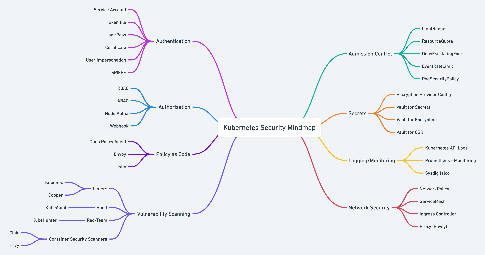
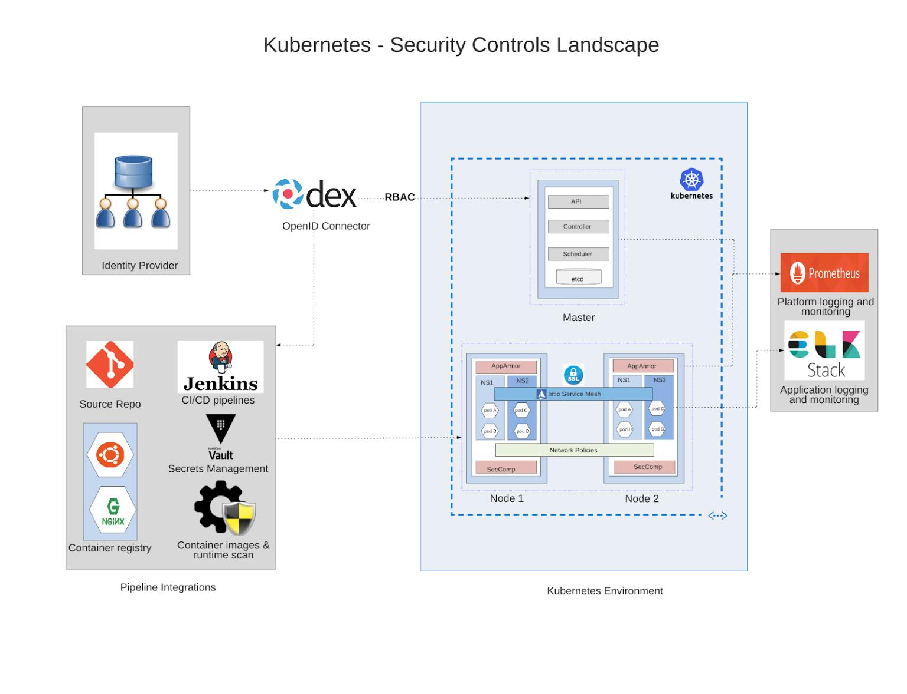

# Kubernetes Security

1. [Introduction](#introduction)
2. [IAM Identity And Access Management in Kubernetes](#iam-identity-and-access-management-in-kubernetes)
3. [Securing Kubernetes Deployments](#securing-kubernetes-deployments)
4. [Securing a Kubernetes cluster using TLS certificates. Wildcard certificates](#securing-a-kubernetes-cluster-using-tls-certificates-wildcard-certificates)
5. [Kubernetes Security Scanners](#kubernetes-security-scanners)
6. [Security Checklist Kubernetes OWASP](#security-checklist-kubernetes-owasp)
7. [Exposed Kubernetes Clusters](#exposed-kubernetes-clusters)
8. [NSA National Security Agent Kubernetes Hardening Guidance](#nsa-national-security-agent-kubernetes-hardening-guidance)
9. [CIS Benchmarks and CIS Operator](#cis-benchmarks-and-cis-operator)
10. [User and Workload identities in Kubernetes](#user-and-workload-identities-in-kubernetes)
11. [Service Accounts](#service-accounts)
12. [Kubernetes Secrets](#kubernetes-secrets)
13. [Kubernetes Cert-Manager. Encrypting the certificate for Kubernetes. SSL certificates with Let's Encrypt in Kubernetes Ingress via cert-manager](#kubernetes-cert-manager-encrypting-the-certificate-for-kubernetes-ssl-certificates-with-lets-encrypt-in-kubernetes-ingress-via-cert-manager)
14. [Kubernetes OpenID Connect OIDC](#kubernetes-openid-connect-oidc)
     1. [OAuth2 Proxy](#oauth2-proxy)
     2. [Alternatives](#alternatives)
15. [RBAC and Access Control](#rbac-and-access-control)
     1. [Tools](#tools)
16. [Kubernetes and LDAP](#kubernetes-and-ldap)
17. [Admission Control](#admission-control)
18. [Kubernetes Security Best Practices](#kubernetes-security-best-practices)
19. [Kubernetes Authentication and Authorization](#kubernetes-authentication-and-authorization)
     1. [Kubernetes Authentication Methods](#kubernetes-authentication-methods)
     2. [X.509 client certificates](#x509-client-certificates)
     3. [Static HTTP Bearer Tokens](#static-http-bearer-tokens)
     4. [OpenID Connect](#openid-connect)
     5. [Implementing a custom Kubernetes authentication method](#implementing-a-custom-kubernetes-authentication-method)
20. [Pod Security Policies (SCCs - Security Context Constraints in OpenShift)](#pod-security-policies-sccs---security-context-constraints-in-openshift)
21. [Security Profiles Operator](#security-profiles-operator)
22. [EKS Security](#eks-security)
23. [External Secrets Operator](#external-secrets-operator)
24. [CVE](#cve)
     1. [Official Kubernetes CVE Feed](#official-kubernetes-cve-feed)
25. [Videos](#videos)
26. [Tweets](#tweets)

## Introduction

- [cilium.io](https://cilium.io/)
    - [github Kyverno - Kubernetes Native Policy Management](https://github.com/nirmata/kyverno/)
- [Kubernetes Security Best Practices 🌟](https://github.com/freach/kubernetes-security-best-practice/blob/master/README.md#firewall-ports-fire)
- [jeffgeerling.com: Everyone might be a cluster-admin in your Kubernetes cluster](https://www.jeffgeerling.com/blog/2020/everyone-might-be-cluster-admin-your-kubernetes-cluster)
- [Microsoft.com: Attack matrix for Kubernetes 🌟](https://www.microsoft.com/security/blog/2020/04/02/attack-matrix-kubernetes/)
- [thenewstack.io: Laying the Groundwork for Kubernetes Security, Across Workloads, Pods and Users](https://thenewstack.io/laying-the-groundwork-for-kubernetes-security-across-workloads-pods-and-users/)
- [horovits.wordpress.com: Kubernetes Security Best Practices](https://horovits.wordpress.com/2020/07/15/kubernetes-security-best-practices/)
- [containerjournal.com: How to Secure Your Kubernetes Cluster 🌟](https://containerjournal.com/topics/container-security/how-to-secure-your-kubernetes-cluster/)
- [kubernetes.io: Cloud native security for your clusters](https://kubernetes.io/blog/2020/11/18/cloud-native-security-for-your-clusters/)
- [tldrsec.com: Risk8s Business: Risk Analysis of Kubernetes Clusters 🌟](https://tldrsec.com/guides/kubernetes/) A zero-to-hero guide for assessing the security risk of your Kubernetes cluster and hardening it.
- [labs.bishopfox.com: Bad Pods: Kubernetes Pod Privilege Escalation 🌟](https://labs.bishopfox.com/tech-blog/bad-pods-kubernetes-pod-privilege-escalation) What are the risks associated with overly permissive pod creation in Kubernetes? The answer varies based on which of the host’s namespaces and security contexts are allowed. In this post, I will describe eight insecure pod configurations and the corresponding methods to perform privilege escalation. This article and the accompanying repository were created to help penetration testers and administrators better understand common misconfiguration scenarios.
- [sysdig.com: Kubernetes Security Guide 🌟](https://sysdig.com/resources/ebooks/kubernetes-security-guide/) Best practices, guidance and steps for implementing Kubernetes security.
- [resources.whitesourcesoftware.com: Kubernetes Security Best Practices 🌟](https://resources.whitesourcesoftware.com/blog-whitesource/kubernetes-security)
- [sysdig.com: Getting started with Kubernetes audit logs and Falco 🌟](https://sysdig.com/blog/kubernetes-audit-log-falco/)
- [thenewstack.io: Best Practices for Securely Setting up a Kubernetes Cluster](https://thenewstack.io/best-practices-for-securely-setting-up-a-kubernetes-cluster/)
- [stackrox/Kubernetes_Security_Specialist_Study_Guide 🌟](https://github.com/stackrox/Kubernetes_Security_Specialist_Study_Guide)
- [thenewstack.io: A Security Comparison of Docker, CRI-O and Containerd 🌟](https://thenewstack.io/a-security-comparison-of-docker-cri-o-and-containerd/)
- [youtube: Kubernetes Security: Attacking and Defending K8s Clusters - by Magno Logan](https://www.youtube.com/watch?v=OOHmg1J_8ck&ab_channel=RedTeamVillage)
- [microsoft.com: Secure containerized environments with updated threat matrix for Kubernetes](https://www.microsoft.com/security/blog/2021/03/23/secure-containerized-environments-with-updated-threat-matrix-for-kubernetes/)
- [kyverno.io 🌟](https://kyverno.io/) Kubernetes Native Policy Management. Open Policy Agent? That’s old school. Securely manage workloads on your kubernetesio clusters with this handy new tool, Kyverno.Kyverno is a policy engine designed for Kubernetes. With Kyverno, policies are managed as Kubernetes resources and no new language is required to write policies. This allows using familiar tools such as kubectl, git, and kustomize to manage policies. Kyverno policies can validate, mutate, and generate Kubernetes resources. The Kyverno CLI can be used to test policies and validate resources as part of a CI/CD pipeline. [youtube: The Way of the Future | Kubernetes Policy Management with Kyverno](https://www.youtube.com/watch?v=8fgrjBnxqi0&t=270s&ab_channel=AppSecEngineer) - [youtube: Securing and Automating Kubernetes with Kyverno](https://www.youtube.com/watch?v=0cJAfmQ7Emg&ab_channel=CloudNativeIslamabad)
    - [==kyverno.io/policies== 🌟](https://kyverno.io/policies/) K8s policies available in the community repository
- [cyberark.com: Attacking Kubernetes Clusters Through Your Network Plumbing: Part 1](https://www.cyberark.com/resources/threat-research-blog/attacking-kubernetes-clusters-through-your-network-plumbing-part-1?utm_sq=goa40uvlx1)
- [thenewstack.io: Defend the Core: Kubernetes Security at Every Layer](https://thenewstack.io/defend-the-core-kubernetes-security-at-every-layer/)
- [Analyze Kubernetes Audit logs using Falco 🌟](https://github.com/developer-guy/falco-analyze-audit-log-from-k3s-cluster) Detect intrusions that happened in your Kubernetes cluster through audit logs using Falco
- [helpnetsecurity.com: Kubestriker: A security auditing tool for Kubernetes clusters 🌟](https://www.helpnetsecurity.com/2021/05/04/security-kubernetes/) Kubestriker is an open-source, platform-agnostic tool for identifying security misconfigurations in Kubernetes clusters.
- [Kubernetes Goat 🌟](https://madhuakula.com/kubernetes-goat) is designed to be an intentionally vulnerable cluster environment to learn and practice Kubernetes security.
- [gist.github.com: How to protect your ~/.kube/ configuration](https://gist.github.com/PatrLind/e651d3cbc3bf68e4bd9fcc9568cbd3fb)
- [snyk.io: 10 Kubernetes Security Context settings you should understand](https://snyk.io/blog/10-kubernetes-security-context-settings-you-should-understand/)
- [redhat.com: The State of Kubernetes Security](https://www.redhat.com/en/blog/state-kubernetes-security)
- [fairwinds.com: Discover the Top 5 Kubernetes Security Mistakes You're (Probably) Making](https://www.fairwinds.com/blog/top-5-kubernetes-security-mistakes)
- [tigera.io: Kubernetes security policy design: 10 critical best practices 🌟](https://www.tigera.io/blog/kubernetes-security-policy-10-critical-best-practices/)
- [empresas.blogthinkbig.com: Descubierta una vulnerabilidad en Kubernetes que permite acceso a redes restringidas (CVE-2020-8562)](https://empresas.blogthinkbig.com/descubierta-vulnerabilidad-kubernetes-permite-acceso-redes-restringidas-cve-2020-8562/)
- [thenewstack.io: Kubernetes: An Examination of Major Attacks 🌟](https://thenewstack.io/kubernetes-an-examination-of-major-attacks/) Constant vigilance is required to ensure that cloud infrastructure is locked down and that DevSecOps teams have the right tools for the job.
- [cloud.redhat.com: Top Open Source Kubernetes Security Tools of 2021 🌟🌟](https://cloud.redhat.com/blog/top-open-source-kubernetes-security-tools-of-2021)
- [redhat.com: State of Kubernetes Security Report - Spring 2021 (PDF) 🌟](https://www.redhat.com/rhdc/managed-files/cl-state-kubernetes-security-report-ebook-f29117-202106-en.pdf)
- [kubernetes.io: Overview of Cloud Native Security 🌟🌟](https://kubernetes.io/docs/concepts/security/overview/) This overview defines a model for thinking about Kubernetes security in the context of Cloud Native security.
- [learn.hashicorp.com: Integrate a Kubernetes Cluster with an External Vault 🌟](https://learn.hashicorp.com/tutorials/vault/kubernetes-external-vault)
- [talkingquickly.co.uk: Kubernetes Single Sign On - A detailed guide 🌟](http://www.talkingquickly.co.uk/kubernetes-sso-a-detailed-guide)
- [armosec.io: A Practical Guide to the Different Compliance Kubernetes Security Frameworks and How They Fit Together 🌟🌟](https://www.armosec.io/blog/kubernetes-security-frameworks-and-guidance)
- [thenewstack.io: How to Secure Kubernetes, the OS of the Cloud](https://thenewstack.io/how-to-secure-kubernetes-the-os-of-the-cloud/)
- [akhilsharma.work: The 4C's of Kubernetes Security](https://akhilsharma.work/the-4cs-of-kubernetes-security/)
- Kubernetes security thing: Always be careful of what you are letting your users choose for usernames. If someone has a username of **system:kube-controller-manager** on an external Identity system, Kubernetes will quite happily give them the rights of the controller manager. The **--oidc-username-prefix** and **--oidc-groups-prefix** flags are userful for preventing this in OIDC integrations.
- [==infoworld.com: The race to secure Kubernetes at run time==](https://www.infoworld.com/article/3639829/the-race-to-secure-kubernetes-at-runtime.html) A new wave of startups is looking to help developers secure their containerized applications after they go into production. Is this the future of application security?
- [==goteleport.com: Kubernetes API Access Security Hardening==](https://goteleport.com/blog/kubernetes-api-access-security)
- [infoworld.com: Securing the Kubernetes software supply chain with Microsoft's Ratify](https://www.infoworld.com/article/3644808/securing-the-kubernetes-software-supply-chain.html) Microsoft’s **Ratify** proposal adds a verification workflow to Kubernetes container deployment. The Ratify team has some demo code in their GitHub repository that shows how to use Ratify with Gatekeeper in Kubernetes. [Ratify installs using a Helm chart](https://github.com/deislabs/ratify#quick-start), bringing along some sample configuration templates.
- [==blog.gitguardian.com: Hardening Your Kubernetes Cluster - Threat Model (Pt. 1)== 🌟](https://blog.gitguardian.com/hardening-your-k8-pt-1/) The NSA and CISA recently released a guide on Kubernetes hardening. We'll cover this guide in a three part series. First, let's explore the Threat Model and how it maps to K8s components.
    - [==blog.gitguardian.com: Hardening Your Kubernetes Cluster - Guidelines (Pt. 2)== 🌟](https://blog.gitguardian.com/hardening-your-k8s-pt-2/) In this second episode, we will go through the NSA/CISA security recommendations and explain every piece of the guidelines.
- [blog.gitguardian.com: Kubernetes Hardening Tutorial Part 1: Pods](https://blog.gitguardian.com/kubernetes-tutorial-part-1-pods/) Get a deeper understanding of Kubernetes Pods security with this first tutorial. After reading this article, you will learn:
    - How not to run pods as root
    - How to use immutable root fs (lock the root filesystem)
    - How to do Docker image scan locally and with your CI pipelines
    - How to use PSP
    - [blog.gitguardian.com: Kubernetes Hardening Tutorial Part 2: Network](https://blog.gitguardian.com/kubernetes-tutorial-part-2-network/) How to achieve Control Plane security, true resource separation with network policies, and use Kubernetes Secrets more securely.
- [infoworld.com: 10 steps to automating security in Kubernetes pipelines](https://www.infoworld.com/article/3545337/10-steps-to-automating-security-in-kubernetes-pipelines.html) DevOps teams don’t need to sacrifice the speed of containerized development if they know what can be automated, why it’s important, and how to do it
- [isovalent.com: Detecting a Container Escape with Cilium and eBPF](https://isovalent.com/blog/post/2021-11-container-escape) In this article you’ll learn how an attacker with access to a Kubernetes cluster can escape from a container and:
    - run a pod to gain root privileges
    - escape to the host
    - persist the attack with invisible pods and fileless executions
- [mattermost.com: The Top 7 Open Source Tools for Securing Your Kubernetes Cluster](https://mattermost.com/blog/the-top-7-open-source-tools-for-securing-your-kubernetes-cluster/)
    - Etcd localhost port access due to SSRF vulnerability
    - Etcd Credential Stealing
    - Kube API server command execution
- [xenitab.github.io: Kubernetes Ephemeral Container Security 🌟](https://xenitab.github.io/blog/2022/04/12/ephemeral-container-security/) Ephemeral containers are temp containers that can be attached after a Pod is created. But what happens when you use them on a hardened cluster? The answer is not so obvious as OPA, Kyverno, PSPs, etc. will do their best to (rightly) prevent execution.
- [==armosec.io: How to Secure Deployments in Kubernetes?== 🌟](https://www.armosec.io/blog/secure-kubernetes-deployment/) In Kubernetes, there are two aspects to security: cluster security and application security. In this post, you'll explore how to secure ‌Kubernetes deployments and applications in general.
- [sysdig.com: How attackers use exposed Prometheus server to exploit Kubernetes clusters | Miguel Hernández](https://sysdig.com/blog/exposed-prometheus-exploit-kubernetes-kubeconeu/) What happens if an attacker accesses your Prometheus server? How much information can they get for fingerprinting the cluster? In this article, you will learn how attackers use this information and how to secure your cluster.
- [==cast.ai: Kubernetes Security: 10 Best Practices from the Industry and Community== 🌟](https://cast.ai/blog/kubernetes-security-10-best-practices/)
- [thenewstack.io: Basic Principles Key to Securing Kubernetes’ Future](https://thenewstack.io/key-basic-principles-to-secure-kubernetes-future/) Once these capabilities have been established, Ops teams can begin to look further afield and explore leveraging the value of their data through activities like testing and optimization.
- [copado.com: Applying a Zero Trust Infrastructure in Kubernetes](https://www.copado.com/devops-hub/blog/applying-a-zero-trust-infrastructure-in-kubernetes)
- [dev.to/pavanbelagatti: Kubernetes Security Best Practices For Developers](https://dev.to/pavanbelagatti/kubernetes-security-best-practices-for-developers-2b92)
- [tutorialboy24.blogspot.com: A Detailed Talk about K8S Cluster Security from the Perspective of Attackers (Part 2) 🌟](https://tutorialboy24.blogspot.com/2022/09/a-detailed-talk-about-k8s-cluster.html) In this 2-part series, you will address 12 common attack points in Kubernetes clusters and discuss various risks in cloud-native scenarios based on practical experience
- [==securitycafe.ro: A COMPLETE KUBERNETES CONFIG REVIEW METHODOLOGY==](https://securitycafe.ro/2023/02/27/a-complete-kubernetes-config-review-methodology/)
- [dev.to/mattiasfjellstrom: Kubernetes-101: Security concepts](https://dev.to/mattiasfjellstrom/kubernetes-101-security-concepts-2f4f) The article provides an overview of Kubernetes security concepts, focusing on NetworkPolicies, ServiceAccounts, and Security Contexts
- [blog.alexellis.io: What if your Pods need to trust self-signed certificates?](https://blog.alexellis.io/what-if-your-pods-need-to-trust-self-signed-certificates/) Self-signed certificates are common within enterprise companies. But how do you distribute them and enable their use in Kubernetes as a user and a vendor?
- [thenewstack.io: Securing Kubernetes in a Cloud Native World](https://thenewstack.io/securing-kubernetes-in-a-cloud-native-world/) As cloud native technologies continue to advance, staying informed and adaptable is key to maintaining a secure Kubernetes ecosystem.
- [collabnix.com: Applying DevSecOps Practices to Kubernetes](https://collabnix.com/applying-devsecops-practices-to-kubernetes/)
- [==dev.to/thenjdevopsguy: Securing Kubernetes Pods For Production Workloads==](https://dev.to/thenjdevopsguy/securing-kubernetes-pods-for-production-workloads-51oh)
- [dev.to/thenjdevopsguy: The 4 C’s Of Kubernetes Security](https://dev.to/thenjdevopsguy/the-4-cs-of-kubernetes-security-3i9e)

## IAM Identity And Access Management in Kubernetes

- [thenewstack.io: Cloud Native Identity and Access Management in Kubernetes](https://thenewstack.io/cloud-native-identity-and-access-management-in-kubernetes/)
- [curity.io: OAuth 2.0 Overview](https://curity.io/resources/learn/oauth-overview/)
- [curity.io: OpenID Connect Overview](https://curity.io/resources/learn/openid-connect-overview/)
- [curity.io: Client Security](https://curity.io/resources/client-security/) Client security primarily covers web and mobile, to ensure best security in the browser and on devices
- [dev.to/gabrielbiasi: Automatic SSO in Kubernetes workloads using a sidecar container](https://dev.to/gabrielbiasi/automatic-sso-in-kubernetes-workloads-using-a-sidecar-container-3752) In this tutorial, you will learn how to use oauth2-proxy as a sidecar container to authorize requests to your Identity Provider of choice

## Securing Kubernetes Deployments

- [==dev.to/aws-builders: Best Practices for Securing Kubernetes Deployments== 🌟](https://dev.to/aws-builders/best-practices-for-securing-kubernetes-deployments-1jg6) **Although Kubernetes is a powerful container orchestration platform, its complexity and its adoption makes it a prime target for security attacks. We'll go over some of the best practices for securing the Kubernetes deployments and keeping applications and data safe in this article. This article is only about pods or deployments.**

## Securing a Kubernetes cluster using TLS certificates. Wildcard certificates

- [thenewstack.io: Jetstack Secure Promises to Ease Kubernetes TLS Security](https://thenewstack.io/jetstack-secure-promises-to-ease-kubernetes-tls-security/)

## Kubernetes Security Scanners

    - Grype
    - Trivy
    - Kubesec
    - Kube-bench
    - Kubeaudit
    - [kube-bench 🌟](https://github.com/aquasecurity/kube-bench) Checks whether Kubernetes is deployed according to security best practices as defined in the CIS Kubernetes Benchmark
        - [==devopscube.com/kube-bench-guide: Kube-Bench: Kubernetes CIS Benchmarking Tool==](https://devopscube.com/kube-bench-guide/)
    - [kube-hunter 🌟](https://github.com/aquasecurity/kube-hunter) Hunt for security weaknesses in Kubernetes clusters
    - [k21academy.com: Secure and Harden Kubernetes, AKS and EKS Cluster with kube-bench, kube-hunter and CIS Benchmarks 🌟](https://k21academy.com/docker-kubernetes/kubernetes-security/kube-bench-cis/)
- [==blog.flant.com: Kubernetes cluster security assessment with kube-bench and kube-hunter==](https://blog.flant.com/kubernetes-security-with-kube-bench-and-kube-hunter/)
- [raesene.github.io: Let's talk about Kubernetes on the Internet](https://raesene.github.io/blog/2022/07/03/lets-talk-about-kubernetes-on-the-internet/) In this article, you will learn how to scan and discover publicly accessible Kubernetes clusters and how you can protect against it
- [==github.com/Shopify/kubeaudit== 🌟🌟](https://github.com/Shopify/kubeaudit) kubeaudit helps you audit your Kubernetes clusters against common security controls. kubeaudit is a command line tool and a Go package to audit Kubernetes clusters for various different security concerns, such as:
    - Run as non-root
    - Use a read-only root filesystem
    - Drop scary capabilities, don't add new ones
    - Don't run privileged

## Security Checklist Kubernetes OWASP

- [==kubernetes.io: Security Checklist== 🌟🌟](https://kubernetes.io/docs/concepts/security/security-checklist/)
    - CI/CD pipelines
    - Security Admission controller
    - OPA and Gatekeeper
    - IDE linting and plug-ins
- [owasp.org: OWASP Kubernetes Top Ten](https://owasp.org/www-project-kubernetes-top-ten/) OWASP Kubernetes Top Ten is aimed at helping security practitioners, system administrators, and developers prioritize risks around the Kubernetes ecosystem. This is a prioritized list of these risks backed by data.
- [==sysdig.com: OWASP Kubernetes Top 10== 🌟](https://sysdig.com/blog/top-owasp-kubernetes/) One of the biggest concerns when using Kubernetes is whether we are complying with the security posture and taking into account all possible threats.
    - Secrets objects
    - Managing Kubernetes Secrets
    - Manual Secret Creation
    - Secrets in CI/CD pipelines
    - Kubernetes Secrets Store Container Storage Interface

## Exposed Kubernetes Clusters

- [blog.cyble.com: Exposed Kubernetes Clusters](https://blog.cyble.com/2022/06/27/exposed-kubernetes-clusters/) Organizations At Risk Of Data Breaches Via Misconfigured Kubernetes. Over 900k Kubernetes exposures were observed across the internet during a routine threat-hunting exercise. While this does not imply that all exposed instances are vulnerable to attacks, it still makes them a target.

## NSA National Security Agent Kubernetes Hardening Guidance

- [thenewstack.io: The NSA Can Help Secure Your Kubernetes Clusters](https://thenewstack.io/the-nsa-can-help-you-secure-your-kubernetes-clusters/)
- [therecord.media: NSA, CISA publish Kubernetes hardening guide 🌟🌟](https://therecord.media/nsa-cisa-publish-kubernetes-hardening-guide/)
    - Scan containers and Pods for vulnerabilities or misconfigurations.
    - Run containers and Pods with the least privileges possible.
    - Use network separation to control the amount of damage a compromise can cause.
    - Use firewalls to limit unneeded network connectivity and encryption to protect confidentiality.
    - Use strong authentication and authorization to limit user and administrator access as well as to limit the attack surface.
    - Use log auditing so that administrators can monitor activity and be alerted to potential malicious activity.
    - Periodically review all Kubernetes settings and use vulnerability scans to help ensure risks are appropriately accounted for and security patches are applied.
- [==Kubescape== 🌟](https://github.com/armosec/kubescape) **kubescape is the first tool for testing if Kubernetes is deployed securely as defined inKubernetes Hardening Guidance by to NSA and CISA.** Tests are configured with YAML files, making this tool easy to update as test specifications evolve.
    - [infoq.com: Armo Releases Kubescape K8s Security Testing Tool: Q&A with VP Jonathan Kaftzan](https://www.infoq.com/news/2021/09/kubescape/)
- [infoq.com](https://www.infoq.com/news/2021/09/kubernetes-hardening-guidance/) NSA and CISA Publish Kubernetes Hardening Guidance
- [thenewstack.io: NSA on How to Harden Kubernetes](https://thenewstack.io/nsa-on-how-to-harden-kubernetes/)
    - [blog.gitguardian.com: Kubernetes Hardening Tutorial Part 3: Authn, Authz, Logging & Auditing](https://dev.to/gitguardian/kubernetes-hardening-tutorial-part-3-authn-authz-logging-auditing-3fec) In this tutorial, you will learn the authentication, authorization, logging, and auditing of a Kubernetes cluster. Specifically, you will discuss some of the best practices in AWS EKS.
- [armosec.io: NSA & CISA Kubernetes Hardening Guide – what is new with version 1.1](https://www.armosec.io/blog/nsa-cisa-kubernetes-hardening-guide/) In March 2022, NSA & CISA has issued a new version of the Kubernetes Hardening Guide – 1.1. Here are the most important points addressed in this new version.

## CIS Benchmarks and CIS Operator

- [ibm.com: CIS Benchmarks](https://www.ibm.com/cloud/learn/cis-benchmarks) Developed by a global community of cybersecurity professionals, CIS Benchmarks are a collection of best practices for securely configuring IT systems, software, networks, and cloud infrastructure.
    - [rancher/cis-operator](https://github.com/rancher/cis-operator) This is an operator that can run on a given Kubernetes cluster and provide ability to run security scans as per the CIS benchmarks, on the cluster.

## User and Workload identities in Kubernetes

- [==learnk8s.io/authentication-kubernetes: User and workload identities in Kubernetes== 🌟🌟🌟](https://learnk8s.io/authentication-kubernetes)
    - The difference b/w externally managed and internal identities.
    - How Kubernetes assigns identities for internal users with Service Accounts.

## Service Accounts

- Service account is an important concept in terms of Kubernetes security. You can relate it to AWS instance roles and google cloud instance service account if you have a cloud background. By default, every pod gets assigned a default service account if you don't specify a custom service account. Service account allows pods to make calls to the API server to manage the cluster resources using ClusterRoles or resources scoped to a namespace using Roles. Also, you can use the Service account token from external applications to make API calls to the kubernetes API server.
    - [devopscube.com: How To Create Kubernetes Service Account For API Access](https://devopscube.com/kubernetes-api-access-service-account/)
    - [devopscube.com: How to Create kubernetes Role for Service Account](https://devopscube.com/create-kubernetes-role/)
    - [github.com/scriptcamp/kubernetes-serviceaccount-example](https://github.com/scriptcamp/kubernetes-serviceaccount-example) Example Kubernetes manifests to create service account mapped to Rolebinding.
- [github.com/dvob/k8s-s2s-auth: Kubernetes Service Accounts 🌟](https://github.com/dvob/k8s-s2s-auth) Service accounts are well known in Kubernetes to access the Kubernets API from within the cluster. This is often used for infrastructure components like operators and controllers. But we can also use service accounts to implement authentication in our own applications. This README tries to give an overview on how service accounts work and and shows a couple of variants how you can use them for authentication. Further this repository contains an example Go service which shows how to implement the authentication in an application.
- [==mjarosie.github.io: IAM roles for Kubernetes service accounts - deep dive==](https://mjarosie.github.io/dev/2021/09/15/iam-roles-for-kubernetes-service-accounts-deep-dive.html)
- [linkerd.io: Using Kubernetes's new Bound Service Account Tokens for secure workload identity](https://linkerd.io/2021/12/28/using-kubernetess-new-bound-service-account-tokens-for-secure-workload-identity/)

## Kubernetes Secrets

- [Hands on your first Kubernetes secrets 🌟](https://www.padok.fr/en/blog/kubernetes-secrets)
- [dev.to: Store your Kubernetes Secrets in Git thanks to Kubeseal. Hello SealedSecret! 🌟](https://dev.to/stack-labs/store-your-kubernetes-secrets-in-git-thanks-to-kubeseal-hello-sealedsecret-2i6h)
- [kubernetes.io: Encrypting Secret Data at Rest 🌟](https://kubernetes.io/docs/tasks/administer-cluster/encrypt-data/)
    - "You need to configure how the key is managed and ideally opt into something like KMS plugin (which depends on how the cluster is hosted) to make it good"
- [enterprisersproject.com: How to explain Kubernetes Secrets in plain English 🌟](https://enterprisersproject.com/article/2019/8/kubernetes-secrets-explained-plain-english) What is a Kubernetes secret? How does this type of Kubernetes object increase security? How do you create a Kubernetes secret? What are some best practices? Experts break it down
- [millionvisit.blogspot.com: Kubernetes for Developers #19: Manage app credentials using Kubernetes Secrets 🌟](http://millionvisit.blogspot.com/2021/07/kubernetes-for-developers-19-manage-app-credentials-using-Kubernetes-Secrets.html)
- [kubermatic.com: Keeping the State of Apps Part 2: Introduction to Secrets](https://www.kubermatic.com/blog/keeping-the-state-of-apps-part-2-introduction-to-secrets/)
- [==macchaffee.com: Plain Kubernetes Secrets are fine== 🌟](https://www.macchaffee.com/blog/2022/k8s-secrets/) It's no secret that Kubernetes Secrets are just base64-encoded strings stored in etcd alongside the rest of the cluster's state. But is it **really** an issue? Let's create a rudimentary threat model for Kubernetes Secrets and see what comes up.
- [youtube: Manage Kubernetes Secrets With External Secrets Operator (ESO) 🌟](https://www.youtube.com/watch?v=SyRZe5YVCVk)
- [==cloud.redhat.com: A Guide to Secrets Management with GitOps and Kubernetes== 🌟](https://cloud.redhat.com/blog/a-guide-to-secrets-management-with-gitops-and-kubernetes) **This article will discuss two architectural approaches to managing secrets with GitOps: encrypted secrets stored in Git and storing a reference to secrets in Git**
    - Architecture
    - Authorization management
    - Resource usage
    - GitOps friendliness
- [piotrminkowski.com: Sealed Secrets on Kubernetes with ArgoCD and Terraform](https://piotrminkowski.com/2022/12/14/sealed-secrets-on-kubernetes-with-argocd-and-terraform/) In this article, you will learn how to manage secrets securely on Kubernetes in the GitOps approach using Sealed Secrets, ArgoCD, and Terraform
- [dev.to: A Detailed Talk about K8S Cluster Security from the Perspective of Attackers (Part 1)](https://dev.to/tutorialboy/a-detailed-talk-about-k8s-cluster-security-from-the-perspective-of-attackers-part-1-3mm5) This 2-part series summarizes the methods and experience of attacking Kubernetes components, external services of nodes, business pods, and container escaping, including lateral attacks, as well as attacks on the Kubernetes management platform

## Kubernetes Cert-Manager. Encrypting the certificate for Kubernetes. SSL certificates with Let's Encrypt in Kubernetes Ingress via cert-manager

- [==cert-manager.io== 🌟](https://cert-manager.io/docs/) cert-manager adds certificates and certificate issuers as resource types in Kubernetes clusters, and simplifies the process of obtaining, renewing and using those certificates. It can issue certificates from a variety of supported sources, including Let's Encrypt, HashiCorp Vault, and Venafi as well as private PKI.
- [Kubernetes Certs](https://github.com/jetstack/cert-manager/)
- [rejupillai.com: Let’s Encrypt the Web (for free)](https://www.rejupillai.com/index.php/2021/03/06/configure-tls-on-gke-ingress-for-free-with-lets-encrypt/)
- [getbetterdevops.io: How to Secure K8S Nginx Ingress With Let’s Encrypt and Cert Manager](https://getbetterdevops.io/k8s-ingress-with-letsencrypt/) Automate the provisioning of Let's Encrypt certificates for ingress resources
- [==cert-manager/cert-manager==](https://github.com/cert-manager/cert-manager) Automatically provision and manage TLS certificates in Kubernetes
- [github.com/cert-manager: Policy Approver](https://github.com/cert-manager/policy-approver) Policy Approver is a cert-manager approver that is responsible for Approving or Denying CertificateRequests.
- [jetstack.io: Getting started using cert-manager with the sig-network Gateway API](https://www.jetstack.io/blog/cert-manager-gateway-api-traefik-guide/)
- [==dev.to: Kubernetes TLS, Demystified== 🌟](https://dev.to/otomato_io/possible-paths-2hfc)

## Kubernetes OpenID Connect OIDC

- [gini/dexter](https://github.com/gini/dexter) dexter is an OIDC (OpenId Connect) helper designed to create a hassle-free Kubernetes login experience powered by Google or Azure as Identity Provider. All you need is a properly configured Google or Azure client ID & secret

### OAuth2 Proxy

[OAuth2 Proxy](https://oauth2-proxy.github.io/oauth2-proxy/) is an open-source reverse proxy that provides authentication and authorization for web applications. It is designed to sit in front of your web application and authenticate users using OAuth2 providers such as Google, Microsoft, and Facebook. Once a user has been authenticated, OAuth2 Proxy adds an authorization header to each request, allowing the web application to verify that the request came from an authenticated user.

OAuth2 Proxy is commonly used in Kubernetes environments to secure access to web applications deployed on a Kubernetes cluster. It integrates with Kubernetes API Server to provide automatic configuration and discovery of the OAuth2 provider's credentials. It also supports a variety of authentication mechanisms, including Google OAuth2, Microsoft Azure AD, GitHub OAuth2, and others.

Some of the key features of OAuth2 Proxy include:

Support for multiple OAuth2 providers
Automatic configuration and discovery of OAuth2 provider credentials
Support for a variety of authentication mechanisms, including JWT tokens, cookies, and HTTP basic authentication
Fine-grained access control through the use of role-based access control (RBAC)
Support for custom headers and footers to customize the user interface
Overall, OAuth2 Proxy is a powerful tool for securing web applications using OAuth2 providers. It simplifies the authentication and authorization process and makes it easy to manage access to your applications in a Kubernetes environment.

- [geek-cookbook.funkypenguin.co.nz: Using OAuth2 proxy for Kubernetes Dashboard](https://geek-cookbook.funkypenguin.co.nz/recipes/kubernetes/oauth2-proxy/) In this tutorial, you will learn how to set up OAuth2 Proxy to pass authentication headers to Kubernetes Dashboard, which doesn't provide its authentication but instead relies on Kubernetes' own RBAC auth

### Alternatives

There are several alternatives to OAuth2 Proxy in Kubernetes, depending on your specific use case and requirements. Some popular options include:

Istio: Istio is a popular open-source service mesh that provides a variety of features, including secure authentication and authorization through its Istio Authentication feature. Istio allows you to define authentication policies for your services using a variety of authentication mechanisms, such as JWT, OAuth, and mTLS.

[Keycloak](https://github.com/oneconcern/keycloak-gatekeeper): Keycloak is an open-source identity and access management solution that provides a variety of features, including authentication, authorization, and user management. Keycloak can be deployed on Kubernetes using its Helm chart and can be used to secure your Kubernetes applications using a variety of authentication mechanisms, such as OAuth2, OpenID Connect, and SAML.

[Dex](https://github.com/dexidp/dex): Dex is an open-source identity provider that can be used to provide authentication and authorization for Kubernetes applications. Dex can be deployed on Kubernetes using its Helm chart and can be used to authenticate users using a variety of authentication mechanisms, such as LDAP, OAuth2, and OpenID Connect.

[Traefik](https://doc.traefik.io/traefik/): Traefik is a popular open-source reverse proxy and load balancer that provides a variety of features, including secure authentication and authorization. Traefik can be used to secure your Kubernetes applications using a variety of authentication mechanisms, such as OAuth2, JWT, and basic authentication.

[Ambassador](https://github.com/ajmyyra/ambassador-auth-oidc): Ambassador is a popular open-source API Gateway that provides a variety of features, including secure authentication and authorization. Ambassador can be used to secure your Kubernetes applications using a variety of authentication mechanisms, such as OAuth2, JWT, and basic authentication.

Each of these alternatives provides different features and may be more suitable for different use cases. It's important to evaluate each option based on your specific needs and requirements.

## RBAC and Access Control

- Kubernetes does not have objects which represent normal user accounts. Normal users cannot be added to a cluster through an API call. So how do you create a user?
- [infracloud.io: How to setup Role based access (RBAC) to Kubernetes Cluster 🌟](https://www.infracloud.io/blogs/role-based-access-kubernetes)
- [Krane 🌟](https://github.com/appvia/krane) is a Kubernetes RBAC static analysis tool. It identifies potential security risks in K8s RBAC design and makes suggestions on how to mitigate them. Krane dashboard presents current RBAC security posture and lets you navigate through its definition.
- [rbac.dev 🌟🌟🌟](https://rbac.dev) advocacy site for Kubernetes RBAC. A site dedicated to good practices and tooling around Kubernetes RBAC. Both pull requests and issues are welcome.
    - For recipes, tips and tricks around RBAC see [recipes.rbac.dev 🌟](https://recipes.rbac.dev/)
- [github.com/clvx/k8s-rbac-model: Kubernetes RBAC Model](https://github.com/clvx/k8s-rbac-model) This is a implementation of a RBAC model for a multi project multi tenant Kubernetes cluster.
- [loft.sh: Kubernetes RBAC: Basics and Advanced Patterns](https://loft.sh/blog/kubernetes-rbac-basics-and-advanced-patterns/)
- [==marcusnoble.co.uk: Restricting cluster-admin Permissions==](https://marcusnoble.co.uk/2022-01-20-restricting-cluster-admin-permissions/) **Generally, operators of the cluster are assigned to the cluster-admin ClusterRole. This gives the user access and permission to do all operations on all resources in the cluster. But what if you need to block an action performed by cluster admins?**
- [anaisurl.com: RBAC Explained with Examples 🌟](https://anaisurl.com/kubernetes-rbac/) Kubernetes RBAC tutorial with two examples, using ServiceAccounts and openssl to create separate contexts for users
- [thenewstack.io: Securing Access to Kubernetes Environments with Zero Trust](https://thenewstack.io/securing-access-to-kubernetes-environments-with-zero-trust/)
- [==learnk8s.io: Limiting access to Kubernetes resources with RBAC== 🌟🌟🌟](https://learnk8s.io/rbac-kubernetes) What happens when you combine a Kubernetes RoleBinding to a ClusterRole? Are you even allowed? In this article, Yanan Zhao explores the K8s RBAC authorization model by rebuilding it from scratch.
- [dev.to: Binding AWS IAM roles to Kubernetes Service Account for on-prem clusters | Daniele Polencic 🌟](https://dev.to/danielepolencic/binding-aws-iam-roles-to-kubernetes-service-account-for-on-prem-clusters-1icc) AWS IAM to Kubernetes service accounts integration, but for on-prem clusters (i.e. non EKS, just regular clusters). Process to grant permissions to Pods.
- [dev.to: Configure RBAC in Kubernetes Like a Boss](https://dev.to/mstryoda/configure-rbac-in-kubernetes-like-a-boss-h67) You will configure RBAC both with kubectl and yaml definitions.
- [raesene.github.io: Auditing RBAC - Redux](https://raesene.github.io/blog/2022/08/14/auditing-rbac-redux/) The challenges of auditing Kubernetes authorization. Auditing Kubernetes authorization can be a bit of a tricky task. In this article, you will learn what techniques and tools you can use to identify, reassign and manage RBAC rules in your cluster.
- [goteleport.com: A Simple Overview of Authentication Methods for Kubernetes Clusters](https://goteleport.com/blog/kube-authn-methods/)
- [==youtube: Kubernetes RBAC Explained== | Anton Putra 🌟](https://www.youtube.com/watch?v=iE9Qb8dHqWI)

### Tools

- [paralus.io 🌟](https://www.paralus.io) **Zero trust Kubernetes with zero friction.** - [github.com/paralus/paralus](https://github.com/paralus/paralus) Paralus is a free, open source tool that enables controlled, audited access to Kubernetes infrastructure. It comes with just-in-time service account creation and user-level credential management that integrates with your RBAC and SSO providers or Identity Providers (IdP) that support OIDC. Ships as a GUI, API, and CLI.
- [github.com/ondat/trousseau](https://github.com/ondat/trousseau) Trousseau uses the Kubernetes KMS provider framework to provide an envelope encryption scheme to encrypt secrets on the fly before they reach etcd. The project is modular and you can plug your own KMS tool (e.g. Vault).

## Kubernetes and LDAP

- [loft.sh: Kubernetes and LDAP: Enterprise Authentication for Kubernetes](https://loft.sh/blog/kubernetes-and-ldap-enterprise-authentication-for-kubernetes)

## Admission Control

- [trstringer.com: Create a Basic Kubernetes Validating Webhook](https://trstringer.com/kubernetes-validating-webhook/)
- [box/kube-exec-controller](https://github.com/box/kube-exec-controller) An admission controller service and kubectl plugin to handle container drift in K8s clusters

## Kubernetes Security Best Practices

- [Kubernetes Security 101: Risks and 29 Best Practices 🌟](https://www.stackrox.com/post/2020/05/kubernetes-security-101/) Security Best Practices Across Build, Deploy, and Runtime Phases.
- Build Phase:
    1. Use minimal base images
    2. Don’t add unnecessary components
    3. Use up-to-date images only
    4. Use an image scanner to identify known vulnerabilities
    5. Integrate security into your CI/CD pipeline
    6. Label non-fixable vulnerabilities
- Deploy Phase:
    1. Use namespaces to isolate sensitive workloads
    2. Use Kubernetes network policies to control traffic between pods and clusters
    3. Prevent overly permissive access to secrets
    4. Assess the privileges used by containers
    5. Assess image provenance, including registries
    6. Extend your image scanning to deploy phase
    7. Use labels and annotations appropriately
    8. Enable Kubernetes role-based access control (RBAC)
- Runtime Phase:
    1. Leverage contextual information in Kubernetes
    2. Extend vulnerability scanning to running deployments
    3. Use Kubernetes built-in controls when available to tighten security
    4. Monitor network traffic to limit unnecessary or insecure communication
    5. Leverage process whitelisting
    6. Compare and analyze different runtime activity in pods of the same deployments
    7. If breached, scale suspicious pods to zero
- [thenewstack.io: 6 Kubernetes Security Best Practices 🌟](https://thenewstack.io/6-kubernetes-security-best-practices/)
- [==armosec.io: Kubernetes Security Best Practices: Definitive Guide==](https://www.armosec.io/blog/kubernetes-security-best-practices/)
- [semaphoreci.com: Secure Your Kubernetes Deployments](https://semaphoreci.com/blog/kubernetes-deployments) In this tutorial, we present three tools to validate and secure your Kubernetes deployments:
    - Kubeval
    - Kubeconform
    - Kubescore
- [engineering.dynatrace.com: Kubernetes Security Best Practices -Part 1: Role Based Access Control (RBAC)](https://engineering.dynatrace.com/blog/kubernetes-security-part-1-role-based-access-control-rbac/)
    - What a NetworkPolicy is, and why do you need it
    - How NetworkPolicies are structured
    - Best practices for defining NetworkPolicies
    - An example of defining NetworkPolicies
- [blog.frankel.ch: Learning by auditing Kubernetes manifests](https://blog.frankel.ch/learning-auditing-kubernetes-manifests/) In this article, you will learn about Kubernetes security and architecture by reviewing reports from Chekov — a tool designed to find misconfigurations before they’re deployed.
- [spectrocloud.com: Kubernetes security best practices: 5 easy ways to cut risk](https://www.spectrocloud.com/blog/kubernetes-security-best-practices-5-easy-ways-to-cut-risk/)

## Kubernetes Authentication and Authorization

- [kubernetes.io: Authenticating](https://kubernetes.io/docs/reference/access-authn-authz/authentication/)
- [kubernetes.io: Access Clusters Using the Kubernetes API](https://kubernetes.io/docs/tasks/administer-cluster/access-cluster-api/)
- [kubernetes.io: Accesing Clusters](https://kubernetes.io/docs/tasks/access-application-cluster/access-cluster/)
- [kubernetes login](https://blog.christianposta.com/kubernetes/logging-into-a-kubernetes-cluster-with-kubectl/)
- [learnk8s.io: Authentication between microservices using Kubernetes identities 🌟](https://learnk8s.io/microservices-authentication-kubernetes)
- [gravitational.com: How to Set Up Kubernetes SSO with SAML](https://gravitational.com/blog/kubernetes-sso-saml/)

### Kubernetes Authentication Methods

Kubernetes supports several authentication methods out-of-the-box, such as X.509 client certificates, static HTTP bearer tokens, and OpenID Connect.

### X.509 client certificates

### Static HTTP Bearer Tokens

### OpenID Connect

- [OpenID Connect](https://openid.net/)

### Implementing a custom Kubernetes authentication method

- [Implementing a custom Kubernetes authentication method](https://learnk8s.io/kubernetes-custom-authentication)

## Pod Security Policies (SCCs - Security Context Constraints in OpenShift)

- [Pod Security Policy (SCC in OpenShift) 🌟](https://kubernetes.io/docs/concepts/policy/pod-security-policy/)
- [rancher.com: Enhancing Kubernetes Security with Pod Security Policies, Part 1](https://rancher.com/blog/2020/pod-security-policies-part-1)
    - [rancher.com: Enhancing Kubernetes Security with Pod Security Policies, Part 2](https://rancher.com/blog/2020/pod-security-policies-part-2)
- [developer.squareup.com: Kubernetes Pod Security Policies (PSP)](https://developer.squareup.com/blog/kubernetes-pod-security-policies/) an example with exception management
- [Neon Mirrors: Kubernetes Policy Comparison: OPA/Gatekeeper vs Kyverno](https://kind-brown-cfb734.netlify.app/post/2021-02/kubernetes-policy-comparison-opa-gatekeeper-vs-kyverno/)

## Security Profiles Operator

- The Security Profiles Operator (SPO) is an out-of-tree Kubernetes enhancement to make the management of seccomp, SELinux and AppArmor profiles easier and more convenient.
- [kubernetes-sigs/security-profiles-operator](https://github.com/kubernetes-sigs/security-profiles-operator)
- [kubernetes.io: What's new in Security Profiles Operator v0.4.0](https://kubernetes.io/blog/2021/12/17/security-profiles-operator/)

## EKS Security

- [Security Group Rules EKS](https://docs.aws.amazon.com/eks/latest/userguide/sec-group-reqs.html)
- [EC2 ENI and IP Limit](https://docs.aws.amazon.com/AWSEC2/latest/UserGuide/using-eni.html#AvailableIpPerENI)
- [Calico in EKS](https://docs.aws.amazon.com/eks/latest/userguide/calico.html )
- [==Amazon EKS Best Practices Guide for Security== 🌟](https://aws.github.io/aws-eks-best-practices/)

## External Secrets Operator

- [external-secrets.io 🌟](https://external-secrets.io) External Secrets Operator is a Kubernetes operator that integrates external secret management systems like AWS Secrets Manager, HashiCorp Vault, Google Secrets Manager, Azure Key Vault, IBM Cloud Secrets Manager, and many more. The operator reads information from external APIs and automatically injects the values into a Kubernetes Secret.

## CVE

- [hackerone.com: Authenticated kubernetes principal with restricted permissions can retrieve ingress-nginx serviceaccount token and secrets across all namespaces](https://hackerone.com/reports/1249583)

### Official Kubernetes CVE Feed

- [==kubernetes.io: Official CVE Feed== 🌟](https://kubernetes.io/docs/reference/issues-security/official-cve-feed/)
- [kubernetes.io: Announcing the Auto-refreshing Official Kubernetes CVE Feed](https://kubernetes.io/blog/2022/09/12/k8s-cve-feed-alpha/)

## Videos

??? note "Click to expand!"

    

    <iframe width="560" height="315" src="https://www.youtube.com/embed/QgctrpTpJec" title="YouTube video player" frameborder="0" allow="accelerometer; autoplay; clipboard-write; encrypted-media; gyroscope; picture-in-picture" allowfullscreen></iframe>

    <iframe width="560" height="315" src="https://www.youtube.com/embed/SyRZe5YVCVk" title="YouTube video player" frameborder="0" allow="accelerometer; autoplay; clipboard-write; encrypted-media; gyroscope; picture-in-picture" allowfullscreen></iframe>

    <iframe width="560" height="315" src="https://www.youtube.com/embed/iE9Qb8dHqWI?si=ORjg86ZDWRu77lsW" title="YouTube video player" frameborder="0" allow="accelerometer; autoplay; clipboard-write; encrypted-media; gyroscope; picture-in-picture; web-share" referrerpolicy="strict-origin-when-cross-origin" allowfullscreen></iframe>
    

## Tweets

  
Click to expand!

<blockquote class="twitter-tweet">
Kubernetes base64 encodes secrets because that makes arbitrary data play nice with JSON. It had nothing to do with the security model (or lack thereof). It did not occur to us at the time that people could mistake base64 for some form of encryption.
&mdash; Daniel Smith (@originalavalamp) <a href="https://twitter.com/originalavalamp/status/1411755706861064192?ref_src=twsrc%5Etfw">July 4, 2021</a></blockquote> 

<blockquote class="twitter-tweet">
<a href="https://twitter.com/hashtag/OAuth?src=hash&amp;ref_src=twsrc%5Etfw">#OAuth</a> has 4 Flows for retrieving an Access Token.  If you have worked with it, you know how difficult is it to remember what is what.  A Zine says a lot, seriously a lot. Check this out. Idea credits <a href="https://twitter.com/b0rk?ref_src=twsrc%5Etfw">@b0rk</a> <a href="https://twitter.com/hashtag/IAM?src=hash&amp;ref_src=twsrc%5Etfw">#IAM</a> <a href="https://twitter.com/hashtag/security?src=hash&amp;ref_src=twsrc%5Etfw">#security</a> <a href="https://twitter.com/hashtag/infosec?src=hash&amp;ref_src=twsrc%5Etfw">#infosec</a> <a href="https://twitter.com/hashtag/webdev?src=hash&amp;ref_src=twsrc%5Etfw">#webdev</a> <a href="https://twitter.com/hashtag/web?src=hash&amp;ref_src=twsrc%5Etfw">#web</a> <a href="https://twitter.com/hashtag/webcomic?src=hash&amp;ref_src=twsrc%5Etfw">#webcomic</a> <a href="https://twitter.com/hashtag/webcomics?src=hash&amp;ref_src=twsrc%5Etfw">#webcomics</a>  RT if useful <a href="https://t.co/fbrls0V08K">pic.twitter.com/fbrls0V08K</a>
&mdash; Rohit (@sec_r0) <a href="https://twitter.com/sec_r0/status/1347603985096724493?ref_src=twsrc%5Etfw">January 8, 2021</a></blockquote> 

<blockquote class="twitter-tweet">
Kubernetes security best practices in short -  A Thread 👇 <a href="https://t.co/kehRjXuiEw">pic.twitter.com/kehRjXuiEw</a>
&mdash; Rakesh Jain (@devops_tech) <a href="https://twitter.com/devops_tech/status/1446919546586087432?ref_src=twsrc%5Etfw">October 9, 2021</a></blockquote> 

<blockquote class="twitter-tweet">
Kubernetes security thing: Always be careful of what you are letting your users choose for usernames. If somone has a username of system:kube-controller-manager on an external Identity system, Kubernetes will quite happily give them the rights of the controller manager :)
&mdash; Rory McCune (@raesene) <a href="https://twitter.com/raesene/status/1455154869925449736?ref_src=twsrc%5Etfw">November 1, 2021</a></blockquote> 

