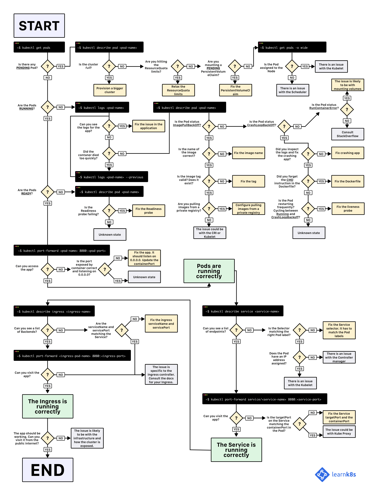

# Kubernetes Troubleshooting

1. [Introduction](#introduction)
2. [Kubernetes Events](#kubernetes-events)
3. [Kubernetes Network Troubleshooting](#kubernetes-network-troubleshooting)
4. [Exit Codes in Containers and Kubernetes](#exit-codes-in-containers-and-kubernetes)
5. [ImagePullBackOff](#imagepullbackoff)
6. [CrashLoopBackOff](#crashloopbackoff)
7. [Failed to Create Pod Sandbox](#failed-to-create-pod-sandbox)
8. [Terminated with exit code 1 error](#terminated-with-exit-code-1-error)
9. [Pod in Terminating or Unknown Status](#pod-in-terminating-or-unknown-status)
10. [OOM Kills](#oom-kills)
11. [Pause Container](#pause-container)
12. [Preempted Pod](#preempted-pod)
13. [Evited Pods](#evited-pods)
14. [Stuck Namespace](#stuck-namespace)
15. [Access PVC Data without the POD](#access-pvc-data-without-the-pod)
16. [CoreDNS issues](#coredns-issues)
17. [Debugging Techniques and Strategies. Debugging with ephemeral containers](#debugging-techniques-and-strategies-debugging-with-ephemeral-containers)
18. [Troubleshooting Tools](#troubleshooting-tools)
     1. [Komodor](#komodor)
     2. [Palaemon](#palaemon)
     3. [cdebug and debug-ctr](#cdebug-and-debug-ctr)
     4. [kubectl-debug](#kubectl-debug)
     5. [Kubeshark](#kubeshark)
19. [Slides](#slides)
20. [Images](#images)
21. [Tweets](#tweets)

## Introduction

- [==learnk8s.io: A visual guide on troubleshooting Kubernetes deployments== 🌟](https://learnk8s.io/troubleshooting-deployments)
- [managedkube.com: Troubleshooting a Kubernetes ingress](https://managedkube.com/kubernetes/trace/ingress/service/port/not/matching/pod/k8sbot/2019/02/13/trace-ingress.html)
- [thenewstack.io: 5 Best Practices to Back up Kubernetes](https://thenewstack.io/5-best-practices-to-back-up-kubernetes/)
- [medium: Common Kubernetes Errors Made by Beginners [2021] 🌟](https://medium.com/nerd-for-tech/common-kubernetes-errors-made-by-beginners-274b50e18a01)
- [cloud.redhat.com: Troubleshooting Sandboxed Containers Operator](https://cloud.redhat.com/blog/sandboxed-containers-operator-from-zero-to-hero-the-hard-way-part-2)
- [andydote.co.uk: The Problem with CPUs and Kubernetes](https://andydote.co.uk/2021/06/02/os-cpus-and-kubernetes/)
- [thenewstack.io: 6 Kubernetes Best Practices to Empower Devs to Troubleshoot](https://thenewstack.io/6-kubernetes-best-practices-to-empower-devs-to-troubleshoot/)
- [youtube: 3 Ways to Detect Evil "Latest" Image Tags in Kubernetes - Kubevious](https://www.youtube.com/watch?v=93RlMqO4glM&t=6s&ab_channel=Kubevious) The "latest" image tag is a disaster waiting to happen. In this video, you will learn how to detect usage of the latest images using 3 different methods.
- [thenewstack.io: Living with Kubernetes: Debug Clusters in 8 Commands 🌟](https://thenewstack.io/living-with-kubernetes-debug-clusters-in-8-commands/)
- [freecodecamp.org: How to Simplify Kubernetes Troubleshooting](https://www.freecodecamp.org/news/how-to-simplify-kubernetes-troubleshooting/)
    - When people focusing more on the security of containers, distroless based images are frequently used to reduce the attack surface. In these images, the package manager, the non-dependent modules or libraries, even the shells are stripped off, only the app and its required dependencies are kept. For the statically linked executable, produced by golang for example, we can even use “scratch” as the base.
    - The potential exploit of vulnerability is therefore greatly reduced. But, on the other hand, it is difficult to troubleshoot the application if even the shell is not available, leaving only the logs from the app.
    - In this paper, we will explore different options to facilitate debugging by bringing back the shell.
- [==speakerdeck.com/mhausenblas (redhat): Troubleshooting Kubernetes apps==](https://speakerdeck.com/mhausenblas/kubecologne-keynote-troubleshooting-kubernetes-apps)
- [==research.nccgroup.com: Detection Engineering for Kubernetes clusters==](https://research.nccgroup.com/2021/11/10/detection-engineering-for-kubernetes-clusters/) In this article you will learn how to detect anomalies in your cluster using Kubernetes Audit logs and Anomalies Detection Engineering.
- [==sysdig.com: Understanding Kubernetes pod pending problems==](https://sysdig.com/blog/kubernetes-pod-pending-problems/)
- [==blog.alexellis.io: How to Troubleshoot Applications on Kubernetes== 🌟](https://blog.alexellis.io/troubleshooting-on-kubernetes/) In this article, you will learn a practical framework to troubleshoot applications deployed on Kubernetes:
    - Is it there?
    - Why isn't it working?
    - It starts, but doesn't work
    - There are too many pods!
    - But can you `curl` it?
- [martinheinz.dev: Backup-and-Restore of Containers with Kubernetes Checkpointing API](https://martinheinz.dev/blog/85) Kubernetes v1.25 introduced Container Checkpointing API as an alpha feature. This provides a way to backup-and-restore containers running in Pods, without ever stopping them. This feature is primarily aimed at forensic analysis, but general backup-and-restore is something any Kubernetes user can take advantage of. So, let's take a look at this brand-new feature and see how we can enable it in our clusters and leverage it for backup-and-restore or forensic analysis.
- [thenewstack.io: What David Flanagan Learned Fixing Kubernetes Clusters](https://thenewstack.io/what-david-flanagan-learned-fixing-kubernetes-clusters/) David Flanagan has fixed 50+ Kubernetes clusters as part of his YouTube series, 'Klustered.' He shared what he learned at Civo Navigate.
- [==github.com/metaleapca: metaleap-k8s-troubleshooting.pdf== 🌟🌟🌟](https://github.com/metaleapca/metaleap-k8s-troubleshooting/blob/main/metaleap-k8s-troubleshooting.pdf)
- [learnitguide.net: How To Troubleshoot Kubernetes Pods](https://www.learnitguide.net/2023/04/how-to-troubleshoot-kubernetes-pods.html)
- [learnitguide.net: How to Check Memory Usage of a Pod in Kubernetes?](https://www.learnitguide.net/2023/04/how-to-check-memory-usage-of-pod-in.html)
- [thenewstack.io: Kubernetes Troubleshooting Primer](https://thenewstack.io/kubernetes-troubleshooting-primer/) A quick methodology for overcoming common error messages with examples of commands to help — useful for both the administrator and developer alike.
- [devzero.io: Kubernetes Debugging Tips](https://www.devzero.io/blog/kubernetes-debugging-tips)

## Kubernetes Events

- [groundcover.com: Failure Is an Option: How to Stay on Top of K8s Container Events](https://www.groundcover.com/blog/k8s-container-events) Gain a deep understanding of how Kubernetes tracks container and Pod status, how it reports error information and how you can collect all of the above in an efficient way
- [decisivedevops.com: Kubernetes Events — News feed of your cluster](https://decisivedevops.com/kubernetes-events-news-feed-of-your-kubernetes-cluster-826e08892d7a/) Understand Kubernetes Events and learn to use kubectl events to monitor and troubleshoot your cluster’s issues effectively.

## Kubernetes Network Troubleshooting


## Exit Codes in Containers and Kubernetes

- [==komodor.com: Exit Codes In Containers & Kubernetes – The Complete Guide==  🌟](https://komodor.com/learn/exit-codes-in-containers-and-kubernetes-the-complete-guide/) In this article, you will learn everything there is to know about exit codes used by container engines to indicate reasons for container termination.

## ImagePullBackOff


## CrashLoopBackOff

- [devtron.ai: Troubleshoot: Pod Crashloopbackoff](https://devtron.ai/blog/troubleshoot_crashloopbackoff_pod/)
- [erkanerol.github.io: I wish pods were fully restartable](https://erkanerol.github.io/post/restartable-pods/) Why are Pod not fully restartable in Kubernetes? Why is Kubernetes not restarting the Pod in **CrashLoopBackOff**?
- [sysdig.com: What is Kubernetes CrashLoopBackOff? And how to fix it 🌟](https://sysdig.com/blog/debug-kubernetes-crashloopbackoff/) CrashLoopBackOff is a Kubernetes state representing a restart loop that is happening in a Pod: a container in the Pod is started but crashes and is then restarted over and over again. Learn what it is and how to fix it in this article

## Failed to Create Pod Sandbox


## Terminated with exit code 1 error


## Pod in Terminating or Unknown Status


## OOM Kills

- [cloudyuga.guru: How does Kubernetes assign QoS class to pods through OOM score?](https://cloudyuga.guru/hands_on_lab/k8s-qos-oomkilled) This article discusses how to handle OOMKilled errors and how to configure Pod QoS to avoid them
- [sysdig.com: Kubernetes OOM and CPU Throttling](https://sysdig.com/blog/troubleshoot-kubernetes-oom/) Troubleshooting Memory and CPU problems. Do you know how memory and CPU usage can affect your cloud applications? In this article, you will discuss Out of Memory (OOM) and Throttling in Kubernetes.
    - This article delves into the issue of "Invisible OOM Kills" in Kubernetes, where child processes getting OOM Killed go unnoticed.
    - An “Invisible” OOM Kill occurs when a child process in a container ( any process which is not the main process, PID 1 ) gets OOM Killed. In that scenario, the OOM Kill that occurred is “invisible” to Kubernetes, and as users we wouldn’t be aware of it.
    - The Solution: The entire scenario changes with Kubernetes version 1.28. Starting from that version, Kubernetes enables, by default, a cgroup v2 feature known as “cgroup grouping.”

## Pause Container


## Preempted Pod


## Evited Pods

- [sysdig.com: Understanding Kubernetes Evicted Pods](https://sysdig.com/blog/kubernetes-pod-evicted/) What does it mean that Kubernetes Pods are evicted? They are terminated, usually due to a lack of resources. But why does this happen?

## Stuck Namespace


## Access PVC Data without the POD


## CoreDNS issues


## Debugging Techniques and Strategies. Debugging with ephemeral containers

- [kubectl-debug](https://github.com/aylei/kubectl-debug)
- [==loft.sh: Using Kubernetes Ephemeral Containers for Troubleshooting==](https://loft.sh/blog/using-kubernetes-ephemeral-containers-for-troubleshooting/)
- [KDBG: Small Kubernetes debugging container](https://github.com/nvucinic/kdbg) KDBG (Kubernetes Debuger) is a small docker container based on lastest Alpine Linux image, used for debugging Kubernetes clusters from inside a pod.
- [inspektor-gadget](https://github.com/kinvolk/inspektor-gadget) Collection of gadgets for debugging and introspecting Kubernetes applications using BPF
    - [kinvolk.io](https://kinvolk.io)
- [StatusBay](https://github.com/similarweb/statusbay) is a tool that provides the missing visibility into the K8S deployment process. The main goal is to ease the experience of troubleshooting and debugging services in K8S and provide confidence while making changes.
- [codefresh.io: Using Telepresence 2 for Kubernetes debugging and local development](https://codefresh.io/kubernetes-tutorial/telepresence-2-local-development/)
- [rookout.com: The Definitive Guide To Kubernetes Application Debugging](https://www.rookout.com/blog/kubernetes-application-debugging)
- [thorsten-hans.com: Debugging apps in Kubernetes with Bridge](https://www.thorsten-hans.com/debugging-apps-in-kubernetes-with-bridge/) Bridge to Kubernetes simplifies and streamlines the process of debugging applications running in Kubernetes. Debug any language using the tools you prefer and love.
    - [marketplace.visualstudio.com: Bridge to Kubernetes (VSCode)](https://marketplace.visualstudio.com/items?itemName=mindaro.mindaro)
    - [marketplace.visualstudio.com: Bridge to Kubernetes (Visual Studio)](https://marketplace.visualstudio.com/items?itemName=ms-azuretools.mindaro) Bridge to Kubernetes for Visual Studio 2019
- [==thenewstack.io: Living with Kubernetes: 12 Commands to Debug Your Workloads== 🌟](https://thenewstack.io/living-with-kubernetes-12-commands-to-debug-your-workloads/) **Kubernetes can't fix broken code. But if your container won't start or the app gets intermittent errors, here's how you can start debugging it. Most of the commands presented in the article will use kubectl or plugins which you can install via krew.**
- [==opensource.googleblog.com: Introducing Ephemeral Containers==](https://opensource.googleblog.com/2022/01/Introducing%20Ephemeral%20Containers.html) **Ephemeral containers are a new type of container that are part of the Kubernetes core API. An Ephemeral Container may be added to an existing Pod for administrative actions like debugging, it runs until it exits, and it won't be restarted. An ephemeral container runs within the Pod's existing resource allocation and shares common container namespaces.**
- [linkedin.com: Kubernetes Ephemeral Containers | Bibin Wilson](https://www.linkedin.com/pulse/kubernetes-ephemeral-containers-bibin-wilson/) Ephemeral Containers is one of the k8s beta features. The following command will add the debug-image container to the running frontend pod and take an exec session for debugging: ```kubectl debug -it pods/frontend --image=debug-image```
- [iximiuz.com: Kubernetes Ephemeral Containers and kubectl debug Command 🌟](https://iximiuz.com/en/posts/kubernetes-ephemeral-containers/) Learn how to use Ephemeral Containers to debug Kubernetes workloads with and without the kubectl debug command
- [labs.iximiuz.com: How to work with container images using ctr](https://labs.iximiuz.com/courses/containerd-cli/ctr/image-management) ctr is a command-line client shipped as part of the containerd project. If you have containerd running on a machine, chances are the ctr binary is also present there.

## Troubleshooting Tools

- [github.com/replicatedhq/troubleshoot](https://github.com/replicatedhq/troubleshoot) Troubleshoot is a framework for collecting and analyzing diagnostic information about a Kubernetes cluster. The framework is customizable and allows third-party application developers to create troubleshoot specs that can be run by cluster operators.
- [github.com/airwallex: k8s-pod-restart-info-collector](https://github.com/airwallex/k8s-pod-restart-info-collector) k8s-pod-restart-info-collector is a simple Kubernetes customer controller that watches for Pods changes and collects K8s Pod restart reasons, logs, and events to Slack channels when a Pod restarts

### Komodor

- [==komodor.com==](https://komodor.com) Turn troubleshooting chaos into clarity. Komodor is an observability tool that gives you insight into what’s happening with your clusters and workloads. It integrates tools that we all use, like Datadog, Okta, LaunchDarkly, and PagerDuty.
- [==komodor.com: Kubernetes Troubleshooting: The Complete Guide== 🌟](https://komodor.com/learn/kubernetes-troubleshooting-the-complete-guide/)

### Palaemon


### cdebug and debug-ctr

- [==iximiuz/cdebug==](https://github.com/iximiuz/cdebug) a swiss army knife of container debugging. It's like "docker exec", but it works even for containers without a shell (scratch, distroless, slim, etc). The "cdebug exec" command allows you to bring your own toolkit and start a shell inside of a running container.
- [==felipecruz91/debug-ctr==](https://github.com/felipecruz91/debug-ctr) A commandline tool for interactive troubleshooting when a container has crashed or a container image doesn't include debugging utilities, such as distroless images. Heavily inspired by kubectl debug, but for containers instead of Pods.

### kubectl-debug

- [github.com/JamesTGrant/kubectl-debug](https://github.com/JamesTGrant/kubectl-debug) kubectl-debug is a tool that lets you debug a target container in a Kubernetes cluster by automatically creating a new, non-invasive, 'debug' container in the same PID, network, user, and IPC namespace as the target container without any disruption

### Kubeshark

- [kubetools.io: Kubeshark – API Traffic Analyzer for Kubernetes](https://www.kubetools.io/kubernetes/mastering-kubernetes-debugging-and-troubleshooting-with-kubeshark-real-time-visibility-query-language-service-map-and-integrations/)

## Slides

??? note "Click to expand!"

    <center>
    <iframe class="speakerdeck-iframe" frameborder="0" src="https://speakerdeck.com/player/e1c397b2aa67470e9204f82f938fec78?slide=1" title="KubeCologne keynote—Troubleshooting Kubernetes apps" allowfullscreen="true" mozallowfullscreen="true" webkitallowfullscreen="true" style="border: 0px; background: padding-box padding-box rgba(0, 0, 0, 0.1); margin: 0px; padding: 0px; border-radius: 6px; box-shadow: rgba(0, 0, 0, 0.2) 0px 5px 40px; width: 560px; height: 314px;" data-ratio="1.78343949044586"></iframe>
    </center>

## Images

??? note "Click to expand!"

    <center>
    [{: style="width:30%"}](https://learnk8s.io/troubleshooting-deployments)
    </center>

## Tweets

??? note "Click to expand!"

    <center>
    <blockquote class="twitter-tweet"><p lang="en" dir="ltr">My top 8 commands and tools for debugging applications running on <a href="https://twitter.com/kubernetesio?ref_src=twsrc%5Etfw">@kubernetesio</a> 🧵👇</p>&mdash; Daniel Bryant (@danielbryantuk) <a href="https://twitter.com/danielbryantuk/status/1492893332850237444?ref_src=twsrc%5Etfw">February 13, 2022</a></blockquote> <script async src="https://platform.twitter.com/widgets.js" charset="utf-8"></script>
    <blockquote class="twitter-tweet"><p lang="en" dir="ltr">What is your favourite Kubernetes troubleshooting command? Looking for some new ones 😉</p>&mdash; Saiyam Pathak (@SaiyamPathak) <a href="https://twitter.com/SaiyamPathak/status/1513572111721271298?ref_src=twsrc%5Etfw">April 11, 2022</a></blockquote> <script async src="https://platform.twitter.com/widgets.js" charset="utf-8"></script>

    <blockquote class="twitter-tweet"><p lang="en" dir="ltr">I made a tool... to debug containers 🧙‍♂️<br><br>It&#39;s like &quot;docker exec&quot;, but it works even for containers without a shell (scratch, distroless, slim, etc).<br><br>The &quot;cdebug exec&quot; command allows you to bring your own toolkit and start a shell inside of a running container.<br><br>A short demo 👇 <a href="https://t.co/82m4vzPYJr">pic.twitter.com/82m4vzPYJr</a></p>&mdash; Ivan Velichko (@iximiuz) <a href="https://twitter.com/iximiuz/status/1584244173347074049?ref_src=twsrc%5Etfw">October 23, 2022</a></blockquote> <script async src="https://platform.twitter.com/widgets.js" charset="utf-8"></script>

    <blockquote class="twitter-tweet"><p lang="en" dir="ltr">There is a Kubernetes deployment which processes items from a queue. Most items are very small and completed immediately. Occasionally a whopping big item comes along and causes an OOMKill. Retries don&#39;t help for obvious reasons.<br><br>How would you solve it?</p>&mdash; Natan Yellin (@aantn) <a href="https://twitter.com/aantn/status/1597653772255346691?ref_src=twsrc%5Etfw">November 29, 2022</a></blockquote> <script async src="https://platform.twitter.com/widgets.js" charset="utf-8"></script>

    <blockquote class="twitter-tweet"><p lang="en" dir="ltr">How does Pod to Pod communication work in Kubernetes?<br><br>How does the traffic reach the pod?<br><br>Let&#39;s dive into how low-level networking works in Kubernetes. <a href="https://t.co/K8bBT8YiOf">pic.twitter.com/K8bBT8YiOf</a></p>&mdash; Daniele Polencic — @danielepolencic@hachyderm.io (@danielepolencic) <a href="https://twitter.com/danielepolencic/status/1655540892365889538?ref_src=twsrc%5Etfw">May 8, 2023</a></blockquote> <script async src="https://platform.twitter.com/widgets.js" charset="utf-8"></script>
    </center>