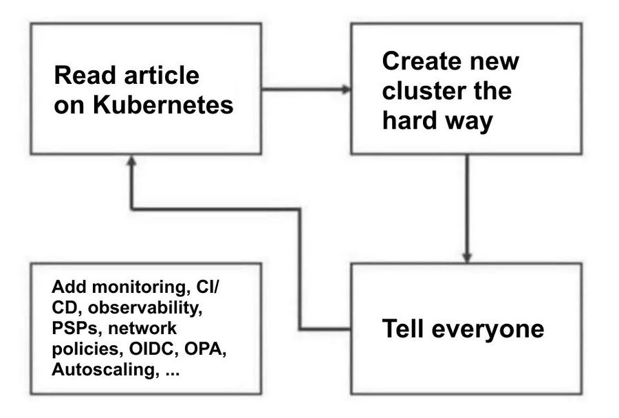
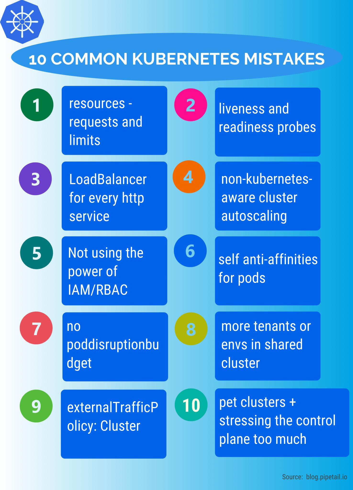
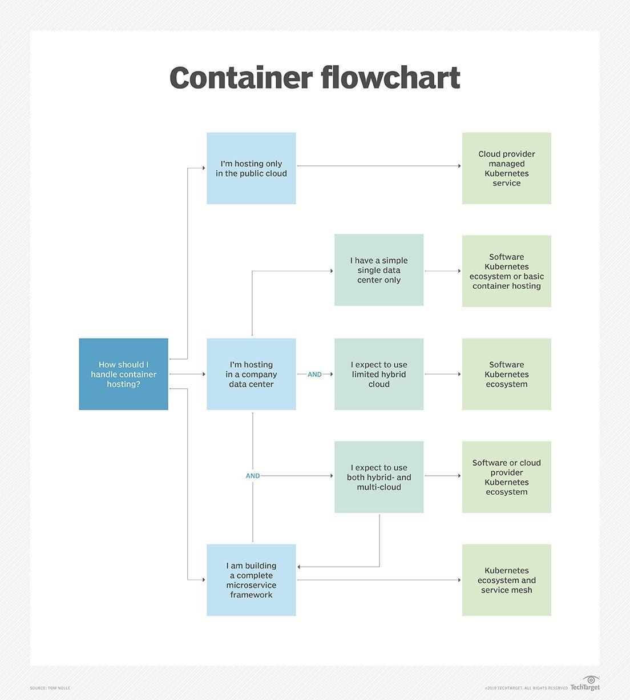
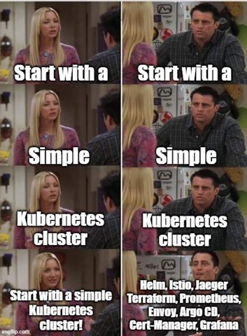

# Kubernetes

{==*"Kubernetes is not for application development but for platform development. Its magic is in enterprise standardization, not app portability" (Kelsey Hightower)*==}

1. [Must know Kubernetes concepts](#must-know-kubernetes-concepts)
2. [Introduction](#introduction)
    1. [Kubernetes Jobs Market](#kubernetes-jobs-market)
    2. [Certified Kubernetes Offerings](#certified-kubernetes-offerings)
    3. [The State of Cloud-Native Development](#the-state-of-cloud-native-development)
    4. [Kubernetes Failure Stories](#kubernetes-failure-stories)
    5. [Kubernetes Maturity Model](#kubernetes-maturity-model)
    6. [Cloud Native Learn by doing platforms](#cloud-native-learn-by-doing-platforms)
    7. [Kubernetes Scalability Thresholds](#kubernetes-scalability-thresholds)
    8. [Kubernetes Installation Methods](#kubernetes-installation-methods)
    9. [Kubernetes Knowledge Hubs](#kubernetes-knowledge-hubs)
        1. [Kubernetes Podcasts](#kubernetes-podcasts)
        2. [Kubernetes Blogs](#kubernetes-blogs)
        3. [Spanish Kubernetes Blogs](#spanish-kubernetes-blogs)
3. [Kubernetes Open Source Container Orchestation](#kubernetes-open-source-container-orchestation)
    1. [KubeCon](#kubecon)
    2. [kubeconfig](#kubeconfig)
    3. [Kubernetes Manifests](#kubernetes-manifests)
    4. [Docker and Kubernetes](#docker-and-kubernetes)
        1. [Kubernetes vs Docker](#kubernetes-vs-docker)
        2. [Kubernetes vs Docker Swarm](#kubernetes-vs-docker-swarm)
    5. [Kubernetes Admission Controllers](#kubernetes-admission-controllers)
    6. [Kubernetes Mutating Webhooks](#kubernetes-mutating-webhooks)
    7. [Kubernetes Cloud Controller Manager](#kubernetes-cloud-controller-manager)
    8. [Kubernetes Resources](#kubernetes-resources)
        1. [Kubernetes Pods](#kubernetes-pods)
        2. [Kubernetes ConfigMaps](#kubernetes-configmaps)
        3. [Kubernetes Secrets](#kubernetes-secrets)
        4. [Kubernetes Volumes](#kubernetes-volumes)
        5. [Kubernetes Namespaces and Multi Tenancy. Self Service Namespaces](#kubernetes-namespaces-and-multi-tenancy-self-service-namespaces)
            1. [Kiosk Multi-Tenancy Extension for Kubernetes](#kiosk-multi-tenancy-extension-for-kubernetes)
            2. [Creating Users](#creating-users)
        6. [Kubernetes Labels and Selectors](#kubernetes-labels-and-selectors)
        7. [Kubernetes Taints and Tolerations](#kubernetes-taints-and-tolerations)
        8. [Kubernetes Deployment, ReplicaSet, Rollling Updates and Rollbacks](#kubernetes-deployment-replicaset-rollling-updates-and-rollbacks)
        9. [Kubernetes StatefulSet](#kubernetes-statefulset)
        10. [Kubernetes DaemonSets](#kubernetes-daemonsets)
        11. [Kubernetes Jobs and Cron Jobs](#kubernetes-jobs-and-cron-jobs)
        12. [Kubernetes Services](#kubernetes-services)
    9. [Kubernetes Deployment Strategies](#kubernetes-deployment-strategies)
    10. [Kubernetes API](#kubernetes-api)
         1. [Multi-Cluster Services API](#multi-cluster-services-api)
    11. [Kubernetes Health Checks/Probes. Startup, Liveness, Readiness](#kubernetes-health-checksprobes-startup-liveness-readiness)
    12. [Reserved CPU and memory in Kubernetes nodes](#reserved-cpu-and-memory-in-kubernetes-nodes)
    13. [Kubernetes Quality of Service QOS. Kubernetes Resource and Capacity Management. Capacity Planning. Resource Quotas per namespace, LimitRanges per namespace, Limits and Requests per POD](#kubernetes-quality-of-service-qos-kubernetes-resource-and-capacity-management-capacity-planning-resource-quotas-per-namespace-limitranges-per-namespace-limits-and-requests-per-pod)
    14. [Kubernetes Scheduler. Kube Scheduler](#kubernetes-scheduler-kube-scheduler)
         1. [Pod rebalancing and allocations. Pod Priorities](#pod-rebalancing-and-allocations-pod-priorities)
    15. [Kubernetes etcd](#kubernetes-etcd)
    16. [Kubernetes Sidecars](#kubernetes-sidecars)
    17. [Kubernetes Annotations](#kubernetes-annotations)
    18. [Kubernetes Best Practices and Tips](#kubernetes-best-practices-and-tips)
    19. [Disruptions](#disruptions)
    20. [Cost Estimation Strategies](#cost-estimation-strategies)
         1. [kubecost](#kubecost)
    21. [Architecting Kubernetes clusters. Node Size. Multi Clusters and Hybrid Cloud](#architecting-kubernetes-clusters-node-size-multi-clusters-and-hybrid-cloud)
         1. [Wide Cluster instead of Multi-Cluster](#wide-cluster-instead-of-multi-cluster)
4. [Client Libraries for Kubernetes](#client-libraries-for-kubernetes)
5. [Helm Kubernetes Tool](#helm-kubernetes-tool)
6. [Templating YAML in Kubernetes with real code. YQ YAML processor](#templating-yaml-in-kubernetes-with-real-code-yq-yaml-processor)
7. [Extending Kubernetes](#extending-kubernetes)
    1. [Adding Custom Resources. Extending Kubernetes API with Kubernetes Resource Definitions. CRD vs Aggregated API](#adding-custom-resources-extending-kubernetes-api-with-kubernetes-resource-definitions-crd-vs-aggregated-api)
    2. [Krew, a plugin manager for kubectl plugins](#krew-a-plugin-manager-for-kubectl-plugins)
    3. [OpenKruise/Kruise](#openkruisekruise)
    4. [Crossplane, a Universal Control Plane API for Cloud Computing. Crossplane Workloads Definitions](#crossplane-a-universal-control-plane-api-for-cloud-computing-crossplane-workloads-definitions)
8. [Kubernetes Community](#kubernetes-community)
    1. [Community Forums](#community-forums)
    2. [Kubernetes Special Interest Groups (SIGs)](#kubernetes-special-interest-groups-sigs)
        1. [Kubernetes SIG's Repos](#kubernetes-sigs-repos)
        2. [Kubectl Plugins](#kubectl-plugins)
9. [Enforcing Policies and governance for kubernetes workloads with Conftest](#enforcing-policies-and-governance-for-kubernetes-workloads-with-conftest)
10. [Kubernetes Patterns and Antipatterns. Service Discovery](#kubernetes-patterns-and-antipatterns-service-discovery)
11. [Kubernetes Scheduling and Scheduling Profiles](#kubernetes-scheduling-and-scheduling-profiles)
     1. [Assigning Pods to Nodes. NodeSelector, Pod Affinity and Anti-Affinity](#assigning-pods-to-nodes-nodeselector-pod-affinity-and-anti-affinity)
     2. [Pod Topology Spread Constraints and PodTopologySpread Scheduling Plugin](#pod-topology-spread-constraints-and-podtopologyspread-scheduling-plugin)
12. [Cloud Development Kit (CDK) for Kubernetes](#cloud-development-kit-cdk-for-kubernetes)
     1. [AWS Cloud Development Kit (AWS CDK)](#aws-cloud-development-kit-aws-cdk)
13. [Serverless with OpenFaas and Knative](#serverless-with-openfaas-and-knative)
14. [Virtual Kubernetes Clusters](#virtual-kubernetes-clusters)
15. [Multi-Cluster Federation. Hybrid Cloud Setup Tools](#multi-cluster-federation-hybrid-cloud-setup-tools)
     1. [KubeFed](#kubefed)
     2. [KubeCarrier](#kubecarrier)
     3. [Red Hat Operator Lifecycle Manager (OLM)](#red-hat-operator-lifecycle-manager-olm)
     4. [Istio Service Mesh](#istio-service-mesh)
16. [Multi-Regional Architecture](#multi-regional-architecture)
17. [Kubernetes in Kubernetes](#kubernetes-in-kubernetes)
18. [Kubernetes Scripts](#kubernetes-scripts)
     1. [Kubernetes and Ansible](#kubernetes-and-ansible)
19. [Spot instances in Kubernetes](#spot-instances-in-kubernetes)
20. [Kubernetes on Windows](#kubernetes-on-windows)
21. [Kubernetes Incident Report Plan IRP](#kubernetes-incident-report-plan-irp)
22. [Kubernetes Certifications. CKA, CKAD and CKS](#kubernetes-certifications-cka-ckad-and-cks)
23. [Books and eBooks](#books-and-ebooks)
     1. [Kubernetes Patterns eBooks](#kubernetes-patterns-ebooks)
     2. [Famous Kubernetes ebooks of 2019](#famous-kubernetes-ebooks-of-2019)
24. [Famous Kubernetes resources of 2019](#famous-kubernetes-resources-of-2019)
25. [Famous Kubernetes resources of 2020](#famous-kubernetes-resources-of-2020)
26. [Compliant Kubernetes](#compliant-kubernetes)
27. [PCI SSC (Payment Card Industry Security Standards Council)](#pci-ssc-payment-card-industry-security-standards-council)
28. [Kubernetes Slack Channel](#kubernetes-slack-channel)
29. [Bunch of images](#bunch-of-images)
30. [Videos](#videos)
31. [Spanish Videos](#spanish-videos)
32. [Tweets](#tweets)
33. [Tweets 2](#tweets-2)
34. [Memes](#memes)

<center>
<iframe width="100%" height="166" scrolling="no" frameborder="no" allow="autoplay" src="https://w.soundcloud.com/player/?url=https%3A//api.soundcloud.com/tracks/410107842&color=%23ff5500&auto_play=false&hide_related=false&show_comments=true&show_user=true&show_reposts=false&show_teaser=true"></iframe><div style="font-size: 10px; color: #cccccc;line-break: anywhere;word-break: normal;overflow: hidden;white-space: nowrap;text-overflow: ellipsis; font-family: Interstate,Lucida Grande,Lucida Sans Unicode,Lucida Sans,Garuda,Verdana,Tahoma,sans-serif;font-weight: 100;"><a href="https://soundcloud.com/hugoboomin" title="Hugo Boomin ⚡️ 🔥 💥" target="_blank" style="color: #cccccc; text-decoration: none;">Hugo Boomin ⚡️ 🔥 💥</a> · <a href="https://soundcloud.com/hugoboomin/jimmy-sax-live-at-nikki-beach-st-tropez-opus-eric-prydz" title="Jimmy Sax - Live At Nikki Beach St Tropez (Opus - Eric Prydz)" target="_blank" style="color: #cccccc; text-decoration: none;">Jimmy Sax - Live At Nikki Beach St Tropez (Opus - Eric Prydz)</a></div>
</center>

## Must know Kubernetes concepts

- Workloads: Node, Cluster, Pod, Namespace
- Pod Controllers: Deployment, ReplicaSet, DaemonSet, StatefulSet, HPA PodDisruptionBudget, Job, CronJob
- Configuration: ConfigMaps, Secrets
- Networking: Ingress, Service, Network Policy

## Introduction

- [Wikipedia.org: Kubernetes](https://en.wikipedia.org/wiki/Kubernetes)
- [cloud.google.com: What is Kubernetes? 🌟](https://cloud.google.com/learn/what-is-kubernetes)
- [Kubernetes Glossary 🌟](https://www.bluematador.com/learn/kubernetes-glossary)
- [=="Kubernetes magic is in enterprise standardization, not app portability"== (Kelsey Hightower) 🌟](https://www.techrepublic.com/article/kubernetes-magic-is-in-enterprise-standardization-not-app-portability/)
- [twitter.com/kubernetesio](https://twitter.com/kubernetesio)
- [techbeacon.com: 25 Kubernetes experts you should follow on Twitter](https://techbeacon.com/enterprise-it/25-kubernetes-experts-you-should-follow-twitter)
- [enterprisersproject.com: Kubernetes: Everything you need to know (2020) 🌟](https://enterprisersproject.com/article/2020/4/kubernetes-everything-you-need-know)
- [padok.fr: Kubernetes’ Architecture: Understanding the components and structure of clusters 🌟](https://www.padok.fr/en/blog/kubernetes-architecture-clusters)
- [opensource.com: Explaining Kubernetes in 10 minutes using an analogy](https://opensource.com/article/20/7/kubernetes-analogy)
- [medium: A Practical Step-by-Step Guide to Understanding Kubernetes](https://medium.com/better-programming/a-practical-step-by-step-guide-to-understanding-kubernetes-d8be7f82e533) Deploy a distributed application and understand key underlying concepts.
- [medium: Kubernetes, a practical introduction](https://medium.com/nexton/kubernetes-a-practical-introduction-18a5b69e7763)
- [itnext.io: Kubernetes is Hard! 🌟](https://itnext.io/kubernetes-is-hard-190f1d0c6d36) But, where there’s Kubernetes, there’s a way!
- [medium: Starting with kubernetes](https://medium.com/@thomaspoignant/starting-with-kubernetes-db121b09fd4)
- [thenewstack.io: Kubernetes Is the New Standard for Computing, Including the Edge](https://thenewstack.io/kubernetes-is-the-new-standard-for-computing-including-the-edge/)
- [thenewstack.io: How does kubernetes work?](https://thenewstack.io/how-does-kubernetes-work/)
- [cloudsavvyit.com: How Does Kubernetes Work?](https://www.cloudsavvyit.com/10110/how-does-kubernetes-work/)
- [elmanytas.es: Kubernetes para impostores III](http://elmanytas.es/?q=node/358)
- [enterprisersproject.com: How to explain Kubernetes in plain English](https://enterprisersproject.com/article/2017/10/how-explain-kubernetes-plain-english) How do you explain Kubernetes and orchestration to non-technical people? Listen to the experts
- [maximilianmichels.com: Kubernetes in a Nutshell: 10 Things You Need to Know](https://maximilianmichels.com/2021/kubernetes-what-you-need-to-know/)
- [brennerm.github.io: Kubernetes Overview Diagrams 🌟](https://brennerm.github.io/posts/kubernetes-overview-diagrams.html#architecture)
- [thenewstack.io: Kubernetes Lifecycle Management! So Important! (Day 0, Day 1, Day 2) 🌟](https://thenewstack.io/kubernetes-lifecycle-management-so-important-what-does-it-mean)
- [lemoncode.net: Hola Kubernetes: Definiciones 🌟](https://lemoncode.net/lemoncode-blog/2021/3/17/hola-kubernetes-definiciones)
- [opensource.com: A beginner's guide to Kubernetes container orchestration](https://opensource.com/article/20/6/container-orchestration) Understanding the building blocks of container orchestration makes it easier to get started with Kubernetes.
- [luminousmen.com: Kubernetes 101](https://luminousmen.com/post/kubernetes-101)
- [css-tricks.com: Kubernetes Explained Simply: Containers, Pods and Images](https://css-tricks.com/kubernetes-explained-simply-containers-pods-and-images/)
- [auth0.com: Kubernetes Tutorial - Step by Step Introduction to Basic Concepts](https://auth0.com/blog/kubernetes-tutorial-step-by-step-introduction-to-basic-concepts/) Learn about the basic Kubernetes concepts while deploying a sample application on a real cluster.
- [thenewstack.io: Why developers should learn kubernetes](https://thenewstack.io/why-developers-should-learn-kubernetes/)
- [thenewstack.io: This Week in Programming: Kubernetes from Day One? 🌟](https://thenewstack.io/this-week-in-programming-kubernetes-from-day-one/)
- [==nextplatform.com: KUBERNETES EXPANDS FROM CONTAINERS TO INFRASTRUCTURE MANAGEMENT== 🌟](https://www.nextplatform.com/2021/08/02/kubernetes-expands-from-containers-to-infrastructure-management) **More and more in the middleware layer, not in the hardware**
- [thenewstack.io: Monolithic Development Practices Kill Powerful Kubernetes Benefits 🌟🌟](https://thenewstack.io/monolithic-development-practices-kill-powerful-kubernetes-benefits/) **"It’s not about the economy of data, it’s about speed and nimbleness of data. The benefits of using Kubernetes and microservices is incredible — just make sure you know how to fully wield its power!"**
- [dev.to: Getting Started Tutorial for Learning Kubernetes 🌟](https://dev.to/chefgs/getting-started-tutorial-for-learning-kubernetes-455e)
- [tech.showmax.com: Developers' basic guide to kubernetes](https://tech.showmax.com/2021/08/developers-101-kubernetes/)
- [dev.to: How to start with Kubernetes for begginer](https://dev.to/dhirajpatra/how-to-start-with-kubernetes-for-begginer-309e)
- [blogs.mulesoft.com - K8s: 8 questions about Kubernetes](https://blogs.mulesoft.com/dev/resources-dev/k8s-kubernetes/)
- [devcentral.f5.com: What is Kubernetes?](https://devcentral.f5.com/s/articles/What-is-Kubernetes)
- [docs.google.com: Kubernetes For Everyone 🌟🌟](https://docs.google.com/document/d/1p4ZYQYM2VrMCR8K3T68JOMzWHlV-C8Jogrl9Ces77OA)  A consolidated document on Kubernetes by: Pavan Belagatti
- [hackernoon.com: The Ultimate Beginners Guide To Kubernetes and Container Orchestration](https://hackernoon.com/the-ultimate-beginners-guide-to-kubernetes-and-container-orchestration-5d83354y)
- [k21academy.com: Kubernetes Architecture. An Introduction to Kubernetes Components](https://k21academy.com/docker-kubernetes/kubernetes-architecture-components-overview-for-beginners/)
- [dzone: Introduction To Kubernetes 🌟](https://dzone.com/articles/introduction-to-kubernetes-part-1) An orchestration tool takes care of provisioning and deployment, allocation of resources, load balancing, and many other important aspects of any system.
- [weave.works: Kubernetes components that make up its architecture 🌟](https://www.weave.works/blog/kubernetes-components-that-makeup-its-architecture) Great intro
- [dzone refcard: Advanced kubernetes 🌟](https://dzone.com/refcardz/advanced-kubernetes)
- [loginradius.com: Understanding Basics of Kubernetes](https://www.loginradius.com/engineering/blog/understanding-kubernetes/)
- [redhat.com: Kubernetes basics for sysadmins](https://www.redhat.com/sysadmin/kubernetes-basics-sysadmins) Learn when Kubernetes can be effectively used and how the containers it manages might be better than virtual machines.
- [redhat.com: Kubernetes Components - A sysadmin's guide to basic Kubernetes components 🌟](https://www.redhat.com/sysadmin/kubernetes-components) Kubernetes control plane nodes and worker nodes, their features, and how they interact.
- [learnsteps.com: How Kubernetes works on reconciler pattern 🌟](https://www.learnsteps.com/how-kubernetes-works-on-a-reconciler-pattern/)
- [devopsunlocked.com: Kubernetes: Learning Material](https://devopsunlocked.com/kubernetes-learning-material/)
- [cncf.io: Kubernetes 101: An Introduction 🌟](https://www.cncf.io/blog/2020/12/14/kubernetes-101-an-introduction/)
- [millionvisit.blogspot.com: Kubernetes for Developers #1: Kubernetes Architecture and Features 🌟](http://millionvisit.blogspot.com/2020/12/kubernetes-for-developers-1-kubernetes-architecture.html)
- [redhat.com: Start learning Kubernetes from your local machine](https://www.redhat.com/sysadmin/start-learning-kubernetes)
- [medium: Pratyush Mathur - Kubernetes Architecture](https://medium.com/@pratyush.mathur/kubernetes-architecture-82e9bc8324f1)
- [medium: Kubernetes Fundamentals For Absolute Beginners: Architecture & Components](https://medium.com/the-programmer/kubernetes-fundamentals-for-absolute-beginners-architecture-components-1f7cda8ea536)
- [learnsteps.com: What is a control plane? Basics on Kubernetes](https://www.learnsteps.com/what-is-a-control-plane-what-do-people-mean-by-this-basics-on-kubernetes/)
- [infoworld.com: No one wants to manage Kubernetes anymore 🌟](https://www.infoworld.com/article/3614850/no-one-wants-to-manage-kubernetes-anymore.html) **The availability of solid and varied managed kubernetes options has seen more and more companies shy away from managing their own clusters.**
- [eximiaco.tech: when to choose Kubernetes? 🌟](https://www.eximiaco.tech/en/2020/06/03/3-facts-to-consider-before-adopting-kubernetes/)
- [thenewstack.io: Living with Kubernetes: Cluster Upgrades 🌟](https://thenewstack.io/living-with-kubernetes-cluster-upgrades/)
- [thenewstack.io: 5 Things Developers Need to Know About Kubernetes Management](https://thenewstack.io/5-things-developers-need-to-know-about-kubernetes-management/)
- [How to handle environment variables with Kubernetes? 🌟](https://humanitec.com/blog/handling-environment-variables-with-kubernetes)
- [weave.works: The Definitive Guide to Kubernetes in Production 🌟🌟](https://www.weave.works/blog/the-definitive-guide-to-kubernetes-in-production)
- [vmblog.com: The Rise of Modern Day Kubernetes Operations](https://vmblog.com/archive/2021/10/07/the-rise-of-modern-day-kubernetes-operations.aspx)
- [elastisys.com: Evaluation of Caching Methodologies for Microservice-Based Architectures in Kubernetes](https://elastisys.com/evaluation-of-caching-methodologies/)
- [thenewstack.io: What Workloads Do Businesses Run on Kubernetes?](https://thenewstack.io/what-workloads-do-businesses-run-on-kubernetes/)
- [dzone: Getting Started With Kubernetes In 2 Days](https://dzone.com/articles/getting-started-with-kubernetes-in-2-days) Check out these tools to help you deploy and manage your K8s clusters from the ground up...
- [itnext.io: The subtleties of ensuring zero downtime during pod lifecycle events in Kubernetes](https://itnext.io/the-subtleties-of-ensuring-zero-downtime-during-pod-lifecycle-events-in-kubernetes-6461c12f7736)
- [tutorialworks.com: The differences between Docker, containerd, CRI-O and runc](https://www.tutorialworks.com/difference-docker-containerd-runc-crio-oci/) Since Docker kicked off this explosion in containers, there’s been a growing family of tools and standards to help govern how to use this technology.
- [searchitoperations.techtarget.com: Ensure Kubernetes high availability with master node planning](https://searchitoperations.techtarget.com/tip/Ensure-Kubernetes-high-availability-with-master-node-planning) Kubernetes ensures high availability in its worker nodes, but for a mission-critical workload, IT teams should take these extra steps for redundancy in the master node components.
- [thenewstack.io: The New Stack’s Top Kubernetes Stories of 2021](https://thenewstack.io/the-new-stacks-top-kubernetes-stories-of-2021/)
- [ostechnix.com: Kubernetes Features Explained In Detail](https://ostechnix.com/kubernetes-features/)
- [==kodekloud.com: Kubernetes Features Every Beginner Must Know==](https://kodekloud.com/kubernetes-features-every-beginner-must-know/)
- [learnsteps.com: Kubernetes: What to learn from a long term perspective](https://www.learnsteps.com/kubernetes-what-to-learn-from-a-long-term-perspective/)
- [==joshgav.github.io: Kubernetes isn't about containers==](https://joshgav.github.io/2021/12/16/kubernetes-isnt-about-containers.html) **Kubernetes offers a standard interface for managing software-defined infrastructure - cloud, in other words. Kubernetes is a standard API framework for cloud services.**
- [medium: Do I need to learn Kubernetes?](https://medium.com/devops-dudes/do-i-need-to-learn-kubernetes-a3dd9a7f9e9b)
- [medium.com/@david.alvares.62: Kubernetes Control Plane for newbies](https://medium.com/@david.alvares.62/kubernetes-control-plane-for-newbies-75d77f5c8456) Kubernetes has a reputation for being a very complex system, difficult to master in terms of administration and security. Today I suggest you better understand an essential component of Kubernetes: the control plane.
- [divya-mohan0209.medium.com: Getting started with K8s in 2022](https://divya-mohan0209.medium.com/getting-started-with-k8s-in-2022-1dfeb4bdc112) And a list of resources structured to help you learn!
- [==docs.google.com: Kubernetes For Everyone==](https://docs.google.com/document/d/1p4ZYQYM2VrMCR8K3T68JOMzWHlV-C8Jogrl9Ces77OA/edit)
- [medium.com/paypal-tech: Scaling Kubernetes to Over 4k Nodes and 200k Pods](https://medium.com/paypal-tech/scaling-kubernetes-to-over-4k-nodes-and-200k-pods-29988fad6ed) Learn the challenges PayPal had to face when they started scaling the cluster to over 4000 nodes and 200k pods.
- [learnsteps.com: What is kubelet and what it does: Basics on Kubernetes](https://www.learnsteps.com/what-is-kubelet-and-what-it-does-basics-on-kubernetes/)
- [pauldally.medium.com: Kubernetes Application High-Availability — Part 1 (The Very-Basic Basics)](https://pauldally.medium.com/kubernetes-application-high-availability-part-1-the-very-basic-basics-660a14fa81c7)
    - [pauldally.medium.com: Kubernetes Application High-Availability — Part 2 (More Basics)](https://pauldally.medium.com/kubernetes-application-high-availability-part-2-more-basics-a1d9f9beea75)
- [buttondown.email: Two reasons Kubernetes is so complex](https://buttondown.email/nelhage/archive/two-reasons-kubernetes-is-so-complex/)
- [==opensource.com: A guide to Kubernetes architecture==](https://opensource.com/article/22/2/kubernetes-architecture) Learn how the different components of Kubernetes architecture fit together so you can be better equipped to diagnose problems, maintain a healthy cluster, and optimize your own workflow.
- [medium.com/@olivier.gaumond: Why am I able to bind a privileged port in my container without the NET_BIND_SERVICE capability?](https://medium.com/@olivier.gaumond/why-am-i-able-to-bind-a-privileged-port-in-my-container-without-the-net-bind-service-capability-60972a4d5496)
- [==kubesphere.io: Kubernetes High Availability Essential Practices Simply Explained==](https://kubesphere.io/blogs/k8s-ha-practices/)
- [ecem.dev: Kubernetes Basics, Core Components & Yaml Files](https://ecem.dev/kubernetes-basics-core-components-yaml-files-2a11841eb72a)
- [medium.com/netcracker: Version Control of Configuration Files Using Kubernetes](https://medium.com/netcracker/version-control-of-configuration-files-using-kubernetes-21673766203)
    - If your applications have configuration files, following situation must be familiar to you: you develop an application, and then you create a configuration file and document it. After a while, you need to add some settings as the old ones do not meet all the requirements and, in general, it is better to change the structure.
    - What to do? If you do not change the configuration format, over time, it will turn into a bunch of things that “we need to deal with for historical reasons”. And if you change it… In this case, you always need to check if the configuration files are compatible with the product version you are installing for the customer. The operation team, customers, and many others will not really like this.
    - These problems can be solved by multi-version configurations. Borrowing them from the Kubernetes, we have developed and applied them. Now let’s discuss how it works.
- [aws.plainenglish.io: Kubernetes Deep Dive: CRI (Container Runtime Interface)](https://aws.plainenglish.io/kubernetes-deep-dive-cri-container-runtime-interface-f1d005d5a458)
- [==blog.devgenius.io: Choosing an Optimal Kubernetes Worker Node Size for Your Startup== 🌟](https://blog.devgenius.io/choosing-an-optimal-kubernetes-worker-node-size-e0eacab408c4)
- [==blog.scaleway.com: How to deploy and distribute the workload on a multi-cloud Kubernetes environment== 🌟](https://blog.scaleway.com/how-to-deploy-and-distribute-the-workload-on-a-multi-cloud-kubernetes-environment/) **This article will guide you through the best practices to deploy and distribute the workload on a multi-cloud Kubernetes environment**
- [cloudtechtwitter.com: KubeApiServer components 🌟](https://www.cloudtechtwitter.com/2022/04/kubeapiserver.html) Kube API Server is the only component that as a user we will directly interact with.
- [medium.com/@portainerio: Kubernetes, the ultimate enabler of automation](https://medium.com/@portainerio/kubernetes-the-ultimate-enabler-of-automation-27d5a3502807)
- [==marcusnoble.co.uk: Managing Kubernetes without losing your cool== 🌟](https://marcusnoble.co.uk/2022-07-04-managing-kubernetes-without-losing-your-cool/) In this article, you will find 10 tips for working with Kubernetes clusters all day long.
- [==cloudtechtwitter.com: Introduction to Kubernetes== 🌟🌟🌟](https://www.cloudtechtwitter.com/2022/05/dont-miss-next-article-be-first-to-be.html)
- [medium.com/@kajan26: The Myth of scalability in Kubernetes](https://medium.com/@kajan26/the-myth-of-scalability-in-kubernetes-e49953944b8e)
- [medium.com/@raymon_dut: What’s the relationShip between Pod, Deployment, ReplicaSet, and Service in Kubernetes? 🌟](https://medium.com/@raymon_dut/whats-the-relationship-between-pod-deployment-replicaset-and-service-in-kubernetes-57bf3be22abb 🌟) In this article, you will work out the relationships between Pod, Deployment, ReplicaSet, and Service in Kubernetes by using kubectl and inspecting a live deployment.
- [cloudnatively.com: The State of Stateful apps on Kubernetes 🌟](https://www.cloudnatively.com/stateful-apps-on-kubernetes/)
- [==iximiuz.com: How Kubernetes Reinvented Virtual Machines (in a good sense)== 🌟🌟](https://iximiuz.com/en/posts/kubernetes-vs-virtual-machines/) **Wonder why the history of Ops took us from imperative, state-full, pets centric prod on VMs, to declarative, ephemeral, and disposable Ops on Containers?**
    - How Virtual Machines are used to deploy services
    - How Containers try to improve shortcomings of VMs
    - What new problems Containers introduce
    - How Kubernetes is just one but a clever way to cook Containers
- [==spiceworks.com: How to Get Started With Kubernetes the Right Way: DevOps Experts Weigh In== 🌟](https://www.spiceworks.com/tech/cloud/articles/how-to-get-started-with-kubernetes/) **Kubernetes deployments need meticulous planning and resource allocation like any other software infrastructure solution. Here, experts discuss the best strategies to deploy Kubernetes seamlessly.**
- [==dev.to: What Problem Is Kubernetes Actually Trying To Solve?== 🌟](https://dev.to/thenjdevopsguy/what-problem-is-kubernetes-actually-trying-to-solve-3g1n)
- ["It's funny: everyone thinks CPU requests are only used for scheduling (WRONG) and memory requests determine who gets OOMKilled (WRONG) but it's actually the opposite! At runtime, memory requests do nothing, but CPU requests DO" 🌟](https://twitter.com/aantn)
- [developers.redhat.com: Kubernetes 101 for developers: Names, ports, YAML files, and more](https://developers.redhat.com/articles/2022/08/30/kubernetes-101-developers-names-ports-yaml-files-and-more) Kubernetes 101 for developers:
    - Running multiple containers
    - Port management
    - Names
    - Secrets
    - Rolling updates
    - Dependencies
    - YAML files
- [==myhistoryfeed.medium.com: Kubernetes Terminologies You Should Know!== 🌟🌟🌟](https://myhistoryfeed.medium.com/kubernetes-terminologies-you-should-know-d5372718006b)
- [medium.com/@litombeg: Kubernetes High-Level Architecture](https://medium.com/@litombeg/kubernetes-high-level-architecture-8a39456c2023)
- [Top 5 kubernetes challenges and their solutions](https://middleware.io/blog/kubernetes-challenges-and-solutions/)
- [==jaffarshaik.medium.com: Kubernetes Architecture and components== 🌟](https://jaffarshaik.medium.com/kubernetes-architecture-and-components-bf637dbd0526)
- [syedasadrazadevops.medium.com: Deep Dive Into Kubernetes: Who to run pod, node container in Kubernetes (K8s)](https://syedasadrazadevops.medium.com/deep-dive-into-kubernetes-way-to-know-about-kubernetes-6a423c262b61)
- [==dzone.com: Kubernetes Architecture Diagram== 🌟🌟🌟](https://dzone.com/articles/kubernetes-architecture-diagram) This article will explain each Kubernetes architecture example step, the entire structure, what it’s used for, and how to use it.
- [levelup.gitconnected.com: 5 Tricks to take your Kubernetes skills to the next level](https://levelup.gitconnected.com/5-tricks-to-take-your-kubernetes-skills-to-the-next-level-a5541baeb18e) Whether you like Python, Java, or another language — you’ll probably need Kubernetes anyway.
- [thenewstack.io: Don’t Pause Your Kubernetes Adoption ― PaaS It Instead!](https://thenewstack.io/dont-pause-your-kubernetes-adoption-paas-it-instead/) Adopting a PaaS abstraction can fast-track Kubernetes for software engineering teams of all sizes and shapes.
- [iximiuz.ck.page: Ivan on Containers, Kubernetes, and Backend Development](https://iximiuz.ck.page/posts/ivan-on-containers-kubernetes-and-backend-development-12)
- [blog.devgenius.io: Kubernetes(k8) High-level overview](https://blog.devgenius.io/kubernetes-k8-high-level-overview-d4e8ef59de00)
- [waltercode.medium.com: Understanding Kubernetes](https://waltercode.medium.com/understanding-kubernetes-a68bca45c9ce)
- [anirudhdaya.hashnode.dev: Kubernetes Explained- Part 1](https://anirudhdaya.hashnode.dev/kubernetes-explained-part-1)
    - [anirudhdaya.hashnode.dev: Kubernetes Explained- Part 2](https://anirudhdaya.hashnode.dev/kubernetes-explained-part-2)
- [medium.com/@sakshampaliwal: What is Kubernetes(in short)?](https://medium.com/@sakshampaliwal/what-is-kubernetes-in-short-e92f2b81248a)
- [medium.com/@hnaveed221: A Quick Intro To Kubernetes](https://medium.com/@hnaveed221/starting-out-with-kubernetes-21d0bd03c956) K8s is a highly extensible system, comprises of many components that do one job and do it well, in this blog, my first attempt at explaining the brief intro of k8s with its architecture, role of master/worker node.
- [medium.com/the-techlife: Application life cycle management | Kubernetes](https://medium.com/the-techlife/application-life-cycle-management-kubernetes-4a52a6f8e5d8) Overview of configmaps, secrets, multi-container, and init-containers
- [hamees.hashnode.dev: Kubernetes: Explain like I'm 5](https://hamees.hashnode.dev/kubernetes-explain-like-im-5)
- [medium.com/siot-govtech: Kubernetes from Scratch](https://medium.com/siot-govtech/kubernetes-from-scratch-35add70e8b7f)
- [blog.learncodeonline.in: Kubernetes! An Architectural Overview](https://blog.learncodeonline.in/kubernetes)
- [ajay-yadav.medium.com: Internals of Kubernetes](https://ajay-yadav.medium.com/internals-of-kubernetes-aff264063e91)
- [enterprisersproject.com: A 15-minute primer on Kubernetes](https://enterprisersproject.com/article/2022/11/15-minute-primer-kubernetes) Brush up on your Kubernetes knowledge in less than 15 minutes with our new downloadable white paper
- [spacelift.io: What Is Kubernetes Architecture? – Components Overview](https://spacelift.io/blog/kubernetes-architecture) Kubernetes is a distributed system. It horizontally scales containers across multiple physical hosts termed Nodes. This produces fault-tolerant deployments.
- [medium.com/@Zard-x: A detailed explanation of Kubernetes architecture principles](https://medium.com/@Zard-x/a-detailed-explanation-of-kubernetes-architecture-principles-26abcac29f7c)
- [blog.frankel.ch: Back to basics: accessing Kubernetes pods](https://blog.frankel.ch/basics-access-kubernetes-pods/)
- [faun.pub: Kubernetes Architecture Explained — Under 5 Minutes](https://faun.pub/kubernetes-architecture-explained-under-5-minutes-e35277c4b6bc)
- [okteto.com: What is Kubernetes Architecture?](https://www.okteto.com/blog/what-is-kubernetes-architecture/)
- [blogs.opentext.com: Understanding Kubernetes within containers](https://blogs.opentext.com/understanding-kubernetes-within-containers/)
- [techtarget.com: How many Kubernetes nodes should be in a cluster? 🌟🌟🌟](https://www.techtarget.com/searchitoperations/answer/How-many-Kubernetes-nodes-should-be-in-a-cluster) There's no one-size-fits-all answer in terms of how many nodes should make up a Kubernetes cluster. Instead, that number varies based on specific workload requirements.
- [blog.acethecloud.com: The Kubernetes Handbook: A Comprehensive guide of 100 Q&A 🌟](https://blog.acethecloud.com/the-kubernetes-handbook-a-comprehensive-guide-of-100-q-a-e680199e6e22)
- [medium.com/@madhankannan7: Kubernetes in Production: Key Considerations](https://medium.com/@madhankannan7/kubernetes-in-production-key-considerations-b2ead677fd78)
- [==medium.com/@harsh.manvar111: Don’t confuse the difference between stateless and stateful== 🌟](https://medium.com/@harsh.manvar111/dont-confuse-the-difference-between-stateless-and-stateful-9f253efe3ebd) Why not use Kubernetes Statefulset for stateless applications?
- [geeksforgeeks.org: Kubernetes – Concept of Containers](https://www.geeksforgeeks.org/kubernetes-concept-of-containers/)
- [==dev.to: Why Developers Should Learn Docker and Kubernetes in 2023== 🌟](https://dev.to/javinpaul/why-developers-should-learn-docker-and-kubernetes-in-2023-4hof)
- [dev.to: Build my own Kubernetes journey (10 Part Series) | Jonatan Ezron](https://dev.to/jonatan5524/build-my-own-kubernetes-journey-1a3j)
- [thenewstack.io: Why Kubernetes Has Emerged as the ‘OS’ of the Cloud](https://thenewstack.io/why-kubernetes-has-emerged-as-the-os-of-the-cloud/) Increased usage of Kubernetes, the Google-created open source system orchestrator isn't seen in all sectors of IT infrastructure, but it sure is taking charge of cloud native app deployments.
- [==aws.amazon.com: Kubernetes as a platform vs. Kubernetes as an API== 🌟🌟](https://aws.amazon.com/blogs/containers/kubernetes-as-a-platform-vs-kubernetes-as-an-api-2/)
- [==symbiosis.host: Benchmarking cluster creation time for 8 managed Kubernetes providers==](https://symbiosis.host/blog/comparing-cluster-creation-times) **You might find this report interesting if you care about Kubernetes cluster creation time. This benchmark compares 8 providers of managed Kubernetes to determine how long they take to initialize.** Are you planning to run CI tests in a production-like environment? Perhaps you are running short-lived workloads in separate clusters? If so, you might care about cluster boot times. We ran a benchmark across 8 different providers of managed Kubernetes to determine how long they take to initialize. We compared the providers by creating a cluster with a single node and measuring the time from creation until the node was in a ready state.
- [==medium.com/@deepeshjaiswal6734: An Introduction to Kubernetes Architecture && Kubernetes Object deep dive-1== 🌟](https://medium.com/@deepeshjaiswal6734/an-introduction-to-kubernetes-architecture-kubernetes-object-deep-dive-1-77205e56db5)
- [dev.to: Kubernetes 101, part I, the fundamentals | Leandro Proença](https://dev.to/leandronsp/kubernetes-101-part-i-the-fundamentals-23a1)
    - [dormoshe.io: Kubernetes 101, part I, the fundamentals | Leandro Proença](https://dormoshe.io/trending-news/kubernetes-101-part-i-the-fundamentals-23a1-60035)
- [cncf.io: THE ILLUSTRATED CHILDREN’S GUIDE TO KUBERNETES 🌟](https://www.cncf.io/phippy/the-childrens-illustrated-guide-to-kubernetes/)
- [dev.to/leandronsp: Kubernetes 101, part I, the fundamentals](https://dev.to/leandronsp/kubernetes-101-part-i-the-fundamentals-23a1)
    - [dev.to/leandronsp: Kubernetes 101, part II, pods](https://dev.to/leandronsp/kubernetes-101-part-ii-pods-19pb)
    - [dev.to/leandronsp: Kubernetes 101, part III, controllers and self-healing](https://dev.to/leandronsp/kubernetes-101-part-iii-controllers-and-self-healing-4ki5)
    - [dev.to/leandronsp: Kubernetes 101, part IV, deployments](https://dev.to/leandronsp/kubernetes-101-part-iv-deployments-20m3)
    - [dev.to/leandronsp: Kubernetes 101, part V, statefulsets](https://dev.to/leandronsp/kubernetes-101-part-v-statefulsets-5dob)
    - [dev.to/leandronsp: Kubernetes 101, part VI, daemonsets](https://dev.to/leandronsp/kubernetes-101-part-vi-daemonsets-1ph0)
    - [dev.to/leandronsp: Kubernetes 101, part VII, jobs and cronjobs](https://dev.to/leandronsp/kubernetes-101-part-vii-jobs-and-cronjobs-12kg)
    - [dev.to/leandronsp: Kubernetes 101, part VIII, networking fundamentals](https://dev.to/leandronsp/kubernetes-101-part-viii-networking-fundamentals-mo7)
- [yuminlee2.medium.com: Kubernetes: Understanding Kubernetes Architecture through a Restaurant Chef’s Analogy](https://yuminlee2.medium.com/kubernetes-understanding-kubernetes-architecture-through-a-restaurant-chefs-analogy-b89f38d8b95a)
- [==medium.com/jamf-engineering: How three lines of configuration solved our gRPC scaling issues in Kubernetes== 🌟](https://medium.com/jamf-engineering/how-three-lines-of-configuration-solved-our-grpc-scaling-issues-in-kubernetes-ca1ff13f7f06) **It all started with a question I asked our senior software engineer: “Forget the speed of communication. Is it really better for you to develop communication in gRPC instead of REST?” The answer I didn’t want to get came immediately: “Absolutely yes.”**
- [thenewstack.io: A Platform for Kubernetes](https://thenewstack.io/a-platform-for-kubernetes/) Kubernetes community can greatly benefit from internal developer platforms to simplify its adoption and day-to-day usage.
- [blog.devgenius.io: DevOps in K8s — Deployment Rolling Update](https://blog.devgenius.io/devops-in-k8s-deployment-rolling-update-f022285c6f90) DevOps in K8s bootcamp series
- [medium.com/@walissonscd: Creating a Kubernetes Pod with Multiple Containers and a Shared Volume 🌟](https://medium.com/@walissonscd/creating-a-kubernetes-pod-with-multiple-containers-and-a-shared-volume-257d9aa2081d)
- [devopscube.com: Kubernetes Daemonset: A Comprehensive Guide](https://devopscube.com/kubernetes-daemonset/)
- [medium.com/@rphilogene: Turning Kubernetes into a Developer-Friendly Product](https://medium.com/@rphilogene/turning-kubernetes-into-a-developer-friendly-product-930d7290a448)
- [linkedin.com: DAY 01: Kubernetes : Understanding Architecture, Components, Installation and Configuration](https://www.linkedin.com/pulse/day-01-kubernetes-understanding-architecture-anup-ghattikar/)
- [medium.com/@vvsevel: A Guide to Kubernetes Application Resource Tuning — part 1](https://medium.com/@vvsevel/a-guide-to-kubernetes-application-resource-tuning-part-1-bf0ba04db10) This 3-part series aims at providing a good understanding of container resource sizing in Kubernetes. It also includes a case study with 50m VMs and guides you through the thought process of selecting the right requests and limits for memory and CPU.
- [medium.com/@vinothiniraju: Streamlining Kubernetes Deployment with Ready-Built Developer Platform](https://medium.com/@vinothiniraju/streamlining-kubernetes-deployment-with-ready-built-developer-platform-5ba0cbb4facf)
- [faun.pub: Kubernetes Nginx Deployments: Simplified Management and Increased Scalability](https://faun.pub/kubernetes-nginx-deployments-simplified-management-and-increased-scalability-8b1a32884db1)
- [==semaphoreci.com: Understanding ReplicaSet vs. StatefulSet vs. DaemonSet vs. Deployments==](https://semaphoreci.com/blog/replicaset-statefulset-daemonset-deployments) Explore the differences between them, so that you can understand how exactly we use each set, how they differ from each other, and the purpose that each serves.
- [==medium.com/@a.j.abbott24: Kubernetes: Multi Environment Config Management==](https://medium.com/@a.j.abbott24/kubernetes-multi-environment-config-management-c36c5cf3bbac)
- [medium.com/@extio: Understanding Kubernetes Annotations: Enhancing Flexibility and Extensibility](https://medium.com/@extio/understanding-kubernetes-annotations-enhancing-flexibility-and-extensibility-8f9046591aa1)
- [aws.plainenglish.io: $ kubectl get kubernetes -o architecture](https://aws.plainenglish.io/kubectl-get-kubernetes-o-architecture-6d4bd97dcaaf)
- [freecodecamp.org: How to Deploy an Application to a Kubernetes Cluster](https://www.freecodecamp.org/news/deploy-docker-image-to-kubernetes/)
- [medium.com/@kylelzk: Kubernetes Theory - Understanding Kubernetes Components: A Deep Dive](https://medium.com/@kylelzk/kubernetes-theory-understanding-kubernetes-components-a-deep-dive-ac31b7463df2)
- [medium.com/@bijit211987: Kubernetes Roadmap](https://medium.com/@bijit211987/kubernetes-roadmap-edd06067fa72) Kubernetes has quickly become the de facto standard for container orchestration and management. As more organizations adopt Kubernetes, there is a growing need for Kubernetes skills and expertise. This comprehensive roadmap will take you from Kubernetes fundamentals all the way to advanced management, security, and governance.
- [serokell.io/blog/kubernetes-guide: A Guide to Kubernetes](https://serokell.io/blog/kubernetes-guide) Modern cloud native computing heavily relies on the use of containers and the adoption of Kubernetes. Despite being a relatively new technology, it is deployed by many global enterprises to manage business-critical applications in their production environments. The popularity of Kubernetes is driven by a growing range of features, such as enhanced security, better management of microservices, improved observability, and more efficient scaling and resource use. In this article, we take a look at the essence of technology, its architecture, and its real-world applications.

### Kubernetes Jobs Market

- [kube.careers: Kubernetes jobs market (Q2 2021)](https://kube.careers/report-2021-q2) We analyzed all the 113 Kubernetes jobs posted in the past 3 months (Apr-May-Jun 2021) and extracted metrics for:
    - Kubernetes salary ranges
    - Remote vs office offers
    - Popular cloud providers
- [kube.careers: Kubernetes jobs market trends for 2021 (Q4)](https://kube.careers/report-2021-q4) What's the average salary for a Kubernetes engineer? Do you need a Kubernetes certification to apply for a job? What technologies and cloud providers are often used with Kubernetes? We analyzed 276 Kubernetes jobs from 2021 and found that:
    - If you know AWS and Python, the world is your oyster.
    - CKA is the top Kubernetes certification. But only a few employers require one.
    - Jenkins is more alive than ever.
    - Prometheus is synonymous with monitoring. No one comes close.
    - Terraform and Ansible lead IaC.
- [kube.careers: Kubernetes jobs market trends for 2022 Q2](https://kube.careers/kubernetes-trend-report-2022-q2)
    - What's the average salary for a Kubernetes engineer?
    - What are the skill sets required for a Kubernetes job?
    - How much technical experience do you need in the current job market?
- [kube.careers: Kubernetes jobs market trends for 2022 Q3](https://kube.careers/kubernetes-trend-report-2022-q3)
- [kube.careers: Kubernetes jobs market trends for 2022 Q4](https://kube.careers/kubernetes-trend-report-2022-q4) What's the average salary for a Kubernetes engineer? It's €82,554 in Europe & $133,918 in North America. How necessary are certifications? Not as much as you think. A lot more questions answered in our yearly report for 2022
- [infoworld.com: How to beat the Kubernetes skills shortage](https://www.infoworld.com/article/3679749/how-to-beat-the-kubernetes-skills-shortage.html) While Kubernetes container management is key to digital transformation, Kubernetes talent is in short supply. Follow these 4 strategies of successful companies to fill the gap.
- [medium.com/@dfrancisczok: Introduction to Kubernetes — other Kubernetes components and abstract concepts | Dave Frank](https://medium.com/@dfrancisczok/introduction-to-kubernetes-other-kubernetes-components-and-abstract-concepts-7dfa4955d845)
- [levelup.gitconnected.com: Kubernetes 101: Understanding the Basics of Container Orchestration](https://levelup.gitconnected.com/kubernetes-101-understanding-the-basics-of-container-orchestration-898562f45651) Kubernetes is a container orchestration system that helps you to automates the process of deploying, scaling, and managing containerized apps across multiple hosts
- [medium.com/@walissonscd: Understanding Your Kubernetes Cluster](https://medium.com/@walissonscd/understanding-your-kubernetes-cluster-16f4b90f3edc)

### Certified Kubernetes Offerings

- [Certified Kubernetes offerings](https://www.cncf.io/certification/software-conformance/)

### The State of Cloud-Native Development

- [Cloud-Native Development Survey Details Kubernetes, Serverless Data](https://virtualizationreview.com/articles/2020/05/08/cloud-native-dev-survey.aspx) Detailed data on the use of Kubernetes, serverless computing and more.

### Kubernetes Failure Stories

- [k8s.af 🌟](https://k8s.af/)
- [thenewstack.io: Kubernetes Horror Stories](https://thenewstack.io/kubernetes-horror-stories/)
- [techbeacon.com: Why teams fail with Kubernetes—and what to do about it](https://techbeacon.com/enterprise-it/why-teams-fail-kubernetes-what-do-about-it)
- [kodekloud.com: Kubernetes Features Every Beginner Must Know](https://kodekloud.com/blog/200628/kubernetes-features-every-beginner-must-know)

### Kubernetes Maturity Model

- [fairwinds.medium.com: Kubernetes Maturity Model](https://www.fairwinds.com/kubernetes-maturity-model)
- [fairwinds.medium.com: An Introduction to the Kubernetes Maturity Model — How to Use It](https://fairwinds.medium.com/an-introduction-to-the-kubernetes-maturity-model-how-to-use-it-54ebfc21e413)
    - The Fairwinds team developed the Kubernetes Maturity Model over a year ago, and they continue to update and refine it to reflect the five stages you go through in your journey to Kubernetes maturity.
    - If the Kubernetes Maturity Model is new to you, this is a helpful introduction and guide on how to use it.
    - Before you do anything, consider what a cloud-native journey means to you and your organization. Kubernetes isn’t right for everyone, so make sure you understand where to start and how to prove value by embracing Kubernetes.
    - Any maturity model is a process, and you’re likely to move back and forth between phases, and some will take longer than others. Even once you’ve reached phase five, you’ll always be working on ongoing optimization, removing human error and effort, and improving reliability and efficiency.

### Cloud Native Learn by doing platforms

- [openshift sandbox](https://developers.redhat.com/developer-sandbox/get-started)
- [Kubebyexample.com - kubernetesbyexample.com 🌟🌟](https://kubebyexample.com) A free learning platform covering the fundamentals of how to develop, deploy, manage, and automate containers in cloud-native environments.
- https://killer.sh CKS CKA CKAD Simulator
- https://acloudguru.com
- https://cloudacademy.com
- https://cloudyuga.guru
- https://instruqt.com
- https://katacoda.com
- https://kodekloud.com
- https://learning.oreilly.com
- https://play-with-docker.com
- https://play-with-k8s.com

### Kubernetes Scalability Thresholds

- [github.com/kubernetes: Kubernetes Scalability thresholds](https://github.com/kubernetes/community/blob/master/sig-scalability/configs-and-limits/thresholds.md)

### Kubernetes Installation Methods

- [itnext.io: Kubernetes Installation Methods The Complete Guide](https://itnext.io/kubernetes-installation-methods-the-complete-guide-1036c860a2b3)
- [medium.com/@DevOpsfreak: Top 12 Kubernetes Installation Errors You Can’t Afford to Miss](https://medium.com/@DevOpsfreak/top-12-kubernetes-installation-errors-you-cant-afford-to-miss-b52d7cda1a52) Common Errors Encountered During Kubernetes Installation and How to Resolve Them

{==

### Kubernetes Knowledge Hubs

- [kubernetes.io](https://kubernetes.io/)
- [reddit.com/r/kubernetes](https://www.reddit.com/r/kubernetes)
- [Kubernetes README: kubernetesreadme.com](https://kubernetesreadme.com/) What to Read to Learn More About Kubernetes
- [dev-k8sref-io.web.app](https://dev-k8sref-io.web.app/) Kubernetes Reference - [k8sref.io](https://www.k8sref.io/)
- [learnk8s.io: Kubernetes Research. Research documents on node instance types, managed services, ingress controllers, CNIs, etc.](https://learnk8s.io/research) A research hub to collect all knowledge around Kubernetes. Those are in-depth reports and comparisons designed to drive your decisions. Should you use GKE, AKS, EKS? How many nodes? What instance type?
- [jamiehannaford/what-happens-when-k8s](https://github.com/jamiehannaford/what-happens-when-k8s) 🤔 What happens when I type kubectl run?

#### Kubernetes Podcasts

- [kubernetespodcast.com](https://kubernetespodcast.com/)
- [==weave.works: Podcast: Kubernetes has won the enterprise==](https://www.weave.works/blog/kubernetes-in-the-enterprise)
- [kubelist.com/podcast: The Kubelist Podcast](https://kubelist.com/podcast/) Exploring the ever evolving ecosystem of Kubernetes, SIGS, and the CNCF through interviews with the developers and project managers responsible for sandbox, incubating and graduated projects and technologies. Hosted by Replicated CTO, Marc Campbell and Shipyard CEO, Benjie De Groot.

#### Kubernetes Blogs

- [nativecloud.dev](https://nativecloud.dev)
- [learnk8s.io/blog](https://learnk8s.io/blog)
- [kubermatic.com](https://www.kubermatic.com/categories/kubernetes/)
- [containerjournal.com](https://containerjournal.com)
- [cloudowski.com](https://cloudowski.com/)
- [dev.to/t/kubernetes](https://dev.to/t/kubernetes)
- [kubernetes-on-aws.readthedocs.io](https://kubernetes-on-aws.readthedocs.io/)
- [opensource.com/tags/kubernetes](https://opensource.com/tags/kubernetes)
- [itnext.io/tagged/kubernetes](https://itnext.io/tagged/kubernetes)
- [thenewstack.io/category/kubernetes](https://thenewstack.io/category/kubernetes)
- [k21academy.com/category/docker-kubernetes](https://k21academy.com/category/docker-kubernetes)
- [weave.works/blog/category/kubernetes](https://www.weave.works/blog/category/kubernetes)
- [learnsteps.com/tag/basics-on-kubernetes](https://www.learnsteps.com/tag/basics-on-kubernetes)
- [devopscube.com](https://devopscube.com)
- [thecloudblog.net](https://thecloudblog.net)
- [rcarrata.com](https://rcarrata.com)
- [blog.palark.com](https://blog.palark.com/tag/kubernetes/)

#### Spanish Kubernetes Blogs

- [returngis.net](https://www.returngis.net/)

==}

## Kubernetes Open Source Container Orchestation

- [kubedex.com](https://kubedex.com/) Discover, Compare and Share Kubernetes Applications
- [medium.com: A Year Of Running Kubernetes at MYOB, And The Importance Of Empathy](https://medium.com/@jpcontad/a-year-of-running-kubernetes-as-a-product-7eed1204eecd)
- [labs.mwrinfosecurity.com: Attacking Kubernetes through Kubelet](https://labs.mwrinfosecurity.com/blog/attacking-kubernetes-through-kubelet/)
- [itnext.io: Successful & Short Kubernetes Stories For DevOps Architects](https://itnext.io/successful-short-kubernetes-stories-for-devops-architects-677f8bfed803)
- [platform9.com: Kubernetes CI/CD Pipelines at Scale](https://platform9.com/blog/kubernetes-ci-cd-pipelines-at-scale/)
- [4 trends for Kubernetes cloud-native teams to watch in 2020](https://searchapparchitecture.techtarget.com/tip/4-trends-for-Kubernetes-cloud-native-teams-to-watch-in-2020)
- [5 open source projects that make Kubernetes even better: Prometheus, Operator framework, Knative, Tekton, Kubeflow 🌟](https://enterprisersproject.com/article/2020/5/kubernetes-5-open-source-projects-improve) Open source projects bring many additional capabilities to Kubernetes, such as performance monitoring, developer tools, serverless capabilities, and CI/CD workflows. Check out these five widely used options
- [4 trends for Kubernetes cloud-native teams to watch in 2020](https://searchapparchitecture.techtarget.com/tip/4-trends-for-Kubernetes-cloud-native-teams-to-watch-in-2020) Today's software architectural landscape seems to change like the weather. Stay ahead of the curve with these cloud-related trends, including GitOps and service meshes.
- [Creating a Kubernetes cloud provider, doesn't required boiling the ocean](https://thebsdbox.co.uk/2020/03/18/Creating-a-Kubernetes-cloud-doesn-t-required-boiling-the-ocean/)
- [opensource.com: 5 ways to boost your Kubernetes knowledge](https://opensource.com/article/20/6/kubernetes-anniversary)
- [blog.container-solutions.com: 7 Cloud Native Trends to Watch in 2020](https://blog.container-solutions.com/7-cloud-native-trends-to-watch-in-2020)
- [snyk.io: Shipping Kubernetes-native applications with confidence](https://snyk.io/blog/shipping-kubernetes-native-applications-with-confidence/)
- [medium: Delivering value on Kubernetes](https://medium.com/@dius_au/delivering-value-on-kubernetes-8d5c5655c1b4)
- [blocksandfiles.com: Kubernetes is in a bit of state about state](https://blocksandfiles.com/2020/07/21/kubernetes-stateful-status/) Kubernetes is “four to five years away” from being a stable distribution capable of running stateful apps, according to Redis Labs chief product officer Alvin Richards.
- [medium: Then he asked me “Is Kubernetes right for us?”](https://medium.com/@alexellisuk/then-he-asked-me-is-kubernetes-right-for-us-78695ee35289)
- [loft.sh: Kubernetes: Virtual Clusters For CI/CD & Testing](https://loft.sh/blog/kubernetes-virtual-clusters-for-ci-cd-testing/)
- [jfrog.com: Kubernetes in Production with Jessica Deen at swampUP 2020](https://jfrog.com/blog/kubernetes-in-production-with-jessica-deen-at-swampup-2020/)
- [lambda.grofers.com: Learnings From Two Years of Kubernetes in Production](https://lambda.grofers.com/learnings-from-two-years-of-kubernetes-in-production-b0ec21aa2814)
- [medium: 3 Years of Kubernetes in Production–Here’s What We Learned](https://medium.com/better-programming/3-years-of-kubernetes-in-production-heres-what-we-learned-44e77e1749c8)
- [revistacloudcomputing.com: Los mejores proveedores de Kubernetes](https://www.revistacloudcomputing.com/2020/09/los-mejores-proveedores-de-kubernetes/)
- [containerjournal.com: Overcoming Kubernetes Infrastructure Challenges](https://containerjournal.com/topics/container-management/overcoming-kubernetes-infrastructure-challenges/)
- [medium: Installing cf-for-k8s on a Kubernetes Cluster Running on Digital Ocean](https://medium.com/cloud-foundry-foundation/installing-cf-for-k8s-on-a-kubernetes-cluster-running-on-digitalocean-acffdc652dcf) If you want to install Cloud Foundry on Kubernetes on Digital Ocean, you might find this article relevant.
- [itnext.io: Lessons learned from managing a Kubernetes cluster for side projects (GKE)](https://itnext.io/lessons-learned-from-managing-a-kubernetes-cluster-for-side-projects-780fbbacf36c)
- [projectcalico.org: Using Kubernetes to orchestrate VMs](https://www.projectcalico.org/using-kubernetes-to-orchestrate-vms/)
- [lastweekinaws.com: Is ECS deprecated? Has Kubernetes won?](https://www.lastweekinaws.com/blog/reader-mailbag-is-ecs-deprecated/)
- [opensource.com: 8 Kubernetes insights for 2021](https://opensource.com/article/21/1/kubernetes) Review the top five Kubernetes articles of 2020, then preview three tools you should learn about in 2021.
- [srcco.de: Zalando - Many Kubernetes Clusters instead of 1 huge cluster](https://srcco.de/posts/many-kubernetes-clusters.html) Running 80+ Kubernetes clusters in production? Yes, Zalando runs 100+ Kubernetes clusters on AWS.
    - Each cluster runs in its own AWS account.
    - They always create a pair of prod/non-prod clusters per "product community", i.e. only half of their clusters (50+) are marked as "production" and have full 24x7 on-call support.
    - They decided to go with "many" (that's relative) clusters for various reasons:
        - Kubernetes has no strong story for multi-tenancy, having "smaller" clusters mitigates part of this problem
        - Some infrastructure is shared per cluster, e.g. Prometheus and the Ingress proxy (Skipper) --- this requires appropriate (vertical) scaling of these components, smaller clusters make this easier to handle
        - The blast radius is limited --- anything going wrong in one cluster (outage, security incident, ..) does not necessarily affect the whole organization
        - Cost attribution is easier (every cluster belongs to a cost center)
        - The cluster (and its AWS account) serves as a natural trust boundary for access control (you can either deploy via CI/CD to a cluster or not)
- [platform9.com: The Gorilla Guide to Kubernetes in the Enterprise](https://platform9.com/lp/ultimate-guide-enterprise-kubernetes/) Discover key capabilities for Kubernetes at scale.
    - A complete Enterprise Kubernetes infrastructure needs proper DNS, load balancing, Ingress, stateful services, K8’s role-based access control (RBAC), integration with LDAP and authentication systems, and more. Once Kubernetes is deployed, day-2 operational challenges and life-cycle management comes into play: monitoring, alerting, troubleshooting, upgrades, security patching, compliance checking and much more.
    - The Gorilla guide to Kubernetes in the Enterprise is your resource to ensure the success of your Enterprise Kubernetes projects by thinking through critical decisions around deployment options, day-2 operational considerations, use cases, and choosing your Kubernetes implementation solutions.
- [magalix.com: Influencing Kubernetes Scheduler Decisions](https://www.magalix.com/blog/influencing-kubernetes-scheduler-decisions) To ensure maximum possible performance and availability given the infrastructure at hand, the scheduler uses complex algorithms to ensure the most efficient Pod placement. In this article, we discuss how the scheduler selects the best node to host the Pod and how we can influence its decision.
- [medium: Making Sense of Taints and Tolerations in Kubernetes](https://medium.com/kubernetes-tutorials/making-sense-of-taints-and-tolerations-in-kubernetes-446e75010f4e)
- [devopscube.com: 10 Key Considerations for Kubernetes Cluster Design & Setup 🌟](https://devopscube.com/key-considerations-kubernetes-cluster-design-setup/)
- [blog.pixielabs.ai: Building Kubernetes Native SaaS applications: iterating quickly by deploying in-cluster data planes](https://blog.pixielabs.ai/hybrid-architecture/hybrid-architecture/)
- [itnext.io: CKS Exam Series #9 RBAC v2](https://itnext.io/cks-exam-series-9-rbac-v2-23ee24dd77cd) Kubernetes CKS Example Exam Question Series
- [infoq.com: Experts Discuss Top Kubernetes Trends and Production Challenges](https://www.infoq.com/articles/kubernetes-trends-and-challenges/)
- [blog.appstack.one: How to run Ghost blog inside Kubernetes](https://blog.appstack.one/how-to-run-ghost-blog-inside-kubernetes/)
- [learnk8s.io: Scaling Celery workers with RabbitMQ on Kubernetes](https://learnk8s.io/scaling-celery-rabbitmq-kubernetes) In this article, you will explore how to use Kubernetes and KEDA to scale Celery workers based on the number of messages in a RabbitMQ queue.
    1. Learn how to set up a metrics pipeline
    2. How you can drive autoscaling based on metrics from RabbitMQ.
    3. Why KEDA might be an alternative to prometheus+adapters
- [superuser.openstack.org: Run Your Kubernetes Cluster on OpenStack in Production](https://superuser.openstack.org/articles/run-your-kubernetes-cluster-on-openstack-in-production/)
- [andrewlock.net: Series: Deploying ASP.NET Core applications to Kubernetes](https://andrewlock.net/series/deploying-asp-net-core-applications-to-kubernetes/)
    - [andrewlock.net: Deploying ASP.NET Core applications to Kubernetes - Part 6 - Adding health checks with Liveness, Readiness, and Startup probes](https://andrewlock.net/deploying-asp-net-core-applications-to-kubernetes-part-6-adding-health-checks-with-liveness-readiness-and-startup-probes/)
- [infoq.com: The Evolution of Distributed Systems on Kubernetes](https://www.infoq.com/articles/distributed-systems-kubernetes) What Comes After Microservices:
    - Yet Microservices gives us the guiding principles on how to split a monolithic application into separate business domains.
    - After that came serverless and Function-as-a-Service (FaaS), where we said we could split those further by operations, giving us extreme scaling - because we can scale each operation individually.
    - The author argues that maybe FaaS is not the best model - as functions are not the best model for implementing reasonably complex services where you want multiple operations to reside together when they have to interact with the same dataset.
    - Probably, multi-runtime as the author calls it Mecha architecture, where you have your business logic in one container, and you have all the infrastructure-related concerns as a separate container.
    - They jointly represent a multi-runtime microservice. Maybe that's a more suitable model because it has better properties.
    - You get all the benefits of microservice. You still have all your domain, all the bounded contexts in one place.
    - You have all the infrastructure and distributed application needs in a separate container, and you combine them at runtime.
    - Probably, the closest thing that's getting to that right now is [Dapr](https://dapr.io/).
- [medium: Graceful shutdown of fpm and nginx in Kubernetes](https://medium.com/inside-personio/graceful-shutdown-of-fpm-and-nginx-in-kubernetes-f362369dff22)
- [fairwinds.com: Over-Provisioned and Over-Permissioned Containers & Kubernetes](https://www.fairwinds.com/blog/over-provisioned-and-over-permissioned-containers-kubernetes)
- [betterprogramming.pub: How to Implement Your Distributed Filesystem With GlusterFS And Kubernetes](https://betterprogramming.pub/how-to-implement-your-distributed-filesystem-with-glusterfs-and-kubernetes-83ee7f5f834f) Learn the advantages of using GlusterFS and how can it help in achieving a highly-scalable, distributed filesystem.
- [medium: Scaling Kubernetes with Assurance at Pinterest](https://medium.com/pinterest-engineering/scaling-kubernetes-with-assurance-at-pinterest-a23f821168da)
- [blog.deckhouse.io: How we enjoyed upgrading a bunch of Kubernetes clusters from v1.16 to v1.19](https://blog.deckhouse.io/how-we-enjoyed-upgrading-a-bunch-of-kubernetes-clusters-from-v1-16-to-v1-19-7d664624b2c1)
- [openshift.com: Topology Aware Scheduling in Kubernetes Part 1: The High Level Business Case](https://www.openshift.com/blog/topology-aware-scheduling-in-kubernetes-part-1-the-high-level-business-case)
    - [openshift.com: Topology Awareness in Kubernetes Part 2: Don’t we already have a Topology Manager?](https://www.openshift.com/blog/topology-awareness-in-kubernetes-part-2-dont-we-already-have-a-topology-manager)
- [Kubernetes setup with CRI-O Runtime](https://github.com/msfidelis/kubernetes-with-cri-o) Example to build Kubernetes Clusters using CRI-O runtime instead of Docker
- [blog.min.io: Kubernetes, Consistency and Commoditization - The Way of the Cloud](https://blog.min.io/the_way_of_the_cloud/)
- [hjrocha.medium.com: Add a Custom Host to Kubernetes](https://hjrocha.medium.com/add-a-custom-host-to-kubernetes-a06472cedccb)
- [rancher.com: The Three Pillars of Kubernetes Container Orchestration 🌟](https://rancher.com/three-pillars-kubernetes-container-orchestration)
- [qwinix.io: What Is Kubernetes? K8s Uses, Benefits, & More](https://www.qwinix.io/blog-what-is-kubernetes/)
- [thenewstack.io: Governance, Risk and Compliance with Kubernetes](https://thenewstack.io/governance-risk-and-compliance-with-kubernetes/)
- [zhimin-wen.medium.com: Custom Notifications with Alert Manager’s Webhook Receiver in Kubernetes](https://zhimin-wen.medium.com/custom-notifications-with-alert-managers-webhook-receiver-in-kubernetes-8e1152ba2c31)
- [harness.io: Introducing Recommendations API: Find Potential Cost Savings Programmatically](https://harness.io/blog/product-updates/recommendations-api/)
- [blog.harbur.io: Demystifying stateful apps on Kubernetes by deploying an etcd cluster](https://blog.harbur.io/demystifying-stateful-apps-on-kubernetes-by-deploying-an-etcd-cluster-b85bf8c16fea) In this tutorial you will learn how to deploy an etcd cluster in Kubernetes
- [blog.kintone.io: Rebooting a LOT of Kubernetes nodes in a declarative way](https://blog.kintone.io/entry/2021/01/14/160935)
- [infoworld.com: How Kubernetes works](https://www.infoworld.com/article/3617008/how-kubernetes-works.html) If you want to understand containers, microservices architecture, modern application development, and cloud native computing, you need to understand Kubernetes.
- [infoq.com: Cloud Native and Kubernetes Observability: Expert Panel](https://www.infoq.com/articles/cloud-native-observability/)
- [kubernetes.io: Don't Panic: Kubernetes and Docker](https://kubernetes.io/blog/2020/12/02/dont-panic-kubernetes-and-docker/)
- [thenewstack.io: Exploring the New Kubernetes Maturity Model](https://thenewstack.io/exploring-the-new-kubernetes-maturity-model/)
- [blog.bandowski.eu: Tools that should be used in every Kubernetes cluster 🌟](https://blog.bandowski.eu/tools-that-should-be-used-in-every-kubernetes-cluster-38969ed3e603)
    - [ArgoCD](https://argoproj.github.io/) for deploying your resources the GitOps way
    - [MetalLB](https://metallb.universe.tf/) in case you need a load balancer when running Kubernetes on-prem and not in a cloud
    - [external-secrets](https://github.com/external-secrets/kubernetes-external-secrets) to easily sync the secrets of your external secret manager with your Kubernetes cluster
    - [cert-manager 🌟](https://cert-manager.io/) to easily retrieve and/or generate new certificates on the fly
    - [external-dns](https://github.com/kubernetes-sigs/external-dns) to manage your DNS entries automatically
- [redhat.com: Building containers by hand: The PID namespace](https://www.redhat.com/sysadmin/pid-namespace) The PID namespace is an important one when it comes to building isolated environments. Find out why and how to use it.
- [infoq.com: The Kubernetes Effect](https://www.infoq.com/articles/kubernetes-effect/)
- [dustinspecker.com: iptables: How Kubernetes Services Direct Traffic to Pods](https://dustinspecker.com/posts/iptables-how-kubernetes-services-direct-traffic-to-pods/)
- [dustinspecker.com: Scaling Kubernetes Pods using Prometheus Metrics 🌟](https://dustinspecker.com/posts/scaling-kubernetes-pods-prometheus-metrics/) one of Kubernetes many features is auto-scaling workloads. Typically, Horizontal Pod Autoscalers scale pods based on CPU or memory usage. During other times we could better scale by using custom metrics that Prometheus is already scraping. Fortunately, Horizontal Pod Autoscalers can support using custom metrics. I’m a fan of the [kube-prometheus 🌟](https://github.com/prometheus-operator/kube-prometheus) project, but it wasn’t apparent how to set up a Horizontal Pod Autoscaler using custom metrics. This post walks through:
    - Deploying kube-prometheus (Prometheus operator, Prometheus adapter, Grafana, and more)
    - Creating a custom metrics APIService
    - Configuring Prometheus adapter to support our custom metrics
    - Deploying a Horizontal Pod Autoscaler for Grafana using a custom metric
- [dev.to: How to switch container runtime in a Kubernetes cluster](https://dev.to/stack-labs/how-to-switch-container-runtime-in-a-kubernetes-cluster-1628)
- [digizoo.com.au: How to Master Admission Webhooks In Kubernetes (GKE) (Part One)](https://digizoo.com.au/1376/mastering-admission-webhooks-in-kubernetes-gke-part-1/) Admission webhooks are HTTP callbacks that receive admission requests (for resources in a K8s cluster) and do something with them. You can define two types of admission webhooks, validating admission webhook and mutating admission webhook.
- [itnext.io: Breaking down and fixing etcd cluster](https://itnext.io/breaking-down-and-fixing-etcd-cluster-d81e35b9260d)
- [itnext.io: Kubernetes: what are Endpoints](https://itnext.io/kubernetes-what-are-endpoints-3cc9e769b614)
- [medium.com: Using kubernetes custom resources to manage our ephemeral environments](https://medium.com/beamdental/using-kubernetes-custom-resources-to-manage-our-ephemeral-environments-f298610893e1) Building a Kubernetes operator with **kubebuilder** to manage ephemeral environments.
- [medium: Running Apache Flink on Kubernetes](https://medium.com/empathyco/running-apache-flink-on-kubernetes-10815a26559e)
- [learnsteps.com: How exactly kube-proxy works: Basics on Kubernetes](https://www.learnsteps.com/how-exactly-kube-proxy-works-basics-on-kubernetes/)
- [medium.com: Connect services across Kubernetes clusters using Teleproxy](https://medium.com/flare-systems/connect-services-across-kubernetes-clusters-using-teleproxy-3f317cfd8da) [Teleproxy](https://github.com/flared/teleproxy) is a shell script that lets you quickly replace a Kubernetes deployment by a single pod that forwards incoming traffic to another pod running in a destination Kubernetes cluster.
- [medium: Kubernetes DNS for Services and Pods](https://medium.com/kubernetes-tutorials/kubernetes-dns-for-services-and-pods-664804211501)
- [edgehog.blog: Getting Started with K8s: Core Concepts](https://edgehog.blog/getting-started-with-k8s-core-concepts-135fb570462e)
- [siderolabs.com: Is Vanilla Kubernetes Really Too Heavy For The Raspberry Pi?](https://www.siderolabs.com/blog/is-vanilla-kubernetes-really-too-heavy-for-the-raspberry-pi/)
- [infoq.com: Kubernetes Workloads in the Serverless Era: Architecture, Platforms, and Trends](https://www.infoq.com/articles/kubernetes-workloads-serverless-era/)
- [blog.kintone.io: Tolerating failures in container image registries](https://blog.kintone.io/entry/neco-registry) This article will show you several ways to ensure your Kubernetes clusters can always pull images even while an upstream registry is failing.
- [blog.px.dev: How etcd works and 6 tips to keep in mind](https://blog.px.dev/etcd-6-tips/)
- [containerjournal.com: Kubernetes’ True Superpower is its Control Plane](https://containerjournal.com/kubeconcnc/kubernetes-true-superpower-is-its-control-plane/)
- [dev.to: A Deep Dive Into Kubernetes Schema Validation](https://dev.to/datreeio/a-deep-dive-into-kubernetes-schema-validation-39ll)
- [tremolosecurity.com: Pipelines and Kubernetes Authentication](https://www.tremolosecurity.com/post/pipelines-and-kubernetes-authentication) The Right Way To Authenticate to Your Clusters From Your CI/CD Pipelines:
    - Don't use ServiceAccount tokens outside of your cluster
    - Create service accounts inside of your authentication identity provider, assign RBAC privileges
    - Easy with Okta and OpenUnison
- [usepine.com: Improving cert-manager HTTP01 self-check speed](https://www.usepine.com/blog/en/improving-cert-manager-self-check-speed-when-issuing-certificates/) This post describes how to improve cert-manager self-check speed, by pointing the cluster to Google nameservers, and disabling DNS caching
- [datree.io: A Deep Dive Into Kubernetes Schema Validation 🌟](https://www.datree.io/resources/kubernetes-schema-validation) Great overview of different schema validation tools, incl. server-side ,dry-run“. But I think with tools like kind in CI it’s actually less of a burden to spin up K8s and do proper server-side validation (which catches all issues as mentioned in the post).
- [community.suse.com: Stupid Simple Kubernetes — Deployments, Services and Ingresses Explained](https://community.suse.com/posts/stupid-simple-kubernetes-deployments-services-and-ingresses-explained)
- [infracloud.io: Avoiding Kubernetes Cluster Outages with Synthetic Monitoring](https://www.infracloud.io/blogs/avoiding-kubernetes-cluster-outages-synthetic-monitoring/) Synthetic monitoring consists of pre-defined checks to proactively monitor the critical elements in your infrastructure. These checks simulate the functionality of the elements. We can also simulate the communication between the elements to ensure end-to-end connectivity. Continuous monitoring of these checks also helps to measure overall performance in terms of availability and response times.
- [talos-systems.com: Is Vanilla Kubernetes Really Too Heavy For The Raspberry Pi?](https://www.talos-systems.com/blog/is-vanilla-kubernetes-really-too-heavy-for-the-raspberry-pi/)
- [towardsdatascience.com: Kubernetes 101: Cluster Architecture](https://towardsdatascience.com/kubernetes-101-cluster-architecture-d79995785563) They say a picture is worth a thousand (or a million) words
- [blog.kintone.io: Tolerating failures in container image registries 🌟](https://blog.kintone.io/entry/neco-registry)
- [thenucleargeeks.com: Taints and Tolerations in Kubernetes](https://thenucleargeeks.com/2021/06/26/taints-and-tolerations-in-kubernetes-edit/)
- [humanitec.com: Benchmark your Kubernetes setup against 500+ other teams and find out how well (or not) you are doing](https://humanitec.com/kubernetes-team-setup-test)
- [devopshubproject/cka-lab](https://github.com/devopshubproject/cka-lab) This repo contains set of practice questions which will help you to get ready for the cka exam.
- [medium: Run Kubernetes Production Environment on EC2 Spot Instances With Zero Downtime: A Complete Guide](https://medium.com/riskified-technology/run-kubernetes-on-aws-ec2-spot-instances-with-zero-downtime-f7327a95dea)
- [shayn-71079.medium.com: Scaling Kubernetes Clusters](https://shayn-71079.medium.com/scaling-kubernetes-clusters-8a061321de93) The below figure presents a schematic diagram of how cluster auto-scaling is done in AWS EKS clusters.
- [itnext.io: Kubernetes Essential Tools: 2021](https://itnext.io/kubernetes-essential-tools-2021-def12e84c572)
- [thenewstack.io: Living with Kubernetes: Multicluster Management](https://thenewstack.io/living-with-kubernetes-multicluster-management/)
- [tigera.io: Comparing kube-proxy modes: iptables or IPVS?](https://www.tigera.io/blog/comparing-kube-proxy-modes-iptables-or-ipvs/)
- [fairwinds.com: K8s Clinic: How to Run Kubernetes Securely and Efficiently 🌟](https://www.fairwinds.com/blog/k8s-clinic-how-to-run-kubernetes-securely-and-efficiently)
    - With the adoption of containers, software packaging is increasingly shifting left, which means (depending on your organization) that developers are taking on responsibility for the containerization of applications. Developers may also be responsible for some parts of Kubernetes configuration. As that process shifts left, developers need support to make the right decisions for the organization in order to run Kubernetes securely and efficiently.
    - Many companies are adopting cloud native technologies to deliver speed to market. For businesses seeking to compete in today's marketplace, it’s important to ship new features and meet customer needs where they are — and increasingly those needs are being met through software.
- [weave.works: Production Ready Checklists for Kubernetes 🌟](https://go.weave.works/production-ready-kubernetes-checklist.html)
- [containerjournal.com: The Rise of the KubeMaster 🌟](https://containerjournal.com/features/the-rise-of-the-kubemaster/)
    - It wasn’t obvious while it was happening, probably because everyone was focused on dealing with a global pandemic, but your IT environment became more complex. Cloud technology continued to evolve, and while that was happening, cloud use grew. Hybrid cloud use, already growing before the pandemic, became much more established with a year-over-year annual growth rate of 17.8%, according to Quince Market Insights. And with more distinct technology advances from each of the major cloud service providers, multi-cloud use also became more established.
    - This more complex environment encouraged the use of containers, and Kubernetes became the preferred means of managing them. Unfortunately, the great irony of Kubernetes is that the technology created to make the management of modern cloud applications easier is, itself, incredibly difficult to manage. Just to deploy and manage a single application in your own data center requires working familiarity with a Kubernetes distribution and working integrations with a number of supporting systems and enterprise software including code registries, CI/CD, secrets management, storage management, networking, logging and monitoring, service mesh, backup and disaster recovery (DR). That’s just for one environment. In a hybrid infrastructure, perhaps using one of the leading cloud service providers such as AWS, Azure or GCP, you could double this overhead.
    - This rapid growth combined with immense complexity means not every Kubernetes implementation has been successful, and in the worst cases, misconfigurations have led to security breaches and significant application downtime. Overwhelmed teams with insufficient training only make the problem worse, putting these implementations farther behind as Kubernetes management becomes increasingly difficult. As such, I believe **the time is now for a new role to emerge in the enterprise—Kubernetes Manager**. This is a job function that more and more companies will need to hire as operating and managing Kubernetes becomes a significantly larger part of the engineering operation than ever before. Let me explain.
- [okteto.com: Run your Pull Request Preview Environments on Kubernetes](https://okteto.com/blog/preview-environments-for-kubernetes/)
- [allanjohn909.medium.com: Kubernetes Ingress with Traefik, CertManager, LetsEncrypt and HAProxy](https://allanjohn909.medium.com/kubernetes-ingress-traefik-cert-manager-letsencrypt-3cb5ea4ee071)
- [asishmm.medium.com: Discussion on Horizontal Pod Autoscaler with a demo on local k8s cluster](https://asishmm.medium.com/discussion-on-horizontal-pod-autoscaler-with-a-demo-on-local-k8s-cluster-81694c09f818)
- [piotrminkowski.com: Kubernetes Multicluster with Kind and Submariner](https://piotrminkowski.com/2021/07/08/kubernetes-multicluster-with-kind-and-submariner/)
- [civo.com: Get up and running with Kubeflow on Civo Kubernetes](https://www.civo.com/learn/get-up-and-running-with-kubeflow-on-civo-kubernetes)
- [blog.palark.com: Failure stories #2. How to destroy Elasticsearch while migrating it within Kubernetes](https://blog.palark.com/failure-stories-elasticsearch-migration-within-kubernetes/)
- [dbafromthecold.com: Adjusting pod eviction time in Kubernetes](https://dbafromthecold.com/2020/04/08/adjusting-pod-eviction-time-in-kubernetes/)
- [doordash.engineering: Gradual Code Releases Using an In-House Kubernetes Canary Controller](https://doordash.engineering/2021/04/14/gradual-code-releases-using-an-in-house-kubernetes-canary-controller/) Gradual code releases with canary deployments and a custom Kubernetes controller
- [itnext.io: How to deploy a cross-cloud Kubernetes cluster with built-in disaster recovery 🌟](https://itnext.io/how-to-deploy-a-cross-cloud-kubernetes-cluster-with-built-in-disaster-recovery-bbce27fcc9d7)
- [getambassador.io: Getting Started with Kubernetes for JavaScript Developers](https://www.getambassador.io/resources/getting-started-with-kubernetes-for-javascript-developers/)
- [blog.cloudflare.com: Automatic Remediation of Kubernetes Nodes](https://blog.cloudflare.com/automatic-remediation-of-kubernetes-nodes/)
- [pulumi.com: Kubernetes Fundamentals Part One - Python instead of YAML 🌟](https://www.pulumi.com/blog/kubernetes-fundamentals-part-one/)
- [ubuntu.com: How to test the latest Kubernetes 1.22 release candidate with MicroK8s](https://ubuntu.com/blog/how-to-test-the-latest-kubernetes-with-microk8s)
- [thenewstack.io: 10 Steps to a Successful Kubernetes Technical Transformation 🌟](https://thenewstack.io/10-steps-to-a-successful-kubernetes-technical-transformation/)
- [medium: Kubernetes Scaling & Replicas 🌟](https://medium.com/brainyydude/kubernetes-scaling-replicas-69fcd44b0630) Whenever we talk about “Scaling”, we need to discuss the states of the application. There are two types: Stateful and Stateless Applications.
    - Stateful: A stateful application can remember at least some of the things(from the past) about its state when it runs each time. For example: It stores our preferences, keeps track of window size and location, and remembers what files they have opened recently. Their Attributes are:
        - persistence Storage
        - gracefully deployment and scaling
        - gracefully deletion and termination
        - Automated rolling updates
    - Stateless: A stateless application requests are self-contained, i.e. everything is contained within the request, and handled in two distinct phases - a “request” and a “response.” Their Attributes are:
        - Scaling can be done independently
        - Mortal (Kubernetes Pods are mortal. They are born and when they die, they are not resurrected)
        - No persistence Storage
        - Client Cookies can be used to make service stateless
- [cncf.io: Advanced Kubernetes pod to node scheduling](https://www.cncf.io/blog/2021/07/27/advanced-kubernetes-pod-to-node-scheduling/) In this article, you'll review some of the use cases for advanced pod scheduling in Kubernetes as well as best practices for implementing it in real-world situations.
- [medium: Create A Pod In Kubernetes Cluster](https://medium.com/codex/create-a-pod-in-kubernetes-cluster-b9e0c33bb904) Learn what is Pod and how to create a Pod in the Kubernetes cluster.
- [cloudsavvyit.com: How to Scale Docker Containers Across Servers Using Kubernetes](https://www.cloudsavvyit.com/13039/how-to-scale-docker-containers-across-servers-using-kubernetes/)
- [Kubernetes. Label and Selector. Important Topic. Identify object in cluster. CKA Exam Tips](https://www.youtube.com/watch?app=desktop&v=Vh3piGAxcf8&ab_channel=AlokKumar)
- [thenewstack.io: Cloud Foundry Summit: Kubernetes Must Do Better by Developers](https://thenewstack.io/cloud-foundry-summit-kubernetes-must-do-better-by-developers/)
- [itnext.io: How to create Kubernetes home lab on an old laptop with K3s](https://itnext.io/how-to-create-kubernetes-home-lab-on-an-old-laptop-1de6cc12c13e)
- [itnext.io: How to deploy a single Kubernetes cluster across multiple clouds using k3s and WireGuard](https://itnext.io/how-to-deploy-a-single-kubernetes-cluster-across-multiple-clouds-using-k3s-and-wireguard-a5ae176a6e81)
- [itnext.io: How to Add MySql & MongoDB to a Kubernetes .Net Core Microservice Architecture](https://itnext.io/databases-in-a-kubernetes-angular-net-core-microservice-arch-a0c0ae23dca9) How to add a MySQL DB and a MongoDB replica set in K8S on Docker desktop using persistent volumes and access the databases from ASP.NET Core, C# and Angular
- [itnext.io: Expose Open Policy Agent/Gatekeeper Constraint Violations for Kubernetes Applications with Prometheus and Grafana](https://itnext.io/expose-open-policy-agent-gatekeeper-constraint-violations-with-prometheus-and-grafana-6b7ac92ea07f)
- [thenewstack.io: How Airbnb and Twitter Cut Back on Microservice Complexities](https://thenewstack.io/how-airbnb-and-twitter-cut-back-on-microservice-complexities/)
- Some useful and promising Kubernetes projects to follow:
    - [submarinerio](https://twitter.com/submarinerio) multicluster direct networking
    - [shipwrightio](https://twitter.com/shipwrightio) building container images
    - [microcksio](https://twitter.com/microcksio) testing API and messaging
    - [telepresenceio](https://twitter.com/telepresenceio) development tool
    - [k0sproject](https://twitter.com/k0sproject) new Kubernetes distro
- [redkubes.com: DIY Kubernetes-based platform building – part 3](https://redkubes.com/diy-kubernetes-based-platform-building-part-3/)
- [hobby-kube/guide 🌟](https://github.com/hobby-kube/guide) Kubernetes clusters for the hobbyist. This guide answers the question of how to setup and operate a fully functional, secure Kubernetes cluster on a cloud provider such as Hetzner Cloud, DigitalOcean or Scaleway. It explains how to overcome the lack of external ingress controllers, fully isolated secure private networking and persistent distributed block storage.
- [wecloudpro.com: Watchers in Kubernetes](https://www.wecloudpro.com/2021/08/21/Watchers-in-Kubernetes.html)
- [learnk8s.io: Kubernetes wallpapers](https://learnk8s.io/kubernetes-wallpapers) A collection of free Kubernetes wallpapers for your computer.
- [youtube: Tinder's Move to Kubernetes - Chris O'Brien & Chris Thomas, Tinder](https://www.youtube.com/watch?app=desktop&v=o3WXPXDuCSU)
- [medium: How to enable Kubernetes container RuntimeDefault seccomp profile for all workloads](https://medium.com/@LachlanEvenson/how-to-enable-kubernetes-container-runtimedefault-seccomp-profile-for-all-workloads-6795624fcbcc)
- [doordash.engineering: Gradual Code Releases Using an In-House Kubernetes Canary Controller](https://doordash.engineering/2021/04/14/gradual-code-releases-using-an-in-house-kubernetes-canary-controller/)
- [infoq.com: Six Tips for Running Scalable Workloads on Kubernetes](https://www.infoq.com/articles/tips-running-scalable-workloads-kubernetes/)
- [Assess managed Kubernetes services for your workloads.](https://searchcloudcomputing.techtarget.com/tip/Weigh-the-pros-and-cons-of-managed-Kubernetes-services) Managed services from cloud providers can simplify Kubernetes deployment but create some snags in a multi-cloud model. Follow three steps to see if these services can benefit you.
- [itnext.io: Evolution of PaaSes to Platform-as-Code in Kubernetes world](https://itnext.io/evolution-of-paases-to-platform-as-code-in-kubernetes-world-74464b0013ca)
- [medium: Wordpress High Availability on Kubernetes](https://medium.com/@icheko/wordpress-high-availability-on-kubernetes-f6c0bcc2f28d) Wordpress is configured to support two separate ingress paths — a private for edits and a public for read-only traffic. By “read-only”, mean that Wordpress is only able to execute SELECTs on the DB. The HA MySQL cluster is accomplished using oracle’s mysql-operator. This makes it extremely easy to handle the master-slave replication for the DB side of things.
- [cloudfoundry.org: Deploy A Laravel Application To Kubernetes Using Cloud Foundry](https://www.cloudfoundry.org/blog/deploy-laravel-app-to-k8s-with-cf/) This tutorial uses the Google Kubernetes Engine (GKE). However, the steps followed in this guide can be applied to Kubernetes clusters running on any cloud provider, as long as Cloud Foundry (cf-for-k8s) has been installed on it. Also, the series of install steps outlined here can function for any “composer” based PHP application such as Drupal, Symfony, etc.
- [thenewstack.io: The State of Kubernetes: Key Challenges and the Role of AI](https://thenewstack.io/the-state-of-kubernetes-key-challenges-and-the-role-of-ai/)
- [learnsteps.com: Basics on Kubernetes: What exactly is a ReplicaSet](https://www.learnsteps.com/basics-on-kubernetes-what-exactly-is-a-replicaset/)
- [ithands-on.com: Kubernetes 101 : Switching namespaces](https://www.ithands-on.com/2021/10/kubernetes-101-switching-namespaces.html)
- [juju.is: Kubernetes and cloud native operations report 2021](https://juju.is/cloud-native-kubernetes-usage-report-2021) Data from 1200 respondents on hybrid and multi-cloud operations, Kubernetes, VMs, bare metal, goals, benefits, challenges, operators, advanced usage, edge, and more.
- [medium.com: Tinder’s move to Kubernetes](https://medium.com/tinder-engineering/tinders-move-to-kubernetes-cda2a6372f44)
- [==blog.palark.com: Best practices for deploying highly available apps in Kubernetes. Part 1==](https://blog.palark.com/best-practices-for-deploying-highly-available-apps-in-kubernetes-part-1/)
    - [blog.palark.com: Best practices for deploying highly available apps in Kubernetes. Part 2](https://blog.palark.com/best-practices-for-deploying-highly-available-apps-in-kubernetes-part-2/)
- [danielmangum.com: How Kubernetes validates custom resources](https://danielmangum.com/posts/how-kubernetes-validates-custom-resources/)
- [ronaknathani.com: How a Kubernetes Pod Gets an IP Address](https://ronaknathani.com/blog/2020/08/how-a-kubernetes-pod-gets-an-ip-address/)
- [opensource.com: How the Kubernetes ReplicationController works](https://opensource.com/article/21/11/kubernetes-replicationcontroller) A ReplicationController is responsible for managing the pod lifecycle and ensuring that the specified number of pods required are running at any given time.
- [containerjournal.com: When is Kubernetes Service Ownership the Right Fit?](https://containerjournal.com/features/when-is-kubernetes-service-ownership-the-right-fit/)
    - Why is Kubernetes service ownership emerging as the way for software delivery and operations teams to establish full “ownership” of the services they support? Because ownership covers the lifespan of software from development to deployment to the sunsetting process. And this shift to full-spectrum accountability brings about dramatic improvements in the overall speed, reliability, security and cost of applications.
    - Of course, it’s not always easy to determine which organizations need this level of ownership. When businesses grow, they typically discover that pushing the delivery of applications and services through a gate of operations is challenging at best, impossible at worst. Even so, the DevSecOps mindset is on the rise, which means teams are now seeking ways to make this type of shift into more meaningful and effective ownership. It is the shift that enables a deep fundamental change to occur within an organization.
- [itnext.io: Kubernetes — Running Multiple Container Runtimes](https://itnext.io/kubernetes-running-multiple-container-runtimes-65220b4f9ef4) In this post, you'll learn how to run multiple OCI container runtimes on Kubernetes. You will see how to configure containerd to run both runC and Kata Containers
- [iximiuz.com: Why and How to Use containerd from the Command Line](https://iximiuz.com/en/posts/containerd-command-line-clients/)
- [medium: Kubernetes for dummies: introduction. Part 1](https://medium.com/@mfsilv/kubernetes-a-gentle-introduction-9d23de7f00e0)
    - [medium: Kubernetes for dummies: the cluster. Part 2](https://medium.com/@mfsilv/kubernetes-for-dummies-the-cluster-7cf6a7b5532)
    - [itnext.io: Kubernetes for dummies: Life of a Pod. Part 3](https://itnext.io/kubernetes-for-dummies-life-of-a-pod-fc8158e27aa)
- [==iximiuz.com: Containers vs. Pods - Taking a Deeper Look==](https://iximiuz.com/en/posts/containers-vs-pods/) All pod's containers run on the cluster node, their lifecycle is synchronized, and mutual isolation is weakened to simplify the inter-container communication. A deep-dive into how containers work in a Pod.
- [kubermatic.com: The Ultimate Checklist for Running Kubernetes in Production](https://www.kubermatic.com/resources/the-ultimate-checklist-for-running-kubernetes-in-production)
- [==vadosware.io: So you need to wait for some Kubernetes resources?==](https://vadosware.io/post/so-you-need-to-wait-for-some-kubernetes-resources/) **There are at least two ways to wait for Kubernetes resources you probably care about: kubectl wait for Pods, initContainers for everything else**
- [vxav.fr: Interacting with containerd runtime for kubernetes](https://www.vxav.fr/2021-09-13-interacting-with-containerd-runtime-for-kubernetes/)
- [medium: Exploring Kubernetes Node Architecture](https://medium.com/nerd-for-tech/exploring-kubernetes-node-architecture-3a36df6ae034)
- [mayankshah.dev: Demystifying kube-proxy](https://mayankshah.dev/blog/demystifying-kube-proxy/)
- [arthurchiao.art: Cracking kubernetes node proxy (aka kube-proxy)](https://arthurchiao.art/blog/cracking-k8s-node-proxy/) This post analyzes the Kubernetes node proxy model, and provides 5 demo implementations (within couples of lines of code) of the model, each based on different tech-stacks (userspace/iptables/ipvs/tc-ebpf/sock-ebpf).
- [blog.brujordet.no: Using custom hardware in kubernetes](https://blog.brujordet.no/post/homelab/using_custom_hardware_in_kubernetes/)
- [==technos.medium.com: Kubernetes Workflow for Absolute Beginners==](https://technos.medium.com/kubernetes-workflow-bad346c54962)
- [==cloud.google.com: The past, present, and future of Kubernetes with Eric Brewer==](https://cloud.google.com/blog/products/containers-kubernetes/the-rise-and-future-of-kubernetes-and-open-source-at-google)
- [kmitevski.com: Writing a Kubernetes Validating Webhook using Python](https://kmitevski.com/writing-a-kubernetes-validating-webhook-using-python/)
- [medium.com/@hinsulak: Multi-node lightweight Kubernetes setup](https://medium.com/@hinsulak/multi-node-lightweight-kubernetes-setup-using-k3s-454e87fdc933)
- [kubernetes.io: Kubernetes is Moving on From Dockershim: Commitments and Next Steps](https://kubernetes.io/blog/2022/01/07/kubernetes-is-moving-on-from-dockershim/)
- [blog.px.dev: Where are my container's files? Inspecting container filesystems](https://blog.px.dev/container-filesystems/)
- [medium.com/codex: How to Deploy WordPress On Kubernetes — Part 2](https://medium.com/codex/how-to-deploy-wordpress-on-kubernetes-part-2-df1cc9cbaa2e) Learn how to deploy the WordPress on Kubernetes and connect with MySQL Pod.
- [freecodecamp.org: Learn Kubernetes and Start Containerizing Your Applications](https://www.freecodecamp.org/news/learn-kubernetes-and-start-containerizing-your-applications/)
- [==komodor.com: Kubernetes Nodes – The Complete Guide==](https://komodor.com/learn/kubernetes-nodes-complete-guide/) K8s node is a machine that runs containerized workloads as part of a K8s cluster. Node can be physical machine or VM, and hosted on-prem or in the cloud..Cluster can have large number of nodes -upto 5,000 nodes
- [medium.com/techbeatly: Chain of events behind a running Pod](https://medium.com/techbeatly/chain-of-events-behind-a-running-pod-149ebaafbfbc) What exactly happens behind the scenes when you create a pod/deployment?
- [thenewstack.io: What Does It Take to Manage Hundreds of Kubernetes Clusters?](https://thenewstack.io/what-does-it-take-to-manage-hundreds-of-kubernetes-clusters/)
- [medium.com/pareture: Kubernetes Scaling, Capacity and Resource Planning in Complex Clusters](https://medium.com/pareture/kubernetes-scaling-capacity-and-resource-planning-in-complex-clusters-97a6105b43a4)
- [blog.runx.dev: 3 Things I Hate About Kubernetes](https://blog.runx.dev/3-things-i-hate-about-kubernetes-49f1656baeaa)
- [devopslearners.com: What is a Kubernetes Ephemeral Container?](https://devopslearners.com/what-is-a-kubernetes-ephemeral-container-aa8ab658755d)
- [opensource.com: A visual map of a Kubernetes deployment](https://opensource.com/article/22/3/visual-map-kubernetes-deployment) Gain a better understanding of Kubernetes by looking at the 10 steps that take place when you create a pod or a deployment.
- [devopslearners.com: Different Container Runtimes and Configurations in the same Kubernetes Cluster](https://devopslearners.com/different-container-runtimes-and-configurations-in-the-same-kubernetes-cluster-fed228e1853e)
- [itnext.io: Measuring Patching Cadence on Kubernetes with GitOps](https://itnext.io/measuring-patching-cadence-on-kubernetes-with-gitops-353bc4a1d25)
- [thenewstack.io: The Rush to Fix the Kubernetes Failover Problem](https://thenewstack.io/the-rush-to-fix-the-kubernetes-failover-problem/)
- [vidhitakher.medium.com: Understanding the Kubernetes cluster components](https://vidhitakher.medium.com/understanding-the-kubernetes-cluster-components-c57cd4af8570) Component-wise deep-dive into Kubernetes cluster architecture
- [medium.com/@kennethtcp: How to spread replica pods into nodes evenly by topologySpreadConstraints](https://medium.com/@kennethtcp/how-to-spread-replica-pods-into-nodes-evenly-by-topologyspreadconstraints-8abd03424aae)
- [medium.com/@norlin.t: Build a managed Kubernetes cluster from scratch — part 1](https://medium.com/@norlin.t/build-a-managed-kubernetes-cluster-from-scratch-part-1-fca5f6b3639b)
    - [medium.com/@norlin.t: Build a managed Kubernetes cluster from scratch — part 2](https://medium.com/@norlin.t/build-a-managed-kubernetes-cluster-from-scratch-part-2-e8ca6c2cc45c)
    - [medium.com/@norlin.t: Build a managed Kubernetes cluster from scratch — part 3](https://medium.com/@norlin.t/build-a-managed-kubernetes-cluster-from-scratch-part-3-10dec988757)
    - [medium.com/@norlin.t: Build a managed Kubernetes cluster from scratch — part 4](https://medium.com/@norlin.t/build-a-managed-kubernetes-cluster-from-scratch-part-4-3856f0756a03) Implementing a first stage of Service Mesh
    - [medium.com/@norlin.t: Build a managed Kubernetes cluster from scratch — part 5](https://medium.com/@norlin.t/build-a-managed-kubernetes-cluster-from-scratch-part-5-a4c22f0c0245)
- [topcloudops.com: Kubernetes Security, Rootless Containers](https://topcloudops.com/blog-detail?id=466c7bdd-ccb9-4722-abe5-d71a535113a2) Understanding docker and how to run container safely without compromising the host.
- [topcloudops.com: Kubernetes Draining Nodes Properly](https://topcloudops.com/blog-detail?id=afa06d47-b8ea-4417-bb4c-7d164f8903e7) We describe the best way to drain without downtime
    - [itnext.io: Kubernetes Draining Nodes Properly](https://itnext.io/kubernetes-draining-nodes-properly-79e18dca4d5e)
- [medium.com/devops-mojo: Kubernetes — Open Standards (OCI, CRI, CNI, CSI, SMI, CPI) Overview](https://medium.com/devops-mojo/kubernetes-open-standards-oci-cri-cni-csi-smi-cpi-overview-what-is-k8s-open-standards-introduction-a860905af6f7)
- [itnext.io: Introduction to Kubernetes extensibility](https://itnext.io/kubernetes-extensibility-c5fed27f0952)
- [faun.pub: Deep into Container — How Kubernetes works with Container Runtime](https://faun.pub/kubernetes-story-how-kubernetes-works-with-container-runtime-ce618a306f64) In this article, you'll learn how Kubernetes uses the Container Runtime to create containers. You will also discuss different types of container runtimes.
- [blog.axiomio.com: Seven Kubernetes Trends to Watch in Upcoming Years](https://blog.axiomio.com/seven-kubernetes-trends-to-watch-in-upcoming-years-e7d48e86c614)
- [vivek-syngh.medium.com: Running Highly Available Apps on Kubernetes](https://vivek-syngh.medium.com/running-highly-available-apps-on-kubernetes-17234b3dc0f) In this blog post, you'll learn a few tips for running highly available applications on Kubernetes:
    - Using deployments
    - RollingUpdate update strategy
    - Spreading pods
    - Pod disruption budgets
- [medium.com/@Paddy_Adallah: How to Choose Kubernetes Platforms for Enterprise Deployments](https://medium.com/@Paddy_Adallah/how-to-choose-kubernetes-platforms-for-enterprise-deployments-c04d5e436543)
- [sunnykkc13.medium.com: Deep Dive into Kubernetes](https://sunnykkc13.medium.com/deep-dive-into-kubernetes-238258c9a536)
- [medium.com/@issy972: Balancing reliability, cost and performance with Kubernetes](https://medium.com/@issy972/balancing-reliability-cost-and-performance-with-kubernetes-45aae8489a3c)
- [imoisharma.medium.com: How Leader election works in Kubernetes— By M. Sharma](https://imoisharma.medium.com/how-leader-election-works-in-kubernetes-by-m-sharma-635d213b3fd1) In this post, you'll learn how you can use Kubernetes to easily perform leader elections in your distributed application
- [howtogeek.com: How to Clean Up Old Containers and Images in Your Kubernetes Cluster](https://www.howtogeek.com/devops/how-to-clean-up-old-containers-and-images-in-your-kubernetes-cluster/) An active Kubernetes cluster can accumulate old containers and images. Ensuring discarded resources are removed when redundant helps to free up resources on your cluster’s nodes. Here’s how to approach garbage collection in Kubernetes
- [medium.com/blablacar: Operating Node.js in Kubernetes at scale at BlaBlaCar](https://medium.com/blablacar/operating-node-js-in-kubernetes-at-scale-at-blablacar-3afb6d5d4299) In this case study, you will learn how BlaBlaCar uses CPU and memory metrics and other Kubernetes features to configure scaling for Node.js apps
- [infoworld.com: How to beat the Kubernetes skills shortage](https://www.infoworld.com/article/3679749/how-to-beat-the-kubernetes-skills-shortage.html) While Kubernetes container management is key to digital transformation, Kubernetes talent is in short supply. Follow these 4 strategies of successful companies to fill the gap.
- [blog.kubesimplify.com: DIY: How To Build A Kubernetes Policy Engine](https://blog.kubesimplify.com/diy-how-to-build-a-kubernetes-policy-engine) With the help of Kubernetes Admission Controller, Go, cert-manager and ko!
- [==faun.pub: Git Clone using Init-container | Kubernetes==](https://faun.pub/git-clone-using-init-container-kubernetes-b49535be6968)
- [itnext.io: K8s Tips: Accessing the API Server From a Pod](https://itnext.io/k8s-tips-accessing-the-api-server-from-a-pod-f6f72bc847de) Don’t let this happen unless it is really necessary
- [medium.com/@tamerberatcelik: When and why to use Kubernetes?](https://medium.com/@tamerberatcelik/when-and-why-to-use-kubernetes-fface756859f)
- [kymidd.medium.com: Let’s Do DevOps: EKS K8s & Python Fuzzy Staging with AWS Secrets Manager, K8s Init disk, Secrets Injection](https://kymidd.medium.com/lets-do-devops-eks-k8s-python-fuzzy-staging-with-aws-secrets-manager-k8s-init-disk-secrets-b0d8022f3a5d) In this tutorial, you'll learn how to create a python program that uses IAM for Service Account to search for secrets in Secrets Manager and store them in a volume. The script can be used as an init container to inject secrets into any pod.
- [medium.com/geekculture: K8s — Kubelet](https://medium.com/geekculture/k8s-kubelet-621fe55c3c7) The kubelet is the primary “node agent” that runs on each node. It can register the node with the apiserver using one of: the hostname; a flag to override the hostname; or specific logic for a cloud provide
- [medium.com/@AceTheCloud-Abhishek: 50 Shades of Containers and Kubernetes](https://medium.com/@AceTheCloud-Abhishek/50-shades-of-containers-and-kubernetes-d2217fbea788)
- [dev.to: How to make exclusive locks in Kubernetes](https://dev.to/madmaxx/how-to-make-exclusive-locks-in-kubernetes-23if) In this tutorial, you will learn how to protect an application deployed in Kubernetes from any modifications — except if those modifications are coming from a predefined actor - https://github.com/robert-nemet/klock
- [faun.pub: Optimize Kubernetes Resource Management with Time-To-Live (TTL) for Cleaner Cluster](https://faun.pub/optimize-kubernetes-resource-management-with-time-to-live-ttl-for-cleaner-cluster-ea1c6e0c1e73) Streamline Kubernetes Resource Management: Learn How to Use Time-To-Live (TTL) to Keep Your Cluster Clean and Optimized.
- [github.com/genuinetools: contained.af](https://github.com/genuinetools/contained.af) A stupid game for learning about containers, capabilities, and syscalls.
- [abhii85.hashnode.dev: How to get started with K8s contributions](https://abhii85.hashnode.dev/how-to-get-started-with-k8s-contributions) In this article, you'll explore how to contribute to the Kubernetes project, discuss the skills you need to get started and learn the best ways to get your first Pull Request accepted
- [itnext.io: Kubernetes Sandbox Environments with Virtual Clusters](https://itnext.io/kubernetes-sandbox-environments-with-virtual-clusters-fb465b296777) Achieving strong isolation without sacrificing resource utilization with Virtual Clusters.
- [medium.com/@alexmogfr: ZEvent Place: How we handled 100k+ CCU on a real-time collective canvas](https://medium.com/@alexmogfr/zevent-place-how-we-handled-100k-ccu-on-a-real-time-collective-canvas-71d3d346e0ab) In this case study, you will learn how Alexandre & William designed and scaled a Kubernetes cluster to 250k concurrent users for a charity event
- [blog.devgenius.io: DevOps in K8s — Pod Cgroups](https://blog.devgenius.io/devops-in-k8s-pod-cgroups-ed05181865f9) DevOps in K8s bootcamp series
    - [==github.com/metaleapca: metaleap-devops-in-k8s.pdf== 🌟🌟](https://github.com/metaleapca/metaleap-devops-in-k8s/blob/main/metaleap-devops-in-k8s.pdf)
- [engineering.prezi.com: How to avoid global outage — Seamlessly migrating DaemonSet labels](https://engineering.prezi.com/intro-4727024fc2c1) In this case study, you'll learn how the team at Prezi managed to update the CSI driver installed as DaemonSet. This required working around the immutable `spec.selector.matchLabel` and `spec.template.metadata.labels` fields.
- [medium.com/trendyol-tech: Kubernetes IO Problem Investigation](https://medium.com/trendyol-tech/kubernetes-io-problem-investigation-1e8aa0cf4909) During one of the load tests, the team at Trendyol ran into a latency issue between two APIs deployed in Kubernetes. In this case study, you will learn how the team narrowed down the issue to cAdvisor and IO operations.
- [github.com/kairos-io/kairos: Kairos - Kubernetes-focused, Cloud Native Linux meta-distribution](https://github.com/kairos-io/kairos) The immutable Linux meta-distribution for edge Kubernetes. With Kairos, you can build immutable, bootable Kubernetes and OS images for your edge devices as easily as writing a Dockerfile. Optional P2P mesh with distributed ledger automates node bootstrapping and coordination.
- [medium.com/@GranulateIntel: The Fundamental Principles of Kubernetes Capacity Management](https://medium.com/@GranulateIntel/the-fundamental-principles-of-kubernetes-capacity-management-e23f388b4f3)
- [thenewstack.io: Optimizing Kubernetes for Peak Traffic and Avoiding Setbacks](https://thenewstack.io/optimizing-kubernetes-for-peak-traffic-and-avoiding-setbacks/) Machine learning and automation can help platform teams tame complexity and meet user demand with confidence.
- [tech.bigbasket.com: Atlas: Streamlining BigBasket’s 40+ lines of testing across 80+ Microservices in Non-Production Environments](https://tech.bigbasket.com/atlas-streamlining-bigbaskets-40-lines-of-testing-across-80-microservices-in-non-production-459040947519) BigBasket's non-prod setup is complex due to multiple environments and service versions (each service can run multiple versions of itself). Learn how the team solved this with a custom proxy, header-based routing, and automated Nginx config generation.
- [hervekhg.medium.com: 3 years managing Kubernetes clusters, my 10 lessons](https://hervekhg.medium.com/3-years-managing-kubernetes-clusters-my-10-lessons-b565a5509f0e)
- [medium.com/@.anders: Lessons From Our 8 Years Of Kubernetes In Production — Two Major Cluster Crashes, Ditching Self-Managed, Cutting Cluster Costs, Tooling, And More](https://medium.com/@.anders/learnings-from-our-8-years-of-kubernetes-in-production-two-major-cluster-crashes-ditching-self-0257c09d36cd) In this case study, you will find the (hard) lessons learned from running Kubernetes in production for eight years: two major cluster crashes, ditching self-managed offerings, cutting cluster costs, tooling, and more
- [trstringer.com: What Determines if a Kubernetes Node is Ready?](https://trstringer.com/kubernetes-node-ready/)
- [medium.com/@bgrant0607: Advantages of storing configuration in container registries rather than git 🌟](https://medium.com/@bgrant0607/advantages-of-storing-configuration-in-container-registries-rather-than-git-b4266dc0c79f)
- [medium.com/@jainal: Mastering Graceful Shutdown in Distributed Systems and Microservices](https://medium.com/@jainal/mastering-graceful-shutdown-in-distributed-systems-and-microservices-29c311e49660) This article discusses the importance of mastering graceful shutdown in distributed systems and microservices. It provides strategies for implementing graceful shutdown and explains its context in Kubernetes integration.
- [rpadovani.com: How Kubernetes picks which pods to delete during scale-in](https://rpadovani.com/k8s-algorithm-pick-pod-scale-in) Have you ever wondered how K8s choose which pods to delete when a deployment is scaled down? Given it is not documented, I dived in the source code to learn.

### KubeCon

- [silverliningsinfo.com: KubeCon: Five biggest trends from the Kubernetes love fest in Amsterdam](https://www.silverliningsinfo.com/multi-cloud/cloud-9-lunch-ladies-news-wrap-live-cloud-executive-summit)

### kubeconfig

- [medium: Mastering the KUBECONFIG file](https://medium.com/@ahmetb/mastering-kubeconfig-4e447aa32c75)
- [rcarrata.github.io: Regenerating Kubeconfig for system:admin user in OpenShift clusters](https://rcarrata.github.io/openshift/regenerate-kubeconfig/) You missed your kubeconfig file of your OpenShift cluster? Your dog ate your kubeconfig file? No worries! Let’s regenerate it in a easy and automated way!
- [devopscube.com: Kubeconfig File Explained With Practical Examples 🌟](https://devopscube.com/kubernetes-kubeconfig-file/)
- [iamunnip.medium.com: Merging kubeconfig Files](https://iamunnip.medium.com/merging-kubeconfig-files-c9e0f340a71c)

### Kubernetes Manifests

- [medium.com/@yogitakothadia: A Manifest File in Kubernetes](https://medium.com/@yogitakothadia/a-manifest-file-in-kubernetes-952183a508d4) Learn the basics of the manifest file in Kubernetes.
- [betterprogramming.pub: Setup Microservices on Kubernetes — Write a Configuration File](https://betterprogramming.pub/set-up-microservice-on-kubernetes-write-config-file-8df7c2b07a4c) Deployed the microservice to Kubernetes
- [faun.pub: Understanding the Kubernetes Manifest](https://faun.pub/understanding-the-kubernetes-manifest-e96d680f2a11)

### Docker and Kubernetes

- [kruyt.org: Migrate from Docker to Containerd in Kubernetes](https://kruyt.org/migrate-docker-containerd-kubernetes)
- [opensourcerers.org: How to go from Docker to Kubernetes the right way 🌟](https://www.opensourcerers.org/2021/02/01/how-to-go-from-docker-to-kubernetes-the-right-way/)
- [loft.sh: Docker Compose to Kubernetes: Step-by-Step Migration 🌟](https://loft.sh/blog/docker-compose-to-kubernetes-step-by-step-migration)
- [linuxtechi.com: How to Setup Private Docker Registry in Kubernetes (k8s)](https://www.linuxtechi.com/setup-private-docker-registry-kubernetes/)
- [itnexst.io: Docker and Kubernetes — root vs. privileged](https://itnext.io/docker-and-kubernetes-root-vs-privileged-9d2a37453dec)
- [containerjournal.com: Best of 2020: How Docker and Kubernetes Work Together](https://containerjournal.com/topics/container-ecosystems/how-docker-and-kubernetes-work-together/)
- [blog.sighup.io: How to run Kubernetes without Docker](https://blog.sighup.io/how-to-run-kubernetes-without-docker/) Sooner or later this moment had to come, and it finally has: Kubernetes is deprecating Docker as a Container Runtime Interface in favor of the other supported runtimes. Let's try to explain why Docker seems really replaceable.
- [betterprogramming.pub: How to Migrate From Docker Compose to Kubernetes](https://betterprogramming.pub/how-to-migrate-from-docker-compose-to-kubernetes-b57eb229beb2) Move your services from docker-compose files to Kubernetes resources and deploy them

#### Kubernetes vs Docker

- [cloudify.co: Docker Vs. Kubernetes](https://cloudify.co/blog/docker-vs-kubernetes-comparison/)
- [kinsta.com: Kubernetes vs Docker: The Difference Explained](https://kinsta.com/blog/kubernetes-vs-docker/) If you’re trying to decide between Docker and #Kubernetes, you’re unlikely to reach a definitive answer. These two technologies are so fundamentally different that you can’t compare them directly.

#### Kubernetes vs Docker Swarm

- [dynatrace.com: Kubernetes vs Docker: What’s the difference?](https://www.dynatrace.com/news/blog/kubernetes-vs-docker/)
- [imaginarycloud.com: Docker VS Kubernetes? It should be Docker + Kubernetes](https://www.imaginarycloud.com/blog/docker-vs-kubernetes/)
- [decipherzone.com: Kubernetes vs Docker Swarm: A Container Orchestration Tools Comparison](https://www.decipherzone.com/blog-detail/kubernetes-vs-docker-swarm)

### Kubernetes Admission Controllers

- [sysdig.com: Kubernetes admission controllers in 5 minutes](https://sysdig.com/blog/kubernetes-admission-controllers/)
- [blog.rewanthtammana.com: Creating Malicious Admission Controllers](https://blog.rewanthtammana.com/creating-malicious-admission-controllers)
- [loft.sh: Kubernetes Admission Controllers: What They Are and Why They Matter](https://loft.sh/blog/kubernetes-admission-controllers-what-they-are-and-why-they-matter)
- [kubernetes.io: Using Admission Controllers to Detect Container Drift at Runtime](https://kubernetes.io/blog/2021/12/21/admission-controllers-for-container-drift/)
- [slack.engineering: A Simple Kubernetes Admission Webhook](https://slack.engineering/simple-kubernetes-webhook/)
- [blog.nillsf.com: How to run your own admission controller on Kubernetes](https://blog.nillsf.com/index.php/2020/12/03/how-to-run-your-own-admission-controller-on-kubernetes/)
- [medium.com/@visweswara: What are Kubernetes Admission Controllers?](https://medium.com/@visweswara/what-are-kubernetes-admission-controllers-let-me-explain-93b97f659ccc)
- [medium.com/@jonathan_37674: Kubernetes Admission Controller: The Definitive Guide](https://medium.com/@jonathan_37674/kubernetes-admission-controller-the-definitive-guide-786b09279418) What is Kubernetes Admission Controller? Kubernetes Admission Controller is an advanced plugin for gating and governing the configuration changes and workload deployment in a cluster.
- [pradeepl.com: Introduction to Kubernetes Admission Controllers](https://pradeepl.com/blog/kubernetes/introduction-to-kubernetes-admission-controllers/) Admission controllers are a key component of the admission process performed by the Kubernetes API server. They enable fine-grained control over the object creation, update, and deletion process.

### Kubernetes Mutating Webhooks

- [medium.com/@pflooky: Intro to Kubernetes Mutating Webhooks (get more out of Kubernetes)](https://medium.com/@pflooky/intro-to-kubernetes-mutating-webhooks-even-if-you-dont-know-kubernetes-172c30232488)
    - In its simplest terms, a **MutatingWebhookConfiguration** defines a webhook application to alter a Kubernetes resource when a particular action is taken on it. For example, if I wanted to add particular labels to all the pods that are created, it could be done by a mutating webhook which watches for all CREATE POD events and adds the labels to that pod before it gets deployed.
    - **Why:** As the development teams put larger workloads into Kubernetes, managing all of the resources becomes quite difficult as there may be different deployment patterns and life cycles. Mutating webhooks give you the ability to target changes to any Kubernetes resource regardless of their deployment mechanisms and alter them before or after any point within the life cycle.
    - Some use cases where it could be used include:
        - Metadata management: include useful metadata about team, environment or type of workload to each Kubernetes resource
        - Attaching sidecar processes: add a log listener to particular pods
        - Secret management: apply consistent secret retrieval across all resources
        - Deployment configuration: could add environment variables or configmaps on the fly to pods

### Kubernetes Cloud Controller Manager

- [medium: The Kubernetes Cloud Controller Manager](https://medium.com/@m.json/the-kubernetes-cloud-controller-manager-d440af0d2be5)

### Kubernetes Resources

- [medium: Kubernetes Resources 🌟](https://medium.com/@pratyush.mathur/kubernetes-resources-c09d172dbdc5)
- [enterprisersproject.com: Managing Kubernetes resources: 5 things to remember](https://enterprisersproject.com/article/2020/8/managing-kubernetes-resources-5-things-remember) Kubernetes automates much of the work of managing containers at scale. But containerized applications commonly share pooled resources, so you need to allocate and manage them properly
- [stackify.com: The Advantages of Using Kubernetes and Docker Together](https://stackify.com/kubernetes-docker-deployments/)
- [linuxadvise.com: Kubernetes Node Affinity](https://www.linuxadvise.com/post/kubernetes-node-affinity)
- [linuxadvise.com: Kubernetes Daemon Sets](https://www.linuxadvise.com/post/kubernetes-daemon-sets)
- [magalix.com: **Team Productivity: Resource Management** 🌟](https://www.magalix.com/blog/team-productivity-1) Resource Requests, Limits and Quota

#### Kubernetes Pods

- [medium.com: kubernetes Pod Priority and Preemption](https://medium.com/@mohaamer5/kubernetes-pod-priority-and-preemption-943c58aee07d)
- [itnext.io: K8s prevent queue worker Pod from being killed during deployment](https://itnext.io/k8s-prevent-queue-worker-pod-from-being-killed-during-deployment-4252ea7c13f6) How to prevent a Kubernetes (like RabbitMQ) queue worker Pod from being killed during deployment while handling a message?
- [medium: How to configure and manage Pod in Kubernetes Cluster (K8s)](https://medium.com/faun/pod-in-kubernetes-cluster-k8s-adeb5b901153) There are two types of Pods: Single container pod & Multi container pod.
- [howtoforge.com: How to create Multi-Container Pods in Kubernetes](https://www.howtoforge.com/multi-container-pods-in-kubernetes/)
- [Discovering Running Pods By Using DNS and Headless Services in Kubernetes](https://medium.com/swlh/discovering-running-pods-by-using-dns-and-headless-services-in-kubernetes-7002a50747f4) When retrieving all service’s connected pods is desired
- [Kubernetes Tip: What Happens To Pods Running On Node That Become Unreachable?](https://medium.com/tailwinds-navigator/kubernetes-tip-what-happens-to-pods-running-on-node-that-become-unreachable-3d409f734e5d)
- [medium: Kubernetes Pod Redundancy Strategies](https://medium.com/better-programming/kubernetes-pod-redundancy-strategies-a6d9b560749a)
- [medium: Discovering Running Pods By Using DNS and Headless Services in Kubernetes 🌟](https://medium.com/swlh/discovering-running-pods-by-using-dns-and-headless-services-in-kubernetes-7002a50747f4) When retrieving all service’s connected pods is desired.
- [iximiuz.com: Service proxy, pod, sidecar, oh my!](https://iximiuz.com/en/posts/service-proxy-pod-sidecar-oh-my/)
- [linuxadvise.com: Kubernetes Static Pods](https://www.linuxadvise.com/post/kubernetes-static-pods)
- [linuxadvise.com: Kubernetes Pod Security Policy](https://www.linuxadvise.com/post/kubernetes-pod-security-policy)
- [medium: Discovering Running Pods By Using DNS and Headless Services in Kubernetes](https://medium.com/swlh/discovering-running-pods-by-using-dns-and-headless-services-in-kubernetes-7002a50747f4)
- [medium: Notes on Graceful Shutdown in Kubernetes 🌟](https://medium.com/@pleasingsmoke/graceful-shutdown-of-pods-in-kubernetes-6da5588b5356)
- [didil.medium.com: Building a Kubernetes Mutating Admission Webhook](https://didil.medium.com/building-a-kubernetes-mutating-admission-webhook-7e48729523ed) A “magic” way to inject a file into Pod Containers
- [thenucleargeeks.com: Introduction to Kubernetes Pods](https://thenucleargeeks.com/2021/03/22/introduction-to-pods-in-kubernetes/)
- [speakerdeck.com: Kubernetes Pod internals with the fundamentals of Containers](https://speakerdeck.com/devinjeon/kubernetes-pod-internals-with-the-fundamentals-of-containers)
- [kubernetes.io: PodSecurityPolicy Deprecation: Past, Present, and Future 🌟](https://kubernetes.io/blog/2021/04/06/podsecuritypolicy-deprecation-past-present-and-future/)
- [dustinspecker.com: IPVS: How Kubernetes Services Direct Traffic to Pods](https://dustinspecker.com/posts/ipvs-how-kubernetes-services-direct-traffic-to-pods/)
- [returngis.net: Organizar los pods en Kubernetes usando taints y tolerations](https://www.returngis.net/2020/06/organizar-los-pods-en-kubernetes-usando-taints-y-tolerations/)
- [==medium: How to Schedule Pods on Nodes in Kubernetes==](https://medium.com/@knoldus/how-to-schedule-pods-on-nodes-in-kubernetes-af321d8ea5d)
- [==medium: Kubernetes: Evenly Distribution of Pods Across Cluster Nodes== |Puru Tuladhar](https://medium.com/geekculture/kubernetes-distributing-pods-evenly-across-cluster-c6bdc9b49699)
- [medium: Understanding PodSecurity in Kubernetes](https://medium.com/@orangecola3/understanding-podsecurity-in-kubernetes-e58a65102056)
- [blog.searce.com: Single Pod Access Mode for Persistent Volumes on Kubernetes](https://blog.searce.com/single-pod-access-mode-for-persistent-volumes-on-kubernetes-4cf79200aa9a) This article will explore a new feature introduced by Kubernetes v1.22, a fourth access mode used for CSI volumes.
- [thecloudblog.net: Kubernetes Container Lifecycle Events and Hooks](https://thecloudblog.net/lab/kubernetes-container-lifecycle-events-and-hooks/)
- [shramikawale.medium.com: PodsDisruptionBudget: Why you will need in Kubernetes?](https://shramikawale.medium.com/podsdisruptionbudget-why-you-will-need-in-kubernetes-c939904d590d) **PodDisruptionBudget** is quite important if your team has an Service Level Agreement (SLA). Granted, it is not absolutely mandatory as we discussed before - if the cluster you manage has enough spare capacity in CPU/memory, the rollout can uneventfully finish without impacting the workload more often than not. Nevertheless, it is still a recommended approach to have control in the event of a voluntary disruption.
- [==bytes.devopscube.com: Kubernetes Pod Priority & Preemption==](https://bytes.devopscube.com/p/pod-priority-preemption-explained?s=r) **Pod priority is a Kubernetes scheduling feature that allows Kubernetes to make scheduling decisions comparing other pods based on priority number. To assign a pod a certain priority, you need a priority class.**
- [aws.plainenglish.io: Pods in Kubernetes — The Smallest Deployable Units of Computing 🌟](https://aws.plainenglish.io/pods-in-kubernetes-the-smallest-deployable-units-of-computing-dab3bf1a2762) Understand the basics of pods including the pods’ lifecycle in Kubernetes
- [==chrisedrego.medium.com: Power of PriorityClass in Kubernetes== 🌟](https://chrisedrego.medium.com/power-of-priorityclass-in-kubernetes-87505260ecb6) **PriorityClass ensures that production or mission-critical workloads are allocated resources/nodes on priority over other non-critical resources**
- [yashwanth-nimmala.medium.com: Kubernetes: Graceful shutdown of SpringBoot Pod](https://yashwanth-nimmala.medium.com/kubernetes-graceful-shutdown-73bb23af2abd)
- [==devopslearners.com: Kubernetes Pod Priority, PriorityClass, and Preemption Explained== 🌟](https://devopslearners.com/kubernetes-pod-priority-priorityclass-and-preemption-explained-a48fb7988672)
- [medium.com/@r_chan: Kubernetes Pods Termination Lifecycle](https://medium.com/@r_chan/kubernetes-pods-termination-lifecycle-fd2926c4611a)
- [blog.devgenius.io: K8s — Core Concept: Pod](https://blog.devgenius.io/k8s-core-concept-pod-8af4fe19f7a6)
- [blog.devgenius.io: K8s — Pod Life Cycle (Part 1)](https://blog.devgenius.io/k8s-pod-life-cycle-part-1-6bcb88ea3928)
    - [blog.devgenius.io: K8s — Pod Life Cycle (Part 2)](https://blog.devgenius.io/k8s-pod-life-cycle-part-2-eb7de7fb507f) In this article you'll learn Pod status, restart strategy, container initialization, Hooks for Pod, Pod Health check and resource configuration.
- [betterprogramming.pub: Understanding Kubernetes Multi-Container Pod Patterns](https://betterprogramming.pub/understanding-kubernetes-multi-container-pod-patterns-577f74690aee) A guide to Sidecar, Ambassador, and Adapter patterns with hands-on examples.
- [medium.com/@danielaaronw: K8s Pod Anti-affinity](https://medium.com/@danielaaronw/k8s-pod-anti-affinity-dd2667a20c5f) How to ensure high availability when scheduling pods on a kubernetes cluster.
- [mouliveera.medium.com: How to update configmap on POD without restart](https://mouliveera.medium.com/how-to-update-configmap-on-pod-without-restart-be3c0b4433af)
- [devopscube.com: Kubernetes Pod Priority, PriorityClass, and Preemption Explained 🌟](https://devopscube.com/pod-priorityclass-preemption/)
- [medium.com/@meng.yan: What Happens When Deleting a Pod](https://medium.com/@meng.yan/what-happens-when-deleting-a-pod-d1219c7e1b53)
- [==itnext.io: Kubernetes Graceful Shutdown | Daniele Polencic== 🌟](https://itnext.io/how-do-you-gracefully-shut-down-pods-in-kubernetes-fb19f617cd67) - [community.ops.io: How do you gracefully shut down Pods in Kubernetes?](https://community.ops.io/danielepolencic/how-do-you-gracefully-shut-down-pods-in-kubernetes-30fa) Get tips on smoothly decommissioning your k8s pods. In this article, you will learn what happens when a pod is deleted (voluntarily or not) in the cluster and how Kubernetes handles graceful shutdown.
- [nunoadrego.com: Abusing Pod Priority](https://nunoadrego.com/posts/abusing-pod-priority/) Pod Priority can be useful for some use cases, such as prioritizing critical applications, but definitely can catch you off guard if you don't have the right guardrails in place. This post illustrates the potential consequences of not having them.
- [blog.devgenius.io: DevOps in K8s — Pod Downward API](https://blog.devgenius.io/devops-in-k8s-pod-downward-api-571399049013) The K8s Downward API is a feature that allows containers running in a pod to access metadata about themselves and the pod they are running in. This metadata can be exposed as environment variables or as files within the container’s file system.
- [==itnext.io: POD rebalancing and allocations in kubernetes | Daniele Polencic== 🌟🌟](https://itnext.io/pod-rebalancing-and-allocations-in-kubernetes-df3dbfb1e2f9) **Does Kubernetes rebalance your Pods? If there's a node that has more space, does Kubernetes recompute and balance the workloads?**
- [==kubernetes.io: Protect Your Mission-Critical Pods From Eviction With PriorityClass==](https://kubernetes.io/blog/2023/01/12/protect-mission-critical-pods-priorityclass/) Pod priority and preemption help to make sure that mission-critical pods are up in the event of a resource crunch by deciding order of scheduling and eviction.
- [neonmirrors.net: Reducing Pod Volume Update Times](https://neonmirrors.net/post/2022-12/reducing-pod-volume-update-times/) Changes to a Secret of ConfigMap mounted into a pod can take 60 to 90 seconds to propagate to the container. In this article, you'll discuss how you could speed up the process with a Kyverno policy.
- [==itnext.io: Kubernetes Scheduler Deep Dive== | Daniele Polencic](https://itnext.io/kubernetes-scheduler-deep-dive-fdfcb516be30)
- [kubernetes.io: configure-pod-container / Use a User Namespace With a Pod](https://kubernetes.io/docs/tasks/configure-pod-container/user-namespaces/)
- **InPlacePodVerticalScaling (kubernetes v1.27):** [==engineering.doit.com: No Restarts, No Disruptions: Seamless Pod Resource updates with In-Place Resizing](https://engineering.doit.com/no-restarts-no-disruptions-seamless-pod-resource-updates-with-in-place-resizing-f3cf41654216) Kubernetes v1.27 introduces InPlacePodVerticalScaling, allowing seamless pod resource resizing without restarts. This feature enhances efficiency, reduces downtime, and offers cost savings
- [devopscube.com/kubernetes-pod](https://devopscube.com/kubernetes-pod/) What is Kubernetes Pod? Explained With Practical Examples

#### Kubernetes ConfigMaps

- [blog.palark.com: ConfigMaps in Kubernetes: how they work and what you should remember 🌟](https://blog.palark.com/configmaps-in-kubernetes-how-they-work-and-what-you-should-remember/)
- [medium: ConfigMaps in Kubernetes (K8s)](https://medium.com/faun/configmaps-in-kubernetes-k8s-2f2ce79d7e66)
- [itnext.io: Working with kubernetes configmaps, part 1: volume mounts](https://itnext.io/working-with-kubernetes-configmaps-part-1-volume-mounts-f0ace283f5aa)
    - [itnext.io: Working with kubernetes configmaps, part 2: Watchers](https://itnext.io/working-with-kubernetes-configmaps-part-2-watchers-b6dd0e583d71)
- [blog.gopaddle.io: Strange things you never knew about Kubernetes ConfigMaps on day one 🌟🌟](https://blog.gopaddle.io/2021/04/01/strange-things-you-never-knew-about-kubernetes-configmaps-on-day-one/)
- [k21academy.com: Kubernetes ConfigMaps and Secrets: Guide to Create and Update 🌟](https://k21academy.com/docker-kubernetes/configmaps-secrets/)
- [kubermatic.com: Keeping the State of Apps Part 3: Introduction to ConfigMaps 🌟](https://www.kubermatic.com/blog/keeping-the-state-of-apps-part-3-introduction-to-configmaps)
- [medium.com/codex: Kubernetes ConfigMaps Explained](https://medium.com/codex/kubernetes-configmaps-explained-961cdd23f232)
- [linuxadvise.com: Kubernetes Config Maps](https://www.linuxadvise.com/post/kubernetes-config-maps)
- [aditya-sunjava.medium.com: Externalizing Configurations in Kubernetes Using ConfigMap and Secret](https://aditya-sunjava.medium.com/externalizing-configurations-in-kubernetes-using-configmap-and-secret-bfda0970d8ae)
- [thenewstack.io: How to Make the Most of Kubernetes Environment Variables](https://thenewstack.io/how-to-make-the-most-of-kubernetes-environment-variables/)Environment variables play an important role in Kubernetes. You can use them not only to provide basic information about the operating system to your application, but also as the main configuration mechanism for your pods or for passing sensitive information. It’s not uncommon in Kubernetes to extract as much configuration as possible as info ConfigMaps and environment variables to keep your Docker images as generic as possible. As you can see, even something simple like environment variables have a few options in Kubernetes.
- [medium.com/@shrishtishreya: Kubernetes ConfigMaps Explained](https://medium.com/@shrishtishreya/kubernetes-configmaps-explained-c6e7c9a6e6a6) **A ConfigMap is an API object that lets you store configuration for other objects to use. Unlike most Kubernetes objects that have a spec, a ConfigMap has data and binaryData fields.**
- [medium.com/open-devops-academy: Learn Kubernetes: ConfigMap — Inject the values of a ConfigMap in a container as a volume](https://medium.com/open-devops-academy/kubernetes-inject-the-values-of-a-configmap-in-a-container-as-a-volume-628c39f3ea43)
- [thorsten-hans.com: Hot-Reload .NET Configuration in Kubernetes with ConfigMaps](https://www.thorsten-hans.com/hot-reload-net-configuration-in-kubernetes-with-configmaps/)
- [devopsparthu.hashnode.dev: Day 35: Mastering ConfigMaps and Secrets in Kubernetes](https://devopsparthu.hashnode.dev/day-35-mastering-configmaps-and-secrets-in-kubernetes)

#### Kubernetes Secrets

- [linuxadvise.com: Kubernetes Secrets](https://www.linuxadvise.com/post/kubernetes-secrets)
- https://blog.newrelic.com/engineering/how-to-use-kubernetes-secrets/
- [==mixi-developers.mixi.co.jp: Comparing External Secrets Operator with Secret Storage CSI as Kubernetes External Secrets is Deprecated==](https://mixi-developers.mixi.co.jp/compare-eso-with-secret-csi-402bf37f20bc) In this article, you will compare the External Secrets Operator with Secret Storage CSI for using external secrets in a Kubernetes cluster. You will compare:
    - Architecture
    - Authorization management
    - Resource usage
    - GitOps friendliness
- [medium.com/4th-coffee: State of Kubernetes Secrets Management in 2022](https://medium.com/4th-coffee/state-of-kubernetes-secrets-management-in-2022-6148af91e7b5)
- [auth0.com: Shhhh... Kubernetes Secrets Are Not Really Secret!](https://auth0.com/blog/kubernetes-secrets-management/) Learn how to setup secure secrets on Kubernetes using Sealed Secrets, External Secrets Operator, and Secrets Store CSI driver. Sealed Secrets is a great solution to secure secrets in Git. For larger teams and projects, the External Secrets Operator or the Secrets Store CSI Driver is a better solution to manage secrets securely. Learn the pros and cons in this article.
- [faun.pub: Encrypting Kubernetes Secrets at Rest](https://faun.pub/encrypting-kubernetes-secrets-at-rest-1b835e228c6a) A guideline to encrypt kubernetes secrets data.
- [vinothecloudone.medium.com: Kubernetes Configuration Patterns 101](https://vinothecloudone.medium.com/kubernetes-configuration-patterns-101-68cfb7af1084)
- [levelup.gitconnected.com: Kubernetes 101: Secrets](https://levelup.gitconnected.com/kubernetes-101-secrets-20d068ab0563)

#### Kubernetes Volumes

- [Kubernetes Storage - Volumes](kubernetes-storage.md#kubernetes-volumes)
- [Searchable list of Kubernetes Storage Providers](https://storageclass.info/csidrivers/)

#### Kubernetes Namespaces and Multi Tenancy. Self Service Namespaces

- [Self-Service Kubernetes Namespaces Are A Game-Changer 🌟](https://loft.sh/blog/self-service-kubernetes-namespaces-are-a-game-changer/)
- [qvault.io: How to Restart All Pods in a Kubernetes Namespace](https://qvault.io/2020/10/26/how-to-restart-all-pods-in-a-kubernetes-namespace/)
- [medium: How to create Namespaces in Kubernetes? 🌟](https://medium.com/faun/namespaces-in-kubernetes-4bac49414770)
- [starwindsoftware.com: Remove a Kubernetes namespace blocked with Terminating status](https://www.starwindsoftware.com/blog/remove-a-kubernetes-namespace-blocked-with-terminating-status)
- [opensource.com: Configure multi-tenancy with Kubernetes namespaces 🌟](https://opensource.com/article/21/2/kubernetes-namespaces) Namespaces provide basic building blocks of access control for applications, users, or groups of users.
- [Kubernetes Hierarchical Namespace Controller (slides from Kubernetes Multitenancy Working Group) 🌟](https://static.sched.com/hosted_files/kccncna19/f7/kubecon-us-2019-mt-wg-deep-dive.pdf)
- [kubernetes.io: Introducing Hierarchical Namespaces](https://kubernetes.io/blog/2020/08/14/introducing-hierarchical-namespaces/)
- [Hierarchical namespaces](https://github.com/kubernetes-sigs/multi-tenancy/tree/master/incubator/hnc) make it easier to share your Kubernetes cluster. For example, you can create additional namespaces under your team's namespace, even if you don't have cluster-level permission to create namespaces
- [medium: Kubernetes Multi-Tenancy — A Best Practices Guide 🌟](https://medium.com/faun/kubernetes-multi-tenancy-a-best-practices-guide-88e37ef2b709)
- [vamsitalkstech.com: Kubernetes Multi-tenancy Best Practices & Architecture Model..(2/2)](https://www.vamsitalkstech.com/architecture/kubernetes-multitenancy-best-practices-architecture-models-2-2/)
- [loft.sh: Kubernetes Multi-Tenancy: Why Virtual Clusters Are The Best Solution](https://loft.sh/blog/kubernetes-multi-tenancy-why-virtual-clusters-are-the-best-solution/)
- [kubesphere.io: Kubernetes Multi-tenancy in KubeSphere](https://kubesphere.io/docs/access-control-and-account-management/multi-tenancy-in-kubesphere/)
- [kubernetes.io: Three Tenancy Models For Kubernetes](https://kubernetes.io/blog/2021/04/15/three-tenancy-models-for-kubernetes/) What are your tenancy options with Kubernetes? This post calls out three: by namespace, by cluster, by control plane.
- [thenewstack.io: Avoiding the Pitfalls of Multitenancy in Kubernetes](https://thenewstack.io/avoiding-the-pitfalls-of-multitenancy-in-kubernetes/)
- [blog.sighup.io: Hierarchical Namespace Controller (HNC): a look into the future of Kubernetes Multitenancy](https://blog.sighup.io/an-introduction-to-hierarchical-namespace-controller-hnc/) Hierarchical Namespace Controller (HNC) is bringing a better multi-tenancy model to Kubernetes. In this article we are exploring the current state of the project and useful use-cases.
- [vamsitalkstech.com: Introduction to Kubernetes Multi-tenancy..(1/2)](https://www.vamsitalkstech.com/architecture/a-deepdive-into-kubernetes-multitenancy-1-2/)
- [asonisg.medium.com: Multi-tenancy with Kubernetes (Part-1)](https://asonisg.medium.com/multi-tenancy-with-kubernetes-part-1-8ac4e5083e31)
- [openshift.com: The Hidden Dangers of Terminating Namespaces 🌟](https://www.openshift.com/blog/the-hidden-dangers-of-terminating-namespaces)
- [medium: Kubernetes Namespaces vs. Virtual Clusters](https://medium.com/geekculture/kubernetes-namespaces-vs-virtual-clusters-cc8731752972)
- [engineering.salesforce.com: Project Agumbe: Share Objects Across Namespaces in Kubernetes 🌟](https://engineering.salesforce.com/project-agumbe-share-objects-across-namespaces-in-kubernetes-1fc2e1ddb3eb)
- [p3r.one: Delete namespace stuck in Terminating State](https://www.p3r.one/delete-terminating-namespace/)
- [loft.sh: Multi-Tenant Kubernetes Clusters: Challenges and Useful Tooling](https://loft.sh/blog/multi-tenant-kubernetes-clusters-challenges-and-useful-tooling)
- [infracloud.io: Introduction to Multi-Tenancy in Kubernetes](https://www.infracloud.io/blogs/multi-tenancy-kubernetes/)
- [redhat.com: Kubernetes architecture: How to use hierarchical namespaces for multiple tenants](https://www.redhat.com/architect/kubernetes-hierarchical-namespaces) Hierarchical namespaces make it easier to manage individual tenants' permissions and capabilities in a multi-tenant Kuberentes architecture.
- [==kubernetes.io: Multi-tenancy== 🌟🌟🌟](https://kubernetes.io/docs/concepts/security/multi-tenancy/)
- [thinksys.com: Understanding Multi-Tenancy in Kubernetes 🌟](https://www.thinksys.com/devops/kubernetes-multi-tenancy/)
- [containiq.com: Kubernetes Multi-Tenancy | Best Practices in 2022](https://www.containiq.com/post/kubernetes-multi-tenancy) In Kubernetes, multi-tenancy is when multiple users share a single cluster. In this article, you’ll learn when to consider multi-tenancy, its benefits, and how to get the most out of it.
- [doordash.engineering: Fast Feedback Loop for Kubernetes Product Development in a Production Environment](https://doordash.engineering/2022/06/23/fast-feedback-loop-for-kubernetes-product-development-in-a-production-environment/)
- [towardsaws.com: Kubernetes Multi-Tenancy Approach](https://towardsaws.com/kubernetes-multi-tenancy-approach-b0f58d615971) Using Minikube For Demonstration. In this article, you'll compare 2 approaches to multi-tenancy:
    - Using RBAC and namespaces
    - Using the Capsule operator
- [loft.sh: 10 Essentials For Kubernetes Multi-Tenancy](https://loft.sh/blog/10-essentials-for-kubernetes-multi-tenancy)
    - Resource Limits
    - Cost Tracking
    - Audit Logging
    - Network Policies
    - RBAC
    - Virtual Clusters
    - Pod Security
    - Usage Metrics
    - Secrets Encryption at Rest
    - Policy Engines
- [medium.com/@het.trivedi05: Designing Multi-Tenant Applications on Kubernetes](https://medium.com/@het.trivedi05/designing-multi-tenant-applications-on-kubernetes-f0470f8e641c)
- [blog.joshgav.com: Clusters for all! - 16 May 2022 on Multitenancy, Clusters](https://blog.joshgav.com/posts/cluster-level-multitenancy) In this article you will compare different tools for multitenancy in Kubernetes:
    - vcluster
    - Cluster API Provider Nested (CAPN)
    - HyperShift
    - kcp
- [divya-mohan0209.medium.com: Mo’ tenancy, Mo’ problems.](https://divya-mohan0209.medium.com/mo-tenancy-mo-problems-f031f75374f7) A curated (but not exhaustive) list of FOSS projects addressing multi-tenancy challenges in K8s.
- [cast.ai: Kubernetes Namespace: How To Use It To Organize And Optimize Costs](https://cast.ai/blog/kubernetes-namespace-how-to-use-it-to-organize-and-optimize-costs/)
- [medium.com/adeo-tech: A walkthrough guide for Multi-Tenancy with GKE](https://medium.com/adeo-tech/a-walkthrough-guide-for-multi-tenancy-with-gke-b9e6f1aed2a2)
- [==itnext.io: Multi-Tenancy in Kubernetes | Daniele Polencic== 🌟🌟](https://itnext.io/multi-tenancy-in-kubernetes-332ff88d55d8)
- [==faun.pub: Hierarchical Namespaces in Kubernetes==](https://faun.pub/hierarchical-namespaces-in-kubernetes-5b07ea2c3e65)
- [==blog.jessfraz.com: Hard Multi-Tenancy in Kubernetes (2018)==](https://blog.jessfraz.com/post/hard-multi-tenancy-in-kubernetes/)

##### Kiosk Multi-Tenancy Extension for Kubernetes

- [==loft-sh/kiosk==](https://github.com/loft-sh/kiosk) kiosk Multi-Tenancy Extension For Kubernetes - Secure Cluster Sharing & Self-Service Namespace Provisioning.
- Kubernetes is designed as a single-tenant platform, which makes it hard for cluster admins to host multiple tenants in a single Kubernetes cluster. However, sharing a cluster has many advantages, e.g. more efficient resource utilization, less admin/configuration effort or easier sharing of cluster-internal resources among different tenants.
- While there are hundreds of ways of setting up multi-tenant Kubernetes clusters and many Kubernetes distributions provide their own tenancy logic, there is no lightweight, pluggable and customizable solution that allows admins to easily add multi-tenancy capabilities to any standard Kubernetes cluster.

##### Creating Users

- [cloudhero.io](https://cloudhero.io/creating-users-for-your-kubernetes-cluster) Creating Users for your Kubernetes Cluster. Learn how to use x509 certificates to authenticate users in your cluster.

#### Kubernetes Labels and Selectors

- [sandeepbaldawa.medium.com: K8s Labels & Selectors](https://sandeepbaldawa.medium.com/k8s-labels-selectors-9ad2fcf78a4e) In this post, we will look at What Kubernetes(K8s) Labels and Selectors are, Why do we need them, How to use them.
- [blog.kubecost.com: The Guide to Kubernetes Labels](https://blog.kubecost.com/blog/kubernetes-labels/)
- [millionvisit.blogspot.com: Kubernetes for Developers #8: Kubernetes Object Name, Labels, Selectors and Namespace](http://millionvisit.blogspot.com/2021/02/kubernetes-for-developers-8-Object%20Name-Labels-Selectors-Namespace.html)
- [millionvisit.blogspot.com: Kubernetes for Developers #11: Pod Organization using Labels](http://millionvisit.blogspot.com/2021/03/kubernetes-for-developers-11-pod-organization-using-labels.html)
- [linuxadvise.com: Kubernetes Node Selectors](https://www.linuxadvise.com/post/kubernetes-node-selectors)
- [ithands-on.com: Kubernetes 101 : Changing a Pod's label on the fly](https://www.ithands-on.com/2021/04/kubernetes-101-changing-pods-label-on.html)
- [blog.newrelic.com: Kubernetes Fundamentals, Part 4: How to Organize Clusters](https://blog.newrelic.com/engineering/how-to-organize-kubernetes-clusters/)
- [cast.ai: Kubernetes Labels: Expert Guide with 10 Best Practices](https://cast.ai/blog/kubernetes-labels-expert-guide-with-10-best-practices/) With Kubernetes labels, DevOps teams can troubleshoot issues faster, apply configuration changes en masse, and respond quickly to issues. Labels also give crucial insights into your costs, boosting your monitoring, allocation, and management capabilities. Following best practices when using labels helps you realize tremendous benefits from infrastructure visibility and efficient operations.
- [==itnext.io: Labels & Annotations in Kubernetes== | Daniele Polencic](https://itnext.io/labels-and-annotations-in-kubernetes-234944b0f7ab) In Kubernetes, you can use labels to assign key-value pairs to any resources. Labels are ubiquitous and necessary to everyday operations such as creating services. However, how should you name and use those labels? - [dev.to: Labels and annotations in Kubernetes](https://dev.to/danielepolencic/labels-and-annotations-in-kubernetes-j4i)

#### Kubernetes Taints and Tolerations

- [thenucleargeeks.com: Taints and Tolerations in Kubernetes](https://thenucleargeeks.com/2021/03/28/taints-and-tolerations-in-kubernetes/)
- [faun.pub: Taints And Toleration Basics In Kubernetes](https://faun.pub/taints-and-toleration-basics-in-kubernetes-c0538c3f6deb)
- [blog.learncodeonline.in: Kubernetes Scheduling - Taints and Tolerations](https://blog.learncodeonline.in/kubernetes-scheduling-taints-and-tolerations)
- [kamsjec.medium.com: Kubernetes Taints and Tolerations](https://kamsjec.medium.com/kubernetes-taints-and-tolerations-18727f618d01)
- [trstringer.com: Kubernetes Taints, Tolerations, and Understanding the PreferNoSchedule Effect](https://trstringer.com/understanding-prefernoschedule/)
- [medium.com/@sam.euchaliptus: Tolerations & NodeAffinity for Deterministic Pod Scheduling in Kubernetes](https://medium.com/@sam.euchaliptus/tolerations-nodeaffinity-for-deterministic-pod-scheduling-in-kubernetes-aa2f1d4316fa) A pod relies on the Kubernetes scheduler to be placed in a node. This article explains how you can influence allocation decisions with tolerations and node affinity.

#### Kubernetes Deployment, ReplicaSet, Rollling Updates and Rollbacks

- [medium: How to Deploy a Web Application with Kubernetes](https://medium.com/swlh/how-to-deploy-an-asp-net-application-with-kubernetes-3c00c5fa1c6e) Learn how to create a Kubernetes cluster from scratch and deploy a web application (SPA+API) in two hours.
- [itnext.io: Kubernetes rolling updates, rollbacks and multi-environments](https://itnext.io/kubernetes-rolling-updates-rollbacks-and-multi-environments-4ff9912df5)
- [linuxadvise.com: Kubernetes Rolling Updates and Rollbacks](https://www.linuxadvise.com/post/kubernetes-rolling-updates-and-rollbacks)
- [medium: How Rolling and Rollback Deployments work in Kubernetes](https://medium.com/@yankee.exe/how-rolling-and-rollback-deployments-work-in-kubernetes-8db4c4dce599)
- [medium: Kubernetes Deployment — Rolling Updates and Rollbacks Explained](https://medium.com/codex/kubernetes-deployment-rolling-updates-and-rollbacks-explained-e3efa6557368) Learn how to update the application once created a Deployment in the Kubernetes cluster and how to rollback.
- [==thenewstack.io: How do applications run on kubernetes?==](https://thenewstack.io/how-do-applications-run-on-kubernetes/)
- [deepsource.io: Breaking down zero downtime deployments in Kubernetes](https://deepsource.io/blog/zero-downtime-deployment/) An in-depth analysis of deployments in Kubernetes
- [k21academy.com: Kubernetes Deployment and Step-by-Step Guide to Deployment: Update, Rollback, Scale & Delete](https://k21academy.com/docker-kubernetes/kubernetes-deployment/)
- [medium: Kubernetes Deployment: Connect Your Front End to Your Back End With Nginx](https://medium.com/better-programming/kubernetes-deployment-connect-your-front-end-to-your-back-end-with-nginx-7e4e7cfef177)
- [sbg.technology: Zero-Downtime Kubernetes Deployments](https://sbg.technology/2020/08/21/zero-downtime-kubernetes-deployments/)
- [Zero-Downtime Kubernetes Deployments](https://sbg.technology/2020/08/21/zero-downtime-kubernetes-deployments)
- [mirantis.com: Introduction to YAML: Creating a Kubernetes deployment](https://www.mirantis.com/blog/introduction-to-yaml-creating-a-kubernetes-deployment)
- [medium: Kubernetes Deployment Explained](https://medium.com/geekculture/kubernetes-deployment-explained-9b2b89dd3977) Learn what is Deployment in the Kubernetes cluster and learn the advantages of the Deployment object.
- [redhat.com: 10 considerations for Kubernetes deployments - Checklist](https://www.redhat.com/en/engage/considerations-kubernetes-deployments-s-202001101221)
- [==learnk8s.io: Graceful shutdown and zero downtime deployments in Kubernetes==](https://learnk8s.io/graceful-shutdown) In this article, you will learn how to prevent broken connections when a Pod starts up or shuts down. You will also learn how to shut down long-running tasks gracefully.
- [thoughtbot.com: Zero Downtime Rails Deployments with Kubernetes](https://thoughtbot.com/blog/zero-downtime-rails-deployments-with-kubernetes)
- [medium: Deployment types in Kubernetes](https://medium.com/avmconsulting-blog/deployment-types-in-kubernetes-14b70ca7ef93)
- [hackernoon.com: How To Deploy Code Faster Using Kubernetes](https://hackernoon.com/how-to-deploy-code-faster-using-kubernetes-jh1y3ul0)
- [fosstechnix.com: Rolling out and Rolling back updates with Zero Downtime on Kubernetes Cluster](https://www.fosstechnix.com/rolling-out-and-rolling-back-updates-with-zero-downtime-on-kubernetes-cluster/)
- [medium: 5 Things We Overlooked When Deploying Our First App on Kubernetes](https://medium.com/gumgum-tech/5-things-we-overlooked-when-putting-our-first-app-on-kubernetes-58583c1783e4)
- [Our Journey to Zero Downtime Rolling Updates with Ambassador](https://eng.lifion.com/journey-to-zero-downtime-rolling-updates-with-ambassador-badda6a7d450) In this article you will cover: How Kubernetes lifecycle hooks can be used to shutdown applications gracefully. How pods are removed from the system and why it is necessary to understand and carefully handle the shutdown sequence appropriately.
- [medium: Kubernetes Tip: How Statefulsets Behave Differently Than Deployments When Node Fails?](https://medium.com/tailwinds-navigator/kubernetes-tip-how-statefulsets-behave-differently-than-deployments-when-node-fails-d29e36bca7d5) What happens to the Pods when a node fails in Kubernetes?
- [learnsteps.com: Basics on Kubernetes: What exactly is a deployment?](https://www.learnsteps.com/basics-on-kubernetes-what-exactly-is-a-deployment/)
- [polarsquad.com: Check your Kubernetes deployments!](https://polarsquad.com/blog/check-your-kubernetes-deployments)
- [yankeexe.medium.com: How Rolling and Rollback Deployments work in Kubernetes](https://yankeexe.medium.com/how-rolling-and-rollback-deployments-work-in-kubernetes-8db4c4dce599)
- [medium.com/okteto: Beginner’s Guide to Kubernetes Deployments](https://medium.com/okteto/beginners-guide-to-kubernetes-deployments-50f066d95d2b)
- [blog.devgenius.io: Zero downtime deployment with Kubernetes using Rolling update Strategy](https://blog.devgenius.io/zero-downtime-deployment-with-kubernetes-using-rolling-update-strategy-bff45de8c3c3)
- [dinushad92.medium.com: Building a resilient deployment on Kubernetes-part 3: Keep the deployment up to date with the latest releases](https://dinushad92.medium.com/building-a-resilient-deployment-on-kubernetes-part-3-keep-the-deployment-up-to-date-with-the-7296f18f275a) In this article, you'll learn the two strategies to update a Kubernetes deployment and their benefits:
    - Rolling update
    - Recreate
- [medium.com/@chamakenjefi: Kubernetes deployments using a ConfigMap with a custom index.html page](https://medium.com/@chamakenjefi/kubernetes-deployments-using-a-configmap-with-a-custom-index-html-page-5b4de0a7aa1b)
- [medium.com/@vrnvav97: Canary Deployment in Kubernetes](https://medium.com/@vrnvav97/canary-deployment-in-kubernetes-a18c81cb9b) Canary deployment is pattern used to rollout changes to apps in controlled & safe manner. It involves releasing new version of app to a subset of users/nodes, allowing new version to be tested in prod-like environment.
- [lovethepenguin.com: Kubernetes: How to Create a deployment](https://lovethepenguin.com/kubernetes-how-to-create-a-deployment-820e07e47806)
- [medium.com/@the.nick.miller: Custom Deployments with Kubernetes](https://medium.com/@the.nick.miller/multi-container-deployments-with-kubernetes-33c824d8d9a4)
- [==amolmote.hashnode.dev: ReplicaSet & Deployment In Kubernetes== 🌟](https://amolmote.hashnode.dev/replicaset-deployment-in-kubernetes#heading-what-is-deployment) In this article, you'll learn the basic concepts of the ReplicaSet and Deployment, how they are different and when you should use one or the other
- [teplyheng.medium.com: Understand the difference between Deployments and ReplicaSet 🌟](https://teplyheng.medium.com/understand-the-difference-between-deployments-and-replicaset-7e1cfd4d8639)
- [teplyheng.medium.com: In-depth understanding of Deployments in Kubernetes](https://teplyheng.medium.com/in-depth-understanding-of-deployments-in-kubernetes-af2c93ca4a24) When running apps on Kubernetes, most of you must have used Deployments to manage ReplicaSet and Pods. However, it’s hard to say that we’ve used Deployments effectively.
- [levelup.gitconnected.com: Kubernetes 101: Deployment vs Statefulset](https://levelup.gitconnected.com/kubernetes-101-deployment-vs-statefulset-509058c10593)
- [routerhan.medium.com: Understanding Kubernetes Deployment — A Beginner’s Guide](https://routerhan.medium.com/understanding-kubernetes-deployment-a-beginners-guide-6723c19dbd57) In K8s, a Deployment is a resource object that defines the desired state of an app or workload. It provides a way to declaratively manage the deployment & scaling of containerized apps.
- [blog.devgenius.io: Blue Green Deployment with Kubernetes](https://blog.devgenius.io/blue-green-deployment-with-kubernetes-b7595b17fe17)
- [==itnext.io: Sticky sessions canary releases in kubernetes== Daniele Polencic](https://itnext.io/sticky-sessions-and-canary-releases-in-kubernetes-8c45de2b0a2e) Sticky sessions or session affinity is a convenient strategy to keep subsequent requests always reaching the same pod.
- [==learnk8s.io: How do you rollback deployments in Kubernetes?== 🌟](https://learnk8s.io/kubernetes-rollbacks)

#### Kubernetes StatefulSet

- [medium: Kubernetes — Difference between Deployment and StatefulSet in K8s](https://medium.com/devops-mojo/kubernetes-difference-between-deployment-and-statefulset-in-k8s-deployments-vs-statefulsets-855f9e897091)
- [kubermatic.com: Keeping the State of Apps 6: Introduction to StatefulSets](https://www.kubermatic.com/blog/keeping-the-state-of-apps-5/)
- [loft.sh: Kubernetes StatefulSet - Examples & Best Practices](https://loft.sh/blog/kubernetes-statefulset-examples-and-best-practices/)
    - [loft-sh.medium.com: Kubernetes StatefulSet — Examples & Best Practices](https://loft-sh.medium.com/kubernetes-statefulset-examples-best-practices-902cd50f7fff)
- [tom-sapak.medium.com: Deployment vs. StatefulSet for stateful applications](https://tom-sapak.medium.com/deployment-vs-statefulset-for-stateful-applications-eebd6522e102)
- [itnext.io: Kubernetes StatefulSet Initialization with Unique Configs per Pod](https://itnext.io/kubernetes-statefulset-initialization-with-unique-configs-per-pod-7e02c01ada65) How to mount a unique configuration per pod for a stateful application (e.g. how to mount separate configurations for master and slave database pods)
- [niravshah2705.medium.com: Play with volume for statefulsets](https://niravshah2705.medium.com/play-with-volume-for-statefulsets-7fbf14221e74) Unlike Deployments, StatefulSets require some special care if you want to:
    - Increase the available storage space
    - Move the data to another zone or region
- [medium.com/@arton.demaku: Managing Stateful Applications with Kubernetes StatefulSets](https://medium.com/@arton.demaku/managing-stateful-applications-with-kubernetes-statefulsets-3eeec9e9d151)

#### Kubernetes DaemonSets

- [Getting a shell on each node](https://gist.github.com/xandout/8d24558c75c53f3cb8bf0a97ec25fcfc) Learn how you can use a **DaemonSet to expose an SSH shell on each node** of your cluster (even if you don't have SSH installed)
- [thenewstack.io: Kubernetes DaemonSets: A Detailed Introductory Tutorial](https://thenewstack.io/kubernetes-daemonsets-a-detailed-introductory-tutorial/)
- [blog.learncodeonline.in: Kubernetes Scheduling - DaemonSet](https://blog.learncodeonline.in/kubernetes-scheduling-daemonset) What is Kubernetes Daemon Set! How it is different from ReplicaSet!

#### Kubernetes Jobs and Cron Jobs

- [ithands-on.com: Kubernetes 101 : Performing tasks in kubernetes - Jobs](https://www.ithands-on.com/2021/05/kubernetes-101-performing-tasks-in.html)
- [How we learned to improve Kubernetes CronJobs at Scale (Part 1 of 2)](https://eng.lyft.com/improving-kubernetes-cronjobs-at-scale-part-1-cf1479df98d4)
    - [How we learned to improve Kubernetes CronJobs at Scale (Part 2 of 2)](https://eng.lyft.com/how-we-learned-to-improve-kubernetes-cronjobs-at-scale-part-2-of-2-dad0c973ffca)
- [opensource.com: A beginner's guide to Kubernetes Jobs and CronJobs](https://opensource.com/article/20/11/kubernetes-jobs-cronjobs) Use Jobs and CronJobs to control and manage Kubernetes pods and containers.
- [medium: Jobs & Cronjobs in Kubernetes Cluster](https://medium.com/avmconsulting-blog/jobs-cronjobs-in-kubernetes-cluster-d0e872e3c8c8)
- [devopscube.com: How To Create Kubernetes Jobs/Cron Jobs – Getting Started Guide](https://devopscube.com/create-kubernetes-jobs-cron-jobs/)
- [containiq.com: Kubernetes Jobs | Use Cases, Scheduling, and Failure](https://www.containiq.com/post/kubernetes-jobs) Learn more about Kubernetes best practices and job cases. This article will even teach you how to create kubernetes jobs and how to handle failures.
- [medium.com/geekculture: Setup a CronJob to execute Kubectl or AWS commands](https://medium.com/geekculture/setup-a-cronjob-to-execute-kubectl-or-aws-commands-c1c15dd4ff1f) Kubernetes Tricks | AWS CLI | CronJob | Secrets | Backup Databases | Postgres Backup in Kubernetes
- [dwdraju.medium.com: Kubernetes Job or CronJob: Which One to Use and When? 🌟](https://dwdraju.medium.com/kubernetes-job-or-cronjob-which-one-to-use-and-when-4ffd4800d28e)
- [blog.devgenius.io: K8s — Why Use Job Instead of Pod Directly?](https://blog.devgenius.io/k8s-why-use-job-instead-of-pod-directly-48cf4e24a0df)
- [medium.com/kudos-engineering: Migrating our cron jobs to Kubernetes](https://medium.com/kudos-engineering/migrating-our-cron-jobs-to-kubernetes-8597032d7622) In this case study, you will learn how the Engineering team at Kudos migrated all of their scheduled tasks to Kubernetes CronJobs
- [kubernetes-sigs/kueue: Kubernetes-native Job Queueing](https://github.com/kubernetes-sigs/kueue) Kueue is a set of APIs and controller for job queueing. It is a job-level manager that decides when a job should be admitted to start (as in pods can be created) and when it should stop (as in active pods should be deleted).
- [spacelift.io: CronJob in Kubernetes – Automating Tasks on a Schedule](https://spacelift.io/blog/kubernetes-cronjob)
- [medium.com/@abhinav.ittekot: Running Kubernetes jobs with sidecar containers](https://medium.com/@abhinav.ittekot/running-kubernetes-jobs-with-sidecar-containers-8c034b020993)
- [==github.com/alexellis/run-job==](https://github.com/alexellis/run-job) Run a Kubernetes Job and get the logs when it's done 🏃‍♂️
- [blog.devops.dev: Understanding Jobs and CronJobs in Kubernetes](https://blog.devops.dev/understanding-jobs-and-cronjobs-in-kubernetes-9db379562da)
- [infoq.com: The Great Lambda Migration to Kubernetes Jobs—a Journey in Three Parts 🌟](https://www.infoq.com/articles/lambda-migration-k8s-jobs/)

#### Kubernetes Services

- [blog.alexellis.io: A Primer: Accessing services in Kubernetes](https://blog.alexellis.io/primer-accessing-kubernetes-services/) Learn how to access your applications on Kubernetes and the differences between a LoadBalancer, NodePort, port-forwarding and Ingress through examples
- [faun.pub: Kubernetes — Active/Passive Load Balancing with Services](https://faun.pub/active-passive-load-balancing-with-kubernetes-services-742cae1938af) There can be a number of reasons one might want to do active/passive load balancing, for example licensing constraints, etc. In this article, you will learn how to do so in Kubernetes using labels and services
- [harness.io: Kubernetes Services Explained 🌟](https://harness.io/blog/kubernetes-services-explained) This tutorial will explain the difference between four Kubernetes service types, and how you should choose the best one for your application.
- [devineer.medium.com: Kubernetes Services Explained](https://devineer.medium.com/kubernetes-services-explained-22b4dd11de02)
- [sharadregoti.com: Kubernetes Services Explained: Cluster IP, NodePort, Loadbalancer, Ingress, Ingress Controllers](https://sharadregoti.com/2022/06/24/01-explained-kubernetes-services-ingress.html) This article covers:
    - How Kubernetes solves Service Discovery
    - How a Load Balancer Service provisions a (cloud) Load Balancer
    - How a production-ready Kubernetes cluster exposes its apps
    - The difference between Ingress & Ingress controllers
- [whyk8s.substack.com: Why Services?](https://whyk8s.substack.com/p/why-services) Could Kubernetes have been built with only Pods and Deployments? What do load balancers and DNS have to do with it?
- [medium.com/@ankitrai_13207: Kubernetes: Deployment & Service](https://medium.com/@ankitrai_13207/kubernetes-deployment-service-6f32b7e63f16)
- [betterprogramming.pub: An Overview to Kubernetes Services](https://betterprogramming.pub/kubernetes-service-types-3c4a3088a5c) Know the different types of Kubernetes Services and Ingress controllers
- [nitishblog.hashnode.dev: Kubernetes Services - Your way to connect with your application](https://nitishblog.hashnode.dev/kubernetes-services-your-way-to-connect-with-your-application) In this post, you'll take a closer look at what are Kubernetes services and how they help you to connect with your application running on various Pods. The article includes a complete hands-on demo for a better understanding of Kubernetes Services
- [sumanprasad.hashnode.dev: Everything About Kubernetes Services - Discovery, Load Balancing, Networking](https://sumanprasad.hashnode.dev/everything-about-kubernetes-services-discovery-load-balancing-networking)
- [==dev.to/vromanov: Kubernetes Services== 🌟](https://dev.to/vromanov/kubernetes-services-1bj) This article provides an in-depth overview of Kubernetes Services: ClusterIP, LoadBalancer, Headless, and NodePort services. It explains how those facilitate IP assignment, load balancing, and direct communication with specific pods within a cluster.
- [blog.devops.dev: Kubernetes Services: Explained with Examples](https://blog.devops.dev/kubernetes-services-explained-with-examples-3d1897a875b7)

### Kubernetes Deployment Strategies

- [youtube: deployment strategies in kubernetes | recreate | rolling update | blue/green | canary](https://youtu.be/efiMiaFjtn8)
- [auth0.com: Deployment Strategies In Kubernetes](https://auth0.com/blog/deployment-strategies-in-kubernetes) Learn what are the different deployment strategies available in Kubernetes and how to use them.
- [educative.io: A deep dive into Kubernetes Deployment strategies](https://www.educative.io/blog/kubernetes-deployments-strategies)
- [weave.works: Kubernetes Deployment Strategies 🌟](https://www.weave.works/blog/kubernetes-deployment-strategies)
- [sivalabs.in: Kubernetes - Blue/Green Deployments](https://www.sivalabs.in/2021/09/kubernetes-blue-green-deployments/)
- [medium.com: Kubernetes Canary Deployment #1 Gitlab CI](https://medium.com/@wuestkamp/kubernetes-canary-deployment-1-gitlab-ci-518f9fdaa7ed)
- [semaphoreci.com: Continuous Blue-Green Deployments With Kubernetes](https://semaphoreci.com/blog/continuous-blue-green-deployments-with-kubernetes)
- [medium: Fully automated canary deployments in Kubernetes](https://medium.com/containers-101/fully-automated-canary-deployments-in-kubernetes-70a671105273)
- [auth0.com: Deployment Strategies In Kubernetes](https://auth0.com/blog/deployment-strategies-in-kubernetes/) Learn what are the different deployment strategies available in Kubernetes and how to use them.
- [blog.knoldus.com: Introduction to Kubernetes Deployment Strategies](https://blog.knoldus.com/introduction-to-kubernetes-deployment-strategies/)
    - [blog.knoldus.com: Introduction to Kubernetes Deployment Strategies – Part 2](https://blog.knoldus.com/introduction-to-kubernetes-deployment-strategies-part-2/)
    - [medium.com/@knoldus: Introduction to Kubernetes Deployment Strategies — Part 3](https://medium.com/@knoldus/introduction-to-kubernetes-deployment-strategies-part-3-5037a6b4d6aa)
- [==dzone: Advanced Kubernetes Deployment Strategies==](https://dzone.com/articles/advanced-kubernetes-deployment-strategies) **This article reviews concepts in Kubernetes deployment, as well as delves into various advanced Kubernetes deployment strategies, pros and cons, and use cases.**
- [blog.devgenius.io: Kubernetes Blue-Green Deployment](https://blog.devgenius.io/kubernetes-blue-green-deployment-a69ed17cd4cd)
- [prakashkumar0301.medium.com: Blue-Green Deployment with Kubernetes](https://prakashkumar0301.medium.com/blue-green-deployment-with-kubernetes-a37a534a2ef4)
- [emirayhan.medium.com: Kubernetes (k8s) Deployment Strategies](https://emirayhan.medium.com/kubernetes-k8s-deployment-strategies-eb3a0f5cbc49)
- [faun.pub: Kubernetes Deployment Strategies](https://faun.pub/kubernetes-deployment-strategies-f36e7e4d2be) In this post, we will delve into Kubernetes (K8s) deployment concepts and some common strategies, looking at the advantages and disadvantages of each. A suitable deployment strategy enables you to minimize downtime, enhance your customer experience, and increase reliability when releasing your application.
- [blog.devgenius.io: Kubernetes Deployment Strategy Explained 🌟](https://blog.devgenius.io/kubernetes-deployment-strategy-explained-bf27fea088e1)
- [==developers.redhat.com: Run the Canary Deployment pattern on Kubernetes== 🌟](https://developers.redhat.com/developer-sandbox/activities/run-the-canary-deployment-pattern-on-kubernetes) In this activity, you will use basic Kubernetes skills to understand and implement the Canary Deployment.
- [blog.werf.io: Canary releases in Kubernetes based on Ingress-NGINX Controller](https://blog.werf.io/canary-releases-in-kubernetes-based-on-ingress-nginx-controller-96193efe34f9)
- [medium.com/@bubu.tripathy: Blue-Green Deployment using Kubernetes](https://medium.com/@bubu.tripathy/blue-green-deployment-using-kubernetes-be994df956b4)
- [blog.developersteve.com: Canary Deployments in Kubernetes: Safely Releasing New Features with Confidence](https://blog.developersteve.com/canary-deployments-in-kubernetes-safely-releasing-new-features-with-confidence-f6eb3f0dab6f)

### Kubernetes API

- [kubernetes.io: Kubernetes API](https://kubernetes.io/docs/reference/kubernetes-api/)
- [thenewstack.io: Living with Kubernetes: API Lifecycles and You](https://thenewstack.io/living-with-kubernetes-api-lifecycles-and-you/)
- [blog.tilt.dev: Kubernetes is so Simple You Can Explore it with Curl](https://blog.tilt.dev/2021/03/18/kubernetes-is-so-simple.html)
- [learndevops.substack.com: Hitting prometheus API with curl and jq 🌟](https://learndevops.substack.com/p/hitting-prometheus-api-with-curl) Determine offending pods that use more RAM than requested, causing OOM, with Prometheus and jq.
- [thenewstack.io: Kubernetes Is Not Just About Containers — It’s About the API 🌟](https://thenewstack.io/kubernetes-is-not-just-about-containers-its-about-the-api/)
- [kubernetes.io: Alpha in Kubernetes v1.22: API Server Tracing](https://kubernetes.io/blog/2021/09/03/api-server-tracing/)
- [evancordell.com: 16 things you didn't know about Kube APIs and CRDs](https://evancordell.com/posts/kube-apis-crds/)
- [martinheinz.dev: Could Kubernetes Pods Ever Become Deprecated? 🌟](https://martinheinz.dev/blog/53) **Could a core object or API in Kubernetes, such as Pod, Deployment or Service be removed and if so, how would that go?**
- [trstringer.com: Discover Kubernetes API Calls from kubectl](https://trstringer.com/kubernetes-api-call-from-kubectl/)
- [==iximiuz.com: Working with Kubernetes API - Resources, Kinds, and Objects==](https://iximiuz.com/en/posts/kubernetes-api-structure-and-terminology)
- [==iximiuz.com: How To Call Kubernetes API using Simple HTTP Client== 🌟🌟🌟](https://iximiuz.com/en/posts/kubernetes-api-call-simple-http-client/) The new `kubectl create token` command is pretty handy! Updated the article with the simplified way to call the Kubernetes API with curl (or alike).
    - How to get the API server address
    - How to authenticate API server to clients
    - How to authenticate clients to API server
    - How to call Kubernetes API from Pods
    - CRUD operations on resources with cURL
    - And more!

- [==iximiuz.com: Working with Kubernetes API==](https://iximiuz.com/en/series/working-with-kubernetes-api/) If you are working in Go with the Kubernetes API, these articles are pure gold. Get the full difference between resources and kinds.
- [iximiuz.com: How To Extend Kubernetes API - Kubernetes vs. Django](https://iximiuz.com/en/posts/kubernetes-api-how-to-extend/) In this article, you'll learn how to extend Kubernetes API with:
    - Kubernetes Custom Resources
    - Kubernetes Custom Controllers
    - Kubernetes Admission Webhooks
- [==dev.to: The Kubernetes API architecture | Daniele Polencic== 🌟](https://dev.to/danielepolencic/the-kubernetes-api-architecture-1pi9)
- [medium.com/cp-massive-programming: Kubernetes API Server Discovery](https://medium.com/cp-massive-programming/kubernetes-api-server-discovery-ac3b358e878e) A little excursion into the Kubernetes API server
- [==itnext.io: Working with the kubernetes API | Daniele Polencic== 🌟](https://itnext.io/working-with-the-kubernetes-api-587bc5941992) Working with Kubernetes API. Learn how to navigate and issue requests to the Kubernetes API with curl or your favourite programming language. Kubernetes exposes a robust API that lets you control every aspect of the cluster. Most of the time, it's hidden behind kubectl. But, you can also use the K8s API directly. Find out how in this post.
- [medium.com/linux-shots: Find Deprecated API Resources used in a Kubernetes Cluster](https://medium.com/linux-shots/find-deprecated-api-resources-used-in-a-kubernetes-cluster-44756c1126c8) In this article, you will discuss the challenges of how to upgrade clusters with breaking changes and use kube-no-trouble to test the upgrade path.
- [blog.jimmyray.io: Discover K8s Through Its APIs](https://blog.jimmyray.io/discover-k8s-through-its-apis-e2f90937a19f) In this article, you will learn how to use the Kubernetes APIs through the Swagger UI. You will learn how to retrieve the full config for the kubelet, as well as how to use gron for easier JSON processing.

#### Multi-Cluster Services API

- [thenewstack.io: Extending Kubernetes Services with Multi-Cluster Services API](https://thenewstack.io/extending-kubernetes-services-with-multi-cluster-services-api/)
- [kubernetes.io: Introducing ClusterClass and Managed Topologies in Cluster API](https://kubernetes.io/blog/2021/10/08/capi-clusterclass-and-managed-topologies/) The Cluster API community is happy to announce the implementation of ClusterClass and Managed Topologies, a new feature that will greatly simplify how you can provision, upgrade, and operate multiple Kubernetes clusters in a declarative way.

### Kubernetes Health Checks/Probes. Startup, Liveness, Readiness

- [medium: How to Perform Health checks in Kubernetes (K8s)](https://medium.com/faun/how-to-perform-health-checks-in-kubernetes-k8s-a4e5300b1f9d)
- [If you have a livenessProbe that takes over one second, it’ll fail when you update to kubernetes 1.20, because a long-standing bug with how the default was handled has been fixed. You must override the ExecProbeTimeout if your probe takes more than 1s](https://github.com/kubernetes/kubernetes/pull/97057)
- [Liveness and Readiness Probes for Kubernetes in Phoenix application](https://blog.lelonek.me/liveness-and-readiness-probes-for-kubernetes-in-phoenix-application-890e24d0737e)
- [Kubernetes Liveness and Readiness Probes](https://theithollow.com/2020/05/18/kubernetes-liveness-and-readiness-probes/)
- [loft.sh: Kubernetes Readiness Probes - Examples & Common Pitfalls](https://loft.sh/blog/kubernetes-readiness-probes-examples-common-pitfalls/)
- [millionvisit.blogspot.com: Kubernetes for Developers #12: Effective way of using K8 Liveness Probe](http://millionvisit.blogspot.com/2021/04/kubernetes-for-developers-12-effective-way-of-using-k8-liveness-probe.html)
- [millionvisit.blogspot.com: Kubernetes for Developers #13: Effective way of using K8 Readiness Probe](http://millionvisit.blogspot.com/2021/04/kubernetes-for-developers-13-effective-way-of-using-k8-readiness-probe.html)
- [andrewlock.net: Deploying ASP.NET Core applications to Kubernetes - Part 6 - Adding health checks with Liveness, Readiness, and Startup probes](https://andrewlock.net/deploying-asp-net-core-applications-to-kubernetes-part-6-adding-health-checks-with-liveness-readiness-and-startup-probes/)
- [itnext.io: Kubernetes Probes: Startup, Liveness, Readiness](https://itnext.io/kubernetes-probes-startup-liveness-readiness-a9fc9ccff4b2)
- [itnext.io: Kubernetes Readiness Probes — Examples & Common Pitfalls](https://itnext.io/kubernetes-readiness-probes-examples-common-pitfalls-136e3a9a058d)
- [youtube: Kubernetes 101: Get Better Uptime with K8s Health Checks](https://www.youtube.com/watch?v=D9w3DH1zAc8)
- [returngis.net: Pruebas de vida de nuestros contenedores en Kubernetes](https://www.returngis.net/2020/02/pruebas-de-vida-de-nuestros-contenedores-en-kubernetes/)
- [blog.newrelic.com: Kubernetes Fundamentals, Part 2: How to Use Health Checks](https://blog.newrelic.com/engineering/kubernetes-health-checks)
- [komodor.com: Kubernetes Liveness Probes: A Practical Guide](https://komodor.com/learn/kubernetes-liveness-probes-a-practical-guide/)
- [martinheinz.dev: Improving Application Availability with Pod Readiness Gates](https://martinheinz.dev/blog/63) Making sure your app running in Kubernetes is available and ready to serve traffic can be easy with Pod liveness and readiness probes. However, not all applications are built to use probes. Is there any solution for when Pod probes aren't enough?
- [==thenewstack.io: Kubernetes Health Checks Using Probes==](https://thenewstack.io/kubernetes-health-checks-using-probes/)
- [faun.pub: Straight to the Point: Kubernetes Probes](https://faun.pub/straight-to-the-point-kubernetes-probes-e5b23e267d9d) Both readiness and liveness probe run in parallel throughout the life of a container. Use the liveness probe to detect an internal failure and restart the container (e.g. HTTP server down). Use the readiness probe to detect if you can serve traffic (e.g. established DB connection) and wait (not restart) for the container. A dead container is also not a ready container. To serve traffic, all containers within a pod must be ready.
- [guyzsarun.medium.com: Kubernetes Liveness, Readiness Probe Explained](https://guyzsarun.medium.com/kubernetes-liveness-readiness-probe-explained-352691dcccf1)
- [hmh.engineering: Dive into Kubernetes Healthchecks (part 1) 🌟](https://hmh.engineering/dive-into-kubernetes-healthchecks-part-1-73a900fa6dbd) In this article, you'll learn about health checks and:
    - How Kubernetes validates the state of your app
    - How to troubleshoot common issues
    - How to configure the deployment manifest of your application to efficiently report its state
    - [hmh.engineering: Dive into Kubernetes Healthchecks (part 2)](https://hmh.engineering/dive-into-kubernetes-healthchecks-part-2-a9f83eb712d5)
- [medium.com/devops-mojo: Kubernetes — Probes (Liveness, Readiness, and Startup) Overview](https://medium.com/devops-mojo/kubernetes-probes-liveness-readiness-startup-overview-introduction-to-probes-types-configure-health-checks-206ff7c24487) Introduction to Types of Probes and Configure Health Checks using Probes in Kubernetes.
- [doordash.engineering: How to Handle Kubernetes Health Checks](https://doordash.engineering/2022/08/09/how-to-handle-kubernetes-health-checks/) In this article, the team at DoorDash shares the lessons learned from not paying enough attention to the Kubernetes probes and how those contributed to an outage during Black Friday
- [datree.io: 6 Best Practices for Effective Readiness and Liveness Probes](https://datree.io/resources/kubernetes-readiness-and-liveness-probes-best-practices)
- [containiq.com: Kubernetes Liveness Probe | Practical Guide](https://www.containiq.com/post/kubernetes-liveness-probe) It’s often helpful to check if your Kubernetes application responds to requests in a healthy manner. In this post, you’ll learn about liveness probes, including when and how to use them.
- [thenewstack.io: Kubernetes Probes (and Why They Matter for Autoscaling) 🌟](https://thenewstack.io/kubernetes-probes-and-why-they-matter-for-autoscaling/) In addition to validating our workloads’ health, we can use them to monitor and gather information about other events affecting containers.
- [faun.pub: Kubernetes Liveness Probes](https://faun.pub/kubernetes-liveness-probes-1a053f53690c) In this article, we will take a look at Liveness Probes in Kubernetes (K8S), with some useful examples. Defining probes correctly can improve pod resilience and availability.
- [dev.to: Configure Kubernetes Readiness and Liveness Probes - Tutorial | Pavan Belagatti 🌟](https://dev.to/pavanbelagatti/configure-kubernetes-readiness-and-liveness-probes-tutorial-478p)
- [dnastacio.medium.com: The Art and Science of Probing a Kubernetes Container](https://dnastacio.medium.com/the-art-and-science-of-probing-a-kubernetes-container-db1f16539080) In this article, you'll learn how to author Kubernetes container probes, with particular attention to the relatively new addition of startup probes to the mix
- [medium.com/@eumaho: Setting up readiness and liveness health-check probes in Kubernetes with SpringBoot 🌟](https://medium.com/@eumaho/setting-up-readiness-and-liveness-health-check-probes-in-kubernetes-with-springboot-674eb1038377)
- [kamsjec.medium.com: liveness and readiness probes…](https://kamsjec.medium.com/liveness-and-readiness-probes-91919f24e305)
- [dev.to/otomato_io: Liveness Probes: Feel the Pulse of the App](https://dev.to/otomato_io/liveness-probes-feel-the-pulse-of-the-app-133e) This article provides some helpful examples to correctly configure your liveness, startup and readiness probes in Kubernetes

### Reserved CPU and memory in Kubernetes nodes

- [==medium.com/@danielepolencic: In Kubernetes, are there hidden costs to running many cluster nodes?==](https://medium.com/@danielepolencic/reserved-cpu-and-memory-in-kubernetes-nodes-65aee1946afd) Yes, since not all CPU and memory in your Kubernetes nodes can be used to run Pods.

### Kubernetes Quality of Service QOS. Kubernetes Resource and Capacity Management. Capacity Planning. Resource Quotas per namespace, LimitRanges per namespace, Limits and Requests per POD

- [cloudtechtwitter.com: Kubernetes Quality of Service (QoS) class](https://www.cloudtechtwitter.com/2022/04/kubernetes-quality-of-service-qos-class.html) Quality of Service (QoS) class to determine which pod to kill first in Kubernetes
- [itnext.io: Kubernetes Resource Management in Production](https://itnext.io/kubernetes-resource-management-in-production-d5382c904ed1) Requests, Limits, Overcommitment, Slack/Waste, Throttling
- [medium: Ultimate Kubernetes Resource Planning Guide](https://medium.com/dev-genius/ultimate-kubernetes-resource-planning-guide-449a4fddd1d6)
- [learnk8s.io: Setting the right requests and limits in Kubernetes 🌟](https://learnk8s.io/setting-cpu-memory-limits-requests) By far the best read on requests and limits in Kubernetes.
- [openshift.com: Sizing Applications in Kubernetes](https://www.openshift.com/blog/sizing-applications-in-kubernetes)
- [magalix.com: Capacity Planning](https://www.magalix.com/blog/kubernetes-patterns-capacity-planning) When we have multiple Pods with different Priority Class values, the admission controller starts by sorting Pods according to their priority. What happens when there are no nodes with available resources to schedule a high-priority pods?
- [sysdig.com: Kubernetes capacity planning: How to rightsize the requests of your cluster](https://sysdig.com/blog/kubernetes-capacity-planning/)
- [kubernetes.io Policy Limit Ranges](https://kubernetes.io/docs/concepts/policy/limit-range/)
- [==sysdig.com: Understanding Kubernetes limits and requests by example== 🌟](https://sysdig.com/blog/kubernetes-limits-requests/) Choosing the optimal limits for our Kubernetes cluster is key in order to get the best of both energy consumption and costs. In this article, you will learn how to set the right requests and limits for your containers.
- [dev.to/aurelievache: Understanding Kubernetes: part 22 – LimitRange](https://dev.to/aurelievache/understanding-kubernetes-part-22-limitrange-144l)
- [dzone: Dive Deep Into Resource Requests and Limits in Kubernetes](https://dzone.com/articles/dive-deep-into-resource-requests-and-limits-in-kub) This article will be helpful for you to understand how Kubernetes requests and limits work, and why they can work in an expected way.
- [sysdig.com: How to rightsize the Kubernetes resource limits](https://sysdig.com/blog/kubernetes-resource-limits/)
- [medium: Understanding resource limits in kubernetes: cpu time](https://medium.com/@betz.mark/understanding-resource-limits-in-kubernetes-cpu-time-9eff74d3161b)
- [blog.newrelic.com: Kubernetes Fundamentals, Part 1: How to Manage Cluster Capacity with Requests and Limits](https://blog.newrelic.com/engineering/kubernetes-request-and-limits)
- [john-tucker.medium.com: Kubernetes CPU Resource Requests at Runtime](https://john-tucker.medium.com/kubernetes-cpu-resource-requests-at-runtime-c4df668d1c5c) While it is well documented how CPU resource request impact the scheduling of Pods to Nodes, it is less clear of the impact once Pods (and their Containers) are running on a Node.
- [faun.pub: Practical example of how to set requests and limits on Kubernetes](https://faun.pub/practical-example-of-how-to-set-requests-and-limits-on-kubernetes-87521b599983)
- [==home.robusta.dev: For the love of god, stop using CPU limits on Kubernetes== 🌟🌟](https://home.robusta.dev/blog/stop-using-cpu-limits/) **Do you really understand CPU limits and requests on Kubernetes?**
- [==netdata.cloud: Kubernetes Throttling Doesn’t Have To Suck. Let Us Help!== 🌟🌟](https://www.netdata.cloud/blog/kubernetes-throttling-doesnt-have-to-suck-let-us-help/) **CPU limits are probably the most misunderstood concept in Kubernetes CPU resources allocation and management.**
- [==dnastacio.medium.com: Why you should keep using CPU limits on Kubernetes== 🌟🌟](https://dnastacio.medium.com/why-you-should-keep-using-cpu-limits-on-kubernetes-60c4e50dfc61) Or why staying away from unused CPU may be good for your containers.
- [komodor.com: Kubernetes CPU Limits and Throttling](https://komodor.com/learn/kubernetes-cpu-limits-throttling/) CPU throttling means that applications are granted more constrained resources when they are near to the container’s CPU limit.
- [==github.com/FairwindsOps: Goldilocks is a utility that can help you identify a starting point for resource requests and limits==](https://github.com/FairwindsOps/goldilocks)
    - [==levelup.gitconnected.com: How to guess the right size for your Kubernetes Pods?==](https://levelup.gitconnected.com/how-to-guess-the-right-size-for-your-kubernetes-pods-9c88686fec) Guessing the right size for your Kubernetes resources and FinOps management using Goldilocks
- [medium.com/omio-engineering: CPU limits and aggressive throttling in Kubernetes](https://medium.com/omio-engineering/cpu-limits-and-aggressive-throttling-in-kubernetes-c5b20bd8a718)
    - Have you seen your application get stuck or fail to respond to health check requests, and you can’t find any explanation? It might be because of the CPU quota limit. We will explain more here.
    - TL;DR: We would highly recommend removing CPU Limits in Kubernetes (or Disable CFS quota in Kublet) if you are using a kernel version with CFS quota bug unpatched. There is a serious, known CFS bug in the kernel that causes un-necessary throttling and stalls.
- [hackernoon.com: Kubernetes Resource Quotas](https://hackernoon.com/kubernetes-resource-quotas)
- [containiq.com: Kubernetes CPU Limits and Throttling](https://www.containiq.com/post/kubernetes-cpu-limits-and-throttling) In this post, you’ll learn how Kubernetes CPU limits and throttling work, including the core concepts, uses, how to assign resources to containers and pods, and how to troubleshoot issues.
- [==home.robusta.dev: You can't have both high utilization and high reliability== 🌟](https://home.robusta.dev/blog/kubernetes-utilization-vs-reliability) Everyone wants high utilization and high reliability. The hard truth about Kubernetes is that you need to pick one or the other. A Kubernetes pod uses 2 CPUs on average and occasionally spikes to 3 CPUs. What should its resource allocation look like? This article explores the answers with a few strategies (and some tradeoffs)
- [==dev.to: Kubernetes Capacity and Resource Management: It's Not What You Think It Is== 🌟](https://dev.to/mkdev/kubernetes-capacity-and-resource-management-its-not-what-you-think-it-is-1oik) In this article, you'll learn how to manage resources and capacity in Kubernetes. Takeaways:
    - Set Resource Quotas for each namespace;
    - Set LimitRanges for each namespace;
    - Enforce rations between requests and limits
- [faun.pub: Optimize Kubernetes Resource Management with Time-To-Live (TTL) for Cleaner Cluster](https://faun.pub/optimize-kubernetes-resource-management-with-time-to-live-ttl-for-cleaner-cluster-ea1c6e0c1e73) Streamline Kubernetes Resource Management: Learn How to Use Time-To-Live (TTL) to Keep Your Cluster Clean and Optimized
- [==itnext.io: Memory Request + Limit in Kubernetes | Daniele Polencic== 🌟🌟](https://itnext.io/memory-requests-and-limits-in-kubernetes-1c9cd573b3ab) - - [community.ops.io: Memory requests and limits in Kubernetes | Daniele Polencic](https://community.ops.io/danielepolencic/memory-requests-and-limits-in-kubernetes-217g)
    - In Kubernetes, you have 2 ways to specify how much memory a pod can use:
        - Requests — usually set to the process consumption
        - Limits set the max number of resources allowe
- [==itnext.io: CPU Request + Limit in Kubernetes | Daniele Polencic== 🌟🌟](https://itnext.io/cpu-limits-and-requests-in-kubernetes-fa9d55948b7c) In Kubernetes, what should I use as CPU requests and limits?
- [dev.to/pavanbelagatti: Learn How to Set Kubernetes Resource Requests and Limits](https://dev.to/pavanbelagatti/learn-how-to-set-kubernetes-resource-requests-and-limits-23n2)
- [iceburn.medium.com: Kubernetes Resource Requests and Resource Limits](https://iceburn.medium.com/kubernetes-resource-requests-and-resource-limits-99c549c5a439)
- [==home.robusta.dev: When is a CPU not a CPU? Benchmark of Kubernetes Providers and Node Efficiency== 🌟🌟](https://home.robusta.dev/blog/k8s-node-benchmark) **TLDR: On some cloud providers, you get half the CPU you expect due to burstable nodes. Without burstable nodes, overhead is improved but still significant.**
- [piotrminkowski.com: Resize CPU Limit To Speed Up Java Startup on Kubernetes](https://piotrminkowski.com/2023/08/22/resize-cpu-limit-to-speed-up-java-startup-on-kubernetes/) In this article, you will learn how to solve problems with the slow startup of Java apps on Kubernetes related to the CPU limit. We will use a new Kubernetes feature called “In-place Pod Vertical Scaling”. It allows resizing resources (CPU or memory) assigned to the containers without pod restart. We can use it since the Kubernetes 1.27 version. However, it is still the alpha feature, that has to be explicitly enabled. In order to test we will run a simple Spring Boot Java app on Kubernetes.
- [medium.com/@mark.andreev: How to configure Kubernetes memory limits for Java application](https://medium.com/@mark.andreev/how-to-configure-kubernetes-memory-limits-for-java-application-ec0cc5a68c24) This article explores the JVM memory structure and flags that can be used to limit memory usage and how those map back to Kubernetes and cgroups v2.
- [sosiv.io: A Deep Dive into Kubernetes Resource Requests and Limits](https://sosiv.io/post/a-deep-dive-into-kubernetes-resource-requests-and-limits)
- [medium.com/pipedrive-engineering: How we choked our Kubernetes NodeJS services](https://medium.com/pipedrive-engineering/how-we-choked-our-kubernetes-nodejs-services-932acc8cc2be) Learn from the Pipedrive engineering team experience how to manage memory and CPU resources properly in NodeJS and Kubernetes without slowing down your services
- [medium.com/@eliran89c: For the love of god, learn when to use CPU limits on Kubernetes](https://medium.com/@eliran89c/for-the-love-of-god-learn-when-to-use-cpu-limits-on-kubernetes-2225341e9dbd) In this article, you'll explore how CPU requests and limits work, why they were introduced, and how to monitor CPU usage
- [wbhegedus.me: Demystifying Kubernetes CPU Limits (and Throttling)](https://wbhegedus.me/understanding-kubernetes-cpu-limits/) In this article, you will discuss a clear example of CPU throttling on Kubernetes and how you could monitor and fix it
- [medium.com/@jettycloud: Making Sense of Kubernetes CPU Requests And Limits](https://medium.com/@jettycloud/making-sense-of-kubernetes-cpu-requests-and-limits-390bbb5b7c92)
- [loft.sh: How to Set Up Kubernetes Requests and Limits](https://loft.sh/blog/how-to-set-up-kubernetes-requests-and-limits/)
- [dev.to: Impacts Of Not Setting Requests, Limits, and Quotas | Michael Levan](https://dev.to/thenjdevopsguy/impacts-of-not-setting-requests-limits-and-quotas-5f4b)
- [faun.pub: Kubernetes Chronicles:(K8s#04)|K8s Series | POD Resource Request & Limits](https://faun.pub/kubernetes-chronicles-k8s-04-k8s-series-pod-resource-request-limits-49ac0cf67ae6)
- [==hwchiu.medium.com: Why does my 2vCPU application run faster in a VM than in a container?== 🌟🌟](https://hwchiu.medium.com/why-does-my-2vcpu-application-run-faster-in-a-vm-than-in-a-container-6438ffaba245) **This article explores the performance of running apps in VMs versus containers. It delves into the impact of CPU limits, thread usage, and CPU distribution, offering insights on how to avoid CPU throttling and improve application performance**
- [ardanlabs.com: Kubernetes CPU Limits and Go](https://www.ardanlabs.com/blog/2024/02/kubernetes-cpu-limits-go.html)
- [medium.com/nordnet-tech: Unlocking Kubernetes Performance with no CPU Resource Limits](https://medium.com/nordnet-tech/unlocking-kubernetes-performance-with-no-cpu-resource-limits-56d5dc33037b) This article dives into requests & limits and argues that CPU limits are only for preventing the use of CPU leftovers, not to prevent noisy neighbours or to protect your nodes from overallocation
- [medium.com/@danielepolencic: Challenge 16: Throttled 🌟](https://medium.com/@danielepolencic/challenge-16-throttled-93133f8fd0ad) **CPU limits in Kubernetes are not always obvious and can lead to a spike in latency. To understand why, it’s important to remember how they work.** There are two popular articles about (not) setting CPU limits:
    - [home.robusta.dev: For the Love of God, Stop Using CPU Limits on Kubernetes (Updated)](https://home.robusta.dev/blog/stop-using-cpu-limits)
    - [dnastacio.medium.com: Why You Should Keep Using CPU Limits on Kubernetes](https://dnastacio.medium.com/why-you-should-keep-using-cpu-limits-on-kubernetes-60c4e50dfc61) Or why staying away from unused CPU may be good for your containers
- [medium.com/@frommeyerc: Containers and the JVM: About CFS and how to deal with it](https://medium.com/@frommeyerc/containers-and-the-jvm-about-cfs-and-how-to-deal-with-it-805883b72a87) This article explores the interaction between containers, the JVM, and the CFS scheduler in the Linux Kernel. It explains how CPU time is allocated, the impact of CPU requests and limits in Kubernetes, and the consequences of throttling.
- [lalatron.hashnode.dev: When Kubernetes and Go don't work well together 🌟](https://lalatron.hashnode.dev/when-kubernetes-and-go-dont-work-well-together) **Go is not aware of the limits set for its container, causing some issues not easy to track. This is a story about how I stumbled into one of them.** This article discusses an issue in which a pod was repeatedly restarted due to an OOM error. The problem stemmed from Go's garbage collector not being aware of the container's memory limits, which caused memory allocation to exceed these limits.
- [==foxutech.com: Kubernetes Namespace Resource Quota and Limits== 🌟](https://foxutech.com/kubernetes-namespace-resource-quota-and-limits/) - [youtube](https://www.youtube.com/watch?v=iADfzLI3qDI&t=320s)
- [==medium.com/directeam: Kubernetes resources under the hood — Part 1== 🌟](https://medium.com/directeam/kubernetes-resources-under-the-hood-part-1-4f2400b6bb96)
    - [==medium.com/directeam: Kubernetes resources under the hood — Part 2== 🌟](https://medium.com/directeam/kubernetes-resources-under-the-hood-part-2-6eeb50197c44) Do you think that CPU requests are just used for scheduling? Think again. Introducing CPU Shares, and laying the grounds for removing your limits! This 3-part series covers how Kubernetes resources (CPU and memory) work. You will learn the following:
        - CFS (Completely Fair Scheduler)
        - Pod priorities
        - Quality of Services
        - How scheduling works
        - OOM
    - [==medium.com/directeam: Kubernetes resources under the hood — Part 3== 🌟](https://medium.com/directeam/kubernetes-resources-under-the-hood-part-3-6ee7d6015965) **Kubernetes resources, breaking the limits! Understand the biggest Kubernetes misunderstanding and why you should remove your CPU limits and unleash your cluster's full potential**
- [reddit.com/r/kubernetes: CPU Limits](https://www.reddit.com/r/kubernetes/comments/12he7aa/cpu_limits/]
- [==gokatalyst.io: Katalyst: A QoS-based resource management system for workload colocation on kubernetes== 🌟](https://gokatalyst.io/blog/2023/12/06/katalyst-a-qos-based-resource-management-system-for-workload-colocation-on-kubernetes/)
- [stormforge.io: Automated Kubernetes resource management for platform engineering teams to continuously rightsize workloads with HPA compatibility](https://stormforge.io/) Stop Setting Kubernetes Requests and Limits. Let machine learning and automation do it for you.
- [==medium.com/@mathieuces: How to calculate CPU for containers in k8s dynamically ?== 🌟](https://medium.com/@mathieuces/how-to-calculate-cpu-for-containers-in-k8s-dynamically-47a89e3886eb) **Learn how to dynamically calculate CPU for containers in Kubernetes using a strategy that optimizes resource allocation by considering average CPU usage and a safety coefficient**
- [kondense 🌟](https://github.com/unagex/kondense) Kondense is an automated resource sizing tool. It runs as a sidecar in kubernetes pods.

### Kubernetes Scheduler. Kube Scheduler

- [opensource.com: How the Kubernetes scheduler works](https://opensource.com/article/20/11/kubernetes-scheduler) Understand how the Kubernetes scheduler discovers new pods and assigns them to nodes.
- [medium.com: The Kubernetes Scheduler: this series aims to advance the understanding of Kubernetes and its underlying concepts](https://medium.com/@dominik.tornow/the-kubernetes-scheduler-cd429abac02f)
- [All you need to know to get started with the Kube Scheduler](https://gist.github.com/luisalfonsopreciado/40a0fc2319241d517832affdce2bc1ff)
- [medium: K8S - Creating a kube-scheduler plugin](https://medium.com/@juliorenner123/k8s-creating-a-kube-scheduler-plugin-8a826c486a1) The k8s scheduler assigns Pods to Nodes. Then, the attempt to schedule a pod is split into two phases: the Scheduling and the Binding cycle. Learn how you can build a Kube-scheduler plugin from scratch!
- [faun.pub: Multiple Schedulers in Kubernetes](https://faun.pub/multiple-schedulers-in-kubernetes-a78a7b4fa4b2)

#### Pod rebalancing and allocations. Pod Priorities

- [==community.ops.io: Pod rebalancing and allocations in Kubernetes== 🌟](https://community.ops.io/danielepolencic/pod-rebalancing-and-allocations-in-kubernetes-4kim) **Does Kubernetes rebalance your Pods? If there's a node that has more space, does Kubernetes recompute and balance the workloads?**
- [faun.pub: How to utilize priorities in Kubernetes?](https://faun.pub/how-to-use-priorities-in-kubernetes-e1bb1b722b6a) A powerful feature to save the work-life balance of on-call engineers. Priorities is a fundamental concept in Kubernetes and one reason it is powerful. For instance, in your production environment, you don’t want critical services to be evicted because of less important ones. Using priorities, you can tackle this problem. In this blog, we will learn more about priorities and how we can utilize them the most.
- [towardsdatascience.com: Maximizing the Utility of Scarce AI Resources: A Kubernetes Approach](https://towardsdatascience.com/maximizing-the-utility-of-scarce-ai-resources-a-kubernetes-approach-0230ba53965b) Optimizing the use of limited AI training accelerators. The article discusses optimizing GPU and TPU resources with Kubernetes using Pod Priorities. It addresses Kubernetes' complexities and suggests exploring tools like Kueue and Volcano to manage jobs

### Kubernetes etcd

- [blog.palark.com: How to modify etcd data of your Kubernetes directly (without K8s API)](https://blog.palark.com/how-to-modify-etcd-data-of-your-kubernetes-directly-without-k8s-api/)
- [medium: Getting Started with Kubernetes etcd](https://medium.com/@Alibaba_Cloud/getting-started-with-kubernetes-etcd-a26cba0b4258)
- [sysdig.com: How to monitor etcd](https://sysdig.com/blog/monitor-etcd/) Learning how to monitor etcd is of vital importance when running Kubernetes in production. Monitoring etcd will let you validate that things work as expected, while detecting and troubleshooting issues that could take your entire infrastructure down.
- [learnk8s.io: How etcd works with and without Kubernetes](https://learnk8s.io/etcd-kubernetes)
- [itnext.io: Breaking down and fixing etcd cluster](https://itnext.io/breaking-down-and-fixing-etcd-cluster-d81e35b9260d)
- [medium: ETCD - the Easy Way | Vaibhav Rajput](https://medium.com/nerd-for-tech/etcd-the-easy-way-4c01e243f285) This is a guide which will help you get started with etcd and help you understand how it is used in a kubernetes setup.
- [derganodr.medium.com: Rearchitecting Kubernetes for a more resilient Container Orchestration](https://derganodr.medium.com/rearchitecting-kubernetes-for-a-more-resilient-container-orchestration-c54cef3aeef9) In large etcd clusters, the throughput decreases and the latency increases when there are writes to the database. This also affects Kubernetes since ~30% of all usage of etcd is writing values. This paper describes the issue and offers some workarounds.
- [kubernetes.io: Operating etcd clusters for Kubernetes](https://kubernetes.io/docs/tasks/administer-cluster/configure-upgrade-etcd/#securing-etcd-clusters) Securing etcd clusters. Access to etcd is equivalent to root permission in the cluster so ideally only the API server should have access to it. It is recommended to grant permission to only those nodes that require access to etcd clusters.
- [dev.to: A Detailed Brief About Offence and Defence on Cloud Security - Etcd Risks](https://dev.to/tutorialboy/a-detailed-brief-about-offence-and-defence-on-cloud-security-etcd-risks-4h02) In this article, you will assess the correct configuration for an etcd cluster in Kubernetes and discuss a few attack scenarios.

### Kubernetes Sidecars

- [bsucaciu.com: What is a Sidecar?](https://bsucaciu.com/?p=4645)
- [medium: Kubernetes — Learn Sidecar Container Pattern](https://medium.com/bb-tutorials-and-thoughts/kubernetes-learn-sidecar-container-pattern-6d8c21f873d) Understanding Sidecar Container Pattern With an Example Project
- [ithands-on.com: Kubernetes 101 : Extending the container's functionalities - Sidecar containers](https://www.ithands-on.com/2021/07/kubernetes-101-extending-containers.html)
- [atul-agrawal.medium.com: Library vs Service vs Sidecar](https://atul-agrawal.medium.com/library-vs-service-vs-sidecar-ff5a20b50cad)
- [banzaicloud.com: Sidecar container lifecycle changes in Kubernetes 1.18 🌟](https://banzaicloud.com/blog/k8s-sidecars/)
- [medium: Delaying application start until sidecar is ready](https://medium.com/@marko.luksa/delaying-application-start-until-sidecar-is-ready-2ec2d21a7b74) Taking advantage of a peculiar Kubernetes implementation detail to block containers from starting before another container starts.
- [pauldally.medium.com: Kubernetes – An Introduction to Sidecars](https://pauldally.medium.com/kubernetes-an-introduction-to-sidecars-21d99fbd7de3)
- [thenewstack.io: Sidecars are Changing the Kubernetes Load-Testing Landscape](https://thenewstack.io/sidecars-are-changing-the-kubernetes-load-testing-landscape/) Sidecars don't just capture traffic. They can replay it as well. They can also transform any metadata, like timestamps, before it sends it to your application.
- [saurabhdashora.hashnode.dev: Implementing Sidecar Design Pattern with Kubernetes Pod](https://saurabhdashora.hashnode.dev/implementing-sidecar-design-pattern-with-kubernetes-pod) Build a Git Workflow with Sidecar. In this post, you will cover the theoretical aspects of the sidecar pattern and different use cases. Then, you will implement a complete Git workflow using a Kubernetes pod to demonstrate the sidecar pattern.
- [dev.to/fermyon: Scaling Sidecars to Zero in Kubernetes](https://dev.to/fermyon/scaling-sidecars-to-zero-in-kubernetes-2m23)

### Kubernetes Annotations

- [kubernetes.io: Annotating Kubernetes Services for Humans](https://kubernetes.io/blog/2021/04/20/annotating-k8s-for-humans/) A Convention for annotations in Kubernetes.
- [getambassador.io: Kubernetes Annotations and Labels: What’s the Difference?](https://www.getambassador.io/blog/kubernetes-labels-vs-annotations)

### Kubernetes Best Practices and Tips

- [==diegolnasc/kubernetes-best-practices== 🌟](https://github.com/diegolnasc/kubernetes-best-practices) A cookbook with the best practices to working with kubernetes.
- [blog.pipetail.io: 10 most common mistakes using kubernetes](https://blog.pipetail.io/posts/2020-05-04-most-common-mistakes-k8s/)
- [**Optimize** Kubernetes cluster management with these 5 tips](https://searchitoperations.techtarget.com/feature/Optimize-Kubernetes-cluster-management-with-these-5-tips) Effective Kubernetes cluster management requires operations teams to balance pod and node deployments with performance and availability needs.
- [techradar.com: Three tips to implement Kubernetes with open standards](https://www.techradar.com/news/three-tips-to-implement-kubernetes-with-open-standards)
- [10 most common mistakes when using Kubernetes](https://blog.pipetail.io/posts/2020-05-04-most-common-mistakes-k8s/)
    - resources - requests and limits
    - liveness and readiness probes
    - LoadBalancer for every http service
    - non-kubernetes-aware cluster autoscaling
    - Not using the power of IAM/RBAC
- [geekflare.com: 10 Kubernetes Best Practices for Better Container Orchestration](https://geekflare.com/kubernetes-best-practices/)
- [wideops.com: Kubernetes best practices: Setting up health checks with readiness and liveness probes](https://wideops.com/kubernetes-best-practices-setting-up-health-checks-with-readiness-and-liveness-probes/)
- [containerjournal.com: 10 Best Practices Worth Implementing to Adopt Kubernetes](https://containerjournal.com/topics/container-management/10-best-practices-worth-implementing-to-adopt-kubernetes/)
- [medium: Kubernetes Tip: How Does OOMKilled Work?](https://medium.com/tailwinds-navigator/kubernetes-tip-how-does-oomkilled-work-ba71b135993b)
- [cloud.google.com: Kubernetes Best Practices](https://cloud.google.com/blog/topics/kubernetes-best-practices) A collection of blog posts aimed at guide you through the Kubernetes best practices
- [releasehub.com: Kubernetes Health Checks - 2 Ways to Improve Stability in Your Production Applications](https://releasehub.com/blog/kubernetes-health-checks-2-ways-to-improve-stability)
- [stackpulse.com: Kubernetes and SRE: 5 Best Practices for K8s Reliability in Production](https://stackpulse.com/blog/https-stackpulse-com-blog-kubernetes-production-best-practices/)
- [fairwinds.com: Never Should You Ever In Kubernetes: #1 Do K8S The Hard Way](https://www.fairwinds.com/blog/never-should-you-ever-in-kubernetes-1-do-k8s-the-hard-way)
- [fairwinds.com: Never Should You Ever In Kubernetes Part 2: Kubernetes Security Mistakes](https://www.fairwinds.com/blog/never-should-you-ever-in-kubernetes-part-2-kubernetes-security-mistakes)
- [fairwinds.com: Never Should You Ever In Kubernetes Part 3: 6 K8s Reliability Mistakes](https://www.fairwinds.com/blog/6-kubernetes-reliability-mistakes)
- [fairwinds.com: Never Should You Ever In Kubernetes Part 4: Three K8s Efficiency Mistakes](https://www.fairwinds.com/blog/3-kubernetes-efficiency-mistakes)
- [stackpulse.com: Challenges of Running Services With K8s Reliably](https://stackpulse.com/blog/challenges-of-running-services-with-k8s-reliably/)
- [blog.lukechannings.com: Mistakes made and lessons learned with Kubernetes and GitOps](https://blog.lukechannings.com/2020-05-10-kubernetes-gitops-lessons.html)
- [fairwinds.com: An Intro to Kubernetes Best Practices: Start Your K8s Right](https://www.fairwinds.com/blog/intro-kubernetes-best-practices)
- [itnext.io: Lifecycle of Kubernetes Network Policies and Best Practices](https://itnext.io/lifecycle-of-kubernetes-network-policies-749b5218f684) In this blog post, you'll learn the lifecycle of Kubernetes Network Policies (e.g. creation, editing, governance, debugging)
- [==learnk8s.io: Kubernetes production best practices==](https://learnk8s.io/production-best-practices) A curated checklist of best practices designed to help you release to production.
- [github.com/PacktPublishing: Kubernetes in Production Best Practices](https://github.com/PacktPublishing/Kubernetes-in-Production-Best-Practices)
- [medium: 10 Most Common Mistakes When Using Kubernetes](https://medium.com/devops-dudes/10-most-common-mistakes-when-using-kubernetes-8a07abb8e850) Avoid your cluster from falling over in production by implementing these best practices
- [thenewstack.io: 5 Best Practices for Configuring Kubernetes Pods Running in Production](https://thenewstack.io/5-best-practices-for-configuring-kubernetes-pods-running-in-production/)
- [containiq.com: Setting and Rightsizing Kubernetes Resource Limits | Best Practices](https://www.containiq.com/post/setting-and-rightsizing-kubernetes-resource-limits) Part of managing a Kubernetes cluster is making sure your clusters aren’t using too many resources. Let’s walk through the concepts of setting and rightsizing resource limits for Kubernetes.
- [freecodecamp.org: How to Make Your Enterprise Kubernetes Environment Secure, Efficient, and Reliable](https://www.freecodecamp.org/news/make-your-kubernetes-environment-secure-efficient-reliable/)
- [geekflare.com: Diez mejores prácticas de Kubernetes para una mejor orquestación de contenedores](https://geekflare.com/es/kubernetes-best-practices/)
- [containerjournal.com: 4 Expert-Level Things I Wish I’d Known About Kubernetes](https://containerjournal.com/features/4-expert-level-things-i-wish-id-known-about-kubernetes/)
- [dev.to: Prevent Configuration Errors in Kubernetes](https://dev.to/solegaonkar/prevent-configuration-errors-in-kubernetes-30dn)
- [komodor.com: Four Best Practices to Migrate to Kubernetes (Part 1)](https://komodor.com/blog/best-practices-to-migrate-to-kubernetes/)
    - [komodor.com: Five Kubernetes Deployment Best Practices (Part 2) 🌟](https://komodor.com/blog/5-kubernetes-deployment-best-practices)
        1. Maintaining Good YAML Hygiene (AKA Your K8s Deployment Manifest)
        2. Stateless Apps FTW!
        3. Logging, but Specifically for Kubernetes
        4. Separation of Environments
        5. Invest in Proper Monitoring
- [bridgecrew.io: 5 common Kubernetes misconfigs and how to fix them](https://bridgecrew.io/blog/5-common-kubernetes-misconfigs-and-how-to-fix-them/)
- [snapt.net: Best Practices for Load Balancing Kubernetes Containers](https://www.snapt.net/blog/best-practices-for-load-balancing-kubernetes-containers)
- [==vladimir.varank.in: Making sense of requests for CPU resources in Kubernetes== 🌟](https://vladimir.varank.in/notes/2021/09/making-sense-of-requests-for-cpu-resources-in-kubernetes/)
- [==harness.io: Kubernetes Mistakes: A Beginner’s Guide To Avoiding Common Pitfalls==](https://harness.io/blog/kubernetes-mistakes/)
- [martinheinz.dev: Keeping Kubernetes Clusters Clean and Tidy 🌟](https://martinheinz.dev/blog/60) As your cluster grows, so does the number of resources, volumes or other API objects and sooner or later you will reach the limits somewhere. In this article, you’ll learn how to keep it clean and tidy.
- [onurcill.medium.com: Kubernetes Best Practices](https://onurcill.medium.com/kubernetes-best-practices-5c156a0ff40f)
- [==pionative.com: 6 Important things you need to run Kubernetes in production==](https://www.pionative.com/post/6-important-things-you-need-to-run-kubernetes-in-production)
- [youtube: Common Kubernetes Mistakes - CPU and Memory Requests (part 1) | Robusta](https://www.youtube.com/watch?v=_nknHwTKlh8)
- [medium.com/mycloudseries: Must-haves for your Kubernetes Cluster to be Production Ready](https://medium.com/mycloudseries/must-haves-for-your-kubernetes-cluster-to-be-production-ready-dc7d1d18c4a2)
- [cloudogu.com: Kubernetes least privilege implementation using the Google Cloud as an axample](https://cloudogu.com/en/blog/kubernetes-least-privilege-gcp-example) How are you avoiding accidental changes to #kubernetes? This post describes what cloudogu do featuring "kubectl sudo", " helm sudo" and "sudo context".
- [blog.runx.dev: 5 Common Kubernetes Mistakes and how to avoid them](https://blog.runx.dev/5-common-kubernetes-mistakes-and-how-to-avoid-them-150607beb475)
- [medium.com/@valentin.marlier: How to setup a Managed Kubernetes cluster the good way ?](https://medium.com/@valentin.marlier/how-to-setup-a-managed-kubernetes-cluster-the-good-way-18b2f81193eb)
- [hackernoon.com: Kubernetes Cluster Must-Haves To Be Production Ready](https://hackernoon.com/kubernetes-cluster-must-haves-to-be-production-ready)
- [==argonaut.dev: Choosing an Optimal Kubernetes Worker Node Size== 🌟](https://www.argonaut.dev/blog/optimal-k8s-worker-node-size) This post focuses on helping you choose the optimal number of worker nodes and their sizes to run applications reliably while minimizing the waste of resources.
- [cncf.io: Kubernetes best practice: How to (correctly) set resource requests and limits](https://www.cncf.io/blog/2022/10/20/kubernetes-best-practice-how-to-correctly-set-resource-requests-and-limits/)
    - [fairwinds.com: Kubernetes Best Practice: How to (Correctly) Set Resource Requests and Limits](https://www.fairwinds.com/blog/how-to-correctly-set-resource-requests-and-limits)
- [medium.com/@krishnendupatra: Best practices to achieve Zero downtime on Kubernetes deployments](https://medium.com/@krishnendupatra/best-practices-to-achieve-zero-downtime-on-kubernetes-deployments-438f15cd811e)
- [==levelup.gitconnected.com: How to guess the right size for your Kubernetes Pods?==](https://levelup.gitconnected.com/how-to-guess-the-right-size-for-your-kubernetes-pods-9c88686fec) Guessing the right size for your Kubernetes resources and FinOps management using Goldilocks
- [==itnext.io: Integrating Compliance for Kubernetes Pipeline==](https://itnext.io/integrating-compliance-for-kubernetes-pipeline-c538415401c5) Security should be at the heart when designing and developing complex and advanced systems targeted at end-users or giant firms. The most efficient way for build a complex application or system is by using microservices and Kubernetes as a containerized deployment engine. As developers and architects, it is our responsibility to make sure we have the best and most secure products and applications to deliver by avoiding any weak points that can be a security threat or a vulnerability to the whole ecosystem. This post provides the best practices to keep in mind when building containerized applications in a CI/CD pipeline.
- [medium.com/saas-infra: Stabilize Kubernetes MicroServices — The Right Resources Settings](https://medium.com/saas-infra/stabilize-your-kubernetes-microservices-with-the-correct-resources-settings-2071fa11495d)
- [techbeacon.com: 5 Best Practices for Deploying Kubernetes](https://techbeacon.com/enterprise-it/5-best-practices-deploying-kubernetes)
    - Use an Integrated Secrets Vault
    - Define Access Controls Using IAM
    - Keep Configuration Data Inside K8s Deployments
    - Configure Integrated Logging
    - Define Resource Minimums—but not Maximums
- [medium.com/application-driven-infrastructure: Best Practices for Understanding Kubernetes Costs](https://medium.com/application-driven-infrastructure/best-practices-for-understanding-kubernetes-costs-f3c58a5e1ebf)
- [collabnix.com: 10 Kubernetes Best Practices to Get You Started](https://collabnix.com/10-kubernetes-best-practices-to-get-you-started/) As a developer, understanding Kubernetes best practices is crucial to ensure smooth deployments, efficient operations, and enhanced security.
- [armosec.io: How to avoid Kubernetes misconfigurations](https://www.armosec.io/blog/kubernetes-misconfigurations/) Misconfigurations are quite common in the deployment of Kubernetes if recommendations are not followed. Misconfigurations lead to several issues, including vulnerability to attacks and open access to sensitive information.
- [nextplatform.com: Kubernetes Clusters Have Massive Overprovisioning Of Compute And Memory 🌟](https://www.nextplatform.com/2024/03/04/kubernetes-clusters-have-massive-overprovisioning-of-compute-and-memory/)
- [thenewstack.io: Does Kubernetes Really Perform Better on Bare Metal vs. VMs? 🌟](https://thenewstack.io/does-kubernetes-really-perform-better-on-bare-metal-vs-vms/) A detailed comparison of CPU, RAM, storage and network performance between Kubernetes clusters on virtual machines and bare metal.
- [dzone.com: Optimizing Kubernetes Clusters for Better Efficiency and Cost Savings 🌟](https://dzone.com/articles/optimizing-kubernetes-clusters-for-better-efficien-1) At the core of constructing a high-performing and cost-effective Kubernetes cluster is the art of efficiently managing resources by tailoring your Kubernetes workloads.

<center>
[{: style="width:50%"}](https://twitter.com/memenetes)
</center>

### Disruptions

- [thenewstack.io: Kubernetes: Use PodDisruptionBudgets for Application Maintenance and Upgrades](https://thenewstack.io/kubernetes-use-poddisruptionbudgets-for-application-maintenance-and-upgrades/)
- [medium.com/@visweswara: Pod Disruption Budget — Budget that can save you One day](https://medium.com/@visweswara/pod-disruption-budget-budget-that-can-save-you-one-day-7c22c8a11d)
- [saahitya.hashnode.dev: Pod Disruption Budget(Pdb)](https://saahitya.hashnode.dev/pod-disruption-budgetpdb)

### Cost Estimation Strategies

- [cncf.io: 5 Problems with Kubernetes Cost Estimation Strategies](https://www.cncf.io/blog/2020/09/18/5-problems-with-kubernetes-cost-estimation-strategies)
- [loft.sh: How To Reduce Your Kubernetes Cost](https://loft.sh/blog/reduce-kubernetes-cost/)
- [harness.io: Getting Started with Cloud Cost Optimization](https://harness.io/2020/09/getting-started-with-cloud-cost-optimization/)
- [rancher.com: Gain Better Visibility into Kubernetes Cost Allocation](https://rancher.com/blog/2020/gain-better-visibility-kubernetes-cost-allocation)
- [loft.sh: Kubernetes Cost Savings By Reducing The Number Of Clusters](https://loft.sh/blog/kubernetes-cost-savings/)
- [thenewstack.io: 5 Essential Tips to Manage Kubernetes Costs](https://thenewstack.io/5-essential-tips-to-manage-kubernetes-costs/)
- [opensource.com: 3 ways Kubernetes optimizes your IT budget](https://opensource.com/article/20/12/it-budget-kubernetes) Automation is not only good for IT, it's also beneficial to your company's bottom line.
- [thenewstack.io: 5 Expensive Kubernetes Cost Traps and How to Deal with Them](https://thenewstack.io/5-expensive-kubernetes-cost-traps-and-how-to-deal-with-them/)
- [KubeSurvival](https://github.com/aporia-ai/kubesurvival) Significantly reduce Kubernetes costs by finding the cheapest machine types that can run your workloads
- [containerjournal.com: Assessing the True Cost of Kubernetes](https://containerjournal.com/features/assessing-the-true-cost-of-kubernetes/)
- [ubuntu.com: Kubernetes Fully Managed – half the cost of AWS](https://ubuntu.com/blog/managed-kubernetes-cheaper-than-aws)
- [learnk8s.io: Kubernetes Instance Calculator 🌟🌟](https://learnk8s.io/kubernetes-instance-calculator)
- [dev.to: Kubernetes Cost Management and Analysis Guide 🌟](https://dev.to/cloudforecast/kubernetes-cost-management-and-analysis-guide-1e1b)
- [hackernoon.com: Reducing Kubernetes Costs](https://hackernoon.com/reducing-kubernetes-costs)
- [medium.com/streamotion-tech-blog: Visualising the Cost of Kubernetes](https://medium.com/streamotion-tech-blog/visualising-the-cost-of-kubernetes-ca64f642de8c)
- [infoworld.com: Sysdig’s new Cost Advisor aims to cut Kubernetes costs](https://www.infoworld.com/article/3677851/sysdigs-new-cost-advisor-aims-to-cut-kubernetes-costs.html) The company claims that the new tool, in combination with its existing Sysdig Monitor, can cut Kubernetes costs by an average of 40%.

#### kubecost

- [==Kubecost== 🌟](https://www.kubecost.com)
- [How to track costs in multi-tenant Amazon EKS clusters using Kubecost](https://aws.amazon.com/blogs/containers/how-to-track-costs-in-multi-tenant-amazon-eks-clusters-using-kubecost/)
- [infracloud.io: Kubernetes Cost Reporting using Kubecost](https://www.infracloud.io/blogs/kubernetes-cost-reporting-using-kubecost/)
- [github.com/kubecost: kubecost-exporter - Running Kubecost as a Prometheus metric exporter](https://github.com/kubecost/cost-model/blob/develop/kubecost-exporter.md)
- [blog.kubecost.com: Kubecost raises $5.5 million to help teams monitor and reduce their Kubernetes spend](http://blog.kubecost.com/blog/announcing-kubecost-first-round/)
- [kubectl-cost](https://github.com/kubecost/kubectl-cost) is a kubectl plugin that provides easy CLI access to Kubernetes cost allocation metrics via the kubecost APIs. It allows developers, devops, and others to quickly determine the cost & efficiency for any Kubernetes workload
- [blog.kubecost.com: AKS Cost Monitoring and Governance With Kubecost](https://blog.kubecost.com/blog/aks-cost/)
- [thenewstack.io: KubeCost: Monitor Kubernetes Costs with kubectl](https://thenewstack.io/kubecost-monitor-kubernetes-costs-with-kubectl/)
- [rtfm.co.ua: Kubernetes: Cluster Cost Monitoring – Kubernetes Resource Report and Kubecost](https://rtfm.co.ua/en/kubernetes-cluster-cost-monitoring-kubernetes-resource-report-and-kubecost/) In this article, you will explore the Kubernetes Resource Report and Kubecost projects and
will dive into the details of how they work
- [medium.com/@randhirthakur076: Optimizing Kubernetes Cost Management: A Deep Dive into Kubecost](https://medium.com/@randhirthakur076/optimizing-kubernetes-cost-management-a-deep-dive-into-kubecost-5b07c9926c87)

<center>
<iframe width="560" height="315" src="https://www.youtube.com/embed/36dtdhhhjpE" title="YouTube video player" frameborder="0" allow="accelerometer; autoplay; clipboard-write; encrypted-media; gyroscope; picture-in-picture; web-share" allowfullscreen></iframe>
</center>

### Architecting Kubernetes clusters. Node Size. Multi Clusters and Hybrid Cloud

- [learnk8s.io: Architecting Kubernetes clusters — how many should you have?](https://learnk8s.io/how-many-clusters)
- [learnk8s.io: Architecting Kubernetes clusters — choosing a worker node size](https://learnk8s.io/kubernetes-node-size) This article discusses the pros and cons of having either many small clusters or few large clusters for running a given set of apps.
    - [itnext.io: Architecting Kubernetes clusters — choosing a worker node size](https://itnext.io/architecting-kubernetes-clusters-choosing-a-worker-node-size-b3729cc0c78f)
- [itnext.io: Architecting Kubernetes clusters — choosing a cluster size](https://itnext.io/architecting-kubernetes-clusters-choosing-a-cluster-size-92f6feaa2908)
- [learnk8s.io: Allocatable memory and CPU in Kubernetes Nodes](https://learnk8s.io/allocatable-resources)
- [docs.google.com - learnk8s.io: Research on the trade offs when choosing an instance type for a kubernetes cluster](https://docs.google.com/spreadsheets/d/1yhkuBJBY2iO2Ax5FcbDMdWD5QLTVO6Y_kYt_VumnEtI/edit#gid=1994017257)
- [medium: Deploying Kubernetes — Deciding the size of your nodes](https://medium.com/swlh/deploying-kubernetes-deciding-the-size-of-your-nodes-a115e770e09)
- [dzone refcard: Kubernetes Multi-Cluster Management and Governance](https://dzone.com/refcardz/kubernetes-multi-cluster-management-and-governance)
- [thenewstack.io: A Deep Dive into Architecting a Kubernetes Infrastructure](https://thenewstack.io/a-deep-dive-into-architecting-a-kubernetes-infrastructure/)
- [thenewstack.io: Manage Multicluster Kubernetes with Operators](https://thenewstack.io/manage-multicluster-kubernetes-with-operators/)
- [kubernetes.io: Out of the Clouds onto the Ground: How to Make Kubernetes Production Grade Anywhere](https://kubernetes.io/blog/2018/08/03/out-of-the-clouds-onto-the-ground-how-to-make-kubernetes-production-grade-anywhere/)
- [cncf.io: Simplifying multi-clusters in Kubernetes](https://www.cncf.io/blog/2021/04/12/simplifying-multi-clusters-in-kubernetes/)
- [platform9.com: Difference Between multi-cluster, multi-master, multi-tenant & federated Kubernetes](https://platform9.com/blog/difference-between-multi-cluster-multi-master-multi-tenant-federated-kubernetes/)
- [datacenterknowledge.com: The Pros and Cons of Kubernetes-Based Hybrid Cloud](https://www.datacenterknowledge.com/cloud/pros-and-cons-kubernetes-based-hybrid-cloud)
- [thenewstack.io: 4 ways to run kubernetes in production](https://thenewstack.io/4-ways-to-run-kubernetes-in-production/)
- [medium: Individual Kubernetes Clusters vs. Shared Kubernetes Clusters for Development](https://medium.com/faun/individual-kubernetes-clusters-vs-shared-kubernetes-clusters-for-development-3399576b0f1f)
- [nginx.com: Reduce Complexity with Production-Grade Kubernetes](https://www.nginx.com/blog/reduce-complexity-with-production-grade-kubernetes/)
- [elastisys.com: What do I need to add on top of Kubernetes?](https://elastisys.com/what-do-i-need-to-add-on-top-of-kubernetes/)
- [platform9.com: Kubernetes Cluster Sizing – How Large Should a Kubernetes Cluster Be?](https://platform9.com/blog/kubernetes-cluster-sizing-how-large-should-a-kubernetes-cluster-be/)
- [==redhat.com: 3 questions to answer when considering a multi-cluster Kubernetes architecture==](https://www.redhat.com/architect/multi-cluster-kubernetes-architecture) A multi-cluster Kubernetes architecture is complex, but its versatility and resiliency make the tradeoffs worthwhile for large-scale enterprise applications.
- [==itnext.io: Do You Need Multi-Clusters?== 🌟](https://itnext.io/do-you-need-multi-clusters-6e58556f7f06) Evaluate CNCF multi-clusters solutions and go our own way.
    - In this article, you will discuss the limitations of running a single cluster and the options you have to go multicluster. You will investigate:
        - Kubefed
        - GitOps
        - Karmada
    - And compare the pros and cons
- [==yashwanth-nimmala.medium.com: Single Cluster vs. Multiple Kubernetes Clusters==](https://yashwanth-nimmala.medium.com/single-cluster-vs-multiple-kubernetes-clusters-fb0eed64bad1)

#### Wide Cluster instead of Multi-Cluster

- [itnext.io: 3 Reasons to Choose a Wide Cluster over Multi-Cluster with Kubernetes](https://itnext.io/3-reasons-to-choose-a-wide-cluster-over-multi-cluster-with-kubernetes-c923fecf4644)

## Client Libraries for Kubernetes

- [Client Libraries for Kubernetes](kubernetes-client-libraries.md)

## Helm Kubernetes Tool

- [Helm](helm.md)

## Templating YAML in Kubernetes with real code. YQ YAML processor

- [Templating YAML in Kubernetes with real code](https://learnk8s.io/templating-yaml-with-code)
    - TL;DR: You should use tools such as [yq](https://mikefarah.gitbook.io/yq/) and kustomize to template YAML resources instead of relying on tools that interpolate strings such as [Helm](https://helm.sh/).
    - If you're working on large scale projects, you should consider using **real code** — you can find [hands-on examples on how to programmatically generate Kubernetes resources in Java, Go, Javascript, C# and Python in this repository](https://github.com/learnk8s/templating-kubernetes).

## Extending Kubernetes

### Adding Custom Resources. Extending Kubernetes API with Kubernetes Resource Definitions. CRD vs Aggregated API

- [Custom Resources](https://kubernetes.io/docs/concepts/extend-kubernetes/api-extension/custom-resources/)
- [itnext.io: CRD is just a table in Kubernetes](https://itnext.io/crd-is-just-a-table-in-kubernetes-13e15367bbe4)
- Use a custom resource (CRD or Aggregated API) if most of the following apply:
    - You want to use Kubernetes client libraries and CLIs to create and update the new resource.
    - You want top-level support from kubectl; for example, kubectl get my-object object-name.
    - You want to build new automation that watches for updates on the new object, and then CRUD other objects, or vice versa.
    - You want to write automation that handles updates to the object.
    - You want to use Kubernetes API conventions like .spec, .status, and .metadata.
    - You want the object to be an abstraction over a collection of controlled resources, or a summarization of other resources.
- Kubernetes provides two ways to add custom resources to your cluster:
    - CRDs are simple and can be created without any programming.
    - API Aggregation requires programming, but allows more control over API behaviors like how data is stored and conversion between API versions.
- Kubernetes provides these two options to meet the needs of different users, so that neither ease of use nor flexibility is compromised.
- Aggregated APIs are subordinate API servers that sit behind the primary API server, which acts as a proxy. This arrangement is called API Aggregation (AA). To users, it simply appears that the Kubernetes API is extended.
- CRDs allow users to create new types of resources without adding another API server. You do not need to understand API Aggregation to use CRDs.
- Regardless of how they are installed, the new resources are referred to as Custom Resources to distinguish them from built-in Kubernetes resources (like pods).
- [==github.com/datreeio/CRDs-catalog: CRDs Catalog==](https://github.com/datreeio/CRDs-catalog) Over 300 popular Kubernetes CRDs (CustomResourceDefinition) in JSON schema format.
- [==dev.to: Creating a Custom Resource Definition In Kubernetes== | Michael Levan](https://dev.to/thenjdevopsguy/creating-a-custom-resource-definition-in-kubernetes-2k7o)

### Krew, a plugin manager for kubectl plugins

- [Krew](https://krew.sigs.k8s.io/) is the plugin manager for kubectl command-line tool.
- [itnext.io: Extending Kubernetes Cluster; Kubectl Plugins and Krew](https://itnext.io/extending-kubernetes-cluster-kubectl-plugins-and-krew-547a8bc839a3)
- [darumatic.com: Improve Kubectl Command with Krew](https://darumatic.com/blog/improve_kubectl_command_with_krew) Krew is a tool that aims to ease plugin discovery, installation, upgrade, and removal on multiple operating systems. This article will show you how easy it is to grab and experiment with existing plugins.
- [==awstip.com: Essential plugins for Kubectl CLI==](https://awstip.com/essential-plugins-for-kubectl-cli-e35cbc99037b)
- [github.com/jordanwilson230: kubectl-plugins](https://github.com/jordanwilson230/kubectl-plugins/tree/krew) A collection of plugins installable via Krew. This repo contains two kubectl plugins:
    - `kubectl exec-as` — Like `kubectl exec`, but offers a `--user` flag to exec as root (or any other user)
    - `kubectl prompt` — Displays a warning prompt when issuing commands in a flagged cluster or namespace
- kubectl trace is now on the krew index!! Go install it now!

    ```bash
    kubectl krew install trace
    ```

    And then just try to snoop into all the file openings:


    ```bash
    kubectl trace run -a  <yournode>  -e 'kprobe:do_sys_open { printf("%s: %s\n", comm, str(arg1)) }'
    ```

### OpenKruise/Kruise

- [openkruise.io](https://openkruise.io/)
- [OpenKruise/Kruise](https://github.com/openkruise/kruise)
- [thenewstack.io: Introducing CloneSet: A Production-Grade Kubernetes Deployment CRD](https://thenewstack.io/introducing-cloneset-production-grade-kubernetes-deployment-crd/)

### Crossplane, a Universal Control Plane API for Cloud Computing. Crossplane Workloads Definitions

- [Crossplane](crossplane.md)

## Kubernetes Community

### Community Forums

- [Community Forums 🌟](https://discuss.kubernetes.io/)

### Kubernetes Special Interest Groups (SIGs)

- [Kubernetes Special Interest Groups (SIGs)](https://github.com/kubernetes/community/blob/master/README.md#special-interest-groups-sig) have been around to support the community of developers and operators since around the 1.0 release. People organized around networking, storage, scaling and other operational areas.
- [SIG Apps: build apps for and operate them in Kubernetes](https://kubernetes.io/blog/2016/08/sig-apps-running-apps-in-kubernetes/)

#### Kubernetes SIG's Repos

- [Kubernetes SIGs](https://github.com/kubernetes-sigs) Org for Kubernetes SIG-related work.
- [ExternalDNS: Configure external DNS servers (AWS Route53, Google CloudDNS and others) for Kubernetes Ingresses and Services](https://github.com/kubernetes-sigs/external-dns)
- [Kubernetes-Secrets-Store-CSI-Driver: Secrets Store CSI driver for Kubernetes secrets](https://github.com/kubernetes-sigs/secrets-store-csi-driver) Integrates secrets stores with Kubernetes via a CSI volume.
- [kustomize](https://github.com/kubernetes-sigs/kustomize) Customization of kubernetes YAML configurations.

#### Kubectl Plugins

- [Available kubectl plugins](https://github.com/kubernetes-sigs/krew-index/blob/master/plugins.md)
- [Awesome Kubectl plugins](https://github.com/ishantanu/awesome-kubectl-plugins)
- [Extend kubectl with plugins](https://kubernetes.io/docs/tasks/extend-kubectl/kubectl-plugins/)
- [youtube: Welcome to the world of kubectl plugins](https://www.youtube.com/watch?v=_W2qZvQT6XY)
- [padok.fr: Getting started with kubectl plugins](https://www.padok.fr/en/blog/kubectl-plugins) 5 useful kubectl plugins:
    - whoami
    - access-matrix
    - neat
    - tree
    - node-shell
- [kubectl-trace](https://github.com/iovisor/kubectl-trace) kubectl trace is a kubectl plugin that allows you to schedule the execution of bpftrace programs in your Kubernetes cluster.
- [pixelstech.net: Build a Kubectl Plugin from Scratch](https://www.pixelstech.net/article/1606901393-Build-a-Kubectl-Plugin-from-Scratch)
- [k8scr](https://github.com/hasheddan/k8scr) A kubectl plugin for pushing OCI images through the Kubernetes API server.
- [martinheinz.dev: Making Kubernetes Operations Easy with kubectl Plugins](https://martinheinz.dev/blog/58)
- [kei6u/kubectl-secret-data](https://github.com/kei6u/kubectl-secret-data) A kubectl plugin for finding decoded secret data with productive search flags.
- [medium: Cool Kubernetes command line plugins](https://medium.com/nontechcompany/cool-kubernetes-command-line-plugins-4b0e50362426)
- [martinheinz.dev: Making Kubernetes Operations Easy with kubectl Plugins](https://martinheinz.dev/blog/58)
- [github.com/sigstore: k8s-manifest-sigstore](https://github.com/sigstore/k8s-manifest-sigstore) kubectl plugin for signing Kubernetes manifest YAML files with sigstore
- [kubespy](https://github.com/huazhihao/kubespy) pod debugging tool for kubernetes clusters with docker runtimes
    - [faun.pub: Spying on Kubernetes Pods with kubespy](https://faun.pub/spying-on-kubernetes-pods-with-kubespy-3043a3ed044b)
- [itnext.io: 6 kubectl plugins you must try](https://itnext.io/6-kubectl-plugins-you-must-try-1411dcbcf950) Here are six plugins from the plugin management tool for kubectl.
    - Kubepug
    - Rakkess
    - Ketall
    - kubectl-Score
    - kubectl-tree
    - Outdated
- [==davidB/kubectl-view-allocations==](https://github.com/davidB/kubectl-view-allocations/) kubectl plugin lists allocations for resources (cpu, memory, gpu,...) as defined into the manifest of nodes and running pods.
- [Ramilito/kubesess](https://github.com/Ramilito/kubesess) kubesess(ion) is a kubectl plugin for managing sessions. With this plugin, it is possible to have one context per active shell session.
- [==tonylixu.medium.com: Kubectl — Plugins Operation==](https://tonylixu.medium.com/kubectl-plugins-operation-f93274622447) **K8s kubectl Deep Dive**
- [kubectl netshoot](https://github.com/nilic/kubectl-netshoot) kubectl netshoot is a kubectl plugin that spins up netshoot: a network troubleshooting Swiss-army knife that allows you to troubleshoot Kubernetes without installing new packages in your containers or cluster nodes
- [medium.com/@jerome_tarte: Extend your toolset with Kubectl plugin](https://medium.com/@jerome_tarte/extend-your-toolset-with-kubectl-plugin-55596067595f)

??? note "Video: Kubectl plugins. Click to expand!"

    <center>
    <iframe width="560" height="315" src="https://www.youtube.com/embed/_W2qZvQT6XY" frameborder="0" allow="accelerometer; autoplay; encrypted-media; gyroscope; picture-in-picture" allowfullscreen></iframe>
    </center>

## Enforcing Policies and governance for kubernetes workloads with Conftest

- [Accelerated Feedback Loops when Developing for Kubernetes with Conftest](https://engineering.plex.com/posts/kubernetes-policy-conftest) Learn how to validate Kubernetes resources with Conftest for faster feedback loops
    - [open-policy-agent/conftest](https://github.com/open-policy-agent/conftest)
    - [Enforcing policies and governance for Kubernetes workloads](https://learnk8s.io/kubernetes-policies)
- [Deprek8ion](https://github.com/swade1987/deprek8ion) is a set of rego policies to monitor Kubernetes APIs deprecations and designed to work with conftest.
- [k8s-worker-pod-autoscaler](https://github.com/practo/k8s-worker-pod-autoscaler) scales the replicas in a deployment based on observed queue length.
- [kubectl-prune / kubectl-reap](https://github.com/micnncim/kubectl-reap) is a kubectl plugin that prunes unused Kubernetes resources.
- [kconnect - The Kubernetes Connection Manager CLI](https://github.com/fidelity/kconnect) kconnect is a CLI utility that can be used to discover and securely access Kubernetes clusters across multiple operating environments. Based on the authentication mechanism chosen the CLI will discover Kubernetes clusters you are allowed to access in a target hosting environment (i.e. EKS, AKS, Rancher) and generate a kubeconfig for a chosen cluster.
- [konstraint](https://github.com/plexsystems/konstraint) is a CLI tool to assist with the creation and management of templates and constraints when using [Gatekeeper](https://github.com/open-policy-agent/gatekeeper).
- [Draino](https://github.com/planetlabs/draino) Draino automatically drains Kubernetes nodes based on labels and node conditions. Nodes that match all of the supplied labels and any of the supplied node conditions will be cordoned immediately and drained after a configurable drain-buffer time.

## Kubernetes Patterns and Antipatterns. Service Discovery

- [github.com/k8spatterns/examples](https://github.com/k8spatterns/examples) Examples for "Kubernetes Patterns - Reusable Elements for Designing Cloud-Native Applications"
- [kubernetes.io: container design patterns](https://kubernetes.io/blog/2016/06/container-design-patterns/)
- [magalix.com: Kubernetes Patterns - The Service Discovery Pattern](https://www.magalix.com/blog/kubernetes-patterns-the-service-discovery-pattern)
- [gardener.cloud: Kubernetes Antipatterns](https://gardener.cloud/050-tutorials/content/howto/antipattern/)
- [dzone.com: Performance Patterns in Microservices-Based Integrations](https://dzone.com/articles/performance-patterns-in-microservices-based-integr-1)
- [developers.redhat.com: Top 10 must-know Kubernetes design patterns](https://developers.redhat.com/blog/2020/05/11/top-10-must-know-kubernetes-design-patterns/)
- [medium: 10 Anti-Patterns for Kubernetes Deployments](https://medium.com/better-programming/10-antipatterns-for-kubernetes-deployments-e97ce1199f2d) Common practices in Kubernetes deployments that have better solutions
- [learnsteps.com: How Kubernetes works on reconciler pattern](https://www.learnsteps.com/how-kubernetes-works-on-a-reconciler-pattern/)
- [learncloudnative.com: Sidecar Container Pattern](https://www.learncloudnative.com/blog/2020-09-30-sidecar-container/)
- [towardsdatascience.com: Kubernetes pattern for applications with external environment configuration](https://towardsdatascience.com/kubernetes-pattern-for-applications-with-external-environment-configuration-a42d7bdd7e97) Learn how to decouple configuration from the application using git-sync, Kubernetes init-containers, ConfigMaps and volumes.
- [codefresh.io: Kubernetes Deployment Antipatterns – part 1](https://codefresh.io/blog/kubernetes-antipatterns-1/)
- [codefresh.io: Kubernetes Deployment Antipatterns – part 2](https://codefresh.io/blog/kubernetes-antipatterns-2/)
- [iximiuz.com: Service discovery in Kubernetes - combining the best of two worlds](https://iximiuz.com/en/posts/service-discovery-in-kubernetes/)
- [github.com/sharadbhat/KubernetesPatterns: YAML and Golang implementations of common Kubernetes patterns](https://github.com/sharadbhat/KubernetesPatterns)
- [developers.redhat.com: Kubernetes configuration patterns, Part 1: Patterns for Kubernetes primitives](https://developers.redhat.com/blog/2021/04/28/kubernetes-configuration-patterns-part-1-patterns-for-kubernetes-primitives)
    - [developers.redhat.com: Kubernetes configuration patterns, Part 2: Patterns for Kubernetes controllers](https://developers.redhat.com/blog/2021/05/05/kubernetes-configuration-patterns-part-2-patterns-for-kubernetes-controllers/)
- [learnk8s.io: Extending applications on Kubernetes with multi-container pods](https://learnk8s.io/sidecar-containers-patterns) Can you change an application without changing any code in Kubernetes? You can when you use multiple containers in a single Pod. Developing and deploying new apps in Kubernetes is easy. But what about legacy apps? In Kubernetes, you can use multiple containers in a Pod to change how your application works.
- [dev.to: Kubernetes Deployment Antipatterns – part 1](https://dev.to/codefreshio/kubernetes-deployment-antipatterns-part-1-2116)
- [ishantgaurav.in: Kubernetes – Sidecar Container Pattern](https://ishantgaurav.in/2021/07/18/kubernetes-sidecar-container-pattern/)
- [developers.redhat.com: Kubernetes configuration patterns, Part 1: Patterns for Kubernetes primitives](https://developers.redhat.com/blog/2021/04/28/kubernetes-configuration-patterns-part-1-patterns-for-kubernetes-primitives)
- [betterprogramming.pub: 10 Anti-Patterns for Kubernetes Deployments](https://betterprogramming.pub/10-antipatterns-for-kubernetes-deployments-e97ce1199f2d) Common practices in Kubernetes deployments that have better solutions
- [medium: Kubernetes — Learn Init Container Pattern](https://medium.com/bb-tutorials-and-thoughts/kubernetes-learn-init-container-pattern-7a757742de6b) Understanding Init Container Pattern With an Example Project.
- [weave.works: Tools for Automating and Implementing Cloud Native Patterns](https://www.weave.works/blog/tools-for-automating-and-implementing-cloud-native-patterns)
- [dzone: Microservices Patterns: Sidecar](https://dzone.com/articles/microservices-patterns-sidecar) Learn about Microservice architecture and single responsibility principle, know more on how to achieve it using sidecars.
- [dzone: Multi-Container Pod Design Patterns in Kubernetes](https://dzone.com/articles/multi-container-pod-design-patterns-in-kubernetes) In Kubernetes, Pods are the single deployable units. If an application is to be deployed, it must be so in a Pod as a container. Learn how to use multi-container pods.
- [linkedin.com/pulse: Avoid These Kubernetes Anti-Patterns | Pavan Belagatti](https://www.linkedin.com/pulse/avoid-kubernetes-anti-patterns-pavan-belagatti/)
- [medium.com/@ehsan-khodadadi: Patterns and anti-patterns for a reliable Kubernetes infra deployment](https://medium.com/@ehsan-khodadadi/patterns-and-anti-patterns-for-a-reliable-kubernetes-infra-deployment-5724f6749b7a)
- [medium.com/@seifeddinerajhi: Most common mistakes to avoid when using Kubernetes: Anti-Patterns](https://medium.com/@seifeddinerajhi/most-common-mistakes-to-avoid-when-using-kubernetes-anti-patterns-%EF%B8%8F-f4d37586528d)

[](https://developers.redhat.com/blog/2020/05/11/top-10-must-know-kubernetes-design-patterns/)

## Kubernetes Scheduling and Scheduling Profiles

- [Kubernetes Scheduling](https://kubernetes.io/docs/reference/scheduling/)
- [Scheduling Profiles](https://kubernetes.io/docs/reference/scheduling/profiles/)
- [granulate.io: A Deep Dive into Kubernetes Scheduling](https://granulate.io/a-deep-dive-into-kubernetes-scheduling/)
- [medium: K8S - Creating a kube-scheduler plugin](https://medium.com/@juliorenner123/k8s-creating-a-kube-scheduler-plugin-8a826c486a1)

### Assigning Pods to Nodes. NodeSelector, Pod Affinity and Anti-Affinity

- [Affinity and anti-affinity](https://kubernetes.io/docs/concepts/configuration/assign-pod-node/#affinity-and-anti-affinity)
- [blog.kubecost.com: Kubernetes node affinity: examples & instructions](https://blog.kubecost.com/blog/kubernetes-node-affinity/) Pod scheduling is one of the most important aspects of Kubernetes cluster management. How pods are distributed across nodes directly impacts performance and resource utilization. Kubernetes node affinity is an advanced scheduling feature that helps administrators optimize the distribution of pods across a cluster. This article will review scheduling basics, Kubernetes node affinity and anti-affinity, pod affinity and anti-affinity, and provide practical examples to help you get comfortable using this cluster scheduling feature.
- [medium.com/dlt-labs-publication: Kubernetes: Understanding Pod Affinity, Taint & Toleration](https://medium.com/dlt-labs-publication/kubernetes-understanding-pod-affinity-taint-toleration-2f9b9b218dd5)
- [==medium.com/@pbijjala: reCap: Elasticity in Kubernetes/GKE== 🌟🌟](https://medium.com/@pbijjala/recap-elasticity-in-kubernetes-gke-543d8523d3c)
    - **Node affinity**, nodeSelector is the simplest way to constrain Pods to nodes with specified labels.
    - **Pod Affinity**, ensures two pods to be co-located in a single node. Whenever higher availability is desired, anti-affinity settings can be used to place pods
    - Using **taints and tolerations**, Taints are the opposite — they allow a node to repel a set of pods. Tolerations are applied to pods. Tolerations allow the scheduler to schedule pods with matching taints.
    - In this article you will cover GKE and:
        - Vertical Pod Autoscaler
        - Horizontal Pod Autoscaler
        - Cluster Autoscaler
        - Node auto-provisioning
        - Metric server
        - Tips and tricks for application developers and cluster operators
- [4sysops.com: Node selector and node affinity in Kubernetes](https://4sysops.com/archives/kubernetes-guide-node-selector-and-node-affinity-in-kubernetes/)

### Pod Topology Spread Constraints and PodTopologySpread Scheduling Plugin

- [Pod Topology Spread Constraints](https://kubernetes.io/docs/concepts/workloads/pods/pod-topology-spread-constraints/)
- [Introducing PodTopologySpread plugin](https://kubernetes.io/blog/2020/05/introducing-podtopologyspread/)

## Cloud Development Kit (CDK) for Kubernetes

- [cdk8s.io](https://cdk8s.io/) Define Kubernetes apps and components using familiar languages. cdk8s is an open-source software development framework for defining Kubernetes applications and reusable abstractions using familiar programming languages and rich object-oriented APIs. cdk8s apps synthesize into standard Kubernetes manifests which can be applied to any Kubernetes cluster.
- [github.com/awslabs/cdk8s](https://github.com/awslabs/cdk8s)

### AWS Cloud Development Kit (AWS CDK)

- [AWS: Introducing CDK for Kubernetes](https://aws.amazon.com/blogs/containers/introducing-cdk-for-kubernetes/)
- Traditionally, Kubernetes applications are defined with human-readable, static YAML data files which developers write and maintain. Building new applications requires writing a good amount of boilerplate config, copying code from other projects, and applying manual tweaks and customizations. As applications evolve and teams grow, these YAML files become harder to manage. Sharing best practices or making updates involves manual changes and complex migrations.
- YAML is an excellent format for describing the desired state of your cluster, but it is does not have primitives for expressing logic and reusable abstractions. There are [multiple tools](https://github.com/ramitsurana/awesome-kubernetes#configuration) in the Kubernetes ecosystem which attempt to address these gaps in various ways:
    - [kustomize](https://github.com/kubernetes-sigs/kustomize) Customization of kubernetes YAML configurations
    - [jsonnet data templating language](https://github.com/google/jsonnet/tree/master/case_studies/kubernetes)
        - [jsonnet.org](https://jsonnet.org/)
    - [jkcfg](https://github.com/jkcfg/jk) Configuration as Code with ECMAScript
        - [jkcfg.github.io](https://jkcfg.github.io/)
    - [kubecfg](https://github.com/bitnami/kubecfg) A tool for managing complex enterprise Kubernetes environments as code.
    - [kubegen](https://github.com/errordeveloper/kubegen) Simple way to describe Kubernetes resources in a structured way, but without new syntax or magic
    - [Pulumi](https://www.pulumi.com/docs/get-started/kubernetes/)
- We realized this was exactly the same problem our customers had faced when defining their applications through CloudFormation templates, a problem solved by the [AWS Cloud Development Kit (AWS CDK)](https://aws.amazon.com/cdk/), and that we could apply the same design concepts from the AWS CDK to help all Kubernetes users.

## Serverless with OpenFaas and Knative

- [Serverless Architectures](serverless.md)

<center>
[](https://www.xenonstack.com/blog/serverless-openfaas-java/)
</center>

## Virtual Kubernetes Clusters

- [Virtual Clusters for Kubernetes — Benefits and Use Cases](https://medium.com/better-programming/virtual-clusters-for-kubernetes-benefits-use-cases-a4eee1c5c5a5) Virtual Kubernetes clusters could be the next driver for Kubernetes adoption.
- [loft-sh.medium.com: How Virtual Kubernetes Clusters Can Speed Up Your Local Development](https://loft-sh.medium.com/how-virtual-kubernetes-clusters-can-speed-up-your-local-development-e5645614a3c5)

## Multi-Cluster Federation. Hybrid Cloud Setup Tools

### KubeFed

- [KubeFed: Kubernetes Cluster Federation](https://github.com/kubernetes-sigs/kubefed)
- [aquasec.com: Kubernetes Federation: The Basics and a 5-Step Tutorial](https://www.aquasec.com/cloud-native-academy/kubernetes-in-production/kubernetes-federation/) Learn about Kubernetes Federation use cases, how it works, and see how to create your first Kubernetes Federation in 5 steps.
- Kubernetes Federation, or KubeFed, is a tool for coordinating the configuration of multiple clusters in Kubernetes. You can determine which clusters KubeFed will manage, and what their configuration looks like, all from a single group of APIs in the hosting cluster. KubeFed offers low-level mechanisms that can be used as a foundation for increasingly complex production Kubernetes use cases across multiple clusters, such as geographic redundancy and disaster recovery.
- [medium.com/expedia-group-tech: Manage multi-cluster Kubernetes infrastructure with Kubefed v2](https://medium.com/expedia-group-tech/managing-a-federated-kubernetes-cluster-using-kubefed-v2-5f115dbdbe05) In this article, you will discuss the need for a multi-cluster architecture and how kubefed solves that. Then, you will deploy an app and proceed to test the setup with a hands-on example

### KubeCarrier

- [KubeCarrier](https://github.com/kubermatic/kubecarrier)

### Red Hat Operator Lifecycle Manager (OLM)

- [Red Hat OLM](https://github.com/operator-framework/operator-lifecycle-manager) operator-lifecycle-manager is a management framework for extending Kubernetes with Operators. OLM extends Kubernetes to provide a declarative way to install, manage, and upgrade Operators and their dependencies in a cluster.

### Istio Service Mesh

- [Istio](https://istio.io/)

## Multi-Regional Architecture

- [engineering.monday.com: monday.com’s Multi-Regional Architecture: A Deep Dive](https://engineering.monday.com/monday-coms-multi-regional-architecture-a-deep-dive/) Building a global SaaS platform requires lots of preparation, deep evaluation of your request routes and a truckload of R&D cooperation. Here's how we did it

## Kubernetes in Kubernetes

- [kubernetes.io: Kubernetes-in-Kubernetes and the WEDOS PXE bootable server farm](https://kubernetes.io/blog/2021/12/22/kubernetes-in-kubernetes-and-pxe-bootable-server-farm/) Learn how you can simplify management of data centers, thousands of physical servers, virtual machines and hosting for hundreds of thousands of sites with Kubernetes-in-Kubernetes (nested Kubernetes clusters)

## Kubernetes Scripts

- [Kubernetes Scripts](https://github.com/eldada/kubernetes-scripts)
- [Get applied and effective apiVersion from Kubernetes objects](https://gist.github.com/ninlil/affbf7514d4e74c7634e77f47e172236)

### Kubernetes and Ansible

- [itnext.io: Automating System Updates for Kubernetes Clusters using Ansible](https://itnext.io/automating-system-updates-for-kubernetes-clusters-using-ansible-94a70f4e1972)
- [Ansible for devops: Kubernetes](https://github.com/geerlingguy/ansible-for-devops/tree/master/kubernetes)

## Spot instances in Kubernetes

- [itnext.io: Embracing failures and cutting infrastructure costs: Spot instances in Kubernetes](https://itnext.io/embracing-failures-and-cutting-infrastructure-costs-spot-instances-in-kubernetes-6976781beacc)

## Kubernetes on Windows

- [loft.sh: Kubernetes on Windows: 6 Life-Saving Tools & Tips](https://loft.sh/blog/kubernetes-on-windows-6-life-saving-tools-and-tips/) Kubernetes is primarily a Linux technology, so it's fairly straightforward to run it on different Linux distros. But what about the developers working on Windows who need to run Kubernetes locally?

## Kubernetes Incident Report Plan IRP

- [cynet.com: Incident Report Plan (IRP)](https://www.cynet.com/incident-response/incident-response-plan/)
- [kubermatic.com: A Framework for Kubernetes Incident Response](https://www.kubermatic.com/blog/a-framework-for-kubernetes-incident-response/)
- [medium.com/@cloud_tips: Kubernetes Incident Response](https://medium.com/@cloud_tips/kubernetes-incident-response-94daac6d7a2b) Incident response is one of the most important aspects of running a Kubernetes deployment. A well-defined incident response plan can help you quickly identify and mitigate issues with your Kubernetes deployment.

## Kubernetes Certifications. CKA, CKAD and CKS

- [cncf.io: Certified Kubernetes Application Developer (CKAD)](https://www.cncf.io/certification/ckad/)
- [CKAD-Bookmarks](https://github.com/reetasingh/CKAD-Bookmarks) save time in searching docs in CKAD exam
- [itnext.io: Tips & Tricks for CKA, CKAD and CKS exams](https://itnext.io/tips-tricks-for-cka-ckad-and-cks-exams-cc9dade1f76d)
- [bmuschko/ckad-crash-course: Certified Kubernetes Application Developer (CKAD) Crash Course](https://github.com/bmuschko/ckad-crash-course)
- [jamesbuckett/ckad-questions](https://github.com/jamesbuckett/ckad-questions) A set of exercises and solutions to prepare for the Certified Kubernetes Application Developer exam by Cloud Native Computing Foundation.
- [reddit.com/r/kubernetes: CKAD - free materials](https://www.reddit.com/r/kubernetes/comments/r4q1ec/ckad_free_materials/) This collection of useful links and resources is indispensable if you're thinking of passing the CKAD (Certified Kubernetes Application Developer) course!
    - Courses: https://www.edx.org/course/introduction-to-kubernetes
    - Exercises: https://github.com/dgkanatsios/CKAD-exercises
    - Workshops:
        - https://kube.academy/courses/ckad-practice
        - https://kodekloud.com/courses/game-of-pods/
        - https://kubernetes.io/docs/tutorials/kubernetes-basics/
        - https://www.katacoda.com/courses/kubernetes/
    - VIM: [Vim Crash Course | How to edit files quickly in CKAD / CKA exam](https://www.youtube.com/watch?v=knyJt8d6C_8&ab_channel=TheFrontOpsGuy)
    - Cheatsheet:
        - https://kubernetes.io/docs/reference/kubectl/cheatsheet/
        - https://kubernetes.io/docs/reference/generated/kubectl/kubectl-commands
    - Example questions:
        - [CKAD Example Question with Tips & Tricks](https://www.youtube.com/watch?v=wHha-Q3XVOg&ab_channel=DanLister)
        - [Mock Test - 1, CKAD Prep Exam](https://www.youtube.com/watch?v=TPXwVmvzlV4&ab_channel=TheFrontOpsGuy)
        - [Mock Test - 2, CKAD Prep Exam (Solution)](https://www.youtube.com/watch?v=BiY3b7F96wc&ab_channel=TheFrontOpsGuy)
        - https://medium.com/bb-tutorials-and-thoughts/practice-enough-with-these-questions-for-the-ckad-exam-2f42d1228552

- [kodekloud.com: CKA vs CKAD vs CKS – What is the Difference](https://kodekloud.com/cka-vs-ckad-vs-cks-what-is-the-difference/)
- [bmuschko/ckad-prep](https://github.com/bmuschko/ckad-prep) Exercises demonstrated as part of the video course "Certified Kubernetes Application Developer (CKAD) Prep Course" published by O'Reilly Media.
- [blog.jcprz.com: My tips to pass the CKA exam and what’s next](https://blog.jcprz.com/my-tips-to-pass-the-cka-exam-and-whats-next-8df2c3d38a7e)
- [medium.com/@vamshisuram: How to crack CKAD exam (part — 2)](https://medium.com/@vamshisuram/how-to-crack-ckad-exam-part-2-26330c32a4e)
- [blog.devgenius.io: Passing the 2023 Certified Kubernetes Administrator (CKA) Exam](https://blog.devgenius.io/passing-the-2023-certified-kubernetes-administrator-cka-exam-693d8f9bc711) My experience and strategy for preparing, studying, and taking the exam
- [==packetpushers.net: KU046: Do Kubernetes Certs Prepare You For Real-World Production?==](https://packetpushers.net/podcasts/kubernetes-unpacked/ku046-do-kubernetes-certs-prepare-you-for-real-world-production/)
- [==mattias.engineer/courses/kubernetes: Certified Kubernetes Application Developer (CKAD)==](https://mattias.engineer/courses/kubernetes/) This course is written in a different style than my other certification courses. However, I wrote it while I was preparing for the CKAD exam myself. All of the required material to pass the CKAD is included, with some extra details along the way. This exam is performance based, which means it will not be enough to read about the topics - you must practice performing the commands!
- [cloudnativeengineer.substack.com: Prepare for your Certified Kubernetes Administrator exam](https://cloudnativeengineer.substack.com/p/prepare-for-your-cka-exam-e1c33883eaf2)

## Books and eBooks

- [developers.redhat.com: Kubernetes Operators](https://developers.redhat.com/books/kubernetes-operators)
- [Kubernetes 101](https://leanpub.com/kubernetes-101)
- [learnk8s.io/first-steps](https://learnk8s.io/first-steps)
- [ubuntuask.com: Best New Kubernetes Books](https://ubuntuask.com/blog/best-new-kubernetes-books)
- [suse.com: Kubernetes Management For Dummies](https://www.suse.com/lp/kubernetes-for-dummies) Getting Kubernetes up and running is one thing. Managing it successfully is quite another

### Kubernetes Patterns eBooks

- [k8spatterns.io: Free Kubernetes Patterns e-book](https://k8spatterns.io/) , [ref](https://www.redhat.com/en/engage/kubernetes-containers-architecture-s-201910240918)
- [magalix.com: Free Kubernetes Application Architecture Patterns eBook](https://www.magalix.com/kubernetes-application-patterns-e-book-download)

### Famous Kubernetes ebooks of 2019

- [Kubernetes essentials E-book](https://images.linoxide.com/ebook-kubernetes-essentials.pdf)
- [Cloud-Native DevOps With Kubernetes O'Reilly book (Free)](https://www.nginx.com/resources/library/cloud-native-devops-with-kubernetes/)
- [Kubernetes: Up and Running, 2nd Edition](http://shop.oreilly.com/product/0636920223788.do) Dive into the Future of Infrastructure. By Brendan Burns, Kelsey Hightower, Joe Beda
- [Container Security](https://www.amazon.com/gp/product/1492056707)
    - [Don't make this container security mistake](https://bitfieldconsulting.com/blog/container-security)
- [digitalocean.com: From Containers to Kubernetes with Node.js eBook](https://www.digitalocean.com/community/books/from-containers-to-kubernetes-with-node-js-ebook)

<center>
[](http://shop.oreilly.com/product/0636920223788.do)
</center>

## Famous Kubernetes resources of 2019

- [Kubernetes for developers](https://www.udemy.com/course/kubernetes-for-developers/)
- [Kubernetes for the Absolute Beginners](https://www.udemy.com/course/learn-kubernetes/)
- [Kubernetes: Getting Started (Free)](https://www.udemy.com/course/kubernetes-getting-started/)
- [Kubernetes Tutorial: Learn the Basics](https://dev.to/scalyr/kubernetes-tutorial-learn-the-basics-and-get-started-5dgh)
- [Complete Kubernetes Course](https://www.youtube.com/watch?v=0KQndcIedeg)
- [Getting started with Kubernetes](https://learn.pluralsight.com/programs/2019/free-course/template4)

## Famous Kubernetes resources of 2020

- [javarevisited.blogspot.com: Top 5 courses to Learn Docker and Kubernetes in 2020 - Best of Lot](https://javarevisited.blogspot.com/2019/05/top-5-courses-to-learn-docker-and-kubernetes-for-devops.html)
- [medium.com: Top 15 Online Courses to Learn Docker, Kubernetes, and AWS for Fullstack Developers and DevOps Engineers](https://medium.com/javarevisited/top-15-online-courses-to-learn-docker-kubernetes-and-aws-for-fullstack-developers-and-devops-d8cc4f16e773)
- [medium.com: 7 Free Online Courses to Learn Kubernetes in 2020](https://medium.com/javarevisited/7-free-online-courses-to-learn-kubernetes-in-2020-3b8a68ec7abc)
- [skillslane.com: 10 Best Kubernetes Courses [2020]: Beginner to Advanced Courses](https://skillslane.com/learn-kubernetes-from-these-best-online-courses/)

## Compliant Kubernetes

- [==compliantkubernetes.io: Compliant Kubernetes is a Certified Kubernetes distribution, that complies with: HIPAA, GDPR, PCI DSS, FFFS 2014:7, ISO 27001, etc.== 🌟](https://compliantkubernetes.io)

## PCI SSC (Payment Card Industry Security Standards Council)

- [en.wikipedia.org: Payment Card Industry Data Security Standard](https://en.wikipedia.org/wiki/Payment_Card_Industry_Data_Security_Standard)
- [elastisys.com: PCI DSS compliance in Kubernetes-based platforms](https://elastisys.com/pci-dss-compliance-in-kubernetes-based-platforms/)
- [==container-security.site: PCI Container Orchestration Guidance for Kubernetes==](https://www.container-security.site/defenders/PCI_Container_Orchestration_Guidance.html) The PCI council released (generic) guidance for organizations using tools like Docker and Kubernetes in payment systems. This series of articles is meant to discuss the details and how to apply it specifically to Kubernetes.

## Kubernetes Slack Channel

- [kubernetes.slack.com](https://kubernetes.slack.com)
- [slack.kubernetes.io](http://slack.kubernetes.io) is the way to get yourself invited.

## Bunch of images

??? note "Click to expand!"

    <center>

    [](https://www.padok.fr/en/blog/kubernetes-architecture-clusters)

    [{: style="width:60%"}](https://blog.pipetail.io/posts/2020-05-04-most-common-mistakes-k8s)

    [{: style="width:80%"}](https://enterprisersproject.com/article/2020/5/kubernetes-5-open-source-projects-improve)

    [{: style="width:70%"}](https://www.journaldunet.com/web-tech/cloud/1492047-comment-kubernetes-perce-les-frontieres-du-cloud/)

    [](https://github.com/rootsongjc)

    [](https://searchcloudcomputing.techtarget.com/tip/Weigh-the-pros-and-cons-of-managed-Kubernetes-services)

    [](https://www.imaginarycloud.com/blog/docker-vs-kubernetes/)

    

    [](https://thenewstack.io/kubernetes-and-the-next-generation-of-paas/)

    

    [](https://medium.com/@raymon_dut/whats-the-relationship-between-pod-deployment-replicaset-and-service-in-kubernetes-57bf3be22abb)

    [](https://www.pionative.com/post/6-important-things-you-need-to-run-kubernetes-in-production)
    </center>

## Videos

<details>
  <summary>Click to expand!</summary>

<center>
<iframe width="560" height="315" src="https://www.youtube.com/embed/BE77h7dmoQU" title="YouTube video player" frameborder="0" allow="accelerometer; autoplay; clipboard-write; encrypted-media; gyroscope; picture-in-picture" allowfullscreen></iframe>
<iframe width="560" height="315" src="https://www.youtube.com/embed/318elIq37PE" title="YouTube video player" frameborder="0" allow="accelerometer; autoplay; clipboard-write; encrypted-media; gyroscope; picture-in-picture" allowfullscreen></iframe>
<iframe width="560" height="315" src="https://www.youtube.com/embed/umXEmn3cMWY" title="YouTube video player" frameborder="0" allow="accelerometer; autoplay; clipboard-write; encrypted-media; gyroscope; picture-in-picture" allowfullscreen></iframe>
<iframe width="560" height="315" src="https://www.youtube.com/embed/Krpb44XR0bk" title="YouTube video player" frameborder="0" allow="accelerometer; autoplay; clipboard-write; encrypted-media; gyroscope; picture-in-picture" allowfullscreen></iframe>
<iframe width="560" height="315" src="https://www.youtube.com/embed/PH-2FfFD2PU" frameborder="0" allow="autoplay; encrypted-media" allowfullscreen></iframe>
<iframe width="560" height="315" src="https://www.youtube.com/embed/9wvEwPLcLcA" frameborder="0" allow="accelerometer; autoplay; encrypted-media; gyroscope; picture-in-picture" allowfullscreen></iframe>
<iframe width="560" height="315" src="https://www.youtube.com/embed/NrytqS43dgw" title="YouTube video player" frameborder="0" allow="accelerometer; autoplay; clipboard-write; encrypted-media; gyroscope; picture-in-picture" allowfullscreen></iframe>
<iframe width="560" height="315" src="https://www.youtube.com/embed/7skInj_vqN0" title="YouTube video player" frameborder="0" allow="accelerometer; autoplay; clipboard-write; encrypted-media; gyroscope; picture-in-picture" allowfullscreen></iframe>
<iframe width="560" height="315" src="https://www.youtube.com/embed/NpT9RraqKdY" title="YouTube video player" frameborder="0" allow="accelerometer; autoplay; clipboard-write; encrypted-media; gyroscope; picture-in-picture" allowfullscreen></iframe>
<iframe width="560" height="315" src="https://www.youtube.com/embed/H1XuI25SMs0" title="YouTube video player" frameborder="0" allow="accelerometer; autoplay; clipboard-write; encrypted-media; gyroscope; picture-in-picture" allowfullscreen></iframe>
<iframe width="560" height="315" src="https://www.youtube.com/embed/FAnQTgr04mU" title="YouTube video player" frameborder="0" allow="accelerometer; autoplay; clipboard-write; encrypted-media; gyroscope; picture-in-picture" allowfullscreen></iframe>
<iframe width="560" height="315" src="https://www.youtube.com/embed/7KUdmFyefSA" title="YouTube video player" frameborder="0" allow="accelerometer; autoplay; clipboard-write; encrypted-media; gyroscope; picture-in-picture" allowfullscreen></iframe>
<iframe width="560" height="315" src="https://www.youtube.com/embed/pPQKAR1pA9U" title="YouTube video player" frameborder="0" allow="accelerometer; autoplay; clipboard-write; encrypted-media; gyroscope; picture-in-picture" allowfullscreen></iframe>
<iframe width="560" height="315" src="https://www.youtube.com/embed/EQNO_kM96Mo" title="YouTube video player" frameborder="0" allow="accelerometer; autoplay; clipboard-write; encrypted-media; gyroscope; picture-in-picture" allowfullscreen></iframe>
<iframe width="560" height="315" src="https://www.youtube.com/embed/_nknHwTKlh8" title="YouTube video player" frameborder="0" allow="accelerometer; autoplay; clipboard-write; encrypted-media; gyroscope; picture-in-picture" allowfullscreen></iframe>
<iframe width="560" height="315" src="https://www.youtube.com/embed/rDCWxkvPlAw" title="YouTube video player" frameborder="0" allow="accelerometer; autoplay; clipboard-write; encrypted-media; gyroscope; picture-in-picture" allowfullscreen></iframe>
<iframe width="560" height="315" src="https://www.youtube.com/embed/0FvQR-0tK54" title="YouTube video player" frameborder="0" allow="accelerometer; autoplay; clipboard-write; encrypted-media; gyroscope; picture-in-picture" allowfullscreen></iframe>
</center>
</details>

## Spanish Videos

??? note "Click to expand!"

    <center>
    <iframe width="560" height="315" src="https://www.youtube.com/embed/9p3llZAcyG8" title="YouTube video player" frameborder="0" allow="accelerometer; autoplay; clipboard-write; encrypted-media; gyroscope; picture-in-picture" allowfullscreen></iframe>
    </center>

## Tweets

<details>
  <summary>Click to expand!</summary>

<center>
<blockquote class="twitter-tweet"><p lang="en" dir="ltr">Can you change an application without changing any code in Kubernetes?<br><br>You can when you use multiple containers in a single Pod.<br><br>Here’s a visual recap of <a href="https://twitter.com/EmanuelMEvans?ref_src=twsrc%5Etfw">@EmanuelMEvans</a> ’s article on extending apps on Kubernetes with multi-container pods <a href="https://t.co/afS3pPj4zb">https://t.co/afS3pPj4zb</a> <a href="https://t.co/LS5zOZErbE">pic.twitter.com/LS5zOZErbE</a></p>&mdash; Daniele Polencic (@danielepolencic) <a href="https://twitter.com/danielepolencic/status/1366373443780808707?ref_src=twsrc%5Etfw">March 1, 2021</a></blockquote> <script async src="https://platform.twitter.com/widgets.js" charset="utf-8"></script>

<blockquote class="twitter-tweet"><p lang="en" dir="ltr">What if you could choose the best node for your Kubernetes cluster before writing any code?<br><br>I built a calculator to choose the optimal instance sizing for your Kubernetes cluster<a href="https://t.co/3jlyCLrvdq">https://t.co/3jlyCLrvdq</a><br><br>Discover:<br><br>- costs (used, wasted, kubelet)<br>- overcommitment<br>- utilisation <a href="https://t.co/gdRTEWkez6">pic.twitter.com/gdRTEWkez6</a></p>&mdash; Daniele Polencic (@danielepolencic) <a href="https://twitter.com/danielepolencic/status/1435174508860747776?ref_src=twsrc%5Etfw">September 7, 2021</a></blockquote> <script async src="https://platform.twitter.com/widgets.js" charset="utf-8"></script>

<blockquote class="twitter-tweet"><p lang="en" dir="ltr">THREAD: What happens when you create a Pod in Kubernetes?<br><br>Spoiler: a surprisingly simple task reveals a complicated workflow that touches several components in the cluster. <a href="https://t.co/SNEufo0lBe">pic.twitter.com/SNEufo0lBe</a></p>&mdash; Daniele Polencic (@danielepolencic) <a href="https://twitter.com/danielepolencic/status/1291371746801545219?ref_src=twsrc%5Etfw">August 6, 2020</a></blockquote> <script async src="https://platform.twitter.com/widgets.js" charset="utf-8"></script>

<blockquote class="twitter-tweet"><p lang="en" dir="ltr">THREAD: How to quarantine a Pod in Kubernetes.<br><br>This technique helps you with debugging running Pods in production.<br><br>The Pod is detached from the Service (no traffic), and you can troubleshoot it live.<br><br>Let&#39;s get started! <a href="https://t.co/E7AUh2ylM7">pic.twitter.com/E7AUh2ylM7</a></p>&mdash; Daniele Polencic (@danielepolencic) <a href="https://twitter.com/danielepolencic/status/1275786970610843648?ref_src=twsrc%5Etfw">June 24, 2020</a></blockquote> <script async src="https://platform.twitter.com/widgets.js" charset="utf-8"></script>

<blockquote class="twitter-tweet"><p lang="en" dir="ltr">THREAD: How to gracefully shut down Pods without dropping production traffic in Kubernetes<br><br>If you&#39;ve ever noticed dropped connection after a rolling upgrade, this thread digs into the details.<br><br>Let&#39;s start: 𝘸𝘩𝘢𝘵 𝘩𝘢𝘱𝘱𝘦𝘯𝘴 𝘸𝘩𝘦𝘯 𝘢 𝘗𝘰𝘥 𝘪𝘴 𝘥𝘦𝘭𝘦𝘵𝘦𝘥? <a href="https://t.co/jS5litVUlw">pic.twitter.com/jS5litVUlw</a></p>&mdash; Daniele Polencic (@danielepolencic) <a href="https://twitter.com/danielepolencic/status/1280087657968627713?ref_src=twsrc%5Etfw">July 6, 2020</a></blockquote> <script async src="https://platform.twitter.com/widgets.js" charset="utf-8"></script>

<blockquote class="twitter-tweet"><p lang="en" dir="ltr">THREAD: How does the scheduler work in Kubernetes?<br><br>The scheduler is in charge of deciding where your pods are deployed in the cluster.<br><br>It might sound like an easy job, but it&#39;s rather complicated!<br><br>Let&#39;s dive into it. <a href="https://t.co/iC1vnargc4">pic.twitter.com/iC1vnargc4</a></p>&mdash; Daniele Polencic (@danielepolencic) <a href="https://twitter.com/danielepolencic/status/1309090938673868801?ref_src=twsrc%5Etfw">September 24, 2020</a></blockquote> <script async src="https://platform.twitter.com/widgets.js" charset="utf-8"></script>

<blockquote class="twitter-tweet"><p lang="en" dir="ltr">MEGATHREAD<br><br>Learn Kubernetes one Twitter thread at the time!<br><br>Below you can find a collection of threads about Kubernetes and Kubernetes-related tech!<br><br>I regularly add more, so you can follow me or <a href="https://twitter.com/learnk8s?ref_src=twsrc%5Etfw">@learnk8s</a> for more updates! <a href="https://t.co/0ingxHn9vx">pic.twitter.com/0ingxHn9vx</a></p>&mdash; Daniele Polencic (@danielepolencic) <a href="https://twitter.com/danielepolencic/status/1298543151901155330?ref_src=twsrc%5Etfw">August 26, 2020</a></blockquote> <script async src="https://platform.twitter.com/widgets.js" charset="utf-8"></script>

<blockquote class="twitter-tweet"><p lang="en" dir="ltr">THREAD<br><br>Running new apps in Kubernetes is straightforward.<br><br>But what happens when you have legacy apps that:<br><br>- Log to file instead of stdout?<br>- Has no support Prometheus?<br>- Has no support for HTTPS<br><br>Read on → <a href="https://t.co/m79f69Huqw">pic.twitter.com/m79f69Huqw</a></p>&mdash; Daniele Polencic (@danielepolencic) <a href="https://twitter.com/danielepolencic/status/1363783405389770752?ref_src=twsrc%5Etfw">February 22, 2021</a></blockquote> <script async src="https://platform.twitter.com/widgets.js" charset="utf-8"></script>

<blockquote class="twitter-tweet"><p lang="en" dir="ltr">I&#39;m often asked why I prefer zonal Kubernetes clusters over regional clusters. <a href="https://twitter.com/gctaylor?ref_src=twsrc%5Etfw">@gctaylor</a> does a great job explaining how <a href="https://twitter.com/reddit?ref_src=twsrc%5Etfw">@reddit</a> leverages zonal clusters to limit the blast radius of config changes and reduce cross AZ network traffic. <a href="https://t.co/3pW5awTtdQ">https://t.co/3pW5awTtdQ</a></p>&mdash; Kelsey Hightower (@kelseyhightower) <a href="https://twitter.com/kelseyhightower/status/1372638634482884608?ref_src=twsrc%5Etfw">March 18, 2021</a></blockquote> <script async src="https://platform.twitter.com/widgets.js" charset="utf-8"></script>

<blockquote class="twitter-tweet"><p lang="en" dir="ltr">THREAD<br><br>How do you scale background jobs in Kubernetes?<br><br>With Python, Celery, RabbitMQ and KEDA! <a href="https://t.co/BOtwiSjIKW">pic.twitter.com/BOtwiSjIKW</a></p>&mdash; Daniele Polencic (@danielepolencic) <a href="https://twitter.com/danielepolencic/status/1376485484319272966?ref_src=twsrc%5Etfw">March 29, 2021</a></blockquote> <script async src="https://platform.twitter.com/widgets.js" charset="utf-8"></script>

<blockquote class="twitter-tweet"><p lang="en" dir="ltr">Architecting <a href="https://twitter.com/hashtag/Kubernetes?src=hash&amp;ref_src=twsrc%5Etfw">#Kubernetes</a> clusters: Should you use a single cluster or many clusters for your team(s)?<br><br>There are pros and cons to both, read the thread to find out more 🧵 <a href="https://t.co/1n5ACO97Ay">pic.twitter.com/1n5ACO97Ay</a></p>&mdash; appvia (@appvia_io) <a href="https://twitter.com/appvia_io/status/1427666653668642816?ref_src=twsrc%5Etfw">August 17, 2021</a></blockquote> <script async src="https://platform.twitter.com/widgets.js" charset="utf-8"></script>

<blockquote class="twitter-tweet"><p lang="en" dir="ltr">Unpopular opinion: Kubernetes doesn&#39;t have a clear separation between admin and app developer APIs, and we acknowledged this as a source of complexity but maybe this is why it became successful.</p>&mdash; Jaana Dogan ヤナ ドガン (@rakyll) <a href="https://twitter.com/rakyll/status/1435769654106988551?ref_src=twsrc%5Etfw">September 9, 2021</a></blockquote> <script async src="https://platform.twitter.com/widgets.js" charset="utf-8"></script>

<blockquote class="twitter-tweet"><p lang="en" dir="ltr">Kubernetes API is a regular HTTP REST API.<br><br>Much like any other API, it can be extended:<br><br>- By adding new endpoints<br>- By adding new request handlers<br><br>Adding a new endpoint is as simple as registering a Custom Resource. But how to add a new request handler? 🔽</p>&mdash; Ivan Velichko (@iximiuz) <a href="https://twitter.com/iximiuz/status/1510230271613976578?ref_src=twsrc%5Etfw">April 2, 2022</a></blockquote> <script async src="https://platform.twitter.com/widgets.js" charset="utf-8"></script>
</center>
</details>

## Tweets 2

<details>
  <summary>Click to expand!</summary>

<center>
<blockquote class="twitter-tweet"><p lang="en" dir="ltr">Kubernetes saved us from a world of completely proprietary Cloud APIs and provided a trustworthy basis for an open ecosystem of infrastructure tools and APIs. <a href="https://t.co/i67orzir2O">https://t.co/i67orzir2O</a></p>&mdash; Ian Lewis 💉💉 (@IanMLewis) <a href="https://twitter.com/IanMLewis/status/1436535960091590658?ref_src=twsrc%5Etfw">September 11, 2021</a></blockquote> <script async src="https://platform.twitter.com/widgets.js" charset="utf-8"></script>

<blockquote class="twitter-tweet"><p lang="en" dir="ltr">As more enterprises embrace <a href="https://twitter.com/hashtag/containers?src=hash&amp;ref_src=twsrc%5Etfw">#containers</a>, they’ll find they need <a href="https://twitter.com/hashtag/Kubernetes?src=hash&amp;ref_src=twsrc%5Etfw">#Kubernetes</a>, too. With our open approach, <a href="https://twitter.com/hashtag/K8s?src=hash&amp;ref_src=twsrc%5Etfw">#K8s</a> does more. Here’s how: <a href="https://t.co/y9TciK53F1">https://t.co/y9TciK53F1</a> <a href="https://t.co/CPWHcy5TOZ">pic.twitter.com/CPWHcy5TOZ</a></p>&mdash; Nicholas Gerasimatos - Red Hat (@nicholas_redhat) <a href="https://twitter.com/nicholas_redhat/status/1441064411947360266?ref_src=twsrc%5Etfw">September 23, 2021</a></blockquote> <script async src="https://platform.twitter.com/widgets.js" charset="utf-8"></script>

<blockquote class="twitter-tweet"><p lang="en" dir="ltr">🧵How do you keep up with Kubernetes?<br><br>If you are looking for curated Kubernetes news, we have you covered on:<br><br>- Core Kubernetes<br>- Security<br>- Architecture &amp; development<br>- Job opportunities<br>- K3s<br><br>Here are the accounts that you should follow: <a href="https://t.co/Hcw9BelCsd">pic.twitter.com/Hcw9BelCsd</a></p>&mdash; Learnk8s (@learnk8s) <a href="https://twitter.com/learnk8s/status/1450802588752830465?ref_src=twsrc%5Etfw">October 20, 2021</a></blockquote> <script async src="https://platform.twitter.com/widgets.js" charset="utf-8"></script>

<blockquote class="twitter-tweet"><p lang="en" dir="ltr"><a href="https://twitter.com/kubernetesio?ref_src=twsrc%5Etfw">@kubernetesio</a> <a href="https://twitter.com/K8sArchitect?ref_src=twsrc%5Etfw">@K8sArchitect</a> K8s Architecture <a href="https://t.co/Kbm11a8oMA">pic.twitter.com/Kbm11a8oMA</a></p>&mdash; Julien (@MapEngArch) <a href="https://twitter.com/MapEngArch/status/1452257392201289731?ref_src=twsrc%5Etfw">October 24, 2021</a></blockquote> <script async src="https://platform.twitter.com/widgets.js" charset="utf-8"></script>

<blockquote class="twitter-tweet"><p lang="en" dir="ltr">How Kubernetes differs from Docker in the way it deals with containers 🔽<br><br>Under the hood, Kubernetes and Docker both rely on the same/similar lower-level components to run containers.<br><br>Often, both use containerd and runc. However, Kubernetes makes the container runtime pluggable <a href="https://t.co/5daIalpmrt">pic.twitter.com/5daIalpmrt</a></p>&mdash; Ivan Velichko (@iximiuz) <a href="https://twitter.com/iximiuz/status/1454407183383339008?ref_src=twsrc%5Etfw">October 30, 2021</a></blockquote> <script async src="https://platform.twitter.com/widgets.js" charset="utf-8"></script>

<blockquote class="twitter-tweet"><p lang="en" dir="ltr">Does Kubernetes rebalance your Pods?<br><br>If there&#39;s a node that has more space, does Kubernetes recompute and balance the workloads?<br><br>🤔<br><br>Let&#39;s see! <a href="https://t.co/ML7JIGGtrq">pic.twitter.com/ML7JIGGtrq</a></p>&mdash; Daniele Polencic (@danielepolencic) <a href="https://twitter.com/danielepolencic/status/1458060468317143041?ref_src=twsrc%5Etfw">November 9, 2021</a></blockquote> <script async src="https://platform.twitter.com/widgets.js" charset="utf-8"></script>

<blockquote class="twitter-tweet"><p lang="en" dir="ltr">As we close out the year, a few 2022 predictions. 🧵<br><br>1. 2022 will be the year where Kubernetes is finally recognized as technology for platform teams enabling product groups, rather than a technology designed for direct end-usage by developers.</p>&mdash; Gabe Monroy (@gabe_monroy) <a href="https://twitter.com/gabe_monroy/status/1474731108596072449?ref_src=twsrc%5Etfw">December 25, 2021</a></blockquote> <script async src="https://platform.twitter.com/widgets.js" charset="utf-8"></script>

<blockquote class="twitter-tweet"><p lang="en" dir="ltr">Within a kubernetes cluster, what actually pulls down the image from a remote registry?<br><br>Wrong answers only please.</p>&mdash; Mark Manning (@antitree) <a href="https://twitter.com/antitree/status/1488164603217555458?ref_src=twsrc%5Etfw">January 31, 2022</a></blockquote> <script async src="https://platform.twitter.com/widgets.js" charset="utf-8"></script>

<blockquote class="twitter-tweet"><p lang="en" dir="ltr">For a long time, kubebuilder for me was just a means to scaffold controller projects. But kubebuilder&#39;s README says:<br><br>&gt; Kubebuilder is a framework for building Kubernetes APIs.<br><br>And finally, I got it! Kubernetes APIs &gt; HTTP APIs.<br>Eg: A custom controller is a form of an async API.</p>&mdash; Ivan Velichko (@iximiuz) <a href="https://twitter.com/iximiuz/status/1488562034828398592?ref_src=twsrc%5Etfw">February 1, 2022</a></blockquote> <script async src="https://platform.twitter.com/widgets.js" charset="utf-8"></script>

<blockquote class="twitter-tweet"><p lang="en" dir="ltr">I am no longer Kubernetes certified. My CKA and CKAD have expired.<br><br>They were some of the hardest and most valuable certs I got when getting started with Kubernetes.<br><br>Highly recommend people check them out if you&#39;re getting into cloud or SRE</p>&mdash; Justin Garrison (@rothgar) <a href="https://twitter.com/rothgar/status/1509560576153772034?ref_src=twsrc%5Etfw">March 31, 2022</a></blockquote> <script async src="https://platform.twitter.com/widgets.js" charset="utf-8"></script>

<blockquote class="twitter-tweet"><p lang="en" dir="ltr">Kubernetes basics explained by analogy 🧵<br><br>...or &quot;How Kubernetes Just Repeats Good Old Deployment Patterns&quot;<br><br>1. For a long time, people had been deploying services as groups of virtual (or physical) machines.<br><br>But VMs were often slow and bulky. Hence, not very efficient. <a href="https://t.co/u5c8vmSx4V">pic.twitter.com/u5c8vmSx4V</a></p>&mdash; Ivan Velichko (@iximiuz) <a href="https://twitter.com/iximiuz/status/1551148328334901248?ref_src=twsrc%5Etfw">July 24, 2022</a></blockquote> <script async src="https://platform.twitter.com/widgets.js" charset="utf-8"></script>

<blockquote class="twitter-tweet"><p lang="en" dir="ltr">When it comes to YAML manifests for Kubernetes, is it Best Practice to create individual YAML files for each object (namespace, secret, configmap, deployment, statefulset...) or do people put everything in the one YAML?</p>&mdash; Michael Cade (@MichaelCade1) <a href="https://twitter.com/MichaelCade1/status/1557632373939965953?ref_src=twsrc%5Etfw">August 11, 2022</a></blockquote> <script async src="https://platform.twitter.com/widgets.js" charset="utf-8"></script>

<blockquote class="twitter-tweet"><p lang="en" dir="ltr">It&#39;s funny: everyone thinks CPU requests are only used for scheduling (WRONG) and memory requests determine who gets OOMKilled (WRONG) but it&#39;s actually the opposite! <br><br>At runtime, memory requests do nothing, but CPU requests DO.<a href="https://twitter.com/hashtag/kubernetes?src=hash&amp;ref_src=twsrc%5Etfw">#kubernetes</a> is funny like that</p>&mdash; Natan Yellin (@aantn) <a href="https://twitter.com/aantn/status/1563451637523677186?ref_src=twsrc%5Etfw">August 27, 2022</a></blockquote> <script async src="https://platform.twitter.com/widgets.js" charset="utf-8"></script>

<blockquote class="twitter-tweet"><p lang="en" dir="ltr">Reducing infrastructure costs boils down to turning apps off when you don&#39;t use them<br><br>That&#39;s easy to do manually, but how to turn them on automatically when you need them?<br><br>You can do so with a scale-to-zero strategy<br><br>Let me show you how to implement it in Kubernetes <a href="https://t.co/YDqbAQlWUK">pic.twitter.com/YDqbAQlWUK</a></p>&mdash; Daniele Polencic (@danielepolencic) <a href="https://twitter.com/danielepolencic/status/1569299702738309121?ref_src=twsrc%5Etfw">September 12, 2022</a></blockquote> <script async src="https://platform.twitter.com/widgets.js" charset="utf-8"></script>

<blockquote class="twitter-tweet"><p lang="en" dir="ltr">One of the interesting challenges with Kubernetes is deploying workloads across several regions<br><br>Let me show you how I orchestrate workloads across Europe, Asia and North America with Kubernetes, Istio and Karmada <a href="https://t.co/Ukaqbj8Eek">pic.twitter.com/Ukaqbj8Eek</a></p>&mdash; Daniele Polencic (@danielepolencic) <a href="https://twitter.com/danielepolencic/status/1574383951849967616?ref_src=twsrc%5Etfw">September 26, 2022</a></blockquote> <script async src="https://platform.twitter.com/widgets.js" charset="utf-8"></script>

<blockquote class="twitter-tweet"><p lang="en" dir="ltr">Kind reminder: If you want to master Containers and Kubernetes, I&#39;ve got a blog and newsletter for you! 👋<br><br>Blog: <a href="https://t.co/9J6Aj8Jn3U">https://t.co/9J6Aj8Jn3U</a><br>Newsletter: <a href="https://t.co/DQyv14T0Nw">https://t.co/DQyv14T0Nw</a><br><br>The focus is on:<br>- Clarity<br>- Fundamentals<br>- Visual explanations <br><br>Here are some recent content samples 👇 <a href="https://t.co/f3B7dGhGr1">pic.twitter.com/f3B7dGhGr1</a></p>&mdash; Ivan Velichko (@iximiuz) <a href="https://twitter.com/iximiuz/status/1576158082601996289?ref_src=twsrc%5Etfw">October 1, 2022</a></blockquote> <script async src="https://platform.twitter.com/widgets.js" charset="utf-8"></script>

<blockquote class="twitter-tweet"><p lang="en" dir="ltr">Kubernetes has two types of resources. Compressible and non-compressible.<br><br>CPU is a compressible resource. K8s can give and take CPUs whenever it likes. Pod that need CPU and don&#39;t get it will wait.<br><br>Memory is non-compressible. K8s can&#39;t take it away without killing the pod. <a href="https://t.co/OLfpvjDk17">pic.twitter.com/OLfpvjDk17</a></p>&mdash; Natan Yellin (@aantn) <a href="https://twitter.com/aantn/status/1590658190211186689?ref_src=twsrc%5Etfw">November 10, 2022</a></blockquote> <script async src="https://platform.twitter.com/widgets.js" charset="utf-8"></script>

<blockquote class="twitter-tweet"><p lang="en" dir="ltr">What happens when you create a Pod in Kubernetes?<br><br>A surprisingly simple task reveals a complicated workflow that touches several components in the cluster.<br><br>Let&#39;s dive into it. <a href="https://t.co/T1VGR18rRu">pic.twitter.com/T1VGR18rRu</a></p>&mdash; Daniele Polencic — @danielepolencic@hachyderm.io (@danielepolencic) <a href="https://twitter.com/danielepolencic/status/1622563351749623809?ref_src=twsrc%5Etfw">February 6, 2023</a></blockquote> <script async src="https://platform.twitter.com/widgets.js" charset="utf-8"></script>

<blockquote class="twitter-tweet"><p lang="en" dir="ltr">Should you have more than one team using the same Kubernetes cluster?<br><br>Can you run untrusted workloads safely from untrusted users?<br><br>Does Kubernetes do multi-tenancy?<br><br>Let&#39;s see! <a href="https://t.co/3H2BfAkuIG">pic.twitter.com/3H2BfAkuIG</a></p>&mdash; Daniele Polencic — @danielepolencic@hachyderm.io (@danielepolencic) <a href="https://twitter.com/danielepolencic/status/1645398015736414210?ref_src=twsrc%5Etfw">April 10, 2023</a></blockquote> <script async src="https://platform.twitter.com/widgets.js" charset="utf-8"></script>

<blockquote class="twitter-tweet"><p lang="en" dir="ltr">In-depth understanding of Deployments in Kubernetes<br><br>When running apps on <a href="https://twitter.com/hashtag/Kubernetes?src=hash&amp;ref_src=twsrc%5Etfw">#Kubernetes</a>, most of you must have used Deployments to manage ReplicaSet and Pods. However, it’s hard to say that we’ve used Deployments effectively.<br><br>👀<a href="https://t.co/0ou1uefMks">https://t.co/0ou1uefMks</a> <a href="https://twitter.com/hashtag/DevOps?src=hash&amp;ref_src=twsrc%5Etfw">#DevOps</a> <a href="https://twitter.com/hashtag/CloudNative?src=hash&amp;ref_src=twsrc%5Etfw">#CloudNative</a></p>&mdash; Ministry of Cloud 🇮🇳 (@NaveenS16) <a href="https://twitter.com/NaveenS16/status/1638737697136349186?ref_src=twsrc%5Etfw">March 23, 2023</a></blockquote> <script async src="https://platform.twitter.com/widgets.js" charset="utf-8"></script>

<blockquote class="twitter-tweet"><p lang="en" dir="ltr">Does Kubernetes rebalance your Pods?<br><br>If there&#39;s a node that has more space, does Kubernetes recompute and balance the workloads?<br><br>Let&#39;s have a look 👉 <a href="https://t.co/VHKPUEoXd3">pic.twitter.com/VHKPUEoXd3</a></p>&mdash; Daniele Polencic — @danielepolencic@hachyderm.io (@danielepolencic) <a href="https://twitter.com/danielepolencic/status/1642863373502287872?ref_src=twsrc%5Etfw">April 3, 2023</a></blockquote> <script async src="https://platform.twitter.com/widgets.js" charset="utf-8"></script>

<blockquote class="twitter-tweet"><p lang="en" dir="ltr">If you don&#39;t need Kubernetes don&#39;t use it.<br><br>What is being described here was already happening. Companies are spending too much time managing CI/CD pipelines, IaC, random bash scripts, and a whole collection of custom tooling no one wants to talk about. <a href="https://t.co/VkfMlfS1an">https://t.co/VkfMlfS1an</a></p>&mdash; Kelsey Hightower (@kelseyhightower) <a href="https://twitter.com/kelseyhightower/status/1671582240026025986?ref_src=twsrc%5Etfw">June 21, 2023</a></blockquote> <script async src="https://platform.twitter.com/widgets.js" charset="utf-8"></script>

<blockquote class="twitter-tweet"><p lang="en" dir="ltr">Kubernetes Java Tip 💡<br><br>Do you set a CPU limit for Java☕️ apps on Kubernetes? How does it impact your apps startup time? You can solve that problem with a new Kubernetes feature called &quot;In-place Pod Vertical Scaling&quot; in that way 👇<a href="https://twitter.com/hashtag/kubernetes?src=hash&amp;ref_src=twsrc%5Etfw">#kubernetes</a> <a href="https://twitter.com/hashtag/java?src=hash&amp;ref_src=twsrc%5Etfw">#java</a> <a href="https://twitter.com/hashtag/cpu?src=hash&amp;ref_src=twsrc%5Etfw">#cpu</a> <a href="https://t.co/B3ygyozoo7">pic.twitter.com/B3ygyozoo7</a></p>&mdash; Piotr Mińkowski (@piotr_minkowski) <a href="https://twitter.com/piotr_minkowski/status/1693936013549166806?ref_src=twsrc%5Etfw">August 22, 2023</a></blockquote> <script async src="https://platform.twitter.com/widgets.js" charset="utf-8"></script>
</center>
</details>

## Memes

??? note "Click to expand!"

    <center>
    <blockquote class="twitter-tweet"><p lang="en" dir="ltr">Kubernetes experts be like: <a href="https://t.co/0z47Q9bdZm">pic.twitter.com/0z47Q9bdZm</a></p>&mdash; memenetes (@memenetes) <a href="https://twitter.com/memenetes/status/1447668514727280643?ref_src=twsrc%5Etfw">October 11, 2021</a></blockquote> <script async src="https://platform.twitter.com/widgets.js" charset="utf-8"></script>

    <blockquote class="twitter-tweet"><p lang="en" dir="ltr">Every kubernetes tutorial ever <a href="https://t.co/b2qNU143sZ">pic.twitter.com/b2qNU143sZ</a></p>&mdash; memenetes (@memenetes) <a href="https://twitter.com/memenetes/status/1488195790640140299?ref_src=twsrc%5Etfw">January 31, 2022</a></blockquote> <script async src="https://platform.twitter.com/widgets.js" charset="utf-8"></script>

    <blockquote class="twitter-tweet"><p lang="en" dir="ltr">Using kubernetes for single page apps <a href="https://t.co/2gW6ELi2Gi">pic.twitter.com/2gW6ELi2Gi</a></p>&mdash; memenetes (@memenetes) <a href="https://twitter.com/memenetes/status/1491827787455414274?ref_src=twsrc%5Etfw">February 10, 2022</a></blockquote> <script async src="https://platform.twitter.com/widgets.js" charset="utf-8"></script>

    <blockquote class="twitter-tweet"><p lang="en" dir="ltr">Deploying your own kubernetes cluster <a href="https://t.co/9kblyVKK1Z">pic.twitter.com/9kblyVKK1Z</a></p>&mdash; memenetes (@memenetes) <a href="https://twitter.com/memenetes/status/1493269070174695425?ref_src=twsrc%5Etfw">February 14, 2022</a></blockquote> <script async src="https://platform.twitter.com/widgets.js" charset="utf-8"></script>

    <blockquote class="twitter-tweet"><p lang="en" dir="ltr">Kubernetes path to production readiness <a href="https://t.co/OgQd5Vj8Io">pic.twitter.com/OgQd5Vj8Io</a></p>&mdash; memenetes (@memenetes) <a href="https://twitter.com/memenetes/status/1494355989855940612?ref_src=twsrc%5Etfw">February 17, 2022</a></blockquote> <script async src="https://platform.twitter.com/widgets.js" charset="utf-8"></script>

    <blockquote class="twitter-tweet"><p lang="en" dir="ltr">Deleting a stuck pod <a href="https://t.co/LxaYt0E0F6">pic.twitter.com/LxaYt0E0F6</a></p>&mdash; memenetes (@memenetes) <a href="https://twitter.com/memenetes/status/1495805578555310083?ref_src=twsrc%5Etfw">February 21, 2022</a></blockquote> <script async src="https://platform.twitter.com/widgets.js" charset="utf-8"></script>

    <blockquote class="twitter-tweet"><p lang="en" dir="ltr">new and shiny, or old and proven? <a href="https://t.co/lPhLi651tu">pic.twitter.com/lPhLi651tu</a></p>&mdash; memenetes (@memenetes) <a href="https://twitter.com/memenetes/status/1500879028454105095?ref_src=twsrc%5Etfw">March 7, 2022</a></blockquote> <script async src="https://platform.twitter.com/widgets.js" charset="utf-8"></script>

    <blockquote class="twitter-tweet"><p lang="en" dir="ltr">Using kubernetes to run stateful workloads <a href="https://t.co/jHaZiCGclj">pic.twitter.com/jHaZiCGclj</a></p>&mdash; memenetes (@memenetes) <a href="https://twitter.com/memenetes/status/1504502948424040451?ref_src=twsrc%5Etfw">March 17, 2022</a></blockquote> <script async src="https://platform.twitter.com/widgets.js" charset="utf-8"></script>

    <blockquote class="twitter-tweet"><p lang="en" dir="ltr">Also how I prepare for a major cluster upgrade <a href="https://t.co/ANY2cHH0CN">pic.twitter.com/ANY2cHH0CN</a></p>&mdash; memenetes (@memenetes) <a href="https://twitter.com/memenetes/status/1507039723709161490?ref_src=twsrc%5Etfw">March 24, 2022</a></blockquote> <script async src="https://platform.twitter.com/widgets.js" charset="utf-8"></script>

    <blockquote class="twitter-tweet"><p lang="fr" dir="ltr">Container orchestration competition <a href="https://t.co/JPDu4BWhgZ">pic.twitter.com/JPDu4BWhgZ</a></p>&mdash; memenetes (@memenetes) <a href="https://twitter.com/memenetes/status/1508474276235599875?ref_src=twsrc%5Etfw">March 28, 2022</a></blockquote> <script async src="https://platform.twitter.com/widgets.js" charset="utf-8"></script>

    <blockquote class="twitter-tweet"><p lang="en" dir="ltr">Watching devs using Kubernetes <a href="https://t.co/uxGr2bP98c">pic.twitter.com/uxGr2bP98c</a></p>&mdash; memenetes (@memenetes) <a href="https://twitter.com/memenetes/status/1511011120517165064?ref_src=twsrc%5Etfw">April 4, 2022</a></blockquote> <script async src="https://platform.twitter.com/widgets.js" charset="utf-8"></script>

    <blockquote class="twitter-tweet"><p lang="en" dir="ltr">When you are the only one that knows Kubernetes and are asked to help <a href="https://t.co/VIomvubkkj">pic.twitter.com/VIomvubkkj</a></p>&mdash; memenetes (@memenetes) <a href="https://twitter.com/memenetes/status/1569355541876559872?ref_src=twsrc%5Etfw">September 12, 2022</a></blockquote> <script async src="https://platform.twitter.com/widgets.js" charset="utf-8"></script>

    <blockquote class="twitter-tweet"><p lang="en" dir="ltr">Your next challenge is to write a correct kubernetes yaml file from memory <a href="https://t.co/h6FCA5iBzX">pic.twitter.com/h6FCA5iBzX</a></p>&mdash; memenetes (@memenetes) <a href="https://twitter.com/memenetes/status/1574428873630142467?ref_src=twsrc%5Etfw">September 26, 2022</a></blockquote> <script async src="https://platform.twitter.com/widgets.js" charset="utf-8"></script>

    <blockquote class="twitter-tweet"><p lang="en" dir="ltr">Everyone who gets through a successful cluster upgrade <a href="https://t.co/BDb0cVWqMh">pic.twitter.com/BDb0cVWqMh</a></p>&mdash; memenetes (@memenetes) <a href="https://twitter.com/memenetes/status/1585662844170915842?ref_src=twsrc%5Etfw">October 27, 2022</a></blockquote> <script async src="https://platform.twitter.com/widgets.js" charset="utf-8"></script>

    <blockquote class="twitter-tweet"><p lang="en" dir="ltr">Using Kubernetes + ELK stack + Prometheus to deploy a static site <a href="https://t.co/DB95WovYXU">pic.twitter.com/DB95WovYXU</a></p>&mdash; memenetes (@memenetes) <a href="https://twitter.com/memenetes/status/1587127455495618563?ref_src=twsrc%5Etfw">October 31, 2022</a></blockquote> <script async src="https://platform.twitter.com/widgets.js" charset="utf-8"></script>

    <blockquote class="twitter-tweet"><p lang="en" dir="ltr">If you&#39;ve been there, you know. <a href="https://t.co/7CefZXfmk5">pic.twitter.com/7CefZXfmk5</a></p>&mdash; memenetes (@memenetes) <a href="https://twitter.com/memenetes/status/1590751237485391872?ref_src=twsrc%5Etfw">November 10, 2022</a></blockquote> <script async src="https://platform.twitter.com/widgets.js" charset="utf-8"></script>

    <blockquote class="twitter-tweet"><p lang="en" dir="ltr">The average GitOps pipeline <a href="https://t.co/pexcfFMNfy">pic.twitter.com/pexcfFMNfy</a></p>&mdash; memenetes (@memenetes) <a href="https://twitter.com/memenetes/status/1593288371962630146?ref_src=twsrc%5Etfw">November 17, 2022</a></blockquote> <script async src="https://platform.twitter.com/widgets.js" charset="utf-8"></script>

    <blockquote class="twitter-tweet"><p lang="en" dir="ltr">Self inflicted pain <a href="https://t.co/V5zXOCtWj5">pic.twitter.com/V5zXOCtWj5</a></p>&mdash; Appvia (@appvia_io) <a href="https://twitter.com/appvia_io/status/1600188359422377986?ref_src=twsrc%5Etfw">December 6, 2022</a></blockquote> <script async src="https://platform.twitter.com/widgets.js" charset="utf-8"></script>

    <blockquote class="twitter-tweet"><p lang="en" dir="ltr">When there&#39;s a new Kubernetes release, but you are the one upgrading all clusters <a href="https://t.co/nuII6vKfYP">pic.twitter.com/nuII6vKfYP</a></p>&mdash; memenetes (@memenetes) <a href="https://twitter.com/memenetes/status/1602347937459326979?ref_src=twsrc%5Etfw">December 12, 2022</a></blockquote> <script async src="https://platform.twitter.com/widgets.js" charset="utf-8"></script>

    <blockquote class="twitter-tweet"><p lang="en" dir="ltr">When you say not everything has to run on Kubernetes <a href="https://t.co/QNuan5nw90">pic.twitter.com/QNuan5nw90</a></p>&mdash; memenetes (@memenetes) <a href="https://twitter.com/memenetes/status/1605971773878591491?ref_src=twsrc%5Etfw">December 22, 2022</a></blockquote> <script async src="https://platform.twitter.com/widgets.js" charset="utf-8"></script>

    <blockquote class="twitter-tweet"><p lang="en" dir="ltr">&quot;It&#39;s Kubernetes! I know this!&quot; <a href="https://t.co/djD4Ns3iEY">pic.twitter.com/djD4Ns3iEY</a></p>&mdash; memenetes (@memenetes) <a href="https://twitter.com/memenetes/status/1625178301802201103?ref_src=twsrc%5Etfw">February 13, 2023</a></blockquote> <script async src="https://platform.twitter.com/widgets.js" charset="utf-8"></script>

    <blockquote class="twitter-tweet"><p lang="en" dir="ltr">&quot;But think about the cost reduction&quot; <a href="https://t.co/8qWJpNgnu1">pic.twitter.com/8qWJpNgnu1</a></p>&mdash; memenetes (@memenetes) <a href="https://twitter.com/memenetes/status/1628802088422588417?ref_src=twsrc%5Etfw">February 23, 2023</a></blockquote> <script async src="https://platform.twitter.com/widgets.js" charset="utf-8"></script>

    <blockquote class="twitter-tweet"><p lang="en" dir="ltr">everyone loves free stuff <a href="https://t.co/lcAKpc29BG">pic.twitter.com/lcAKpc29BG</a></p>&mdash; memenetes (@memenetes) <a href="https://twitter.com/memenetes/status/1633876132855709697?ref_src=twsrc%5Etfw">March 9, 2023</a></blockquote> <script async src="https://platform.twitter.com/widgets.js" charset="utf-8"></script>

    <blockquote class="twitter-tweet"><p lang="en" dir="ltr">It&#39;s not that hard <a href="https://t.co/o6J2em6tkk">pic.twitter.com/o6J2em6tkk</a></p>&mdash; memenetes (@memenetes) <a href="https://twitter.com/memenetes/status/1635324886536318977?ref_src=twsrc%5Etfw">March 13, 2023</a></blockquote> <script async src="https://platform.twitter.com/widgets.js" charset="utf-8"></script>

    <blockquote class="twitter-tweet"><p lang="en" dir="ltr">Still cheaper than running multiple EKS clusters <a href="https://t.co/Rk1sDEzLCY">pic.twitter.com/Rk1sDEzLCY</a></p>&mdash; memenetes (@memenetes) <a href="https://twitter.com/memenetes/status/1636412046148354059?ref_src=twsrc%5Etfw">March 16, 2023</a></blockquote> <script async src="https://platform.twitter.com/widgets.js" charset="utf-8"></script>

    <blockquote class="twitter-tweet"><p lang="en" dir="ltr">This is what happens to your SRE team when you&#39;re not considering <a href="https://twitter.com/hashtag/MultiTenancy?src=hash&amp;ref_src=twsrc%5Etfw">#MultiTenancy</a> for your <a href="https://twitter.com/hashtag/Kubernetes?src=hash&amp;ref_src=twsrc%5Etfw">#Kubernetes</a> platforms.<br><br>Adopt <a href="https://twitter.com/hashtag/MultiTenancy?src=hash&amp;ref_src=twsrc%5Etfw">#MultiTenancy</a>, save SREs&#39; life from getting paged and getting buried from the operational burden: it could be done, thanks to <a href="https://twitter.com/hashtag/Capsule?src=hash&amp;ref_src=twsrc%5Etfw">#Capsule</a> and <a href="https://twitter.com/hashtag/Kamaji?src=hash&amp;ref_src=twsrc%5Etfw">#Kamaji</a>! <a href="https://t.co/tHXWVe6mdX">pic.twitter.com/tHXWVe6mdX</a></p>&mdash; prometherion (@tranchitellad) <a href="https://twitter.com/tranchitellad/status/1642872676824776704?ref_src=twsrc%5Etfw">April 3, 2023</a></blockquote> <script async src="https://platform.twitter.com/widgets.js" charset="utf-8"></script>

    <blockquote class="twitter-tweet"><p lang="en" dir="ltr">Using the HPA without a metrics server <a href="https://t.co/kjCCmIDnTh">pic.twitter.com/kjCCmIDnTh</a></p>&mdash; memenetes (@memenetes) <a href="https://twitter.com/memenetes/status/1647993529774354432?ref_src=twsrc%5Etfw">April 17, 2023</a></blockquote> <script async src="https://platform.twitter.com/widgets.js" charset="utf-8"></script>

    <blockquote class="twitter-tweet"><p lang="en" dir="ltr">In Kubernetes, you can use labels to assign key-value pairs to any resources.<br><br>Labels are ubiquitous and necessary to everyday operations such as creating services.<br><br>However, how should you name and use those labels? <a href="https://t.co/l3P1lFcTus">pic.twitter.com/l3P1lFcTus</a></p>&mdash; Daniele Polencic — @danielepolencic@hachyderm.io (@danielepolencic) <a href="https://twitter.com/danielepolencic/status/1650478895483998209?ref_src=twsrc%5Etfw">April 24, 2023</a></blockquote> <script async src="https://platform.twitter.com/widgets.js" charset="utf-8"></script>

    <blockquote class="twitter-tweet"><p lang="en" dir="ltr">Day in the life of a kubernetes engineer <a href="https://t.co/MgPnR8ShNd">pic.twitter.com/MgPnR8ShNd</a></p>&mdash; memenetes (@memenetes) <a href="https://twitter.com/memenetes/status/1658140291650531329?ref_src=twsrc%5Etfw">May 15, 2023</a></blockquote> <script async src="https://platform.twitter.com/widgets.js" charset="utf-8"></script>
    </center>

<!-- Global site tag (gtag.js) - Google Analytics -->
<script async src="https://www.googletagmanager.com/gtag/js?id=UA-168051035-1"></script>
<script>
  window.dataLayer = window.dataLayer || [];
  function gtag(){dataLayer.push(arguments);}
  gtag('js', new Date());

  gtag('config', 'UA-168051035-1');
</script>
