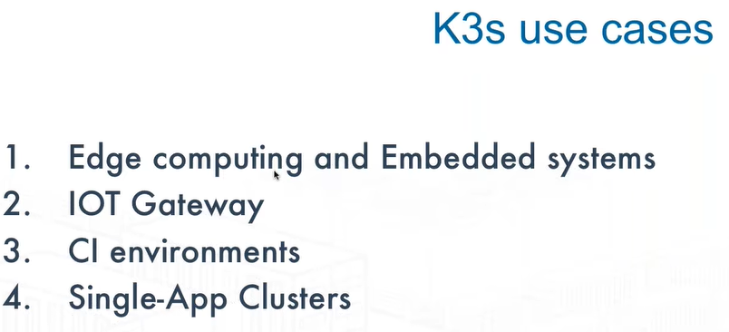

# Kubernetes
- [Certified Kubernetes Offerings](#certified-kubernetes-offerings)
- [Kubernetes open-source container-orchestation](#kubernetes-open-source-container-orchestation)
- [Kubectl commands](#kubectl-commands)
    - [Kubectl Cheat Sheets](#kubectl-cheat-sheets)
    - [List all resources and sub resources that you can constrain with RBAC](#list-all-resources-and-sub-resources-that-you-can-constrain-with-rbac)
    - [Copy a configMap in kubernetes between namespaces](#copy-a-configmap-in-kubernetes-between-namespaces)
    - [Copy secrets in kubernetes between namespaces](#copy-secrets-in-kubernetes-between-namespaces)
    - [Export resources with kubectl and python](#export-resources-with-kubectl-and-python)
    - [Kubectl Alternatives](#kubectl-alternatives)
        - [Manage Kubernetes (K8s) objects with Ansible Kubernetes Module](#manage-kubernetes-k8s-objects-with-ansible-kubernetes-module)
        - [Jenkins Kubernetes Plugins](#jenkins-kubernetes-plugins)
- [Helm Kubernetes Tool](#helm-kubernetes-tool)
- [Cluster Autoscaler Kubernetes Tool](#cluster-autoscaler-kubernetes-tool)
    - [HPA and VPA](#hpa-and-vpa)
    - [Cluster Autoscaler and Helm](#cluster-autoscaler-and-helm)
    - [Cluster Autoscaler and DockerHub](#cluster-autoscaler-and-dockerhub)
    - [Cluster Autoscaler in GKE, EKS, AKS and DOKS](#cluster-autoscaler-in-gke-eks-aks-and-doks)
    - [Cluster Autoscaler in OpenShift](#cluster-autoscaler-in-openshift)
- [Other kubernetes tools](#other-kubernetes-tools)
- [Kubernetes Troubleshooting](#kubernetes-troubleshooting)
- [Kubernetes Tutorials](#kubernetes-tutorials)
- [Kubernetes Patterns](#kubernetes-patterns)
- [Kubernetes Operators](#kubernetes-operators)
- [Kubernetes Networking](#kubernetes-networking)
- [Kubernetes Sidecars](#kubernetes-sidecars)
- [Kubernetes Security](#kubernetes-security)
    - [Pod Security Policies (SCCs - Security Context Constraints in OpenShift)](#pod-security-policies-sccs---security-context-constraints-in-openshift)
    - [EKS Security](#eks-security)
- [Kubernetes Scheduling and Scheduling Profiles](#kubernetes-scheduling-and-scheduling-profiles)
    - [Pod Topology Spread Constraints and PodTopologySpread Scheduling Plugin](#pod-topology-spread-constraints-and-podtopologyspread-scheduling-plugin)
- [Kubernetes Storage](#kubernetes-storage)
- [Non-production Kubernetes Local Installers](#non-production-kubernetes-local-installers)
- [Kubernetes in Public Cloud](#kubernetes-in-public-cloud)
    - [GKE vs EKS vs AKS](#gke-vs-eks-vs-aks)
    - [AWS EKS (Hosted/Managed Kubernetes on AWS)](#aws-eks-hostedmanaged-kubernetes-on-aws)
    - [Tools for multi-cloud Kubernetes management](#tools-for-multi-cloud-kubernetes-management)
- [On-Premise Production Kubernetes Cluster Installers](#on-premise-production-kubernetes-cluster-installers)
    - [Comparative Analysis of Kubernetes Deployment Tools](#comparative-analysis-of-kubernetes-deployment-tools)
    - [Deploying Kubernetes Cluster with Kops](#deploying-kubernetes-cluster-with-kops)
    - [Deploying Kubernetes Cluster with Kubeadm](#deploying-kubernetes-cluster-with-kubeadm)
    - [Deploying Kubernetes Cluster with Ansible](#deploying-kubernetes-cluster-with-ansible)
    - [Kubespray](#kubespray)
    - [Conjure up](#conjure-up)
    - [WKSctl](#wksctl)
    - [Terraform (kubernetes the hard way)](#terraform-kubernetes-the-hard-way)
    - [Caravan](#caravan)
    - [ClusterAPI](#clusterapi)
    - [Microk8s](#microk8s)
    - [k8s-tew](#k8s-tew)
    - [Kubernetes Distributions](#kubernetes-distributions)
        - [Red Hat OpenShift](#red-hat-openshift)
        - [VMware Kubernetes Tanzu and Project Pacific](#vmware-kubernetes-tanzu-and-project-pacific)
        - [Rancher: Enterprise management for Kubernetes](#rancher-enterprise-management-for-kubernetes)
            - [Rancher 2](#rancher-2)
            - [Rancher 2 RKE](#rancher-2-rke)
            - [K3S](#k3s)
                - [K3D](#k3d)
                - [K3OS](#k3os)
            - [K3C](#k3c)
            - [Hosted Rancher](#hosted-rancher)
            - [Rancher on Microsoft Azure](#rancher-on-microsoft-azure)
            - [Rancher RKE on vSphere](#rancher-rke-on-vsphere)
            - [Rancher Kubernetes on Oracle Cloud](#rancher-kubernetes-on-oracle-cloud)
            - [Rancher Software Defined Storage with Longhorn](#rancher-software-defined-storage-with-longhorn)
            - [Rancher Fleet to manage multiple kubernetes clusters](#rancher-fleet-to-manage-multiple-kubernetes-clusters)
- [SpringBoot with Docker](#springboot-with-docker)
- [Docker in Docker](#docker-in-docker)
- [Serverless with OpenFaas and Knative](#serverless-with-openfaas-and-knative)
- [Container Ecosystem](#container-ecosystem)
- [Container Flowchart](#container-flowchart)
- [Videos](#videos)

## Certified Kubernetes Offerings
* [Certified Kubernetes offerings 🌟🌟🌟](https://www.cncf.io/certification/software-conformance/)

## Kubernetes open-source container-orchestation
* [Wikipedia.org: Kubernetes](https://en.wikipedia.org/wiki/Kubernetes)
* [youtube: Kubernetes in 5 mins](https://www.youtube.com/watch?v=PH-2FfFD2PU)
* [docs.kubernetes.io](http://docs.kubernetes.io/)
* [unofficial-kubernetes.readthedocs.io](https://unofficial-kubernetes.readthedocs.io/)
* [Awesome kubernetes 🌟🌟🌟🌟](https://github.com/ramitsurana/awesome-kubernetes)
* [https://www.reddit.com/r/kubernetes 🌟🌟🌟](https://www.reddit.com/r/kubernetes) 
* [stackify.com: The Advantages of Using Kubernetes and Docker Together 🌟🌟🌟](https://stackify.com/kubernetes-docker-deployments/)
* [Ansible for devops: Kubernetes](https://github.com/geerlingguy/ansible-for-devops/tree/master/kubernetes)
* [kubedex.com 🌟🌟🌟](https://kubedex.com/) Discover, Compare and Share Kubernetes Applications
    * [kubedex.com: autoscaling 🌟](https://kubedex.com/autoscaling)
* [medium.com: The Kubernetes Scheduler: this series aims to advance the understanding of Kubernetes and its underlying concepts](https://medium.com/@dominik.tornow/the-kubernetes-scheduler-cd429abac02f)
* [medium.com: A Year Of Running Kubernetes at MYOB, And The Importance Of Empathy](https://medium.com/@jpcontad/a-year-of-running-kubernetes-as-a-product-7eed1204eecd)
* [blogs.mulesoft.com - K8s: 8 questions about Kubernetes](https://blogs.mulesoft.com/dev/resources-dev/k8s-kubernetes/)
* [labs.mwrinfosecurity.com: Attacking Kubernetes through Kubelet](https://labs.mwrinfosecurity.com/blog/attacking-kubernetes-through-kubelet/)
* [blog.doit-intl.com: Kubernetes and Secrets Management in the Cloud](https://blog.doit-intl.com/kubernetes-and-secrets-management-in-cloud-858533c20dca)
* [medium.com: Kubernetes Canary Deployment #1 Gitlab CI](https://medium.com/@wuestkamp/kubernetes-canary-deployment-1-gitlab-ci-518f9fdaa7ed)
* [kubernetes-on-aws.readthedocs.io](https://kubernetes-on-aws.readthedocs.io/ )
* [techbeacon.com: Why teams fail with Kubernetes—and what to do about it 🌟🌟🌟](https://techbeacon.com/enterprise-it/why-teams-fail-kubernetes-what-do-about-it)
* [itnext.io: Kubernetes rolling updates, rollbacks and multi-environments 🌟🌟🌟](https://itnext.io/kubernetes-rolling-updates-rollbacks-and-multi-environments-4ff9912df5)
* [learnk8s.io: Architecting Kubernetes clusters — choosing a worker node size 🌟🌟🌟](https://learnk8s.io/kubernetes-node-size)
* [medium.com: Kubernetes NodePort vs LoadBalancer vs Ingress? When should I use what? 🌟🌟🌟](https://medium.com/google-cloud/kubernetes-nodeport-vs-loadbalancer-vs-ingress-when-should-i-use-what-922f010849e0)
* [sysdig.com: Understanding Kubernetes limits and requests by example 🌟🌟🌟](https://sysdig.com/blog/kubernetes-limits-requests/)
* [youtube: Kubernetes 101: Get Better Uptime with K8s Health Checks](https://www.youtube.com/watch?v=D9w3DH1zAc8)
* [learnk8s.io: Load balancing and scaling long-lived connections in Kubernetes 🌟🌟🌟🌟🌟](https://learnk8s.io/kubernetes-long-lived-connections)
* [itnext.io: Successful & Short Kubernetes Stories For DevOps Architects](https://itnext.io/successful-short-kubernetes-stories-for-devops-architects-677f8bfed803)
* [blog.alexellis.io: Get a LoadBalancer for your private Kubernetes cluster](https://blog.alexellis.io/ingress-for-your-local-kubernetes-cluster/)
* [itnext.io: K8s Vertical Pod Autoscaling 🌟](https://itnext.io/k8s-vertical-pod-autoscaling-fd9e602cbf81)
* [medium.com: kubernetes Pod Priority and Preemption](https://medium.com/@mohaamer5/kubernetes-pod-priority-and-preemption-943c58aee07d)
* [returngis.net: Pruebas de vida de nuestros contenedores en Kubernetes](https://www.returngis.net/2020/02/pruebas-de-vida-de-nuestros-contenedores-en-kubernetes/)
* [itnext.io: K8s prevent queue worker Pod from being killed during deployment](https://itnext.io/k8s-prevent-queue-worker-pod-from-being-killed-during-deployment-4252ea7c13f6) How to prevent a Kubernetes (like RabbitMQ) queue worker Pod from being killed during deployment while handling a message?
* [youtube: deployment strategies in kubernetes | recreate | rolling update | blue/green | canary](https://youtu.be/efiMiaFjtn8)
* [sysdig.com: Understanding Kubernetes limits and requests by example 🌟🌟🌟](https://sysdig.com/blog/kubernetes-limits-requests/)
* [kodekloud.com: Kubernetes Features Every Beginner Must Know](https://kodekloud.com/blog/200628/kubernetes-features-every-beginner-must-know)
* [platform9.com: Kubernetes CI/CD Pipelines at Scale](https://platform9.com/blog/kubernetes-ci-cd-pipelines-at-scale/)
* [learnk8s.io: Architecting Kubernetes clusters — how many should you have? 🌟](https://learnk8s.io/how-many-clusters)
* [magalix.com: Capacity Planning 🌟🌟🌟](https://www.magalix.com/blog/kubernetes-patterns-capacity-planning) When we have multiple Pods with different Priority Class values, the admission controller starts by sorting Pods according to their priority. What happens when there are no nodes with available resources to schedule a high-priority pods? 
* [4 trends for Kubernetes cloud-native teams to watch in 2020](https://searchapparchitecture.techtarget.com/tip/4-trends-for-Kubernetes-cloud-native-teams-to-watch-in-2020)
* [enterprisersproject.com: Kubernetes: Everything you need to know (2020) 🌟🌟🌟](https://enterprisersproject.com/article/2020/4/kubernetes-everything-you-need-know)
* [learnk8s.io: Provisioning cloud resources (AWS, GCP, Azure) in Kubernetes 🌟🌟🌟](https://learnk8s.io/cloud-resources-kubernetes)
* [padok.fr: Kubernetes’ Architecture: Understanding the components and structure of clusters 🌟🌟🌟](https://www.padok.fr/en/blog/kubernetes-architecture-clusters)
* [medium.com: Top 15 Online Courses to Learn Docker, Kubernetes, and AWS for Fullstack Developers and DevOps Engineers](https://medium.com/javarevisited/top-15-online-courses-to-learn-docker-kubernetes-and-aws-for-fullstack-developers-and-devops-d8cc4f16e773)

[](https://www.padok.fr/en/blog/kubernetes-architecture-clusters)

## Kubectl commands

### Kubectl Cheat Sheets
* [developers.redhat.com: Kubernetes Cheat Sheet 🌟](https://developers.redhat.com/cheat-sheets/kubernetes/)
* [kubernetes.io 🌟🌟🌟](https://kubernetes.io/docs/reference/kubectl/cheatsheet/)
* [linuxacademy](https://linuxacademy.com/blog/containers/kubernetes-cheat-sheet/)
* [fabric8 - kubectl](https://github.com/fabric8io/kansible/blob/master/vendor/k8s.io/kubernetes/docs/user-guide/kubectl-cheatsheet.md)
* [intellipaat.com 🌟🌟](https://intellipaat.com/blog/tutorial/devops-tutorial/kubernetes-cheat-sheet/)
* [dzone: kubectl commands cheat sheet](https://dzone.com/articles/kubectl-commands-cheat-sheet)
* [jimmysong.io: kubectl cheat sheet 🌟🌟](https://jimmysong.io/kubernetes-handbook/guide/using-kubectl.html)
* [cheatsheet.dennyzhang.com: kubectl kubernetes free cheat sheet 🌟🌟🌟](https://cheatsheet.dennyzhang.com/cheatsheet-kubernetes-a4)

### List all resources and sub resources that you can constrain with RBAC
* kind of a handy way to see all thing things you can affect with Kubernetes RBAC. This will list all resources and sub resources that you can constrain with RBAC. If you want to see just subresources append "| grep {name}/":

```bash
kubectl get --raw /openapi/v2  | jq '.paths | keys[]'
```

### Copy a configMap in kubernetes between namespaces
* Copy a configMap in kubernetes between namespaces with deprecated "--export" flag:

```bash
kubectl get configmap --namespace=<source> <configmap> --export -o yaml | sed "s/<source>/<dest>/" | kubectl apply --namespace=<dest> -f -
```

* [Flag export deprecated in kubernetes 1.14](https://github.com/kubernetes/kubernetes/pull/73787). Instead following command can be used:

```bash
kubectl get configmap <configmap-name> --namespace=<source-namespace> -o yaml | sed ‘s/namespace: <from-namespace>/namespace: <to-namespace>/’ | kubectl create -f
```

* Reference: [Copy a configMap in kubernetes between namespaces](https://stackoverflow.com/questions/55515594/is-there-a-way-to-share-a-configmap-in-kubernetes-between-namespaces)
  
### Copy secrets in kubernetes between namespaces
* [Copy secrets between namespaces](https://stackoverflow.com/questions/55515594/is-there-a-way-to-share-a-configmap-in-kubernetes-between-namespaces):

```bash
kubectl get secret <secret-name> --namespace=<source> -o yaml | sed ‘s/namespace: <from-namespace>/namespace: <to-namespace>/’ | kubectl create -f
```

### Export resources with kubectl and python
* Export resources with [zoidbergwill/export.sh](https://gist.github.com/zoidbergwill/6af8c80cc5b706e2adcf25df3dc2f7e1#file-export_resources-py), by [zoidbergwill](https://gist.github.com/zoidbergwill)

### Kubectl Alternatives
* [Helm and Kubernetes](#helm-and-kubernetes)
* [Other kubernetes tools](#other-kubernetes-tools)

#### Manage Kubernetes (K8s) objects with Ansible Kubernetes Module
* [Manage Kubernetes (K8s) objects](https://docs.ansible.com/ansible/latest/modules/k8s_module.html)
* [ansibleforkubernetes.com 🌟🌟🌟](https://www.ansibleforkubernetes.com/)

#### Jenkins Kubernetes Plugins
* [Jenkins Kubernetes Plugin](https://plugins.jenkins.io/kubernetes/)
* [Kubernetes Continuous Deploy](https://plugins.jenkins.io/kubernetes-cd/)

## Helm Kubernetes Tool
* [helm.sh](https://helm.sh/)
    * [helm.sh/docs](https://helm.sh/docs) 
* [GitHub: Helm, the Kubernetes Package Manager](https://github.com/helm/helm) Installing and managing Kubernetes applications
* [Helm and Kubernetes Tutorial - Introduction](https://www.youtube.com/watch?v=9cwjtN3gkD4)
* [Delve into Helm: Advanced DevOps](https://www.youtube.com/watch?v=cZ1S2Gp47ng)
* [Continuously delivering apps to Kubernetes using Helm](https://www.youtube.com/watch?v=CmPK93hg5w8)
* [Zero to Kubernetes CI/CD in 5 minutes with Jenkins and Helm](https://www.youtube.com/watch?v=eMOzF_xAm7w)
* [DevOps with Azure, Kubernetes, and Helm](https://www.youtube.com/watch?v=INv-VCZvM_o)
* [dzone: the art of the helm chart patterns](https://dzone.com/articles/the-art-of-the-helm-chart-patterns-from-the-offici)
* [dzone: 15 useful helm chart tools](https://dzone.com/articles/15-useful-helm-charts-tools)
* [dzone: create install upgrade and rollback a helm chart - part 1](https://dzone.com/articles/create-install-upgrade-and-rollback-a-helm-chart-p)
* [dzone: create install upgrade and rollback a helm chart - part 2](https://dzone.com/articles/create-install-upgrade-rollback-a-helm-chart-part)
* [dzone: cicd with kubernetes and helm](https://dzone.com/articles/cicd-with-kubernetes-and-helm)
* [dzone: do you need helm?](https://dzone.com/articles/do-you-need-helm)
* [dzone: managing helm releases the gitops way](https://dzone.com/articles/managing-helm-releases-the-gitops-way)
* [codefresh.io: Using Helm 3 with Helm 2 charts](https://codefresh.io/helm-tutorial/taking-helm-3-spin/)
* Helm Charts:
    * [Jenkins](https://github.com/helm/charts/tree/master/stable/jenkins) 
    * [Codecentric Jenkins 🌟](https://github.com/codecentric/helm-charts/tree/master/charts/jenkins) Helm 3 compliant (Simpler and more secure than helm 2)
    * [Nexus3](https://github.com/helm/charts/tree/master/stable/sonatype-nexus)
    * [Choerodon Nexus3 🌟](https://hub.helm.sh/charts/choerodon/nexus3) Helm 3 compliant (Simpler and more secure than helm 2)
    * [Sonar](https://github.com/helm/charts/tree/master/stable/sonarqube)
    * [Selenium](https://github.com/helm/charts/tree/master/stable/selenium)
    * [Jmeter](https://github.com/helm/charts/tree/master/stable/distributed-jmeter)
    * [bitnami: create your first helm chart](https://docs.bitnami.com/kubernetes/how-to/create-your-first-helm-chart/)
* Helm Charts repositories:
    * [hub.helm.sh 🌟🌟🌟](http://hub.helm.sh) 
    * [Bitnami Helm Charts](https://bitnami.com/stacks/helm)

## Cluster Autoscaler Kubernetes Tool
* [kubernetes.io: Cluster Management - **Resizing a cluster**](https://kubernetes.io/docs/tasks/administer-cluster/cluster-management/#resizing-a-cluster)
* [github.com/kubernetes: **Kubernetes Cluster Autoscaler**](https://github.com/kubernetes/autoscaler/tree/master/cluster-autoscaler)
* [Kubernetes Autoscaling in Production: Best Practices for **Cluster Autoscaler, HPA and VPA**](https://www.replex.io/blog/kubernetes-in-production-best-practices-for-cluster-autoscaler-hpa-and-vpa) In this article we will take a deep dive into Kubernetes autoscaling tools including the cluster autoscaler, the horizontal pod autoscaler and the vertical pod autoscaler. We will also identify best practices that developers, DevOps and Kubernetes administrators should follow when configuring these tools.
* [gitconnected.com: Kubernetes Autoscaling 101: Cluster Autoscaler, Horizontal Pod Autoscaler, and Vertical Pod Autoscaler](https://levelup.gitconnected.com/kubernetes-autoscaling-101-cluster-autoscaler-horizontal-pod-autoscaler-and-vertical-pod-2a441d9ad231)
* [packet.com: Kubernetes Cluster Autoscaler](https://www.packet.com/resources/guides/kubernetes-cluster-autoscaler-on-packet/)
* [itnext.io: Kubernetes Cluster Autoscaler: More than scaling out](https://itnext.io/kubernetes-cluster-autoscaler-more-than-scaling-out-7b2d97f10b27)
* [cloud.ibm.com: Containers Troubleshoot Cluster Autoscaler](https://cloud.ibm.com/docs/containers?topic=containers-troubleshoot_cluster_autoscaler)
* [platform9.com: Kubernetes Autoscaling Options: Horizontal Pod Autoscaler, Vertical Pod Autoscaler and Cluster Autoscaler](https://platform9.com/blog/kubernetes-autoscaling-options-horizontal-pod-autoscaler-vertical-pod-autoscaler-and-cluster-autoscaler/)
* [banzaicloud.com: Autoscaling Kubernetes clusters](https://banzaicloud.com/blog/k8s-cluster-autoscaler/)
* [tech.deliveryhero.com: Dynamically overscaling a Kubernetes cluster with cluster-autoscaler and Pod Priority](https://tech.deliveryhero.com/dynamically-overscaling-a-kubernetes-cluster-with-cluster-autoscaler-and-pod-priority/)

### HPA and VPA
* [HPA: Horizontal Pod Autoscaler](https://kubernetes.io/docs/tasks/run-application/horizontal-pod-autoscale/)
* [VPA: Vertical Pod Autoscaler](https://github.com/kubernetes/autoscaler/tree/master/vertical-pod-autoscaler)

### Cluster Autoscaler and Helm
* [hub.helm.sh: cluster-autoscaler](https://hub.helm.sh/charts/stable/cluster-autoscaler) The cluster autoscaler scales worker nodes within an AWS autoscaling group (ASG) or Spotinst Elastigroup.

### Cluster Autoscaler and DockerHub
* [bitnami/cluster-autoscaler](https://hub.docker.com/r/bitnami/cluster-autoscaler/)

### Cluster Autoscaler in GKE, EKS, AKS and DOKS
* [Amazon Web Services: EKS Cluster Autoscaler](https://docs.aws.amazon.com/eks/latest/userguide/cluster-autoscaler.html)
    * [eksworkshop.com: Configure Cluster Autoscaler (CA)](https://eksworkshop.com/scaling/deploy_ca/)
* [Azure: AKS Cluster Autoscaler](https://docs.microsoft.com/en-us/azure/aks/cluster-autoscaler)
* [Google Cloud Platform: GKE Cluster Autoscaler](https://cloud.google.com/kubernetes-engine/docs/concepts/cluster-autoscaler)
* [DigitalOcean Kubernetes: DOKS Cluster Autoscaler](https://www.digitalocean.com/docs/kubernetes/how-to/autoscale/)

### Cluster Autoscaler in OpenShift
* [OpenShift 3.11: Configuring the cluster auto-scaler in AWS](https://docs.openshift.com/container-platform/3.11/admin_guide/cluster-autoscaler.html)
* [OpenShift 4.4: Applying autoscaling to an OpenShift Container Platform cluster](https://docs.openshift.com/container-platform/4.4/machine_management/applying-autoscaling.html)

## Other kubernetes tools
* [VMware octant](https://github.com/vmware/octant) A web-based, highly extensible platform for developers to better understand the complexity of Kubernetes clusters.
    * [octant.dev](https://octant.dev/) Visualize your Kubernetes workloads. Octant is an open source developer-centric web interface for Kubernetes that lets you inspect a Kubernetes cluster and its applications.
* [KSS - Kubernetes pod status on steroid](https://github.com/chmouel/kss)
* [kubectl-debug](https://github.com/aylei/kubectl-debug)
* [kubectl-tree](https://github.com/ahmetb/kubectl-tree) kubectl plugin to browse Kubernetes object hierarchies as a tree
* [The Golden Kubernetes Tooling and Helpers list](https://docs.google.com/spreadsheets/d/1WPHt0gsb7adVzY3eviMK2W8LejV0I5m_Zpc8tMzl_2w)
* [kubech (kubectl change)](https://github.com/aabouzaid/kubech) Set kubectl contexts/namespaces per shell/terminal to manage multi Kubernetes cluster at the same time.
* [Kubecle](https://github.com/rydogs/kubecle) is a web ui running locally that provides useful information about your kubernetes clusters. It is an alternative to Kubernetes Dashboard. Because it runs locally, you can access any kubernetes clusters you have access to
* [Permission Manager](https://github.com/sighupio/permission-manager) is a project that brings sanity to Kubernetes RBAC and Users management, Web UI FTW
* [developer.sh: Kubernetes client tools overview](https://developer.sh/posts/kubernetes-client-tools-overview)
* [kubectx](https://github.com/ahmetb/kubectx) Faster way to switch between clusters and namespaces in kubectl 
* [go-kubectx](https://github.com/aca/go-kubectx) 5x-10x faster alternative to kubectx. Uses client-go.
* [kubevious](https://github.com/kubevious/kubevious) is open-source software that provides a usable and highly graphical interface for Kubernetes. Kubevious renders all configurations relevant to the application in one place.
* [Guard](https://github.com/appscode/guard) is a Kubernetes Webhook Authentication server. Using guard, you can log into your Kubernetes cluster using various auth providers. Guard also configures groups of authenticated user appropriately.
* [itnext.io: **arkade** by example — Kubernetes apps, the easy way 🌟🌟🌟](https://itnext.io/kubernetes-apps-the-easy-way-f06d9e5cad3c)
* [**Kubei**](https://github.com/Portshift/kubei) is a flexible Kubernetes runtime scanner, scanning images of worker and Kubernetes nodes providing accurate vulnerabilities assessment.
* [**Tubectl**: a kubectl alternative which adds a bit of magic to your everyday kubectl routines by reducing the complexity of working with contexts, namespaces and intelligent matching resources.](https://github.com/reconquest/tubekit)
* [**Kpt**: Packaging up your Kubernetes configuration with git and YAML since 2014 **(Google)**](https://opensource.googleblog.com/2020/03/kpt-packaging-up-your-kubernetes.html)
    * [kpt](https://googlecontainertools.github.io/kpt/)
* [**Krew** 🌟🌟🌟](https://krew.sigs.k8s.io/) is the plugin manager for kubectl command-line tool.
* [kubernetes-common-services](https://github.com/ManagedKube/kubernetes-common-services) These services help make it easier to manage your applications environment in Kubernetes
* [**k8s-job-notify**](https://github.com/sukeesh/k8s-job-notify) Kubernetes Job/CronJob Notifier. This tool sends an alert to slack whenever there is a Kubernetes cronJob/Job failure/success.
* [**kube-opex-analytics** 🌟🌟🌟🌟](https://github.com/rchakode/kube-opex-analytics) Kubernetes Cost Allocation and Capacity Planning Analytics Tool. Built-in hourly, daily, monthly reports - Prometheus exporter - Grafana dashboard.
* [**kubeletctl**](https://github.com/cyberark/kubeletctl) is a command line tool that implement kubelet's API. Part of kubelet's API is documented but most of it is not. This tool covers all the documented and undocumented APIs. The full list of all kubelet's API can be view through the tool or this [API table](https://github.com/cyberark/kubeletctl/blob/master/API_TABLE.md). What can it do ?:
    * Run any kubelet API call
    * Scan for nodes with opened kubelet API
    * Scan for containers with RCE
    * Run a command on all the available containers by kubelet at the same time
    * Get service account tokens from all available containers by kubelet
    * Nice printing :)
* [**inspektor-gadget**](https://github.com/kinvolk/inspektor-gadget) Collection of gadgets for debugging and introspecting Kubernetes applications using BPF [kinvolk.io](https://kinvolk.io)
* [**K8bit** — the tiny Kubernetes dashboard 🌟](https://github.com/learnk8s/k8bit) K8bit is a tiny dashboard that is meant to demonstrate how to use the Kubernetes API to watch for changes.
    * [learnk8s.io/real-time-dashboard](https://learnk8s.io/real-time-dashboard)

## Kubernetes Troubleshooting
* [Kubernetes troubleshooting diagram 🌟🌟🌟](https://github.com/inafev/awesome-kubernetes/blob/master/docs/images/kubernetes-troubleshooting.jpg)
* [Understanding Kubernetes cluster events 🌟🌟](https://banzaicloud.com/blog/k8s-cluster-logging/)
* [nigelpoulton.com: Troubleshooting kubernetes service discovery - Part 1](https://nigelpoulton.com/blog/f/troubleshooting-kubernetes-service-discovery---part-1)
* [medium: 5 tips for troubleshooting apps on Kubernetes](https://medium.com/@alexellisuk/5-tips-for-troubleshooting-apps-on-kubernetes-835b6b539c24)

## Kubernetes Tutorials
* [katacoda.com 🌟🌟🌟🌟](https://www.katacoda.com/) Interactive Learning and Training Platform for Software Engineers 
* [kubernetesbyexample.com 🌟🌟🌟](http://kubernetesbyexample.com/)
* [Play with Kubernetes 🌟🌟🌟🌟](https://labs.play-with-k8s.com/) A simple, interactive and fun playground to learn Kubernetes
* [devopscube.com: Kubernetes Tutorials For Beginners: Getting Started Guide 🌟🌟🌟](https://devopscube.com/kubernetes-tutorials-beginners/)
* [Intoduction to Kubernetes (slides, beginners and advanced) 🌟🌟🌟🌟🌟](https://docs.google.com/presentation/d/1zrfVlE5r61ZNQrmXKx5gJmBcXnoa_WerHEnTxu5SMco/edit#slide=id.g3cfa019267_4_0)
* [medium.com: Kubernetes 101: Pods, Nodes, Containers, and Clusters](https://medium.com/google-cloud/kubernetes-101-pods-nodes-containers-and-clusters-c1509e409e16)
* [medium.com: Learn Kubernetes in Under 3 Hours: A Detailed Guide to Orchestrating Containers](https://medium.com/free-code-camp/learn-kubernetes-in-under-3-hours-a-detailed-guide-to-orchestrating-containers-114ff420e882)
* [kubernetestutorials.com: Install and Deploy Kubernetes on CentOs 7](https://kubernetestutorials.com/install-and-deploy-kubernetes-on-centos-7/)
* [medium.com: Simplifying orchestration with Kubernetes](https://medium.com/@swapnasagarpradhan/simplifying-orchestration-with-kubernetes-e81015681a85)
* [aquasec.com: 70 Best Kubernetes Tutorials 🌟🌟🌟🌟](https://www.aquasec.com/wiki/display/containers/70+Best+Kubernetes+Tutorials) Valuable Kubernetes tutorials from multiple sources, classified into the following categories: Kubernetes AWS and Azure tutorials, networking tutorials, clustering and federation tutorials and more.
* [cloud.google.com: kubernetes comic 🌟🌟🌟](https://cloud.google.com/kubernetes-engine/kubernetes-comic/) Learn about kubernetes and how you can use it for continuous integration and delivery.
* [magalix.com: Kubernetes 101 - Concepts and Why It Matters](https://www.magalix.com/blog/kubernetes-101-concepts-and-why-it-matters)
* [Google Play: Learning Solution - Learn Kubernetes 🌟🌟🌟](https://play.google.com/store/apps/details?id=com.LearningSolution.LearnKubernetes)
* [Google Play: TomApp - Learn Kubernetes](https://play.google.com/store/apps/details?id=tomtran.learnkubernetes)
    * [apkplz.net: Learn Kubernetes 1 APK](https://apkplz.net/app/com.LearningSolution.LearnKubernetes)
    * [Google Play Search](https://play.google.com/store/search?q=learn+kubernetes)
* [Dzone refcard: Getting Started with Kubernetes](https://dzone.com/refcardz/kubernetes-essentials)
* [udemy.com: Learn DevOps: The Complete Kubernetes Course 🌟🌟🌟🌟](https://www.udemy.com/learn-devops-the-complete-kubernetes-course)
* [udemy.com: Learn DevOps: Advanced Kubernetes Usage 🌟🌟🌟🌟](https://www.udemy.com/learn-devops-advanced-kubernetes-usage)
* **Famous Kubernetes resources of 2019:**
    * [Kubernetes for developers](https://www.udemy.com/course/kubernetes-for-developers/)
    * [Kubernetes for the Absolute Beginners](https://www.udemy.com/course/learn-kubernetes/)
    * [Kubernetes: Getting Started (Free)](https://www.udemy.com/course/kubernetes-getting-started/)
    * [Kubernetes Tutorial: Learn the Basics](https://dev.to/scalyr/kubernetes-tutorial-learn-the-basics-and-get-started-5dgh)
    * [Kubernetes essentials E-book 🌟🌟🌟](https://images.linoxide.com/ebook-kubernetes-essentials.pdf)
    * [Cloud-Native DevOps With Kubernetes O'Reilly book (Free) 🌟🌟🌟](https://www.nginx.com/resources/library/cloud-native-devops-with-kubernetes/)
    * [Complete Kubernetes Course](https://www.youtube.com/watch?v=0KQndcIedeg)
    * [Getting started with Kubernetes](https://learn.pluralsight.com/programs/2019/free-course/template4)
* [wardviaene/kubernetes-course 🌟🌟🌟🌟](https://github.com/wardviaene/kubernetes-course) 
* [wardviaene/advanced-kubernetes-course 🌟🌟🌟🌟](https://github.com/wardviaene/advanced-kubernetes-course) 
* [dzone: The complete kubernetes collection tutorials and tools 🌟🌟🌟🌟](https://dzone.com/articles/the-complete-kubernetes-collection-tutorials-and-tools)
* [dzone: kubernetes in 10 minutes a complete guide to look](https://dzone.com/articles/kubernetes-in-10-minutes-a-complete-guide-to-look)
* [magalix.com: The Best Kubernetes Tutorials 🌟🌟🌟](https://www.magalix.com/blog/the-best-kubernetes-tutorials)
* [35 Advanced Tutorials to Learn Kubernetes 🌟🌟🌟](https://medium.com/faun/35-advanced-tutorials-to-learn-kubernetes-dae5695b1f18)
* [javarevisited.blogspot.com: Top 5 courses to Learn Docker and Kubernetes in 2020 - Best of Lot](https://javarevisited.blogspot.com/2019/05/top-5-courses-to-learn-docker-and-kubernetes-for-devops.html)
* [skillslane.com: 10 Best Kubernetes Courses [2020]: Beginner to Advanced Courses](https://skillslane.com/learn-kubernetes-from-these-best-online-courses/)

## Kubernetes Patterns
* [redhat.com: Kubernetes Patterns e-book 🌟🌟🌟🌟](https://www.redhat.com/en/engage/kubernetes-containers-architecture-s-201910240918)
* [github.com/k8spatterns/examples 🌟🌟🌟](https://github.com/k8spatterns/examples) Examples for "Kubernetes Patterns - Reusable Elements for Designing Cloud-Native Applications"
* [kubernetes.io: container design patterns](https://kubernetes.io/blog/2016/06/container-design-patterns/)
* [magalix.com: Kubernetes Patterns - The Service Discovery Pattern 🌟🌟🌟](https://www.magalix.com/blog/kubernetes-patterns-the-service-discovery-pattern)
* [gardener.cloud: Kubernetes Antipatterns](https://gardener.cloud/050-tutorials/content/howto/antipattern/)
* [dzone.com: Performance Patterns in Microservices-Based Integrations 🌟🌟🌟🌟🌟](https://dzone.com/articles/performance-patterns-in-microservices-based-integr-1)
* [magalix.com: Kubernetes Application Architecture Patterns eBook 🌟🌟🌟](https://www.magalix.com/kubernetes-application-patterns-e-book-download)

## Kubernetes Operators
* [kruschecompany.com: What is a Kubernetes Operator and Where it Can be Used?](https://kruschecompany.com/kubernetes-operator/)
* [kruschecompany.com: Prometheus Operator – Installing Prometheus Monitoring Within The Kubernetes Environment](https://kruschecompany.com/kubernetes-prometheus-operator/)
* [redhat.com: Kubernetes operators - Embedding operational expertise side by side with containerized applications](https://www.redhat.com/sysadmin/kubernetes-operators)
* [hashicorp.com: Creating Workspaces with the HashiCorp Terraform Operator for Kubernetes](https://www.hashicorp.com/blog/creating-workspaces-with-the-hashicorp-terraform-operator-for-kubernetes/)
* [banzaicloud.com: Kafka rolling upgrade made easy with Supertubes](https://banzaicloud.com/blog/kafka-rolling-upgrade/)
* [devops.com: Day 2 for the Operator Ecosystem 🌟🌟🌟](https://devops.com/day-2-for-the-operator-ecosystem/)
    * [KUDO: The Kubernetes Universal Declarative Operator 🌟🌟](https://kudo.dev/) KUDO is a toolkit that makes it easy to build Kubernetes Operators, in most cases just using YAML.

## Kubernetes Networking
* [dzone: how to setup kubernetes networking](https://dzone.com/articles/how-to-understand-and-setup-kubernetes-networking)
* [AWS and Kubernetes Networking Options and Trade-Offs (part 1)](https://www.weave.works/blog/introduction-to-kubernetes-pod-networking--part-1)
* [AWS and Kubernetes Networking Options and Trade-Offs (part 2)](https://www.weave.works/blog/aws-networking-overview---part-2)
* [AWS and Kubernetes Networking Options and Trade-Offs (part 3)](https://dzone.com/articles/aws-and-kubernetes-networking-options-and-trade-of) 
* [ovh.com - getting external traffic into kubernetes: clusterip, nodeport, loadbalancer and ingress](https://www.ovh.com/blog/getting-external-traffic-into-kubernetes-clusterip-nodeport-loadbalancer-and-ingress/)
* [youtube: Kubernetes Ingress Explained Completely For Beginners](https://www.youtube.com/watch?v=VicH6KojwCI)
* [stackrox.com: Kubernetes Networking Demystified: A Brief Guide](https://www.stackrox.com/post/2020/01/kubernetes-networking-demystified/)
* [medium.com: Fighting Service Latency in Microservices With Kubernetes](https://medium.com/@sindhujacynixit/fighting-service-latency-in-microservices-with-kubernetes-f5a584f5af36)

## Kubernetes Sidecars
* [banzaicloud.com: Sidecar container lifecycle changes in Kubernetes 1.18 🌟🌟](https://banzaicloud.com/blog/k8s-sidecars/)

## Kubernetes Security
* [cilium.io](https://cilium.io/)
* [openpolicyagent.org  🌟🌟🌟](https://www.openpolicyagent.org/)
    * [compile OpenPolicyAgent policies into WebAssembly and run them on the edge](https://github.com/open-policy-agent/contrib/tree/master/wasm/cloudflare-worker)
* [Dzone - devops security at scale](https://dzone.com/articles/devops-security-at-scale)
* [searchitoperations.techtarget.com: kubernetes policy project](https://searchitoperations.techtarget.com/news/252467102/Kubernetes-policy-project-takes-enterprise-IT-by-storm) 
* [Dzone - Kubernetes Policy Management with Kyverno](https://dzone.com/articles/kubernetes-policy-management-with-kyverno)
    * [github Kyverno - Kubernetes Native Policy Management](https://github.com/nirmata/kyverno/)
* [Dzone - OAuth 2.0](https://dzone.com/articles/oauth-20-beginners-guide)
* [Kubernetes Security Best Practices 🌟🌟🌟🌟](https://github.com/freach/kubernetes-security-best-practice/blob/master/README.md#firewall-ports-fire)
* [magalix.com: kubernetes authentication 🌟🌟](https://www.magalix.com/blog/kubernetes-authentication)
* [magalix.com: kubernetes authorization 🌟🌟](https://www.magalix.com/blog/kubernetes-authorization)
* [kubernetes login](https://blog.christianposta.com/kubernetes/logging-into-a-kubernetes-cluster-with-kubectl/)
* [Kubernetes Certs](https://github.com/jetstack/cert-manager/)
* [jeffgeerling.com: Everyone might be a cluster-admin in your Kubernetes cluster](https://www.jeffgeerling.com/blog/2020/everyone-might-be-cluster-admin-your-kubernetes-cluster)
* [rancher.com: Enhancing Kubernetes Security with Pod Security Policies, Part 1](https://rancher.com/blog/2020/pod-security-policies-part-1)
    * [rancher.com: Enhancing Kubernetes Security with Pod Security Policies, Part 2](https://rancher.com/blog/2020/pod-security-policies-part-2)
* [Microsoft.com: Attack matrix for Kubernetes 🌟🌟🌟](https://www.microsoft.com/security/blog/2020/04/02/attack-matrix-kubernetes/)
* [codeburst.io: 7 Kubernetes Security Best Practices You Must Follow](https://codeburst.io/7-kubernetes-security-best-practices-you-must-follow-ae32f1ed6444)

### Pod Security Policies (SCCs - Security Context Constraints in OpenShift)
* [Pod Security Policy (SCC in OpenShift) 🌟](https://kubernetes.io/docs/concepts/policy/pod-security-policy/)

### EKS Security
* [Security Group Rules EKS](https://docs.aws.amazon.com/eks/latest/userguide/sec-group-reqs.html)
* [EC2 ENI and IP Limit](https://docs.aws.amazon.com/AWSEC2/latest/UserGuide/using-eni.html#AvailableIpPerENI)
* [Calico in EKS](https://docs.aws.amazon.com/eks/latest/userguide/calico.html )

## Kubernetes Scheduling and Scheduling Profiles
* [Kubernetes Scheduling](https://kubernetes.io/docs/reference/scheduling/)
* [Scheduling Profiles](https://kubernetes.io/docs/reference/scheduling/profiles/)
  
### Pod Topology Spread Constraints and PodTopologySpread Scheduling Plugin
* [Pod Topology Spread Constraints](https://kubernetes.io/docs/concepts/workloads/pods/pod-topology-spread-constraints/)
* [Introducing PodTopologySpread plugin](https://kubernetes.io/blog/2020/05/introducing-podtopologyspread/)

## Kubernetes Storage
* [Cloud Native Storage](storage.md)

## Non-production Kubernetes Local Installers
* [Minikube](https://github.com/kubernetes/minikube) A tool that makes it easy to run Kubernetes locally inside a Linux VM. It's aimed on users who want to just test it out or use it for development. It cannot spin up a production cluster, it's a one node machine with no high availability.
    * [murchie85.github.io: Installling minikube](https://murchie85.github.io/Kubernetes.html)
* [**kind**](https://github.com/kubernetes-sigs/kind) Kubernetes IN Docker - local clusters for testing Kubernetes
* [store.docker.com: Docker Community Edition EDGE with kubernetes. Installing Kubernetes using the Docker Client](https://store.docker.com/editions/community/docker-ce-desktop-windows) Currently only available in **Edge** edition.
* [medium.com: Local Kubernetes for Linux — MiniKube vs MicroK8s](https://medium.com/containers-101/local-kubernetes-for-linux-minikube-vs-microk8s-1b2acad068d3)
* [itnext.io: Run Kubernetes On Your Machine](https://itnext.io/run-kubernetes-on-your-machine-7ee463af21a2) Several options to start playing with K8s in no time

## Kubernetes in Public Cloud
### GKE vs EKS vs AKS
* [medium.com: Kubernetes Cloud Services: Comparing GKE, EKS and AKS](https://medium.com/@Platform9Sys/kubernetes-cloud-services-comparing-gke-eks-and-aks-1fe42770cad3)
* [stackrox.com: EKS vs GKE vs AKS - Evaluating Kubernetes in the Cloud](https://www.stackrox.com/post/2020/02/eks-vs-gke-vs-aks/)
  
### AWS EKS (Hosted/Managed Kubernetes on AWS)
* [dzone: kops VS EKS](https://dzone.com/articles/kops-vs-eks-a-comparison-guide)
* [udemy.com: amazon eks starter kubernetes on aws](https://www.udemy.com/course/amazon-eks-starter-kubernetes-on-aws/)
* [eksworkshop.com](https://eksworkshop.com/ )
* [eksctl: EKS installer](https://github.com/weaveworks/eksctl)
* Deploy example microservices on EKS:
    * [eksworkshop.com/x-ray/microservices](https://eksworkshop.com/x-ray/microservices/)
    * [aws.amazon.com: Deploy a kubernetes application](https://aws.amazon.com/getting-started/projects/deploy-kubernetes-app-amazon-eks/)
    * [aws blogs: Git Push to Deploy Your App on EKS](https://aws.amazon.com/blogs/opensource/git-push-deploy-app-eks-gitkube/)
    * [medium: create your first application on aws eks kubernetes](https://medium.com/faun/create-your-first-application-on-aws-eks-kubernetes-cluster-874ee9681293)
    * [dzone: deploying a kubernetes cluster with amazon eks 🌟🌟](https://dzone.com/articles/deploying-a-kubernetes-cluster-with-amazon-eks)
* [medium: Implementing Kubernetes Cluster using AWS EKS (AWS Managed Kubernetes)](https://medium.com/@devopsadvocate/how-to-setup-kubernetes-cluster-using-aws-eks-aws-managed-kubernetes-181d5567a8ef)
* [Amazon EKS Security Best Practices](https://www.stackrox.com/post/2019/09/amazon-eks-security-best-practices/)
* [thenewstack.io: Install and Configure OpenEBS on Amazon Elastic Kubernetes Service](https://thenewstack.io/tutorial-install-and-configure-openebs-on-amazon-elastic-kubernetes-service/)

###  Tools for multi-cloud Kubernetes management
* [Compare tools for multi-cloud Kubernetes management 🌟🌟🌟](https://searchcloudcomputing.techtarget.com/tip/Compare-tools-for-multi-cloud-Kubernetes-management)

## On-Premise Production Kubernetes Cluster Installers
### Comparative Analysis of Kubernetes Deployment Tools
* [A Comparative Analysis of Kubernetes Deployment Tools: Kubespray, kops, and conjure-up](https://www.altoros.com/research-papers/a-comparative-analysis-of-kubernetes-deployment-tools-kubespray-kops-and-conjure-up-2/)
* [wecloudpro.com: Deploy HA kubernetes cluster in AWS in less than 5 minutes](http://wecloudpro.com/2020/01/13/kube-autp-aws.html)

### Deploying Kubernetes Cluster with Kops
* [GitHub: Kubernetes Cluster with Kops](https://github.com/kubernetes/kops) 
* [Kubernetes.io: Installing Kubernetes with kops](https://kubernetes.io/docs/setup/production-environment/tools/kops/)
* Minikube and docker client are great for local setups, but not for real clusters. **Kops** and **kubeadm** are tools to spin up a production cluster. You don't need both tools, just one of them. 
* On AWS, the best tool is **kops**. Since [AWS EKS (hosted kubernetes)](https://aws.amazon.com/eks) is currently available, this is the preferred option **(you don't need to maintain the masters)**.
* For other installs, or if you can't get kops to work, you can use **kubeadm**.
* Setup **kops** in your windows with **virtualbox.org** and **vagrantup.com** . Once downloaded, to type a new linux VM, just spin up ubuntu via vagrant in cmd/powershell and run kops installer: 

```
C:\ubuntu> vagrant init ubuntu/xenial64
C:\ubuntu> vagrant up
C:\ubuntu> vagrant ssh-config
C:\ubuntu> vagrant ssh
```

```bash
$ curl -LO https://github.com/kubernetes/kops/releases/download/$(curl -s https://api.github.com/repos/kubernetes/kops/releases/latest | grep tag_name | cut -d '"' -f 4)/kops-linux-amd64
$ chmod +x kops-linux-amd64
$ sudo mv kops-linux-amd64 /usr/local/bin/kops
```

### Deploying Kubernetes Cluster with Kubeadm
* [Kubernetes Cluster with **Kubeadm**](https://github.com/kubernetes/kubeadm) It works on any deb / rpm compatible Linux OS, for example Ubuntu, Debian, RedHat or CentOS. This is the main advantage of kubeadm. The tool itself is still in beta (Q1 2018), but is expected to become stable somewhere this year. It's very easy to use and lets you spin kubernetes cluster in just a couple of minutes.
* [medium.com: **Demystifying High Availability in Kubernetes Using Kubeadm**](https://medium.com/velotio-perspectives/demystifying-high-availability-in-kubernetes-using-kubeadm-3d83ed8c458b)

### Deploying Kubernetes Cluster with Ansible 
* [Ansible Role - Kubernetes (Jeff Geerling)](https://github.com/geerlingguy/ansible-role-kubernetes)

### Kubespray
* [**Kubespray**](https://github.com/kubernetes-sigs/kubespray)

### Conjure up
* [**Conjure up**](https://conjure-up.io/)

### WKSctl
* [infoq.com: **WKSctl**: a Tool for Kubernetes Cluster Management Using GitOps](https://www.infoq.com/news/2020/02/wksctl-kubernetes-gitops/)

### Terraform (kubernetes the hard way)
* [**Kelsey Hightower: kubernetes the hard way**](https://github.com/kelseyhightower/kubernetes-the-hard-way)
* [napo.io: Kubernetes The (real) Hard Way on AWS](https://napo.io/posts/kubernetes-the-real-hard-way-on-aws/)
* [napo.io: Terraform Kubernetes Multi-Cloud (ACK, AKS, DOK, EKS, GKE, OKE)](https://napo.io/posts/terraform-kubernetes-multi-cloud-ack-aks-dok-eks-gke-oke/)

### Caravan
 [linecorp.com: Building Large Kubernetes Clusters with **Caravan**](https://engineering.linecorp.com/en/blog/building-large-kubernetes-clusters/)

### ClusterAPI
* [**ClusterAPI**](https://cluster-api.sigs.k8s.io/)

### Microk8s
* [**Microk8s**](https://microk8s.io/)

### k8s-tew
* [**k8s-tew**](https://github.com/darxkies/k8s-tew) Kubernetes is a fairly complex project. For a newbie it is hard to understand and also to use. While [Kelsey Hightower’s Kubernetes The Hard Way](https://github.com/kelseyhightower/kubernetes-the-hard-way), on which this project is based, helps a lot to understand Kubernetes, it is optimized for the use with Google Cloud Platform.

### Kubernetes Distributions
#### Red Hat OpenShift 
* [Openshift Container Platform](openshift.md)
* [OKD](https://www.okd.io/) The Community Distribution of Kubernetes that powers Red Hat OpenShift

#### VMware Kubernetes Tanzu and Project Pacific
* [blogs.vmware.com: Introducing Project Pacific (vSphere with Kubernetes)](https://blogs.vmware.com/vsphere/2019/08/introducing-project-pacific.html)
* [**VMware vSphere 7 with Kubernetes** - Project Pacific](https://www.vmware.com/products/vsphere.html)
* [**VMware Kubernetes Tanzu**](https://cloud.vmware.com/tanzu)
* [cormachogan.com: A first look at vSphere with Kubernetes in action](https://cormachogan.com/2020/04/01/a-first-look-at-vsphere-with-kubernetes-in-action/)
* [cormachogan.com: Building a TKG Cluster in vSphere with Kubernetes](https://cormachogan.com/2020/04/07/building-a-tkg-guest-cluster-in-vsphere-with-kubernetes/)
* [blogs.vmware.com: VMware Tanzu Service Mesh, built on VMware NSX is Now Available!](https://blogs.vmware.com/networkvirtualization/2020/03/vmware-tanzu-service-mesh-built-on-vmware-nsx-is-now-available.html/)

#### Rancher: Enterprise management for Kubernetes
* [rancher.com](https://rancher.com/) Rancher is enterprise management for Kubernetes, an amazing GUI for managing and installing Kubernetes clusters. They have released a number of pieces of software that are part of this ecosystem, for example [Longhorn](https://github.com/longhorn/longhorn) which is a lightweight and reliable distributed block storage system for Kubernetes. 
* [rancher.com: Custom alerts using Prometheus queries](https://rancher.com/blog/2020/custom-monitoring)
* [zdnet.com: Rancher Labs closes $40M funding round to "run Kubernetes everywhere"](https://www.zdnet.com/article/rancher-labs-closes-40m-funding-round-to-run-kubernetes-everywhere/) The six year-old startup is going after new markets that want to run Kubernetes clusters at the edge.
  
##### Rancher 2 
* [**Rancher 2**](https://rancher.com/docs/rancher/v2.x/en/) 

##### Rancher 2 RKE
* [**Rancher 2 RKE**](https://rancher.com/products/rke/) Rancher 2 that runs in docker containers. RKE is a CNCF-certified Kubernetes distribution that runs entirely within Docker containers. It solves the common frustration of installation complexity with Kubernetes by removing most host dependencies and presenting a stable path for deployment, upgrades, and rollbacks.
    * [Rancher.com: Setup a basic Kubernetes cluster with ease using RKE](https://rancher.com/blog/2018/2018-09-26-setup-basic-kubernetes-cluster-with-ease-using-rke/)

##### K3S 
* [**k3s**](https://k3s.io/) Basic kubernetes with automated installer. Lightweight Kubernetes Distribution.
* [K8s vs k3s](https://www.civo.com/blog/k8s-vs-k3s) "K3s is designed to be a single binary of less than 40MB that completely implements the Kubernetes API. In order to achieve this, they removed a lot of extra drivers that didn't need to be part of the core and are easily replaced with add-ons. K3s is a fully CNCF (Cloud Native Computing Foundation) [certified Kubernetes](https://www.cncf.io/certification/software-conformance/) offering. This means that you can write your YAML to operate against a regular "full-fat" Kubernetes and they'll also apply against a k3s cluster. Due to its low resource requirements, it's possible to run a cluster on anything from 512MB of RAM machines upwards. This means that we can allow pods to run on the master, as well as nodes. And of course, because it's a tiny binary, it means we can install it in a fraction of the time it takes to launch a regular Kubernetes cluster! We generally achieve sub-two minutes to launch a k3s cluster with a handful of nodes, meaning you can be deploying apps to learn/test at the drop of a hat."   
* [**k3sup (said 'ketchup')**](https://github.com/alexellis/k3sup) is a light-weight utility to get from zero to KUBECONFIG with k3s on any local or remote VM. All you need is ssh access and the k3sup binary to get kubectl access immediately.
* [Install Kubernetes with k3sup and k3s](https://medium.com/@alexellisuk/walk-through-install-kubernetes-to-your-raspberry-pi-in-15-minutes-84a8492dc95a)

###### K3D
* [**k3d**](https://github.com/rancher/k3d) k3s that runs in docker containers.	

###### K3OS
* [**k3OS**](https://github.com/rancher/k3os) k3OS is a Linux distribution designed to remove as much OS maintenance as possible in a Kubernetes cluster. It is specifically designed to only have what is needed to run k3s. Additionally the OS is designed to be managed by kubectl once a cluster is bootstrapped. Nodes only need to join a cluster and then all aspects of the OS can be managed from Kubernetes. Both k3OS and k3s upgrades are handled by the k3OS operator.

##### K3C 
* [K3C](https://github.com/rancher/k3c) Lightweight local container engine for container development. K3C is a local container engine designed to fill the same gap Docker does in the Kubernetes ecosystem. Specifically k3c focuses on developing and running local containers, basically docker run/build. Currently k3s, the [lightweight Kubernetes distribution](https://github.com/rancher/k3s), provides a great solution for Kubernetes from dev to production. While k3s satisifies the Kubernetes runtime needs, one still needs to run docker (or a docker-like tool) to actually develop and build the container images. k3c is intended to replace docker for just the functionality needed for the Kubernetes ecosystem.

##### Hosted Rancher
* [Announcing **Hosted Rancher** with Rancher 2.4 🌟🌟🌟](https://rancher.com/blog/2020/announcing-hosted-rancher)

##### Rancher on Microsoft Azure
* [rancher.com/blog: Deploy Kubernetes Clusters on Microsoft Azure with Rancher](https://rancher.com/blog/2020/build-kubernetes-clusters-on-azure)

##### Rancher RKE on vSphere
* [rancher.com/blog: Stateful Kubernetes Workloads on vSphere with RKE](https://rancher.com/blog/2020/stateful-kubernetes-workloads)

##### Rancher Kubernetes on Oracle Cloud
* [medium.com: OKE Clusters from Rancher 2.0](https://medium.com/swlh/oke-clusters-from-rancher-2-0-409131ad1293) Part one of a series of articles on creating, monitoring, and managing Kubernetes clusters on OCI using Rancher.
* [medium.com: Rancher deployed Kubernetes on Oracle Cloud Infrastructure](https://medium.com/@jlamillan/rancher-deployed-kubernetes-on-oracle-cloud-infrastructure-6b0656cdaec0) Part two of a multi-part series on creating, monitoring, and managing Kubernetes clusters (hosted and non-hosted) on OCI.

##### Rancher Software Defined Storage with Longhorn 
* [rancher.com/blog: Getting Started with Longhorn Distributed Block Storage and Cloud-Native Distributed SQL](https://rancher.com/blog/2020/yugabyte?utm_content=126950057)

##### Rancher Fleet to manage multiple kubernetes clusters
* [**Fleet** Management for kubernetes](https://rancher.com/blog/2020/fleet-management-kubernetes/) a new open source project from the team at Rancher focused on managing fleets of Kubernetes clusters.
* [itnext.io: Fleet Management of Kubernetes Clusters at Scale — Rancher’s Fleet](https://itnext.io/fleet-management-of-kubernetes-clusters-at-scale-ranchers-fleet-de161cc52325)

|[](https://www.youtube.com/watch?v=2LNxGVS81mE)|[](https://www.youtube.com/watch?v=2LNxGVS81mE)|
|:---:|:---:|
[](https://www.youtube.com/watch?v=2LNxGVS81mE)

## SpringBoot with Docker
* [spring.io: spring boot with docker](https://spring.io/guides/gs/spring-boot-docker/)
* [spring.io: Creating Docker images with Spring Boot 2.3.0.M1](https://spring.io/blog/2020/01/27/creating-docker-images-with-spring-boot-2-3-0-m1) 
* [learnk8s.io: Developing and deploying Spring Boot microservices on Kubernetes](https://learnk8s.io/spring-boot-kubernetes-guide)

## Docker in Docker
* [Building Docker images when running Jenkins in Kubernetes](https://www.reddit.com/r/jenkinsci/comments/ctirsc/building_docker_images_when_running_jenkins_in/)
    * [pushbuildtestdeploy.com: jenkins on kubernetes building docker images 🌟🌟](https://pushbuildtestdeploy.com/jenkins-on-kubernetes-building-docker-images/)
    * [ref2](https://github.com/samrocketman/docker-jenkins-jervis/blob/master/README.md#working-with-docker-in-docker)
* [itnext.io: docker in docker](https://itnext.io/docker-in-docker-521958d34efd)
* [code-maze.com: ci jenkins docker](https://code-maze.com/ci-jenkins-docker/)
* [medium: quickstart ci with jenkins and docker in docker](https://medium.com/swlh/quickstart-ci-with-jenkins-and-docker-in-docker-c3f7174ee9ff)
* [getintodevops.com: the simplest way to run docker in docker](https://getintodevops.com/blog/the-simple-way-to-run-docker-in-docker-for-ci#%3A~%3AtargetText=Building+Docker+containers+with+Jenkins+inside+a+container)
* Docker in Docker on EKS:
    * [ref1: docker build --network=host](https://github.com/awslabs/amazon-eks-ami/issues/183)
    * [ref2](https://github.com/weaveworks/eksctl/issues/942)

## Serverless with OpenFaas and Knative
* [Serverless Architectures](../docs/serverless.md)

[](https://www.xenonstack.com/blog/serverless-openfaas-java/) 

## Container Ecosystem
* [Author: github.com/rootsongjc](https://github.com/rootsongjc)
  
[](https://github.com/rootsongjc)

## Container Flowchart
* [Assess managed Kubernetes services for your workloads.](https://searchcloudcomputing.techtarget.com/tip/Weigh-the-pros-and-cons-of-managed-Kubernetes-services) Managed services from cloud providers can simplify Kubernetes deployment but create some snags in a multi-cloud model. Follow three steps to see if these services can benefit you.

[](https://searchcloudcomputing.techtarget.com/tip/Weigh-the-pros-and-cons-of-managed-Kubernetes-services)

## Videos
<center>
    
<iframe src="https://www.youtube.com/embed/PH-2FfFD2PU" frameborder="0" allow="autoplay; encrypted-media" allowfullscreen></iframe>
<iframe src="https://www.youtube-nocookie.com/embed/9cwjtN3gkD4" frameborder="0" allow="accelerometer; autoplay; encrypted-media; gyroscope; picture-in-picture" allowfullscreen></iframe>
<iframe src="https://www.youtube.com/embed/cZ1S2Gp47ng" frameborder="0" allow="accelerometer; autoplay; encrypted-media; gyroscope; picture-in-picture" allowfullscreen></iframe>
<iframe src="https://www.youtube.com/embed/CmPK93hg5w8" frameborder="0" allow="accelerometer; autoplay; encrypted-media; gyroscope; picture-in-picture" allowfullscreen></iframe>
<iframe src="https://www.youtube.com/embed/9wvEwPLcLcA" frameborder="0" allow="accelerometer; autoplay; encrypted-media; gyroscope; picture-in-picture" allowfullscreen></iframe>

</center>
