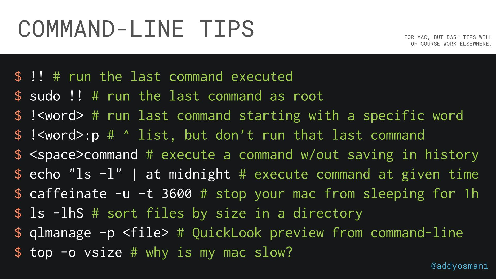

# Linux and SSH

1. [Introduction](#introduction)
2. [RHEL](#rhel)
3. [Rocky Linux](#rocky-linux)
4. [VIM](#vim)
5. [Neovim](#neovim)
6. [SSH](#ssh)
7. [OpenSSL](#openssl)
8. [Linux Blogs](#linux-blogs)
9. [Spanish Linux Blogs](#spanish-linux-blogs)
10. [Youtube](#youtube)
11. [Reddit](#reddit)
12. [Linux Commands and Tools](#linux-commands-and-tools)
13. [Makefiles](#makefiles)
14. [Guestfish](#guestfish)
15. [BusyBox](#busybox)
16. [Bash](#bash)
17. [Questions and Answers](#questions-and-answers)
18. [Automation. Bash VS Python VS JavaScript](#automation-bash-vs-python-vs-javascript)
19. [Zsh](#zsh)
20. [ZX](#zx)
21. [bpftrace](#bpftrace)
22. [Linux processes](#linux-processes)
23. [Linux Memory](#linux-memory)
24. [KVM](#kvm)
25. [Linux and Kubernetes](#linux-and-kubernetes)
     1. [Systemd](#systemd)
     2. [Blogs](#blogs)
     3. [CommandLineFu](#commandlinefu)
     4. [Wait until Your Dockerized Database Is Ready before Continuing](#wait-until-your-dockerized-database-is-ready-before-continuing)
     5. [Copr Build System](#copr-build-system)
     6. [Pulp](#pulp)
     7. [Hashicorp](#hashicorp)
26. [Linux Libraries](#linux-libraries)
27. [Linux Networking](#linux-networking)
28. [Networking Protocols](#networking-protocols)
29. [Linux Hardening Security](#linux-hardening-security)
30. [Images](#images)
31. [Videos](#videos)
32. [Tweets](#tweets)

## Introduction

## RHEL

- [infoworld.com: Red Hat’s crime against CentOS](https://www.infoworld.com/article/3601202/red-hats-crime-against-centos.html) In the beginning, no one expected to get Red Hat Enterprise Linux for free. The end of CentOS as a free drop-in replacement is no cause for outrage.
- [arstechnica.com: CentOS is gone—but RHEL is now free for up to 16 production servers](https://arstechnica.com/gadgets/2021/01/centos-is-gone-but-rhel-is-now-free-for-up-to-16-production-servers/) RHEL is now free for dev teams, and it's even free in production for up to 16 systems.
- [arstechnica.com: Why Red Hat killed CentOS—a CentOS board member speaks](https://arstechnica.com/gadgets/2021/01/on-the-death-of-centos-red-hat-liaison-brian-exelbierd-speaks/) "The CentOS Board doesn't get to decide what Red Hat engineering teams do."
- [zdnet.com: Red Hat introduces free RHEL for open-source, non-profit organizations](https://www.zdnet.com/article/free-red-hat-enterprise-linux-for-open-source-non-profit-organizations/) Some CentOS users still aren't happy, but Red Hat is keeping its promise to open-source organizations that they'll have access to a free version of RHEL.
- [genbeta.com: Red Hat Enterprise Linux lanza una versión a bajo costo para llegar a más público de sectores de investigación y académico](https://www.genbeta.com/actualidad/red-hat-enterprise-linux-lanza-version-a-costo-para-llegar-a-publico-sectores-investigacion-academico)
- [makeuseof.com: The 4 Best RHEL-Based Alternatives to CentOS](https://www.makeuseof.com/best-centos-alternatives/) Now that CentOS is gone, you should make a switch to some other OS. Check out these four RHEL-based CentOS alternatives.
- [centos.org: Comparing Centos Linux and CentOS Stream](https://www.centos.org/cl-vs-cs/) The CentOS Project produces two variants: CentOS Linux and CentOS Stream. They are alike in many ways. Here’s what sets them apart.
- [makeuseof.com: The 7 Best Red Hat-Based Linux Distributions](https://www.makeuseof.com/best-red-hat-based-linux-distros/) Unlike other Linux distros, RHEL isn't free to download. But you can still enjoy its benefits by installing these free RHEL-based Linux distributions.

## Rocky Linux

- https://rockylinux.org

## VIM

- [VimWiki](https://github.com/vimwiki/vimwiki)
- [redhat.com: Vim: Basic and intermediate commands](https://www.redhat.com/sysadmin/vim-commands)
- [thevaluable.dev: A Vim Guide for Advanced Users](https://thevaluable.dev/vim-advanced/)
- [redhat.com: Recursive Vim macros: One step further into automating repetitive tasks](https://www.redhat.com/sysadmin/recursive-vim-macros) Take Vim to the limit with recursive macros.
- [openvim.com](https://openvim.com/) Interactive Vim tutorial for developers, sysadmins and Linux or Unix users.

## Neovim

- [neovim](https://neovim.io/) hyperextensible Vim-based text editor
- [blog.ashwinchat.com: 9 Months of Full Time Neovim + Tmux](https://blog.ashwinchat.com/9-months-of-full-time-vim/)

## SSH

- [gravitational.com: How to SSH Properly 🌟](https://gravitational.com/blog/how-to-ssh-properly/)
- [19 Common SSH Commands In Linux With Examples](https://phoenixnap.com/kb/linux-ssh-commands)
- [commandlinefu.com/commands/matching/ssh](https://www.commandlinefu.com/commands/matching/ssh/c3No/sort-by-votes)
- [Auto-SSH for Linux security](https://github.com/mohanad86/secure-ssh-python)
- [Grant-Revoke-ssh-access](https://github.com/suraksha-123/Grant-Revoke-ssh-access) To automate the process of granting ssh access to a group of servers instances
- [How to use SSH properly and what is SSH Agent Forwarding](https://dev.to/levivm/how-to-use-ssh-and-ssh-agent-forwarding-more-secure-ssh-2c32)
- [opensource.com: Bypass your Linux firewall with SSH over HTTP](https://opensource.com/article/20/7/linux-shellhub) Remote work is here to stay; use this helpful open source solution to quickly connect and access all your devices from anywhere.
- [Túneles SSH](https://www.atareao.es/ubuntu/tuneles-ssh)
- [paepper.com: How to properly manage ssh keys for server access](https://www.paepper.com/blog/posts/how-to-properly-manage-ssh-keys-for-server-access/)
- [goteleport.com: SSH Certificates Security. SSH Access Hardening 🌟](https://goteleport.com/blog/ssh-certificates/)
- [dev.to: How to Manage Multiple SSH Key Pairs](https://dev.to/josephmidura/how-to-manage-multiple-ssh-key-pairs-1ik)
- [thenewstack.io: SSH Made Easy with SSH Agent and SSH Config](https://thenewstack.io/ssh-made-easy-with-ssh-agent-and-ssh-config/)
- [linuxteck.com: 10 basic and most useful 'ssh' client commands in Linux](https://www.linuxteck.com/basic-ssh-client-commands-in-linux/)
- [==iximiuz.com: A Visual Guide to SSH Tunnels: Local and Remote Port Forwarding== 🌟](https://iximiuz.com/en/posts/ssh-tunnels/)

## OpenSSL

- [redhat.com: 6 OpenSSL command options that every sysadmin should know](https://www.redhat.com/sysadmin/6-openssl-commands) Look beyond generating certificate signing requests and see how OpenSSL commands can display practical information about certificates.
- [tecmint.com: Testssl.sh – Testing TLS/SSL Encryption Anywhere on Any Port](https://www.tecmint.com/testssl-sh-test-tls-ssl-encryption-in-linux-commandline/)

## Linux Blogs

- [The Linux Foundation](http://www.linuxfoundation.org/)
- [tecmint.com 🌟](https://www.tecmint.com/)
- [unixmen.com 🌟](https://unixmen.com/)
- [opensource.com 🌟](https://opensource.com/)
- [linuxteck.com](https://www.linuxteck.com/)
- [howtoforge.com](https://www.howtoforge.com/)
- [tecadmin.net](https://tecadmin.net/)
- [systemcodegeeks.com](https://www.systemcodegeeks.com/)
- [learnitguide.net 🌟](https://www.learnitguide.net/)
- [FOSS Force](http://fossforce.com/)
- [linuxhomenetworking.com](http://www.linuxhomenetworking.com/)
- [unixetc.co.uk](http://unixetc.co.uk/)
- [LWN.net](http://lwn.net/)
- [Linux-tutorial.info](http://www.linux-tutorial.info/)
- [The Lone Sysadmin](https://lonesysadmin.net/)
- [LinuxLinks.com](http://www.linuxlinks.com)
- [unixmages.com](http://unixmages.com)
- [The Geek Stuff](http://www.thegeekstuff.com/)
- [abarrak.gitbook.io: Linux SysOps Handbook 🌟](https://abarrak.gitbook.io/linux-sysops-handbook) A study notes book for the common knowledge and tasks of a Linux system admin.

## Spanish Linux Blogs

- [systemadmin.es](http://systemadmin.es/)
- [muylinux.com](http://www.muylinux.com/)
- [linuxadictos.com](http://www.linuxadictos.com)

## Youtube

- [Linux Skills](https://www.youtube.com/channel/UCu2eNnWy-zc1xt_shCXQQfA)
- [CLImagic](https://www.youtube.com/user/climagic)

## Reddit

## Linux Commands and Tools

- [**watchman command**: A File and Directory Watching Tool for Changes](https://www.tecmint.com/watchman-monitor-file-changes-in-linux/)
- [tecmint.com: vtop – A Linux Process and Memory Activity Monitoring Tool](https://www.tecmint.com/vtop-monitor-linux-process-usage/)
- [tecmint.com: How to Install htop on CentOS 8](https://www.tecmint.com/install-htop-on-centos-8/)
- [redhat.com: Save time at the command line with HTTPie instead of curl](https://www.redhat.com/sysadmin/curl-hack-httpie) Automate testing endpoints, downloading files, and submitting forms with HTTPie.
- [redhat.com: World domination with cgroups part 8: down and dirty with cgroup v2](https://www.redhat.com/en/blog/world-domination-cgroups-part-8-down-and-dirty-cgroup-v2)
- [freecodecamp.org: RSync Examples – Rsync Options and How to Copy Files Over SSH](https://www.freecodecamp.org/news/rsync-examples-rsync-options-and-how-to-copy-files-over-ssh/)
- [tecmint.com: How to Control Systemd Services on Remote Linux Server](https://www.tecmint.com/control-systemd-services-on-remote-linux-server/)
- [redhat.com: Using ssh-keygen and sharing for key-based authentication in Linux](https://www.redhat.com/sysadmin/configure-ssh-keygen) SSH key-based authentication is helpful for both security and convenience. See how to generate and share keys.
- [tecmint.com: How to Run Commands from Standard Input Using Tee and Xargs in Linux](https://www.tecmint.com/run-commands-from-standard-input-using-tee-and-xargs-in-linux/)
- [nikhilism.com: Mystery Knowledge and Useful Tools](https://nikhilism.com/post/2020/mystery-knowledge-useful-tools/)
- [igoroseledko.com: Parallel Rsync](https://www.igoroseledko.com/parallel-rsync/)
- [redhat.com: How to record your Linux terminal using asciinema](https://www.redhat.com/sysadmin/using-asciinema) Asciinema might be the application you've been looking for to demonstrate a skill or process that you want your colleagues or students to learn on-demand.
- [redhat.com: 5 advanced rsync tips for Linux sysadmins](https://www.redhat.com/sysadmin/5-rsync-tips) Use rsync compression and checksums to better manage file synchronization.
- [metacpan.org: a2p - Awk to Perl translator](https://metacpan.org/pod/App::a2p) A2p takes an awk script specified on the command line (or from standard input) and produces a comparable perl script on the standard output.
- [oilshell: Alternative shells](https://github.com/oilshell/oil/wiki/Alternative-Shells)
- [Timezone Bullshit](https://blog.wesleyac.com/posts/timezone-bullshit)
- [tecmint.com: Different Ways to Use Column Command in Linux](https://www.tecmint.com/linux-column-command/)
- [opensource.com: How to use the Linux grep command](https://opensource.com/article/21/3/grep-cheat-sheet)
- [tecmint.com: 10 Useful Commands to Collect System and Hardware Information in Linux](https://www.tecmint.com/commands-to-collect-system-and-hardware-information-in-linux)
- [opensource.com: Don't love diff? Use Meld instead](https://opensource.com/article/20/3/meld) Meld is a visual diff tool that makes it easier to compare and merge changes in files, directories, Git repos, and more.
- [kalilinuxtutorials.com: Ldsview : Offline search tool for LDAP directory dumps in LDIF format](https://kalilinuxtutorials.com/ldsview/)
- [linuxtechlab.com: Search a file in Linux using Find & Locate command](https://linuxtechlab.com/search-a-file-in-linux-using-find-locate-command/)
- [tecmint.com: How to Install and Configure ‘Collectd’ and ‘Collectd-Web’ to Monitor Server Resources in Linux](https://www.tecmint.com/install-collectd-and-collectd-web-to-monitor-server-resources-in-linux/)
- [sysadminxpert.com: How to watch real time TCP and UDP ports on Linux (netstat & ss) 🌟](https://sysadminxpert.com/how-to-watch-real-time-tcp-and-udp-ports-on-linux/)
- [linuxteck.com: 15 basic curl command in Linux with practical examples](https://www.linuxteck.com/curl-command-in-linux-with-examples/)
- [linuxteck.com: 12 basic cat command in Linux with examples](https://www.linuxteck.com/basic-cat-command-in-linux-with-examples/)
- [tecmint.com: How to Find Recent or Today’s Modified Files in Linux 🌟](https://www.tecmint.com/find-recent-modified-files-in-linux/)
- [linuxshelltips.com: How to Use Netcat to Scan Open Ports in Linux 🌟](https://www.linuxshelltips.com/netcat-linux-port-scanning)
- [Rclone 🌟🌟🌟](https://rclone.org/) Rclone is a command line program to manage files on cloud storage. It is a feature rich alternative to cloud vendors' web storage interfaces. Over 40 cloud storage products support rclone including S3 object stores, business & consumer file storage services, as well as standard transfer protocols. Rclone has powerful cloud equivalents to the unix commands rsync, cp, mv, mount, ls, ncdu, tree, rm, and cat. Rclone's familiar syntax includes shell pipeline support, and --dry-run protection. It is used at the command line, in scripts or via its API.
- [blog.ycrash.io: dmesg – Unix/Linux command, beginners introduction with examples](https://blog.ycrash.io/2021/06/28/dmesg-unix-linux-command-beginners-introduction-with-examples/)
- [opensource.com: Use XMLStarlet to parse XML in the Linux terminal](https://opensource.com/article/21/7/parse-xml-linux) Become an XML star with XMLStarlet, an XML toolkit for your terminal.
- [redhat.com: 5 Linux commands I'm going to start using](https://www.redhat.com/sysadmin/5-linux-commands) Five standard Linux commands that can make your life much easier.
- [nginx.com: What Are Namespaces and cgroups, and How Do They Work? 🌟](https://www.nginx.com/blog/what-are-namespaces-cgroups-how-do-they-work) Namespaces provide isolation of system resources, and cgroups allow for fine‑grained control and enforcement of limits for those resources. Containers are not the only way that you can use namespaces and cgroups. Namespaces and cgroup interfaces are built into the Linux kernel, which means that other applications can use them to provide separation and resource constraints.
- [opensource.com: Check used disk space on Linux with du](https://opensource.com/article/21/7/check-disk-space-linux-du) Find out how much disk space you're using with the Linux du command.
- [linuxshelltips.com: How to Kill Running Linux Process on Particular Port](https://www.linuxshelltips.com/kill-linux-process-with-port/)
- [freecodecamp.org: The Linux Command Handbook 🌟](https://www.freecodecamp.org/news/the-linux-commands-handbook/)
- [sysadminxpert.com: How to do Security Auditing of CentOS System Using Lynis Tool](https://sysadminxpert.com/how-to-do-security-auditing-of-centos-system-using-lynis-tool/)
- [tecmint.com: 10 Practical Examples of Rsync Command in Linux](https://www.tecmint.com/rsync-local-remote-file-synchronization-commands/)
- [tecmint.com: 10 Useful du (Disk Usage) Commands to Find Disk Usage of Files and Directories](https://www.tecmint.com/check-linux-disk-usage-of-files-and-directories/)
- [tecmint.com: What’s Difference Between Grep, Egrep and Fgrep in Linux?](https://www.tecmint.com/difference-between-grep-egrep-and-fgrep-in-linux/)
- [opensource.com: Check file status on Linux with the stat command](https://opensource.com/article/21/8/linux-stat-file-status)
- [tecmint.com: How to Kill Linux Process Using Kill, Pkill and Killall](https://www.tecmint.com/how-to-kill-a-process-in-linux/)
- [linuxteck.com: 13 Top command in Linux (Monitor Linux Server Processes) 🌟](https://www.linuxteck.com/13-top-command-in-linux/)
- [commandlinefu.com: Compare directories via diff](https://www.commandlinefu.com/commands/view/9116/compare-directories-via-diff): `diff -rq dirA dirB`
- [opensource.com: Check Java processes on Linux with the jps command](https://opensource.com/article/21/10/check-java-jps) With many processes running on a system, it's useful to have a quick way to identify only Java with the jps command.
- [opensource.com: Get memory use statistics with this Linux command-line tool](https://opensource.com/article/21/10/memory-stats-linux-smem) The smem command allows you to quickly view your web applications' memory use.
- [redhat.com: 3 basic Linux group management commands every sysadmin should know](https://www.redhat.com/sysadmin/linux-commands-manage-groups) How to use the groupadd, groupmod, and groupdel commands is essential knowledge for Linux sysadmins.
- [itsfoss.com/exa](https://itsfoss.com/exa) **exa**: A Modern Replacement for the ls Command
- [opensource.com: Linux tips for using cron to schedule tasks](https://opensource.com/article/21/11/cron-linux) Schedule backups, file cleanups, and other tasks by using this simple yet powerful Linux command-line tool. Download our new cron cheat sheet.
- [opensource.com: 7 handy tricks for using the Linux wget command](https://opensource.com/article/21/10/linux-wget-command) Download files from the internet in your Linux terminal. Get the most out of the wget command with our new cheat sheet.
- [makeuseof.com: The 6 Best Command Line Tools to Monitor Linux Performance in the Terminal](https://www.makeuseof.com/best-cli-tools-to-monitor-linux-performance-terminal/) Want to track and debug Linux System resources, storage, and network-related problems? Get started with the best Linux performance monitoring tools.
- [opensource.com: 4 Linux tools to erase your data](https://opensource.com/article/21/10/linux-tools-erase-data) Erase data from your hard disk drive with these open source tools.
- [==redhat.com: 20 one-line Linux commands to add to your toolbox==](https://www.redhat.com/sysadmin/one-line-linux-commands) Every Linux user has a favorite single-line command. Here are the 20 Linux commands we can't live without.
- [termshark](https://github.com/gcla/termshark) A terminal UI for tshark, inspired by Wireshark
- [opensource.com: Record your terminal session with Asciinema](https://opensource.com/article/22/1/record-terminal-session-asciinema)
- [redhat.com: 5 scripts for getting started with the Nmap Scripting Engine](https://www.redhat.com/sysadmin/nmap-scripting-engine) The NSE boosts Nmap's power by adding scripting capabilities (custom or community-created) to the network scanning tool.
- [redhat.com: Linux troubleshooting commands: 4 tools for DNS name resolution problems](https://www.redhat.com/sysadmin/DNS-name-resolution-troubleshooting-tools) Find out what's stopping you from accessing a server, printer, or another network resource with these four Linux troubleshooting commands.
- [==jvns.ca: A list of new(ish) command line tools | Julia Evans==](https://jvns.ca/blog/2022/04/12/a-list-of-new-ish--command-line-tools/)
- [itsfoss.com: 5 htop Alternatives to Enhance Your Linux System Monitoring Experience](https://itsfoss.com/htop-alternatives/)
- [dev.to: 50 Linux Commands every developer NEED to know with example](https://dev.to/kanani_nirav/50-linux-commands-every-developer-need-to-know-with-example-mc)
- [difftastic.wilfred.me.uk](https://difftastic.wilfred.me.uk) Difftastic is a CLI diff tool that compares files based on their syntax, not line-by-line. Difftastic produces accurate diffs that are easier for humans to read.
- [digitalocean.com: How To Use Journalctl to View and Manipulate Systemd Logs 🌟](https://www.digitalocean.com/community/tutorials/how-to-use-journalctl-to-view-and-manipulate-systemd-logs)
- [github.com/curl/wcurl 🌟](https://github.com/curl/wcurl) a simple wrapper around curl to easily download files
    - [blog.techiescamp.com: wcurl: A Simple Wrapper for curl to download files](https://blog.techiescamp.com/docs/wcurl/)

## Makefiles

- [makefiletutorial.com 🌟](https://makefiletutorial.com/) Learn Makefiles With the tastiest examples

## Guestfish

- [Guestfish](https://libguestfs.org/guestfish.1.html)
- [redhat.com: How to customize VM and cloud images with guestfish](https://www.redhat.com/sysadmin/customize-vm-cloud-images-guestfish) Need to tweak your cloud and virtual machine images to comply with company policies or other requirements? Give guestfish a try.

## BusyBox

- [busybox.net](https://www.busybox.net/) BusyBox: The Swiss Army Knife of Embedded Linux
- [genbeta.com: BusyBox, el ejecutable que agrupa casi 200 utilidades Unix de línea de comandos (y que puedes usar también en Windows o Android)](https://www.genbeta.com/herramientas/busybox-ejecutable-que-agrupa-casi-200-utilidades-gnu-linea-comandos-que-puedes-usar-tambien-windows-android)

## Bash

- [igoroseledko.com: Checking Multiple Variables in Bash](https://www.igoroseledko.com/checking-multiple-variables-in-bash/)
- [Introduction to Bash Scripting Interactive training](https://ebook.bobby.sh/training.html)
    - [dev.to: Introduction to Bash Scripting - A DO Hackathon Submission](https://dev.to/bobbyiliev/introduction-to-bash-scripting-5571)
- [datafix.com.au: BASHing data - Data ops on the Linux command line 🌟](https://datafix.com.au/BASHing/)
- [redhat.com: Bash scripting: How to read data from text files](https://www.redhat.com/sysadmin/data-text-files) Here's how to extract data from a text file such as reading in a list of servers to test connectivity to them.
- [pement.org: Over 100 sed one-liners](http://www.pement.org/sed/sed1line.txt)
- [github: Safe ways to do things in bash](https://github.com/anordal/shellharden/blob/master/how_to_do_things_safely_in_bash.md)
- [rexegg.com: Regex Syntax Tricks](https://rexegg.com/regex-tricks.html)
- [pement.org: Handy one-line scripts for AWK](http://www.pement.org/awk/awk1line.txt)
- [robertmuth.blogspot.com: Better Bash Scripting in 15 Minutes](http://robertmuth.blogspot.com/2012/08/better-bash-scripting-in-15-minutes.html)
- [Bash Pitfalls 🌟](http://mywiki.wooledge.org/BashPitfalls)
- [opensource.com: Parsing config files with Bash](https://opensource.com/article/21/6/bash-config) Separating config files from code enables anyone to change their configurations without any special programming skills.
- [opensource.com: How to include options in your Bash shell scripts](https://opensource.com/article/21/8/option-parsing-bash)
- [redhat.com: Audit user accounts for never-expiring passwords with a Bash script](https://www.redhat.com/sysadmin/find-non-expiring-passwords) Non-expiring passwords might violate your organization's policies, so use this basic Bash script to quickly pick them out.
- [thenewstack.io: An Introduction to AWK](https://thenewstack.io/an-introduction-to-awk/)
- [redhat.com: 2 Bash commands to change strings in multiple files at once](https://www.redhat.com/sysadmin/edit-text-bash-command) Search and replace text in several files simultaneously, right from the Linux terminal, to gain efficiency and minimize mistakes.
- [fedoramagazine.org: Bash Shell Scripting for beginners (Part 1)](https://fedoramagazine.org/bash-shell-scripting-for-beginners-part-1/)
- [igoroseledko.com: Awk & sed Snippets for SysAdmins](https://www.igoroseledko.com/awk-sed-snippets-for-sysadmins/)
- [dev.to: Writing Bash Scripts Like A Pro - Part 1 - Styling Guide](https://dev.to/unfor19/writing-bash-scripts-like-a-pro-part-1-styling-guide-4bin)
- [linuxhandbook.com: Unusual Ways to Use Variables Inside Bash Scripts](https://linuxhandbook.com/variables-bash-script/)
- [opensource.com: An introduction to programming with Bash (eBook)](https://opensource.com/downloads/bash-programming-guide)
- [pythonspeed.com: Please stop writing shell scripts](https://pythonspeed.com/articles/shell-scripts/)
- [linuxshelltips.com: What’s the Difference Between ${} and $() in Bash](https://www.linuxshelltips.com/difference-between-and-in-bash/)
- [==youtube: Bash for Beginners==](https://www.youtube.com/playlist?list=PLlrxD0HtieHh9ZhrnEbZKhzk0cetzuX7l) Bash is considered a universal language when it comes to cloud computing and programming. Many languages support Bash commands to pass data and information and when it comes to the Cloud, all platforms support using it to interact with your environment.

## Questions and Answers

- [redhat.com: 5 questions to ask during your next sysadmin interview](https://www.redhat.com/sysadmin/5-questions-interview)
- [==trimstray/test-your-sysadmin-skills==](https://github.com/trimstray/test-your-sysadmin-skills) A collection of Linux Sysadmin Test Questions and Answers. Test your knowledge and skills in different fields with these Q/A.

## Automation. Bash VS Python VS JavaScript

## Zsh

- [Oh My Zsh](https://ohmyz.sh/) Oh My Zsh is a delightful, open source, community-driven framework for managing your Zsh configuration. It comes bundled with thousands of helpful functions, helpers, plugins, themes, and a few things that make you shout...
- [zshdb.readthedocs.io](https://zshdb.readthedocs.io) zshdb - a gdb-like debugger for zsh
- [github.com/zsh-users/zsh-autosuggestions 🌟](https://github.com/zsh-users/zsh-autosuggestions) Fish-like autosuggestions for zsh

## ZX

- [zx](https://github.com/google/zx) A tool for writing better scripts

## bpftrace

- [bpftrace](https://github.com/iovisor/bpftrace) High-level tracing language for Linux eBPF. bpftrace is pretty impressive in terms of conciseness and practicality of their docs.
- https://github.com/iovisor/bpftrace/blob/master/docs/reference_guide.md
- https://github.com/iovisor/bpftrace/blob/master/docs/tutorial_one_liners.md
- https://github.com/iovisor/bpftrace/blob/master/docs/internals_development.md

## Linux processes

- [percona.com: How Much Memory Does the Process Really Take on Linux? 🌟](https://www.percona.com/blog/2020/09/11/how-much-memory-does-the-process-really-take-on-linux/)

## Linux Memory

- [learnsteps.com: Difference between minor page faults vs major page faults](https://www.learnsteps.com/difference-between-minor-page-faults-vs-major-page-faults/)

## KVM

- [github.com/cyberus-technology/virtualbox-kvm: KVM Backend for VirtualBox 🌟](https://github.com/cyberus-technology/virtualbox-kvm) This repository contains a KVM backend for the open source virtualization tool VirtualBox. With this backend, Linux KVM is used as the underlying hypervisor.

## Linux and Kubernetes

- [tldp.org: The Linux System Administrator's Guide 🌟](https://tldp.org/LDP/sag/html/index.html)
- [How Linux PID namespaces work with containers 🌟](https://www.redhat.com/sysadmin/linux-pid-namespaces)

### Systemd

- [Start using systemd as a troubleshooting tool](https://opensource.com/article/20/5/systemd-troubleshooting-tool) While systemd is not really a troubleshooting tool, the information in its output points the way toward solving problems.

### Blogs

- [climagic.org](http://www.climagic.org)
- [Linux 101 Hacks](http://linux.101hacks.com/)
- [The Art of Command Line](https://github.com/jlevy/the-art-of-command-line)

### CommandLineFu

- [CommandLineFu 🌟](https://www.commandlinefu.com)

### Wait until Your Dockerized Database Is Ready before Continuing

- [Wait until Your Dockerized Database Is Ready before Continuing](https://nickjanetakis.com/blog/wait-until-your-dockerized-database-is-ready-before-continuing) A zero dependency Bash script that waits until a command of your choosing has run successfully
    - [github.com/nickjj/wait-until](https://github.com/nickjj/wait-until)

### Copr Build System

- Building a repo with RPM packages from PyPI is super easy using Copr.
- [copr.fedorainfracloud.org](https://copr.fedorainfracloud.org/) Copr is an easy-to-use automatic build system providing a package repository as its output.
- [Copr](https://pagure.io/copr/copr)

### Pulp

- [pulpproject.org](https://pulpproject.org/) Fetch, Upload, Organize, and Distribute Software Packages.

### Hashicorp

## Linux Libraries

- [How to handle dynamic and static libraries in Linux](https://opensource.com/article/20/6/linux-libraries)

## Linux Networking

- [ntop](http://www.ntop.org/)
- [Angry IP Scanner (or simply ipscan)](http://angryip.org/) to Nmap and cross-platform
- [binarytides.com - 10 examples of Linux ss command to monitor network connections](http://www.binarytides.com/linux-ss-command/)
- [Linux networking examples and tutorials for advanced users](https://github.com/knorrie/network-examples) Includes lab examples for lxc, bgp, vpn, & more
- [Diferencias entre servidor proxy y servidor proxy inverso](https://www.redeszone.net/tutoriales/servidores/diferencias-proxy-vs-proxy-inverso/)
- [redhat.com: 6 tcpdump network traffic filter options](https://www.redhat.com/sysadmin/tcpdump-part-one) The first six of eighteen common tcpdump options that you should use for network troubleshooting and analysis.
- [redhat.com: Learn the networking basics every sysadmin needs to know](https://www.redhat.com/sysadmin/sysadmin-essentials-networking-basics)
- [tecmint.com: 16 Useful Bandwidth Monitoring Tools to Analyze Network Usage in Linux](https://www.tecmint.com/linux-network-bandwidth-monitoring-tools/)
- [iximiuz.com: Illustrated introduction to Linux iptables](https://iximiuz.com/en/posts/laymans-iptables-101/)
- [linuxteck.com: 15 basic useful firewall-cmd commands in Linux](https://www.linuxteck.com/basic-useful-firewall-cmd-commands-in-linux/)
- [tecmint.com: 20 Netstat Commands for Linux Network Management](https://www.tecmint.com/20-netstat-commands-for-linux-network-management/)
- [redhat.com: 5 Linux network troubleshooting commands 🌟](https://www.redhat.com/sysadmin/five-network-commands) Linux provides many command-line tools to help sysadmins manage, configure, and troubleshoot network settings.

## Networking Protocols

- [freecodecamp.org: TCP vs. UDP — What's the Difference and Which Protocol is Faster?](https://www.freecodecamp.org/news/tcp-vs-udp/)
- [howdns.works](https://howdns.works/) A fun and colorful explanation of how DNS works.

## Linux Hardening Security

- [cyberciti.biz: 40 Linux Server Hardening Security Tips [2022 edition]](https://www.cyberciti.biz/tips/linux-security.html)

## Images

??? note "Click to expand!"

	

	
	

## Videos

??? note "Click to expand!"

	

    <iframe width="560" height="315" src="https://www.youtube.com/embed/videoseries?si=wIr50Eu2-ZPwdI6N&amp;list=PLlrxD0HtieHh9ZhrnEbZKhzk0cetzuX7l" title="YouTube video player" frameborder="0" allow="accelerometer; autoplay; clipboard-write; encrypted-media; gyroscope; picture-in-picture; web-share" referrerpolicy="strict-origin-when-cross-origin" allowfullscreen></iframe>
	

## Tweets

  
Click to expand!

<blockquote class="twitter-tweet">
bash for president <a href="https://t.co/CpIQh23az1">pic.twitter.com/CpIQh23az1</a>
&mdash; memenetes (@memenetes) <a href="https://twitter.com/memenetes/status/1407081109570166791?ref_src=twsrc%5Etfw">June 21, 2021</a></blockquote> 

<blockquote class="twitter-tweet">
DEPRECATED LINUX COMMANDS AND THEIR REPLACEMENTS💻  A short overview for Linux commands that have been replaced.❌
&mdash; Seb 🇧🇦 (@LinuxSeb) <a href="https://twitter.com/LinuxSeb/status/1443393886865408002?ref_src=twsrc%5Etfw">September 30, 2021</a></blockquote> 

<blockquote class="twitter-tweet">
Linux has so many built-in password managers:  syslog .bash_history .zsh_history .mysql_history …
&mdash; 🇫🇷 Jean-Ph˙ ͜ʟ˙ppe 🇪🇺 (@Jipe_) <a href="https://twitter.com/Jipe_/status/1450181992260177923?ref_src=twsrc%5Etfw">October 18, 2021</a></blockquote> 

<blockquote class="twitter-tweet">
4000 Linux commands every programmer should know  A thread 🧵
&mdash; The Best Linux Blog In the Unixverse 🪔 (@nixcraft) <a href="https://twitter.com/nixcraft/status/1455835061182291981?ref_src=twsrc%5Etfw">November 3, 2021</a></blockquote> 

<blockquote class="twitter-tweet">
SSH Port Forwarding: Why and How 🧵  If these problems sound familiar:  - A db server listens on a remote localhost, but you want to use a local GUI client - A dev service runs on your laptop, but you want to expose it to the Internet  ...and you don&#39;t know the solution, read on! <a href="https://t.co/V4snfb1r3z">pic.twitter.com/V4snfb1r3z</a>
&mdash; Ivan Velichko (@iximiuz) <a href="https://twitter.com/iximiuz/status/1587451857143828481?ref_src=twsrc%5Etfw">November 1, 2022</a></blockquote> 

<blockquote class="twitter-tweet">
In vim, you can type :e **/foo, then press tab and it&#39;ll find you a file with &quot;foo&quot; in its name.  You can press tab many times, and vim will iterate over the matching files.  Works in vanilla vim (no plugins), so you can use this trick on any Linux server you happen to log in to.
&mdash; Ivan Velichko (@iximiuz) <a href="https://twitter.com/iximiuz/status/1588948188399947776?ref_src=twsrc%5Etfw">November 5, 2022</a></blockquote> 

<blockquote class="twitter-tweet">
Want to master Linux? Open this: 🧵
&mdash; Rohit Ghumare | That #DevOps Guy✍️ (@ghumare64) <a href="https://twitter.com/ghumare64/status/1590550565142290432?ref_src=twsrc%5Etfw">November 10, 2022</a></blockquote> 

<blockquote class="twitter-tweet">
How to make rsync faster? <a href="https://t.co/bIdizhoNoS">pic.twitter.com/bIdizhoNoS</a>
&mdash; Rakesh Jain (@devops_tech) <a href="https://twitter.com/devops_tech/status/1633732722329001985?ref_src=twsrc%5Etfw">March 9, 2023</a></blockquote> 

