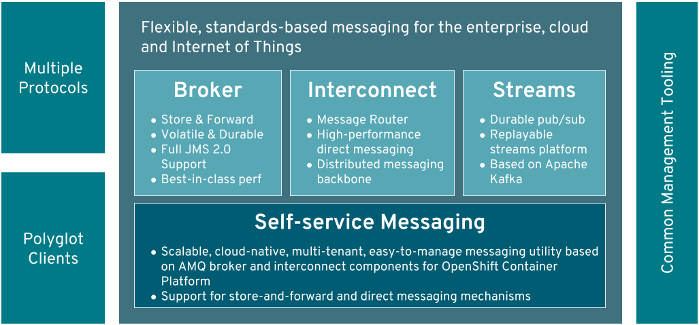

# Cloud Based Integration & Messaging. Data Processing & Streaming (aka Data Pipeline)
- [Message Queue in Kubernetes. Event-driven Messaging. Real-Time Data Streaming](#message-queue-in-kubernetes-event-driven-messaging-real-time-data-streaming)
- [Message Brokers](#message-brokers)
    - [ActiveMQ message broker](#activemq-message-broker)
    - [RabbitMQ message broker](#rabbitmq-message-broker)
    - [Redis message broker](#redis-message-broker)
    - [Apache Camel message broker](#apache-camel-message-broker)
        - [Apache Camel K](#apache-camel-k)
    - [KubeMQ message broker](#kubemq-message-broker)
- [Cloud Based Integration. Integration Platform-as-a-Service (iPaaS) solutions](#cloud-based-integration-integration-platform-as-a-service-ipaas-solutions)
    - [Red Hat Fuse and Red Hat Fuse Online](#red-hat-fuse-and-red-hat-fuse-online)
    - [Syndesis open source integration platform](#syndesis-open-source-integration-platform)
- [Debezium open source distributed platform for Change Data Capture (CDC) software design pattern](#debezium-open-source-distributed-platform-for-change-data-capture-cdc-software-design-pattern)
- [Red Hat Integration service registry and Apicurio](#red-hat-integration-service-registry-and-apicurio)
- [Data Processing (aka Streaming Data, Data Pipeline or Big Data Pipeline)](#data-processing-aka-streaming-data-data-pipeline-or-big-data-pipeline)
    - [Apache Kafka](#apache-kafka)
    - [Banzai Cloud Supertubes (Cloud Native Kafka implementation)](#banzai-cloud-supertubes-cloud-native-kafka-implementation)
    - [Apache Flink](#apache-flink)
- [Red Hat AMQ (ActiveMQ Artemis broker and Apache Kafka)](#red-hat-amq-activemq-artemis-broker-and-apache-kafka)
    - [Red Hat AMQ Broker (ActiveMQ Artemis)](#red-hat-amq-broker-activemq-artemis)
    - [Red Hat AMQ Streams](#red-hat-amq-streams)
- [eBooks](#ebooks)
- [Related](#related)

## Message Queue in Kubernetes. Event-driven Messaging. Real-Time Data Streaming
- [Wikipedia: Message Broker](https://en.wikipedia.org/wiki/Message_broker)
- [Wikipedia: Event-driven messaging](https://en.wikipedia.org/wiki/Event-driven_messaging)
- [Wikipedia: Streaming Data](https://en.wikipedia.org/wiki/Streaming_data)

## Message Brokers
- [Apache ActiveMQ](https://activemq.apache.org/)
- [Dzone: Introduction to Message Brokers. Part 1: Apache Kafka vs. RabbitMQ](https://dzone.com/articles/introduction-to-message-brokers-part-1-apache-kafk)
- [Dzone: Introduction to Message Brokers. Part 2: ActiveMQ vs. Redis Pub/Sub](https://dzone.com/articles/introduction-to-message-brokers-part-2-activemq-vs)

### ActiveMQ message broker
- [ActiveMQ 5.x "classic"](https://activemq.apache.org/components/classic/)
- [ActiveMQ Artemis](https://activemq.apache.org/components/artemis/) Apache ActiveMQ is a subproject of Apache ActiveMQ. It has been donated to the Apache Software Foundation in 2015. There were lots of changes in project names in the past. The Artemis project first started as JBoss Messaging and got renamed to HornetQ in August 2009.
- [Apache Artemis JMeter](https://github.com/apache/activemq-artemis/tree/master/examples/perf/jmeter) Running the ActiveMQ Artemis JMeter Performance Testing Examples.

### RabbitMQ message broker
- [K8s prevent queue worker Pod from being killed during deployment](https://itnext.io/k8s-prevent-queue-worker-pod-from-being-killed-during-deployment-4252ea7c13f6) How to prevent a Kubernetes (like RabbitMQ) queue worker Pod from being killed during deployment while handling a message?
- [medium.com: **RabbitMQ vs. Kafka**](https://medium.com/better-programming/rabbitmq-vs-kafka-1ef22a041793) An architect’s dilemma

### Redis message broker
- [Redis](https://redis.io/)
- [Redis Pub/sub](https://redis.io/topics/pubsub)

### Apache Camel message broker
- [Apache Camel](https://camel.apache.org/)
- [Quora.com: What's the difference between Apache Camel and Kafka?](https://www.quora.com/Whats-the-difference-between-Apache-Camel-and-Kafka)

#### Apache Camel K
- [Apache Camel K](https://camel.apache.org/camel-k/latest/) is a lightweight cloud-integration platform that runs natively on Kubernetes. Based on the famous Apache Camel, Camel K is designed and optimized for serverless and microservices architectures.
- [developers.redhat.com: Six reasons to love Camel K](https://developers.redhat.com/blog/2020/05/12/six-reasons-to-love-camel-k/)

### KubeMQ message broker
- [KubeMQ.io: Kubernetes Native Message Queue Broker](https://kubemq.io/)
- [devops.com: Best of 2019: Implementing Message Queue in Kubernetes](https://devops.com/implementing-message-queue-in-kubernetes/)
- [kubemq.io: Kafka VS KubeMQ 🌟](https://kubemq.io/kafka-vs-kubemq/)

## Cloud Based Integration. Integration Platform-as-a-Service (iPaaS) solutions 
- [Wikipedia: Cloud Based Integration (iPaaS)](https://en.wikipedia.org/wiki/Cloud-based_integration)
- Integration Platform as a Service (iPaaS) is a suite of cloud services enabling development, execution and governance of integration flows connecting any combination of on premises and cloud-based processes, services, applications and data within individual or across multiple organizations.
- Integration platform as a service (iPaaS) is a set of automated tools for connecting software applications that are deployed in different environments. iPaaS is often used by large business-to-business (B2B) enterprises that need to integrate on-premises applications and data with cloud applications and data.
- [blog.axway.com: What is iPaaS?](https://blog.axway.com/hybrid-integration/whats-ipaas)
- [ibm.com: iPaaS (Integration-Platform-as-a-Service)](https://www.ibm.com/cloud/learn/ipaas): iPaaS is a cloud-based solution that simplifies application integration across on-premises and cloud environments, to help you accelerate innovation and lower your integration and operations costs.

### Red Hat Fuse and Red Hat Fuse Online
- [**Red Hat Fuse**](https://www.redhat.com/en/technologies/jboss-middleware/fuse)
- [**Red Hat Fuse Online**](https://www.redhat.com/en/technologies/jboss-middleware/fuse-online)
    
### Syndesis open source integration platform 
- [**Syndesis** open source integration platform](https://syndesis.io/) (OpenSource Project for **Red Hat Fuse Online**)
- [developers.redhat.com: Low-code microservices orchestration with Syndesis](https://developers.redhat.com/blog/2020/03/25/low-code-microservices-orchestration-with-syndesis/)

## Debezium open source distributed platform for Change Data Capture (CDC) software design pattern
- **Change Data Capture**, or **CDC**, is a well-established **software design pattern** for a system that monitors and captures the changes in data so that other software can respond to those changes. CDC captures row-level changes to database tables and passes corresponding change events to a data streaming bus. Applications can read these change event streams and access these change events in the order in which they occurred.
- [**Debezium**:](https://debezium.io/) Stream changes from your database
- [developers.redhat.com: Decoupling microservices with Apache Camel and Debezium](https://developers.redhat.com/blog/2019/11/19/decoupling-microservices-with-apache-camel-and-debezium/)
- [A good explanation of how to avoid distributed transactions using outbox pattern: Transaction Log Tailing With Debezium](https://medium.com/trendyol-tech/transaction-log-tailing-with-debezium-part-1-aeb968d72220)
- [developers.redhat.com: Capture database changes with Debezium Apache Kafka connectors](https://developers.redhat.com/blog/2020/04/14/capture-database-changes-with-debezium-apache-kafka-connectors/)

## Red Hat Integration service registry and Apicurio
- [Red Hat Integration service registry](https://developers.redhat.com/blog/2019/12/16/getting-started-with-red-hat-integration-service-registry/)
- [**Apicurio** Registry](https://github.com/apicurio/apicurio-registry) An API/Schema registry - stores APIs and Schemas.

## Data Processing (aka Streaming Data, Data Pipeline or Big Data Pipeline)
- [Awesome Streaming](https://github.com/manuzhang/awesome-streaming) A curated list of awesome [streaming (stream processing)](https://www.oreilly.com/radar/the-world-beyond-batch-streaming-101/) frameworks, applications, readings and other resources.

### Apache Kafka
- [Apache Kafka](https://kafka.apache.org/)
- [developers.redhat.com: how easy to deploy and configure a Kafka Connect on Kubernetes through strimziio operator and use secrets](https://developers.redhat.com/blog/2020/02/14/using-secrets-in-apache-kafka-connect-configuration/)
- [developers.redhat.com: Using secrets in Kafka Connect configuration](https://developers.redhat.com/blog/2020/02/14/using-secrets-in-apache-kafka-connect-configuration/)
- [developers.redhat.com: Capture database changes with Debezium Apache Kafka connectors](https://developers.redhat.com/blog/2020/04/14/capture-database-changes-with-debezium-apache-kafka-connectors/)
- [Awesome Kafka](https://github.com/monksy/awesome-kafka/blob/master/tools.md)

### Banzai Cloud Supertubes (Cloud Native Kafka implementation)
- [Banzai Cloud](https://banzaicloud.com/)
- [Banzai Kafka Operator](https://github.com/banzaicloud/kafka-operator)
- [The benefits of integrating Apache Kafka with Istio](https://banzaicloud.com/blog/kafka-on-istio-benefits/)

### Apache Flink
- [Apache Flink](https://flink.apache.org/) Apache Flink is a framework and distributed processing engine for stateful computations over unbounded and bounded data streams. Flink has been designed to run in all common cluster environments, perform computations at in-memory speed and at any scale.
- [How to set up Apache Flink on Kubernetes for real time data processing](https://ci.apache.org/projects/flink/flink-docs-stable/ops/deployment/kubernetes.html)

## Red Hat AMQ (ActiveMQ Artemis broker and Apache Kafka)
- [**Red Hat AMQ overview**](https://developers.redhat.com/products/amq/overview)
- [Red Hat AMQ](https://www.redhat.com/en/technologies/jboss-middleware/amq) = AMQ Broker (Apache ActiveMQ Artemis) + AMQ Streams (Apache Kafka)

### Red Hat AMQ Broker (ActiveMQ Artemis)
- [Apache ActiveMQ Artemis broker](https://activemq.apache.org/components/artemis/)
- [developers.redhat.com: JDBC Master-Slave Persistence setup with Activemq using Postgresql database](https://developers.redhat.com/blog/2017/10/05/jdbc-master-slave-persistence-setup-activemq-using-postgresql-database)

### Red Hat AMQ Streams
- [Understanding Red Hat AMQ Streams components for OpenShift and Kubernetes 🌟](https://developers.redhat.com/blog/2019/12/04/understanding-red-hat-amq-streams-components-for-openshift-and-kubernetes-part-1/)
- [Red Hat **AMQ streams** (kafka): Simplify Apache Kafka on Red Hat OpenShift](https://www.redhat.com/en/resources/amq-streams-datasheet)
- [Set up **Red Hat AMQ Streams** custom certificates on OpenShift](https://developers.redhat.com/blog/2020/04/01/set-up-red-hat-amq-streams-custom-certificates-on-openshift-update/)

Product|Also Known As|Components|URL
:------|:----|:--------|:----
Red Hat AMQ 6|JBoss AMQ 6|Apache ActiveMQ|[Ref](https://access.redhat.com/documentation/en-us/red_hat_amq/6.3/)
Red Hat AMQ 7|JBoss AMQ 7 (Broker) or Red Hat AMQ 7 Suite|AMQ Broker + AMQ Streams|[Ref](https://access.redhat.com/documentation/en-us/red_hat_amq/6.3/)
Red Hat AMQ 7|JBoss AMQ 7 (Broker) or Red Hat AMQ 7 Suite|JBoss AMQ 7 (Broker) + Apache Kafka|[Ref](https://access.redhat.com/documentation/en-us/red_hat_amq/6.3/)
Red Hat AMQ 7|JBoss AMQ 7 (Broker) or Red Hat AMQ 7 Suite|Apache ActiveMQ Artemis + Apache Kafka|[Ref](https://access.redhat.com/documentation/en-us/red_hat_amq/6.3/)

## eBooks
- [O'Really: Streaming data](http://streamingsystems.net/)

## Related
- [Service meshes to the rescue: Load balancing and scaling long-lived connections in Kubernetes](https://learnk8s.io/kubernetes-long-lived-connections)
