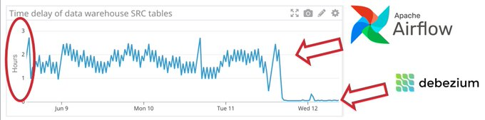
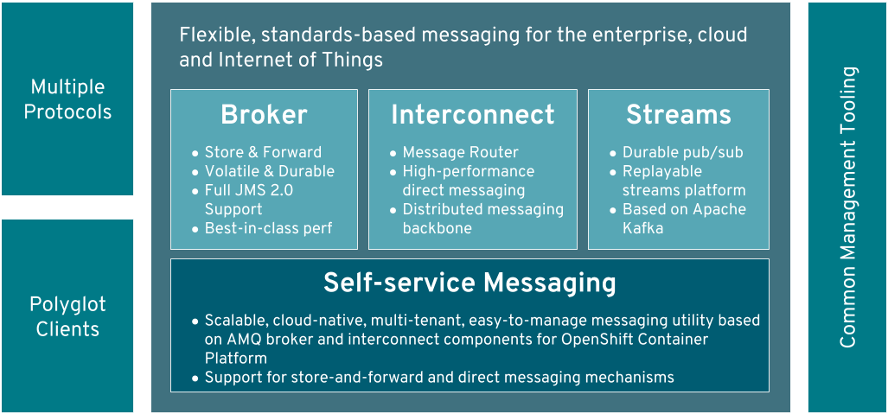

# Cloud Based Integration & Messaging. Data Processing & Streaming (aka Data Pipeline). Open Data Hub

1. [Message Queue in Kubernetes. Event-driven Messaging. Real-Time Data Streaming](#message-queue-in-kubernetes-event-driven-messaging-real-time-data-streaming)
2. [RPC vs Messaging](#rpc-vs-messaging)
3. [Tibco Business Works BWCE](#tibco-business-works-bwce)
4. [Message Brokers](#message-brokers)
    1. [ActiveMQ message broker](#activemq-message-broker)
    2. [RabbitMQ message broker](#rabbitmq-message-broker)
    3. [Redis message broker](#redis-message-broker)
    4. [Apache Camel message broker](#apache-camel-message-broker)
        1. [Apache Camel K](#apache-camel-k)
    5. [KubeMQ message broker](#kubemq-message-broker)
    6. [Google Cloud Platform Pub/Sub](#google-cloud-platform-pubsub)
    7. [JMS Message Queue vs. Apache Kafka](#jms-message-queue-vs-apache-kafka)
5. [Cloud Based Integration. Integration Platform-as-a-Service (iPaaS) solutions](#cloud-based-integration-integration-platform-as-a-service-ipaas-solutions)
    1. [Red Hat Fuse and Red Hat Fuse Online](#red-hat-fuse-and-red-hat-fuse-online)
    2. [Syndesis open source integration platform](#syndesis-open-source-integration-platform)
6. [Debezium open source distributed platform for Change Data Capture (CDC) software design pattern](#debezium-open-source-distributed-platform-for-change-data-capture-cdc-software-design-pattern)
7. [Red Hat Integration service registry and Apicurio](#red-hat-integration-service-registry-and-apicurio)
8. [Data Mesh](#data-mesh)
9. [Data Processing (aka Streaming Data, Data Pipeline or Big Data Pipeline)](#data-processing-aka-streaming-data-data-pipeline-or-big-data-pipeline)
    1. [Apache Kafka](#apache-kafka)
        1. [Kafka Tools](#kafka-tools)
        2. [Strimzi kubernetes operator for apache kafka](#strimzi-kubernetes-operator-for-apache-kafka)
        3. [Apache Kafka Desktop Clients](#apache-kafka-desktop-clients)
    2. [AWS Kinesis](#aws-kinesis)
    3. [MQTT](#mqtt)
    4. [Banzai Cloud Supertubes (Cloud Native Kafka implementation)](#banzai-cloud-supertubes-cloud-native-kafka-implementation)
    5. [Confluent Cloud (Apache Kafka Re-engineered for the Cloud)](#confluent-cloud-apache-kafka-re-engineered-for-the-cloud)
    6. [Redpanda (kafka alternative). A modern streaming platform for mission critical workloads](#redpanda-kafka-alternative-a-modern-streaming-platform-for-mission-critical-workloads)
        1. [KsqlDB](#ksqldb)
    7. [Apache Pulsar](#apache-pulsar)
    8. [Apache Flink](#apache-flink)
    9. [Hazelcast JET](#hazelcast-jet)
    10. [Postgress as message queue](#postgress-as-message-queue)
10. [Workflow Engines](#workflow-engines)
     1. [Zeebe](#zeebe)
     2. [Apache Airflow](#apache-airflow)
     3. [Couler](#couler)
11. [Red Hat AMQ (ActiveMQ Artemis broker and Apache Kafka)](#red-hat-amq-activemq-artemis-broker-and-apache-kafka)
     1. [Red Hat AMQ Broker (ActiveMQ Artemis)](#red-hat-amq-broker-activemq-artemis)
     2. [Red Hat AMQ Streams](#red-hat-amq-streams)
     3. [Slides of Red Hat AMQ Streams](#slides-of-red-hat-amq-streams)
12. [Open Data Hub AI-as-a-Service (AIaaS) platform](#open-data-hub-ai-as-a-service-aiaas-platform)
13. [Integration Platform as a Solution (iPaaS). Platforms for collecting, storing and routing customer event data](#integration-platform-as-a-solution-ipaas-platforms-for-collecting-storing-and-routing-customer-event-data)
     1. [IpaaS Vendors](#ipaas-vendors)
14. [eBooks](#ebooks)
15. [Related](#related)
16. [Questions and Answers](#questions-and-answers)
17. [Videos](#videos)
18. [Tweets](#tweets)

## Message Queue in Kubernetes. Event-driven Messaging. Real-Time Data Streaming

- [nginx.com: Event-Driven Data Management for Microservices 🌟](https://www.nginx.com/blog/event-driven-data-management-microservices/)
- [infoq.com: From Monolith to Event-Driven: Finding Seams in Your Future Architecture](https://www.infoq.com/articles/event-driven-finding-seams/)
- [thenewstack.io: The Rise of the Event Streaming Database 🌟](https://thenewstack.io/the-rise-of-the-event-streaming-database/)
- [ibm.com: Event-driven cloud-native applications (microservices)](https://www.ibm.com/cloud/architecture/architecture/practices/event-driven-cloud-native-apps-architecture) The event backbone is being part of the microservices mesh, providing the publish-and-subscribe communication between microservices and enabling the support of loosely coupled event-driven microservices.
- [stackoverflow.blog: How event-driven architecture solves modern web app problems 🌟](https://stackoverflow.blog/2020/03/16/how-event-driven-architecture-solves-modern-web-app-problems/) In this article, we’ll discuss some of the problems driving innovation in modern web development. Then we’ll dive into the basics of event-driven architecture (EDA), which tries to address these problems by thinking about back-end architecture in a novel way.
- [confluent.io: Event-Driven Microservices Architecture (white paper) 🌟](https://www.confluent.io/resources/event-driven-microservices/) Microservices are an architectural pattern that structures an application as a collection of small, loosely coupled services that operate together to achieve a common goal. Because they work independently, they can be added, removed, or upgraded without interfering with other applications. While there are numerous benefits to microservices architecture, like easier deployment and testing, improved productivity, flexibility, and scalability, they also pose a few disadvantages, as independently run microservices require a seamless method of communication to operate as one larger application. Event-driven microservices allow for real-time microservices communication, enabling data to be consumed in the form of events before they’re even requested. In this white paper, we’ll cover how event-driven microservices work, presenting a sample currency exchange platform to illustrate the design and architecture of an application composed of event-driven microservices using Apache Kafka® and Confluent Platform. We also discuss other aspects of microservices architectures, such as team structure, continuous delivery, deployment, and testing. Lastly, we discuss how Apache Kafka and Confluent Platform enable and extend core principles of microservices, including decoupling, separation of concerns, agility, and real-time streaming of event data.
- [redhat.com: Event-driven architecture: Understanding the essential benefits 🌟](https://www.redhat.com/architect/event-driven-architecture-essentials) Event-driven architectures bring significant benefits when managing many endpoints, but it also has its complexities to be aware of.
- [engineering.atspotify.com: Spotify’s Event Delivery – The Road to the Cloud (Part I)](https://engineering.atspotify.com/2016/02/25/spotifys-event-delivery-the-road-to-the-cloud-part-i/)
- [infoq.com: Turning Microservices Inside-Out](https://www.infoq.com/articles/microservices-inside-out/)
- [thenewstack.io: The Rise of Event-Driven Architecture](https://thenewstack.io/the-rise-of-event-driven-architecture/)
- [thenewstack.io: Streaming Data and the Modern Real-Time Data Stack](https://thenewstack.io/streaming-data-and-the-modern-real-time-data-stack/)

	|  | **Modern Data Stack** | **Modern Real-Time Data Stack** |
	| :--- | :--- | :--- |
	| Language | SQL | SQL |
	| Deployment | Cloud-native | Cloud-native |
	| Data Ops | Complex batch transformations every 15 minutes, hourly or daily | Simple incremental transformations every second |
	| Insights | Monthly, Weekly or Daily | Instantly |
	| Cost | Affordable at massive scale | Affordable at massive scale and speed |

- [codeopinion.com: Event Sourcing vs Event Driven Architecture](https://codeopinion.com/event-sourcing-vs-event-driven-architecture/)
- [thenewstack.io: The Path to Getting the Full Data Stack on Kubernetes](https://thenewstack.io/the-path-to-getting-the-full-data-stack-on-kubernetes/)
- [verraes.net: DDD and Messaging Architectures 🌟](https://verraes.net/2019/05/ddd-msg-arch/) **An overview of my different series on patterns in distributed systems. A good collection of Messaging Patterns**
- [thenewstack.io: How to Get Started with Data Streaming](https://thenewstack.io/how-to-get-started-with-data-streaming/) With Kafka and associated tools, developers can create stream-processing pipelines that transform data for real-time applications.
- [linkedin.com: How to Move From a “Wait for it...” Batch-Processing Culture to a “Get It Now” Real-Time Data Culture](https://www.linkedin.com/pulse/how-move-from-wait-batch-processing-culture-get-now-tomsen-bukovec/)

## RPC vs Messaging

- [particular.net: RPC vs. Messaging – which is faster?](https://particular.net/blog/rpc-vs-messaging-which-is-faster)

## Tibco Business Works BWCE

    - ESB stands for Enterprise Service Bus. It is an architecture pattern that enables disparate applications to connect seamlessly with each other. Under the hood, ESB uses an integration tool, more commonly known as middleware. Integration or Middleware tools have capabilities such as data transformation (such as XML to JSON), protocol transformation (like FTP to HTTP), content-based message routing and service orchestration. Many vendors converted this concept into an ESB product with standard connectors
    - In this blog, I will compare two such integration tools, one which I have worked extensively i.e TIBCO BW and the de facto open source integration framework Apache Camel. I choose open source as it has a bright future and becoming very popular among many enterprises. I did not choose Mule ESB because it is not completely open-source as its most vital components come under a licensed enterprise version.

## Message Brokers

- [Apache ActiveMQ](https://activemq.apache.org/)
- [==kai-waehner.de: When to use Apache Camel vs. Apache Kafka?== 🌟](https://www.kai-waehner.de/blog/2022/01/28/when-to-use-apache-camel-vs-apache-kafka-for-etl-application-integration-event-streaming/) Should I use Apache Camel or Apache Kafka for my next integration project? The question is very valid and comes up regularly. This blog post explores both open-source frameworks and explains the difference between application integration and event streaming. The comparison discusses when to use Kafka or Camel, when to combine them, when not to use them at all. A decision tree shows how you can quickly qualify out one for the other.

### ActiveMQ message broker

- [ActiveMQ 5.x "classic"](https://activemq.apache.org/components/classic/)
- [ActiveMQ Artemis](https://activemq.apache.org/components/artemis/) Apache ActiveMQ is a subproject of Apache ActiveMQ. It has been donated to the Apache Software Foundation in 2015. There were lots of changes in project names in the past. The Artemis project first started as JBoss Messaging and got renamed to HornetQ in August 2009.

### RabbitMQ message broker

- [blog.rabbitmq.com: First Application With RabbitMQ Streams](https://blog.rabbitmq.com/posts/2021/07/rabbitmq-streams-first-application/)
- [geshan.com.np: How to use RabbitMQ and Node.js with Docker and Docker-compose](https://geshan.com.np/blog/2021/07/rabbitmq-docker-nodejs/)
- [salaboy.com: Event-Driven applications with CloudEvents on Kubernetes](https://salaboy.com/2022/01/29/event-driven-applications-with-cloudevents-on-kubernetes/)

### Redis message broker

- [Redis](https://redis.io/)
- [Redis Pub/sub](https://redis.io/topics/pubsub)

### Apache Camel message broker

- [Apache Camel](https://camel.apache.org/) Camel is an Open Source integration framework that empowers you to quickly and easily integrate various systems consuming or producing data. In version 3 we use <5MB memory, including the JVM. Also reflection free, low GC, super modular, native compilation friendly.

#### Apache Camel K

- [Apache Camel K](https://camel.apache.org/camel-k/latest/) is a lightweight cloud-integration platform that runs natively on Kubernetes. Based on the famous Apache Camel, Camel K is designed and optimized for serverless and microservices architectures.
- [thenewstack.io: Camel K Brings Apache Camel to Kubernetes for Event-Driven Architectures](https://thenewstack.io/camel-k-brings-apache-camel-to-kubernetes-for-event-driven-architectures/)
- [github.com/osa-ora/camel-k-samples](https://github.com/osa-ora/camel-k-samples)

### KubeMQ message broker

- [KubeMQ.io: Kubernetes Native Message Queue Broker](https://kubemq.io/)
- [kubemq.io: Kafka VS KubeMQ 🌟](https://kubemq.io/kafka-vs-kubemq/)
- [github.com/kubemq-io/kubemq-community 🌟](https://github.com/kubemq-io/kubemq-community) KubeMQ community version is now available as an open-source project!

### Google Cloud Platform Pub/Sub

- [Google Cloud Platform Pub/Sub](https://cloud.google.com/pubsub/docs/overview)

### JMS Message Queue vs. Apache Kafka

- [==kai-waehner.de: Comparison: JMS Message Queue vs. Apache Kafka==](https://www.kai-waehner.de/blog/2022/05/12/comparison-jms-api-message-broker-mq-vs-apache-kafka/)

## Cloud Based Integration. Integration Platform-as-a-Service (iPaaS) solutions

- Integration Platform as a Service (iPaaS) is a suite of cloud services enabling development, execution and governance of integration flows connecting any combination of on premises and cloud-based processes, services, applications and data within individual or across multiple organizations.
- Integration platform as a service (iPaaS) is a set of automated tools for connecting software applications that are deployed in different environments. iPaaS is often used by large business-to-business (B2B) enterprises that need to integrate on-premises applications and data with cloud applications and data.
- [ibm.com: iPaaS (Integration-Platform-as-a-Service)](https://www.ibm.com/cloud/learn/ipaas): iPaaS is a cloud-based solution that simplifies application integration across on-premises and cloud environments, to help you accelerate innovation and lower your integration and operations costs.

### Red Hat Fuse and Red Hat Fuse Online

- [**Red Hat Fuse**](https://www.redhat.com/en/technologies/jboss-middleware/fuse)

### Syndesis open source integration platform

- [**Syndesis** open source integration platform](https://syndesis.io/) (OpenSource Project for **Red Hat Fuse Online**)

## Debezium open source distributed platform for Change Data Capture (CDC) software design pattern

- **Change Data Capture**, or **CDC**, is a well-established **software design pattern** for a system that monitors and captures the changes in data so that other software can respond to those changes. CDC captures row-level changes to database tables and passes corresponding change events to a data streaming bus. Applications can read these change event streams and access these change events in the order in which they occurred.
- [**Debezium**:](https://debezium.io/) Stream changes from your database
- [debezium.io: Lessons Learned from Running Debezium with PostgreSQL on Amazon RDS](https://debezium.io/blog/2020/02/25/lessons-learned-running-debezium-with-postgresql-on-rds/)
- [info.crunchydata.com: PostgreSQL Change Data Capture With Debezium](https://info.crunchydata.com/blog/postgresql-change-data-capture-with-debezium)
comsysto about their usage of Debezium, touching on many details like outbox pattern, Avro schemas, Postgres on RDS etc.
- [noti.st: Change Data Capture with Flink SQL and Debezium 🌟](https://noti.st/morsapaes/liQzgs/change-data-capture-with-flink-sql-and-debezium)
- [vladmihalcea.com: A beginner’s guide to CDC (Change Data Capture)](https://vladmihalcea.com/a-beginners-guide-to-cdc-change-data-capture/)
- [shopify.engineering: Capturing Every Change From Shopify’s Sharded Monolith](https://shopify.engineering/capturing-every-change-shopify-sharded-monolith)
- [daily.dev: Building a fault-tolerant event-driven architecture with Google Cloud, Pulumi and Debezium](https://daily.dev/blog/building-a-fault-tolerant-event-driven-architecture-with-google-cloud-pulumi-and-debezium)
- [debezium.io: Using Debezium to Create a Data Lake with Apache Iceberg](https://debezium.io/blog/2021/10/20/using-debezium-create-data-lake-with-apache-iceberg/)

## Red Hat Integration service registry and Apicurio

- [**Apicurio** Registry](https://github.com/apicurio/apicurio-registry) An API/Schema registry - stores APIs and Schemas.
- [redhat.com: Using a schema registry to ensure data consistency between microservices](https://www.redhat.com/architect/schema-registry) Make interservice communication easier by using a schema registry.

## Data Mesh

- [martinfowler.com: Data Mesh Principles and Logical Architecture](https://martinfowler.com/articles/data-mesh-principles.html)
- [infoq.com: Data Mesh Principles and Logical Architecture Defined](https://www.infoq.com/news/2020/12/data-mesh-architecture/)
- [martinfowler.com: How to Move Beyond a Monolithic Data Lake to a Distributed Data Mesh](https://martinfowler.com/articles/data-monolith-to-mesh.html)
- [mrpaulandrew.com: BUILDING A DATA MESH ARCHITECTURE IN AZURE – PART 2](https://mrpaulandrew.com/2021/12/22/building-a-data-mesh-architecture-in-azure-part-2/)

## Data Processing (aka Streaming Data, Data Pipeline or Big Data Pipeline)

- [Awesome Streaming](https://github.com/manuzhang/awesome-streaming) A curated list of awesome [streaming (stream processing)](https://www.oreilly.com/radar/the-world-beyond-batch-streaming-101/) frameworks, applications, readings and other resources.
- [cloudblog.withgoogle.com: Turn any Dataflow pipeline into a reusable template](https://cloudblog.withgoogle.com/products/data-analytics/create-templates-from-any-dataflow-pipeline/amp/)
- [thenewstack.io: Part 1: The Evolution of Data Pipeline Architecture](https://thenewstack.io/part-1-the-evolution-of-data-pipeline-architecture/)
- [openshift.com: How to Orchestrate Data Pipelines with Applications Deployed on OpenShift](https://www.openshift.com/blog/how-to-orchestrate-data-pipelines-with-applications-deployed-on-openshift)

### Apache Kafka

- [Apache Kafka](https://kafka.apache.org/)
- [Awesome Kafka](https://github.com/monksy/awesome-kafka/blob/master/tools.md)
- [Single Message Transformations - The Swiss Army Knife of Kafka Connect](https://www.morling.dev/blog/single-message-transforms-swiss-army-knife-of-kafka-connect/)
- [containerjournal.com: Red Hat Platform Brings Kafka Closer to Kubernetes](https://containerjournal.com/topics/container-management/red-hat-platform-brings-kafka-closer-to-kubernetes/)
- [AKHQ (previously known as KafkaHQ) 🌟](https://github.com/tchiotludo/akhq) Kafka GUI for Apache Kafka to manage topics, topics data, consumers group, schema registry, connect and more...
- [confluent.fr: Infrastructure Modernization with Google Anthos and Apache Kafka](https://www.confluent.fr/blog/modernize-apps-and-infrastructure-with-anthos-confluent-kafka/)
- [confluent.io: Apache Kafka DevOps with Kubernetes and GitOps](https://www.confluent.io/blog/kafka-devops-with-confluent-kubernetes-and-gitops/)
- [confluent.io: How to Build and Deploy Scalable Machine Learning in Production with Apache Kafka](https://www.confluent.io/blog/build-deploy-scalable-machine-learning-production-apache-kafka/)
- [softwareengineeringdaily.com: Kafka Applications with Tim Berglund (podcast) 🌟](https://softwareengineeringdaily.com/2020/12/16/kafka-applications-with-tim-berglund-repeat/)
- [infoq.com: Building a SQL Database Audit System using Kafka, MongoDB and Maxwell's Daemon](https://www.infoq.com/articles/database-audit-system-kafka/)
- [tecmint: How to Install Apache Kafka in CentOS/RHEL 7](https://www.tecmint.com/install-apache-kafka-in-centos-rhel/)
- [davidxiang.com: Kafka As A Database? Yes Or No](https://davidxiang.com/2021/01/10/kafka-as-a-database/)
- [Confluent.io: Intro to Apache Kafka: How Kafka Works 🌟](https://www.confluent.io/blog/apache-kafka-intro-how-kafka-works/)
- [confluent.io: Simplifying Apache Kafka Multi-Cluster Management Using Control Center and Cluster Registry](https://www.confluent.io/blog/simplify-multiple-kafka-cluster-management-monitoring-using-confluent)
- [kai-waehner.de: App Modernization and Hybrid Cloud Architectures with Apache Kafka](https://www.kai-waehner.de/blog/2021/03/10/apache-kafka-app-modernization-legacy-hybrid-cloud-native-architecture)
- [kai-waehner.de: Apache Kafka and MQTT (Part 1 of 5) – Overview and Comparison](https://www.kai-waehner.de/blog/2021/03/15/apache-kafka-mqtt-sparkplug-iot-blog-series-part-1-of-5-overview-comparison/)
- [kafka-tutorials.confluent.io 🌟](https://kafka-tutorials.confluent.io/)
    - [kafka-tutorials.confluent.io: How to join a stream and a lookup table 🌟](https://kafka-tutorials.confluent.io/join-a-stream-to-a-table/kstreams.html) If I have events in a Kafka topic and a table of reference data (aka a lookup table), how can I join each event in the stream to a piece of data in the table based on a common key?
- [confluent.io: DevOps for Apache Kafka with Kubernetes and GitOps 🌟](https://www.confluent.io/blog/devops-for-apache-kafka-with-kubernetes-and-gitops)
- [kafka-tutorials.confluent.io: How to count messages in a Kafka topic](https://kafka-tutorials.confluent.io/how-to-count-messages-on-a-kafka-topic/ksql.html)
- [confluent.io: Apache Kafka Made Simple: A First Glimpse of a Kafka Without ZooKeeper 🌟](https://www.confluent.io/blog/kafka-without-zookeeper-a-sneak-peek/)
- [piotrminkowski.com: Knative Eventing with Kafka and Quarkus](https://piotrminkowski.com/2021/03/31/knative-eventing-with-kafka-and-quarkus/)
- [blog.cloudera.com: Scalability of Kafka Messaging using Consumer Groups](https://blog.cloudera.com/scalability-of-kafka-messaging-using-consumer-groups/)
- [thenewstack.io: Beyond the Quickstart: Running Apache Kafka as a Service on Kubernetes](https://thenewstack.io/beyond-the-quickstart-running-apache-kafka-as-a-service-on-kubernetes/)
- [confluent.io: What’s New in Apache Kafka 2.8](https://www.confluent.io/blog/kafka-2-8-0-features-and-improvements-with-early-access-to-kip-500/)
- [devclass.com: Apache Kafka 2.8.0 previews life without ZooKeeper](https://devclass.com/2021/04/20/apache-kafka-2-8-0-previews-life-without-zookeeper/)
- [youtube playlist: Kafka Connect Tutorials | Kafka Connect 101: REST API 🌟](https://www.youtube.com/watch?v=9wu-j9gIlBY&list=PLa7VYi0yPIH1MB2n2w8pMZguffCDu2L4Y&index=8&ab_channel=Confluent) KafkaConnect uses a REST API to expose its management capabilities. tlberglund demonstrates many of the key functions available using the REST API, including creating connectors, viewing their status, and accessing troubleshooting information.
- [tech.ebayinc.com: Resiliency and Disaster Recovery with Kafka](https://tech.ebayinc.com/engineering/resiliency-and-disaster-recovery-with-kafka/)
- [newrelic.com: Effective Strategies for Kafka Topic Partitioning 🌟](https://newrelic.com/blog/best-practices/effective-strategies-kafka-topic-partitioning)
- [gentlydownthe.stream](https://www.gentlydownthe.stream/) A children’s book about Apache Kafka.
- [phoenixnap.com: How to Set Up and Run Kafka on Kubernetes 🌟](https://phoenixnap.com/kb/kafka-on-kubernetes)
- [piotrminkowski.com: Knative Eventing with Quarkus, Kafka and Camel](https://piotrminkowski.com/2021/06/14/knative-eventing-with-quarkus-kafka-and-camel/)
- [strimzi.io: Kafka upgrade improvements](https://strimzi.io/blog/2021/07/05/upgrade-improvements/)
- [grafana.com: Get comprehensive monitoring for your Apache Kafka ecosystem instances quickly with Grafana Cloud](https://grafana.com/blog/2021/07/26/get-comprehensive-monitoring-for-your-apache-kafka-ecosystem-instances-quickly-with-grafana-cloud/)
- [confluent.io: Making Apache Kafka Serverless: Lessons From Confluent Cloud](https://www.confluent.io/blog/designing-an-elastic-apache-kafka-for-the-cloud/)
- [developer.confluent.io 🌟🌟](https://developer.confluent.io/) over ten hours of FREE video courses with hands-on exercises, 50+ event streaming patterns, deep-dive articles on Kafka's internals, and a ton more.
- [analyticsindiamag.com: How Uber is Leveraging Apache Kafka For More Than 300 Micro Services](https://analyticsindiamag.com/how-uber-is-leveraging-apache-kafka-for-more-than-300-micro-services/)
- [datadoghq.com: Monitoring Kafka performance metrics](https://www.datadoghq.com/blog/monitoring-kafka-performance-metrics/)
- [slack.engineering: Building Self-driving Kafka clusters using open source components](https://slack.engineering/building-self-driving-kafka-clusters-using-open-source-components/)
- [==conduktor.io: What is Apache Kafka?==](https://www.conduktor.io/kafka/what-is-apache-kafka) Learn about Apache Kafka and its ecosystem in 20 minutes.
- [==redhat.com: How we use Apache Kafka to improve event-driven architecture performance==](https://www.redhat.com/architect/apache-kafka-EDA-performance) **When designing your event-driven architecture, consider these ways to configure Kafka to improve performance.**
- [dev.to: Running Kafka on kubernetes for local development](https://dev.to/thegroo/running-kafka-on-kubernetes-for-local-development-2a54)
- [==conduktor.io/kafka: Learn Apache Kafka like never before==](https://www.conduktor.io/kafka) Conduktor Kafkademy is the quickest, easiest and most effective way for you to learn Apache Kafka for free.
- [==kai-waehner.de: When NOT to use Apache Kafka?==](https://www.kai-waehner.de/blog/2022/01/04/when-not-to-use-apache-kafka/)
- [==learnk8s.io/kafka-ha-kubernetes: Designing and testing a highly available Kafka cluster on Kubernetes== 🌟](https://learnk8s.io/kafka-ha-kubernetes) **Learn how to design a Kafka cluster to achieve high availability using standard kubernetes resources and test how it tolerates maintenance and total node failures**
- [thenewstack.io: LinkedIn Layered Architecture Minimizes Kafka Scaling Issues](https://thenewstack.io/linkedin-layered-architecture-minimizes-kafka-scaling-issues/) With Kafka, too many data producers can cause issues, as can having too many data consumers. Here's how LinkedIn separated the resources to alleviate exhaustion.
- [==linkedin.com: Kafka Cluster Setup on Kubernetes==](https://www.linkedin.com/pulse/kaka-cluster-setup-kubernetes-avinash-kumar-chandran/)
- [engineering.grab.com: Zero trust with Kafka](https://engineering.grab.com/zero-trust-with-kafka)
- [freecodecamp.org: The Apache Kafka Handbook – How to Get Started Using Kafka 🌟](https://www.freecodecamp.org/news/apache-kafka-handbook/) Apache Kafka is an open source event streaming tool that transports tons of data w/ low latency. This link covers its core concepts, how to use its CLI, & how to install + build a project with it.
- [rogulski.it: Consume Kafka events with Knative service and FastAPI on kubernetes 🌟](https://rogulski.it/blog/kafka-consumer-knative-fastapi/) In this article, you will learn how to build a fully scalable, event-driven and easy-to-maintain system using Python (FastAPI), Kafka, and Knative
- [piotrminkowski.com: Concurrency with Kafka and Spring Boot](https://piotrminkowski.com/2023/04/30/concurrency-with-kafka-and-spring-boot/)
- [==thenewstack.io: Kafka on Kubernetes: Should You Adopt a Managed Solution?==](https://thenewstack.io/kafka-on-kubernetes-should-you-adopt-a-managed-solution/) A look at the various factors to consider when deciding whether to deploy Kafka yourself or to purchase a managed solution
- [thelinuxnotes.com: How to deploy Kafka in Kubernetes with Helm chart + kafdrop](https://thelinuxnotes.com/index.php/how-to-deploy-kafka-in-kubernetes-with-helm-chart-kafdrop-commander/)

#### Kafka Tools

- [Kafdrop – Kafka Web UI 🌟](https://github.com/obsidiandynamics/kafdrop)
- [redpanda-data/kowl](https://github.com/redpanda-data/kowl) Kowl is a Web UI for Apache Kafka that allows exploring messages, consumers, configurations and more with a focus on a good UI & UX.
- [KLoadGen - Kafka + (Avro/Json Schema) Load Generator 🌟](https://github.com/corunet/kloadgen) KLoadGen is kafka load generator plugin for jmeter designed to work with AVRO and JSON schema. It allows sending kafka messages with a structure defined as an AVRO Schema or a Json Schema. It connects to the Scheme Registry Server, retrieve the subject to send and generate a random message every time.
- [dev.to: Learn how to use Kafkacat – the most versatile Kafka CLI client 🌟](https://dev.to/de_maric/learn-how-to-use-kafkacat-the-most-versatile-kafka-cli-client-1kb4)
- [github.com/lensesio/fast-data-dev (Lenses Box)](https://github.com/lensesio/fast-data-dev) Kafka Docker for development. Kafka, Zookeeper, Schema Registry, Kafka-Connect, Landoop Tools, 20+ connectors. A apachekafka docker image that actually works without zookeeper. If you don't want do deal with docker-compose this one is for you.
- [==github.com/sauljabin/kaskade==](https://github.com/sauljabin/kaskade) **kaskade is a text user interface for kafka, which allows you to interact and consume topics from your terminal in style!**

#### Strimzi kubernetes operator for apache kafka

- [strimzi.io](https://strimzi.io/)
- [strimzi.io: Optimizing Kafka producers](https://strimzi.io/blog/2020/10/15/producer-tuning/)
- [strimzi.io: Optimizing Kafka consumers 🌟](https://strimzi.io/blog/2021/01/07/consumer-tuning/)
- [pepy.tech/project/strimzi-kafka-cli 🌟](https://pepy.tech/project/strimzi-kafka-cli) - [pypi.org/project/strimzi-kafka-cli](https://pypi.org/project/strimzi-kafka-cli/)
- [strimzi/kafka-kubernetes-config-provider: Kubernetes Configuration Provider for Apache Kafka](https://github.com/strimzi/kafka-kubernetes-config-provider) Apache Kafka supports pluggable configuration providers which can load configuration data from external sources. The configuration providers in this repo can be used to load data from Kubernetes Secrets and Config Maps. It can be used in all Kafka components and does not depend on the other Strimzi components. So you could, for example, use it with your producer or consumer applications even if you don't use the Strimzi operators to provide your Kafka cluster. One of the example use-cases is to load certificates or JAAS configuration from Kubernetes Secrets.
- [strimzi.io: Using Kubernetes Configuration Provider to load data from Secrets and Config Maps](https://strimzi.io/blog/2021/07/22/using-kubernetes-config-provider-to-load-data-from-secrets-and-config-maps/)
- [strimzi.io: Using HTTP Bridge as a Kubernetes sidecar](https://strimzi.io/blog/2021/08/18/using-http-bridge-as-a-kubernetes-sidecar/)
- [strimzi.io: Using Open Policy Agent with Strimzi and Apache Kafka](https://strimzi.io/blog/2020/08/05/using-open-policy-agent-with-strimzi-and-apache-kafka/)
- [strimzi/strimzi-canary](https://github.com/strimzi/strimzi-canary) This repository contains the Strimzi canary tool implementation. It acts as an indicator of whether Kafka clusters are operating correctly. This is achieved by creating a canary topic and periodically producing and consuming events on the topic and getting metrics out of these exchanges.

#### Apache Kafka Desktop Clients

- [conduktor.io 🌟](https://www.conduktor.io/) Apache Kafka Desktop Client. We created Conduktor, the all-in-one friendly interface to work with the Kafka ecosystem. Develop and manage Apache Kafka with confidence.

### AWS Kinesis

- [AWS Kinesis](https://docs.aws.amazon.com/kinesis/index.html)
- [softkraft.co: WS Kinesis vs Kafka comparison: Which is right for you? 🌟](https://www.softkraft.co/aws-kinesis-vs-kafka-comparison/)

### MQTT

- [mqtt.org](https://mqtt.org/) MQTT: The Standard for IoT Messaging

### Banzai Cloud Supertubes (Cloud Native Kafka implementation)

- [Banzai Kafka Operator](https://github.com/banzaicloud/kafka-operator)

### Confluent Cloud (Apache Kafka Re-engineered for the Cloud)

- [confluent.io](https://www.confluent.io/) The Complete Event Streaming Platform for Apache Kafka.
- Focus on building apps and not managing clusters with a scalable, resilient and secure event streaming platform. Event streaming with Kafka made simple on AWS, Azure and GCP clouds.
- [mongodb.com: DaaS with MongoDB and Confluent](https://www.mongodb.com/blog/post/daa-s-with-mongo-db-and-confluent)
- [confluent.io: Confluent and Microsoft Announce Strategic Alliance](https://www.confluent.io/blog/confluent-microsoft-announce-strategic-alliance/)
- [confluent.io: Monitoring Your Event Streams: Integrating Confluent with Prometheus and Grafana](https://www.confluent.io/blog/monitor-kafka-clusters-with-prometheus-grafana-and-confluent)

### Redpanda (kafka alternative). A modern streaming platform for mission critical workloads

- [Redpanda 🌟](https://vectorized.io/) is a Kafka® compatible event streaming platform. No Zookeeper, no JVM, and no code changes required. Use all your favorite open source tooling - 10x faster.
- [Redpanda is now Free & Source Available](https://vectorized.io/blog/open-source/)
- [softwareengineeringdaily.com: Redpanda: Kafka Alternative with Alexander Gallego 🌟](https://softwareengineeringdaily.com/2021/01/22/redpanda-kafka-alternative-with-alexander-gallego/)

#### KsqlDB

- [ksqlDB](https://ksqldb.io/) The event streaming database purpose-built for stream processing applications.
- [Kafka Streams and ksqlDB Compared – How to Choose](https://www.confluent.io/blog/kafka-streams-vs-ksqldb-compared/)

### Apache Pulsar

- [Apache Pulsar](https://pulsar.apache.org/) is an open-source distributed pub-sub messaging system originally created at Yahoo and now part of the Apache Software Foundation
- [Pulsar vs Kafka – Comparison and Myths Explored](https://www.kai-waehner.de/blog/2020/06/09/apache-kafka-versus-apache-pulsar-event-streaming-comparison-features-myths-explored/)

### Apache Flink

- [Apache Flink](https://flink.apache.org/) Apache Flink is a framework and distributed processing engine for stateful computations over unbounded and bounded data streams. Flink has been designed to run in all common cluster environments, perform computations at in-memory speed and at any scale.
- [flink.apache.org: How to natively deploy Flink on Kubernetes with High-Availability (HA)](https://flink.apache.org/2021/02/10/native-k8s-with-ha.html)

### Hazelcast JET

### Postgress as message queue

- [dagster.io: Postgres: a better message queue than Kafka?](https://dagster.io/blog/skip-kafka-use-postgres-message-queue)

## Workflow Engines

### Zeebe

- [Zeebe workflow engine](https://zeebe.io/)
- [infoq.com: Event Streams and Workflow Engines – Kafka and Zeebe 🌟](https://www.infoq.com/news/2019/05/kafka-zeebe-streams-workflows)
- [Orchestration Made Easy with Zeebe and Kafka](https://www.softobiz.com/orchestration-made-easy-with-zeebe-and-kafka/)

### Apache Airflow

- [redhat.com: Monitoring Apache Airflow using Prometheus](https://www.redhat.com/en/blog/monitoring-apache-airflow-using-prometheus)
- [Apache Airflow official helm chart 🌟](https://airflow.apache.org/docs/helm-chart/)
- [youtube: Airflow Helm Chart : Quick Start For Beginners in 10mins](https://www.youtube.com/watch?v=GDOw8ByzMyY&ab_channel=MarcLamberti)
- [dev.to: Get started with Apache Airflow](https://dev.to/arunkc/get-started-with-apache-airflow-1218)
- [==airflow.apache.org: KubernetesPodOperator== 🌟🌟🌟](https://airflow.apache.org/docs/apache-airflow-providers-cncf-kubernetes/stable/operators.html)
    - The KubernetesPodOperator allows you to create and run Pods on a Kubernetes cluster.
    - The KubernetesPodOperator uses the Kubernetes API to launch a pod in a Kubernetes cluster. By supplying an image URL and a command with optional arguments, the operator uses the Kube Python Client to generate a Kubernetes API request that dynamically launches those individual pods.
    - The KubernetesPodOperator enables task-level resource configuration and is optimal for custom Python dependencies that are not available through the public PyPI repository. It also allows users to supply a template YAML file using the pod_template_file parameter. Ultimately, it allows Airflow to act a job orchestrator - no matter the language those jobs are written in.
- [airflow.apache.org: Add Owner Links to DAG](https://airflow.apache.org/docs/apache-airflow/stable/howto/add-owner-links.html) You can set the owner_links argument on your DAG object, which will make the owner a clickable link in the main DAGs view page instead of a search filter.
- [docs.astronomer.io: Dynamically generating DAGs in Airflow](https://docs.astronomer.io/learn/dynamically-generating-dags) How to load DAGs from YAML files in Airflow dynamically?

### Couler

- [Couler](https://github.com/couler-proj/couler) Couler aims to provide a unified interface for constructing and managing workflows on different workflow engines, such as Argo Workflows, Tekton Pipelines, and Apache Airflow.

## Red Hat AMQ (ActiveMQ Artemis broker and Apache Kafka)

- [Red Hat AMQ](https://www.redhat.com/en/technologies/jboss-middleware/amq) = AMQ Broker (Apache ActiveMQ Artemis) + AMQ Streams (Apache Kafka)

### Red Hat AMQ Broker (ActiveMQ Artemis)

### Red Hat AMQ Streams

- [speakerdeck.com: Apache Kafka with Red Hat AMQ Streams 🌟](https://speakerdeck.com/mabulgu/apache-kafka-with-red-hat-amq-streams)
- [blog.jromanmartin.io: How to upgrade Strimzi Operator using the CLI](https://blog.jromanmartin.io/2020/09/25/how-upgrade-strimzi-operator.html)

Product|Also Known As|Components|URL
:------|:----|:--------|:----
Red Hat AMQ 6|JBoss AMQ 6|Apache ActiveMQ|[Ref](https://access.redhat.com/documentation/en-us/red_hat_amq/6.3/)

### Slides of Red Hat AMQ Streams

??? note "Click to expand!"

	

	
	

## Open Data Hub AI-as-a-Service (AIaaS) platform

- [Open Data Hub](https://opendatahub.io/)

## Integration Platform as a Solution (iPaaS). Platforms for collecting, storing and routing customer event data

- [quandarycg.com: Everything You Need To Know About System Integration (And IPaaS) 🌟](https://quandarycg.com/everything-you-need-to-know-about-integrations/)
- [blog.hubspot.com: The 22 Best iPaaS Vendors for Any Budget](https://blog.hubspot.com/marketing/ipaas-vendors)

### IpaaS Vendors

- [Mulesoft](https://www.mulesoft.com/)
- etc

## eBooks

- [O'Really: Streaming data](http://streamingsystems.net/)

## Related

- [==Service meshes to the rescue: Load balancing and scaling long-lived connections in Kubernetes== 🌟](https://learnk8s.io/kubernetes-long-lived-connections) Kubernetes doesn't load balance long-lived connections, some Pods might receive more requests than others, In case you are using HTTP/2, gRPC, RSockets, AMQP. Any work around?

## Questions and Answers

- [adambien.blog - 75th **airhacks.tv** Questions and Answers: Kafka, JAX-RS, MicroProfile, JSON-B, GSON, JWT, VSC, NetBeans, Java Fullstack](https://adambien.blog/roller/abien/entry/kafka_jax_rs_microprofile_json) "Kafka vs. JAX-RS / RPC, thoughts about APIs, JSON-B vs. GSON, Path.of over Paths.get, Java Records, MicroProfile JWT, beginners vs. expert content, best Java fullstack, code coverage, NetBeans in 2020, Visual Studio Setup for Java, screencast configuration, ReactJS / Angular over JSF?, JSON-P vs. JSON-B, security code scanning"

## Videos

  
Click to expand!

<iframe width="560" height="315" src="https://www.youtube.com/embed/LieT75Zb_OY" frameborder="0" allow="accelerometer; autoplay; encrypted-media; gyroscope; picture-in-picture" allowfullscreen></iframe>

## Tweets

  
Click to expand!

<blockquote class="twitter-tweet">
Pub-Sub ≠ Partitioning ≠ Multiplexing <a href="https://t.co/0ZVaH9Mxvr">pic.twitter.com/0ZVaH9Mxvr</a>
&mdash; Clemens Vasters 🇪🇺☁📨 (@clemensv) <a href="https://twitter.com/clemensv/status/1288152399211909120?ref_src=twsrc%5Etfw">July 28, 2020</a></blockquote> 

<blockquote class="twitter-tweet">
We are excited to announce that KubeMQ community version is now available as an open-source project!  The community version supports all messaging patterns, connectors, bridges, and run in production. Give us a star on Github if you like our project!<a href="https://t.co/0ufRQ5bhCE">https://t.co/0ufRQ5bhCE</a>
&mdash; KubeMQ (@KubeMq) <a href="https://twitter.com/KubeMq/status/1436284885132529707?ref_src=twsrc%5Etfw">September 10, 2021</a></blockquote> 

<blockquote class="twitter-tweet">
How do we design a system using the 𝐞𝐯𝐞𝐧𝐭 𝐬𝐨𝐮𝐫𝐜𝐢𝐧𝐠 paradigm? How is it different from normal system design? What are the benefits? We will talk about it in this post. <a href="https://t.co/PhKNDDCmMv">pic.twitter.com/PhKNDDCmMv</a>
&mdash; Alex Xu (@alexxubyte) <a href="https://twitter.com/alexxubyte/status/1539999422485913600?ref_src=twsrc%5Etfw">June 23, 2022</a></blockquote> 

<blockquote class="twitter-tweet">
Push notifications are a very popular feature for many applications.   This is how to design a scalable push notification service: ↓ {1/13} <a href="https://t.co/BWsaCKSrnr">pic.twitter.com/BWsaCKSrnr</a>
&mdash; Fernando 🇮🇹🇨🇭 (@Franc0Fernand0) <a href="https://twitter.com/Franc0Fernand0/status/1576212315703222272?ref_src=twsrc%5Etfw">October 1, 2022</a></blockquote> 

<blockquote class="twitter-tweet">
Redis is commonly known as a key-value server, but actually is also a messaging server.  This is how Redis Pub/Sub works and when it&#39;s a good choice: {1/10} ↓ <a href="https://t.co/Mj9o7HQCOi">pic.twitter.com/Mj9o7HQCOi</a>
&mdash; Fernando 🇮🇹🇨🇭 (@Franc0Fernand0) <a href="https://twitter.com/Franc0Fernand0/status/1586359194495905794?ref_src=twsrc%5Etfw">October 29, 2022</a></blockquote> 

