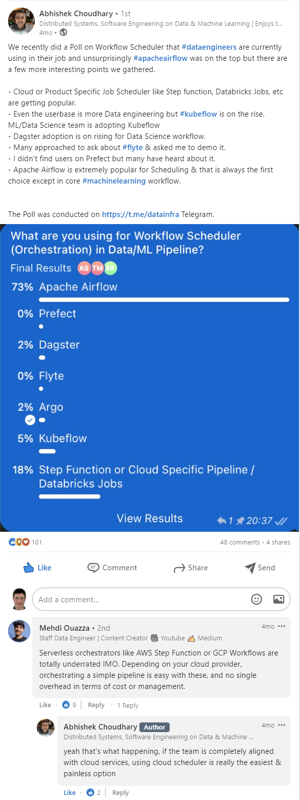

# Machine Learning Ops (MLOps) and Data Science

1. [Introduction. MLOps](#introduction-mlops)
2. [The MAD (ML/AI/Data) Landscape](#the-mad-mlaidata-landscape)
3. [Object Detection Libraries](#object-detection-libraries)
4. [MLFlow](#mlflow)
5. [Kubeflow](#kubeflow)
6. [Flyte](#flyte)
7. [Azure ML](#azure-ml)
8. [KServe Cloud Native Model Server](#kserve-cloud-native-model-server)
9. [Data Science](#data-science)
10. [Machine Learning workloads in kubernetes using Nix and NVIDIA](#machine-learning-workloads-in-kubernetes-using-nix-and-nvidia)
11. [Other Tools](#other-tools)
12. [Samples](#samples)
13. [ML Courses](#ml-courses)
14. [ML Competitions and Challenges](#ml-competitions-and-challenges)
15. [Polls](#polls)
16. [Tweets](#tweets)

## Introduction. MLOps

- [cd.foundation: Announcing the CD Foundation MLOps SIG](https://cd.foundation/blog/2020/02/11/announcing-the-cd-foundation-mlops-sig/)
- [dafriedman97.github.io: Machine Learning from Scratch](https://dafriedman97.github.io/mlbook/content/introduction.html) Derivations in Concept and Code.
- [cortex.dev: How to build a pipeline to retrain and deploy models](https://www.cortex.dev/post/how-to-build-a-pipeline-to-retrain-and-deploy-models)
- [github: A very Long never ending Learning around Data Engineering & Machine Learning](https://github.com/abhishek-ch/around-dataengineering)
- [towardsdatascience.com: A Kubernetes architecture for machine learning web-application deployments](https://towardsdatascience.com/a-kubernetes-architecture-for-machine-learning-web-application-deployments-632f7765ef29) Use Kubernetes to reduce machine learning infrastructure costs and scale resources with ease.
- [cloud.google.com: How to use a machine learning model from a Google Sheet using BigQuery ML](https://cloud.google.com/blog/topics/developers-practitioners/how-use-machine-learning-model-google-sheet-using-bigquery-ml)
- [itnext.io: Building ML Componentes on Kubernetes](https://itnext.io/building-ml-componentes-on-kubernetes-fc7e24cb9269)
- [towardsdatascience.com: Deploying An ML Model With FastAPI — A Succinct Guide](https://towardsdatascience.com/deploying-an-ml-model-with-fastapi-a-succinct-guide-69eceda27b21)
- [towardsdatascience.com: Production Machine Learning Monitoring: Outliers, Drift, Explainers & Statistical Performance](https://towardsdatascience.com/production-machine-learning-monitoring-outliers-drift-explainers-statistical-performance-d9b1d02ac158) A practical deep dive on production monitoring architectures for machine learning at scale using real-time metrics, outlier detectors, drift detectors, metrics servers and explainers.
- [cloudblogs.microsoft.com: Simple steps to create scalable processes to deploy ML models as microservices](https://cloudblogs.microsoft.com/opensource/2021/07/09/simple-steps-to-create-scalable-processes-to-deploy-ml-models-as-microservices/)
- [ML Platform Workshop](https://github.com/aporia-ai/mlplatform-workshop) Example code for a basic ML Platform based on Pulumi, FastAPI, DVC, MLFlow and more
- [rubrix](https://github.com/recognai/rubrix) A free and open-source tool to explore, label, and monitor data for NLP projects.
- [towardsdatascience.com: Automatically Generate Machine Learning Code with Just a Few Clicks](https://towardsdatascience.com/automatically-generate-machine-learning-code-with-just-a-few-clicks-7901b2334f97) Using Traingenerator to easily create PyTorch and scikit-learn template codes for machine learning model training
- [towardsdatascience.com: Schemafull streaming data processing in ML pipelines](https://towardsdatascience.com/using-kafka-with-avro-in-python-da85b3e0f966) Making containerized Python streaming data pipelines leverage schemas for data validation using Kafka with AVRO and Schema Registry
- [analyticsindiamag.com: Top tools for enabling CI/CD in ML pipelines](https://analyticsindiamag.com/top-tools-for-enabling-ci-cd-in-ml-pipelines/)
- [towardsdatascience.com: Step-by-step Approach to Build Your Machine Learning API Using Fast API](https://towardsdatascience.com/step-by-step-approach-to-build-your-machine-learning-api-using-fast-api-21bd32f2bbdb) A fast and simple approach to serve your model as an API
- [ravirajag.dev: MLOps Basics - Week 10: Summary](https://www.ravirajag.dev/blog/mlops-summary)
- [==mikeroyal/Kubernetes-Guide: Machine Learning== 🌟](https://github.com/mikeroyal/Kubernetes-Guide/blob/main/README.md#machine-learning)
- [medium.com/workday-engineering: Implementing a Fully Automated Sharding Strategy on Kubernetes for Multi-tenanted Machine Learning Applications](https://medium.com/workday-engineering/implementing-a-fully-automated-sharding-strategy-on-kubernetes-for-multi-tenanted-machine-learning-4371c48122ae)
- [==medium.com/globant: Advantages of Deploying Machine Learning models with Kubernetes== 🌟](https://medium.com/globant/advantages-of-deploying-machine-learning-models-with-kubernetes-8454cc7c565e)
- [==technologyreview.com: Andrew Ng: Forget about building an AI-first business. Start with a mission== 🌟](https://www.technologyreview.com/2021/03/26/1021258/ai-pioneer-andrew-ng-machine-learning-business) An AI pioneer reflects on how companies can use machine learning to transform their operations and solve critical problems.
    - [==technologyreview.es: "Las empresas que empiezan a lo grande con la IA fracasan más"== 🌟](https://www.technologyreview.es/s/13258/las-empresas-que-empiezan-lo-grande-con-la-ia-fracasan-mas) El pionero de la inteligencia artificial Andrew Ng asegura que es más importante tener buenos datos, aunque sean escasos, que muchos, pero mal etiquetados. Cree que todas las empresas deben empezar a pensar en la tecnología con proyectos rápidos, pero pequeños, y escalarlos si resulta que funcionan.
    - [cio.com: Make Better AI Infrastructure Decisions: Why Hybrid Cloud is a Solid Fit 🌟](https://www.cio.com/article/350337/make-better-ai-infrastructure-decisions-why-hybrid-cloud-is-a-solid-fit.html) The unique demands of AI workloads drive increasing popularity of pairing on-premises infrastructure with cloud.
- [medium.com/pythoneers: MLOps: Tool Stack Requirement in Machine Learning Pipeline](https://medium.com/pythoneers/mlops-tool-stack-requirement-in-machine-learning-pipeline-474b39f09dfc) Tools and technologies in machine learning lifecycle
- [medium.com/formaloo: How no-code platforms are democratizing data science and software development 🌟](https://medium.com/formaloo/making-databases-as-easy-as-playing-with-legos-no-code-no-problem-ed41d4fde269)
- [towardsdatascience.com: From Jupyter Notebooks to Real-life: MLOps 🌟](https://towardsdatascience.com/from-jupyter-notebooks-to-real-life-mlops-9f590a7b5faa) Why is it a must-have?
- [==guru99.com: Artificial Intelligence Tutorial for Beginners: Learn Basics of AI== 🌟🌟🌟](https://www.guru99.com/ai-tutorial.html)
- [datarevenue.com: Airflow vs. Luigi vs. Argo vs. MLFlow vs. KubeFlow](https://www.datarevenue.com/en-blog/airflow-vs-luigi-vs-argo-vs-mlflow-vs-kubeflow) Choosing a task orchestration tool
- [infoworld.com: 13 open source projects transforming AI and machine learning](https://www.infoworld.com/article/3673976/13-open-source-projects-transforming-ai-and-machine-learning.html) From deepfakes to natural language processing and more, the open source world is ripe with projects to support software development on the frontiers of artificial intelligence and machine learning.
- [towardsdatascience.com: From Dev to Deployment: An End to End Sentiment Classifier App with MLflow, SageMaker, and Streamlit](https://towardsdatascience.com/from-dev-to-deployment-an-end-to-end-sentiment-classifier-app-with-mlflow-sagemaker-and-119043ea4203) In this tutorial, we’ll build an NLP app starting from DagsHub-MLflow, then diving into deployment in SageMaker and EC2 with the front end in Streamlit.
- [valuecoders.com: How AI And ML Have Revamped Mobile App Development?](https://www.valuecoders.com/blog/technology-and-apps/how-ai-and-ml-have-revamped-mobile-app-development/)
- [elconfidencial.com: La batalla entre Google y Meta que nadie esperaba: revolucionar la biología 🌟](https://www.elconfidencial.com/tecnologia/ciencia/2022-11-18/carrera-google-meta-revolucionar-biologia_3520865/) El sistema AlphaFold de Google revela la estructura en 3D de las proteínas y ya es utilizado por miles de biólogos, pero Meta contraataca con otro algoritmo. ¿Cuál es mejor?
- [swirlai.substack.com: SAI #08: Request-Response Model Deployment - The MLOps Way, Spark - Executor Memory Structure and more... 🌟](https://swirlai.substack.com/p/sai-08-request-response-model-deployment)
- [about.gitlab.com: How is AI/ML changing DevOps?](https://about.gitlab.com/blog/2022/11/16/how-is-ai-ml-changing-devops/)

## The MAD (ML/AI/Data) Landscape

- [mad.firstmark.com: The MAD (ML/AI/Data) Landscape](https://mad.firstmark.com/)

## Object Detection Libraries

- [medium.com/mlearning-ai: The Best Object Detection Libraries That I Work With](https://medium.com/mlearning-ai/the-best-object-detection-libraries-that-i-work-with-835428a1e01e)

## MLFlow

- https://mlflow.org
- [towardsdatascience.com: A Beginner-Friendly Introduction to Kubernetes 🌟](https://towardsdatascience.com/a-beginner-friendly-introduction-to-kubernetes-540b5d63b3d7) With a hands-on MLFlow deployment example
- [towardsdatascience.com: Empowering Spark with MLflow](https://towardsdatascience.com/empowering-spark-with-mlflow-58e6eb5d85e8)
- [artifacthub.io: mlflow-server](https://artifacthub.io/packages/helm/mlflowserver/mlflow-server) A Helm chart for MLFlow On Kubernetes
- [pypi.org/project/airflow-provider-mlflow](https://pypi.org/project/airflow-provider-mlflow/) An Apache Airflow provider to interact with MLflow using Operators and Hooks

## Kubeflow

- [kubeflow](https://www.kubeflow.org/) The Machine Learning Toolkit for Kubernetes
- [medium.com: Machine Learning using Kubeflow](https://medium.com/cloud-techies/machine-learning-using-kubeflow-ad7c9f767df0)
- [infracloud.io: Machine Learning Orchestration on Kubernetes using Kubeflow](https://www.infracloud.io/blogs/machine-learning-orchestration-kubernetes-kubeflow/)
- [blog.devgenius.io: Kubeflow Cloud Deployment (AWS)](https://blog.devgenius.io/kubeflow-cloud-deployment-aws-46f739ccbb32) How do you deploy Kubeflow on AWS? Kubeflow is resource-intensive and deploying it locally means that you might not have enough resources to run your end-to-end machine learning pipeline. In this article you will learn how to deploy Kubeflow in AWS.
- [joseprsm.medium.com: How to build Machine Learning models that train themselves](https://joseprsm.medium.com/how-to-build-machine-learning-models-that-train-themselves-bbc87499ca5)
- [medium.com/dkatalis: Creating a Mutating Webhook for Great Good! Or: how to automatically provision Pods on a specific node pool](https://medium.com/dkatalis/creating-a-mutating-webhook-for-great-good-b21acb941207) In this tutorial, you will learn how to automatically schedule Kubeflow pipeline Pods from any number of namespaces on dedicated GKE node pools

## Flyte

- https://flyte.org
- [Union Cloud](https://www.union.ai) ML and Data Orchestration powered by Flyte
- [mlops.community: MLOps with Flyte: The Convergence of Workflows Between Machine Learning and Engineering](https://mlops.community/mlops-with-flyte-the-convergence-of-workflows-between-machine-learning-and-engineering/)
- [==Machine Learning in Production. What does an end-to-end ML workflow look like in production? (transcript)== 🌟🌟🌟](https://www.union.ai/blog-post/machine-learning-in-production) - [Play Recording](https://twitter.com/i/spaces/1ZkKzbXLekWKv)
    - Kelsey Hightower joined the @flyteorg team to discuss what ML looks like in the real world, from ingesting data to consuming ML models via an API.
    - @kelseyhightower You can't go swimming in a #data_lake if you actually can't swim, right? You're going to drown. 🏊‍♂️
    - @ketanumare Machine Learning products deteriorate in time. If you have the best model today it's not guaranteed to be the best model tomorrow.
    - @thegautam It's hard to verify models before you put them in production. We need our systems to be fully reproducible, which is why an #orchestration_tool is important, running multiple models in parallel.
    - @ketanumare We at @union_ai unify the extremely fragmented world of ML and give the choice to users when to use proprietary technology versus when to use open source. (1/2)
    - @ketanumare #Flyte makes it seamless to work on #kubernetes with spark jobs, and that's a big use case, but you can also use @databricks. Similarly, we are working on Ray and you can also use @anyscalecompute. (2/2)
    - @Ketanumare Most machine learning engineers are not distributed systems engineers. This becomes a challenge when you’re deploying models to production. Infrastructure abstraction is key to unlock your team’s potential.
    - @ketanumare on #Machine_Learning workflows: Creating Machine Learning workflows is a team sport. 🤝
    - @arnoxmp: A Machine Learning model is often a blackbox. If you encounter new data, do a test run first.
    - @fabio_graetz In classical software engineering the only thing that changes is the code, in a ML system the data can change. You need to version and test data changes.
    - @Forcebananza This is actually one of the reasons I really like using #Flyte. You can map a cell in a notebook to its own task, and they're really easy to compose and reuse and copy and paste around. (1/2)
    - @Forcebananza Jupyter notebooks are great for iterating, but moving more towards a standard software engineering workflow and making that easy enough for data scientists is really really important.(2/2)
    - @jganoff Taking snapshots of petabytes of data is expensive, there are tools that version a dataset without having to copy it. Having metadata separate from the data itself allows you to treat a version of a dataset as if it were code.
    - @SMT_Solvers In F500s it is mostly document OCR. Usually batch jobs - an API wouldn’t work - you need the binaries on the server even if it is a sidecar Docker container. One org (not mine) blows $$ doing network transfer from AWS to GCP when GCP could license their OCR in a container.
    - @Forcebananza Flyte creates a way for all these teams to work together partially because writing workflows, writing reusable components… is actually simple enough for data scientists and data engineers to work with.
    - @kelseyhightower We're now at a stage where we can start to leverage systems like https://flyte.org to give us more of an opinionated end-to-end workflow. What we call #ML can become a real discipline where practitioners can use a common set of terms and practices.
- [stackoverflow.com: How is Flyte tailored to "Data and Machine Learning"?](https://stackoverflow.com/questions/72657318/how-is-flyte-tailored-to-data-and-machine-learning)
- [union.ai: Production-Grade ML Pipelines: Flyte™ vs. Kubeflow](https://www.union.ai/blog-post/production-grade-ml-pipelines-flyte-vs-kubeflow) Kubeflow and Flyte are both production-grade, Kubernetes-native orchestrators for machine learning. Which is best for ML engineers? Check out this head-to-head comparison.
- [mlops.community: MLOps Simplified: orchestrating ML pipelines with infrastructure abstraction. Enabled by Flyte](https://mlops.community/flyte-mlops-simplified/)

## Azure ML

- [docs.microsoft.com: MLflow and Azure Machine Learning](https://docs.microsoft.com/en-us/azure/machine-learning/concept-mlflow) One of the open-source projects that has made #ML better is MLFlow. Microsoft is expanding support for APIs, no-code deployment for MLflow models in real-time/batch managed inference, curated MLflow settings, and CLI v2 integrations.
- [bea.stollnitz.com: Creating batch endpoints in Azure ML](https://bea.stollnitz.com/blog/aml-batch-endpoint/)
    - Suppose you’ve trained a machine learning model to accomplish some task, and you’d now like to provide that model’s inference capabilities as a service. Maybe you’re writing an application of your own that will rely on this service, or perhaps you want to make the service available to others. This is the purpose of endpoints — they provide a simple web-based API for feeding data to your model and getting back inference results.
    - Azure ML currently supports three types of endpoints: batch endpoints, Kubernetes online endpoints, and managed online endpoints. I’m going to focus on batch endpoints in this post, but let me start by explaining how the three types differ.

## KServe Cloud Native Model Server

- [kserve.github.io](https://kserve.github.io/website/0.8/) Highly scalable and standards based Model Inference Platform on Kubernetes for Trusted AI
- [thenewstack.io: KServe: A Robust and Extensible Cloud Native Model Server](https://thenewstack.io/kserve-a-robust-and-extensible-cloud-native-model-server/)
- [medium.com/bakdata: Scalable Machine Learning with Kafka Streams and KServe](https://medium.com/bakdata/scalable-machine-learning-with-kafka-streams-and-kserve-85308858d867) In this blog post, you'll learn how to use Apache Kafka and Kafka Streams in combination with the KServe inference platform for an easy integration of ML models with data streams

## Data Science

- [analyticsvidhya.com: Bring DevOps To Data Science With MLOps](https://www.analyticsvidhya.com/blog/2021/04/bring-devops-to-data-science-with-continuous-mlops/)
- [analyticsindiamag.com: Is coding necessary to work as a data scientist?](https://analyticsindiamag.com/is-coding-necessary-to-work-as-a-data-scientist/) Non-programmers with a no-coding background can have a glorious career in data science and programming, and coding knowledge is more like a skill and not a criterion.
- [redhat.com: Introducing Red Hat OpenShift Data Science](https://www.redhat.com/en/blog/introducing-red-hat-openshift-data-science)
- [towardsdatascience.com: From DevOps to MLOPS: Integrate Machine Learning Models using Jenkins and Docker](https://towardsdatascience.com/from-devops-to-mlops-integrate-machine-learning-models-using-jenkins-and-docker-79034dbedf1) How to automate data science code with Jenkins and Docker: MLOps = ML + DEV + OPS
- [towardsdatascience.com: How to Structure a Data Science Project for Readability and Transparency](https://towardsdatascience.com/how-to-structure-a-data-science-project-for-readability-and-transparency-360c6716800) And How to Create One in One Line of Code

## Machine Learning workloads in kubernetes using Nix and NVIDIA

- [canvatechblog.com: Supporting GPU-accelerated Machine Learning with Kubernetes and Nix](https://canvatechblog.com/supporting-gpu-accelerated-machine-learning-with-kubernetes-and-nix-7c1da8e42f61) In this article, you'll learn how to package and run machine learning workloads in Kubernetes using Nix and NVIDIA
    - [Nix](https://nixos.org/manual/nix/stable/)
    - [github.com/NVIDIA/nvidia-docker: NVIDIA/nvidia-docker/volumes.go](https://github.com/NVIDIA/nvidia-docker/blob/8c0eeba474cace48fdb8216f518063db2bd2d4d1/tools/src/nvidia/volumes.go#L103) NVIDIA’s documentation is disappointingly evasive on what the “driver” is, but we find a good answer in their official source code.
- [==catalog.ngc.nvidia.com: NVIDIA GPU Operator - Helm chart== 🌟🌟🌟](https://catalog.ngc.nvidia.com/orgs/nvidia/helm-charts/gpu-operator)

## Other Tools

- [bodywork-ml/bodywork-core: Bodywork](https://github.com/bodywork-ml/bodywork-core) is a command line tool that deploys machine learning pipelines to Kubernetes. It takes care of everything to do with containers and orchestration, so that you don't have to. **It is a more lightweight and simpler alternative when compared to tools like KubeFlow**
- [learn.iterative.ai: Iterative Tools for Data Scientists & Analysts](https://learn.iterative.ai/) All the things you need to know to take you from your notebook to production with Iterative tools!
- VSCode DVC:
    - [DVC](https://marketplace.visualstudio.com/items?itemName=Iterative.dvc) Machine learning experiment management with tracking, plots, and data versioning.
    - [docs.microsoft.com: Machine Learning Experimentation in VS Code with DVC Extension](https://docs.microsoft.com/en-us/shows/vs-code-livestreams/machine-learning-experimentation-in-vs-code-with-dvc-extension)
- [tensorchord/envd: Reproducible development environment for AI/ML 🌟](https://github.com/tensorchord/envd) envd (ɪnˈvdɪ) is a command-line tool that helps you create the container-based development environment for AI/ML. https://envd.tensorchord.ai/
- [postgresml/postgresml 🌟](https://github.com/postgresml/postgresml) PostgresML is an end-to-end machine learning system. It enables you to train models and make online predictions using only SQL, without your data ever leaving your favorite database.
- [blog.devgenius.io: Training model with Jenkins using docker: MLOPS](https://blog.devgenius.io/training-model-with-jenkins-using-docker-mlops-b18579ddb677)
- [vaex.io](https://vaex.io) An ML Ready Fast DataFrame for Python
    - https://pypi.org/project/vaex/
- [thenewstack.io: 7 Must-Have Python Tools for ML Devs and Data Scientists 🌟](https://thenewstack.io/7-must-have-python-tools-for-ml-devs-and-data-scientists/) Python has an easy learning curve, however there are a range of development tools to consider if you're to use Python to its full potential.

## Samples

- [fepegar/vesseg](https://github.com/fepegar/vesseg) Brain vessel segmentation using 3D convolutional neural networks

## ML Courses

- [==dair-ai/ML-Course-Notes: ML Course Notes== 🌟](https://github.com/dair-ai/ML-Course-Notes) 🎓 Sharing course notes on all topics related to machine learning, NLP, and AI.

## ML Competitions and Challenges

- [Kaggle Competitions](https://www.kaggle.com/competitions)
- [isic-archive.com](https://www.isic-archive.com/#!/topWithHeader/wideContentTop/main)

## Polls

??? note "Click to expand!"

	

	
	

## Tweets

  
Click to expand!

<blockquote class="twitter-tweet">
To my JVM friends looking to explore Machine Learning techniques - you don’t necessarily have to learn Python to do that. There are libraries you can use from the comfort of your JVM environment. 🧵👇
&mdash; Maria Khalusova (@mariaKhalusova) <a href="https://twitter.com/mariaKhalusova/status/1331982686819389440?ref_src=twsrc%5Etfw">November 26, 2020</a></blockquote> 

<blockquote class="twitter-tweet">
You don&#39;t need to go to a university to learn machine learning - you can do it from your living room, for completely free.  Here is an extensive list of curated free courses and tutorials, from beginner to advanced. ↓  (Trust me, you want to bookmark this tweet.)
&mdash; Tivadar Danka (@TivadarDanka) <a href="https://twitter.com/TivadarDanka/status/1440281314398138373?ref_src=twsrc%5Etfw">September 21, 2021</a></blockquote> 

<blockquote class="twitter-tweet">
I started taking data science courses last year, after studying and coding for at least 10 hours 6 days a week and doing several ML projects alongside data analysis projects, I finally got my first data analyst offer from a Nigerian bank last week after countless rejections
&mdash; Sam (@SamsonTontoye) <a href="https://twitter.com/SamsonTontoye/status/1495292044109131785?ref_src=twsrc%5Etfw">February 20, 2022</a></blockquote> 

<blockquote class="twitter-tweet">
Deep Neural Networks are used for many applications. One I&#39;m particularly fond of is medical imaging. A trained model can process the input thanks to the activation functions propagating through a network of perceptrons and generating the output of interest.<a href="https://twitter.com/hashtag/NeuralNets?src=hash&amp;ref_src=twsrc%5Etfw">#NeuralNets</a> <a href="https://twitter.com/hashtag/Medical?src=hash&amp;ref_src=twsrc%5Etfw">#Medical</a> <a href="https://t.co/vPwm0TfHnn">pic.twitter.com/vPwm0TfHnn</a>
&mdash; Valerio Pergola (@valerio_pergola) <a href="https://twitter.com/valerio_pergola/status/1544644935093215235?ref_src=twsrc%5Etfw">July 6, 2022</a></blockquote> 

<blockquote class="twitter-tweet">
<a href="https://twitter.com/hashtag/3D?src=hash&amp;ref_src=twsrc%5Etfw">#3D</a> intracranial artery segmentation using a convolutional neural networks <a href="https://twitter.com/hashtag/CNN?src=hash&amp;ref_src=twsrc%5Etfw">#CNN</a> - <a href="https://twitter.com/hashtag/opensource?src=hash&amp;ref_src=twsrc%5Etfw">#opensource</a> &gt; <a href="https://t.co/Z2WDp2UOl3">https://t.co/Z2WDp2UOl3</a> | <a href="https://twitter.com/hashtag/python?src=hash&amp;ref_src=twsrc%5Etfw">#python</a> <a href="https://twitter.com/hashtag/TensorFlow?src=hash&amp;ref_src=twsrc%5Etfw">#TensorFlow</a> <a href="https://twitter.com/hashtag/DeepLearning?src=hash&amp;ref_src=twsrc%5Etfw">#DeepLearning</a> <a href="https://twitter.com/hashtag/MachineLearning?src=hash&amp;ref_src=twsrc%5Etfw">#MachineLearning</a> <a href="https://twitter.com/hashtag/Nvidia?src=hash&amp;ref_src=twsrc%5Etfw">#Nvidia</a> <a href="https://twitter.com/hashtag/GPU?src=hash&amp;ref_src=twsrc%5Etfw">#GPU</a> <a href="https://twitter.com/hashtag/brain?src=hash&amp;ref_src=twsrc%5Etfw">#brain</a> <a href="https://twitter.com/hashtag/medical?src=hash&amp;ref_src=twsrc%5Etfw">#medical</a> <a href="https://twitter.com/hashtag/conda?src=hash&amp;ref_src=twsrc%5Etfw">#conda</a> <a href="https://twitter.com/hashtag/Neurology?src=hash&amp;ref_src=twsrc%5Etfw">#Neurology</a> <a href="https://twitter.com/hashtag/Artificial_Intelligence?src=hash&amp;ref_src=twsrc%5Etfw">#Artificial_Intelligence</a> <a href="https://twitter.com/hashtag/medical_imaging?src=hash&amp;ref_src=twsrc%5Etfw">#medical_imaging</a> <a href="https://twitter.com/hashtag/Nifti?src=hash&amp;ref_src=twsrc%5Etfw">#Nifti</a> <a href="https://t.co/eKrBBuFxSy">pic.twitter.com/eKrBBuFxSy</a>
&mdash; NewUlmDesign (@ulmdesign) <a href="https://twitter.com/ulmdesign/status/1545091486475223041?ref_src=twsrc%5Etfw">July 7, 2022</a></blockquote> 

<blockquote class="twitter-tweet">
<a href="https://t.co/WxspfKvLFS">https://t.co/WxspfKvLFS</a>
&mdash; nubenetes (@nubenetes) <a href="https://twitter.com/nubenetes/status/1550543229799477248?ref_src=twsrc%5Etfw">July 22, 2022</a></blockquote> 

<blockquote class="twitter-tweet">
<a href="https://twitter.com/kelseyhightower?ref_src=twsrc%5Etfw">@kelseyhightower</a> We&#39;re now at a stage where we can start to leverage systems like <a href="https://twitter.com/hashtag/Flyte?src=hash&amp;ref_src=twsrc%5Etfw">#Flyte</a> to give us more of an opinionated end-to-end workflow. What we call <a href="https://twitter.com/hashtag/ML?src=hash&amp;ref_src=twsrc%5Etfw">#ML</a> can become a real discipline where practitioners can use a common set of terms and practices.<a href="https://twitter.com/hashtag/KelseyTakesFlyte?src=hash&amp;ref_src=twsrc%5Etfw">#KelseyTakesFlyte</a> <a href="https://twitter.com/hashtag/MLOps?src=hash&amp;ref_src=twsrc%5Etfw">#MLOps</a>
&mdash; Flyte (@flyteorg) <a href="https://twitter.com/flyteorg/status/1550543758764044288?ref_src=twsrc%5Etfw">July 22, 2022</a></blockquote> 

<blockquote class="twitter-tweet">
If you&#39;re not utilizing AI, you&#39;re falling behind.   Here are 7 free AI tools that&#39;ll save you hours of work:
&mdash; Nikki Siapno (@NikkiSiapno) <a href="https://twitter.com/NikkiSiapno/status/1584477023346470912?ref_src=twsrc%5Etfw">October 24, 2022</a></blockquote> 

<blockquote class="twitter-tweet">
Machine Learning will be one of the most sought-after professions this decade.  Learn &amp; practice ML for free with these outstanding resources and earn certificates for your resume:
&mdash; Simon (@simonholdorf) <a href="https://twitter.com/simonholdorf/status/1629377400273338369?ref_src=twsrc%5Etfw">February 25, 2023</a></blockquote> 

