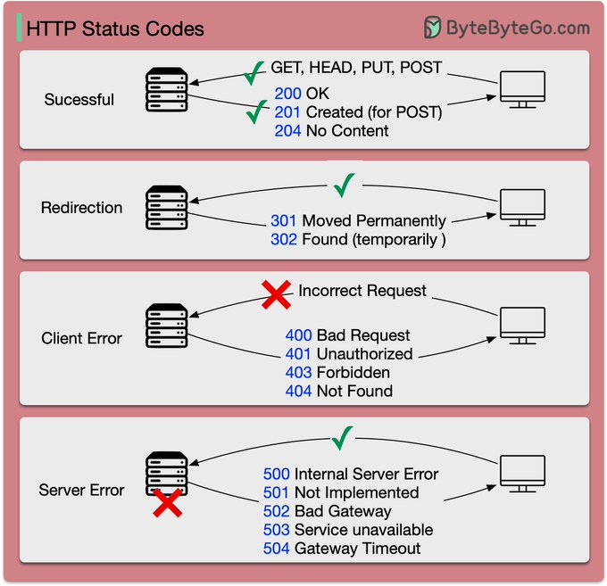
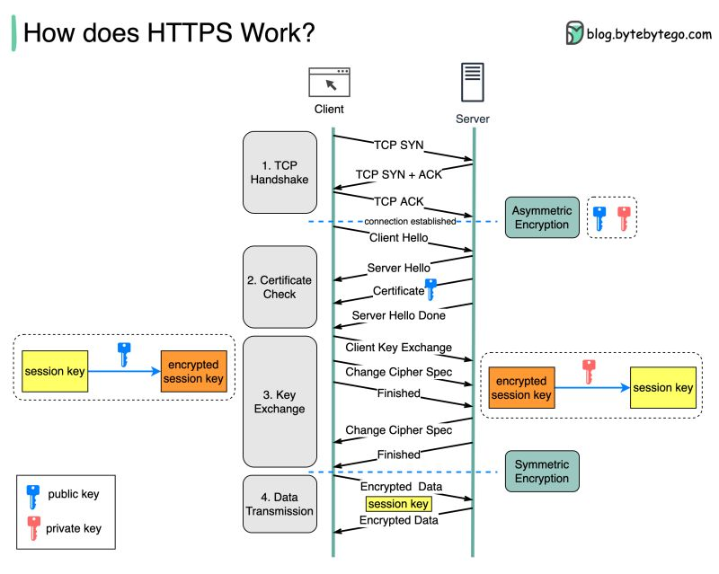

# Networking

1. [Introduction](#introduction)
2. [CIDR subnets](#cidr-subnets)
    1. [IPAM Tools. NetBox IPAM](#ipam-tools-netbox-ipam)
3. [HTTP Protocols](#http-protocols)
    1. [HTTP Status Codes](#http-status-codes)
    2. [HTTP/2](#http2)
    3. [HTTP/3](#http3)
    4. [HTTP Structured Fields](#http-structured-fields)
4. [Container Networking](#container-networking)
5. [Load Balancing](#load-balancing)
6. [DNS](#dns)
7. [Images](#images)
8. [Tweets](#tweets)

## Introduction

- [networkwalks.com: TCP/IP Model](https://networkwalks.com/tcp-ip-model/)
- [devopscube.com: IP Address Tutorial For Beginners [IPV4 and IPV6 Protocols]](https://devopscube.com/ip-address-tutorial/)
- [medium.com/javarevisited: 5 Best HTTPS, SSL and TLS Courses for Beginners in 2022](https://medium.com/javarevisited/best-https-ssl-and-tls-courses-for-beginners-4437661250b3) These are the best online courses to learn about HTTPS, SSL, and TLS for programmers and developers in 2022
- [blog.coderco.io: TCP Fundamentals for Software & DevOps Engineers: Building a Strong Foundation in Networking](https://blog.coderco.io/p/tcp-fundamentals-for-software-and)

## CIDR subnets

- [==cidr.xyz== 🌟](https://cidr.xyz) An interactive IP address and CIDR range visualizer
- [magic-cookie.co.uk/iplist.html](http://magic-cookie.co.uk/iplist.html) Convert CIDR notation to a range of IP addresses
- https://en.wikipedia.org/wiki/Classful_network
- [gist.github.com: chadmcrowell/cidr.sh 🌟](https://gist.github.com/chadmcrowell/f3fc3be2ca1fcb887034162c14d77e74)
- [==opensource.com: A Linux networking guide to CIDR notation and configuration - sipcalc== 🌟](https://opensource.com/article/16/12/cidr-network-notation-configuration-linux)
- [pbxbook.com: CIDR Cheat Sheet](https://pbxbook.com/other/cidrcheat.html)
- [aelius.com: subnet sheet](https://www.aelius.com/njh/subnet_sheet.html)
- [networkproguide.com: CIDR Subnet Mask Cheat Sheet](https://networkproguide.com/cidr-subnet-mask-ipv4-cheat-sheet/)
- [wisc.edu: CIDR Conversion Table](https://kb.wisc.edu/ns/page.php?id=3493)
- [dzone: What Is CIDR (Classless Inter-Domain Routing)](https://dzone.com/articles/what-is-cidr-classless-inter-domain-routing-in-mul)
- [cyberciti.biz: Linux: IP Subnet (CIDR) Calculator That Will Help You With Network Settings](https://www.cyberciti.biz/faq/linux-subnet-calculator-cidr/)
- [cyberciti.biz: Linux Calculating Subnets with ipcalc and sipcalc Utilities](https://www.cyberciti.biz/tips/perform-simple-manipulation-of-ip-addresse.html)
- [tecmint.com: How to Calculate IP Subnet Address with ipcalc Tool](https://www.tecmint.com/calculate-ip-subnet-address-with-ipcalc-tool/)
- [awesomeopensource.com: The Top 110 Cidr Open Source Projects on Github 🌟](https://awesomeopensource.com/projects/cidr)
- [matt-rickard.com: How to Calculate a CIDR](https://matt-rickard.com/how-to-calculate-a-cidr)
- [build5nines.com: IPv4 Address CIDR Range Reference and Calculator](https://build5nines.com/ipv4-address-cidr-range-reference-and-calculator/)

### IPAM Tools. NetBox IPAM

- [==github.com/netbox-community/netbox== 🌟](https://github.com/netbox-community/netbox)
- [netboxlabs.com: An In-Depth Guide to NetBox for IPAM](https://netboxlabs.com/blog/netbox-ipam/)
- [youtube: NetBox Zero To Hero](https://www.youtube.com/playlist?list=PL7sEPiUbBLo_iTds-NV-9Tu05Gg2Aj8N7)
- https://hub.docker.com/r/netboxcommunity/netbox
- [docs.ansible.com: Netbox Ansible Modules 🌟](https://docs.ansible.com/ansible/latest/collections/netbox/netbox/index.html)

## HTTP Protocols

- [wizardzines.com: Request Headers](https://wizardzines.com/comics/request-headers/)
- [wizardzines.com: Response Headers](https://wizardzines.com/comics/response-headers/)

### HTTP Status Codes

- [wikipedia: List of HTTP status codes](https://en.wikipedia.org/wiki/List_of_HTTP_status_codes)
- [slideshare: Http Status Code Errors in SEO](http://www.slideshare.net/AdelaRoger/http-status-code-errors-in-seo)
- [http.cat 🌟](https://http.cat)

[{: style="width:50%"}](https://twitter.com/alexxubyte)

### HTTP/2

- [Wikipedia: HTTP/2](https://en.wikipedia.org/wiki/HTTP/2)
- [SPDY & HTTP 2 with Akamai CTO Guy Podjarny](https://www.youtube.com/watch?v=WkLBrHW4NhQ)
    - [cURL mantainer: http2 explained 🌟](http://http2-explained.haxx.se/)
    - [cURL mantainer: curl and HTTP/2 by default](http://daniel.haxx.se/blog/2015/12/14/curl-and-http2-by-default/)
    - [cURL mantainer: A 2015 retrosprective](http://daniel.haxx.se/blog/2015/12/20/a-2015-retrospective/)
    - [http2.github.io HTTP/2 🌟](https://http2.github.io)
    - [http2.github.io HTTP/2 Frequently Asked Questions 🌟](https://http2.github.io/faq/)
    - [HTTP/2 resources](https://pinboard.in/u:rmurphey/t:http2/)
    - [A Simple Performance Comparison of HTTPS, SPDY and HTTP/2 🌟](https://blog.httpwatch.com/2015/01/16/a-simple-performance-comparison-of-https-spdy-and-http2/comment-page-1/)
    - [blog.cloudflare.com - Tools for debugging, testing and using HTTP/2](https://blog.cloudflare.com/tools-for-debugging-testing-and-using-http-2/)
    - [blog.cloudflare.com - HTTP/2 For Web Developers](https://blog.cloudflare.com/http-2-for-web-developers/)
- [HTTP/2 With JBoss EAP 7 - Tech Preview](http://blog.eisele.net/2015/11/http2-with-jboss-eap-7.html)
    - [Dzone - HTTP/2 With JBoss EAP 7: Tech Preview](https://dzone.com/articles/http2-with-jboss-eap-7-tech-preview)
- [simple-talk.com: Script Loading between HTTP/1.1 and HTTP/2](https://www.simple-talk.com/dotnet/asp.net/script-loading-between-http1.1-and-http2/)
- [5 Tips to Boost the Performance of Your Apache Web Server](http://www.tecmint.com/apache-performance-tuning/)
- [DZone: How HTTP/2 Is Changing Web Performance Best Practices](https://dzone.com/articles/how-http2-is-changing-web-performance-best-practic-2) For people who write code for the web, transitioning to HTTP/2 isn’t always straightforward, and a speed boost isn’t automatically guaranteed. This article is an introduction to HTTP/2 and how it changes web performance best practices.

### HTTP/3

- [Wikipedia: HTTP/3](https://en.wikipedia.org/wiki/HTTP/3)
- [==http3-explained.haxx.se: HTTP/3 explained== 🌟](https://http3-explained.haxx.se/)
- [alexandrehtrb.github.io: HTTP/2 and HTTP/3 explained](https://alexandrehtrb.github.io/posts/2024/03/http2-and-http3-explained/)

### HTTP Structured Fields

- [Improving HTTP with structured header fields 🌟](https://www.fastly.com/blog/improve-http-structured-headers)
- [http-sfv: HTTP Structured Field Values in Python](https://pypi.org/project/http-sfv/)

## Container Networking

- [iximiuz.com: Container Networking Is Simple! 🌟](https://iximiuz.com/en/posts/container-networking-is-simple/)
    - How to virtualize network resources to make containers think each of them has a dedicated network stack?
    - How to reach the outside world (e.g. the Internet) from inside the container?

## Load Balancing

- [harshityadav95.medium.com: Load Balancing Layer 4 vs Layer 7](https://harshityadav95.medium.com/load-balancing-layer-4-vs-layer-7-f37a839afd9c)

## DNS

- [==media.pearsoncmg.com: Recursive/Iterative Queries in DNS==](https://media.pearsoncmg.com/aw/ecs_kurose_compnetwork_7/cw/content/interactiveanimations/recursive-iterative-queries-in-dns/index.html) In Chapter 2 of the text the authors give examples of recursive and iterative DNS queries. This DNS interactive animation animates additional combinations of iterative and recursive queries among four name servers.

## Images

??? note "Click to expand!"

	

    
	

## Tweets

??? note "Click to expand!"

    

    <blockquote class="twitter-tweet">
List of HTTP Status Codes Cheat Sheet: <a href="https://t.co/1m8gci63Vs">pic.twitter.com/1m8gci63Vs</a>
&mdash; Java Guides (@GuidesJava) <a href="https://twitter.com/GuidesJava/status/1607231830662733826?ref_src=twsrc%5Etfw">December 26, 2022</a></blockquote> 

    <blockquote class="twitter-tweet">
IPv4 vs IPv6 <a href="https://t.co/mZnHL3E8Zu">pic.twitter.com/mZnHL3E8Zu</a>
&mdash; LetsDefend (@LetsDefendIO) <a href="https://twitter.com/LetsDefendIO/status/1629141685383966722?ref_src=twsrc%5Etfw">February 24, 2023</a></blockquote> 

    <blockquote class="twitter-tweet">
/1 Which HTTP status codes are most common?  The response codes for HTTP are divided into five categories:  Informational (100-199) Success (200-299) Redirection (300-399) Client Error (400-499) Server Error (500-599) <a href="https://t.co/39I34KqQoU">pic.twitter.com/39I34KqQoU</a>
&mdash; Alex Xu (@alexxubyte) <a href="https://twitter.com/alexxubyte/status/1638567471857958913?ref_src=twsrc%5Etfw">March 22, 2023</a></blockquote> 
    

