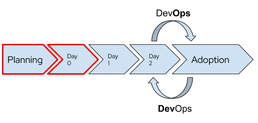
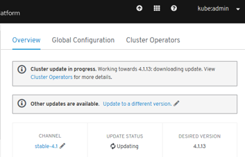
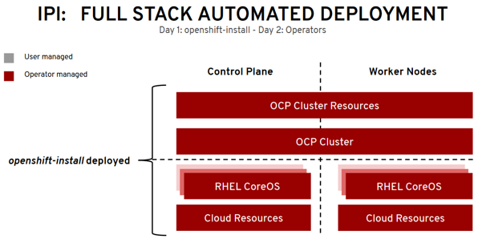
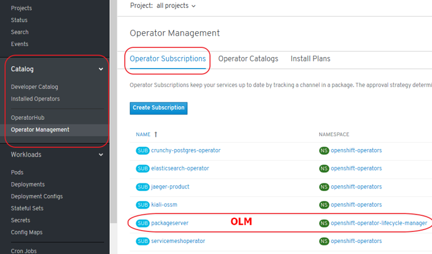
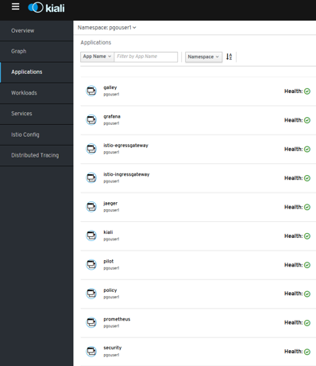
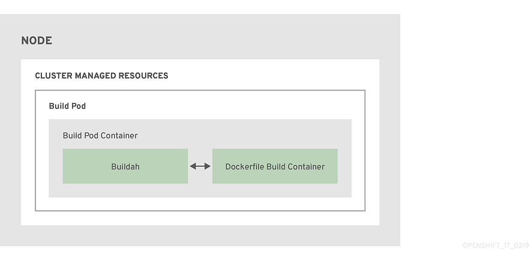
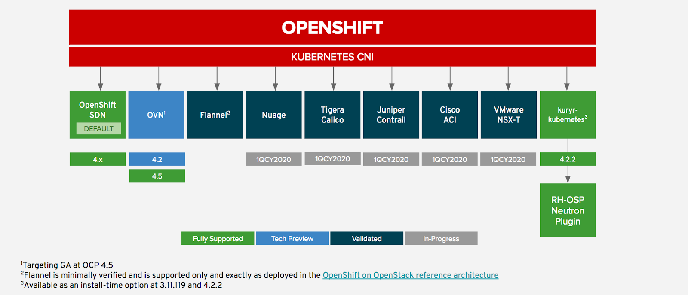

# OCP 4

1. [OpenShift Container Platform 4 (OCP 4)](#openshift-container-platform-4-ocp-4)
    1. [OpenShift Guide](#openshift-guide)
    2. [Single Node OpenShift](#single-node-openshift)
    3. [OpenShift sizing and subscription guide](#openshift-sizing-and-subscription-guide)
    4. [OpenShift Platform Plus](#openshift-platform-plus)
    5. [Best Practices](#best-practices)
    6. [Setting up OCP4 on AWS](#setting-up-ocp4-on-aws)
    7. [ROSA Red Hat OpenShift Service on AWS](#rosa-red-hat-openshift-service-on-aws)
    8. [CI/CD in OpenShift](#cicd-in-openshift)
2. [Downloads](#downloads)
3. [OpenShift End-to-End. Day 0, Day 1 \& Day 2](#openshift-end-to-end-day-0-day-1--day-2)
4. [OCP 4 Overview](#ocp-4-overview)
    1. [Three New Functionalities](#three-new-functionalities)
    2. [New Technical Components](#new-technical-components)
    3. [Installation and Cluster Autoscaler](#installation-and-cluster-autoscaler)
        1. [IPI and UPI](#ipi-and-upi)
    4. [Cluster Autoscaler Operator](#cluster-autoscaler-operator)
    5. [Operators](#operators)
        1. [Introduction](#introduction)
        2. [Catalog](#catalog)
        3. [Certified Opeators, OLM Operators and Red Hat Operators](#certified-opeators-olm-operators-and-red-hat-operators)
        4. [Deploy and bind enterprise-grade microservices with Kubernetes Operators](#deploy-and-bind-enterprise-grade-microservices-with-kubernetes-operators)
        5. [OpenShift Container Storage Operator (OCS)](#openshift-container-storage-operator-ocs)
            1. [OCS 3 (OpenShift 3)](#ocs-3-openshift-3)
            2. [OCS 4 (OpenShift 4)](#ocs-4-openshift-4)
        6. [Cluster Network Operator (CNO) \& Routers](#cluster-network-operator-cno--routers)
        7. [ServiceMesh Operator](#servicemesh-operator)
        8. [Serverless Operator (Knative)](#serverless-operator-knative)
    6. [Monitoring and Observability](#monitoring-and-observability)
        1. [Grafana](#grafana)
        2. [Prometheus](#prometheus)
        3. [Alerts and Silences](#alerts-and-silences)
        4. [Cluster Logging (EFK)](#cluster-logging-efk)
    7. [Build Images. Next-Generation Container Image Building Tools](#build-images-next-generation-container-image-building-tools)
    8. [OpenShift Registry and Quay Registry](#openshift-registry-and-quay-registry)
    9. [Local Development Environment](#local-development-environment)
5. [GitOps Catalog](#gitops-catalog)
6. [OpenShift on Azure](#openshift-on-azure)
7. [OpenShift Youtube](#openshift-youtube)
8. [OpenShift 4 Training](#openshift-4-training)
9. [OpenShift 4 Roadmap](#openshift-4-roadmap)
10. [Kubevirt Virtual Machine Management on Kubernetes](#kubevirt-virtual-machine-management-on-kubernetes)
11. [Networking and Network Policy in OCP4. SDN/CNI plug-ins](#networking-and-network-policy-in-ocp4-sdncni-plug-ins)
     1. [Multiple Networks with SDN/CNI plug-ins. Usage scenarios for an additional network](#multiple-networks-with-sdncni-plug-ins-usage-scenarios-for-an-additional-network)
     2. [Istio CNI plug-in](#istio-cni-plug-in)
     3. [Calico CNI Plug-in](#calico-cni-plug-in)
     4. [Third Party Network Operators with OpenShift](#third-party-network-operators-with-openshift)
     5. [Ingress Controllers in OpenShift using IPI](#ingress-controllers-in-openshift-using-ipi)
12. [Storage in OCP 4. OpenShift Container Storage (OCS)](#storage-in-ocp-4-openshift-container-storage-ocs)
13. [Red Hat Advanced Cluster Management for Kubernetes](#red-hat-advanced-cluster-management-for-kubernetes)
14. [OpenShift Kubernetes Engine (OKE)](#openshift-kubernetes-engine-oke)
15. [Red Hat CodeReady Containers. OpenShift 4 on your laptop](#red-hat-codeready-containers-openshift-4-on-your-laptop)
16. [OpenShift Hive: Cluster-as-a-Service. Easily provision new PaaS environments for developers](#openshift-hive-cluster-as-a-service-easily-provision-new-paas-environments-for-developers)
17. [OpenShift 4 Master API Protection in Public Cloud](#openshift-4-master-api-protection-in-public-cloud)
18. [Backup and Migrate to OpenShift 4](#backup-and-migrate-to-openshift-4)
19. [OKD4. OpenShift 4 without enterprise-level support](#okd4-openshift-4-without-enterprise-level-support)
20. [OpenShift Serverless with Knative](#openshift-serverless-with-knative)
21. [Helm Charts and OpenShift 4](#helm-charts-and-openshift-4)
22. [Red Hat Marketplace](#red-hat-marketplace)
23. [Kubestone. Benchmarking Operator for K8s and OpenShift](#kubestone-benchmarking-operator-for-k8s-and-openshift)
24. [OpenShift Cost Management](#openshift-cost-management)
25. [Operators in OCP 4](#operators-in-ocp-4)
26. [Quay Container Registry](#quay-container-registry)
27. [Application Migration Toolkit](#application-migration-toolkit)
28. [Developer Sandbox](#developer-sandbox)
29. [OpenShift Topology View](#openshift-topology-view)
30. [OpenBuilt Platform for the Construction Industry](#openbuilt-platform-for-the-construction-industry)
31. [OpenShift AI](#openshift-ai)
32. [Scripts](#scripts)
33. [Slides](#slides)
34. [Tweets](#tweets)
35. [Videos](#videos)

## OpenShift Container Platform 4 (OCP 4)

- [blog.openshift.com: Introducing Red Hat OpenShift 4](https://blog.openshift.com/introducing-red-hat-openshift-4/)
- [nextplatform.com: red hat flexes CoreOS muscle in openshift kubernetes platform](https://www.nextplatform.com/2018/10/15/red-hat-flexes-coreos-muscle-in-openshift-kubernetes-platform/)
- [OpenShift 4 documentation 🌟](https://access.redhat.com/documentation/en-us/openshift_container_platform/)
- [Dzone: What’s in OpenShift 4?](https://dzone.com/articles/whats-in-openshift-4)
- [blog.openshift.com: OpenShift 4 Install Experience](https://blog.openshift.com/openshift-4-install-experience/)
- [operatorhub.io](https://operatorhub.io/) OperatorHub.io is a new home for the Kubernetes community to share Operators. Find an existing Operator or list your own today.
- [cloudowski.com: Honest review of OpenShift 4 🌟](https://cloudowski.com/articles/honest-review-of-openshift-4/)
- [Enabling OpenShift 4 Clusters to Stop and Resume Cluster VMs](https://blog.openshift.com/enabling-openshift-4-clusters-to-stop-and-resume-cluster-vms/)
- [blog.openshift.com: Simplifying OpenShift Case Information Gathering Workflow: **Must-Gather Operator** (In the context of Red Hat OpenShift 4.x and Kubernetes, **it is considered a bad practice to ssh into a node and perform debugging actions**) 🌟](https://blog.openshift.com/simplifying-openshift-case-information-gathering-workflow-must-gather-operator/)
- [blog.openshift.com: Configure the OpenShift Image Registry backed by OpenShift Container Storage](https://blog.openshift.com/configure-the-openshift-image-registry-backed-by-openshift-container-storage/)
- [blog.openshift.com: OpenShift Scale: Running 500 Pods Per Node 🌟](https://blog.openshift.com/500_pods_per_node/)
- [blog.openshift.com: Enterprise Kubernetes with OpenShift (Part one) 🌟](https://www.openshift.com/blog/enterprise-kubernetes-with-openshift-part-one)
- [devclass.com: OpenShift 4.4 goes all out on mixed workloads, puts observability at devs’ fingertips 🌟](https://devclass.com/2020/05/04/openshift-4-4-goes-all-out-on-mixed-workloads-puts-observability-at-devs-fingertips/)
- [OpenShift 4.5: Node Improvements](https://www.openshift.com/blog/openshift-4.5-node-improvements)
- [OpenShift 4.5: Red Hat takes Kubernetes to the cloud's edge](https://www.zdnet.com/google-amp/article/red-hat-takes-kubernetes-to-the-clouds-edge/) Red Hat agrees that edge computing is the future and it's getting ready for this next stage in cloud computing with its latest OpenShift release.
- [Fully Automated OpenShift Deployments With VMware vSphere](https://www.openshift.com/blog/fully-automated-openshift-deployments-with-vmware-vsphere)
- [OpenShift 4 “under-the-hood” 🌟](https://medium.com/faun/openshift-4-under-the-hood-ab854c3439dd)
- [thenewstack.io: Red Hat Launches an OpenShift-Based Marketplace to Aid Multicloud Portability 🌟](https://thenewstack.io/red-hat-launches-an-openshift-based-marketplace-to-aid-multicloud-portability/)
- [openshift.com: OpenShift UPI using static IPs](https://www.openshift.com/blog/openshift-upi-using-static-ips)
- [developers.redhat.com: OpenShift for Kubernetes developers: Getting started 🌟](https://developers.redhat.com/blog/2020/08/14/openshift-for-kubernetes-developers-getting-started/)
- [developers.redhat.com: Command-line cluster management with Red Hat OpenShift’s new web terminal (tech preview)](https://developers.redhat.com/blog/2020/10/01/command-line-cluster-management-with-red-hat-openshifts-new-web-terminal-tech-preview/)
- [Improved tooling and best practices to help you migrate to OpenShift 4](https://www.openshift.com/blog/improved-tooling-and-best-practices-to-help-you-migrate-to-openshift-4)
- [openshift.com: OpenShift Architectures for the Edge With OpenShift 4.6](https://www.openshift.com/blog/openshift-architectures-for-the-edge-with-openshift-4.6)
- [dzone refcard: Getting Started With OpenShift 🌟](https://dzone.com/refcardz/getting-started-with-openshift)
- [openshift.com: Nested OpenShift using OpenShift Virtualization](https://www.openshift.com/blog/nested-openshift-using-openshift-virtualization)
- [developers.redhat.com: Deploying Kubernetes Operators with Operator Lifecycle Manager bundles](https://developers.redhat.com/blog/2021/02/08/deploying-kubernetes-operators-with-operator-lifecycle-manager-bundles/)
- [openshift.com: 8 Answers to 7 OpenShift Questions 🌟](https://www.openshift.com/blog/8-answers-to-7-openshift-questions)
- [openshift.com: Red Hat OpenShift 4.7 Is Now Available](https://www.openshift.com/blog/red-hat-openshift-4.7-is-now-available)
    - Kubernetes 1.20
    - Updated OpenShift Virtualization
    - Virtualization Migrations
    - Windows Containers on vSphere
    - Simplified Bare Metal installs
    - Horizontal Pod Autoscaler (CPU & Memory)
    - New RHACM integrations
    - and much, much more!!
- [zdnet.com: Red Hat opens the door for both VMs and containers in its latest OpenShift release](https://www.zdnet.com/google-amp/article/red-hat-opens-the-door-for-both-vms-and-containers-in-its-latest-openshift-release/) Red Hat's OpenShift 4.7 can help you manage your entire cloud application stack.
- [finance.yahoo.com: IBM's Red Hat OpenShift Platform to be Leveraged by Siemens](https://finance.yahoo.com/news/ibms-red-hat-openshift-platform-143702224.html)
- [openshift.com: How to Offer Service Running on OpenShift on AWS to Other AWS VPCs, Privately 🌟](https://www.openshift.com/blog/how-to-offer-service-running-on-openshift-on-aws-to-other-aws-vpcs-privately)
- [developers.redhat.com: A guide to Red Hat OpenShift 4.5 installer-provisioned infrastructure on vSphere 🌟](https://developers.redhat.com/blog/2021/03/09/a-guide-to-red-hat-openshift-4-5-installer-provisioned-infrastructure-on-vsphere/)
- [openshift.com: OpenShift Security Best Practices for Kubernetes Cluster Design 🌟](https://www.openshift.com/blog/openshift-security-best-practices-for-kubernetes-cluster-design)
- [fiercetelecom.com: Red Hat bundles security, management into OpenShift Plus](https://www.fiercetelecom.com/platforms/red-hat-bundles-security-management-into-openshift-plus) IBM subsidiary Red Hat put its recently acquired StackRox assets to work, rolling out a new version of its OpenShift cloud platform that incorporates security, cluster management and registry capabilities in a single package.
- [openshift.com: Descheduler GA in OpenShift 4.7 🌟](https://www.openshift.com/blog/descheduler-ga-in-openshift-4.7) The [Descheduler](https://github.com/kubernetes-sigs/descheduler) is an upstream Kubernetes subproject owned by SIG-Scheduling. Its purpose is to serve as a complement to the stock kube-scheduler, which assigns new pods to nodes based on the myriad criteria and algorithms it provides.
- [opensourcerers.org: Automated Application Packaging and Distribution with OpenShift – Part 1/2](https://www.opensourcerers.org/2021/04/26/automated-application-packaging-and-distribution-with-openshift-part-12/ 🌟) Learn how to automate application deployment and packaging with openshift and tools like source-to-image, templates, kustomize.
- [openshift.com: How to Configure LDAP Sync With CronJobs in OpenShift 🌟](https://www.openshift.com/blog/how-to-configure-ldap-sync-with-cronjobs-in-openshift)
- [schabell.org: How to setup the OpenShift Container Platform 4.7 on your local machine](https://www.schabell.org/2021/03/codeready-containers-howto-setup-openshift-47-on-local-machine.html)
- [developers.redhat.com: Containerize .NET for Red Hat OpenShift: Use a Windows VM like a container](https://developers.redhat.com/blog/2021/04/29/containerize-net-for-red-hat-openshift-use-a-windows-vm-like-a-container)
- [openshift.com: A Brief Introduction to Red Hat Advanced Cluster Security for Kubernetes](https://www.openshift.com/blog/a-brief-introduction-to-red-hat-advanced-cluster-security-for-kubernetes)
- [openshift.com: Customizing Virtual Machine Templates in OpenShift](https://www.openshift.com/blog/customizing-virtual-machine-templates-in-openshift-1)
- [thenewstack.io: Red Hat OpenShift 4.8 Adds Serverless Functions, Pipelines-As-Code](https://thenewstack.io/red-hat-openshift-4-8-adds-serverless-functions-pipelines-as-code/)
- [itprotoday.com: With OpenShift 4.8, Red Hat Seeks to 'Expand Workload Possibilities'](https://www.itprotoday.com/linux/openshift-48-red-hat-seeks-expand-workload-possibilities) With OpenShift 4.8, Red Hat seeks to simplify the developer experience and to expand use cases and workload possibilities.
- [openshift.com: Strategies for Moving .NET Workloads to OpenShift Container Platform](https://www.openshift.com/blog/strategies-for-moving-.net-workloads-to-openshift-container-platform)
- [openshift.com: Ask an OpenShift Admin Office Hour - Authentication and Authorization](https://www.openshift.com/blog/ask-an-openshift-admin-office-hour-authentication-and-authorization)
- [openshift.com: Workload Support for Red Hat OpenShift Matures Across the Industry](https://www.openshift.com/blog/workload-support-for-red-hat-openshift-matures-across-the-industry)
- [blog.byte.builders: Manage MongoDB in Openshift Using KubeDB](https://blog.byte.builders/post/openshift-mongodb/)
- [developers.redhat.com: Troubleshooting application performance with Red Hat OpenShift metrics, Part 1: Requirements](https://developers.redhat.com/articles/2021/07/08/troubleshooting-application-performance-red-hat-openshift-metrics-part-1)
- [openshift.com: OCP Disaster Recovery Part 3: Recovering an OpenShift 4 IPI cluster With the Loss of Two Master Nodes 🌟](https://www.openshift.com/blog/ocp-disaster-recovery-part-3-recovering-an-openshift-4-ipi-cluster-with-the-loss-of-two-master-nodes)
- [openshift.com: OpenShift on ARM Developer Preview Now Available for AWS](https://www.openshift.com/blog/openshift-on-arm-developer-preview-now-available-for-aws)
- [cloud.redhat.com: Changes coming for OpenShift.com and Cloud.Redhat.com](https://cloud.redhat.com/blog/check-out-our-new-look) We are moving! On July 29th, we will move OpenShift.com content into the RedHat.com domain. The console applications currently at Cloud.RedHat.com will move to a new URL at console.redhat.com. All current URLs and bookmarks will redirect to their new destinations. This change will make RedHat.com a one-stop destination for all our hybrid cloud and simplify your experience.
- [developers.redhat.com: Troubleshooting application performance with Red Hat OpenShift metrics, Part 4: Gathering performance metrics](https://developers.redhat.com/articles/2021/07/29/troubleshooting-application-performance-red-hat-openshift-metrics-part-4)
- [cloud.redhat.com: Red Hat OpenShift 4.8 Is Now Generally Available](https://cloud.redhat.com/blog/red-hat-openshift-4.8-is-now-generally-available)
- [zdnet.com: Qualys partners with Red Hat to improve Linux and Kubernetes security](https://www.zdnet.com/article/qualys-partners-with-red-hat-to-improve-linux-and-kubernetes-security/) Security company Qualys is partnering with Red Hat to bring built-in Cloud Agent security to Red Hat Enterprise Linux CoreOS and Red Hat OpenShift.
- [cloud.redhat.com: Getting Started in OpenShift 🌟](https://cloud.redhat.com/blog/getting-started-in-openshift)
- [redhat.com: Simplify application management in Kubernetes environments (ebook)](https://www.redhat.com/en/resources/simplify-app-management-in-kuberentes-e-book) Automation is at the core of cloud-native application development and deployment. Helm and Kubernetes Operators are two popular choices for automating the management of application and infrastructure software within your Kubernetes environment. These tools help to improve developer productivity, simplify application deployment and streamline updates and upgrades. Red Hat OpenShift supports both of these automation technologies, helping you to increase speed, efficiency, and scale and deliver a better user experience.
- [cloud.redhat.com: OpenShift Sandboxed Containers 101 🌟](https://cloud.redhat.com/blog/openshift-sandboxed-containers-101)
- [thenewstack.io: IBM, Red Hat Bring Load-Aware Resource Management to Kubernetes](https://thenewstack.io/ibm-red-hat-bring-load-aware-resource-management-to-kubernetes/)
    - [kubernetes-sigs: Trimaran: Load-aware scheduling plugins 🌟](https://github.com/kubernetes-sigs/scheduler-plugins/tree/master/pkg/trimaran) Trimaran is a collection of load-aware scheduler plugins
- [developers.redhat.com: Composable software catalogs on Kubernetes: An easier way to update containerized applications](https://developers.redhat.com/articles/2021/08/20/composable-software-catalogs-kubernetes-easier-way-update-containerized)
- [cloud.redhat.com: Announcing Bring Your Own Host Support for Windows nodes to Red Hat OpenShift](https://cloud.redhat.com/blog/announcing-bring-your-own-host-support-for-windows-nodes-to-red-hat-openshift)
- [cloud.redhat.com: OpenShift Sandboxed Containers Operator From Zero to Hero, the Hard Way. The Operator Framework and Its Usage](https://cloud.redhat.com/blog/openshift-sandboxed-containers-operator-from-zero-to-hero-the-hard-way)
- [developers.redhat.com: Get started with OpenShift Service Registry](https://developers.redhat.com/articles/2021/10/11/get-started-openshift-service-registry)
- [cloud.redhat.com: Red Hat OpenShift 4.9 Is Now Generally Available](https://cloud.redhat.com/blog/red-hat-openshift-4.9-is-now-generally-available)
- [redhat.com: Meet single node OpenShift: Our newest small OpenShift footprint for edge architectures](https://www.redhat.com/en/blog/meet-single-node-openshift-our-smallest-openshift-footprint-edge-architectures)
- [cloud.redhat.com: How to Build a Disconnected OpenShift Cluster With Mirror Registries on RHEL CoreOS Using Podman and Systemd](https://cloud.redhat.com/blog/how-to-build-a-disconnected-openshift-cluster-with-mirror-registries-on-rhel-coreos-using-podman-and-systemd)
- [github.com/openshift/hypershift: HyperShift](https://github.com/openshift/hypershift) Hyperscale OpenShift - clusters with hosted control planes. HyperShift is a middleware for hosting OpenShift control planes at scale that solves for cost and time to provision, as well as portability cross cloud with strong separation of concerns between management and workloads. Clusters are fully compliant OpenShift Container Platform (OCP) clusters and are compatible with standard OCP and Kubernetes toolchains.
- [michaelkotelnikov.medium.com: Managing Network Security Lifecycles in Multi Cluster OpenShift Environments with OpenShift Platform Plus](https://michaelkotelnikov.medium.com/maintaining-network-traffic-compliance-in-multi-cluster-openshift-environments-with-openshift-54fe369aa346) In this article, you will learn how the tools in the OpenShift Platform Plus bundle help an organization maintain and secure network traffic flows in multi cluster OpenShift environments.
- [medium.com/@shrishs: Application Backup and Restore using Openshift API for Data Protection(OADP)](https://medium.com/@shrishs/application-backup-and-restore-using-openshift-api-for-data-protection-oadp-790d39ad96d4)
- [==dev.to: Deep Dive into AWS OIDC identity provider when installing OpenShift using manual authentication mode with STS==](https://dev.to/mtulio/deep-dive-into-aws-oidc-identity-provider-when-installing-openshift-with-iam-sts-manual-sts-support-1bo7)
- [venturebeat.com: Red Hat gives an ARM up to OpenShift Kubernetes operations](https://venturebeat.com/data-infrastructure/red-hat-gives-an-arm-up-to-openshift-kubernetes-operations/)
- [==redhat.com: Planning your migration from Red Hat OpenShift 3 to 4==](https://www.redhat.com/architect/openshift-4-migration) With OpenShift 3 nearing its end of life, now is the time to start planning your migration to OpenShift 4. These three steps will ease the journey.
- [redhat.com: Red Hat OpenShift Platform Plus](https://www.redhat.com/en/technologies/cloud-computing/openshift/platform-plus)
- [==blog.knell.it: Commands Kubernetes should adopt from Red Hat OpenShift==](https://blog.knell.it/commands-kubernetes-should-adopt-from-red-hat-openshift/) Working with Kubernetes would become easier and more efficient with support for these handy OpenShift commands.
- [==mkdev.me: How to upgrade Openshift 4.x== 🌟](https://mkdev.me/posts/how-to-upgrade-openshift-4-x)

### OpenShift Guide

- [==mikeroyal/OpenShift-Guide: OpenShift Guide== 🌟🌟](https://github.com/mikeroyal/OpenShift-Guide) **A guide for getting started with OpenShift including the Tools and Applications that will make you a better and more efficient engineer with OpenShift.**

### Single Node OpenShift

- [redhat.com: Meet single node OpenShift: Our newest small OpenShift footprint for edge architectures](https://www.redhat.com/en/blog/meet-single-node-openshift-our-smallest-openshift-footprint-edge-architectures)

### OpenShift sizing and subscription guide

- [redhat.com: OpenShift sizing and subscription guide for enterprise Kubernetes 🌟](https://www.redhat.com/en/resources/openshift-subscription-sizing-guide-detail)

### OpenShift Platform Plus

- [Red Hat OpenShift Platform Plus 🌟](https://www.openshift.com/products/platform-plus) Build, deploy, run, manage, and secure intelligent applications at scale across the hybrid cloud.
- [thenewstack.io: Red Hat Offers a ‘Complete Kubernetes Stack’ with OpenShift Platform Plus 🌟](https://thenewstack.io/red-hat-offers-a-complete-kubernetes-stack-with-openshift-platform-plus/)

### Best Practices

- [developers.redhat.com - Best practices: Using health checks in the OpenShift 4.5 web console 🌟](https://developers.redhat.com/blog/2020/07/20/best-practices-using-health-checks-in-the-openshift-4-5-web-console/) 3 types of health checks offered in OpenShift 4.5 to improve application reliability and uptime
- [redhat-cop.github.io: Best practices for migrating from OpenShift Container Platform 3 to 4 🌟](https://redhat-cop.github.io/openshift-migration-best-practices/) This guide provides recommendations and best practices for migrating from OpenShift Container Platform 3.9+ to OpenShift 4.x with the Migration Tookit for Containers (MTC).
- [openshift.com: Applications Here, Applications There! - Part 3 - Application Migration](https://www.openshift.com/blog/applications-here-applications-there-part-3-application-migration) Application Migration on Advanced Cluster Management
- [openshift-yolo](https://github.com/e-minguez/openshift-yolo) OpenShift CronJob to check if updates are available, and if so, upgrade the cluster to the latest version.

### Setting up OCP4 on AWS

- [AWS Account Set Up 🌟](https://github.com/openshift/installer/blob/master/docs/user/aws/README.md)).
- [OpenShift 4 on AWS Quick Starts 🌟](https://aws.amazon.com/blogs/opensource/openshift-4-on-aws-quick-start/)
- [openshift.com: Control Regional Access to Your Service on OpenShift Running on AWS](https://www.openshift.com/blog/control-regional-access-to-your-service-on-openshift-running-on-aws)
- [==cloud.redhat.com: OpenShift Virtualization on Amazon Web Services==](https://cloud.redhat.com/blog/openshift-virtualization-on-amazon-web-services) Of the many selling points for OpenShift, one of the biggest is its ability to provide a common platform for workloads whether they are on premise or at one of the major cloud providers. With the availability of AWS bare metal instance types, Red Hat has announced that OpenShift 4.9 supports OpenShift Virtualization on AWS as a tech preview. Now virtual machines can be managed in much the same way in the cloud as on-premise.

### ROSA Red Hat OpenShift Service on AWS

- [redhat.com: Amazon and Red Hat Announce the General Availability of Red Hat OpenShift Service on AWS (ROSA)](https://www.redhat.com/en/about/press-releases/amazon-and-red-hat-announce-general-availability-red-hat-openshift-service-aws-rosa)
- [amazon.com: Red Hat OpenShift Service on AWS Now GA](https://aws.amazon.com/es/blogs/aws/red-hat-openshift-service-on-aws-now-generally-availably/)
- [infoq.com: AWS Announces the General Availability of the Red Hat OpenShift Service on AWS](https://www.infoq.com/news/2021/04/red-hat-openshift-aws/)
- [datacenterknowledge.com: Red Hat Brings Its Managed OpenShift Kubernetes Service to AWS](https://www.datacenterknowledge.com/devops/red-hat-brings-its-managed-openshift-kubernetes-service-aws)
- [aws.amazon.com: Red Hat OpenShift Service on AWS: architecture and networking](https://aws.amazon.com/es/blogs/containers/red-hat-openshift-service-on-aws-architecture-and-networking/)
- [openshift.com: Using VPC Peering to Connect an OpenShift Service on an AWS (ROSA) Cluster to an Amazon RDS MySQL Database in a Different VPC](https://www.openshift.com/blog/using-vpc-peering-to-connect-an-openshift-service-on-an-aws-rosa-cluster-to-an-amazon-rds-mysql-database-in-a-different-vpc)
- [blog.vizuri.com: Red Hat OpenShift Service on AWS (ROSA) Positions OpenShift for Mainstream Adoption](https://blog.vizuri.com/red-hat-openshift-service-on-aws-rosa-positions-openshift-for-mainstream-adoption)
- [==cloud.redhat.com: Scale your application containers on Red Hat OpenShift Service on AWS (ROSA) clusters using Amazon EFS storage==](https://cloud.redhat.com/blog/scale-your-application-containers-on-red-hat-openshift-service-on-aws-rosa-clusters-using-amazon-efs-storage)
- [redhat.com: Red Hat OpenShift Service on AWS with hosted control planes now available](https://www.redhat.com/en/blog/red-hat-openshift-service-aws-hosted-control-planes-now-available) Having the control plane hosted and managed in a ROSA service AWS account rather than the customer’s individual account provides more effective and efficient use of resources.

<center>
[](https://www.openshift.com/blog/enterprise-kubernetes-with-openshift-part-one)
</center>

### CI/CD in OpenShift

- [developers.redhat.com: Improving CI/CD in Red Hat OpenShift 🌟](https://developers.redhat.com/articles/2021/09/06/improving-cicd-red-hat-openshift)

## Downloads

- https://mirror.openshift.com/pub/openshift-v4/

## OpenShift End-to-End. Day 0, Day 1 & Day 2

- [OpenShift End-to-End: **Day 0** - Plan and Deploy](https://www.openshift.com/blog/openshift-end-to-end-plan-and-deploy)
- [OpenShift End-to-End: **Day 1** - Core Services](https://www.openshift.com/blog/openshift-end-to-end-core-services)
- [OpenShift End-to-End: **Day 2** - Cluster Customization 🌟](https://www.openshift.com/blog/openshift-end-to-end-cluster-customization)
    - [Ask an OpenShift Admin Office Hour - Day 2 Operations, Part 1](https://www.openshift.com/blog/ask-an-openshift-admin-office-hour-day-2-operations-part-1)
    - [Ask an OpenShift Admin Office Hour - Day 2 Operations, Part 2](https://www.openshift.com/blog/ask-an-openshift-admin-office-hour-day-2-operations-part-2)

<center>
[](https://www.openshift.com/blog/openshift-end-to-end-plan-and-deploy)
</center>

## OCP 4 Overview

- Result of RedHat’s (now IBM) acquisition of CoreOS -> [RHCOS](https://docs.openshift.com/container-platform/4.4/architecture/architecture-rhcos.html) (Red Hat Enterprise Linux CoreOS)
- Merge of two leading Kubernetes distributions, Tectonic and OpenShift:
    - **CoreOS Tectonic**:
        - [Operator Framework](https://www.openshift.com/learn/topics/operators)
        - [quay.io](https://quay.io/) container build and registry service
        - Stable tiny Linux distribution with [ignition bootstrap](https://coreos.com/ignition/docs/latest/what-is-ignition.html) and transaction-based update engine.
    - **OpenShift**:
        - [Wide enterprise adoption](https://www.openshift.com/#success-stories-intro)
        - [Security](https://docs.openshift.com/container-platform/4.4/authentication/managing-security-context-constraints.html)
        - [Multi-tenancy features](https://www.slideshare.net/Smals_ICT/20171010-multitenancy-in-openshift) (self-service)
- OpenShift 4 is built on top of Kubernetes 1.13+ 
- [Roadmap](https://assets.openshift.com/hubfs/Commons-London-OpenShift-Container-Platform-4.3-Roadmap.pdf)
- [Release Notes](https://docs.openshift.com/container-platform/4.4/release_notes/ocp-4-4-release-notes.html)

<center>

</center>
<br/>

### Three New Functionalities

1. Self-Managing Platform
2. Application Lifecycle Management ([OLM](https://docs.openshift.com/container-platform/4.4/operators/understanding_olm/olm-understanding-olm.html)):
    - **OLM Operator**:
        - Responsible for deploying applications defined by [ClusterServiceVersion (CSV) manifest](https://docs.openshift.com/container-platform/4.4/operators/understanding_olm/olm-understanding-olm.html#olm-csv_olm-understanding-olm).
        - Not concerned with the creation of the required resources; users can choose to manually create these resources using the CLI, or  users can choose to create these resources using the Catalog Operator.
    - **Catalog Operator**:
        - Responsible for resolving and installing CSVs and the required resources they specify. It is also responsible for watching CatalogSources for updates to packages in channels and upgrading them (optionally automatically) to the latest available versions.
        - A user that wishes to track a package in a channel creates a **Subscription resource** configuring the desired **package, channel, and the CatalogSource** from which to pull updates. When updates are found, an appropriate **InstallPlan** is written into the namespace on behalf of the user.
3. Automated Infrastructure Management ([Over-The-Air Updates](https://access.redhat.com/documentation/en-us/openshift_container_platform/4.1/pdf/updating_clusters/OpenShift_Container_Platform-4.1-Updating_clusters-en-US.pdf))

<center>
  
</center>
<br/>

### New Technical Components

- **[New Installer](https://cloud.redhat.com/openshift/install):**
    - [try.openshift.com](https://try.openshift.com/)
    - [github.com/openshift/installer](https://github.com/openshift/installer)
- **Storage:** Cloud integrated storage capability used by default via [OCS Operator](https://github.com/openshift/ocs-operator) (Red Hat)
    - There are a number of persistent storage options available to you through the OperatorHub / Storage vendors that don’t involve Red Hat, NFS or Gluster.
    - Kubernetes-native persistent storage technologies available (non-RedHat solutions):
        - [Rook-Ceph](https://operatorhub.io/operator/rook-ceph): [Rook-Ceph storage Operator now on OperatorHub.io](https://www.redhat.com/en/blog/rook-ceph-storage-operator-now-operatorhubio)
        - [Robin Storage Operator](https://operatorhub.io/operator/robin-operator): [get.robin.io](https://get.robin.io/)
- **Operators End-To-End!:** responsible for reconciling the system to the desired state
    - Cluster configuration kept as API objects that ease its maintenance (“everything-as-code” approach):
        - Every component is configured with [Custom Resources (CR)](https://docs.openshift.com/container-platform/4.4/operators/crds/crd-managing-resources-from-crds.html) that are processed by operators.
        - No more painful upgrades and synchronization among multiple nodes and no more configuration drift.
    - List of operators that configure cluster components (API objects):
        - API server
        - Nodes via Machine API
        - Ingress
        - Internal DNS
        - Logging (EFK) and Monitoring (Prometheus)
        - Sample applications
        - Networking
        - Internal Registry
        - Oauth (and authentication in general)
        - etc
- **At the Node Level:**
    - [RHEL CoreOS](https://docs.openshift.com/container-platform/4.4/architecture/architecture-rhcos.html) is the result of merging CoreOS Container Linux and RedHat Atomic host functionality and is currently the only supported OS to host OpenShift 4.
    - Node provisioning with [ignition](https://coreos.com/blog/introducing-ignition.html), which came with CoreOS Container Linux
    - Atomic host updates with [rpm-ostree](https://github.com/coreos/rpm-ostree)
    - [CRI-O](https://cri-o.io/) as a container runtime
    - [SELinux](https://www.slideshare.net/openshift/openshift-18812162) enabled by default
- [Machine API](https://github.com/openshift/machine-api-operator/tree/master): Provisioning of nodes. Abstraction mechanism added (API objects to declaratively manage the cluster):
    - Based on [Kubernetes Cluster API project](https://github.com/kubernetes-sigs/cluster-api) Cluster API is a Kubernetes sub-project focused on providing declarative APIs and tooling to simplify provisioning, upgrading, and operating multiple Kubernetes clusters.
    - Provides a new set of machine resources:
        - Machine
        - Machine Deployment
        - MachineSet:
            - distributes easily your nodes among different Availability Zones
            - manages multiple node pools (e.g. pool for testing, pool for machine learning with GPU attached, etc)
- **Everything “just another pod”**

### Installation and Cluster Autoscaler

- New installer openshift-install tool, replacement for the old Ansible scripts.
- 40 min (AWS). Terraform.
- 2 installation patterns:
    1. **Installer Provisioned Infrastructure (IPI)**
    2. **User Provisioned Infrastructure (UPI)**
- The whole process can be done in one command and requires minimal infrastructure knowledge (IPI): ```openshift-install create cluster```

<center>


</center>
<br/>

#### IPI and UPI

- 2 installation patterns:
    1. **Installer Provisioned Infrastructure (IPI):** On supported platforms, the installer is capable of provisioning the underlying infrastructure for the cluster. The installer programmatically creates all portions of the networking, machines, and operating systems required to support the cluster. Think of it as best-practice reference architecture implemented in code.  It is recommended that most users make use of this functionality to avoid having to provision their own infrastructure.  The installer will create and destroy the infrastructure components it needs to be successful over the life of the cluster.
    2. **User Provisioned Infrastructure (UPI):** For other platforms or in scenarios where installer provisioned infrastructure would be incompatible, the installer can stop short of creating the infrastructure, and allow the platform administrator to provision their own using the cluster assets generated by the install tool. Once the infrastructure has been created, OpenShift 4 is installed, maintaining its ability to support automated operations and over-the-air platform updates.

<center>



</center>
<br/>

### Cluster Autoscaler Operator

- Adjusts the size of an OpenShift Container Platform cluster to meet its current deployment needs. It uses declarative, Kubernetes-style arguments
- Increases the size of the cluster when there are pods that failed to schedule on any of the current nodes due to insufficient resources or when another node is necessary to meet deployment needs. The ClusterAutoscaler does not increase the cluster resources beyond the limits that you specify.
- A huge improvement over the manual, error-prone process used in the previous version of OpenShift and RHEL nodes.

<center>
 
</center>
<br/>

### Operators

#### Introduction

- Core of the platform
- The hierarchy of operators, with clusterversion at the top, is the single door for configuration changes and is responsible for reconciling the system to the desired state.
- For example, if you break a critical cluster resource directly, the system automatically recovers itself. 
- Similarly to cluster maintenance, [operator framework](https://www.redhat.com/en/blog/introducing-operator-framework-building-apps-kubernetes) used for applications. As a user, you get SDK, [OLM](https://docs.openshift.com/container-platform/4.4/operators/understanding_olm/olm-understanding-olm.html) (Lifecycle Manager of all Operators and their associated services running across their clusters) and embedded [operator hub](https://www.redhat.com/en/blog/new-kubernetes-operatorhub-red-hat-openshift-enable-hybrid-cloud-flexibility-enterprises).
- [OLM Arquitecture](https://github.com/operator-framework/operator-lifecycle-manager/blob/master/doc/design/architecture.md)
- [Adding Operators to a Cluster](https://docs.openshift.com/container-platform/4.4/operators/olm-adding-operators-to-cluster.html) (They can be added via **CatalogSource**)
- The supported method of using **Helm charts** with Openshift is via the [Helm Operator](https://www.openshift.com/blog/build-kubernetes-operators-from-helm-charts-in-5-steps)
- [twitter.com/operatorhubio](https://twitter.com/operatorhubio)
- View the list of Operators available to the cluster from the OperatorHub:

```bash
$ oc get packagemanifests -n openshift-marketplace
NAME AGE
amq-streams 14h
packageserver 15h
couchbase-enterprise 14h
mongodb-enterprise 14h
etcd 14h myoperator 14h
...
```

<center>

</center>
<br/>

#### Catalog

- Developer Catalog
- Installed Operators
- OperatorHub (OLM)
- Operator Management:
    - **Operator Catalogs** are groups of Operators you can make available on the cluster. They can be added via **CatalogSource** (i.e. “catalogsource.yaml”). Subscribe and grant a namespace access to use the installed Operators.
    - **Operator Subscriptions** keep your services up to date by tracking a channel in a package. The approval strategy determines either manual or automatic updates.

<center>

</center>
<br/>

#### Certified Opeators, OLM Operators and Red Hat Operators

- **Certified Operators** packaged by Certified:
    - Not provided by Red Hat
    - Supported by Red Hat
    - Deployed via “Package Server” OLM Operator
- **OLM Operators**:
    - Packaged by Red Hat
    - **“Package Server”** OLM Operator includes a CatalogSource provided by Red Hat
- **Red Hat Operators**:
    - Packaged by Red Hat
    - Deployed via “Package Server” OLM Operator
- **Community Edition Operators**:
    - Deployed by any means
    - **Not supported** by Red Hat

<center>

</center>
<br/>

#### Deploy and bind enterprise-grade microservices with Kubernetes Operators

- [Deploy and bind enterprise-grade microservices with Kubernetes Operators](https://developers.redhat.com/blog/2020/05/18/deploy-and-bind-enterprise-grade-microservices-with-kubernetes-operators/)

#### OpenShift Container Storage Operator (OCS)

##### OCS 3 (OpenShift 3)

- OpenShift Container Storage based on [GlusterFS](https://www.gluster.org/) technology.
- Not OpenShift 4 compliant: Migration tooling will be available to facilitate the move to OCS 4.x (OpenShift Gluster APP Mitration Tool).

##### OCS 4 (OpenShift 4)

- **OCS Operator** based on Rook.io with Operator LifeCycle Manager (OLM).
- Tech Stack:
    - [Rook](https://rook.io) (don't confuse this with non-redhat ["Rook Ceph"](https://operatorhub.io/operator/rook-ceph) -> [RH ref](https://www.redhat.com/en/blog/rook-ceph-storage-operator-now-operatorhubio)).
        - Replaces [Heketi](https://github.com/heketi/heketi)  (OpenShift 3)
        - Uses **Red Hat Ceph Storage** and **Noobaa**.
    - [Red Hat Ceph Storage](https://ceph.io)
    - [Noobaa](https://www.noobaa.io):
        - Red Hat Multi Cloud Gateway (AWS, Azure, GCP, etc)
        - Asynchronous replication of data between my local ceph and my cloud provider
        - Deduplication
        - Compression
        - Encryption
- Backups available in OpenShift 4.2+ (Snapshots + Restore of Volumes)
- OCS Dashboard in OCS Operator

<center>

</center>
<br/>

#### Cluster Network Operator (CNO) & Routers

- Cluster Network Operator (CNO): The cluster network is now configured and managed by an Operator. The Operator upgrades and monitors the cluster network.
- [Router plug-ins in OCP3:](https://docs.openshift.com/container-platform/3.11/install_config/router/index.html)
    - A « route » is the external entrypoint to a [Kubernetes Service](https://kubernetes.io/docs/concepts/services-networking/service/). This is one of the biggest differences between [Kubernetes](https://kubernetes.io/) and [OpenShift Enterprise (= OCP)](https://www.openshift.com/) and [origin](https://www.okd.io/).
    - OpenShift router has the endpoints as targets and therefore the pod of the application.
    - [Shared/Stikcy sessions are enabled by default](https://dzone.com/articles/session-stickiness-in-openshift)
    - [HAProxy template router](https://docs.openshift.com/container-platform/3.11/architecture/networking/assembly_available_router_plugins.html#architecture-haproxy-router) (default router): HTTP(s) & TLS-enabled traffic via SIN.
        - [dzone.com/articles/updating-haproxy-configurations-openshift](https://dzone.com/articles/updating-haproxy-configurations-openshift)
        - [dzone.com/articles/openshift-egress-options](https://dzone.com/articles/openshift-egress-options)
    - F5 BIG-IP Router plug-in integrates with an existing F5 BIG-IP system in your environment
    - Since the 9th May 2018, [NGINX](https://www.openshift.com/blog/introducing-nginx-and-nginx-plus-routers-for-openshift) is also available as « router ».
- Routers in OCP4:
    - [Ingress Controller](https://kubernetes.io/docs/concepts/services-networking/ingress-controllers/) is the most common way to allow external access to an OpenShift Container Platform cluster
    - [Configuring Ingress Operator in OCP4](https://docs.openshift.com/container-platform/4.4/networking/ingress-operator.html)
    - Limited to HTTP, HTTPS using SNI, and TLS using SNI (sufficient for web applications and services)
    - Has two replicas by default, which means it should be running on two worker nodes.
    - Can be scaled up to have more replicas on more nodes.
    - The Ingress Operator implements the ingresscontroller API and is the component responsible for enabling external access to OpenShift Container Platform cluster services.
    - The operator makes this possible by deploying and managing one or more HAProxy-based [Ingress Controllers](https://kubernetes.io/docs/concepts/services-networking/ingress-controllers/) to handle routing.
- [Network Security Zones in Openshift (DMZ)](https://blog.openshift.com/openshift-and-network-security-zones-coexistence-approaches/)
- [openshift.com: Global Load Balancer for OpenShift clusters: an Operator-Based Approach](https://www.openshift.com/blog/global-load-balancer-for-openshift-clusters-an-operator-based-approach)

```bash
oc describe clusteroperators/ingress
oc logs --namespace=openshift-ingress-operator deployments/ingress-operator
```

#### ServiceMesh Operator

- ServiceMesh: [Istio](https://istio.io/) + [kiali](https://kiali.io/) + [Jaeger](https://www.jaegertracing.io/)
- ServiceMesh Community Edition: [github.com/maistra/istio](https://github.com/maistra/istio)
    - Red Hat community installer compliant with OCP 4.1: [maistra.io/docs/getting_started/install](https://maistra.io/docs/getting_started/install)
    - Outcome: publicly known errors in 2 or 3 components.
- **Certified ServiceMesh Operator**
    - [ServiceMesh](https://access.redhat.com/documentation/en-us/openshift_container_platform/4.4/html-single/service_mesh/index) GA in September 2019 (available in OperatorHub):
        - [blog.openshift.com/red-hat-openshift-service-mesh-is-now-available-what-you-should-know/](https://blog.openshift.com/red-hat-openshift-service-mesh-is-now-available-what-you-should-know/)
    - Certified & Packaged by Red Hat
    - [“One-click” deployment](https://docs.openshift.com/container-platform/4.4/service_mesh/service_mesh_install/installing-ossm.html)
    - [Preparing to install Red Hat OpenShift Service Mesh](https://docs.openshift.com/container-platform/4.4/service_mesh/service_mesh_install/preparing-ossm-installation.html). To install the Red Hat OpenShift Service Mesh Operator, you must first install these Operators:
        - Elasticsearch
        - Jaeger
        - Kiali
    - Do not install Community versions of the Operators. Community Operators are not supported.

<center>
  


</center>
<br/>

#### Serverless Operator (Knative)

- Operator install on OperatorHub.io
- Knative Eventing (Camel-K, Kafka, Cron, etc)
- Integration with Openshift ServiceMesh, Logging, Monitoring.
- [openshift.com/learn/topics/serverless](https://www.openshift.com/learn/topics/serverless)
- [redhat-developer-demos.github.io/knative-tutorial](https://redhat-developer-demos.github.io/knative-tutorial)

### Monitoring and Observability

#### Grafana

- Integrated Grafana v5.4.3 (deployed by default):
- Monitoring -> Dashboards
- Project “openshift-monitoring”
- [grafana.com/docs/v5.4/](https://grafana.com/docs/v5.4/)

#### Prometheus

- Integrated Prometheus v2.7.2 (deployed by default):
- Monitoring -> metrics
- Project “openshift-monitoring”
- [prometheus.io/docs/prometheus/2.7/getting_started/](https://prometheus.io/docs/prometheus/2.7/getting_started/)

#### Alerts and Silences

- Integrated Alertmanager 0.16.2 (deployed by default):
    - Monitoring -> Alerts
    - Monitoring -> Silences
    - Silences temporarily mute alerts based on a set of conditions that you define. Notifications are not sent for alerts that meet the given conditions.
- Project “openshift-monitoring”
- [prometheus.io/docs/alerting/alertmanager/](https://prometheus.io/docs/alerting/alertmanager/)

#### Cluster Logging (EFK)

- [thenewstack.io: Log Management for Red Hat OpenShift](https://thenewstack.io/log-management-for-red-hat-openshift/)
- EFK: Elasticsearch + Fluentd + Kibana
- Cluster Logging EFK **not deployed by default**
- As an OpenShift Container Platform cluster administrator, you can deploy cluster logging to aggregate logs for a range of OpenShift Container Platform services.
- The OpenShift Container Platform cluster logging solution requires that you **install both the Cluster Logging Operator and Elasticsearch Operator**. There is no use case in OpenShift Container Platform for installing the operators individually. You must **install the Elasticsearch Operator using the CLI** following the directions below. You can **install the Cluster Logging Operator using the web console or CLI.**
Deployment procedure based on CLI + web console:
    - [docs.openshift.com/container-platform/4.4/logging/cluster-logging-deploying.html](https://docs.openshift.com/container-platform/4.4/logging/cluster-logging-deploying.html)
    - **Elasticsearch Operator** must be installed in Project **“openshift-operators-redhat”**
    - **Cluster Logging Operator** must be deployed in Project **“openshift-logging”**
    - **CatalogSourceConfig** added to enable Elasticsearch Operator on the cluster
    - etc.

OCP Release|Elasticsearch|Fluentd|Kibana|EFK deployed by default
:--|:--|:--|:--|:--
OpenShift 3.11| 5.6.13.6|0.12.43|5.6.13|No
OpenShift 4.1|5.6.16|?|5.6.16|No

<br/>

### Build Images. Next-Generation Container Image Building Tools

- Redesign of how images are built on the platform.
- Instead of relying on a daemon on the host to manage containers, image creation, and image pushing, we are leveraging [Buildah](https://buildah.io/) running inside our build pods.
- This aligns with the general OpenShift 4 theme of making everything “just another pod”
- A simplified set of build workflows, not dependent on the node host having a specific container runtime available. 
- Dockerfiles that built under OpenShift 3.x will continue to build under OpenShift 4.x and S2I builds will continue to function as well.
- The actual BuildConfig API is unchanged, so a BuildConfig from a v3.x cluster can be imported into a v4.x cluster and work without modification.
- [Podman & Buildah for docker users](https://developers.redhat.com/blog/2019/02/21/podman-and-buildah-for-docker-users/)
- [Openshift ImageStreams](https://cloudowski.com/articles/why-managing-container-images-on-openshift-is-better-than-on-kubernetes/)
- [Openshift 4 image builds](https://www.openshift.com/blog/openshift-4-image-builds)
- [Custom image builds with Buildah](https://docs.openshift.com/container-platform/4.4/builds/custom-builds-buildah.html)
- [Rootless podman and NFS](https://www.redhat.com/sysadmin/rootless-podman-nfs)

<center>

</center>
<br/>

### OpenShift Registry and Quay Registry

- [OpenShift Registry & Quay](registries.md)

### Local Development Environment

- For version 3 we have [Container Development Kit](https://developers.redhat.com/products/cdk/overview) (or its open source equivalent for OKD - [minishift](https://github.com/minishift/minishift/releases)) which launches a single node VM with Openshift and it does it in a few minutes. It’s perfect for testing also as a part of CI/CD pipeline.
- Openshift 4 on your laptop: There is a working solution for single node OpenShift cluster. It is provided by a new project called [CodeReady Containers](https://github.com/crc-org/crc/).
- [Procedure:](https://developers.redhat.com/blog/2019/09/05/red-hat-openshift-4-on-your-laptop-introducing-red-hat-codeready-containers/)

```bash
untar
crc setup
crc start
environment variables
oc login
```

- [Red Hat OpenShift 4.2 on your laptop: Introducing Red Hat CodeReady Containers](https://developers.redhat.com/blog/2019/09/05/red-hat-openshift-4-on-your-laptop-introducing-red-hat-codeready-containers/)
<br/>

## GitOps Catalog

- [==github.com/redhat-cop/gitops-catalog==](https://github.com/redhat-cop/gitops-catalog) Tools and technologies that are hosted on an OpenShift cluster. The GitOps Catalog includes kustomize bases and overlays for a number of OpenShift operators and applications.

## OpenShift on Azure

- [Introducing Azure Red Hat OpenShift on OpenShift 4 🌟](https://www.openshift.com/blog/introducing-azure-red-hat-openshift-on-openshift-4)
- [dkrallis.wordpress.com: How to create an OpenShift Cluster in Azure and how you can interact with Azure DevOps environment – Part A](https://dkrallis.wordpress.com/2022/11/25/how-to-create-an-openshift-cluster-in-azure-and-how-you-can-interact-with-azure-devops-environment-part-a/)
- [developers.redhat.com: How to easily deploy OpenShift on Azure using a GUI, Part 1](https://developers.redhat.com/articles/2023/03/16/how-deploy-openshift-azure-gui-part-1)
    - [developers.redhat.com: How to easily deploy OpenShift on Azure via GitOps, Part 2](https://developers.redhat.com/articles/2023/03/17/deploy-openshift-azure-gitops-part-2)

## OpenShift Youtube

- [OpenShift Youtube](https://www.youtube.com/user/rhopenshift/videos)
- [youtube: Installing OpenShift 4 on AWS with operatorhub.io integration 🌟](https://www.youtube.com/watch?v=kQJxGtsqphk)
- [youtube: OpenShift 4 OAuth Identity Providers](https://www.youtube.com/watch?v=eFxFtUpAT9s)
- [youtube: OpenShift on Google Cloud, AWS, Azure and localhost](https://www.youtube.com/watch?v=G-baPg3XhBo)
- [youtube: Getting Started with OpenShift 4 Security 🌟](https://www.redhat.com/en/about/videos/getting-started-openshift-4-security)
- [youtube playlist: London 2020 | OpenShift Commons Gathering 🌟](https://www.youtube.com/playlist?list=PLaR6Rq6Z4Iqcy9rg0JF6SCFst5lyyftQ-) OCP4 Updates & Roadmaps, Customer Stories, OpenShift Hive (case study), Operator Ecosystem.

## OpenShift 4 Training

- [github.com: Openshift 4 training](https://github.com/openshift/training)
- [learn.openshift.com](https://learn.openshift.com/)
    - [OpenShift 4.4](https://learn.openshift.com/playgrounds/openshift44)
- [learn.crunchydata.com](https://learn.crunchydata.com/)
- [Red Hat Shares ― Learning Kubernetes](https://www.redhat.com/en/blog/red-hat-shares-%E2%80%95-learning-kubernetes)

## OpenShift 4 Roadmap

- [blog.openshift.com: OpenShift 4 Roadmap (slides) - this link may change](https://assets.openshift.com/hubfs/Commons-London-OpenShift-Container-Platform-4.3-Roadmap.pdf)
- [blog.openshift.com: OpenShift Container Storage (OCS 3 & 4 slides)](https://blog.openshift.com/wp-content/uploads/OPENSHIFT-CONTAINER-STORAGE.pdf)
    - This link is now broken. [Grab a copy from here](https://github.com/redhatspain/awesome-kubernetes/tree/master/pdf)
- [blog.openshift.com: OpenShift 4 Roadmap Update (slides)](https://blog.openshift.com/wp-content/uploads/OpenShift-4-Roadmap-Update-William-Markito-and-Chris-Blum.pdf)
    - This link is now broken. [Grab a copy from here](https://github.com/redhatspain/awesome-kubernetes/tree/master/pdf)

## Kubevirt Virtual Machine Management on Kubernetes

- [kubevirt.io 🌟](https://kubevirt.io/)
- [Getting Started with KubeVirt Containers and Virtual Machines Together](https://blog.openshift.com/getting-started-with-kubevirt/)
- [containerjournal.com: Red Hat Integrates KubeVirt With Kubernetes Management Platform From SAP](https://containerjournal.com/topics/container-management/red-hat-integrates-kubevirt-with-kubernetes-management-platform-from-sap/)
- [kubermatic.com: Bringing Your VMs to Kubernetes With KubeVirt](https://www.kubermatic.com/blog/bringing-your-vms-to-kubernetes-with-kubevirt/)
- [medium.com/adessoturkey: Create a Windows VM in Kubernetes using KubeVirt](https://medium.com/adessoturkey/create-a-windows-vm-in-kubernetes-using-kubevirt-b5f54fb10ffd) Windows VM in a Kubernetes Cluster. In this tutorial, you will learn how to run a Windows VM inside a KinD Cluster that is running on an Ubuntu machine

## Networking and Network Policy in OCP4. SDN/CNI plug-ins

- [Networking in OCP4](https://docs.openshift.com/container-platform/4.4/networking/understanding-networking.html)
- Currently, the **default OpenShift CNI is OpenShift SDN (network-policy)**, which configures an **overlay network using Open vSwitch** (OVS 2.11). The following diagram shows the CNI options for OpenShift and the status of each (supported, validated, etc. …):
- [redhat.com: Network traffic control for containers in Red Hat OpenShift](https://www.redhat.com/en/blog/network-traffic-control-containers-red-hat-openshift)

<center>
[](https://www.openshift.com/blog/demystifying-multus)
</center>

### Multiple Networks with SDN/CNI plug-ins. Usage scenarios for an additional network

- [Understanding multiple networks](https://docs.openshift.com/container-platform/4.4/networking/multiple_networks/understanding-multiple-networks.html) In Kubernetes, container networking is delegated to networking plug-ins that implement the Container Network Interface (CNI). OpenShift Container Platform uses the [Multus CNI plug-in](https://github.com/openshift/multus-cni) to allow chaining of CNI plug-ins. During cluster installation, you configure your default Pod network. The default network handles all ordinary network traffic for the cluster. You can define an additional network based on the available CNI plug-ins and attach one or more of these networks to your Pods. You can define more than one additional network for your cluster, depending on your needs. This gives you flexibility when you configure Pods that deliver network functionality, such as switching or routing.
- You can use an additional network in situations where network isolation is needed, including data plane and control plane separation. Isolating network traffic is useful for the following performance and security reasons:
    - **Performance:** You can send traffic on two different planes in order to manage how much traffic is along each plane.
    - **Security:** You can send sensitive traffic onto a network plane that is managed specifically for security considerations, and you can separate private data that must not be shared between tenants or customers.
- **All of the Pods in the cluster still use the cluster-wide default network to maintain connectivity across the cluster.** Every Pod has an eth0 interface that is attached to the cluster-wide Pod network. You can view the interfaces for a Pod by using the oc exec -it <pod_name> -- ip a command. If you add additional network interfaces that use Multus CNI, they are named net1, net2, …​, netN.
- To attach additional network interfaces to a Pod, you must create configurations that define how the interfaces are attached. You specify each interface by using a Custom Resource (CR) that has a NetworkAttachmentDefinition type. A CNI configuration inside each of these CRs defines how that interface is created.
- [openshift.com: Demystifying Multus 🌟](https://www.openshift.com/blog/demystifying-multus)

### Istio CNI plug-in

- [Istio CNI plug-in 🌟](https://docs.openshift.com/container-platform/4.4/service_mesh/service_mesh_arch/ossm-vs-community.html#ossm-cni_ossm-vs-istio) Red Hat OpenShift Service Mesh includes CNI plug-in, which provides you with an alternate way to configure application pod networking. The CNI plug-in replaces the init-container network configuration eliminating the need to grant service accounts and projects access to Security Context Constraints (SCCs) with elevated privileges.

### Calico CNI Plug-in

- [Operator-based Calico CNI Plug-In is Supported on OpenShift 4 🌟](https://www.openshift.com/blog/operator-based-calico-cni-plug-in-is-supported-on-openshift-4)
- [docs.projectcalico.org: Install an OpenShift 4 cluster with Calico](https://docs.projectcalico.org/getting-started/openshift/installation)

### Third Party Network Operators with OpenShift

- [Using Third Party Network Operators with OpenShift](https://redhat-connect.gitbook.io/certified-operator-guide/appendix/using-third-party-network-operators-with-openshift)

### Ingress Controllers in OpenShift using IPI

- [==cloud.redhat.com: A Guide to Ingress Controllers in OpenShift using IPI==](https://cloud.redhat.com/blog/a-guide-to-ingress-controllers-in-openshift)

## Storage in OCP 4. OpenShift Container Storage (OCS)

- [Red Hat OpenShift Container Storage 4](https://www.openshift.com/products/container-storage/)
- [State of OpenShift Container Storage](https://www.openshift.com/blog/state-of-openshift-container-storage-eran-tamir-and-duncan-hardie-red-hat)

## Red Hat Advanced Cluster Management for Kubernetes

- [Red Hat Advanced Cluster Management for Kubernetes 🌟](https://www.redhat.com/en/technologies/management/advanced-cluster-management)
- [containerjournal.com: Red Hat Simplifies Kubernetes Cluster Management](https://containerjournal.com/features/red-hat-simplifies-kubernetes-cluster-management/)

## OpenShift Kubernetes Engine (OKE)

- [Similarities and differences between OpenShift Kubernetes Engine and OpenShift Container Platform](https://docs.openshift.com/container-platform/4.4/welcome/oke_about.html)

<center>
[](https://docs.openshift.com/container-platform/4.4/welcome/oke_about.html)
</center>

## Red Hat CodeReady Containers. OpenShift 4 on your laptop

- [Homepage](https://crc.dev)
- [developers.redhat.com: Developing applications on Kubernetes 🌟](https://developers.redhat.com/topics/kubernetes/)
- [crc-org/crc: Getting Started Guide 🌟](https://crc-org.github.io/crc/)
- [Red Hat OpenShift 4.2 on your laptop: Introducing **Red Hat CodeReady Containers**](https://developers.redhat.com/blog/2019/09/05/red-hat-openshift-4-on-your-laptop-introducing-red-hat-codeready-containers/)
- [dzone: Code Ready Containers - Decision Management Developer Tools Update](https://dzone.com/articles/code-ready-containers-decision-management-develope)
- [Overview: running crc on a remote server](https://gist.github.com/tmckayus/8e843f90c44ac841d0673434c7de0c6a)
- [dzone: Code Ready Containers: Installing Process Automation](https://dzone.com/articles/code-ready-containers-installing-process-automatio) Learn how to make better use of Red Hat's Code Ready Containers platform by installing process automation from a catalog.
- [developers.redhat.com: How to install CodeReady Workspaces in a restricted OpenShift 4 environment](https://developers.redhat.com/blog/2020/06/12/how-to-install-codeready-workspaces-in-a-restricted-openshift-4-environment/)
- [Install Red Hat OpenShift Operators on your laptop using Red Hat CodeReady Containers and Red Hat Marketplace](https://developers.redhat.com/blog/2020/09/09/install-red-hat-openshift-operators-on-your-laptop-using-red-hat-codeready-containers-and-red-hat-marketplace/)
- [schabell.org: How to setup OpenShift Container Platform 4.5 on your local machine in minutes](https://www.schabell.org/2020/09/how-to-setup-openshift-container-platform-45.html)
- [dzone: CodeReady Containers - Getting Started with OpenShift 4.5 and Process Automation Tooling](https://dzone.com/articles/codeready-containers-getting-started-with-openshif-1) What can you do with the fully stocked container registry provided to you? There is no better way to learn about container technologies, cloud native methods...

## OpenShift Hive: Cluster-as-a-Service. Easily provision new PaaS environments for developers

- [blog.openshift.com: openshift hive cluster as a service](https://blog.openshift.comopenshift-hive-cluster-as-a-service/)
- [github.com/openshift/hive](https://github.com/openshift/hive) **API driven OpenShift 4 cluster provisioning and management.** Hive is an operator which runs as a service on top of Kubernetes/OpenShift. The Hive service can be used to provision and perform initial configuration of OpenShift clusters. **OpenShift Hive** is an operator which enables operations teams to easily provision new PaaS environments for developers improving productivity and reducing process burden due to internalIT regulations.
- [youtube: how to deliver OpenShift as a service (just like Red Hat)](https://www.youtube.comwatch?v=b_NOrGxfH5Y)

## OpenShift 4 Master API Protection in Public Cloud

- [blog.openshift.com: Introducing Red Hat OpenShift 4.3 to Enhance Kubernetes Security 🌟](https://blog.openshift.com/introducing-red-hat-openshift-4-3-to-enhance-kubernetes-security/) OpenShift 4.3 adds new capabilities and platforms to the installer, helping customers to embrace their company’s best security practices and gain greater access control across hybrid cloud environments. Customers can deploy OpenShift clusters to customer-managed, pre-existing VPN / VPC (Virtual Private Network / Virtual Private Cloud) and subnets on AWS, Microsoft Azure and Google Cloud Platform. They can also install OpenShift clusters with private facing load balancer endpoints, not publicly accessible from the Internet, on AWS, Azure and GCP.
- [containerjournal.com: Red Hat Delivers Latest Kubernetes Enhancements](https://containerjournal.com/topics/container-management/red-hat-delivers-latest-kubernetes-enhancements/)
- [Create an OpenShift 4.2 Private Cluster in AWS 🌟](https://access.redhat.com/solutions/4363731)
- [cloud.ibm.com: openshift-security](https://cloud.ibm.com/docs/openshift?topic=openshift-security)
- [docs.aporeto.com: OpenShift Master API Protection](https://docs.aporeto.com/docs/main/guides/okd-master-api-protection/)

## Backup and Migrate to OpenShift 4

- [blog.openshift.com: Migrating your applications to OpenShift 4 🌟](https://blog.openshift.com/migrating-your-applications-to-openshift-4/)
    - [**Velero**](https://github.com/vmware-tanzu/velero) Backup and migrate Kubernetes applications and their persistent volumes
    - [**Restic**](https://restic.net/) Backups done right!

## OKD4. OpenShift 4 without enterprise-level support

- [OKD.io:](https://www.okd.io/) The Community Distribution of Kubernetes that powers Red Hat OpenShift.
- [docs.okd.io 🌟](https://docs.okd.io/)
- [GitHub: OKD4](https://github.com/openshift/okd/blob/master/README.md)
- [youtube.com: OKD4](https://www.youtube.com/watch?v=_nl-45ulj1s)
- [**OKD4 Roadmap**: The Road To OKD4: Operators, FCOS and K8S 🌟](https://blog.openshift.com/wp-content/uploads/DevConf-CZ-2020_OKD4_FCOS__Mueller.pdf)
- [github.com: OKD 4 Roadmap](https://github.com/openshift/community/blob/master/ROADMAP.md)
- [youtube.com: How To Install OKD4 on GCP - Vadim Rutkovsky (Red Hat)](https://www.youtube.com/watch?v=2UwQD0diUxk)
- [blog.openshift.com: Guide to Installing an OKD 4.4 Cluster on your Home Lab](https://blog.openshift.com/guide-to-installing-an-okd-4-4-cluster-on-your-home-lab/)
- [okd4-upi-lab-setup: Building an OpenShift - OKD 4.X Lab](https://cgruver.github.io/okd4-upi-lab-setup/) Installing OKD4.X with User Provisioned Infrastructure. Libvirt, iPXE, and FCOS
- [redhat.com: How to run a Kubernetes cluster on your laptop 🌟](https://www.redhat.com/sysadmin/kubernetes-cluster-laptop) Want containers? Learn how to set up and run a Kubernetes container cluster on your laptop with OKD.
- [openshift.com: Deploy a multi-master OKD 4.5 cluster using a single command in ~30 minutes](https://www.openshift.com/blog/deploy-a-multi-master-okd-4.5-cluster-using-a-single-command-in-30-minutes)
- [dustymabe.com: OpenShift OKD on Fedora CoreOS on DigitalOcean Part 4: Recorded Demo](https://dustymabe.com/2020/09/28/openshift-okd-on-fedora-coreos-on-digitalocean-part-4-recorded-demo/)
- [medium: Guide OKD 4.5 Single Node Cluster](https://medium.com/swlh/guide-okd-4-5-single-node-cluster-832693cb752b)

## OpenShift Serverless with Knative

- [redhat.com: What is knative?](https://www.redhat.com/en/topics/microservices/what-is-knative)
- [developers.redhat.com: **Serverless Architecture**](https://developers.redhat.com/topics/serverless-architecture/)
- [datacenterknowledge.com: Explaining Knative, the Project to Liberate Serverless from Cloud Giants](https://www.datacenterknowledge.com/open-source/explaining-knative-project-liberate-serverless-cloud-giants)
- [Announcing OpenShift Serverless 1.5.0 Tech Preview – A sneak peek of our GA](https://blog.openshift.com/announcing-openshift-serverless-1-5-0-tech-preview-a-sneak-peek-of-our-ga/)
- [Serverless applications made faster and simpler with **OpenShift Serverless GA**](https://developers.redhat.com/blog/2020/04/30/serverless-applications-made-faster-and-simpler-with-openshift-serverless-ga/)

## Helm Charts and OpenShift 4

- [The supported method of using Helm charts with Openshift4 is via the Helm Operator](https://blog.openshift.combuild-kubernetes-operators-from-helm-charts-in-5-steps/)
- [youtube](https://www.youtube.com/watch?v=6NM6sqXIsoA)
- [blog.openshift.com: Helm and Operators on OpenShift, Part 1](https://blog.openshift.comhelm-and-operators-on-openshift-part-1/)
- [blog.openshift.com: Helm and Operators on OpenShift, Part 2](https://blog.openshift.comhelm-and-operators-on-openshift-part-2/)

## Red Hat Marketplace

- [marketplace.redhat.com 🌟](https://marketplace.redhat.com/) A simpler way to buy and manage enterprise software, with automated deployment to any cloud.
- [developers.redhat.com: Building Kubernetes applications on OpenShift with Red Hat Marketplace](https://developers.redhat.com/blog/2020/04/27/building-kubernetes-applications-on-openshift-with-red-hat-marketplace/)

## Kubestone. Benchmarking Operator for K8s and OpenShift

- [kubestone.io](https://kubestone.io)
- [operatorhub.io: kubestone](https://operatorhub.io/operator/kubestone)

## OpenShift Cost Management

- [blog.openshift.com: Tech Preview: Get visibility into your OpenShift costs across your hybrid infrastructure 🌟](https://blog.openshift.com/tech-preview-get-visibility-into-your-openshift-costs-across-your-hybrid-infrastructure/)
- [Cost Management and OpenShift - Sergio Ocón-Cárdenas (Red Hat) 🌟](https://www.openshift.com/blog/cost-management-and-openshift-sergio-oc%C3%B3n-c%C3%A1rdenas-red-hat)

## Operators in OCP 4

- [OLM operator lifecycle manager](https://github.com/operator-framework/operator-lifecycle-manager/)
    - [OLM Architecture 🌟](https://github.com/operator-framework/operator-lifecycle-manager/blob/master/doc/design/architecture.md)
    - [OLM Philosophy](https://github.com/operator-framework/operator-lifecycle-manager/blob/master/doc/design/philosophy.md)
    - [developers.redhat.com: OpenShift Commons Briefing: Operator Lifecycle Management (video)](https://developers.redhat.com/openshift-commons/Operator-Lifecycle-Management)
- [Top Kubernetes Operators](https://blog.openshift.com/top-kubernetes-operators-advancing-across-the-operator-capability-model/)
- [operatorhub.io](https://operatorhub.io/)
- [learn.crunchydata.com](https://learn.crunchydata.com/)
- [developers.redhat.com: Operator pattern: REST API for Kubernetes and Red Hat OpenShift 🌟](https://developers.redhat.com/blog/2020/01/22/operator-pattern-rest-api-for-kubernetes-and-red-hat-openshift/)
- [developers.redhat.com: 5 tips for developing Kubernetes Operators with the new Operator SDK](https://developers.redhat.com/blog/2020/09/11/5-tips-for-developing-kubernetes-operators-with-the-new-operator-sdk/)
- [medium: Using Kubernetes Operators to Manage the Lifecycle of AI Applications](https://medium.com/@bherta/using-kubernetes-operators-to-manage-the-lifecycle-of-ai-applications-5682c3b372b3)

## Quay Container Registry

- [Red Hat Introduces open source Project Quay container registry](https://www.redhat.com/en/blog/red-hat-introduces-open-source-project-quay-container-registry)
- [Red Hat Quay](https://www.openshift.com/products/quay)
- [projectquay.io](https://www.projectquay.io/)
- [quay.io](https://quay.io/)
- [GitHub Quay (OSS)](https://github.com/quay/quay)
- [blog.openshift.com: Introducing Red Hat Quay](https://blog.openshift.com/introducing-red-hat-quay/)
- [operatorhub.io/operator/quay](https://operatorhub.io/operator/quay)
- [openshift.com: Keep Your Applications Secure With Automatic Rebuilds 🌟](https://www.openshift.com/blog/keep-your-applications-secure-with-automatic-rebuilds)
    - OpenShift Container Platform historically has addressed this challenge by using Image Streams. An image stream is an abstraction for referencing container images from within OpenShift while the referenced images are an image registry such as OpenShift internal registry, Quay, or other external registries. Image streams are capable of defining triggers which allow your builds and deployments to be automatically invoked when a new version of an image is available in the backing image registry. This in effect enables rebuilding all images that are based on a particular base image as soon as a new version of the base image is available in the Red Hat container catalog and therefore updates all images with the latest bug, CVE, and vulnerability fixes delivered in the latest base image. The challenge, however, is that this capability is limited to BuildConfigs in OpenShift and does not allow more complex workflows to be triggered when images are updated in the Red Hat container catalog. Furthermore, it is also limited to the scope of a single cluster and its internal OpenShift registry.
    - Fortunately, though, using Red Hat Quay as a central registry in combination with OpenShift Pipelines enables infinite possibilities in designing sophisticated workflows for ensuring a secure software supply chain and automatically performing any set of actions whenever images are pushed, updated, or security vulnerabilities are discovered in the Red Hat container catalog.
    - In this blog post, we will highlight how Red Hat Quay can be integrated with Tekton pipelines to trigger application rebuilds when images are updated in the Red Hat container catalog. At a high level, the flow will look like this:
- [medium: Securing Containers with Red Hat Quay and Clair — Part I](https://medium.com/opstalk/securing-containers-with-red-hat-quay-and-clair-part-i-bcec8d170536)

## Application Migration Toolkit

- [Red Hat Application Migration Toolkit](https://developers.redhat.com/products/mta/overview) is an assembly of open source tools that enables large-scale application migrations and modernizations. The tooling consists of multiple individual components that provide support for each phase of a migration process.
- [windup](https://github.com/windup/) upstream project for Red Hat Application Migration Toolkit
- [RHAMT in Github Actions](https://carlosthe19916.wordpress.com/2020/04/12/rhamt-in-github-actions/) You can embed the Migration Toolkit for Application MTA (now still RHAMT) in your GitHub  to ensure your app is JEE / Tomcat compliant (and more ...)
- [Migrate your Java apps to containers with Migration Toolkit for Applications 5.0](https://developers.redhat.com/blog/2020/09/04/migrate-your-java-apps-to-containers-with-migration-toolkit-for-applications-5-0/#more-768337)
- [developers.redhat.com: Spring Boot to Quarkus migrations and more in Red Hat’s migration toolkit for applications 5.1.0](https://developers.redhat.com/blog/2020/12/08/spring-boot-to-quarkus-migrations-and-more-in-red-hats-migration-toolkit-for-applications-5-1-0/)

## Developer Sandbox

- [developers.redhat.com: Operator pattern: REST API for Kubernetes and Red Hat OpenShift 🌟](https://developers.redhat.com/blog/2020/01/22/operator-pattern-rest-api-for-kubernetes-and-red-hat-openshift/)
- [developers.redhat.com: Welcome to the Developer Sandbox for Red Hat OpenShift ](https://developers.redhat.com/developer-sandbox) Get free access to the Developer Sandbox for Red Hat OpenShift and deploy your application code as a container on this self-service, cloud-hosted experience. Skip installations and deployment and jump directly into OpenShift.

## OpenShift Topology View

- [OpenShift topology view: A milestone towards a better developer experience](https://www.redhat.com/en/blog/openshift-topology-view-milestone-towards-better-developer-experience)

## OpenBuilt Platform for the Construction Industry

- [OpenBuilt](https://openbuilt.io/)
- [infoq.com: IBM, Red Hat and Cobuilder Develop OpenBuilt, a Platform for the Construction Industry](https://www.infoq.com/news/2021/04/ibm-redhat-openbuilt/)

## OpenShift AI

- [youtube: Red Hat OpenShift AI overview](https://www.youtube.com/watch?v=Hc8emNr2igU)

## Scripts

- [tommeramber/ocp-automations](https://github.com/tommeramber/ocp-automations)

## Slides

<details>
  <summary>Click to expand!</summary>

<center>
<iframe src="//www.slideshare.net/slideshow/embed_code/key/qc1rIHqvXuiuzj" width="595" height="485" frameborder="0" marginwidth="0" marginheight="0" scrolling="no" style="border:1px solid #CCC; border-width:1px; margin-bottom:5px; max-width: 100%;" allowfullscreen> </iframe> <div style="margin-bottom:5px"> <strong> <a href="//www.slideshare.net/KangarootLinux/openshift-4-the-smarter-kubernetes-platform" title="OpenShift 4, the smarter Kubernetes platform" target="_blank">OpenShift 4, the smarter Kubernetes platform</a> </strong> from <strong><a href="//www.slideshare.net/KangarootLinux" target="_blank">Kangaroot</a></strong> </div>
<iframe src="//www.slideshare.net/slideshow/embed_code/key/ko4KgmpBYmqhyf" width="595" height="485" frameborder="0" marginwidth="0" marginheight="0" scrolling="no" style="border:1px solid #CCC; border-width:1px; margin-bottom:5px; max-width: 100%;" allowfullscreen> </iframe> <div style="margin-bottom:5px"> <strong> <a href="//www.slideshare.net/wintonjkt/open-shift-4-infra-deep-dive" title="Open shift 4 infra deep dive" target="_blank">Open shift 4 infra deep dive</a> </strong> from <strong><a href="//www.slideshare.net/wintonjkt" target="_blank">Winton Winton</a></strong> </div>

<script async class="speakerdeck-embed" data-id="7b2d9055749147ba83ad89acfd11b8b6" data-ratio="1.77777777777778" src="//speakerdeck.com/assets/embed.js"></script>
</center>
</details>

## Tweets

<details>
  <summary>Click to expand!</summary>

<center>
<blockquote class="twitter-tweet"><p lang="en" dir="ltr">The GUI with <a href="https://twitter.com/openshift?ref_src=twsrc%5Etfw">@openshift</a> that shows services, and connections between pods, is so cool. Such a great tool to help understand whats happening instead of a bazillion <a href="https://twitter.com/hashtag/CuddleKube?src=hash&amp;ref_src=twsrc%5Etfw">#CuddleKube</a> commands! <a href="https://twitter.com/hashtag/CFD12?src=hash&amp;ref_src=twsrc%5Etfw">#CFD12</a> <a href="https://t.co/3XQjScS6TM">pic.twitter.com/3XQjScS6TM</a></p>&mdash; Nathan Bennett (@vNathanBennett) <a href="https://twitter.com/vNathanBennett/status/1456342084873441280?ref_src=twsrc%5Etfw">November 4, 2021</a></blockquote> <script async src="https://platform.twitter.com/widgets.js" charset="utf-8"></script>

<blockquote class="twitter-tweet"><p lang="en" dir="ltr">Why OpenShift? Helm Repositories - OpenShift is focused on operators, but we can also easily add any Helm repo and then install a chart using the UI console🎥👇<a href="https://twitter.com/hashtag/openshift?src=hash&amp;ref_src=twsrc%5Etfw">#openshift</a> <a href="https://twitter.com/hashtag/kubernetes?src=hash&amp;ref_src=twsrc%5Etfw">#kubernetes</a> <a href="https://twitter.com/hashtag/helm?src=hash&amp;ref_src=twsrc%5Etfw">#helm</a> <a href="https://t.co/uxK43h8U7l">pic.twitter.com/uxK43h8U7l</a></p>&mdash; Piotr Mińkowski (@piotr_minkowski) <a href="https://twitter.com/piotr_minkowski/status/1704517809315741797?ref_src=twsrc%5Etfw">September 20, 2023</a></blockquote> <script async src="https://platform.twitter.com/widgets.js" charset="utf-8"></script>
</center>
</details>

## Videos

<details>
  <summary>Click to expand!</summary>

<center>
<iframe width="560" height="315" src="https://www.youtube.com/embed/V7PSnH8YnTk?si=lcNpoHI7TaORLgPV" title="YouTube video player" frameborder="0" allow="accelerometer; autoplay; clipboard-write; encrypted-media; gyroscope; picture-in-picture; web-share" allowfullscreen></iframe>
<iframe width="560" height="315" src="https://www.youtube.com/embed/Hc8emNr2igU?si=kehLRUpOAvyK_Bku" title="YouTube video player" frameborder="0" allow="accelerometer; autoplay; clipboard-write; encrypted-media; gyroscope; picture-in-picture; web-share" referrerpolicy="strict-origin-when-cross-origin" allowfullscreen></iframe>
</center>
</details>
