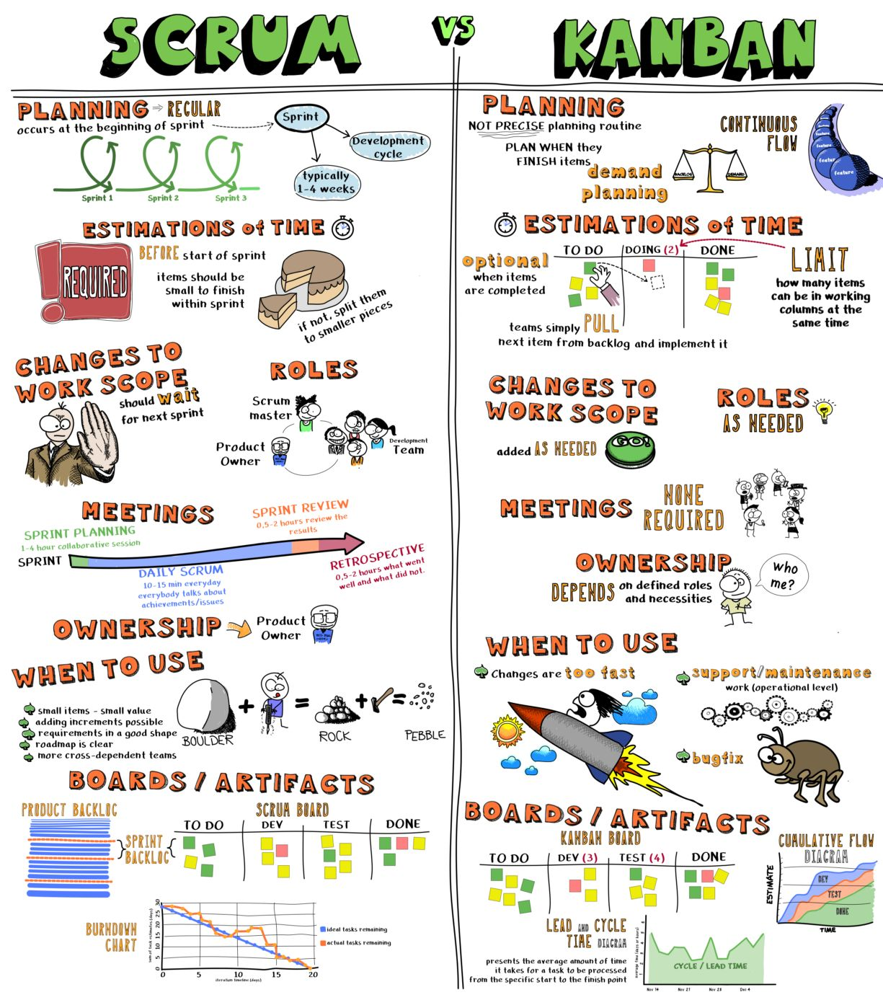

# Project Management

1. [Project Management Methodology](#project-management-methodology)
    1. [Spanish](#spanish)
    2. [Team Topologies](#team-topologies)
    3. [Agile vs Scrum vs Waterfall vs Kanban vs Lean](#agile-vs-scrum-vs-waterfall-vs-kanban-vs-lean)
    4. [Waterfall vs Agile](#waterfall-vs-agile)
    5. [Agile vs Scrum vs Kanban](#agile-vs-scrum-vs-kanban)
2. [Responsibility Assignment Matrix (RACI)](#responsibility-assignment-matrix-raci)
3. [KPIs and Employee Performance](#kpis-and-employee-performance)
4. [MVP Minimum Viable Product](#mvp-minimum-viable-product)
5. [Other Development Methodologies. Worst practices in Project Management](#other-development-methodologies-worst-practices-in-project-management)
    1. [DevDriven.By](#devdrivenby)
    2. [Promotion Driven Development](#promotion-driven-development)
6. [Culture and Leadership](#culture-and-leadership)
7. [Books](#books)
8. [Bunch of images](#bunch-of-images)
9. [Videos](#videos)
10. [Spanish Videos](#spanish-videos)
11. [Tweets](#tweets)
12. [Tweets 2. Cultures](#tweets-2-cultures)

<iframe width="100%" height="166" scrolling="no" frameborder="no" allow="autoplay" src="https://w.soundcloud.com/player/?url=https%3A//api.soundcloud.com/tracks/604265532&color=%23ff5500&auto_play=true&hide_related=false&show_comments=true&show_user=true&show_reposts=false&show_teaser=true"></iframe>
<a href="https://soundcloud.com/tlotfy99" title="Abou Seif 🧿" target="_blank" style="color: #cccccc; text-decoration: none;">Abou Seif 🧿</a> · <a href="https://soundcloud.com/tlotfy99/no-man-no-cry-jimmy-sax" title="no man no cry - jimmy sax" target="_blank" style="color: #cccccc; text-decoration: none;">no man no cry - jimmy sax</a>

## Project Management Methodology

- [dzone: Project Management Methodology: A Beginner's Guide](https://dzone.com/articles/best-emerging-project-management-methodologies-in) Using a specific methodology can help a Project Manager steer a project in the right direction and work in a structured manner.
- [dzone: Agile Project Management Explained – A Beginner’s Guide](https://dzone.com/articles/agile-project-management-explained-a-beginners-gui) For all who are looking into the good Agile project management can do, here's an explanation and some benefits.
- [dzone: A Complete Guide to the Project Management Lifecycle](https://dzone.com/articles/a-complete-guide-to-project-management-life-cycle) If you know about the product management lifecycle but aren't familiar with each of its phases, take a look at how they break down.
- [dzone: Top 40 Project Management Terms and Concepts of 2019](https://dzone.com/articles/top-40-project-management-terms-and-concepts-of-20)
- [dzone: 7 Project Management Basics](https://dzone.com/articles/7-project-management-basics-for-lifetime) Whether you're just starting out or are a career PM, these rules should never leave your mind.
- [blog.scrumstudy.com: Scrum and Kanban, alike or different?](http://blog.scrumstudy.com/scrum-and-kanban-alike-or-different-2/)
- [scrum.org: What Happens To The Sprint Backlog Items That Are Not Done?](https://www.scrum.org/resources/blog/vlog-what-happens-sprint-backlog-items-are-not-done)
- [cio.com: Agile vs. waterfall: Project methodologies compared](https://www.cio.com/article/3584559/agile-vs-waterfall-project-methodologies-compared.html) Agile and waterfall each offer unique benefits and drawbacks. Here are the pros and cons of each method, and how to know which is right for your organization’s projects.
- [scrum.org: Make Sure You Don’t Build High Performing Teams Just to Deliver Wrong Things Faster](https://www.scrum.org/resources/blog/make-sure-you-dont-build-high-performing-teams-just-deliver-wrong-things-faster)
- [scruminc.com: Better Scrum with Essence](https://www.scruminc.com/better-scrum-with-essence/) Essence is an industry standard for describing practices, which means there is no change to the actual Scrum content but an enhanced way for presenting it to teams. One of the main things you notice with Essence is the use of cards to represent the main concepts of any practice.
- [enterprisersproject.com: Scrum and Kanban: 3 realities CIOs should know](https://enterprisersproject.com/article/2020/10/scrum-kanban-3-realities-cios) Agile methodologies can make all the difference in your digital transformation, but successful adoption requires culture change. Consider this expert advice on scrum and Kanban.
- [forbes.com: Explaining Agile 🌟](https://www.forbes.com/sites/stevedenning/2016/09/08/explaining-agile)
- [scrum.org: Minimum Viable Product Considered Harmful 🌟](https://www.scrum.org/resources/blog/minimum-viable-product-considered-harmful)
- [agilecheetah.com: Why So Many Developers are Fed Up with Agile](https://agilecheetah.com/why-so-many-developers-are-fed-up-with-agile-pt-3/)
- [age-of-product.com: Scrum 2021: Getting You Started as Scrum Master or Product Owner](https://age-of-product.com/scrum-2021/)
- [scrum.org: Scrum 2021: Getting You Started as Scrum Master or Product Owner](https://www.scrum.org/resources/blog/scrum-2021-getting-you-started-scrum-master-or-product-owner)
- [scrum.org: Kanban Guide for Scrum Teams](https://www.scrum.org/resources/kanban-guide-scrum-teams) The Kanban Guide for Scrum Teams helps you add professional flow concepts to improve your value delivery.
- [redhat.com: 11 considerations for effectively managing a Linux sysadmin team 🌟](https://www.redhat.com/sysadmin/11-manager-considerations) Here are some guidelines for managers when dealing with your system administrator staff members.
- [medium: Scrum Teams That Don’t Verify Their Outcomes Are Basically Waterfall Teams](https://medium.com/serious-scrum/scrum-teams-that-dont-verify-their-outcomes-are-basically-waterfall-teams-cb208acdcc61)
- [codefresh.io: Using a Kanban board to manage and promote Helm Releases 🌟](https://codefresh.io/helm-tutorial/kanban-promotion-boards/)
- [medium: Nine Steps to Successfully Start Your New Product Owner Job](https://medium.com/serious-scrum/nine-steps-to-successfully-start-your-new-product-owner-job-b276c85e3dde) What you should do when starting a new journey as a Product Owner
- [cloudbees.com: How Asynchronous Communication Can Boost Productivity](https://www.cloudbees.com/blog/asynchronous-communication)
- [cloudbees.com: More Isn’t Always Better: Using Predictive Analytics to Show Adding More People Doesn’t Always Help](https://www.cloudbees.com/blog/using-predictive-analytics-to-show-adding-more-people)
- [infoq.com: Driving DevOps with Value Stream Management](https://www.infoq.com/articles/DevOps-value-stream/)
- [creately.com: How to Better Manage Your Projects with Kanban Boards](https://creately.com/blog/diagrams/what-is-a-kanban-board/)
- [hbr.org: As Your Team Gets Bigger, Your Leadership Style Has to Adapt](https://hbr.org/2019/03/as-your-team-gets-bigger-your-leadership-style-has-to-adapt)
- [carlos-piqueres.medium.com: Product Backlog vs Sprint Backlog](https://carlos-piqueres.medium.com/product-backlog-vs-sprint-backlog-c951f972e979)
- [skamille.medium.com: How New Managers Fail Individual Contributors](https://skamille.medium.com/how-new-managers-fail-individual-contributors-839a13bda1c5)
- [blog.pragmaticengineer.com: How Big Tech Runs Tech Projects and the Curious Absence of Scrum](https://blog.pragmaticengineer.com/project-management-at-big-tech/)
- [acumen.io: Can Kanban scale for teams of over 50 developers? When should you consider moving to Scrum?](https://www.acumen.io/blog/can-kanban-scale-for-teams-of-over-50-developers-when-should-you-consider-moving-to-scrum)
- [infoq.com: Better Metrics for Building High Performance Teams](https://www.infoq.com/articles/better-metrics-team-performance/)
- [==noidea.dog/glue: Being Glue==](https://noidea.dog/glue)
- [hbr.org: The Real Value of Middle Managers](https://hbr.org/2021/06/the-real-value-of-middle-managers)
- [dev.to: What’s Wrong With Measuring Developer Performance (+ 10 Best Metrics)](https://dev.to/actitime/whats-wrong-with-measuring-developer-performance-10-best-metrics-5620)
- [betterprogramming.pub: How to Speed Up Your Progress With Feedback](https://betterprogramming.pub/how-to-speed-up-your-progress-with-feedback-1f41872b290a) Know the key features of an effective feedback loop
- [betterprogramming.pub: Sprint Planning: Best Practices](https://betterprogramming.pub/sprint-planning-best-practices-1aad4103f6cb)
- [betterhumans.pub: 3 Productivity Tips I Learned Working at Google That You Should Already Be Using](https://betterhumans.pub/3-productivity-tips-i-learned-working-at-google-that-you-should-already-be-using-1bfb62356463)
- [medium.com/@victor.ronin: The dark side of a cross-functional team](https://medium.com/@victor.ronin/the-dark-side-of-a-cross-functional-team-e0d379e37c70)
- [alexander-goida.medium.com: Thoughts about breaking silos of software engineering teams 🌟](https://alexander-goida.medium.com/thoughts-about-breaking-silos-of-software-engineering-teams-323d1f78ef68)
- [hbr.org: How to Deal with High Pressure Situations at Work](https://hbr.org/2022/05/how-to-deal-with-high-pressure-situations-at-work)
- [medium.com/@TonyBologni: 4 reasons why 4 is the perfect team size for (agile) software development 🌟](https://medium.com/@TonyBologni/4-reasons-why-4-is-the-perfect-team-size-for-agile-software-development-8597d33f3cfe) There is no one-size-fits-all, but what I found in my career in (agile) software development is that teams are often too big rather than too small.
- [medium.com/dkatalis: Component Team vs Feature Team in a Nutshell 🌟](https://medium.com/dkatalis/component-team-vs-feature-team-in-a-nutshell-60c58671496f)
- [medium.com/the-ascent: Quiet People in Meetings Are Incredible](https://medium.com/the-ascent/quiet-people-in-meetings-are-incredible-7bb05ef9acd1) Knowing when not to talk is an art.
- [autoblog.com: VW CEO lost his job over buggy software that delayed new models](https://www.autoblog.com/2022/07/25/vw-ceo-herbert-diess-fired-over-cariad-buggy-software/)
- [techcrunch.com: Protestware on the rise: Why developers are sabotaging their own code](https://techcrunch.com/2022/07/27/protestware-code-sabotage/)
- [hbr.org: How to Debate Ideas Productively at Work](https://hbr.org/2019/01/how-to-debate-ideas-productively-at-work)
- [betterprogramming.pub: Techniques for Managing Your Time and Cognitive Load as a Senior Leader](https://betterprogramming.pub/techniques-for-managing-your-time-and-cognitive-load-as-a-senior-leader-2b9eadb0daa4)
- [medium.com/awesome-agile: 10 Ways Managers are Wasting Their Developers' Potential](https://medium.com/awesome-agile/10-ways-managers-are-wasting-their-developers-potential-5c0d78d8f8ba)
- [betterprogramming.pub: Stop Hiring Software Engineers](https://betterprogramming.pub/stop-hiring-software-engineers-8545520437ac) Consider product engineers.
- [hbr.org: The Surprising Power of Simply Asking Coworkers How They’re Doing](https://hbr.org/2019/02/the-surprising-power-of-simply-asking-coworkers-how-theyre-doing)
- [medium.com/developer-purpose: Think before you code. Engineering’s most underrated advice](https://medium.com/developer-purpose/think-before-you-code-engineerings-most-underrated-advice-40b47e08a3fc)
- [betterprogramming.pub: How to Grow as a (Software) Engineering Manager](https://betterprogramming.pub/how-do-you-grow-as-a-software-engineering-manager-33a05873693) Tips to thrive outside of the corporate ladder
- [betterprogramming.pub: Good Leadership Is About Growth, Not Brilliance](https://betterprogramming.pub/good-leadership-is-about-growth-not-brilliance-af8ca30f1a3a) Leadership isn’t about personal greatness and entitlement; it’s the humility to lead with courage and passion
- [betterhumans.pub: 8 Communication Hacks I Use To Appear More Senior As a Young Employee](https://betterhumans.pub/8-communication-hacks-i-use-to-appear-more-senior-as-a-young-employee-9106468bf5aa) Become more influential by learning the language of these subtle cues
- [jproco.medium.com: Deliver a Product Roadmap That Survives Startup Velocity](https://jproco.medium.com/deliver-a-product-roadmap-that-survives-startup-velocity-f9be4fb9893e) This is how you build the car while it’s speeding down the highway
- [medium.com/career-of-you: A Ten-Step Process for Team Leaders to Reduce Meeting Overload and Take Back Their Time](https://medium.com/career-of-you/a-ten-step-process-for-team-leaders-to-reduce-meeting-overload-and-take-back-their-time-407cf1f8f09b)
- [betterprogramming.pub: The Importance of Code Ownership 🌟](https://betterprogramming.pub/the-underestimated-importance-of-clear-code-ownership-baed758e47b8) Well-owned code is well-maintained code
- [infoworld.com: What to do when your devops team is downsized](https://www.infoworld.com/article/3682654/what-to-do-when-your-devops-team-is-downsized.html) Five tips to help you manage the emotional and practical repercussions when colleagues are let go.
- [bootcamp.uxdesign.cc: A quick win to prepare for every meeting using templates](https://bootcamp.uxdesign.cc/a-quick-win-to-prepare-for-every-meeting-using-templates-d2359c849433)
- [huryn.substack.com: 3 Ways to Create 10X Better Product Roadmaps](https://huryn.substack.com/p/3-ways-to-create-10x-better-product)
- [jchyip.medium.com: My critique of “the Spotify Model”: Part 1](https://jchyip.medium.com/my-critique-of-the-spotify-model-part-1-197d335ef7af)
- [hbr.org: How to Give Tough Feedback That Helps People Grow](https://hbr.org/2015/08/how-to-give-tough-feedback-that-helps-people-grow)
- [medium.com/@tom-neal: CTO Checklist](https://medium.com/@tom-neal/cto-checklist-1a2ef3d6502)
- [martinfowler.com: Retrospectives Antipatterns 🌟](https://martinfowler.com/articles/retrospective-antipatterns.html) If you use retrospectives, or any kind of meeting where people are supposed to discuss and learn from their discussions, you will have experienced less efficient sessions from time to time. There is no wonder in that, and it happens to most people. This article describes and offers solutions for three of these unfortunate situations: skipping generating insights, getting lost in things you can't change, and being dominated by a loudmouth.
- [==dzone.com: Productivity: Noise Is the Problem== 🌟🌟](https://dzone.com/articles/effectiveness-noise-is-the-problem) How to improve the productivity of our engineering team by providing more focus time
- [rebelscrum.site: Characteristics of a Great Product Owner](https://www.rebelscrum.site/post/characteristics-of-a-great-product-owner)
- [devops.com: Breaking Down Silos: Applying Open Source Practices in the Workplace](https://devops.com/breaking-down-silos-applying-open-source-practices-in-the-workplace/)
- [devops.com: How Good Developers Become Good Engineering Managers](https://devops.com/how-good-developers-become-good-engineering-managers/)
- [levelup.gitconnected.com: How to manage your technical backlog](https://levelup.gitconnected.com/how-to-manage-your-technical-backlog-868415f8eea9)
- [techrepublic.com: What is Lean Software Development?](https://www.techrepublic.com/article/lean-development/)
- [medium.com/@ElizAyer: Meetings *are* the work](https://medium.com/@ElizAyer/meetings-are-the-work-9e429dde6aa3)
- [newsletter.pragmaticengineer.com: Engineering Leadership Skill Set Overlaps](https://newsletter.pragmaticengineer.com/p/engineering-leadership-skillset-overlaps) How Staff Engineer, Engineering Manager (EM), Product Manager (PM), Tech Lead Manager (TLM) and Technical Program Manager (TPM) positions overlap in Big Tech and at high-growth startups. **If you are an individual contributor engineer, you really need to print this out and hang it somewhere**
- [hbr.org: What It Takes to Give a Great Presentation](https://hbr.org/2020/01/what-it-takes-to-give-a-great-presentation)
- [inc.com: 27 Years Ago, Steve Jobs Said the Best Employees Focus on Content, Not Process. Research Shows He Was Right](https://www.inc.com/jeff-haden/27-years-ago-steve-jobs-said-best-employees-focus-on-content-not-process-workplace-research-shows-he-was-right.html) According to the Apple co-founder, the best employees are also a pain in the butt to manage.
- [==Bus factor==](https://en.wikipedia.org/wiki/Bus_factor) The bus factor is a measurement of the risk resulting from information and capabilities not being shared among team members, derived from the phrase "in case they get hit by a bus".
- [businessinsider.com: I'm an ex-Amazon senior leader. Here's why layoffs keep happening and why ambitious managers are fueling them](https://www.businessinsider.com/amazon-reason-for-layoffs-former-senior-tech-leader-2023-5)
- [medium.com/codex: The Only True Agency A Software Engineer Requires](https://medium.com/codex/the-only-true-agency-a-software-engineer-requires-2c0816b263bc)

### Spanish

- [scrum.org: Scrum no es una metodología, es un marco de trabajo](https://www.scrum.org/resources/blog/scrum-no-es-una-metodologia-es-un-marco-de-trabajo)
- [scrum.org: Posturas del Product Owner](https://www.scrum.org/resources/blog/posturas-del-product-owner)
- [itnove.com: La Guía Scrum 2020 en Español​](https://itnove.com/scrum-la-guia-scrum-2020-en-espanol/)
- [rockcontent.com: Conoce los principales tipos de consultoría en las que tu negocio puede invertir para explotar su potencial](https://rockcontent.com/es/blog/tipos-de-consultoria/) La consultoría es un servicio profesional destinado a resolver un problema de tu empresa, ayudándola a detectar falencias y lograr el aprovechamiento de distintas oportunidades para su crecimiento.
- [entrepreneur.com: ¿Cómo manejar un equipo que trabaja desde sus casas?](https://www.entrepreneur.com/article/365880)
- [mamaqueesscrum.com: Mamá… ¿Qué es Scrum?](https://mamaqueesscrum.com/2018/11/12/labores-que-un-product-owner-deberia-hacer-que-no-aparecen-en-la-scrum-guide/) Labores que un Product Owner podría hacer que no aparecen en la Scrum Guide
- [bbc.com: Por qué en Japón los jefes NO felicitan a sus empleados cuando hacen bien su trabajo](https://www.bbc.com/mundo/vert-cap-37270163)
- [smoda.elpais.com: Destacar y venderse no implica trabajar bien: así es la nueva batalla por las apariencias del trabajo](https://smoda.elpais.com/trabajo/apariencias-venderse-trabajo/) Muchos trabajadores sufren en silencio la ‘performance’ diaria de quienes ponen más empeño en contar sus supuestos logros que en materializarlos.
- [blogs.elconfidencial.com: Los españoles somos más improductivos que nunca y el problema no es de los empleados](https://blogs.elconfidencial.com/tecnologia/tribuna/2022-02-12/productividad-tecnologia-startups-apps_3373786/) El progreso nunca ha venido de pretender que los humanos trabajemos como robots. Para tener un debate serio no debemos engañarnos sobre cómo funciona la productividad.
- [elfinanciero.com.mx: Tu jefe no siempre tiene la razón: ¿de qué manera puedes contradecirlo?](https://www.elfinanciero.com.mx/empresas/2021/07/06/tu-jefe-no-siempre-tiene-la-razon-de-que-manera-puedes-contradecirlo/) Los primeros beneficiados de que exista un pensamiento crítico constructivo en las empresas son los jefes.
- [elconfidencial.com: La mejor forma de decirle a tu jefe que estás hasta arriba y no puedes más con tanto trabajo](https://www.elconfidencial.com/alma-corazon-vida/2022-02-14/jefe-trabajo-empleo-quemado-no-puedes_3372444/) Cuando sientes que lo das todo y no puedes más, a veces merece la pena echar el freno y hablar claramente con tu superior del agobio que estás sintiendo. ¿Cómo hacerlo bien?
- [blog.trello.com: Consejos para manejar distintos conflictos en un equipo de trabajo](https://blog.trello.com/es/conflictos-en-el-trabajo)
- [lavanguardia.com: La delgada línea roja del liderazgo: de la cercanía al compadreo](https://www.lavanguardia.com/economia/20220223/8075492/liderazgo-empresa-jefes-empleados-cercania-decisiones.html)
- [okdiario.com: Telefónica y Santander despiden a 467 empleados en 2021 por denuncias de compañeros](https://okdiario.com/economia/telefonica-santander-despiden-467-empleados-2021-denuncias-companeros-8655690) Fraude interno, acoso laboral..
- [cronista.com: Cómo identificar a un mal jefe y qué errores no pueden cometer hoy los líderes](https://www.cronista.com/apertura/empresas/como-identificar-a-un-mal-jefe-y-que-errores-no-pueden-cometer-hoy-los-lideres/) Con la pandemia, la digitalización acelerada y los rediseños organizacionales, la forma de liderar cambió. Qué errores no pueden permitirse hoy las empresas en materia de liderazgo. Los nuevos roles.
- [eleconomista.es: Cómo es un mal jefe y qué debe aprender para liderar mejor su empresa (y ser feliz)](https://www.eleconomista.es/status/noticias/10679296/07/20/Como-es-un-mal-jefe-y-que-debe-aprender-para-liderar-mejor-su-empresa-y-ser-feliz.html)
- [vozpopuli.com: Cliente tóxico: cuando el que paga no siempre tiene la razón](https://www.vozpopuli.com/economia_y_finanzas/cliente-toxico.html) Un cliente conflictivo, demasiado exigente o que tiende a tensar mucho la relación con sus proveedores es un problema para cualquier empresa. Así se gestiona un cliente tóxico.
- [elconfidencial.com: Esta psicóloga ha estudiado a los capullos de tu empresa y sabe por qué se comportan así](https://www.elconfidencial.com/espana/2022-03-18/tessa-west-psicologa-capullos-trabajo_3392185/) Tessa West, profesora de la Universidad de Nueva York, lleva 15 años estudiando el comportamiento humano y tiene una buena idea de por qué somos así en el trabajo.
- [business.vogue.es: Adiós a los jefes tóxicos: este es el nuevo tipo de liderazgo gentil que triunfa](https://business.vogue.es/carrera/articulos/adios-jefes-toxicos-la-salud-organizacional-rentabilidad-residen-liderazgo-gentil/533) Un líder tóxico tiene un coste (mental) para el trabajador y, por tanto, también (económico) para la empresa
- [magnet.xataka.com: Esclavos de la improductividad: el 70% de las reuniones impiden que los empleados hagan su trabajo](https://magnet.xataka.com/en-diez-minutos/esclavos-improductividad-70-reuniones-impiden-que-empleados-hagan-su-trabajo)
- [genbeta.com: Las reuniones laborales por videollamada nos agotan: esto es lo que pasa si se eliminan y cambian por chats](https://www.genbeta.com/actualidad/reuniones-trabajo-nos-agotan-videollamada-se-sabe-que-pasa-se-eliminan-usamos-chats)
- [pymesyautonomos.com: ¿Está trabajando el empleado realmente desde su casa?](https://www.pymesyautonomos.com/management/esta-trabajando-empleado-realmente-su-casa)
- [estrategiadeproducto.com: La espiral de mierda](https://www.estrategiadeproducto.com/p/evitar-caer-espiral-de-mierda) ¿Por qué todo parece ir más lento si cada vez somos más? Analizamos las causas que llevan a que muchas startups fracasen durante su proceso de escala y cómo evitarlo.
- [estrategiadeproducto.com: La segunda mayor mentira sobre Product Management](https://www.estrategiadeproducto.com/p/segunda-mayor-mentira-product-management) No. Un Product Manager no es la intersección de Diseño, Tecnología y Negocio.
- [mariocortes.net: La crisis de seniority](https://www.mariocortes.net/la-crisis-de-seniority/) El “seniority” no está relacionado exclusivamente con la experiencia profesional, sino a la capacidad de un profesional para enfrentarse a un problema o reto y la aptitud con la que se enfrenta a él.
- [businessinsider.es: Avanzar en la carrera profesional y conseguir ascensos dentro de la empresa será mucho más difícil para las personas que teletrabajan, según el CEO de IBM](https://www.businessinsider.es/teletrabajar-perjudica-carrera-profesional-posibles-ascensos-1240782)
- [genbeta.com: Un ex-CEO, sobre el origen de tener gente que ni hace falta en las empresas: “Contratas a alguien, y lo primero que hace es contratar"](https://www.genbeta.com/a-fondo/este-ex-ceo-explica-que-hay-demasiados-empleados-empresas-contratas-a-alguien-primero-que-quiere-contratar)
- [businessinsider.es: La brillante explicación de Steve Jobs sobre por qué los buenos empleados renuncian al trabajo](https://www.businessinsider.es/explicacion-steve-jobs-buenos-empleados-renuncian-1137601)
- [openwebinars.net: 13 Errores que cometes como Manager](https://openwebinars.net/blog/13-errores-que-cometes-como-manager) ¿Tu equipo no está funcionando al nivel esperado? Quizás el problema no sea su desempeño, sino ciertas prácticas de gestión. Este artículo identifica 13 errores críticos que muchos managers cometen, para que aprendas a evitarlos y a construir un ambiente de trabajo más productivo y motivador.

### Team Topologies

- [itrevolution.com: The Problem With Org Charts](https://itrevolution.com/the-problem-with-org-charts/)
- [dzone: Breaking Silos: Enhance Speed and Value Delivery](https://dzone.com/articles/silos-breaking-for-business-to-enhance-speed-to-va) How do we diagnose organizational silos? And how do we slice the large size business teams who are serving many customers or products with poor efficiency?
- [itrevolution.com: Get Started With Team Topologies In 8 Steps](https://itrevolution.com/get-started-with-team-topologies-in-8-steps/)
- [betterprogramming.pub: Team Topologies — A New Way of Thinking About Teams](https://betterprogramming.pub/team-topologies-a-new-way-of-thinking-about-teams-8f4853038509) Organize teams around four fundamental types: stream-aligned, enabling, complicated subsystem, and platform.

### Agile vs Scrum vs Waterfall vs Kanban vs Lean

- [visual-paradigm.com: Scrum vs Waterfall vs Agile vs Lean vs Kanban](https://www.visual-paradigm.com/scrum/scrum-vs-waterfall-vs-agile-vs-lean-vs-kanban/)
- [greycampus.com: What's the Difference? Agile vs Scrum vs Waterfall vs Kanban](https://www.greycampus.com/blog/agile-and-scrum/agile-vs-scrum-vs-waterfall-vs-kanban)
- [What's the Difference? Agile vs Scrum vs Waterfall vs Kanban](https://www.smartsheet.com/agile-vs-scrum-vs-waterfall-vs-kanban)
- [lucidchart.com: Agile vs. Waterfall vs. Kanban vs. Scrum: What’s the Difference?](https://www.lucidchart.com/blog/agile-vs-waterfall-vs-kanban-vs-scrum)
- [rethinkagile.org: 5 reasons why Agile is better than Waterfall](https://www.rethinkagile.org/post/5-reasons-why-agile-is-better-than-waterfall)

### Waterfall vs Agile

- [thedigitalprojectmanager.com: Waterfall Vs Agile: ¿Cuál Metodología Debes Utilizar Para Tu Proyecto?](https://thedigitalprojectmanager.com/es/agile-frente-a-waterfall/)
- [deloitte.com: Bringing Agile benefits to a waterfall project](https://www2.deloitte.com/us/en/insights/industry/public-sector/agile-in-government-waterfall-software-approach.html)
- [deloitte.com: ¿Cuál es la metodología más adecuada para tu proyecto? Metodología Waterfall vs Agile](https://www2.deloitte.com/es/es/pages/technology/articles/waterfall-vs-agile.html)

### Agile vs Scrum vs Kanban

- [guru99.com: Agile Vs Scrum: Know the Difference](https://www.guru99.com/agile-vs-scrum.html)
- [dzone: Agile vs. Scrum: Differences Between Scrum and Agile Development](https://dzone.com/articles/agile-vs-scrum-differences-between-scrum-and-agile)
- [softwaretestinghelp.com: Kanban Vs Scrum Vs Agile: A Detailed Comparison To Find Differences](https://www.softwaretestinghelp.com/kanban-vs-scrum-vs-agile/)
- [atlassian.com: Kanban vs. Scrum](https://www.atlassian.com/agile/kanban/kanban-vs-scrum)
- [medium: Are Scrum and Kanban Allies Or Enemies?](https://medium.com/serious-scrum/are-scrum-and-kanban-allies-or-enemies-9d1d27353cd7) The potential and pitfalls of Scrum and Kanban
- [k21academy.com: Scrum vs Kanban](https://k21academy.com/scrum-master/scrum-vs-kanban/)

## Responsibility Assignment Matrix (RACI)

- [wikipedia: Responsibility assignment matrix](https://en.wikipedia.org/wiki/Responsibility_assignment_matrix)
- [thedigitalprojectmanager.com: Create A Responsibility Assignment Matrix (RACI Chart) That Works](https://thedigitalprojectmanager.com/raci-chart-made-simple/)
    - [thedigitalprojectmanager.com: Matriz RACI Simplificado: Cómo Crear Una Matriz De Responsabilidades Que Realmente Funcione](https://thedigitalprojectmanager.com/es/grafico-raci-manera-mas-simple/)
- [Understanding Responsibility Assignment Matrix (RACI Matrix)](https://project-management.com/understanding-responsibility-assignment-matrix-raci-matrix/)
- [Aprende cómo distribuir mejor las responsabilidades con la Matriz RACI](https://rockcontent.com/es/blog/matriz-raci/)
- [blog.hubspot.es: Matriz RACI: qué es y cómo utilizarla para asignar responsabilidades](https://blog.hubspot.es/marketing/matriz-raci)
- [jaumepujolcapllonch.com: La matriz RACI y la asignación de responsabilidades](https://www.jaumepujolcapllonch.com/la-matriz-raci-y-la-asignacion-de-responsabilidades/)
- [rockcontent.com: mejor las responsabilidades con la Matriz RACI](https://rockcontent.com/es/blog/matriz-raci/)

## KPIs and Employee Performance

- [creately.com: A Step By Step Guide to Set KPIs for Team Members](https://creately.com/blog/business/how-to-set-kpis-for-team-members/)

## MVP Minimum Viable Product

- [Minimum Viable Product](https://en.wikipedia.org/wiki/Minimum_viable_product)
- [gazafatonarioit.com: Entiende el MVP (Producto Mínimo Viable) y por qué prefiero Producto que se pueda probar, utilizar y adorar más temprano](http://www.gazafatonarioit.com/2020/09/entiende-el-mvp-producto-minimo-viable.html)
- [blog.hubspot.es: MVP: 3 pasos para desarrollar un Producto mínimo viable](https://blog.hubspot.es/sales/producto-minimo-viable)
- [bloo.media: Producto Mínimo Viable ¿Qué es y cómo crearlo?](https://bloo.media/blog/producto-minimo-viable-mvp/)
- [blog.asmartbear.com: I hate MVPs. So do your customers. Make it SLC instead 🌟](https://blog.asmartbear.com/slc.html)
- [medium: MVP vs MDP = Viability vs Delight. What You Really Need?](https://medium.com/swlh/mvp-vs-mdp-viability-vs-delight-what-you-really-need-296b42df005d)
- [joelcalifa.com: Tiny Wins](https://joelcalifa.com/blog/tiny-wins/) The big benefits of little changes.
- [gammaux.com: Cómo definir un Minimum Viable Product (MVP)](https://www.gammaux.com/blog/como-definir-un-minimum-viable-product-mvp/)
- [dev.to: Construyendo un MVP sin base de datos](https://dev.to/sergomz/construyendo-un-mvp-sin-base-de-datos-1i4k)

## Other Development Methodologies. Worst practices in Project Management

- [nichesoftware.co.nz: Other Development Methodologies](http://www.nichesoftware.co.nz/other-methodologies.html) We’ve all heard of Test-Driven Development (aka TDD), and those of us who’ve been around the block a few times have no double heard of Behaviour Driven Development (BDD) and Domain Driven Development (DDD) as well. But have you heard of their dodgy cousins? In this series I want to explore a handful of these lesser-known development methodologies, exploring both what they are, and what you might want (or need) to do to address them when they occur.
- [ewsolutions.com: Worst Project Management Practices](https://www.ewsolutions.com/worst-project-management-practices/)

### DevDriven.By

- [devdriven.by](https://devdriven.by/)

### Promotion Driven Development

- [devdriven.by: Promotion Driven Development](https://devdriven.by/promotion/) When you write code to increase your visibility with management, let things break so that you can be the hero that fixes them and generally work on things that lead to a corner office asap
- [nichesoftware.co.nz: Promotion Driven Development (PDD) 🌟](http://www.nichesoftware.co.nz/2021/05/29/promotion-driven-development.html)
- [reddit.com: Promotion Driven Development](https://www.reddit.com/r/ExperiencedDevs/comments/pw6vuv/promotion_driven_development/)

## Culture and Leadership

- [en.wikipedia.org: Kiss up kick down](https://en.wikipedia.org/wiki/Kiss_up_kick_down)
- [lavanguardia.com: Los estilos de liderazgo más apreciados por los empleados](https://www.lavanguardia.com/vivo/20211113/7856878/cualidades-mas-valoran-empleados-jefe-pmv.html)
- [businessinsider.es: "Estoy atrapado en unos hábitos poco saludables y me siento abrumado por todo lo que tengo que hacer, ¿cómo puedo aprender a decir no?"](https://www.businessinsider.es/tan-dificil-decir-no-jefe-965459)
- [businessinsider.es: Así es como tu educación te ha moldeado sutilmente para que nunca consigas ascender en el trabajo](https://www.businessinsider.es/razon-nunca-consigues-ascender-trabajo-conseguir-mejor-sueldo-970737)
- [euroresidentes.com: La intimidación verbal en la empresa](https://www.euroresidentes.com/empresa/exito-empresarial/la-intimidacin-verbal-en-la-empresa)
- [isprox.com: 16 Estilos de liderazgo: ¿cuál es más efectivo?](https://isprox.com/16-estilos-liderazgo-cual-es-mas-efectivo/)

## Books

- [swarmia.com/build: Build Elements of an Effective Software Organization](https://www.swarmia.com/build/) By Rebecca Murphey and Otto Hilska
    - Building software is hard. Running an effective software engineering organization is harder. Build: Elements of an Effective Software Organization is a guide to help good software teams get better and remain effective as the organization grows and evolves.
    - Build is a blueprint for continuous improvement. It zeroes in on three key ingredients: a relentless focus on business outcomes, actionable insights to boost the productivity of your software teams, and a thoughtful approach to improving the experience of building software at your company.
    - Whether you’re a leader, a manager, or anyone invested in seeing your team or organization improve, Build provides the roadmap you need to drive meaningful, impactful progress.

## Bunch of images

??? note "Click to expand!"

	

	

	

	

	

	

	

	

	

	

	
	

## Videos

??? note "Click to expand!"

	

	<iframe width="560" height="315" src="https://www.youtube.com/embed/kJdXjtSnZTI" title="YouTube video player" frameborder="0" allow="accelerometer; autoplay; clipboard-write; encrypted-media; gyroscope; picture-in-picture" allowfullscreen></iframe>
	<iframe width="560" height="315" src="https://www.youtube.com/embed/0fx7yy9-L7E" title="YouTube video player" frameborder="0" allow="accelerometer; autoplay; clipboard-write; encrypted-media; gyroscope; picture-in-picture" allowfullscreen></iframe>
	<iframe width="560" height="315" src="https://www.youtube.com/embed/B0hPpGsslgE" title="YouTube video player" frameborder="0" allow="accelerometer; autoplay; clipboard-write; encrypted-media; gyroscope; picture-in-picture" allowfullscreen></iframe>
	<iframe width="560" height="315" src="https://www.youtube.com/embed/YyXRYgjQXX0" title="YouTube video player" frameborder="0" allow="accelerometer; autoplay; clipboard-write; encrypted-media; gyroscope; picture-in-picture" allowfullscreen></iframe>
	<iframe width="560" height="315" src="https://www.youtube.com/embed/fvzUis-t2QQ" title="YouTube video player" frameborder="0" allow="accelerometer; autoplay; clipboard-write; encrypted-media; gyroscope; picture-in-picture" allowfullscreen></iframe>
	

## Spanish Videos
??? note "Click to expand!"

	

	<iframe width="560" height="315" src="https://www.youtube.com/embed/ipEwm-fg0rc" title="YouTube video player" frameborder="0" allow="accelerometer; autoplay; clipboard-write; encrypted-media; gyroscope; picture-in-picture" allowfullscreen></iframe>
	<iframe width="560" height="315" src="https://www.youtube.com/embed/TQOzU53xmQY" title="YouTube video player" frameborder="0" allow="accelerometer; autoplay; clipboard-write; encrypted-media; gyroscope; picture-in-picture" allowfullscreen></iframe>
	<iframe width="560" height="315" src="https://www.youtube.com/embed/YKGtNie8HmE" title="YouTube video player" frameborder="0" allow="accelerometer; autoplay; clipboard-write; encrypted-media; gyroscope; picture-in-picture" allowfullscreen></iframe>
	<iframe width="560" height="315" src="https://www.youtube.com/embed/-p-znNbtNXo" title="YouTube video player" frameborder="0" allow="accelerometer; autoplay; clipboard-write; encrypted-media; gyroscope; picture-in-picture" allowfullscreen></iframe>
	

## Tweets

  
Click to expand!

<blockquote class="twitter-tweet">
6 questions I try to answer before starting any new project:  1. What problem am I solving? 2. What constraints do I have? 3. Who are the main stakeholders? 4. What are the risks? 5. How do I measure progress? 6. What does success look like?  Don&#39;t sail without a compass.
&mdash; Santiago (@svpino) <a href="https://twitter.com/svpino/status/1393868830859010049?ref_src=twsrc%5Etfw">May 16, 2021</a></blockquote> 

<blockquote class="twitter-tweet">
We really need to normalize the conversation around big tech and promotion processes that lead to unnecessary complexity and waste. <a href="https://t.co/pAfErKPKBH">https://t.co/pAfErKPKBH</a>
&mdash; Kelsey Hightower (@kelseyhightower) <a href="https://twitter.com/kelseyhightower/status/1442298856406863876?ref_src=twsrc%5Etfw">September 27, 2021</a></blockquote> 

<blockquote class="twitter-tweet">
I can&#39;t stop thinking how easier it looks to adjust to new organizations as a manager vs software engineer. Institutional knowledge, historical background, footprint/track record, and connections matter a lot more when you are a senior engineer.
&mdash; Jaana Dogan at KubeCon ヤナ ドガン (@rakyll) <a href="https://twitter.com/rakyll/status/1445439161570267141?ref_src=twsrc%5Etfw">October 5, 2021</a></blockquote> 

<blockquote class="twitter-tweet">
Enterprise SaaS MVP trap .. <a href="https://t.co/CNXkHzFOnn">pic.twitter.com/CNXkHzFOnn</a>
&mdash; John Cutler (@johncutlefish) <a href="https://twitter.com/johncutlefish/status/1452048722917871620?ref_src=twsrc%5Etfw">October 23, 2021</a></blockquote> 

<blockquote class="twitter-tweet">
 <a href="https://t.co/r5qyaOWFXP">pic.twitter.com/r5qyaOWFXP</a>
&mdash; Pukar (@PukarDesign) <a href="https://twitter.com/PukarDesign/status/1452141978167267332?ref_src=twsrc%5Etfw">October 24, 2021</a></blockquote> 

<blockquote class="twitter-tweet">
The hardest part of any project is finishing the last 10%.  The solution to this is quitting when the project is 90% complete and finding a new job.
&mdash; JackForge.x (@TheJackForge) <a href="https://twitter.com/TheJackForge/status/1514353370089197571?ref_src=twsrc%5Etfw">April 13, 2022</a></blockquote> 

<blockquote class="twitter-tweet">
What are ways you stay hands on, as an engineering manager? Especially if you don’t code day to day (at work).
&mdash; Gergely Orosz (@GergelyOrosz) <a href="https://twitter.com/GergelyOrosz/status/1619797019547271168?ref_src=twsrc%5Etfw">January 29, 2023</a></blockquote> 

<blockquote class="twitter-tweet">
Amazon expects a lot out of their engineer managers.  They expect them to run projects, mentor employees, design systems, architect platforms, manage operations, communicate with customers, and evolve products.  But they don&#39;t expect them to code.  🧵
&mdash; Dave Anderson (@scarletinked) <a href="https://twitter.com/scarletinked/status/1646899226960429057?ref_src=twsrc%5Etfw">April 14, 2023</a></blockquote> 

## Tweets 2. Cultures

  
Click to expand!

<blockquote class="twitter-tweet">
Irish and German people offering things <a href="https://t.co/AoPgWJpK6L">pic.twitter.com/AoPgWJpK6L</a>
&mdash; Killian Sundermann (@killersundymann) <a href="https://twitter.com/killersundymann/status/1446131283969589250?ref_src=twsrc%5Etfw">October 7, 2021</a></blockquote> 

<blockquote class="twitter-tweet">
In cutthroat cultures, people kiss up and kick down. They protect themselves by currying favor with people in power and exploiting those without it.  In supportive cultures, people speak up and support down. They protect people without power by raising problems to those with it.
&mdash; Adam Grant (@AdamMGrant) <a href="https://twitter.com/AdamMGrant/status/1460680644200124419?ref_src=twsrc%5Etfw">November 16, 2021</a></blockquote> 

<blockquote class="twitter-tweet">
Politeness is not the same as kindness.  Being polite is saying what makes people feel good today. Being kind is doing what helps people get better tomorrow.  In polite cultures, people withhold disagreement and criticism. In kind cultures, people speak their minds respectfully.
&mdash; Adam Grant (@AdamMGrant) <a href="https://twitter.com/AdamMGrant/status/1459535163273138176?ref_src=twsrc%5Etfw">November 13, 2021</a></blockquote> 

<blockquote class="twitter-tweet">
La llamada transformación digital no solo se trata del cambio tecnológico sino principalmente del cambio de mentalidad de las personas para implementar nuevos estilos de gestión y liderazgo necesarios para gestionar en la era digital
&mdash; RICARDO SORRON (@RSorron) <a href="https://twitter.com/RSorron/status/1460971778533122050?ref_src=twsrc%5Etfw">November 17, 2021</a></blockquote> 

<blockquote class="twitter-tweet">
Voy a tratar de explicar cuál es la mejor (o menos mala) manera de afrontar el acoso moral (Mobbing) en el trabajo. El <a href="https://twitter.com/hashtag/Mobbing?src=hash&amp;ref_src=twsrc%5Etfw">#Mobbing</a> laboral es una lacra habitualmente silenciada y que en épocas de crisis como la actual se desata con mayor virulencia. Trataré de dar unos consejos 👇🧵
&mdash; Luis F. Pallarés (@Laboralista_DCT) <a href="https://twitter.com/Laboralista_DCT/status/1487328483168694273?ref_src=twsrc%5Etfw">January 29, 2022</a></blockquote> 

<blockquote class="twitter-tweet">
<a href="https://twitter.com/hashtag/Empleo?src=hash&amp;ref_src=twsrc%5Etfw">#Empleo</a> | Si nuestra &#39;tribu&#39; se encuentra bajo amenaza, el instinto nos llama a cerrar filas en lugar de buscar lo que es mejor para toda la organización <a href="https://t.co/x81ashw12O">https://t.co/x81ashw12O</a>
&mdash; expansioncom (@expansioncom) <a href="https://twitter.com/expansioncom/status/1487788912378585092?ref_src=twsrc%5Etfw">January 30, 2022</a></blockquote> 

<blockquote class="twitter-tweet">
My manager yelled at me today for writing too many docs and I feel every female software engineer needs to hear this every day
&mdash; Guinevere Saenger (@guincodes) <a href="https://twitter.com/guincodes/status/1489308647851053057?ref_src=twsrc%5Etfw">February 3, 2022</a></blockquote> 

<blockquote class="twitter-tweet">
After looking at the problem:  JS developer:  &quot;I bet there is a library for that&quot;  Experienced JS developer:  &quot;I bet I can write a library for that&quot;  Next level JS developer:  &quot;I bet I can release a new framework for doing this&quot;
&mdash; Dushyant.yaml (@DevDminGod) <a href="https://twitter.com/DevDminGod/status/1493154795586453505?ref_src=twsrc%5Etfw">February 14, 2022</a></blockquote> 

<blockquote class="twitter-tweet">
6 years ago I joined a 20-person startup.  I wanted to quit after my first week, but didn&#39;t.  Now our company is worth over $1B and has 200+ employees.  Here&#39;s what I&#39;ve learned about succeeding at a startup:
&mdash; Brian Bourque 🚀 (@bbourque) <a href="https://twitter.com/bbourque/status/1497563992478257153?ref_src=twsrc%5Etfw">February 26, 2022</a></blockquote> 

<blockquote class="twitter-tweet">
Los sabotajes también perjudican y mucho a otros profesionales, que a marchas forzadas tenemos que recuperar los sistemas críticos heredados al retomar un proyecto de gente descontenta que sale. Falta ética profesional y buenas prácticas.
&mdash; nubenetes (@nubenetes) <a href="https://twitter.com/nubenetes/status/1491466103150817282?ref_src=twsrc%5Etfw">February 9, 2022</a></blockquote> 

<blockquote class="twitter-tweet">
In <a href="https://twitter.com/hashtag/tech?src=hash&amp;ref_src=twsrc%5Etfw">#tech</a> we glorify hustle culture and working long hours far too much. Tell me a story of the laziest thing thing you&#39;ve ever done to advance your career.
&mdash; Jem Young (@JemYoung) <a href="https://twitter.com/JemYoung/status/1501310036341100548?ref_src=twsrc%5Etfw">March 8, 2022</a></blockquote> 

<blockquote class="twitter-tweet">
Nothing wrong with being a solo-founder because 65% of startups fail due to cofounder conflicts.
&mdash; Andrew Gazdecki (@agazdecki) <a href="https://twitter.com/agazdecki/status/1510799737187811330?ref_src=twsrc%5Etfw">April 4, 2022</a></blockquote> 

<blockquote class="twitter-tweet">
The history of software development <a href="https://t.co/JeLU0A2hzF">pic.twitter.com/JeLU0A2hzF</a>
&mdash; Dare Obasanjo (@Carnage4Life) <a href="https://twitter.com/Carnage4Life/status/1541608744630358017?ref_src=twsrc%5Etfw">June 28, 2022</a></blockquote> 

<blockquote class="twitter-tweet">
If you&#39;re afraid of being a micromanager  I can guarantee you are one.  It&#39;s the Micromanagement Spiral. 🌀  Let me explain:
&mdash; Laura Tacho 🌮 (@rhein_wein) <a href="https://twitter.com/rhein_wein/status/1547211754333036544?ref_src=twsrc%5Etfw">July 13, 2022</a></blockquote> 

<blockquote class="twitter-tweet">
I wished management had a good understanding how costly it is to build something wrong in comparison to not building anything.
&mdash; Jaana Dogan ヤナ ドガン (@rakyll) <a href="https://twitter.com/rakyll/status/1550227569550577664?ref_src=twsrc%5Etfw">July 21, 2022</a></blockquote> 

<blockquote class="twitter-tweet">
A lot of senior engineers are going to find themselves coerced into becoming team leads with management responsibilities, just to provide relief for managers with too many direct reports.  My suggestion is to be open to trying it. But confirm with your manager that you can go… <a href="https://t.co/Iayep0lHxj">https://t.co/Iayep0lHxj</a>
&mdash; Karthik Hariharan (@hkarthik) <a href="https://twitter.com/hkarthik/status/1756363374651400575?ref_src=twsrc%5Etfw">February 10, 2024</a></blockquote> 

