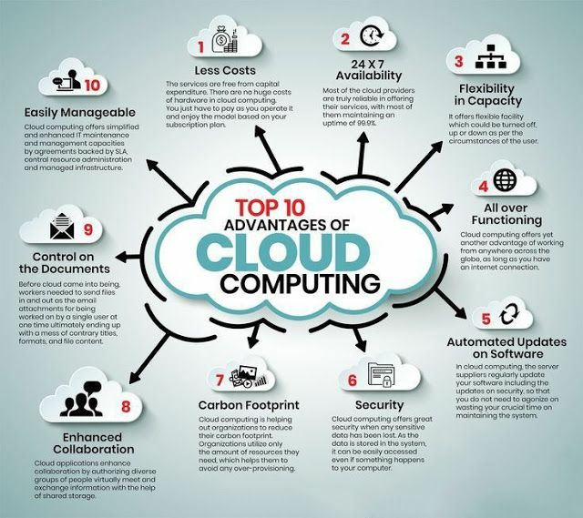

# Public Cloud Solutions

1. [Public Cloud References](#public-cloud-references)
2. [Cloud Agnostic Design](#cloud-agnostic-design)
3. [Multi-Cloud and Multi-Tool Concerns](#multi-cloud-and-multi-tool-concerns)
4. [Public Cloud Services Comparison](#public-cloud-services-comparison)
5. [Openshift as a Service](#openshift-as-a-service)
6. [Kubernetes as a Service](#kubernetes-as-a-service)
7. [IoT Cloud](#iot-cloud)
8. [GAIA-X](#gaia-x)
9. [Outages](#outages)
10. [Podcasts](#podcasts)
11. [Images](#images)
12. [Videos](#videos)
13. [Twitter](#twitter)

## Public Cloud References

- [cloud-mercato.com: Public Cloud Reference 🌟](https://pcr.cloud-mercato.com/) A unique website gathering all catalogs
    - [cloud-mercato.com: State of the art of Public Object Storage Europe 🌟](https://projector.cloud-mercato.com/projects/state-of-the-art-of-public-object-storage-europe)
- [learntocloud.guide](https://learntocloud.guide)

## Cloud Agnostic Design

- [==medium: Cloud Agnostic Design== 🌟](https://medium.com/path-to-software-architect/cloud-agnostic-design-925c08e1d610)

## Multi-Cloud and Multi-Tool Concerns

- [cybernews.com: Trouble in paradise: IT professionals unhappy with cloud services](https://cybernews.com/cloud/trouble-in-paradise-it-professionals-unhappy-with-cloud-services/) Only 8% of IT professionals surveyed around the globe believe they are getting the most from the cloud. A staggering 76% said they think their company is hitting a 'wall' as many of the daily tools were not designed to unify a multi-cloud, multi-tool world. 73% of the respondents agreed that they'd reached a point where they are struggling with efficiency scaling cloud efforts. Complexities with cloud adoption have increased, meaning that many business units and engineers within an organization decide to find isolated local solutions. That translates to companies having thousands of 'islands of automation' across teams, business units, subsidiaries, and locations. **Close to 63% of respondents said cyber threats specifically targeting cloud services were the main obstacle to cloud adoption.** Unsurprisingly, 60% said that the lack of security solutions protecting cross-platform environments was the critical hindrance for smoother general cloud adoption.
- [medium.com/adeo-tech: Multi-Cloud Kubernetes Survival Guide 🌟](https://medium.com/adeo-tech/multi-cloud-kubernetes-survival-guide-49eee9aa58e2)
- [acloudguru.com: Multicloud Fluency: 6 reasons you should learn multiple clouds](https://acloudguru.com/blog/engineering/why-learn-multiple-cloud-platforms)
- [digitalisationworld.com: Multicloud: Two truths and a lie](https://digitalisationworld.com/blogs/57435/multicloud-two-truths-and-a-lie)
- [nextgov.com: Why smart multicloud policies are a golden ticket to modernizing IT infrastructure](https://www.nextgov.com/ideas/2023/11/why-smart-multicloud-policies-are-golden-ticket-modernizing-it-infrastructure/392232/)

## Public Cloud Services Comparison

- [intellipaat.com: AWS vs Azure vs Google – Detailed Cloud Comparison](https://intellipaat.com/blog/aws-vs-azure-vs-google-cloud/)
- [Dzone.com: GCP vs. AWS](https://dzone.com/articles/gcp-vs-aws-1) This article takes a look at the differences in using GCP vs. AWS in the contexts of agility, cost, deep tech services, tools, and market share.
- [comparecloud.in: Public Cloud Services Comparison 🌟](https://comparecloud.in/)
- [zarantech.com: Difference between AWS and Azure](https://www.zarantech.com/blog/difference-between-aws-and-azure/)
- [medium: AWS vs Azure — Battle Of The Best Cloud Computing Platforms](https://medium.com/edureka/aws-vs-azure-1a882339f127)
- [youtube: A Cloud Guru - Cloud Provider Comparisons 🌟](https://www.youtube.com/playlist?app=desktop&list=PLI1_CQcV71RnBebKm_tH1uKYI3WxkM2TT)
- [xataka.com: El talón de Aquiles de AWS son sus altas tarifas de salida de datos, y sus rivales empiezan a explotarlo: guerra de precios contra el gigante de la nube](https://www.xataka.com/pro/talon-aquiles-aws-sus-altas-tarifas-salida-datos-sus-rivales-empiezan-a-explotarlo-guerra-precios-gigante-nube)
- [cast.ai: Ultimate cloud pricing comparison: AWS vs. Azure vs. Google Cloud in 2021](https://cast.ai/blog/ultimate-cloud-pricing-comparison-aws-vs-azure-vs-google-cloud-in-2021) An analysis of cloud pricing: running compute nodes on AWS vs. Azure vs. Google Cloud
- [xataka.com: Así se reparte el mercado cloud: los tres grandes tienen el 63%, los siguientes 10 un 22%](https://www.xataka.com/pro/asi-se-reparte-mercado-cloud-tres-grandes-tienen-63-siguientes-10-22)
- [==Dzone: DevOps Services Pricing: AWS vs Azure vs Google Cloud== 🌟🌟](https://dzone.com/articles/devops-services-pricing-aws-vs-azure-vs-google-clo) To make the choice between three market giants (Azure, AWS, and Google Cloud) clearer, we've conducted research on the pricing plans for DevOps services.
- [==acloudguru.com: Cloud security comparison: AWS vs. Azure vs. GCP==](https://acloudguru.com/blog/engineering/cloud-security-comparison-aws-vs-azure-vs-gcp)
- [acloudguru.com: Cloud developer tooling compared: AWS vs. Azure vs. GCP](https://acloudguru.com/blog/engineering/cloud-developer-tooling-compared-aws-vs-azure-vs-gcp)
- [acloudguru.com: Blockchain cloud comparison: What is blockchain-as-a-service (BaaS)?](https://acloudguru.com/blog/engineering/blockchain-cloud-comparison-what-is-blockchain-as-a-service-baas)
- [acloudguru.com: Storage services compared: AWS vs Azure vs GCP](https://acloudguru.com/blog/engineering/storage-showdown-aws-vs-azure-vs-gcp-cloud-comparison)
- [thenewstack.io: Is a Multicloud Strategy Right for Your Organization?](https://thenewstack.io/is-a-multicloud-strategy-right-for-your-organization/)
- [betterprogramming.pub: AWS vs. Digital Ocean vs. Hetzner Cloud — Which Has the Best Value for Money?](https://betterprogramming.pub/aws-vs-digital-ocean-vs-hetzner-cloud-which-has-the-best-value-for-money-bd9cb3c06dee)
- [cloudtechtwitter.com: Let's check about AWS v/s Azure Service](https://www.cloudtechtwitter.com/2022/05/lets-check-about-aws-vs-azure-services.html)
- [simform.com: AWS vs. Azure vs. GCP: A Complete Comparison Guide](https://www.simform.com/blog/aws-vs-azure-vs-gcp/)
- [faddom.com: Cloud Computing Costs & Pricing Comparisons for 2023](https://faddom.com/cloud-computing-costs-and-pricing-comparison/)
- [thenewstack.io: How to Evaluate Kubernetes Cloud Providers](https://thenewstack.io/how-to-evaluate-kubernetes-cloud-providers/) Companies turn to cloud providers for benefits like scalability, security and high availability, but the offerings are not identical. How can you ensure a good fit?
- [==cloud.google.com: Compare AWS and Azure services to Google Cloud==](https://cloud.google.com/docs/get-started/aws-azure-gcp-service-comparison)

## Openshift as a Service

- [Openshift.com pricing](https://www.openshift.com/products/pricing/)
- [OpenShift in Azure](https://docs.microsoft.com/en-us/azure/virtual-machines/linux/openshift-get-started)
    - [Openshift on Azure](https://azure.microsoft.com/en-us/blog/openshift-on-azure-the-easiest-fully-managed-openshift-in-the-cloud/)

## Kubernetes as a Service

- [Dzone: 5 Hosted Kubernetes Platforms](https://dzone.com/articles/5-hosted-kubernetes-platforms) With the number of services for Kubernetes increasing at a fast pace, we take a look at five such services and compare them.
- [Pivotal.io: Pivotal Container Service (PKS), owned by VMware](https://pivotal.io/platform/pivotal-container-service) Enterprise-Grade Kubernetes
- [Digital Ocean Kubernetes](https://www.digitalocean.com/products/kubernetes/)
    - [Digital Ocean pricing](https://www.digitalocean.com/pricing/)
- [AWS Kubernetes pricing](https://aws.amazon.com/es/eks/pricing/)
- [Azure Kubernetes pricing](https://azure.microsoft.com/es-es/pricing/details/kubernetes-service/)
- [Google cloud kubernetes pricing](https://cloud.google.com/kubernetes-engine/pricing)
- [Rackspace.com: Managed Kubernetes](https://www.rackspace.com/managed-kubernetes)

## IoT Cloud

- [iot-analytics.com: The IoT cloud: Microsoft Azure vs. AWS vs. Google Cloud](https://iot-analytics.com/iot-cloud/)

## GAIA-X

- [==Gaia-X.eu==](https://www.gaia-x.eu)
- [GAIA-X: A Federated Data Infrastructure for Europe](https://www.bmwi.de/Redaktion/EN/Dossier/gaia-x.html)

??? note "Video: Gaia-X. Click to expand!"

    

    <iframe width="560" height="315" src="https://www.youtube.com/embed/DrG-EBBFniw" title="YouTube video player" frameborder="0" allow="accelerometer; autoplay; clipboard-write; encrypted-media; gyroscope; picture-in-picture" allowfullscreen></iframe>
    

## Outages

- [investopedia.com: Amazon Web Services (AWS) Outage Causes Chaos (Dec 2021)](https://www.investopedia.com/amazon-web-services-outage-causes-chaos-5212233) AWS disruption leaves parcels undelivered, popular websites and devices offline
- [==techrepublic.com: AWS outage: Your response to AWS going down shouldn't be multicloud==](https://www.techrepublic.com/article/aws-outage-your-response-to-aws-going-down-shouldnt-be-multicloud/) Commentary: It's convenient to assume multicloud will solve your application resilience woes. Convenient, but wrong. Here's why.
- [techrepublic.com: AWS has gone down before, as have other providers; Fastly has lessons to share from its own outage](https://www.techrepublic.com/article/aws-has-gone-down-before-as-have-other-providers-fastly-has-lessons-to-share-from-its-own-outage/)
- [==Downdetector==](https://downdetector.co.uk)
    - [downdetector: aws](https://downdetector.co.uk/status/aws-amazon-web-services/)
- [sdxcentral.com: AWS Outage Stresses Telco Cloud Challenges](https://www.sdxcentral.com/articles/news/aws-outage-stresses-telco-cloud-challenges/2021/12/)
- [jamaica-gleaner.com: Amazon outage’s future implications](https://jamaica-gleaner.com/article/business/20211224/amazon-outages-future-implications)
- [20minutos.es: Amazon Web Services vuelve a romper Internet: se ha caído ya tres veces en el mismo mes y le llueven las críticas](https://www.20minutos.es/tecnologia/actualidad/amazon-web-services-vuelve-a-romper-internet-se-ha-caido-ya-tres-veces-en-el-mismo-mes-y-le-llueven-las-criticas-4931834/)
- [faun.pub: Multi-Cloud is NOT the solution to the next AWS outage](https://faun.pub/multi-cloud-is-not-the-solution-to-the-next-aws-outage-bb41c0b14573)

## Podcasts

- [hablemosdenube.com](https://www.hablemosdenube.com)

## Images

??? note "Click to expand!"

    

    
    

## Videos

??? note "Click to expand!"

    

    <iframe width="560" height="315" src="https://www.youtube.com/embed/F2pXoh3Cmo8" title="YouTube video player" frameborder="0" allow="accelerometer; autoplay; clipboard-write; encrypted-media; gyroscope; picture-in-picture" allowfullscreen></iframe>
    <iframe width="560" height="315" src="https://www.youtube.com/embed/_8AHPqzuLkM" title="YouTube video player" frameborder="0" allow="accelerometer; autoplay; clipboard-write; encrypted-media; gyroscope; picture-in-picture" allowfullscreen></iframe>
    <iframe width="560" height="315" src="https://www.youtube.com/embed/7i1WMGxyt4Q" title="YouTube video player" frameborder="0" allow="accelerometer; autoplay; clipboard-write; encrypted-media; gyroscope; picture-in-picture" allowfullscreen></iframe>
    <iframe width="560" height="315" src="https://www.youtube.com/embed/DNODbaDQRc0" title="YouTube video player" frameborder="0" allow="accelerometer; autoplay; clipboard-write; encrypted-media; gyroscope; picture-in-picture" allowfullscreen></iframe>
    

## Twitter

??? note "Click to expand!"

    

    <blockquote class="twitter-tweet">
Cloud Computing Cheat-sheet<a href="https://twitter.com/hashtag/infosec?src=hash&amp;ref_src=twsrc%5Etfw">#infosec</a> <a href="https://twitter.com/hashtag/cybersecurity?src=hash&amp;ref_src=twsrc%5Etfw">#cybersecurity</a> <a href="https://twitter.com/hashtag/pentesting?src=hash&amp;ref_src=twsrc%5Etfw">#pentesting</a> <a href="https://twitter.com/hashtag/oscp?src=hash&amp;ref_src=twsrc%5Etfw">#oscp</a> <a href="https://twitter.com/hashtag/informationsecurity?src=hash&amp;ref_src=twsrc%5Etfw">#informationsecurity</a> <a href="https://twitter.com/hashtag/hacking?src=hash&amp;ref_src=twsrc%5Etfw">#hacking</a> <a href="https://twitter.com/hashtag/cissp?src=hash&amp;ref_src=twsrc%5Etfw">#cissp</a> <a href="https://twitter.com/hashtag/redteam?src=hash&amp;ref_src=twsrc%5Etfw">#redteam</a> <a href="https://twitter.com/hashtag/technology?src=hash&amp;ref_src=twsrc%5Etfw">#technology</a> <a href="https://twitter.com/hashtag/DataSecurity?src=hash&amp;ref_src=twsrc%5Etfw">#DataSecurity</a> <a href="https://twitter.com/hashtag/CyberSec?src=hash&amp;ref_src=twsrc%5Etfw">#CyberSec</a> <a href="https://twitter.com/hashtag/Hackers?src=hash&amp;ref_src=twsrc%5Etfw">#Hackers</a> <a href="https://twitter.com/hashtag/tools?src=hash&amp;ref_src=twsrc%5Etfw">#tools</a> <a href="https://twitter.com/hashtag/bugbountytips?src=hash&amp;ref_src=twsrc%5Etfw">#bugbountytips</a> <a href="https://twitter.com/hashtag/Linux?src=hash&amp;ref_src=twsrc%5Etfw">#Linux</a> <a href="https://twitter.com/hashtag/infosec?src=hash&amp;ref_src=twsrc%5Etfw">#infosec</a> <a href="https://twitter.com/hashtag/itsecurity?src=hash&amp;ref_src=twsrc%5Etfw">#itsecurity</a> <a href="https://twitter.com/hashtag/cybersecuritytips?src=hash&amp;ref_src=twsrc%5Etfw">#cybersecuritytips</a> <a href="https://twitter.com/hashtag/securitybreach?src=hash&amp;ref_src=twsrc%5Etfw">#securitybreach</a> <a href="https://twitter.com/hashtag/cloud?src=hash&amp;ref_src=twsrc%5Etfw">#cloud</a> <a href="https://twitter.com/hashtag/CloudComputing?src=hash&amp;ref_src=twsrc%5Etfw">#CloudComputing</a> <a href="https://t.co/882eGe5C8A">pic.twitter.com/882eGe5C8A</a>
&mdash; Shubham Sharma (@Shubham_pen) <a href="https://twitter.com/Shubham_pen/status/1492721443527819265?ref_src=twsrc%5Etfw">February 13, 2022</a></blockquote> 

    <blockquote class="twitter-tweet">
“How to Learn Kubernetes, AWS, Azure, and Google Cloud using Whizlabs Hands-on Labs ?” <a href="https://t.co/zzeN0rHcSB">https://t.co/zzeN0rHcSB</a> <a href="https://twitter.com/hashtag/Whizlabs?src=hash&amp;ref_src=twsrc%5Etfw">#Whizlabs</a> <a href="https://twitter.com/hashtag/CloudComputing?src=hash&amp;ref_src=twsrc%5Etfw">#CloudComputing</a> <a href="https://twitter.com/hashtag/Kubernetes?src=hash&amp;ref_src=twsrc%5Etfw">#Kubernetes</a> <a href="https://t.co/45nlPAxQuR">pic.twitter.com/45nlPAxQuR</a>
&mdash; javinpaul (@javinpaul) <a href="https://twitter.com/javinpaul/status/1556279055103713280?ref_src=twsrc%5Etfw">August 7, 2022</a></blockquote> 
    
