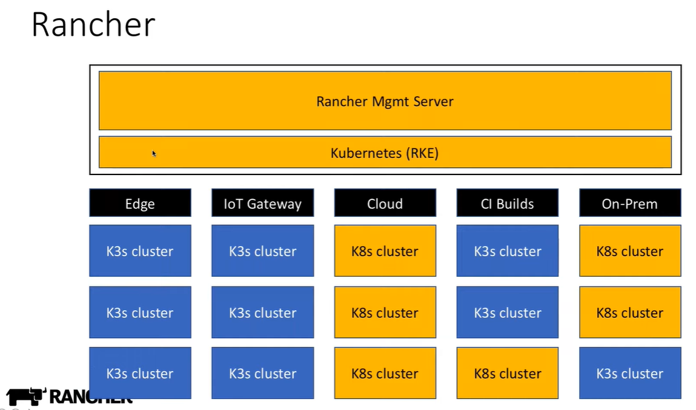

# SUSE Rancher

1. [Rancher: Enterprise management for Kubernetes](#rancher-enterprise-management-for-kubernetes)
2. [Rancher and Terraform](#rancher-and-terraform)
3. [Rancher Desktop](#rancher-desktop)
4. [Rancher Academy (online training)](#rancher-academy-online-training)
5. [Rancher 2](#rancher-2)
    1. [Rancher Networking and CNI Providers](#rancher-networking-and-cni-providers)
    2. [Rancher 2 RKE](#rancher-2-rke)
6. [K3S](#k3s)
    1. [K3s Tools](#k3s-tools)
    2. [K3S Use Cases](#k3s-use-cases)
    3. [K3S in Public Clouds](#k3s-in-public-clouds)
    4. [K3D](#k3d)
    5. [K3OS](#k3os)
7. [K3C](#k3c)
8. [Hosted Rancher](#hosted-rancher)
9. [Rancher on Microsoft Azure](#rancher-on-microsoft-azure)
10. [Rancher RKE on vSphere](#rancher-rke-on-vsphere)
11. [Rancher Kubernetes on Oracle Cloud](#rancher-kubernetes-on-oracle-cloud)
12. [Rancher Software Defined Storage with Longhorn](#rancher-software-defined-storage-with-longhorn)
13. [Rancher Fleet to manage multiple kubernetes clusters](#rancher-fleet-to-manage-multiple-kubernetes-clusters)
14. [Kubernautic](#kubernautic)
15. [Harvester Hyperconverged Infrastructure Software](#harvester-hyperconverged-infrastructure-software)

## Rancher: Enterprise management for Kubernetes

- [rancher.com](https://rancher.com/) Rancher is enterprise management for Kubernetes, an amazing GUI for managing and installing Kubernetes clusters. They have released a number of pieces of software that are part of this ecosystem, for example [Longhorn](https://github.com/longhorn/longhorn) which is a lightweight and reliable distributed block storage system for Kubernetes.
- [rancher.com: Custom alerts using Prometheus queries](https://rancher.com/blog/2020/custom-monitoring)
- [zdnet.com: Rancher Labs closes $40M funding round to "run Kubernetes everywhere"](https://www.zdnet.com/article/rancher-labs-closes-40m-funding-round-to-run-kubernetes-everywhere/) The six year-old startup is going after new markets that want to run Kubernetes clusters at the edge.
- [medium: Quick Fix: Mounting a ConfigMap to an Existing Volume in Kubernetes Using Rancher](https://medium.com/swlh/quick-fix-mounting-a-configmap-to-an-existing-volume-in-kubernetes-using-rancher-d01c472a10ad)
- [Faster Kubernetes Development with Rancher, DevSpace and Loft](https://rancher.com/blog/2020/faster-kubernetes-development-rancher-devspace-loft)
- [Multi-Cluster Vulnerability Scanning with Alcide and Rancher](https://rancher.com/blog/2020/multi-cluster-vulnerability-scanning-alcide-rancher)
- [Monitor Etcd with Prometheus and Grafana using Rancher](https://rancher.com/blog/2020/monitor-etcd-prometheus-grafana-rancher)
- [rancher.com: Driving Kubernetes Adoption in Finance with Rancher](https://rancher.com/blog/2020/driving-kubernetes-adoption-finance-rancher)
- [devclass.com: Open sauce - Rancher 2.5 puts new UI forward, gets to continuously delivering](https://devclass.com/2020/10/06/rancher-2_5/)
- [rancher.com: Rancher 2.5 Delivers On "Computing Everywhere" Strategy](https://rancher.com/blog/2020/rancher-2-5-delivers-computing-everwhere-strategy)
- [vitobotta.com: Kubernetes in DigitalOcean with Rancher](https://vitobotta.com/2020/11/02/kubernetes-digitalocean-rancher/?utm_sq=gkuh2clx8u)
- [rancher: Speed Up Development with Automated Kubernetes Deployments](https://rancher.com/blog/2020/speed-development-automated-kubernetes-deployments)
- [thenewstack.io: Rancher 2.5 Sets out to Be the Stock Kubernetes Build for GitOps](https://thenewstack.io/rancher-2-5-sets-out-to-be-the-stock-kubernetes-build-for-gitops/)
- [SUSE & Rancher Community 🌟](https://community.suse.com/feed) Learn and share with other cloud native enthusiasts
- [aws-quickstart.github.io: Rancher on the AWS Cloud. Quick Start Reference Deployment 🌟](https://aws-quickstart.github.io/quickstart-eks-rancher/)
- [dzone: Getting Started With Rancher 🌟](https://dzone.com/refcardz/getting-started-with-rancher) What is Rancher? And how does it make Kubernetes crazy easy? Rancher is a complete Kubernetes stack that's easy to navigate — whether it's physical servers on-prem or in the cloud. This Refcard helps you get started with Rancher — from zero to fully production-ready.
- [devclass.com: Rancher presents first big release after SUSE acquisition, ups game on hosted cluster provisioning](https://devclass.com/2021/09/02/rancher-presents-first-big-release-after-suse-acquisition-ups-game-on-hosted-cluster-provisioning/)
- [suse.com: SUSE Rancher 2.6 delivers interoperability across multi-cloud environments with redesigned user experience, hosted cluster support, and improved security posture](https://www.suse.com/c/intro-rancher-2-6-features/)
- [zdnet.com: SUSE Harvester: Deploying virtual machines with Kubernetes](https://www.zdnet.com/article/suse-harvester-deploying-virtual-machines-with-kubernetes/) We all use Kubernetes to manage containers, but now SUSE, with Harvester and Rancher, enables you to deploy VMs with it as well.
- [==blog.kubecost.com: Rancher vs Kubernetes: It’s not either or==](https://blog.kubecost.com/blog/rancher-vs-kubernetes/) Kubernetes (K8s) and Rancher are both open source projects focused on container management with enormous communities of contributors and users.
    - Kubernetes is the leader in container orchestration. It offers teams the flexibility to efficiently run containerized workloads across multiple public cloud providers and hybrid cloud environments. Kubernetes offers advanced scheduling and scaling capabilities to ensure application performance and high availability. However, its functionality focuses on managing resources within a single cluster.
    - Rancher, on the other hand, is a platform designed to manage multiple Kubernetes clusters. It eases Kubernetes cluster management in large environments in several ways. For example, Rancher simplifies operations such as cluster provisioning, centralized security management, and monitoring workloads using popular tools such as Prometheus. Additionally, Rancher has an extensive application catalog of Helm charts for various applications such as Kubecost, Prometheus, Grafana, and MySQL.
- [suse.com: My First Impressions with SUSE Rancher Kubernetes Projects](https://www.suse.com/c/rancher_blog/my-first-impressions-with-suse-rancher-kubernetes-projects/)

 

## Rancher and Terraform

- [Deploy a Rancher Cluster with GitLab CI and Terraform](https://rancher.com/blog/2020/deploy-with-gitlab-ci)
- [==akyriako.medium.com: Provision an on-prems Kubernetes Cluster with Rancher, Terraform and Ansible==](https://akyriako.medium.com/provision-an-on-prems-kubernetes-cluster-with-rancher-terraform-and-ansible-e26e24059319) Automate the provisioning of on-premises Rancher RKE Clusters and the registration of their nodes via Terraform and Ansible

## Rancher Desktop

- [==rancherdesktop.io==](https://rancherdesktop.io) Kubernetes and container management to the desktop. Rancher Desktop is an open-source project to bring Kubernetes and container management to the desktop.
- [suse.com: Rancher Desktop 1.0.0 Has Arrived](https://www.suse.com/c/rancher_blog/rancher-desktop-1-0-0-has-arrived/)

## Rancher Academy (online training)

- [Rancher Academy 🌟](https://academy.rancher.com/) Rancher Academy is a professional, no-cost, zero obligation certification program centered on empowering commercial customers and the open source community to be successful with Kubernetes and Rancher.
- [Rancher Labs launches free training course to meet surging demand for Kubernetes skills](https://www.computing.co.uk/news/4015423/rancher-labs-launches-free-training-course-meet-surging-demand-kubernetes) Five-week course covers how to deploy Rancher and manage Kubernetes

## Rancher 2

- [**Rancher 2**](https://rancher.com/docs/rancher/v2.x/en/)

### Rancher Networking and CNI Providers

- [Rancher CNI Providers 🌟](https://rancher.com/docs/rancher/v2.x/en/faq/networking/cni-providers/)

### Rancher 2 RKE

- [**Rancher 2 RKE**](https://rancher.com/products/rke/) Rancher 2 that runs in docker containers. RKE is a CNCF-certified Kubernetes distribution that runs entirely within Docker containers. It solves the common frustration of installation complexity with Kubernetes by removing most host dependencies and presenting a stable path for deployment, upgrades, and rollbacks.
    - [Rancher.com: Setup a basic Kubernetes cluster with ease using RKE](https://rancher.com/blog/2018/2018-09-26-setup-basic-kubernetes-cluster-with-ease-using-rke/)
- [Bootstrap RKE Kubernetes Cluster in AWS Environment](https://github.com/LukeMwila/bootstrap-rke-cluster-in-aws)
- [github.com/gruberdev/local-gitops: Local Gitops 🌟](https://github.com/gruberdev/local-gitops) An automated local cluster setup w/ tls, monitoring, ingress and DNS configuration. The goal of this project is to provide a simplified approach to creating your own local cluster, as well as all the utilities you'll need to run a functional cluster using GitOps
- [github.com/rancherfederal/rke2-aws-tf](https://github.com/rancherfederal/rke2-aws-tf) This repository is intended to clearly demonstrate one method of deploying rke2 in a highly available, resilient, scalable, and simple method on AWS

## K3S

- [**k3s**](https://k3s.io/) Basic kubernetes with automated installer. Lightweight Kubernetes Distribution.
- [K8s vs k3s](https://www.civo.com/blog/k8s-vs-k3s) "K3s is designed to be a single binary of less than 40MB that completely implements the Kubernetes API. In order to achieve this, they removed a lot of extra drivers that didn't need to be part of the core and are easily replaced with add-ons. K3s is a fully CNCF (Cloud Native Computing Foundation) [certified Kubernetes](https://www.cncf.io/certification/software-conformance/) offering. This means that you can write your YAML to operate against a regular "full-fat" Kubernetes and they'll also apply against a k3s cluster. Due to its low resource requirements, it's possible to run a cluster on anything from 512MB of RAM machines upwards. This means that we can allow pods to run on the master, as well as nodes. And of course, because it's a tiny binary, it means we can install it in a fraction of the time it takes to launch a regular Kubernetes cluster! We generally achieve sub-two minutes to launch a k3s cluster with a handful of nodes, meaning you can be deploying apps to learn/test at the drop of a hat."
- [**k3sup (said 'ketchup')**](https://github.com/alexellis/k3sup) is a light-weight utility to get from zero to KUBECONFIG with k3s on any local or remote VM. All you need is ssh access and the k3sup binary to get kubectl access immediately.
- [Install Kubernetes with k3sup and k3s](https://medium.com/@alexellisuk/walk-through-install-kubernetes-to-your-raspberry-pi-in-15-minutes-84a8492dc95a)
- [k3s-gitlab](https://github.com/apk8s/k3s-gitlab) k3s + Gitlab install notes. Steps for utilizing k3s to manage a self-hosted Gitlab instance.
- [Upgrade Your K3s Clusters Smoothly in Rancher 2.4](https://rancher.com/blog/2020/upgrade-your-k3s-cluster)
- [Keptn Control Plane on k3s](https://github.com/keptn-sandbox/keptn-on-k3s) It allows you to install the Keptn control plane running on K3s within  minutes! Great way to get started using Keptn!
- [thenewstack.io: How K3s, Portworx, and Calico Can Serve as a Foundation of Cloud Native Edge Infrastructure](https://thenewstack.io/how-k3s-portworx-and-calico-can-serve-as-a-foundation-of-cloud-native-edge-infrastructure/)
- [thenewstack.io: Tutorial - Configure Cloud Native Edge Infrastructure with K3s, Calico, Portworx](https://thenewstack.io/tutorial-configure-cloud-native-edge-infrastructure-with-k3s-calico-portworx/)
- [github.com/aws-samples/cdk-k3s-cluster 🌟](https://github.com/aws-samples/aws-cdk-for-k3scluster) is a new JSII construct library for AWS CDK that deploys a scalable Kubernetes K3s cluster on Graviton2 Arm-based (mg6 by default) Spot instances with one command on AWS.
- [codeburst.io: Creating a Local Development Kubernetes Cluster with k3s and Traefik Proxy](https://codeburst.io/creating-a-local-development-kubernetes-cluster-with-k3s-and-traefik-proxy-7a5033cb1c2d)
- [sysdig.com: K3s + Sysdig: Deploying and securing your cluster… in less than 8 minutes! 🌟](https://sysdig.com/blog/k3s-sysdig-falco/)
- [rancher.com: Set up Your K3s Cluster for High Availability](https://rancher.com/blog/2020/k3s-high-availability)
- [blog.alexellis.io: Bare-metal Kubernetes with K3s](https://blog.alexellis.io/bare-metal-kubernetes-with-k3s/)
- [rancher.com: Set up K3s in High Availability using k3d](https://rancher.com/blog/2020/set-up-k3s-high-availability-using-k3d)
- [rancher.com: Set up Your K3s Cluster for High Availability on DigitalOcean](https://rancher.com/blog/2020/k3s-high-availability)
- [community.suse.com: Introduction to K3s 🌟](https://community.suse.com/posts/13903989)
- [k3s_hetzner](https://gitlab.com/k3s_hetzner/k3s_hetzner) How to build a kubernetes cluster in [Hetzner Cloud](https://www.hetzner.com/cloud)
- [en.sokube.ch: K3S + K3D = K8S : a new perfect match for dev and test](https://en.sokube.ch/post/k3s-k3d-k8s-a-new-perfect-match-for-dev-and-test-1) In this article you'll learn:
    - What's new with k3d v3
    - Create a multi-server and multi-agent with k3s
    - How to replace the default CNI plugin of k3s
- [edgelab 🌟 (with k3s)](https://github.com/digitalrebar/edgelab) Materials to build and deploy a simple Edge Lab for demonstration, training and development
- [github.com/erebe/personal-server: Personal server configuration with k3s 🌟](https://github.com/erebe/personal-server) This document is going to describe how I manage my personal server in 2020.
- [dev.to: All about k3s - Lightweight Kubernetes 🌟](https://dev.to/abhinavd26/all-about-k3s-lightweight-kubernetes-3ell)
- [gabrieltanner.org: Setting up a HA Kubernetes cluster using K3S](https://gabrieltanner.org/blog/ha-kubernetes-cluster-using-k3s) In this article, you will set up your own high availability K3S cluster and create a basic Kubernetes deployment. The tutorial will show how to set up all the resources manually and you will learn how to automate it with the official Ansible script.
- [nativecloud.dev: Scale out your Raspberry-Pi Kubernetes cluster to the cloud](https://nativecloud.dev/scale-out-your-raspberry-pi-k3s-cluster-to-the-cloud/) Using Gardener Machine-Controller-Manager and Tailscale to extend a local Raspberry-Pi K3s cluster with cloud instances.
- [blog.nootch.net: Kubernetes at Home With K3s](https://blog.nootch.net/post/kubernetes-at-home-with-k3s/)
- Try out the  Kubernetes 1.23 with K3s distro: `curl -sfL https://get.k3s.io |INSTALL_K3S_VERSION="v1.23.1-rc1+k3s1" sh -` You can try on ubuntu katakoda playground in your browser :)
- [==medium.com/@ostridelabs: k8s vs k3s: The Comprehensive Difference==](https://medium.com/@ostridelabs/k8s-vs-k3s-the-comprehensive-difference-f7667d141c0)
- [justinpolidori.it: LDAP authentication with Dex on Kubernetes with Vcluster (K3S)](https://www.justinpolidori.it/posts/20220611_vcluster_auth/) In this article, you'll learn how to grant access to users of a vcluster using DEX as a federated OpenID provider and kubelogin as a plugin for OIDC integration
- [itnext.io: Running K3S workload in a restricted environment](https://itnext.io/running-k3s-workload-in-a-restricted-environment-c2f593d19005)
- [dev.to/dashaun: K3s on Raspberry Pi and ClusterHat](https://dev.to/dashaun/k3s-on-raspberry-pi-and-clusterhat-m6k)
- [blog.getambassador.io: Best Tools for Kubernetes Local Development: A Comprehensive Guide](https://blog.getambassador.io/best-tools-for-kubernetes-local-development-a-comprehensive-guide-3577d351d31e)

### K3s Tools

- [tinyzimmer/k3p](https://github.com/tinyzimmer/k3p) A k3s packager and installer, primarily intended for airgapped deployments
- [alexellis/k3sup](https://github.com/alexellis/k3sup) bootstrap Kubernetes with k3s over SSH < 1 min 🚀. k3sup is a light-weight utility to get from zero to KUBECONFIG with k3s on any local or remote VM. All you need is ssh access and the k3sup binary to get kubectl access immediately.
- [clanktron/k3s-ansible](https://github.com/clanktron/k3s-ansible) Automated build of HA k3s Cluster with kube-vip, Cilium, and MetalLB
- [techno-tim/k3s-ansible](https://github.com/techno-tim/k3s-ansible) Automated build of HA k3s Cluster with kube-vip and MetalLB. The easiest way to bootstrap a self-hosted High Availability Kubernetes cluster. A fully automated HA k3s etcd install with kube-vip, MetalLB, and more
- [cnrancher/autok3s](https://github.com/cnrancher/autok3s) Run K3s Everywhere. AutoK3s is a lightweight tool for simplifying the cluster management of K3s. Key features:
    - Shorter provisioning time
    - Cloud provider integration
    - Flexible installation options
    - Low cost
    - Airgap K3s package management and installation

### K3S Use Cases

- [K3S Use Cases](https://www.youtube.com/watch?v=2LNxGVS81mE):
    1. Edge computing and Embedded Systems
    2. IOT Gateway
    3. **CI environments** (i.e. Jenkins with Configuration as Code)
    4. Single-App Clusters

### K3S in Public Clouds

- [Run Rancher 2.4 in Azure with K3s and MySQL](https://rancher.com/blog/2020/run-rancher-k3s-mysql)

### K3D

- [**k3d**](https://github.com/rancher/k3d) k3s that runs in docker containers.
- [cncf.io: Introduction to k3d: Run K3s in Docker](https://www.cncf.io/blog/2021/03/16/introduction-to-k3d-run-k3s-in-docker/)
- [itnext.io: Kubernetes + Rancher Cluster Manager 2.6 on your macOS laptop with k3d/k3s in 5 min](https://itnext.io/kubernetes-rancher-cluster-manager-2-6-on-your-macos-laptop-with-k3d-k3s-in-5-min-8acdb94f3376)
- [dev.to/iamunnip: Building a local Kubernetes cluster using k3d](https://dev.to/iamunnip/building-a-local-kubernetes-cluster-using-k3d-2p3d)
- [akyriako.medium.com: Provision a Highly Available K3S Cluster with K3D](https://akyriako.medium.com/provision-a-high-availability-k3s-cluster-with-k3d-a7519f476c9c)

### K3OS

- [**k3OS**](https://github.com/rancher/k3os) k3OS is a Linux distribution designed to remove as much OS maintenance as possible in a Kubernetes cluster. It is specifically designed to only have what is needed to run k3s. Additionally the OS is designed to be managed by kubectl once a cluster is bootstrapped. Nodes only need to join a cluster and then all aspects of the OS can be managed from Kubernetes. Both k3OS and k3s upgrades are handled by the k3OS operator.
- [**K3OS Value Add**](https://www.youtube.com/watch?v=2LNxGVS81mE):
    - **Supports multiple architectures**
        - K3OS runs on x86 and ARM processors to give you maximum flexibility.
    - **Runs only the minimum required services**
        - Fewer services means a tiny attack surface, for greater security.
    - **Doesn't require a package manager**
        - The required services are built into the distribution image.
    - **Models infrastructure as code**
        - Manage system configuration with version control systems.

## K3C

- [K3C](https://github.com/rancher/k3c) Lightweight local container engine for container development. K3C is a local container engine designed to fill the same gap Docker does in the Kubernetes ecosystem. Specifically k3c focuses on developing and running local containers, basically docker run/build. Currently k3s, the [lightweight Kubernetes distribution](https://github.com/rancher/k3s), provides a great solution for Kubernetes from dev to production. While k3s satisifies the Kubernetes runtime needs, one still needs to run docker (or a docker-like tool) to actually develop and build the container images. k3c is intended to replace docker for just the functionality needed for the Kubernetes ecosystem.

## Hosted Rancher

- [Announcing **Hosted Rancher** with Rancher 2.4 🌟](https://rancher.com/blog/2020/announcing-hosted-rancher)

## Rancher on Microsoft Azure

- [rancher.com/blog: Deploy Kubernetes Clusters on Microsoft Azure with Rancher](https://rancher.com/blog/2020/build-kubernetes-clusters-on-azure)

## Rancher RKE on vSphere

- [rancher.com/blog: Stateful Kubernetes Workloads on vSphere with RKE](https://rancher.com/blog/2020/stateful-kubernetes-workloads)

## Rancher Kubernetes on Oracle Cloud

- [medium.com: OKE Clusters from Rancher 2.0](https://medium.com/swlh/oke-clusters-from-rancher-2-0-409131ad1293) Part one of a series of articles on creating, monitoring, and managing Kubernetes clusters on OCI using Rancher.
- [medium.com: Rancher deployed Kubernetes on Oracle Cloud Infrastructure](https://medium.com/@jlamillan/rancher-deployed-kubernetes-on-oracle-cloud-infrastructure-6b0656cdaec0) Part two of a multi-part series on creating, monitoring, and managing Kubernetes clusters (hosted and non-hosted) on OCI.

## Rancher Software Defined Storage with Longhorn

- [rancher.com/blog: Getting Started with Longhorn Distributed Block Storage and Cloud-Native Distributed SQL](https://rancher.com/blog/2020/yugabyte?utm_content=126950057)

## Rancher Fleet to manage multiple kubernetes clusters

- [github.com/rancher/fleet](https://github.com/rancher/fleet) Fleet is GitOps at scale. Fleet can manage deployments from git of raw Kubernetes YAML, Helm charts, or Kustomize or any combination of the three.
- [**Fleet** Management for kubernetes](https://rancher.com/blog/2020/fleet-management-kubernetes/) a new open source project from the team at Rancher focused on managing fleets of Kubernetes clusters.
- [itnext.io: Fleet Management of Kubernetes Clusters at Scale — Rancher’s Fleet](https://itnext.io/fleet-management-of-kubernetes-clusters-at-scale-ranchers-fleet-de161cc52325)
- [digitalis.io: Kubernetes GitOps Continuous Integration and Delivery with Fleet and Rancher](https://digitalis.io/blog/kubernetes/kubernetes-gitops-continuous-integration-and-delivery-with-fleet-and-rancher/)

## Kubernautic

- [Kubernautic](https://kubernauts.sh/) Kubernetes For Everyone, Free Forever! Start your CloudLess Journey and get free access to Rancher Shared as a Service (RSaaS) or apply to get access to your own Dedicated Rancher Dashboard (RDaaS) and save up-to 90% of your cloud costs with Auto Scaling of Spot Instances and Kubernauts Kubernetes Services KKS!

## Harvester Hyperconverged Infrastructure Software

- [Harvester](https://github.com/rancher/harvester) Rancher Harvester is an open source hyper-converged infrastructure (HCI) software built on Kubernetes. It is an open source alternative to vSphere and Nutanix.
- [rancher.com: Announcing Harvester: Open Source Hyperconverged Infrastructure (HCI) Software](https://rancher.com/blog/2020/announcing-harvester-open-source-hyperconverged-infrastructure-software)