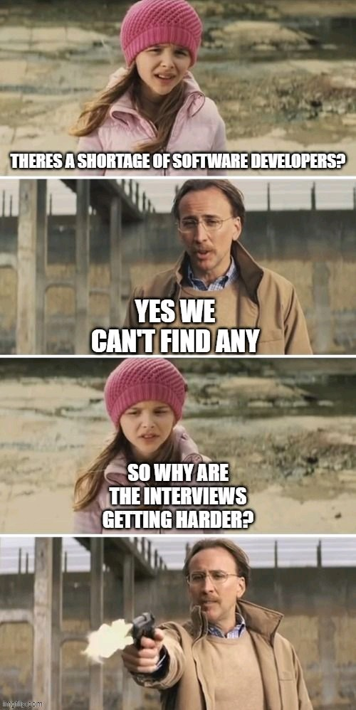

# Recruitment. Hiring and Freelancing

1. [Introduction](#introduction)
2. [Articles in Spanish](#articles-in-spanish)
3. [Recruitment Portals](#recruitment-portals)
4. [Recruitment Portals in Spain](#recruitment-portals-in-spain)
5. [Recruitment Software](#recruitment-software)
6. [Soft Skills](#soft-skills)
7. [Fair Job Offer](#fair-job-offer)
8. [Writing a CV](#writing-a-cv)
9. [Fake it til you make it](#fake-it-til-you-make-it)
10. [Tweets](#tweets)
11. [Tweets 2](#tweets-2)
12. [Tweets 3. Cultures](#tweets-3-cultures)
13. [Images](#images)
14. [Videos](#videos)

<iframe width="100%" height="166" scrolling="no" frameborder="no" allow="autoplay" src="https://w.soundcloud.com/player/?url=https%3A//api.soundcloud.com/tracks/162899288&color=%23ff5500&auto_play=true&hide_related=false&show_comments=true&show_user=true&show_reposts=false&show_teaser=true"></iframe>
<a href="https://soundcloud.com/arielmezzapesa-1" title="Ariel Mezzapesa" target="_blank" style="color: #cccccc; text-decoration: none;">Ariel Mezzapesa</a> · <a href="https://soundcloud.com/arielmezzapesa-1/lily-was-here-candy-dulfer" title="Lily Was Here (Candy Dulfer)" target="_blank" style="color: #cccccc; text-decoration: none;">Lily Was Here (Candy Dulfer)</a>

## Introduction

- [protocol.com: Developer experience is the next major competitive front in enterprise tech](https://www.protocol.com/caavo-remote-senior-living-facilities) Now that cloud is old news and APIs launch major businesses, the most successful companies over the next decade of enterprise tech will delight their customers.
- [tigerabrodi.hashnode.dev: Interviewing software developers](https://tigerabrodi.hashnode.dev/interviewing-software-developers) Tips when interviewing software developers, find the right candidate
- [thenewstack.io: Challenging the Myth That Programming Careers End at 40](https://thenewstack.io/challenging-the-myth-that-programming-careers-end-at-40/)
- [thenewstack.io: This Week in Programming: Can You Feel the Burn?](https://thenewstack.io/this-week-in-programming-can-you-feel-the-burn/) One of the big headlines this week in the world of programming comes in the form of a single statistic: 83% of developers suffer from burnout, according to a study by Haystack Analytics.
- [hbr.org: Optimists Are Better at Finding New Jobs](https://hbr.org/2016/04/optimists-are-better-at-finding-new-jobs)
- [about.gitlab.com: The Remote Work Report 2021](https://about.gitlab.com/remote-work-report/) 3,900 global remote workers share the good, bad, and unexpected of the new status quo
- [liquidat.wordpress.com: Good bye Red Hat](https://liquidat.wordpress.com/2021/08/15/good-bye-red-hat/)
- [devopsonline.co.uk: Robotics and automation to cause anxiety for workers](https://www.devopsonline.co.uk/robotics-and-automation-to-cause-anxiety-for-workers/)
- [wired.co.uk: The Great Resignation is here and no one is prepared](https://www.wired.co.uk/article/great-resignation-quit-job) Around the world, workers are quitting their jobs in record numbers – and bosses are still scrambling to figure out how to keep them
- [linkedin.com: Look Before You Leap!](https://www.linkedin.com/pulse/look-before-you-leap-sarah-robb-o-hagan) Employees are leaving their workplaces in record numbers in a wave named "#TheGreatResignation.”
- [forbes.com: ‘The Great Resignation’: Why Gen Z Is Leaving The Workforce In Droves…And What To Do About It](https://www.forbes.com/sites/jasonwingard/2021/09/02/the-great-resignation-why-gen-z-is-leaving-the-workforce-in-drovesand-what-to-do-about-it)
- [news.slashdot.org: A Record Number of Workers Are Quitting Their Jobs, Empowered by New Leverage](https://news.slashdot.org/story/21/10/12/1818252/a-record-number-of-workers-are-quitting-their-jobs-empowered-by-new-leverage)
- [news.ncsu.edu: Tech Sector Job Interviews Assess Anxiety, Not Software Skills](https://news.ncsu.edu/2020/07/tech-job-interviews-anxiety/)
- [lynnlangit.medium.com: Tech Anti-Interviewing](https://lynnlangit.medium.com/tech-anti-interviewing-106674655ea0) How to avoid tech interviews as we know them
- [blog.pragmaticengineer.com: The Most Heated Tech Job Market in History: Advice for Software Engineers](https://blog.pragmaticengineer.com/advice-for-tech-workers-to-navigate-a-heated-job-market/)
- [hbr.org: Change Your Career Without Having to Start All Over Again](https://hbr.org/2016/05/change-your-career-without-having-to-start-all-over-again)
- [hbr.org: Forget Flexibility. Your Employees Want Autonomy](https://hbr.org/2021/10/forget-flexibility-your-employees-want-autonomy)
- [bbc.com: Is HR ever really your friend?](https://www.bbc.com/worklife/article/20211022-is-hr-ever-really-your-friend) Employees often assume human resources is there to help. But given HR really works for the company, is it ever really on our side?
- [joshbersin.com: From The Great Resignation To The Great Migration](https://joshbersin.com/2021/12/from-the-great-resignation-to-the-great-migration/)
- https://en.wikipedia.org/wiki/Great_Resignation
- [about.gitlab.com: How to navigate The Great Resignation](https://about.gitlab.com/blog/2021/12/16/how-to-navigate-the-great-resignation)
- [hbr.org: Stop Hiring for Culture Fit](https://hbr.org/2018/01/how-to-hire)
- [medium.com/hackernoon: How to hire a DevOps Engineer](https://medium.com/hackernoon/how-to-hire-a-devops-engineer-4e59e7847e9b)
- [forbes.com: As Leaders: What Can We Learn From The Great Resignation?](https://www.forbes.com/sites/dedehenley/2022/01/30/as-leaders-what-can-we-learn-from-the-great-resignation/)
- [stackoverflow.blog: The Great Resignation is here. What does that mean for developers? 🌟](https://stackoverflow.blog/2022/01/10/the-great-resignation-is-here-what-does-that-mean-for-developers/) Nearly two years into the pandemic, many Americans are reevaluating their relationship with work.
- [bbc.com: Is finding a 'new normal' in the workplace impossible?](https://www.bbc.com/worklife/article/20220104-future-of-work-2022)
- [askamanager.org: the new hire who showed up is not the same person we interviewed](https://www.askamanager.org/2022/01/the-new-hire-who-showed-up-is-not-the-same-person-we-interviewed.html)
- [findmyprofession.com: 100+ Questions to Ask in an Interview 🌟](https://www.findmyprofession.com/career-advice/questions-to-ask/)
- [blog.trello.com: Experiencing Job Dissatisfaction: How To Decide If It's Time To Quit](https://blog.trello.com/is-it-time-to-leave)
- [devops.com: Great Resignation Spurs Interest in Tech Certifications](https://devops.com/great-resignation-spurs-interest-in-tech-certifications/)
- [thewokesalaryman.com: Why people leave even the most high paying jobs 🌟](https://thewokesalaryman.com/2022/02/11/why-people-leave-even-the-most-high-paying-jobs/)
- [sloanreview.mit.edu: Creating Good Jobs](https://sloanreview.mit.edu/article/creating-good-jobs/) Amid a wave of resignations across industries, organizational leaders must identify ways to create better, more desirable jobs that will help them hang on to employees.
- [forbes.com: To Avoid Regretting A New Job, Ask These Two Questions During The Interview](https://www.forbes.com/sites/markmurphy/2022/03/18/to-avoid-regretting-a-new-job-ask-these-two-questions-during-the-interview)
- [ideas.ted.com: How to find your sense of purpose at work](https://ideas.ted.com/want-to-discover-or-re-discover-your-sense-of-purpose-at-work-heres-how/)
- [4dayweek.medium.com: What does the work-life balance of a Software Engineer look like?](https://4dayweek.medium.com/what-does-the-work-life-balance-of-a-software-engineer-look-like-fe16cc46bb0) We compare the work-life balance of FAANG employees at Amazon, Google, Apple, Facebook and Microsoft comparing their vacation, remote work policy as well as openness to side projects.
- [medium.com/walmartglobaltech: How Do You Decide Whether an Individual Contributor (IC) or Engineering Manager Role is Right for You?](https://medium.com/walmartglobaltech/how-do-you-decide-whether-an-individual-contributor-ic-or-engineering-manager-role-is-right-for-f46251f1a4cd)
- [freecodecamp.org: How to Get Ready for a Job in Tech – Tips for Beginners](https://www.freecodecamp.org/news/how-to-get-ready-for-a-job-in-tech/)
- [computerworld.com: How to get a job in healthcare IT](https://www.computerworld.com/article/3663674/how-to-get-a-job-in-healthcare-it.html) Sky-high demand for tech workers means more open doors for IT pros who don’t have prior experience in the healthcare industry.
- [theengineeringmanager.substack.com: How do I progress to the next level in my career?](https://theengineeringmanager.substack.com/p/how-do-i-progress-to-the-next-level) Let's look at motivation, craft, opportunity and taking ownership.
- [blogs.elconfidencial.com: Luca de Meo y Lawrence Stroll: por qué el ego es el peor enemigo del gestor en la Fórmula 1](https://blogs.elconfidencial.com/deportes/tribuna/2022-08-03/alpine-aston-martin-lawrence-stroll-luca-de-meo_3470693/)
- [blog.robertsimoes.org: Four Wings of a Software Engineer](https://blog.robertsimoes.org/posts/four-wings-of-software-engineers/) Career paths for software engineers
- [forbes.com: Hiring Managers Often Lie To Candidates, Here’s How To Spot When They Do](https://www.forbes.com/sites/markmurphy/2023/08/24/hiring-managers-often-lie-to-candidates-heres-how-to-spot-when-they-do/)
- [vice.com: Thousands of Software Engineers Say the Job Market Is Getting Much Worse](https://www.vice.com/en/article/g5y37j/thousands-of-software-engineers-say-the-job-market-is-getting-much-worse)
- [madokai.medium.com: Why I Don’t Consider Your Certifications During An Interview](https://madokai.medium.com/why-i-dont-consider-your-certifications-during-an-interview-fe4b62cf6f8c)

## Articles in Spanish

- [blogs.elconfidencial.com: El talento atrofiado: por qué en España escasean los profesionales de alto nivel](https://blogs.elconfidencial.com/tecnologia/tribuna/2021-06-02/talento-informatica-startups-silicon-valley-google_3112087/)
- [meet-in.es: «Para liderar a largo plazo hay que ser buena persona»](https://www.meet-in.es/para-liderar-a-largo-plazo-hay-que-ser-buena-persona/)
- [entrepreneur.com: Las 10 preguntas que debes hacerte para saber si eres un buen líder](https://www.entrepreneur.com/article/267642) Descubre si la gente que trabaja contigo te tiene confianza o si debes cambiar ciertas actitudes para obtener mejores resultados.
- [hays.es: ‘La Gran Renuncia’: ¿por qué tantos profesionales se están planteando dejar su trabajo?](https://www.hays.es/blog/insights/la-gran-renuncia)
- [computing.es: Retos del outsourcing de servicios IT en España](https://www.computing.es/mundo-digital/opinion/1129764046601/retos-del-outsourcing-de-servicios-it-espana.1.html)
- [magnet.xataka.com: La "gran renuncia" americana, o cómo los trabajadores se han hartado del sistema y están dejando sus empleos](https://magnet.xataka.com/en-diez-minutos/gran-renuncia-americana-como-trabajadores-se-han-hartado-sistema-estan-dejando-sus-empleos)
- [xataka.com: La Gran Renuncia: en EEUU los empleados están dejando en masa sus trabajos, la gran pregunta es si veremos esto (y cuándo) en España](https://www.xataka.com/pro/gran-renuncia-eeuu-empleados-estan-dejando-masa-sus-trabajos-gran-pregunta-veremos-esto-cuando-espana)
- [es.euronews.com: La Gran Renuncia: ¿puede llegar la revolución laboral de EE. UU. a Europa?](https://es.euronews.com/next/2021/11/25/la-gran-renuncia-puede-llegar-la-revolucion-laboral-de-ee-uu-a-europa)
- [lainformacion.com: Podcast | La Gran Dimisión da alas a la revolución laboral de los '40 y tantos'](https://www.lainformacion.com/economia-negocios-y-finanzas/podcast-la-gran-dimision-da-alas-a-la-revolucion-laboral-de-los-40-y-tantos/2855480/) En EEUU 4,2 millones de personas han dejado su puesto de trabajo en octubre y se suman a los 4,4 millones que ya lo hicieron en septiembre y a los 4,3 millones de agosto, según el Departamento de Trabajo
- [elespanol.com: Qué tipos de jefes hay y cómo trabajar con ellos sin desfallecer: los consejos de Maribel Garben](https://www.elespanol.com/reportajes/20211211/tipos-trabajar-sin-desfallecer-consejos-maribel-garben/633687616_0.html) Los hay autoritarios, carismáticos, inseguros... EL ESPAÑOL analiza todos estos perfiles con la experta de 'employer branding'.
- [codingpotions.com: ¿Cuánto cobra un programador en España en 2021?](https://codingpotions.com/salarios-programadores-2021)
- [xataka.com: La guerra de talento en el sector tecnológico amenaza la viabilidad de muchas pymes españolas: cada vez les resulta más difícil retener a los seniors](https://www.xataka.com/empresas-y-economia/guerra-talento-sector-tecnologico-amenaza-viabilidad-muchas-pymes-espanolas-cada-vez-les-resulta-dificil-retener-a-seniors)
- [expansion.com: El 'amiguismo' en las relaciones de trabajo](https://www.expansion.com/expansion-empleo/desarrollo-de-carrera/2022/01/28/61f40e29e5fdea61738b45aa.html) Si nuestra 'tribu' se encuentra bajo amenaza, el instinto nos llama a cerrar filas en lugar de buscar lo que es mejor para toda la organización.
- [xataka.com: La Gran Renuncia está ganando terreno en España, pero hay dos barreras: salarios bajos e indemnizaciones](https://www.xataka.com/empresas-y-economia/gran-renuncia-esta-ganando-terreno-espana-hay-dos-barreras-salarios-bajos-ley-laboral)
- [codigonuevo.com: ¿Debería adaptarse el sueldo del teletrabajo al lugar en el que vivas?](https://www.codigonuevo.com/sociedad/deberia-adaptarse-sueldo-teletrabajo-lugar-vivas) Los salarios del teletrabajo podrían disminuir hasta un 15% en función de la ciudad en la que vives.
- [lavanguardia.com: Cómo saber si tu jefe es un "ahuyenta talentos" que puede frustrar tu carrera](https://www.lavanguardia.com/vivo/psicologia/20220225/8079133/trabajo-laboral-jefe-talento-trabajadores-nbs.html) Muchos profesionales están comenzando a reflexionar sobre lo que realmente les satisface del trabajo y a qué tipo de líderes están dispuestos a seguir, porque algunos jefes no saben valorar el talento de sus empleados.
- [xataka.com: Me hice funcionario siendo ingeniero: qué me da la administración pública que no consigue la empresa privada](https://www.xataka.com/especiales/me-hice-funcionario-siendo-ingeniero-que-me-da-administracion-publica-que-no-consigue-empresa-privada)
- [genbeta.com: Menos de la mitad de los programadores tienen títulos universitarios. Cada vez más desarrolladores aprenden por su cuenta](https://www.genbeta.com/desarrollo/mitad-programadores-tienen-titulos-universitarios-cada-vez-desarrolladores-aprenden-su-cuenta)
- [genbeta.com: Ciberseguridad en llamas: la presión actual es tan grande que la mitad de los expertos sufren ansiedad y quieren dimitir](https://www.genbeta.com/desarrollo/ciberseguridad-llamas-presion-actual-grande-que-mitad-expertos-sufren-ansiedad-quieren-renunciar)
- [xataka.com: Si no asciendo ni aprendo, me largo de la empresa: el crecimiento profesional como estrategia para retener talento](https://www.xataka.com/empresas-y-economia/no-asciendo-aprendo-me-largo-empresa-crecimiento-profesional-como-estrategia-para-retener-talento)
- [businessinsider.es: Los 9 factores que más repercuten en la felicidad en el trabajo, según los trabajadores](https://www.businessinsider.es/9-factores-repercuten-felicidad-trabajador-352445)
- [bbc.com: Qué son las "habilidades blandas" y por qué cada vez más compañías se fijan en ellas al contratar](https://www.bbc.com/mundo/vert-cap-62340757)
- [genbeta.com: Twitter quiere contratar a ingenieros de Microsoft: así es la prueba que les hacen pasar antes de nada, incluso a los senior](https://www.genbeta.com/actualidad/twitter-quiere-contratar-a-ingenieros-microsoft-asi-prueba-que-les-hacen-pasar-antes-nada-incluso-a-senior)
- [businessinsider.es: Mentí en mi currículum para conseguir un trabajo mejor pagado y creo que otros deberían hacer lo mismo](https://www.businessinsider.es/menti-mi-cv-conseguir-mejor-trabajo-recomiendo-otros-1226162)
- [lavanguardia.com: Ingeniero de ‘machine learning’ e ingeniero de datos, las profesiones emergentes más demandadas en España](https://www.lavanguardia.com/economia/20230414/8895371/ingeniero-machine-learning-e-ingeniero-datos-profesiones-emergentes-mas-demandadas-espana.html)
- [businessinsider.es: El fin de la lealtad laboral](https://www.businessinsider.es/empleados-ya-no-sienten-lealtad-jefes-empleadores-1358974)

## Recruitment Portals

- [relocate.me](https://relocate.me/) Job relocation made easy. Find tech jobs w/ relocation packages
    - [International Tech Job Search Handbook](https://github.com/andrewstetsenko/tech-jobs-with-relocation) All-in-one guide to getting a tech job abroad 🌎
- [jobs.rekruuto.com: Rekruuto DevOps and SRE Job Opportunities](https://jobs.rekruuto.com/)

## Recruitment Portals in Spain

- [trycircular.com (Spain)](https://trycircular.com) The hiring community for tech recruiters and developers with good Candidate Experience guaranteed.

## Recruitment Software

- [recruit crm](https://recruitcrm.io)

## Soft Skills

- [skamille.medium.com: An incomplete list of skills senior engineers need, beyond coding](https://skamille.medium.com/an-incomplete-list-of-skills-senior-engineers-need-beyond-coding-8ed4a521b29f) For varying levels of seniority, from senior, to staff, and beyond.

## Fair Job Offer

- [mikzuit/fair-job-offer](https://github.com/mikzuit/fair-job-offer) Looking for a job? this is what you should know first. This is a MUST read project when looking for a job and expand this properly to any country, turn yourself into an expert to easily & securely find a job globally, Understand your rights in a market populated by AI, Data Lakes. Use templates legally approved to handle your data less possible.

## Writing a CV

- [forbes.com: What Do Employers Want To See In Your CV?](https://www.forbes.com/sites/andrewfennell/2021/09/08/what-do-employers-want-to-see-in-your-cv/)

## Fake it til you make it

- [github.com/rakyll/fake-it-til-you-make-it](https://github.com/rakyll/fake-it-til-you-make-it) Have you come across to someone that thinks you don't deserve a job because you don't have GitHub contributions? Never worked for a company who hired based on GitHub contributions alone. If anyone is bugging you because you are not an open source developer or your company doesn't use GitHub, use fake-it-til-you-make-it to generate two years of contributions.

## Tweets

  
Click to expand!

<blockquote class="twitter-tweet">
Question for software engineers: Would you leave your job because you didn&#39;t like the tech stack?
&mdash; David Fowler 🇧🇧 (@davidfowl) <a href="https://twitter.com/davidfowl/status/1384955137588875265?ref_src=twsrc%5Etfw">April 21, 2021</a></blockquote> 

<blockquote class="twitter-tweet">
Interviewing is career speed dating
&mdash; R &#39;Nearest&#39; Nabors 💙 (@rachelnabors) <a href="https://twitter.com/rachelnabors/status/1408932321286397955?ref_src=twsrc%5Etfw">June 26, 2021</a></blockquote> 

<blockquote class="twitter-tweet">
Job interviews should be conversations, not interrogations.
&mdash; Adam Karpiak (@Adam_Karpiak) <a href="https://twitter.com/Adam_Karpiak/status/1412783523887452160?ref_src=twsrc%5Etfw">July 7, 2021</a></blockquote> 

<blockquote class="twitter-tweet">
&quot;Where do you see yourself in five years?&quot;  This is still a common job interview question.  But do you hate it as much as I do and would love to stand up and simply leave immediately?  Don&#39;t.  Here is how you can turn this question into a huge win.  A thread. ↓
&mdash; Oliver Jumpertz (@oliverjumpertz) <a href="https://twitter.com/oliverjumpertz/status/1416351654362898436?ref_src=twsrc%5Etfw">July 17, 2021</a></blockquote> 

<blockquote class="twitter-tweet">
Did you know that calling yourself something like &quot;Junior JavaScript Developer&quot; on your CV and socials is one of the worst things you can do for your career?  It immediately strips away a lot of your credibility and can often even close some doors.  A thread.
&mdash; Oliver Jumpertz (@oliverjumpertz) <a href="https://twitter.com/oliverjumpertz/status/1416732385203429380?ref_src=twsrc%5Etfw">July 18, 2021</a></blockquote> 

<blockquote class="twitter-tweet">
&quot;Why should we hire you?&quot;  This is another of those questions everyone interviewing hates.  It spread from traditional jobs into the tech world, and even software developers have to deal with it.  But you can turn this into a huge win. Let&#39;s see how.  A thread. ↓
&mdash; Oliver Jumpertz (@oliverjumpertz) <a href="https://twitter.com/oliverjumpertz/status/1417110380497805314?ref_src=twsrc%5Etfw">July 19, 2021</a></blockquote> 

<blockquote class="twitter-tweet">
&quot;Why do you want to work here?&quot;  &quot;Well, I am a web developer, and you are looking for one. Additionally, I need the money.&quot;  Some interview questions are stupid. But giving answers like the one above doesn&#39;t help.  Let&#39;s see how to tackle this one effectively.  A thread. ↓
&mdash; Oliver Jumpertz (@oliverjumpertz) <a href="https://twitter.com/oliverjumpertz/status/1417771984822362117?ref_src=twsrc%5Etfw">July 21, 2021</a></blockquote> 

<blockquote class="twitter-tweet">
&quot;What&#39;s your greatest weakness?&quot;  Have you ever been asked this question in an interview and were like, &quot;Yea, uhm, well...I sometimes want to achieve too much?&quot;  This question is tricky, but here is how you can crush it!  A thread. ↓
&mdash; Oliver Jumpertz (@oliverjumpertz) <a href="https://twitter.com/oliverjumpertz/status/1418204856527900674?ref_src=twsrc%5Etfw">July 22, 2021</a></blockquote> 

<blockquote class="twitter-tweet">
How I learned web development:  - Tutorial - Small project  - Tutorial - Small project - Tutorial - Small project - Tutorial - Tutorial - Tutorial - Tutorial - Realizing I don&#39;t remember anything from the past 4 tutorials. - Drink until I pass out. - Tutorial - Small Project
&mdash; Jack Forge (@TheJackForge) <a href="https://twitter.com/TheJackForge/status/1418354851646345218?ref_src=twsrc%5Etfw">July 22, 2021</a></blockquote> 

<blockquote class="twitter-tweet">
I regularly get asked which language or framework someone should learn.  Here is my advice for aspiring software developers, asking themselves the same question, unsure what to learn to enter the industry, as someone who works as a tech lead in the industry.  A thread. ↓
&mdash; Oliver Jumpertz (@oliverjumpertz) <a href="https://twitter.com/oliverjumpertz/status/1423219122847031297?ref_src=twsrc%5Etfw">August 5, 2021</a></blockquote> 

<blockquote class="twitter-tweet">
The chances of any candidate matching 100% of the requirements of a job ad for a software engineer are low.  Give it a shot and apply if you tick at least 40 - 50% of the boxes.  That company might still consider you for a different role.
&mdash; Oliver Jumpertz (@oliverjumpertz) <a href="https://twitter.com/oliverjumpertz/status/1423940403582144512?ref_src=twsrc%5Etfw">August 7, 2021</a></blockquote> 

<blockquote class="twitter-tweet">
The interview process is ultra-competitive.  But with proper preparation, it is possible to stand out.  THREAD: 20 common interview questions, what they really mean, and how to nail them:
&mdash; Sahil Bloom (@SahilBloom) <a href="https://twitter.com/SahilBloom/status/1423971814443819009?ref_src=twsrc%5Etfw">August 7, 2021</a></blockquote> 

<blockquote class="twitter-tweet">
Interviewing for technical positions is a broken process.  I believe this is going to change soon.  Getting a job in the software industry we’ll look very different within the next 10 years.  Some thoughts: ↓
&mdash; Santiago (@svpino) <a href="https://twitter.com/svpino/status/1468203651759890432?ref_src=twsrc%5Etfw">December 7, 2021</a></blockquote> 

<blockquote class="twitter-tweet">
People who are fluent on more than one cloud provider - how has this skillset affected your career?   Does it mostly just expand your job opportunities (ie, you can get hired by a GCP shop or an AWS shop), or do you find yourself working with multiple clouds at your current job?
&mdash; Forrest Brazeal (@forrestbrazeal) <a href="https://twitter.com/forrestbrazeal/status/1475841432254656513?ref_src=twsrc%5Etfw">December 28, 2021</a></blockquote> 

<blockquote class="twitter-tweet">
Anxiety sucks. Live coding interviews están definitivamente en el top 5 de las peores experiencias en mi carrera. 🤦‍♂️  Aún teniendo +30 apps en portfolio (algunas famosas) he fallado miserablemente en TODAS las FAANG (Mi última entrevista fue hace 4 años) ❌ <a href="https://t.co/S49wb5B3bo">https://t.co/S49wb5B3bo</a>
&mdash; Christian Roman 👨‍💻🏝 (@devnull) <a href="https://twitter.com/devnull/status/1490814836174987277?ref_src=twsrc%5Etfw">February 7, 2022</a></blockquote> 

## Tweets 2

  
Click to expand!

<blockquote class="twitter-tweet">
Working for a bad manager can torch your professional confidence and make you feel like you&#39;re incapable of succeeding at your job.  Here&#39;s a checklist to help you tell the difference between legitimate criticism you should act upon and illegitimate criticism you should ignore.
&mdash; Phoebe the Career Coach (@betterwphoebe) <a href="https://twitter.com/betterwphoebe/status/1424757039713112068?ref_src=twsrc%5Etfw">August 9, 2021</a></blockquote> 

<blockquote class="twitter-tweet">
Companies optimize for people who can pass the coding interview instead of optimizing for people who can do the job.
&mdash; Randall Kanna (@RandallKanna) <a href="https://twitter.com/RandallKanna/status/1436836735569199106?ref_src=twsrc%5Etfw">September 11, 2021</a></blockquote> 

<blockquote class="twitter-tweet">
&quot;Wow you&#39;ve had a lot of jobs&quot;   Yes, I can get a 25% raise for jumping or stick around for the possibility of a cost of living bonus, which is usually less than 5%.
&mdash; alex dee (@aalexdee) <a href="https://twitter.com/aalexdee/status/1438592640308613121?ref_src=twsrc%5Etfw">September 16, 2021</a></blockquote> 

<blockquote class="twitter-tweet">
We need to reinvent interviewing in tech. Companies are optimizing for the people who can game the interview but not the people who are good at the job.....
&mdash; Randall Kanna (@RandallKanna) <a href="https://twitter.com/RandallKanna/status/1439650505664315394?ref_src=twsrc%5Etfw">September 19, 2021</a></blockquote> 

<blockquote class="twitter-tweet">
Hiring in tech is broken: Learnings from our Twitter Space a 🧵
&mdash; Alex Jones 🚀 (@AlexJonesax) <a href="https://twitter.com/AlexJonesax/status/1440665554436517898?ref_src=twsrc%5Etfw">September 22, 2021</a></blockquote> 

<blockquote class="twitter-tweet">
Software eng interviews today: “Invert this binary tree” (because I said so)  What software eng interviews should be:“The customer wants you to implement feature X. How would you make it work with the legacy codebase? What’s your time estimate? What security issues could arise?”
&mdash; Anna Spysz 💉💉 (@annaspies) <a href="https://twitter.com/annaspies/status/1441420614263214086?ref_src=twsrc%5Etfw">September 24, 2021</a></blockquote> 

<blockquote class="twitter-tweet">
&quot;terminated within the hour&quot; -- big companies treat employees as disposable :/ <a href="https://t.co/BAgiSBmX4c">https://t.co/BAgiSBmX4c</a>
&mdash; Liz Fong-Jones (方禮真) (@lizthegrey) <a href="https://twitter.com/lizthegrey/status/1443266495971094531?ref_src=twsrc%5Etfw">September 29, 2021</a></blockquote> 

<blockquote class="twitter-tweet">
I will never understand why tech companies optimize interviews for a college grad to do better than someone with ten years of experience.
&mdash; Randall Kanna (@RandallKanna) <a href="https://twitter.com/RandallKanna/status/1443651873412550682?ref_src=twsrc%5Etfw">September 30, 2021</a></blockquote> 

<blockquote class="twitter-tweet">
Ayer me pegué una juerga. Una de las de verdad, de decir &quot;te quiero tío&quot; a los colegas y volver a casa hecho unos zorros. Pero, como casi todo lo que comento, lo importante no es qué hice, sino por qué. Hoy: cómo ha cambiado el covid nuestra relación con el trabajo. Dentro hilo.
&mdash; Dani Sanchez-Crespo (@DaniNovarama) <a href="https://twitter.com/DaniNovarama/status/1444200847416627200?ref_src=twsrc%5Etfw">October 2, 2021</a></blockquote> 

<blockquote class="twitter-tweet">
Everyone is hiring. Everyone is understaffed. Everyone is sticking to the same ineffective and inequitable interview processes. Everyone remains understaffed.
&mdash; Tashay (@tashay_g) <a href="https://twitter.com/tashay_g/status/1444036520646778881?ref_src=twsrc%5Etfw">October 1, 2021</a></blockquote> 

<blockquote class="twitter-tweet">
9⃣cloud-related jobs you can do 🔥  Cloud Administrator Cloud (Solution) Architect Cloud Developer Cloud DevOps Engineer Cloud Data Engineer Cloud Operations Engineer Cloud Security Engineer Cloud Support Engineer Cloud AI/ML Engineer  So many opportunities in the cloud ...☁️
&mdash; Simon ☁️ (@simonholdorf) <a href="https://twitter.com/simonholdorf/status/1445019048446775300?ref_src=twsrc%5Etfw">October 4, 2021</a></blockquote> 

<blockquote class="twitter-tweet">
This is not just Nigeria, but worldwide.  If you work in IT: you’re usually seen cost center, typically in a “traditional” company.  If you work in tech, you’re typically viewed as a profit generator, and core to the company. Both autonomy, motivation and pay tend to be higher. <a href="https://t.co/z579RoAS3I">https://t.co/z579RoAS3I</a>
&mdash; Gergely Orosz (@GergelyOrosz) <a href="https://twitter.com/GergelyOrosz/status/1445641496066072582?ref_src=twsrc%5Etfw">October 6, 2021</a></blockquote> 

<blockquote class="twitter-tweet">
Unpopular opinion: I don’t think being a 10x engineer is a persona. 10xness is specific to projects and what orgs allow you to do. It’s a combination of having authority and skills to execute. It depends on the momentary situation and it’s not always repeatable. <a href="https://t.co/xSMY50OouT">https://t.co/xSMY50OouT</a>
&mdash; Jaana Dogan at KubeCon ヤナ ドガン (@rakyll) <a href="https://twitter.com/rakyll/status/1447052037246447617?ref_src=twsrc%5Etfw">October 10, 2021</a></blockquote> 

<blockquote class="twitter-tweet">
If you want to get really good job offers on LinkedIn, I suggest the following neat little hack:  Add emojis to your name.  A recruiter who doesn&#39;t even take the time to write me personally does not deserve my attention at all. <a href="https://t.co/9DpltKSqul">pic.twitter.com/9DpltKSqul</a>
&mdash; Oliver Jumpertz (@oliverjumpertz) <a href="https://twitter.com/oliverjumpertz/status/1459478049351782407?ref_src=twsrc%5Etfw">November 13, 2021</a></blockquote> 

<blockquote class="twitter-tweet">
Why give your devs time to refactor when you can rewrite the app every three years because no one on the new hires replacing your quitting devs is able to maintain it?
&mdash; Gregory Primosch (@GPrimosch) <a href="https://twitter.com/GPrimosch/status/1482913509440696327?ref_src=twsrc%5Etfw">January 17, 2022</a></blockquote> 

<blockquote class="twitter-tweet">
A place I worked long term saw a few “rockstar” devs who complicated toolchains, trusted unestablished tech, said Yes lots/shipped early, but left before really having to deal with tech debt they’d introduced. They’re prolly still hopping every 18mnths thinking they’re awesome.
&mdash; Kickstink (@kickstink) <a href="https://twitter.com/kickstink/status/1482867884057673728?ref_src=twsrc%5Etfw">January 17, 2022</a></blockquote> 

<blockquote class="twitter-tweet">
I was the one who had to deal with the fallout of things like these and let&#39;s day I hate Ninja/Rockstar devs like hell. Why do things by best practice when you can save 3kb by introducing three new tools in the deployment.... /s
&mdash; Nils Hitze (@kojote) <a href="https://twitter.com/kojote/status/1482960234268303361?ref_src=twsrc%5Etfw">January 17, 2022</a></blockquote> 

<blockquote class="twitter-tweet">
From a CEO:   “Every time a competitor mentions return to office our recruiters reach out to their people. We’ve hired 15+ of their engineers in the last 2 months.”  So easy.
&mdash; Chris Herd (@chris_herd) <a href="https://twitter.com/chris_herd/status/1444764975445184512?ref_src=twsrc%5Etfw">October 3, 2021</a></blockquote> 

## Tweets 3. Cultures

  
Click to expand!

<blockquote class="twitter-tweet">
Irish and German people offering things <a href="https://t.co/AoPgWJpK6L">pic.twitter.com/AoPgWJpK6L</a>
&mdash; Killian Sundermann (@killersundymann) <a href="https://twitter.com/killersundymann/status/1446131283969589250?ref_src=twsrc%5Etfw">October 7, 2021</a></blockquote> 

<blockquote class="twitter-tweet">
In cutthroat cultures, people kiss up and kick down. They protect themselves by currying favor with people in power and exploiting those without it.  In supportive cultures, people speak up and support down. They protect people without power by raising problems to those with it.
&mdash; Adam Grant (@AdamMGrant) <a href="https://twitter.com/AdamMGrant/status/1460680644200124419?ref_src=twsrc%5Etfw">November 16, 2021</a></blockquote> 

<blockquote class="twitter-tweet">
Politeness is not the same as kindness.  Being polite is saying what makes people feel good today. Being kind is doing what helps people get better tomorrow.  In polite cultures, people withhold disagreement and criticism. In kind cultures, people speak their minds respectfully.
&mdash; Adam Grant (@AdamMGrant) <a href="https://twitter.com/AdamMGrant/status/1459535163273138176?ref_src=twsrc%5Etfw">November 13, 2021</a></blockquote> 

<blockquote class="twitter-tweet">
Esta infografía que publicaba <a href="https://twitter.com/AurelioMedel?ref_src=twsrc%5Etfw">@AurelioMedel</a> en <a href="https://twitter.com/CincoDiascom?ref_src=twsrc%5Etfw">@CincoDiascom</a> es para reflexionar -16 millones de nóminas en sector público -16,5 millones de nóminas en sector privado Este es nuestro retrato laboral en España👇 <a href="https://t.co/0jfPiC8Y8W">pic.twitter.com/0jfPiC8Y8W</a>
&mdash; Lorenzo Amor (@lorenzoamor_ata) <a href="https://twitter.com/lorenzoamor_ata/status/1457107168356864009?ref_src=twsrc%5Etfw">November 6, 2021</a></blockquote> 

<blockquote class="twitter-tweet">
The best software engineer I&#39;ve ever worked with wasn&#39;t the best coder on the team.  But they were exceptional at: 🔹 Unambiguous communication 🔹 Simplifying; reducing complexity 🔹 Making the right tradeoffs 🔹 Building consensus
&mdash; Curtis Einsmann (@curtiseinsmann) <a href="https://twitter.com/curtiseinsmann/status/1482956604945227777?ref_src=twsrc%5Etfw">January 17, 2022</a></blockquote> 

<blockquote class="twitter-tweet">
You are one bad manager away from hating your job. Don’t let a position at a company define you  Always invest in yourself  Keep learning new things Keep meeting new people  Keep doing what you believe is right Keep helping others
&mdash; Justin Garrison (@rothgar) <a href="https://twitter.com/rothgar/status/1487896112446853122?ref_src=twsrc%5Etfw">January 30, 2022</a></blockquote> 

<blockquote class="twitter-tweet">
interviewer: can you explain this gap in your resume me: yeah that&#39;s a carriage return and a series of newline characters, like &quot;\r\n\n&quot; but depending on the language you&#39;re parsing it in you may need to escape that sequence
&mdash; milf twink (@SamAllenX) <a href="https://twitter.com/SamAllenX/status/1489461016438005761?ref_src=twsrc%5Etfw">February 4, 2022</a></blockquote> 

<blockquote class="twitter-tweet">
Los salarios para Developers Junior para las grandes empresas tecnológicas:  🪟 Microsoft: $154K  🍎 Apple: $166K 🛒 Amazon: $170K 🔵 Facebook: $189K 🔎 Google: $195K  * Incluyen bonus y acciones.
&mdash; Miguel Ángel Durán (@midudev) <a href="https://twitter.com/midudev/status/1491478087271395331?ref_src=twsrc%5Etfw">February 9, 2022</a></blockquote> 

<blockquote class="twitter-tweet">
¿Por qué está siendo tan difícil conseguir el primer trabajo en <a href="https://twitter.com/hashtag/tech?src=hash&amp;ref_src=twsrc%5Etfw">#tech</a>?  - ¿Mal proceso? - ¿Las empresas no quieren entry-level? - ¿Los candidatos aplican correctamente? - ¿Hay que hacer networking?   ¿Todas las anteriores?  Hablemos.
&mdash; Freddy Montes (@fmontes) <a href="https://twitter.com/fmontes/status/1491820283442831361?ref_src=twsrc%5Etfw">February 10, 2022</a></blockquote> 

<blockquote class="twitter-tweet">
🙄 <a href="https://t.co/0HTF0f116H">pic.twitter.com/0HTF0f116H</a>
&mdash; MΛRC VIDΛL (@marcvidal) <a href="https://twitter.com/marcvidal/status/1493867852490854400?ref_src=twsrc%5Etfw">February 16, 2022</a></blockquote> 

<blockquote class="twitter-tweet">
💁‍♂️ Career tip - Your manager plays a MASSIVE role in how successful you can be. Find a manager that supports your careers goals and values.
&mdash; Lachlan Evenson (@LachlanEvenson) <a href="https://twitter.com/LachlanEvenson/status/1495144293748465664?ref_src=twsrc%5Etfw">February 19, 2022</a></blockquote> 

<blockquote class="twitter-tweet">
You don&#39;t owe any more loyalty to an employer than they show to you.  If they&#39;re willing to fire you without cause, you have every right to leave without guilt.  If they&#39;re not willing to invest in your well-being and success, you have no obligation to invest in theirs.
&mdash; Adam Grant (@AdamMGrant) <a href="https://twitter.com/AdamMGrant/status/1497225500414066713?ref_src=twsrc%5Etfw">February 25, 2022</a></blockquote> 

<blockquote class="twitter-tweet">
4) The leadership team&#39;s values are INCREDIBLY important  The less ego at the top, the more everyone wins. Financially, personally and otherwise.  A business wins by focusing on what the customer wants, not someone&#39;s ego.
&mdash; Brian Bourque 🚀 (@bbourque) <a href="https://twitter.com/bbourque/status/1497564012485091329?ref_src=twsrc%5Etfw">February 26, 2022</a></blockquote> 

<blockquote class="twitter-tweet">
If software engineers are so valuable and in such high demand, then how come we have such obscene interviewing processes? Legitimately curious to know how this happened
&mdash; Cain Maddox (@ctrlshifti) <a href="https://twitter.com/ctrlshifti/status/1498766382107824130?ref_src=twsrc%5Etfw">March 1, 2022</a></blockquote> 

<blockquote class="twitter-tweet">
Early on in your software engineering career, getting promoted to the next level is mostly based on your work. After a few promos, many assume this will be the case going forward.  Oh no.  Getting promoted beyond this level &amp; as a manager depends so much on your peers as well.
&mdash; Gergely Orosz (@GergelyOrosz) <a href="https://twitter.com/GergelyOrosz/status/1500918709912801284?ref_src=twsrc%5Etfw">March 7, 2022</a></blockquote> 

<blockquote class="twitter-tweet">
trying to hire cybersecurity professionals and not having success? check:  - is your job description realistic to the actual job tasks? - are you asking for the level of talent you have the budget to pay fair market value? - are you requiring 5 years experience for a junior role?
&mdash; meg west (@cybersecmeg) <a href="https://twitter.com/cybersecmeg/status/1503383305156235266?ref_src=twsrc%5Etfw">March 14, 2022</a></blockquote> 

<blockquote class="twitter-tweet">
If this is what your recruitment process is like, you will limit the candidates to ones that are not hirable elsewhere. <a href="https://t.co/xwAQNFi2XA">https://t.co/xwAQNFi2XA</a>
&mdash; Jaana Dogan ヤナ ドガン (@rakyll) <a href="https://twitter.com/rakyll/status/1505561548827242496?ref_src=twsrc%5Etfw">March 20, 2022</a></blockquote> 

<blockquote class="twitter-tweet">
The Great Resignation is happening.  What is your best advice to increase employee retention?
&mdash; Michael Girdley (@girdley) <a href="https://twitter.com/girdley/status/1506966301423464451?ref_src=twsrc%5Etfw">March 24, 2022</a></blockquote> 

<blockquote class="twitter-tweet">
The Great Resignation in tech is about three things: Fixing the comp by getting a new grant, finding a place that will actually utilize your potential, and an urgency to elevate off-work conditions.
&mdash; Jaana Dogan ヤナ ドガン (@rakyll) <a href="https://twitter.com/rakyll/status/1507383846471307265?ref_src=twsrc%5Etfw">March 25, 2022</a></blockquote> 

<blockquote class="twitter-tweet">
Fron a software engineer:  &quot;Here&#39;s the real reason I started looking for a new job.  Build times.  I would spend 40-50 minutes waiting for XCode to complete a build, unable to do anything that time. Everyone told me it&#39;s just how it is. It was driving me crazy.&quot;  DevEx matters...
&mdash; Gergely Orosz (@GergelyOrosz) <a href="https://twitter.com/GergelyOrosz/status/1511579458909712385?ref_src=twsrc%5Etfw">April 6, 2022</a></blockquote> 

<blockquote class="twitter-tweet">
What many sw engineers don&#39;t realize:  The majority of jobs do not hire you to write the highest quality code or produce the cleanest architecture.  They hire you to solve their business problems very efficiently. Sometimes this means high-quality code. Sometimes not at all.
&mdash; Gergely Orosz (@GergelyOrosz) <a href="https://twitter.com/GergelyOrosz/status/1513162635520495623?ref_src=twsrc%5Etfw">April 10, 2022</a></blockquote> 

<blockquote class="twitter-tweet">
Big company tip, before you change roles, ask when the last re-org was.
&mdash; David Fowler 🇧🇧🇺🇸 (@davidfowl) <a href="https://twitter.com/davidfowl/status/1514311073247105029?ref_src=twsrc%5Etfw">April 13, 2022</a></blockquote> 

<blockquote class="twitter-tweet">
Working for smaller companies is great. You need to convince three people instead of getting approvals from 15 teams, 7 committees and 5 execs.
&mdash; Jaana Dogan ヤナ ドガン (@rakyll) <a href="https://twitter.com/rakyll/status/1542606592910036993?ref_src=twsrc%5Etfw">June 30, 2022</a></blockquote> 

<blockquote class="twitter-tweet">
No one will remember:  - how many commits you made - your thoughtful code reviews - the number of tickets closed  They will remember:  - that *one* time you lost all customer prod data and the company had to shut down  You can’t win ¯\_(ツ)_/¯
&mdash; I Am Devloper (@iamdevloper) <a href="https://twitter.com/iamdevloper/status/1544595220926537729?ref_src=twsrc%5Etfw">July 6, 2022</a></blockquote> 

<blockquote class="twitter-tweet">
Lack of career advancement and development is now the top reason why people leave their job according to a new McKinsey study. <a href="https://t.co/duMKhwtD1n">pic.twitter.com/duMKhwtD1n</a>
&mdash; Julia Stiglitz (@juliastiglitz) <a href="https://twitter.com/juliastiglitz/status/1550896144212848641?ref_src=twsrc%5Etfw">July 23, 2022</a></blockquote> 

<blockquote class="twitter-tweet">
I never worked for a company who hired based on GitHub contributions alone. If anyone is bugging you because you are not an open source developer or your company doesn&#39;t use GitHub, use fake-it-til-you-make-it to generate two years of contributions. <a href="https://t.co/n8Ij8JtG83">https://t.co/n8Ij8JtG83</a> <a href="https://t.co/6GSt45dJQG">https://t.co/6GSt45dJQG</a> <a href="https://t.co/qLXlwz9yVa">pic.twitter.com/qLXlwz9yVa</a>
&mdash; Jaana Dogan ヤナ ドガン (@rakyll) <a href="https://twitter.com/rakyll/status/1688417566384152577?ref_src=twsrc%5Etfw">August 7, 2023</a></blockquote> 

<blockquote class="twitter-tweet">
This is unfortunately how the game works. Most companies are not set up to retained high performing, ambitious talent, mainly because of how job ladders are structured, and the compensation models attached to them. <a href="https://t.co/4v1whKfmY1">https://t.co/4v1whKfmY1</a>
&mdash; Kelsey Hightower (@kelseyhightower) <a href="https://twitter.com/kelseyhightower/status/1755732994600718585?ref_src=twsrc%5Etfw">February 8, 2024</a></blockquote> 

<blockquote class="twitter-tweet">
Every company can&#39;t afford to pay you what you&#39;re worth. It isn&#39;t personal. Just business. <a href="https://t.co/4JID6gZwgd">https://t.co/4JID6gZwgd</a>
&mdash; Kelsey Hightower (@kelseyhightower) <a href="https://twitter.com/kelseyhightower/status/1756404285196398844?ref_src=twsrc%5Etfw">February 10, 2024</a></blockquote> 

<blockquote class="twitter-tweet">
Os voy a contar la historia de una amiga que, oh!, no se llama Jose (aunque es fontanera). Mi amiga es rubia, así que para preservar su intimidad, le llamaré Ruby. Ruby siempre se quejaba de los impuestos. Un día me dice: tía, mira mi nómina, tía! Y me manda esto: <a href="https://t.co/PnBXAiNnuX">pic.twitter.com/PnBXAiNnuX</a>
&mdash; Mal pero acostumbrada 🌹 (@Merche_Acevedo) <a href="https://twitter.com/Merche_Acevedo/status/1773747643203616789?ref_src=twsrc%5Etfw">March 29, 2024</a></blockquote> 

## Images

??? note "Click to expand!"

	

	

	

	

	

	

	

	

	

	
	

## Videos

??? note "Click to expand!"

	

	<iframe width="560" height="315" src="https://www.youtube.com/embed/bx3--22D4E4" title="YouTube video player" frameborder="0" allow="accelerometer; autoplay; clipboard-write; encrypted-media; gyroscope; picture-in-picture" allowfullscreen></iframe>
	<iframe width="560" height="315" src="https://www.youtube.com/embed/XRcYK94ipmw" title="YouTube video player" frameborder="0" allow="accelerometer; autoplay; clipboard-write; encrypted-media; gyroscope; picture-in-picture" allowfullscreen></iframe>
	<iframe width="560" height="315" src="https://www.youtube.com/embed/GC2VylxygvI" title="YouTube video player" frameborder="0" allow="accelerometer; autoplay; clipboard-write; encrypted-media; gyroscope; picture-in-picture" allowfullscreen></iframe>
	<iframe width="560" height="315" src="https://www.youtube.com/embed/KabAlEs9qcc" title="YouTube video player" frameborder="0" allow="accelerometer; autoplay; clipboard-write; encrypted-media; gyroscope; picture-in-picture" allowfullscreen></iframe>
    <iframe width="560" height="315" src="https://www.youtube.com/embed/hAwtrJlBVJY?si=bnyptzNFx4jzOiEj" title="YouTube video player" frameborder="0" allow="accelerometer; autoplay; clipboard-write; encrypted-media; gyroscope; picture-in-picture; web-share" allowfullscreen></iframe>
	

