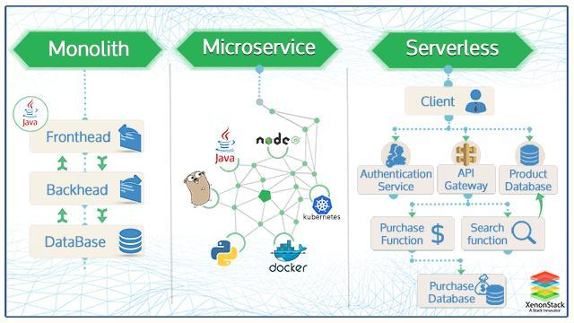

# Serverless Architectures and Frameworks

1. [Serverless Architectures](#serverless-architectures)
    1. [Serverless Bad Practices](#serverless-bad-practices)
    2. [Terraform and Serverless](#terraform-and-serverless)
    3. [Governance](#governance)
    4. [Microservices vs. Serverless. Kubernetes vs Serverless](#microservices-vs-serverless-kubernetes-vs-serverless)
    5. [Case Studies](#case-studies)
    6. [FaaS: Function as a Service](#faas-function-as-a-service)
    7. [Serverless Ecosystems Comparison](#serverless-ecosystems-comparison)
2. [Serverless Framework (the most popular serverless ecosystem)](#serverless-framework-the-most-popular-serverless-ecosystem)
3. [Orchestrators of Functions on Kubernetes (aka Kubernetes Native Serverless Frameworks or FaaS Providers)](#orchestrators-of-functions-on-kubernetes-aka-kubernetes-native-serverless-frameworks-or-faas-providers)
    1. [OpenFaaS](#openfaas)
    2. [OpenFunction](#openfunction)
    3. [Knative](#knative)
        1. [OpenShift Serverless with Knative](#openshift-serverless-with-knative)
    4. [Kubeless](#kubeless)
    5. [OpenWhisk](#openwhisk)
    6. [Dapr Microservices Frameworks](#dapr-microservices-frameworks)
4. [Popular Deployment Frameworks for AWS Lambda](#popular-deployment-frameworks-for-aws-lambda)
5. [TriggerMesh serverless event router](#triggermesh-serverless-event-router)
6. [Images](#images)
7. [Tweets](#tweets)

## Serverless Architectures

- [martinfowler.com: Serverless Architectures](https://martinfowler.com/articles/serverless.html)
- [freecodecamp.org: Serverless is cheaper, not simpler](https://www.freecodecamp.org/news/serverless-is-cheaper-not-simpler-a10c4fc30e49/)
- [theregister.com: Microservices guru says think serverless, not Kubernetes: You don't want to manage 'a towering edifice of stuff'](https://www.theregister.com/2020/09/22/microservices_talk_gotopia/)
- [serverless.com: Why we switched from docker to serverless](https://www.serverless.com/blog/why-we-switched-from-docker-to-serverless)
- [docs.google.com: Serverless Guide to Success 2021](https://docs.google.com/document/u/0/d/1VEkUvTbqxfC1XyVGb2Z3DtEk9NA1M6PJpeCqEYRATLM/mobilebasic)
- [readysetcloud.io: Building Serverless Applications That Scale The Perfect Amount 🌟](https://www.readysetcloud.io/blog/allen.helton/how-to-design-serverless-apps-that-scale-the-perfect-amount/) **When designing serverless apps, you must consider the right level of scale. Your architecture choices will vary greatly depending on the expected load. "Just because serverless services can scale doesn't mean they will scale".**
- [==c-sharpcorner.com: Why and When to use Azure Functions==](https://www.c-sharpcorner.com/article/why-and-when-to-use-azure-functions/)
- [serverlessguru.com: Enterprise Serverless Adoption 🌟](https://www.serverlessguru.com/blog/enterprise-serverless-adoption) Adopting a new architecture may be intimidating. Having to migrate all of your workloads over to your cloud provider can be time-consuming and stressful. I’m sure you’re wondering, “How can I benefit from serverless?” In this article, I’m going to detail how some of the biggest companies in the world are maximizing efficiencies within their organization using serverless technology! Let’s dive in.
- [aws.amazon.com: Serverless or Kubernetes on AWS 🌟](https://aws.amazon.com/architecture/serverless/serverless-or-kubernetes/)
- [==serverlessland.com/event-driven-architecture: Introduction to Event Driven Architecture== 🌟](https://serverlessland.com/event-driven-architecture) What are Event Driven Architectures ?
- [architectelevator.com: Concerned about Serverless Lock-in? Consider Patterns!](https://architectelevator.com/cloud/serverless-design-patterns/) Design patterns have helped us improve software design for decades. In the cloud, they can also reduce our switching cost. That’s magic!
- [==serverlessland.com: EDA VISUALS== 🌟🌟🌟](https://serverlessland.com/event-driven-architecture/visuals) **Small bite sized visuals about event-driven architectures**
    - [==serverlessland.com: BATCH PROCESSING VS EVENT STREAMING==](https://serverlessland.com/event-driven-architecture/visuals/batching-vs-event-streams) What's the difference between batching and event streams? When should you use one over the other? Events are super important in our event-driven architectures, so understanding these fundamentals can help.
    - [serverlessland.com: Splitter pattern](https://serverlessland.com/event-driven-architecture/visuals/splitter-pattern) When building message/event based solutions you may want to take a message or event and split it into many different ones. We can use this to split large messages/events into smaller ones for downstream consumers.
- [dev.to: Serverless - Beyond the Basics | Kristi Perreault 🌟](https://dev.to/aws-heroes/serverless-beyond-the-basics-kom)
- [theburningmonk.com: Why you should use ephemeral environments when you do serverless](https://theburningmonk.com/2019/09/why-you-should-use-temporary-stacks-when-you-do-serverless/)

### Serverless Bad Practices

- [==serverlesshorrors.com== 🌟](https://serverlesshorrors.com/)

### Terraform and Serverless

- [theburningmonk.com: Making Terraform and Serverless framework work together](https://theburningmonk.com/2019/03/making-terraform-and-serverless-framework-work-together)

### Governance

### Microservices vs. Serverless. Kubernetes vs Serverless

- [fathomtech.io: Microservices vs. Serverless](https://fathomtech.io/blog/microservices-vs-serverless/)
- [cloudnowtech.com: Kubernetes vs Serverless – How do you choose? 🌟](https://www.cloudnowtech.com/blog/kubernetes-vs-serverless-how-do-you-choose/)
- [economictimes.indiatimes.com: Thoughtworks XConf Tech Talk Series: Serverless vs. Kubernetes when deploying microservices](https://economictimes.indiatimes.com/tech/technology/thoughtworks-xconf-tech-talk-series-serverless-vs-kubernetes-when-deploying-microservices/articleshow/89085544.cms)
- [acloudguru.com: Containers vs serverless: Which is right for you?](https://acloudguru.com/blog/engineering/containers-vs-serverless-which-is-right-for-you) Serverless is one of the hottest new cloud trends. However, I have found it leads to more harm than good in the long run. While I understand some of the problems listed above are not unique to serverless, they are much more prolific; leading engineers to spend most of their time with YAML configuration or troubleshooting function execution rather than crafting business logic. What I find odd is the lack of complaints from the community. If I’m alone in my assessment, I’d love to hear from you in the comments below. I’ve spent a significant amount of time over the last few years working to undo my own serverless mistakes as well as those made by other developers. Maybe I’m the one who has been brainwashed? Time will tell.
- [==thenewstack.io: Serverless vs. Kubernetes: The People’s Vote==](https://thenewstack.io/serverless-vs-kubernetes-the-peoples-vote/) A breakout session at AWS' recent Re:Invent conference provided a six point comparison of serverless  and Kubernetes to finally determine which architecture was better. The audience voted on which would be the winner.

### Case Studies

- [dashbird.io: Serverless Case Study – Coca-Cola](https://dashbird.io/blog/serverless-case-study-coca-cola/)
- [thenewstack.io: How Daily.Dev Built a Low-Budget Serverless Scraping Pipeline for Online Articles](https://thenewstack.io/how-daily-dev-built-a-low-budget-serverless-scraping-pipeline-for-online-articles/)

### FaaS: Function as a Service

- [redhat.com: What is Function-as-a-Service (FaaS)?](https://www.redhat.com/en/topics/cloud-native-apps/what-is-faas)
- [stackify.com: What Is Function-as-a-Service? Serverless Architectures Are Here!](https://stackify.com/function-as-a-service-serverless-architecture/)
- [==dev.to: FaaS on Kubernetes: From AWS Lambda & API Gateway To Knative & Kong API Gateway==](https://dev.to/pmbanugo/faas-on-kubernetes-from-aws-lambda-api-gateway-to-knative-kong-api-gateway-4n84) In this post, you will learn how to build and deploy a REST API powered by serverless functions running on Kubernetes. You will learn how to use Knative, Kong API Gateway, and the kazi CLI - [pmbanugo.me: FaaS on Kubernetes: From AWS Lambda & API Gateway To Knative & Kong API Gateway](https://pmbanugo.me/faas-on-kubernetes-from-aws-lambda-api-gateway-to-knative-kong-api-gateway)

### Serverless Ecosystems Comparison

- [vshn.ch: A (Very!) Quick Comparison of Kubernetes Serverless Frameworks](https://www.vshn.ch/en/blog/a-very-quick-comparison-of-kubernetes-serverless-frameworks/)
- [dev.to: Price Comparison of Popular Serverless Architecture Providers](https://dev.to/mbagley1020/price-comparison-of-popular-serverless-architecture-providers-2jk9)

## Serverless Framework (the most popular serverless ecosystem)

- [serverless.com: Serverless Framework](https://www.serverless.com/)

## Orchestrators of Functions on Kubernetes (aka Kubernetes Native Serverless Frameworks or FaaS Providers)

- [winderresearch.com: A Comparison of Serverless Frameworks for Kubernetes: OpenFaas, OpenWhisk, Fission, Kubeless and more](https://winderresearch.com/a-comparison-of-serverless-frameworks-for-kubernetes-openfaas-openwhisk-fission-kubeless-and-more/)
- [vshn.ch: A (Very!) Quick Comparison of Kubernetes Serverless Frameworks](https://vshn.ch/en/blog/a-very-quick-comparison-of-kubernetes-serverless-frameworks/)

### OpenFaaS

- [OpenFaaS](https://www.openfaas.com/)
- [xenonstack.com: Serverless Architecture with OpenFaaS and Java](https://www.xenonstack.com/blog/serverless-openfaas-java/)
- [openfaas.com: Learn how to build functions faster using Rancher's kim and K3s](https://www.openfaas.com/blog/kim/) Learn how the kim tool from Rancher can be used to build functions directly into a K3s cluster.

### OpenFunction

- [OpenFunction: Cloud Native Function-as-a-Service Platform (CNCF Sandbox Project)](https://github.com/OpenFunction/OpenFunction) OpenFunction is a cloud-native open-source FaaS (Function as a Service) platform aiming to let you focus on your business logic without having to maintain the underlying runtime environment and infrastructure.

### Knative

- [knative.dev](https://knative.dev/)
- [kn: knative client](https://github.com/knative/client) Knative developer experience, docs, reference Knative CLI implementation. The Knative client kn is your door to the Knative world. It allows you to create Knative resources interactively from the command line or from within Shell scripts.
- [redhat.com: What is knative?](https://www.redhat.com/en/topics/microservices/what-is-knative)
- [datacenterknowledge.com: Explaining Knative, the Project to Liberate Serverless from Cloud Giants](https://www.datacenterknowledge.com/open-source/explaining-knative-project-liberate-serverless-cloud-giants)

#### OpenShift Serverless with Knative

- [OpenShift Serverless](https://www.openshift.com/learn/topics/serverless)
- [openshift.com: Why and When you need to consider OpenShift Serverless](https://www.openshift.com/blog/why-and-when-you-need-to-consider-openshift-serverless)
- [redhat-scholars.github.io: Welcome to OpenShift Serverless Logic Tutorial](https://redhat-scholars.github.io/serverless-workflow/osl/index.html)

### Kubeless

### OpenWhisk

- [openwhisk.apache.org](https://openwhisk.apache.org/)

### Dapr Microservices Frameworks

- [Dapr](https://dapr.io/)
- [Building microservices? Give Dapr a try](https://www.infoworld.com/article/3604010/building-microservices-give-dapr-a-try.html) Microsoft’s open source, cross-platform microservices framework is ready for prime time at last.
- [versusmind.eu: Dapr - a serverless runtime for distributed applications 🌟](https://versusmind.eu/blog/dapr-a-serverless-runtime-for-distributed-applications)
- [dev.to: Running Dapr on Kubernetes](https://dev.to/cvitaa11/running-dapr-on-kubernetes-89g) The distributed application runtime, Dapr, is a portable, event-driven runtime that can run on the cloud or any edge infrastructure. It puts together the best practices for building microservice applications into components called building blocks.
- [github.com/diagrid-labs/dapr-workflow-demos](https://github.com/diagrid-labs/dapr-workflow-demos)

## Popular Deployment Frameworks for AWS Lambda

- [thenewstack.io: Build a Serverless API with AWS Gateway and Lambda](https://thenewstack.io/build-a-serverless-api-with-aws-gateway-and-lambda/)

## TriggerMesh serverless event router

    - Open-source AWS EventBridge alternative
    - Unified eventing experience
    - Developer-friendly CLI
    - Runs on Docker or natively on Kubernetes
- [thenewstack.io: TriggerMesh: Open Sourcing Event-Driven Applications](https://thenewstack.io/triggermesh-open-sourcing-event-driven-applications/) The open source, cloud-agnostic, serverless event router allows users to produce and consume between multiple clouds and on-prem data centers. Check out these real-life case studies.

## Images

??? note "Click to expand!"

	

	
	

## Tweets

  
Click to expand!

<blockquote class="twitter-tweet">
Hi aspiring cloud professional, my name is Adam and I need you to listen to me.  First, I make a zillion-ish dollars per year freelancing and I stand to gain nothing from your attention.  I’m writing to you because it occurs to me that things I think are obvious probably aren’t.
&mdash; Adam Elmore (@aeduhm) <a href="https://twitter.com/aeduhm/status/1443308075079938055?ref_src=twsrc%5Etfw">September 29, 2021</a></blockquote> 

<blockquote class="twitter-tweet">
When building message/event based solutions you may want to take a message or event and split it into many different ones.  We can use this to split large messages/events into smaller ones for downstream consumers.  Visual, resources and example 👇<a href="https://t.co/kqbYoNMxkA">https://t.co/kqbYoNMxkA</a> <a href="https://t.co/5qyhbVcSZJ">pic.twitter.com/5qyhbVcSZJ</a>
&mdash; David Boyne 🚀 (@boyney123) <a href="https://twitter.com/boyney123/status/1630233252702171138?ref_src=twsrc%5Etfw">February 27, 2023</a></blockquote> 

