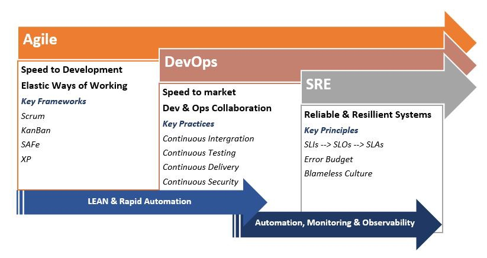

# Site Reliability Engineering (SRE)

1. [SRE](#sre)
2. [SRE Tools](#sre-tools)
3. [Service Level Objectives (SLO)](#service-level-objectives-slo)
    1. [OpenSLO](#openslo)
    2. [Validate Service-Level Objectives of REST APIs Using Iter8](#validate-service-level-objectives-of-rest-apis-using-iter8)
4. [Google SRE Prodcast](#google-sre-prodcast)
5. [Images](#images)
6. [Videos](#videos)
7. [Tweets](#tweets)

## SRE

- [wikipedia: Site Reliability Engineering](https://en.wikipedia.org/wiki/Site_Reliability_Engineering)
- [==sre.google: What is Site Reliability Engineering (SRE)?== 🌟](https://sre.google/)
- [cloud.google.com: SRE vs. DevOps: competing standards or close friends?](https://cloud.google.com/blog/products/gcp/sre-vs-devops-competing-standards-or-close-friends)
- [overops.com: DevOps vs. SRE: What’s the Difference Between Them, and Which One Are You?](https://blog.overops.com/devops-vs-sre-whats-the-difference-between-them-and-which-one-are-you/)
- [victorops.com: SRE vs. DevOps](https://victorops.com/blog/sre-vs-devops)
- [devops.com: SRE vs. DevOps — a False Distinction?](https://devops.com/sre-vs-devops-false-distinction/)
- [devops.com: SRE vs. DevOps vs. Cloud Native: The Server Cage Match](https://devops.com/sre-devops-cloud-native-server-cage-match/)
- [devops.com: Site Reliability Engineering 101: DevOps Versus SRE](https://devops.com/site-reliability-engineering-101-devops-versus-sre/)
- [bmc.com: SRE vs DevOps: What’s The Difference?](https://www.bmc.com/blogs/sre-vs-devops/)
- [dzone: SRE vs. DevOps: SRE Is to DevOps What Scrum Is to Agile](https://dzone.com/articles/sre-vs-devopssre-is-to-devops-what-scrum-is-to-agi)
- [linkedin: DevOps vs Site Reliability Engineering](https://www.linkedin.com/pulse/devops-vs-site-reliability-engineering-sean-washington/)
- [Google: What is Site Reliability Engineering (SRE)?](https://landing.google.com/sre/) SRE is what you get when you treat operations as if it’s a software problem. Our mission is to protect, provide for, and progress the software and systems behind all of Google’s public services — Google Search, Ads, Gmail, Android, YouTube, and App Engine, to name just a few — with an ever-watchful eye on their availability, latency, performance, and capacity.
- [opensource.com: What is an SRE and how does it relate to DevOps?](https://opensource.com/article/18/10/sre-startup) The SRE role is common in large enterprises, but smaller businesses need it, too.
- [thenewstack.io: Where Site Reliability Engineering Overlaps with DevOps](https://thenewstack.io/where-the-site-reliability-engineer-role-overlaps-with-devops/)
- [openshift.com: From Ops to SRE - Evolution of the OpenShift Dedicated Team](https://www.openshift.com/blog/from-ops-to-sre-evolution-of-the-openshift-dedicated-team)
- [cncf.io: DevOps vs. SRE](https://www.cncf.io/blog/2020/07/17/site-reliability-engineering-sre-101-with-devops-vs-sre/)
- [kelda.io: Why SREs Should be Responsible for Development Environments](https://kelda.io/blog/sres-should-manage-development-environments/)
- [youtube: Platform9’s Madhura Maskasky says observability is also essential for diagnosing and debugging in order for SREs to "get to the root cause quickly enough so that you can feed that back to the development teams." 🌟](https://www.youtube.com/watch?v=tgRPlAQpHYk&ab_channel=TheNewStack) Debugging remains complex. Debugging in "a world of microservices is a very difficult task," requiring the identification of which specific part in a microservices deployment must be fixed, says Platform9’s Madhura Maskasky.
    - "What's happening to the system administrator or is the system administrator becoming an SRE? Are they going into different roles? Are they taking multiple roles? How do they play a part in ensuring that reliability in these new roles?"
    - "The way Google defines SRE is that an SRE by nature needs to be someone who develops or writes code 50% of the time and only remaining 50% of the time they do the traditional ops/operations and this is because they want to do more through automation as part of the role of the requirements of the SRE himself, so that you can run apps that can serve billions of requests but that are still handled by a few dozens of SREs."
    - "Suddenly the role for SRE gets democratized and distributed among different roles (developers included)".
    - "Debugging remains complex. Debugging in "a world of microservices is a very difficult task", requiring the identification of which specific part in a microservices deployment must be fixed"
    - Observability is also essential for diagnosing and debugging in order for SREs to "get to the root cause quickly enough so that you can feed that back to the development teams."
- [linkedin.com: SRE: Key Insights-"Done the right way”](https://www.linkedin.com/pulse/sre-key-insights-done-right-way-shankar-muniyappa/)
- [hernan-david-hd.medium.com: 5 pilares del SRE/DevOps](https://hernan-david-hd.medium.com/5-pilares-del-sre-devops-f16e45f8d3fd)
- [hernan-david-hd.medium.com: Breaking down SRE/DevOps into 5 key areas](https://hernan-david-hd.medium.com/breaking-down-sre-devops-into-5-key-areas-5aacf40e8392)
- [devops.com: How the SRE Role Is Evolving](https://devops.com/how-the-sre-role-is-evolving/)
- [itprotoday.com: Why Site Reliability Engineering Is Key to Modern DevOps](https://www.itprotoday.com/testing-and-quality-assurance/why-site-reliability-engineering-key-modern-devops) Among the hottest areas of growth in DevOps is the emerging field of site reliability engineering as organizations look to bake reliability into the earliest stages of the software development cycle.
- [stackpulse.com: Managing Reliability for Monoliths vs. Microservices: The Challenges for SREs](https://stackpulse.com/blog/monoliths-vs-microservices-challenges/)
- [stackpulse.com: Managing Reliability for Monoliths vs. Microservices: Best Practices for SREs](https://stackpulse.com/blog/monoliths-vs-microservices-best-practices/)
- [cloud.google.com: SRE at Google: Our complete list of CRE life lessons 🌟](https://cloud.google.com/blog/products/devops-sre/sre-at-google-our-complete-list-of-cre-life-lessons)
- [circonus.com: Monitoring for Success: What All SREs Need to Know](https://www.circonus.com/2021/04/monitoring-for-success-what-all-sres-need-to-know/)
- [infracloud.io: Site Reliability Engineering (SRE) Best Practices](https://www.infracloud.io/blogs/sre-best-practices/)
- [stackpulse.com: No, SRE Is Not the New DevOps – Unless It Is](https://stackpulse.com/blog/no-sre-is-not-the-new-devops-unless-it-is/)
- [youtube: Viktor Farcic - What is the difference between SRE and DevOps?](https://www.youtube.com/watch?v=jgW4r9FxItI&ab_channel=DevOpsToolkitbyViktorFarcic)
- [dzone: Remote server management - Common architectural elements](https://dzone.com/articles/remote-server-management-common-architectural-elem)
- [dzone: Upcoming Trends in DevOps and SRE in 2021 🌟](https://dzone.com/articles/upcoming-trends-in-devops-and-sre) DevOps and SRE are domains with rapid growth and frequent innovations. With this blog you can explore the latest trends in DevOps, SRE and stay ahead of the curve. **The following trends are most likely to have a lasting impact in the field of DevOps and SRE:**
    - **AIOps and Self-Healing Platforms**
    - **Service Meshes**
    - **Low-code DevOps**
    - **GitOps**
    - **DevSecOps**
- [dzone: SRE vs. DevOps: What are the Differences?](https://dzone.com/articles/sre-vs-devops-what-are-the-differences) SRE and DevOps are closely related concepts with some important distinctions between both, and many businesses can benefit from embracing both of them.
- [dev.to: DevOps vs SRE: What's The Difference?](https://dev.to/thenjdevopsguy/devops-vs-sre-what-s-the-difference-560d)
- [thenewstack.io: How the SRE Experience Is Changing with Cloud Native 🌟](https://thenewstack.io/how-the-sre-experience-is-changing-with-cloud-native/) **From Firefighting to Prevention for SREs. Empower Developers with Self-Service. Facilitate Developer Autonomy**

    | **Site Reliability Engineer (SRE) team**| **Developers**	| **Operations team** |
    |:---|:---|:---|
    | Provide and teach effective use of platform tooling to empower developers to be self-sufficient | Treat SREs as application operation partners, not only as first responders to incidents | Provide self-service platform deployment and observability, and enable visibility into ramifications of actions |
    |Document clear escalation paths for developers struggling in production | Turn to ops teams for the “paved path” or centralized developer control plane | Provide opinionated “paved path” platform or developer control plane (DCP), but allow developers to swap platform components if they also want to be accountable |

- [thenewstack.io: Centralized vs. Decentralized Operations](https://thenewstack.io/sharing-the-operations-burden-centralized-vs-decentralized/)
- [==dev.to: What You Need to Break into DevOps and SRE==](https://dev.to/thenjdevopsguy/what-you-need-to-break-into-devops-and-sre-3fp5)
- [infoq.com: Observing and Understanding Failures: SRE Apprentices](https://www.infoq.com/presentations/sre-apprentices/)
- [medium: Agile vs. DevOps vs. SRE… it’s not OR, it’s AND !](https://medium.com/@ta.abhisingh/agile-vs-devops-vs-sre-its-not-or-it-s-and-aa312904e577)
- [thenewstack.io: Google SRE: Site Reliability Engineering at a Global Scale](https://thenewstack.io/google-sre-site-reliability-engineering-at-a-global-scale)
- [==sre.google: sre-book - The Evolving SRE Engagement Model==](https://sre.google/sre-book/evolving-sre-engagement-model/)
- [blogs.letusdevops.com: How much programming should I know for DevOps/SRE domain.](https://blogs.letusdevops.com/p/how-much-programming-should-i-know) **And YES, you need to learn programming.**
- [devops.com: Day in the Life of a Site Reliability Engineer (SRE)](https://devops.com/day-in-the-life-of-a-site-reliability-engineer-sre/)
- [devops.com: Top Nine Skills for SREs to Master 🌟](https://devops.com/top-nine-skills-for-sres-to-master/)
- [devops.com: How SREs Benefit From Feature Flags](https://devops.com/how-sres-benefit-from-feature-flags/)
- [toolbox.com: Site Reliability Engineering: What Is It and How Can It Help Scale Operations? 🌟](https://www.toolbox.com/tech/devops/articles/automating-sre-to-scale-operations/) Site Reliability Engineering (SRE) is an essential task that bridges the gap between developers and operations. Here’s how organizations can refine it further by leveraging automation.
- [==devops.com: SRE Vs. Platform Engineering: What’s the Difference?==](https://devops.com/sre-vs-platform-engineering-whats-the-difference/)
- [==cncf.io: DevOps vs. SRE vs. Platform Engineering? The gaps might be smaller than you think==](https://www.cncf.io/blog/2022/07/01/devops-vs-sre-vs-platform-engineering-the-gaps-might-be-smaller-than-you-think/)
- [dzone.com: DevOps vs. SRE vs. Platform Engineer vs. Cloud Engineer; Substance or Semantics?](https://dzone.com/articles/devops-vs-sre-vs-platform-engineer-vs-cloud-engine)
- [==phoenixnap.com: SRE Vs. DevOps: Differences Explained== 🌟](https://phoenixnap.com/blog/sre-vs-devops) Take an in-depth look at the similarities & differences between SRE & DevOps, their benefits, usual tasks, and go-to tools to explain their distinct roles in the software development lifecycle (SDLC)
- [thenewstack.io: SRE vs. DevOps? Successful Platform Engineering Needs Both](https://thenewstack.io/sre-vs-devops-successful-platform-engineering-needs-both/) A look at the differences, what they do, how they benefit the business and why organizations need all three to succeed.

## SRE Tools

- [thenewstack.io: The Site Reliability Engineering Tool Stack](https://thenewstack.io/the-site-reliability-engineering-tool-stack/)
- [getcortexapp.com: A guide to the best SRE tools](https://www.getcortexapp.com/post/a-guide-to-the-best-sre-tools)
- [thenewstack.io: The Best Site Reliability Engineering Tools in 2021](https://thenewstack.io/the-best-site-reliability-engineering-tools-in-2021/)

## Service Level Objectives (SLO)

- [SLOconf](https://www.sloconf.com/) The first SLO Conference for Site Reliability Engineers
- [thenewstack.io: Automate User Satisfaction with This GitOps-Friendly Spec for Service Level Objectives](https://thenewstack.io/automate-user-satisfaction-with-this-gitops-friendly-spec-for-service-level-objectives/) Organizations looking to tighten up their ops with some site reliability engineering (SRE) should take a look at the recently-released OpenSLO specification, a GitOps-friendly template for establishing Service Level Objectives (SLO) to specify and even enforce the range of reliability required (and afforded) for a system.
- [sre.google: The Art of SLOs](https://sre.google/resources/practices-and-processes/art-of-slos/)
- [blog.acethecloud.com: A Step-by-Step Guide to Calculate SLAs, SLIs, and SLOs for Your IT Services](https://blog.acethecloud.com/a-step-by-step-guide-to-calculating-slas-slis-and-slos-for-your-it-services-6f0a07b67bb5)
- [medium.com/picsart-engineering: Prioritizing Development Efforts with SLOs in Microservices](https://medium.com/picsart-engineering/prioritizing-development-efforts-with-slos-in-microservices-109ecd9b9b92)

### OpenSLO

- [OpenSLO specification 🌟](https://github.com/OpenSLO/OpenSLO) The goal of this project is to provide an open specification for defining and interfacing with SLOs to allow for a common approach, giving a set vendor-agnostic solution to defining and tracking SLOs. Platform specific implementation details are purposefully excluded from the scope of this specification.

### Validate Service-Level Objectives of REST APIs Using Iter8

- [Iter8](https://iter8.tools)
- [thenewstack.io: Validate Service-Level Objectives of REST APIs Using Iter8](https://thenewstack.io/validate-service-level-objectives-of-rest-apis-using-iter8/)

## Google SRE Prodcast

- [==sre.google/prodcast==](https://sre.google/prodcast/) **The SRE Prodcast is Google's podcast about Site Reliability Engineering and production software.** In Season 1, we discuss concepts from the [SRE Book](https://sre.google/sre-book/table-of-contents/) with experts at Google.

## Images

??? note "Click to expand!"

	

    

    

    
	

## Videos

  
Click to expand!

<iframe width="560" height="315" src="https://www.youtube.com/embed/OnK4IKgLl24" title="YouTube video player" frameborder="0" allow="accelerometer; autoplay; clipboard-write; encrypted-media; gyroscope; picture-in-picture" allowfullscreen></iframe>
<iframe width="560" height="315" src="https://www.youtube.com/embed/tgRPlAQpHYk" frameborder="0" allow="accelerometer; clipboard-write; encrypted-media; gyroscope; picture-in-picture" allowfullscreen></iframe>
<iframe width="560" height="315" src="https://www.youtube.com/embed/jgW4r9FxItI" title="YouTube video player" frameborder="0" allow="accelerometer; clipboard-write; encrypted-media; gyroscope; picture-in-picture" allowfullscreen></iframe>

## Tweets

  
Click to expand!

<blockquote class="twitter-tweet">
Is it hard to find SREs? Dell: Developers do a good job as SREs because they know what exactly is happening. At the same time, we are also thinking about how we can have a developer rotation model too; essentially a rotation policy which is a learning process for us.
&mdash; The New Stack (@thenewstack) <a href="https://twitter.com/thenewstack/status/1390691219831934981?ref_src=twsrc%5Etfw">May 7, 2021</a></blockquote> 

<blockquote class="twitter-tweet">
&quot;Platform Engineering&quot; is rapidly becoming the new DevOps or SRE. Almost every day we hear about another org building an internal developer platform or control plane.  Want to know what platform engineering is, where the trends are going, and why you should care?   Read on 🧵👇
&mdash; Daniel Bryant (@danielbryantuk) <a href="https://twitter.com/danielbryantuk/status/1494614250567966732?ref_src=twsrc%5Etfw">February 18, 2022</a></blockquote> 

<blockquote class="twitter-tweet">
We&#39;re delighted to introduce Prodcast, Google SRE&#39;s podcast about Site Reliability Engineering and production software. In Season 1, we discuss concepts from the <a href="https://twitter.com/hashtag/SRE?src=hash&amp;ref_src=twsrc%5Etfw">#SRE</a> Book with experts at Google.<a href="https://twitter.com/hashtag/SREBook?src=hash&amp;ref_src=twsrc%5Etfw">#SREBook</a> <a href="https://twitter.com/hashtag/reliability?src=hash&amp;ref_src=twsrc%5Etfw">#reliability</a> <a href="https://t.co/sOytXhXFyz">https://t.co/sOytXhXFyz</a>
&mdash; Google Site Reliability Engineering (@googlesre) <a href="https://twitter.com/googlesre/status/1514506379117092867?ref_src=twsrc%5Etfw">April 14, 2022</a></blockquote> 

