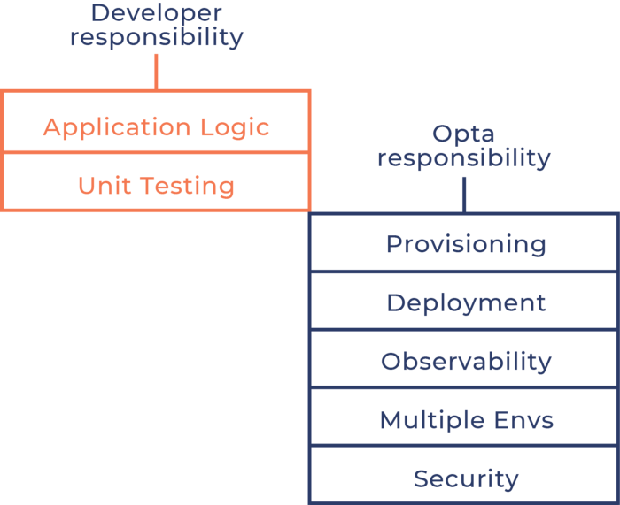

# Hashicorp Terraform & Packer. Kubernetes Boilerplates

{==*"It's not controversial to provision resources with code. It shouldn't be controversial to deploy and manage resources with code" (Jaana Dogan)*==}

1. [HashiCorp Learning Resources Reference Guide](#hashicorp-learning-resources-reference-guide)
2. [Packer](#packer)
3. [HashiCorp Cloud Terraform Cloud](#hashicorp-cloud-terraform-cloud)
4. [Blogs and Newsletters](#blogs-and-newsletters)
5. [Terraform](#terraform)
    1. [Antipatterns](#antipatterns)
    2. [Terraform License](#terraform-license)
6. [OpenTOFU vs Terraform](#opentofu-vs-terraform)
7. [Terraform fmt](#terraform-fmt)
8. [terraform taint](#terraform-taint)
9. [terraform stacks](#terraform-stacks)
10. [Terraform and GitHub Actions](#terraform-and-github-actions)
11. [Terraform and GitLab Pipelines](#terraform-and-gitlab-pipelines)
12. [Terraform Testing](#terraform-testing)
13. [Terraform docs](#terraform-docs)
14. [Private Terraform Registries](#private-terraform-registries)
15. [Terraform and Grafana](#terraform-and-grafana)
16. [Terraform and Jenkins](#terraform-and-jenkins)
17. [Alternatives to Terraform](#alternatives-to-terraform)
18. [Managing secrets in your Terraform code](#managing-secrets-in-your-terraform-code)
19. [Terraform Cloud (HCP Terraform)](#terraform-cloud-hcp-terraform)
20. [Hashicorp Infrastructure Cloud](#hashicorp-infrastructure-cloud)
     1. [Alternatives to Terraform Cloud](#alternatives-to-terraform-cloud)
21. [HCL](#hcl)
22. [CDK Cloud Development Kit Terraform](#cdk-cloud-development-kit-terraform)
23. [Providing Terraform with Ansible](#providing-terraform-with-ansible)
24. [Python Boto3 and Terraform](#python-boto3-and-terraform)
25. [Helm Charts in Terraform](#helm-charts-in-terraform)
26. [Terraform Infracost](#terraform-infracost)
27. [Awesome Terraform](#awesome-terraform)
28. [Terraform Cheat Sheets](#terraform-cheat-sheets)
29. [Best Practices](#best-practices)
30. [Terraform and CI/CD. Terraform Workspaces](#terraform-and-cicd-terraform-workspaces)
31. [Terraform Boilerplates](#terraform-boilerplates)
32. [Terraform and Kubernetes](#terraform-and-kubernetes)
33. [Terrafor Cloud Operator](#terrafor-cloud-operator)
34. [Terraform Kubernetes Boilerplates](#terraform-kubernetes-boilerplates)
     1. [Hashicorp Terraform Kubernetes Collection](#hashicorp-terraform-kubernetes-collection)
     2. [Learnk8s Terraform and Managed Kubernetes](#learnk8s-terraform-and-managed-kubernetes)
     3. [OpenShift and Terraform](#openshift-and-terraform)
     4. [Other Boilerplates](#other-boilerplates)
     5. [Terraform Kubernetes Operator](#terraform-kubernetes-operator)
     6. [Terraform K3s Boilerplates](#terraform-k3s-boilerplates)
     7. [Terraform and GCP](#terraform-and-gcp)
         1. [Terraform GKE Boilerplates](#terraform-gke-boilerplates)
     8. [Terraform and AWS](#terraform-and-aws)
         1. [AWS Service Catalog](#aws-service-catalog)
         2. [AWS Observability Accelerator for Terraform](#aws-observability-accelerator-for-terraform)
         3. [Terraform EKS Boilerplates](#terraform-eks-boilerplates)
         4. [AWSCC. Terraform AWS Cloud Control Provider](#awscc-terraform-aws-cloud-control-provider)
         5. [AWS Control Tower Account Factory for Terraform (AFT)](#aws-control-tower-account-factory-for-terraform-aft)
         6. [Porsche Official](#porsche-official)
         7. [AWS Serverless with Terraform](#aws-serverless-with-terraform)
     9. [Terraform with Azure](#terraform-with-azure)
         1. [Azure Terraform Export aztfexport](#azure-terraform-export-aztfexport)
         2. [Azure Landing Zones with Terraform. Azure Network Architecture](#azure-landing-zones-with-terraform-azure-network-architecture)
         3. [Azure Terrafy and AzAPI Terraform Provider](#azure-terrafy-and-azapi-terraform-provider)
         4. [Terraform in Azure DevOps. Azure DevOps with terraform](#terraform-in-azure-devops-azure-devops-with-terraform)
         5. [Terraform Azure Stack Provider](#terraform-azure-stack-provider)
     10. [Terraform for a Data Engineer](#terraform-for-a-data-engineer)
     11. [Terraform AKS Boilerplates](#terraform-aks-boilerplates)
     12. [Terraform and OCI](#terraform-and-oci)
     13. [Terraform and Linode](#terraform-and-linode)
35. [Istio with Terraform](#istio-with-terraform)
36. [Terraform and Minikube](#terraform-and-minikube)
37. [Terraform and Apache Kafka](#terraform-and-apache-kafka)
38. [Terraform and JMeter](#terraform-and-jmeter)
39. [Terraform and OpenVPN on AWS](#terraform-and-openvpn-on-aws)
40. [Terraform Video Tutorials](#terraform-video-tutorials)
41. [CDK for Terraform](#cdk-for-terraform)
42. [Graph Visualization Software](#graph-visualization-software)
43. [Terraform Modules](#terraform-modules)
     1. [Terraform AWS Modules](#terraform-aws-modules)
     2. [Segment AWS Stack Terraform Modules](#segment-aws-stack-terraform-modules)
44. [Terraform Providers](#terraform-providers)
     1. [Terraform AWS Cloud Control Provider](#terraform-aws-cloud-control-provider)
     2. [Terraform Provider for Elastic Cloud](#terraform-provider-for-elastic-cloud)
     3. [Terraform Vault Provider](#terraform-vault-provider)
     4. [Terraform AzureRM](#terraform-azurerm)
45. [Terraform Code Quality. Terraform Quality Checks. Terraform Linters](#terraform-code-quality-terraform-quality-checks-terraform-linters)
46. [Enforce Policy with Sentinel](#enforce-policy-with-sentinel)
47. [Reverse terraform with Terraformer](#reverse-terraform-with-terraformer)
48. [Terraform Tools](#terraform-tools)
49. [Writing Terraform for unsupported resources with TerraCurl](#writing-terraform-for-unsupported-resources-with-terracurl)
50. [Terraform Frameworks](#terraform-frameworks)
     1. [Kubestack Terraform GitOps Framework](#kubestack-terraform-gitops-framework)
     2. [Gruntwork Terragrunt](#gruntwork-terragrunt)
     3. [Terraspace](#terraspace)
51. [Terraform Associate Certification](#terraform-associate-certification)
52. [ChatGPT](#chatgpt)
53. [Images](#images)
54. [Videos](#videos)
55. [Tweets](#tweets)

<center>
<iframe width="100%" height="166" scrolling="no" frameborder="no" allow="autoplay" src="https://w.soundcloud.com/player/?url=https%3A//api.soundcloud.com/tracks/468480528&color=%23ff5500&auto_play=false&hide_related=false&show_comments=true&show_user=true&show_reposts=false&show_teaser=true"></iframe><div style="font-size: 10px; color: #cccccc;line-break: anywhere;word-break: normal;overflow: hidden;white-space: nowrap;text-overflow: ellipsis; font-family: Interstate,Lucida Grande,Lucida Sans Unicode,Lucida Sans,Garuda,Verdana,Tahoma,sans-serif;font-weight: 100;"><a href="https://soundcloud.com/raymond-mnt" title="RAYMOND MNT" target="_blank" style="color: #cccccc; text-decoration: none;">RAYMOND MNT</a> · <a href="https://soundcloud.com/raymond-mnt/jimmy-sax-parga-oriental-sax" title="Jimmy Sax - Parga (Oriental sax ).mp3" target="_blank" style="color: #cccccc; text-decoration: none;">Jimmy Sax - Parga (Oriental sax ).mp3</a></div>
</center>

## HashiCorp Learning Resources Reference Guide

- [hashicorp.com: HashiCorp Learning Resources Reference Guide 🌟](https://www.hashicorp.com/blog/hashicorp-learning-resources-reference-guide) Read this curated list of HashiCorp learning resources to help practitioners and organizations better understand the cloud operating model.
- [techbeatly.com: 10 Free Courses to Learn Terraform](https://www.techbeatly.com/terraform-free-courses/)
- [learn.hashicorp.com: What is Infrastructure as Code with Terraform? 🌟](https://learn.hashicorp.com/tutorials/terraform/infrastructure-as-code)

## Packer

- [packer.io](https://packer.io/)
- [packer.io docs](https://www.packer.io/docs/index.html)
- [computingforgeeks.com: Build AWS EC2 Machine Images (AMI) With Packer and Ansible](https://computingforgeeks.com/build-aws-ec2-machine-images-with-packer-and-ansible/)
- [learn.hashicorp.com: Write Packer template for AWS](https://learn.hashicorp.com/tutorials/packer/aws-get-started-build-image)

## HashiCorp Cloud Terraform Cloud

- [cloud.hashicorp.com: HashiCorp Cloud](https://cloud.hashicorp.com/) The fastest way to get up and running with HashiCorp tools. HashiCorp Cloud Platform is a fully managed platform for Terraform, Vault, Consul, and more.
- [hashicorp.com: Multi-Region Replication Now Available with HCP Vault](https://www.hashicorp.com/blog/multi-region-replication-now-available-with-hcp-vault) New HCP Vault Plus Clusters adds high availability replication of secrets and policies across cloud regions.
- [levelup.gitconnected.com: Continuous Integration and Continuous Deployment with Terraform Cloud](https://levelup.gitconnected.com/continuous-integration-continuous-deployment-with-terraform-cloud-ad384f29d7a0)

## Blogs and Newsletters

- [weekly.tf: Terraform Weekly](https://weekly.tf)
    - [weekly.tf: Issue #171 - Terramate, Using LLMs to generate Terraform, API Gateway with Lambda, GuardDuty, IMDSv2 at Slack, Azure DevOps Pipelines](https://www.weekly.tf/p/issue-171-terramate-using-llms-to-generate-terraform-api-gateway-with-lambda-guardduty-imdsv2)
- [build5nines.com](https://build5nines.com)
- [nedinthecloud.com](https://nedinthecloud.com)

## Terraform

- [Wikipedia.org: Terraform Software](https://en.wikipedia.org/wiki/Terraform_(software))
- [roadmap.sh/terraform 🌟](https://roadmap.sh/terraform)
- [terraform.io](https://www.terraform.io/)
- [Terraform Registry - registry.terraform.io: Terraform Providers and Modules 🌟](https://registry.terraform.io/)
- [medium.com: Why should Terraform be one of your DevOps tools?](https://medium.com/devopslinks/why-should-terraform-be-one-of-your-devops-tools-29ae15861b1f)
- [Dzone: intro to terraform](https://dzone.com/articles/intro-to-terraform-way-of-infra-as-code)
- [blog.teemo.co: Terraform in 10 commands](https://blog.teemo.co/terraform-in-10-commands-e737dfd8bf31)
- [dzone: Terraform - IAC Tool](https://dzone.com/articles/terraform-iac-tool) See why Terraform's declarative approach to automation makes it a competitive tool for automating the creation of your infrastructure.
- [udemy.com: Learn DevOps: Infrastructure Automation With Terraform](https://www.udemy.com/learn-devops-infrastructure-automation-with-terraform/)
- [Dzone: managing infrastructure at scale with terraform](https://dzone.com/articles/managing-infrastructure-at-scale-with-terraform)
- [Dzone: What's new in Terraform v0.12](https://dzone.com/articles/whats-new-in-terraform-v012)
- [terraform-infraestructura.readthedocs.io](https://terraform-infraestructura.readthedocs.io)
- [Why we use Terraform and not Chef, Puppet, Ansible, SaltStack, or CloudFormation](https://blog.gruntwork.io/why-we-use-terraform-and-not-chef-puppet-ansible-saltstack-or-cloudformation-7989dad2865c)
- [Terraform, can you keep a secret?](https://cloudonaut.io/terraform-can-you-keep-a-secret/) Did you know that Terraform state can - and most likely does - contain sensitive data?
- [Terraform 0.13 Beta released!](https://discuss.hashicorp.com/t/terraform-0-13-beta-released)
- [medium: AWS API Gateway](https://medium.com/@hashiroulap/terraform-aws-api-gateway-6d86a010f359)
- [medium: Integration of AWS, Terraform, and GitHub for Automated Deployment Infrastructure](https://medium.com/@akshayavb99/integration-of-aws-terraform-and-github-for-automated-deployment-infrastructure-da0a19ff4e86)
- [medium: Automation of Cloud-Terraform](https://medium.com/@sandupatlaabhilash1747/automation-of-cloud-terraform-5a299fb785bb)
- [hashicorp.com: Custom Variable Validation in Terraform 0.13](https://www.hashicorp.com/blog/custom-variable-validation-in-terraform-0-13/)
- [medium: Terraform for Network Engineers: Should you be implementing Infrastructure as Code?](https://medium.com/hashicorp-engineering/terraform-for-network-engineers-should-you-be-implementing-infrastructure-as-code-73667d27d3b8)
- [hashicorp.com: Learn How to Import Infrastructure Into Terraform](https://www.hashicorp.com/blog/import-infrastructure-into-terraform)
- [Bridgecrew: Misconfigured Terraform Modules Are a Security Issue](https://thenewstack.io/bridgecrew-all-these-misconfigured-terraform-modules-are-a-security-issue/)
- [medium - Infrastructure-As-Code: But You Don’t Have to Write That Code](https://medium.com/@duplocloud/infrastructure-as-code-but-you-dont-have-to-write-that-code-87ec4fe94863)
- [Manage Active Directory Objects with the New Windows AD Provider for HashiCorp Terraform](https://www.hashicorp.com/blog/manage-active-directory-objects-new-windows-ad-provider-hashicorp-terraform) Official HashiCorp-maintained Active Directory provider for Terraform. Terraform is a great way to bring some sanity to AD management so we’re excited to make this official.
- [Terraform Feature Flags & Environment Toggle Design Patterns](https://build5nines.com/terraform-feature-flags-environment-toggle-design-patterns/)
- [Announcing Databricks Labs Terraform integration on AWS and Azure](https://databricks.com/blog/2020/09/11/announcing-databricks-labs-terraform-integration-on-aws-and-azure.html)
- [hashicorp.com: Announcing 11 Verified Providers for Terraform](https://www.hashicorp.com/blog/announcing-11-verified-providers-for-terraform)
- [learn.hashicorp.com: Call APIs with Terraform Providers. Learn how to use and create custom Terraform Providers in a new collection of tutorials on HashiCorp Learn 🌟](https://learn.hashicorp.com/collections/terraform/providers)
- [devblogs.microsoft.com: What is infrastructure as code? 🌟](https://devblogs.microsoft.com/devops/what-is-infrastructure-as-code/)
- [k21academy.com: Why Terraform? Not Chef, Ansible, Puppet, CloudFormation? 🌟](https://k21academy.com/terraform-iac/why-terraform-not-chef-ansible-puppet-cloudformation/)
- [hashicorp.com: New Terraform Tutorial: Sensitive Input Variables 🌟](https://www.hashicorp.com/blog/terraform-sensitive-input-variables) A new tutorial on HashiCorp Learn shows how to protect sensitive data with Terraform.
- [AWS Lambda the Terraform Way](https://github.com/nsriram/lambda-the-terraform-way) The objective of this tutorial is to understand AWS Lambda in-depth, beyond executing functions, using Terraform. This tutorial walks through setting up Terraform, dependencies for AWS Lambda, getting your first Lambda function running, many of its important features & finally integrating with other AWS services.
- [medium: Don’t Forget to Restrict Outbound Traffic with Terraform and Sentinel](https://medium.com/hashicorp-engineering/dont-forget-to-restrict-outbound-traffic-with-terraform-and-sentinel-c74a99129dae)
- [K3s Private Cluster 🌟](https://github.com/sagittaros/terraform-k3s-private-cloud)
- [hashicorp.com: New Terraform Tutorial: Terraform Outputs 🌟](https://www.hashicorp.com/blog/tutorial-terraform-outputs) Learn how to output data about your infrastructure.
- [trek10.com: Beginner's Guide to Using Terraform with AWS 🌟](https://www.trek10.com/blog/beginners-guide-to-using-terraform-with-aws) Beginner tips for Terraform on AWS, common problem areas and misunderstandings that we coach and train internally.
- [env0.com: We’re Opensourcing Terratag to Make Multicloud Resource Tagging Easier](https://www.env0.com/blog/were-opensourcing-terratag-to-make-multicloud-resource-tagging-easier)
- [hashicorp.com: Terraform Mono Repo vs. Multi Repo: The Great Debate](https://www.hashicorp.com/blog/terraform-mono-repo-vs-multi-repo-the-great-debate) Learn about the pros and cons of using mono repositories and multi repositories along with the most logical use case for each.
- [terraform.io: Cloud Adoption Framework for Azure - Terraform module](https://registry.terraform.io/modules/aztfmod/caf/azurerm/latest)
- [arnaudlheureux.io: Migrating Azure CAF landing zones to Terraform 0.13](https://www.arnaudlheureux.io/2020/10/02/migrating-azure-caf-landing-zones-on-terraform-0-13/)
- [tfenv](https://github.com/tfutils/tfenv) Terraform version manager inspired by rbenv
- [dev.to: Packer and Terraform with Immutable Infrastructure](https://dev.to/cloudskills/packer-and-terraform-with-immutable-infrastructure-47ja)
- [medium: Terraform: How to Use Conditionals to Dynamically Create Resources](https://medium.com/swlh/terraform-how-to-use-conditionals-for-dynamic-resources-creation-6a191e041857) …don’t struggle looking for if/else statements, you won’t find them…
- [cloudify.co: Ansible, Terraform And Cloudify](https://cloudify.co/blog/ansible-terraform-and-cloudify/)
- [automateinfra.com: How to Launch multiple EC2 instances on AWS using Terraform count and for_each](https://automateinfra.com/2021/03/22/how-to-launch-multiple-ec2-instances-on-aws-using-terraform/)
- [morethancertified.com: More Consistent Terraform Runs With Docker](https://morethancertified.com/terraform-in-docker)
- [deloitte.com: Infrastructure as Code (IaC) con Terraform](https://www2.deloitte.com/es/es/blog/todo-tecnologia/2021/infrastructure-as-code-iac-con-terraform.html) Automatización, escalado, optimización y ahorro en tu factura cloud
- [flowfactor.be: What do you know about Terraform modules?](https://www.flowfactor.be/2021/03/18/what-do-you-know-about-terraform-modules/)
- [medium: How to manage infrastructure as code (IaC) with Terraform on AWS? 🌟](https://medium.com/workfall/how-to-manage-infrastructure-as-code-iac-with-terraform-on-aws-1fa6cd6bccfe)
- [accurics.com: Terraform Security: Improving IaC Scans with Terraform Plan Output](https://www.accurics.com/blog/terrascan-blog/terraform-security-improving-iac-scans-with-terraform-plan-output)
- [hashicorp.com: Modern Infrastructure Automation with Packer, Terraform, and Consul (video)](https://www.hashicorp.com/resources/modern-infrastructure-automation-with-packer-terraform-and-consul)
- [hashicorp.com: New Terraform Tutorials: Getting Started with the Helm and Datadog Providers 🌟](https://www.hashicorp.com/blog/getting-started-with-the-helm-and-datadog-terraform-providers)
- [hashicorp.com: How can I prevent configuration drift?](https://www.hashicorp.com/resources/how-can-i-prevent-configuration-drift) What causes our infrastructure's configuration to drift over time away from our original intended state? And how does Terraform help?
- [hashicorp.com: New Terraform Tutorials: Getting Started with the Helm and Datadog Providers](https://www.hashicorp.com/blog/getting-started-with-the-helm-and-datadog-terraform-providers)
- [hashicorp.com: Share Modules Across Organizations with Terraform Enterprise](https://www.hashicorp.com/blog/share-modules-across-organizations-terraform-enterprise) Terraform Enterprise now offers users the ability to consume private modules across organizations, providing greater management consistency.
- [freecodecamp.org: What is Terraform? Learn Terraform and Infrastructure as Code](https://www.freecodecamp.org/news/what-is-terraform-learn-infrastructure-as-code/)
- [hashicorp.com: Announcing HashiCorp Terraform 0.15 General Availability](https://www.hashicorp.com/blog/announcing-hashicorp-terraform-0-15-general-availability)
- [itnext.io: How to use Terraform to create a small-scale Cloud Infrastructure 🌟](https://itnext.io/how-to-use-terraform-to-create-a-small-scale-cloud-infrastructure-abf54fabc9dd)
- [acloudguru.com: Securing your multi-cloud Terraform pipelines with policy-as-code](https://acloudguru.com/blog/engineering/securing-your-multi-cloud-terraform-pipelines-with-policy-as-code)
- [medium: Terraform — Remote States Overview 🌟](https://medium.com/devops-mojo/terraform-remote-states-overview-what-is-terraform-remote-state-storage-introduction-936223a0e9d0) What is Terraform Remote State — Introduction to Terraform Remote Storage!
- [prcode.co.uk: Connect Azure MySQL to Private Endpoint with Terraform](https://prcode.co.uk/2021/04/29/connect-azure-mysql-to-private-endpoint-with-terraform/)
- [infoq.com: Cloudflare Improves Automated Terraform Generation Tool 🌟](https://www.infoq.com/news/2021/04/cloudflare-terraform/) Cloudflare recently released an updated version of their [cf-terraforming](https://github.com/cloudflare/cf-terraforming) tool. This tool streamlines generating Terraform HCL from existing Cloudflare resources. The new release simplifies the generation process and introduces changes to better future proof the tool.
- [hashicorp.com: Building Azure Resources with TypeScript Using the CDK for Terraform](https://www.hashicorp.com/blog/building-azure-resources-with-typescript-using-the-cdk-for-terraform) Learn a quick method for getting started with the Cloud Development Kit (CDK) for Terraform using TypeScript as infrastructure code and provisioning on Microsoft Azure.
- [acloudguru.com: How to use Terraform outputs and inputs](https://acloudguru.com/blog/engineering/how-to-use-terraform-inputs-and-outputs)
- [infoq.com: Managing Infrastructure from Kubernetes with the HashiCorp Terraform Operator](https://www.infoq.com/news/2020/04/terraform-operator-kubernetes/)
- [medium: Protect your Terraform State](https://medium.com/the-innovation/protect-your-terraform-state-a974027a4bb0) The right way!
- [hashicorp.com: Terraform AzureAD Provider Now Supports Microsoft Graph](https://www.hashicorp.com/blog/terraform-azuread-provider-now-supports-microsoft-graph) Version 1.5.0 of the Terraform AzureAD provider lets you manage your Azure Active Directory resources using the Microsoft Graph API.
- [nitheeshp.dev: Practical CI/CD Guide to Deploying AWS Infrastructure 🌟](https://nitheeshp.dev/series/terraform)
    - [nitheeshp.dev: Practical CI/CD Guide to Deploying AWS Infrastructure through Terraform - Multi Environment Deployment - Part 1 🌟](https://nitheeshp.dev/practical-cicd-guide-to-deploying-aws-infrastructure-through-terraform-part-1-1) Introduction
    - [nitheeshp.dev: Practical CI/CD Guide to Deploying AWS Infrastructure through Terraform - Multi Environment Deployment - Part 2 🌟](https://nitheeshp.dev/practical-cicd-guide-to-deploying-aws-infrastructure-through-terraform-multi-environment-deployment-part-2) Terraform Directory Structure
    - [nitheeshp.dev: Practical CI/CD Guide to Deploying AWS Infrastructure through Terraform - Multi Environment Deployment - Part 3 🌟](https://nitheeshp.dev/practical-cicd-guide-to-deploying-aws-infrastructure-through-terraform-multi-environment-deployment-part-3) Terraform Cloud Configurations
    - [nitheeshp.dev: Practical CI/CD Guide to Deploying AWS Infrastructure through Terraform - Multi Environment Deployment - Part 4 🌟](https://nitheeshp.dev/practical-cicd-guide-to-deploying-aws-infrastructure-through-terraform-multi-environment-deployment-part-4) GitOps
- [hashicorp.com: New Terraform Tutorials on HashiCorp Learn](https://www.hashicorp.com/blog/new-terraform-tutorials-on-hashicorp-learn) From working with providers, to managing resources, to working with Terraform on AWS, we have a lot of new hands-on Terraform exercises to try.
- [hashicorp.com: Announcing Support for Amazon ECS Anywhere in the Terraform AWS Provider](https://www.hashicorp.com/blog/announcing-launch-day-support-for-amazon-ecs-anywhere-terraform-aws-provider) The Terraform AWS provider now supports ECS Anywhere, a new capability in Amazon ECS that supports running and managing container-based applications on customers’ on-premises servers.
- [automateinfra.com: Terraform (Series-1) 🌟](https://automateinfra.com/terraform-series1/)
    - [automateinfra.com: Terraform (Series-2)](https://automateinfra.com/terraform-series2/)
    - [automateinfra.com: Terraform (Series-3)](https://automateinfra.com/terraform-series3/)
    - [automateinfra.com: Terraform (Series-4)](https://automateinfra.com/terraform-series-5/)
- [hashicorp.com: Announcing HashiCorp Terraform 1.0 General Availability 🌟](https://www.hashicorp.com/blog/announcing-hashicorp-terraform-1-0-general-availability)
- [acloudguru.com: What does the Terraform 1.0 release mean for you?](https://acloudguru.com/blog/engineering/what-does-the-terraform-1-0-release-mean-for-you)
- [thenewstack.io: Terraform 1.0 Reflects What HashiCorp Has Learned About Infrastructure-as-Code](https://thenewstack.io/terraform-1-0-reflects-what-hashicorp-has-learned-about-infrastructure-as-code/)
- [medium: terraform | git commit -m “all the secrets” | sops tool for managing secrets 🌟](https://medium.com/cloudandthings/terraform-git-commit-m-all-the-secrets-5dfea9b111de) - [sops: Simple and flexible tool for managing secrets 🌟](https://github.com/mozilla/sops)
- [fsgeorgee.medium.com: Growing out of Heroku to Terraform, Docker and AWS](https://fsgeorgee.medium.com/growing-out-of-heroku-to-terraform-docker-and-aws-69e66df4132d) Heroku is great, but how about using Terraform, AWS, Docker and have full control over the entire stack?
- [learn.hashicorp.com: y Serverless Applications with AWS Lambda and API Gateway 🌟](https://learn.hashicorp.com/tutorials/terraform/lambda-api-gateway)
- [harness.io: Terraform 201: What It Is, Tutorial, and More 🌟](https://harness.io/blog/devops/terraform-201-tutorial)
- [medium: Terraform Zero to Hero](https://medium.com/tech-guides/terraform-zero-to-hero-733f6860bb9a)
- [learn.hashicorp.com: Configure Default Tags for AWS Resources 🌟](https://learn.hashicorp.com/tutorials/terraform/aws-default-tags)
- [terraform-hcloud-dualstack-k8s: Hetzner Dual-Stack Kubernetes Cluster](https://github.com/tibordp/terraform-hcloud-dualstack-k8s) (Unofficial) Terraform module for a dual-stack Kubernetes cluster on Hetzner Cloud
- [hashicorp.com: Beta Support for CRDs in the Terraform Provider for Kubernetes](https://www.hashicorp.com/blog/beta-support-for-crds-in-the-terraform-provider-for-kubernetes)
- [opensource.com: My top 5 tips for setting up Terraform 🌟](https://opensource.com/article/21/8/terraform-tips) These are the lessons I've learned after five years with Terraform.
- [rpadovani.com: How to make Terraform waiting for cloud-init to finish on EC2 without SSH](https://rpadovani.com/terraform-cloudinit) Terraform is a powerful tool. However, it has some limitations: since it uses AWS APIs, it doesn’t have a native way to check if an EC2 instance has completed to run cloud-init before marking it as ready. A possible workaround is asking Terraform to SSH on the instance, and wait until it is able to perform a connection before marking the instance as ready.
- [hashicorp.com: Cisco, Citrix, and Fortinet Among New Verified Terraform Providers](https://www.hashicorp.com/blog/cisco-citrix-fortinet-among-new-verified-terraform-providers)
- [terraform-best-practices.com 🌟](https://www.terraform-best-practices.com/)
- [bridgecrew.io: Advanced Terraform security: Pro tips for secure infrastructure as code](https://bridgecrew.io/blog/advanced-terraform-security-pro-tips-for-secure-infrastructure-as-code)
- [hub.qovery.com: Terraform is Not the Golden Hammer](https://hub.qovery.com/guides/engineering/terraform-not-the-golden-hammer/)
- [scalefactory.com: Failing faster with terraform](https://scalefactory.com/blog/2021/10/13/failing-faster-with-terraform/) **Terraform validation rules**. Terraform is an extremely powerful tool, but with great power comes great opportunity to break stuff, or whatever Uncle Ben said. With a single command a developer can deploy hundreds of resources in an instant, and when that developer inevitably configured the inputs wrong Terraform makes it easy to patch or rollback that mistake. But you know what’s better than recovering from mistakes? Never making the mistake in the first place.
- [medium.com/geekculture: Managing Infra with Terraform](https://medium.com/geekculture/managing-infra-with-terraform-275968590fa4)
- [hashicorp.com: AWS and HashiCorp Collaborate on New Terraform Modules](https://www.hashicorp.com/blog/aws-hashicorp-collaborate-new-terraform-modules)
- [shipa.io: Terraform meets AppOps 🌟](https://shipa.io/development/terraform-meets-appops) Terraform is the popular choice among teams
- [bitslovers.com: Terraform Output – What you should know](https://www.bitslovers.com/terraform-output/)
- [devops.com: Building on Terraform: Evolution, not Revolution](https://devops.com/building-on-terraform-evolution-not-revolution/)
- [==medium: 10 things I wish I knew before learning Terraform (Part 1) | Ian Hancock==](https://medium.com/contino-engineering/10-things-i-wish-i-knew-before-learning-terraform-f13637a01aa6)
    - [==medium: 10 things I wish I knew before learning Terraform (Part 2) | Ian Hancock==](https://medium.com/contino-engineering/10-things-i-wish-i-knew-before-learning-terraform-part-2-a15a3f85efb6)
- [hashicorp.com: Multi-Cloud DevOps at PETRONAS with Terraform](https://www.hashicorp.com/resources/multi-cloud-devops-at-petronas-with-terraform)
- [terraform.io: Refactoring](https://www.terraform.io/docs/language/modules/develop/refactoring.html)
- [medium: Terraform in Real Life: Lessons Learned 🌟](https://medium.com/version-1/terraform-in-real-life-lessons-learned-2469e3fe74e6)
- [serhii.vasylenko.info: Some Techniques to Enhance Your Terraform Proficiency](https://serhii.vasylenko.info/2022/01/16/some-techniques-to-enhance-your-terraform-proficiency/) Learn what cool things Terraform can do with its built-in functionality
- [thenewstack.io: Better Together: Hyper-Converged Kubernetes with Terraform](https://thenewstack.io/better-together-hyper-converged-kubernetes-with-terraform/)
- [==AdminTurnedDevOps/Terraform-The-Hard-Way==](https://github.com/AdminTurnedDevOps/Terraform-The-Hard-Way) The most efficient way to learn Terraform for beginners and intermediate practitioners
- [acloudguru.com: 5 things we love about Terraform](https://acloudguru.com/blog/engineering/5-things-we-love-about-terraform)
- [==devops.com: How to Migrate Existing Infrastructure to Terraform==](https://devops.com/how-to-migrate-existing-infrastructure-to-terraform/)
- [==middlewareinventory.com: Terraform import All AWS Security Groups – How to==](https://www.middlewareinventory.com/blog/terraform-import-securitygroup-aws/) In this post, we are going to see how to manage existing and already created AWS Security groups with Terraform. The new era of Infrastructure revolution has begun already and we already started provisioning, managing, administrating our Infra as a code with help of Configuration management tools like Ansible, Terraform, SaltStack etc.
- [==middlewareinventory.com: Terraform For Each Examples – How to use for_each | Devops Junction==](https://www.middlewareinventory.com/blog/terraform-for-each-examples)
- [==medium.com/nerd-for-tech: Terraforming the GitOps Way !!!==](https://medium.com/nerd-for-tech/terraforming-the-gitops-way-9417cf4abf58)
- [terrateam.io: Terraform Pre-Commit Hooks](https://www.terrateam.io/blog/posts/terraform-pre-commit-hooks/) Terraform Code Improvements. There are many tools that can make sure your Terraform repo remains well-formated and tested. Using Git pre-commit hooks, one can easily incorporate these tools into everyday Terraform workflow.
- [faun.pub: Terraform-Prevent Conditionally Created Resources From Deletion 🌟](https://faun.pub/terraform-prevent-conditionally-created-resources-from-deletion-dcec1b793565) In this post, we’ll see how we can prevent a resource, conditionally created by Terraform from getting deleted.
- [==faun.pub: 5 Best Terraform Tools That You Need in 2022== 🌟](https://faun.pub/5-best-terraform-tools-that-you-need-in-2022-a3db2334c524) Tools that can simplify your infrastructure code
- [dev.to/kubestack: A Better Way to Provision Kubernetes Resources Using Terraform 🌟](https://dev.to/kubestack/a-better-way-to-provision-kubernetes-resources-using-terraform-355n) In this tutorial, you will learn how to create Kubernetes resources using Terraform via the Helm and Kustomize providers. The resource will be created/destroyed as part of the usual terraform apply command.
- [betterprogramming.pub: Design by Contract in Terraform](https://betterprogramming.pub/design-by-contracts-in-terraform-63467a749c1a) Understanding custom condition checks
- [youtube: Terrraform + Ansible: Automating configuration in infrastructure](https://www.youtube.com/watch?v=DeNflzdjxVM)
- [medium.com/@oamdev2020: Glue Terraform Ecosystem into Kubernetes World 🌟](https://medium.com/@oamdev2020/glue-terraform-ecosystem-into-kubernetes-world-3e5d6feb461e)
- [==terraform.io: Provisioners==](https://www.terraform.io/language/resources/provisioners/syntax) **Provisioners can be used to model specific actions on the local machine or on a remote machine in order to prepare servers or other infrastructure objects for service.**
    - [==terraform.io: Creation-Time Provisioners== 🌟](https://www.terraform.io/language/resources/provisioners/syntax#creation-time-provisioners)
    - [terraform.io: Destroy-Time Provisioners 🌟](https://www.terraform.io/language/resources/provisioners/syntax#destroy-time-provisioners)
- [faun.pub: The Lifecycle of a Terraform Resource — Lifecycle Meta-Argument](https://faun.pub/the-lifecycle-of-a-terraform-resource-lifecycle-meta-argument-3cc4555ec976) In this article, we will take a look at the various stages a Terraform resource goes through during its lifetime. We will look at the default resource behavior, before looking at the lifecycle meta-argument which can allow you to customize that behavior.
- [medium.com/@dugouchet.a: Manage your terraform like a container](https://medium.com/@dugouchet.a/manage-your-terraform-like-a-container-d2acbc46d7d4)
- [medium.com/spacelift: Terraform vs. Kubernetes: Key Differences and Comparison](https://medium.com/spacelift/terraform-vs-kubernetes-key-differences-and-comparison-a42847e8be1c)
- [infoq.com: Terraform 1.3 Release Introduces Simplified Refactoring Experience 🌟](https://www.infoq.com/news/2022/09/terraform-simplified-refactoring/) This release introduces optional object type attributes with defaults and expands the capabilities of moved blocks.
- [medium.com/nerd-for-tech: Building a Two-Tier Architecture for High Availability using Terraform](https://medium.com/nerd-for-tech/building-a-two-tier-architecture-for-high-availability-using-terraform-ae6296fb2126)
- [==towardsaws.com: Import Existing AWS Infrastructure to Terraform==](https://towardsaws.com/import-existing-aws-architecture-to-terraform-368b66c48275)
- [==medium.com/google-cloud: Automate Terraform documentation like a pro!==](https://medium.com/google-cloud/automate-terraform-documentation-like-a-pro-ed3e19998808)
- [buildkite.com: Manage your CI/CD resources as Code with Terraform](https://buildkite.com/blog/manage-your-ci-cd-resources-as-code-with-terraform)
- [==blog.gruntwork.io: Terraform tips & tricks: loops, if-statements, and gotchas==](https://blog.gruntwork.io/terraform-tips-tricks-loops-if-statements-and-gotchas-f739bbae55f9)
- [medium.com/@adolfo.diaz.zar: Secret Management with Terraform 🌟](https://medium.com/@adolfo.diaz.zar/secret-management-with-terraform-6b5e02f9437e)
- [awstip.com: Refactor Terraform code with Moved Blocks — a new way without manually modifying the state](https://awstip.com/refactor-terraform-code-with-moved-blocks-a-new-way-without-manually-modifying-the-state-5ed1d80ed53e)
- [dev.to: Using Terraform To Manage Infrastructure Resources | Pavan Belagatti](https://dev.to/pavanbelagatti/using-terraform-to-manage-infrastructure-resources-32da)
- [faun.pub: Terraform null provider and null_resource explained 🌟](https://faun.pub/terraform-null-provider-and-null-resource-explained-6a8d674cad63)
- [spectrocloud.com: Deploying complex infrastructure with a Terraform state machine](https://www.spectrocloud.com/blog/deploying-complex-infrastructure-with-a-terraform-state-machine/)
- [swwapnilp.medium.com: How Does Slack Use Terraform?](https://swwapnilp.medium.com/how-does-slack-use-terraform-104b1e96c97d)
- [hashicorp.com: Terraform Abstraction Tips: Just Because You Can Doesn't Mean You Should](https://www.hashicorp.com/resources/terraform-abstraction-tips-just-because-you-can-doesnt-mean-you-should) Learn how to think about balancing automation and abstraction against maintainability when building your Terraform setup.
- [hashicorp.com: Best Practices for Terraform AWS Tags](https://www.hashicorp.com/resources/best-practices-for-terraform-aws-tags) Learn general AWS tags best practices and using the default_tags method, along with some specific tagging configuration for ASG and EC2 volumes.
- [medium.com/codex: How to Use the If / Else Statement in Terraform — Examples 🌟](https://medium.com/codex/how-to-use-the-if-else-statement-in-terraform-examples-76283b593828)
- [==tekanaid.com: Terraform for Beginners – A Beginner’s Guide to Automating Cloud Infrastructure== 🌟](https://tekanaid.com/posts/terraform-for-beginners-course-and-training)
- [==terrahaxs.com: Choosing the Right Terraform Loop: count vs for_each== 🌟](https://www.terrahaxs.com/blog/count-vs-for-each/)
- [==digitalocean.com: How To Structure a Terraform Project== 🌟](https://www.digitalocean.com/community/tutorials/how-to-structure-a-terraform-project) **Learn about structuring Terraform projects according to their general purpose and complexity. Then, you’ll create a project with a simple structure using the more common features of Terraform: variables, locals, data sources, and provisioners.**
- [==getbetterdevops.io: How To Deploy Helm Charts With Terraform== 🌟](https://getbetterdevops.io/terraform-with-helm/) Do you know you can deploy HelmCharts as any other Terraform resources? It's possible with the official Helm provider.
- [==medium.com/@dsdatsme: Terraform GitOps CI/CD with Approval & Notifications==](https://medium.com/@dsdatsme/terraform-gitops-ci-cd-with-approval-notifications-6f0807299fc4)
- [github.com/DhruvinSoni30/Terraform_multiple_modules](https://github.com/DhruvinSoni30/Terraform_multiple_modules) **How to work with multiple terraform modules?**
- [spacelift.io: Terraform Files – How to Structure a Terraform Project](https://spacelift.io/blog/terraform-files)
- [==youtube - freecodecamp.org: Learn Terraform with Azure by Building a Dev Environment – Full Course for Beginners==](https://youtu.be/V53AHWun17s?si=zB9HD1MCp3SbLQwL)
- [==youtube - freecodecamp.org: Learn Terraform (and AWS) by Building a Dev Environment – Full Course for Beginners==](https://www.youtube.com/watch?v=iRaai1IBlB0&t=3s)
- [devdosvid.blog: Hello Terraform Data; Goodbye Null Resource](https://devdosvid.blog/2023/04/16/hello-terraform-data-goodbye-null-resource/) Native built-in replacement for null_resource with Terraform 1.4
- [==build5nines.com: Why HashiCorp Terraform is Essential for SREs and DevOps Engineers==](https://build5nines.com/why-hashicorp-terraform-is-essential-for-sres-and-devops-engineers/)
- [infoq.com: CDK for Terraform Improves HCL Conversion and Terraform Cloud Interactions](https://www.infoq.com/news/2023/04/cdk-terraform-convert/)
- [devdosvid.blog: Hello Terraform Data; Goodbye Null Resource](https://devdosvid.blog/2023/04/16/hello-terraform-data-goodbye-null-resource/)
- [ivobeerens.nl: Create Windows VMs in Azure with Terraform](https://www.ivobeerens.nl/2023/03/27/create-windows-vms-in-azure-with-terraform/)
- [hashicorp.com: Terraform Cloud no-code provisioning is now GA with new features](https://www.hashicorp.com/blog/terraform-cloud-no-code-provisioning-is-now-ga-with-new-features)
- [dzone: Terraform Explained in Five Minutes](https://dzone.com/articles/terraform-explained-in-5-minutes) This guide highlights everything you need to know about Terraform — a tool that allows programmers to build, change, and version infrastructure safely and efficiently.
- [==dev.to/pwd9000: Terraform Pro Tips Series' Articles== 🌟🌟](https://dev.to/pwd9000/series/16567)
    - [dev.to/pwd9000: Connect Terraform to Azure DevOps Git Repos over SSH](https://dev.to/pwd9000/connect-terraform-to-azure-devops-git-repos-over-ssh-163c)
    - [dev.to/pwd9000: Terraform - Complex Variable Types](https://dev.to/pwd9000/terraform-complex-variable-types-173e)
    - [dev.to/pwd9000: Terraform - Understanding the Lifecycle Block](https://dev.to/pwd9000/terraform-understanding-the-lifecycle-block-4f6e)
    - etc
- [medium.com/@willguibr: Terraform 1.5 — Import and Automatic Code Generation](https://medium.com/@willguibr/terraform-1-5-import-and-automatic-code-generation-caa4debfef28)
- [blog.ogenki.io: Applying GitOps Principles to Infrastructure: An overview of tf-controller](https://blog.ogenki.io/post/terraform-controller/)
    - Terraform can be considered a "semi-declarative" tool as there is no built-in automatic reconciliation feature. There are several solutions to address this issue, but generally speaking, a modification will be applied using terraform apply. The code is actually written using the HCL configuration files (declarative), but the execution is done imperatively. As a result, there can be a drift between the declared and actual state (for example, a colleague who would have changed something directly into the console 😉).
    - ❓❓ So, how can I ensure that what is committed using Git is really applied. How to be notified if there is a change compared to the desired state and how to automatically apply what is in my code (GitOps)?
    - This is the promise of tf-controller, an Open Source Kubernetes operator from Weaveworks, tightly related to Flux (a GitOps engine from the same company). Flux is one of the solutions I really appreciate, that's why I invite you to have a look on my previous article
- [praveendandu24.medium.com: Mastering Terraform: From Essential Commands to Effortless EC2 Instance Provisioning](https://praveendandu24.medium.com/mastering-terraform-from-essential-commands-to-effortless-ec2-instance-provisioning-d2d25659450c)
- [faun.pub: Import your existing cloud infra into Terraform](https://faun.pub/import-your-existing-cloud-infra-into-terraform-ca70da146152) Import manually created cloud resources into Terraform and also generate configuration for the imported resources
- [gravitydevops.com: Terraform: A Step-by-Step Guide from Basics to Advanced Techniques](https://gravitydevops.com/terraform-tutorials-basic-to-advanced/)
- [blog.brainboard.co: Exploring Modern IaC: Introduction to Terraform 2.0](https://blog.brainboard.co/exploring-modern-iac-introduction-to-terraform-2-0-a9af5094a80e)
- [==ikunalsingh.hashnode.dev: Dynamic Operations in Terraform with Functions - Use templatefile to dynamically generate a script==](https://ikunalsingh.hashnode.dev/dynamic-operations-in-terraform-with-functions#heading-use-templatefile-to-dynamically-generate-a-script) Streamline Your Infrastructure Management: Learn How to Perform Dynamic Operations in Terraform with Functions
- [blog.gruntwork.io: How to use Terraform as a team](https://blog.gruntwork.io/how-to-use-terraform-as-a-team-251bc1104973) Collaboration, coding guidelines, and workflow for Terraform projects
- [kkamalesh117.medium.com: Terraform Variables & Providers (Part-1)](https://kkamalesh117.medium.com/terraform-variables-providers-c66f68747050)
    - [kkamalesh117.medium.com: Terraform Variables (Part-2)](https://kkamalesh117.medium.com/terraform-variables-part-2-75ef8543fb2f)
- [overmind.tech: Is Observability relevant for Terraform?](https://overmind.tech/blog/is-observability-relevant-for-terraform)
- [medium.com/platform-engineer: 26 Terraform Hacks for Effective Infrastructure Automation (With Examples)](https://medium.com/platform-engineer/26-terraform-hacks-for-effective-infrastructure-automation-with-examples-d6d721c3d5e0) A checklist for Cloud Engineers to live by
- [thenewstack.io: Automating Retry for Failed Terraform Launches](https://thenewstack.io/automating-retry-for-failed-terraform-launches) Quali Torque orchestrates YAML files — which can be thought of as blueprints — for application environments directly from the IaC modules defined in Git.
- [theburningmonk.com: Making Terraform and Serverless framework work together](https://theburningmonk.com/2019/03/making-terraform-and-serverless-framework-work-together/)
- [build5nines.com: Terraform Workflow Process Explained](https://build5nines.com/terraform-workflow-process-explained)
- [build5nines.com: Terraform: How to Join and Split Strings](https://build5nines.com/terraform-how-to-join-and-split-strings)
- [build5nines.com: Terraform: Deploy Azure ExpressRoute Circuit with VNet Gateway](https://build5nines.com/terraform-deploy-azure-expressroute-circuit-with-vnet-gateway/)
- [nedinthecloud.com: Replacing The Template Cloudinit Config Data Source](https://nedinthecloud.com/2022/01/18/replacing-the-template_cloudinit_config-data-source/)
- [==hashicorp.com: Testing HashiCorp Terraform==](https://www.hashicorp.com/blog/testing-hashicorp-terraform)
- [==youtube: Stop using shared secrets! CI/CD authentication the proper way==](https://www.youtube.com/watch?v=sd2wuAVush4)
- [blog.devgenius.io: Kubernetes on Proxmox with Terraform](https://blog.devgenius.io/kubernetes-on-proxmox-with-terraform-6880921af6e4)
- [medium.com/@orellanaluke: Terraform and the Art of Small: My Guide to Navigating Smarter, Safer State Management](https://medium.com/@orellanaluke/terraform-and-the-art-of-small-my-guide-to-navigating-smarter-safer-state-management-cd156533ccf7)
- [==youtube.com: Terraform Basics | Ned in the Cloud==](https://www.youtube.com/playlist?list=PLXb5972EMl4BfKVDMaJH6Pg9SI6q_HqMg)
- [youtube: How to Deploy an E-Commerce Website to AWS With Terraform || Terraform Hands-on Project | Tech with Helen](https://www.youtube.com/watch?v=iLgEK6A31HM)
- [sharmasmriti.hashnode.dev: Day 61 - Terraform Commands](https://sharmasmriti.hashnode.dev/day-61-terraform-commands)
- [==blog.brainboard.co: Complete Terraform Tutorial==](https://blog.brainboard.co/complete-terraform-tutorial-c43960c014ed) Building a cloud infrastructure, design first!
- [build5nines.com: Terraform: Code Project Organization Strategies (based on team, workload, or monolithic)](https://build5nines.com/terraform-code-project-organization-strategies-based-on-team-workload-or-monolithic/)
- [medium.com/@ebonyymonae: Terraform Basics](https://medium.com/@ebonyymonae/terraform-for-newbies-1f4c4bcd2ace)
- [dev.to/grrywlsn: Self-service infrastructure as code](https://dev.to/grrywlsn/self-service-infrastructure-as-code-23bl)
- [aws.plainenglish.io: The Automation Fellowship: Packer, Terraform, and Ansible — PART III](https://aws.plainenglish.io/the-automation-fellowship-packer-terraform-and-ansible-part-iii-73571ef103e1) Part 3: An explanation of three essential automation tools — Packer, Terraform, and Ansible.
- [youtube: Transforma tu EMPRESA con Terraform: Catálogo de Servicios | Nito Moreno](https://www.youtube.com/watch?v=IORvnr4u8z8)
- [==shrihariharidas73.medium.com: Terraform & HashiCorp Vault Integration: Seamless Secrets Management==](https://shrihariharidas73.medium.com/terraform-hashicorp-vault-integration-seamless-secrets-management-46f41cf735f1)
- [ccseyhan.medium.com: What Is Terraform Reusability and How to Achieve It](https://ccseyhan.medium.com/what-is-terraform-reusability-and-how-to-achieve-it-97d9565e394d)
- [build5nines.com: Should .terraform.lock.hcl file be added to .gitignore or committed to Git repo?](https://build5nines.com/should-terraform-lock-hcl-file-be-added-to-gitignore-or-committed-to-git-repo/)
- [itnext.io: GitHub Actions: Terraform deployments with a review of planned changes](https://itnext.io/github-actions-terraform-deployments-with-a-review-of-planned-changes-30143358bb5c)
- [medium.com/@prasadanilmore: The Magic of Visualizing Your Cloud Infrastructure: Real-time Terraform Visualization](https://medium.com/@prasadanilmore/the-magic-of-visualizing-your-cloud-infrastructure-real-time-terraform-visualization-c85ac0ca4933)
- [build5nines.com: Terraform: How to for_each through a list(objects)](https://build5nines.com/terraform-how-to-for_each-through-a-listobjects/)
- [medium.com/netpremacy-global-services: The beginning of the end for Terraform?](https://medium.com/netpremacy-global-services/the-beginning-of-the-end-for-terraform-cfffcd2c5420)
- [blog.realkinetic.com: It’s Time to Retire Terraform](https://blog.realkinetic.com/its-time-to-retire-terraform-30545fd5f186)
- [build5nines.com: Terraform: Modules using Git Branch as Source](https://build5nines.com/terraform-modules-using-git-branch-as-source/)
- [build5nines.com: Terraform: Split main.tf into seperate files](https://build5nines.com/terraform-split-main-tf-into-seperate-files/)
- [==pod.chaoslever.com: HashiCorp Under IBM’s Wing==](https://pod.chaoslever.com/hashicorp-under-ibms-wing/)
- [build5nines.com: Analyzing IBM’s Acquisition of HashiCorp: A Game-Changer in Hybrid Cloud Management](https://build5nines.com/analyzing-ibms-acquisition-of-hashicorp-a-game-changer-in-hybrid-cloud-management/)
- [dev.to/bhanufyi: Effective Terraform Variable Management in GitHub Actions](https://dev.to/bhanufyi/effective-terraform-variable-management-in-github-actions-488l)
- [dev.to/env0: Terraform Destroy Command: A Guide to Controlled Infrastructure Removal](https://dev.to/env0/terraform-destroy-command-a-guide-to-controlled-infrastructure-removal-4af8)
- [build5nines.com: Terraform IP Functions for Managing IP Addresses, CIDR Blocks, and Subnets](https://build5nines.com/terraform-ip-functions-for-managing-ip-addresses-cidr-blocks-and-subnets/)
- [masterpoint.io: Three Terraform Use-cases You Need to Start Implementing](https://masterpoint.io/updates/terraform-use-cases/) Engineering orgs that use IaC tools like Terraform aren’t typically maximizing their leverage. This article highlights at least three uses of Terraform and IaC automation that don’t necessarily center around traditional application workload infrastructure.
- [build5nines.com: Terraform: Remove Resource from State File (.tfstate)](https://build5nines.com/terraform-remove-resource-from-state-file-tfstate/)
- [build5nines.com: Terraform: How are Data Sources used?](https://build5nines.com/terraform-how-are-data-sources-used/)
- [build5nines.com: Terraform: Conditional If Variable Does Not Exist (try function)](https://build5nines.com/terraform-conditional-if-variable-does-not-exist-try-function/)
- [build5nines.com: Terraform: Output URL to Azure Portal for Azure Resources](https://build5nines.com/output-link-to-azure-resources-from-terraform-project/)
- [build5nines.com: Terraform State Management Explained](https://build5nines.com/terraform-state-management-explained/)
- [build5nines.com: Working with YAML in Terraform using the `yamldecode` and `yamlencode` Functions](https://build5nines.com/working-with-yaml-in-terraform-using-the-yamldecode-and-yamlencode-functions/)
- [mattias.engineer: Terraform Variable Cross Validation](https://mattias.engineer/blog/2024/terraform-variable-cross-validation/)
- [nilebits.com: Understanding Terraform Drift Detection and Remediation 🌟](https://www.nilebits.com/blog/2024/07/terraform-drift-detection/)
- [spacelift.io/blog/terraform-backends](https://spacelift.io/blog/terraform-backends) Terraform Backends – Local and Remote Explained
- [dev.to/spacelift: Using Terraform YAML Functions](https://dev.to/spacelift/using-terraform-yaml-functions-3ade)
- [howdykloudy.in: Implementing Shift Left for Terraform: An Introductory Guide 🌟](https://www.howdykloudy.in/blog/implementing-shift-left-for-terraform-an-introductory-guide/)
- [==bejarano.io/terraform-plan-light: terraform plan -light== 🌟](https://www.bejarano.io/terraform-plan-light/) **Add a terraform plan -light flag such that only resources modified in code are targeted for planning.**

### Antipatterns

- [==acloudguru.com: How to troubleshoot 5 common Terraform errors==](https://acloudguru.com/blog/engineering/how-to-troubleshoot-5-common-terraform-errors)
- [==dronov.net: Terraform, the terrible==](https://www.dronov.net/2024/02/22/terraform-the-terrible-en.html)

### Terraform License

- [opencoreventures.com: HashiCorp switching to BSL shows a need for open charter companies](https://opencoreventures.com/blog/2023-08-23-hashicorp-switching-bsl-shows-need-for-open-charter-companies/)
- [medium.com/@hello_9187: Why We Are Not Supporting OpenTF](https://medium.com/@hello_9187/why-we-are-not-supporting-opentf-a46855f52dc4)

## OpenTOFU vs Terraform

- [nedinthecloud.com: Comparing Open TOFU And Terraform](https://nedinthecloud.com/2024/01/22/comparing-opentofu-and-terraform/)

## Terraform fmt

- [thomasthornton.cloud: Ensuring Your Terraform is Correctly Formatted Using Terraform fmt and GitHub Actions](https://thomasthornton.cloud/2024/02/15/ensuring-your-terraform-is-correctly-formatted-using-terraform-fmt-and-github-actions/)

## terraform taint

- ["Have you used the taint command in Terraform yet?"](https://www.youtube.com/watch?v=v_T1fuYGjV0&ab_channel=NedintheCloud) "It marks a resource in the Terraform state data as tainted, meaning the next time you run terraform apply, that resource will be destroyed and recreated. The configuration for the resource will not change, but the resource will be replaced. HashiCorp is trying to move away from imperative commands and towards a declarative model for all operations that affect state. Terraform taint makes direct alterations to state data in an imperative fashion with no way to preview the changes. If you run a terraform taint command, you are altering the state data without making a change to the configuration. In a collaborative environment, this can cause problems."

## terraform stacks

- [==hashicorp.com: Terraform stacks, explained==](https://www.hashicorp.com/blog/terraform-stacks-explained) Terraform stacks simplify provisioning and managing resources at scale, reducing the time and overhead of managing infrastructure.

## Terraform and GitHub Actions

- [learn.hashicorp.com: Automate Terraform with GitHub Actions](https://learn.hashicorp.com/tutorials/terraform/github-actions) Automate infrastructure deployments with CI/CD using Terraform and GitHub Actions
- [==acloudguru.com: How to use GitHub Actions to automate Terraform==](https://acloudguru.com/blog/engineering/how-to-use-github-actions-to-automate-terraform)
- [==youtube: AWS Backup Set Up Using Terraform cloud and GitHub Actions | Cloud Quick Labs==](https://www.youtube.com/watch?v=4niy0_ZpQ1w&ab_channel=CloudQuickLabs)
- [thomasthornton.cloud: Deploy Terraform using GitHub Actions to Azure](https://thomasthornton.cloud/2021/03/19/deploy-terraform-using-github-actions-into-azure/)
- [medium.com/google-cloud: Terraform on Google Cloud V1.1 — Deploying VM with Github actions](https://medium.com/google-cloud/terraform-on-google-cloud-v1-1-deploying-vm-with-github-actions-446bc1061420) Creating GCP compute engine VM in terraform with Github Actions
- [build5nines.com: Terraform: GitHub Actions Automated Deployment](https://build5nines.com/terraform-github-actions-automated-deployment/)
- [medium.com/@bijit211987: DevSecOps Approach with Terraform and CI/CD Pipelines](https://medium.com/@bijit211987/devsecops-approach-with-terraform-and-ci-cd-pipelines-f556c2d5b40d)
- [thomasthornton.cloud: Displaying Terraform Plans in GitHub PRs with GitHub Actions](https://thomasthornton.cloud/2024/01/11/displaying-terraform-plans-in-github-prs-with-github-actions/)
- [dev.to/spacelift: How to Manage Terraform with GitHub Actions](https://dev.to/spacelift/how-to-manage-terraform-with-github-actions-5b10)

## Terraform and GitLab Pipelines

- [docs.gitlab.com: GitLab managed Terraform State 🌟](https://docs.gitlab.com/ee/user/infrastructure/terraform_state.html) Gitlab Terraform now share tfstate directly on gitlab.
- [about.gitlab.com: How to use a push-based approach for GitOps with Terraform and AWS ECS and EC2](https://about.gitlab.com/blog/2021/08/10/how-to-agentless-gitops-aws/)
- [squareops.com: Terraform CI/CD Pipelines with Gitlab](https://squareops.com/terraform-pipeline-with-gitlab/)

## Terraform Testing

- [Testing Infrastructure as Code on Localhost](https://www.hashicorp.com/resources/testing-infrastructure-as-code-on-localhost/)
- [hashicorp.com: Testing HashiCorp Terraform 🌟](https://www.hashicorp.com/blog/testing-hashicorp-terraform) Learn testing strategies for HashiCorp Terraform modules and configuration, and learn how to run tests against infrastructure.
- [==mattias.engineer: A Comprehensive Guide to Testing in Terraform: Keep your tests, validations, checks, and policies in order== 🌟](https://mattias.engineer/posts/terraform-testing-and-validation/)

## Terraform docs

- [terraform-docs.io](https://terraform-docs.io/user-guide/introduction/) terraform-docs is a utility to generate documentation from Terraform modules in various output formats.

## Private Terraform Registries

- [github.com/PacoVK/tapir](https://github.com/PacoVK/tapir) A Private Terraform Registry

## Terraform and Grafana

- [youtube HashiCorp: Telemetry transformed: Terraforming Grafana for next-gen dashboards](https://www.youtube.com/watch?v=qGdGMnQ83SA)

## Terraform and Jenkins

- [dzone: Immutable Infrastructure CI/CD Using Hashicorp Terraform and Jenkins](https://dzone.com/articles/immutable-infrastructure-cicd-using-hashicorp-terr) This extensive article should leave few questions unanswered about creating your infrastructure.
- [dev.to: Provisioning AWS Infrastructure using Terraform and Jenkins CI/CD](https://dev.to/aws-builders/provisioning-aws-infrastructure-using-terraform-and-jenkins-cicd-pgj)
- [github.com/vijaykedar/jenkins-setup-using-terraform](https://github.com/vijaykedar/jenkins-setup-using-terraform) This Terraform configuration automates the setup of a Jenkins server on an AWS EC2 instance. It provisions the necessary infrastructure and installs Jenkins along with its dependencies.
- [github.com/reneaudain/jenkins_tf_repo: Jenkins Server and S3 Artifact Storage on AWS using Terraform](https://github.com/reneaudain/jenkins_tf_repo)

## Alternatives to Terraform

- [medium.com/@mike_tyson_cloud: IT Automation: 10 Alternatives To Terraform](https://medium.com/@mike_tyson_cloud/it-automation-10-alternatives-to-terraform-286107def5ad)
- [kvs-vishnu23.medium.com: Is AWS CDK better than Terraform?](https://kvs-vishnu23.medium.com/is-aws-cdk-better-than-terraform-85194e7a42cd)

## Managing secrets in your Terraform code

- [==blog.gruntwork.io: A comprehensive guide to managing secrets in your Terraform code== 🌟🌟🌟](https://blog.gruntwork.io/a-comprehensive-guide-to-managing-secrets-in-your-terraform-code-1d586955ace1)
- [dev.to: How To Manage Secrets In Terraform Like A Pro | Kelvin Onuchukwu](https://dev.to/kelvinskell/how-to-manage-secrets-in-terraform-like-a-pro-14nn)

## Terraform Cloud (HCP Terraform)

- [learn.hashicorp.com: Manage Private Environments with Terraform Cloud Agents](https://learn.hashicorp.com/tutorials/terraform/cloud-agents)
- [youtube: GitOps for infrastructure using GitHub and Terraform Cloud 🌟](https://www.youtube.com/watch?v=W_PmtDm4IXk&ab_channel=RobertdeBock)
- [scalr.com: An alternative to Terraform Cloud and Terraform Enterprise](https://scalr.com/) Scalr is a remote state & operations backend for Terraform with full CLI support, integration with OPA, a hierarchical configuration model, and quality of life features.
- [hashicorp.com: New Apply User Interface for Terraform Cloud](https://www.hashicorp.com/blog/new-apply-user-interface-for-terraform-cloud) The redesigned interface for HashiCorp Terraform Cloud brings clarity to how your resources, state, and infrastructure operations are represented during a Terraform run.
- [hashicorp.com: Terraform Cloud Variable Sets Beta Now Available](https://www.hashicorp.com/blog/terraform-cloud-variable-sets-beta-now-available) HashiCorp Terraform Cloud variable sets let you simplify the management of reusable variables across an entire organization. This feature is now available in public beta.
- [devclass.com: Terraform 1.1 moves forward with refactoring helpers and native Terraform Cloud integration](https://devclass.com/2021/12/09/terraform_-_1/)
- [hashicorp.com: Terraform Cloud Adds Drift Detection for Infrastructure Management](https://www.hashicorp.com/blog/terraform-cloud-adds-drift-detection-for-infrastructure-management) Drift Detection for Terraform Cloud continuously checks infrastructure state to detect and notify operators of any changes, minimizing risk, downtime, and costs.
- [==blog.gruntwork.io: How to manage multiple environments with Terraform== 🌟](https://blog.gruntwork.io/how-to-manage-multiple-environments-with-terraform-32c7bc5d692) **A comparison of using workspaces, branches, and Terragrunt**
- [medium.com/@avyanab: Deploy A Two-Tier Architecture with AWS and Terraform Cloud](https://medium.com/@avyanab/deploy-a-two-tier-architecture-with-aws-and-terraform-cloud-c6087f118ba7)
- [spacelift.io: Terraform Cloud – Overview, Key Features & Tutorial](https://spacelift.io/blog/what-is-terraform-cloud)
- [hashicorp.com: Terraform Cloud adds aggregated VCS reviews](https://www.hashicorp.com/blog/terraform-cloud-adds-aggregated-vcs-reviews)
- [hashicorp.com: 7 ways to optimize cloud spend with Terraform](https://www.hashicorp.com/blog/7-ways-to-optimize-cloud-spend-with-terraform) Learn about Terraform features that can optimize cloud spending at every stage of growth.

## Hashicorp Infrastructure Cloud

- [hashicorp.com/infrastructure-cloud](https://www.hashicorp.com/infrastructure-cloud)
- [build5nines.com: What is The HashiCorp Infrastructure Cloud?](https://build5nines.com/what-is-the-hashicorp-infrastructure-cloud/)

### Alternatives to Terraform Cloud

- [medium.com/@elliotgraebert: Four Great Alternatives to HashiCorp’s Terraform Cloud](https://medium.com/@elliotgraebert/four-great-alternatives-to-hashicorps-terraform-cloud-6e0a3a0a5482) Picking the Best IaC CI Platform
- [digger.dev](https://digger.dev) Open-source Terraform Cloud alternative. Run Terraform plan / apply jobs in your CI
- [spacelift.io](https://spacelift.io) Spacelift is a sophisticated CI/CD platform for OpenTofu, Terraform, Terragrunt, CloudFormation, Pulumi, Kubernetes, and Ansible

## HCL

- [github.com/hashicorp/hcl: HCL](https://github.com/hashicorp/hcl) HCL is the HashiCorp configuration language.
- [octopus.com: Introduction to HCL and HCL tooling](https://octopus.com/blog/introduction-to-hcl-and-hcl-tooling)

## CDK Cloud Development Kit Terraform

- [terraform-cdk 🌟](https://github.com/hashicorp/terraform-cdk) CDK (Cloud Development Kit) for Terraform allows developers to use familiar programming languages to define cloud infrastructure and provision it through HashiCorp Terraform.
- [infoq.com: cdk-terraform - Cloud Development Kit Can Now Generate Terraform Configurations Using TypeScript and Python](https://www.infoq.com/news/2020/07/cdk-terraform/)
- [hashicorp.com: CDK for Terraform: Enabling Python & TypeScript Support](https://www.hashicorp.com/blog/cdk-for-terraform-enabling-python-and-typescript-support)
- [hashicorp.com: Announcing CDK for Terraform 0.1](https://www.hashicorp.com/blog/announcing-cdk-for-terraform-0-1)

## Providing Terraform with Ansible

- [==ansible.com: Providing Terraform with that Ansible Magic== 🌟🌟](https://www.ansible.com/blog/providing-terraform-with-that-ansible-magic)

## Python Boto3 and Terraform

- [medium.com/@dmglascoe: ==Deploying IAM Users and S3 Buckets using Boto3 and Terraform==](https://medium.com/@dmglascoe/deploying-iam-users-and-s3-buckets-using-boto3-and-terraform-71ec04b2e14b)

- [hashicorp.com: Terraform Practices: The Good, the Bad, and the Ugly](https://www.hashicorp.com/resources/terraform-practices-the-good-the-bad-and-the-ugly)

## Helm Charts in Terraform

- [opensource.com: How I use Terraform and Helm to deploy the Kubernetes Dashboard 🌟](https://opensource.com/article/21/8/terraform-deploy-helm) Terraform can deploy Helm Charts. Is it right for you?
- [dev.to: Working with helm charts in Terraform](https://dev.to/crayon/working-with-helm-charts-in-terraform-49h1) In this tutorial, you will learn how to set up the Helm Terraform provider and deploy Helm charts with Terraform

## Terraform Infracost

- [Infracost 🌟](https://github.com/infracost/infracost) If you use Terraform to provision your Kubernetes clusters, you might find infracost interesting. Infracost estimates hourly and monthly costs for a Terraform project. It helps you to see the cost breakdown and compare different deployment options upfront.
- [A Guide to Cloud Cost Optimization with HashiCorp Terraform 🌟](https://www.hashicorp.com/blog/a-guide-to-cloud-cost-optimization-with-hashicorp-terraform) The Terraform AWS provider now supports Code Signing for AWS Lambda, which involves digitally signing code artifacts and verifying at deployment.
- [pratapreddypilaka.blogspot.com: Azure FinOps using Terraform and Infracost - Finding the hourly or monthly cost before Azure DevOps Deployments](https://pratapreddypilaka.blogspot.com/2023/11/azure-finops-using-terraform-and.html)
- [linkedin.com/pulse: How to Estimate Cloud Costs with Terraform (Azure, AWS, GCP, etc.) via Azure DevOps Pipelines](https://www.linkedin.com/pulse/how-estimate-cloud-costs-terraform-azure-aws-gcp-etc-via-kaan-turgut-msexc/)

## Awesome Terraform

- [github.com/shuaibiyy/awesome-terraform](https://github.com/shuaibiyy/awesome-terraform)
- [github.com/Azure/awesome-terraform](https://github.com/Azure/awesome-terraform)

## Terraform Cheat Sheets

- [Terraform Cheat Sheets](cheatsheets.md)

## Best Practices

- [github.com/ozbillwang/terraform-best-practices](https://github.com/ozbillwang/terraform-best-practices)
- [globaldatanet.com: Terraform CI/CD Best Practices](https://globaldatanet.com/blog/terraform-cicd-best-practices)
- [==bridgecrew.io: Terraform security 101: Best practices for secure infrastructure as code== 🌟](https://bridgecrew.io/blog/terraform-security-101-best-practices-for-secure-infrastructure-as-code/)
- [medium.com/@ranjana-jha: Infrastructure as a code best practices : Terraform](https://medium.com/@ranjana-jha/infrastructure-as-a-code-best-practices-terraform-d7ae4291d621)
- [sairamkrish.medium.com: Terraform — Best practices and project setup](https://sairamkrish.medium.com/terraform-best-practices-and-project-setup-1772ad04cf5e)
- [medium.com/spacelift: Terraform Best Practices for Better Infrastructure Management](https://medium.com/spacelift/terraform-best-practices-for-better-infrastructure-management-49e0859b5537)
- [hashicorp.com: Terraform Practices: The Good, the Bad, and the Ugly](https://www.hashicorp.com/resources/terraform-practices-the-good-the-bad-and-the-ugly)
- [medium.com/schibsted-engineering: Ultimate Terraform project structure 🌟](https://medium.com/schibsted-engineering/ultimate-terraform-project-structure-9fc7e79f6bc6)
- [developer.hashicorp.com: Part 3: How to Evolve Your Provisioning Practices](https://developer.hashicorp.com/terraform/cloud-docs/recommended-practices/part3) This section describes the steps necessary to move an organization from manual provisioning processes to a collaborative infrastructure as code workflow. For each stage of operational maturity, we give instructions for moving your organization to the next stage, eventually arriving at our recommended workflow.
- [thenewstack.io: Terraform’s Best Practices and Pitfalls](https://thenewstack.io/terraforms-best-practices-and-pitfalls/) If you want to scale your infrastructure, you need to use Terraform in a way that will allow you to do that.
- [build5nines.com: Terraform Best Practices for Writing Clean, Readable, and Maintainable Code](https://build5nines.com/terraform-best-practices-for-writing-clean-readable-and-maintainable-code/)
- [hashicorp.com: Opinionated Terraform Best Practices and Anti-Patterns](https://www.hashicorp.com/resources/opinionated-terraform-best-practices-and-anti-patterns) Get tips for making the most of Terraform when scaling your infrastructure as your organization grows.
- [spacelift.io: 20 Terraform Best Practices to Improve your TF workflow 🌟](https://spacelift.io/blog/terraform-best-practices)
- [blog.coderco.io: Terraform Best Practices Series - Lessons from the Battlefield: Part 1](https://blog.coderco.io/p/terraform-best-practices-series-lessons)
    - [blog.coderco.io: Terraform Best Practices Series - Lessons from the Battlefield: Part 2](https://blog.coderco.io/p/terraform-best-practices-series-lessons-0cd)
- [reddit.com/r/Terraform: Terraform Experts! Anyone experienced in designing enterprise grade reusable terraform code?](https://www.reddit.com/r/Terraform/comments/19arrun/comment/kinusdl)
    - They should be as simple as possible.
    - Root modules should manage very few resources and not depend heavily on many other modules or remote states.
    - Don't ever design with the intention of overriding tf variables with environment variables, using -target, etc. Hard code as many values as you can into tfvars files.
    - Use the lock files and pin versions everywhere. Module versions, Git tag versions, provider versions, Terraform versions.
    - Use asdf to install and run the pinned version of Terraform for each root module deployed.
    - Try to keep modules cohesive and loosely coupled. If updating one module or tfvars file creates plan changes in 20 different root modules, that's not great. Sometimes unavoidable, but creates a large operational burden.
    - Reuse public modules. There's a shit ton of weird subtle magic knowledge you need to use a resource that isn't documented and you won't find out until something breaks.
    - Test creating, changing, and then destroying, every resource. You will probably find a few need hacks to work as you expect.
    - Use semver and version/release all your modules and repos. Keep Changelogs of changes.
    - Keep a file in the root dir of repos that documents the owner or SME of the module and how to contact them.
    - For commonly referenced variables, store them in JSON, export them with `output`s, publish the module in its own repo somewhere, version it. Modules can reference that module to get the values, pin to versions of it so unexpected changes don't blow things up.
    - Use the CloudPosse Terraform modules / architecture / framework. Take the time to figure out how they work, use them. I swear you will end up reinventing it over time if you don't start now. In particular, you should apply a standard AWS tagging scheme with all your resources, which the CloudPosse modules support inherently. They also let you enable/disable functionality by variables, which is nice, cuz otherwise you have to comment out code.
    - Run your Terraform from CI/CD. Really you will be doing it from both your desktop and CI/CD, but assume you'll be running in CI/CD. Once you have 3 people working on the same TF code at once, you'll need the CI/CD to not bump into each other all the time. The rule of thumb is, if it's brand new code, you can run it locally, but if it's already in production and other things depend on it, run it from ci/cd. `apply`s anyway.
    - Separate modules by separation of concern; networking in network modules, clusters in cluster modules, apps in app modules, iam in security modules, etc. Also try to separate modules by AWS architectural paradigms, like "global" resources in their own modules. You'll want different teams to maintain and run their own modules independently, even though it all applies to the same AWS account/product stack.
    - Don't force authentication options into the provider configs. Allow whatever's running terraform to authenticate first, and the module will just detect the auth method automatically through the provider's sdk.
    - Don't make a module for a module's sake. Whereas with regular app code you might make a bunch of abstractions to try to make the code more manageable, that just makes Terraform suck more. Use the least number of abstractions possible to achieve what you want.
- [medium.com/@junjun231953_53717: Terraform Best Practices](https://medium.com/@junjun231953_53717/terraform-best-practices-737153356d41)
- [iopshub.medium.com: Terraform Best Practices Everyone Should Know](https://iopshub.medium.com/terraform-best-practices-everyone-should-know-a7c76ba9f085)
- [thomasthornton.cloud: Using Terraform tfvars for environment-agnostic deployments 🌟](https://thomasthornton.cloud/2024/04/25/using-terraform-tfvars-for-environment-agnostic-deployments/)

## Terraform and CI/CD. Terraform Workspaces

- [dzone: Manage Multiple Environments With Terraform Workspaces](https://dzone.com/articles/manage-multiple-environments-with-terraform-worksp) Read this tutorial to learn about easily setting up Terraform to manage your CI/CD environments and create workspaces.
- [hashicorp.com: Announcing Support for Code Signing for AWS Lambda in the Terraform AWS Provider](https://www.hashicorp.com/blog/announcing-support-for-aws-lambda-code-signing-in-the-terraform-aws-provider)
- [==medium.com/devops-mojo: Terraform — Workspaces Overview== 🌟](https://medium.com/devops-mojo/terraform-workspaces-overview-what-is-terraform-workspace-introduction-getting-started-519848392724)
- [build5nines.com: Best Practices to Promote from DEV to PROD Environments with HashiCorp Terraform using Workspaces and Folders 🌟](https://build5nines.com/best-practices-to-promote-from-dev-to-prod-environments-with-hashicorp-terraform-using-workspaces-and-folders/)

## Terraform Boilerplates

- https://github.com/hashicorp/terraform-provider-azurerm/tree/main/examples
- https://github.com/hashicorp/terraform-provider-aws/tree/main/examples
- https://github.com/hashicorp/terraform-provider-awscc/tree/main/examples/resources
- [awesomeopensource.com: Terraform Aws Multi Az Subnets](https://awesomeopensource.com/project/cloudposse/terraform-aws-multi-az-subnets)
- [github.com/cloudposse?q=terraform-](https://github.com/cloudposse?q=terraform-)
- [devopshubproject/azure-terraform-ansible](https://github.com/devopshubproject/azure-terraform-ansible) This repo contains script which will help you to provision full functioning ansible lab environment on azure using terraform
- etc

## Terraform and Kubernetes

- [hashicorp.com: New Terraform Tutorials on Provisioning and Managing Kubernetes Clusters 🌟](https://www.hashicorp.com/blog/new-terraform-tutorials-on-provisioning-and-managing-kubernetes-clusters) Explore a new collection of Terraform tutorials that can help you through your Kubernetes adoption journey.
- [hodovi.cc: Creating a Low Cost Managed Kubernetes Cluster for Personal Development using Terraform](https://hodovi.cc/blog/creating-low-cost-managed-kubernetes-cluster-personal-development-terraform/)
- [Deploying and Managing a Minimal App in a Kubernetes Cluster with Terraform and Ansible](https://www.hashicorp.com/resources/deploying-managing-minimal-app-kubernetes-cluster-terraform-ansible/)
- [Deploy Any Resource With The New Kubernetes Provider for HashiCorp Terraform](https://www.hashicorp.com/blog/deploy-any-resource-with-the-new-kubernetes-provider-for-hashicorp-terraform/)
- [kubernetes.io blog: Working with Terraform and Kubernetes](https://kubernetes.io/blog/2020/06/working-with-terraform-and-kubernetes/)
- [phillipsj.net: Dynamically Loaded Terraform Providers 🌟](https://www.phillipsj.net/posts/dynamically-loaded-terraform-providers/) Have you ever been faced with some situations where you need information from your Terraform execution to configure a provider ? Like spinning up a kubernetes cluster and dynamically deploying to it with Terraform? Check this short article for more !
- [hashicorp.com: Announcing Version 2.0 of the Kubernetes and Helm Providers for HashiCorp Terraform 🌟](https://www.hashicorp.com/blog/announcing-version-2-0-kubernetes-and-helm-providers-for-hashicorp-terraform)
- [hashicorp.com: Wait Conditions in the Kubernetes Provider for HashiCorp Terraform](https://www.hashicorp.com/blog/wait-conditions-in-the-kubernetes-provider-for-hashicorp-terraform)
- [itnext.io: Terraform: don’t use kubernetes provider with your cluster resource! 🌟](https://itnext.io/terraform-dont-use-kubernetes-provider-with-your-cluster-resource-d8ec5319d14a)
- [learnk8s.io/kubernetes-terraform: Creating Kubernetes clusters with Terraform](https://learnk8s.io/kubernetes-terraform)
- [blog.kasten.io: Working with Kubernetes and Terraform Part 1: Concepts Behind Terraform and Kubernetes](https://blog.kasten.io/concepts-behind-terraform-and-kubernetes)
- [thenewstack.io: A Better Way to Provision Kubernetes Using Terraform](https://thenewstack.io/a-better-way-to-provision-kubernetes-using-terraform/)
- [==learn.hashicorp.com: Deploy Federated Multi-Cloud Kubernetes Clusters==](https://learn.hashicorp.com/tutorials/terraform/multicloud-kubernetes) In this tutorial, you will provision Kubernetes clusters in both Azure and AWS environments using their respective providers, configure Consul federation with mesh gateways across the two clusters using the Helm provider, and deploy microservices across the two clusters to verify federation, all using the same Terraform workflow.
- [architect.io: Get started with the Terraform Kubernetes provider](https://www.architect.io/blog/2021-02-17/terraform-kubernetes-tutorial/) In this tutorial, you'll learn how to define Kubernetes resources using HCL and apply the configuration to the cluster using Terraform
- [releasehub.com: Terraform Kubernetes Deployment: A Detailed Walkthrough](https://releasehub.com/blog/terraform-kubernetes-deployment-a-detailed-walkthrough) It is possible to combine both. Terraform can be used to deploy Kubernetes clusters. It's quite common, and it lets you deploy K8s just like the rest of your infrastructure.
- [medium.com/@vinoji2005: Using Terraform with Kubernetes: A Comprehensive Guide](https://medium.com/@vinoji2005/using-terraform-with-kubernetes-a-comprehensive-guide-237f6bbb0586) This guide explores the fundamentals of using Terraform with Kubernetes
    - Setting Up a Kubernetes Cluster with Terraform
    - Deploying Kubernetes Resources with Terraform
    - Managing Kubernetes Configurations
    - Terraform providers
    - Best Practices

## Terrafor Cloud Operator

- [hashicorp.com: Announcing General Availability of the HashiCorp Terraform Cloud Operator for Kubernetes 🌟](https://www.hashicorp.com/blog/announcing-general-availability-hashicorp-terraform-cloud-operator-for-kubernetes)
- [hashicorp/terraform-k8s: Terraform Cloud Operator for Kubernetes](https://github.com/hashicorp/terraform-k8s) The Terraform Cloud Operator for Kubernetes provides first-class integration between Kubernetes and Terraform Cloud by extending the Kubernetes control plane to enable lifecycle management of cloud and on-prem infrastructure.
- [medium: Deploy Infrastructure with the Terraform Cloud Operator for Kubernetes 🌟](https://medium.com/avmconsulting-blog/deploy-infrastructure-with-the-terraform-cloud-operator-for-kubernetes-a179ea4dbbfe)
- [hashicorp.com: Terraform Cloud Operator 2.3 adds workspace run operations](https://www.hashicorp.com/blog/terraform-cloud-operator-2-3-adds-workspace-run-operations)

{==

## Terraform Kubernetes Boilerplates

- [medium.com/@valentin.marlier: 101 — How to use Terraform to deploy Managed Kubernetes cluster(s)](https://medium.com/@valentin.marlier/101-how-to-use-terraform-to-deploy-managed-kubernetes-cluster-s-5e0c645ffd77)

### Hashicorp Terraform Kubernetes Collection

- https://github.com/hashicorp/learn-terraform-provision-aks-cluster
- https://github.com/hashicorp/learn-terraform-provision-eks-cluster
    - [spacelift.io: How to Provision an AWS EKS Kubernetes Cluster with Terraform](https://spacelift.io/blog/how-to-provision-aws-eks-kubernetes-cluster-with-terraform)
- https://github.com/hashicorp/learn-terraform-provision-gke-cluster
- https://github.com/hashicorp/learn-terraform-deploy-nginx-kubernetes-provider
- https://github.com/hashicorp/terraform-provider-azurerm/tree/main/examples/kubernetes 🌟
- https://github.com/hashicorp/terraform-provider-azurerm/tree/main/examples/kubernetes/nodes-on-internal-network 🌟

### Learnk8s Terraform and Managed Kubernetes

- [learnk8s.io/terraform-gke: Provisioning Kubernetes clusters on AWS with Terraform and GKE 🌟](https://learnk8s.io/terraform-gke) Fully automated dev, staging, prod clusters with GKE and the GKE Ingress in a single click.
- [learnk8s.io/terraform-eks: Provisioning Kubernetes clusters on AWS with Terraform and EKS 🌟](https://learnk8s.io/terraform-eks) Fully automated dev, test, prod environments with EKS, Terraform and the ALB Ingress Controller.
- [learnk8s.io/terraform-aks: Provisioning Kubernetes clusters on AWS with Terraform and AKS 🌟](https://learnk8s.io/terraform-aks) Fully automated dev and prod clusters complete with an Ingress controller in a single command.
- [learnk8s.io/terraform-lke: Provisioning Kubernetes clusters on Linode with Terraform 🌟](https://learnk8s.io/terraform-lke)

==}

### OpenShift and Terraform

- [Dzone: Platform as Code With Openshift and Terraform](https://dzone.com/articles/platform-as-code-with-openshift-amp-terraform) Learn how to set up a pipeline workflow with Openshift and the Terraform infrastructure-as-code tool to configure builds and deployments.
- [==techcommunity.microsoft.com: Can I create an Azure Red Hat OpenShift cluster in Terraform? Yes, you can!==](https://techcommunity.microsoft.com/t5/fasttrack-for-azure/can-i-create-an-azure-red-hat-openshift-cluster-in-terraform-yes/ba-p/3670889)

### Other Boilerplates

- [gist.github.com/chadmcrowell: AKS w/Virtual Nodes (ACI)](https://gist.github.com/chadmcrowell/4d11b8a56aba3bdc32ea73c31104357b)
- [ahgraber/homelab-terraform](https://github.com/ahgraber/homelab-terraform) Bootstrap VMs with Terraform & vSphere provider. Use Terraform to provision VMs in vsphere and call ansible to configure hosts. The second half of this project (deploying a k3s cluster via gitops) is [here](https://github.com/ahgraber/homelab-gitops-k3s).
- [garutilorenzo/k3s-aws-terraform-cluster](https://github.com/garutilorenzo/k3s-aws-terraform-cluster) Deploy an high available K3s cluster on Amazon AWS
- [poseidon/typhoon](https://github.com/poseidon/typhoon) **Typhoon is a minimal and free Kubernetes distribution with Terraform.**

### Terraform Kubernetes Operator

- [infoq.com: Managing Infrastructure from Kubernetes with the HashiCorp Terraform Operator](https://www.infoq.com/news/2020/04/terraform-operator-kubernetes/)

{==

### Terraform K3s Boilerplates

- [Global K3s Deployment on Packet Baremetal 🌟](https://github.com/c0dyhi11/k3s-linkerd) This repository contains Terraform scripts to deploy K3s and LinkerD on Packet baremetal servers spanning the globe.

### Terraform and GCP

- [==cloud.google.com: Terraform blueprints and modules for Google Cloud== 🌟](https://cloud.google.com/docs/terraform/blueprints/terraform-blueprints)
- [medium.com/@nanditasahu031: Terraform with GCP Cloud](https://medium.com/@nanditasahu031/terraform-with-gcp-cloud-d25d60a6e740)
- [medium.com/google-cloud: Setting up Config Connector with Terraform & Helm](https://medium.com/google-cloud/setting-up-config-connector-with-terraform-helm-8ce2f45f48a4) What if you could create the necessary service account, assign permissions and annotate it for seamless work with GCP Workload Identity, and deploy it as one Helm release? Well — say hello to Config Connector for GKE
- [medium.com/@tarikucar: Getting started with Google Cloud Storage with Terraform 🚀](https://medium.com/@tarikucar/getting-started-with-google-cloud-storage-with-terraform-dfb26d85e2dd)
- [linkedin.com/pulse: GCP-Advanced-Terraform-Interactive-Learning-Challenge](https://www.linkedin.com/pulse/gcp-advanced-terraform-interactive-learning-challeng-kaan-turgut-guipc/)
- [hashicorp.com: Access Google Cloud from HCP Terraform with workload identity](https://www.hashicorp.com/blog/access-google-cloud-from-hcp-terraform-with-workload-identity) Securely access Google Cloud from HCP Terraform using workload identity federation, eliminating the need to store service account keys.

#### Terraform GKE Boilerplates

- [learnk8s.io/terraform-gke  🌟](https://learnk8s.io/terraform-gke) Provisioning Kubernetes clusters on GCP with Terraform and GKE. Fully automated dev, test, prod environments with Google Kubernetes Engine (GKE) + container-native load balancing? The guide goes into the details of how you can provision your infrastructure with Terraform and how you can route live traffic with the GKE Ingress controller. By the end Kristijan M. will teach you how you can have:
    - The creation of 3 environments (dev, test, prod) automated
    - A cluster that can handle live traffic with the GKE Ingress controller.
    - GKE Ingress enabled with container-native load balancing.
    - All source code and knowledge to build your own infra.
- [circleci.com: Infrastructure as Code, part 1: create a Kubernetes cluster with Terraform](https://circleci.com/blog/learn-iac-part1/)
    - [circleci.com: Infrastructure as Code, part 2: build Docker images and deploy to Kubernetes with Terraform](https://circleci.com/blog/learn-iac-part02/)
    - [circleci.com: Infrastructure as Code, part 3: automate Kubernetes deployments with CI/CD and Terraform](https://circleci.com/blog/learn-iac-part3/)
- [hashicorp.com: Terraform Adds Support for GKE Autopilot](https://www.hashicorp.com/blog/terraform-adds-support-for-gke-autopilot)
- [hackernoon.com: Exporting Your GKE Cluster to Terraform Cloud: A Guide with Challenges and Solutions](https://hackernoon.com/exporting-your-gke-cluster-to-terraform-cloud-a-guide-with-challenges-and-solutions)
- [github.com/roib20: Terraform - Provision a GKE Cluster with Cloudflare Ingress and ArgoCD](https://github.com/roib20/terraform-provision-gke-cloudflare) This repo contains three Terraform modules to provision a GKE cluster, and then deploy Helm charts and Kubernetes manifests. The included deployments are designed for a fully-functioning Ingress controller that works with Cloudflare.

==}

### Terraform and AWS

- [Dzone: terraform and AWS](https://dzone.com/articles/terraform-and-aws)
- [Dzone: terraform with AWS](https://dzone.com/articles/terraform-with-aws)
- [==github.com/terraform-aws-modules/terraform-aws-solutions==](https://github.com/terraform-aws-modules/terraform-aws-solutions) **Set of standalone and reusable AWS/DevOps solutions implemented as Terraform modules**
- [hashicorp.com: Terraforming RDS: What Instacart Learned Managing Over 50 AWS RDS PostgreSQL Instances with Terraform](https://www.hashicorp.com/resources/terraform-what-instacart-learned-managing-over-50-aws-rds-postgresql-instances)
- [Dzone: provisioning servers in cloud with terraform](https://dzone.com/articles/provisioning-servers-in-cloud-with-terraform)
- [Dzone: how to deploy apps effortlessly with **packer and terraform**](https://dzone.com/articles/how-to-deploy-apps-effortlessly-with-packer-and-te)
- [stories.schubergphilis.com: (Terraform) AWS management using your Google account](https://stories.schubergphilis.com/terraform-aws-management-using-your-google-account-cfe5ea70c75)
- [thenewstack.io: Terraform on AWS: Multi-Account Setup and Other Advanced Tips](https://thenewstack.io/terraform-on-aws-multi-account-setup-and-other-advanced-tips/)
- [medium: How to Provision AWS Infrastructure with Terraform? 🌟](https://medium.com/faun/provisioning-aws-infrastructure-with-terraform-6ab885fb3fcb)
- [middlewareinventory.com: Terraform import All AWS Security Groups – How to 🌟](https://www.middlewareinventory.com/blog/terraform-import-securitygroup-aws/)
- [hashicorp.com: Terraform AWS Provider Continues to Expand Coverage](https://www.hashicorp.com/blog/terraform-aws-provider-continues-to-expand-coverage) During 2021, HashiCorp and Amazon Web Services have partnered to bring hundreds of new services and features to the Terraform providers for AWS and AWS Cloud Control.
- [infoq.com: HashiCorp Terraform AWS Provider Introduces Significant Changes to Amazon S3 Bucket Resource](https://www.infoq.com/news/2022/02/terraform-aws-provider-s3/)
- [dev.to/arpanadhikari: Reusable AWS iam role for service-accounts (IRSA for k8s ) terraform module](https://dev.to/arpanadhikari/reusable-aws-iam-role-for-service-accounts-irsa-for-k8s-terraform-module-2og2) AWS supports authenticating your pods using an identity provider that your account is configured to trust. This tutorial will guide you through the process of creating an IAM role that your kubernetes pods will be able to assume.
- [betterprogramming.pub: Terraform Setup for Using AWS Lambda With S3](https://betterprogramming.pub/terraform-setup-for-using-aws-lambda-with-s3-2b8ba286b6d7) Build your buckets
- [aws.amazon.com: Save time with automated security checks of your Terraform scripts](https://aws.amazon.com/blogs/infrastructure-and-automation/save-time-with-automated-security-checks-of-terraform-scripts/) Looking for a way to automate security checks of your Terraform scripts directly into your continuous integration and continuous delivery (CI/CD) pipeline? How about a way to view the results of those security checks and address issues before deployment, all with built-in notifications? Then check out our solution using Checkov, a static code analysis tool for flagging security and compliance problems.
- [haque-zubair.medium.com: AWS API Gateway & Lambda with Terraform](https://haque-zubair.medium.com/aws-lambda-api-gateway-with-terraform-bd143b1c56bb)
- [medium.com/@abhimanyubajaj98: Deploying Kubernetes from Scratch with Terraform: A Step-by-Step Guide](https://medium.com/@abhimanyubajaj98/deploying-kubernetes-from-scratch-with-terraform-a-step-by-step-guide-7d628910efd0)
- [aws.plainenglish.io: Building AWS Infrastructure with Terraform Modules](https://aws.plainenglish.io/building-aws-infrastructure-with-terraform-modules-2cee480be24d) Also learn how to create an S3 backend for easy state file versioning
- [khainas.dev: Create SSH tunnel in AWS with Terraform](https://khainas.dev/create-ssh-tunnel-in-aws-with-terraform-62d1f6968e5d) Or the adventures of the JUMP Instance
- [faun.pub: Configuring a Highly Available Infrastructure in AWS using Terraform](https://faun.pub/configuring-a-highly-available-infrastructure-in-aws-using-terraform-2fc9dbb519b6)
- [towardsaws.com: Terraform Basics: Creating Custom AWS VPC, Subnets, and Route Tables](https://towardsaws.com/terraform-basics-creating-custom-aws-vpc-subnets-and-route-tables-4e7075135e99)
- [medium.com/@anatoliydadashev: Terraform & AWS decoupled architecture](https://medium.com/@anatoliydadashev/terraform-aws-decoupled-architecture-9135df865310)
- [dev.to: How to deploy a serverless website with Terraform](https://dev.to/aws-builders/how-to-deploy-a-serverless-website-with-terraform-5677)
- [==towardsaws.com: Creating a Bastion Host for Secure Access to Your AWS Infrastructure with Terraform==](https://towardsaws.com/creating-a-bastion-host-for-secure-access-to-your-aws-infrastructure-with-terraform-17ee287bb3d)
- [==github.com/aws-samples: AWS Service Catalog Engine for Terraform==](https://github.com/aws-samples/service-catalog-engine-for-terraform-os) The AWS Service Catalog Terraform Reference Engine (TRE) provides an example for you to configure and install a Terraform engine in your AWS Service Catalog administrator account. With the engine installed into your account, you can use Service Catalog as a single tool to organize, govern, and distribute your Terraform configurations within AWS.
- [dev.to: Terraforming AWS RDS : Scaling Postgres](https://dev.to/yet_anotherdev/aws-rds-scaling-postgres-30ic)
- [medium.com/aws-infrastructure: Create AWS VPC Infrastructure with Terraform](https://medium.com/aws-infrastructure/create-aws-vpc-infrastructure-with-terraform-308afed9fe31)
- [numericaideas.com: Auto Scaling Group on AWS with Terraform](https://numericaideas.com/blog/auto-scaling-group-on-aws-with-terraform/)
- [aws.plainenglish.io: Terraform Hands-on Project](https://aws.plainenglish.io/terraform-hands-on-project-d2105bbc0c62) Day-66 Build Your Own AWS Infrastructure
- [devopscube.com: AWS Terraform Autoscaling Group With ALB Deployment Tutorial](https://devopscube.com/terraform-autoscaling-group/)
- [medium.com/cloud-native-daily: How to Securely Manage Terraform State File in AWS Using Terraform](https://medium.com/cloud-native-daily/how-to-securely-manage-terraform-state-file-in-aws-using-terraform-7c20b211c9cb) A step-by-step guide on how to securely manage, as well as share state files in AWS by using Terraform.
- [dev.to/monarene: Dynamic Volume Provisioning in Kubernetes with AWS and Terraform](https://dev.to/monarene/dynamic-volume-provisioning-in-kubernetes-with-aws-and-terraform-3m6h) In this article, you'll learn about Persistent Volumes and how they are provisioned, managed, and configured in AWS. You'll compare Static and Dynamic volume provisioning, how they overlap, and which provisioning mechanism you should employ
- [blog.awsfundamentals.com: Mastering AWS Lambda with Terraform: A Comprehensive Guide](https://blog.awsfundamentals.com/aws-lambda-with-terraform)
- [medium.com/@rizkiprass: Beginner Terraform Tutorial: Launching EC2 in AWS using Terraform](https://medium.com/@rizkiprass/beginner-terraform-tutorial-launching-ec2-in-aws-using-terraform-73f6d99e6233)
- [github.com/squareops/terraform-aws-vpc](https://github.com/squareops/terraform-aws-vpc) Terraform Module to create an AWS VPC network with VPN and configure Peering b/w multiple VPCs
- [devxblog.hashnode.dev: Terraform with AWS](https://devxblog.hashnode.dev/terraform-with-aws)
- [dev.to/aws-builders: Deploying a Containerized App to ECS Fargate Using a Private ECR Repo & Terragrunt](https://dev.to/aws-builders/deploying-a-containerized-app-to-ecs-fargate-using-a-private-ecr-repo-terragrunt-5b8a)
- [blog.devops.dev: How to create an AWS sandbox account using terraform](https://blog.devops.dev/how-to-create-an-aws-sandbox-account-using-terraform-c3592a6d8abd)
- [towardsaws.com: Automating Static Website Deployment: A Guide to CI/CD with AWS and Terraform](https://towardsaws.com/automating-static-website-deployment-a-guide-to-ci-cd-with-aws-and-terraform-bb6fcbae5667)
- [youtube: Three tier architecture using Terraform in AWs](https://www.youtube.com/watch?v=3uDxwNOtilU)
- [github.com/tokarev-artem/auto-ec2-setup](https://github.com/tokarev-artem/auto-ec2-setup) This project was created for automatic and 5 minutes setup ec2 instances for hosting php applications
- [dev.to/chinmay13: AWS Networking with Terraform: VPC Transit Gateway between VPCs](https://dev.to/chinmay13/aws-networking-with-terraform-vpc-transit-gateway-between-vpcs-1ne4)
- [hashicorp.com: Terraform AWS Cloud Control API provider now generally available](https://www.hashicorp.com/blog/terraform-aws-cloud-control-api-provider-now-generally-available) The Terraform AWS Cloud Control provider helps you use new AWS services faster with Terraform.
- [dev.to/aws-builders: My Service Mesh journey with Terraform on AWS Cloud - Part 1](https://dev.to/aws-builders/my-service-mesh-journey-with-terraform-on-aws-cloud-part-1-3hee)
- [dev.to/aws-builders: My Service Mesh journey with Terraform on AWS Cloud - Part 2](https://dev.to/aws-builders/my-service-mesh-journey-with-terraform-on-aws-cloud-part-2-58fd)
- [github.com/infrahouse/terraform-aws-ecs](https://github.com/infrahouse/terraform-aws-ecs) Module that runs service in ECS
- [dev.to/bennyfmo_237: Deploying Basic Infrastructure on AWS with Terraform](https://dev.to/bennyfmo_237/deploying-basic-infrastructure-on-aws-with-terraform-1k68)

{==

#### AWS Service Catalog

- [==New – Self-Service Provisioning of Terraform Open-Source Configurations with AWS Service Catalog== 🌟🌟🌟](https://aws.amazon.com/blogs/aws/new-self-service-provisioning-of-terraform-open-source-configurations-with-aws-service-catalog/) With AWS Service Catalog, you can create, govern, and manage a catalog of infrastructure as code (IaC) templates that are approved for use on AWS. These IaC templates can include everything from virtual machine images, servers, software, and databases to complete multi-tier application architectures. You can control which IaC templates and versions are available, what is configured by each version, and who can access each template based on individual, group, department, or cost center. End users such as engineers, database administrators, and data scientists can then quickly discover and self-service provision approved AWS resources that they need to use to perform their daily job functions.

#### AWS Observability Accelerator for Terraform

- [github.com/aws-observability](https://github.com/aws-observability)
- [==aws-observability.github.io: AWS Observability Accelerator for Terraform== 🌟](https://aws-observability.github.io/terraform-aws-observability-accelerator/) The AWS Observability Accelerator for Terraform is a set of opinionated modules to help you set up observability for your AWS environments with AWS-managed observability services such as Amazon Managed Service for Prometheus, Amazon Managed Grafana, AWS Distro for OpenTelemetry (ADOT) and Amazon CloudWatch. We provide curated metrics, logs, traces collection, alerting rules and Grafana dashboards for your EKS infrastructure, Java/JMX, NGINX based workloads and your custom applications. [github.com/aws-observability/terraform-aws-observability-accelerator](https://github.com/aws-observability/terraform-aws-observability-accelerator)
- [aws-observability.github.io: Tracing on Amazon EKS](https://aws-observability.github.io/terraform-aws-observability-accelerator/eks/tracing/)

#### Terraform EKS Boilerplates

- [learnk8s.io/terraform-eks 🌟](https://learnk8s.io/terraform-eks) Fully automated dev, test, prod environments with EKS, Terraform and the ALB Ingress Controller.
- [github.com/maddevsio/aws-eks-base: Boilerplate for a basic AWS infrastructure with EKS cluster 🌟](https://github.com/maddevsio/aws-eks-base) This boilerplate contains the know-how of the Mad Devs team for the rapid deployment of a Kubernetes cluster, supporting services, and the underlying infrastructure in the Amazon cloud.
- [github.com/aws-samples/aws-eks-accelerator-for-terraform: AWS EKS Accelerator for Terraform 🌟](https://github.com/aws-samples/aws-eks-accelerator-for-terraform) The AWS EKS Accelerator for Terraform is a framework designed to help deploy and operate secure multi-account, multi-region AWS environments. The power of the solution is the configuration file which enables the users to provide a unique terraform state for each cluster and manage multiple clusters from one repository.
- [sebinxavi.medium.com: EKS cluster deployment using Terraform](https://sebinxavi.medium.com/eks-cluster-deployment-using-terraform-685c89b14f72)
- [itnext.io: How to Design and Provision a Production-Ready EKS Cluster](https://itnext.io/how-to-design-and-provision-a-production-ready-eks-cluster-f24156ac29b2) A comprehensive guide to create and configure a production-grade Kubernetes cluster on AWS with Terraform, Helm, and other open-source tools.
- [faun.pub: Building an EKS Fargate cluster with Terraform](https://faun.pub/building-an-eks-fargate-cluster-with-terraform-9736813e1196)
- [medium.com/devgurus: Building production grade EKS clusters using Terraform](https://medium.com/devgurus/building-production-grade-eks-clusters-using-terraform-df016d239a54)
- [medium.com/devops-mojo: Terraform — Provision Amazon EKS Cluster using Terraform](https://medium.com/devops-mojo/terraform-provision-amazon-eks-cluster-using-terraform-deploy-create-aws-eks-kubernetes-cluster-tf-4134ab22c594)
- [calvineotieno010.medium.com: Automate Provisioning of Kubernetes Clusters on AWS with Terraform](https://calvineotieno010.medium.com/automate-provisioning-of-kubernetes-clusters-on-aws-with-terraform-f69c0572c2c7)
- [dev.to: Creating an EKS Cluster and Node Group with Terraform](https://dev.to/aws-builders/creating-an-eks-cluster-and-node-group-with-terraform-1lf6)
    - [dev.to: Install & Manage Amazon EKS Add-ons with Terraform](https://dev.to/aws-builders/install-manage-amazon-eks-add-ons-with-terraform-2dea)
        - Amazon VPC CNI
        - CoreDNS
        - Amazon EBS CSI
- [calvineotieno010.medium.com: DevOps Automation with Terraform, AWS and Docker — Build Production Grade EKS Cluster with Terraform](https://calvineotieno010.medium.com/devops-automation-with-terraform-aws-and-docker-build-production-grade-eks-cluster-with-ec8fbfa269c9)
- [garutilorenzo/k8s-aws-terraform-cluster](https://github.com/garutilorenzo/k8s-aws-terraform-cluster) Deploy an high available Kubernetes (k8s) cluster on Amazon AWS. The scope of this repo is to show all the AWS components needed to deploy a high available Kubernetes cluster. The final infrastructure includes:
    - 2 ASGs
    - 1 Internal LB
    - 1 External LB
    - 1 SG (VPC)
    - 1 SG (external traffic)
    - 1 IAM role
    - 1 S3
- [github.com/terraform-aws-modules/terraform-aws-eks: AWS EKS Terraform module](https://github.com/terraform-aws-modules/terraform-aws-eks) Terraform module which creates AWS EKS (Kubernetes) resources
- [==itnext.io: Build EKS cluster with Terraform== 🌟](https://itnext.io/build-an-eks-cluster-with-terraform-d35db8005963) This post describes the creation of a multi-zone Kubernetes Cluster in AWS, using Terraform with some extra modules:
    - ExternalDNS
    - AWS Load Balancer controller
- [faun.pub: Amazon EKS with Terraform and GitOps in minutes](https://faun.pub/aws-eks-with-terraform-and-gitops-in-minutes-b3ca33171209)
- [awstip.com: Streamlining AWS EKS Cluster Volume Management with Helm and Terraform: EBS CSI Driver + Self-Managed AddOn Option](https://awstip.com/streamlining-aws-eks-cluster-volume-management-with-helm-and-terraform-ebs-csi-driver-78e1d51532ee) In this tutorial, you will learn how to configure OIDC Provider as Identity Provider in AWS IAM Service and install the EKS EBS CSI Driver as a self-managed add-On using Terraform and Helm
- [hewi.blog: Deploying an EKS cluster using Terraform](https://hewi.blog/deploying-an-eks-cluster-using-terraform) In this tutorial, you will learn how to provision an EKS cluster using Terraform and deploy a demo application to test it
- [platformwale.blog: Create Amazon EKS Cluster within its VPC using Terraform](https://platformwale.blog/2023/07/15/create-amazon-eks-cluster-within-its-vpc-using-terraform/)
- [medium.com/@ernestkwashie3: Provisioning Amazon Elastic Kubernetes Service (EKS) Cluster using Terraform](https://medium.com/@ernestkwashie3/provisioning-amazon-elastic-kubernetes-service-eks-cluster-using-terraform-5e07f1f0dc32)
- [dev.to/aws-builders: Navigating AWS EKS with Terraform: Understanding VPC Essentials for EKS Cluster Management](https://dev.to/aws-builders/navigating-aws-eks-with-terraform-understanding-vpc-essentials-for-eks-cluster-management-51e3)
- [medium.com/@seifeddinerajhi: Detecting Manual Actions in EKS Clusters with Terraform and SNS](https://medium.com/@seifeddinerajhi/detecting-manual-actions-in-eks-clusters-with-terraform-and-sns-65397416c1f9)
- [dev.to/verifacrew: How to assume an AWS IAM role from a Service Account in EKS with Terraform](https://dev.to/verifacrew/how-to-assume-an-aws-iam-role-from-a-service-account-in-eks-with-terraform-28gd)
- [medium.com/@vajrapuvinod: Mastering Ingress Context Path Based Routing in AWS EKS using AWS Load Balancer Controller through Terraform](https://medium.com/@vajrapuvinod/mastering-ingress-context-path-based-routing-in-aws-eks-using-terraform-0db2bbbae474)

==}

#### AWSCC. Terraform AWS Cloud Control Provider

- [awscc](https://registry.terraform.io/providers/hashicorp/awscc/latest) Lifecycle management of AWS resources powered by the AWS Cloud Control API. This provider is fully generated from the available CloudFormation resource definitions and is maintained internally by the HashiCorp AWS Provider team.
- [hashicorp.com: Announcing Terraform AWS Cloud Control Provider Tech Preview](https://www.hashicorp.com/blog/announcing-terraform-aws-cloud-control-provider-tech-preview) This new provider for HashiCorp Terraform — built around the AWS Cloud Control API — is designed to bring new services to Terraform faster.
- [hashicorp.com: Using the Terraform AWS Cloud Control Provider](https://www.hashicorp.com/resources/using-the-terraform-aws-cloud-control-provider) This demo session shows how to use the new Terraform AWS Cloud Control provider & understand when to use the new provider vs the existing AWS provider.

#### AWS Control Tower Account Factory for Terraform (AFT)

- [==aws.amazon.com: New – AWS Control Tower Account Factory for Terraform==](https://aws.amazon.com/blogs/aws/new-aws-control-tower-account-factory-for-terraform/)
- [hashicorp.com: HashiCorp Teams with AWS on New Control Tower Account Factory for Terraform](https://www.hashicorp.com/blog/hashicorp-teams-with-aws-on-new-control-tower-account-factory-for-terraform) AWS Control Tower Account Factory for HashiCorp Terraform (AFT), the evolution of Terraform Landing Zones, offers an easy way to set up and govern a secure, multi-account AWS environment.
- [==aws.amazon.com: AWS Control Tower==](https://aws.amazon.com/controltower/) The easiest way to set up and govern a secure multi-account AWS environment
- [trek10.com: Control Tower: Then vs Now](https://www.trek10.com/blog/control-tower-then-vs-now) Control Tower today is not the same Control Tower that you may have been introduced to in the past.

#### Porsche Official

- [porscheofficial/terraform-aws-ecr-watch](https://github.com/porscheofficial/terraform-aws-ecr-watch) Terraform module that configures an Amazon ECR dashboard that shows container image ownership and usage metrics by account.

#### AWS Serverless with Terraform

- [==serverless.tf: Doing serverless with Terraform==](https://serverless.tf) serverless.tf is an opinionated open-source framework for developing, building, deploying, and securing serverless applications and infrastructures on AWS using Terraform.

### Terraform with Azure

- [registry.terraform.io: Terraform Azure Resources 🌟](https://registry.terraform.io/modules/azurerm/resources/azure/latest) This set of terraform modules will help you to create and manage a Azure Resources.
- [build5nines.com: Get Started with Terraform on Azure](https://build5nines.com/get-started-with-terraform-on-microsoft-azure/)
- [medium: Using Terraform with Azure — the right way](https://medium.com/01001101/using-terraform-with-azure-the-right-way-35af3b51a6b0)
- [github.com/kuhlman-labs/terraform-azurerm-landing-zone](https://github.com/kuhlman-labs/terraform-azurerm-landing-zone) A curated collection of Terraform azurerm modules
- [cloudbuild.co.uk: Part 1: Terraform with Azure - How to install Terraform](https://cloudbuild.co.uk/how-to-install-terraform/)
    - [cloudbuild.co.uk: Part 2: Terraform with Azure - How to install Azure CLI](https://cloudbuild.co.uk/part-2-terraform-with-azure-how-to-install-azure-cli/)
    - [cloudbuild.co.uk: Part 3: Terraform with Azure - How to install Visual Studio Code](https://cloudbuild.co.uk/part-3-terraform-with-azure-how-to-install-visual-studio-code/)
    - [cloudbuild.co.uk: Part 4: Terraform with Azure - How to install Azure Terraform Plugin in Visual Studio Code](https://cloudbuild.co.uk/part-4-terraform-with-azure-how-to-install-azure-terraform-plugin-in-visual-code/)
    - [cloudbuild.co.uk: Part 5: Terraform with Azure - Install Git and initialise repository](https://cloudbuild.co.uk/part-5-terraform-with-azure-install-git-and-enable-in-visual-studio-code/)
    - [cloudbuild.co.uk: Part 6: Terraform with Azure - Deploy resources in Azure](https://cloudbuild.co.uk/part-6-terraform-with-azure-deploy-resources-in-azure/)
    - [cloudbuild.co.uk: Part 7: Terraform with Azure - Deploy a variables file in Terraform](https://cloudbuild.co.uk/part-7-terraform-with-azure-deploy-a-variables-file-in-terraform/)
    - [cloudbuild.co.uk: Part 8: Terraform with Azure - Deploy terraform.tfvars file](https://cloudbuild.co.uk/part-8-terraform-with-azure-deploy-a-terraform-tfvars-file/)
- [techcommunity.microsoft.com: Implement Azure landing zones with HashiCorp Terraform](https://techcommunity.microsoft.com/t5/azure-migration-and/implement-azure-landing-zones-with-hashicorp-terraform/ba-p/3241071)
- [hashicorp.com: Configuring Azure Application Gateway with Consul-Terraform-Sync](https://www.hashicorp.com/blog/configuring-azure-application-gateway-with-consul-terraform-sync) Synchronize HCP Consul services as backend address pools for Microsoft Azure Application Gateway using Consul-Terraform-Sync (CTS).
- [azureviking.com: Terraform module: Azure DNS Private Resolver](https://www.azureviking.com/post/terraform-module-azure-dns-private-resolver) - [haflidif/terraform-azurerm-dns-private-resolver](https://github.com/haflidif/terraform-azurerm-dns-private-resolver)
- [==github.com/thomast1906/terraform-on-azure==](https://github.com/thomast1906/terraform-on-azure) A repo self-lead to give you an understanding on deploying Terraform on Azure
- [blog.cloudtrooper.net: DRY Terraform code for Private Link and DNS](https://blog.cloudtrooper.net/2023/08/19/dry-terraform-code-for-private-link-and-dns/)
- [azureway.cloud: Azure Container Apps – Creating using Terraform [part 1]](https://azureway.cloud/azure-container-apps-creating-using-terraform-part-1/)
    - [azureway.cloud: Azure Container Apps – traffic splitting [part 4]](https://azureway.cloud/azure-container-apps-traffic-splitting-part-4/)
- [build5nines.com: Terraform: Deploy Azure Function App with Consumption Plan](https://build5nines.com/terraform-deploy-azure-function-app-with-consumption-plan/)
- [hashicorp.com: Building a secure Azure reference architecture with Terraform](https://www.hashicorp.com/blog/building-a-secure-azure-reference-architecture-with-terraform) Learn how to use HashiCorp Terraform to deploy Azure resources using security best practices and policy as code.
- [medium.com/@noelgass: Azure Common Monitoring With Terraform](https://medium.com/@noelgass/azure-common-monitoring-with-terraform-543aee6dd1f1) This article offers a comprehensive guide on creating a universal monitoring baseline for Azure resources within a subscription. The approach involves leveraging the Azure Provider azurerm in Terraform, coupled with metric alert rules tailored for Azure resources.
- [techcommunity.microsoft.com: Simplifying Onboarding to Microsoft Defender for Cloud with Terraform](https://techcommunity.microsoft.com/t5/microsoft-defender-for-cloud/simplifying-onboarding-to-microsoft-defender-for-cloud-with/ba-p/3974789)
- [techcommunity.microsoft.com: Create an Azure OpenAI, LangChain, ChromaDB, and Chainlit chat app in AKS using Terraform](https://techcommunity.microsoft.com/t5/fasttrack-for-azure/create-an-azure-openai-langchain-chromadb-and-chainlit-chat-app/ba-p/4024070)
- [build5nines.com: Terraform: Deploy Azure App Service with Key Vault Secret Integration](https://build5nines.com/terraform-deploy-azure-app-service-with-key-vault-secret-integration)
- [youtube: Using Azure Storage for Terraform State - Best Practices | Ned in the cloud](https://www.youtube.com/watch?v=iVyKvopGnrQ&t=737s)
- [hashicorp.com: Build secure AI applications on Azure with HashiCorp Terraform and Vault](https://www.hashicorp.com/blog/build-secure-ai-applications-on-azure-with-hashicorp-terraform-and-vault)
- [==techcommunity.microsoft.com: Introducing Azure Verified Modules!== 🌟](https://techcommunity.microsoft.com/t5/azure-tools-blog/introducing-azure-verified-modules/ba-p/4045946)
    - [youtube: Introducing Azure Verified Modules for Terraform | Ned in the Cloud](https://www.youtube.com/watch?v=6OeRByC-sBs)
- [linkedin.com/pulse: Deploying Microsoft Sentinel via - ARM Template vs Terraform](https://www.linkedin.com/pulse/deploying-microsoft-sentinel-via-arm-template-vs-debac-manikandan-ychnc/)
- [==chatgpt.com: Azure Terraformer==](https://chatgpt.com/g/g-2FOphKQ6G-azure-terraformer) Expert in Azure Terraform with latest doc lookup.
- [==blog.xmi.fr: Terraform vs Bicep: the differences you should really know== 🌟](https://blog.xmi.fr/posts/terraform-vs-bicep/)
- [techcommunity.microsoft.com: Terraform on Azure February 2024 Update](https://techcommunity.microsoft.com/t5/azure-tools-blog/terraform-on-azure-february-2024-update/ba-p/4070567)
- [azureviking.com: Terraform Module: azurerm-alz-subnet](https://www.azureviking.com/post/terraform-module-azurerm-alz-subnet)
- [hlokensgard.no/knowledge-sharing: Miro Mind map over Azure Landing Zones element, Terraform modules, GitHub Code](https://hlokensgard.no/knowledge-sharing/)
- [learn.microsoft.com: Introduction to using Azure Verified Modules for Terraform](https://learn.microsoft.com/en-us/samples/azure-samples/avm-terraform-labs/avm-terraform-labs/) - [github.com/azure-samples/avm-terraform-labs](https://github.com/azure-samples/avm-terraform-labs/)
- [thomasthornton.cloud: Enabling PostgreSQL flexible server logs and configuring a retention period using Terraform](https://thomasthornton.cloud/2024/03/28/enabling-postgresql-flexible-server-logs-and-configuring-a-retention-period-using-terraform/)
- [awstip.com: Deploying Azure Infrastructure with Terraform](https://awstip.com/deploying-azure-infrastructure-with-terraform-e34046c65d0f)
- [build5nines.com: Terraform: Import Existing Azure Resources into State (.tfstate)](https://build5nines.com/terraform-import-existing-azure-resources-into-state-tfstate/)
- [build5nines.com: Terraform: Deploy Azure App Service with Key Vault Secret Integration](https://build5nines.com/terraform-deploy-azure-app-service-with-key-vault-secret-integration/)
- [build5nines.com: What is Azure Private Link and How to Deploy with Terraform](https://build5nines.com/what-is-azure-private-link-and-how-to-deploy-with-terraform/)
- [thomasthornton.cloud: Writing reusable Terraform modules (azure)](https://thomasthornton.cloud/2022/06/02/writing-reusable-terraform-modules/)

#### Azure Terraform Export aztfexport

- [github.com/Azure/aztfexport](https://github.com/Azure/aztfexport)
- [learn.microsoft.com: Overview of Azure Export for Terraform](https://learn.microsoft.com/en-us/azure/developer/terraform/azure-export-for-terraform/export-terraform-overview)
- [learn.microsoft.com: Using Azure Export for Terraform in advanced scenarios](https://learn.microsoft.com/en-us/azure/developer/terraform/azure-export-for-terraform/export-advanced-scenarios)
- [spacelift.io: Azure Terraform Export: Importing Resources with Aztfexport](https://spacelift.io/blog/azure-terraform-export)
- [scalr.com: Getting Started with the Azure Terraform Export Tool](https://www.scalr.com/blog/getting-started-with-the-azure-terraform-export-tool)

#### Azure Landing Zones with Terraform. Azure Network Architecture

- [==github.com/Azure/terraform-azurerm-caf-enterprise-scale==](https://github.com/Azure/terraform-azurerm-caf-enterprise-scale)
- [registry.terraform.io/modules/Azure/lz-vending](https://registry.terraform.io/modules/Azure/lz-vending) Terraform module to deploy landing zone subscriptions (and much more) in Azure
- [==techcommunity.microsoft.com: Azure Landing Zones Accelerators for Bicep and Terraform. Announcing General Availability!==](https://techcommunity.microsoft.com/t5/azure-tools-blog/azure-landing-zones-accelerators-for-bicep-and-terraform/ba-p/4029866)
- [blog.cloud63.fr: Landing Zone networking using Terraform](https://blog.cloud63.fr/landing-zone-networking-using-terraform/)
- [==github.com/kaysalawu/azure-network-terraform: Azure Network Architecture - Terraform Examples== 🌟](https://github.com/kaysalawu/azure-network-terraform) Collection of terraform codes for various Azure network topologies.
- [==build5nines.com: Deploying Hub-and-Spoke Network Topology in Microsoft Azure using Terraform==](https://build5nines.com/deploying-hub-and-spoke-network-topology-in-microsoft-azure-using-terraform/)
- [registry.terraform.io/modules/Azure/avm-ptn-alz: ALZ Terraform Module](https://registry.terraform.io/modules/Azure/avm-ptn-alz) Terraform module to deploy Azure Landing Zones

#### Azure Terrafy and AzAPI Terraform Provider

- [==Announcing Azure Terrafy and AzAPI Terraform Provider Previews==](https://techcommunity.microsoft.com/t5/azure-tools-blog/announcing-azure-terrafy-and-azapi-terraform-provider-previews/ba-p/3270937) On Azure, businesses may choose many flavors of IaC tooling to manage their Azure resources including HashiCorp Terraform, Bicep, ARM templates, Ansible and many more. We encourage you to choose the IaC tool that best suits your needs. Our mission is to ensure that no matter which tool you choose, you have the best experience and integration with Azure.
- [techcommunity.microsoft.com: Azure Terrafy – Import your existing Azure infrastructure into Terraform HCL](https://techcommunity.microsoft.com/t5/itops-talk-blog/azure-terrafy-import-your-existing-azure-infrastructure-into/ba-p/3357653)
- [techcommunity.microsoft.com: Announcing AzAPI Dynamic Properties](https://techcommunity.microsoft.com/t5/azure-tools-blog/announcing-azapi-dynamic-properties/ba-p/4121855)
- [build5nines.com: Using AzAPI Terraform Provider Dynamic Properties Feature instead of jsonencode](https://build5nines.com/using-azapi-terraform-provider-dynamic-properties-feature-instead-of-jsonencode/)

#### Terraform in Azure DevOps. Azure DevOps with terraform

- [==adamtheautomator.com: How to Build Infrastructure with Terraform in Azure DevOps== 🌟](https://adamtheautomator.com/terraform-azure-devops/)
- [faun.pub: Azure DevOps: Deploying Azure Resources using Terraform](https://faun.pub/azure-devops-deploying-azure-resources-using-terraform-1f2fe46c6aa0) Infrastructure as Code | Terraform | Azure | Azure DevOps
- [==build5nines.com: Deploy Terraform using Azure DevOps YAML Pipelines==](https://build5nines.com/deploy-terraform-using-azure-devops-yaml-pipelines/)
- [==thomasthornton.cloud: Deploy Terraform using Azure DevOps==](https://thomasthornton.cloud/2020/07/08/deploy-terraform-using-azure-devops/)
- [ibrahims.medium.com: Azure Terraform Pipeline — DevOps](https://ibrahims.medium.com/azure-terraform-pipeline-devops-b57005a37936)
- [registry.terraform.io/modules: azure-terraformer - azuredevops provider](https://registry.terraform.io/modules/markti/azure-terraformer/azuredevops) A collection of Terraform modules that provision to Azure DevOps
- [devblogs.microsoft.com/devops: Introduction to Azure DevOps Workload identity federation (OIDC) with Terraform](https://devblogs.microsoft.com/devops/introduction-to-azure-devops-workload-identity-federation-oidc-with-terraform/)
- [medium.com/@antoine.loizeau: Add a switch to simplify Terraform debugging](https://medium.com/@antoine.loizeau/add-a-switch-to-simplify-terraform-debugging-2d532eb889eb)
- [github.com/microsoft/terraform-provider-azuredevops/releases/tag/v1.0.0](https://github.com/microsoft/terraform-provider-azuredevops/releases/tag/v1.0.0)
- [thomasthornton.cloud: Error: spawn terraform ENOENT when running Terraform in Azure DevOps Pipeline](https://thomasthornton.cloud/2022/01/24/error-spawn-terraform-enoent-when-running-terraform-in-azure-devops-pipeline/)

#### Terraform Azure Stack Provider

- [hashicorp.com: Announcing Azure Stack Hub Provider 1.0](https://www.hashicorp.com/blog/announcing-azure-stack-hub-provider-1-0)

### Terraform for a Data Engineer

- [medium.com/@mariusz_kujawski: Terraform for a Data Engineer](https://medium.com/@mariusz_kujawski/terraform-for-a-data-engineer-553f7538fec8)

{==

### Terraform AKS Boilerplates

- [github.com/Azure/terraform-azurerm-aks](https://github.com/Azure/terraform-azurerm-aks) Terraform Module for deploying an AKS cluster
- [learnk8s.io/terraform-aks 🌟](https://learnk8s.io/terraform-aks)
- [itnext.io: How We Used Terraform to Create and Manage a HA AKS Kubernetes Cluster in Azure](https://itnext.io/how-we-used-terraform-to-create-and-manage-a-ha-aks-kubernetes-cluster-in-azure-812f64896c08) Learn how to use Terraform to manage a highly-available Azure AKS Kubernetes cluster with Azure AD integration and Calico network policies enabled.
- [medium: Using Terraform with Azure — the right way](https://medium.com/01001101/using-terraform-with-azure-the-right-way-35af3b51a6b0)
- [github.com/kuhlman-labs/terraform-azurerm-landing-zone](https://github.com/kuhlman-labs/terraform-azurerm-landing-zone) A curated collection of Terraform azurerm modules
- [hashicorp.com: Build a Quick AKS Cluster the Easy Way with Terraform Cloud 🌟](https://www.hashicorp.com/blog/build-a-quick-aks-cluster-the-easy-way-with-terraform-cloud)
- [github.com/stacksimplify/azure-aks-kubernetes-masterclass 🌟](https://github.com/stacksimplify/azure-aks-kubernetes-masterclass)
    - [==stacksimplify.com/azure-aks: Kubernetes On Cloud Roadmap==](https://stacksimplify.com/azure-aks/)
    - [**Boilerplate: 25-Azure-DevOps-Terraform-Azure-AKS** 🌟🌟🌟](https://github.com/stacksimplify/azure-aks-kubernetes-masterclass/tree/master/25-Azure-DevOps-Terraform-Azure-AKS)
    - [PDF presentation 🌟](https://github.com/stacksimplify/azure-aks-kubernetes-masterclass/tree/master/ppt-presentation)

	``` tf
	# 07-aks-cluster.tf

	# Network Profile
	# Kubenet is a kubernetes network configuration plugin for your AKS cluster. Nodes get an IP address from
	# the AKS subnet, and pods receive an IP address from a separate address space entirely. The source IP address
	# of the traffic is NAT'd to the node's IP address.

	# With kubenet there's NO Pod-to-Pod communication because they don't have their own public IPs.
	# User Defined Routing (UDR) and IP forwarding is used for communication between pods across nodes.

	# Kubenet is the preferred method since you get more pods per node and the AKS Cluster scales to a bigger number.
	# With kubenet Max Number of Pods per Node: 110
	# With Kubenet and CIDR =/24 : 251 nodes * 110 pods per node = 27.610 pods
    # With Azure CNI (instead of kubenet) and CIDR =/24 : 8 nodes * 30 pods per node = 240 pods

	# If we have limited IP addresses to work with, we can fit more pods in the limited IP address space because we can
	# fit more pods per node.

	# The Service CIDR, Pod CIDR, and Docker Bridge Access can be any address range.
	# The DNS Service IP must be any IP address that's within the Service CIDR address range.

	# Network settings (service_cidr, pod_cidr, docker_bridge_cidr, dns_service_ip) are commented. The below values
	# correspond to the applied default values when these settings are note set up.

	# Default network settings with kubenet when they are not configured:
    # Azure AKS VNet      = "10.0.0.0/8"
	# Azure AKS Subnet    = "10.240.0.0/16"
    # service_cidr        = "10.0.0.0/16"
	# pod_cidr            = "10.244.0.0/16"
	# docker_bridge_cidr  = "172.17.0.1/16" # Default. You can reuse this range across different AKS Clusters
	# dns_service_ip      = "10.0.0.10"

	network_profile {  # (1)
	load_balancer_sku = "Standard"
	network_plugin = "kubenet"  # use Azure CNI network plugin when windows node pools are required (not supported by kubenet)
	#service_cidr = "10.0.0.0/16"
	#dns_service_ip = "10.0.0.10"
	#docker_bridge_cidr = "172.17.0.1/16" # Default. You can reuse this range across different AKS clusters.
	}
	```

	1. :man_raising_hand: Network Profile

- [Azure-Samples/private-aks-cluster-terraform-devops 🌟](https://github.com/Azure-Samples/private-aks-cluster-terraform-devops) **This sample shows how to create a private AKS cluster using Terraform and Azure DevOps.**
- [build5nines.com: Terraform: Create an AKS Cluster 🌟](https://build5nines.com/terraform-create-an-aks-cluster/)
- [thomasthornton.cloud: Building and deploying to an AKS cluster using Terraform and Azure DevOps with Kubernetes and Helm providers](https://thomasthornton.cloud/2022/11/09/building-and-deploying-to-an-aks-cluster-using-terraform-and-azure-devops-with-kubernetes-and-helm-providers/)
- [medium.com/@piyush.sachdeva055: Deploy AKS Cluster in Azure With Terraform](https://medium.com/@piyush.sachdeva055/deploy-aks-cluster-in-azure-with-terraform-2028f6c71ada)
- In this 6-part tutorial series, you will explore how to set up a production-ready cluster on AKS:
    - Setting up AKS: [blog.codeswiftr.com: Kubernetes in Azure: A Step-by-Step Guide to Setting up a Production-Ready Cluster (with terraform  | Bogdan Veliscu](https://blog.codeswiftr.com/kubernetes-in-azure-a-step-by-step-guide-to-setting-up-a-production-ready-cluster-7336f78d5f7)
    - Deploying the cluster and HTTPS: [blog.codeswiftr.com: Kubernetes in Azure: Part 2 — Basic deployment to AKS and HTTPS setup | Bogdan Veliscu](https://blog.codeswiftr.com/kubernetes-in-azure-part-2-basic-deployment-to-aks-and-https-setup-112d43e979cb)
    - Setting up ACR
    - Managing costs
    - Databases and migrations
    - Handling static files
- [thomasthornton.cloud: Deploying Azure AKS GitOps Flux extension with Terraform](https://thomasthornton.cloud/2023/12/03/deploying-azure-aks-gitops-flux-extension-with-terraform/)
- [github.com/amitmavgupta/azure-terraform](https://github.com/amitmavgupta/azure-terraform) Create AKS clusters with Cilium and Isovalent
- [==github.com/Azure-Samples/aks-platform-engineering Building a Platform Engineering Environment on Azure Kubernetes Service (AKS)== 🌟](https://github.com/Azure-Samples/aks-platform-engineering)
- [techcommunity.microsoft.com: How to deploy a production-ready AKS cluster with Terraform verified module](https://techcommunity.microsoft.com/t5/azure-for-isv-and-startups/how-to-deploy-a-production-ready-aks-cluster-with-terraform/ba-p/4122013)

### Terraform and OCI

- https://github.com/oracle-quickstart/oci-quickstart-template
- https://github.com/oracle-quickstart/oci-oke
- [oracle-quickstart/oci-arch-db-migration](https://github.com/oracle-quickstart/oci-arch-db-migration/tree/master/oci-arch-ee-exa-db-mig) This code will help you deploy a compute instance and Exadata Cloud Service (Quarter Rack) database system in Oracle Cloud Infrastructure.

==}

### Terraform and Linode

- [linode.com: Terraforming Kubernetes Series Introduction](https://www.linode.com/content/terraforming-kubernetes-series-introduction-episode-1-6-with-justin-mitchel/)

## Istio with Terraform

- [medium.com/@eoneoff: Installing Istio multicluster deployment with Terraform](https://medium.com/@eoneoff/installing-istio-multicluster-deployment-with-terraform-59db2f9b2177) This article explains setting up an Istio multicluster installation using Terraform and Helm, including creating root self-signed certificates, deploying Istio with Helm charts, and configuring mutual service discovery between clusters

## Terraform and Minikube

- [dev.to: Deploy Kubernetes Resources in Minikube cluster using Terraform](https://dev.to/chefgs/deploy-kubernetes-resources-in-minikube-cluster-using-terraform-1p8o)

## Terraform and Apache Kafka

- [medium: From AWS CloudFormation to Terraform: Migrating Apache Kafka](https://medium.com/riskified-technology/from-aws-cloudformation-to-terraform-migrating-apache-kafka-32bdabdbaa59)

## Terraform and JMeter

- [qainsights.com: Deploy JMeter on AWS using Terraform](https://qainsights.com/deploy-jmeter-on-aws-using-terraform/)

## Terraform and OpenVPN on AWS

- [github.com/infrahouse/terraform-aws-openvpn](https://github.com/infrahouse/terraform-aws-openvpn) Terraform module that deploys OpenVPN server.

## Terraform Video Tutorials

- [youtube: Terraform Tutorial for beginners | AWS Infrastructure as Code | Github Actions 🌟](https://www.youtube.com/playlist?list=PLlvAxgO7JdIXAzHx887zl-4no4X-CtiFu)

## CDK for Terraform

- [CDK for Terraform 🌟](https://github.com/hashicorp/terraform-cdk) CDK (Cloud Development Kit) for Terraform allows developers to use familiar programming languages to define cloud infrastructure and provision it through HashiCorp Terraform.
    - https://www.terraform.io/cdktf
- [hashicorp.com: GKE Cluster Setup with CDK for Terraform](https://www.hashicorp.com/blog/gke-cluster-setup-with-cdk-for-terraform) Learn how to provision a Google Kubernetes Engine (GKE) cluster and prepare it for application deployment using TypeScript via CDK for Terraform.
- [hashicorp.com: CDK for Terraform Is Now Generally Available](https://www.hashicorp.com/blog/cdk-for-terraform-now-generally-available) Cloud Development Kit for Terraform (CDKTF) has reached its first GA release, adding full support for Go and providing a GitHub action to use with Terraform Cloud.
- [dev.to/aws-builders: Unleashing the Power of CDK and Terraform in Cloud Deployments](https://dev.to/aws-builders/unleashing-the-power-of-cdk-and-terraform-in-cloud-deployments-5680)

## Graph Visualization Software

- The [terraform graph command](https://www.terraform.io/docs/cli/commands/graph.html) is used to generate a visual representation of either a configuration or execution plan. The output is in the DOT format, which can be used by [GraphViz](https://graphviz.org) to generate charts.
- [graphviz.org](https://graphviz.org/)
- [edotor.net](https://edotor.net/)
- [dreampuf.github.io/GraphvizOnline](https://dreampuf.github.io/GraphvizOnline/)
- [graphviz.online](https://graphviz.online/)

## Terraform Modules

- [offensive-terraform.github.io: Offensive Terraform Modules 🌟](https://offensive-terraform.github.io/offensive-terraform.github.io/) Automated multi step offensive attack modules with Infrastructure as Code(IAC)
- [digitalocean.com: How To Build a Custom Terraform Module](https://www.digitalocean.com/community/tutorials/how-to-build-a-custom-terraform-module)
- [thomasthornton.cloud: Writing reusable Terraform modules (azure)](https://thomasthornton.cloud/2022/06/02/writing-reusable-terraform-modules/)
- [blog.devops.dev: Terraform Modules](https://blog.devops.dev/terraform-modules-db392bb7e950)
- [dev.to: Terraform Modules for Advanced Users](https://dev.to/gofirefly/terraform-modules-for-advanced-users-4n56)
- [blog.devops.dev: How to manage multiple environments with terraform with the use of modules?](https://blog.devops.dev/how-to-manage-multiple-environments-with-terraform-with-the-use-of-modules-d4ca512d7b4a)
- [betterprogramming.pub: Reusable EC2 Instances Using Terraform Modules](https://betterprogramming.pub/reusable-ec2-instances-using-terraform-modules-59aac51f1fb) A guide to mastering EC2 restructuring

### Terraform AWS Modules

- [==github.com/terraform-aws-modules==](https://github.com/terraform-aws-modules) **Collection of Terraform AWS modules supported by the community**

### Segment AWS Stack Terraform Modules

- [The Segment AWS Stack](https://segment.com/blog/the-segment-aws-stack/)
- [segmentio/stack](https://github.com/segmentio/stack) A set of Terraform modules for configuring production infrastructure with AWS

## Terraform Providers

- [Junos-terraform: JUNOS Terraform Automation Framework (JTAF)](https://github.com/Juniper/Junos-terraform)
- [mitchellh/terraform-provider-multispace](https://github.com/mitchellh/terraform-provider-multispace) Terraform Provider for cascading runs across multiple workspaces.
- [kyma-incubator/terraform-provider-kind: Terraform Provider for kind (Kubernetes IN Docker)](https://github.com/kyma-incubator/terraform-provider-kind) The Terraform Provider for kind enables Terraform to provision local Kubernetes clusters on base of Kubernetes IN Docker (kind).
- [github.com/circa10a/terraform-provider-mailform](https://github.com/circa10a/terraform-provider-mailform) A terraform provider to send physical mail via https://mailform.io
- [env0.com: How to Use Terraform Providers](https://www.env0.com/blog/how-to-use-terraform-providers)
- [hashicorp.com: Terraform 1.8 provider functions for AWS, Google Cloud, and Kubernetes](https://www.hashicorp.com/blog/terraform-1-8-adds-provider-functions-for-aws-google-cloud-and-kubernetes)
- [github.com/tlkamp/terraform-provider-validation: Validation Provider](https://github.com/tlkamp/terraform-provider-validation) Extended validation for Terraform in the form of a custom provider.

### Terraform AWS Cloud Control Provider

- [hashicorp.com: Terraform AWS Cloud Control Provider – Under the Hood](https://www.hashicorp.com/resources/terraform-aws-cloud-control-provider-under-the-hood) Learn more about the Terraform AWS Cloud Control provider (awscc) and how it brings AWS resources to Terraform users even faster.

### Terraform Provider for Elastic Cloud

- https://github.com/elastic/terraform-provider-ec
- [infoq.com: Elastic Releases Terraform Providers for the Elastic Stack and Elastic Cloud](https://www.infoq.com/news/2022/01/elastic-terraform/)

### Terraform Vault Provider

- [learn.hashicorp.com: Codify Management of Vault Enterprise Using Terraform](https://learn.hashicorp.com/tutorials/vault/codify-mgmt-enterprise)

### Terraform AzureRM

- [hashicorp.com: Terraform AzureRM 3.0 Brings Enhanced Azure Function Support](https://www.hashicorp.com/blog/terraform-azurerm-3-0-brings-enhanced-azure-function-support)
- [registry.terraform.io: Data Source: azurerm_ip_groups (new)](https://registry.terraform.io/providers/hashicorp/Azurerm/latest/docs/data-sources/ip_groups)
- [registry.terraform.io/modules/hlokensgard/rbac-administrator](https://registry.terraform.io/modules/hlokensgard/rbac-administrator/azure/latest) A Terraform module that will help you create role assignment for the role Role Based Access Control Administrator.

## Terraform Code Quality. Terraform Quality Checks. Terraform Linters

- [adinermie.com: Publishing GitHub Super-Linter Terraform Quality Checks to Azure DevOps Pipelines](https://adinermie.com/publishing-github-super-linter-terraform-quality-checks-to-azure-devops-pipelines/)
- [adinermie.com: Publishing TFSec Terraform Quality Controls to Azure DevOps Pipelines 🌟](https://adinermie.com/publishing-tfsec-terraform-quality-controls-to-azure-devops-pipelines/)
- [==prcode.co.uk: Terraform Code Quality==](https://prcode.co.uk/2022/02/08/terraform-code-quality/)
- [github.com/terraform-linters/tflint](https://github.com/terraform-linters/tflint/releases/tag/v0.51.0)

## Enforce Policy with Sentinel

- [learn.hashicorp.com: Enforce Policy with Sentinel](https://learn.hashicorp.com/collections/terraform/policy#sentinel)

## Reverse terraform with Terraformer

- [github.com/GoogleCloudPlatform/terraformer 🌟](https://github.com/GoogleCloudPlatform/terraformer) A CLI tool that generates tf/json and tfstate files based on existing infrastructure (reverse Terraform).
- [medium.com/@nanditasahu031: Terraformer — Generate Terraform Files from Existing Infrastructure](https://medium.com/@nanditasahu031/terraformer-generate-terraform-files-from-existing-infrastructure-5d709fedd2b9)
- @ryanhos' process: "If it’s anything reasonably complex, my process is:"
	1. Build w/ UI
	2. Gen w/ **Terraformer** (local state)
	3. Fix crazy codegen-ed names
	4. Import TF, verify Cloud == State == Terraform
	5. rm -rf the manual version
	6. Recreate from TF
	7. Test and iterate w/ IaC

## Terraform Tools

- [Brainboard 🌟](https://www.brainboard.co/) Interesting solution for building infrastructure visually before generating terraform code automatically from the designed architecture
    - [blog.brainboard.co: No one should ever write a single line of Terraform code](https://blog.brainboard.co/no-one-should-ever-write-a-single-line-of-terrafom-code-5488d95211a8)
- [terrascan 🌟](https://runterrascan.io/) Use terrascan to detect compliance and security violations
- [tfsec 🌟](https://tfsec.dev) a static analysis security scanner for your Terraform code
    - [youtube: Using tfsec and Jenkins to Secure Your Terraform Code](https://www.youtube.com/watch?v=hbMVGEw0HpE&ab_channel=CloudBeesTV)
    - https://github.com/darinpope/jenkins-example-terraform
    - https://www.jenkins.io/changelog-stable/#v2.289.3
- [Rover - Terraform Visualizer 🌟](https://github.com/im2nguyen/rover) Interactive Terraform visualization. State and configuration explorer.
    - [hashicorp.com: Rover - Terraform Visualizer](https://www.hashicorp.com/resources/terraform-plan-interactive-configuration-and-state-visualization-with-rover)
- [cloudify.co: Cloudify and Terraform Integration. Supercharge Your Terraform Templates](https://cloudify.co/terraform-integration/) Significantly extend Terraform usability with Cloudify's plugin and enjoy end-to-end automation and avoid costly blueprint transformation.
- [cloudquery.io: Announcing CloudQuery Terraform Drift Detection](https://www.cloudquery.io/blog/announcing-cloudquery-terraform-drift-detection)
- [run-x/opta: Opta - Supercharge DevOps on any cloud](https://github.com/run-x/opta) Infrastructure-as-code where you work with high-level constructs instead of getting lost in low level cloud configuration
    - [cncf.io: Introducing Opta: Terraform on Rails](https://www.cncf.io/blog/2022/02/18/introducing-opta-terraform-on-rails/)
- [mineiros-io/terramate](https://github.com/mineiros-io/terramate) Terramate is a tool for managing multiple Terraform stacks that comes with support for change detection and code generation.
    - [blog.mineiros.io: Introducing Terramate — An Orchestrator and Code Generator for Terraform](https://blog.mineiros.io/introducing-terramate-an-orchestrator-and-code-generator-for-terraform-5e538c9ee055)
    - [blog.mineiros.io: How to keep your Terraform code DRY by using Terramate](https://blog.mineiros.io/how-to-keep-your-terraform-code-dry-by-using-terramate-be5807fef8f6)
- [==cycloidio/inframap: Inframap== 🌟](https://github.com/cycloidio/inframap) Read your tfstate or HCL to generate a graph specific for each provider, showing only the resources that are most important/relevant.
    - AWS/Terraform Tip 💛: Visualize your existing ecosystem by creating diagrams from a state file or HCL via 𝗜𝗻𝗳𝗿𝗮𝗠𝗮𝗽. "Why not just 𝘵𝘦𝘳𝘳𝘢𝘧𝘰𝘳𝘮 𝘨𝘳𝘢𝘱𝘩"? InfraMap reduces the resources to the most important ones - making it human-readable 🤖
- [bridgecrewio/AirIAM](https://github.com/bridgecrewio/AirIAM) AirIAM is an AWS IAM to least privilege Terraform execution framework. It compiles AWS IAM usage and leverages that data to create a least-privilege IAM Terraform that replaces the exiting IAM management method. AirIAM was created to promote immutable and version-controlled IAM management to replace today's manual and error prone methods.
- [badarsebard/terraforge](https://github.com/badarsebard/terraforge) Graphical Terraform configuration generator. Terraforge is an application for generating Terraform code visually. Users select providers and then add resources as nodes to a graph that can be edited and arranged. Links between nodes appear automatically as the configuration of a node makes references to other nodes. When finished the design can be exported as Terraform HCL. The configuration will include all settings and configurations entered for the nodes.
- [infracloud.io: 5 Tools to Auto-Generate Terraform Configuration Files 🌟](https://www.infracloud.io/blogs/auto-generate-terraform-configuration-files/)
- [spacelift.io: 18 Most Useful Terraform Tools to Use in 2023](https://spacelift.io/blog/terraform-tools)
- [github.com/idoavrah/terraform-tui: TFTUI - The Terraform textual UI](https://github.com/idoavrah/terraform-tui) TFTUI is a powerful textual UI that empowers users to effortlessly view and interact with their Terraform state. With its latest version you can easily visualize the complete state tree, gaining deeper insights into your infrastructure's current configuration. Additionally, the ability to search the tree and inspect individual resource states allows you to focus on specific details for better analysis and management. It's also possible to select specific resources and perform actions such as tainting, untainting and deleting them. Finally, you are now able to create and apply plans directly from the UI.
- [github.com/jamesw4/confirm-tfvars](https://github.com/jamesw4/confirm-tfvars) Cross platform PowerShell module to validate tfvars files.
- [umeshtyagi829.medium.com: Secure Terrafrom IaC code using Checkov](https://umeshtyagi829.medium.com/secure-terrafrom-iac-code-using-checkov-4a3e1f097f92)
- [github.com/inkdrop-org/inkdrop-visualizer](https://github.com/inkdrop-org/inkdrop-visualizer) Terraform Visualizer. Inkdrop is a CLI tool that creates interactive diagrams to visualize your Terraform. It helps you onboard engineers generate documentation and understand dependencies faster.
- [github.com/seal-io/tap: Terraform Advanced Patcher (TAP)](https://github.com/seal-io/tap) Patch Terraform Resource As Your Mind.
- [atmos.tools: Why Does Atmos Exist?](https://atmos.tools/introduction/why-atmos/) Atmos fills the gap for Terraform users by offering a proven framework complete with conventions, methodologies, design patterns, and best practices, ensuring teams succeed with Terraform from the start.
- [==github.com/RoseSecurity/Terramaid==](https://github.com/RoseSecurity/Terramaid) **A utility for generating Mermaid diagrams from Terraform configurations**
- [github.com/cloudposse/atmos](https://github.com/cloudposse/atmos) Terraform Orchestration Tool for DevOps. Keep environment configuration DRY with hierarchical imports of configurations, inheritance, and WAY more. Native support for Terraform and Helmfile.
- [github.com/leg100/pug: PUG](https://github.com/leg100/pug) Drive terraform at terminal velocity. A terminal user interface for terraform power users.
    - Perform tasks in parallel (plan, apply, init, etc)
    - Interactively manage state resources (targeted plans, move, delete, etc)
    - Supports terraform, tofu and terragrunt
    - Supports terragrunt dependencies
    - Supports workspaces
    - Automatically loads workspace variable files
    - Backend agnostic (s3, cloud, etc)

## Writing Terraform for unsupported resources with TerraCurl

- [==hashicorp.com: Writing Terraform for unsupported resources== 🌟](https://www.hashicorp.com/blog/writing-terraform-for-unsupported-resources) **TerraCurl is a utility Terraform provider that allows engineers to make managed and unmanaged API calls in their Terraform code.**

## Terraform Frameworks

### Kubestack Terraform GitOps Framework

- [==Kubestack: Terraform GitOps Framework== 🌟](https://www.kubestack.com/)

### Gruntwork Terragrunt

- [gruntwork.io](https://gruntwork.io/) Build your infrastructure on top of a collection of over 300,000 lines of reusable, battle-tested infrastructure code written in Terraform, Go, Python, and Bash that has been proven in production at hundreds of companies and is maintained and supported by DevOps experts.
- [==terragrunt.gruntwork.io==](https://terragrunt.gruntwork.io) DRY and maintainable Terraform code. Terragrunt is a thin wrapper that provides extra tools for keeping your configurations DRY, working with multiple Terraform modules, and managing remote state.
- [towardsdatascience.com: State of the Art Infrastructure as Code. Terragrunt](https://towardsdatascience.com/state-of-the-art-infrastructure-as-code-4fbd59d92462) The newest layer of abstraction by Gruntwork that’ll make your life easier. **Gruntwork’s Terragrunt** is a wrapper over Terraform which concentrates on solving your problems of Terraform state management and configuration. It also solves some of the problems around having similar infrastructure deployed in different environments.
- [blog.gruntwork.io: Introducing: The Gruntwork Module, Service, and Architecture Catalogs](https://blog.gruntwork.io/introducing-the-gruntwork-module-service-and-architecture-catalogs-eb3a21b99f70)
- [medium: Terragrunt cheat sheet](https://medium.com/geekculture/terragrunt-cheat-sheet-bedafbf9d61f) **What is Terragrunt?** Terragrunt is a framework on top of Terraform with some new tools out-of-the-box. Thanks to some new files *.hcl and new keywords, you can share variables across terraform modules very easily.
- [pie-r/terragrunt-vs-terraspace](https://github.com/pie-r/terragrunt-vs-terraspace)
- [gruntwork-io/terragrunt-infrastructure-live-example](https://github.com/gruntwork-io/terragrunt-infrastructure-live-example) A repo used to show examples file/folder structures you can use with Terragrunt and Terraform
- [==medium.com/predictivehire: Why we should use Terraform and Terragrunt to manage Kubernetes (with example code)==](https://medium.com/predictivehire/why-we-should-use-terraform-and-terragrunt-to-manage-kubernetes-with-example-code-d96aac2ff25a)
- [medium.com/@nanditasahu031: How to Start with Terragrunt 🌟](https://medium.com/@nanditasahu031/how-to-start-with-terragrunt-5cd1a842088a)
- [infoq.com: Patcher, a Tool to Keep Updating Infrastructure as a Code](https://www.infoq.com/news/2023/04/patcher-iac-upgrade/)

### Terraspace

- [Terraspace.cloud](https://terraspace.cloud/) Terraspace is a Terraform Framework that optimizes for infrastructure-as-code happiness. It provides an organized structure, conventions over configurations, keeps your code DRY, and adds convenient tooling. Terraspace makes working with Terraform easier and more fun.

## Terraform Associate Certification

- [itnext.io: My Journey to HashiCorp Certified: Terraform Associate](https://itnext.io/my-journey-to-hashicorp-certified-terraform-associate-f91f397a01e0)
- [medium.com/bb-tutorials-and-thoughts: 250 Practice Questions For Terraform Associate Certification](https://medium.com/bb-tutorials-and-thoughts/250-practice-questions-for-terraform-associate-certification-7a3ccebe6a1a)
- [tomwechsler/HashiCorp_Certified_Terraform_Associate](https://github.com/tomwechsler/HashiCorp_Certified_Terraform_Associate) All about HashiCorp Certified: Terraform Associate and exam preparation!

## ChatGPT

- [==blog.brainboard.co: ChatGPT Meets Terraform: A Revolution in Cloud Infrastructure Automation==](https://blog.brainboard.co/terraform-x-gpt-what-to-expect-ebfcfbe2e995)

## Images

??? note "Click to expand!"

	<center>
	[](https://www.cncf.io/blog/2022/02/18/introducing-opta-terraform-on-rails/)
	</center>

## Videos

??? note "Click to expand!"

	<center>
    <iframe width="560" height="315" src="https://www.youtube.com/embed/PxyyY7TsCqs" title="YouTube video player" frameborder="0" allow="accelerometer; autoplay; clipboard-write; encrypted-media; gyroscope; picture-in-picture; web-share" allowfullscreen></iframe>
	<iframe width="560" height="315" src="https://www.youtube.com/embed/l5k1ai_GBDE" title="YouTube video player" frameborder="0" allow="accelerometer; autoplay; clipboard-write; encrypted-media; gyroscope; picture-in-picture" allowfullscreen></iframe>
	<iframe width="560" height="315" src="https://www.youtube.com/embed/gxPykhPxRW0" title="YouTube video player" frameborder="0" allow="accelerometer; autoplay; clipboard-write; encrypted-media; gyroscope; picture-in-picture" allowfullscreen></iframe>
	<iframe width="560" height="315" src="https://www.youtube.com/embed/2Zwrtn-QPk0" title="YouTube video player" frameborder="0" allow="accelerometer; autoplay; clipboard-write; encrypted-media; gyroscope; picture-in-picture" allowfullscreen></iframe>
	<iframe width="560" height="315" src="https://www.youtube.com/embed/C3ptdKC9-EQ" title="YouTube video player" frameborder="0" allow="accelerometer; autoplay; clipboard-write; encrypted-media; gyroscope; picture-in-picture" allowfullscreen></iframe>
	<iframe width="560" height="315" src="https://www.youtube.com/embed/kFt0OGd_LhI" title="YouTube video player" frameborder="0" allow="accelerometer; autoplay; clipboard-write; encrypted-media; gyroscope; picture-in-picture" allowfullscreen></iframe>
	<iframe width="560" height="315" src="https://www.youtube.com/embed/DeNflzdjxVM" title="YouTube video player" frameborder="0" allow="accelerometer; autoplay; clipboard-write; encrypted-media; gyroscope; picture-in-picture" allowfullscreen></iframe>
    <iframe width="560" height="315" src="https://www.youtube.com/embed/1Fl25dR01pw?si=Nr_cPtotnts5jO2B" title="YouTube video player" frameborder="0" allow="accelerometer; autoplay; clipboard-write; encrypted-media; gyroscope; picture-in-picture; web-share" allowfullscreen></iframe>
    <iframe width="560" height="315" src="https://www.youtube.com/embed/V53AHWun17s?si=2A3e3qkC7DEbDUnr" title="YouTube video player" frameborder="0" allow="accelerometer; autoplay; clipboard-write; encrypted-media; gyroscope; picture-in-picture; web-share" allowfullscreen></iframe>
    <iframe width="560" height="315" src="https://www.youtube.com/embed/iRaai1IBlB0?si=_yvEAIc2qvZusFKj" title="YouTube video player" frameborder="0" allow="accelerometer; autoplay; clipboard-write; encrypted-media; gyroscope; picture-in-picture; web-share" allowfullscreen></iframe>
    <iframe width="560" height="315" src="https://www.youtube.com/embed/v_T1fuYGjV0?si=W6dxmoEzTxZ1Mxq2" title="YouTube video player" frameborder="0" allow="accelerometer; autoplay; clipboard-write; encrypted-media; gyroscope; picture-in-picture; web-share" allowfullscreen></iframe>
    <iframe width="560" height="315" src="https://www.youtube.com/embed/sd2wuAVush4?si=vWkSEsB2-B9TJmlw" title="YouTube video player" frameborder="0" allow="accelerometer; autoplay; clipboard-write; encrypted-media; gyroscope; picture-in-picture; web-share" allowfullscreen></iframe>
    <iframe width="560" height="315" src="https://www.youtube.com/embed/t9flUkifAsE?si=ONNtQzJOKsadtjMM" title="YouTube video player" frameborder="0" allow="accelerometer; autoplay; clipboard-write; encrypted-media; gyroscope; picture-in-picture; web-share" allowfullscreen></iframe>
    <iframe width="560" height="315" src="https://www.youtube.com/embed/iVyKvopGnrQ?si=myjkeOO96PvEwNI2" title="YouTube video player" frameborder="0" allow="accelerometer; autoplay; clipboard-write; encrypted-media; gyroscope; picture-in-picture; web-share" allowfullscreen></iframe>
    <iframe width="560" height="315" src="https://www.youtube.com/embed/hBmcwtVQkPM?si=ujDH50fqShdYz9LT" title="YouTube video player" frameborder="0" allow="accelerometer; autoplay; clipboard-write; encrypted-media; gyroscope; picture-in-picture; web-share" allowfullscreen></iframe>
    <iframe width="560" height="315" src="https://www.youtube.com/embed/3pjEcflsSL8?si=xHj3WCDI1C3p4GLN" title="YouTube video player" frameborder="0" allow="accelerometer; autoplay; clipboard-write; encrypted-media; gyroscope; picture-in-picture; web-share" allowfullscreen></iframe>
    <iframe width="560" height="315" src="https://www.youtube.com/embed/videoseries?si=_pQAOw0pSqmysSRh&amp;list=PLXb5972EMl4BfKVDMaJH6Pg9SI6q_HqMg" title="YouTube video player" frameborder="0" allow="accelerometer; autoplay; clipboard-write; encrypted-media; gyroscope; picture-in-picture; web-share" referrerpolicy="strict-origin-when-cross-origin" allowfullscreen></iframe>
    <iframe width="560" height="315" src="https://www.youtube.com/embed/iLgEK6A31HM?si=3tiTieL4AyBSaZJX" title="YouTube video player" frameborder="0" allow="accelerometer; autoplay; clipboard-write; encrypted-media; gyroscope; picture-in-picture; web-share" referrerpolicy="strict-origin-when-cross-origin" allowfullscreen></iframe>
    <iframe width="560" height="315" src="https://www.youtube.com/embed/6OeRByC-sBs?si=uyx7m2z8Gn2EFwZ8" title="YouTube video player" frameborder="0" allow="accelerometer; autoplay; clipboard-write; encrypted-media; gyroscope; picture-in-picture; web-share" referrerpolicy="strict-origin-when-cross-origin" allowfullscreen></iframe>
    <iframe width="560" height="315" src="https://www.youtube.com/embed/rnSzfaWShGU?si=Kxrfq-7wzny0XR1v" title="YouTube video player" frameborder="0" allow="accelerometer; autoplay; clipboard-write; encrypted-media; gyroscope; picture-in-picture; web-share" referrerpolicy="strict-origin-when-cross-origin" allowfullscreen></iframe>
    <iframe width="560" height="315" src="https://www.youtube.com/embed/6OeRByC-sBs?si=4OjYNsUSptbjtEGf" title="YouTube video player" frameborder="0" allow="accelerometer; autoplay; clipboard-write; encrypted-media; gyroscope; picture-in-picture; web-share" referrerpolicy="strict-origin-when-cross-origin" allowfullscreen></iframe>
    <iframe width="560" height="315" src="https://www.youtube.com/embed/IORvnr4u8z8?si=uWpAmpeuEhBh2vVn" title="YouTube video player" frameborder="0" allow="accelerometer; autoplay; clipboard-write; encrypted-media; gyroscope; picture-in-picture; web-share" referrerpolicy="strict-origin-when-cross-origin" allowfullscreen></iframe>
    <iframe width="560" height="315" src="https://www.youtube.com/embed/3uDxwNOtilU?si=QMSvjjS_DYxEX8T3" title="YouTube video player" frameborder="0" allow="accelerometer; autoplay; clipboard-write; encrypted-media; gyroscope; picture-in-picture; web-share" referrerpolicy="strict-origin-when-cross-origin" allowfullscreen></iframe>
	</center>

## Tweets

<details>
  <summary>Click to expand!</summary>

<center>
<blockquote class="twitter-tweet"><p lang="en" dir="ltr">I&#39;m getting questions about Terraform vs Kubernetes for managing infrastructure resources.<br><br>I make the distinction by treating Terraform as a frontend tool that interacts with control planes that present **its** resources through a declarative interface. Ownership is key.</p>&mdash; Kelsey Hightower (@kelseyhightower) <a href="https://twitter.com/kelseyhightower/status/1329552116638117889?ref_src=twsrc%5Etfw">November 19, 2020</a></blockquote> <script async src="https://platform.twitter.com/widgets.js" charset="utf-8"></script>

<blockquote class="twitter-tweet"><p lang="en" dir="ltr">1/ Yesterday we released v2.1.0 of the <a href="https://twitter.com/HashiCorp?ref_src=twsrc%5Etfw">@HashiCorp</a> Terraform provider for <a href="https://twitter.com/HelmPack?ref_src=twsrc%5Etfw">@HelmPack</a> with a cool new feature: diffs of the <a href="https://twitter.com/kubernetesio?ref_src=twsrc%5Etfw">@kubernetesio</a> manifests that Helm is sending to the cluster!<br><br>So, what does this look like? Let&#39;s see ...</p>&mdash; Phil, in the 🏜️ of Arizona (@PhilipSautter) <a href="https://twitter.com/PhilipSautter/status/1378071256969355265?ref_src=twsrc%5Etfw">April 2, 2021</a></blockquote> <script async src="https://platform.twitter.com/widgets.js" charset="utf-8"></script>

<blockquote class="twitter-tweet"><p lang="en" dir="ltr">This is very common. Terraform doesnt give workload portability. It gives workflow portability<br><br>By keeping the same workflow it improves adoption because it doesn’t matter if your managing EC2 or Pagerduty the same lang and tools work. It lowers switching costs through workflow <a href="https://t.co/wSOZYjZMm3">https://t.co/wSOZYjZMm3</a></p>&mdash; Justin Garrison (@rothgar) <a href="https://twitter.com/rothgar/status/1420766310334484480?ref_src=twsrc%5Etfw">July 29, 2021</a></blockquote> <script async src="https://platform.twitter.com/widgets.js" charset="utf-8"></script>

<blockquote class="twitter-tweet"><p lang="en" dir="ltr">Unfortunately I think this is the biggest misconception that orgs have when deciding to adopt Terraform. It&#39;s &quot;cloud agnostic&quot; in the same way that Python is cloud agnostic. You still need vendor specific libraries. The only thing you standardize on is syntax and workflow</p>&mdash; Noah Mercado (@noah_mercado) <a href="https://twitter.com/noah_mercado/status/1420797838129340417?ref_src=twsrc%5Etfw">July 29, 2021</a></blockquote> <script async src="https://platform.twitter.com/widgets.js" charset="utf-8"></script>

<blockquote class="twitter-tweet"><p lang="en" dir="ltr">It&#39;s not controversial to provision resources with code. It shouldn&#39;t be controversial to deploy and manage resources with code.</p>&mdash; Jaana Dogan ヤナ ドガン (@rakyll) <a href="https://twitter.com/rakyll/status/1436064355339030540?ref_src=twsrc%5Etfw">September 9, 2021</a></blockquote> <script async src="https://platform.twitter.com/widgets.js" charset="utf-8"></script>

<blockquote class="twitter-tweet"><p lang="en" dir="ltr">Using Terraform with Co-pilot. <a href="https://t.co/0hhbqmMGW1">pic.twitter.com/0hhbqmMGW1</a></p>&mdash; Alex Jones 🚀 (@AlexJonesax) <a href="https://twitter.com/AlexJonesax/status/1457648604768780290?ref_src=twsrc%5Etfw">November 8, 2021</a></blockquote> <script async src="https://platform.twitter.com/widgets.js" charset="utf-8"></script>

<blockquote class="twitter-tweet"><p lang="en" dir="ltr">Yes. If it’s anything reasonably complex, my process is:<br>1.) Build w/ UI<br>2.) Gen w/ <a href="https://twitter.com/hashtag/Terraformer?src=hash&amp;ref_src=twsrc%5Etfw">#Terraformer</a> (local state)<br>3.) Fix crazy codegen-ed names<br>4.) Import TF, verify Cloud == State == <a href="https://twitter.com/hashtag/Terraform?src=hash&amp;ref_src=twsrc%5Etfw">#Terraform</a> <br>5.) rm -rf the manual version<br>6.) Recreate from TF<br>7.) Test and iterate w/ IaC</p>&mdash; Ryan Hochstetler (@ryanhos) <a href="https://twitter.com/ryanhos/status/1483831027709657096?ref_src=twsrc%5Etfw">January 19, 2022</a></blockquote> <script async src="https://platform.twitter.com/widgets.js" charset="utf-8"></script>

<blockquote class="twitter-tweet"><p lang="en" dir="ltr">Let&#39;s continue to Terraform🚀<br> <br>The value of a Terraform variable can be set multiple ways, including setting a default value, interactively passing a value when executing a terraform plan and apply, using an environment variable, or setting the value in a .tfvars file. <br><br>(1/2)</p>&mdash; Vrukshali 🦥 (@vrukshali26) <a href="https://twitter.com/vrukshali26/status/1505766330984771588?ref_src=twsrc%5Etfw">March 21, 2022</a></blockquote> <script async src="https://platform.twitter.com/widgets.js" charset="utf-8"></script>

<blockquote class="twitter-tweet"><p lang="en" dir="ltr">🏗 AWS/Terraform Tip 💛<br><br>Get an estimate of your costs &amp; a detailed overview of the pricing of each of your AWS resources via 𝗶𝗻𝗳𝗿𝗮𝗰𝗼𝘀𝘁<br><br>You can even preview increased costs estimates for changed or added infrastructure in pull requests 📈 🤩<br><br>Link below ↓ <a href="https://t.co/lyPUiDhWy5">pic.twitter.com/lyPUiDhWy5</a></p>&mdash; Tobias Schmidt (@tpschmidt_) <a href="https://twitter.com/tpschmidt_/status/1537455518326956032?ref_src=twsrc%5Etfw">June 16, 2022</a></blockquote> <script async src="https://platform.twitter.com/widgets.js" charset="utf-8"></script>

<blockquote class="twitter-tweet"><p lang="en" dir="ltr">🏗 AWS/Terraform Tip 💛<br><br>Visualize your existing ecosystem by creating diagrams from a state file or HCL via 𝗜𝗻𝗳𝗿𝗮𝗠𝗮𝗽<br><br>&quot;Why not just 𝘵𝘦𝘳𝘳𝘢𝘧𝘰𝘳𝘮 𝘨𝘳𝘢𝘱𝘩&quot;?<br>=&gt; InfraMap reduces the resources to the most important ones - making it human-readable 🤖<br><br>Link below ↓ <a href="https://t.co/N43vWyaNjj">pic.twitter.com/N43vWyaNjj</a></p>&mdash; Tobias Schmidt (@tpschmidt_) <a href="https://twitter.com/tpschmidt_/status/1539644646959333377?ref_src=twsrc%5Etfw">June 22, 2022</a></blockquote> <script async src="https://platform.twitter.com/widgets.js" charset="utf-8"></script>

<iframe width="560" height="315" src="https://www.youtube.com/embed/wNllmEAuCTg?si=xyKNxoi-Diu_m5yh" title="YouTube video player" frameborder="0" allow="accelerometer; autoplay; clipboard-write; encrypted-media; gyroscope; picture-in-picture; web-share" referrerpolicy="strict-origin-when-cross-origin" allowfullscreen></iframe>
</center>
</details>
