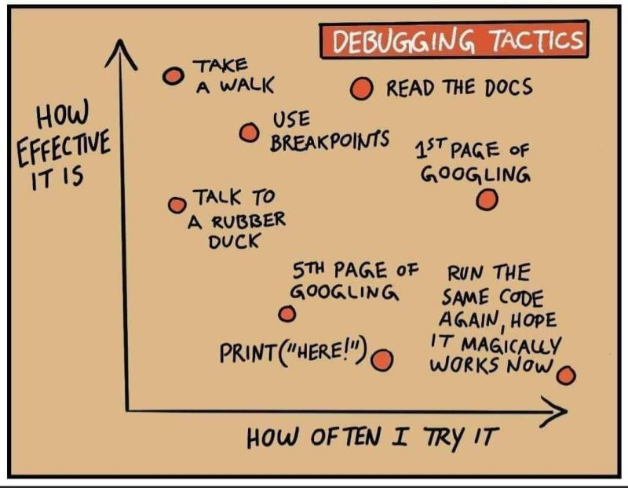

# TestOps and Continuous Testing
- [TestOps](#testops)
- [Continuous Testing in DevOps](#continuous-testing-in-devops)
- [Test Driven Development (TDD)](#test-driven-development-tdd)

## TestOps
- [devops.com: Shift-Right Testing: The Emergence of TestOps](https://devops.com/shift-right-testing-the-emergence-of-testops/)
- [devopsonline.co.uk: DevOps and the emergence of TestOps!](https://www.devopsonline.co.uk/devops-and-the-emergence-of-testops/)
- [opcito.com: TestOps: How to automate your software pipeline at the speed of DevOps](https://www.opcito.com/blogs/testops-how-to-automate-your-software-pipeline-at-the-speed-of-devops)

## Continuous Testing in DevOps
- [TestOps at the Speed of DevOps. Is DevOps killing Testing and QA or making it more important than ever?](https://www.linkedin.com/pulse/testops-speed-devops-chaitanya-jawale/)
- [guru99.com: What is Continuous Testing in DevOps? Definition, Benefits, Tools](https://www.guru99.com/continuous-testing.html)
- [xeridia.co.uk: The Importance of Testing in DevOps](https://www.xeridia.co.uk/blog/importance-testing-devops)

## Test Driven Development (TDD)
- [guru99.com: What is Test Driven Development (TDD)? Tutorial with Example](https://www.guru99.com/test-driven-development.html)

